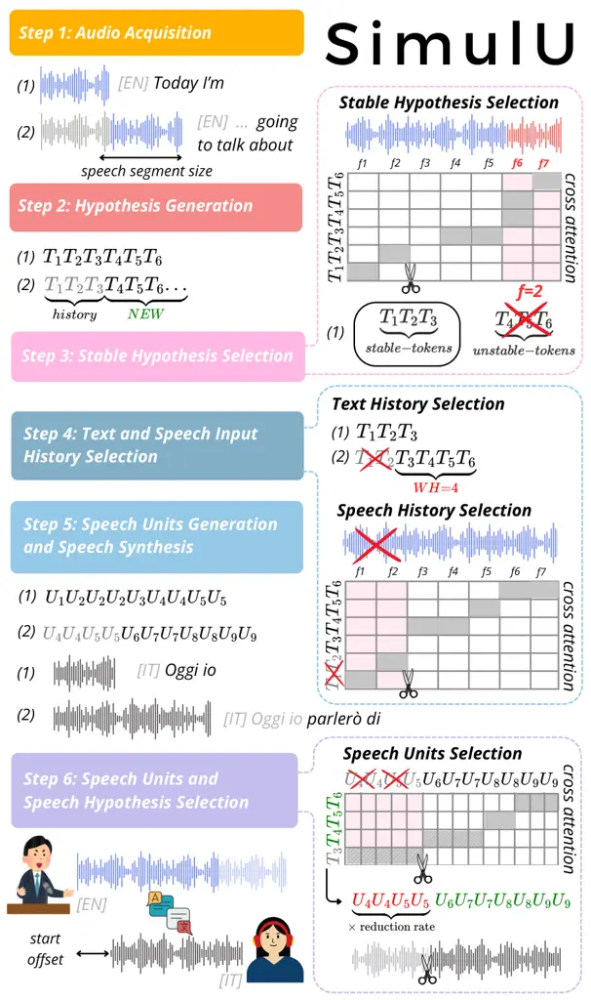
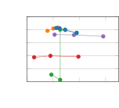
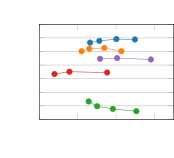
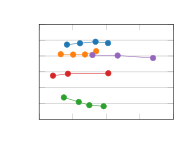
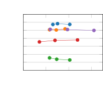
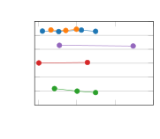
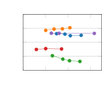
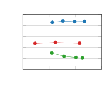
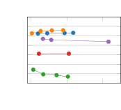

Djanibekov Bentivogli Negri Papi

# SimulU: Training-free Policy for Long-form Simultaneous Speech-to-Speech Translation

Amirbek    Luisa    Matteo    Sara

###### Abstract

Simultaneous speech-to-speech translation (SimulS2S) is essential for
real-time multilingual communication, with increasing integration into
meeting and streaming platforms. Despite this, SimulS2S remains
underexplored in research, where current solutions often rely on
resource-intensive training procedures and operate on short-form,
pre-segmented utterances, failing to generalize to continuous speech. To
bridge this gap, we propose SimulU, the first training-free policy for
long-form SimulS2S. SimulU adopts history management and speech output
selection strategies that exploit cross-attention in pre-trained
end-to-end models to regulate both input history and output generation.
Evaluations on MuST-C across 8 languages show that SimulU achieves a
better or comparable quality-latency trade-off against strong cascaded
models. By eliminating the need for ad-hoc training, SimulU offers a
promising path to end-to-end SimulS2S in realistic, long-form scenarios.

###### keywords

spoken translation, simultaneous processing, simultaneous
speech-to-text, long-form

^(†)^(†)address: ¹MBZUAI, United Arab Emirates  
²FBK, Italy ^(†)^(†)email: amirbek.djanibekov@mbzuai.ac.ae, spapi@fbk.eu

## 1 Introduction

Speech-to-speech (S2S) technology represents a high-potential direction
for enhancing natural and seamless human-computer interaction \[1, 2\],
enabling end-to-end spoken communication across languages and modalities
\[3\]. Within this context, simultaneous translation (a.k.a.
simultaneous interpretation) extends the S2S paradigm by requiring a
system to generate translated speech incrementally as the input stream
is received. This setup mandates a real-time decision-making policy to
balance the trade-off between reading new input and writing output based
on partial information, often under acoustic and linguistic uncertainty.
The optimal design of such a simultaneous policy is further complicated
for long-form inputs, where simultaneous S2S translation (SimulS2ST)
operates on continuous, unsegmented speech streams rather than
pre-segmented utterances.

The SimulS2ST policy is usually learned during complex training
pipelines. For instance, \[4\] jointly optimizes four distinct
objectives, while \[5\] adopts a two-stage procedure incorporating a
large language model \[6\]. More recent approaches, such as \[7\]
and \[8\], further introduce reinforcement learning to refine policy
learning. Additionally, the training process is compounded by the need
for large-scale speech data \[9\]. The limited availability of
word-level aligned corpora necessitates the use of synthetic datasets,
where alignments are automatically generated through hand-crafted
heuristics \[9, 8\] (e.g., natural pauses). Standard approaches
typically use cascaded pipelines that include speech-to-text translation
(S2TT) and text-to-speech (TTS) components \[10, 11\]. However, cascaded
systems have several problems. First, they are subject to compounding
errors due to combining separately trained models \[12\]. Second, as
input speech goes through the text bottleneck, the non-linguistic
information it carries (e.g., speaker identity, prosody) is lost and
cannot be transferred to the output speech \[13\]. Finally, cascaded
pipelines are inherently disadvantaged in latency-critical settings, as
each component must complete its processing before the next can begin,
making such systems less suited for simultaneous translation. In
addition, most existing works evaluate SimulS2ST in a short-form setting
\[14, 5\], relying on test sets inherited from offline scenarios where
input audio is pre-segmented (often manually) into fixed-length chunks
(typically up to 30 seconds). This setup constrains systems to operate
within predefined boundaries, limiting their ability to handle
long-form, continuous speech and diverging from more realistic
deployment conditions \[15\].

To fill these gaps, we propose SimulU, the first training-free
simultaneous policy for long-form end-to-end speech-to-speech
translation. Building on the recent success of exploiting attention
scores for guiding simultaneous S2TT inference \[16\], we propose
leveraging cross-attention not only to decide what and when to emit a
partial spoken translation, but also to determine which contextual
history–both from the received speech input and the generated output–to
retain, thereby enabling long-form speech generation. These decisions
are made solely based on the internal knowledge of pre-existing models
that natively incorporate attention mechanisms, without requiring
retraining or adaptation. SimulU eliminates the need for costly ad-hoc
training procedures while addressing the read/write decision problem
directly in an end-to-end setting. We showcase our proposed policy by
applying it to a strong offline pretrained model, SeamlessM4T \[17\],
and comparing it against strong baselines built on state-of-the-art ASR,
S2TT, and TTS components across all 8 languages of MuST-C v1.0 \[18\].
Our method achieves the best quality-latency trade-off in most settings,
providing the first promising step in the training-free policy research
for long-form speech-to-speech translation.

## 2 Methodology

Figure 1: SimulU Overview. The incoming speech input, here in English,
is represented by the blue waveform, while the speech output, here in
Italian, is represented by the black waveform.

SimulU is a simultaneous policy that implements history management and
speech output selection for direct SimulS2ST based on internal knowledge
of the system, in particular, the cross-attention scores. The policy is
applied to the SeamlessM4T S2ST model, which employs a speech-to-text
module, a text-to-unit module, and a vocoder (more details on the SimulU
backbone can be found in Section 3.3) that were jointly trained for
offline end-to-end S2ST.

Without requiring additional training or adaptation, SimulU repurposes
attention-based offline models (here SeamlessM4T) for simultaneous
generation, a process frequently referred to as onlinization \[19, 20\].
Its workflow follows a six-step policy, illustrated in Figure 1 and
detailed below:

1.  1.  Audio Acquisition: the incoming speech input, divided in chunks with
        size speech segment size, is incrementally added to the speech
        history.
2.  2.  Hypothesis Generation: the content of the speech history is provided
        to the speech-to-text module to generate intermediate textual
        representations.
3.  3.  Stable Hypothesis Selection: the intermediate textual representation
        is selected to be given as context to Step 5 based on speech-text
        cross-attention scores following \[21\], which stops the hypothesis
        emission as soon as a token is aligned (i.e., having the maximum
        attention score) with one of the unstable audio frames (i.e., the
        lastly received speech frames); the unstable audio frames,
        hereinafter cut-off frame defined by the $`f`$ hyperparameter (and
        equal to $`2`$ in Figure 1), control the latency of the system.
4.  4.  Text and Speech Input History Selection: to allow for long-form
        speech processing, both text history and speech history (at input
        only) have to be selected to maintain a context that is manageable
        by the model. To this aim, we preserve a fixed number of words,
        hereinafter $`WH`$ (equal to $`4`$ in Figure 1) in the text history,
        following \[16\], and exploit speech-text cross-attention scores
        again to select the audio frames corresponding to the discarded text
        history (equal to $`2`$ in Figure 1), which are removed from the
        speech history to always keep the text and speech content aligned.
5.  5.  Speech Units Generation and Speech Synthesis: the intermediate
        textual representation is provided to the text-to-unit module and,
        consequently, to the vocoder to generate the output speech; the
        whole text history is provided in this phase, as we found it
        dramatically improves the synthesized speech.
6.  6.  Speech Units and Speech Hypothesis Selection: the text-unit
        cross-attention is leveraged in the final step, which is in charge
        of selecting the part of the output speech that corresponds to the
        newly generated hypothesis; by taking the maximum attention scores
        (similar to Step 3 and 4), the intermediate textual representation
        is aligned with the corresponding units, and the units assigned to
        the text history but the new hypothesis ($`T_{3}`$ in Figure 2) are
        discarded; the number of discarded units is then multiplied by the
        reduction rate of SeamlessM4T (i.e., $`320`$) to retrieve the part
        of the synthesized waveform to be cut from the output speech. The
        resulting partial waveform is emitted.

## 3 Experimental Settings

|     |                  |        |        |                   |       |        |        |                   |       |        |        |                   |       |        |        |                   |       |        |        |
| --- | ---------------- | ------ | ------ | ----------------- | ----- | ------ | ------ | ----------------- | ----- | ------ | ------ | ----------------- | ----- | ------ | ------ | ----------------- | ----- | ------ | ------ |
|     | Word History = 5 |        |        | Word History = 10 |       |        |        | Word History = 15 |       |        |        | Word History = 20 |       |        |        | Word History = 25 |       |        |        |
|     | ASR              | Start  | End    |                   | ASR   | Start  | End    |                   | ASR   | Start  | End    |                   | ASR   | Start  | End    |                   | ASR   | Start  | End    |
|     | BLEU             | Offset | Offset |                   | BLEU  | Offset | Offset |                   | BLEU  | Offset | Offset |                   | BLEU  | Offset | Offset |                   | BLEU  | Offset | Offset |
| 2   | 17.97            | 0.90   | 77.24  |                   | 18.56 | 0.90   | 128.68 |                   | 19.38 | 0.90   | 161.47 |                   | 16.60 | 0.90   | 187.27 |                   | 13.63 | 0.90   | 183.51 |
| 4   | 16.93            | 1.36   | 51.18  |                   | 23.04 | 1.24   | 147.60 |                   | 18.65 | 1.36   | 151.84 |                   | 18.15 | 1.36   | 240.88 |                   | 12.73 | 1.36   | 202.10 |
| 6   | 16.54            | 1.72   | 55.95  |                   | 18.85 | 1.72   | 131.39 |                   | 20.32 | 1.72   | 179.22 |                   | 17.87 | 1.72   | 256.14 |                   | 11.37 | 1.72   | 184.63 |
| 8   | 18.38            | 1.77   | 46.78  |                   | 17.64 | 1.77   | 121.12 |                   | 20.12 | 1.77   | 189.09 |                   | 18.25 | 1.77   | 263.51 |                   | 11.37 | 1.77   | 173.28 |

Table 1: ASR-BLEU scores for different Word History ($`WH`$)
configurations (5-25) across combinations of cut-off frame $`f`$ (2, 4,
6, 8).

### 3.1 Data

To be comparable with previous S2TT works \[16, 22\], we evaluated on
all languages of MuST-C v1.0 \[18\], English (en) to Dutch (nl), French
(fr), German (de), Italian (it), Portuguese (pt), Russian (ru), Romanian
(ro), Spanish (es). We simulate streaming conditions by providing the
entire TED Talks from the MuST-C dev and tst-COMMON set as input. The
average durations for development and test sets are 948 seconds (15.7
minutes) and 650 seconds (10.8 minutes), respectively.

### 3.2 Metrics

We follow the settings from the IWSLT 2023 evaluation campaign on
simultaneos speech-to-speech translation \[23\], which measures both
quality and latency using SimulEval \[24\]. For quality, BLEU
score \[25\] is computed on the transcripts obtained with the
Canary \[26\] model on the translated output speech. We use Canary over
Whisper \[27\] because we empirically found that Canary handles long
speech better than Whisper. Additionally, we applied the Whisper text
normalizer before computing the BLEU score. For latency, we report
StartOffset following IWSLT 2023 settings (negative results are
excluded, as they are due to misalignment). It is measured in seconds
and represents the minimum amount of source input that must be observed
before the system emits the first target output. A graphical
representation is provided in Figure 1.

### 3.3 Models

SimulU Backbone. We employ the SeamlessM4T model
(SeamlessM4T-medium-v1¹¹ 1
[https://huggingface.co/facebook/hf-seamless-m4t-medium](https://huggingface.co/facebook/hf-seamless-m4t-medium)),
a series of transformer encoder-decoder architecture \[17\] for
translation. The S2T model uses 2 frame stacking, 256k word-piece
tokenization, and supports around 100 languages, resulting in $`\sim`$1B
total parameters. The model takes a mel-spectrogram with a hop size of
160 as input and produces tokenized text as output. The speech encoder
follows the w2v-BERT \[28\] framework and consists of 12 Conformer
layers, totaling approximately 300 million parameters. For the text
decoder, SeamlessM4T adopts the NLLB \[29\] decoder trained on around
100 languages, rather than the 200 languages used in the original NLLB
study. Additionally, the NLLB text encoder is employed for knowledge
distillation, aligning the speech encoder’s representations with the
text embedding space using the SONAR \[30\] alignment score. The TTS
employs a transformer encoder–decoder (170M parameters) that produces
speech units at 50Hz. It outputs discrete speech units derived from
XLS-R-1B 35th layer representations \[31\] using (k)-means clustering,
and uses a specially designed interleaving between speech encoded
representation and decoded translation text. Finally, the generated
speech units are sent to a unit-vocoder, which is a multilingual
HiFi-GAN \[32\] unit that synthesizes speech from those units.

To determine optimal parameter setting for the word history of SimulU,
we did preliminary experiments on the MuST-C dev set in the en-de
direction. The results are shown in Table 1. Overall, the SimulU
configuration using a word history of $`10`$ yields results that are
better than or on par with the others, while keeping the history
relatively short, and therefore used throughout the rest of the paper.

Baselines. We developed four strong cascade approaches based on
state-of-the-art training-free S2TT policies, StreamAtt \[16\] and
LocalAgreement (LA \[33\]), which are then coupled with existing TTS
models for the speech generation part:

- •
  StreamAtt+SeamTTS is based on StreamAtt \[16\], which enables
  long-form S2TT by leveraging cross-attention between speech and
  generated text to both guide simultaneous inference and history
  management; the partial generated text is then given to the
  SeamlessM4T TTS model (Seam.TTS), which is based on the
  unit-generation architecture of UnitY \[34\] for the speech
  generation. This baseline directly compares the cascaded approach to
  the end-to-end SimulU approach within the same model, highlighting the
  performance difference under the same data and architecture.
- •
  StreamAtt+XTTS-v2 is a cascade approach made of the state-of-the-art
  S2TT policy, StreamAtt, and the strongest multilingual TTS system that
  supports 17 languages, except Romanian, achieving the best result on
  the TTS Arena ²² 2
  [https://huggingface.co/spaces/TTS-AGI/TTS-Arena](https://huggingface.co/spaces/TTS-AGI/TTS-Arena)
  (best multilingual TTS results after monolingual-English
  KokoroTTS \[35\] and Fish Speech \[36\]). This system is considered an
  upperbound of the TTS performance, as shown in Table 2, where XTTSv2
  achieves WER and CER scores from 4 to 10 times lower (hence, better)
  than Seam.TTS, while being comparable or slightly worse regarding
  naturalness (UTMOS \[37\] from VoiceMOS challenge).
- •
  LA+Seam.TTS is a baseline system derived from the IWSLT 2025
  simultaneous Speech-to-Text evaluation campaign \[38\]. It uses Local
  Agreement (LA) for the STT part, which compares consecutive chunk
  outputs and emits only the longest common prefix between the current
  chunk and the previous chunk’s output, ensuring stable hypothesis
  emission. To allow for long-form processing, silero VAD \[39\] is used
  to segment the continuous stream of audio into shorter segments of
  about 15-30s, with a maximum unvoiced interval of 20 seconds and a
  voice threshold of 0.1, suitable for standard S2TT model, and the
  memory is reset between segments. In this version, Seam.TTS is used as
  the TTS component.
- •
  LA+XTTS-v2, similar to LA+Seam.TTS, couples the LA policy but replaces
  Seam.TTS with XTTS-v2 model for the TTS component.

For the StreamAtt-based cascades, the latency is controlled by the
cut-off frame (spanning 2, 4, 6, and 8), while for the LA-based
cascades, by the speech segment size (spanning 0.5, 1.0, 1.5, and 2.0
seconds). Default decoding parameters are used for all models (e.g. num.
beams for Seam.TTS is 1).

## 4 Results

Figure 2: ASR-BLEU and Start Offset scores across different systems for
each language pair of MuST-C v1 tst-COMMON.

| TTS sys. | Metric        | de     | fr     | it     | nl     | pt     | es     | ru     | ro     |
| -------- | ------------- | ------ | ------ | ------ | ------ | ------ | ------ | ------ | ------ |
| Seam.TTS | WER (%)       | 41.77  | 35.28  | 39.03  | 40.81  | 43.29  | 34.59  | 46.89  | 40.15  |
|          | CER (%)       | 31.76  | 28.75  | 31.29  | 31.33  | 34.41  | 29.14  | 35.56  | 26.29  |
|          | UTMOS         | 2.82   | 2.60   | 3.63   | 3.50   | 3.87   | 3.60   | 3.32   | 3.83   |
|          | ($`\pm`$ std) | (0.32) | (0.35) | (0.34) | (0.27) | (0.33) | (0.33) | (0.41) | (0.29) |
| XTTS-v2  | WER (%)       | 9.789  | 14.02  | 10.25  | 10.19  | 6.24   | 3.93   | 9.78   | —      |
|          | CER (%)       | 7.70   | 10.60  | 7.85   | 7.00   | 3.17   | 2.38   | 6.49   | —      |
|          | UTMOS         | 2.77   | 2.53   | 2.71   | 2.94   | 2.83   | 2.66   | 2.87   | —      |
|          | ($`\pm`$ std) | (0.40) | (0.40) | (0.38) | (0.34) | (0.37) | (0.36) | (0.33) | —      |

Table 2: TTS results for the Seam.TTS and XTTS-v2 systems.

Figure 2 reports test-set performance of the proposed method, SimulU,
alongside the previously defined strong cascade systems (Section 3.3).
Detailed results for each language pair suggest that SimulU consistently
achieves the highest ASR-BLEU scores across six language directions (de,
fr, it, es, pt, and ro), while maintaining competitive performance in
the other ones (ru and nl), with always a reasonable latency (between 1
and 2 seconds in most cases) as measured by the start offset.³³ 3 Limits
of acceptability have been set at $`\sim`$2 seconds for the ear-voice
span depending on different conditions and language pairs \[40\]. As
shown, both SimulU and StreamAtt+XTTS-v2 outperform both LA-based
systems by a large margin (at least, 4-5 ASR-BLEU points at the same
latency), particularly in fr, pt, ro, and nl. The LA-based cascades span
a wide range of start offset (often between 1 and 3 seconds), and
increasing the speech segment size–hence, the available context–always
yields similar performance (e.g., in fr, it, pt, ro, nl). Replacing the
strong XTTS-v2 model (as attested by results in Table 2) with Seam.TTS,
as the TTS component in the cascades, leads to substantial quality
degradation, with ASR-BLEU scores oscillating between 5 and 10 with the
StreamAtt policy, indicating near-complete failure, and between 10 and
15 with the LA policy. A manual inspection suggests that this
degradation largely stems from Seam.TTS’s sensitivity to limited
context: when conditioned on partial sentences rather than complete ones
(as is typical in SimulS2ST settings), its synthesis quality
deteriorates markedly, while it is not the case for XTTS-v2.

We further examine the end-offset latency, defined as the time delay
between the end of the input speech stream and the generation of the
final speech output by the system. Table 3 reports the results for the
two best-performing systems, SimulU and StreamAtt+XTTS-v2 (SimulU and
StreamAtt+Seam.TTS for Romanian). Considering the average performance
across four cut-off frame settings for SimulU and across segment step
configurations for StreamAtt+XTTS-v2, we observe that systems with
comparable overall performance exhibit similar end-offset latency in de
and fr. However, for the other languages, SimulU achieves lower
end-offset latency values. Furthermore, the standard deviation under the
SimulU policy is smaller, indicating more stable latency behavior.

All in all, we can conclude that SimulU achieves the best quality
overall across the analyzed languages while maintaining the latency
between 1 and 2 seconds.

| System  | de      | fr      | it      | nl     | pt      | es      | ru     | ro     |
| ------- | ------- | ------- | ------- | ------ | ------- | ------- | ------ | ------ |
| SimulU  | 247     | 224     | 100     | 82     | 146     | 106     | 106    | 34     |
|         | \(137\) | \(132\) | \(6\)   | \(9\)  | \(6\)   | \(5\)   | \(13\) | \(2\)  |
| Top     | 246     | 224     | 262     | 40     | 251     | 217     | 68     | 58     |
| Cascade | \(137\) | \(132\) | \(122\) | \(44\) | \(123\) | \(124\) | \(62\) | \(52\) |

Table 3: End Offset in milliseconds (mean and std) for SimulU and the
top cascade for each language averaged across cutoff frame $`f`$ and
speech segment size, respectively.

## 5 Conclusions

In this work, we propose SimulU, the first training-free long-form
simultaneous speech-to-speech translation policy that exploits the
internal cross-attention of pre-trained end-to-end models to regulate
both input history and output generation dynamically. We evaluated its
performance across eight language pairs against strong cascade systems
combining top-performing existing solutions for streaming translation
and TTS systems. In these settings, SimulU yields strong results even
when compared with state-of-the-art cascades, demonstrating the
effectiveness of the proposed approach without requiring any additional
training, therefore offering a practical and competitive solution for
real-world simultaneous speech translation.

## 6 Acknowledgmements

This work has received funding from the European Union’s Horizon Europe
programme under grant agreement No. 101213369 (DVPS). The research was
conducted during an internship at FBK, which was facilitated by MBZUAI
Career Services, whose support we gratefully acknowledge. We also thank
Dr. Hanan Aldarmaki for supporting the main author through valuable
feedback and guidance.

## References

- \[1\] C. Munteanu, M. Jones, S. Oviatt, S. Brewster, G. Penn, S.
  Whittaker, N. Rajput, and A. Nanavati (2013) We need to talk: hci and
  the delicate topic of spoken language interaction. In CHI’13 Extended
  Abstracts on Human Factors in Computing Systems, pp. 2459–2464. Cited
  by: §1.
- \[2\] C. Munteanu and G. Penn (2017) Speech-based interaction: myths,
  challenges, and opportunities. In Proceedings of the 2017 CHI
  Conference Extended Abstracts on Human Factors in Computing Systems,
  pp. 1196–1199. Cited by: §1.
- \[3\] Y. Jia, R. J. Weiss, F. Biadsy, W. Macherey, M. Johnson, Z.
  Chen, and Y. Wu (2019) Direct Speech-to-Speech Translation with a
  Sequence-to-Sequence Model. In Interspeech 2019, pp. 1123–1127.
  External Links:
  [Document](https://dx.doi.org/10.21437/Interspeech.2019-1951), ISSN
  2958-1796 Cited by: §1.
- \[4\] S. Zhang, Q. Fang, S. Guo, Z. Ma, M. Zhang, and Y. Feng (2024)
  Streamspeech: simultaneous speech-to-speech translation with
  multi-task learning. In Proceedings of the 62nd Annual Meeting of the
  Association for Computational Linguistics (Volume 1: Long Papers),
  pp. 8964–8986. Cited by: §1.
- \[5\] K. Deng, W. Chen, X. Chen, and P. Woodland (2025) SimulS2S-LLM:
  unlocking simultaneous inference of speech LLMs for speech-to-speech
  translation. In Proceedings of the 63rd Annual Meeting of the
  Association for Computational Linguistics (Volume 1: Long Papers), W.
  Che, J. Nabende, E. Shutova, and M. T. Pilehvar (Eds.), Vienna,
  Austria, pp. 16718–16734. External Links:
  [Link](https://aclanthology.org/2025.acl-long.817/),
  [Document](https://dx.doi.org/10.18653/v1/2025.acl-long.817), ISBN
  979-8-89176-251-0 Cited by: §1.
- \[6\] A. Grattafiori, A. Dubey, A. Jauhri, A. Pandey, A. Kadian, A.
  Al-Dahle, A. Letman, A. Mathur, A. Schelten, A. Vaughan, and A.
  Yang (2024) The llama 3 herd of models. External Links: 2407.21783,
  [Link](https://arxiv.org/abs/2407.21783) Cited by: §1.
- \[7\] S. Cheng, Y. Bao, Z. Huang, Y. Lu, N. Peng, L. Xu, R. Yu, R.
  Cao, Y. Du, T. Han, Y. Hu, Z. Li, S. Liu, S. Ma, S. Pan, J. Xiao, N.
  Xu, M. Yang, R. Ye, Y. Yu, J. Zhang, R. Zhang, W. Zhang, W. Zhu, L.
  Zou, L. Lu, Y. Wang, and Y. Wu (2025) Seed liveinterpret 2.0:
  end-to-end simultaneous speech-to-speech translation with your voice.
  External Links: 2507.17527, [Link](https://arxiv.org/abs/2507.17527)
  Cited by: §1.
- \[8\] T. Labiausse, R. Fabre, Y. Estève, A. Défossez, and N.
  Zeghidour (2026) Simultaneous speech-to-speech translation without
  aligned data. External Links: 2602.11072,
  [Link](https://arxiv.org/abs/2602.11072) Cited by: §1.
- \[9\] T. Labiausse, L. Mazaré, E. Grave, A. Défossez, and N.
  Zeghidour (2025) High-fidelity simultaneous speech-to-speech
  translation. In Forty-second International Conference on Machine
  Learning, External Links:
  [Link](https://openreview.net/forum?id=fgjN8B6xVX) Cited by: §1.
- \[10\] A. Lavie, A. Waibel, L. Levin, M. Finke, D. Gates, M.
  Gavalda, T. Zeppenfeld, and P. Zhan (1997) JANUS-III: speech-to-speech
  translation in multiple languages. In 1997 IEEE International
  Conference on Acoustics, Speech, and Signal Processing, Vol. 1,
  pp. 99–102. Cited by: §1.
- \[11\] S. Nakamura, K. Markov, H. Nakaiwa, G. Kikui, H. Kawai, T.
  Jitsuhiro, J. Zhang, H. Yamamoto, E. Sumita, and S. Yamamoto (2006)
  The ATR multilingual speech-to-speech translation system. IEEE
  Transactions on Audio, Speech, and Language Processing 14 (2),
  pp. 365–376. Cited by: §1.
- \[12\] M. Sperber and M. Paulik (2020) Speech translation and the
  end-to-end promise: taking stock of where we are. In Proceedings of
  the 58th Annual Meeting of the Association for Computational
  Linguistics, D. Jurafsky, J. Chai, N. Schluter, and J. Tetreault
  (Eds.), Online, pp. 7409–7421. External Links:
  [Link](https://aclanthology.org/2020.acl-main.661/),
  [Document](https://dx.doi.org/10.18653/v1/2020.acl-main.661) Cited by:
  §1.
- \[13\] I. Tsiamas, M. Sperber, A. Finch, and S. Garg (2024) Speech is
  more than words: do speech-to-text translation systems leverage
  prosody?. In Proceedings of the Ninth Conference on Machine
  Translation, B. Haddow, T. Kocmi, P. Koehn, and C. Monz (Eds.), Miami,
  Florida, USA, pp. 1235–1257. External Links:
  [Link](https://aclanthology.org/2024.wmt-1.119/),
  [Document](https://dx.doi.org/10.18653/v1/2024.wmt-1.119) Cited by:
  §1.
- \[14\] J. Zhao, N. Moritz, E. Lakomkin, R. Xie, Z. Xiu, K.
  Zmolikova, Z. Ahmed, Y. Gaur, D. Le, and C. Fuegen (2025) Textless
  streaming speech-to-speech translation using semantic speech tokens.
  In ICASSP 2025 - 2025 IEEE International Conference on Acoustics,
  Speech and Signal Processing (ICASSP), Vol. , pp. 1–5. External Links:
  [Document](https://dx.doi.org/10.1109/ICASSP49660.2025.10889740) Cited
  by: §1.
- \[15\] S. Papi, P. Polák, D. Macháček, and O. Bojar (2025) How “real”
  is your real-time simultaneous speech-to-text translation system?.
  Transactions of the Association for Computational Linguistics 13,
  pp. 281–313. External Links:
  [Link](https://aclanthology.org/2025.tacl-1.14/),
  [Document](https://dx.doi.org/10.1162/tacl%5Fa%5F00740) Cited by: §1.
- \[16\] S. Papi, M. Gaido, M. Negri, and L. Bentivogli (2024)
  StreamAtt: direct streaming speech-to-text translation with
  attention-based audio history selection. In Proceedings of the 62nd
  Annual Meeting of the Association for Computational Linguistics
  (Volume 1: Long Papers), L. Ku, A. Martins, and V. Srikumar (Eds.),
  Bangkok, Thailand, pp. 3692–3707. External Links:
  [Link](https://aclanthology.org/2024.acl-long.202/),
  [Document](https://dx.doi.org/10.18653/v1/2024.acl-long.202) Cited by:
  §1, item 4, 1st item, §3.1, §3.3.
- \[17\] S. Communication, L. Barrault, Y. Chung, M. C. Meglioli, D.
  Dale, N. Dong, P. Duquenne, H. Elsahar, H. Gong, K. Heffernan, J.
  Hoffman, C. Klaiber, P. Li, D. Licht, J. Maillard, A.
  Rakotoarison, K. R. Sadagopan, G. Wenzek, E. Ye, B. Akula, P.
  Chen, N. E. Hachem, B. Ellis, G. M. Gonzalez, J. Haaheim, P.
  Hansanti, R. Howes, B. Huang, M. Hwang, H. Inaguma, S. Jain, E.
  Kalbassi, A. Kallet, I. Kulikov, J. Lam, D. Li, X. Ma, R.
  Mavlyutov, B. Peloquin, M. Ramadan, A. Ramakrishnan, A. Sun, K.
  Tran, T. Tran, I. Tufanov, V. Vogeti, C. Wood, Y. Yang, B. Yu, P.
  Andrews, C. Balioglu, M. R. Costa-jussà, O. Celebi, M. Elbayad, C.
  Gao, F. Guzmán, J. Kao, A. Lee, A. Mourachko, J. Pino, S. Popuri, C.
  Ropers, S. Saleem, H. Schwenk, P. Tomasello, C. Wang, J. Wang, and S.
  Wang (2023) SeamlessM4T: massively multilingual & multimodal machine
  translation. External Links: 2308.11596,
  [Link](https://arxiv.org/abs/2308.11596) Cited by: §1, §3.3.
- \[18\] M. A. Di Gangi, R. Cattoni, L. Bentivogli, M. Negri, and M.
  Turchi (2019) MuST-C: a Multilingual Speech Translation Corpus. In
  Proceedings of the 2019 Conference of the North American Chapter of
  the Association for Computational Linguistics: Human Language
  Technologies, Volume 1 (Long and Short Papers), J. Burstein, C. Doran,
  and T. Solorio (Eds.), Minneapolis, Minnesota, pp. 2012–2017. External
  Links: [Link](https://aclanthology.org/N19-1202/),
  [Document](https://dx.doi.org/10.18653/v1/N19-1202) Cited by: §1,
  §3.1.
- \[19\] D. Macháček and P. Polák (2025) Simultaneous translation with
  offline speech and LLM models in CUNI submission to IWSLT 2025. In
  Proceedings of the 22nd International Conference on Spoken Language
  Translation (IWSLT 2025), E. Salesky, M. Federico, and A.
  Anastasopoulos (Eds.), Vienna, Austria (in-person and online),
  pp. 389–398. External Links:
  [Link](https://aclanthology.org/2025.iwslt-1.41/),
  [Document](https://dx.doi.org/10.18653/v1/2025.iwslt-1.41), ISBN
  979-8-89176-272-5 Cited by: §2.
- \[20\] P. Polák, N. Pham, T. N. Nguyen, D. Liu, C. Mullov, J.
  Niehues, O. Bojar, and A. Waibel (2022) CUNI-KIT system for
  simultaneous speech translation task at IWSLT 2022. In Proceedings of
  the 19th International Conference on Spoken Language Translation
  (IWSLT 2022), E. Salesky, M. Federico, and M. Costa-jussà (Eds.),
  Dublin, Ireland (in-person and online), pp. 277–285. External Links:
  [Link](https://aclanthology.org/2022.iwslt-1.24/),
  [Document](https://dx.doi.org/10.18653/v1/2022.iwslt-1.24) Cited by:
  §2.
- \[21\] S. Papi, M. Turchi, and M. Negri (2023) AlignAtt: Using
  Attention-based Audio-Translation Alignments as a Guide for
  Simultaneous Speech Translation. In Interspeech 2023, pp. 3974–3978.
  External Links:
  [Document](https://dx.doi.org/10.21437/Interspeech.2023-170), ISSN
  2958-1796 Cited by: item 3.
- \[22\] S. Ouyang, X. Xu, and L. Li (2025) InfiniSST: simultaneous
  translation of unbounded speech with large language model. In Findings
  of the Association for Computational Linguistics: ACL 2025, W. Che, J.
  Nabende, E. Shutova, and M. T. Pilehvar (Eds.), Vienna, Austria,
  pp. 3032–3046. External Links:
  [Link](https://aclanthology.org/2025.findings-acl.157/),
  [Document](https://dx.doi.org/10.18653/v1/2025.findings-acl.157), ISBN
  979-8-89176-256-5 Cited by: §3.1.
- \[23\] M. Agarwal, S. Agrawal, A. Anastasopoulos, L. Bentivogli, O.
  Bojar, C. Borg, M. Carpuat, R. Cattoni, M. Cettolo, M. Chen, W.
  Chen, K. Choukri, A. Chronopoulou, A. Currey, T. Declerck, Q. Dong, K.
  Duh, Y. Estève, M. Federico, S. Gahbiche, B. Haddow, B. Hsu, P. Mon
  Htut, H. Inaguma, D. Javorský, J. Judge, Y. Kano, T. Ko, R. Kumar, P.
  Li, X. Ma, P. Mathur, E. Matusov, P. McNamee, J. P. McCrae, K.
  Murray, M. Nadejde, S. Nakamura, M. Negri, H. Nguyen, J. Niehues, X.
  Niu, A. Kr. Ojha, J. E. Ortega, P. Pal, J. Pino, L. van der Plas, P.
  Polák, E. Rippeth, E. Salesky, J. Shi, M. Sperber, S. Stüker, K.
  Sudoh, Y. Tang, B. Thompson, K. Tran, M. Turchi, A. Waibel, M.
  Wang, S. Watanabe, and R. Zevallos (2023) FINDINGS OF THE IWSLT 2023
  EVALUATION CAMPAIGN. In Proceedings of the 20th International
  Conference on Spoken Language Translation (IWSLT 2023), E. Salesky, M.
  Federico, and M. Carpuat (Eds.), Toronto, Canada (in-person and
  online), pp. 1–61. External Links:
  [Link](https://aclanthology.org/2023.iwslt-1.1/),
  [Document](https://dx.doi.org/10.18653/v1/2023.iwslt-1.1) Cited by:
  §3.2.
- \[24\] X. Ma, M. J. Dousti, C. Wang, J. Gu, and J. Pino (2020)
  SIMULEVAL: an evaluation toolkit for simultaneous translation. In
  Proceedings of the 2020 Conference on Empirical Methods in Natural
  Language Processing: System Demonstrations, Q. Liu and D. Schlangen
  (Eds.), Online, pp. 144–150. External Links:
  [Link](https://aclanthology.org/2020.emnlp-demos.19/),
  [Document](https://dx.doi.org/10.18653/v1/2020.emnlp-demos.19) Cited
  by: §3.2.
- \[25\] K. Papineni, S. Roukos, T. Ward, and W. Zhu (2002) Bleu: a
  method for automatic evaluation of machine translation. In Proceedings
  of the 40th annual meeting of the Association for Computational
  Linguistics, pp. 311–318. Cited by: §3.2.
- \[26\] M. Sekoyan, N. R. Koluguri, N. Tadevosyan, P. Zelasko, T.
  Bartley, N. Karpov, J. Balam, and B. Ginsburg (2025) Canary-1b-v2 &
  parakeet-tdt-0.6 b-v3: efficient and high-performance models for
  multilingual asr and ast. arXiv preprint arXiv:2509.14128. Cited by:
  §3.2.
- \[27\] A. Radford, J. W. Kim, T. Xu, G. Brockman, C. McLeavey, and I.
  Sutskever (2023) Robust speech recognition via large-scale weak
  supervision. In International conference on machine learning,
  pp. 28492–28518. Cited by: §3.2.
- \[28\] Y. Chung, Y. Zhang, W. Han, C. Chiu, J. Qin, R. Pang, and Y.
  Wu (2021) W2v-bert: combining contrastive learning and masked language
  modeling for self-supervised speech pre-training. In 2021 IEEE
  Automatic Speech Recognition and Understanding Workshop (ASRU),
  pp. 244–250. Cited by: §3.3.
- \[29\] M. R. Costa-Jussà, J. Cross, O. Çelebi, M. Elbayad, K.
  Heafield, K. Heffernan, E. Kalbassi, J. Lam, D. Licht, J. Maillard, et
  al. (2022) No language left behind: scaling human-centered machine
  translation. arXiv preprint arXiv:2207.04672. Cited by: §3.3.
- \[30\] P. Duquenne, H. Schwenk, and B. Sagot (2023) SONAR:
  sentence-level multimodal and language-agnostic representations. arXiv
  preprint arXiv:2308.11466. Cited by: §3.3.
- \[31\] A. Babu, C. Wang, A. Tjandra, K. Lakhotia, Q. Xu, N. Goyal, K.
  Singh, P. von Platen, Y. Saraf, J. Pino, et al. (2022) XLS-r:
  self-supervised cross-lingual speech representation learning at scale.
  Interspeech 2022. Cited by: §3.3.
- \[32\] J. Kong, J. Kim, and J. Bae (2020) Hifi-gan: generative
  adversarial networks for efficient and high fidelity speech synthesis.
  Advances in neural information processing systems 33, pp. 17022–17033.
  Cited by: §3.3.
- \[33\] D. Liu, G. Spanakis, and J. Niehues (2020) Low-latency
  sequence-to-sequence speech recognition and translation by partial
  hypothesis selection. Interspeech 2020, pp. 3620–3624. Cited by: §3.3.
- \[34\] H. Inaguma, S. Popuri, I. Kulikov, P. Chen, C. Wang, Y.
  Chung, Y. Tang, A. Lee, S. Watanabe, and J. Pino (2023) UnitY:
  two-pass direct speech-to-speech translation with discrete units. In
  Proceedings of the 61st Annual Meeting of the Association for
  Computational Linguistics (Volume 1: Long Papers), A. Rogers, J.
  Boyd-Graber, and N. Okazaki (Eds.), Toronto, Canada, pp. 15655–15680.
  External Links: [Link](https://aclanthology.org/2023.acl-long.872/),
  [Document](https://dx.doi.org/10.18653/v1/2023.acl-long.872) Cited by:
  1st item.
- \[35\] Hexgrad (2025) Kokoro-82m (revision d8b4fc7). Hugging Face.
  External Links: [Link](https://huggingface.co/hexgrad/Kokoro-82M),
  [Document](https://dx.doi.org/10.57967/hf/4329) Cited by: 2nd item.
- \[36\] S. Liao, Y. Wang, T. Li, Y. Cheng, R. Zhang, R. Zhou, and Y.
  Xing (2024) Fish-speech: leveraging large language models for advanced
  multilingual text-to-speech synthesis. External Links: 2411.01156,
  [Link](https://arxiv.org/abs/2411.01156) Cited by: 2nd item.
- \[37\] T. Saeki, D. Xin, W. Nakata, T. Koriyama, S. Takamichi, and H.
  Saruwatari (2022) UTMOS: utokyo-sarulab system for voicemos challenge 2022. Interspeech 2022. Cited by: 2nd item.
- \[38\] I. Abdulmumin, V. Agostinelli, T. Alumäe, A. Anastasopoulos, L.
  Bentivogli, O. Bojar, C. Borg, F. Bougares, R. Cattoni, M. Cettolo, L.
  Chen, W. Chen, R. Dabre, Y. Estève, M. Federico, M. Fishel, M.
  Gaido, D. Javorský, M. Kasztelnik, F. Kponou, M. Krubiński, T. Kin
  Lam, D. Liu, E. Matusov, C. Kumar Maurya, J. P. McCrae, S.
  Mdhaffar, Y. Moslem, K. Murray, S. Nakamura, M. Negri, J. Niehues, A.
  Kr. Ojha, J. E. Ortega, S. Papi, P. Pecina, P. Polák, P. Połeć, A.
  Sankar, B. Savoldi, N. Sethiya, C. Sikasote, M. Sperber, S. Stüker, K.
  Sudoh, B. Thompson, M. Turchi, A. Waibel, P. Wilken, R. Zevallos, V.
  Zouhar, and M. Züfle (2025) Findings of the IWSLT 2025 evaluation
  campaign. In Proceedings of the 22nd International Conference on
  Spoken Language Translation (IWSLT 2025), E. Salesky, M. Federico,
  and A. Anastasopoulos (Eds.), Vienna, Austria (in-person and online),
  pp. 412–481. External Links:
  [Link](https://aclanthology.org/2025.iwslt-1.44/),
  [Document](https://dx.doi.org/10.18653/v1/2025.iwslt-1.44), ISBN
  979-8-89176-272-5 Cited by: 3rd item.
- \[39\] S. Team (2024) Silero vad: pre-trained enterprise-grade voice
  activity detector (vad), number detector and language classifier.
  GitHub. Note:
  [https://github.com/snakers4/silero-vad](https://github.com/snakers4/silero-vad)
  Cited by: 3rd item.
- \[40\] A. Chmiel, A. Szarkowska, D. Koržinek, A. Lijewska, Ł. Dutka,
  Ł. Brocki, and K. Marasek (2017) Ear–voice span and pauses in intra-
  and interlingual respeaking: an exploratory study into temporal
  aspects of the respeaking process. Applied Psycholinguistics 38,
  pp. 1–27. External Links:
  [Document](https://dx.doi.org/10.1017/S0142716417000108) Cited by:
  footnote 3.
