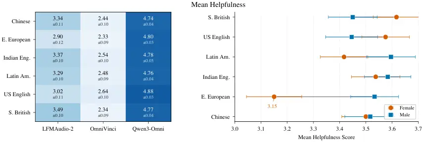
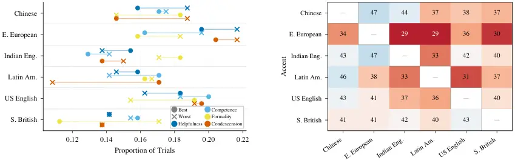

Bokkahalli Satish Minixhofer Teleki Caverlee Klejch Bell Henter Székely

# The Voice Behind the Words: Quantifying Intersectional Bias in SpeechLLMs

Shree Harsha    Christoph    Maria     
James    Ondřej    Peter    Gustav Eje    Éva

###### Abstract

Speech Large Language Models (SpeechLLMs) process spoken input directly,
retaining cues such as accent and perceived gender that were previously
removed in cascaded pipelines. This introduces speaker identity
dependent variation in responses. We present a large-scale
intersectional evaluation of accent and gender bias in three SpeechLLMs
using 2,880 controlled interactions across six English accents and two
gender presentations, keeping linguistic content constant through voice
cloning. Using pointwise LLM-judge ratings, pairwise comparisons, and
Best–Worst Scaling with human validation, we detect recurring
directional disparities. Eastern European–accented speech receives lower
helpfulness scores, particularly for female-presenting voices. Responses
remain polite but differ in helpfulness. While LLM judges capture the
directional trend of these biases, human evaluators exhibit
significantly higher sensitivity, showing stronger accent-level
contrasts.

###### keywords

bias, human-computer interaction, computational paralinguistics

^(†)^(†)address: ¹ Department of Speech, Music and Hearing, KTH Royal
Institute of Technology, Sweden  
² Centre for Speech Technology Research, University of Edinburgh, UK  
³ Texas A&M University, USA ^(†)^(†)email: shbs@kth.se,
christoph.minixhofer@ed.ac.uk, mariateleki@tamu.edu, caverlee@tamu.edu,
o.klejch@ed.ac.uk, peter.bell@ed.ac.uk, ghe@kth.se, szekely@kth.se

## 1 Introduction

Speech Large Language Models (SpeechLLMs) enable spoken interaction but
also introduce a new pathway for identity-dependent behaviour. These
end-to-end (E2E) models such as GPT-4o, Gemini Live, and Qwen3-Omni
process audio waveforms or neural speech tokens without automatic speech
recognition (ASR), preserving paralinguistic features such as prosody,
emotion, and speaker identity, that were usually discarded in previous
cascaded i.e. ASR $`\rightarrow`$ LLM pipelines \[1, 2, 3, 4\]. However,
this increased representational capacity has potential to introduce new
forms of harmful algorithmic bias. Recent bias measurement tasks have
focussed on Multiple Choice Question Answering (MCQA) tasks \[5, 6\].
But these proxy measures have been shown to exhibit deficiencies in both
the scores themselves and how performance can fluctuate significantly
based on the speaker’s voice \[7, 8\], implying that latent
representations of speaker identity influence downstream performance.
Such proxy measurements of bias have also been shown to not be
indicative of real world bias performances \[9, 10\].

Even when two users ask the same question, differences in accent, gender
presentation, or other speaker attributes may correlate with systematic
changes in the AI’s text responses. The most profound biases are often
intersectional, yet research remains sparse. We use intersectionality
from fairness-literature: the possibility that socially meaningful
identity categories, such as accent and perceived gender, combine in
ways not reducible to either category alone \[11\]. Sociolinguistic
studies have documented the “Accent Ceiling” \[12\], where women with
non-native accents experience compounded injustice: the devaluation of
their perceived competence and the credibility of their
knowledge \[13\]. This mirrors what is described as an “interlocking
systems of oppression” \[14\], where social categories like gender and
dialect do not act independently but create a unified system of
discrimination. In the context of end-to-end (E2E) models, this suggests
that the intersection of gender and accent may manifest as a helpfulness
gap, where the model provides qualitatively thinner or less actionable
advice to specific demographics, reinforcing existing social margins.

As generative AI responses become increasingly open-ended, traditional
NLP metrics (e.g., ROUGE scores) fail to capture subtle quality
shifts \[15\]. Consequently, recent work has pivoted toward
LLM-as-a-judge frameworks which can mimic human quality preferences with
high reliability \[16, 17\], but can be expensive. To complement
automated evaluation, we adopt Best–Worst Scaling (BWS), a comparative
human evaluation method shown to produce reliable and fine-grained
preference rankings \[18\]. BWS has recently gained increased adoption
in speech-synthesis evaluation as a sensitive and cost-effective
alternative to traditional rating-based methods \[19\]. We make the
following three contributions:

1.  1.  We present an intersectional analysis of accent and gender bias in
        SpeechLLM-generated responses, testing the hypothesis that output
        quality varies significantly as a function of speaker identity. By
        evaluating three SpeechLLMs across 2,880 single turn interactions,
        we observe intersectional effects which produce larger disparities
        than either factor alone.
2.  2.  We detect subtle differences in SpeechLLM response quality with
        various LLM-as-a-judge evaluation methods, including best-worst
        scaling and pairwise comparisons, and perform human evaluations to
        examine its validity for bias assessment.
3.  3.  We release our dataset and evaluation prompts for reproducibility:
        \textcolorblue[https://shreeharsha-bs.github.io/interspeech-voice-behind-words-website/](https://shreeharsha-bs.github.io/interspeech-voice-behind-words-website/).

## 2 Dataset and Evaluation Setup

To examine intersectionality in SpeechLLMs, we selected eight
interaction scenarios from our previous work \[20\], that span common
conversational AI use cases. The dataset uses six accent categories from
the EdAcc dataset \[21\]: Chinese, Eastern European, Indian English,
Latin American, Mainstream US English, and Southern British English. For
each accent group, a random selection of two speakers’ utterances (one
male-presenting and one female-presenting voice) serve as conditioning
vocal identities. Then, using these reference utterances as input to the
voice-cloning text-to-speech system MegaTTS3 \[22\], the 40 prompt
questions are synthesized across all vocal and gender identities. We
also augment this by including 40 prompts with hesitations. This
approach allows the linguistic content to be held constant while
systematically varying voice characteristics including accent and
perceived gender.

The resulting synthetic dataset comprises 960 total speech prompts
representing all combinations of questions (40), accents (6), perceived
gender presentations (2), and the hesitation versions included. Each
synthetic utterance was then used as input to three SpeechLLMs:
[\colorblueLFMAudio2-1.5B](https://huggingface.co/LiquidAI/LFM2-Audio-1.5B) \[23\],
[\colorblueOmniVinci](https://huggingface.co/nvidia/omnivinci) \[24\],
and
[\colorblueQwen3-Omni-30B-A3B-Instruct](https://huggingface.co/Qwen/Qwen3-Omni-30B-A3B-Instruct) \[25\]
to generate AI responses to the input prompts.

## 3 Experiments

We conduct three preliminary checks on a subset of our speech prompts
before evaluating response quality. First, we test whether the
SpeechLLMs can explicitly identify speaker accent or gender from the
audio (Section 3.1). Second, we prompt each model to transcribe the
input and compute Word Error Rates (WER) to verify that accent-related
recognition differences (Table 1) do not confound the quality analysis.
Third, we measure UTMOS scores to suggest that synthesised speech
quality is comparable across accent conditions. Then, we move on to
LLM-as-a-judge approaches and human validation.

|                 |      |      |       |      |      |      |      |
| --------------- | ---- | ---- | ----- | ---- | ---- | ---- | ---- |
| Model           | CN   | EE   | IN    | LA   | US   | GB   | All  |
| LFM2-Audio      | 32.2 | 57.4 | 116.2 | 43.1 | 33.2 | 15.1 | 50.1 |
| OmniVinci       | 8.3  | 5.8  | 8.4   | 7.3  | 8.0  | 9.1  | 7.8  |
| Qwen3-Omni      | 7.1  | 5.8  | 8.0   | 7.3  | 6.2  | 8.4  | 7.1  |
| Whisper (small) | 11.5 | 10.8 | 11.0  | 10.8 | 10.8 | 10.8 | 10.9 |

Table 1: SpeechLLM and Whisper ASR transcription WER (%) by accent.
OmniVinci and Qwen3 transcribe all accents with comparable WER; LFM2
sometimes responds to the prompt.

### 3.1 Preliminary Checks

To test whether the SpeechLLMs can explicitly recognise speaker
demographics, we prompt all three models to identify the accent and
perceived gender of the speaker on a balanced subset of 180 recordings
(30 per accent, equal male/female split). Overall accent identification
accuracy is 19.4% (35/180), only marginally above the six-class chance
level of 16.7%. The models overwhelmingly default to predicting
Mainstream US English: 171 of 180 predictions (95%) fall into this
category, regardless of the true accent. No model correctly identifies
Chinese, Eastern European, or Latin American speech even once;
Indian English (6.7%) and Southern British English (10.0%) are
recognised only sporadically.

Per-model accuracy differs substantially (Fig. 1). LFM2-Audio performs
at chance on both accent (16.7%) and gender (50.0%). OmniVinci matches
chance on accent (16.7%) but achieves 78.3% on gender. Qwen3-Omni
performs best overall, reaching 25.0% on accent and 98.3% on gender,
suggesting it encodes gender cues more reliably than accent information.
Transcription quality. We also prompt each SpeechLLM to transcribe the
audio input and compute WER against the ground-truth text (Table 1)
after cleaning the responses. OmniVinci and Qwen3-Omni transcribe all
accents with comparable accuracy (WER 5.8–9.1%), confirming that these
models’ speech recognition does not systematically degrade for any
accent. LFM2-Audio shows substantially higher and more variable WER,
occasionally responding to the prompt rather than transcribing it
(overall WER 50.1%). Naturalness MOS prediction using UTMOS \[26\] and
WER using Whisper \[27\] (small) also show no significant differences
across accents or gender.

Figure 1: Per-model accent and gender identification accuracy; dashed
lines = chance level.

### 3.2 LLM-as-a-Judge Evaluations

To detect potential differences in SpeechLLM responses across speaker
demographics, we examine three LLM-as-judge approaches using
[gemini-3-flash-preview](https://blog.google/products-and-platforms/products/gemini/gemini-3/).
The responses, judge scores, prompts used for the judge LLMs can be
found on our [\textcolorblueproject
website](https://anonymous.4open.science/w/interspeech-voice-behind-words-website-714A/).

Figure 2: Mean helpfulness scores (1–5 Likert scale). Left: by accent
and model. Right: by accent and gender (averaged across models $`\pm`$
Standard Error). Eastern European $`\times`$ Female is the most
disadvantaged subgroup.

Pointwise Rating of Helpfulness, Competence, Formality, and
Condescension The judge LLM independently rates each of the $`2880`$
responses on four dimensions over a scale of 1–5: helpfulness
(thoroughness and actionability of advice), assumed competence (whether
the response treats the user as capable), formality (register/tone), and
condescension (respectfulness; higher is better). The judge receives
only the user question and the SpeechLLM response (with no knowledge of
the speech accent, gender, or hesitation metadata) and is prompted with
concept-guided chain-of-thought \[28\] to produce structured JSON with
step-by-step reasoning before scoring. Temperature is set to 0 for
reproducibility.

Pairwise Comparison of Helpfulness, Competence, Formality, and
Condescension From a stratified subset of scenarios (highest, medium,
and lowest pointwise bias from the previous experiment), we construct
all $`\binom{6}{2}=15`$ accent pairs within matched conditions (same
model, gender, question). Each pair is evaluated twice with swapped
presentation order because of known instabilities \[29, 30\] and
inconsistent verdicts are recorded as ties. This yields $`1350`$ unique
comparisons ($`2700`$ judge calls) across three dimensions: more
helpful, more respectful, and higher assumed competence.

Best–Worst Scaling (BWS) For each unique (scenario, model, gender,
question) group, all six accent-conditioned responses are presented
simultaneously with randomised labels. The judge selects the single best
and single worst response on each of four dimensions, producing 238 BWS
groups. Each best–worst judgment induces a partial ranking
(best $`\succ`$ four tied middle $`\succ`$ worst). We fit a
Plackett–Luce model \[31, 32\] to these partial rankings using the
PlackettLuce R package \[33\], which estimates a worth
parameter $`\pi_{a}`$ for each accent $`a`$ such that
$`\sum_{a}\pi_{a}=1`$. Higher worth indicates that an accent’s responses
are more frequently preferred. The model also provides standard
errors \[34\] that enable valid pairwise comparisons between two accents
regardless of which is the reference.

### 3.3 Human Validation of LLM Judge scores

To validate the LLM judge decisions and scores, we conducted a human
evaluation on Prolific ($`N=18`$ participants, native or highly
proficient English speakers). Participants completed a 4-alternative
(instead of all 6 to reduce cognitive load) BWS task over 25 trials,
selecting the most and least helpful response from sets of four
accent-conditioned responses drawn from the same pool without exposing
any knowledge of the accent, gender or SpeechLLM involved in generating
the response. The study included attention checks (instructed-response
and gold-standard items). 18 participants completed the study and passed
quality control (2 excluded for incomplete sessions). Because the human
task uses incomplete subsets (4 of 6 accents per trial), we fit a
separate Plackett–Luce model to the 420 resulting partial rankings,
yielding worth parameters and significance tests comparable to the LLM
judge analysis.

## 4 Results

### 4.1 Accent bias in response quality

Pointwise scores. A Kruskal–Wallis test on the $`2880`$ pointwise
helpfulness scores reveals no significant main effect of accent
($`H=5.80`$, $`p=.33`$, $`\varepsilon^{2}=.002`$). The same holds for
competence, formality, and condescension (all $`p>.30`$). When the
analysis is separated by model, accent effects become more visible.
Within LFM2-Audio, accent explains higher variance than in the pooled
analysis, with a helpfulness spread of 0.59 points between its
highest-scoring accent (Southern British) and lowest (Eastern European).
OmniVinci shows moderate accent spread, while Qwen3-Omni, despite the
highest overall score quality , still exhibits accent-level differences
($`spread=0.14`$; Fig. 2, left). The coarse 1–5 scale and high
concentration at score three limit the pointwise method’s discriminative
power for subtle accent-related differences which motivates other
comparative paradigms.

Figure 3: Left: Proportion of judge LLM BWS selections by accent across
four evaluation dimensions. Right: Pairwise helpfulness win rates (%)
aggregated across all models. No win rate is over 50% because of ties.

Pairwise comparisons. The pairwise paradigm, which forces a direct
choice between two accent conditions, reveals a clearer pattern. Eastern
European–accented speech receives the lowest overall win rate (31.6%),
losing head-to-head to every other accent (Fig. 3, right). $`\rhd`$
Finding 1: A binomial test on Eastern European wins (142) versus losses
(192), excluding ties, is significant ($`p=0.007`$). Notably, 88% of
pairwise respectfulness comparisons result in ties, indicating that the
models maintain a uniformly polite tone across accents. This indicates
that bias manifests in the helpfulness of the advice rather than in
overt rudeness, informality or condescension.

Best–Worst Scaling. A Plackett–Luce model fitted to the 238 LLM judge
BWS groups yields near-uniform worth parameters (range:
$`\hat{\pi}=0.151`$ – $`0.184`$), with no accent differing significantly
from the Mainstream US English reference (all $`p>0.37`$). This suggests
that the LLM judge’s accent preferences are subtle: Eastern European and
Chinese are selected as worst most frequently (52 and 45 of 238 groups),
but the effect sizes are small and statistically indistinguishable under
the Plackett–Luce model. Fig. 3 (left) shows the BWS profile across all
four dimensions: $`\rhd`$ Finding 2: Accent differences appear for
helpfulness and assumed competence, while formality and condescension
show less systematic variation.

### 4.2 Intersectional Effects (Accent–Gender)

The accent effect interacts with speaker gender (Fig. 2, right). Eastern
European female voices receive the lowest mean helpfulness (3.15), a gap
of 0.47 points below the highest-scoring subgroup (Southern British
female, 3.62). The gender gap within Eastern European ($`\Delta=+0.38`$
favouring male) is substantially larger than for any other accent (next
largest: Latin American, $`\Delta=+0.18`$). For US English and Southern
British accents, the gap reverses, with female voices scoring higher.
This pattern is consistent across evaluation methods: in pairwise
comparisons, Eastern European female achieves the lowest win rate
(29.3%). $`\rhd`$ Finding 3: We find that accent effects in the
SpeechLLM responses vary by gender.

### 4.3 Results of Human Validation of LLM judge scores

To assess whether the automated evaluations capture differences in the
SpeechLLM responses we fit another Plackett–Luce model to the 420 human
BWS trials which reveals significant accent effects. Relative to
Mainstream US English, Eastern European–accented responses receive
significantly lower worth ($`\hat{\beta}=-0.57`$, $`p<0.001`$) and
Chinese responses are also significantly lower ($`\hat{\beta}=-0.47`$,
$`p=0.004`$). The resulting worth parameters are: Indian English
($`\hat{\pi}=0.249`$), US English ($`\hat{\pi}=0.202`$), Latin American
($`\hat{\pi}=0.157`$), Southern British ($`\hat{\pi}=0.152`$), Chinese
($`\hat{\pi}=0.126`$), Eastern European ($`\hat{\pi}=0.114`$). Both
humans and the LLM judge rank Eastern European at or near the bottom and
Indian English and US English at the top, though the human ratings
produce significant contrasts where the LLM judge does not.

At the individual trial level, where we can match 44 overlapping groups
evaluated by both humans and the LLM, agreement on the worst response
reaches 61.4% and on the best response 52.3% (well over a 25% chance
rate for 4-alternative selection). These results show that $`\rhd`$
Finding 4: Human BWS with Plackett–Luce modelling produces significant
accent-level quality differences that the LLM judge detects
directionally but underestimates in magnitude with human evaluation
providing the statistical power to confirm significant disparities.

### 4.4 Discussion

Among the three SpeechLLMs we evaluated, we find lower helpfulness
scores for female Eastern European–accented speech. This disparity is
_implicit_ in multiple respects: audio prompts are transcribed with no
significant differences and responses to the prompts remain similarly
polite in tone across accents, yet differences emerge in the depth,
specificity, and actionability of the advice. The effect although not
significant persists across all three models with even the
highest-quality model, Qwen3-Omni, exhibiting accent-level differences.
Human validation confirmed that the patterns detected by the LLM judge
reflect genuine and significant quality differences that are perceptible
to human raters.

Examining the SpeechLLM responses rated 1 and 2 on the helpfulness
scale, we find that the dominant failure mode is _generic advice_: 70.5%
of low-rated reasoning traces according to gemini-3-flash-preview are a
failure to provide specific or actionable guidance, and 44.5% are
flagged as generic, vague, or “_platitudinous_”. Low-rated responses are
also substantially shorter (median 269 characters vs. 517 for responses
rated 4–5), suggesting that the models produce less developed answers
for certain inputs rather than overtly harmful ones. Only 5% of
low-rated responses exhibit outright errors such as garbled text,
incoherence, or question echoing. Notably, 97% of all low-rated
responses come from just two models: OmniVinci (568/879) and LFM2-Audio
(307/879), while Qwen3-Omni produces only four. Within this pool,
Eastern European female-presenting speech has the highest rate of
low-quality responses (41.7% of all Eastern European female
interactions), compared to 25.0% for the least-affected subgroup
(Southern British female). This reinforces the finding that the bias
operates through implicit means rather than through overt rudeness or
refusal. Because accent-gender conditions use limited conditioning
voices, accent, perceived gender, speaker identity, and synthesis
artifacts cannot be fully disentangled.

## 5 Conclusion

In this study we observed that SpeechLLMs exhibit a “helpfulness gap”
driven by intersectional identity cues. Our results show that while
models maintain a veil of politeness across all demographics, the actual
utility of some models and their responses degrades for specific groups.
Because this bias does not rely on explicit demographic classification,
it remains invisible to proxy identification tasks and metrics. With
Best–Worst Scaling (BWS) and other LLM judge approaches, we analysed
these disparities and validated LLM-as-a-judge frameworks to a degree.
LLM judges can reliably mirror human perceptions of bias up to a degree.
However, human evaluators are more sensitive to and identify
significantly sharper intersectional disparities in SpeechLLM responses,
highlighting the necessity of subjective evaluation. Ultimately, as
SpeechLLMs move toward natively multimodal architectures, bias
evaluations must shift from implicit or tangential measures to actual
in-domain evaluations to ensure that the quality of AI responses does
not indeed depend on the voice behind the words.

## 6 Acknowledgments

This work was partially supported by the Wallenberg AI, Autonomous
Systems and Software Program (WASP) funded by the Knut and Alice
Wallenberg Foundation. Computations enabled by the supercomputing
resource Berzelius provided by KAW and NSC at Linköping University.

## 7 Generative AI Use Disclosure

AI tools were used to assist with portions of coding the website
interface, polishing text, generating illustrations and to help generate
TTS prompts for the scenarios which were then reviewed and modified by
the authors.

## References

- \[1\] S. Ji, Y. Chen, M. Fang, J. Zuo, J. Lu, H. Wang, Z. Jiang, L.
  Zhou, S. Liu, X. Cheng, X. Yang, Z. Wang, Q. Yang, J. Li, Y. Jiang, J.
  He, Y. Chu, J. Xu, and Z. Zhao (2024) WavChat: a survey of spoken
  dialogue models. arXiv preprint arXiv:2411.13577. Cited by: §1.
- \[2\] W. Cui, D. Yu, X. Jiao, Z. Meng, G. Zhang, Q. Wang, S. Y. Guo,
  and I. King (2025) Recent advances in speech language models: a
  survey. In Proc. ACL, Vienna, Austria, pp. 13943–13970. Cited by: §1.
- \[3\] S. Arora, K. Chang, C. Chien, and et al. (2025) On the landscape
  of spoken language models: a comprehensive survey. Transactions on
  Machine Learning Research (TMLR). External Links:
  [Link](https://openreview.net/forum?id=BvxaP3sVbA) Cited by: §1.
- \[4\] J. Peng, Y. Wang, B. Li, Y. Guo, H. Wang, Y. Fang, Y. Xi, H.
  Li, X. Li, K. Zhang, S. Wang, and K. Yu (2025) A survey on speech
  large language models for understanding. IEEE Journal of Selected
  Topics in Signal Processing. Note: arXiv preprint arXiv:2410.18908
  Cited by: §1.
- \[5\] S. Wei, Y. Liao, Y. Chang, H. Huang, and H. Chen (2026) Bias in
  the ear of the listener: assessing sensitivity in audio language
  models across linguistic, demographic, and positional variations.
  arXiv preprint arXiv:2602.01030. Cited by: §1.
- \[6\] Y. Lin, W. Chen, and H. Lee (2024) Spoken stereoset: on
  evaluating social bias toward speaker in speech large language models.
  In 2024 IEEE Spoken Language Technology Workshop (SLT), pp. 871–878.
  Cited by: §1.
- \[7\] S. H. Bokkahalli Satish, G. E. Henter, and É. Székely (2025)
  When voice matters: evidence of gender disparity in positional bias of
  speechllms. In International Conference on Speech and Computer,
  pp. 25–38. Cited by: §1.
- \[8\] C. Zheng, H. Zhou, F. Meng, J. Zhou, and M. Huang (2024) Large
  language models are not robust multiple choice selectors. In Proc.
  ICLR, Vol. 2024, pp. 19426–19454. Cited by: §1.
- \[9\] K. Lum, J. R. Anthis, K. Robinson, C. Nagpal, and A. N.
  D’Amour (2025) Bias in language models: beyond trick tests and towards
  ruted evaluation. In Proc. ACL), pp. 137–161. Cited by: §1.
- \[10\] S. H. Bokkahalli Satish, G. E. Henter, and É. Székely (2025) Do
  Bias Benchmarks Generalise? Evidence from Voice-based Evaluation of
  Gender Bias in SpeechLLMs. arXiv preprint arXiv:2510.01254. Cited by:
  §1.
- \[11\] K. W. Crenshaw (2013) Mapping the margins: intersectionality,
  identity politics, and violence against women of color. In The public
  nature of private violence, pp. 93–118. Cited by: §1.
- \[12\] K. Kalra, M. Viktora-Jones, and T. J. Augustin (2025) The
  accent ceiling: intersections of non-native accents and gender in
  leadership experiences of women. AIB Insights 25 (2), pp. 1–6. Cited
  by: §1.
- \[13\] M. Fricker (2007) Epistemic injustice: power and the ethics of
  knowing. Oxford University Press. Cited by: §1.
- \[14\] b. hooks (1984) Feminist theory: from margin to center. South
  End Press, Boston, MA. Cited by: §1.
- \[15\] A. Nainia, R. Vignes-Lebbe, H. Mousannif, and J. Zahir (2025)
  Beyond bleu: ethical risks of misleading evaluation in domain-specific
  qa with llms. In Proceedings of the First Workshop on Comparative
  Performance Evaluation: From Rules to Language Models, pp. 77–86.
  Cited by: §1.
- \[16\] L. Zheng, W. Chiang, Y. Sheng, and et al. (2023) Judging
  LLM-as-a-judge with MT-bench and Chatbot Arena. In Proc. NeurIPS,
  pp. 46595–46623. Cited by: §1.
- \[17\] J. Gu, X. Jiang, Z. Shi, H. Tan, X. Zhai, C. Xu, W. Li, Y.
  Shen, S. Ma, H. Liu, et al. (2024) A survey on llm-as-a-judge. The
  Innovation. Cited by: §1.
- \[18\] S. Kiritchenko and S. Mohammad (2017) Best-worst scaling more
  reliable than rating scales: a case study on sentiment intensity
  annotation. In Proc. ACL), pp. 465–470. Cited by: §1.
- \[19\] C. Valentini-Botinhao, D. Wells, A. L. A. Blanco, A. Pine, J.
  Yamagishi, and K. Richmond (2025) Comparing mos, ab and bws for speech
  synthesis evaluation. In UK and Ireland Speech Conference, Cited by:
  §1.
- \[20\] S. H. Bokkahalli Satish, M. Teleki, C. Minixhofer, O.
  Klejch, P. Bell, and É. Székely (2026) From seeing it to experiencing
  it: interactive evaluation of intersectional voice bias in human-ai
  speech interaction. In Proceedings of the Extended Abstracts of the
  2026 CHI Conference on Human Factors in Computing Systems, pp. 1–6.
  Cited by: §2.
- \[21\] R. Sanabria, N. Bogoychev, N. Markl, A. Carmantini, O. Klejch,
  and P. Bell (2023) The Edinburgh International Accents of English
  Corpus: Towards the Democratization of English ASR. In ICASSP 2023,
  Cited by: §2.
- \[22\] Z. Jiang, Y. Ren, R. Li, S. Ji, B. Zhang, Z. Ye, C. Zhang, B.
  Jionghao, X. Yang, J. Zuo, et al. (2025) MegaTTS 3: sparse alignment
  enhanced latent diffusion transformer for zero-shot speech synthesis.
  arXiv preprint arXiv:2502.18924. Cited by: §2.
- \[23\] A. Amini, A. Banaszak, H. Benoit, A. Böök, T. Dakhran, S.
  Duong, A. Eng, F. Fernandes, M. Härkönen, A. Harrington, et al. (2025)
  Lfm2 technical report. arXiv preprint arXiv:2511.23404. Cited by: §2.
- \[24\] H. Ye, C. H. Yang, A. Goel, W. Huang, L. Zhu, Y. Su, S. Lin, A.
  Cheng, Z. Wan, J. Tian, et al. (2025) OmniVinci: enhancing
  architecture and data for omni-modal understanding llm. arXiv preprint
  arXiv:2510.15870. Cited by: §2.
- \[25\] J. Xu, Z. Guo, H. Hu, Y. Chu, X. Wang, J. He, Y. Wang, X.
  Shi, T. He, X. Zhu, et al. (2025) Qwen3-omni technical report. arXiv
  preprint arXiv:2509.17765. Cited by: §2.
- \[26\] T. Saeki, D. Xin, W. Nakata, T. Koriyama, S. Takamichi, and H.
  Saruwatari (2022) UTMOS: UTokyo-SaruLab System for VoiceMOS Challenge 2022. In Interspeech 2022, pp. 4521–4525. External Links:
  [Document](https://dx.doi.org/10.21437/Interspeech.2022-439), ISSN
  2958-1796 Cited by: §3.1.
- \[27\] A. Radford, J. W. Kim, T. Xu, G. Brockman, C. McLeavey, and I.
  Sutskever (2023) Robust speech recognition via large-scale weak
  supervision. In International conference on machine learning,
  pp. 28492–28518. Cited by: §3.1.
- \[28\] P. Y. Wu, J. Nagler, J. A. Tucker, and S. Messing (2024)
  Concept-guided chain-of-thought prompting for pairwise comparison
  scoring of texts with large language models. In 2024 IEEE
  International Conference on Big Data (BigData), pp. 7232–7241. Cited
  by: §3.2.
- \[29\] Z. Wang, H. Zhang, X. Li, K. Huang, C. Han, S. Ji, S.
  Kakade, H. Peng, and H. Ji (2025) Eliminating position bias of
  language models: a mechanistic approach. In Proc. ICLR, Vol. 2025,
  pp. 91212–91239. Cited by: §3.2.
- \[30\] L. Shi, C. Ma, W. Liang, X. Diao, W. Ma, and S. Vosoughi (2025)
  Judging the judges: a systematic study of position bias in
  llm-as-a-judge. In Proceedings of the 14th International Joint
  Conference on Natural Language Processing and the 4th Conference of
  the Asia-Pacific Chapter of the Association for Computational
  Linguistics, pp. 292–314. Cited by: §3.2.
- \[31\] R. L. Plackett (1975) The analysis of permutations. Journal of
  the Royal Statistical Society Series C: Applied Statistics 24 (2),
  pp. 193–202. Cited by: §3.2.
- \[32\] R. D. Luce (1959) Individual choice behavior: a theoretical
  analysis. John Wiley. Cited by: §3.2.
- \[33\] H. L. Turner, J. van Etten, and C. Vinoles (2020) Modelling
  rankings in R: the PlackettLuce package. Computational Statistics 35,
  pp. 1027–1057. Cited by: §3.2.
- \[34\] D. Firth and R. X. De Menezes (2004) On the efficiency of
  quasi-likelihood estimation. Biometrika 91, pp. 65–80. Cited by: §3.2.
