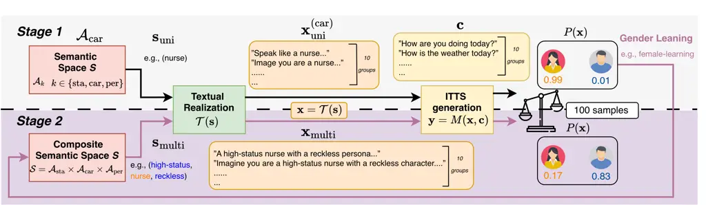

Chen Lin Hsieh Chou Hsu Li Lee Ding

# The Binding Effect: Analysis of How Multi-Dimensional Cues Form Gender Bias in Instruction TTS

Kuan-Yu    Yi-Cheng    Po-Chung    Huang-Cheng    Chih-Fan    Jeng-Lin
   Hung-yi    Jian-Jiun

###### Abstract

Current bias evaluations in Instruction Text-to-Speech (ITTS) often rely
on univariate testing, overlooking the compositional structure of social
cues. In this work, we investigate gender bias by modeling prompts as
combinations of Social Status, Career stereotypes, and Persona
descriptors. Analyzing open-source ITTS models, we uncover systematic
interaction effects where social dimensions modulate one another,
creating complex bias patterns missed by univariate baselines.
Crucially, our findings indicate that these biases extend beyond
surface-level artifacts, demonstrating strong associations with the
semantic priors of pre-trained text encoders and the skewed
distributions inherent in training data. We further demonstrate that
generic diversity prompting is insufficient to override these entrenched
patterns, underscoring the need for compositional analysis to diagnose
latent risks in generative speech.

###### keywords

Instruction TTS, Gender Bias, Social Stratification, Occupational Bias,
Personality Traits, Intersectional Bias

^(†)^(†)address: ¹Graduate Institute of Communication Engineering,
National Taiwan University, Taiwan  
²AI Research Center, Inventec Corporation, Taiwan ^(†)^(†)email:
f13942135@ntu.edu.tw

## 1 Introduction

Instruction Text-to-Speech (ITTS) systems \[1, 2\] control speech
generation through free-form natural language instructions. In contrast
to earlier methods based on discrete style labels or reference voice
cloning \[3, 4, 5\], recent ITTS models impose conditions such as
prosody, speaking style, and speaker persona directly on textual prompts
using pre-trained text encoders (e.g., T5 \[6\], BERT \[7\]) to guide
the acoustic generation. Parler-TTS \[8\], PromptTTS++ \[9\], and
VoxInstruct \[10\] are renowned examples that impact comprehensive
real-world applications.

Nevertheless, ITTS models are prone to producing biased or stereotypical
outputs because they inherit spurious correlations from their training
data distributions. For example, these models often align prompt
semantics with acoustic parameters such as fundamental frequency
($`F_{0}`$) and timbre \[11, 12\], which are inevitably perceived as
markers of particular gender classes \[13\]. This misattributed linkage
embeds implicit gender bias within ITTS systems, producing societal
consequences that can be both pervasive and profound. Current
investigations of bias in ITTS remain overly simplistic, concentrating
exclusively on single attributes \[14\] while neglecting broader
contextual factors. Although recent work in language generation has
begun to address compositional bias \[15\], research on ITTS remains
notably underdeveloped.

Earlier bias assessments of the ITTS system relied on an overly
simplistic scheme, overlooking the fact that human social perception of
demographic attributes arises from the weighted integration of multiple
cues rather than from isolated lexical markers \[16, 17\]. A prompt case
that describes a _high-status nurse_ with a _reckless_ persona might
trigger gender associations and override the baseline occupational
stereotype on a pure lexicon “nurse”. A standard single-lexicon
assessment would misrepresent these cases, resulting in a skewed gender
distribution and perpetuating ethical risks during deployment. We
indicate the Binding Effect as the phenomenon in which bias assessment
outcomes are altered by complex contextual factors introduced through
realistic and compositional prompts.

evaluation framework designed to systematically address the binding
effect in gender bias assessment. Specifically, our framework quantify
the contexts via three theoretically grounded dimensions: Social Status,
captured by Weberian stratification \[18\] with lexical descriptors
operated via Social Dominance Orientation (SDO) scales \[19\]; Career,
reflecting socially structured occupational roles \[20\]; and Persona
(Big Five), representing stable dispositional traits \[21\]. The
combination of these dimensions establishes a comprehensive testbed for
examining how gendered acoustic outcomes are shaped by the Binding
Effect.

We thus address the following 3 research questions (RQs):

- •
  RQ1: How do compositional interactions among social cues (specifically
  Social Status, Career, and Persona) modulate the model’s latent gender
  associations compared to univariate baselines?
- •
  RQ2: Among these compositional elements, which dimensions exert the
  most significant influence on acoustic gender realization? Do specific
  attributes systematically override others?
- •
  RQ3: Are the observed bias patterns consistent with the semantic
  priors of pre-trained text encoders, the demographic distributions in
  ITTS training data, or both?

Our analysis framework highlights the contrast between univariate and
compositional outcomes, exposing bias patterns that emerge under more
realistic conditions. Crucially, our analysis traces the origins of bias
and the associated behavioral changes under instruction-driven attribute
manipulation, thereby identifying avenues for future bias mitigation.
Intriguingly, we find that the origins of bias lie in semantic priors of
pre-trained text encoders rather than in ITTS training data alone.
Meanwhile, conventional prompting methods are insufficient to resolve
the deeper layers of compositional bias, whereas contextual attribute
insertion demonstrates greater feasibility as a mitigation strategy.



Figure 1: Overall Framework. Two-stage evaluation demonstrated with
PromptTTS++ model. Stage 1 establishes univariate gender priors, where
an isolated descriptor like _nurse_ triggers a strong female bias
($`P(\mathbf{x})=0.99`$). In Stage 2, recombining tokens with attributes
like _high-status_ and _reckless_ creates a binding effect to the
original female-leaning _nurse_, shifting the perceived gender toward
male ($`P(\mathbf{x})=0.17`$).

## 2 Methodology

Gender bias in ITTS often manifests not as isolated attribute
associations but as _compositional dependencies_ driven by the interplay
of multiple textual cues. We propose a disentanglement framework to
separate the independent contributions of individual cues from their
interaction effects, as illustrated in Fig. 1. By charting the
multi-dimensional prompt space moving from univariate baselines to
composite attribute interactions, we can determine how specific
combinations of social cues trigger biased acoustic outcomes.

### 2.1 Problem Formulation

Let $`M`$ denote an ITTS model that synthesizes a speech waveform
$`\mathbf{y}`$ from a natural language style instruction $`\mathbf{x}`$
and a content transcript $`\mathbf{c}`$:

```math
\mathbf{y}=M(\mathbf{x},\mathbf{c}). \tag{1}
```

We organize the semantic control space into three interpretable social
axes: sta $`\mathcal{A}_{\text{sta}}`$, Career
$`\mathcal{A}_{\text{car}}`$, and Persona $`\mathcal{A}_{\text{per}}`$.
A semantic configuration $`\mathbf{s}`$ is formed by sampling
descriptors from these axes. To interface with the model, we employ a
textual realization function $`\mathcal{T}`$ that maps the abstract
tuple $`\mathbf{s}`$ to a well-formed natural language prompt
$`\mathbf{x}=\mathcal{T}(\mathbf{s})`$.

### 2.2 Compositional Analysis Framework

We approach the bias landscape through a two-stage analysis. To account
for inherent model stochasticity, we define
$`P(\mathbf{x})\triangleq P(D(\mathbf{y})=\text{Female}\mid\mathbf{x})`$
as the empirical probability over multiple independent samplings of the
waveform $`\mathbf{y}`$ evaluated by a gender classifier $`D`$. We
isolate style-driven bias by fixing the content transcript
$`\mathbf{c}`$ to gender-neutral utterances, ensuring that the acoustic
variance is exclusively attributable to $`\mathbf{x}`$. Ideally, an
unbiased model devoid of demographic cues should yield uniformly random
gender assignments ($`P(\mathbf{x})\approx 0.5`$); systematic deviations
from this parity equilibrium quantify the model’s bias.

#### 2.2.1 Stage 1: Univariate Sensitivity

Stage 1 establishes a baseline by measuring the model’s sensitivity to
isolated social cues. Following standard bias probing practices \[22\],
we evaluate a single descriptor $`w`$ from axis $`\mathcal{A}_{k}`$
(where $`k\in\{\text{sta},\text{car},\text{per}\}`$). The univariate
instruction $`\mathbf{x}_{\text{uni}}^{(k)}`$ is constructed by leaving
the remaining axes empty ($`\emptyset`$):

```math
\mathbf{x}_{\text{uni}}^{(k)}=\mathcal{T}(\mathbf{s}_{\text{uni}}), \tag{2}
```

with $`\mathbf{s}_{\text{uni}}`$ containing $`w`$ at position $`k`$ and
$`\emptyset`$ elsewhere. For example, testing a career descriptor yields
$`\mathbf{x}_{\text{uni}}^{(\text{car})}=\mathcal{T}(\emptyset,w_{\text{car}},\emptyset)`$.

We compute the marginal female probability
$`P(\mathbf{x}_{\text{uni}}^{(k)})`$ for each $`\mathbf{x}`$. They
deviating significantly from $`0.5`$ are identified as _sensitive_
($`>0.5`$ for F-leaning priors, $`<0.5`$ for M-leaning). Crucially, this
empirical labeling establishes the model’s intrinsic latent anchors
rather than circularly proving bias, providing an internal baseline to
rigorously quantify how conflicting cues are resolved in Stage 2.

#### 2.2.2 Stage 2: Modeling Compositional Interactions

In practice, ITTS instructions are multi-dimensional. We hypothesize
that severe bias stems largely from the non-linear interaction of
co-occurring cues within the composite semantic space
$`\mathcal{S}=\mathcal{A}_{\text{sta}}\times\mathcal{A}_{\text{car}}\times\mathcal{A}_{\text{per}}`$.

To model these combinations, we explicitly construct composite
instructions. A fully populated tuple integrating descriptors from all
three axes,
$`\mathbf{s}_{\text{multi}}=(w_{\text{sta}},w_{\text{car}},w_{\text{per}})`$,
yields the multi-dimensional instruction:

```math
\mathbf{x}_{\text{multi}}=\mathcal{T}(\mathbf{s}_{\text{multi}})=\mathcal{T}(w_{\text{sta}},w_{\text{car}},w_{\text{per}}). \tag{3}
```

Similarly, to isolate the conflict between any two specific axes (e.g.,
$`w_{1}\in\mathcal{A}_{k_{1}}`$ and $`w_{2}\in\mathcal{A}_{k_{2}}`$)
while neutralizing the third, we formulate a bi-dimensional instruction:

```math
\mathbf{x}_{\text{bi}}^{(k_{1},k_{2})}=\mathcal{T}(w_{1},w_{2},\emptyset). \tag{4}
```

To evaluate whether the joint effect of social cues is additive or
interactive, we project probabilities into the unbounded log-odds
(logit) space:
$`L(\mathbf{x})\triangleq\ln\frac{P(\mathbf{x})}{1-P(\mathbf{x})}`$.
This logit transformation formulation prevents saturation at probability
boundaries, mapping the neutral baseline ($`P=0.5`$) to
$`L(\mathbf{x})=0`$.

Under cue independence, joint log-odds equal the sum of their univariate
effects. We quantify the interaction term $`\mathcal{I}`$ as the
deviation from this additive baseline. For bi-dimensional instructions,
the pairwise interaction is:

```math
\mathcal{I}(w_{1},w_{2})=L(\mathbf{x}_{\text{bi}}^{(k_{1},k_{2})})-\Big[L(\mathbf{x}_{\text{uni}}^{(k_{1})})+L(\mathbf{x}_{\text{uni}}^{(k_{2})})\Big]. \tag{5}
```

This naturally extends to three-way interactions. For a complete tuple
$`(w_{1}\in\mathcal{A}_{k_{1}},w_{2}\in\mathcal{A}_{k_{2}},w_{3}\in\mathcal{A}_{k_{3}})`$,
we isolate the tri-dimensional interaction by subtracting all univariate
and pairwise effects from the fully composite log-odds
$`L(\mathbf{x}_{\text{multi}})`$:

```math
\mathcal{I}(w_{1},w_{2},w_{3})=L(\mathbf{x}_{\text{multi}})-\sum_{i=1}^{3}L(\mathbf{x}_{\text{uni}}^{(k_{i})})-\sum_{1\leq i<j\leq 3}\mathcal{I}(w_{i},w_{j}). \tag{6}
```

## 3 Experiments

| Model                | Backbone         | Text Encoder  | Par. (Total/Text)   |
| -------------------- | ---------------- | ------------- | ------------------- |
| Vox (VoxInstruct)    | LLaMA (AR + NAR) | mT5-base      | $`\sim`$7B / 580M   |
| Pr++ (PromptTTS++)   | Diffusion + MDN  | BERT          | $`\sim`$150M / 110M |
| Par-M (Parler-Mini)  | AudioLM          | Flan-T5-large | 880M / 780M         |
| Par-L (Parler-Large) | AudioLM          | Flan-T5-large | 2.3B / 780M         |

Table 1: Evaluation of ITTS Models. Comparison of generative backbones,
text encoders, and parameter scales. Par. denotes the number of
parameters.

|                             |                   |     |                  |                  |                  |                  |
| --------------------------- | ----------------- | --- | ---------------- | ---------------- | ---------------- | ---------------- |
| Axis                        | Sub. / Trait      | n   | Vox              | Pr++             | Par-L            | Par-M            |
| Panel A: Axis-Level Summary |                   |     |                  |                  |                  |                  |
| Sta.                        | H. Status         | 1   | $`0.72`$         | $`0.00`$         | $`0.83`$         | $`0.72`$         |
| Sta.                        | L. Status         | 1   | $`0.37`$         | $`0.12`$         | $`0.25`$         | $`0.75`$         |
| Car.                        | F-ln.             | 10  | $`0.73\pm 0.06`$ | $`1.00\pm 0.01`$ | $`0.99\pm 0.01`$ | $`0.96\pm 0.02`$ |
| Car.                        | Mix.              | 6   | $`0.71\pm 0.04`$ | $`0.45\pm 0.20`$ | $`0.98\pm 0.02`$ | $`0.88\pm 0.06`$ |
| Car.                        | M-ln.             | 11  | $`0.70\pm 0.06`$ | $`0.03\pm 0.06`$ | $`0.77\pm 0.21`$ | $`0.63\pm 0.15`$ |
| Per.                        | Openness          | 8   | $`0.69\pm 0.10`$ | $`0.20\pm 0.19`$ | $`0.95\pm 0.07`$ | $`0.82\pm 0.13`$ |
| Per.                        | Conscientiousness | 8   | $`0.76\pm 0.08`$ | $`0.02\pm 0.04`$ | $`0.79\pm 0.09`$ | $`0.73\pm 0.16`$ |
| Per.                        | Extraversion      | 8   | $`0.66\pm 0.12`$ | $`0.17\pm 0.27`$ | $`0.84\pm 0.13`$ | $`0.92\pm 0.08`$ |
| Per.                        | Agreeableness     | 8   | $`0.70\pm 0.14`$ | $`0.13\pm 0.14`$ | $`0.80\pm 0.14`$ | $`0.80\pm 0.08`$ |
| Per.                        | Neuroticism       | 8   | $`0.70\pm 0.12`$ | $`0.00\pm 0.00`$ | $`0.78\pm 0.13`$ | $`0.75\pm 0.13`$ |
| Panel B: Exemplar Traits    |                   |     |                  |                  |                  |                  |
| Car.                        | Midwife           | \-  | $`0.80`$         | $`1.00`$         | $`0.97`$         | $`0.97`$         |
| Car.                        | Dental Hygienist  | \-  | $`0.75`$         | $`0.61`$         | $`0.99`$         | $`0.94`$         |
| Car.                        | Electrician       | \-  | $`0.67`$         | $`0.00`$         | $`0.86`$         | $`0.63`$         |
| Per.                        | Creative          | \-  | $`0.80`$         | $`0.00`$         | $`1.00`$         | $`0.60`$         |
| Per.                        | Structured        | \-  | $`0.85`$         | $`0.00`$         | $`0.90`$         | $`0.60`$         |
| Per.                        | Expressive        | \-  | $`0.80`$         | $`0.25`$         | $`0.90`$         | $`0.95`$         |
| Per.                        | Cooperative       | \-  | $`1.00`$         | $`0.10`$         | $`0.90`$         | $`0.90`$         |
| Per.                        | Tense             | \-  | $`0.90`$         | $`0.00`$         | $`0.85`$         | $`0.85`$         |

Table 2: Univariate Main Effect. Panel A summarizes axis-level marginal
female probabilities ($`P(\mathbf{x}_{\text{uni}})`$) as Mean $`\pm`$
SD. Panel B highlights exemplar traits. Abbreviations: Sta. (Status), H.
(High), L. (Low), Car. (Career), F/M-ln. (Female/Male-leaning), Mix.
(Mixed Prior), and Per. (Persona).

### 3.1 Evaluated Models

We evaluated three representative ITTS systems, VoxInstruct,
PromptTTS++, and Parler-TTS (Table 1), to isolate the impact of distinct
generative backbones and pre-trained text encoders on bias retention. To
assess parameter capacity effects, we tested two Parler-TTS scale
variants, hereafter denoted as Parler-M (Mini) and Parler-L (Large).

|                      |               |          |          |          |          |
| -------------------- | ------------- | -------- | -------- | -------- | -------- |
| Int. Cond.           |               | Vox      | Pr++     | Par-L    | Par-M    |
| Sta. $`\times`$ Car. |               |          |          |          |          |
| H. Sta.              | \+ F-ln. Car. | $`0.86`$ | $`0.40`$ | $`0.91`$ | $`0.95`$ |
|                      | \+ M-ln. Car. | $`0.78`$ | $`0.20`$ | $`0.74`$ | $`0.80`$ |
| L. Sta.              | \+ F-ln. Car. | $`0.73`$ | $`0.69`$ | $`0.62`$ | $`0.89`$ |
|                      | \+ M-ln. Car. | $`0.68`$ | $`0.39`$ | $`0.29`$ | $`0.54`$ |
| Sta. $`\times`$ Per. |               |          |          |          |          |
| H. Sta.              | \+ F-ln. Per. | $`0.79`$ | $`0.35`$ | $`0.96`$ | $`0.81`$ |
|                      | \+ M-ln. Per. | $`0.87`$ | $`0.00`$ | $`0.96`$ | $`0.84`$ |
| L. Sta.              | \+ F-ln. Per. | $`0.65`$ | $`1.00`$ | $`0.73`$ | $`0.73`$ |
|                      | \+ M-ln. Per. | $`0.70`$ | $`0.00`$ | $`0.50`$ | $`0.65`$ |
| Car. $`\times`$ Per. |               |          |          |          |          |
| F-ln. Car.           | \+ F-ln. Per. | $`0.79`$ | $`1.00`$ | $`0.92`$ | $`0.82`$ |
|                      | \+ M-ln. Per. | $`0.77`$ | $`1.00`$ | $`0.90`$ | $`0.83`$ |
| M-ln. Car.           | \+ F-ln. Per. | $`0.79`$ | $`0.54`$ | $`0.55`$ | $`0.74`$ |
|                      | \+ M-ln. Per. | $`0.73`$ | $`0.00`$ | $`0.58`$ | $`0.54`$ |

Table 3: Bi-dimensional Interaction Analysis
($`P(\mathbf{x}_{\text{bi}})`$). See Table 2 for abbreviations.

| Int. Cond. |            |            | Vox      | Pr++     | Par-L    | Par-M    |
| ---------- | ---------- | ---------- | -------- | -------- | -------- | -------- |
| Sta.       | Car.       | Per.       |          |          |          |          |
| High       | F-ln. Car. | F-ln. Per. | $`0.90`$ | $`1.00`$ | $`0.95`$ | $`0.85`$ |
|            |            | M-ln. Per. | $`0.85`$ | $`0.17`$ | $`0.91`$ | $`0.88`$ |
|            | M-ln. Car. | F-ln. Per. | $`0.79`$ | $`0.59`$ | $`0.79`$ | $`0.76`$ |
|            |            | M-ln. Per. | $`0.80`$ | $`0.00`$ | $`0.79`$ | $`0.62`$ |
| Low        | F-ln. Car. | F-ln. Per. | $`0.78`$ | $`1.00`$ | $`0.66`$ | $`0.78`$ |
|            |            | M-ln. Per. | $`0.66`$ | $`1.00`$ | $`0.62`$ | $`0.76`$ |
|            | M-ln. Car. | F-ln. Per. | $`0.69`$ | $`0.52`$ | $`0.32`$ | $`0.52`$ |
|            |            | M-ln. Per. | $`0.67`$ | $`0.64`$ | $`0.28`$ | $`0.50`$ |

Table 4: Tri-dimensional Interaction Dynamics
($`P(\mathbf{x}_{\text{multi}})`$). See Table 2 for abbreviations.

### 3.2 Controlled Test Setups

We independently evaluate 69 descriptors across three axes
($`|\mathcal{A}_{\text{sta}}|\!=\!2`$,
$`|\mathcal{A}_{\text{car}}|\!=\!27`$,
$`|\mathcal{A}_{\text{per}}|\!=\!40`$). To isolate semantic effects, we
synthesize 100 utterances per descriptor by cross-multiplying 10
gender-neutral transcripts with 10 templates via human-verified Gemini 3
Pro \[23\] ($`\mathcal{T}`$). This yields 6,900 univariate samples for
$`P(\mathbf{x}_{\text{uni}})`$. Rather than relying on external
demographics, we stratify descriptors into Female-leaning, Mixed, and
Male-leaning tiers based strictly on these empirical outputs. This
intrinsic approach effectively exposes the models’ latent topologies
while minimizing template-specific variance by averaging across the 100
combinations per descriptor.

To evaluate non-additive interactions (Sec. 2.2.2), we construct a
targeted compositional test set using the most polarizing Stage 1
descriptors: two extremely male- and female-leaning words from both
$`\mathcal{A}_{\text{Career}}`$ and $`\mathcal{A}_{\text{per}}`$ (4 per
axis), plus the two $`\mathcal{A}_{\text{Status}}`$ levels. Applying the
same $`10\times 10`$ sampling strategy, we formulate composite
instructions: (1) Bi-dimensional ($`\mathbf{x}_{\text{bi}}`$): Pairing
descriptors across two axes while neutralizing the third ($`\emptyset`$)
yields 32 combinations (3,200 utterances). (2) Tri-dimensional
($`\mathbf{x}_{\text{multi}}`$): Intersecting all three axes
($`2\times 4\times 4`$) yields 32 triplets (3,200 utterances). This
6,400-utterance set enables the quantification of the interaction term
($`\mathcal{I}`$) and dominance override mechanisms.

### 3.3 Evaluation Metrics

Gender Probability ($`P(\mathbf{x})`$): Estimated via a wav2vec 2.0
classifier \[24\], $`P(\mathbf{x})`$ represents the empirical
probability of female acoustic realization. To validate the classifier,
we manually audited a random $`10\%`$ subset ($`N=1,330`$), confirming a
$`95\%`$ agreement with human perception.

Interaction Term ($`\mathcal{I}`$): $`\mathcal{I}`$ denotes the log-odds
deviation from the additive baseline (Eq. 5–6), quantifying cue
dependencies such as evidence binding and dominance override.
Significance is assessed via a $`10^{4}`$ iterations permutation test
with random label shuffling. In our visualizations, color intensity
encodes both magnitude and significance: light tones signify
non-significant interactions, medium denotes moderate significance
($`p<0.05,|\mathcal{I}|>1.0`$), and dark orange/blue marks strong
interactions ($`p<0.01,|\mathcal{I}|>2.8`$), including Binding Effects
where synergistic cues reinforce a specific gender leaning and
significant dominance overrides.

Semantic Bias & Effect Size ($`\Delta,d`$): To isolate text-encoder
bias, we compute the relative cosine similarity between a trait’s
contextual embedding ($`\mathbf{e}`$) and gender anchor sets \[25\]:

```math
\Delta=\mathbb{E}\big[\cos(\mathbf{e}_{\text{trait}},\mathbf{e}_{\text{female}})\big]-\mathbb{E}\big[\cos(\mathbf{e}_{\text{trait}},\mathbf{e}_{\text{male}})\big]. \tag{7}
```

We aggregate the word-level $`\Delta`$ values within each axis to
compute standardized bias scores and group-level effect sizes (Cohen’s
$`d`$) \[26, 27\], where $`d>0`$ indicates a female-leaning prior.

|                                                              |           |           |           |           |
| ------------------------------------------------------------ | --------- | --------- | --------- | --------- |
| Int. Cond.                                                   | Vox       | Pr++      | Par-L     | Par-M     |
| Bi-dimensional Interactions ($`\mathbf{x}_{\text{bi}}`$)     |           |           |           |           |
| Sta. $`\times`$ Car.                                         |           |           |           |           |
| H. Sta. + F-ln. Car.                                         | $`-0.52`$ | $`-0.41`$ | $`-3.88`$ | $`-2.60`$ |
| H. Sta. + M-ln. Car.                                         | $`-0.12`$ | $`+7.81`$ | $`+0.78`$ | $`+1.35`$ |
| L. Sta. + F-ln. Car.                                         | $`+0.14`$ | $`-1.81`$ | $`-3.01`$ | $`-3.61`$ |
| L. Sta. + M-ln. Car.                                         | $`+0.83`$ | $`+6.14`$ | $`+1.54`$ | $`-0.04`$ |
| Sta. $`\times`$ Per.                                         |           |           |           |           |
| H. Sta. + F-ln. Per.                                         | $`-1.35`$ | $`+2.59`$ | $`-3.01`$ | $`-4.09`$ |
| H. Sta. + M-ln. Per.                                         | $`+0.96`$ | $`+4.60`$ | $`+1.59`$ | $`+0.31`$ |
| L. Sta. + F-ln. Per.                                         | $`-0.58`$ | $`+5.20`$ | $`-2.51`$ | $`-4.71`$ |
| L. Sta. + M-ln. Per.                                         | $`+1.38`$ | $`+1.99`$ | $`+1.10`$ | $`-0.89`$ |
| Car. $`\times`$ Per.                                         |           |           |           |           |
| F-ln. Car. + F-ln. Per.                                      | $`-1.80`$ | $`-1.39`$ | $`-6.76`$ | $`-7.68`$ |
| F-ln. Car. + M-ln. Per.                                      | $`-0.18`$ | $`+4.60`$ | $`-2.40`$ | $`-3.42`$ |
| M-ln. Car. + F-ln. Per.                                      | $`-0.86`$ | $`+3.37`$ | $`-3.07`$ | $`-2.65`$ |
| M-ln. Car. + M-ln. Per.                                      | $`+0.54`$ | $`+4.60`$ | $`+1.65`$ | $`+0.65`$ |
| Tri-dimensional Interactions ($`\mathbf{x}_{\text{multi}}`$) |           |           |           |           |
| High Status Conditions                                       |           |           |           |           |
| H. Sta. + F-ln. Car. + F-ln. Per.                            | $`+1.81`$ | $`+2.42`$ | $`+5.80`$ | $`+5.96`$ |
| H. Sta. + F-ln. Car. + M-ln. Per.                            | $`-0.87`$ | $`-5.78`$ | $`+0.81`$ | $`+1.75`$ |
| H. Sta. + M-ln. Car. + F-ln. Per.                            | $`+0.53`$ | $`-5.60`$ | $`+1.76`$ | $`+1.90`$ |
| H. Sta. + M-ln. Car. + M-ln. Per.                            | $`-1.38`$ | $`-7.81`$ | $`-2.96`$ | $`-2.27`$ |
| Low Status Conditions                                        |           |           |           |           |
| L. Sta. + F-ln. Car. + F-ln. Per.                            | $`+0.92`$ | $`-1.40`$ | $`+4.84`$ | $`+6.97`$ |
| L. Sta. + F-ln. Car. + M-ln. Per.                            | $`-1.54`$ | $`+1.81`$ | $`+1.30`$ | $`+2.96`$ |
| L. Sta. + M-ln. Car. + F-ln. Per.                            | $`-0.24`$ | $`-9.43`$ | $`+1.12`$ | $`+2.68`$ |
| L. Sta. + M-ln. Car. + M-ln. Per.                            | $`-1.96`$ | $`-0.96`$ | $`-2.80`$ | $`-0.33`$ |

Table 5: Interaction Terms ($`\mathcal{I}`$). Log-odds deviation from
additive baseline. Color intensity marks significance (Sec. 3.3). See
Table 2 for abbreviations.

## 4 Results and Analysis

### 4.1 Univariate Bias and Polarization Trends

As detailed in Tables 2–4, VoxInstruct operates on a female-skewed
baseline prior. Despite this, its relative variance exhibits moderate,
additive shifts that perfectly align with traditional communal
(female-leaning) and agentic (male-leaning) stereotypes. In stark
contrast, PromptTTS++ demonstrates extreme status-gender polarization
via a strict bimodal distribution: male-dominated trades (e.g.,
Electrician) exclusively trigger male realizations ($`P=0.00`$), while
care professions (e.g., Midwife) unconditionally collapse into female
outputs ($`P=1.00`$). Conversely, the Parler-TTS family suffers from
severe prior saturation, maintaining anomalously high female
probabilities ($`P\geq 0.73`$) even for stereotypically male-leaning
occupations (e.g., Plumber). These disparities confirm that distinct
generative backbones map isolated semantic axes using radically
different strategies.

### 4.2 Three Paradigms of Compositional Interaction ($`\mathcal{I}`$)

When social cues intersect, ITTS models rarely process them
independently. To objectively classify how latent semantic conflicts are
resolved, we operationalize three compositional paradigms based on cue
congruency and the statistical significance of $`\mathcal{I}`$ (derived
via our analysis, Table 5):

1. Additive Smoothness (VoxInstruct): Cues in this regime integrate
   nearly linearly, characterized by interaction terms that remain
   statistically indistinguishable from zero ($`p>0.05`$). This additive
   behavior is bounded by small effect sizes ($`|\mathcal{I}|\leq 1.81`$),
   indicating that semantic axes operate equitably without any single
   dimension exerting absolute veto power.

2. Asymmetric Veto Power (PromptTTS++): This paradigm is defined by
   highly significant non-additive shifts ($`p<0.001`$, massive
   $`|\mathcal{I}|`$) triggered specifically under semantic conflict (i.e.,
   intersecting cues of opposing polarities). Male-leaning cues
   systematically override generation; for instance, combining a
   female-leaning occupation with male-leaning modifiers (High Status +
   F-leaning Career + M-leaning Persona) yields $`\mathcal{I}=-5.78`$.
   Status and persona vectors override established occupational priors.

3. Prior Saturation (Parler Family): Extreme negative interactions
   ($`p<0.001`$) can also stem from expressive collapse, defined by massive
   $`\mathcal{I}`$ values emerging under semantic congruence (i.e.,
   stacking cues of the same polarity). Under strictly female-leaning
   conditions (e.g., F-leaning Career + F-leaning Persona), Parler-L
   ($`\mathcal{I}=-6.76`$) and Parler-M ($`\mathcal{I}=-7.68`$) hit a
   mathematical ceiling ($`P\approx 0.99`$). The prior is so heavily
   saturated that cumulative cues are nullified, causing severe
   sub-additivity instead of active cue competition.

|                                                     |                     |                       |                    |
| --------------------------------------------------- | ------------------- | --------------------- | ------------------ |
| Axes ($`\mathcal{A}_{k}`$)                          | mT5-base            | BERT-base             | Flan-T5-large      |
| $`\mathcal{A}_{\text{sta}}`$ (H / L)                | -0.02 / -1.41       | -5.06 / -0.60         | 0.77 / 0.47        |
| $`\mathcal{A}_{\text{car}}`$ (F-ln. / Mix. / M-ln.) | 0.58 / -0.90 / 0.36 | 1.67 / -0.48 / -1.71  | 1.65 / 0.45 / 4.16 |
| $`\mathcal{A}_{\text{per}}`$ (O / C / E)            | 2.23 / 3.76 / 1.74  | -1.15 / -1.60 / -0.50 | 1.17 / 0.36 / 1.49 |
| (A / N)                                             | 2.06 / 2.98         | -0.89 / -2.09         | 1.78 / 3.21        |

Table 6: Evaluated Text Encoders. Standardized bias scores and effect
sizes (Cohen’s $`d`$).

### 4.3 Origins of Bias: Data Distribution and Text Encoders

We attribute the observed ITTS gender biases to two primary sources:
demographic imbalances in acoustic training corpora and stereotypical
patterns inherited from upstream text encoders.

First, training data annotations often harbor implicit skews. While
granular metadata is generally rare, for example the PromptTTS++
corpus \[9\] explicitly pairs gender labels with characteristic
descriptors. This corpus exhibits notable demographic skews; for
instance, the trait expressive co-occurs $`15\%`$ more frequently with
male speakers, potentially conditioning polarized associations. However,
many biased descriptors in our study are absent from these training
annotations, suggesting that acoustic distributions alone cannot fully
explain the pervasive polarization.

Consequently, ITTS models may inherit significant bias from pretrained
text encoders known to harbor societal stereotypes \[28, 29\]. As
Table 6 illustrates, the bias patterns in these encoders frequently
mirror the acoustic polarization of the synthesized speech. This
alignment confirms that generative bias is fundamentally a downstream
manifestation of text-level representations; notably, the strong
correlation exhibited by BERT at the $`\mathcal{A}_{\text{car}}`$
attribute explicitly demonstrates this dependency.

## 5 Conclusions

We introduce a compositional framework to audit ITTS gender bias, using
metric ($`\mathcal{I}`$) to quantify multi-axis semantic interactions
($`\mathcal{A}_{\text{sta}}\times\mathcal{A}_{\text{car}}\times\mathcal{A}_{\text{per}}`$).
While we operationalize gender as a binary for tractable quantification
of macroscopic biases, we find that extreme non-additive biases
Asymmetric Veto Power and Prior Saturation originate from pre-trained
text encoders ($`\Delta`$) and imbalanced datasets. Future work could
leverage these compositional dynamics to guide prompt-based bias
mitigation. Ultimately, achieving equitable ITTS necessitates a dual
focus on disentangling textual priors and refining data curation.

## 6 Generative AI Use Disclosure

Generative AI tools were used exclusively for language refinement and
minor editorial improvements. All authors assume full responsibility for
the integrity, originality, and accuracy of the work. Generative AI
tools did not contribute to the development of scientific content,
experimental design, analysis, or conclusions.

## References

- \[1\] Z. Guo, Y. Leng, Y. Wu, S. Zhao, and X. Tan (2023) Prompttts:
  controllable text-to-speech with text descriptions. In ICASSP
  2023-2023 IEEE International Conference on Acoustics, Speech and
  Signal Processing (ICASSP), pp. 1–5. Cited by: §1.
- \[2\] D. Yang, S. Liu, R. Huang, C. Weng, and H. Meng (2024)
  Instructtts: modelling expressive tts in discrete latent space with
  natural language style prompt. IEEE/ACM Transactions on Audio, Speech,
  and Language Processing 32, pp. 2913–2925. Cited by: §1.
- \[3\] C. Wang, S. Chen, Y. Wu, Z. Zhang, L. Zhou, S. Liu, Y. Zhao, F.
  Ren, and F. Wei (2023) VALL-E: neural codec language models are
  zero-shot text to speech synthesizers. arXiv preprint
  arXiv:2301.02111. Cited by: §1.
- \[4\] Y. Chen, Z. Niu, Z. Ma, K. Deng, C. Wang, J. JianZhao, K. Yu,
  and X. Chen (2025) F5-TTS: a fairytaler that fakes fluent and faithful
  speech with flow matching. In Proceedings of the 63rd Annual Meeting
  of the Association for Computational Linguistics (Volume 1: Long
  Papers), Vienna, Austria, pp. 6255–6271. External Links:
  [Link](https://aclanthology.org/2025.acl-long.313/),
  [Document](https://dx.doi.org/10.18653/v1/2025.acl-long.313), ISBN
  979-8-89176-251-0 Cited by: §1.
- \[5\] C. Hsu, Y. Lin, C. Lin, W. Chen, H. L. Chung, C. Li, Y. Chen, C.
  Yu, M. Lee, C. Chen, R. Huang, H. Lee, and D. Shiu (2025) BreezyVoice:
  adapting tts for taiwanese mandarin with enhanced polyphone
  disambiguation – challenges and insights. External Links: 2501.17790,
  [Link](https://arxiv.org/abs/2501.17790) Cited by: §1.
- \[6\] C. Raffel, N. Shazeer, A. Roberts, K. Lee, S. Narang, M.
  Matena, Y. Zhou, W. Li, and P. J. Liu (2020) Exploring the limits of
  transfer learning with a unified text-to-text transformer. Journal of
  machine learning research 21 (140), pp. 1–67. Cited by: §1.
- \[7\] J. Devlin, M. Chang, K. Lee, and K. Toutanova (2019) Bert:
  pre-training of deep bidirectional transformers for language
  understanding. In Proceedings of the 2019 conference of the North
  American chapter of the association for computational linguistics:
  human language technologies, volume 1 (long and short papers),
  pp. 4171–4186. Cited by: §1.
- \[8\] D. Lyth and S. King (2024) Natural language guidance of
  high-fidelity text-to-speech with synthetic annotations. arXiv
  preprint arXiv:2402.01912. Cited by: §1.
- \[9\] R. Shimizu, R. Yamamoto, M. Kawamura, Y. Shirahata, H. Doi, T.
  Komatsu, and K. Tachibana (2024) PromptTTS++: controlling speaker
  identity in prompt-based text-to-speech using natural language
  descriptions. In ICASSP 2024 - 2024 IEEE International Conference on
  Acoustics, Speech and Signal Processing (ICASSP), pp. 12672–12676.
  Cited by: §1, §4.3.
- \[10\] Y. Zhou, X. Qin, Z. Jin, S. Zhou, S. Lei, S. Zhou, Z. Wu,
  and J. Jia (2024) VoxInstruct: expressive human instruction-to-speech
  generation with unified multilingual codec language modelling. In
  Proceedings of the 32nd ACM International Conference on Multimedia, MM
  ’24, New York, NY, USA, pp. 554–563. External Links: ISBN
  9798400706868, [Link](https://doi.org/10.1145/3664647.3681680),
  [Document](https://dx.doi.org/10.1145/3664647.3681680) Cited by: §1.
- \[11\] I. R. Titze (1989) Physiologic and acoustic differences between
  male and female voices. The Journal of the Acoustical Society of
  America 85 (4), pp. 1699–1707. Cited by: §1.
- \[12\] A. P. Simpson (2009) Phonetic differences between male and
  female speech. Language and linguistics compass 3 (2), pp. 621–640.
  Cited by: §1.
- \[13\] E. Jacewicz, R. A. Fox, and J. Salmons (2007) Vowel space areas
  across dialects and gender. In Proceedings of the 16th International
  Congress of Phonetic Sciences, pp. 1465–1468. Cited by: §1.
- \[14\] C. Kuan and H. Lee (2025) Gender bias in instruction-guided
  speech synthesis models. In Findings of the Association for
  Computational Linguistics: NAACL 2025, L. Chiruzzo, A. Ritter, and L.
  Wang (Eds.), Albuquerque, New Mexico. Cited by: §1.
- \[15\] E. Sheng and D. Uthus (2020) Investigating societal biases in a
  poetry composition system. In Proceedings of the Second Workshop on
  Gender Bias in Natural Language Processing, M. R. Costa-jussà, C.
  Hardmeier, W. Radford, and K. Webster (Eds.), Barcelona, Spain
  (Online). External Links:
  [Link](https://aclanthology.org/2020.gebnlp-1.9/) Cited by: §1.
- \[16\] J. B. Freeman and N. Ambady (2011) A dynamic interactive theory
  of person construal.. Psychological review 118 (2), pp. 247. Cited by:
  §1.
- \[17\] P. McAleer, A. Todorov, and P. Belin (2014) How do you say
  ‘hello’? personality impressions from brief novel voices. PloS one 9
  (3), pp. e90779. Cited by: §1.
- \[18\] M. Weber (1978) Economy and society: an outline of interpretive
  sociology. Vol. 2, University of California press. Cited by: §1.
- \[19\] F. Pratto, J. Sidanius, L. M. Stallworth, and B. F.
  Malle (1994) Social dominance orientation: a personality variable
  predicting social and political attitudes. Journal of personality and
  social psychology 67 (4), pp. 741. Cited by: §1.
- \[20\] N. Garg, L. Schiebinger, D. Jurafsky, and J. Zou (2018) Word
  embeddings quantify 100 years of gender stereotypes. In Proceedings of
  the National Academy of Sciences, Vol. 115, pp. E3635–E3644. Cited by:
  §1.
- \[21\] P. T. Costa and R. R. McCrae (2008) The revised neo personality
  inventory (neo-pi-r). The SAGE handbook of personality theory and
  assessment 2 (2), pp. 179–198. Cited by: §1.
- \[22\] K. Kurita, N. Vyas, A. Pareek, A. W. Black, and Y.
  Tsvetkov (2019) Measuring bias in contextualized word representations.
  In Proceedings of the First Workshop on Gender Bias in Natural
  Language Processing, pp. 166–172. Cited by: §2.2.1.
- \[23\] G. Team, A. Kamath, J. Ferret, S. Pathak, N. Vieillard, R.
  Merhej, S. Perrin, T. Matejovicova, A. Ramé, M. Rivière, et al. (2025)
  Gemma 3 technical report. arXiv preprint arXiv:2503.19786. Cited by:
  §3.2.
- \[24\] F. Burkhardt, J. Wagner, H. Wierstorf, F. Eyben, and B.
  Schuller (2023) Speech-based age and gender prediction with
  transformers. In Speech Communication; 15th ITG Conference, pp. 46–50.
  Cited by: §3.3.
- \[25\] C. May, A. Wang, S. Bordia, S. Bowman, and R. Rudinger (2019)
  On measuring social biases in sentence encoders. In Proceedings of the
  2019 Conference of the North American Chapter of the Association for
  Computational Linguistics: Human Language Technologies, Volume 1 (Long
  and Short Papers), pp. 622–628. Cited by: §3.3.
- \[26\] Y. Lin, T. Lin, H. Lin, A. T. Liu, and H. Lee (2024) On the
  social bias of speech self-supervised models. In Interspeech 2024,
  pp. 4638–4642. External Links:
  [Document](https://dx.doi.org/10.21437/Interspeech.2024-454), ISSN
  2958-1796 Cited by: §3.3.
- \[27\] Y. Lin, H. Wu, H. Chou, C. Lee, and H. Lee (2024) Emo-bias: A
  Large Scale Evaluation of Social Bias on Speech Emotion Recognition.
  In Interspeech 2024, pp. 4633–4637. External Links:
  [Document](https://dx.doi.org/10.21437/Interspeech.2024-1073), ISSN
  2958-1796 Cited by: §3.3.
- \[28\] M. Bartl, M. Nissim, and A. Gatt (2020) Unmasking contextual
  stereotypes: measuring and mitigating bert’s gender bias. In
  Proceedings of the second workshop on gender bias in natural language
  processing, pp. 1–16. Cited by: §4.3.
- \[29\] S. Katsarou, B. Rodríguez-Gálvez, and J. Shanahan (2022)
  Measuring gender bias in contextualized embeddings. In computer
  sciences and mathematics Forum, Vol. 3, pp. 3. Cited by: §4.3.
