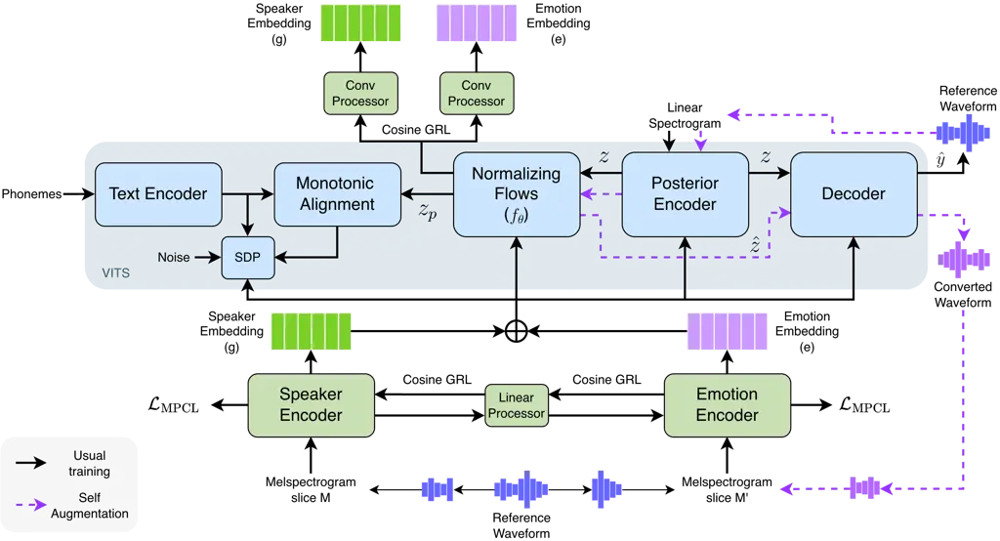
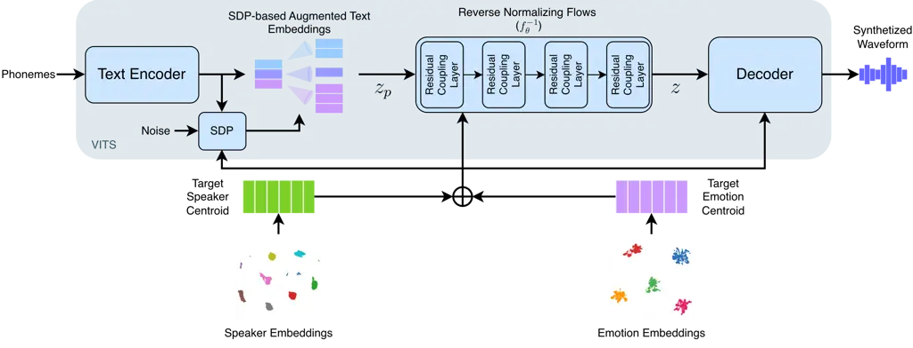
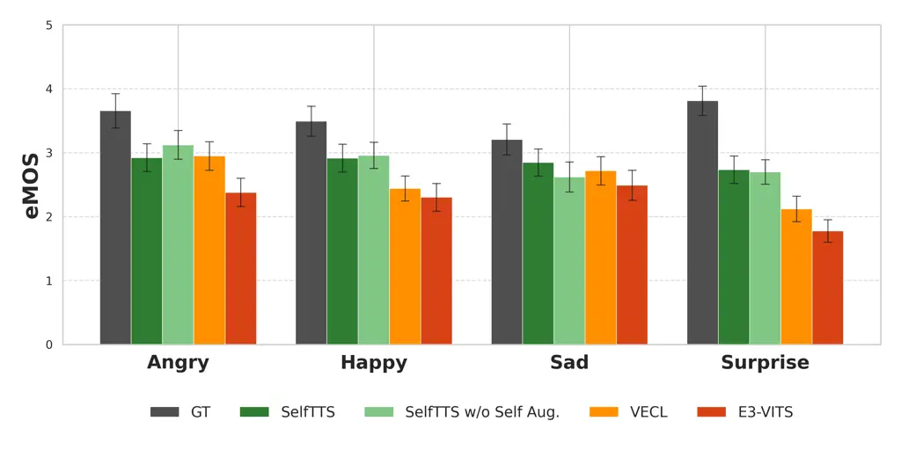
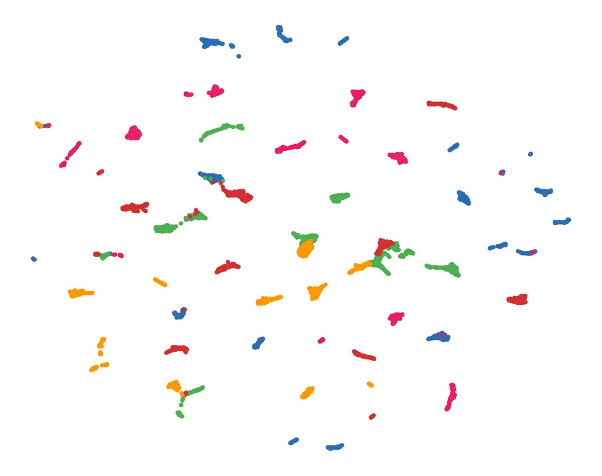
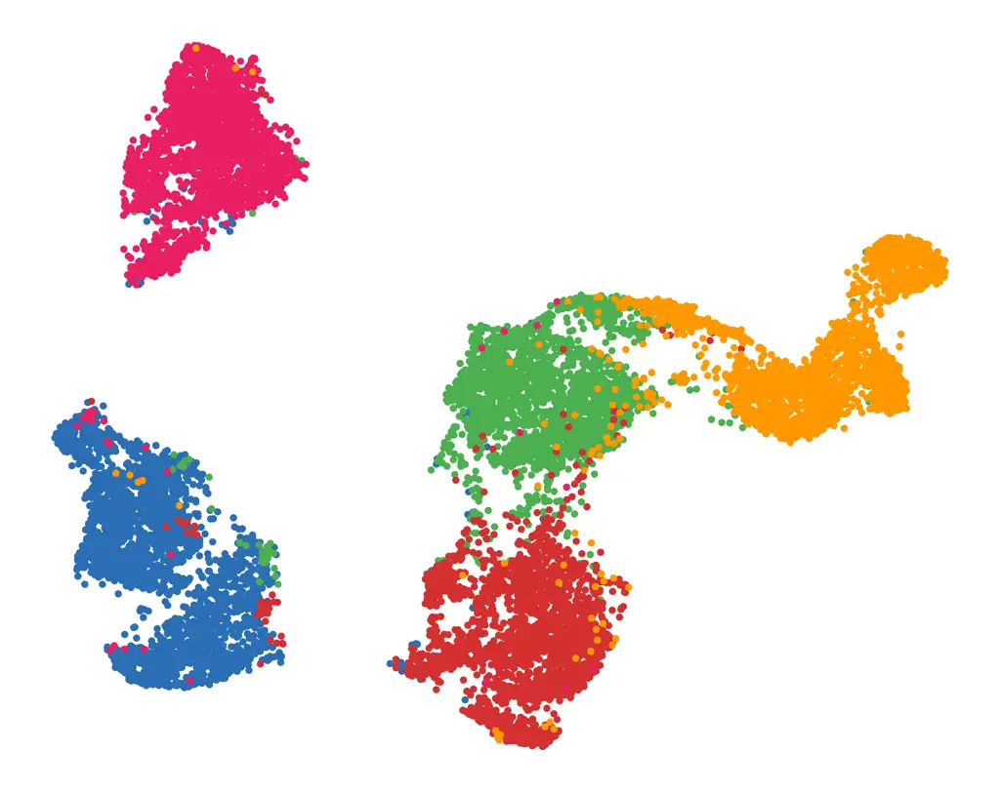
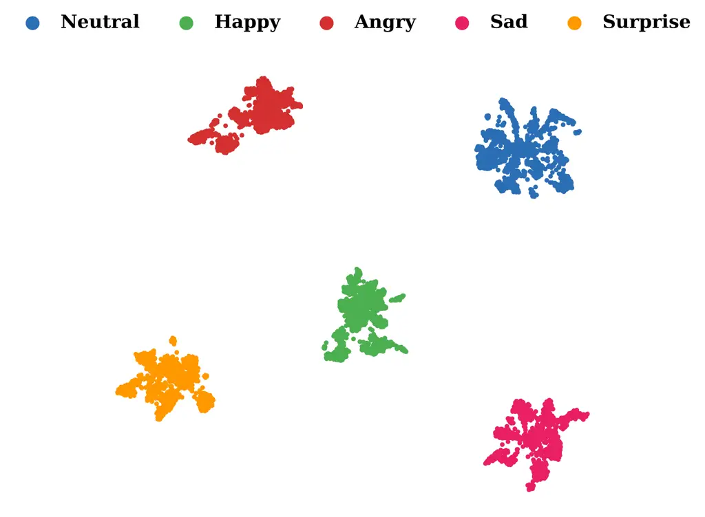

# SelfTTS: Cross-Speaker Style Transfer through Explicit Embedding Disentanglement and Self-Refinement using Self-Augmentation

Lucas H. Ueda [](https://orcid.org/0000-0002-1029-3420)

  
João G. T. Lima [](https://orcid.org/0009-0006-6336-8808)
   Pedro R.
Corrêa [](https://orcid.org/0000-0002-3411-0959)
   Flávio O.
Simões [](https://orcid.org/0000-0001-5104-1222)
   Mário U.
Neto [](https://orcid.org/0009-0008-7254-285X)
and Paula D. P. Costa [](https://orcid.org/0000-0002-1534-5744)
^(†)^(†)thanks: Lucas H. Ueda, João G. T. Lima, Pedro R. Corrêa and
Paula D. P. Costa are with the Department of Computer Engineering and
Automation (DCA), Faculdade de Engenharia Elétrica e de Computação, and
the AI Lab., Recod.ai, Institute of Computing, Universidade Estadual de
Campinas (UNICAMP), Campinas, Brazil (e-mail: l156368@dac.unicamp.br,
j237473@dac.unicamp.br, p243236@dac.unicamp.br,
paulad@unicamp.br).^(†)^(†)thanks: Flávio O. Simões and Mário U. Neto
are with the CPQD, Campinas, Brazil (e-mail: simoes@cpqd.com.br,
uliani@cpqd.com.br).^(†)^(†)thanks: Paula D. P. Costa
(paulad@unicamp.br) is the corresponding author.^(†)^(†)thanks: This
work is partially funded by CAPES – Finance Code 001. It is also
supported by FAPESP (BI0S \#2020/09838-0 and Horus \#2023/12865-8). This
project was supported by MCTI under Law 8.248/1991, PPI-Softex,
published as Cognitive Architecture (Phase 3), DOU 01245.003479/2024-1.

###### Abstract

This work presents SelfTTS, a text-to-speech (TTS) model designed for
cross-speaker style transfer that eliminates the need for external
pre-trained speaker or emotion encoders. The architecture achieves
emotional expressivity in neutral speakers through an explicit
disentanglement strategy utilizing Gradient Reversal Layers (GRL)
combined with cosine similarity loss to decouple speaker and emotion
information. We introduce Multi Positive Contrastive Learning (MPCL) to
induce clustered representations of speaker and emotion embeddings based
on their respective labels. Furthermore, SelfTTS employs a
self-refinement strategy via Self-Augmentation, exploiting the model’s
voice conversion capabilities to enhance the naturalness of synthesized
speech. Experimental results demonstrate that SelfTTS achieves superior
emotional naturalness (eMOS) and robust stability in target timbre and
emotion compared to state-of-the-art baselines.

## I Introduction

Generating expressive speech in text-to-speech (TTS) models typically
requires recordings that capture specific stylistic nuances. However,
obtaining such high-quality data for every speaker is often unfeasible.
Recent literature addresses this limitation through cross-speaker style
transfer, where the prosodic characteristics of a reference audio signal
are mapped onto a target speaker who has provided only neutral
recordings.

A common framework involves a style encoder module, which extracts a
style representation embedding from reference audio to condition the TTS
prosody. This encoder generally derives an embedding representation from
a reference mel-spectrogram with the goal of creating a style space that
isolates prosody from linguistic content and speaker identity. In
scenarios involving labeled datasets this style space can be further
used for post-hoc analysis and for conditioning the TTS inference for
cross-speaker style transfer \[1, 2\].

Several studies incorporate an emotion classification layer at the
output of the style encoder to improve the emotional alignment of these
representations \[3, 4\]. Alternatively, Kulkarni et al. (2021) \[5\]
employ an N-Pair loss to generate a style space that is more effectively
clustered across different emotions, while Ngo et al. (2024) \[6\]
utilizes Supervised Contrastive Loss. More recent works, such as
Gudmalwar et al. (2024) \[7\], utilize separate pre-trained models to
extract distinct embeddings for both speaker identity and style.

In practice, however, these modules often suffer from speaker leakage, a
condition where the reference speaker’s timbre is erroneously
captured \[8, 9, 10\]. This leads to degraded performance and identity
mismatch during cross-speaker inference \[11\].

To achieve better disentanglement between emotion and speaker
embeddings, some studies incorporate adversarial training with Gradient
Reversal Layer \[12\] (GRL). In this setup, a classifier identifies
undesired labels while the GRL reverses the gradients during the
backward pass, preventing the model from encoding information related to
those labels. Although this technique is widely used in modern TTS
models \[13, 14\], relying solely on external labels can be noisy and
may not explicitly handle the entanglement inherent in the embeddings
conditioning the model. Despite these efforts, maintaining high
naturalness in cross-speaker scenarios remains a significant
challenge \[15\].

Alternatively, timbre perturbation techniques, such as formant shifting,
have been employed to force the model to decouple emotion and prosody
from the speaker’s vocal characteristics \[16, 17, 18\]. Other
approaches rely on filtering only the first 20 mel-bins of the input
mel-spectrogram for the style encoder, as this range contains
significant prosodic information with minimal timbre or content
interference compared to the full band \[19, 20\].

When expressive data is limited, synthetic data generation offers a
viable path forward. This often involves using a Voice Conversion (VC)
model to transform an expressive source speaker into the target
speaker’s voice, followed by fine-tuning a TTS model on this augmented
data \[21, 22\]. Recently, the use of synthetic samples to improve
disentanglement and naturalness has been further explored \[23\].
Leveraging the VC capabilities of VITS \[24\], the E3-VITS model \[25\]
proposed batch-permuted style perturbation to improve style transfer
using unpaired style samples generated by the model itself.

Synthetic data has also been extended to multilingual systems to retain
content across languages \[26\]. Nevertheless, the overall quality of
the resulting TTS is strictly bounded by the quality of the synthetic
samples, especially when handling high-intensity expressive data \[27\].

In this work, we present SelfTTS, a TTS model capable of transferring
emotion to neutral speakers without requiring external pre-trained
speaker or emotion encoders. The proposed model adopts an explicit
disentanglement strategy using a GRL combined with a cosine similarity
loss to remove speaker and emotion information from specific layers. We
also propose the use of Multi Positive Contrastive Learning (MPCL)
loss \[28\] to induce both speaker and emotion embeddings to produce
clustered representations based on their respective labels. Furthermore,
we adopt a self-refinement strategy with Self-Augmentation, utilizing
the inherent voice conversion capabilities of the VITS-based
architecture to enhance the naturalness of generated speech while
maintaining emotional expressivity and target timbre. Audio samples are
available
[https://ai-unicamp.github.io/publications/tts/selftts/](https://ai-unicamp.github.io/publications/tts/selftts/).
The contributions of this work are validated through a detailed
experimental setting and include:

1.  1.  A model utilizing MPCL loss to generate effective label-oriented
        clusters for both speaker and emotion embeddings without the need
        for complex batching pipelines;
2.  2.  An explicit disentanglement framework using cosine similarity loss
        in conjunction with GRL to effectively remove overlapping
        information from embeddings, thereby enabling robust cross-speaker
        style transfer;
3.  3.  The use of the model’s own Voice Conversion capability for
        Self-Augmentation to improve the naturalness of synthesized speech;
4.  4.  A comprehensive evaluation, including cross-corpus experiments,
        conducted using open datasets and publicly available code¹¹ 1
        [https://github.com/AI-Unicamp/SelfTTS](https://github.com/AI-Unicamp/SelfTTS).

## II Methodology

In this section, we will present the methodology adopted in this work.

### II-A SelfTTS

The proposed SelfTTS is built upon the Variational Inference with
adversarial learning for end-to-end Text-to-Speech (VITS) \[24\]
framework. We extend the original conditional Variational Autoencoder
(CVAE) structure by integrating dedicated speaker ($`g`$) and emotion
($`e`$) embeddings across all major components. Specifically, the
Posterior Encoder, Residual Coupling Blocks (Normalizing Flows),
Stochastic Duration Predictor (SDP), and the Waveform Decoder are all
conditioned on these embeddings. The SelfTTS architecture is represented
in Figure 1.



Fig. 1: SelfTTS model architecture. The emotion and speaker encoders
receive mel-spectrogram slices of the reference waveform as input. Each
encoder is optimized using the MPCL loss, while their embeddings are
disentangled through a cosine-based GRL applied on top of the Linear
Processor output for each encoder. The final forward step of the
Normalizing Flows ($`z_{p}`$) is also disentangled using a cosine-based
GRL, through a Convolutional Processor that predicts the corresponding
emotion or speaker embedding. SDP stands for Stochastic Duration
Predictor. Purple dashed arrows indicate the proposed Self-Augmentation
pipeline.

The Posterior Encoder processes the linear spectrogram $`x_{lin}`$ of
the target speech to parameterize an approximate posterior distribution
$`q_{\phi}(z|x_{lin},g,e)`$. A latent variable $`z`$ is sampled and
transformed into the prior space via a series of four invertible
Residual Coupling Blocks that constitute the Normalizing Flows
$`f_{\theta}`$. This transformation yields the style-neutral and
speaker-agnostic representation $`z_{p}=f_{\theta}(z;g,e)`$, which is
aligned with the output of the Text Encoder by minimizing the
Kullback-Leibler (KL) divergence:

```math
L_{kl}=\log q_{\phi}(z|x_{lin},g,e)-\log p_{\theta}(z_{p}|c_{text},A) \tag{1}
```

where $`A`$ represents the hard monotonic attention matrix estimated via
Monotonic Alignment Search (MAS).

To synthesize the raw waveform, the Waveform Decoder upsamples the
latent representation $`z`$. To maintain computational efficiency, we
employ windowed generator training, where only a random segment of the
latent sequence $`z_{slice}`$ is decoded into a partial waveform
$`\hat{y}`$. The speaker and emotion embeddings are generated using a
Reference Encoder \[8\] (RE) architecture. The RE consists of a 6-layer
convolutional neural network that processes a mel-spectrogram reference
signal, followed by a Gated Recurrent Unit (GRU) to summarize the
sequence into a single fixed-length embedding. As input each encoder
receives a random slice of the reference audio to also make it robust
against content leakage \[29\]. Each slice is randomly selected in a
window of random size between the whole sample length and half of it to
align the training design to inference time where usually the sentence
is longer than the emotional reference. An explicit embedding
disentanglement technique is applied to these vectors to decouple
speaker and emotion information, ensuring the model can transfer
emotions even to neutral-only speakers.

#### II-A1 Multi Positive Contrastive Learning

To enforce each encoder to generate clustered representations for both
speaker and emotion labels we adopt the Multi Positive Contrastive
Learning (MPCL) loss \[28\].

We define a contrastive categorical distribution $`q`$ that measures the
relative compatibility between an anchor $`a`$ and each candidate
$`b_{i}`$:

```math
q_{i}=\frac{\exp\left(\frac{\mathbf{a}\cdot\mathbf{b}_{i}}{\tau}\right)}{\sum_{j=1}^{K}\exp\left(\frac{\mathbf{a}\cdot\mathbf{b}_{j}}{\tau}\right)} \tag{2}
```

where $`\tau\in\mathbb{R}_{+}`$ is a temperature parameter that controls
the sharpness of the distribution, and both $`a`$ and $`b_{i}`$ are
assumed to be $`\ell_{2}`$-normalized.

The target categorical distribution $`c`$ is defined as:

```math
c_{i}=\frac{\mathbbm{1}_{\text{match}}(a,b_{i})}{\sum_{j=1}^{K}\mathbbm{1}_{\text{match}}(a,b_{j})}, \tag{3}
```

where $`\mathbbm{1}_{\text{match}}(\cdot,\cdot)`$ equals one if the
anchor and candidate share the same emotional label, and zero otherwise.

The MPCL loss is then defined as the cross-entropy between the target
distribution $`c`$ and the predicted distribution $`q`$:

```math
\mathcal{L}_{\mathrm{MPCL}}=-\sum_{i=1}^{K}c_{i}\log q_{i}. \tag{4}
```

The MPCL loss doesn’t require specific batch design and can be trained
in an end-to-end fashion within the SelfTTS model.

#### II-A2 Explicit Embedding Disentanglement

Although widely used, standard techniques like vanilla CE-based Gradient
Reversal Layer \[12\] (GRL) do not necessarily prevent speaker leakage
within the emotion encoder. Consider a case where only one speaker in
the dataset provides expressive speech, by design, a correlation exists
between emotion labels and speaker labels, therefore vanilla CE-based
GRL is not capable of removing speaker information using external
speaker labels. To address this, we propose applying a GRL directly
between the embeddings generated by the emotion and speaker encoders. We
employ cosine similarity as the loss function between a simple linear
processor of these embeddings ($`\Phi_{linear}(e)`$ and
$`\Phi_{linear}(g)`$) and the corresponding other embedding.
Consequently, the model does not rely on labels during the GRL process,
it propagates the reversed gradient based on the embeddings themselves,
explicitly forcing disentanglement between speaker and emotion
representations. The $`\Phi_{linear}`$ consists of a stack of three
linear layers with ReLU activation outputting the same dimension as the
emotion and speaker embeddings. During training, the proposed model
learns to generate clustered emotion and speaker representations of
their respective labels via MPCL loss while simultaneously ensuring
these representations remain disentangled.

The cosine similarity loss $`\mathcal{L}_{\text{cos\_emb}}`$ used to
disentangle both the representations is defined as the two equations
below:

```math
\mathcal{L}_{\text{cos\_emb}}(g,e)=\frac{\Phi_{linear}(g)\cdot e{.\text{detach}()}}{\lVert\Phi_{linear}(g)\rVert\cdot\lVert e{.\text{detach}()}\rVert} \tag{5}
```

```math
\mathcal{L}_{\text{cos\_emb}}(e,g)=\frac{\Phi_{linear}(e)\cdot g{.\text{detach}()}}{\lVert\Phi_{linear}(e)\rVert\cdot\lVert g{.\text{detach}()}\rVert} \tag{6}
```

We also enforce robust disentanglement at the latent level $`z_{p}`$.
While the Text Encoder contains purely linguistic information, the
Posterior Encoder is susceptible to leaking speaker and emotional
characteristics because it receives $`x_{lin}`$ as input. Similarly to
speaker and emotion embeddings, we apply the GRL to $`z_{p}`$ coupled
with two convolutional processors, a speaker processor
($`\Phi_{conv}(g)`$) and an emotion processor ($`\Phi_{conv}(e)`$), to
ensure that the representation $`z_{p}`$ remains invariant to speaker
and emotion. These convolutional processors consist of three 1D
convolutional layers with reLU activation function and a mean pooling
head that generates the same dimension as emotion and speaker encoder
outputs. The GRL penalizes the presence of such identifiable information
by reversing gradients during backpropagation, forcing the flows to
produce a truly style-neutral and speaker-agnostic latent space
$`z_{p}`$ where speaker and emotion characteristics are only
reintroduced during the reverse flow or in subsequent modules.
Equations 7 and 8 represent the content disentanglement losses.

```math
\mathcal{L}_{cos\_{content}}(z_{\text{p}},e)=\frac{\Phi_{conv}(z_{\text{p}})\cdot e{.\text{detach}()}}{\lVert\Phi_{conv}(z_{\text{p}})\rVert\cdot\lVert e{.\text{detach}()}\rVert} \tag{7}
```

```math
\mathcal{L}_{cos\_{content}}(z_{\text{p}},g)=\frac{\Phi_{conv}(z_{\text{p}})\cdot g{.\text{detach}()}}{\lVert\Phi_{conv}(z_{\text{p}})\rVert\cdot\lVert g{.\text{detach}()}\rVert} \tag{8}
```

#### II-A3 Self-Augmentation

The voice conversion capability is derived from the invertible nature of
Normalizing Flows and the disentanglement of the latent space. To
perform conversion, a source audio is mapped to a latent variable $`z`$
via the posterior encoder $`q_{\phi}(z|x_{lin},g_{src},e_{src})`$. The
forward flow $`f_{\theta}`$ then transforms $`z`$ into a style-neutral
and speaker-agnostic representation
$`z_{p}=f_{\theta}(z;g_{src},e_{src})`$, which resides in a prior
distribution containing only linguistic content. Conversion is achieved
by passing $`z_{p}`$ through the inverse flow $`f_{\theta}^{-1}`$
conditioned on target identity and emotion:

```math
\hat{z}=f_{\theta}^{-1}(z_{p};g_{tgt},e_{tgt}) \tag{9}
```

The resulting latent variable $`\hat{z}`$ is then processed by the
decoder $`G`$ to synthesize the final waveform
$`\hat{y}=G(\hat{z};g_{tgt},e_{tgt})`$, effectively transferring the
target’s voice and emotion while preserving the source’s utterance.

Building upon this, we propose leveraging the model’s voice conversion
capability optimized by our disentanglement techniques to generate
synthetic data for self-refinement via Self-Augmentation.

The Self-Augmentation process involves randomly permuting the speaker
references to generate synthetic samples that maintain the original
emotion across different voices
($`\hat{y}=G(\hat{z};g_{tgt},e_{src})`$). Although a similar permutation
could be applied to emotional references while keeping the speaker
identity fixed, we observe that since the model’s conversion process
does not explicitly control duration, emotions such as “Sad” could be
negatively impacted by the lack of adjustment in speaking rate. A fixed
proportion of the batch is masked and replaced with these generated
synthetic samples. The mixed batch with both ground-truth and generated
samples becomes the input of the emotion encoder, providing different
speaker voices for the same emotions. This Self-Augmentation stage is
applied only after the base architecture has been pre-trained, ensuring
the model has already obtained sufficient cross-speaker style transfer
capability before focusing on further performance refinement.

The model is optimized using a combination of VITS original losses
augmented with all the proposed new losses (Equation 10).

```math
\begin{split}\mathcal{L}_{total}=\overbrace{\mathcal{L}_{recon}+\mathcal{L}_{kl}+\mathcal{L}_{dur}+\mathcal{L}_{adv}(G)+\mathcal{L}_{fm}(G)}^{\text{original VITS losses}}\\
+\mathcal{L}_{\text{cos\_content}}(z_{\text{p}},e)+\mathcal{L}_{\text{cos\_content}}(z_{\text{p}},g)\\
+\mathcal{L}_{\text{cos\_emb}}(g,e)+\mathcal{L}_{\text{cos\_emb}}(e,g)+\mathcal{L}_{\text{MPCL}}(e)+\mathcal{L}_{\text{MPCL}}(g)\end{split} \tag{10}
```

As illustrated in Figure 2, inference follows the standard VITS pipeline
augmented with disentangled speaker and emotion conditioning. The
trained SDP upsamples each phoneme embedding to its corresponding
frame-level duration, yielding the prior representation $`z_{p}`$. The
reverse Normalizing Flow then transforms $`z_{p}`$ into the latent
variable $`z`$, which is finally decoded into the output waveform by the
Decoder.



Fig. 2: SelfTTS architecture at inference time. The model follows the
VITS inference pipeline augmented with disentangled speaker and emotion
embeddings. Both embeddings can be obtained either from a reference
audio or from post-hoc analysis of the training style space via centroid
prototypes.

Both speaker ($`g`$) and emotion ($`e`$) embeddings can be obtained
either from a reference audio signal at inference time or derived from
centroid prototypes computed via post-hoc analysis of the training style
space. The two disentangled embeddings are summed and used to condition
the SDP, Normalizing Flows, and Decoder, enabling flexible control over
both speaker identity and emotional expressivity at inference.

### II-B Experimental Setup

All experiments were conducted on a single NVIDIA L40S GPU with 48GB of
VRAM. The model was trained with an initial learning rate of
$`2\times 10^{-4}`$, utilizing a learning rate decay scheduled by a
factor of $`0.999^{1/8}`$ per epoch. We employed the AdamW
optimizer \[30\] with hyperparameters $`\beta_{1}=0.8`$,
$`\beta_{2}=0.99`$, and a weight decay of $`\lambda=0.01`$. The batch
size was set to 64.

To expedite the initial training phases where the model must learn
phonetic alignment and waveform generation, we initialized our training
from a checkpoint pre-trained on the VCTK dataset \[31\] for 800k steps.
This base checkpoint was trained using a standard lookup table to
control speaker voice and only the layers compatible with the proposed
architecture were transferred. From this initialization, the proposed
model was trained for an additional 200k steps, followed by 50k steps of
refinement using Self-Augmentation with a reduced learning rate of
$`2\times 10^{-5}`$. On average, each experimental run required
approximately two days to complete.

In order to generate the test sentences, we extracted centroid
prototypes \[1\] of the emotion and speaker embeddings using the style
space of the training data. Therefore, at inference time each centroid
prototype was used to generate the cross-speaker style transfer test
samples.

We evaluated our model against two VITS-based architectures designed for
cross-speaker style transfer:

- •
  E3-VITS \[25\]: This model proposes batch-permuted style perturbation
  to enhance style transfer capabilities. It generates synthetic data
  via a Normalizing Flows block, with the resulting outputs optimized by
  augmenting the original VITS discriminator losses for those outputs.
  Since our primary dataset lacks emotional descriptions, that specific
  component was not used.
- •
  VECL \[7\]: A state-of-the-art model capable of cross-lingual emotion
  transfer. It relies on pre-trained emotion and speaker encoders
  alongside consistency losses for speaker identity, emotion, and
  intelligibility. These losses ensure that the representations of the
  generated audio remain consistent with ground-truth audio
  representations when processed by domain-specific pre-trained models.

#### II-B1 Data

To train the proposed model, we used the ESD dataset \[32\], which
consists of an emotional speech corpus containing 350 parallel
utterances spoken by 20 speakers (10 native English and 10 native
Mandarin Chinese speakers), covering five emotion categories (neutral,
happy, angry, sad, and surprise). In total, the corpus contains more
than 29 hours of speech recorded in a controlled acoustic environment
using professional equipment, ensuring high recording quality. The
dataset was specifically designed for emotional voice conversion
research, providing wide lexical variability, speaker diversity, and
consistent recording conditions. In the context of this work we only
used the English speakers and we selected speakers 11 (male) and 15
(female) as target speakers for the cross-speaker style transfer
experiments. For these two speakers, only neutral data was used during
model training. Their emotional utterances were used as ground-truth for
subsequent evaluations and were not included in any stage of model
development or training.

#### II-B2 Evaluation

To evaluate the performance of the generated audio, we adopted both
objective metrics and subjective human assessments to verify perceptual
quality. As our main goal is to effectively achieve cross-speaker style
transfer is important to emphasize that our evaluation protocol
considers evaluating only generated speech for the two neutral speakers
(speakers 11 and 15) from ESD.

We evaluated several key pillars of cross-speaker synthesis and style
transfer quality:

- •
  Naturalness: We utilized UTMOS \[33\] to provide a predicted Mean
  Opinion Score (MOS) for the synthesized audio;
- •
  Intelligibility: We employed the Whisper model \[34\] to transcribe
  generated audio, subsequently calculating the Word Error Rate (WER)
  compared to groundtruth transcriptions to measure intelligibility;
- •
  Speaker and Emotion Similarity: To assess the models’ ability to
  maintain target timbre and emotion, we calculated the Speaker
  Embedding Cosine Similarity (SECS) using Resemblyzer²² 2 Resemblyzer
  available at:
  [https://github.com/resemble-ai/Resemblyzer](https://github.com/resemble-ai/Resemblyzer)
  and the Emotion Embedding Cosine Similarity (EECS) \[35\]. For EECS,
  representations were extracted from the emotion2vec+ large
  model \[36\]³³ 3 Emotion2vec+ Large available at:
  [https://huggingface.co/emotion2vec/emotion2vec_plus_large](https://huggingface.co/emotion2vec/emotion2vec_plus_large).
- •
  Disentanglement and Alignment: We calculated the Centered Kernel
  Alignment (CKA) \[37\] between the training representations of the
  emotion and speaker encoders to measure the degree of entanglement
  between the two embeddings. Additionally, we evaluated how well each
  representation aligned with its respective ground-truth labels by
  comparing them against its Label Kernel \[38\]. We refer to this
  metric as LK-CKA.

While the UTMOS, WER, SECS, and EECS metrics evaluate the quality of the
generated cross-speaker style transfer samples, the CKA and LK-CKA
metrics are used to evaluate speaker and emotion embeddings. CKA is a
similarity measure that quantifies how aligned two sets of
representations are by comparing their pairwise similarity (kernel)
matrices in a way that is invariant to orthogonal transformations and
isotropic scaling (low values mean less alignment between
representations). LK-CKA aims to compare the representations generated
by an encoder to its label kernel, measuring how aligned is the encoder
representation to the labels it was designed to be aligned to (higher
values mean good alignment).

For the subjective assessment, we randomly selected samples from each
evaluated model and conducted a perception test with 30 native
English-speaking participants. Each test followed a Mean Opinion Score
(MOS) protocol using a 5-point Likert scale (1: Poor, 5: Excellent).

The evaluation comprised three distinct tests: naturalness (nMOS),
emotion similarity (eMOS), and speaker similarity (sMOS). For each test,
we selected 2 audio samples per speaker for each of the 4 emotions
($`2\times 2\times 4=16`$ samples) across the four primary models and
the ground-truth. In total, each participant evaluated 240 samples
($`3\times 16\times 5=240`$).

## III Results

Table I presents the subjective and objective metric results comparing
the ground-truth, proposed model, its version without Self-Augmentation,
and the two evaluated baselines.

| Model                 | Speaker Encoder | Emotion Encoder | Subjective Evaluation |                     |                     | Objective Evaluation |                   |                  |                  |
| --------------------- | --------------- | --------------- | --------------------- | ------------------- | ------------------- | -------------------- | ----------------- | ---------------- | ---------------- |
|                       |                 |                 | nMOS$`\uparrow`$      | eMOS$`\uparrow`$    | sMOS$`\uparrow`$    | UTMOS$`\uparrow`$    | WER$`\downarrow`$ | SECS$`\uparrow`$ | EECS$`\uparrow`$ |
| GT                    | -               | -               | $`3.638\pm 0.106`$    | 3.541 $`\pm`$ 0.122 | 4.009 $`\pm`$ 0.107 | 3.6560               | 0.0718            | 0.8297           | 0.9659           |
| E3-VITS               | Lookup          | StyleSpeech     | 2.763 $`\pm`$ 0.111   | 2.237 $`\pm`$ 0.108 | 2.815 $`\pm`$ 0.116 | 3.9614               | 0.1222            | 0.8069           | 0.5367           |
| VECL                  | HSAP            | CNN-based       | 2.707 $`\pm`$ 0.107   | 2.556 $`\pm`$ 0.108 | 2.804 $`\pm`$ 0.114 | 3.7959               | 0.1146            | 0.7806           | 0.6929           |
| SelfTTS w/o Self-Aug. | RE              | RE              | 2.228 $`\pm`$ 0.105   | 2.849 $`\pm`$ 0.108 | 3.121 $`\pm`$ 0.112 | 3.4899               | 0.1952            | 0.8103           | 0.8793           |
| SelfTTS               | RE              | RE              | 2.746 $`\pm`$ 0.109   | 2.853 $`\pm`$ 0.107 | 3.112 $`\pm`$ 0.114 | 3.6104               | 0.1636            | 0.8163           | 0.8423           |

TABLE I: Subjective and objective performance comparison between SelfTTS
and baseline models. Subjective metrics include a 95% confidence
interval. For this and the subsequent tables, the following
visualization pattern will be adopted: $`\uparrow`$ higher is better.
$`\downarrow`$ lower is better. Best values are bolded, second-best
values are underlined and proposed model is highlighted in green.

As observed, SelfTTS achieves the best eMOS score and second-best
results for nMOS and sMOS, demonstrating its ability to effectively
combine naturalness with emotional and speaker consistency. The version
without Self-Augmentation yields strong eMOS and sMOS results but
reports the lowest naturalness, highlighting the effectiveness of
Self-Augmentation in maintaining cross-speaker style transfer
capabilities while significantly improving the naturalness of the
generated audio.

In terms of objective metrics, the proposed model achieves the closest
results to ground-truth in both SECS and EECS, reflecting stronger
speaker and emotion adherence. The higher WER observed for SelfTTS
suggests a domain mismatch inherent to the cross-speaker style transfer
task: by successfully transferring expressive prosody to neutral
speakers, the model introduces acoustic patterns that may deviate from
the transcription-friendly characteristics of neutral speech. The
baseline models, which exhibit lower emotional adherence, are less
affected by this phenomenon, as their outputs remain closer to neutral
speech acoustics.

Finally, the higher UTMOS scores observed for the baselines, even
surpassing ground-truth values in some cases, are likely a consequence
of UTMOS not being specifically designed to evaluate emotional speech.
Models that produce less expressive, more neutral-sounding output may be
inadvertently rewarded by this metric, which reinforces the importance
of using emotion-specific evaluations such as eMOS and EECS alongside
general naturalness scores.

The E3-VITS model achieves the highest naturalness in both nMOS and
UTMOS. However, it also shows the poorest performance in eMOS (2.237)
and EECS (0.5367). An inability to generate the target emotion may lead
the model to produce the average emotion of the training set—which in
this case is closer to neutral. This results in audio samples that fail
to meet the desired emotional target, despite their higher quality and
intelligibility.

The VECL model presents intermediate results in both subjective and
objective metrics, notably achieving the best WER. This superior
intelligibility may be attributed to its consistency losses, one of
which specifically targets speech intelligibility. Conversely, the
higher WER in the proposed model can be justified by its ability to
successfully transfer emotion to neutral speakers, whereas the baselines
failed to maintain competitive EECS values. When performing
cross-speaker style transfer, a model may generate artifacts because
emotional data for those specific speakers was never seen during
training. Nevertheless, the intelligibility level remains competitive
with the literature \[39\].

Overall, the proposed model demonstrates robustness in the cross-speaker
style transfer task, maintaining competitive naturalness and
intelligibility alongside superior stability in emotion and speaker
identity. These findings are corroborated by the eMOS, sMOS, SECS, and
EECS results for both SelfTTS and its non-augmented variant.

Figure 3 illustrates the eMOS results categorized by emotion for each
evaluated model.



Fig. 3: Emotional similarity (eMOS) per emotion category across
different models. The models are ordered as: GT (ground-truth), SelfTTS,
SelfTTS w/o Self-Aug., VECL, and E3-VITS.

We observe that the proposed model maintains higher recognition
correspondence across nearly all emotions, particularly in “Surprise”
and “Happy”, where it shows the most significant improvement over the
baselines. While VECL performed well for the “Angry” emotion, its
performance was inconsistent across others, whereas SelfTTS exhibits
consistency across all emotional categories.

To verify the impact of the different emotion encoders used in each
model, we extracted the emotion embedding representations and projected
them into a 2D style space using UMAP \[40\] (Figure 4).



(a) E3-VITS style space generated by emotion encoder.



(b) VECL style space generated by emotion encoder.



(c) SelfTTS style space generated by emotion encoder.

Fig. 4: UMAP projections of the emotion style spaces for all evaluated
models. Embeddings are colored by emotion: Neutral (blue), Happy
(green), Angry (red), Sad (pink), and Surprise (orange). The emotion
style space of SelfTTS clearly forms well-separated emotional clusters.
VECL generates highly concentrated clusters, but there is still overlap
between different emotions. E3-VITS is not capable of producing
clustered representations.

The proposed model exhibits clear clustering between different emotions
which is expected given the MPCL contrastive loss applied. This also
justifies its enhanced ability to maintain consistency across different
styles during style transfer. VECL shows clear clusters but with visible
overlap, while E3-VITS lacks distinct emotional clustering. Without a
clear representation between emotions, emotional adherence in generated
sample is harder to condition. This aligns with eMOS and EECS
performance being lower for E3-VITS and higher for SelfTTS.

### III-A Towards Developing SelfTTS

Different architectural configurations and training strategies were
explored during the development of SelfTTS. This section presents the
experiments conducted, alongside the objective, perceptual, and
disentanglement metrics used for selecting the proposed design.

#### III-A1 Loss-based Inductive Bias

A conventional approach to conditioning emotion and speaker encoder
representations to form label-based clusters is the use of Cross-Entropy
(CE). However, this loss does not necessarily focus on generating
disjoint representations. A more explicit method is contrastive
learning. Consequently, we evaluated the impact of using the proposed
MPCL contrastive loss versus CE for both emotion and speaker encoders.
Furthermore, we assessed the importance of Gradient Reversal Layers
(GRL) for disentanglement, comparing its absence against its use with CE
and with the proposed cosine-based explicit embedding disentanglement.

| Encoder Loss | GRL    | TTS               |                   |                  |                  | VC                |                   |                  |                  | CKA$`\downarrow`$ | LK-CKA              |                     |
| ------------ | ------ | ----------------- | ----------------- | ---------------- | ---------------- | ----------------- | ----------------- | ---------------- | ---------------- | ----------------- | ------------------- | ------------------- |
|              |        | UTMOS$`\uparrow`$ | WER$`\downarrow`$ | SECS$`\uparrow`$ | EECS$`\uparrow`$ | UTMOS$`\uparrow`$ | WER$`\downarrow`$ | SECS$`\uparrow`$ | EECS$`\uparrow`$ |                   | Speaker$`\uparrow`$ | Emotion$`\uparrow`$ |
| CE           | None   | 3.8585            | 0.1521            | 0.8064           | 0.7391           | 3.8324            | 0.0798            | 0.8120           | 0.7061           | 0.3148            | 0.8704              | 0.6964              |
| MPCL         |        | 3.6268            | 0.1734            | 0.8165           | 0.7903           | 3.6968            | 0.0866            | 0.8213           | 0.7425           | 0.0176            | 0.9588              | 0.9648              |
| CE           | CE     | 3.6931            | 0.2046            | 0.8019           | 0.7276           | 3.7239            | 0.0896            | 0.8087           | 0.7043           | 0.0235            | 0.9373              | 0.9282              |
| MPCL         |        | 3.4996            | 0.1665            | 0.7704           | 0.7899           | 3.6247            | 0.1013            | 0.7722           | 0.7545           | 0.0336            | 0.9514              | 0.9458              |
| CE           | Cosine | 3.4737            | 0.1775            | 0.8075           | 0.8474           | 3.5507            | 0.0965            | 0.8095           | 0.8107           | 0.0205            | 0.9376              | 0.9024              |
| MPCL         |        | 3.4899            | 0.1952            | 0.8103           | 0.8793           | 3.5503            | 0.0899            | 0.8130           | 0.8530           | 0.0139            | 0.9581              | 0.9480              |

TABLE II: Objective metrics of TTS and VC samples generated varying the
encoder loss (MPCL $`\times`$ CE) and Gradient Reversal Layer
configuration (None GRL applied, Cross-Entropy loss and proposed Cosine
loss). The table also reports speaker-emotion embedding representations
similarity (CKA) and speaker and emotion label alignment (LK-CKA).

Table II shows that using cosine-based GRL leads to the best EECS
results while maintaining strong SECS performance, indicating its
efficacy in conveying the correct emotion and keeping the target voice.
The CKA calculated between embeddings is the lowest (0.0139), further
validating this method for disentanglement, and the LK-CKA for both
speaker and emotion are the second best. It is also evident from the
results without GRL that using MPCL significantly improves SECS, EECS,
and CKA, making it a strong candidate even without explicit embedding
disentanglement.

Other metrics remain largely similar, with a negative highlight for CE
without GRL, which shows the highest CKA (0.3148) indicating high
entanglement and an emotion LK-CKA of 0.6964, suggesting poor alignment
with labels. This justifies the lack of visual clustering observed in
Figure 4.

Notably, audio generated via Voice Conversion (VC) yields results
similar to TTS but with better intelligibility (overall average WER of
0.0905 for VC compared to 0.1732 for TTS). This outcome supports the
potential of using data generated by this branch for data augmentation,
as these samples generally possess better naturalness and
intelligibility while maintaining SECS and EECS levels.

#### III-A2 Does Emotion Encoder Input and Architecture Matter?

Other techniques to avoid speaker and emotion entanglement exist in the
literature. One such method involves modifying the emotion encoder
input, for example by using only the first 20 mel bins of the
spectrogram \[19, 20\] (where most prosody is concentrated) or using
formant shifting which results in a timbre perturbation (TP) \[16, 17,
18\]. Table III presents the results of these techniques and evaluates
recent emotion encoders from StyleSpeech \[41\] and StyleTTS \[42\]. In
all cases, the Reference Encoder (RE) was used as the speaker encoder.

| Emotion Encoder | 20 Mel Bins    | TP             | UTMOS$`\uparrow`$ | WER$`\downarrow`$ | SECS$`\uparrow`$ | EECS$`\uparrow`$ |
| --------------- | -------------- | -------------- | ----------------- | ----------------- | ---------------- | ---------------- |
| RE              | $`\times`$     | $`\times`$     | 3.4899            | 0.1952            | 0.8103           | 0.8793           |
|                 | $`\times`$     | $`\checkmark`$ | 3.5171            | 0.1768            | 0.8196           | 0.7771           |
|                 | $`\checkmark`$ | $`\times`$     | 3.5367            | 0.1703            | 0.8102           | 0.7500           |
|                 | $`\checkmark`$ | $`\checkmark`$ | 3.7208            | 0.2612            | 0.8080           | 0.5933           |
| StyleSpeech     | $`\times`$     | $`\times`$     | 3.6500            | 0.1993            | 0.8114           | 0.7621           |
|                 | $`\times`$     | $`\checkmark`$ | 3.7438            | 0.1676            | 0.8063           | 0.6439           |
|                 | $`\checkmark`$ | $`\times`$     | 3.7064            | 0.1607            | 0.8160           | 0.6438           |
|                 | $`\checkmark`$ | $`\checkmark`$ | 3.8258            | 0.1579            | 0.8094           | 0.4816           |
| StyleTTS        | $`\times`$     | $`\times`$     | 3.7088            | 0.1591            | 0.8179           | 0.6702           |
|                 | $`\times`$     | $`\checkmark`$ | 3.8267            | 0.1516            | 0.8174           | 0.5734           |
|                 | $`\checkmark`$ | $`\times`$     | 3.8143            | 0.1684            | 0.7985           | 0.5838           |
|                 | $`\checkmark`$ | $`\checkmark`$ | 3.8510            | 0.1832            | 0.8000           | 0.5002           |

TABLE III: Objective performance comparison of different emotion encoder
configurations and input perturbation methods. $`\checkmark`$ indicates
the feature is used, while $`\times`$ indicates it is not.

Notably, the use of both mel filtering and timbre perturbation reduced
SECS and EECS, with the best result obtained using the RE without any
input perturbation. In particular, emotional adherence (EECS 0.8793) is
significantly higher compared to all other experiments. We also note
that lower EECS is aligned with higher UTMOS, again suggesting that
reduced emotional conditioning leads to higher perceived quality
(emotion leakage), which is not desired in this case.

Furthermore, the use of alternative emotion encoders did not positively
impact the model, with results falling below the RE while following the
same observed pattern as more input perturbation was added. A possible
explanation is that explicit embedding disentanglement may benefit from
similar architectures to perform more effectively and stabilize the
adversarial training, further study would be beneficial.

#### III-A3 Self-Augmentation

As noted earlier, the voice conversion capability demonstrates strong
potential as a data augmentation technique. Tables IV and  V present the
presence of speaker and emotion information at each flow layer during
the voice conversion path for the proposed SelfTTS and a baseline
utilizing standard Cross-Entropy Gradient Reversal Layer (CE GRL),
respectively. The values are calculated via LK-CKA of the mean
embeddings at each step.

| Module      | Mode    | LK-CKA Speaker | LK-CKA Emotion |
| ----------- | ------- | -------------- | -------------- |
| Flow Step 1 | Forward | 0.4830         | 0.0004         |
| Flow Step 2 | Forward | 0.4849         | 0.0006         |
| Flow Step 3 | Forward | 0.2517         | 0.0014         |
| Flow Step 4 | Forward | 0.0270         | 0.0032         |
| Flow Step 5 | Reverse | 0.0916         | 0.1193         |
| Flow Step 6 | Reverse | 0.1273         | 0.1810         |
| Flow Step 7 | Reverse | 0.1309         | 0.2131         |
| Flow Step 8 | Reverse | 0.0918         | 0.2265         |
| Decoder     | -       | 0.8803         | 0.3307         |

TABLE IV: LK-CKA analysis per module for speaker and emotion label
alignment in the VC path (SelfTTS).

| Module      | Mode    | LK-CKA Speaker | LK-CKA Emotion |
| ----------- | ------- | -------------- | -------------- |
| Flow Step 1 | Forward | 0.5324         | 0.0005         |
| Flow Step 2 | Forward | 0.5207         | 0.0007         |
| Flow Step 3 | Forward | 0.2692         | 0.0015         |
| Flow Step 4 | Forward | 0.0552         | 0.0030         |
| Flow Step 5 | Reverse | 0.1306         | 0.1218         |
| Flow Step 6 | Reverse | 0.1653         | 0.1703         |
| Flow Step 7 | Reverse | 0.2449         | 0.1843         |
| Flow Step 8 | Reverse | 0.3072         | 0.1798         |
| Decoder     | -       | 0.9108         | 0.2546         |

TABLE V: LK-CKA analysis per module for speaker and emotion label
alignment in the VC path (w/ CE GRL).

Crucially, we observe that the end of the forward flow (Flow Step 4)
results in the lowest LK-CKA metrics across both configurations,
indicating that the intermediate representation $`z_{p}`$ successfully
strips away the majority of speaker and emotion information. However,
the proposed Explicit Embedding Disentanglement demonstrates a distinct
advantage at this bottleneck. While both methods reduce emotion
information to near-zero levels at Flow Step 4 (0.0032 for SelfTTS vs.
0.0030 for CE GRL), the proposed method removes approximately 51% more
speaker information compared to the baseline (yielding an LK-CKA of
0.0270 vs. 0.0552).This improved disentanglement effectively yields a
”purer” latent $`z_{p}`$ that is tightly bound to linguistic content and
significantly less entangled with paralinguistic attributes. By more
effectively stripping this information during the forward pass, the
reverse flow is forced to map $`z_{p}`$ to the target latent $`z`$
relying strictly on the explicit conditioning provided to the network
allowing for better cross-speaker style transfer at inference time.

Interestingly, while speaker information is highly present at the
posterior encoder output (Flow Step 1), emotional information is already
minimal. During the inverse flow (Flow Steps 5–8), emotion information
is gradually reintroduced into the representation, whereas speaker
information remains relatively low. This dynamic suggests that other
architectural blocks within SelfTTS have assumed the primary
responsibility for conditioning speaker identity, allowing the flow
modules to focus more exclusively on modeling emotional prosody.
Moreover, the Decoder module of SelfTTS has more emotional information
that its ablation counterpart, while for speaker information is the
opposite. Although this result can be associated with a trade-off
between speaker and emotion modeling, results presented in Table II
highlights that by using Cosine-based GRL the proposed model achieves
better results in terms of both SECS and EECS.

The promising results in VC path have motivated us to incorporate the
synthetic data generated by the model itself during its own training. We
evaluated synthetic data in three different configurations: using it as
the ground-truth (GT), using it only as new emotional references (ENC)
with different speaker’s voices, and using it in both (BOTH)
configurations. Table VI presents the results.

| Self Aug. | UTMOS$`\uparrow`$ | WER$`\downarrow`$ | SECS$`\uparrow`$ | EECS$`\uparrow`$ |
| --------- | ----------------- | ----------------- | ---------------- | ---------------- |
| config    |                   |                   |                  |                  |
| GT        | 3.2509            | 0.1784            | 0.7950           | 0.8896           |
| ENC       | 3.6461            | 0.1554            | 0.8162           | 0.8027           |
| BOTH      | 3.4108            | 0.1524            | 0.8024           | 0.8425           |

TABLE VI: Objective performance comparison of different
Self-Augmentation configurations.

Despite having the lowest EECS among the evaluated configurations, the
proposed ENC configuration provides the best speaker adherence (SECS
0.8162) and highest UTMOS (3.6461). Both GT and BOTH configurations
showed lower naturalness than the model without Self-Augmentation.
Particularly, GT have the lowest impact on improving WER while the other
two have improved by around the same level. This lead us to select ENC
as the proposed configuration as it presented the more balanced
trade-off between improving UTMOS and WER while keeping competitive
results in SECS and EECS. The naturalness degradation of using synthetic
samples as ground-truth (GT and BOTH configurations) may be due to
artificial artifacts that VC is adding to generated samples, forcing the
SelfTTS to fit not only the acoustic patterns of ground-truth targets
waveforms but also the synthetic artifacts generated by VC.

Finally, we evaluated the impact of varying the masked batch proportion
with Self-Augmentation (Table VII).

| Self Aug.  | UTMOS$`\uparrow`$ | WER$`\downarrow`$ | SECS$`\uparrow`$ | EECS$`\uparrow`$ |
| ---------- | ----------------- | ----------------- | ---------------- | ---------------- |
| proportion |                   |                   |                  |                  |
| 0.00       | 3.5335            | 0.1538            | 0.8150           | 0.8778           |
| 0.25       | 3.6104            | 0.1636            | 0.8163           | 0.8423           |
| 0.50       | 3.6461            | 0.1554            | 0.8162           | 0.8027           |
| 0.75       | 3.6738            | 0.1538            | 0.8226           | 0.7651           |
| 1.00       | 3.7663            | 0.1564            | 0.8155           | 0.6624           |

TABLE VII: Impact of different Self-Augmentation proportions on
objective metrics.

A proportion of 0.00 indicates a continuation of original training for
50k steps with a lower learning rate. Results show that simply
continuing training improves naturalness while maintaining high
emotional transfer capability. A proportion of 0.25 offered the best
balance between naturalness and high SECS/EECS adherence, therefore
being selected as the proposed approach. We further observed that
increasing synthetic data samples enhances naturalness but negatively
impacts EECS, reinforcing the inverse relationship between emotional
conditioning and naturalness quality.

### III-B Cross-corpus

Transferring style from cross-corpus settings is a harder problem as
other acoustic cues may be present in different recording conditions
which are not directly related to speaker, emotion or content. This
makes the cross-speaker style transfer task even harder. To evaluate
cross-corpus capability, we trained SelfTTS with approximately 350
neutral sentences from LJSpeech and VCTK speakers p226 and p231. We
performed style transfer inference for these speakers and evaluated them
using the objective metrics (Table VIII). For SECS and EECS, we used the
centroid of the respective emotion and speaker embeddings as
ground-truth.

| Model                 | Speaker | UTMOS$`\uparrow`$ | WER$`\downarrow`$ | SECS$`\uparrow`$ | EECS$`\uparrow`$ |
| --------------------- | ------- | ----------------- | ----------------- | ---------------- | ---------------- |
| SelfTTS w/o Self Aug. | p226    | 3.1898            | 0.5464            | 0.8964           | 0.6583           |
|                       | p231    | 3.1937            | 0.5358            | 0.8714           | 0.6890           |
|                       | LJ      | 3.1800            | 0.3482            | 0.8355           | 0.6133           |
| SelfTTS               | p226    | 3.3806            | 0.5176            | 0.9114           | 0.6074           |
|                       | p231    | 3.3806            | 0.5399            | 0.8914           | 0.6125           |
|                       | LJ      | 3.3951            | 0.3327            | 0.8587           | 0.6006           |

TABLE VIII: Objective performance comparison across LJspeech, p226 and
p231 speakers from LJspeech and VCTK in cross-corpus scenario for
SelfTTS.

While SelfTTS w/o Self Aug. loses some emotional adherence, the version
with Self-Augmentation shows significant improvement in naturalness,
validating the approach even in cross-corpus scenarios. However, the WER
is considerably higher than intra-corpus results which may be caused by
both the small amount of samples for those specific speakers and the
differences in recording conditions as emotional references are only
available in ESD recording conditions. High SECS values indicate that
the proposed SelfTTS model is not leaking speaker voices. On the other
hand the EECS values are lower compared to previous experiments, which
can be justified by the mismatch between the speaker voices used in the
ESD-based centroid emotion2vec+ embedding reference and generated
samples. The lower values also indicate that in cross-corpus scenarios
transferring emotions to neutral speakers is even harder.

## IV Conclusion

In this work, we presented SelfTTS, a self-contained and highly robust
text-to-speech model designed to achieve high-quality cross-speaker
style transfer. By integrating a novel explicit disentanglement strategy
utilizing Gradient Reversal Layers (GRL) combined with a cosine
similarity loss, the architecture successfully decouples speaker
identity from emotional prosody. Crucially, SelfTTS achieves this
without relying on external, large-scale pre-trained speaker or emotion
encoders, making it lightweight and structurally independent.

Our proposed Multi Positive Contrastive Learning (MPCL) loss effectively
enforces label-oriented clusters for both speaker and emotion embeddings
without requiring complex batching pipelines. Furthermore, we
demonstrated that leveraging the model’s inherent voice conversion
capabilities for a targeted self-refinement process (Self-Augmentation)
improves the naturalness and intelligibility of synthesized speech while
maintaining strong emotional adherence and target speaker voice
consistency. UMAP projections and subjective evaluations corroborate
these findings, with SelfTTS establishing superior perceptual emotional
similarity (eMOS) and robust stability in target timbre compared to
state-of-the-art baselines.

A fundamental pillar of this contribution is its focus on open science
and full reproducibility. SelfTTS relies exclusively on publicly
available datasets, and both our complete implementation and training
configurations have been made entirely open-source.

Despite these contributions, notable limitations remain. Training on
relatively small-scale academic corpora introduces data sparsity that
negatively impacts the model’s cross-corpus generalization, resulting in
elevated Word Error Rates (WER) when testing on unseen acoustic
environments like LJSpeech and VCTK. Furthermore, while
Self-Augmentation significantly bridges the quality gap, a persistent
trade-off remains between high-intensity emotional expressivity and
absolute waveform naturalness, leaving room for further refinement in
speech synthesis artifact reduction.

### IV-A Future Work

Future research will focus on the following areas to further refine
SelfTTS:

- •
  Robustness to cross-corpus scenarios: as maintaining identical
  recording conditions is often unfeasible in real-world applications,
  developing models robust to such acoustic differences is a promising
  direction;
- •
  Scalability for zero-shot: Further investigation is required to
  determine whether the model scales well with more data even with
  limited amount of expressive samples to perform zero-shot style
  transfer for unseen speakers;
- •
  Cross-lingual: Given the baseline capabilities of models like VECL in
  cross-lingual settings and the better intelligibility of VC samples,
  we plan to evaluate the scalability of the MPCL and Self-Augmentation
  strategies for multilingual expressive TTS.

## V Generative AI Use Disclosure

Generative AI tools were used during the preparation of this manuscript
exclusively for polishing language for clarity and assisting with LaTeX
formatting of results. The authors affirm that the core research,
methodology, and the manuscript were produced by the human authors, who
remain fully responsible and accountable for the work. All authors have
consented to this submission.

## References

- \[1\] O. Kwon, I. Jang, C. Ahn, and H. Kang (2019) Emotional speech
  synthesis based on style embedded tacotron2 framework. In 2019 34th
  International Technical Conference on Circuits/Systems, Computers and
  Communications (ITC-CSCC), Vol. , pp. 1–4. External Links:
  [Document](https://dx.doi.org/10.1109/ITC-CSCC.2019.8793393) Cited by:
  §I, §II-B.
- \[2\] A. Sorin, S. Shechtman, and R. Hoory (2020) Principal Style
  Components: Expressive Style Control and Cross-Speaker Transfer in
  Neural TTS. In Interspeech 2020, pp. 3411–3415. External Links:
  [Document](https://dx.doi.org/10.21437/Interspeech.2020-1854), ISSN
  2958-1796 Cited by: §I.
- \[3\] C. Im, S. Lee, S. Kim, and S. Lee (2022) EMOQ-tts: emotion
  intensity quantization for fine-grained controllable emotional
  text-to-speech. In ICASSP 2022 - 2022 IEEE International Conference on
  Acoustics, Speech and Signal Processing (ICASSP), Vol. ,
  pp. 6317–6321. External Links:
  [Document](https://dx.doi.org/10.1109/ICASSP43922.2022.9747098) Cited
  by: §I.
- \[4\] K. Zhou, B. Sisman, R. Rana, B. W. Schuller, and H. Li (2023)
  Speech synthesis with mixed emotions. IEEE Transactions on Affective
  Computing 14 (4), pp. 3120–3134. External Links:
  [Document](https://dx.doi.org/10.1109/TAFFC.2022.3233324) Cited by:
  §I.
- \[5\] A. Kulkarni, V. Colotte, and D. Jouvet (2021) Improving transfer
  of expressivity for end-to-end multispeaker text-to-speech synthesis.
  In 2021 29th European Signal Processing Conference (EUSIPCO), Vol. ,
  pp. 31–35. External Links:
  [Document](https://dx.doi.org/10.23919/EUSIPCO54536.2021.9616249)
  Cited by: §I.
- \[6\] B. G. Ngo, M. Rohmatillah, and J. Chien (2024) Learning
  contrastive emotional nuances in speech synthesis. In 2024 27th
  Conference of the Oriental COCOSDA International Committee for the
  Co-ordination and Standardisation of Speech Databases and Assessment
  Techniques (O-COCOSDA), Vol. , pp. 1–6. External Links:
  [Document](https://dx.doi.org/10.1109/O-COCOSDA64382.2024.10800372)
  Cited by: §I.
- \[7\] A. Gudmalwar, N. Shah, S. Akarsh, P. Wasnik, and R. R.
  Shah (2024) VECL-TTS: Voice identity and Emotional style controllable
  Cross-Lingual Text-to-Speech. In Interspeech 2024, pp. 3000–3004.
  External Links:
  [Document](https://dx.doi.org/10.21437/Interspeech.2024-1672), ISSN
  2958-1796 Cited by: §I, 2nd item.
- \[8\] R. Skerry-Ryan, E. Battenberg, Y. Xiao, Y. Wang, D. Stanton, J.
  Shor, R. Weiss, R. Clark, and R. A. Saurous (2018) Towards end-to-end
  prosody transfer for expressive speech synthesis with tacotron. In
  Proceedings of the 35th International Conference on Machine
  Learning, J. Dy and A. Krause (Eds.), Proceedings of Machine Learning
  Research, Vol. 80, pp. 4693–4702. External Links:
  [Link](https://proceedings.mlr.press/v80/skerry-ryan18a.html) Cited
  by: §I, §II-A.
- \[9\] I. Vallés-Pérez, J. Roth, G. Beringer, R. Barra-Chicote, and J.
  Droppo (2021) Improving Multi-Speaker TTS Prosody Variance with a
  Residual Encoder and Normalizing Flows. In Interspeech 2021,
  pp. 3131–3135. External Links:
  [Document](https://dx.doi.org/10.21437/Interspeech.2021-562), ISSN
  2958-1796 Cited by: §I.
- \[10\] L. H. Ueda, P. D. P. Costa, F. O. Simoes, and M. U. Neto (2021)
  Are we truly modeling expressiveness? A study on expressive TTS in
  Brazilian Portuguese for real-life application styles. In 11th ISCA
  Speech Synthesis Workshop (SSW 11), pp. 84–89. External Links:
  [Document](https://dx.doi.org/10.21437/SSW.2021-15) Cited by: §I.
- \[11\] X. An, F. K. Soong, and L. Xie (2022) Disentangling Style and
  Speaker Attributes for TTS Style Transfer. IEEE/ACM Transactions on
  Audio, Speech, and Language Processing 30, pp. 646–658. Note:
  Conference Name: IEEE/ACM Transactions on Audio, Speech, and Language
  Processing External Links: ISSN 2329-9304,
  [Link](https://ieeexplore.ieee.org/document/9693198/),
  [Document](https://dx.doi.org/10.1109/TASLP.2022.3145297) Cited by:
  §I.
- \[12\] Y. Ganin and V. Lempitsky (2015) Unsupervised Domain Adaptation
  by Backpropagation. (en). Cited by: §I, §II-A2.
- \[13\] Z. Shang, Z. Huang, H. Zhang, P. Zhang, and Y. Yan (2021)
  Incorporating Cross-Speaker Style Transfer for Multi-Language
  Text-to-Speech. Note: Pages: 1623 External Links:
  [Document](https://dx.doi.org/10.21437/Interspeech.2021-1265) Cited
  by: §I.
- \[14\] J. Zaïdi, H. Seuté, B. van Niekerk, and M. Carbonneau (2022)
  Daft-Exprt: Cross-Speaker Prosody Transfer on Any Text for Expressive
  Speech Synthesis. In Proc. Interspeech 2022, pp. 4591–4595. External
  Links: [Document](https://dx.doi.org/10.21437/Interspeech.2022-10761)
  Cited by: §I.
- \[15\] A. T. Sigurgeirsson and S. King (2023) Do prosody transfer
  models transfer prosody?. In ICASSP 2023 - 2023 IEEE International
  Conference on Acoustics, Speech and Signal Processing (ICASSP), Vol. ,
  pp. 1–5. External Links:
  [Document](https://dx.doi.org/10.1109/ICASSP49357.2023.10095131) Cited
  by: §I.
- \[16\] H. Choi, J. Lee, W. Kim, J. H. Lee, H. Heo, and K. Lee (2021)
  Neural analysis and synthesis: reconstructing speech from
  self-supervised representations. In Proceedings of the 35th
  International Conference on Neural Information Processing Systems,
  NIPS ’21, Red Hook, NY, USA. External Links: ISBN 9781713845393 Cited
  by: §I, §III-A2.
- \[17\] Y. Lei, S. Yang, X. Zhu, L. Xie, and D. Su (2022) Cross-Speaker
  Emotion Transfer Through Information Perturbation in Emotional Speech
  Synthesis. IEEE Signal Processing Letters 29, pp. 1948–1952. Note:
  Conference Name: IEEE Signal Processing Letters External Links: ISSN
  1558-2361, [Link](https://ieeexplore.ieee.org/document/9874835),
  [Document](https://dx.doi.org/10.1109/LSP.2022.3203888) Cited by: §I,
  §III-A2.
- \[18\] X. Zhu, Y. Lei, T. Li, Y. Zhang, H. Zhou, H. Lu, and L.
  Xie (2024) METTS: Multilingual Emotional Text-to-Speech by
  Cross-Speaker and Cross-Lingual Emotion Transfer. IEEE/ACM
  Transactions on Audio, Speech and Language Processing 32,
  pp. 1506–1518. External Links: ISSN 2329-9290,
  [Link](https://doi.org/10.1109/TASLP.2024.3363444),
  [Document](https://dx.doi.org/10.1109/TASLP.2024.3363444) Cited by:
  §I, §III-A2.
- \[19\] Y. Ren, M. Lei, Z. Huang, S. Zhang, Q. Chen, Z. Yan, and Z.
  Zhao (2022) Prosospeech: enhancing prosody with quantized vector
  pre-training in text-to-speech. In ICASSP 2022 - 2022 IEEE
  International Conference on Acoustics, Speech and Signal Processing
  (ICASSP), Vol. , pp. 7577–7581. External Links:
  [Document](https://dx.doi.org/10.1109/ICASSP43922.2022.9746883) Cited
  by: §I, §III-A2.
- \[20\] Z. Jiang, Y. Ren, Z. Ye, J. Liu, C. Zhang, Q. Yang, S. Ji, R.
  Huang, C. Wang, X. Yin, Z. Ma, and Z. Zhao (2023) Mega-tts: zero-shot
  text-to-speech at scale with intrinsic inductive bias. External Links:
  2306.03509, [Link](https://arxiv.org/abs/2306.03509) Cited by: §I,
  §III-A2.
- \[21\] G. Huybrechts, T. Merritt, G. Comini, B. Perz, R. Shah, and J.
  Lorenzo-Trueba (2021) Low-resource expressive text-to-speech using
  data augmentation. In ICASSP 2021 - 2021 IEEE International Conference
  on Acoustics, Speech and Signal Processing (ICASSP), Vol. ,
  pp. 6593–6597. External Links:
  [Document](https://dx.doi.org/10.1109/ICASSP39728.2021.9413466) Cited
  by: §I.
- \[22\] M. Sam Ribeiro, J. Roth, G. Comini, G. Huybrechts, A. Gabryś,
  and J. Lorenzo-Trueba (2022) Cross-speaker style transfer for
  text-to-speech using data augmentation. In ICASSP 2022 - 2022 IEEE
  International Conference on Acoustics, Speech and Signal Processing
  (ICASSP), Vol. , pp. 6797–6801. External Links:
  [Document](https://dx.doi.org/10.1109/ICASSP43922.2022.9746179) Cited
  by: §I.
- \[23\] L. H. Ueda, L. Marques, F. Simões, M. U. Neto, F.
  Runstein, B. D. Bó, and P. D. P. Costa (2024) Exploring synthetic data
  for cross-speaker style transfer in style representation based TTS. In
  Synthetic Data’s Transformative Role in Foundational Speech Models,
  pp. 76–80. External Links:
  [Document](https://dx.doi.org/10.21437/SynData4GenAI.2024-16) Cited
  by: §I.
- \[24\] J. Kim, J. Kong, and J. Son (2021) Conditional variational
  autoencoder with adversarial learning for end-to-end text-to-speech.
  In Proceedings of the 38th International Conference on Machine
  Learning, M. Meila and T. Zhang (Eds.), Proceedings of Machine
  Learning Research, Vol. 139, pp. 5530–5540. External Links:
  [Link](https://proceedings.mlr.press/v139/kim21f.html) Cited by: §I,
  §II-A.
- \[25\] W. Jung and J. Lee (2023) E3-vits: emotional end-to-end tts
  with cross-speaker style transfer. In ICML 2023 Workshop on Deployable
  Generative AI, External Links:
  [Link](https://openreview.net/forum?id=qL47xtuEuv) Cited by: §I, 1st
  item.
- \[26\] H. Yoon, J. Kim, R. Yamamoto, R. Terashima, C. Song, J. Kim,
  and E. Song (2024) Enhancing multilingual tts with voice conversion
  based data augmentation and posterior embedding. In ICASSP 2024 - 2024
  IEEE International Conference on Acoustics, Speech and Signal
  Processing (ICASSP), Vol. , pp. 12186–12190. External Links:
  [Document](https://dx.doi.org/10.1109/ICASSP48485.2024.10448471) Cited
  by: §I.
- \[27\] R. Terashima, R. Yamamoto, E. Song, Y. Shirahata, H. Yoon, J.
  Kim, and K. Tachibana (2022) Cross-Speaker Emotion Transfer for
  Low-Resource Text-to-Speech Using Non-Parallel Voice Conversion with
  Pitch-Shift Data Augmentation. In Interspeech 2022, pp. 3018–3022
  (en). External Links:
  [Link](https://www.isca-archive.org/interspeech_2022/terashima22_interspeech.html),
  [Document](https://dx.doi.org/10.21437/Interspeech.2022-11278) Cited
  by: §I.
- \[28\] Y. Tian, L. Fan, P. Isola, H. Chang, and D. Krishnan (2023)
  StableRep: synthetic images from text-to-image models make strong
  visual representation learners. In Thirty-seventh Conference on Neural
  Information Processing Systems, External Links:
  [Link](https://openreview.net/forum?id=xpjsOQtKqx) Cited by: §I,
  §II-A1.
- \[29\] L. Chen and A. Rudnicky (2022) Fine-grained style control in
  transformer-based text-to-speech synthesis. In ICASSP 2022 - 2022 IEEE
  International Conference on Acoustics, Speech and Signal Processing
  (ICASSP), Vol. , pp. 7907–7911. External Links:
  [Document](https://dx.doi.org/10.1109/ICASSP43922.2022.9747747) Cited
  by: §II-A.
- \[30\] I. Loshchilov and F. Hutter (2019) Decoupled weight decay
  regularization. In International Conference on Learning
  Representations, External Links:
  [Link](https://openreview.net/forum?id=Bkg6RiCqY7) Cited by: §II-B.
- \[31\] C. Veaux, J. Yamagishi, and K. MacDonald (2017) CSTR vctk
  corpus: english multi-speaker corpus for cstr voice cloning toolkit.
  University of Edinburgh. Centre for Speech Technology Research.
  External Links: [Document](https://dx.doi.org/10.7488/ds/1994),
  [Link](https://datashare.ed.ac.uk/handle/10283/2950) Cited by: §II-B.
- \[32\] K. Zhou, B. Sisman, R. Liu, and H. Li (2022) Emotional voice
  conversion: theory, databases and esd. Speech Communication 137,
  pp. 1–18. External Links: ISSN 0167-6393,
  [Document](https://dx.doi.org/https%3A//doi.org/10.1016/j.specom.2021.11.006),
  [Link](https://www.sciencedirect.com/science/article/pii/S0167639321001308)
  Cited by: §II-B1.
- \[33\] T. Saeki, D. Xin, W. Nakata, T. Koriyama, S. Takamichi, and H.
  Saruwatari (2022) UTMOS: UTokyo-SaruLab System for VoiceMOS Challenge 2022. In Proc. Interspeech 2022, pp. 4521–4525. External Links:
  [Document](https://dx.doi.org/10.21437/Interspeech.2022-439), ISSN
  2958-1796 Cited by: 1st item.
- \[34\] A. Radford, J. W. Kim, T. Xu, G. Brockman, C. Mcleavey, and I.
  Sutskever (2023) Robust speech recognition via large-scale weak
  supervision. In Proceedings of the 40th International Conference on
  Machine Learning, A. Krause, E. Brunskill, K. Cho, B. Engelhardt, S.
  Sabato, and J. Scarlett (Eds.), Proceedings of Machine Learning
  Research, Vol. 202, pp. 28492–28518. External Links:
  [Link](https://proceedings.mlr.press/v202/radford23a.html) Cited by:
  2nd item.
- \[35\] H. Oh, S. Lee, D. Cho, and S. Lee (2025) DurFlex-evc:
  duration-flexible emotional voice conversion leveraging discrete
  representations without text alignment. IEEE Transactions on Affective
  Computing 16 (3), pp. 1660–1674. External Links:
  [Document](https://dx.doi.org/10.1109/TAFFC.2025.3530920) Cited by:
  3rd item.
- \[36\] Z. Ma, Z. Zheng, J. Ye, J. Li, Z. Gao, S. Zhang, and X.
  Chen (2024) Emotion2vec: self-supervised pre-training for speech
  emotion representation. In Findings of the Association for
  Computational Linguistics: ACL 2024, L. Ku, A. Martins, and V.
  Srikumar (Eds.), Bangkok, Thailand, pp. 15747–15760. External Links:
  [Link](https://aclanthology.org/2024.findings-acl.931/),
  [Document](https://dx.doi.org/10.18653/v1/2024.findings-acl.931) Cited
  by: 3rd item.
- \[37\] S. Kornblith, M. Norouzi, H. Lee, and G. Hinton (2019)
  Similarity of neural network representations revisited. In Proceedings
  of the 36th International Conference on Machine Learning, K. Chaudhuri
  and R. Salakhutdinov (Eds.), Proceedings of Machine Learning Research,
  Vol. 97, pp. 3519–3529. External Links:
  [Link](https://proceedings.mlr.press/v97/kornblith19a.html) Cited by:
  4th item.
- \[38\] C. Cortes, M. Mohri, and A. Rostamizadeh (2012) Algorithms for
  learning kernels based on centered alignment. J. Mach. Learn. Res. 13
  (1), pp. 795–828. External Links: ISSN 1532-4435 Cited by: 4th item.
- \[39\] D. Cho, H. Oh, S. Kim, and S. Lee (2025) DiEmo-TTS:
  Disentangled Emotion Representations via Self-Supervised Distillation
  for Cross-Speaker Emotion Transfer in Text-to-Speech. In Interspeech
  2025, pp. 4373–4377. External Links:
  [Document](https://dx.doi.org/10.21437/Interspeech.2025-1394), ISSN
  2958-1796 Cited by: §III.
- \[40\] L. McInnes, J. Healy, N. Saul, and L. Großberger (2018) UMAP:
  uniform manifold approximation and projection. Journal of Open Source
  Software 3 (29), pp. 861. External Links:
  [Document](https://dx.doi.org/10.21105/joss.00861),
  [Link](https://doi.org/10.21105/joss.00861) Cited by: §III.
- \[41\] D. Min, D. B. Lee, E. Yang, and S. J. Hwang (2021)
  Meta-stylespeech : multi-speaker adaptive text-to-speech generation.
  In Proceedings of the 38th International Conference on Machine
  Learning, M. Meila and T. Zhang (Eds.), Proceedings of Machine
  Learning Research, Vol. 139, pp. 7748–7759. External Links:
  [Link](https://proceedings.mlr.press/v139/min21b.html) Cited by:
  §III-A2.
- \[42\] Y. A. Li, C. Han, and N. Mesgarani (2025) StyleTTS: a
  style-based generative model for natural and diverse text-to-speech
  synthesis. IEEE Journal of Selected Topics in Signal Processing 19
  (1), pp. 283–296. External Links:
  [Document](https://dx.doi.org/10.1109/JSTSP.2025.3530171) Cited by:
  §III-A2.

|                                                                              |                                                                                                                                                                                                                                                                                                                                                                                                                                                                                                     |
| ---------------------------------------------------------------------------- | --------------------------------------------------------------------------------------------------------------------------------------------------------------------------------------------------------------------------------------------------------------------------------------------------------------------------------------------------------------------------------------------------------------------------------------------------------------------------------------------------- |
| ![[Uncaptioned image]](arxiv-2603-22252--f93ef768b7e4.figures/figure-7.webp) | Lucas H. Ueda is a Ph.D. Student in Computer Engineering at Universidade Estadual de Campinas (UNICAMP). He earned a M.Sc. in Computer Engineering from UNICAMP (2021) after a B.Sc. in Applied Mathematics from UNICAMP (2019). His main research relies on Expressive Speech Synthesis with focus on cross-speaker style transfer. Research interests include expressive text to speech, speech emotion recognition, affective computing, representation learning and disentanglement techniques. |

|                                                                              |                                                                                                                                                                                                                                                                                                                                                                                                                                                            |
| ---------------------------------------------------------------------------- | ---------------------------------------------------------------------------------------------------------------------------------------------------------------------------------------------------------------------------------------------------------------------------------------------------------------------------------------------------------------------------------------------------------------------------------------------------------- |
| ![[Uncaptioned image]](arxiv-2603-22252--f93ef768b7e4.figures/figure-8.webp) | João G.T. Lima is a M.Sc. student in Computer Engineering at Universidade Estadual de Campinas (UNICAMP), and has completed a research internship at KTH Royal Institute of Technology. He holds a Bachelor’s degree in Linguistics from UNICAMP (2023). His research interests lie at the intersection of phonetic science and speech technologies, with a focus on speech synthesis, conversational systems, and perceptually grounded feature modeling. |

|                                                                              |                                                                                                                                                                                                                                                                                                                                                                                                  |
| ---------------------------------------------------------------------------- | ------------------------------------------------------------------------------------------------------------------------------------------------------------------------------------------------------------------------------------------------------------------------------------------------------------------------------------------------------------------------------------------------ |
| ![[Uncaptioned image]](arxiv-2603-22252--f93ef768b7e4.figures/figure-9.webp) | Pedro R. Corrêa is a M.Sc. student in Computer Engineering at Universidade Estadual de Campinas (UNICAMP), and has earned a B.Sc. in Physics from UNICAMP in 2023. He is about to start his Ph.D. within the collaboration between GIPSA-lab (Université Grenoble Alpes) and Inria. Research interests include affective computing, facial expressions, human speech and conversational systems. |

|                                                                               |                                                                                                                                                                                                                                                                                                                                                                                                                                            |
| ----------------------------------------------------------------------------- | ------------------------------------------------------------------------------------------------------------------------------------------------------------------------------------------------------------------------------------------------------------------------------------------------------------------------------------------------------------------------------------------------------------------------------------------ |
| ![[Uncaptioned image]](arxiv-2603-22252--f93ef768b7e4.figures/figure-10.webp) | Flávio O. Simões is a Researcher at CPQD. He earned an M.Sc. in Electrical Engineering from the Universidade Estadual de Campinas - UNICAMP (1999), after a B.Sc. in Computer Engineering from UNICAMP (1996). His research focuses mainly on speech technologies such as speech synthesis, voice biometrics brain-to-speech and conversational systems. Research interest also include machine learning, deep learning and generative AI. |

|                                                                               |                                                                                                                                                                                                                                                                                                                                                                                              |
| ----------------------------------------------------------------------------- | -------------------------------------------------------------------------------------------------------------------------------------------------------------------------------------------------------------------------------------------------------------------------------------------------------------------------------------------------------------------------------------------- |
| ![[Uncaptioned image]](arxiv-2603-22252--f93ef768b7e4.figures/figure-11.webp) | Mário U. Neto is a researcher at CPQD. He earned an M.Sc. in Electrical Engineering from the Universidade Estadual de Campinas (UNICAMP). His research focus mainly on speech technologies such as speech synthesis, voice conversion, speech recognition, voice biometrics, and speech coding. Research interest also include Artificial Intelligence, machine learning, and Generative AI. |

|                                                                               |                                                                                                                                                                                                                                                                                                                                                                                                                       |
| ----------------------------------------------------------------------------- | --------------------------------------------------------------------------------------------------------------------------------------------------------------------------------------------------------------------------------------------------------------------------------------------------------------------------------------------------------------------------------------------------------------------- |
| ![[Uncaptioned image]](arxiv-2603-22252--f93ef768b7e4.figures/figure-12.webp) | Paula D. P. Costa is a Professor in the School of Electrical and Computer Engineering (FEEC) at the Universidade Estadual de Campinas (UNICAMP), Brazil. She received her Ph.D. in Computer Engineering from UNICAMP in 2015. Her research focuses on multimodal and generative artificial intelligence, affective computing, and cognitive architectures, particularly for socially interactive agents and robotics. |
