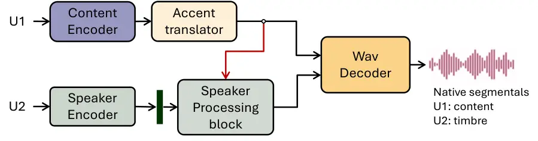
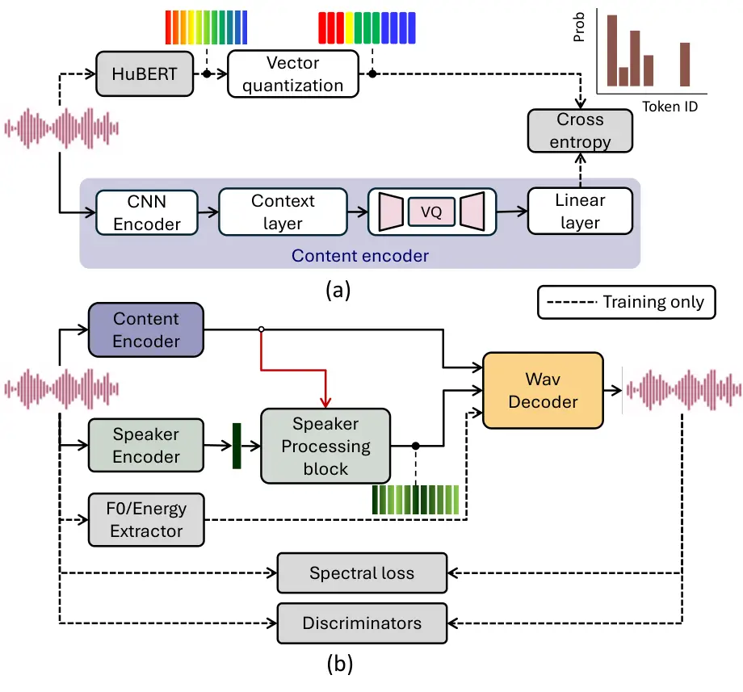
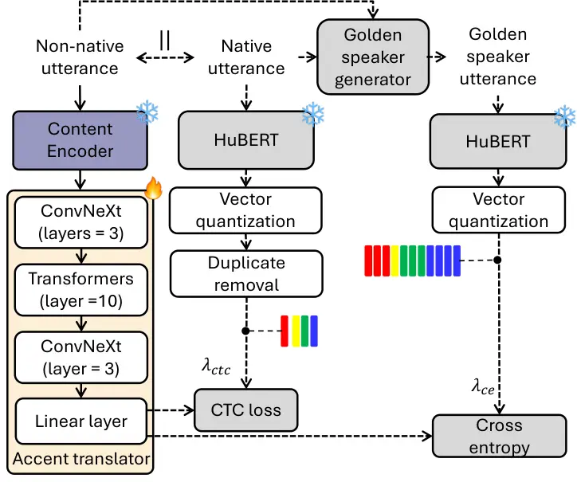

# PHONOS: PHOnetic Neutralization for Online Streaming Applications

Waris Quamer, Mu-Ruei Tseng, Ghady Nasrallah and Ricardo Gutierrez-Osuna
Affiliation: Department of Computer Science and Engineering  
Texas A&M University  
College Station, United States  
{quamer.waris, mtseng, ghadynasrallah, rgutier}@tamu.edu

###### Abstract

Speaker anonymization (SA) systems modify timbre while leaving regional
or non-native accent cues intact, which is problematic because such cues
can reveal a speaker’s first-language or geographic background and
narrow the anonymity set. To address this issue, we present PHONOS, a
streaming module for real-time SA that performs accent neutralization in
a privacy sense: reducing accent-origin cues by converting non-native
segmental realizations toward a chosen target accent domain. Our
approach pre-generates _golden speaker_ utterances that preserve source
timbre and rhythm but replace foreign segmentals with native ones using
silence-aware DTW alignment and zero-shot voice conversion. These
utterances supervise a _causal_ accent translator that maps non-native
content tokens to native equivalents with at most 40ms look-ahead,
trained using joint cross-entropy and CTC losses. Our evaluations show
an 81% reduction in non-native accent confidence, with listening-test
accentedness ratings consistent with this shift. PHONOS also moves
outputs away from the original speaker in embedding space, suggesting
lower linkability under an embedding-based proxy, while running with
$`\leq 241\,\mathrm{ms}`$ end-to-end latency on a single GPU.

###### Index Terms: 

streaming accent conversion, static traits, voice conversion, privacy
preservation, pronunciation correction.

## I Introduction

Beyond linguistic content, a speech signal encodes a rich set of
biometric and paralinguistic cues such as speaker identity, age, gender,
emotional state, and accent, any of which can be exploited by
adversaries for recognition, profiling, or surveillance \[1, 2\]. As
voice-based interfaces proliferate and privacy regulations tighten,
protecting these attributes without degrading the communicative utility
of speech has become an urgent challenge. The VoicePrivacy Challenge
\[1\], now in its third edition, has formalized the evaluation of
speaker anonymization systems that balance privacy against
intelligibility. In parallel, IARPA’s Anonymous Real-Time Speech (ARTS)
program \[3\] has pushed the development of streaming solutions that
must operate under tight latency budgets while preventing speaker
re-identification, modifying static traits such as dialect and age, and
suppressing dynamic traits such as emotion.

The dominant approach to speaker anonymization follows a
voice-conversion template: decompose speech into content and speaker
representations, replace the speaker embedding with a pseudo-speaker
identity, and resynthesize \[4, 5\]. Recent streaming systems based on
causal CNN-transformer architectures \[6, 7\], time-varying timbre
representations \[8\], and language-model decoders \[9, 10\] have shown
strong anonymization performance under sub-second latency. Yet these
systems share a critical blind spot: they modify _who_ the speaker
sounds like, but do not explicitly change _where_ the speaker sounds
like they are from. Accent–a static trait that reflects a speaker’s
first language, geographic origin, and sociolinguistic background–may
remain partially preserved after voice conversion.

This omission matters because accent is a privacy-relevant attribute
that affects speaker linkability, personal attribute inference, and
social perception. Speaker verification systems exhibit strong
accent-dependent bias \[11\], and both forensic and automated methods
exploit accent cues to infer geographic origin and background \[12,
13\]. As a result, accent has been explicitly identified as personally
identifiable information that can be exploited in privacy attacks
\[14\]. Beyond linkability, accent also shapes social perception in
consequential ways: non-native speakers are judged as less trustworthy
and competent, with downstream effects on hiring decisions, courtroom
credibility, and access to services \[15, 16, 17, 18, 19\].

Prior work on phonetic neutralization, commonly referred to as
foreign-accent conversion (FAC), has focused on computer-assisted
pronunciation training (CAPT) for non-native learners, with early
research on ”imitation training” suggesting that learners can improve
their pronunciation by listening to a voice similar to their own but
exhibiting native pronunciations (i.e., a golden speaker) \[20, 21\].
Thus, the benefits of neutralizing accents goes beyond privacy
considerations and can improve communication in a new language\[22, 23,
24, 25\], making FAC a must-have capability to existing voice
anonymization pipelines. Early FAC methods required parallel native
references at inference \[26, 27\]. Zhao et al. \[22\] removed this
constraint with a two-stage reference-free approach using golden speaker
synthesis followed by pronunciation correction. Subsequent work extended
FAC to zero-shot multi-speaker settings via semantic translation with
minimal parallel data \[28, 29\], and LLM-based multitask
frameworks \[30\]. Most recently, Nguyen et al. \[31\] proposed a
streaming accent conversion model, though with a high latency (0.8 s).
Despite this progress, the literature does not report on FAC systems
that can operate with low-latency ($`\leq 250\,\mathrm{ms}`$) for
streaming, nor has accent-neutralization been evaluated as a
privacy-enhancing component within a speaker anonymization pipeline.

In this paper, we propose PHONOS¹¹ 1 Demo:
https://anonymousis23.github.io/demos/phonos, a streaming model for
real-time foreign accent conversion and voice anonymization. We use the
expression _phonetic neutralization_ in a privacy-preservation sense,
where the goal is not to produce native-accented speech, but to reduce
cues that can reveal a speaker’s first-language or linguistic
background. PHONOS adapts a reference-free FAC approach to causal,
low-latency inference using TVTSyn \[8\] as the streaming synthesis
backbone, achieving reductions in source-accent cues with
$`\leq 120\,\mathrm{ms}`$ future context and $`\leq 241\,\mathrm{ms}`$
end-to-end GPU latency.

Our contributions are threefold:

- •
  We formulate accent neutralization as a privacy-motivated
  source-accent cue reduction problem for real-time speaker
  anonymization.
- •
  We introduce a silence-aware golden-speaker generation pipeline that
  preserves source-speaker timbre and timing while providing
  native-accent supervision for streaming training.
- •
  We propose and evaluate a non-autoregressive causal token-space accent
  translator that achieves strong source-accent cue reduction under
  low-latency constraints, with comparisons against reconstruction
  controls, offline baselines, and golden-speaker upper bounds.

## II Method

PHONOS is a streaming foreign accent conversion (FAC) system for voice
anonymization that modifies segmental/phonetic realizations while
preserving or anonymizing speaker identity under real-time constraints.
We follow a two-stage training paradigm inspired by reference-free FAC
\[22\], redesigned for causal inference, duration preservation
(including pauses), and integration with a streaming speech synthesizer
(TVTSyn \[8\]). Stage I generates duration-matched golden speaker
utterances offline, while Stage II trains a streaming accent translation
model that operates fully online.

### II-A Problem formulation

Foreign accent conversion aims to modify pronunciation patterns of
non-native (L2) speech while preserving linguistic content and speaker
identity \[22\]. In PHONOS, we reformulate this problem as _accent
neutralization_ for privacy-preserving speech generation. We use the
term neutralization not to imply the existence of ”accent-free” speech.
Specifically, neutralization denotes reducing cues to accent origin that
may allow a listener or automated model to infer a speaker’s
first-language, regional, or sociolinguistic background. Operationally,
this corresponds to converting speech from a source-accent domain toward
a specified target-accent domain while preserving the intended
linguistic content.

Because L2 speakers generally cannot produce native-accented versions of
their own utterances, direct ground-truth supervision is unavailable.
Prior reference-free FAC work \[22\] addresses this by generating
golden-speaker utterances offline and training a pronunciation
correction model to map L2 speech to these generated targets. We adopt
this paradigm, but impose additional constraints beyond the original
work required for streaming voice anonymization: (i) causal or
low-lookahead inference ($`\leq`$120 ms), (ii) strict duration
preservation to support frame-level streaming supervision, and (iii)
support for both identity-preserving and identity-anonymizing inference.

In this study, we focus on neutralizing Indian-accented English (INE)
(source accent) using General American English (GAE) as the target
accent, not to suggest that GAE is universally considered a neutral or
accent-free dialect. Under this formulation, PHONOS does not remove
accent in an absolute linguistic sense; rather, it reduces INE-specific
accent-origin cues by converting segmental/phonetic realizations toward
the chosen GAE target domain.

Fig. 1: PHONOS inference pipeline. Non-native speech is encoded into
content tokens, accent-translated to native tokens, and decoded into a
waveform conditioned on the original or pseudo-speaker embedding.

Fig. 2: TVTSyn training workflow. (a) content encoder trained against
HuBERT k-means pseudo-labels, and (b) wav decoder conditioned on speaker
embedding trained with self-supervision and discriminator objectives.

### II-B System overview

Formally, given a non-native utterance $`x^{\mathrm{L2}}`$, we generate
a golden speaker utterance $`\hat{x}^{\mathrm{GS}}`$ that combines
native segmental pronunciation (i.e., content tokens) with non-native
timbre and timing. A causal pronunciation correction model
$`f_{\theta}`$ is then trained such that
$`f_{\theta}(x^{\mathrm{L2}})\approx\hat{x}^{\mathrm{GS}}`$, operating
without native references at inference. At inference (Figure 1), the
system operates as a streaming pipeline consisting of: (i) a content
encoder that extracts discrete, speaker-independent tokens from incoming
speech, (ii) an accent translator that maps non-native tokens to native
tokens, and (iii) a waveform decoder conditioned on a speaker embedding.

The accent translator can be viewed as performing machine translation in
phonetic token space, i.e., mapping between pronunciation domains rather
than languages. The content encoder and decoder are inherited from
TVTSyn \[8\], while the accent translator is the key contribution of
this work.

TVTSyn backbone. Shown in Figure 2, TVTSyn is a streaming speech
synthesizer designed for low-latency voice conversion and anonymization
\[8\]. Its content encoder uses a causal CNN followed by transformer
layers with a 2 s look-back window and 80 ms look-ahead, producing 50 Hz
frame embeddings quantized through a factorized VQ bottleneck and
trained with cross-entropy against HuBERT $`k`$-means pseudo-labels
($`N{=}200`$). The decoder mirrors this architecture but without any
lookahead in the transformer layers and reconstructs waveforms via
causal transposed convolutions. TVTSyn achieves as low as 80 ms GPU
latency; we refer readers to \[8\] for full architectural details. For
this study, we made the following changes to the original architecture
of TVTSyn, (i) we assigned 40 ms lookahead to both encoder and decoder
blocks, resulting in the same overall lookahead setting as the original
implementation, and (ii) fed the decoded tokens rather than the VQ block
output of the encoder. In our PHONOS formulation, TVTSyn provides the
streaming content encoder and waveform decoder; the contributions
specific to PHONOS are the duration-matched golden-speaker construction
and the causal token-space accent translator as described below.

Fig. 3: Golden speaker generation. Native and non-native content
embeddings are duration-aligned via silence-aware DTW, then synthesized
with the non-native speaker’s identity.

### II-C Stage I: Golden Speaker generation

Golden speaker generation is performed offline to construct
duration-matched supervision for the streaming accent translator. For
each L2 utterance, we synthesize a target-accent L1 utterance from the
same transcript using the TTS system described in Section III. Thus,
Stage I does not require naturally recorded cross-accent parallel
speech. The synthesized L1 utterance and original L2 utterance form a
pseudo-parallel pair from which target-accent segmental content is
transferred onto the L2 speaker’s timing and voice. Since the two
utterances share the same lexical content but differ in accent
realization, the resulting golden-speaker utterance provides a
supervised target that preserves the L2 speaker’s rhythm, pause
structure, and timbre while replacing source-accent segmental cues with
target-accent realizations. This is critical for Stage II, where the
accent translator is trained with frame-level supervision and must
preserve input-output timing during online inference. The procedure
consists of two steps: silence-aware alignment and synthesis, as shown
in Figure 3.

Silence-aware alignment. We extract content features from the L1 and L2
utterances using the Whisper-small encoder from Seed-VC \[32\]. Direct
DTW over full utterances often produces poor alignments around pauses
and silence boundaries. To avoid this, we first remove silence regions
using Silero VAD \[33\], perform DTW only over non-silent segments, and
resample the L1 content sequence to the L2 timing grid. We then reinsert
silence at the original L2 positions. This yields an aligned
native-accent content sequence with the same duration and pause
structure as the L2 utterance.

Synthesis.²² 2 Synthetic parallel data released at:
https://huggingface.co/datasets/warisqr007/GAPS The aligned
native-accent content sequence is combined with a speaker embedding
extracted from the L2 utterance and passed to the Seed-VC
synthesizer \[32\], which uses a flow-matching diffusion transformer
with a BigVGAN-v2 vocoder \[34\]. The resulting golden-speaker waveform
combines target-accent pronunciation with the L2 speaker’s timbre and
timing. These waveforms are used only as offline training targets and
are not required during PHONOS inference.

Fig. 4: PHONOS’s accent translator architecture. Non-native content
tokens pass through ConvNeXt and limited-context transformer layers to
produce native content tokens.

### II-D Stage II: streaming pronunciation correction

We train a non-autoregressive _accent translator_ that maps L2 content
tokens to L1 content tokens in the TVTSyn discrete token space, using
golden speaker utterances as supervision–see Figure 4.

Architecture. L2 speech is first encoded into discrete tokens by the
frozen TVTSyn content encoder and VQ bottleneck. The accent translator
comprises: (i) a front ConvNeXt block (3 causal layers) for local
phonetic patterns, (ii) a transformer block (10 layers, 8 heads) with
500 ms past and 40 ms future context for coarticulatory dependencies,
and (iii) a rear ConvNeXt block (3 causal layers) with a gated skip
connection from the transformer output. A linear head projects to
$`201`$ classes (200 content codes + CTC blank).

Training. The model is trained with a dual loss
$`\mathcal{L}=\lambda_{\mathrm{CE}}\,\mathcal{L}_{\mathrm{CE}}+\lambda_{\mathrm{CTC}}\,\mathcal{L}_{\mathrm{CTC}}`$.
Cross-entropy is computed against frame-aligned HuBERT pseudo-labels
from the golden speaker utterances, exploiting the DTW alignment for
fine-grained supervision. CTC is computed against de-duplicated native
token sequences, providing robustness to residual alignment errors since
it requires no frame-level correspondence. We trained ablations for
different values for $`\lambda_{\mathrm{CE}}`$ and
$`\lambda_{\mathrm{CTC}}`$ and found best model performance for
$`\lambda_{\mathrm{CE}}{=}\lambda_{\mathrm{CTC}}{=}1.0`$.

Inference. The system operates fully online: L2 speech is processed
frame-by-frame through the content encoder, accent translator, and
decoder. Accent-translated tokens replace the original L2 tokens before
decoding. We use top-$`k`$ sampling ($`k{=}10`$, $`T{=}0.7`$) for
natural token diversity.

| Input type                  | $`\boldsymbol{C_{\mathrm{NA}}}`$ (%) ($`\uparrow`$) | $`\boldsymbol{C_{\mathrm{NN}}}`$ (%) ($`\downarrow`$) | $`\boldsymbol{\Delta p}`$ ($`\uparrow`$) | Accentedness ($`\downarrow`$) | NISQA-MOS ($`\uparrow`$) | MOS ($`\uparrow`$) | WER($`\downarrow`$) | $`\boldsymbol{SpkSim}`$ |
| --------------------------- | --------------------------------------------------- | ----------------------------------------------------- | ---------------------------------------- | ----------------------------- | ------------------------ | ------------------ | ------------------- | ----------------------- |
| GT-GAE                      | 100.0                                               | 0.0                                                   | \-                                       | $`3.90\pm 2.07`$              | $`4.84\pm 0.20`$         | $`3.92\pm 0.89`$   | $`0.05\pm 0.09`$    | \-                      |
| TVTSyn-GAE                  | 100.0                                               | 0.0                                                   | \-                                       | $`3.87\pm 2.09`$              | $`4.46\pm 0.40`$         | $`3.70\pm 0.89`$   | $`0.07\pm 0.14`$    | \-                      |
| GT-INE                      | 13.5                                                | 86.5                                                  | \-                                       | $`5.00\pm 2.28`$              | $`3.86\pm 0.57`$         | $`3.83\pm 0.87`$   | $`0.11\pm 0.15`$    | \-                      |
| TVTSyn-INE                  | 57.5                                                | 42.5                                                  | 0.41                                     | $`4.89\pm 2.11`$              | $`3.35\pm 0.51`$         | $`3.49\pm 0.99`$   | $`0.35\pm 0.24`$    | $`0.86\pm 0.04`$        |
| Golden Speaker              | 99.2                                                | 0.8                                                   | 0.83                                     | $`3.98\pm 1.84`$              | $`4.13\pm 0.52`$         | $`3.75\pm 0.86`$   | $`0.09\pm 0.14`$    | $`0.80\pm 0.05`$        |
| _Offline baselines_         |                                                     |                                                       |                                          |                               |                          |                    |                     |                         |
| VEVO \[35\]                 | 90.3                                                | 9.7                                                   | 0.78                                     | \-                            | $`4.05\pm 0.59`$         | \-                 | $`0.35\pm 0.24`$    | $`0.80\pm 0.07`$        |
| SeedVC v2 \[32\]            | 99.5                                                | 0.5                                                   | 0.84                                     | \-                            | $`4.62\pm 0.31`$         | \-                 | $`0.31\pm 0.26`$    | $`0.50\pm 0.04`$        |
| _Proposed streaming system_ |                                                     |                                                       |                                          |                               |                          |                    |                     |                         |
| PHONOS                      | 97.0                                                | 3.0                                                   | 0.81                                     | $`4.14\pm 1.45`$              | $`3.33\pm 0.88`$         | $`3.49\pm 0.91`$   | $`0.24\pm 0.21`$    | $`0.72\pm 0.08`$        |

TABLE I: Accent neutralization, quality, intelligibility, and speaker
similarity evaluation on L2-ARCTIC Indian English speakers.
$`C_{\mathrm{NA}}`$: % of utterances classified as a native accent.
$`C_{\mathrm{NN}}`$: % classified as non-native. $`\Delta p`$: mean
posterior probability shift toward native accent classes relative to the
original Indian English input (higher is better). Accentedness:
subjective foreign accentedness on a 9-point scale (lower is better).
NISQA-MOS: predicted MOS for speech quality. MOS: subjective quality on
a 5-point scale. WER: word error rate computed against ground-truth
transcripts using an automatic ASR system (lower is better). SpkSim:
cosine similarity between the output and the GT-INE speaker embedding.
Subjective ratings were collected for the ground-truth, TVTSyn, Golden
Speaker, and PHONOS conditions.

## III Experimental setup

Training corpus for accent conversion. TVTSyn is trained on LibriTTS
\[36\] corpus. We train our accent translator module using
original-golden speaker pairs derived from the IndicTTS³³ 3
https://www.iitm.ac.in/donlab/indictts/database \[37\] corpus, which
contains approximately 250 hours of Indian-accented English speech from
25 speakers. All recordings are sampled at 16 kHz.

Native speech corpus for Golden Speaker generation. Native English
speech for golden speaker generation is generated using an off-the-self
TTS system (F5-TTS \[38\]) using the available ground truth
transcription from IndicTTS corpus. Native utterances are used only
during the offline golden speaker generation stage and are discarded
afterwards.

Evaluation. We evaluate our system on the Indian subset of L2-ARCTIC
\[39\], so the evaluation is cross-corpus and on unseen speakers. The
objective evaluation uses all four Indian-English speakers in L2-ARCTIC,
with 100 randomly sampled utterances per speaker (400 utterances total).
We perform synthesis in self-reconstruction mode, i.e., we condition the
system on the speaker embedding extracted from the same source utterance
that is fed to the content encoder. For each subjective test, 20
listeners rated 90 samples, with 15 samples per evaluated condition.

Because no prior system matches our complete operating point of
reference-free, low-latency streaming FAC integrated with a streaming
anonymization backbone, we organize comparisons into three groups.
First, we include reconstruction controls using the TVTSyn backbone
without accent translation: we use TVTSyn to reconstruct INE utterances
(TVTSyn-INE) and GAE utterances (TVTSyn-GAE). Second, we include Golden
Speaker utterances as an offline upper bound, since these are the
Stage-I supervision targets generated using aligned native pronunciation
and the source speaker identity. Third, we compare against VEVO \[35\]
and SeedVC v2\[32\] as non-streaming / offline zero-shot voice
conversion reference systems that support accent conversion. Note that
VEVO and SeedVC v2 are not latency-matched baselines; instead, using
them for comparison helps us contextualize how much accent reduction,
quality change, and speaker-embedding displacement can be achieved when
the causal streaming constraint is relaxed. Although Stage I target
construction also uses the SeedVC family of models, PHONOS does not use
SeedVC at inference time.

Model training. All modules were trained using the AdamW optimizer with
an initial learning rate of $`5\times 10^{-4}`$ and a batch size of 16
and an ExponentialLR scheduler with decay factor $`\gamma=0.999996`$.
The accent translator module was trained for $`250k`$ steps on an NVIDIA
RTX 3090 GPU. The accent translator introduces $`34.5M`$ parameters;
combined with the TVTSyn backbone, the full PHONOS pipeline totals
$`125.8M`$ parameters.

## IV Experiments and Results

We conduct objective and subjective experiments to evaluate (i)
streaming accent neutralization, (ii) synthesis quality and
intelligibility, and (iii) how accent conversion affects speaker
verifiability. We compare eight evaluation conditions: GT-GAE (native
General American English, upper bound), TVTSyn-GAE (GAE reconstructed
through TVTSyn, isolating synthesis artifacts), GT-INE (Indian English
baseline), TVTSyn-INE (INE reconstructed through TVTSyn), Golden Speaker
(offline Stage I targets), outputs from VEVO and SeedVC v2 baselines,
and PHONOS (Proposed) (full streaming pipeline).

### IV-A Accent Neutralization

We use an off-the-shelf English accent classifier⁴⁴ 4
https://huggingface.co/Jzuluaga/accent-id-commonaccent_xlsr-en-english
as a perceptual probe. Given an utterance $`x`$, it outputs
$`p(\cdot\mid x)`$ over 16 accents (8 native, 8 non-native). We report
_native_ and _non-native_ classification rates ($`C_{\mathrm{NA}}`$,
$`C_{\mathrm{NN}}`$) as % of utterances classified as native and
non-native respectively, and a softer confidence metric: given native
posterior mass as
$`p_{\mathrm{NA}}(x)=\sum_{a\in\mathcal{A}_{\mathrm{NA}}}p(a\mid x)`$,
where $`\mathcal{A}_{\mathrm{NA}}`$ represents set of native accent
classes, we define mean probability shift towards native accent classes
as
$`\Delta p=\frac{1}{N}\sum_{i}(p_{\mathrm{NA}}(x^{\prime}_{i})-p_{\mathrm{NA}}(x_{i}))`$,
here $`x^{\prime}_{i}`$ and $`x_{i}`$ are synthesized and original
utterances respectively.

Table I shows the probe cleanly separates original Indian and American
speech (GT-INE: $`C_{\mathrm{NA}}{=}13.5\%`$ vs. GT-GAE: $`100\%`$).
Notably, reconstructing Indian English through TVTSyn already increases
$`C_{\mathrm{NA}}`$ to $`57.5\%`$ ($`\Delta p{=}0.41`$), suggesting the
native-trained discrete content bottleneck partially normalizes
non-native realizations by mapping them to nearby native codebook
entries, consistent with observations in discrete token pipelines
\[40\]. Stage I golden speakers reach near-native performance
($`C_{\mathrm{NA}}{=}99.2\%`$, $`\Delta p{=}0.83`$), validating the
target construction. PHONOS approaches this upper bound
($`C_{\mathrm{NA}}{=}97.0\%`$, $`\Delta p{=}0.81`$), with only $`3\%`$
still classified as non-native; the remaining gap is plausibly due to
streaming constraints (40 ms look-ahead) limiting resolution of
accent-bearing coarticulatory transitions.

Compared with the non-streaming reference systems, PHONOS performs
favorably despite operating under causal streaming constraints. VEVO
improves native-accent classification substantially
($`C_{\mathrm{NA}}{=}90.3\%`$, $`\Delta p{=}0.78`$), but remains below
that of PHONOS ($`C_{\mathrm{NA}}{=}97.0\%`$, $`\Delta p{=}0.81`$),
suggesting that the proposed token-space accent translator trained on
supervised golden speaker utterances is more effective at shifting
Indian-accented English toward the GAE target-accent domain than this
self-supervised VC baseline. SeedVC v2 reaches slightly higher
accent-probe performance ($`C_{\mathrm{NA}}{=}99.5\%`$,
$`\Delta p{=}0.84`$), comparable to the Golden Speaker upper bound.
However, SeedVC v2 is an offline system and is not constrained by causal
inference or limited look-ahead. Thus, PHONOS achieves accent-probe
performance close to the strongest offline reference while maintaining
the low-latency streaming operating point targeted in this work.

Subjective accentedness ratings (N=20; 9-point Likert, lower is better)
corroborate these trends. GT-INE is rated most accented
($`5.00\pm 2.28`$), while PHONOS reduces accentedness to
$`4.14\pm 1.45`$ ($`\approx`$17% relative), close to golden speaker
($`3.98\pm 1.84`$) and native speech (GT-GAE: $`3.90\pm 2.07`$).
TVTSyn-INE shows only marginal perceptual improvement ($`4.89\pm 2.11`$)
aligning with its partial probe shift; PHONOS improvement of
accentedness rating over TVTSyn-INE is statistically significant
($`p=0.024`$). Thus, the listener ratings independently support an
accent-reduction effect beyond the shift induced by TVTSyn
reconstruction alone.

### IV-B Synthesis Quality and Intelligibility

We assess objective quality using NISQA-MOS \[41\]. Native speech scores
highest (GT-GAE: $`4.84\pm 0.20`$), while TVTSyn reconstruction
introduces expected synthesis artifacts (TVTSyn-GAE: $`4.46\pm 0.40`$).
For Indian English, GT-INE is lower ($`3.86\pm 0.57`$), likely
reflecting accent mismatch to NISQA’s training distribution, and
TVTSyn-INE drops further ($`3.35\pm 0.51`$). PHONOS matches TVTSyn-INE
($`3.33\pm 0.88`$), indicating accent translation does not add quality
degradation beyond the TVTSyn backbone. Golden speakers score higher
($`4.13\pm 0.52`$), consistent with Seed-VC being an offline,
high-capacity diffusion system.

While VEVO and SeedVC v2 obtain higher objective quality than PHONOS,
this gap is expected because both reference systems operate offline and
use higher-capacity generation pipelines, whereas PHONOS is constrained
by the streaming TVTSyn backbone. Importantly, PHONOS remains
essentially matched to TVTSyn-INE, indicating that the accent translator
itself does not introduce measurable additional quality degradation
beyond that due to causal inference. Thus, while offline systems provide
an upper quality reference, the relevant streaming comparison is between
PHONOS and TVTSyn-INE.

Subjective MOS (N=20; 5-point, higher is better) mirrors the objective
trends: PHONOS and TVTSyn-INE are comparable ($`3.49\pm 0.91`$ vs.
$`3.49\pm 0.99`$), while golden speakers are higher ($`3.75\pm 0.86`$)
and GT-GAE remains best ($`3.92\pm 0.89`$). Overall, the quality cost is
dominated by the streaming synthesis backbone rather than the accent
translator.

To further assess lexical intelligibility, we compute word error rate
(WER) by transcribing each condition with Whisper-base ASR⁵⁵ 5
https://huggingface.co/openai/whisper-base and comparing the output
against the ground-truth transcript. For native-accented speech, GT-GAE
and TVTSyn-GAE remain comparable ($`0.05\pm 0.09`$ vs.
$`0.07\pm 0.14`$), indicating that the TVTSyn reconstruction pipeline
largely preserves lexical content when the input is close to the
native-accent domain used to train the content encoder. In contrast,
Indian-accented speech shows substantially larger degradation after
reconstruction: WER increases from $`0.11\pm 0.15`$ for GT-INE to
$`0.35\pm 0.24`$ for TVTSyn-INE. This is consistent with a domain
mismatch as the TVTSyn content encoder was trained primarily on native
English speech and is therefore less robust to non-native phonetic
realizations. PHONOS reduces WER to $`0.24\pm 0.21`$, corresponding to
an approximately 31% relative improvement over TVTSyn-INE and
outperforming the offline VEVO ($`0.35\pm 0.24`$) and SeedVC v2
($`0.31\pm 0.26`$) references. Nevertheless, PHONOS remains worse than
the original GT-INE speech ($`0.24`$ vs. $`0.11`$ WER), indicating that
accent translation recovers only part of the intelligibility loss
introduced by the native-trained streaming backbone. This residual gap
represents a utility trade-off and motivates future work on more
accent-robust streaming content representations.

### IV-C Speaker Similarity

To quantify speaker similarity, we compute cosine similarity ($`SpkSim`$
column in Table I) between each processed utterance’s speaker embedding
and the corresponding GT-INE speaker embedding. We interpret this as a
linkability proxy rather than a full attacker-based privacy evaluation.
Accordingly, these SpkSim results establish embedding-space displacement
under the selected speaker encoder, but should not be interpreted as
evidence of reduced linkability against an attacker-based ASV system.

TVTSyn-INE preserves high similarity ($`0.86\pm 0.04`$), showing that
reconstruction through the streaming backbone largely retains speaker
identity cues when accent is not explicitly modified. Golden Speaker and
VEVO both reduce similarity to $`0.80`$, likely reflecting a combination
of pronunciation change and synthesis-induced timbre shift. PHONOS
reduces similarity further to $`0.72\pm 0.08`$ despite using the same
target speaker embedding and streaming backbone as TVTSyn-INE,
suggesting that accent conversion changes phonetic and co-articulatory
patterns captured by speaker encoders. SeedVC v2 produces the lowest
similarity ($`0.50\pm 0.04`$), but this much larger displacement likely
reflects stronger timbre or speaker-representation modification rather
than controlled accent conversion alone. Thus, PHONOS provides
additional embedding-space displacement relative to reconstruction and
VEVO, while avoiding the much larger identity shift observed for SeedVC
v2.

### IV-D Runtime and streaming performance

We evaluate real-time and streaming latency by running end-to-end
inference in a chunked setting and reporting real-time factor (RTF) and
algorithmic latency. The reported latency includes input chunk
accumulation, required future context, and processing time for the
content encoder, accent translator, and decoder. On a NVIDIA RTX 3090
GPU, with an 80 ms chunk size, the system achieves an RTF of 0.6 and an
end-to-end latency of 241 ms, which includes the 80 ms input chunk
accumulation and the 120 ms lookahead required by the system. On CPU,
the system runs in real time at a larger chunk size: using 160 ms
chunks, it achieves real-time throughput with a total latency of 370 ms,
again including the 160 ms chunking delay and 120 ms lookahead.

## V Discussion

We proposed PHONOS, a streaming accent neutralization system that
reduces source-accent cues under tight latency budgets without
measurable quality degradation beyond the streaming synthesis backbone.
In our experiments, PHONOS also lowers speaker-embedding similarity
relative to a TVTSyn reconstruction baseline that shares the same
backbone and speaker embedding but does not modify accent, indicating
that accent contributes identity-relevant phonetic and coarticulatory
information. One of the reasons could be that changing segmental
realizations perturbs the phonetic patterns and associated spectral
structure that speaker encoders rely on, this additional displacement is
consistent with lower speaker similarity under the embedding-space proxy
used here. These effects suggest that accent neutralization can serve as
a complementary component to identity replacement in real-time voice
anonymization pipelines. However, we do not evaluate an adaptive or
attacker-based ASV system, so these results should not be interpreted as
establishing reduced ASV linkability or end-to-end speaker privacy.

Our results complement prior reference-free FAC work \[22, 28\], which
did not consider streaming constraints, and extend streaming
anonymization work \[7, 8\], which primarily focuses on identity
replacement. The current evaluation is limited to Indian-accented
English. However, the proposed framework is not specific to the
INE-to-GAE setting. So, given source-accent speech and a target-accent
domain for golden-speaker construction, the same silence-aware alignment
and token-space translation process can be extended to other accent
pairs. Stage I targets are constructed using synthesized rather than
naturally recorded target-accent speech, which may introduce
TTS-specific characteristics into the supervision. Future work will
expand the proposed methodology to additional L1 backgrounds and larger
speaker populations, combine with pseudo-identity replacement and
evaluate against attacker models using ASV-based linkability metrics,
and incorporate prosodic modification to address residual accent cues
not captured by segmental conversion.

## Acknowledgment

Supported by the Intelligence Advanced Research Projects Activity
(IARPA) via Department of Interior/Interior Business Center (DOI/IBC)
contract number 140D0424C0066. The U.S. Government is authorized to
reproduce and distribute reprints for Governmental purposes
notwithstanding any copyright annotation thereon. Disclaimer: The views
and conclusions contained herein are those of the authors and should not
be interpreted as necessarily representing the official policies or
endorsements, either expressed or implied, of IARPA, DOI/IBC, or the
U.S. Government.

Large language models were only used to improve writing clarity,
grammar, and style. No experimental design, data analysis, or result
interpretation relied on automated tools.

## References

- \[1\] N. Tomashenko, X. Miao, P. Champion, S. Meyer, X. Wang, E.
  Vincent, M. Panariello, N. Evans, J. Yamagishi, and M. Todisco (2024)
  The voiceprivacy 2024 challenge evaluation plan. arXiv preprint
  arXiv:2404.02677. Cited by: §I.
- \[2\] J. Patino, N. Tomashenko, M. Todisco, A. Nautsch, and N.
  Evans (2021) Speaker Anonymisation Using the McAdams Coefficient. In
  Proc. Interspeech, pp. 1099–1103. Cited by: §I.
- \[3\] IARPA (2023) Anonymous real-time speech (ARTS) program. External
  Links: [Link](https://www.iarpa.gov/research-programs/arts) Cited by:
  §I.
- \[4\] B. M. L. Srivastava, N. Tomashenko, X. Wang, E. Vincent, J.
  Yamagishi, M. Maouche, A. Bellet, and M. Tommasi (2020) Design Choices
  for X-Vector Based Speaker Anonymization. In Proc. Interspeech,
  pp. 1713–1717. Cited by: §I.
- \[5\] S. Meyer, P. Tilli, P. Denisov, F. Lux, J. Koch, and N. T.
  Vu (2023) Anonymizing speech with generative adversarial networks to
  preserve speaker privacy. In 2022 IEEE Spoken Language Technology
  Workshop (SLT), pp. 912–919. Cited by: §I.
- \[6\] W. Quamer and R. Gutierrez-Osuna (2024) End-to-end streaming
  model for low-latency speech anonymization. In 2024 IEEE Spoken
  Language Technology Workshop (SLT), pp. 727–734. Cited by: §I.
- \[7\] W. Quamer and R. Gutierrez-Osuna (2025) DarkStream: real-time
  speech anonymization with low latency. In 2025 IEEE Automatic Speech
  Recognition and Understanding Workshop (ASRU), Vol. , pp. 1–7.
  External Links:
  [Document](https://dx.doi.org/10.1109/ASRU65441.2025.11434609) Cited
  by: §I, §V.
- \[8\] W. Quamer, M. Tseng, G. Nasrallah, and R. Gutierrez-Osuna (2026)
  TVTSyn: content-synchronous time-varying timbre for streaming voice
  conversion and anonymization. In The Fourteenth International
  Conference on Learning Representations, Cited by: §I, §I, §II-B,
  §II-B, §II, §V.
- \[9\] Z. Cai, H. L. Xinyuan, A. Garg, L. P. García-Perera, K. Duh, S.
  Khudanpur, M. Wiesner, and N. Andrews (2025) GenVC: self-supervised
  zero-shot voice conversion. arXiv preprint arXiv:2502.04519. Cited by:
  §I.
- \[10\] N. Kuzmin, S. Liu, K. A. Lee, and E. S. Chng (2026)
  Stream-voice-anon: enhancing utility of real-time speaker
  anonymization via neural audio codec and language models. arXiv
  preprint arXiv:2601.13948. Cited by: §I.
- \[11\] M. Estevez and L. Ferrer (2023) Study on the fairness of
  speaker verification systems across accent and gender groups. In
  ICASSP 2023-2023 IEEE International Conference on Acoustics, Speech
  and Signal Processing (ICASSP), pp. 1–5. Cited by: §I.
- \[12\] J. Rosenhouse (2017) A forensic linguistics problem: asylum
  seekers’ dialect identification difficulties in under-documented
  adjacent arabic dialects. International Journal of Legal Discourse 2
  (1), pp. 113–123. Cited by: §I.
- \[13\] M. A. Humayun, J. Shuja, and P. E. Abas (2024) A review of
  social background profiling of speakers from speech accents. PeerJ
  Computer Science 10, pp. e1984. Cited by: §I.
- \[14\] F. Nespoli (2024) Voice conversion and text-to-speech for
  privacy protection applications. External Links:
  [Link](https://hdl.handle.net/10044/1/117980),
  [Document](https://dx.doi.org/https%3A//doi.org/10.25560/117980) Cited
  by: §I.
- \[15\] S. Lev-Ari and B. Keysar (2010) Why don’t we believe non-native
  speakers? the influence of accent on credibility. Journal of
  experimental social psychology 46 (6), pp. 1093–1096. Cited by: §I.
- \[16\] J. N. Fuertes, W. H. Gottdiener, H. Martin, T. C. Gilbert,
  and H. Giles (2012) A meta-analysis of the effects of speakers’
  accents on interpersonal evaluations. European journal of social
  psychology 42 (1), pp. 120–133. Cited by: §I.
- \[17\] C. L. C. Baquiran and E. Nicoladis (2020) A doctor’s foreign
  accent affects perceptions of competence. Health Communication 35 (6),
  pp. 726–730. Cited by: §I.
- \[18\] M. K. Geiger, L. A. Langlinais, and M. Geiger (2023) Accent
  speaks louder than ability: elucidating the effect of nonnative accent
  on trust. Group & Organization Management 48 (3), pp. 953–965. Cited
  by: §I.
- \[19\] A. Paver, D. Wright, N. Braber, and N. Pautz (2025) Stereotyped
  accent judgements in forensic contexts: listener perceptions of social
  traits and types of behaviour. Frontiers in Communication 9,
  pp. 1462013. Cited by: §I.
- \[20\] K. Probst, Y. Ke, and M. Eskenazi (2002) Enhancing foreign
  language tutors–in search of the golden speaker. Speech Communication
  37 (3-4), pp. 161–173. Cited by: §I.
- \[21\] K. Hirose, F. Gendrin, and N. Minematsu (2003) A pronunciation
  training system for Japanese lexical accents with corrective feedback
  in learner’s voice. In Proc. 8th European Conf Speech Communication
  Technology, pp. 3149–3152. Cited by: §I.
- \[22\] G. Zhao, S. Ding, and R. Gutierrez-Osuna (2021) Converting
  foreign accent speech without a reference. IEEE/ACM Transactions on
  Audio, Speech, and Language Processing 29, pp. 2367–2381. Cited by:
  §I, §II-A, §II-A, §II, §V.
- \[23\] S. Ding, C. Liberatore, S. Sonsaat, I. Lučić, A. Silpachai, G.
  Zhao, E. Chukharev-Hudilainen, J. Levis, and R. Gutierrez-Osuna (2019)
  Golden speaker builder–an interactive tool for pronunciation training.
  Speech Communication 115, pp. 51–66. Cited by: §I.
- \[24\] K. J. Van Engen and J. E. Peelle (2014) Listening effort and
  accented speech. Vol. 8, Frontiers Media SA. Cited by: §I.
- \[25\] W. Quamer and R. Gutierrez-Osuna (2025) Disentangling segmental
  and prosodic factors to non-native speech comprehensibility. IEEE
  Transactions on Audio, Speech and Language Processing. Cited by: §I.
- \[26\] S. Aryal, D. Felps, and R. Gutierrez-Osuna (2013) Foreign
  accent conversion through voice morphing.. In Interspeech,
  pp. 3077–3081. Cited by: §I.
- \[27\] G. Zhao, S. Ding, and R. Gutierrez-Osuna (2019) Foreign accent
  conversion by synthesizing speech from phonetic posteriorgrams.. In
  Interspeech, pp. 2843–2847. Cited by: §I.
- \[28\] W. Quamer, A. Das, J. Levis, E. Chukharev-Hudilainen, and R.
  Gutierrez-Osuna (2022) Zero-shot foreign accent conversion without a
  native reference. In Proc. Interspeech 2022, pp. 4920–4924. Cited by:
  §I, §V.
- \[29\] Z. Jia, H. Xue, X. Peng, and Y. Lu (2024) Convert and speak:
  zero-shot accent conversion with minimum supervision. In Proceedings
  of the 32nd ACM International Conference on Multimedia, pp. 4446–4454.
  Cited by: §I.
- \[30\] Z. Cheng, G. Zhang, Z. Tu, Y. Song, S. Mao, X. Jiao, J. Li, Y.
  Guo, and J. Wu (2025) SpeechAccentLLM: a unified framework for foreign
  accent conversion and text to speech. arXiv preprint arXiv:2507.01348.
  Cited by: §I.
- \[31\] T. Nguyen, N. Pham, Ş. Akti, and A. Waibel (2025) Streaming
  non-autoregressive model for accent conversion and pronunciation
  improvement. In Proc. Interspeech 2025, pp. 4163–4167. Cited by: §I.
- \[32\] S. Liu (2024) Zero-shot voice conversion with diffusion
  transformers. arXiv preprint arXiv:2411.09943. Cited by: §II-C, §II-C,
  TABLE I, §III.
- \[33\] S. Team (2024) Silero vad: pre-trained enterprise-grade voice
  activity detector (vad), number detector and language classifier.
  GitHub. Note: https://github.com/snakers4/silero-vad Cited by: §II-C.
- \[34\] S. Lee, W. Ping, B. Ginsburg, B. Catanzaro, and S. Yoon (2022)
  Bigvgan: a universal neural vocoder with large-scale training. arXiv
  preprint arXiv:2206.04658. Cited by: §II-C.
- \[35\] X. Zhang, X. Zhang, K. Peng, Z. Tang, V. Manohar, Y. Liu, J.
  Hwang, D. Li, Y. Wang, J. Chan, et al. Vevo: controllable zero-shot
  voice imitation with self-supervised disentanglement. In The
  Thirteenth International Conference on Learning Representations, Cited
  by: TABLE I, §III.
- \[36\] H. Zen, V. Dang, R. Clark, Y. Zhang, R. J. Weiss, Y. Jia, Z.
  Chen, and Y. Wu (2019) LibriTTS: a corpus derived from librispeech for
  text-to-speech. External Links: 1904.02882,
  [Link](https://arxiv.org/abs/1904.02882) Cited by: §III.
- \[37\] A. Baby, A. L. Thomas, N. N. L, and H. A. Murthy (2016)
  Resources for indian languages. In Community-based Building of
  Language Resources (TSD), pp. 37–43. Cited by: §III.
- \[38\] Y. Chen, Z. Niu, Z. Ma, K. Deng, C. Wang, J. Zhao, K. Yu,
  and X. Chen (2024) F5-tts: a fairytaler that fakes fluent and faithful
  speech with flow matching. arXiv preprint arXiv:2410.06885. Cited by:
  §III.
- \[39\] G. Zhao, S. Sonsaat, A. Silpachai, I. Lucic, E.
  Chukharev-Hudilainen, J. Levis, and R. Gutierrez-Osuna (2018)
  L2-arctic: a non-native english speech corpus. In Proc. Interspeech
  2018, pp. 2783–2787. Cited by: §III.
- \[40\] K. Onda, J. Park, N. Minematsu, and D. Saito (2024) A pilot
  study of gslm-based simulation of foreign accentuation only using
  native speech corpora. In Proc. Interspeech 2024, pp. 3600–3604. Cited
  by: §IV-A.
- \[41\] G. Mittag, B. Naderi, A. Chehadi, and S. Möller (2021) NISQA: a
  deep cnn-self-attention model for multidimensional speech quality
  prediction with crowdsourced datasets. arXiv preprint
  arXiv:2104.09494. Cited by: §IV-B.
