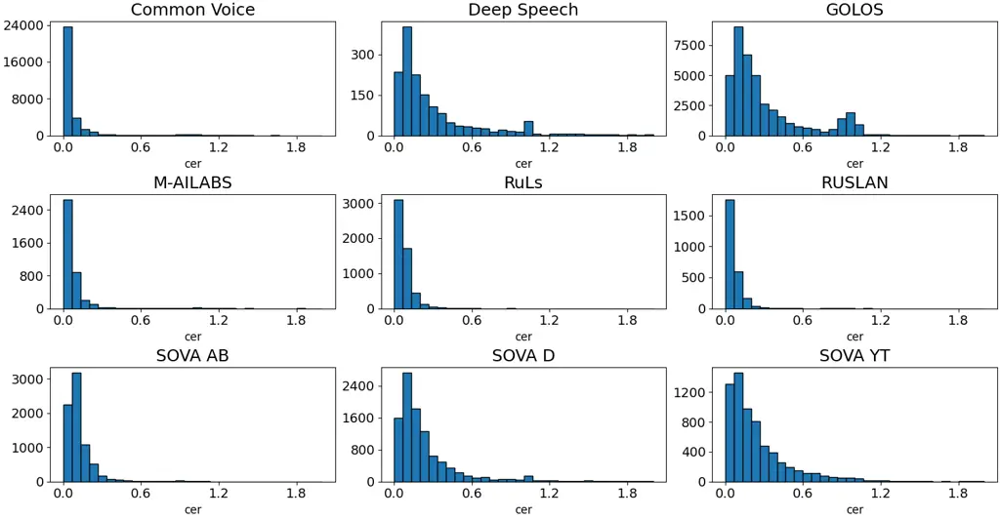
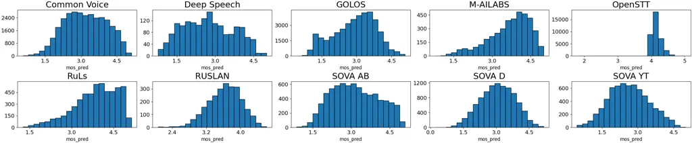

# Evaluating Generalization and Robustness in Russian Anti-Spoofing: The RuASD Initiative

KSENIA LYSIKOVA¹    KIRILL BORODIN¹    GRACH MKRTCHIAN¹

###### Abstract

RuASD (Russian AntiSpoofing Dataset) is a dedicated, reproducible
benchmark for Russian-language speech anti-spoofing designed to evaluate
both in-domain discrimination and robustness to deployment-style
distribution shifts. It combines a large spoof subset synthesized using
37 modern Russian-capable TTS and voice-cloning systems with a bona fide
subset curated from multiple heterogeneous open Russian speech corpora,
enabling systematic evaluation across diverse data sources. To emulate
typical dissemination and channel effects in a controlled and
reproducible manner, RuASD includes configurable simulations of platform
and transmission distortions, including room reverberation, additive
noise/music, and a range of speech-codec transcodings implemented via a
unified processing chain. We benchmark a diverse set of publicly
available anti-spoofing countermeasures spanning lightweight supervised
architectures, graph-attention models, SSL-based detectors, and
large-scale pretrained systems, and report reference results on both
clean and simulated conditions to characterize robustness under
realistic perturbation pipelines. The dataset is publickly available at
[Hugging Face](https://huggingface.co/datasets/MTUCI/RuASD) and
[ModelScope](https://modelscope.cn/datasets/lab260/RuASD).

###### Index Terms: 

Speech anti-spoofing, audio deepfake detection, russian speech, TTS, VC,
channel distortion, robustness evaluation, benchmarking.

^(†)^(†)history: Date of publication xxxx 00, 0000, date of current
version xxxx 00, 0000.^(†)^(†)doi:
10.1109/ACCESS.2017.DOI^(†)^(†)address: Moscow Technical University of
Communications and Informatics, Moscow, Russia,
111038^(†)^(†)corresponding: Corresponding author: Kirill Borodin
(e-mail: k.n.borodin@mtuci.ru).

## I Introduction

Neural speech synthesis (TTS) and voice conversion (VC) have advanced
rapidly in recent years, enabling highly realistic speech generation and
raising concerns about audio disinformation and attacks on voice-enabled
applications \[1, 2, 3, 4\]. This shift is reflected in ASVspoof 2021,
which introduced the DeepFake (DF) track to evaluate detection of
manipulated speech distributed “posted online” under compression and
channel distortions \[3, 4\]. Despite improved robustness to encoding
and transmission effects, DF conditions remain difficult due to limited
generalization across data sources and generation settings \[4\].
Therefore, anti-spoofing evaluation should assess both in-domain
discrimination performance and robustness to distribution shifts caused
by diverse generators and post-processing pipelines, including
transcoding \[3, 4\].

Adversarial pipelines often diverge from detector training conditions:
new generative models and evolving artifacts, combined with variability
in dissemination channels and compression, can substantially alter
observable spoofing cues \[3, 4\]. Robust transfer under such
out-of-domain shifts is therefore a core objective of modern benchmarks,
including ASVspoof 2021, which adopts a mismatched training/development
setup to better approximate deployment scenarios where attack
characteristics are not known in advance \[3\]. Complementing controlled
protocols, recent “in-the-wild” datasets further assess generalization
across diverse real-world sources and channel conditions \[5\].

In parallel, significant progress has been made in the development of
multilingual resources aimed at systematic assessment of
cross-linguistic generalization. Specifically, MLAAD explicitly
addresses the bias of existing datasets toward a limited number of
languages and proposes a multilingual corpus, including Russian, for
training and evaluating anti-spoofing models under conditions of
linguistic diversity. MLAAD also demonstrates the practical motivation
for multilingual coverage, linking it to improved cross-dataset
transferability of detectors\[6\].

Nevertheless, a gap persists for the Russian language between the rapid
advancement of Russian TTS solutions and the availability of
benchmarking resources that enable representative and reproducible
evaluation of countermeasures under modern Russian-language threat
models. Given that key limitations of DF scenarios are associated with
generalization to novel generation sources and variable channel
conditions, a Russian-focused corpus and unified reproducible protocol
are required to complement existing competitions and multilingual
initiatives, thereby ensuring proper assessment of detector
transferability in the Russian-language.

To address the lack of a dedicated, reproducible corpus for
Russian-language speech anti-spoofing under simulation of realistic
channel and platform processing conditions, we introduce RuASD (Russian
AntiSpoofing Dataset) and make the following contributions:

- •
  RuASD: A Russian-language anti-spoofing dataset. We introduce RuASD,
  combining bona fide speech collected from open sources with spoofed
  speech synthesized using a diverse set of modern Russian-capable TTS
  systems (including both open-source models and commercial APIs).
- •
  Reproducible simulation of real-world dissemination. We provide
  controlled, configurable augmentations that emulate typical
  degradation pipelines encountered in practice, including (i) room
  reverberation using RIRs (RIRS), (ii) additive noise and music using
  MUSAN, and (iii) codec-based degradations implemented via a unified
  processing chain.
- •
  Evaluation of modern open source detectors. We benchmark a diverse set
  of publicly available anti-spoofing detectors RuASD, covering both
  task-specific supervised architectures and large-scale
  pretrained/SSL-based systems, to establish reproducible reference
  results under clean conditions and controlled simulations of
  degraded-channel conditions.

## II Dataset Construction

RuASD is designed to stress-test Russian-language anti-spoofing
countermeasures under two complementary sources of distribution shift:
(i) variation across spoof generators (diverse modern Russian-capable
TTS and voice-cloning systems) and (ii) variation introduced by
controlled simulations of dissemination and channel effects (noise,
reverberation, and transcoding). To keep the evaluation reproducible and
interpretable, we explicitly control generator coverage in the spoof
subset and source diversity in the bona fide subset, and we provide a
deterministic selection protocol for data curation.

Within RuASD, spoof utterances were collected using multiple Russian
text-to-speech (TTS) systems described in Sec. II-A and synthesized
following the protocol in Sec. II-B. Bona fide utterances were collected
from 10 different Russian speech corpora and selected according to the
protocol in Sec. II-D; the data sources are summarized in Sec. II-C.

### II-A TTS models

To promote generalization-oriented evaluation, we include TTS systems
spanning multiple synthesis paradigms and deployment modalities:
open-source neural TTS checkpoints, voice-cloning pipelines,
classical/offline engines, and commercial cloud APIs. This design aims
to avoid over-reliance on artifacts specific to a single model family
and to provide a more realistic approximation of evolving
Russian-language spoofing threats.

The ESpeech models include the ESpeech-TTS-1 checkpoints SFT-95k,
SFT-256k, as well as their RL versions (RL-V1 and RL-V2), and the
Podcaster checkpoint (SFT). All models are implemented based on the
F5‑TTS architecture \[7\]. The Podcaster model is trained exclusively on
podcasts and focuses on more natural, spontaneous speech, while RL-V1 is
based on SFT-95k and RL-V2 on SFT-256k. Two additional Russian-specific
F5 fine-tunes are used: one trained on 5,000 hours of mixed
Russian/English speech with explicit stress control and another adapted
for 813k steps on a mixed Russian/English training setup.

The VITS family \[8\] is represented by multiple end-to-end systems: a
dedicated Russian checkpoint, PiperTTS (speakers denis, dmitri, irina,
ruslan), TeraTTS (speakers natasha, glados, glados2), and the Massively
Multilingual Speech (MMS) Russian model \[9\]. This category also
includes two multi-speaker checkpoints that synthesize speech directly
from text with automatic stress placement, as well as a single-stage
VITS2 model fine-tuned on the Natasha dataset \[10\].

GPT-SoVITS implements a voice-cloning pipeline where a GPT module
predicts intermediate speech representations from text, which are then
reconstructed into waveforms by a SoVITS decoder \[11\].

The multilingual voice-cloning model XTTS-v2 \[12\] encodes speaker
conditioning from a reference utterance into fixed-length latents to
condition a GPT-2–style discrete-code generator, subsequently
reconstructing the waveform via a HiFi-GAN vocoder \[12, 13\]. In
addition to the base checkpoint, two Russian fine-tunes of XTTS-v2 are
employed.The first checkpoint is trained on approximately 40 hours of
speech. The second checkpoint employs an auxiliary IPA-and-stress
front-end (a statistical IPA transcription module and two BERT-based
stress models); the author reports training the stress models on
approximately 3GB of stress-marked text and fine-tuning the acoustic
model on approximately 60 hours of speech from RUSLAN and Russian Common
Voice \[12\].

Several Russian TTS pipelines employ FastPitch as the acoustic
model\[14\]. Across all FastPitch-based pipelines, the acoustic model
predicts a mel-spectrogram from text, and a neural vocoder subsequently
synthesizes the waveform \[14\]. In our setup, both the FastPitch
acoustic model and the corresponding vocoder are trained on the RUSLAN
corpus.

The first pipeline uses a Russian FastPitch checkpoint together with a
BERT-based IPA phonemizer and a HiFi-GAN vocoder¹¹ 1
[https://huggingface.co/bene-ges/tts_ru_hifigan_ruslan](https://huggingface.co/bene-ges/tts_ru_hifigan_ruslan)
\[13\].

The second pipeline consisted of a grapheme-to-phoneme converter, whose
output is provided to the same FastPitch checkpoint, followed by the
same HiFi-GAN checkpoint \[13\].

The third pipeline is RussianFastPitch, which combines FastPitch and the
WaveGlow vocoder \[14, 15\]. It additionally applies prosody
post-processing by modifying the fundamental frequency contour to
enforce one of six intonation constructions, enabling explicit
intonation control.

Bark \[16\] is a transformer-based TTS model that synthesizes speech via
discrete tokens. It first predicts semantic tokens that represent
high-level linguistic content, then converts them into coarse tokens
(the first two EnCodec codebooks) and then predicts fine tokens (the
remaining EnCodec codebooks) to represent high-resolution acoustic
detail. The predicted codebooks are finally decoded into a waveform
using an EnCodec decoder.

Grad-TTS is a diffusion-based acoustic model that synthesizes
mel-spectrograms via a score-based decoder with MAS-based text–acoustic
alignment. \[17\] Inference speed and quality are controlled by the
number of reverse diffusion steps, and the waveform is produced using a
separate neural vocoder. \[17\]

Fish-Speech is a non-G2P TTS system that formulates synthesis as the
generation of discrete audio tokens\[18\]. The input text is processed
by an LLM, after which the core model predicts audio-codec tokens using
a fast-slow Dual-AR scheme; waveform is then reconstructed by a
dedicated decoder. As the discrete representation, it uses GFSQ (Grouped
Finite Scalar Vector Quantization), which encodes audio into codebook
indices, and employs Firefly-GAN for waveform reconstruction \[18\].

pyttsx3 is an offline Python text-to-speech library that serves as an
interface to the TTS engines installed in the operating system. Speech
synthesis is performed by selecting a supported operating-system backend
(e.g., eSpeak/eSpeak-NG on Linux, SAPI5 on Windows, or
NSSpeechSynthesizer/AVSpeechSynthesizer on macOS) and calling the
library API to generate speech output.

RHVoice is a free and open-source speech synthesizer based on
statistical parametric synthesis and provides Russian and 10 additional
supported languages. \[19\] It is available on Windows, GNU/Linux, and
Android, and is compatible with standard platform TTS interfaces,
including SAPI5 (Windows), Speech Dispatcher (GNU/Linux), and Android
text-to-speech APIs. \[19\]

Silero TTS \[20\] is an end-to-end neural TTS system supporting multiple
languages and speakers. For Russian, it provides automatic stress
placement and homograph handling, and includes five speakers (aidar,
baya, kseniya, xenia, eugene).

Fairseq Transformer TTS is a Russian TTS checkpoint from the fairseq
$`S^{2}`$ suite \[21\]. It was pre-trained on Common Voice v7 and
fine-tuned on CSS10, providing a single male speaker. The system follows
a two-stage synthesis pipeline: a Transformer-based acoustic model
predicts intermediate acoustic features from the input text, which are
subsequently converted into waveform by a neural vocoder.

A Russian fine-tuned SpeechT5 TTS checkpoint trained on Common Voice 13
is considered in this study \[22\]. The model expects Russian
transliteration as input and employs an encoder-decoder Transformer to
predict an intermediate acoustic representation, followed by waveform
synthesis using a HiFi-GAN vocoder.

Vosk-TTS provides five selectable speakers (three female and two male).
Text is converted into phoneme sequences; an ODE-based decoder trained
with conditional flow matching predicts acoustic features, followed by
vocoder-based waveform reconstruction.

Edge TTS provides Microsoft Edge neural voices and follows a three-stage
pipeline comprising text normalization and phonemization, a neural
acoustic model that predicts prosodic and spectral features (e.g.,
intonation and stress), and a neural vocoder that synthesizes the
waveform. VK Cloud Voice, SaluteSpeech, and ElevenLabs TTS expose
cloud-based neural TTS via APIs with configurable synthesis parameters;
VK Cloud Voice supports speech-rate control and returns PCM/MP3/Opus
audio with six speakers, SaluteSpeech supports prosody control via API
parameters and SSML with six Russian and one English voice, and
ElevenLabs TTS provides controls for sampling variability,
voice-similarity preservation, and style conditioning. For Edge TTS,
ru-RU-DmitryNeural and ru-RU-SvetlanaNeural were used.

### II-B Spoof generation protocol

t!\](topskip=0pt, botskip=0pt,
midskip=0pt)\[width=\]pictures/spoofMOS.png Predicted MOS (NISQA)
distributions for spoof speech across TTS systems.

t!\](topskip=0pt, botskip=0pt,
midskip=0pt)\[width=\]pictures/spoofCER.png ASR-based character error
rate (CER) distributions for spoof speech across TTS systems.

For the spoof subset of RuASD, spoof speech was synthesized using 37
Russian-capable TTS systems. To balance the contribution of different
generators, we targeted approximately 5,000 utterances per system,
thereby limiting dataset-size bias and preventing the corpus from being
dominated by a small number of large-scale generators. The realized
number of recordings and total duration for each system are reported in
Table I.

Input texts were sampled from the Russian side of the United Nations
Parallel Corpus (UNPC) distributed via OPUS²² 2
[https://opus.nlpl.eu/datasets/UNPC](https://opus.nlpl.eu/datasets/UNPC).

TTS system CER MOS Dis Col Loud Noi Total records Total duration (h)
Average duration (s) Link Espeech Podcaster 0.04$`\pm`$0.003
4.81$`\pm`$0.003 4.69$`\pm`$0.003 4.48$`\pm`$0.003 4.37$`\pm`$0.005
4.50$`\pm`$0.002 5000 14.12 10.17
[link](https://hf.co/ESpeech/ESpeech-TTS-1_podcaster) Espeech RL-V1
0.04$`\pm`$0.003 4.85$`\pm`$0.003 4.72$`\pm`$0.003 4.52$`\pm`$0.003
4.47$`\pm`$0.004 4.53$`\pm`$0.002 5000 14.12 10.17
[link](https://hf.co/ESpeech/ESpeech-TTS-1_RL-V1) Espeech RL-V2
0.05$`\pm`$0.005 4.80$`\pm`$0.003 4.68$`\pm`$0.002 4.47$`\pm`$0.003
4.42$`\pm`$0.005 4.50$`\pm`$0.002 5000 14.12 10.17
[link](https://hf.co/ESpeech/ESpeech-TTS-1_RL-V1) Espeech SFT-95k
0.04$`\pm`$0.003 4.83$`\pm`$0.003 4.71$`\pm`$0.003 4.50$`\pm`$0.003
4.48$`\pm`$0.004 4.54$`\pm`$0.002 5000 14.12 10.17
[link](https://hf.co/ESpeech/ESpeech-TTS-1_SFT-95K) Espeech SFT-256k
0.04$`\pm`$0.003 4.76$`\pm`$0.004 4.67$`\pm`$0.003 4.44$`\pm`$0.003
4.41$`\pm`$0.005 4.53$`\pm`$0.002 5000 14.12 10.17
[link](https://hf.co/ESpeech/ESpeech-TTS-1_SFT-95K) F5-TTS checkpoint
0.13$`\pm`$0.01 4.11$`\pm`$0.02 4.22$`\pm`$0.01 4.06$`\pm`$0.01
3.98$`\pm`$0.01 3.78$`\pm`$0.02 5000 12.80 9.22
[link](https://hf.co/Misha24-10/F5-TTS_RUSSIAN) F5-TTS checkpoint
0.85$`\pm`$0.007 4.27$`\pm`$0.007 4.44$`\pm`$0.004 4.27$`\pm`$0.004
4.24$`\pm`$0.004 4.01$`\pm`$0.005 5009 44.36 31.88
[link](https://hf.co/hotstone228/F5-TTS-Russian) VITS checkpoint
0.13$`\pm`$0.006 4.22$`\pm`$0.01 4.21$`\pm`$0.01 3.81$`\pm`$0.01
4.26$`\pm`$0.007 4.23$`\pm`$0.006 5000 13.43 9.67
[link](https://hf.co/joefox/tts_vits_ru_hf) PiperTTS 0.05$`\pm`$0.005
3.87$`\pm`$0.02 4.42$`\pm`$0.006 4.02$`\pm`$0.007 4.04$`\pm`$0.01
4.05$`\pm`$0.006 5045 14.02 10.01
[link](https://github.com/rhasspy/piper) TeraTTS-natasha
0.06$`\pm`$0.002 3.09$`\pm`$0.01 3.80$`\pm`$0.006 3.58$`\pm`$0.005
3.62$`\pm`$0.006 3.59$`\pm`$0.006 5000 14.22 10.24
[link](https://hf.co/TeraTTS/natasha-g2p-vits) TeraTTS-girl_nice
0.10$`\pm`$0.01 3.76$`\pm`$0.01 4.01$`\pm`$0.01 3.82$`\pm`$0.01
4.11$`\pm`$0.006 4.09$`\pm`$0.006 5500 19.15 12.54
[link](https://hf.co/TeraTTS/girl_nice-g2p-vits) TeraTTS-glados
0.04$`\pm`$0.003 2.83$`\pm`$0.01 3.82$`\pm`$0.006 3.28$`\pm`$0.004
3.22$`\pm`$0.005 3.71$`\pm`$0.003 5015 14.46 10.38
[link](https://hf.co/TeraTTS/glados-g2p-vits) TeraTTS-glados2
0.05$`\pm`$0.006 2.92$`\pm`$0.01 3.94$`\pm`$0.006 3.46$`\pm`$0.007
2.87$`\pm`$0.006 3.69$`\pm`$0.004 5000 13.55 9.75
[link](https://hf.co/TeraTTS/glados2-g2p-vits) MMS 0.07$`\pm`$0.004
4.73$`\pm`$0.004 4.71$`\pm`$0.004 4.33$`\pm`$0.004 4.56$`\pm`$0.003
4.44$`\pm`$0.002 5000 15.49 11.16
[link](https://hf.co/facebook/mms-tts-rus) VITS checkpoint
0.05$`\pm`$0.002 4.23$`\pm`$0.02 4.39$`\pm`$0.01 4.03$`\pm`$0.01
4.23$`\pm`$0.01 4.02$`\pm`$0.01 5000 14.82 10.67
[link](https://hf.co/utrobinmv/tts_ru_free_hf_vits_low_multispeaker)
VITS checkpoint 0.04$`\pm`$0.001 4.13$`\pm`$0.02 4.35$`\pm`$0.01
4.01$`\pm`$0.01 4.16$`\pm`$0.01 4.03$`\pm`$0.01 5000 15.85 11.41
[link](https://hf.co/utrobinmv/tts_ru_free_hf_vits_high_multispeaker)
VITS2 checkpoint 0.06$`\pm`$0.002 2.79$`\pm`$0.01 3.79$`\pm`$0.004
3.36$`\pm`$0.004 3.30$`\pm`$0.005 3.62$`\pm`$0.005 5013 12.56 9.02
[link](https://hf.co/frappuccino/vits2_ru_natasha) GPT-SoVITS checkpoint
0.02$`\pm`$0.001 4.74$`\pm`$0.004 4.50$`\pm`$0.003 4.35$`\pm`$ 0.003
4.54$`\pm`$0.002 4.46$`\pm`$0.004 5000 13.49 9.71
[link](https://hf.co/alphacep/vosk-tts-ru-gpt-sovits) CoquiTTS
0.04$`\pm`$0.003 2.85$`\pm`$0.02 4.06$`\pm`$0.006 3.48$`\pm`$0.007
3.21$`\pm`$0.01 2.98$`\pm`$0.02 7291 23.12 11.42
[link](https://hf.co/coqui/XTTS-v2) XTTS checkpoint 0.11$`\pm`$0.005
4.08$`\pm`$0.01 4.24$`\pm`$0.006 4.11$`\pm`$0.005 4.37$`\pm`$0.004
3.84$`\pm`$0.007 5017 14.24 10.22
[link](https://hf.co/NeuroDonu/RU-XTTS-DonuModel) XTTS checkpoint
0.05$`\pm`$0.001 4.60$`\pm`$0.005 4.65$`\pm`$0.002 4.39$`\pm`$0.002
4.41$`\pm`$0.004 4.37$`\pm`$0.003 5000 14.15 10.19
[link](https://hf.co/omogr/xtts-ru-ipa) Fastpitch IPA 0.09$`\pm`$0.006
4.18$`\pm`$0.006 4.36$`\pm`$0.005 3.85$`\pm`$0.005 4.25$`\pm`$0.004
4.11$`\pm`$0.005 5000 13.09 9.42
[link](https://hf.co/bene-ges/tts_ru_ipa_fastpitch_ruslan) Fastpitch
BERT g2p 0.06$`\pm`$0.005 4.26$`\pm`$0.006 4.41$`\pm`$0.004
3.93$`\pm`$0.005 4.29$`\pm`$0.004 4.03$`\pm`$0.003 4954 13.44 9.77
[link](https://hf.co/bene-ges/ru_g2p_ipa_bert_large) RussianFastPitch
0.05$`\pm`$0.002 4.00$`\pm`$0.005 4.40$`\pm`$0.003 3.91$`\pm`$0.004
4.19$`\pm`$0.004 3.85$`\pm`$0.007 5000 15.88 11.43
[link](https://github.com/safonovanastya/RussianFastPitch) Bark
0.18$`\pm`$0.01 3.26$`\pm`$0.01 4.11$`\pm`$0.01 3.59$`\pm`$0.01
3.75$`\pm`$0.01 3.23$`\pm`$0.03 5000 17.00 12.21
[link](https://hf.co/suno/bark-small) GradTTS 0.16$`\pm`$0.002
2.75$`\pm`$0.01 3.52$`\pm`$0.007 3.16$`\pm`$0.007 3.5$`\pm`$0.007
3.31$`\pm`$0.01 50108 124.33 8.93
[link](https://github.com/huawei-noah/Speech-Backbones/tree/main/Grad-TTS)
FishTTS 0.61$`\pm`$0.04 2.50$`\pm`$0.01 3.35$`\pm`$0.01 2.83$`\pm`$0.007
3.36$`\pm`$0.007 2.64$`\pm`$0.01 5015 11.70 8.36
[link](https://hf.co/fishaudio/fish-speech-1.5) Pyttsx3 0.48$`\pm`$0.02
1.04$`\pm`$0.004 1.71$`\pm`$0.005 2.54$`\pm`$0.004 3.29$`\pm`$0.005
3.80$`\pm`$0.005 5005 14.66 10.54
[link](https://github.com/nateshmbhat/pyttsx3) RHVoice 0.02$`\pm`$0.001
3.82$`\pm`$0.02 4.11$`\pm`$0.01 3.75$`\pm`$0.01 3.72$`\pm`$0.01
3.99$`\pm`$0.007 5106 17.07 12.03
[link](https://github.com/RHVoice/RHVoice) Silero 0.04$`\pm`$0.002
3.27$`\pm`$0.01 3.91$`\pm`$0.007 3.31$`\pm`$0.007 3.50$`\pm`$0.01
3.66$`\pm`$0.01 4979 13.17 9.52
[link](https://github.com/snakers4/silero-models) Fairseq Transformer
0.45$`\pm`$0.03 3.22$`\pm`$0.01 4.12$`\pm`$0.01 3.14$`\pm`$0.01
3.44$`\pm`$0.01 3.26$`\pm`$0.01 5000 11.92 8.58
[link](https://hf.co/facebook/tts_transformer-ru-cv7_css10) SpeechT5
0.38$`\pm`$0.02 2.67$`\pm`$0.01 3.95$`\pm`$0.01 2.80$`\pm`$0.01
3.45$`\pm`$0.007 2.68$`\pm`$0.01 5063 18.21 12.95
[link](https://hf.co/voxxer/speecht5_finetuned_commonvoice_ru_translit)
Vosk-TTS 0.02$`\pm`$0.001 4.81$`\pm`$0.01 4.65$`\pm`$0.006
4.41$`\pm`$0.007 4.47$`\pm`$0.008 4.37$`\pm`$0.007 7844 37.54 17.23
[link](https://github.com/alphacep/vosk-tts) EdgeTTS – 4.86$`\pm`$0.007
4.65$`\pm`$0.003 4.53$`\pm`$0.003 4.66$`\pm`$0.002 4.50$`\pm`$0.002 2024
13.53 24.07 [link](https://github.com/rany2/edge-tts) VK Cloud
0.02$`\pm`$0.001 4.56$`\pm`$0.01 4.52$`\pm`$0.007 4.34$`\pm`$0.006
4.20$`\pm`$0.01 4.13$`\pm`$0.006 4975 14.66 10.61
[link](https://cloud.vk.com/) SaluteSpeech 0.02$`\pm`$0.001
4.86$`\pm`$0.01 4.45$`\pm`$0.01 4.31$`\pm`$0.01 4.44$`\pm`$0.01
4.37$`\pm`$0.006 4997 13.95 10.05
[link](https://developers.sber.ru/portal/products/smartspeech)
ElevenLabs – 4.52$`\pm`$0.05 4.48$`\pm`$0.03 4.24$`\pm`$0.04
4.25$`\pm`$0.05 4.25$`\pm`$0.05 306 1.22 14.30
[link](https://elevenlabs.io/)

- •
  Note: CER is reported only when a reference transcript is available;
  NISQA provides predicted MOS and the quality dimensions Discontinuity
  (Dis), Coloration (Col), and Loudness \[23\].

TABLE I: RuASD spoof subset: per-TTS statistics and objective quality
descriptors.

##### Data storage format.

Synthesized utterances were stored in the original audio format and
sampling rate produced by each TTS system, without additional
post-processing. This choice preserves the raw outputs of each generator
and keeps the dataset closer to practical attack pipelines, where the
defender may receive audio produced and exported in heterogeneous
formats. At the same time, model evaluation requires a unified input
format (Sec. III); therefore, all recordings are resampled prior to
inference, which may interact with generator-specific artifacts and is
discussed as a limitation.

##### Objective spoof characterization.

For every synthesized utterance, we computed (i) an ASR-based character
error rate (CER) using Whisper-medium \[24\] and (ii) the predicted MOS
using NISQA \[23\]. For a subset of spoof recordings, an exact
normalized reference text is not available in a form suitable for CER
computation (e.g., text normalization/SSML or missing per-utterance
input logs), and CER is therefore omitted. Fig. II-B and Fig. II-B
illustrate cross-generator variability in both MOS and CER. We report
MOS and CER as objective dataset descriptors (sanity checks) rather than
as proxies for spoof “strength” or detector difficulty.

### II-C Bona fide sources

(a) CER.

(b) MOS (NISQA).

Fig. 1: Objective descriptors for the bona fide subset across source
corpora.

As sources of bona fide Russian speech, we use Deep Speech \[25\],
GOLOS \[26\], M-AILABS \[27\], OpenSTT \[28, 29\], RuLS \[30\],
RUSLAN \[31\], Mozilla Common Voice \[32\], and SOVA \[33\]. To better
match deployment conditions, we intentionally pool heterogeneous bona
fide audio (read speech, crowdsourced and far-field recordings, and
in-the-wild sources), which increases variability in channel
characteristics and transcript quality and avoids an overly curated bona
fide domain.

Deep Speech was automatically collected from YouTube videos with
subtitles by extracting audio and subtitle text, segmenting speech using
WebRTC VAD, and aligning transcripts via timestamps.We use a 3-hour
random subsample from the original 6K-hour corpus.

GOLOS is a manually annotated Russian speech corpus covering both
crowdsourced and far-field speech ($`\sim`$1,240 h), collected via
Yandex.Toloka and SberPortal sessions with simulated far-field
conditions. In this work, we use a 72 h subset.

The M‑AILABS Speech Dataset is based primarily on LibriVox audiobooks
and texts from Project Gutenberg. The Russian subset contains 46 h 47
min of audio. In this work, we used a random subsample with a total
duration of 9.34 hours.

OpenSTT is a large-scale public Russian ASR corpus aggregated from
multiple domains (e.g., radio, public talks, audiobooks, YouTube, and
telephone calls), comprising 20,108 hours. In this work, we used a
random subsample totaling 56.98 hours.

Russian LibriSpeech (RuLS) is an open corpus of Russian read speech
based on publicly available LibriVox audiobooks. Its total duration is
approximately 98 hours. In our work, we used a random subsample with a
total duration of 10.14 hours.

RUSLAN is an open Russian single-speaker TTS corpus containing 22,200
text-audio pairs (30+ hours), recorded in a sound-isolated room with
noise-reduction hardware. In this work, we used 3.68 hours of audio.

Mozilla Common Voice is a crowdsourced multilingual corpus of
transcribed speech, with community-based collection and validation. In
this work, we used the Russian Spontaneous Speech 2.0 subset (426 clips,
3 h total, 2 h validated) from 12 speakers.

The SOVA dataset is an open multilingual speech corpus with
approximately 32,328 hours of audio. From its Russian partition, which
covers RuYoutube (YouTube recordings, 17,451 hours), RuAudiobooksDevices
(audiobooks/reading, 298 hours), and RuDevices (device recordings, 101
hours), we selected 30.44 hours for bona fide speech.

### II-D Bona fide data selection protocol

To construct the bona fide subset, we collected candidate utterances
from multiple Russian speech corpora and then selected a controlled
subset by constraining the total amount of selected audio to 10 GB.

##### Candidate pool and selection.

We merged recordings from all selected sources into a single candidate
pool and extracted lightweight metadata for each utterance, including
the source corpus identifier, split label, speaker identifier, utterance
duration, transcript and file size in bytes. These metadata were used to
(i) enforce per-dataset size constraints under a fixed 10 GB total
limit, (ii) balance the contribution of different splits and speakers,
(iii) control the distribution of utterance durations, and (iv) bound
the total size of the selected subset via the cumulative file size.

For datasets exposing multiple splits, we enforced an approximately
uniform per-split size constraint and performed selection independently
within each split. Whenever a split could not satisfy its constraint
(e.g., due to limited availability or rounding), the shortfall was
compensated using unused candidates from the remaining splits of the
same dataset. Selection within each split was deterministic under a
fixed random seed, ensuring that repeated runs on the same inputs yield
the same selected subset. To increase diversity, candidates were
stratified by speaker and, when duration metadata was available, by
duration bins: 0--3s, 3--10s, 10--30s, 30--120s, 120s+. Selection was
then performed via round-robin sampling over groups defined by the key
(split, speaker, duration bucket): at each step, one item was taken from
the next group until the cumulative size of the selected files reached
the target size for the corresponding split.

##### Objective bona fide characterization.

Speech Datasets CER MOS Dis Col Loud Noi Total records Total duration
(h) Average duration (s) Deep Speech 1.04$`\pm`$0.56 2.73$`\pm`$0.05
3.65$`\pm`$0.03 3.02$`\pm`$0.03 3.33$`\pm`$0.04 2.64$`\pm`$0.05 1663
3.01 6.52 GOLOS 0.32$`\pm`$0.005 2.91$`\pm`$0.01 3.84$`\pm`$0.005
3.19$`\pm`$0.006 3.15$`\pm`$0.01 2.95$`\pm`$0.007 40648 72.10 6.39
M-AILABS 0.09$`\pm`$0.008 3.66$`\pm`$0.025 3.49$`\pm`$0.026
3.85$`\pm`$0.01 3.91$`\pm`$0.02 4.14$`\pm`$0.01 3996 9.34 8.42 RuLS
0.08$`\pm`$0.005 3.85$`\pm`$0.02 4.11$`\pm`$0.02 3.72$`\pm`$0.02
4.11$`\pm`$0.01 3.90$`\pm`$0.02 5505 10.14 6.63 RUSLAN 0.06$`\pm`$0.003
3.63$`\pm`$0.02 4.39$`\pm`$0.01 3.94$`\pm`$0.01 4.23$`\pm`$0.01
3.77$`\pm`$0.02 2600 3.68 5.1 SOVA-AB 0.13$`\pm`$0.01 3.15$`\pm`$0.02
3.72$`\pm`$0.02 3.25$`\pm`$0.02 3.55$`\pm`$0.015 3.21$`\pm`$0.02 7457
10.14 4.9 SOVA-D 0.38$`\pm`$0.08 3.05$`\pm`$0.015 3.86$`\pm`$0.01
3.15$`\pm`$0.01 3.45$`\pm`$0.01 2.87$`\pm`$0.01 10082 10.14 3.62 SOVA-YT
0.32$`\pm`$0.03 2.62$`\pm`$0.02 3.49$`\pm`$0.02 2.86$`\pm`$0.02
3.16$`\pm`$0.02 2.86$`\pm`$0.02 6648 10.16 5.5 Mozilla Common Voice
0.09$`\pm`$0.009 3.18$`\pm`$0.01 3.79$`\pm`$0.008 3.45$`\pm`$0.007
3.73$`\pm`$0.007 3.45$`\pm`$0.008 31456 48.38 5.54 OpenSTT –
4.15$`\pm`$0.001 4.42$`\pm`$0.002 4.04$`\pm`$0.002 4.25$`\pm`$0.002
3.61$`\pm`$0.005 37042 56.98 5.54

- •
  Note: CER is reported only when a reference transcript is available;
  NISQA provides predicted MOS and the quality dimensions Discontinuity
  (Dis), Coloration (Col), and Loudness \[23\].

TABLE II: RuASD bona fide subset: per-corpus statistics and objective
quality descriptors.

In addition to summary statistics (Table II), we report CER and
NISQA-predicted MOS distributions per source corpus (Fig. 1(a) and
Fig. 1(b)).

##### Comparison of bona fide and spoof subsets.

As a result, we obtained a bona fide subset with a controlled
contribution from each source dataset, an approximately balanced
distribution across splits (when provided by the sources), and increased
speaker and duration diversity whenever such metadata was available.
Comparing the objective descriptors across the bona fide (Table II) and
spoof (Table I) subsets reveals distinct quality profiles. Bona fide
sources span a broad range of perceptual quality (Table II), ranging
from mid-range MOS values in several corpora to higher MOS in more
curated read-speech datasets and in OpenSTT, which exhibits a high MOS
but does not provide reference transcripts for CER computation.
ASR-based intelligibility for bona fide speech is also heterogeneous
among corpora with available references, with CER ranging from 0.06 up
to 1.04 (Table II).

In contrast, spoof speech shows strong generator dependence (Table I and
Fig. II-B): several modern neural and cloud TTS systems yield narrow,
high-MOS distributions near the upper end of the scale, while other
generators remain in the mid- to low-MOS range (e.g., classical/offline
pipelines and some open-source models). The CER distributions for spoof
speech (Fig. II-B) are typically concentrated near low error rates for
many generators, yet the spread and occasional heavier tails highlight
that intelligibility is not uniformly high across all synthesis
pipelines (Table I). Overall, the joint analysis of summary statistics
(Tables I–II) and distributions (Figs. 1(a)–1(b)) indicates that the
dataset includes both highly natural and clearly degraded spoofed
speech, while the bona fide portion reflects diverse real-world
recording conditions and annotation quality rather than a single
homogeneous capture setup. CER is reported only when reference
transcripts are available and is omitted otherwise, consistent with the
per-source and per-generator reporting (Tables I–II).

### II-E Data Augmentation

To assess the robustness of the models against data perturbations and
realistic channel distortions, three types of augmentation were used:
adding reverberation by convolving the signal with room impulse
responses (RIRs), adding additive noise with a specified SNR range
(using MUSAN dataset), and simulating communication-channel distortions
by re-encoding the signal with various speech codecs (mp3, opus_8khz,
opus_16k, g722, alaw, mulaw, speex_8khz, amr) and then resampling the
resulting signal to 16kHz. These augmentations emulate common real-world
dissemination pipelines for voice traffic and user-generated audio,
where recordings are affected by room acoustics, background
interference, and platform- or codec-driven transcoding. Accordingly, we
treat the augmentation conditions as controlled simulations of
deployment shifts rather than as generic data augmentation for training.

Codec augmentations were implemented by sequentially encoding the audio
signal into a compressed format and then decoding it back to PCM (WAV),
which simulates transmission/transcoding artifacts in real communication
channels and platforms. Encoding and decoding were performed using pydub
(ffmpeg backend). For MP3/Opus/Speex/AMR, the bitrate was randomized
within predefined ranges, whereas fixed encoding parameters were used
for the G.722 and G.711 a-law/mu-law codecs (G.722 was encoded at a
fixed 64kbit/s bitrate, and G.711 a-law/mu-law was applied in the 8kHz
branch without bitrate randomization). The sampling rate was also forced
before encoding (8kHz for narrowband scenarios and 16kHz for wideband),
after which the decoded signal was resampled to 16kHz to unify model
inputs and saved as WAV (PCM16).

Source recordings for augmentation were selected from an aggregated pool
of audio files comprising both bona fide recordings (collected as
detailed in Sec. II-D) and TTS-synthesized speech (generated according
to the methodology outlined inSec. II-B). A distinct subset of files was
formed from this shared pool for each specific augmentation combination.
For each augmentation condition listed in Table IV, we generated 3,000
augmented utterances by deterministically sampling source recordings
with a fixed random seed. Specifically, we aimed to approximately match
the label distribution (bona fide vs.spoof) observed in the full dataset
and, for spoof samples, to preserve the relative contribution of
different TTS generators. For codec-based conditions, we assigned a
codec to each utterance via an explicit per-codec count specification.
The size of the augmented subset generated for a given condition, $`N`$,
was defined in the configuration either (i) by a fixed count (non-codec
chains) or (ii) as $`N=\sum_{c}n_{c}`$ via codec*counts (codec-based
chains), where $`n*{c}`$ is the requested number of samples for codec
$`c`$. Finally, we formed a codec sequence of length $`N`$ by repeating
each codec label $`c`$ exactly $`n\_{c}`$ times, shuffled this sequence
using the same seeded RNG, and applied the assigned codec to each
utterance at the codec step of the augmentation chain.

## III Experimental Setup

This section defines a reproducible evaluation protocol for RuASD
intended to isolate robustness effects under realistic channel and
post-processing shifts. In addition to clean evaluation, we emphasize
robustness-oriented assessment: the same set of detectors is evaluated
under controlled degradations (noise, reverberation, and transcoding)
while keeping pre-processing and score computation consistent across
models whenever possible.

### III-A Evaluation Metrics

To objectively assess the quality of the synthesized spoofing attacks
and the performance of detection models on RuASD, we employ two sets of
metrics: one for speech quality assessment and one for countermeasure
performance.

#### III-A1 Speech Quality and Artifact Assessment

We evaluate the perceptual quality and intelligibility of the generated
spoofing attacks to ensure they represent non-trivial threats.

- •
  NISQA (Non-Intrusive Speech Quality Assessment): We use the NISQA
  model \[23\] to predict the Mean Opinion Score (MOS) and specific
  quality dimensions (Noisiness, Coloration, Discontinuity, and
  Loudness) directly from waveforms, without requiring reference clean
  recordings. This verifies that the generated attacks maintain high
  perceptual quality and are not trivially degraded.
- •
  ASR-based CER (Character Error Rate): To assess intelligibility and
  phonetic fidelity, we transcribe all bona fide and spoofed utterances
  using the whisper-medium model \[24\]. The Character Error Rate (CER)
  is calculated between the recognized text and the ground truth
  transcriptions. Lower CER indicates higher intelligibility, but CER is
  only computed when reference transcripts are available, and should be
  interpreted as an auxiliary descriptor rather than a primary corpus
  objective.

#### III-A2 Anti-Spoofing Performance

Detection performance is evaluated using standard binary classification
metrics. We report Accuracy (Acc), Precision (Pr), Recall (Rec),
F1-score, and the Area Under the ROC Curve (ROC-AUC). Additionally, we
report the Equal Error Rate (EER), a standard biometric metric defined
as the error rate at the operating point where the false acceptance rate
(FAR) equals the false rejection rate (FRR). EER is reported as a
standard biometric operating point that is less sensitive to a
particular decision threshold choice.

### III-B Benchmarked Countermeasures

We benchmark three groups of anti-spoofing countermeasures: (i)
Convolutional and temporal modeling backbones (Res2TCNGuard,
ResCapsGuard \[34\], Nes2Net \[35\], TCM-ADD \[36\]); (ii)
Graph-attention models for spectro-temporal relations (AASIST3 \[37\]);
and (iii) SSL-based and large-scale pretrained detectors
(wav2vec 2.0-based deepfake detection \[38\], SLS classifier with
self-supervised XLS-R representations \[39\], Arena audio deepfake
detection checkpoints (500M and 1B variants) \[40, 41\]).

### III-C Implementation and Inference Protocol

All models were evaluated using their official open-source
implementations or released checkpoints in a standardized inference
pipeline, strictly adhering to the configurations provided in the
respective evaluation scripts. Score normalization or calibration was
not applied; raw output scores were used for all metric calculations.

1. Pre-processing: All audio recordings were resampled to 16 kHz mono
   prior to inference. This sampling rate was consistent across all
   baselines, matching the training configuration of the provided
   checkpoints (e.g., ASVspoof-pretrained models).

2. Fixed-Length Models (AASIST3, Res2TCNGuard, ResCapsGuard, TCM-ADD,
   Wav2Vec 2.0 anti-spoofing, SLS with XLS-R): Based on the provided
   inference protocols, these models were evaluated using a strict
   fixed-length input strategy to match their training constraints
   (typically ASVspoof LA/DF protocols).

- •
  Target Duration: 64,600 samples ($`\approx`$ 4.04 s).
- •
  Processing Logic: A standardized padding function was applied:
  utterances shorter than the target length were repeated (looped) to
  fill the context window, while longer utterances were cropped to the
  first 64,600 samples.
- •
  Score Extraction: The processed fixed-length waveforms were fed into
  the models, and the final bona fide vs. spoof score was taken directly
  from the output layer.

3. Nes2Net: Evaluated using the official inference script in the 4s
   mode.

- •
  Target Duration: 64,000 samples ($`\approx`$ 4.00 s).
- •
  Processing Logic: Similar to the other baselines, inputs were padded
  via looping or cropped, but to a slightly shorter target duration
  defined by the Nes2Net architecture.

4. Large-Scale Pretrained Detectors (Arena-1B/500M): Evaluated using the
   official Hugging Face transformers pipeline.

- •
  Target Duration: 64,600 samples ($`\approx`$ 4.04 s).
- •
  Inference: The pipeline automatically handles feature extraction via
  the Conformer backbone, producing a sequence-level classification
  score for the entire recording.

### III-D Results

The baseline performance of all models on the RuASD clean test set is
summarized in Table III, while the robustness of selected systems under
codec- and channel-based augmentations is reported in Table IV.
Together, these two evaluations quantify in-domain discrimination on
clean audio and robustness to realistic channel and platform effects
under controlled degradations. When interpreting Table IV, we compare
models within the same augmentation condition (i.e., within a row),
since different degradations induce different levels of task difficulty.

## IV Results

Model Acc Pr Rec F1 RAUC EER t-DCF AASIST3 \[37\] 0.769$`\pm`$0.0006
0.683$`\pm`$0.001 0.769$`\pm`$0.0006 0.724$`\pm`$0.001
0.841$`\pm`$0.0006 0.231$`\pm`$0.0006 0.702$`\pm`$0.002 Arena-1B \[41\]
0.812$`\pm`$0.001 0.736$`\pm`$0.001 0.812$`\pm`$0.001 0.772$`\pm`$0.001
0.887$`\pm`$0.0005 0.188$`\pm`$0.001 0.385$`\pm`$0.001 Arena-500M \[40\]
0.801$`\pm`$0.001 0.722$`\pm`$0.001 0.801$`\pm`$0.001 0.760$`\pm`$0.001
0.864$`\pm`$0.0005 0.199$`\pm`$0.001 0.655$`\pm`$0.002 Nes2Net \[35\]
0.689$`\pm`$0.0007 0.589$`\pm`$0.001 0.689$`\pm`$0.0007
0.634$`\pm`$0.0008 0.779$`\pm`$0.0007 0.311$`\pm`$0.0007
0.696$`\pm`$0.001 Res2TCNGaurd \[34\] 0.627$`\pm`$0.001
0.520$`\pm`$0.001 0.627$`\pm`$0.001 0.569$`\pm`$0.001 0.691$`\pm`$0.001
0.373$`\pm`$0.001 0.918$`\pm`$0.001 ResCapsGuard \[34\]
0.677$`\pm`$0.001 0.575$`\pm`$0.001 0.677$`\pm`$0.001 0.622$`\pm`$0.001
0.718$`\pm`$0.001 0.323$`\pm`$0.001 0.896$`\pm`$0.001 SLS with
XLS-R \[39\] 0.779$`\pm`$0.001 0.700$`\pm`$0.001 0.779$`\pm`$0.001
0.737$`\pm`$0.001 0.859$`\pm`$0.001 0.221$`\pm`$0.001 0.650$`\pm`$0.001
Wav2Vec 2.0 \[38\] 0.772$`\pm`$0.0006 0.687$`\pm`$0.001
0.772$`\pm`$0.0006 0.727$`\pm`$0.001 0.850$`\pm`$0.0006
0.228$`\pm`$0.0006 0.558$`\pm`$0.002 TCM-ADD \[36\] 0.857$`\pm`$0.001
0.797$`\pm`$0.001 0.859$`\pm`$0.001 0.827$`\pm`$0.001 0.914$`\pm`$0.0004
0.143$`\pm`$0.001 0.424$`\pm`$0.001

TABLE III: Antispoofing models on clean data

Aug. AAS3 AR1B AR5M N2NT R2NT RCPS XSLS W2AS TCM Codec only alaw 0.468
0.331 0.237 0.435 0.331 0.332 0.485 0.242 0.270 amr 0.373 0.133 0.147
0.378 0.271 0.272 0.478 0.212 0.372 g722 0.279 0.264 0.245 0.353 0.323
0.323 0.473 0.275 0.190 mp3 0.239 0.191 0.171 0.340 0.322 0.318 0.475
0.270 0.187 mlw 0.463 0.330 0.238 0.449 0.333 0.325 0.478 0.234 0.261
op16 0.264 0.216 0.176 0.383 0.308 0.303 0.481 0.278 0.297 op8 0.341
0.208 0.205 0.418 0.293 0.297 0.481 0.297 0.404 spx8 0.372 0.141 0.147
0.370 0.305 0.302 0.475 0.273 0.420 Noise: N and N+Codec N 0.458 0.446
0.360 0.440 0.330 0.310 0.481 0.292 0.292 Nalaw 0.503 0.430 0.321 0.483
0.320 0.318 0.498 0.291 0.380 Namr 0.441 0.264 0.235 0.448 0.286 0.269
0.481 0.270 0.476 Ng722 0.448 0.428 0.357 0.434 0.323 0.305 0.479 0.296
0.296 Nmp3 0.448 0.372 0.291 0.437 0.327 0.312 0.476 0.296 0.296 Nmlw
0.502 0.402 0.304 0.480 0.319 0.316 0.497 0.282 0.373 Nop16 0.420 0.384
0.305 0.447 0.321 0.289 0.481 0.319 0.414 Nop8 0.437 0.336 0.319 0.473
0.309 0.301 0.475 0.348 0.512 Nspx8 0.430 0.234 0.217 0.428 0.288 0.273
0.479 0.312 0.490 Reverberation: R and R+Codec R 0.351 0.482 0.319 0.499
0.332 0.336 0.483 0.331 0.456 Ralaw 0.472 0.488 0.373 0.564 0.313 0.342
0.457 0.347 0.420 Ramr 0.444 0.404 0.288 0.515 0.334 0.346 0.479 0.339
0.396 Rg722 0.397 0.491 0.305 0.500 0.337 0.348 0.489 0.334 0.476 Rmp3
0.394 0.444 0.243 0.515 0.326 0.336 0.491 0.336 0.454 Rmlw 0.471 0.488
0.365 0.565 0.318 0.346 0.468 0.341 0.406 Rop16 0.388 0.444 0.295 0.489
0.328 0.329 0.491 0.366 0.494 Rop8 0.410 0.421 0.308 0.509 0.321 0.337
0.499 0.380 0.405 Rspx8 0.454 0.400 0.292 0.504 0.316 0.341 0.490 0.361
0.413 Combined: RN and RN+Codec RN 0.503 0.486 0.408 0.527 0.324 0.379
0.504 0.365 0.511 RNalaw 0.493 0.493 0.401 0.551 0.316 0.381 0.528 0.372
0.422 RNamr 0.473 0.478 0.349 0.515 0.319 0.377 0.512 0.352 0.385 RNg722
0.477 0.498 0.401 0.529 0.322 0.384 0.504 0.366 0.473 RNmp3 0.469 0.487
0.350 0.530 0.332 0.371 0.505 0.366 0.510 RNmlw 0.503 0.492 0.397 0.544
0.310 0.377 0.510 0.379 0.409 RNop16 0.477 0.498 0.403 0.519 0.329 0.385
0.506 0.400 0.427 RNop8 0.493 0.496 0.405 0.510 0.324 0.384 0.488 0.390
0.379 RNspx8 0.477 0.449 0.333 0.507 0.318 0.387 0.497 0.379 0.391

TABLE IV: Antispoofing models on augmented data (EER). Aug. denotes the
applied degradation: R–RIR reverberation, N–MUSAN additive noise, and
suffixes (alaw, amr, g722, mp3, mlw, op16, op8, spx8) indicate
encode–decode transcoding with the corresponding codec; combined labels
(e.g., RNmp3) apply R+N followed by codec transcoding.

This section reports benchmark results for the evaluated anti-spoofing
models on RuASD. Performance is assessed under two conditions: (i) clean
(no artificial degradations) and (ii) augmented (controlled degradations
emulating realistic distribution channels and post-processing, including
codec transcoding, additive noise from MUSAN, and room reverberation
using RIRs). This evaluation setting targets robustness under domain
shifts, which is consistent with modern ASVspoof-style protocols and
related benchmarks \[3, 4, 42, 43\]. Detection quality is quantified
using Accuracy (Acc), Precision (Pr), Recall (Rec), F1-score, ROC-AUC
(denoted as RAUC), and Equal Error Rate (EER), where EER is defined as
the error rate at the operating point where the False Acceptance Rate
(FAR) equals the False Rejection Rate (FRR) \[4\].

Overall, the benchmark remains challenging and indicates substantial
headroom for improvement. Even on clean data, the best-performing
systems do not reach perfect discrimination (RAUC $`\leq`$ 0.891) and
exhibit non-negligible EER values (down to 0.159) (Table III). Under
realistic channel and post-processing effects, performance degrades
across all evaluated model families (Table IV), underscoring the need
for robustness-oriented development.

### IV-A Results on Clean Data

Table III summarizes model performance on the clean test set. The best
overall results are obtained by TCM-ADD (Acc=0.857, RAUC=0.914,
EER=0.143) and the large-capacity Arena detectors (Arena-1B: Acc=0.812,
RAUC=0.887, EER=0.188; Arena-500M: Acc=0.801, RAUC=0.864, EER=0.199).
Among compact supervised backbones, AASIST3 provides competitive
performance (Acc=0.769, RAUC=0.841, EER=0.231), whereas Nes2Net,
Res2TCNGuard, and ResCapsGuard yield lower clean-set performance
(Table III). SSL-based baselines (SLS with XLS-R and Wav2Vec 2.0
anti-spoofing) achieve mid-to-high performance but remain below the best
systems on this protocol (Table III).

### IV-B Robustness to Degradations

Table IV reports EER under four augmentation subgroups: (i) codec-only
transcoding, (ii) additive noise (N) and N+codec, (iii) reverberation
(R) and R+codec, and (iv) combined RN and RN+codec.

##### Codec-only.

In codec-only conditions, the best EERs are achieved by
Arena-1B/Arena-500M, Wav2Vec 2.0 anti-spoofing, or TCM-ADD depending on
the codec (Table IV). Arena-1B yields the lowest EER on amr and spx8
(0.133 and 0.141), while Arena-500M is best on alaw, mp3 op8 and op16
(0.237, 0.171, 0.176 and 0.205). TCM-ADD is best on g722 (0.190), and
Wav2Vec 2.0 anti-spoofing attains the lowest EER on mlw (0.234)
(Table IV).

##### Additive noise (N) and N+codec.

On N, the lowest EER is shared by Wav2Vec 2.0 anti-spoofing and TCM-ADD
(both 0.292), followed by ResCapsGuard (0.311), while Arena-500M and
Arena-1B yield EER=0.360 and EER=0.446, respectively (Table IV). For
N+codec settings, Arena-500M achieves the best EER on Namr, Nmp3 and
Nspx8 (0.235, 0.291 and 0.217), whereas Wav2Vec 2.0 anti-spoofing and
ResCapsGuard yield the best EER for several other conditions (e.g.,
Nalaw: 0.291; Nmlw: 0.282; Nop16: 0.289; Nop8: 0.301) (Table IV).

##### Reverberation (R) and R+codec.

For reverberation alone (R), the best EER is obtained by Arena-500M
(0.319), followed by Wav2Vec 2.0 anti-spoofing (0.331) and Res2TCNGuard
(0.332), while Arena-1B yields EER=0.482 (Table IV). For R+codec
settings, the best-performing model depends on the codec: Res2TCNGuard
is strongest for Ralaw (0.313) and Rmlw (0.318), whereas Arena-500M
achieves the lowest EER for the remaining listed codecs (e.g., Ramr:
0.288; Rmp3: 0.243; Rspx8: 0.292) (Table IV).

##### Combined degradations (RN) and RN+codec.

Under RN, the lowest EER is obtained by Res2TCNGuard (0.324), followed
by Wav2Vec 2.0 anti-spoofing (0.365) (Table IV). For RN+codec settings,
Res2TCNGuard yields the lowest EER for every codec (RNalaw: 0.316;
RNmlw: 0.310; RNspx8: 0.318), and Arena-500M and Wav2Vec 2.0
anti-spoofing are typically the next-lowest (Table IV). Across
RN/RN+codec settings, EERs are higher than in many single-factor
conditions for the same models (Table IV).

## V Discussion

The presented corpus targets a realistic Russian-language anti-spoofing
setting in which both the attack surface (diverse modern TTS generators)
and the dissemination channel (noise, reverberation, and transcoding)
introduce substantial distribution shift relative to conventional
clean-data protocols. In this context, the results highlight three
practically relevant observations: (i) high perceptual quality of
spoofed speech does not imply easy detectability, (ii) robustness to
channel and codec effects is a first-order requirement, and (iii) model
families differ in their sensitivity to protocol choices and
post-processing.

### V-A Spoof realism and heterogeneity

The objective descriptors and distributions indicate that the spoof
subset contains a wide spectrum of attack quality rather than a single
homogeneous generator regime. In particular, MOS and CER vary
substantially across TTS systems (Table III and Figs. II-B–II-B),
including generators with narrow high-MOS distributions close to the
upper end of the scale as well as pipelines with clearly lower MOS
and/or higher CER. This heterogeneity is important for evaluation
because it avoids a “trivial” corpus dominated either by obviously
degraded synthetic speech or by a single strong generator family. The
bona fide subset is likewise non-uniform: MOS and CER distributions
differ across source corpora (Table IV, Fig. 1(a) and Fig. 1(b)),
reflecting diverse recording conditions and annotation quality typical
for found data, while OpenSTT exhibits a high MOS but lacks reference
transcripts for CER computation (Table II). Overall, these statistics
support that the proposed corpus covers both realistic attacks and
realistic bona fide variability, motivating evaluation beyond a single
clean-domain operating point.

### V-B Clean-data accuracy vs. robustness under degradations

On clean data (Table III), TCM-ADD achieves the best overall performance
across all reported metrics (Accuracy/F1/ROC-AUC) and also attains the
lowest EER, indicating the strongest discrimination under the clean
protocol. The Arena models follow closely in clean-set ranking (with
Arena-1B outperforming Arena-500M), while AASIST3, SLS with XLS-R, and
Wav2Vec 2.0 anti-spoofing form a competitive mid-tier; in contrast,
lightweight supervised backbones trail in clean accuracy and exhibit
higher EER values. However, the augmented evaluation (Table IV) shows
that clean-set superiority does not directly translate to robustness:
performance can degrade sharply under channel shift, especially when
multiple distortion factors are combined (RN and RN+codec). In
particular, additive noise (N) and reverberation (R) already increase
EER substantially for several top clean-set systems, and the RN family
of conditions typically yields among the largest EER values, emphasizing
that robustness must be treated as a primary evaluation axis for
deployment-facing countermeasures.

### V-C Model family behavior and protocol sensitivity

The robustness patterns in Table IV indicate a clear trade-off between
clean-set accuracy and stability under severe distortions, and the
relative ranking can change substantially as the degradation regime
shifts from codec-only to channel-impaired conditions (additive noise
and/or reverberation), including their combined RN variants with
optional transcoding. For codec-only conditions, the Arena detectors
provide strong robustness overall: Arena-500M achieves the lowest EER
for several codecs (e.g., alaw, mp3, op16 and op8), while Arena-1B is
strongest for some narrowband-style codecs (e.g., amr and spx8),
indicating heterogeneous codec sensitivity even within the same model
family. AASIST3 remains competitive on wideband codecs (e.g., mp3/op16)
but degrades sharply under narrowband-like transcodings such as alaw and
mlw, consistent with codec-induced spectral modifications shifting the
operating point even when the architecture captures informative
spectro-temporal artifacts.

For noise-driven conditions (N and N+codec), additive noise increases
EER for all evaluated model families, and the relative robustness
depends on the specific codec applied on top of noise. The Arena models
remain comparatively strong for several N+codec settings (e.g., Namr,
Nmp3 and Nspx8), whereas TCM-ADD and SSL-based baselines exhibit larger
EER increases in some noisy-transcoded regimes (e.g., Nop8), indicating
that clean-set ranking does not reliably predict performance under
combined distortions. Lightweight supervised models
(Res2TCNGuard/ResCapsGuard) do not yield the lowest EER under N alone,
but their EER varies less across the N and N+codec conditions,
suggesting more consistent behavior under additive interference.

For reverberation-driven conditions (R and R+codec), reverberation
induces a degradation pattern that differs from additive noise, and the
addition of transcoding can further increase operating-point errors.
Arena-500M shows a substantial EER increase under R relative to
codec-only conditions, however, it still delivers the lowest EER among
the evaluated models. The lightweight supervised backbones remain
competitive in several R+codec settings (e.g., Ralaw and Rmlw),
indicating that clean-set ranking does not reliably predict performance
under reverberant and transcoded channels. Overall, the R and R+codec
results show that robustness to room acoustics should be evaluated
explicitly rather than inferred from noise-only or codec-only
performance.

In the combined degradation conditions (RN and RN+codec), the relative
ranking changes: Res2TCNGuard achieves the lowest EER for all RN
conditions, despite comparatively weak clean evaluation condition
performance. This inversion indicates that robustness under multi-factor
channel shift (reverberation and additive noise, optionally followed by
transcoding) is not implied by clean-set ranking, and it motivates
reporting both clean and augmented results when assessing deployment
behavior. These findings underscore that robustness is highly
condition-specific, motivating a closer look at the evaluation scope and
factors that may limit the generality of the observed rankings.

### V-D Limitations and implications for future datasets

While MOS/CER provide useful dataset descriptors, they are imperfect
proxies for adversarial strength: high MOS or low CER can coexist with
detectable artifacts, and conversely, low-quality samples may be easy to
detect but less representative of real attacks. Moreover, CER
availability depends on reference transcripts and is therefore missing
for some sources (e.g., OpenSTT in Table II and some TTS systems in
Table I), which limits direct subset-level intelligibility comparison
without additional transcription alignment or manual verification.
Finally, the fixed-length evaluation used by several baselines may
under-utilize long-range cues present in longer utterances and can
interact with codec/noise effects; reporting both fixed-length and
variable-length inference, when supported by the model, would further
clarify deployment behavior.

Beyond metric availability, the corpus inherits several dataset-design
constraints. First, spoofed utterances are synthesized from texts drawn
from a single domain, which may limit lexical and stylistic diversity
and can make the evaluation less representative of real-world attacks
that span broader content distributions. Second, our spoof set focuses
on fully synthetic utterances and does not include partially manipulated
samples such as local word/phrase replacement or splicing/montage edits;
detectors that rely on global utterance-level cues may therefore be
overestimated relative to scenarios where only short regions are
tampered with. Third, the bona fide portion is pooled from multiple
Russian ASR corpora with heterogeneous domains, recording channels, and
transcription quality; this heterogeneity can introduce source-specific
“fingerprints” that models may inadvertently exploit, partially learning
to separate dataset sources rather than bona fide versus spoof
artifacts.

These limitations suggest that future extensions should (i) expand
transcript coverage for bona fide sources where feasible, (ii) broaden
text-domain coverage for spoof generation and incorporate partially
edited manipulations, and (iii) extend the augmentation suite with
platform- and device-driven post-processing chains observed in real
dissemination to reduce the gap between controlled degradations and
in-the-wild audio.

## VI Conclusion

This paper introduced RuASD (Russian AntiSpoofing Dataset), a dedicated,
reproducible Russian-language benchmark for speech anti-spoofing that
targets modern threat models combining diverse spoof generators with
deployment-inspired channel and platform distortions. RuASD includes
spoofed speech synthesized using 37 Russian-capable TTS systems and a
bona fide subset curated from heterogeneous Russian speech corpora,
enabling systematic evaluation beyond a single clean-domain operating
point.

We provided a unified simulation framework covering reverberation,
additive noise, and a range of speech-codec transcodings, treating these
conditions as controlled proxies for real dissemination pipelines. Using
this protocol, we benchmarked a representative set of publicly available
countermeasures spanning compact supervised backbones, graph-attention
models, SSL-based detectors, and large-scale pretrained systems, and we
reported reference results on both clean and augmented conditions.

The obtained baselines confirm that the benchmark remains challenging:
even on clean audio, the best-performing system reaches ROC-AUC 0.891
with EER 0.159, while performance deteriorates substantially under
realistic distortions, especially for combined noise-and-reverberation
conditions. Importantly, we observe that clean-set ranking does not
reliably predict robustness under channel shift, motivating
robustness-oriented reporting as a first-class requirement for
deployment-facing anti-spoofing evaluation.

Overall, RuASD fills a gap in Russian-language resources and provides a
reproducible testbed for developing and comparing anti-spoofing systems
under realistic distribution shift. Future work will focus on expanding
content diversity, increasing transcript coverage where feasible, and
extending the attack set toward partially manipulated and in-the-wild
scenarios to further reduce the gap between controlled evaluation and
real-world threats.

## References

- \[1\] X. Tan, T. Qin, F. Soong, and T. Liu (2021) A survey on neural
  speech synthesis. External Links: 2106.15561,
  [Link](https://arxiv.org/abs/2106.15561) Cited by: §I.
- \[2\] Y. A. Li, C. Han, V. S. Raghavan, G. Mischler, and N.
  Mesgarani (2023) StyleTTS 2: towards human-level text-to-speech
  through style diffusion and adversarial training with large speech
  language models. External Links: 2306.07691,
  [Link](https://arxiv.org/abs/2306.07691) Cited by: §I.
- \[3\] J. Yamagishi, X. Wang, M. Todisco, M. Sahidullah, J. Patino, A.
  Nautsch, X. Liu, K. A. Lee, T. Kinnunen, N. Evans, and H.
  Delgado (2021) ASVspoof 2021: accelerating progress in spoofed and
  deepfake speech detection. In 2021 Edition of the Automatic Speaker
  Verification and Spoofing Countermeasures Challenge, pp. 47–54.
  External Links:
  [Document](https://dx.doi.org/10.21437/ASVSPOOF.2021-8) Cited by: §I,
  §I, §IV.
- \[4\] X. Liu, X. Wang, M. Sahidullah, J. Patino, H. Delgado, T.
  Kinnunen, M. Todisco, J. Yamagishi, N. Evans, A. Nautsch, and K. A.
  Lee (2023) ASVspoof 2021: towards spoofed and deepfake speech
  detection in the wild. IEEE/ACM Transactions on Audio, Speech, and
  Language Processing 31, pp. 2507–2522. External Links: ISSN 2329-9304,
  [Link](http://dx.doi.org/10.1109/TASLP.2023.3285283),
  [Document](https://dx.doi.org/10.1109/taslp.2023.3285283) Cited by:
  §I, §I, §IV.
- \[5\] D. Combei, A. Stan, D. Oneata, N. Müller, and H. Cucu (2025)
  Unmasking real-world audio deepfakes: a data-centric approach. In
  Interspeech 2025, interspeech_2025, pp. 5343–5347. External Links:
  [Link](http://dx.doi.org/10.21437/Interspeech.2025-100),
  [Document](https://dx.doi.org/10.21437/interspeech.2025-100) Cited by:
  §I.
- \[6\] N. M. Müller, P. Kawa, W. H. Choong, E. Casanova, E. Gölge, T.
  Müller, P. Syga, P. Sperl, and K. Böttinger (2026) MLAAD: the
  multi-language audio anti-spoofing dataset. External Links:
  2401.09512, [Link](https://arxiv.org/abs/2401.09512) Cited by: §I.
- \[7\] Y. Chen, Z. Niu, Z. Ma, K. Deng, C. Wang, J. Zhao, K. Yu, and X.
  Chen (2025) F5-tts: a fairytaler that fakes fluent and faithful speech
  with flow matching. External Links: 2410.06885,
  [Link](https://arxiv.org/abs/2410.06885) Cited by: §II-A.
- \[8\] J. Kim, J. Kong, and J. Son (2021) Conditional variational
  autoencoder with adversarial learning for end-to-end text-to-speech.
  In Proceedings of the 38th International Conference on Machine
  Learning, M. Meila and T. Zhang (Eds.), Proceedings of Machine
  Learning Research, Vol. 139, pp. 5530–5540. External Links:
  [Link](https://proceedings.mlr.press/v139/kim21f.html) Cited by:
  §II-A.
- \[9\] V. Pratap, A. Tjandra, B. Shi, P. Tomasello, A. Babu, S.
  Kundu, A. Elkahky, Z. Ni, A. Vyas, M. Fazel-Zarandi, A. Baevski, Y.
  Adi, X. Zhang, W. Hsu, A. Conneau, and M. Auli (2023) Scaling speech
  technology to 1,000+ languages. External Links: 2305.13516,
  [Link](https://arxiv.org/abs/2305.13516) Cited by: §II-A.
- \[10\] J. Kong, J. Park, B. Kim, J. Kim, D. Kong, and S. Kim (2023)
  VITS2: Improving Quality and Efficiency of Single-Stage Text-to-Speech
  with Adversarial Learning and Architecture Design. In Interspeech
  2023, pp. 4374–4378. External Links:
  [Document](https://dx.doi.org/10.21437/Interspeech.2023-534), ISSN
  2958-1796 Cited by: §II-A.
- \[11\] RVC-Boss and others (2024) GPT-sovits: 1 min voice data can
  also be used to train a good tts model!. GitHub. Note:
  [https://github.com/RVC-Boss/GPT-SoVITS](https://github.com/RVC-Boss/GPT-SoVITS)
  Cited by: §II-A.
- \[12\] E. Casanova, K. Davis, E. Gölge, G. Göknar, I. Gulea, L.
  Hart, A. Aljafari, J. Meyer, R. Morais, S. Olayemi, and J.
  Weber (2024) XTTS: a Massively Multilingual Zero-Shot Text-to-Speech
  Model. In Interspeech 2024, pp. 4978–4982. External Links:
  [Document](https://dx.doi.org/10.21437/Interspeech.2024-2016), ISSN
  2958-1796 Cited by: §II-A.
- \[13\] J. Kong, J. Kim, and J. Bae (2020) HiFi-gan: generative
  adversarial networks for efficient and high fidelity speech synthesis.
  In Advances in Neural Information Processing Systems, H.
  Larochelle, M. Ranzato, R. Hadsell, M.F. Balcan, and H. Lin (Eds.),
  Vol. 33, pp. 17022–17033. External Links:
  [Link](https://proceedings.neurips.cc/paper_files/paper/2020/file/c5d736809766d46260d816d8dbc9eb44-Paper.pdf)
  Cited by: §II-A, §II-A, §II-A.
- \[14\] A. Łańcucki (2021) Fastpitch: parallel text-to-speech with
  pitch prediction. In ICASSP 2021 - 2021 IEEE International Conference
  on Acoustics, Speech and Signal Processing (ICASSP), Vol. ,
  pp. 6588–6592. External Links:
  [Document](https://dx.doi.org/10.1109/ICASSP39728.2021.9413889) Cited
  by: §II-A, §II-A.
- \[15\] R. Prenger, R. Valle, and B. Catanzaro (2018) WaveGlow: a
  flow-based generative network for speech synthesis. External Links:
  1811.00002, [Link](https://arxiv.org/abs/1811.00002) Cited by: §II-A.
- \[16\] S. AI (2023) Bark: a transformer-based text-to-audio model.
  GitHub. Note:
  [https://github.com/suno-ai/bark](https://github.com/suno-ai/bark)
  Cited by: §II-A.
- \[17\] V. Popov, I. Vovk, V. Gogoryan, T. Sadekova, and M.
  Kudinov (2021) Grad-tts: a diffusion probabilistic model for
  text-to-speech. In Proceedings of the 38th International Conference on
  Machine Learning, M. Meila and T. Zhang (Eds.), Proceedings of Machine
  Learning Research, Vol. 139, pp. 8599–8608. External Links:
  [Link](https://proceedings.mlr.press/v139/popov21a.html) Cited by:
  §II-A.
- \[18\] S. Liao, Y. Wang, T. Li, Y. Cheng, R. Zhang, R. Zhou, and Y.
  Xing (2024) Fish-speech: leveraging large language models for advanced
  multilingual text-to-speech synthesis. External Links: 2411.01156,
  [Link](https://arxiv.org/abs/2411.01156) Cited by: §II-A.
- \[19\] RHVoice Project (2022) RHVoice: a free and open-source speech
  synthesizer. Note:
  [https://github.com/RHVoice/RHVoice](https://github.com/RHVoice/RHVoice)GitHub
  repository, README documents features and platform interfaces (SAPI5,
  Speech Dispatcher, Android TTS APIs) External Links:
  [Link](https://github.com/RHVoice/RHVoice) Cited by: §II-A.
- \[20\] Silero Team (2021) Silero models: pre-trained enterprise-grade
  stt / tts models and benchmarks. GitHub. Note:
  [https://github.com/snakers4/silero-models](https://github.com/snakers4/silero-models)
  Cited by: §II-A.
- \[21\] N. Li, S. Liu, Y. Liu, S. Zhao, and M. Liu (2019) Neural speech
  synthesis with transformer network. AAAI’19/IAAI’19/EAAI’19. External
  Links: ISBN 978-1-57735-809-1,
  [Link](https://doi.org/10.1609/aaai.v33i01.33016706),
  [Document](https://dx.doi.org/10.1609/aaai.v33i01.33016706) Cited by:
  §II-A.
- \[22\] J. Ao, R. Wang, L. Zhou, C. Wang, S. Ren, Y. Wu, S. Liu, T.
  Ko, Q. Li, Y. Zhang, Z. Wei, Y. Qian, J. Li, and F. Wei (2022)
  SpeechT5: unified-modal encoder-decoder pre-training for spoken
  language processing. External Links: 2110.07205,
  [Link](https://arxiv.org/abs/2110.07205) Cited by: §II-A.
- \[23\] G. Mittag, B. Naderi, A. Chehadi, and S. Möller (2021) NISQA: A
  Deep CNN-Self-Attention Model for Multidimensional Speech Quality
  Prediction with Crowdsourced Datasets. In Interspeech 2021,
  pp. 2127–2131. External Links:
  [Document](https://dx.doi.org/10.21437/Interspeech.2021-299), ISSN
  2958-1796 Cited by: 1st item, 1st item, §II-B, 1st item.
- \[24\] A. Radford, J. W. Kim, T. Xu, G. Brockman, C. McLeavey, and I.
  Sutskever (2022) Robust speech recognition via large-scale weak
  supervision. External Links: 2212.04356,
  [Link](https://arxiv.org/abs/2212.04356) Cited by: §II-B, 2nd item.
- \[25\] G. Fedoseev (2017) Russian speech recognition system based on
  mozilla’s deepspeech tensorflow implementation. GitHub. Note:
  [https://github.com/GeorgeFedoseev/DeepSpeech](https://github.com/GeorgeFedoseev/DeepSpeech)Forked
  from mozilla/DeepSpeech Cited by: §II-C.
- \[26\] N. Karpov, A. Denisenko, and F. Minkin (2021) Golos: Russian
  Dataset for Speech Research. In Interspeech 2021, pp. 1419–1423.
  External Links:
  [Document](https://dx.doi.org/10.21437/Interspeech.2021-462), ISSN
  2958-1796 Cited by: §II-C.
- \[27\] I. C. A. Solak and D. Naumov (2017) The m-ailabs speech
  dataset. Note:
  [https://github.com/i-celeste-aurora/m-ailabs-dataset](https://github.com/i-celeste-aurora/m-ailabs-dataset)
  Cited by: §II-C.
- \[28\] A. Bondarenko (2019) OpenSTT: the russian open speech-to-text
  dataset. GitHub. Note:
  [https://github.com/snakers4/open_stt](https://github.com/snakers4/open_stt)
  Cited by: §II-C.
- \[29\] K. Borodin, N. Vasiliev, V. Kudryavtsev, M. Maslov, M.
  Gorodnichev, O. Rogov, and G. Mkrtchian (2025) A data-centric
  framework for addressing phonetic and prosodic challenges in russian
  speech generative models. External Links: 2507.13563,
  [Link](https://arxiv.org/abs/2507.13563) Cited by: §II-C.
- \[30\] (2021) Russian librispeech (ruls) dataset. Note:
  [https://openslr.org/96/](https://openslr.org/96/) Cited by: §II-C.
- \[31\] L. Gabdrakhmanov, R. Garaev, and E. Razinkov (2019) Ruslan:
  russian spoken language corpus for speech synthesis. In Speech and
  Computer, Cham, pp. 113–121. External Links: ISBN 978-3-030-26061-3
  Cited by: §II-C.
- \[32\] R. Ardila, M. Branson, K. Davis, M. Kohler, J. Meyer, M.
  Henretty, R. Morais, L. Saunders, F. Tyers, and G. Weber (2020) Common
  voice: a massively-multilingual speech corpus. In Proceedings of the
  Twelfth Language Resources and Evaluation Conference, N. Calzolari, F.
  Béchet, P. Blache, K. Choukri, C. Cieri, T. Declerck, S. Goggi, H.
  Isahara, B. Maegaard, J. Mariani, H. Mazo, A. Moreno, J. Odijk, and S.
  Piperidis (Eds.), Marseille, France, pp. 4218–4222 (eng). External
  Links: [Link](https://aclanthology.org/2020.lrec-1.520/), ISBN
  979-10-95546-34-4 Cited by: §II-C.
- \[33\] SOVA AI (2022) SOVA dataset: multilingual stt/asr corpus. Note:
  [https://github.com/sovaai/sova-dataset](https://github.com/sovaai/sova-dataset)
  Cited by: §II-C.
- \[34\] K. Borodin, V. Kudryavtsev, G. Mkrtchian, and M.
  Gorodnichev (2024) Capsule-based and tcn-based approaches for spoofing
  detection in voice biometry. Engineering, Technology; Applied Science
  Research 14 (6), pp. 18409–18414. External Links:
  [Link](https://etasr.com/index.php/ETASR/article/view/8906),
  [Document](https://dx.doi.org/10.48084/etasr.8906) Cited by: §III-B,
  TABLE III, TABLE III.
- \[35\] T. Liu, D. Truong, R. Kumar Das, K. Aik Lee, and H. Li (2025)
  Nes2Net: a lightweight nested architecture for foundation model driven
  speech anti-spoofing. IEEE Transactions on Information Forensics and
  Security 20, pp. 12005–12018. External Links:
  [Document](https://dx.doi.org/10.1109/TIFS.2025.3626963) Cited by:
  §III-B, TABLE III.
- \[36\] D. Truong, R. Tao, T. Nguyen, H. Luong, K. A. Lee, and E. S.
  Chng (2024) Temporal-Channel Modeling in Multi-head Self-Attention for
  Synthetic Speech Detection. In Interspeech 2024, pp. 537–541. External
  Links: [Document](https://dx.doi.org/10.21437/Interspeech.2024-659),
  ISSN 2958-1796 Cited by: §III-B, TABLE III.
- \[37\] K. Borodin, V. Kudryavtsev, D. Korzh, A. Efimenko, G.
  Mkrtchian, M. Gorodnichev, and O. Y. Rogov (2024) AASIST3:
  KAN-enhanced AASIST speech deepfake detection using SSL features and
  additional regularization for the ASVspoof 2024 Challenge. In The
  Automatic Speaker Verification Spoofing Countermeasures Workshop
  (ASVspoof 2024), pp. 48–55. External Links:
  [Document](https://dx.doi.org/10.21437/ASVspoof.2024-8) Cited by:
  §III-B, TABLE III.
- \[38\] H. Tak, M. Todisco, X. Wang, J. Jung, J. Yamagishi, and N.
  Evans (2022) Automatic speaker verification spoofing and deepfake
  detection using wav2vec 2.0 and data augmentation. In The Speaker and
  Language Recognition Workshop, Cited by: §III-B, TABLE III.
- \[39\] Q. Zhang, S. Wen, and T. Hu (2024) Audio deepfake detection
  with self-supervised xls-r and sls classifier. In Proceedings of the
  32nd ACM International Conference on Multimedia, MM ’24, New York, NY,
  USA, pp. 6765–6773. External Links: ISBN 9798400706868,
  [Link](https://doi.org/10.1145/3664647.3681345),
  [Document](https://dx.doi.org/10.1145/3664647.3681345) Cited by:
  §III-B, TABLE III.
- \[40\] A. Kulkarni, A. Kulkarni, S. Dowerah, M. M. Doss, and T.
  Alumäe (2025) DF_Arena_500M_V_1 - universal audio deepfake detection.
  Hugging Face. External Links:
  [Link](https://huggingface.co/Speech-Arena-2025/DF_Arena_500M_V_1/)
  Cited by: §III-B, TABLE III.
- \[41\] A. Kulkarni, A. Kulkarni, S. Dowerah, M. M. Doss, and T.
  Alumäe (2025) DF_Arena_1B_V_1 - universal audio deepfake detection.
  Hugging Face. External Links:
  [Link](https://huggingface.co/Speech-Arena-2025/DF_Arena_1B_V_1/)
  Cited by: §III-B, TABLE III.
- \[42\] M. Todisco, X. Wang, V. Vestman, Md. Sahidullah, H. Delgado, A.
  Nautsch, J. Yamagishi, N. Evans, T. H. Kinnunen, and K. A. Lee (2019)
  ASVspoof 2019: Future Horizons in Spoofed and Fake Audio Detection. In
  Interspeech 2019, pp. 1008–1012. External Links:
  [Document](https://dx.doi.org/10.21437/Interspeech.2019-2249), ISSN
  2958-1796 Cited by: §IV.
- \[43\] N. Müller, P. Czempin, F. Diekmann, A. Froghyar, and K.
  Böttinger (2022) Does Audio Deepfake Detection Generalize?. In
  Interspeech 2022, pp. 2783–2787. External Links:
  [Document](https://dx.doi.org/10.21437/Interspeech.2022-108), ISSN
  2958-1796 Cited by: §IV.

|                                                                              |                                                                                                                                                                                                                                                                                                                                                                                                                                                                                                                                                                                                              |
| ---------------------------------------------------------------------------- | ------------------------------------------------------------------------------------------------------------------------------------------------------------------------------------------------------------------------------------------------------------------------------------------------------------------------------------------------------------------------------------------------------------------------------------------------------------------------------------------------------------------------------------------------------------------------------------------------------------ |
| ![[Uncaptioned image]](arxiv-2604-02374--5c454c92fe87.figures/figure-3.webp) | Ksenia Lysikova was born in Moscow, Russia, in 2004. She is currently pursuing the B.S. degree in computer science and computer engineering at the Moscow Technical University of Communications and Informatics (MTUCI), Moscow, Russia. She is a Researcher in the ”Intelligent Systems” Research Department, MTUCI, Moscow, Russia. Her research focuses on speech technologies and anti-spoofing methods. Her research interests include speech anti-spoofing, ASR models, NLP/LLM systems, Neural networks interpretability, and AI safety. Ms. Lysikova is not a member of any professional societies. |

|                                                                              |                                                                                                                                                                                                                                                                                                                                                                                                                                                                                                                                                                                                                                                                                                                                                                                                                                                             |
| ---------------------------------------------------------------------------- | ----------------------------------------------------------------------------------------------------------------------------------------------------------------------------------------------------------------------------------------------------------------------------------------------------------------------------------------------------------------------------------------------------------------------------------------------------------------------------------------------------------------------------------------------------------------------------------------------------------------------------------------------------------------------------------------------------------------------------------------------------------------------------------------------------------------------------------------------------------- |
| ![[Uncaptioned image]](arxiv-2604-02374--5c454c92fe87.figures/figure-4.webp) | Kirill Borodin was born in Volgograd, Russia, in 2004. He is currently completing the B.S. degree in computer science with the Moscow Technical University of Communications and Informatics (MTUCI), Moscow, Russia, expected in 2026. He is a Researcher in the ”Intelligent Systems” Research department, MTUCI, Moscow, Russia. His research interests include speech anti-spoofing, large-scale data filtration and annotation, diffusion and flow matching speech synthesis, and representation learning. He is a first author of ”AASIST3: KAN-enhanced AASIST speech deepfake detection using SSL features and additional regularization for the ASVspoof 2024 Challenge” (Proc. The Automatic Speaker Verification Spoofing Countermeasures Workshop (ASVspoof 2024), 2024, pp. 48–55). Mr. Borodin is not a member of any professional societies. |

|                                                                              |                                                                                                                                                                                                                                                                                                                                                                                                                                                                                                                                                                                                                                                                                                                                                                                                                                              |
| ---------------------------------------------------------------------------- | -------------------------------------------------------------------------------------------------------------------------------------------------------------------------------------------------------------------------------------------------------------------------------------------------------------------------------------------------------------------------------------------------------------------------------------------------------------------------------------------------------------------------------------------------------------------------------------------------------------------------------------------------------------------------------------------------------------------------------------------------------------------------------------------------------------------------------------------- |
| ![[Uncaptioned image]](arxiv-2604-02374--5c454c92fe87.figures/figure-5.webp) | Grach Mkrtchian received the M.Sc. degree in 2021 from the Moscow Technical University of Communications and Informatics (MTUCI). He also holds a Ph.D. degree in Computer Science. He is currently the Head of the Research Department “Intelligent Systems,” where he leads research and development in applied artificial intelligence, intelligent sensing, and data-driven system design. His work focuses on AI technologies with measurable practical impact, including signal processing, computer vision, multimodal data analysis, and robust perception systems for complex real-world environments. His research interests include end-to-end AI system design, integration of machine learning with engineering systems, evaluation methodologies, system reliability, and performance validation under operational conditions. |
