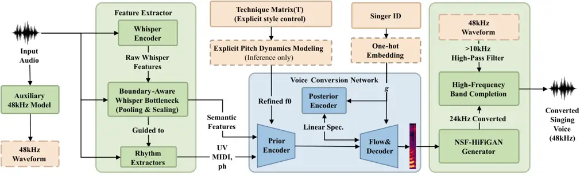

# Controllable Singing Style Conversion with Boundary-Aware Information BottleneckThanks: \* Corresponding author.

Zhetao Hu^(1,2), Yiquan Zhou^(1,2), Wenyu Wang^(1,2), Zhiyu Wu³, Xin
Gao⁴, and Jihua Zhu^(1,2,\*) Affiliation:  Affiliation: ¹School of
Software Engineering, Xi’an Jiaotong University, Xi’an, China
Affiliation: ²SYKI-SPEECH Team, Xi’an, China Affiliation: ³Fudan
University, Shanghai, China Affiliation: ⁴Division of Music and Audio
Union Wheatland Culture and Media Ltd., China Affiliation: Email:
{huzhetao, zhouyiqian, wenyu.wang}@stu.xjtu.edu.cn,  
wuzy24@m.fudan.edu.cn, sui@musinya.com, zhujh@xjtu.edu.cn^(\*)
Affiliation: 

###### Abstract

This paper presents the submission of the S4 team to the Singing Voice
Conversion Challenge 2025 (SVCC2025)—a novel singing style conversion
system that advances fine-grained style conversion and control within
in-domain settings. To address the critical challenges of style leakage,
dynamic rendering, and high-fidelity generation with limited data, we
introduce three key innovations: a boundary-aware Whisper bottleneck
that pools phoneme-span representations to suppress residual source
style while preserving linguistic content; an explicit frame-level
technique matrix, enhanced by targeted $`F_{0}`$ processing during
inference, for stable and distinct dynamic style rendering; and a
perceptually motivated high-frequency band completion strategy that
leverages an auxiliary standard 48 kHz SVC model to augment the
high-frequency spectrum, thereby overcoming data scarcity without
overfitting. In the official SVCC2025 subjective evaluation, our system
achieves the best naturalness performance among all submissions while
maintaining competitive results in speaker similarity and technique
control, despite using significantly less extra singing data than other
top-performing systems. Audio samples are available online.¹¹ 1
https://csscbaib.netlify.app/

###### Index Terms: 

singing voice conversion, singing style conversion, feature
disentangling

## I Introduction

Unlike conventional Singing Voice Conversion (SVC) \[1, 2, 3\], which
primarily focuses on timbre or identity mapping, Singing Style
Conversion (SSC) aims to finely reshape how a song is performed. This
involves modifying vocal techniques such as breathiness, register
(falsetto/mixed voice), resonance, vibrato, and glissando, while
strictly preserving the lyrical content, melodic structure, and the
singer’s identity characteristics. In essence, SSC is a style transfer
task whose central objective is to rewrite singing techniques and their
temporal organization, keeping the underlying content and melody
unchanged \[4\].

Early controllable style transfer studies in speech and singing
typically relied on relatively coarse style representations to guide the
generator, such as global style embeddings, reference encoders, or
utterance-level tokens \[5, 6, 1\]. These approaches are effective at
capturing global affect or quasi-stationary attributes; However, they
often reveal two structural limitations when applied to SSC. First, many
singing techniques exhibit strong locality and rapid temporal dynamics
(e.g., time-varying vibrato rates, intermittent breathy segments, or
continuous pitch drift in glissando), making it difficult for a single
global vector to generate stable and controllable fine-grained
variations at the appropriate time steps. Second, style leakage remains
prevalent: prosodic or technique-related cues from the source
performance tend to persist in the converted output, compromising the
purity of the target style.

Fig. 1: The overall architecture of the proposed System S4. (a) Training
Stage: The system employs a boundary-aware semantic bottleneck to
suppress style leakage in Whisper features, while the VITS decoder is
conditioned on the ground-truth technique matrix $`\mathbf{T}`$ to learn
explicit style rendering. (b) Inference Stage: The pipeline is driven by
a target technique matrix, which guides both the explicit pitch dynamics
module (for $`F_{0}`$ refinement) and the decoder. Finally, a
High-Frequency Band Completion module extends the output to 48 kHz
fidelity.

To mitigate these issues, subsequent research has introduced
finer-grained supervision and conditioning mechanisms. A common strategy
is to align technique prompts or labels with phoneme- or frame-level
time scales, along with richer musical and content conditions (e.g.,
phonemes, score/MIDI, and $`F_{0}`$), to enhance controllability and
interpretability \[7\]. Recent singing corpora have begun to provide
multi-dimensional technique annotations and high-quality score
information, enabling explicit technique modeling (e.g.,
GTSinger \[8\]), and zero-shot singing generation studies further
explore hierarchical style control and technique prompting (e.g.,
TCSinger \[9\]). Nevertheless, style leakage persists. A key reason is
that upstream representations (e.g., self-supervised features \[10, 11,
12, 13\] or codec tokens) often contain non-content acoustic information
from the source signal \[14, 15, 16\]. During training and inference,
models can exploit such residual cues, causing the target technique
rendering to be interfered with or partially overridden by the source
style. Similar prosody leakage has been widely discussed in zero-shot
voice conversion and is considered a major factor limiting
controllability \[17, 18, 19\].

In recent years, mainstream SSC systems have largely adopted two
families of generative backbones. One family of models employs
continuous generative models based on diffusion or flow matching to
synthesize mel-spectrograms or waveforms under conditioning \[2, 20,
21\]. Representative work includes Serenade, which formulates SSC as an
audio-infilling problem and applies flow matching, addressing
target-style modeling, source-style disentanglement, and melody
preservation \[22\]. The other family employs autoregressive (AR)
modeling \[23, 24\] over discrete tokens \[25, 16\] and typically uses a
continuous token-to-mel module to recover acoustic details. This design
is common in large-scale speech generation \[26, 27, 28, 29, 30\]; for
example, VEVO generates content-style token sequences with an AR model
and then refines them using a flow-matching acoustic model \[19, 31\].
In practice, these two paradigms often appear in a cascaded form (AR for
structure and discrete sequences, flow/diffusion for continuous detail),
and they therefore share the same key requirement: the conditioning
features must strongly disentangle content/melody from style/technique.
If the conditioning features still contain residual source-style
information, a powerful generator may amplify this entanglement,
resulting in style leakage. Conversely, if the objective or conditioning
constraints are insufficient to capture fast-varying dynamics, the
output may exhibit over-smoothing of the technique dynamics. Recent
SVCC2025 evaluations also suggest that, despite substantial progress in
naturalness and identity preservation, achieving stable and fine-grained
style transfer remains a primary bottleneck \[32\].

In this paper, we present System S4, our submission to SVCC 2025 built
upon the SYKI-SVC framework \[33\]. We address the aforementioned
challenges through three targeted designs. First, to mitigate the
leakage observed in baselines, we introduce a boundary-aware Whisper
bottleneck that pools representations within phoneme spans to wash out
residual source style. Second, we employ an explicit frame-level
technique matrix enhanced by inference-time $`F_{0}`$ processing to
ensure the distinct rendering of dynamic styles. Finally, to achieve
48 kHz fidelity without overfitting the limited style data, we propose a
high-frequency band completion strategy. Instead of forcing the SSC
model to generate the full spectrum, we train a separate, standard
48 kHz SVC model (which is easier to converge) and utilize its output to
supplement the high-frequency band ($`>10`$ kHz) of our style-converted
audio.

Subjective evaluations in the SVCC2025 challenge demonstrate that our
system achieved the best naturalness performance among all submissions,
while maintaining competitive results in both speaker similarity and
technique control. Our main contributions are summarized as follows:

- •
  Semantic bottleneck for disentanglement: A boundary-aware pooling
  strategy to suppress style leakage in content representations.
- •
  Explicit technique control: A decoupled frame-level conditioning
  mechanism with targeted $`F_{0}`$ processing for dynamic stability.
- •
  Perceptually motivated high-frequency completion: A strategy that
  leverages an auxiliary standard 48 kHz SVC model to complete the
  high-frequency spectrum, addressing data scarcity challenges in
  high-fidelity SSC training.

The source code is publicly available at²² 2 The implementation is
available at https://github.com/HuZhetao/cssc..

## II Related Work

Serenade \[22\] is a representative baseline for SVCC2025 and formulates
singing style conversion as an audio infilling task: a flow-matching
model predicts masked segments of a target mel-spectrogram given the
unmasked complement and disentangled features. It also employs cyclic
training to disentangle the source style and utilizes a source-filter
vocoder with $`F_{0}`$ resynthesis to better preserve the melody. This
family benefits from expressive modeling and flexible conditioning.
However, its inference pipeline is typically heavier than VITS-family
systems, and the strict melody constraints may conflict with the desired
style-specific pitch dynamics (e.g., vibrato depth or glissando
transitions), which can reduce the perceptual salience of dynamic
techniques in practice.

Another influential direction uses discrete tokens and a two-stage
generation pipeline. Vevo \[19\] proposes the generation of
content/style tokens with an autoregressive transformer prompted by a
style reference, followed by acoustic generation with a flow-matching
transformer prompted by a timbre reference, supported by self-supervised
disentanglement using a VQ-VAE bottleneck. The official Vevo1.5 baseline
in SVCC2025 further demonstrates the competitiveness of AR+flow
pipelines for controllable singing generation. These methods often
benefit from large-scale pretraining and carefully designed
tokenizers \[26, 28\] but they typically require greater computational
resources and engineering complexity, which may be less favorable under
data-limited or latency-constrained settings.

SYKI-SVC builds a high-fidelity SVC system on the SVCC2023 T02
framework, utilizing a VITS-family converter \[34\] and a
post-processing module \[35\] to improve perceptual quality,
demonstrating strong naturalness in challenge settings. Nevertheless, in
SSC scenarios, commonly used SSL/ASR representations can still retain
residual timbre/style information, causing leakage and weakening
fine-grained controllability; meanwhile, utterance-level speaker
embeddings provide only coarse control and are insufficient for
temporally localized technique manipulation. Motivated by these
limitations, our submission inherits the efficient, high-naturalness
SYKI-SVC backbone and focuses on (i) suppressing content-feature leakage
via a boundary-aware Whisper bottleneck and (ii) strengthening the
perceptibility of dynamic techniques through explicit frame-level
technique conditioning and targeted inference-time pitch dynamics
enhancement.

## III Proposed Method

We propose a singing style conversion system for SVCC2025, which follows
a recognition–synthesis paradigm and consists of three main modules: a
feature extraction module, a voice conversion module and a
high-frequency band completion module. Given an input singing waveform,
the feature extractor derives linguistic and musical conditions,
including phoneme sequences, pooled Whisper representations, and
pitch-related features such as $`F_{0}`$, UV, and MIDI. Based on
frame-level technique annotations, a technique matrix is constructed to
provide explicit style control. The voice conversion network then
generates a 24-kHz singing waveform conditioned on the extracted
features, the technique matrix, and the embedding of the target singer.
Finally, a super-resolution network supplements high-frequency
components above 10 kHz from an auxiliary 48-kHz model, producing the
final converted singing voice.



Fig. 2: Illustration of the core disentanglement and control mechanisms.
The Boundary-Aware Semantic Bottleneck pools frame-level Whisper
features within phoneme boundaries to wash out residual source style,
while the technique matrix $`\mathbf{T}`$ explicitly drives style
generation.

### III-A Feature Extraction Module

Following the SYKI-SVC framework, our system performs singing style
conversion via song reconstruction \[33\]. The SVCC2025 dataset provides
rich symbolic and acoustic annotations, including phoneme sequences,
MIDI notes, $`F_{0}`$, and UV flags \[36\], which are sufficient to
describe lyrics and melody for basic synthesis \[37\]. To further
improve content clarity, we additionally use semantic features from a
pretrained Whisper encoder \[38\] as an auxiliary condition (we also
experimented with ContentVec \[15\] and WeNet ASR features \[39\], but
found Whisper yields the best controllability–clarity trade-off under
SSC). Singer identity is conditioned by a one-hot embedding due to the
limited number of singers in the challenge set.

Phoneme-level Temporal Pooling However, we observe that frame-level
semantic representations inevitably contain non-semantic information
correlated with expressive dynamics, which can introduce technique
leakage if directly injected. To mitigate this, we impose a lightweight
semantic bottleneck based on phoneme boundaries. Let
$`\mathbf{w}_{i}\in\mathbb{R}^{d}`$ denote the raw semantic feature at
frame $`i`$ (e.g., Whisper encoder output). We use phoneme boundaries to
define a phoneme-level neighborhood $`\mathcal{N}(t)`$ (the set of
frames belonging to the same phoneme segment as frame $`t`$), and
average within $`\mathcal{N}(t)`$:

```math
\tilde{\mathbf{w}}_{t}=\frac{1}{|\mathcal{N}(t)|}\sum_{i\in\mathcal{N}(t)}\mathbf{w}_{i}. \tag{1}
```

During training, phoneme boundaries are obtained from the provided
alignments in the official dataset. During inference, we use the
Montreal Forced Aligner(MFA)  \[40\] trained on the challenge data to
obtain phoneme boundaries and construct $`\mathcal{N}(t)`$. This pooling
suppresses rapid intra-phoneme fluctuations that tend to correlate with
expressive techniques, while preserving stable linguistic cues, thereby
reducing technique leakage from the semantic branch. Finally, we apply a
global scaling factor $`\lambda`$ to the pooled features,
$`\hat{\mathbf{w}}_{t}=\lambda\cdot\tilde{\mathbf{w}}_{t}`$, and set
$`\lambda=0.1`$ in all experiments to further limit the dominance of the
semantic condition.

### III-B Voice Converter

The voice converter is the acoustic synthesis module that recomposes the
extracted conditions into a mel-spectrogram while preserving lyrics and
melody and enabling explicit technique control. It takes as input the
phoneme condition $`\text{ph}(t)`$, the bottlenecked semantic features
$`\hat{\mathbf{w}}_{t}`$, and pitch-related features
$`(F_{0}(t),\text{UV}(t),\text{MIDI}(t))`$, and predicts the target
mel-spectrogram $`\mathbf{M}`$ under the guidance of a technique control
signal and a singer identity embedding.

##### Technique matrix

To enable time-localized and compositional control over singing
techniques, we represent technique annotations as a frame-level binary
matrix $`\mathbf{T}\in\{0,1\}^{K\times N}`$, where $`K`$ denotes the
number of technique labels and $`N`$ denotes the number of acoustic
frames aligned with the mel hop size. Each column $`\mathbf{T}_{:,n}`$
is a multi-hot vector, allowing multiple techniques to co-occur within
the same frame (e.g., breathy+vibrato). During training, $`\mathbf{T}`$
is constructed by aligning the provided technique segments to the
acoustic frame grid. During inference, $`\mathbf{T}`$ is specified to
describe the desired target technique pattern and thus serves as an
explicit control interface.

For conditioning, $`\mathbf{T}`$ is projected by a lightweight embedding
layer and concatenated to the frame-level conditioning stream before the
prediction of mel. Together with the semantic bottleneck, this explicit
injection encourages the converter to attribute the rendering technique
to $`\mathbf{T}`$ rather than implicitly inferring the style from the
semantic features, thus improving controllability.

##### Explicit pitch-dynamics control

Dynamic techniques such as vibrato and glissando are manifested
primarily as fine-grained pitch modulations \[41\]. We find that letting
the acoustic model learn these micro-patterns implicitly often leads to
temporal over-smoothing. To make pitch-driven techniques more salient
and controllable, we refine the contour extracted $`F_{0}(t)`$ in the
conditioning stage using rule-based transformations derived from
$`\mathbf{T}`$, without introducing an additional predictor $`F_{0}`$.
On vibrato-active frames, we inject a sinusoidal modulation in the
log-frequency domain:

```math
F_{0}^{\text{vib}}(t)=F_{0}(t)\cdot 2^{\frac{a\,\sin(2\pi f_{v}t+\phi)}{1200}}, \tag{2}
```

where $`a`$ is the depth (cents), $`f_{v}`$ is the rate (Hz), and
$`\phi`$ is the phase. The modulation is applied only when
$`m_{\text{vib}}(t)=1`$ (from $`\mathbf{T}`$), otherwise the original
contour is kept:

```math
F_{0}^{*}(t)=m_{\text{vib}}(t)\,F_{0}^{\text{vib}}(t)+\big(1-m_{\text{vib}}(t)\big)\,F_{0}(t). \tag{3}
```

To capture glissando, we replace the discrete pitch shifts at note
boundaries with continuous sigmoid transitions. At a boundary time
$`t_{0}`$ between consecutive notes with target frequencies $`F_{prev}`$
and $`F_{curr}`$:

```math
F_{0}^{\text{gliss}}(t)=F_{prev}+(F_{curr}-F_{prev})\cdot\frac{1}{1+e^{-\tau(t-t_{0})}}, \tag{4}
```

where $`\tau`$ controls the transition sharpness. This operation is
similarly gated by $`m_{\text{gliss}}(t)`$ from $`\mathbf{T}`$ so that
transitions are injected only when glissando is desired.

The refined contour $`F_{0}^{*}(t)`$ (after applying the technique-gated
vibrato/glissando) is then used as pitch conditioning together with
$`\text{UV}(t)`$ and $`\text{MIDI}(t)`$ for mel generation, improving
the salience and temporal consistency of pitch-driven techniques without
affecting content or singer identity control.

### III-C Waveform Generation and High-Frequency Band Completion

Given the predicted mel-spectrogram $`\mathbf{M}`$ from the voice
converter, we synthesize a 24-kHz waveform using an NSF-HiFiGAN
vocoder \[42\]. Although 24 kHz is sufficient to model the main-band
timbre and technique dynamics, the limited bandwidth often reduces
perceived clarity and airiness. A straightforward solution is to
directly generate 48-kHz audio; however, the official SVCC dataset is
insufficient to train a high-quality 48-kHz vocoder or end-to-end
generator.

To address this, we introduce a lightweight high-frequency band
completion strategy using an auxiliary 48-kHz singing conversion model.
Empirically, we find that spectral components above 10 kHz contribute
mainly to brightness rather than singer identity or technique-related
cues. Therefore, during inference we first apply the auxiliary 48-kHz
model to the source audio and extract its high-frequency band
($`>10`$ kHz). We then supplement this band to the converted 24-kHz
waveform via smooth frequency-domain mixing, without modifying the low-
and mid-frequency content produced by the main system. We denote
$`\mathcal{H}(\cdot)`$ as a high-pass operator extracting $`>10`$ kHz
components, and construct the final waveform as

```math
x^{48}=x^{24}+\mathcal{H}\!\left(x^{48}_{src}\right), \tag{5}
```

followed by a short cross-fade in the frequency domain to avoid boundary
artifacts.This simple band-completion improves perceptual quality while
having minimal impact on timbre similarity and technique
controllability.

### III-D Training and Inference Strategy

This section describes the training and inference rules used to improve
disentanglement and technique controllability, without repeating the
feature-flow introduced above.

Training Strategy. We adopt a three-stage protocol to progressively
establish audio quality, enforce technique disentanglement, and adapt to
singers under the SVCC2025 setting.

Stage I: Reconstruction Training. We first train the main pipeline with
standard reconstruction objectives using the official dataset. In this
stage, all provided conditions (phoneme/MIDI/$`F_{0}`$/UV and semantic
features) are enabled to stabilize alignment and establish a strong
acoustic foundation.

Stage II: Technique Disentanglement. To reduce technique leakage from
the semantic branch, we activate the semantic bottleneck: semantic
features are pooled using phoneme boundaries and then down-scaled by a
fixed factor (e.g., $`\lambda=0.1`$). This explicit capacity restriction
forces the model to rely on the technique control signal $`\mathbf{T}`$
for style rendering rather than implicitly encoding techniques in
semantic features. During this stage, $`\mathbf{T}`$ is constructed from
ground-truth technique annotations and aligned to the acoustic frame
grid, providing supervised technique control for every training sample.

Stage III: Singer Adaptation Fine-tuning. We fine-tune the model to
better fit singer-dependent timbre characteristics while preserving the
disentangled representations learned in Stage II. In practice, we keep
the semantic bottleneck and technique conditioning unchanged and only
continue end-to-end optimization on the official dataset.

Inference Strategy During inference, ground-truth alignments and
technique labels are unavailable; therefore, we adopt a rule-based
pipeline as follows. We first obtain phoneme boundaries using a
self-trained MFA on the challenge dataset, which are required for
boundary-aware semantic pooling and feature construction. Next, the
desired technique patterns are specified by the target control signal
and encoded as a frame-level binary technique matrix $`\mathbf{T}`$ to
condition the converter. For pitch-driven techniques such as vibrato and
glissando, we further perform explicit $`F_{0}`$ refinement gated by
$`\mathbf{T}`$ prior to mel-spectrogram prediction, so as to enhance
perceptual salience and temporal consistency of these rapid dynamics.
Finally, to achieve 48-kHz fidelity without coupling it to the main
training procedure, the high-frequency band-completion module is trained
separately and applied only as a post-processing step after waveform
synthesis, remaining outside the primary three-stage training protocol.

## IV Experiments and Results

### IV-A Data Preparation and Training Setup

All experiments follow the official SVCC2025 Task 1 setting; the main
24 kHz system is trained only on the official dataset (about 68 hours)
with provided phoneme/MIDI/pitch-related annotations and technique
labels for constructing the binary technique matrix $`\mathbf{T}`$,
while the auxiliary 48 kHz model for high-frequency band completion is
trained separately and is not involved in the main pipeline. Training is
conducted on 4$`\times`$RTX 4090 GPUs using AdamW
($`\beta_{1}=0.8,\beta_{2}=0.99`$) with batch size 24, following a
three-stage schedule of 200k/300k/100k steps, where Stage II enables the
semantic bottleneck (phoneme-aware pooling and $`\lambda{=}0.1`$
scaling) to reduce leakage and strengthen reliance on $`\mathbf{T}`$.

### IV-B Official Results on SVCC2025 Task 1

The proposed system is evaluated based on the official subjective
results of the SVCC2025 challenge \[3\]. The evaluation framework
employs three key metrics: Naturalness (measured via 5-point MOS), and
both Singing Style Similarity and Singer Identity Similarity (assessed
on a 4-point scale and reported as binary accuracy).

Our submitted system is denoted as S4B (Ours). To verify the efficacy of
our disentanglement strategy, we also submitted an ablation system, S4A,
which excludes the boundary-aware Whisper pooling and scaling module.

Fig. 3: A scatter plot comparing naturalness and style similarity
metrics. Our system S4B is positioned on the far right, indicating
superior naturalness performance.

(a) Naturalness MOS

(b) Singing style similarity

(c) Singer identity similarity

Fig. 4: Official evaluation results. (a) Naturalness MOS boxplots. The
red dot indicates the mean score, and the black line indicates the
median. (b) Singing style similarity. (c) Singer identity similarity.
The black diamonds ($`\blacklozenge`$) represent the binary accuracy.

#### IV-B1 Naturalness

As illustrated in Fig. 4(a), our system S4B demonstrates exceptional
performance in terms of perceptual quality. According to the official
boxplot results, S4B achieves a median MOS of 4.0, securing the 1st
place in naturalness among all participating systems (excluding Ground
Truth). The distribution of S4B scores is notably compact and skewed
towards the higher end compared to other teams. This result strongly
validates that our explicit technique modeling (via the Technique
Matrix) and generative pitch dynamics allow for a highly natural
rendition of singing voices, effectively avoiding the robotic artifacts
or over-smoothing often observed in conventional SVC systems.

#### IV-B2 Similarity and Controllability

In terms of similarity metrics (Fig. 4b and c), S4B achieves competitive
performance, ranking 4th in style similarity. While there is a gap in
identity similarity compared to the top-ranked systems (e.g., S6, S5),
it is crucial to highlight the data efficiency of our approach. Unlike
several top-performing teams that leveraged large-scale external
datasets for pre-training to boost timbre disentanglement, our system
was trained exclusively on the limited official dataset. Given this
constraint, our method yields a state-of-the-art naturalness score,
proving that the architecture maximizes perceptual quality even under
data-limited conditions.

### IV-C Ablation Study

We evaluate six model variants, each converting the same set of 36
songs. For objective metrics, Spk Sim is computed by cosine similarity
of CAMPPlus speaker embeddings \[43\], and MOS is evaluated by
SingMOS \[44\]. For human evaluation, listeners rate technique transfer
on a 4-level scale (successful / slightly successful / slightly
unsuccessful / unsuccessful); we report Converted as the proportion of
samples rated as successful or slightly successful. The questionnaire
also includes a binary option indicating whether the output exhibits
technique leakage, which is reported as Leakage. The six settings cover
(i) different semantic features (ContentVec \[15\], WeNet \[39\],
Whisper \[38\]), (ii) the effect of scaling ($`\lambda`$) applied after
pooling, and (iii) the effect of removing phoneme-aware pooling.

Table I shows that Whisper generally yields better controllability than
ContentVec and WeNet. Moreover, the proposed semantic bottleneck
(phoneme-aware pooling and $`\lambda{=}0.1`$ scaling) achieves the best
overall trade-off, delivering the highest Converted and Spk Sim while
keeping Leakage lowest. In contrast, using an overly strong semantic
signal (pooling with $`\lambda{=}1.0`$) increases leakage, while
disabling the semantic signal ($`\lambda{=}0`$) severely hurts speaker
similarity and MOS. Removing pooling also degrades transfer success and
increases leakage, indicating that boundary-aware aggregation is
important for suppressing style information in the semantic condition.
Finally, regarding the contribution of the high-frequency band
completion, we strongly encourage readers to listen to the ablation
samples on our demo page.

| Setting                                     | Spk Sim $`\uparrow`$ | MOS $`\uparrow`$ | Converted $`\uparrow`$ | Leakage $`\downarrow`$ |
| ------------------------------------------- | -------------------- | ---------------- | ---------------------- | ---------------------- |
| ContentVec (encoder)                        | 0.724                | 4.18             | 72.2%                  | 13.9%                  |
| WeNet (encoder)                             | 0.694                | 4.04             | 63.9%                  | 22.2%                  |
| Whisper + pooling, $`\lambda{=}1.0`$        | 0.692                | 4.32             | 66.7%                  | 27.8%                  |
| Whisper + pooling, $`\lambda{=}0`$          | 0.428                | 4.19             | 66.7%                  | 11.1%                  |
| Whisper w/o pooling, $`\lambda{=}0.1`$      | 0.665                | 4.21             | 58.3%                  | 25.0%                  |
| Whisper + pooling, $`\lambda{=}0.1`$ (ours) | 0.732                | 4.22             | 83.3%                  | 8.3%                   |

TABLE I: Ablation results on semantic features and the proposed semantic
bottleneck (phoneme-aware pooling + scaling).

## V CONCLUSION

In this paper, we presented System S4 for the SVCC2025 Challenge Task 1.
To achieve controllable singing style conversion under strict data
constraints, we proposed a disentanglement strategy that combines a
boundary-aware semantic bottleneck with an explicit technique
conditioning matrix. This design effectively suppresses style leakage
from content representations, while ensuring precise adherence to target
technique controls. Official evaluation results demonstrate that our
system achieves the 1st place in naturalness among all participating
teams. The results and ablation studies collectively confirm that our
approach offers a data-efficient and high-fidelity solution for singing
style conversion.

## References

- \[1\] Y. Zhang, H. Xue, H. Li, L. Xie, T. Guo, R. Zhang, and C.
  Gong (2022) Visinger 2: high-fidelity end-to-end singing voice
  synthesis enhanced by digital signal processing synthesizer. arXiv
  preprint arXiv:2211.02903. Cited by: §I, §I.
- \[2\] S. Liu, Y. Cao, D. Su, and H. Meng (2021) DiffSVC: a diffusion
  probabilistic model for singing voice conversion. In 2021 IEEE
  Automatic Speech Recognition and Understanding Workshop (ASRU), Vol. ,
  pp. 741–748. External Links:
  [Document](https://dx.doi.org/10.1109/ASRU51503.2021.9688219) Cited
  by: §I, §I.
- \[3\] L. P. Violeta, X. Zhang, J. Shi, Y. Yasuda, W. Huang, Z. Wu,
  and T. Toda (2025) The singing voice conversion challenge 2025: from
  singer identity conversion to singing style conversion. arXiv preprint
  arXiv:2509.15629. Cited by: §I, §IV-B.
- \[4\] Z. Wang, X. Xia, C. Huang, and L. Xie (2026) S $`\^{}2`$ voice:
  style-aware autoregressive modeling with enhanced conditioning for
  singing style conversion. arXiv preprint arXiv:2601.13629. Cited by:
  §I.
- \[5\] Y. Zhang, R. Huang, R. Li, J. He, Y. Xia, F. Chen, X. Duan, B.
  Huai, and Z. Zhao (2024) Stylesinger: style transfer for out-of-domain
  singing voice synthesis. In Proceedings of the AAAI Conference on
  Artificial Intelligence, Vol. 38, pp. 19597–19605. Cited by: §I.
- \[6\] R. Huang, C. Cui, F. Chen, Y. Ren, J. Liu, Z. Zhao, B. Huai,
  and Z. Wang (2022) Singgan: generative adversarial network for
  high-fidelity singing voice generation. In Proceedings of the 30th ACM
  International Conference on Multimedia, pp. 2525–2535. Cited by: §I.
- \[7\] A. Vyas, B. Shi, M. Le, A. Tjandra, Y. Wu, B. Guo, J. Zhang, X.
  Zhang, R. Adkins, W. Ngan, et al. (2023) Audiobox: unified audio
  generation with natural language prompts. arXiv preprint
  arXiv:2312.15821. Cited by: §I.
- \[8\] Y. Zhang, C. Pan, W. Guo, R. Li, Z. Zhu, J. Wang, W. Xu, J.
  Lu, Z. Hong, C. Wang, et al. (2024) Gtsinger: a global multi-technique
  singing corpus with realistic music scores for all singing tasks.
  Advances in Neural Information Processing Systems 37, pp. 1117–1140.
  Cited by: §I.
- \[9\] Y. Zhang, Z. Jiang, R. Li, C. Pan, J. He, R. Huang, C. Wang,
  and Z. Zhao (2024) Tcsinger: zero-shot singing voice synthesis with
  style transfer and multi-level style control. arXiv preprint
  arXiv:2409.15977. Cited by: §I.
- \[10\] D. Zhang, Y. Sun, P. Li, Y. Liu, H. Lin, H. Xu, X. Mu, L.
  Lin, W. Yan, N. Yang, et al. (2026) Pointcot: a multi-modal benchmark
  for explicit 3d geometric reasoning. arXiv preprint arXiv:2602.23945.
  Cited by: §I.
- \[11\] D. Zhang, H. Lin, Y. Sun, P. Wang, Q. Wang, N. Yang, and J.
  Zhu (2026) Not all queries need deep thought: coficot for adaptive
  coarse-to-fine stateful refinement. arXiv preprint arXiv:2603.08251.
  Cited by: §I.
- \[12\] D. Zhang, Y. Wang, Y. Sun, H. Xu, P. Fan, and J. Zhu (2026)
  CMHANet: a cross-modal hybrid attention network for point cloud
  registration. Neurocomputing, pp. 133318. Cited by: §I.
- \[13\] D. Zhang, J. Zhu, S. Li, W. Yan, H. Xu, P. Fan, and H.
  Lu (2026) IGASA: integrated geometry-aware and skip-attention modules
  for enhanced point cloud registration. IEEE Transactions on Circuits
  and Systems for Video Technology. Cited by: §I.
- \[14\] W. Hsu, B. Bolte, Y. H. Tsai, K. Lakhotia, R. Salakhutdinov,
  and A. Mohamed (2021) Hubert: self-supervised speech representation
  learning by masked prediction of hidden units. IEEE/ACM transactions
  on audio, speech, and language processing 29, pp. 3451–3460. Cited by:
  §I.
- \[15\] K. Qian, Y. Zhang, H. Gao, J. Ni, C. Lai, D. Cox, M.
  Hasegawa-Johnson, and S. Chang (2022) Contentvec: an improved
  self-supervised speech representation by disentangling speakers. In
  International conference on machine learning, pp. 18003–18017. Cited
  by: §I, §III-A, §IV-C.
- \[16\] C. Wang, S. Chen, Y. Wu, Z. Zhang, L. Zhou, S. Liu, Z. Chen, Y.
  Liu, H. Wang, J. Li, et al. (2023) Neural codec language models are
  zero-shot text to speech synthesizers. arXiv preprint
  arXiv:2301.02111. Cited by: §I, §I.
- \[17\] S. Wang and D. Borth (2022) Zero-shot voice conversion via
  self-supervised prosody representation learning. In 2022 International
  Joint Conference on Neural Networks (IJCNN), pp. 01–08. Cited by: §I.
- \[18\] Z. Wang, Y. Chen, L. Xie, Q. Tian, and Y. Wang (2023) Lm-vc:
  zero-shot voice conversion via speech generation based on language
  models. IEEE Signal Processing Letters 30, pp. 1157–1161. Cited by:
  §I.
- \[19\] X. Zhang, X. Zhang, K. Peng, Z. Tang, V. Manohar, Y. Liu, J.
  Hwang, D. Li, Y. Wang, J. Chan, et al. (2025) Vevo: controllable
  zero-shot voice imitation with self-supervised disentanglement. arXiv
  preprint arXiv:2502.07243. Cited by: §I, §I, §II.
- \[20\] Z. Ju, Y. Wang, K. Shen, X. Tan, D. Xin, D. Yang, Y. Liu, Y.
  Leng, K. Song, S. Tang, et al. (2024) Naturalspeech 3: zero-shot
  speech synthesis with factorized codec and diffusion models. arXiv
  preprint arXiv:2403.03100. Cited by: §I.
- \[21\] S. Mehta, R. Tu, J. Beskow, É. Székely, and G. E. Henter (2024)
  Matcha-tts: a fast tts architecture with conditional flow matching. In
  ICASSP 2024-2024 IEEE International Conference on Acoustics, Speech
  and Signal Processing (ICASSP), pp. 11341–11345. Cited by: §I.
- \[22\] L. P. Violeta, W. Huang, and T. Toda (2025) Serenade: a singing
  style conversion framework based on audio infilling. arXiv preprint
  arXiv:2503.12388. Cited by: §I, §II.
- \[23\] D. Zhang, N. Yang, J. Zhu, J. Yang, M. Xin, and B. Tian (2025)
  Ascot: an adaptive self-correction chain-of-thought method for
  late-stage fragility in llms. arXiv preprint arXiv:2508.05282. Cited
  by: §I.
- \[24\] D. Zhang, Y. Sun, C. Tan, W. Yan, N. Yang, J. Zhu, and H.
  Zhang (2026) Chain-of-thought compression should not be blind: v-skip
  for efficient multimodal reasoning via dual-path anchoring. arXiv
  preprint arXiv:2601.13879. Cited by: §I.
- \[25\] N. Zeghidour, A. Luebs, A. Omran, J. Skoglund, and M.
  Tagliasacchi (2021) Soundstream: an end-to-end neural audio codec.
  IEEE/ACM Transactions on Audio, Speech, and Language Processing 30,
  pp. 495–507. Cited by: §I.
- \[26\] P. Anastassiou, J. Chen, J. Chen, Y. Chen, Z. Chen, Z. Chen, J.
  Cong, L. Deng, C. Ding, L. Gao, et al. (2024) Seed-tts: a family of
  high-quality versatile speech generation models. arXiv preprint
  arXiv:2406.02430. Cited by: §I, §II.
- \[27\] Y. Wang, H. Zhan, L. Liu, R. Zeng, H. Guo, J. Zheng, Q.
  Zhang, X. Zhang, S. Zhang, and Z. Wu (2024) Maskgct: zero-shot
  text-to-speech with masked generative codec transformer. arXiv
  preprint arXiv:2409.00750. Cited by: §I.
- \[28\] Z. Du, Y. Wang, Q. Chen, X. Shi, X. Lv, T. Zhao, Z. Gao, Y.
  Yang, C. Gao, H. Wang, et al. (2024) Cosyvoice 2: scalable streaming
  speech synthesis with large language models. arXiv preprint
  arXiv:2412.10117. Cited by: §I, §II.
- \[29\] T. Xie, Y. Rong, P. Zhang, W. Wang, and L. Liu (2025) Towards
  controllable speech synthesis in the era of large language models: a
  systematic survey. In Proceedings of the 2025 Conference on Empirical
  Methods in Natural Language Processing, pp. 764–791. Cited by: §I.
- \[30\] H. Touvron, T. Lavril, G. Izacard, X. Martinet, M. Lachaux, T.
  Lacroix, B. Rozière, N. Goyal, E. Hambro, F. Azhar, et al. (2023)
  Llama: open and efficient foundation language models. arXiv preprint
  arXiv:2302.13971. Cited by: §I.
- \[31\] X. Zhang, J. Zhang, Y. Wang, C. Wang, Y. Chen, D. Jia, Z. Chen,
  and Z. Wu (2025) Vevo2: bridging controllable speech and singing voice
  generation via unified prosody learning. arXiv e-prints,
  pp. arXiv–2508. Cited by: §I.
- \[32\] W. Huang, L. P. Violeta, S. Liu, J. Shi, and T. Toda (2023) The
  singing voice conversion challenge 2023. In 2023 IEEE Automatic Speech
  Recognition and Understanding Workshop (ASRU), pp. 1–8. Cited by: §I.
- \[33\] Y. Zhou, W. Wang, H. Ding, J. Xu, J. Zhu, X. Gao, and S.
  Li (2025) SYKI-svc: advancing singing voice conversion with
  post-processing innovations and an open-source professional testset.
  In ICASSP 2025-2025 IEEE International Conference on Acoustics, Speech
  and Signal Processing (ICASSP), pp. 1–5. Cited by: §I, §III-A.
- \[34\] Y. Zhou, M. Chen, Y. Lei, J. Zhu, and W. Zhao (2023) VITS-based
  singing voice conversion system with dspgan post-processing for
  svcc2023. In 2023 IEEE Automatic Speech Recognition and Understanding
  Workshop (ASRU), pp. 1–8. Cited by: §II.
- \[35\] K. Song, Y. Zhang, Y. Lei, J. Cong, H. Li, L. Xie, G. He,
  and J. Bai (2023) DSPGAN: a gan-based universal vocoder for
  high-fidelity tts by time-frequency domain supervision from dsp. In
  ICASSP 2023-2023 IEEE International Conference on Acoustics, Speech
  and Signal Processing (ICASSP), pp. 1–5. Cited by: §II.
- \[36\] H. Wei, X. Cao, T. Dan, and Y. Chen (2023) Rmvpe: a robust
  model for vocal pitch estimation in polyphonic music. arXiv preprint
  arXiv:2306.15412. Cited by: §III-A.
- \[37\] Y. Song, W. Song, W. Zhang, Z. Zhang, D. Zeng, Z. Liu, and Y.
  Yu (2022) Singing voice synthesis with vibrato modeling and latent
  energy representation. In 2022 IEEE 24th International Workshop on
  Multimedia Signal Processing (MMSP), pp. 1–6. Cited by: §III-A.
- \[38\] A. Radford, J. W. Kim, T. Xu, G. Brockman, C. McLeavey, and I.
  Sutskever (2023) Robust speech recognition via large-scale weak
  supervision. In International conference on machine learning,
  pp. 28492–28518. Cited by: §III-A, §IV-C.
- \[39\] B. Zhang, D. Wu, Z. Peng, X. Song, Z. Yao, H. Lv, L. Xie, C.
  Yang, F. Pan, and J. Niu (2022) WeNet 2.0: more productive end-to-end
  speech recognition toolkit. arXiv preprint arXiv:2203.15455. Cited by:
  §III-A, §IV-C.
- \[40\] M. McAuliffe, M. Socolof, S. Mihuc, M. Wagner, and M.
  Sonderegger (2017) Montreal forced aligner: trainable text-speech
  alignment using kaldi.. In Interspeech, Vol. 2017, pp. 498–502. Cited
  by: §III-A.
- \[41\] R. Liu, X. Wen, C. Lu, L. Song, and J. S. Sung (2021) Vibrato
  learning in multi-singer singing voice synthesis. In 2021 IEEE
  Automatic Speech Recognition and Understanding Workshop (ASRU),
  pp. 773–779. Cited by: §III-B.
- \[42\] J. Kong, J. Kim, and J. Bae (2020) Hifi-gan: generative
  adversarial networks for efficient and high fidelity speech synthesis.
  Advances in neural information processing systems 33, pp. 17022–17033.
  Cited by: §III-C.
- \[43\] H. Wang, S. Zheng, Y. Chen, L. Cheng, and Q. Chen (2023) Cam++:
  a fast and efficient network for speaker verification using
  context-aware masking. arXiv preprint arXiv:2303.00332. Cited by:
  §IV-C.
- \[44\] Y. Tang, L. Liu, W. Feng, Y. Zhao, J. Han, Y. Yu, J. Shi,
  and Q. Jin (2025) SingMOS-pro: an comprehensive benchmark for singing
  quality assessment. arXiv preprint arXiv:2510.01812. Cited by: §IV-C.
