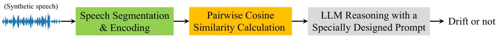
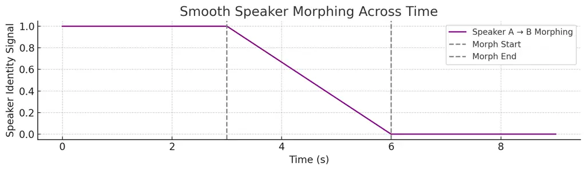

# A Novel Automatic Framework for Speaker Drift Detection in Synthesized Speech

Affiliation: Jia-Hong Huang Affiliation: Seulgi Kim Affiliation: Yi
Chieh Liu Affiliation: Yixian Shen Affiliation: Hongyi Zhu Affiliation:
Prayag Tiwari Affiliation: Stevan Rudinac Affiliation: Evangelos
Kanoulas

###### Abstract

Recent diffusion-based text-to-speech (TTS) models achieve high
naturalness and expressiveness, yet often suffer from speaker drift, a
subtle, gradual shift in perceived speaker identity within a single
utterance. This underexplored phenomenon undermines the coherence of
synthetic speech, especially in long-form or interactive settings. We
introduce the first automatic framework for detecting speaker drift by
formulating it as a binary classification task over utterance-level
speaker consistency. Our method computes cosine similarity across
overlapping segments of synthesized speech and prompts large language
models (LLMs) with structured representations to assess drift. We
provide theoretical guarantees for cosine-based drift detection and
demonstrate that speaker embeddings exhibit meaningful geometric
clustering on the unit sphere. To support evaluation, we construct a
high-quality synthetic benchmark with human-validated speaker drift
annotations. Experiments with multiple state-of-the-art LLMs confirm the
viability of this embedding-to-reasoning pipeline. Our work establishes
speaker drift as a standalone research problem and bridges geometric
signal analysis with LLM-based perceptual reasoning in modern TTS.

###### Index Terms:

Text-to-speech (TTS), Diffusion Model, Speaker Drift Detection

^(†)^(†)address: ¹University of Amsterdam, ²Georgia Institute of
Technology, ³Halmstad University

## 1 Introduction

Recent progress in text-to-speech (TTS) synthesis, particularly with
diffusion-based models, has significantly enhanced the naturalness,
expressiveness, and controllability of generated speech \[37, 35, 25,
20, 31, 30, 16, 29, 18, 27, 5, 15, 40, 23, 19, 12, 24, 22, 9\]. These
models can synthesize long-form utterances with high perceptual
fidelity, supporting applications such as personalized virtual
assistants, audiobook narration, multi-turn dialog systems, and
multimedia systems \[11, 42, 43, 17, 36, 32, 21, 13, 33, 10, 8, 41,
14\]. However, an underexplored yet critical challenge persists: speaker
drift. This phenomenon refers to a subtle, gradual change in the
perceived speaker identity within a single utterance, even when the
synthesis is conditioned on a single, fixed speaker embedding or prompt.
Such intra-utterance inconsistencies can undermine the effectiveness of
applications like those above, where maintaining a coherent and stable
speaker identity is crucial for a seamless user experience.

Speaker drift fundamentally differs from conventional speaker changes
addressed in diarization or speaker change detection, which typically
assume abrupt and discrete transitions \[1, 39, 38\]. In contrast,
speaker drift involves gradual, often imperceptible shifts in vocal
characteristics that accumulate throughout an utterance. This subtle
degradation presents significant challenges for detection,
quantification, and evaluation. A comparison of related tasks is
summarized in Table 1. Currently, there is no standardized evaluation
protocol, scalable automated method, or standardized dataset tailored
specifically to this problem, leaving a critical gap in quality
assurance, model validation, and deployment reliability for both
academic research and production-level real-world TTS systems.

To address this gap, we propose a novel, LLM-driven framework for
automatic speaker drift detection in synthetic speech. We formulate this
as a binary classification task at the utterance level. Specifically, we
extract speaker embeddings from short, overlapping segments of each
utterance and compute pairwise cosine similarity scores, a compact,
interpretable proxy for vocal identity consistency over time. These
structured similarity score sequences with specially designed prompts
are then fed into state-of-the-art LLMs, e.g., \[26, 34, 2, 7, 4\], to
assess whether speaker drift is present based solely on the numerical
input. This design bypasses the token limitations of modern LLMs, which
cannot directly process high-dimensional embeddings. It offers a
reference-free, scalable approach that bridges speaker embedding
analysis and the reasoning capabilities of LLMs.

To support this architecture, we provide theoretical justification for
using cosine similarity as an indicator of drift. Under mild
distributional assumptions, we prove that a threshold-based classifier
using segment-level cosine similarity scores can detect speaker drift
with exponentially decreasing error as the similarity gap between
same-speaker and different-speaker segments increases. This result
formally grounds the use of cosine similarity as a statistically
meaningful signal for vocal identity transitions.

To validate our proposed approach and enable systematic evaluation, we
address the lack of real-world data by constructing a controlled
benchmark dataset using a high-fidelity, diffusion-based TTS model. Real
instances of intra-utterance identity drift are rare, ambiguous, and
costly to annotate, making them unsuitable for empirical and systematic
study. Instead, we generate utterance samples that either maintain
consistent speaker identity or introduce identity shifts within an
utterance, then verify them through human annotations. These synthetic
samples provide a reliable and reproducible testbed for studying the
drift phenomenon and evaluating the proposed framework in a well-defined
setting.

Together, our contributions offer a principled pipeline for detecting
speaker drift and establish a foundation for future work at the
intersection of embedding-based speech analysis and LLM-based perceptual
evaluation in modern TTS systems. To our knowledge, this is the first
work to (1) define and formalize speaker drift detection as a standalone
task, (2) construct a dataset tailored for intra-utterance identity
variation, and (3) explore LLM-based reasoning as a diagnostic tool for
speaker consistency in TTS pipelines.



Figure 1: Our proposed LLM-based framework for detecting speaker drift
in synthesized speech. Further details are provided in Section IV.

| Task                                               | Goal                                                                                                                               | Key Characteristics                                                                                                                |
| -------------------------------------------------- | ---------------------------------------------------------------------------------------------------------------------------------- | ---------------------------------------------------------------------------------------------------------------------------------- |
| Speaker Change Detection                           | Identify speaker boundaries in natural multi-speaker speech streams                                                                | Assumes abrupt, discrete speaker transitions; aims at accurate change-point detection                                              |
| Speaker Verification or Identification             | Confirm or classify speaker identity using labeled reference data                                                                  | Requires ground-truth speaker labels; evaluates similarity across separate utterances                                              |
| Speaker Diarization                                | Segment and cluster speech by speaker in multi-speaker audio                                                                       | Operates on known or unknown speakers; assumes clear speaker turns; insensitive to subtle intra-speaker drift                      |
| Voice Cloning Consistency Evaluation               | Evaluate preservation of speaker identity in synthetic speech                                                                      | Primarily relies on subjective human assessments or limited ABX testing; lacks automated, fine-grained detection methods           |
| Out-of-Distribution Detection (Speaker Embeddings) | Detect anomalous speaker embeddings outside known distribution                                                                     | Depends on large reference datasets; unsuitable for fine-grained temporal consistency within utterances                            |
| Voice Style Transfer Consistency                   | Assess preservation of non-identity attributes such as prosody, emotion, or accent                                                 | Focuses on style or affective features; does not explicitly target speaker identity stability                                      |
| Speaker Drift Detection (Ours)                     | Detect subtle, gradual variations in speaker identity within a single utterance, particularly in synthetic speech from TTS systems | Reference-free; focuses on temporal embedding consistency within utterances; addresses identity stability challenges unique to TTS |

Table 1: Comparison of speaker drift detection with related tasks in
speaker and TTS research.

## 2 Dataset Construction

2.1 Overview

To systematically study the speaker drift phenomenon in synthetic
speech, we construct a benchmark dataset designed for binary
classification, determining whether a speaker’s identity remains
consistent or shifts within a given utterance. Reflecting real-world
scenarios where speaker consistency is crucial, the dataset features two
subtypes for each class: non-drift and hard negative samples for the “no
drift” class, and abrupt drift and smooth morphing samples for the
“drift” class. Each sample is created by concatenating consecutive
speech segments with a 500 ms silence in between. The dataset contains
32 samples per subtype.

2.2 Controlled Synthetic Construction

We begin with a curated set of N distinct speaker samples. Let
$`\mathcal{S}=\{\mathbf{x}_{1},\ldots,\mathbf{x}_{\textup{N}}\}`$ denote
the set of base speech clips, where each $`\mathbf{x}_{i}`$ is
associated with a unique speaker embedding. We synthesize utterances by
concatenating three speech segments $`\mathbf{s}_{1}`$,
$`\mathbf{s}_{2}`$, and $`\mathbf{s}_{3}`$:

- •
  Non-drift (label = 0): All segments are selected from the same
  speaker, e.g., $`[\mathbf{s}_{1},\mathbf{s}_{1},\mathbf{s}_{1}]`$,
  producing consistent speaker identity throughout the utterance.
- •
  Abrupt drift (label = 1): At least one segment originates from a
  different speaker, e.g.,
  $`[\mathbf{s}_{1},\mathbf{s}_{2},\mathbf{s}_{2}]`$ or
  $`[\mathbf{s}_{1},\mathbf{s}_{1},\mathbf{s}_{2}]`$, introducing a
  discrete speaker shift at a known boundary.

  2.3 Hard Negative Construction (label = 0)

To evaluate the effectiveness of our proposed LLM-based automatic
speaker drift detection framework, we construct hard negative samples,
utterances from the same speaker recorded under different conditions
that do not involve actual identity drift. These conditions include
variations in speaking rate and pitch (e.g., speedup rate = 1.05) and
the addition of background noise (e.g., noise level = –30 dB). While
these augmentations introduce noticeable acoustic and prosodic changes,
they maintain the speaker’s identity. As such, they serve as challenging
counterexamples, allowing us to test whether the framework can reliably
distinguish true speaker drift from superficial style or environmental
variations.

2.4 Modeling Gradual or Subtle Drift (label = 1)

To simulate gradual speaker identity transitions in a more realistic
setting, we introduce smooth speaker morphing, where speaker drift is
performed directly at the audio level. Instead of generating discrete
segments from different speakers, we synthesize overlapping speech
regions and apply time-domain blending to produce perceptually smooth
identity changes. Let $`\mathbf{x}_{A}(t)`$ and $`\mathbf{x}_{B}(t)`$
denote two different speech waveforms. A morphing region
$`t\in[T_{1},T_{2}]\subset[0,T]`$ is defined over which the audio is
blended using a linear cross-fade:
$`\mathbf{x}_{\text{morph}}(t)=(1-\alpha(t))\cdot\mathbf{x}_{A}(t)+\alpha(t)\cdot\mathbf{x}_{B}(t)`$,
where $`\alpha(t)=\frac{t-T_{1}}{T_{2}-T_{1}}`$. Outside the morphing
region, the waveform is taken entirely from one speaker:

```math
\mathbf{x}(t)=\begin{cases}\mathbf{x}_{A}(t),&t<T_{1},\\
\mathbf{x}_{\text{morph}}(t),&T_{1}\leq t\leq T_{2},\\
\mathbf{x}_{B}(t),&t>T_{2}.\end{cases}
```

This results in a continuous utterance where the speaker identity shifts
gradually from $`A`$ to $`B`$ over a defined time window (e.g., from 3s
to 6s in Figure 2), mimicking realistic speaker drift at the acoustic
level. Compared to hard cuts, this approach produces more subtle
transitions and challenges models to detect non-abrupt identity shifts
that lack clear boundaries. It serves as an essential component for
evaluating model sensitivity to fine-grained speaker variation.

Although synthetic, our proposed dataset exhibits natural speech-like
quality and variability, closely resembling real human voices. Each
sample has been manually inspected to ensure clarity, coherence, and
intended speaker characteristics, guaranteeing high perceptual quality.
The dataset allows precise control over the timing and location of
speaker drift within utterances, enabling fine-grained analysis. It is
label-balanced, containing equal numbers of drifted and non-drifted
samples to avoid classification bias. Furthermore, utterances are
structured in fixed-length segments, facilitating segment-level
inspection and simplifying downstream detection.



Figure 2: Smooth speaker morphing across an utterance. The morphing
region (3s–6s) involves audio-level cross-fading from Speaker A to
Speaker B.

## 3 Method

3.1 Problem Formulation

Given a speech utterance $`\mathbf{x}(t)`$, divided into three
contiguous segments $`(s_{1},s_{2},s_{3})`$ of equal duration, the goal
is to detect whether the speaker identity remains consistent throughout
or experiences a drift at one or more boundaries. We formalize the task
as a binary classification problem. Let the label $`y\in\{0,1\}`$, where
$`y=0`$ indicates a consistent speaker and $`y=1`$ indicates at least
one speaker shift. Our proposed method aims to predict $`y`$ from the
acoustic features or embeddings derived from $`\mathbf{x}(t)`$.

3.2 Speaker Embedding Extraction and Cosine Similarity

To enable automatic detection of speaker drift, each utterance is
divided into three consecutive audio segments
$`(\mathbf{s}_{1},\mathbf{s}_{2},\mathbf{s}_{3})`$, from which we
extract fixed-dimensional speaker embeddings
$`\mathbf{e}_{i}=f_{\text{embed}}(\mathbf{s}_{i})\in\mathbb{R}^{d}`$
using a pre-trained model (e.g., Wav2Vec2). We then compute cosine
similarities between adjacent segments to quantify inter-segment
identity consistency:
$`\text{sim}_{i,j}=\cos(\mathbf{e}_{i},\mathbf{e}_{j})=\frac{\mathbf{e}_{i}^{\top}\mathbf{e}_{j}}{\|\mathbf{e}_{i}\|\cdot\|\mathbf{e}_{j}\|}`$,
where $`(i,j)\in\{(1,2),(2,3)\}.`$ The resulting similarity pair
$`(\text{sim}_{1,2},\text{sim}_{2,3})`$ serves as a compact
representation of speaker consistency across the utterance, where lower
values indicate potential identity shifts and provide an interpretable
signal for LLM-based inference.

3.3 Prompt Design

We design a standardized prompt template to ensure consistent and
interpretable LLM-based evaluation of speaker drift. Each prompt
concisely conveys the task objective, detecting speaker identity shifts,
alongside the relevant pairwise cosine similarity scores. By emphasizing
clarity and minimizing ambiguity, the prompt guides the LLM toward
accurate and reproducible decisions. The structure is as follows:  
Instruction template:

> You are given a list of $`N`$ pairwise similarity scores derived from
> three consecutive segments of each utterance. Each score reflects the
> similarity between adjacent segments, computed using {your similarity
> metric}, with embeddings obtained from {your audio encoder}. Your task
> is to assess whether each utterance exhibits speaker drift based on
> the provided similarity scores. For instance, consider the example:
> (0.9963, 0.9872). Based on this, determine whether a speaker identity
> shift has likely occurred. Provide a binary decision, same (no drift)
> or different (drift), and briefly explain your reasoning. Evaluate
> each case independently and report your decisions with corresponding
> justifications.

3.4 Theoretical Justification for Drift Detection via Embedding
Similarity

Detecting speaker drift hinges on a key geometric intuition: embeddings
from the same speaker tend to cluster together, while those from
different speakers exhibit separation, particularly when measured via
cosine similarity. This section formalizes that intuition through two
complementary results: one intuitive and qualitative, and one rigorous
and quantitative.

3.4.1 Motivating Insight of Drift Separability under Embedding
Smoothness

We begin with an intuitive proposition that connects smooth embedding
behavior with the ability to detect drift using cosine similarity.

###### Proposition 1 (Embedding Smoothness & Drift Separability).

Let $`\mathbf{e}_{1},\mathbf{e}_{2},\mathbf{e}_{3}\in\mathbb{R}^{d}`$ be
embeddings from three contiguous speech segments. Define pairwise cosine
similarities $`\text{sim}_{i,j}=\cos(\mathbf{e}_{i},\mathbf{e}_{j})`$.
Suppose: $`\max(\text{sim}_{1,2},\text{sim}_{2,3})<\tau`$ for some
threshold $`\tau\in(0,1)`$. Then any classifier $`f`$ that is
Lipschitz-continuous over the similarity space can separate drift from
non-drift samples with bounded error:
$`\mathbb{P}\left(f(\text{sim}_{1,2},\text{sim}_{2,3})\neq y\right)\leq\epsilon(\tau)`$,
where $`\epsilon(\tau)\to 0`$ as $`\tau\to 0`$, assuming embeddings vary
smoothly for the same speaker and show sufficient separation across
speakers.

This proposition motivates the use of cosine similarity as a natural
proxy for speaker identity consistency. It suggests that if embeddings
change gradually within the same speaker and shift abruptly across
speakers, then even simple decision boundaries (e.g., thresholding) can
detect drift reliably.

| Embedding Type | GPT-4o \[26\]         | Gemini-Pro-2.5 \[34\] | Claude-4 \[2\]        | Qwen-3 \[4\]          | DeepSeek-R1 \[7\]     | PCA-based Baseline    | Fixed-threshold Baseline |
| -------------- | --------------------- | --------------------- | --------------------- | --------------------- | --------------------- | --------------------- | ------------------------ |
| Wav2Vec2 \[3\] | 90.70%                | 82.90%                | 88.20%                | 72.70%                | 80.00%                | 71.30%                | 61.70%                   |
| MFCC \[6\]     | 39.00%                | 38.64%                | 76.00%                | 71.40%                | 80.00%                | 65.60%                | 57.40%                   |
| Whisper \[28\] | 89.41%                | 80.00%                | 84.38%                | 72.70%                | 90.60%                | 67.30%                | 61.30%                   |
| Thresholds     | (0.960, 0.950, 0.995) | (0.970, 0.950, 0.998) | (0.950, 0.950, 0.995) | (0.910, 0.950, 0.990) | (0.970, 0.990, 0.995) | (0.950, 0.950, 0.950) | (0.900, 0.900, 0.900)    |

Table 2: Performance comparison with baselines and ablation studies
using different audio embedding methods, evaluated using F1 score and
pairwise cosine similarity.

3.4.2 Core Theoretical Result: Error Bound under Distributional
Assumptions

We now present a formal result under distributional assumptions on
cosine similarity scores for drift vs. non-drift segments. Before
stating the theorem, note that we assume the embeddings lie on the unit
sphere $`\mathbb{S}^{d-1}\subset\mathbb{R}^{d}`$, where
$`\mathbb{S}^{d-1}=\{\mathbf{x}\in\mathbb{R}^{d}:\|\mathbf{x}\|=1\}`$.
This reflects a common normalization step in modern speaker embedding
systems (e.g., x-vectors, Wav2Vec2), where embeddings are constrained to
have unit norm to make cosine similarity equivalent to the dot product.
Since the unit sphere is a $`(d-1)`$-dimensional manifold, each
embedding lies on a curved surface, not a flat space, with exactly one
degree of freedom removed due to the unit-norm constraint.

###### Theorem 1 (Embedding Separation Bound for Speaker Drift Detection).

Let $`\mathbf{e}_{1},\mathbf{e}_{2},\mathbf{e}_{3}\in\mathbb{S}^{d-1}`$
denote unit-norm embeddings corresponding to three contiguous speech
segments. We assume that for non-drift (i.e., same-speaker) samples, the
expected pairwise cosine similarity satisfies
$`\mathbb{E}[\cos(\mathbf{e}_{i},\mathbf{e}_{j})]\geq\mu_{0}`$ with
variance bounded by $`\sigma^{2}`$. In contrast, for drift (i.e.,
different-speaker) samples, the expected similarity is lower, satisfying
$`\mathbb{E}[\cos(\mathbf{e}_{i},\mathbf{e}_{j})]\leq\mu^{\prime}<\mu_{0}`$,
with the same variance $`\sigma^{2}`$. Define the classifier:

```math
f(\mathbf{e}_{1},\mathbf{e}_{2},\mathbf{e}_{3})=\begin{cases}1&\text{if }\min\left(\cos(\mathbf{e}_{1},\mathbf{e}_{2}),\cos(\mathbf{e}_{2},\mathbf{e}_{3})\right)<\tau,\\
0&\text{otherwise,}\end{cases}
```

for any threshold $`\tau\in(\mu^{\prime},\mu_{0})`$. Then, the
misclassification probability is bounded by:

```math
\displaystyle\mathbb{P}\left(f(\mathbf{e}_{1},\mathbf{e}_{2},\mathbf{e}_{3})\neq y\right) \displaystyle\leq 4\exp\left(-\frac{\Delta^{2}}{2\sigma^{2}}\right),\quad\text{where}
```

```math
\displaystyle\Delta \displaystyle=\min(\mu_{0}-\tau,\tau-\mu^{\prime}).
```

This result provides a concrete error bound, showing that the
classifier’s performance improves exponentially as the separation margin
$`\Delta`$ grows. It justifies cosine thresholding as a statistically
grounded and computationally simple strategy for detecting speaker
drift, provided embeddings are well-separated across speakers and stable
within speakers.

###### \<Proof\>.

We aim to bound the misclassification probability of the classifier
$`f(\mathbf{e}_{1},\mathbf{e}_{2},\mathbf{e}_{3})`$. Let $`y=1`$ denote
a drift case (i.e., a speaker change occurs), and $`y=0`$ denote a
non-drift case (i.e., all segments are from the same speaker). Let
$`\text{sim}_{i,j}:=\cos(\mathbf{e}_{i},\mathbf{e}_{j})`$ denote the
cosine similarity between embeddings $`\mathbf{e}_{i}`$ and
$`\mathbf{e}_{j}`$. In the non-drift case, we assume
$`\mathbb{E}[\text{sim}_{1,2}]\geq\mu_{0}`$ and
$`\mathbb{E}[\text{sim}_{2,3}]\geq\mu_{0}`$, with variance
$`\text{Var}(\text{sim}_{i,j})\leq\sigma^{2}`$. In the drift case, the
expected similarities are lower:
$`\mathbb{E}[\text{sim}_{1,2}]\leq\mu^{\prime}`$,
$`\mathbb{E}[\text{sim}_{2,3}]\leq\mu^{\prime}<\mu_{0}`$, with the same
variance bound $`\sigma^{2}`$. Let the classifier threshold $`\tau`$
satisfy $`\mu^{\prime}<\tau<\mu_{0}`$, and define the decision margin as
$`\Delta=\min(\mu_{0}-\tau,\tau-\mu^{\prime})`$.

Step 1: Bounding False Positives (Type I Error)

Suppose the input is non-drift. A false positive occurs when:
$`f(\mathbf{e}_{1},\mathbf{e}_{2},\mathbf{e}_{3})=1\quad\text{(i.e.,}\min(\text{sim}_{1,2},\text{sim}_{2,3})<\tau\text{)}.`$
This implies at least one of the similarities is below $`\tau`$, so:
$`\mathbb{P}(f\neq y\mid y=0)\leq\mathbb{P}(\text{sim}_{1,2}<\tau)+\mathbb{P}(\text{sim}_{2,3}<\tau).`$

Since $`\mathbb{E}[\text{sim}_{i,j}]\geq\mu_{0}`$, and $`\tau<\mu_{0}`$,
we apply Hoeffding’s inequality (for bounded variables, e.g., cosine
similarity in $`[-1,1]`$):
$`\mathbb{P}(\text{sim}_{i,j}<\tau)\leq\exp\left(-\frac{(\mu_{0}-\tau)^{2}}{2\sigma^{2}}\right).`$
Thus,
$`\mathbb{P}(f\neq y\mid y=0)\leq 2\exp\left(-\frac{(\mu_{0}-\tau)^{2}}{2\sigma^{2}}\right).`$

Step 2: Bounding False Negatives (Type II Error)

Now suppose the input is drift. A false negative occurs when:
$`f(\mathbf{e}_{1},\mathbf{e}_{2},\mathbf{e}_{3})=0\quad\text{(i.e.,}\min(\text{sim}_{1,2},\text{sim}_{2,3})\geq\tau\text{)}.`$
That is, both similarities are above $`\tau`$:
$`\mathbb{P}(f\neq y\mid y=1)\leq\mathbb{P}(\text{sim}_{1,2}\geq\tau)+\mathbb{P}(\text{sim}_{2,3}\geq\tau).`$
Since $`\mathbb{E}[\text{sim}_{i,j}]\leq\mu^{\prime}`$, and
$`\tau>\mu^{\prime}`$, again apply Hoeffding’s inequality:
$`\mathbb{P}(\text{sim}_{i,j}\geq\tau)\leq\exp\left(-\frac{(\tau-\mu^{\prime})^{2}}{2\sigma^{2}}\right).`$
So,
$`\mathbb{P}(f\neq y\mid y=1)\leq 2\exp\left(-\frac{(\tau-\mu^{\prime})^{2}}{2\sigma^{2}}\right).`$

Final Bound: Total Classification Error

Combining both cases:
$`\mathbb{P}(f\neq y)\leq 2\exp\left(-\frac{(\mu_{0}-\tau)^{2}}{2\sigma^{2}}\right)+2\exp\left(-\frac{(\tau-\mu^{\prime})^{2}}{2\sigma^{2}}\right).`$
By definition of $`\Delta=\min(\mu_{0}-\tau,\tau-\mu^{\prime})`$, we
have:
$`\mathbb{P}(f\neq y)\leq 4\exp\left(-\frac{\Delta^{2}}{2\sigma^{2}}\right).`$
∎

## 4 Experiments

4.1 Experimental Setup

Dataset and Evaluation. We use the dataset described in Section III,
consisting of 128 samples, 64 with speaker drift and 64 without,
synthesized from 384 high-quality utterances by different speakers and
verified by human annotators. Each sample is 9 to 40 seconds long. For
evaluation, we report accuracy and F1 score. Each sample is represented
by (1) cosine similarity scores between adjacent segments and (2)
principal component analysis (PCA)-reduced speaker embeddings, where
each segment is compressed to 8 or 16 dimensions, yielding 24- or
48-dimensional inputs. LLMs, including GPT-4o \[26\], Gemini-Pro 2.5
\[34\], Claude-4 \[2\], DeepSeek-R1 \[7\], and Qwen-3 \[4\], are tested
under both zero-shot and few-shot settings on the full dataset.

Baselines. For the fixed-threshold baseline, we classify a sample as
drift if either $`\cos(\mathbf{s}_{1},\mathbf{s}_{2})`$ or
$`\cos(\mathbf{s}_{2},\mathbf{s}_{3})`$ falls below 0.90; otherwise, it
is labeled non-drift. This threshold, selected from the empirical
distribution of minimum similarity scores, balances overlap between
classes; non-drift samples occasionally drop to 0.77, while drift
samples can reach as low as 0.80. Despite this compromise, the method
achieves a modest F1 score of 0.62, highlighting the limitations of such
simple heuristics. To build a strong baseline, we project segment-level
speaker embeddings into a lower-dimensional space via PCA to preserve
broader variation patterns. These reduced embeddings are then used as
input to LLMs for binary classification.

4.2 Experimental Results

Performance Analysis. We evaluate our LLM-based method against the
fixed-threshold and PCA-based baselines described above. As reported in
Table 2, our approach yields a substantially higher F1 score than the
fixed-threshold baseline and consistently outperforms the PCA-based
baseline, indicating superior performance in detecting speaker drift.
These results validate the effectiveness of leveraging LLMs with
pairwise cosine similarity scores for the speaker drift detection task.

Ablation Studies. We conduct several ablation studies to assess the
impact of different design choices: (1) Audio Embedding Type: We compare
Wav2Vec2, MFCC, and Whisper embeddings as input features. As shown in
Table 2, Wav2Vec2 embeddings achieve the highest performance, indicating
their superior ability to capture speaker-relevant characteristics. (2)
PCA Dimensionality: We assess the effect of dimensionality reduction by
compressing embeddings to 8 dimensions (preserving $`\approx 75`$% of
the variance) and 16 dimensions ($`\approx 87`$% variance preserved) per
segment. Results in Table 3 show that the 16-dimensional setting yields
better performance, suggesting that retaining more dimensions helps
preserve discriminative speaker information. (3) Input Representation:
We compare models using pairwise cosine similarity scores against those
using PCA-reduced embeddings as input. As shown in Table 3, the former
consistently outperforms the latter, indicating that explicit relational
features between segments more effectively capture speaker identity
drift than compressed embedding representations.

| Method         | Input Type          | Accuracy | F1 Score |
| -------------- | ------------------- | -------- | -------- |
| GPT-4o         | PCA Embeddings (8)  | 50.3%    | 66.7%    |
| GPT-4o         | PCA Embeddings (16) | 73.4%    | 73.6%    |
| GPT-4o         | Cosine Scores       | 89.5%    | 90.7%    |
| Gemini-Pro-2.5 | PCA Embeddings (8)  | 50.8%    | 58.3%    |
| Gemini-Pro-2.5 | PCA Embeddings (16) | 52.3%    | 59.8%    |
| Gemini-Pro-2.5 | Cosine Scores       | 79.7%    | 82.9%    |
| Claude-4       | PCA Embeddings (8)  | 63.7%    | 69.3%    |
| Claude-4       | PCA Embeddings (16) | 67.5%    | 73.6%    |
| Claude-4       | Cosine Scores       | 83.4%    | 88.2%    |
| Qwen-3         | PCA Embeddings (8)  | 65.3%    | 68.0%    |
| Qwen-3         | PCA Embeddings (16) | 69.1%    | 72.4%    |
| Qwen-3         | Cosine Scores       | 69.5%    | 72.7%    |
| DeepSeek-R1    | PCA Embeddings (8)  | 60.9%    | 71.2%    |
| DeepSeek-R1    | PCA Embeddings (16) | 63.4%    | 74.4%    |
| DeepSeek-R1    | Cosine Scores       | 78.8%    | 80.0%    |

Table 3: Ablation study of the proposed LLM-driven speaker drift
detection framework, evaluating the impact of different LLM backbones
and input feature formats.

## 5 Conclusion and Future Work

In this work, we introduced the first automated framework for detecting
speaker drift in diffusion-based TTS, leveraging cosine similarity as a
theoretically grounded proxy for vocal identity consistency and
prompting LLMs for perceptual reasoning. Our method bridges low-level
acoustic embeddings with high-level evaluation and is supported by a new
benchmark dataset with human-verified annotations. Looking forward, we
plan to extend this framework to multilingual and cross-lingual settings
and explore fine-tuning LLMs for even greater sensitivity to subtle
prosodic and identity cues in generated speech.

## References

- \[1\] J. Ajmera, I. McCowan, and H. Bourlard (2004) Robust speaker
  change detection. IEEE signal processing letters 11 (8), pp. 649–651.
  Cited by: §1.
- \[2\] Anthropic (2025) Claude (language model). Note:
  [https://www.anthropic.com/claude/sonnet](https://www.anthropic.com/claude/sonnet)Accessed:
  2025-05-15 Cited by: §1, Table 2, §4.
- \[3\] A. Baevski, Y. Zhou, A. Mohamed, and M. Auli (2020) Wav2vec 2.0:
  a framework for self-supervised learning of speech representations.
  NeurIPS 33, pp. 12449–12460. Cited by: Table 2.
- \[4\] J. Bai, S. Bai, Y. Chu, Z. Cui, K. Dang, X. Deng, Y. Fan, W.
  Ge, Y. Han, F. Huang, Z. Zhang, C. Zhou, J. Zhou, X. Zhou, and T.
  Zhu (2023) Qwen technical report. External Links: 2309.16609,
  [Link](https://arxiv.org/abs/2309.16609) Cited by: §1, Table 2, §4.
- \[5\] Z. Chen, G. He, K. Zheng, X. Tan, and J. Zhu (2023) Schrodinger
  bridges beat diffusion models on text-to-speech synthesis. arXiv
  preprint arXiv:2312.03491. Cited by: §1.
- \[6\] S. Davis and P. Mermelstein (1980) Comparison of parametric
  representations for monosyllabic word recognition in continuously
  spoken sentences. IEEE Transactions on Acoustics, Speech, and Signal
  Processing 28 (4), pp. 357–366. External Links:
  [Document](https://dx.doi.org/10.1109/TASSP.1980.1163420) Cited by:
  Table 2.
- \[7\] DeepSeek-AI (2025) DeepSeek-r1: incentivizing reasoning
  capability in llms via reinforcement learning. External Links:
  2501.12948, [Link](https://arxiv.org/abs/2501.12948) Cited by: §1,
  Table 2, §4.
- \[8\] R. Di Sipio, J. Huang, S. Y. Chen, S. Mangini, and M.
  Worring (2022) The dawn of quantum natural language processing. In
  ICASSP 2022-2022 IEEE International Conference on Acoustics, Speech
  and Signal Processing (ICASSP), pp. 8612–8616. Cited by: §1.
- \[9\] X. He, S. N. Ray, H. Mallidi, J. Huang, A. Bellur, C.
  Chandak, M. Maruf, and V. Ravichandran (2025) Continuous-token
  diffusion for speaker-referenced tts in multimodal llms. The
  Thirty-ninth Annual Conference on Neural Information Processing
  Systems (NeurIPS) Workshop on Structured Probabilistic Inference &
  Generative Modeling (SPIGM). Cited by: §1.
- \[10\] J. Huang, L. Murn, M. Mrak, and M. Worring (2021) GPT2MVS:
  generative pre-trained transformer-2 for multi-modal video
  summarization. In Proceedings of the International Conference on
  Multimedia Retrieval, pp. 580–589. Cited by: §1.
- \[11\] J. Huang, L. Murn, M. Mrak, and M. Worring (2023) Query-based
  video summarization with pseudo label supervision. In 2023 IEEE
  International Conference on Image Processing (ICIP), pp. 1430–1434.
  Cited by: §1.
- \[12\] J. Huang, Y. Shen, H. Zhu, S. Rudinac, and E. Kanoulas (2025)
  Gradient weight-normalized low-rank projection for efficient llm
  training. In Proceedings of the AAAI Conference on Artificial
  Intelligence, Vol. 39, pp. 24123–24131. Cited by: §1.
- \[13\] J. Huang and M. Worring (2020) Query-controllable video
  summarization. In Proceedings of the International Conference on
  Multimedia Retrieval, pp. 242–250. Cited by: §1.
- \[14\] J. Huang, C. H. Yang, P. Chen, A. Brown, and M. Worring (2022)
  Causal video summarizer for video exploration. In 2022 IEEE
  International Conference on Multimedia and Expo (ICME), pp. 1–6. Cited
  by: §1.
- \[15\] J. Huang, H. Zhu, Y. Shen, S. Rudinac, and E. Kanoulas (2025)
  Image2text2image: a novel framework for label-free evaluation of
  image-to-text generation with text-to-image diffusion models. In
  International Conference on Multimedia Modeling, pp. 413–427. Cited
  by: §1.
- \[16\] J. Huang, H. Zhu, Y. Shen, S. Rudinac, A. M. Pacces, and E.
  Kanoulas (2024) A novel evaluation framework for image2text
  generation. In International ACM SIGIR Conference on Research and
  Development in Information Retrieval, LLM4Eval Workshop, Cited by: §1.
- \[17\] J. Huang (2024) Multi-modal video summarization. In Proceedings
  of the 2024 International Conference on Multimedia Retrieval,
  pp. 1214–1218. Cited by: §1.
- \[18\] M. Jeong, H. Kim, S. J. Cheon, B. J. Choi, and N. S. Kim (2021)
  Diff-tts: a denoising diffusion model for text-to-speech. arXiv
  preprint arXiv:2104.01409. Cited by: §1.
- \[19\] M. Lajszczak, G. Cámbara, Y. Li, F. Beyhan, A. Van Korlaar, F.
  Yang, A. Joly, Á. Martín-Cortinas, A. Abbas, A. Michalski, et
  al. (2024) Base tts: lessons from building a billion-parameter
  text-to-speech model on 100k hours of data. arXiv preprint
  arXiv:2402.08093. Cited by: §1.
- \[20\] M. Le, A. Vyas, B. Shi, B. Karrer, L. Sari, R. Moritz, M.
  Williamson, V. Manohar, Y. Adi, J. Mahadeokar, et al. (2023) Voicebox:
  text-guided multilingual universal speech generation at scale.
  Advances in neural information processing systems 36, pp. 14005–14034.
  Cited by: §1.
- \[21\] Y. Liu, H. Yang, C. Huck Yang, J. Huang, M. Tian, H.
  Morikawa, Y. J. Tsai, and J. Tegner (2018) Synthesizing new retinal
  symptom images by multiple generative models. In Asian Conference on
  Computer Vision, pp. 235–250. Cited by: §1.
- \[22\] Z. Liu, S. Wang, P. Zhu, M. Bi, and H. Li (2025) E1 tts: simple
  and fast non-autoregressive tts. In ICASSP 2025-2025 IEEE
  International Conference on Acoustics, Speech and Signal Processing
  (ICASSP), pp. 1–5. Cited by: §1.
- \[23\] J. Lovelace, S. Ray, K. Kim, K. Q. Weinberger, and F. Wu (2024)
  Sample-efficient diffusion for text-to-speech synthesis. arXiv
  preprint arXiv:2409.03717. Cited by: §1.
- \[24\] S. Mehta, R. Tu, J. Beskow, É. Székely, and G. E. Henter (2024)
  Matcha-tts: a fast tts architecture with conditional flow matching. In
  ICASSP 2024-2024 IEEE International Conference on Acoustics, Speech
  and Signal Processing (ICASSP), pp. 11341–11345. Cited by: §1.
- \[25\] L. Meng, L. Zhou, S. Liu, S. Chen, B. Han, S. Hu, Y. Liu, J.
  Li, S. Zhao, X. Wu, et al. (2024) Autoregressive speech synthesis
  without vector quantization. arXiv preprint arXiv:2407.08551. Cited
  by: §1.
- \[26\] OpenAI (2024) GPT-4 technical report. External Links:
  2303.08774, [Link](https://arxiv.org/abs/2303.08774) Cited by: §1,
  Table 2, §4.
- \[27\] V. Popov, I. Vovk, V. Gogoryan, T. Sadekova, and M.
  Kudinov (2021) Grad-tts: a diffusion probabilistic model for
  text-to-speech. In ICML, pp. 8599–8608. Cited by: §1.
- \[28\] A. Radford, J. W. Kim, T. Xu, G. Brockman, C. McLeavey, and I.
  Sutskever (2023) Robust speech recognition via large-scale weak
  supervision. In ICML, pp. 28492–28518. Cited by: Table 2.
- \[29\] Y. Ren, Y. Ruan, X. Tan, T. Qin, S. Zhao, Z. Zhao, and T.
  Liu (2019) Fastspeech: fast, robust and controllable text to speech.
  Advances in neural information processing systems 32. Cited by: §1.
- \[30\] J. Shen, R. Pang, R. J. Weiss, M. Schuster, N. Jaitly, Z.
  Yang, Z. Chen, Y. Zhang, Y. Wang, R. Skerrv-Ryan, et al. (2018)
  Natural tts synthesis by conditioning wavenet on mel spectrogram
  predictions. In 2018 IEEE international conference on acoustics,
  speech and signal processing (ICASSP), pp. 4779–4783. Cited by: §1.
- \[31\] K. Shen, Z. Ju, X. Tan, Y. Liu, Y. Leng, L. He, T. Qin, S.
  Zhao, and J. Bian (2023) Naturalspeech 2: latent diffusion models are
  natural and zero-shot speech and singing synthesizers. arXiv preprint
  arXiv:2304.09116. Cited by: §1.
- \[32\] Y. Shen, Q. Bi, J. Huang, H. Zhu, A. D. Pimentel, and A.
  Pathania (2025) MaCP: minimal yet mighty adaptation via hierarchical
  cosine projection. In Proceedings of the 63rd Annual Meeting of the
  Association for Computational Linguistics (Volume 1: Long Papers),
  pp. 20602–20618. Cited by: §1.
- \[33\] Y. Shen, Q. Bi, J. Huang, H. Zhu, A. D. Pimentel, and A.
  Pathania (2025) Ssh: sparse spectrum adaptation via discrete hartley
  transformation. In Proceedings of the 2025 Conference of the Nations
  of the Americas Chapter of the Association for Computational
  Linguistics: Human Language Technologies (Volume 1: Long Papers),
  pp. 10400–10415. Cited by: §1.
- \[34\] G. Team (2024) Gemini: a family of highly capable multimodal
  models. External Links: 2312.11805,
  [Link](https://arxiv.org/abs/2312.11805) Cited by: §1, Table 2, §4.
- \[35\] A. Van Den Oord, S. Dieleman, H. Zen, K. Simonyan, O.
  Vinyals, A. Graves, N. Kalchbrenner, A. Senior, K. Kavukcuoglu, et
  al. (2016) Wavenet: a generative model for raw audio. arXiv preprint
  arXiv:1609.03499 12. Cited by: §1.
- \[36\] C. Wang, S. He, X. Fang, Z. Hu, J. Huang, Y. Shen, and P.
  Tiwari (2025) Reasoning beyond points: a visual introspective approach
  for few-shot 3d segmentation. In The Thirty-ninth Annual Conference on
  Neural Information Processing Systems, Cited by: §1.
- \[37\] Y. Wang, R. Skerry-Ryan, D. Stanton, Y. Wu, R. J. Weiss, N.
  Jaitly, Z. Yang, Y. Xiao, Z. Chen, S. Bengio, et al. (2017) Tacotron:
  towards end-to-end speech synthesis. arXiv preprint arXiv:1703.10135.
  Cited by: §1.
- \[38\] W. Xia, H. Lu, Q. Wang, A. Tripathi, Y. Huang, I. L. Moreno,
  and H. Sak (2022) Turn-to-diarize: online speaker diarization
  constrained by transformer transducer speaker turn detection. In
  ICASSP, pp. 8077–8081. Cited by: §1.
- \[39\] A. Zhang, Q. Wang, Z. Zhu, J. Paisley, and C. Wang (2019) Fully
  supervised speaker diarization. In ICASSP 2019-2019 IEEE International
  Conference on Acoustics, Speech and Signal Processing (ICASSP),
  pp. 6301–6305. Cited by: §1.
- \[40\] W. Zhang, M. Aliannejadi, Y. Yuan, J. Pei, J. Huang, and E.
  Kanoulas (2024) Towards fine-grained citation evaluation in generated
  text: a comparative analysis of faithfulness metrics. In Proceedings
  of the 17th International Natural Language Generation Conference,
  pp. 427–439. Cited by: §1.
- \[41\] W. Zhang, J. Huang, S. Vakulenko, Y. Xu, T. Rajapakse, and E.
  Kanoulas (2024) Beyond relevant documents: a knowledge-intensive
  approach for query-focused summarization using large language models.
  In International Conference on Pattern Recognition, pp. 89–104. Cited
  by: §1.
- \[42\] H. Zhu, J. Huang, S. Rudinac, and E. Kanoulas (2024) Enhancing
  interactive image retrieval with query rewriting using large language
  models and vision language models. In Proceedings of the 2024
  International Conference on Multimedia Retrieval, pp. 978–987. Cited
  by: §1.
- \[43\] H. Zhu, J. Huang, Y. Shen, S. Rudinac, and E. Kanoulas (2025)
  Interactive image retrieval meets query rewriting with large language
  and vision language models. ACM Transactions on Multimedia Computing,
  Communications and Applications 21 (10), pp. 1–23. Cited by: §1.
