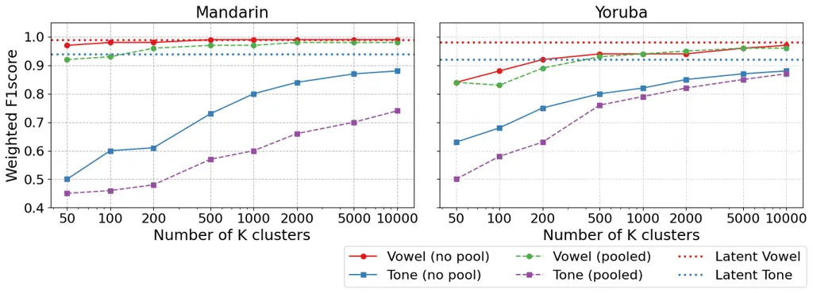
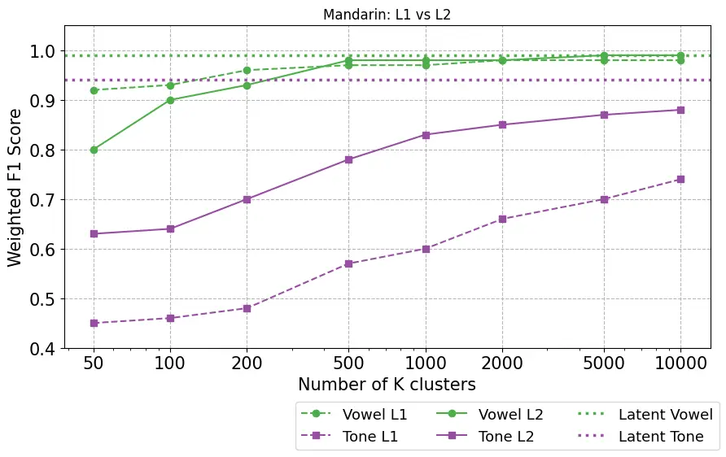

# Lexical Tone is Hard to Quantize: Probing Discrete Speech Units in Mandarin and Yorùbá

Opeyemi Osakuade    Simon King

###### Abstract

Discrete speech units (DSUs) are derived by quantising representations
from models trained using self-supervised learning (SSL). They are a
popular representation for a wide variety of spoken language tasks,
including those where prosody matters. DSUs are especially convenient
for tasks where text and speech are jointly modelled, such as
text-to-speech and multimodal dialogue systems. But we have found that
DSUs encode suprasegmental information less reliably than segmental
structure, which we demonstrate in this work using lexical tone, though
this limitation likely extends to other suprasegmental features such as
prosody.

Our investigations using the tone languages Mandarin and Yorùbá show
that the SSL latent representations themselves do encode tone, yet DSUs
obtained using quantisation tend to prioritise phonetic structure, which
makes lexical tone less reliably encoded. This remains true for a
variety of quantisation methods, not only the most common, K-means.

We conclude that current DSU quantisation strategies have limitations
for suprasegmental features, which suggests a need for new, tone-aware
(or prosody-aware) techniques in speech representation learning. We
point towards a potential form of solution by performing K-means
clustering once to encode phonetic information, then again on the
residual representation, which better encodes lexical tone.

^(†)^(†)address: The Centre for Speech Technology Research, University
of Edinburgh, UK^(†)^(†)email: O.M.Osakuade@sms.ed.ac.uk,
Simon.King@ed.ac.uk

Index Terms: self-supervised learning, lexical tone, suprasegmental
features

## 1 Introduction

Self-supervised learning (SSL) has become a key component of many speech
processing systems, providing rich latent representations that encode
phonetic, lexical, and prosodic information \[1, 2, 3\]. To use these
continuous representations in downstream tasks, it is often necessary to
discretise them into Discrete Speech Units (DSUs). DSUs are a symbolic
representation of speech that is compatible with language models and
facilitates mixing speech and text representations within a single
sequence \[4, 5\]. For language modelling, it is preferable to keep the
vocabulary size (i.e., the number of unique DSUs) as small as possible
\[6\]. DSUs are known to normalise away some unwanted speaker and
channel variability while preserving phonetic content \[7, 8\]. They are
widely used in TTS \[9, 10\], speech-to-speech translation \[11, 12\],
and spoken language modelling \[13, 14\]

### 1.1 Discretisation degrades the representation of tone

Unfortunately, discretisation can remove information that would be
useful to the downstream task. ToneUnit \[15\] showed that, even though
lexical tone is present in SSL latents, it is poorly preserved after
quantisation with K-means. This impacts modelling for tone languages.

In this work, we focus on two typologically distinct tone languages:
Mandarin and Yorùbá. Mandarin has contour tones, while Yorùbá primarily
uses level tones with both lexical and grammatical functions. In both
languages, our findings are consistent with prior work \[15, 16, 17\]:
SSL latents encode phonetic and tonal information, but DSUs (obtained by
quantising those latents) are dominated by the phonetic information,
representing tone less well than the latents. We begin by contributing
further evidence that SSL latents encode both phonetic and tonal
information and aim to answer two linked questions: (i) why does
quantisation degrade tone information? (ii) could an improved
quantisation method mitigate this degradation?

Whilst not part of this work, we believe that our findings for tone
information will naturally also extend to supra-segmental information
such as prosody.

Figure 1: Weighted F1 scores for Mandarin and Yorùbá phone and tone
classification using K-Means codebooks of varying sizes. Solid lines
represent no pooling (phone segment-level), while dashed lines represent
pooled (phone segment-level) features. Dotted lines denote the
corresponding HuBERT latent baselines. The x-axis is logarithmic to
highlight performance gains across orders of magnitude in codebook size.

### 1.2 Can better quantisation help?

Lexical tone is a suprasegmental feature realised over the time course
of a phone or syllable by a relative change in acoustic correlates,
including F0; this is in contrast to the more ‘instantaneous’ and
‘absolute’ nature of contrasts between vowels or consonants \[18, 19,
20\]. Perception by listeners of the acoustic correlates of tone (F0
height and contour) requires temporal context. Training models using SSL
generally involves a reconstruction task (e.g., masked prediction),
given the surrounding context. This is presumably why representations
obtained from such models (SSL latents) encode tone well \[1\]. The
degradation of tone information occurs when they are discretised. A
popular choice is K-means clustering, which treats frames independently.
It is self-evident that increasing $`K`$ will reduce the loss of
information, but this has quickly diminishing returns. Increasing $`K`$
by a factor of 5 from $`1000`$ to $`5000`$ only improves Mandarin tone
representation by a modest amount (F1 score, defined in Section 2.4 from
0.80 to 0.87; Figure 1). $`K`$ corresponds to the vocabulary size
employed by the downstream language model: increasing $`K`$ to a high
value is not a viable solution.

In this work, we explore three possible routes to a solution: 1)
frame-level neural vector quantisers, trained with a reconstruction
objective, because this might preserve more tone-related variation than
K-means; 2) segment-level approaches that take temporal context into
account and so might capture tone trajectories; 3) hierarchical or
residual ‘coarse-to-fine’ approaches, which might capture phonetic and
tonal variation within separate levels.

## 2 Method

Our method involves extracting SSL representations from pre-trained
foundation models, quantising them using various methods, then probing
for both phonetic and tonal information.

### 2.1 Data

We selected data from two representative tone languages: Mandarin
(AISHELL-1, 170 h, 400 speakers \[21\]), and Yorùbá (BibleTTS, 93 h,
single speaker \[22\]). All audio was resampled to
$`16\text{\,}\mathrm{kHz}`$ to suit the SSL models. Lexical tone in both
languages is realised primarily on the vowel nucleus, though for
different phonological reasons. In Mandarin, tones are associated with
the syllable as a whole but are phonetically realised primarily on the
vowel nucleus \[18, 23\]. Yorùbá, by contrast, is a canonical vowel-tone
language in which the vowel functions as the tone-bearing unit \[24,
25\].

Given this shared vowel-centred realisation of tone, we extract
vowel-aligned segments from phonetic alignments for both languages. We
follow the official training, validation, and test splits of each corpus
when training our probing classifiers.

### 2.2 SSL models

We extract continuous frame-level representations using two HuBERT-based
self-supervised models chosen to match the linguistic properties of our
target languages. For Mandarin, we use MandarinHuBERT,¹¹ 1
https://huggingface.co/TencentGameMate/chinese-hubert-base a
HuBERT-based model trained on large-scale Mandarin speech. For Yorùbá,
we use AfriHuBERT \[26\], an extension of mHuBERT-147 trained on speech
from 1,226 African languages, including several tone languages such as
Yorùbá. This ensures that the representations capture both phonetic
detail and tone-relevant information prior to quantisation. Some of our
experimental conditions require phone-level segmentation. For this, we
obtain phonetic alignments using the Montreal Forced Aligner (MFA)
\[27\] together with language-specific lexica generated using
Yoruba-G2P, a tone-aware grapheme-to-phoneme converter for Yorùbá
\[28\]. These alignments are used for segmentation and evaluation.

### 2.3 Frame-based vs. Segment-based Representations

Each vowel phone in the dataset is initially represented by a sequence
of latent vectors extracted from the SSL model, with one vector per
acoustic frame. We optionally apply mean pooling over the frames aligned
to each vowel segment (based on phonetic alignment), resulting in a
single vector per segment.

### 2.4 Probing classifiers

Probing is the established task-agnostic method for analysing SSL
representations \[29, 30\], consistent with benchmarks such as SUPERB
\[31\] and SpeechGLUE \[32\]. The probe is a proxy intended to be a
predictor of eventual downstream task performance. Our probes are
intentionally simple and lightweight classifiers, and they probe for
phone identity and tone only on the vowels (as found using forced
alignment). Note that the Mandarin tone probe is for lexical tone,
because AISHELL-1 does not annotate tone sandhi. The type of probe
depends on whether each vowel is represented as a sequence (frame-based)
or a single vector (segmental). The frame-based probe is an LSTM
(1-layer, hidden size 128), followed by task-specific linear heads for
phone and tone prediction. The model is trained with $`d=0.3`$ dropout
with class-weighted cross-entropy loss and early stopping based on
validation F1. For segmental features, we train a logistic regression
classifier with a softmax output layer. We use cross-entropy loss and
evaluate with weighted F1 score.

The result of quantisation is a sequence of codes (integer indexes into
a codebook). Each code has an underlying vector in latent space (e.g.,
the K-means cluster centroid). We probe these vectors, not the integer
codes.

## 3 Quantisation Methods

The quantisation method is the only experimental variable. Data are
fixed and SSL models are frozen. Any variations in the information found
by the probes can be attributed to the quantisation strategy alone.

### 3.1 Classic K‑means (Frame‑level clustering)

Our baseline applies standard K-means clustering directly to frame-level
latent vectors, which is the method used in the original paper \[8\] and
is very widely used in the literature. K-means results in a set of $`K`$
centroids (i.e., vectors in latent space). Each frame in the dataset is
then replaced with the closest centroid based on Euclidean distance.
K-means is very simple and only uses Euclidean distance in latent space
to find clusters.

### 3.2 Neural Vector Quantisation

Neural approaches to Vector Quantisation (VQ) use a reconstruction
objective, which contrasts with K-means simple distance-based
clustering. We trained neural quantisers following the RepCodec
architecture \[33\], where a small encoder–quantiser–decoder is trained
to reconstruct the latents. One model performs VQ with a single
500-entry codebook; the other uses Residual VQ (RVQ), with two variants
(250 codes $`\times`$ 2 levels; or $`125\times 4`$). After training, we
retain the encoder and quantiser components to discretise SSL
representations into DSUs.

### 3.3 SVC (Segmentation‑Variant Codebooks).

Inspired by prior research \[34\], we assign each frame two centroids:
one from a frame-level codebook and one from the corresponding
phone-level (pooled) codebook. K-means clustering is used for both.
These centroids are then averaged to produce a fused representation that
incorporates both frame-level fine-grained, and segmental context.

### 3.4 Residual K‑means

Here we attempt to factor out phonetic information before representing
tonal information. First, we run K‑means on mean‑pooled phone segments
with coarse quantisation of $`K=50`$, chosen to roughly match the number
of phonemes in Mandarin and Yorùbá. This produces a ‘phone‑identity’
codebook that encodes (only) segmental information. Next, for every
original latent vector, we subtract its phone‑level centroid. The
remaining ‘residual’ latent is intended to contain less phonetic
information than the original latents. We then cluster these residuals
with $`K=450`$. The total number of codes is $`50+450=500`$, so it is
comparable to other experimental conditions.

Quantizer Levels Mandarin Yorùbá Phone Tone Phone Tone Latent
(continuous) – 0.99 0.94 0.97 0.92 Classic K-means (500) 1 0.99 0.70
0.95 0.77 VQ (500) 1 0.97 0.78 0.85 0.66 RVQ (250x2) 2 0.98 0.81 0.92
0.74 RVQ (125x4) 4 0.99 0.82 0.94 0.76 Mean-pooled K-means 1 0.97 0.57
0.93 0.76 SVC (250x2) 2 0.99 0.62 0.93 0.78 Residual
K-means(frame-level) (50+450) 2 0.98 0.76 0.92 0.80 Residual
K-means(Segmental) (50+450) 2 0.99 0.79 0.94 0.83

Table 1: F1 scores for phone and tone classification at $`K=500`$ using
different quantisers for Mandarin and Yorùbá. Multi-codebook quantisers
(RVQ, SVC, and Residual KMeans) improve tone retention over
single-codebook FSQ. Bolded scores are top-2 for tone in each language.

Figure 2: L1 refers to first-pass K-means on the mean-pooled phone
segment at different K; L2 represents clustering on residuals. While L1
performs well for vowels, L2 boosts tone classification, getting closer
to the original (unquantised) latents. Dotted lines indicate latent
baselines.

## 4 Results and Discussion

We use probing to evaluate how well each quantisation method preserves
phonetic and tonal information.

### 4.1 Classic K-means degrades tone information

We find consistently that quantisation tends to degrade tone more than
phone. While SSL latents yield near-ceiling F1 scores for both phone and
tone classification (e.g., 0.99 / 0.94 on Mandarin), classic frame-level
K-means reduces tone F1 to 0.70 (i.e., by 24%) while phone F1 remains
high (Table 1). This reinforces our belief that phonetic information in
SSL latent space has much higher variance than tonal information and so
dominates during quantisation, whether that is distance-based (K-means)
or reconstruction-based (e.g., neural VQ).

Increasing codebook size helps, but only very gradually. As we can see
in Figure 1, tone F1 score improves very slowly as $`K`$ increases, but
still appears to plateau at an F1 score that is below that for the
original latents, even with $`10\,000`$ clusters.

### 4.2 Neural VQ is comparable to K-means

Neural VQ provides improvement over K-means for Mandarin (0.78 for VQ
compared to 0.70 for K-means) but not Yorùbá (0.66 for VQ compared to
0.77 for K-means) – Table 1.

### 4.3 Neural RVQ retains tone better than K-means

RVQ performs substantially better than VQ. The deeper configuration
(125$`\times`$4) yields the best retention of tonal information (0.82
for Mandarin, 0.76 for Yorùbá), suggesting that multi-level residual
modelling helps preserve tone-related variation in the latent space that
a single flat codebook struggles to capture (even with very large
codebooks: Figure 1). The shallower variant (250$`\times`$2) shows a
similar trend but with a slightly lower tone F1 score.

### 4.4 Segment-level clustering

Mean-pooled phone clustering performs noticeably worse (0.57 for
Mandarin and 0.76 for Yorùbá) compared to classic K-means, showing that
mean pooling reduces access to pitch trajectories that unfold within
phone segments. The SVC method sits between these two extremes but still
underperforms the neural methods and, in particular, the residual
approach discussed next.

### 4.5 Residual K-means

Our residual K-means formulation aims to factorise phonetic and tonal
information by first clustering mean-pooled latents and subsequently
clustering the residual variation. This separation yields the best tone
retention among the non-neural approaches and is competitive with the
best neural method (RVQ). Tone F1 reached 0.79 for Mandarin (a little
below the 0.82 for RVQ) and 0.83 for Yorùbá (above the 0.76 for RVQ).

Figure 2 provides further insight. The first-pass K-means (‘level one’,
denoted L1) applied to mean-pooled + quantised latents encodes phone
well, but not tone. The second-pass clustering on residuals (L2) results
in a representation that captures tone much better, getting back towards
the upper-bound F1 that we get with the original latents. Again, this
pattern of results is consistent with tonal variation being much smaller
in magnitude than phonetic variation in the latent space. Accounting for
some of the phonetic information with one round of clustering reduces
its dominance in the second round.

### 4.6 Cross-Language Comparison

Despite typological differences between Mandarin and Yorùbá, our results
show similar trends for both languages: latent features encode both
phone and tone very well indeed, but all forms of discretisation degrade
the representation of tone. This degradation is most severe for flat,
single-codebook methods such as classic K-means and VQ. Quantisation
also impacts the two languages differently. Mandarin tone shows a larger
drop relative to the continuous latent baseline (0.94 to 0.70 with
Classic K-means) than Yorùbá (0.92 to 0.77), suggesting that Mandarin
tones are more sensitive to discretisation.

Multi-level quantisers consistently alleviate this degradation, although
the most effective approach differs across languages. For Mandarin,
deeper RVQ substantially improves tone retention, with RVQ (125×4)
achieving the highest quantised tone score (0.82), representing the
strongest gain over single-level baselines. For Yorùbá, however,
Residual K-means (Segmental) achieves the best tone performance (0.83),
surpassing all RVQ variants and demonstrating the value of segment-aware
residual modelling. These patterns suggest that Mandarin tone benefits
most from multi-level hierarchical quantisation, whereas Yorùbá tone
benefits most from segmental residual modelling.

We attribute this to the nature of tone realisation: Yorùbá has stable,
vowel-aligned level tones, which align well with phone-based
segmentation, making segmental residual modelling especially effective.
In contrast, Mandarin’s contour tones, which exhibit greater
coarticulation and sandhi effects, may require deeper or more flexible
temporal modelling to preserve tonal distinctions.

## 5 Limitations

Our analysis used only representation probing rather than downstream
tasks. This is a standard methodology, but ultimately we need to measure
downstream task performance.

Our probes used forced alignments. This is not a limitation, since they
are only required during evaluation, not quantisation.

However, our Residual K-means approach required those alignments during
quantisation. If these were not available (e.g., a low-resource setting)
then options would include mean-pooling over fixed-duration segments, or
automatic unit discovery. Alternatively, neural RVQ can be used, which
does not require alignments.

## 6 Conclusion

This study examined how a range of quantisation strategies represent
lexical tone in two typologically distinct tone languages, Mandarin and
Yorùbá. While tone is well encoded in the continuous SSL latents, our
probing results show that discretisation always degrades tonal
information more than segmental information. We believe that this result
also has implications for the representation of prosody in SSL latents,
and that discretisation will very likely degrade that too.

The degradation can be mitigated by multi-level quantisation: here, we
compared only neural RVQ and two rounds of K-means. More sophisticated
schemes could surely be devised, which may retain more of the tone
information that exists in the original latents.

More broadly, our findings point to an emerging challenge for the design
of Discrete Speech Units (DSUs): quantisers implicitly emphasise
segmental information and therefore may encode suprasegmental
information less well. Tone is one example, but similar issues are
likely to arise for prosodic dimensions such as phrasing, prominence,
and rhythm. Future work should develop tone-aware or prosody-aware
discretisation schemes.

Such developments have implications for speech LLMs and TTS systems,
especially when these technologies are applied to under-resourced tone
languages, where accurate suprasegmental representation is especially
valuable. Stronger tone retention is particularly relevant for TTS and
speech-to-speech translation in tone languages, where tone errors are
lexically contrastive; improvements in tone preservation will directly
reduce homophone confusions and improve perceived naturalness.

## 7 Acknowledgements

This work was supported in part by the UKRI Centre for Doctoral Training
in Natural Language Processing, funded by the UKRI (grant EP/S022481/1)
and the University of Edinburgh.

We thank Korin Richmond for his constructive suggestions and detailed
review of an earlier draft, which greatly improved the presentation of
this work.

## References

- \[1\] C. Pouw, M. d. H. Kloots, A. Alishahi, and W. Zuidema (2024)
  Perception of Phonological Assimilation by neural speech recognition
  models. Computational Linguistics 50 (4), pp. 1557–1585. Cited by:
  §1.2, §1.
- \[2\] K. Choi, A. Pasad, T. Nakamura, S. Fukayama, K. Livescu, and S.
  Watanabe (2024) Self-Supervised Speech Representations Are More
  Phonetic than Semantic. In Proc. Interspeech, pp. 4578–4582. External
  Links: [Document](https://dx.doi.org/10.21437/Interspeech.2024-1157),
  ISSN 2958-1796 Cited by: §1.
- \[3\] S. Wallbridge, C. Minixhofer, C. Lai, and P. Bell (2025)
  Prosodic Structure Beyond Lexical Content: A Study of Self-Supervised
  Learning. In Proc. Interspeech, pp. 4723–4727. External Links:
  [Document](https://dx.doi.org/10.21437/Interspeech.2025-2068), ISSN
  2958-1796 Cited by: §1.
- \[4\] S. Shon, K. Kim, Y. Hsu, P. Sridhar, S. Watanabe, and K.
  Livescu (2024) DiscreteSLU: A Large Language Model with
  Self-Supervised Discrete Speech Units for Spoken Language
  Understanding. In Proc. Interspeech, pp. 4154–4158. External Links:
  [Document](https://dx.doi.org/10.21437/Interspeech.2024-1306), ISSN
  2958-1796 Cited by: §1.
- \[5\] J. Chou, C. Chien, W. Hsu, K. Livescu, A. Babu, A. Conneau, A.
  Baevski, and M. Auli (2023) Toward joint language modeling for speech
  units and text. In Findings of the Association for Computational
  Linguistics: EMNLP 2023, pp. 6582–6593. Cited by: §1.
- \[6\] Y. Labrak, R. Dufour, and M. Rouvier (2025) An empirical
  analysis of discrete unit representations in speech language modeling
  pre-training. In International Conference on Text, Speech, and
  Dialogue, pp. 13–24. Cited by: §1.
- \[7\] A. Baevski, Y. Zhou, A. Mohamed, and M. Auli (2020) wav2vec 2.0:
  a framework for Self-Supervised Learning of Speech Representations.
  Advances in Neural Information Processing Systems 33, pp. 12449–12460.
  Cited by: §1.
- \[8\] W. Hsu, B. Bolte, Y. H. Tsai, K. Lakhotia, R. Salakhutdinov,
  and A. Mohamed (2021) HuBERT: Self-Supervised Speech Representation
  Learning by masked prediction of hidden units. IEEE/ACM Transactions
  on Audio, Speech, and Language Processing 29, pp. 3451–3460. Cited by:
  §1, §3.1.
- \[9\] A. Polyak, Y. Adi, J. Copet, E. Kharitonov, K. Lakhotia, W.
  Hsu, A. Mohamed, and E. Dupoux (2021) Speech resynthesis from Discrete
  Disentangled Self-Supervised Representations. In Proc. Interspeech,
  pp. 3615–3619. External Links:
  [Document](https://dx.doi.org/10.21437/Interspeech.2021-475), ISSN
  2958-1796 Cited by: §1.
- \[10\] S. Chen, C. Wang, Y. Wu, Z. Zhang, L. Zhou, S. Liu, Z. Chen, Y.
  Liu, H. Wang, J. Li, L. He, S. Zhao, and F. Wei (2025) Neural codec
  language models are zero-shot Text-to-Speech synthesizers. IEEE
  Transactions on Audio, Speech, and Language Processing 33,
  pp. 705–718. Cited by: §1.
- \[11\] S. Popuri, P. Chen, C. Wang, J. Pino, Y. Adi, J. Gu, W. Hsu,
  and A. Lee (2022) Enhanced Direct Speech-to-Speech Translation Using
  Self-Supervised Pre-training and Data Augmentation. In Proc.
  Interspeech, pp. 5195–5199. External Links:
  [Document](https://dx.doi.org/10.21437/Interspeech.2022-11032), ISSN
  2958-1796 Cited by: §1.
- \[12\] X. Li, Y. Jia, and C. Chiu (2023) Textless direct
  Speech-to-Speech Translation with Discrete Speech Representation. In
  Proc. ICASSP, pp. 1–5. Cited by: §1.
- \[13\] T. A. Nguyen, E. Kharitonov, J. Copet, Y. Adi, W. Hsu, A.
  Elkahky, P. Tomasello, R. Algayres, B. Sagot, A. Mohamed, et
  al. (2023) Generative spoken dialogue language modeling. Transactions
  of the Association for Computational Linguistics 11, pp. 250–266.
  Cited by: §1.
- \[14\] W. Cui, D. Yu, X. Jiao, Z. Meng, G. Zhang, Q. Wang, S. Y. Guo,
  and I. King (2025) Recent advances in speech language models: a
  survey. In Proceedings of the 63rd Annual Meeting of the Association
  for Computational Linguistics (Volume 1: Long Papers),
  pp. 13943–13970. Cited by: §1.
- \[15\] D. Tao, D. Tan, Y. T. Yeung, X. Chen, and T. Lee (2024)
  ToneUnit: a speech discretization approach for tonal language speech
  synthesis. CoRR. Cited by: §1.1, §1.1.
- \[16\] G. Shen, M. Watkins, A. Alishahi, A. Bisazza, and G.
  Chrupała (2024) Encoding of lexical tone in Self-Supervised Models of
  Spoken Language. In Proceedings of the 2024 Conference of the North
  American Chapter of the Association for Computational Linguistics:
  Human Language Technologies (Volume 1: Long Papers), pp. 4250–4261.
  Cited by: §1.1.
- \[17\] O. Osakuade and S. King (2024) Do discrete self-supervised
  representations of speech capture tone distinctions?. arXiv preprint
  arXiv:2410.19935. Cited by: §1.1.
- \[18\] M. Yip (2002) Tone. Cambridge University Press. Cited by: §1.2,
  §2.1.
- \[19\] V. Fromkin (1978) Tone: a linguistic survey. In Tone: A
  Linguistic Survey, V. Fromkin (Ed.), pp. 1–28. Cited by: §1.2.
- \[20\] D. Burnham and K. Mattock (2008) The perception of tones and
  phones. In Language Experience in Second Language Speech Learning,
  pp. 259–280. Cited by: §1.2.
- \[21\] H. Bu et al. (2017) AISHELL-1: an open mandarin speech corpus.
  In O-COCOSDA, Cited by: §2.1.
- \[22\] J. Meyer and H. Ha (2022) BibleTTS: a large corpus for
  multilingual Text-to-Speech in the wild. In interspee, Cited by: §2.1.
- \[23\] S. Duanmu (2007) The phonology of standard chinese. Oxford
  University Press. Cited by: §2.1.
- \[24\] K. Adeniyi (2020) Lexicalisation of tonal downstep in yoruba.
  Canadian Journal of Linguistics/Revue canadienne de linguistique 65
  (4), pp. 535–555. Cited by: §2.1.
- \[25\] Y. O. Laniran (2003) Downstep and high raising: interacting
  factors in yoruba tone production. Journal of phonetics 31 (2),
  pp. 203–250. Cited by: §2.1.
- \[26\] J. O. Alabi, X. Liu, D. Klakow, and J. Yamagishi (2025)
  AfriHuBERT: a Self-Supervised Speech Representation Model for African
  Languages. In Proc. Interspeech, pp. 4023–4027. External Links:
  [Document](https://dx.doi.org/10.21437/Interspeech.2025-1437), ISSN
  2958-1796 Cited by: §2.2.
- \[27\] M. McAuliffe, M. Socolof, S. Mihuc, M. Wagner, and M.
  Sonderegger (2017) Montreal forced aligner: trainable text-speech
  alignment using kaldi. In Proc. Interspeech, pp. 498–502. External
  Links: [Document](https://dx.doi.org/10.21437/Interspeech.2017-1386),
  ISSN 2958-1796 Cited by: §2.2.
- \[28\] O. Osakuade (2025) Yoruba-g2p: a tone-aware grapheme-to-phoneme
  converter for Yorùbá. Note:
  https://github.com/OpeyemiOsakuade/yoruba-g2pGitHub repository Cited
  by: §2.2.
- \[29\] Y. Belinkov and J. Glass (2019) Analysis methods in neural
  language processing: a survey. Transactions of the Association for
  Computational Linguistics 7, pp. 49–72. Cited by: §2.4.
- \[30\] J. Hewitt and C. D. Manning (2019) A structural probe for
  finding syntax in word representations. In Proc. of the 2019 NAACL:
  Human Language Technologies, Volume 1 (Long and Short Papers),
  pp. 4129–4138. Cited by: §2.4.
- \[31\] S. Yang, P. Chi, Y. Chuang, C. J. Lai, K. Lakhotia, Y. Y.
  Lin, A. T. Liu, J. Shi, X. Chang, G. Lin, T. Huang, W. Tseng, K.
  Lee, D. Liu, Z. Huang, S. Dong, S. Li, S. Watanabe, A. Mohamed, and H.
  Lee (2021) SUPERB: Speech Processing Universal PERformance Benchmark.
  In Proc. Interspeech, pp. 1194–1198. External Links:
  [Document](https://dx.doi.org/10.21437/Interspeech.2021-1775), ISSN
  2958-1796 Cited by: §2.4.
- \[32\] T. Ashihara, T. Moriya, K. Matsuura, T. Tanaka, Y. Ijima, T.
  Asami, M. Delcroix, and Y. Honma (2023) SpeechGLUE: how well can
  Self-Supervised Speech Models capture linguistic knowledge?. In Proc.
  Interspeech, pp. 2888–2892. External Links:
  [Document](https://dx.doi.org/10.21437/Interspeech.2023-1823), ISSN
  2958-1796 Cited by: §2.4.
- \[33\] Z. Huang, C. Meng, and T. Ko (2024) RepCodec: a speech
  representation codec for speech tokenization. In Proceedings of the
  62nd Annual Meeting of the Association for Computational Linguistics
  (Volume 1: Long Papers), pp. 5777–5790. Cited by: §3.2.
- \[34\] N. Sanders, Y. Li, K. Richmond, and S. King (2025)
  Segmentation-Variant Codebooks for Preservation of Paralinguistic and
  Prosodic Information. In Proc. Interspeech, pp. 5403–5407. External
  Links: [Document](https://dx.doi.org/10.21437/Interspeech.2025-2075),
  ISSN 2958-1796 Cited by: §3.3.
