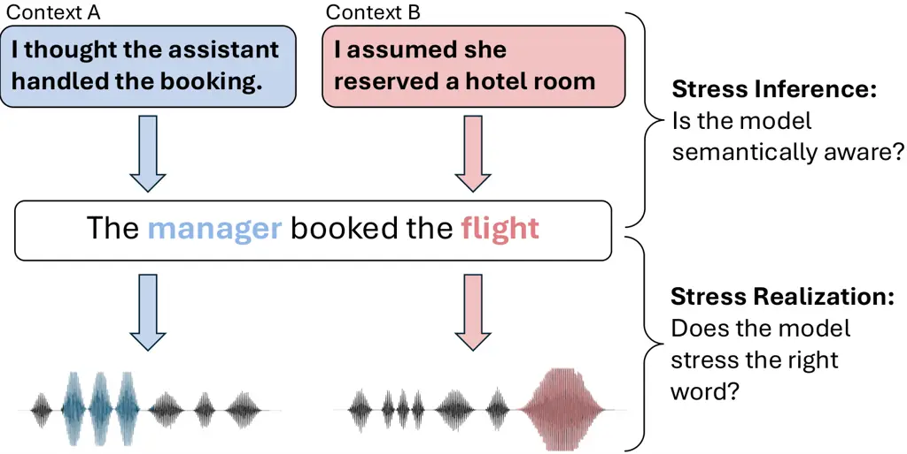
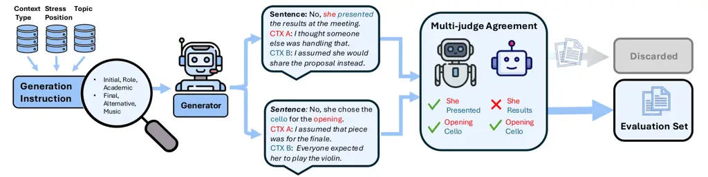

Turetzky Dekel Aronowitz Hoory Adi

# Knowing What to Stress: A Discourse-Conditioned Text-to-Speech Benchmark

Arnon    Avihu    Hagai    Ron    Yossi

###### Abstract

Spoken meaning often depends not only on what is said, but also on which
word is emphasized. The same sentence can convey correction, contrast,
or clarification depending on where emphasis falls. Although modern
text-to-speech (TTS) systems generate expressive speech, it remains
unclear whether they infer contextually appropriate stress from
discourse alone. To address this gap, we present CAST (CAST), a
benchmark for evaluating context-conditioned word-level stress in TTS.
Items are defined as contrastive context pairs: identical sentences
paired with distinct contexts requiring different stressed words. We
evaluate state-of-the-art systems and find a consistent gap: text-only
language models reliably recover the intended stress from context, yet
TTS systems frequently fail to realize it in speech. We release the
benchmark, evaluation framework, construction pipeline and a synthetic
corpus to support future work on context-aware speech synthesis.

###### keywords

text-to-speech, benchmark, prosody, speech synthesis

^(†)^(†)address: ¹ The Hebrew University of Jerusalem, Israel  
² IBM Research, Israel ^(†)^(†)email: arnon.turetzky@mail.huji.ac.il

## 1 Introduction

Spoken communication conveys more than lexical content alone. Prosody
signals emphasis, contrast, correction, and information structure,
shaping how an utterance is interpreted \[1, 2\]. One key aspect of
prosody is sentence stress, which refers to emphasis placed on
particular words or phrases and can dramatically change meaning for the
same written form \[3, 4\]. In many conversational settings, the
appropriate prosody depends on discourse context rather than the
sentence itself. For example, the sentence “The manager booked the
flight” may emphasize _manager_ to correct a mistaken assumption about
who performed the action, or emphasize _flight_ to clarify what was
booked. Although the words remain identical, the intended meaning
changes with stress placement. In such cases, lexical stress functions
as a marker of contrastive focus, as illustrated in Figure 1.

Recent advances in TTS have enabled high-quality and increasingly
expressive speech generation \[5, 6, 7\]. Yet it remains unclear whether
this natural-sounding prosody reliably reflects discourse-dependent
meaning when no explicit emphasis signal is provided. Understanding this
requires a controlled evaluation framework that isolates
context-dependent stress as a measurable phenomenon.



Figure 1: Discourse context determines which word should be stressed in
a given sentence.

Prior work has evaluated prosodic phenomena from several perspectives,
including stress detection and reasoning \[8, 4, 9\], emphasis
realization with explicit targets \[10, 11\], and preservation of stress
in spoken translation \[10\]. While these efforts advance prosody
evaluation and modeling, they do not test whether a TTS system infers
and shifts stress appropriately across contrasting discourse contexts
for identical sentences. We address this gap with the following
contributions:

- •
  CAST: a benchmark for context-conditioned word-level stress in TTS,
  where identical sentences are paired with distinct contexts requiring
  different stressed words, with stress targets defined semantically.
- •
  A scalable data generation pipeline used to construct CAST, released
  to support benchmark regeneration and scaling, with an extended
  version supporting audio synthesis for broader research on
  context-aware stress.
- •
  A systematic evaluation of state-of-the-art TTS systems, showing that
  all evaluated systems fail to reliably produce context-appropriate
  stress in speech across all conditioning modes.

In addition, we release a synthetic corpus of $`\sim 10k`$
context-sentence-audio triples generated by the extended pipeline.
Unlike the text-only benchmark, this extension adds audio synthesis and
automatic acoustic stress validation. The corpus is made available to
support future research.

## 2 Related Work

Neural TTS systems increasingly support expressive and controllable
prosody. Prior work has explored global style embeddings and style
tokens to modulate speaking style \[12, 13, 14\], as well as prosody
transfer from reference speech \[15\]. More recent systems demonstrate
accurate realization of word-level stress when it is explicitly
specified through control tokens or annotations \[5, 16\]. While these
approaches improve prosodic controllability, they assume that the
appropriate stress target is provided at inference time and do not
address the problem of inferring stress from discourse context.



Figure 2: Overview of the CAST construction and validation pipeline.
Contrastive context pairs are generated via structured prompting and
filtered through multi-judge consistency checks.

Several benchmarks evaluate stress or emphasis from different
perspectives. Stress detection tasks derive prominence labels from
speech corpora and frame the problem as predicting observed emphasis
\[9\]. The StressTest benchmark \[4\] constructs contrastive examples to
study stress understanding, but focuses on language understanding rather
than speech generation. EmphAssess \[10\] and Prosaudit \[11\] evaluate
emphasis realization or transfer, measuring whether models preserve or
reproduce explicitly marked stress. These evaluations assess stress
detection or controlled realization, but do not test context-driven
stress shifts in TTS generation.

Overall, existing work either models prosody given explicit control,
detects stress from speech, or studies contrastive focus at the text
level without speech synthesis. In contrast, CAST defines intended
stress semantically and evaluates end-to-end TTS systems on their
ability to infer and realize context-conditioned stress across
controlled contrastive context pairs.

## 3 CAST

### 3.1 Task

We consider the task of context-conditioned stress generation in TTS.
The input consists of a textual context $`c`$ and a target sentence
$`s=(w_{1},\dots,w_{n})`$. The output is a synthesized speech signal
$`\hat{y}`$ corresponding to $`s`$. No stress annotations or emphasis
markers are provided at inference time. Each benchmark item is defined
by a tuple $`(c,s,w^{*})`$, where $`w^{*}`$ denotes the intended
stressed word in $`s`$, defined semantically based on the discourse
context. A successful system must infer the appropriate stress target
from $`\boldsymbol{c}`$ and $`\boldsymbol{s}`$, and realize that
emphasis acoustically in the generated speech. Table 1 illustrates
contrastive context pairs in which the same sentence requires different
stress targets depending on the preceding discourse. This contrastive
design ensures that any observed stress difference can be attributed to
context rather than sentence-internal biases, as the lexical content is
held constant across conditions.

| Context                                              | Target Sentence                                     |
| ---------------------------------------------------- | --------------------------------------------------- |
| A: The editor wrote it ran in the spring.            | She published the essay in the winter issue.        |
| B: I believed she sent a draft.                      |                                                     |
| A: I thought Tom was the mentor here.                | The incubator selected Priya as the startup mentor. |
| B: People assumed she would run the investment team. |                                                     |

Table 1: Examples from CAST. Each target sentence is paired with two
contexts. The intended stressed word for Context A is shown in blue, and
for Context B in red.

### 3.2 Benchmark Construction

The CAST evaluation set is constructed entirely at the textual level.
Contexts, sentences, and intended stress targets are generated jointly
using structured prompting with gpt-5-mini. Generating these elements
together ensures semantic coherence: the context motivates a particular
interpretation of the sentence, and the stressed word is selected as
part of the same generative process rather than inferred post hoc. Each
sentence is constructed to contain exactly two plausible stress
candidates. Generation is controlled via planning codes that specify the
stress position and the discourse function of the first context
variation (e.g., correction, role disambiguation, exclusivity). The
second variation has more freedom, constrained only to stress the other
candidate word. Full generation and sampling details are released
alongside the pipeline.

Generated items are filtered through a multi-judge consistency check
using two independent models: gpt-5-nano and gemini-2.5-flash. We
discard items where the two judges disagree on the intended stressed
word given the context. To mitigate potential circularity,
gemini-2.5-flash serves as an independent judge from a different model
family than the generator. Human annotators confirmed label quality on a
subset covering all stress positions and context types present in the
full benchmark (Section 4.3). Items failing either check are discarded,
yielding the final benchmark set. We note that no speech synthesis or
acoustic information is used at any stage of construction. During
evaluation, stress correctness is assessed from speech produced by the
evaluated system, not from reference audio. An overview of the
construction pipeline is illustrated in Figure 2.

| Stress Position | %    | Context Type | %    |
| --------------- | ---- | ------------ | ---- |
| Initial         | 23.9 | Alternative  | 18.6 |
| Early           | 23.9 | Exclusivity  | 16.8 |
| Medial          | 23.0 | Role         | 15.9 |
| Final           | 29.2 | Correction   | 13.3 |
|                 |      | Location     | 12.4 |
|                 |      | Quantity     | 10.6 |
|                 |      | Timing       | 7.1  |
|                 |      | Modality     | 5.3  |

Table 2: Diversity statistics of the CAST. The target stress position is
balanced across the sentence, preventing models from exploiting position
bias. Context types cover a wide range of pragmatic phenomena.

### 3.3 Dataset Overview

The CAST evaluation set contains 113 contrastive context pairs (226
items), validated through multi-judge agreement as described above.
Table 2 shows that the evaluation set is balanced across stress
positions and pragmatic phenomena. Because stress targets are
distributed across sentence positions and discourse types, models are
unlikely to succeed through positional heuristics or shallow keyword
matching.

### 3.4 Training Resource

In addition to the benchmark, we release an extended version of the
construction pipeline that supports audio synthesis and automatic
stress-based filtering. This enables scalable construction of
context-sentence-audio triples for supervised training. We release an
initial corpus of $`\sim`$10k samples generated by this pipeline to
support future work on training context-aware TTS systems. This corpus
is separate from the benchmark and is not used in evaluation.

## 4 Experimental Setup

### 4.1 Evaluated Systems

We evaluate a diverse set of TTS systems, each under the conditioning
modes it natively supports. In addition to baseline (no context), we
consider three modes: (1) Concat: the context is prepended to the target
sentence as a single input. The full audio is synthesized from the
concatenated input, and the target sentence boundaries are identified
using Whisper-based forced alignment. Evaluation metrics are computed
only on the extracted segment, ensuring comparability across
conditioning modes. (2) Instruct: the context is provided as a natural
language instruction, e.g., ”The following context determines which word
should be emphasized in the sentence: \[context\]”. (3) Explicit: the
target stressed word is specified using model-supported markup. Kokoro
is a conventional non-LLM system, included as a reference for
sentence-internal stress patterns. Chatterbox \[6\] is an LLM-based
system without instruction support. CosyVoice, HiggsAudio V2, and
Qwen3-TTS \[5, 17, 7\] are publicly available instruction-capable
LLM-based systems. Lastly, GPT-4o-mini-tts is a proprietary
high-performance instruction-capable system, also evaluated under
explicit-stress conditions.

Model Stress Hit Contrast Correct Kokoro - $`38.1\pm 6.4`$
$`22.1\pm 4.4`$ $`0.0`$ Chatterbox - $`23.0\pm 5.6`$ $`16.8\pm 4.4`$
$`0.0`$ Concat $`22.6\pm 5.8`$ $`15.5\pm 4.2`$ $`0.0`$ CosyVoice3 -
$`32.3\pm 5.8`$ $`23.5\pm 4.9`$ $`0.9\pm 1.4`$ Concat $`36.3\pm 5.8`$
$`23.9\pm 4.7`$ $`0.0`$ Instruct $`32.3\pm 6.0`$ $`23.0\pm 4.9`$
$`0.9\pm 1.4`$ Explicit $`52.2\pm 6.0`$ $`40.3\pm 5.8`$ $`10.6\pm 5.8`$
GPT-4o-mini Instruct $`35.4\pm 6.2`$ $`26.1\pm 5.3`$ $`3.5\pm 3.1`$
Explicit $`51.8\pm 6.2`$ $`43.8\pm 5.3`$ $`11.5\pm 5.8`$ HiggsAudio V2
Instruct $`30.1\pm 6.0`$ $`23.0\pm 4.9`$ $`2.7\pm 3.1`$ Qwen3TTS -
$`42.5\pm 6.0`$ $`26.1\pm 5.1`$ $`2.7\pm 3.1`$ Concat $`35.0\pm 6.0`$
$`24.8\pm 4.9`$ $`2.7\pm 3.1`$ Instruct $`38.9\pm 6.5`$ $`22.6\pm 5.3`$
$`3.5\pm 3.1`$

Table 3: Stress realization results (%). Hit: target word stressed;
Pair-Contrast: target present and alternative absent; Pair-Correct: both
sides correct. Explicit stress is an oracle upper bound. $`\pm=95\%`$
bootstrap CI over 10K resamplings.

### 4.2 Evaluation Protocol

All systems are evaluated exclusively based on their generated audio,
without access to reference speech or oracle stress annotations at
inference time. The objective is to determine whether synthesized speech
(i) realizes the intended stressed word and (ii) adapts stress
appropriately across contrasting contexts.

Stress Detection. To enable scalable evaluation across systems and input
conditions, we employ WhiStress \[8\], an automatic stress detection
model built upon Whisper and fine-tuned to identify prominent stressed
words in spoken utterances. Given synthesized audio $`\hat{y}`$ for a
sentence $`s`$, the detector outputs a set of predicted stressed words
$`\hat{Y}`$, applied uniformly across all evaluated systems. The
evaluation protocol is detector-agnostic and can accommodate future
stress detection models. We validate WhiStress as a reliable proxy for
human stress perception in Section 4.3.

Stress Metrics. Standard precision, recall, and F1 measure whether the
intended word is stressed, but can miss context sensitivity. A system
that consistently stresses the same word regardless of context could
achieve high F1 while failing the core task. We therefore introduce
contrastive metrics that explicitly measure adaptation across contexts.
Let $`A`$ and $`B`$ denote the intended stressed words for a contrastive
context pair (as defined in Section 3), and let $`\hat{Y}_{A}`$ and
$`\hat{Y}_{B}`$ denote the detected stressed words for each synthesized
output.

Hit: a per-sample metric indicating whether the intended stressed word
appears among detected stressed words:

```math
\mathbf{1}[A\in\hat{Y_{A}}]
```

and symmetrically for $`(c_{B},s,B)`$. This measures basic stress
expressiveness, regardless of additional stressed words.

Pair-Contrast (Contrast): a per-sample metric requiring the correct
stressed word to be present _and_ the alternative context’s stressed
word to be absent:

```math
\mathbf{1}\big[A\in\hat{Y}_{A}\ \wedge\ B\notin\hat{Y}_{A}\big]
```

and symmetrically for $`(c_{B},s)`$. This goes beyond Hit by penalizing
over-expressive stress: the intended word must be stressed while the
word that would be correct under the opposing context must not. A system
that stresses too many words will fail here. However, a system with a
sentence-internal bias toward one candidate may still satisfy Pair
Contrast for one side of the pair by chance.

Pair-Correct (Correct): a pair-level metric requiring Pair Contrast to
hold for _both_ sides of the contrastive context pair:

```math
\mathbf{1}\Big[(A\in\hat{Y}_{A}\wedge B\notin\hat{Y}_{A})\ \wedge\ (B\in\hat{Y}_{B}\wedge A\notin\hat{Y}_{B})\Big].
```

This is the strictest metric, requiring Pair Contrast to hold for both
sides simultaneously. Since the two samples share the same sentence, any
sentence-internal bias will produce the same stress pattern for both,
making it impossible to satisfy Pair Correct without genuinely
responding to the differing contexts.

### 4.3 Human Validation

We conduct two human evaluation studies to validate (1) the benchmark’s
ground-truth labels and (2) the automatic stress detector used for
evaluation.

Benchmark Labels. To verify that the LLM-generated contrastive context
stress labels reflect human judgment, three annotators, all fluent
English speakers, independently identified the contextually stressed
word in 50 items (25 contrastive context pairs). Individual accuracy
against benchmark labels ranged from $`80\%`$ to $`94\%`$, with average
pairwise agreement of $`79\%`$. A majority consensus ($`\geq`$2/3) was
reached on $`94\%`$ of items, matching the ground truth in $`93.6\%`$ of
those cases (Pair-Correct: $`95.5\%`$). The three items where the
majority diverged from the benchmark involved sentences with multiple
plausible focal words, confirming that the generated labels are
well-calibrated with human intuition about contrastive context stress.

Stress Detector. To assess whether WhiStress serves as a reliable proxy
for human stress perception, three listeners, all fluent English
speakers, annotated 50 synthesized utterances (25 CosyVoice explicit,
25 gpt-4o-mini-tts context-instruct), marking all words they perceived
as stressed. Inter-annotator agreement was Fleiss’ $`\kappa=0.36`$,
consistent with prior work on prosodic prominence perception \[18\].
Human–WhiStress agreement (majority-vote vs. detector, $`\kappa=0.32`$,
$`F1=0.48`$) falls within the range of pairwise inter-annotator
agreement ($`\kappa=0.29`$–$`0.40`$), indicating that detector
disagreements with any individual listener are no larger than
disagreements among listeners themselves.

## 5 Results

### 5.1 Context-Aware Stress Realization

Table 3 summarizes performance across models and input modes. Overall,
all evaluated systems exhibit limited reliability in context-dependent
stress realization. While several models achieve moderate Hit scores,
indicating that the target word is sometimes stressed, Pair-Contrast and
Pair-Correct remain substantially lower across all systems. Pair-Correct
scores are near zero for nearly all systems, suggesting that models
frequently default to sentence-internal stress patterns rather than
adapting to discourse context.

Providing context yields no clear improvement improvement across any
system or conditioning mode. Confidence intervals (CIs) for
Pair-Contrast and Pair-Correct overlap substantially across all context
conditions, indicating that current TTS systems do not effectively
utilize context regardless of how it is provided.

Explicit stress supervision provides a clearly higher upper bound, with
non-overlapping CIs relative to all context conditions. CosyVoice with
explicit stress reaches Pair-Contrast of $`40.3\pm 5.8`$ and Pair
Correct of $`10.6\pm 5.8`$, suggesting that the capacity for stress
realization exists but is not reliably activated by contextual input
alone. Nevertheless, even explicit supervision falls short of reliable
realization and remains a challenge itself.

### 5.2 Text-Only Stress Inference

To isolate semantic stress inference from acoustic realization, we
evaluate text-only language models on the same benchmark. Models receive
conversational context and sentence text and directly predict the
intended stressed word. All models are evaluated zero-shot, without
in-context examples. For models that support a thinking mode, we use the
standard non-thinking. Table 4 shows that text-only models substantially
outperform all end-to-end TTS systems. Performance improves consistently
with model scale, with Qwen3 models achieving Contrast up to 57.5%.
Claude Haiku achieves 88.1% Contrast and 76.1% Correct. These results
confirm that the intended stress is largely recoverable from context at
the text level, establishing a strong upper bound for speech generation.
We note that while the evaluated text models may predict incorrectly,
they consistently predict exactly one stressed word per item. As a
result, Hit and Contrast are identical.

| Model            | Hit $`\uparrow`$ | Contrast $`\uparrow`$ | Correct $`\uparrow`$ |
| ---------------- | ---------------- | --------------------- | -------------------- |
| Qwen3-0.6B       | 25.2             | 25.2                  | 5.3                  |
| Qwen3-1.7B       | 50.0             | 50.0                  | 24.8                 |
| Qwen3-4B         | 57.5             | 57.5                  | 37.2                 |
| Claude-haiku-4.5 | 88.1             | 88.1                  | 76.1                 |

Table 4: Text-only stress inference (%). Models predict the stressed
word directly from context and sentence.

## 6 Discussion

Our results reveal a consistent gap between text-level stress inference
and speech-level stress realization in current TTS systems. Text-only
models demonstrate that the intended stressed word is largely
recoverable from discourse context, yet TTS systems fail to reliably
produce context-appropriate stress in speech. This gap persists across
all evaluated systems and conditioning modes. The explicit stress
oracle, where the target word is directly specified, shows better
results, though it remains far from perfect, suggesting room for
improvement in both stress realization and contextual understanding.

Our evaluation relies on WhiStress as the stress detector, which may
favor certain acoustic cues such as loudness over subtler pitch-based
emphasis. We validate its reliability against human perception in
Section 4.3, but acknowledge that automatic detection remains an
imperfect proxy.

Additionally, we focus on lexical stress as a controlled and measurable
starting point. Broader prosodic dimensions such as intonation contour
and phrasing may also carry contextual intent and represent a natural
direction for future work.

## 7 Conclusion

We introduced CAST, a benchmark for evaluating context-conditioned
word-level stress in TTS. By defining intended stress semantically
through contrastive context pairs and evaluating realization directly
from synthesized speech, the benchmark isolates a core open challenge in
expressive TTS.

Our results reveal a consistent gap: while the intended stressed word is
largely recoverable from text, current TTS systems fail to realize this
in speech across all evaluated architectures and conditioning modes. We
hope future work will advance not only explicit stress realization but
also the ability of TTS systems to infer appropriate stress from
discourse context.

We release the benchmark, evaluation framework, construction pipeline,
and a synthetic training corpus to support research on context-aware
stress in speech synthesis.

## 8 Generative AI Use Disclosure

Generative AI tools were used as part of the research methodology, as
described in Section 3.2, and for editing and polishing the manuscript
text.

## References

- \[1\] M. ROOTH (1992) A theory of focus interpretation. Natural
  Language Semantics 1 (1), pp. 75–116. External Links: ISSN 0925854X,
  1572865X, [Link](http://www.jstor.org/stable/23748778) Cited by: §1.
- \[2\] D. Büring (2007) Semantics, intonation, and information
  structure. In The Oxford Handbook of Linguistic Interfaces, External
  Links: ISBN 9780199247455,
  [Document](https://dx.doi.org/10.1093/oxfordhb/9780199247455.013.0015),
  [Link](https://doi.org/10.1093/oxfordhb/9780199247455.013.0015),
  https://academic.oup.com/book/0/chapter/213064762/chapter-ag-pdf/44592382/book_28175_section_213064762.ag.pdf
  Cited by: §1.
- \[3\] D. L. M. Bolinger (1972) Accent is predictable (if you’re a
  mind-reader). Language 48, pp. 633. External Links:
  [Link](https://api.semanticscholar.org/CorpusID:147045197) Cited by:
  §1.
- \[4\] I. Yosha, G. Maimon, and Y. Adi (2025) StressTest: can your
  speech lm handle the stress?. arXiv preprint arXiv:2505.22765. Cited
  by: §1, §1, §2.
- \[5\] Z. Du, C. Gao, Y. Wang, F. Yu, T. Zhao, H. Wang, X. Lv, H.
  Wang, C. Ni, X. Shi, et al. (2025) Cosyvoice 3: towards in-the-wild
  speech generation via scaling-up and post-training. arXiv preprint
  arXiv:2505.17589. Cited by: §1, §2, §4.1.
- \[6\] Resemble AI (2025) Chatterbox-TTS. Note:
  [https://github.com/resemble-ai/chatterbox](https://github.com/resemble-ai/chatterbox)GitHub
  repository Cited by: §1, §4.1.
- \[7\] H. Hu, X. Zhu, T. He, D. Guo, B. Zhang, X. Wang, Z. Guo, Z.
  Jiang, H. Hao, Z. Guo, et al. (2026) Qwen3-tts technical report. arXiv
  preprint arXiv:2601.15621. Cited by: §1, §4.1.
- \[8\] I. Yosha, D. Shteyman, and Y. Adi (2025) Whistress: enriching
  transcriptions with sentence stress detection. arXiv preprint
  arXiv:2505.19103. Cited by: §1, §4.2.
- \[9\] M. Morrison, P. Pawar, N. Pruyne, J. Cole, and B. Pardo (2024)
  Crowdsourced and automatic speech prominence estimation. In ICASSP
  2024-2024 IEEE International Conference on Acoustics, Speech and
  Signal Processing (ICASSP), pp. 12281–12285. Cited by: §1, §2.
- \[10\] M. de Seyssel, A. D’Avirro, A. Williams, and E. Dupoux (2024)
  Emphassess: a prosodic benchmark on assessing emphasis transfer in
  speech-to-speech models. In Proceedings of the 2024 Conference on
  Empirical Methods in Natural Language Processing, pp. 495–507. Cited
  by: §1, §2.
- \[11\] M. de Seyssel, M. Lavechin, H. Titeux, A. Thomas, G.
  Virlet, A. S. Revilla, G. Wisniewski, B. Ludusan, and E. Dupoux (2023)
  ProsAudit, a prosodic benchmark for self-supervised speech models.
  arXiv preprint arXiv:2302.12057. Cited by: §1, §2.
- \[12\] Y. Wang, D. Stanton, Y. Zhang, R. Ryan, E. Battenberg, J.
  Shor, Y. Xiao, Y. Jia, F. Ren, and R. A. Saurous (2018) Style tokens:
  unsupervised style modeling, control and transfer in end-to-end speech
  synthesis. In International conference on machine learning,
  pp. 5180–5189. Cited by: §2.
- \[13\] R. Skerry-Ryan, E. Battenberg, Y. Xiao, et al. (2021) Towards
  end-to-end prosody transfer for expressive speech synthesis with
  tacotron. ArXiv preprint arXiv:1803.09047. Cited by: §2.
- \[14\] K. Lee, J. Kim, J. Kong, and S. Yoon (2021) Styler: style
  factor modeling with continuous prompt for expressive speech
  synthesis. In NeurIPS, Cited by: §2.
- \[15\] R. Skerry-Ryan, E. Battenberg, Y. Xiao, Y. Wang, D. Stanton, J.
  Shor, R. Weiss, R. Clark, and R. A. Saurous (2018) Towards end-to-end
  prosody transfer for expressive speech synthesis with tacotron. In
  international conference on machine learning, pp. 4693–4702. Cited by:
  §2.
- \[16\] Y. Korotkova, I. Kalinovskiy, and T. Vakhrusheva (2024)
  Word-level text markup for prosody control in speech synthesis.. In
  Interspeech, Cited by: §2.
- \[17\] Boson AI (2025) Higgs Audio V2: Redefining Expressiveness in
  Audio Generation. Note:
  [https://github.com/boson-ai/higgs-audio](https://github.com/boson-ai/higgs-audio)GitHub
  repository. Release blog available at
  [https://www.boson.ai/blog/higgs-audio-v2](https://www.boson.ai/blog/higgs-audio-v2)
  Cited by: §4.1.
- \[18\] J. Bishop, G. Kuo, and B. Kim (2020) Phonology, phonetics, and
  signal-extrinsic factors in the perception of prosodic prominence:
  evidence from rapid prosody transcription. Journal of Phonetics 82,
  pp. 100977. External Links: ISSN 0095-4470,
  [Document](https://dx.doi.org/https%3A//doi.org/10.1016/j.wocn.2020.100977),
  [Link](https://www.sciencedirect.com/science/article/pii/S0095447018300755)
  Cited by: §4.3.
