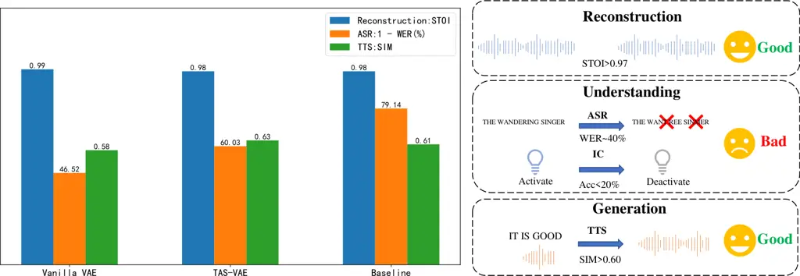
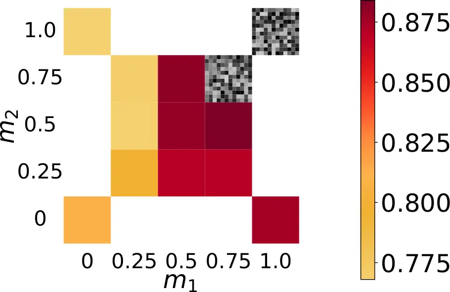
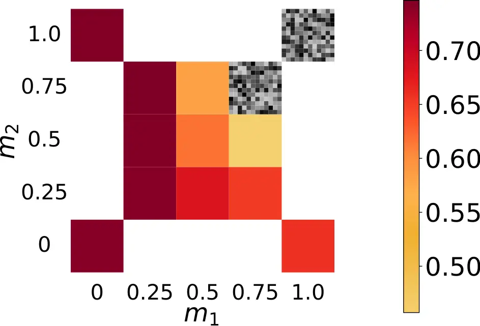
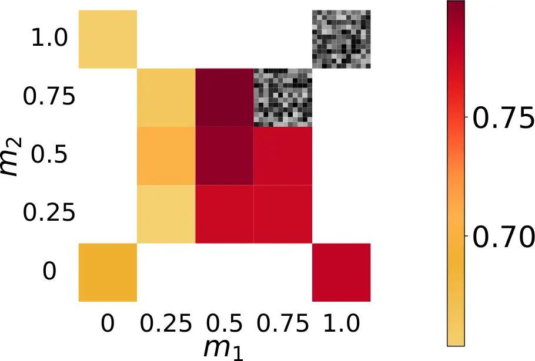
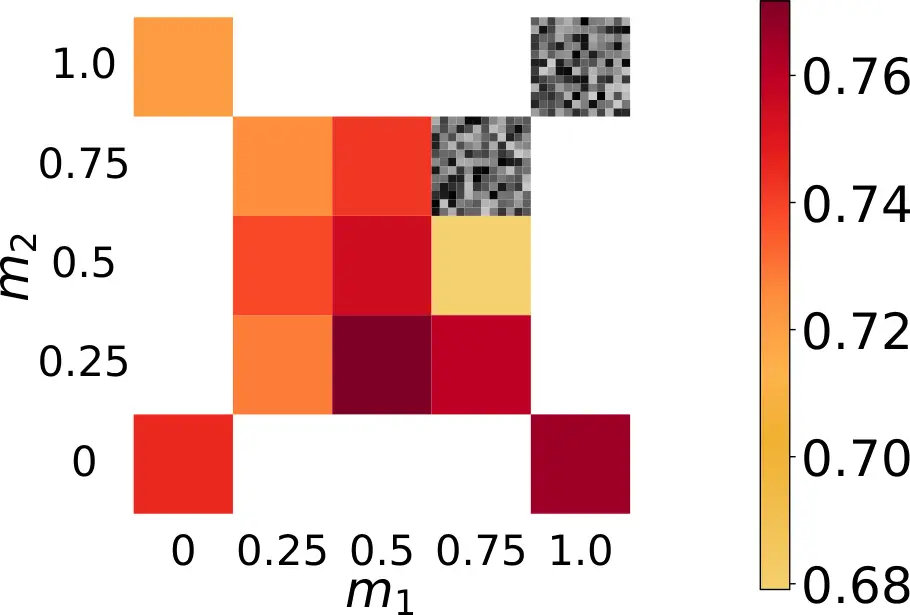
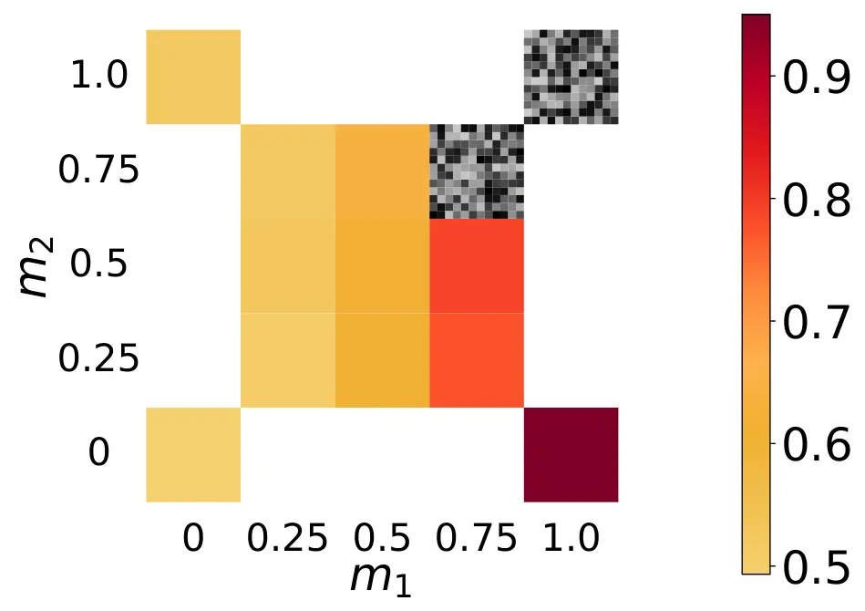
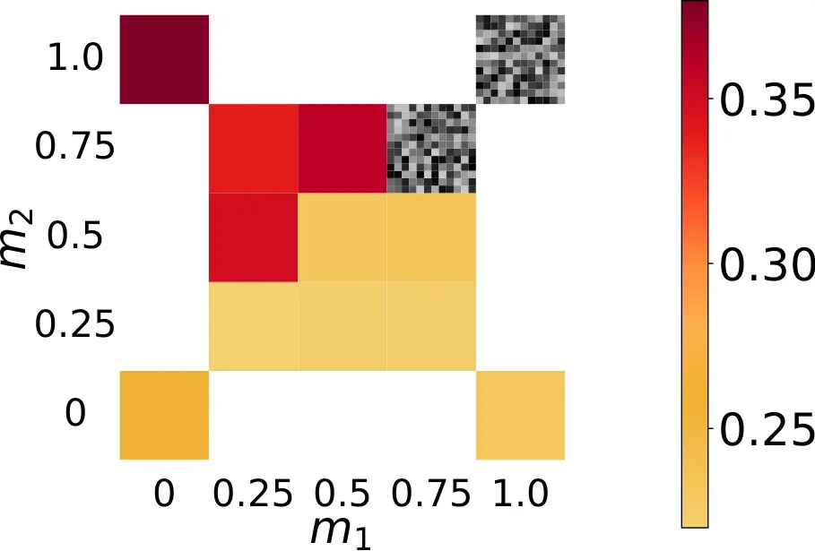

Cheng Wang Zhang Jia Wu Chen Qian

# On the Distillation Loss Functions of Speech VAE for Unified Reconstruction, Understanding, and Generation

Changhao    Wei    Wangyou    Dongya    Jian    Zhuo    Yanmin

###### Abstract

Continuous speech representations based on Variational Autoencoders
(VAEs) have emerged as a promising alternative to traditional
spectrogram or discrete token based features for speech generation and
reconstruction. Recent research has tried to enrich the structural
information in VAE latent representations by aligning with
self-supervised learning (SSL) features, aiming for better generation
performance. However, it remains unclear whether the widely-used
alignment approach based on time-axis distillation is optimal when
considering more tasks. To address this problem, this paper
systematically explores different alignment approaches and analyzes
their impact on the performances over three axes: reconstruction,
understanding, and generation. We investigate various design choices in
the distillation loss. Extensive experiments show that the
joint-marginal alignment approach with adaptive weighting can achieve
the best overall performance while allowing for a controllable balance.

###### keywords

VAE, speech reconstruction, speech generation, knowledge distillation

^(†)^(†)address: ¹ School of Artificial Intelligence, Shanghai Jiao Tong
University, Shanghai, China  
² Auditory Cognition and Computational Acoustics Lab  
MoE Key Lab of Artificial Intelligence, AI Institute  
School of Computer Science, Shanghai Jiao Tong University, Shanghai,
China  
³ ByteDance Seed, China ^(†)^(†)email: taycch1213@sjtu.edu.cn

## 1 Introduction

Discrete speech representations, including both semantic tokens (e.g.,
HuBERT \[1\]) and acoustic tokens (e.g., neural audio codecs \[2, 3,
4\]), have proven effective for boosting the performance of speech large
language models (Speech LLMs) \[5, 6\]. However, quantizing continuous
audio signals into discrete tokens incurs inevitable information loss,
which has motivated growing interest in continuous representations
learned via deep learning like Variational Autoencoders (VAEs) \[7, 8,
9, 10, 11\]. Consequently, continuous speech representations such as VAE
latent features have been shown to provide rich information for speech
generative modeling while keeping compactness \[8\].

In the literature, VAE is commonly observed to suffer from the
reconstruction-loss trade-off \[12\]. To address this problem, the
VA-VAE approach \[13\] has been proposed to align the VAE latent space
with intermediate features from vision foundation models. A similar
method has also been explored for speech: Semantic-VAE \[14\] uses a
time-axis (T-axis) point-wise cosine similarity loss to distill the
features of speech foundation models into speech VAE latent space,
outperforming both mel spectrogram and Vanilla VAE in the zero-shot
text-to-speech (TTS) task \[15\].

However, existing studies mainly optimize VAEs for reconstruction or
generation tasks, neglecting other important aspects of speech research,
i.e., understanding (e.g., speech recognition, speaker verification,
emotion classification, etc.). In fact, our experiments show that
although the alignment scheme of T-axis Aligned VAE (TAS-VAE) improves
both generation and understanding over Vanilla VAE, its understanding
capability remains poor. For example, its Automatic Speech Recognition
(ASR) performance in terms of Word Error Rate (WER) is much higher than
that of Fbank features (cf. Fig. 1).



Figure 1: T-axis Aligned Semantic VAE (TAS-VAE) distills semantic
knowledge from speech foundation models via Eq.2 alignment loss,
achieving TTS performance comparable to mel spectrograms with minor
reconstruction degradation. Its latent representations still
underperform on downstream speech understanding. Baseline:
Mel+Vocos \[16\] (reconstruction), Fbank (understanding),
Mel+F5-TTS \[15\] (generation).

As recent trends move toward unifying speech understanding and
generation models \[17, 18\], it is crucial to develop acoustic
representations that serve both purposes effectively. We argue that the
dilemma illustrated in Fig. 1 arises from the fact that conventional
distillation loss functions overlook the structural differences inherent
in representations. Thus, by introducing a novel distillation paradigm,
we have identified a speech VAE representation that unifies and better
balances reconstruction, generation, and understanding. Overall, we not
only present a novel VAE approach that outperforms traditional
continuous representations across various downstream tasks, but also
provide detailed insights into tuning the trade-offs between these
downstream capabilities. We also release models and code to facilitate
further research ¹¹ 1 https://github.com/changhao-cheng/JMAS-VAE.

## 2 Proposed Methods

The widely adopted loss combination for VAE training is illustrated in
Fig. 2, which consists of a reconstruction loss for autoencoding, a
Kullback-Leibler (KL) divergence loss for posterior regularization, and
Generative Adversarial Network (GAN) based losses for distribution
matching \[19\]. Following Semantic-VAE \[14\], we also include a
feature alignment loss $`\mathcal{L}_{\mathrm{align}}`$ on the VAE
latent, as shown in the right part of Fig. 2.

Figure 2: The design space of distillation loss functions for speech
VAEs. For mathematical formulations, see Eqs. 2 to 6.

Compared to conventional VAEs, the core modification lies in aligning
with the foundation models, such as self-supervised learning (SSL)
models based on a distillation loss term:

```math
\mathcal{L}_{\mathrm{align}}=\omega_{\mathrm{distill}}\mathcal{L}_{\mathrm{distill}}\,, \tag{1}
```

where $`\omega_{\mathrm{distill}}`$ is the loss weight factor, and
$`\mathcal{L}_{\mathrm{distill}}`$ is a loss function used to distill
structural semantic information from pretrained SSL models into VAE
latent representations. Our goal is to explore different design choices
regarding this loss term and analyze the corresponding impact on
downstream performances.

### 2.1 Alignment Loss Function Design Space

#### 2.1.1 T-axis Aligned Semantic VAE

The mathematical form of $`\mathcal{L}_{\mathrm{distill}}`$ exerts a
notable influence on the downstream performances of speech VAEs. A
commonly-used scheme is to align the features with T-axis cosine
distance loss, which is shown to outperform mean absolute error (MAE)
and mean squared error (MSE) losses in the speech generation
task \[14\]. Let $`f`$ denote the speech feature extracted by the SSL
model, and $`z^{\prime}`$ the dimensionally aligned VAE latent obtained
via multilayer perceptron (MLP) projection. The T-axis distillation loss
can be then expressed as:

```math
\mathcal{L}_{\mathrm{T}}=-\frac{1}{BT}\sum_{b=1}^{B}\sum_{t=1}^{T}\log\sigma(\cos({z^{\prime}_{b,t},f_{b,t}}))\,, \tag{2}
```

where $`T`$ denotes the total number of time frames, $`t`$ the time
step, $`B`$ the batch size, $`b`$ the sample index and $`\sigma(\cdot)`$
the sigmoid activation.

#### 2.1.2 D-axis Aligned Semantic VAE

Orthogonal to point-wise temporal alignment, we further introduce the
dimension-wise distillation scheme, which captures the temporal
structure and variations in local feature dimensions:

```math
\mathcal{L}_{\mathrm{D}}=-\frac{1}{BD}\sum_{b=1}^{B}\sum_{d=1}^{D}\log\sigma(\cos({z^{\prime[d]}_{b},f^{[d]}_{b}})), \tag{3}
```

where $`D`$ is the total feature dimensionality of $`z^{\prime}`$ and
$`f`$, and $`d`$ represents the dimensional index. Similar distillation
schemes have been employed in discrete spaces and demonstrated promising
performance \[20\].

|                      |                  |                  |                   |                 |                   |                   |                 |                 |                   |                   |                 |                   |                   |                 |                   |                            |
| -------------------- | ---------------- | ---------------- | ----------------- | --------------- | ----------------- | ----------------- | --------------- | --------------- | ----------------- | ----------------- | --------------- | ----------------- | ----------------- | --------------- | ----------------- | -------------------------- |
| Method               | Recon.           |                  |                   | Under.          |                   |                   |                 |                 |                   |                   |                 |                   | Gene.             |                 |                   | Overall Score $`\uparrow`$ |
|                      |                  |                  |                   | ER              | PR                | ASR               | KS              | SID             | ASV               | SD                | IC              |                   |                   |                 |                   |                            |
|                      | PESQ$`\uparrow`$ | STOI$`\uparrow`$ | $`x_{r}\uparrow`$ | Acc$`\uparrow`$ | PER$`\downarrow`$ | WER$`\downarrow`$ | Acc$`\uparrow`$ | Acc$`\uparrow`$ | EER$`\downarrow`$ | DER$`\downarrow`$ | Acc$`\uparrow`$ | $`x_{u}\uparrow`$ | WER$`\downarrow`$ | SIM$`\uparrow`$ | $`x_{g}\uparrow`$ |                            |
| Vanilla VAE          | 4.12             | 0.985            | 0.905             | 36.87           | 89.40             | 53.48             | 29.80           | 7.74            | 14.64             | 17.11             | 5.98            | 0.382             | 2.72              | 0.58            | 0.776             | 0.645                      |
| Semantic-VAE \[14\]  | 3.97             | 0.981            | 0.888             | 45.99           | 85.71             | 41.75             | 43.49           | 15.97           | 12.41             | 15.21             | 9.25            | 0.449             | 2.01              | 0.67            | 0.825             | 0.690                      |
| EnCodec \[3\]        | 2.77             | 0.938            | 0.746             | 50.41           | 80.75             | 28.90             | 48.46           | 18.08           | 12.05             | 14.10             | 10.04           | 0.489             | 4.71              | 0.56            | 0.756             | 0.651                      |
| Baseline (Mel/Fbank) | 3.60             | 0.978            | 0.849             | 35.39           | 82.01             | 20.86             | 8.63            | 8.5E-4          | 9.56              | 10.05             | 9.10            | 0.413             | 2.23              | 0.61            | 0.794             | 0.653                      |
| TAS-VAE              | 3.97             | 0.977            | 0.886             | 44.61           | 70.12             | 39.97             | 64.56           | 17.65           | 11.67             | 13.64             | 16.93           | 0.510             | 2.55              | 0.63            | 0.802             | 0.713                      |
| TAS-VAE^(⋆)          | 2.92             | 0.947            | 0.766             | 56.77           | 19.70             | 15.40             | 96.62           | 23.11           | 8.80              | 9.93              | 71.74           | 0.743             | 1.93              | 0.31            | 0.645             | 0.716                      |
| DAS-VAE              | 3.98             | 0.979            | 0.888             | 53.73           | 52.84             | 27.83             | 80.46           | 19.92           | 10.61             | 12.54             | 28.55           | 0.599             | 2.46              | 0.59            | 0.783             | 0.746                      |
| DAS-VAE^(⋆)          | 2.73             | 0.940            | 0.743             | 60.18           | 19.66             | 14.86             | 96.36           | 22.42           | 8.83              | 10.68             | 76.22           | 0.751             | 2.32              | 0.32            | 0.648             | 0.713                      |
| JMAS-VAE             | 3.97             | 0.978            | 0.886             | 46.18           | 70.95             | 37.49             | 61.57           | 17.61           | 11.95             | 12.81             | 18.11           | 0.513             | 2.59              | 0.63            | 0.802             | 0.714                      |
| JMAS-VAE^(⋆)         | 3.84             | 0.973            | 0.871             | 57.24           | 36.72             | 21.04             | 92.76           | 24.58           | 9.53              | 10.65             | 48.48           | 0.681             | 2.04              | 0.57            | 0.775             | 0.772                      |

Table 1: Performance comparison of different speech representation
methods. For methods, ^(⋆) denotes the use of adaptive weighting in
Section 2.2. The metrics for the eight understanding tasks and the WER
metric in the generation task are all percentages.

#### 2.1.3 Joint-marginal Aligned Semantic VAE

In addition to fine-grained frame-wise and dimension-wise alignment, we
further incorporate joint-marginal distribution alignment into our
design space. In contrast to existing point-wise losses that only focus
on overall feature matching, this scheme further enforces the
intra-distribution consistency between the latent space and the
foundation model feature space via an extra alignment loss term.

Targeting the long-range dependence of speech sequences, we adapt the
joint-marginal alignment loss from the computer vision domain \[13\] to
speech representation processing. We construct the loss at two levels:
frame-level feature distance and sequence-level distribution similarity.
The marginal cosine similarity loss aligns SSL and VAE features along
the T-axis:

```math
\mathcal{L}_{\mathrm{mcos}}=\frac{1}{BT}\sum_{b=1}^{B}\sum_{t=1}^{T}\mathrm{ReLU}(1-m_{1}-\cos({z^{\prime}_{b,t},f_{b,t}}))\,, \tag{4}
```

and the marginal distance sequence similarity loss further aligns their
relative structures by comparing all pairs of frames:

```math
\displaystyle\mathcal{L}_{\mathrm{mdss}}=\frac{1}{(BT)^{2}}\sum_{i,j}^{BT}\mathrm{ReLU}\big(|\cos(z^{\prime}_{i},z^{\prime}_{j})-\cos(f_{i},f_{j})|-m_{2}\big) \tag{5}
```

In Eqs 4 and 5, $`m_{1}`$ and $`m_{2}`$ denote the respective margins,
which serve as an important mechanism for balancing reconstruction,
understanding, and generation capabilities.

### 2.2 Loss Weight Design Space

Since VAE is typically trained in a multi-task manner, the relative
weighting of different loss terms, especially the alignment losses, can
lead to significant performance variations. Apart from static loss
weights \[14\] that need manual tuning, we further investigate an
adaptive weighting strategy as follows:

```math
\omega_{\mathrm{adaptive}}=\frac{\lVert\mathcal{\nabla L_{\mathrm{rec}}}\rVert}{\lVert\mathcal{\nabla L_{\mathrm{distill}}}\rVert}\,, \tag{6}
```

which dynamically adjusts the loss weight in Eq. 1 based on the gradient
norm ratio between the reconstruction loss
$`\mathcal{L}_{\mathrm{rec}}`$ and the alignment loss
$`\mathcal{L}_{\mathrm{distill}}`$ (Both loss gradient values are
calculated on the parameters of the projection layer of the Encoder.).
Specifically, we have
$`\omega_{\mathrm{distill}}\in\{\omega_{\mathrm{SSL}},\omega_{\mathrm{SSL}}*\omega_{\mathrm{adaptive}}\}`$,
where $`\omega_{\mathrm{SSL}}`$ is the static weight set manually. To
precisely allocate the contributions of $`\mathcal{L}_{\mathrm{mcos}}`$
and $`\mathcal{L}_{{\mathrm{mdss}}}`$ in the joint marginal loss, we
compute the adaptive weights separately for each term:

```math
\omega_{\mathrm{mcos}}=\frac{\lVert\mathcal{\nabla L_{\mathrm{rec}}}\rVert}{\lVert\mathcal{\nabla L_{\mathrm{mcos}}}\rVert},\omega_{\mathrm{mdss}}=\frac{\lVert\mathcal{\nabla L_{\mathrm{rec}}}\rVert}{\lVert\mathcal{\nabla L_{\mathrm{mdss}}}\rVert}. \tag{7}
```

## 3 Experimental Setup

We use stable-audio-tools²² 2
[https://github.com/Stability-AI/stable-audio-tools](https://github.com/Stability-AI/stable-audio-tools)
as the speech VAE backbone, with a DAC-based encoder \[21\] and a
BigVGAN decoder \[22\]. The input speech signal is downsampled by
factors of {4,4,5,5} to a 64-dim 40 Hz latent representation $`z`$,
which is linearly projected to 1024-dim ($`z^{\prime}`$) and aligned
with the 23rd-layer features of WavLM Large \[23\].

All VAE models are trained on the full Libriheavy \[24\] (16kHz). For
the Vanilla VAE, we train it with a batch size of 20 for 550k steps. For
TAS‑VAE and DAS‑VAE (DAS‑VAE) with adaptive weighting, we adopt 8 GPUs
with a per-GPU batch size of 2 and train for 1100k steps. All other VAE
experiments use the same GPU and batch setup and are trained for 600k
steps. Other hyperparameters are set as follows: Adam optimizer with
$`\mathrm{lr}=10^{-4}`$ and $`\gamma=0.999996`$; the loss weights are
$`\omega_{\mathrm{rec}}=1.0`$, $`\omega_{\mathrm{KL}}=0.001`$, and
$`\omega_{\mathrm{SSL}}=2.5`$.

We evaluate the performance across three categories of downstream tasks:
(1) Speech reconstruction ability is evaluated on LibriSpeech-test-clean
\[25\] with PESQ (Perceptual Evaluation o Speech Quality) \[26\] and
STOI (Short-timeObjective Intelligibility). (2) Speech understanding
ability is tested on 8 SUPERB \[27\] tasks: Emotion Recognition (ER),
Phoneme Recognition (PR), ASR, Keyword Spotting (KS), Speaker
Identification (SID), Automatic Speaker Verification (ASV), Speaker
Diarization (SD) and Intent Classification (IC). To obtain results
closer to convergence, we increased the training steps from 200k to 500k
for all methods (including the baseline) on both the ASR and SID tasks.
Consequently, the ASR performance of Fbank in our experimental results
is slightly higher than that reported in SUPERB \[27\]. (3) We assess
the speech generation ability on the TTS task. A small F5-TTS \[15\]
model is trained on LibriTTS \[28\] with a per-GPU batch size of 6400
over 8 GPUs and a learning rate of $`10^{-4}`$ (For Encodec, gradient
explosion would occur under the same learning rate, so we train F5-TTS
under this representation with a learning rate of $`10^{-5}`$.). It is
evaluated on LibriSpeech-PC test-clean \[29\] using WER and speaker
similarity (SIM) metrics.

## 4 Results

### 4.1 Overall Performance Comparison

Tab. 1 presents the evaluation results of speech VAEs with different
distillation schemes on reconstruction, understanding, and generation.
For the joint-marginal-aligned semantic-VAE (JMAS-VAE) in Section 2.1.3,
we set $`m_{1}=0.5`$ and $`m_{2}=0.25`$. Besides Vanilla VAE, we compare
with Semantic-VAE \[14\] (whose distillation scheme corresponds to
TAS-VAE in this work) and EnCodec (24kHz) \[3\], and use conventional
continuous representation as the baseline. For the baseline,
reconstruction is evaluated based on the mel-based vocoder (Vocos
\[16\]), understanding by Fbank features, and generation by mel-based
F5-TTS.

To compute the overall score, we first take the arithmetic mean for each
task: reconstruction-$`x_{r}`$, understanding-$`x_{u}`$ and
generation-$`x_{g}`$ (Error rates are replaced with ($`1-`$error rate),
and PESQ is rescaled to a similar score scale by PESQ$`/5`$):

```math
\begin{gathered}x_{r}=\frac{\text{PESQ}/5+\text{STOI}}{2},\quad x_{g}=\frac{1-\text{WER}+\text{SIM}}{2}\,,\\
x_{u}=\frac{\sum_{\text{ER, KS, SID, IC}}\text{Acc}+\sum_{\text{PR, ASR, ASV, SD}}(1-\text{ER})}{8}\,.\end{gathered} \tag{8}
```

To avoid biased evaluation by extreme scores in some tasks, the overall
score in Tab. 1 is obtained via the geometric mean³³ 3 We also explored
arithmetic and harmonic means for overall score calculation
(cf.[https://github.com/changhao-cheng/JMAS-VAE/blob/main/VAE_scores.pdf](https://github.com/changhao-cheng/JMAS-VAE/blob/main/VAE_scores.pdf)),
showing a similar conclusion. \[30\]
$`\sqrt[3]{x_{r}\cdot x_{u}\cdot x_{g}}`$. Comparing the overall scores
in Tab. 1, we have the following findings:

1.  1.  Although the Vanilla VAE and Semantic-VAE excel in reconstruction
        and generation, their performances across eight speech understanding
        tasks are very poor, some of which even lagging behind the
        conventional baseline and Encodec.
2.  2.  Compared to TAS-VAE, DAS-VAE demonstrates much better understanding
        performance with small performance drop in generation, resulting in
        substantial overall improvement.
3.  3.  The JMAS-VAE model with adaptive weighting significantly outperforms
        other approaches in terms of the overall score. This highlights the
        efficacy of the joint-marginal alignment in balancing
        reconstruction, understanding, and generation within compact
        continuous representations.
4.  4.  The adaptive weighting strategy (denoted with ^(⋆)) can
        significantly improve speech understanding performance for all three
        types of semantic-aligned VAEs. Among them, the JMAS-VAE achieves
        the best balance of reconstruction, understanding, and generation,
        while TAS-VAE and DAS-VAE significantly sacrifices their
        reconstruction and generation abilities when applying adaptive
        weighting.

The above observations also indicate that directly aligning VAE latents
with pretrained SSL features without dedicated regularization can
potentially lead to biased representations.

### 4.2 Analysis of Adaptive Weighting

As shown in last subsection, the adaptive weighting proposed in
Section 2.2 is critical for better distilling the semantic information
structure inherent in pretrained SSL features, thus greatly improving
the understanding ability. In this subsection, we further delve into the
adaptive weighting procedure by visualizing the evolving loss weights
during training. As shown in Fig. 3, the adaptive weights
$`\omega_{\text{mcos}}`$ and $`\omega_{\text{mdss}}`$ for the
joint-marginal alignment loss quickly become orders of magnitude larger
than the commonly-adopted static weights (e.g., $`<10`$), enabling finer
alignment between learned representations and SSL features.

(a) Adaptive weighting of $`\mathcal{L}_{\text{mcos}}`$

(b) Adaptive weighting of $`\mathcal{L}_{\text{mdss}}`$

Figure 3: The adaptive weighting of the two distillation losses for
JMAS-VAE as a function of training steps. The vertical axis adopts a
logarithmic coordinate system.

### 4.3 Ablation Study of JMAS-VAE

The results in Tab. 1 show that simply aligning features toward those of
the speech SSL model only improves performance on speech understanding.
For speech reconstruction and generation, however, such alignment
requires an appropriate threshold—either by disabling adaptive weighting
or by manually introducing margins as in Eq. 4–5. Here, we aim to
investigate the role of different margins introduced in Section 2.1.3 by
training and evaluating different variants of JMAS-VAE.

Fig. 4 shows the reconstruction, understanding, generation and overall
scores of adaptive-weighted JMAS-VAE under various margin combinations
$`(m_{1},m_{2})`$, as well as the corresponding distances between VAE
latents and SSL features calculated by modified Eqs. 4 and 5 (with
$`m_{1}=m_{2}=0`$). Comparing subplots (a)–(d), we can see that smaller
margins generally improve understanding but impair reconstruction and
generation. Overall, the heatmap shows no strong symmetry between
margins: $`(m_{1}=1,m_{2}=0)`$ performs much better than
$`(m_{1}=0,m_{2}=1)`$ in reconstruction and generation, revealing the
distinct contributions of the two marginal losses.



(a) Reconstruction



(b) Understanding



(c) Generation



(d) Overall



(e) mcos distance (Eq. 4)



(f) mdss distance (Eq. 5)

Figure 4: Reconstruction, understanding, generation, and overall
performance as well as marginal loss distances for different margin
parameter combinations. Mosaic patterns indicate that the VAE training
has diverged.

Subplots (e) and (f) illustrate the two distances between VAE and WavLM
features under different margin combinations, computed on the
LibriSpeech-test-clean dataset. The representation distances are linked
to distillation losses defined in Eqs. 4 and 5, where a smaller distance
reflects the optimization direction of distillation It can be readily
observed that a larger margin setting leads to a correspondingly larger
loss distance. Furthermore, Tab. 2 shows the Pearson Correlation
Coefficients (PCC) between representation distances and their
correlations with reconstruction, understanding, generation and overall
scores for the 11 JMAS-VAE experiments in Fig. 4. It reveals that
smaller $`\mathcal{L}_{\text{mcos}}`$ distances (which are essentially
T-axis distances) strengthen understanding and TTS text accuracy but
weaken reconstruction and TTS SIM, thus negatively affecting the overall
score. For the $`\mathcal{L}_{\text{mdss}}`$ distance, however, the
opposite is true: its optimization direction is consistent with the
improvement of reconstruction and TTS SIM.

The above observation indicates that the frame-wise alignment scheme on
the T-axis focuses more on semantic information, while reducing
$`\mathcal{L}_{\text{mdss}}`$ allows for better preservation of acoustic
information. Carefully balancing the two loss terms with distinct roles
eventually leads to a high-quality compact representation for unified
reconstruction, understanding, and generation.

|                               |        |        |        |        |         |         |
| ----------------------------- | ------ | ------ | ------ | ------ | ------- | ------- |
| Distance                      | Recon. | Under. | Gene.  |        |         | Overall |
|                               |        |        | 1-WER  | SIM    | Overall |         |
| $`\mathcal{L}_{\text{mcos}}`$ | 0.723  | -0.615 | -0.552 | 0.701  | 0.694   | 0.133   |
| $`\mathcal{L}_{\text{mdss}}`$ | -0.585 | 0.284  | 0.391  | -0.384 | -0.378  | -0.267  |

Table 2: Pearson Correlation Coefficients (PCCs) between distance
metrics calculated on LibriSpeech-test-clean and task performance
scores.

## 5 Conclusion

In this work, we explore the design space of distillation loss functions
for speech VAEs aligned with speech foundation models. Through extensive
experiments, we demonstrate that speech VAEs equipped with
joint-marginal loss and adaptive weighting can achieve balanced and
superior overall performance across reconstruction, understanding, and
generation tasks. In future work, we aim to further explore the design
space of speech VAEs in other aspects (e.g., channel dimension, frame
rate, etc.) and their applications in Speech LLMs.

## 6 Acknowledgments

We thank Zhikang Niu for valuable discussions during this work.

## 7 Generative AI Use Disclosure

Generative AI is only used for text polishing.

## References

- \[1\] W. Hsu, B. Bolte, Y. H. Tsai, K. Lakhotia, R. Salakhutdinov,
  and A. Mohamed (2021) HuBERT: self-supervised speech representation
  learning by masked prediction of hidden units. IEEE/ACM Transactions
  on Audio, Speech, and Language Processing 29, pp. 3451–3460. Cited by:
  §1.
- \[2\] N. Zeghidour, A. Luebs, A. Omran, J. Skoglund, and M.
  Tagliasacchi (2021) SoundStream: an end-to-end neural audio codec.
  IEEE/ACM Transactions on Audio, Speech, and Language Processing 30,
  pp. 495–507. Cited by: §1.
- \[3\] A. Défossez, J. Copet, G. Synnaeve, and Y. Adi (2023) High
  fidelity neural audio compression. Transactions on Machine Learning
  Research. Cited by: §1, Table 1, §4.1.
- \[4\] D. Yang, S. Liu, R. Huang, J. Tian, C. Weng, and Y. Zou (2023)
  Hifi-codec: group-residual vector quantization for high fidelity audio
  codec. arXiv preprint arXiv:2305.02765. Cited by: §1.
- \[5\] E. Casanova, R. Langman, P. Neekhara, S. Hussain, J. Li, S.
  Ghosh, A. Jukić, and S. Lee (2025) Low frame-rate speech codec: a
  codec designed for fast high-quality speech LLM training and
  inference. In IEEE International Conference on Acoustics, Speech and
  Signal Processing (ICASSP), Cited by: §1.
- \[6\] Z. Ye, P. Sun, J. Lei, H. Lin, X. Tan, Z. Dai, Q. Kong, J.
  Chen, J. Pan, Q. Liu, Y. Guo, and W. Xue (2025) Codec does matter:
  exploring the semantic shortcoming of codec for audio language model.
  In Proceedings of the AAAI Conference on Artificial Intelligence, Vol.
  39, pp. 25697–25705. Cited by: §1.
- \[7\] K. Xia, X. Zhu, J. Yao, W. Tian, W. Li, and L. Xie (2024)
  KALL-e: autoregressive speech synthesis with next-distribution
  prediction. arXiv preprint arXiv:2412.16846. Cited by: §1.
- \[8\] D. Jia, Z. Chen, J. Chen, C. Du, J. Wu, J. Cong, X. Zhuang, C.
  Li, Z. Wei, Y. Wang, and Y. Wang (2025) DiTAR: diffusion transformer
  autoregressive modeling for speech generation. In International
  Conference on Machine Learning (ICML), Cited by: §1.
- \[9\] C. Y. Wu, J. Deng, G. Li, Q. Kong, and S. Lui (2025) Clear:
  continuous latent autoregressive modeling for high-quality and
  low-latency speech synthesis. arXiv preprint arXiv:2508.19098. Cited
  by: §1.
- \[10\] Z. Peng, J. Yu, W. Wang, Y. Chang, Y. Sun, L. Dong, Y. Zhu, W.
  Xu, H. Bao, Z. Wang, et al. (2025) Vibevoice technical report. arXiv
  preprint arXiv:2508.19205. Cited by: §1.
- \[11\] Y. Zhou, G. Zeng, X. Liu, X. Li, R. Yu, Z. Wang, R. Ye, W.
  Sun, J. Gui, K. Li, et al. (2025) VoxCPM: tokenizer-free TTS for
  context-aware speech generation and true-to-life voice cloning. arXiv
  preprint arXiv:2509.24650. Cited by: §1.
- \[12\] A. Gupta, L. Yu, K. Sohn, X. Gu, M. Hahn, F. Li, I. Essa, L.
  Jiang, and J. Lezama (2024) Photorealistic video generation with
  diffusion models. In European Conference on Computer Vision,
  pp. 393–411. Cited by: §1.
- \[13\] J. Yao, B. Yang, and X. Wang (2025) Reconstruction vs.
  generation: taming optimization dilemma in latent diffusion models. In
  Proceedings of the IEEE/CVF Conference on Computer Vision and Pattern
  Recognition (CVPR), pp. 15703–15712. Cited by: §1, §2.1.3.
- \[14\] Z. Niu, S. Hu, J. Choi, Y. Chen, P. Chen, P. Zhu, Y. Yang, B.
  Zhang, J. Zhao, C. Wang, and X. Chen (2025) Semantic-VAE:
  semantic-alignment latent representation for better speech synthesis.
  arXiv preprint arXiv:2509.22167. Cited by: §1, §2.1.1, §2.2, Table 1,
  §2, §4.1.
- \[15\] Y. Chen, Z. Niu, Z. Ma, K. Deng, C. Wang, K. JianZhao, K. Yu,
  and X. Chen (2025) F5-TTS: a fairytaler that fakes fluent and faithful
  speech with flow matching. In Proceedings of the 63rd Annual Meeting
  of the Association for Computational Linguistics (Volume 1: Long
  Papers), pp. 6255–6271. Cited by: Figure 1, Figure 1, §1, §3.
- \[16\] H. Siuzdak (2024) Vocos: closing the gap between time-domain
  and fourier-based neural vocoders for high-quality audio synthesis. In
  Proceedings of the International Conference on Learning
  Representations (ICLR), Cited by: Figure 1, Figure 1, §4.1.
- \[17\] A. Huang, B. Wu, B. Wang, C. Yan, C. Hu, C. Feng, F. Tian, F.
  Shen, J. Li, M. Chen, et al. (2025) Step-Audio: unified understanding
  and generation in intelligent speech interaction. arXiv preprint
  arXiv:2502.11946. Cited by: §1.
- \[18\] Y. Wang, D. Yang, Y. Shao, H. Chen, J. Zhao, Z. Wu, H. Meng,
  and X. Wu (2025) DualSpeechLM: towards unified speech understanding
  and generation via dual speech token modeling with large language
  models. arXiv preprint arXiv:2508.08961. Cited by: §1.
- \[19\] Z. Evans, J. D. Parker, C. Carr, Z. Zukowski, J. Taylor, and J.
  Pons (2025) Stable Audio Open. In IEEE International Conference on
  Acoustics, Speech and Signal Processing (ICASSP), Cited by: §2.
- \[20\] X. Zhang, D. Zhang, S. Li, Y. Zhou, and X. Qiu (2024)
  SpeechTokenizer: unified speech tokenizer for speech language models.
  In Proceedings of the International Conference on Learning
  Representations (ICLR), Cited by: §2.1.2.
- \[21\] R. Kumar, P. Seetharaman, A. Luebs, I. Kumar, and K.
  Kumar (2023) High-fidelity audio compression with improved RVQGAN. In
  Advances in Neural Information Processing Systems, Vol. 36,
  pp. 27980–27993. Cited by: §3.
- \[22\] S. G. Lee, W. Ping, B. Ginsburg, B. Catanzaro, and S.
  Yoon (2023) BigVGAN: a universal neural vocoder with large-scale
  training. In Proceedings of the International Conference on Learning
  Representations (ICLR), Cited by: §3.
- \[23\] S. Chen, C. Wang, Z. Chen, Y. Wu, S. Liu, Z. Chen, J. Li, N.
  Kanda, T. Yoshioka, X. Xiao, et al. (2022) WavLM: large-scale
  self-supervised pre-training for full stack speech processing. IEEE
  Journal of Selected Topics in Signal Processing 16 (6), pp. 1505–1518.
  Cited by: §3.
- \[24\] W. Kang, X. Yang, Z. Yao, F. Kuang, Y. Yang, L. Guo, L. Lin,
  and D. Povey (2024) Libriheavy: a 50,000 hours ASR corpus with
  punctuation casing and context. In IEEE International Conference on
  Acoustics, Speech and Signal Processing (ICASSP), pp. 10991–10995.
  Cited by: §3.
- \[25\] V. Panayotov, G. Chen, D. Povey, and S. Khudanpur (2015)
  Librispeech: an ASR corpus based on public domain audio books. In IEEE
  International Conference on Acoustics, Speech and Signal Processing
  (ICASSP), pp. 5206–5210. Cited by: §3.
- \[26\] A. W. Rix, J. G. Beerends, M. P. Hollier, and A. P.
  Hekstra (2001) Perceptual evaluation of speech quality (PESQ)—a new
  method for speech quality assessment of telephone networks and codecs.
  In IEEE International Conference on Acoustics, Speech and Signal
  Processing (ICASSP), Vol. 2, pp. 749–752. Cited by: §3.
- \[27\] S. Yang, P. Chi, Y. Chuang, C. J. Lai, K. Lakhotia, Y. Y.
  Lin, A. T. Liu, J. Shi, X. Chang, G. Lin, T. Huang, W. Tseng, K.
  Lee, D. Liu, Z. Huang, S. Dong, S. Li, S. Watanabe, A. Mohamed, and H.
  Lee (2021) SUPERB: speech processing universal performance benchmark.
  In Proc. ISCA Interspeech, pp. 1194–1198. Cited by: §3.
- \[28\] H. Zen, V. Dang, R. Clark, Y. Zhang, R. J. Weiss, Y. Jia, Z.
  Chen, and Y. Wu (2019) LibriTTS: a corpus derived from librispeech for
  text-to-speech. In Proc. ISCA Interspeech, pp. 1526–1530. Cited by:
  §3.
- \[29\] A. Meister, M. Novikov, N. Karpov, E. Bakhturina, V. Lavrukhin,
  and B. Ginsburg (2023) LibriSpeech-PC: benchmark for evaluation of
  punctuation and capitalization capabilities of end-to-end asr models.
  In IEEE Automatic Speech Recognition and Understanding Workshop
  (ASRU), Cited by: §3.
- \[30\] P. J. Fleming and J. J. Wallace (1986) How not to lie with
  statistics: the correct way to summarize benchmark results.
  Communications of the ACM 29 (3), pp. 218–221. Cited by: §4.1.
