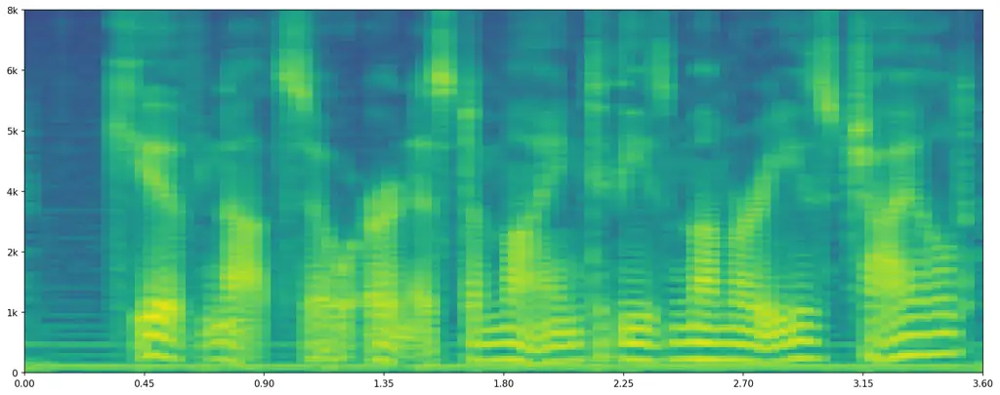
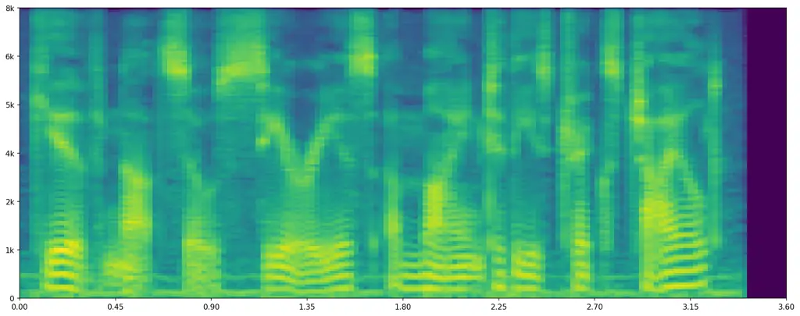
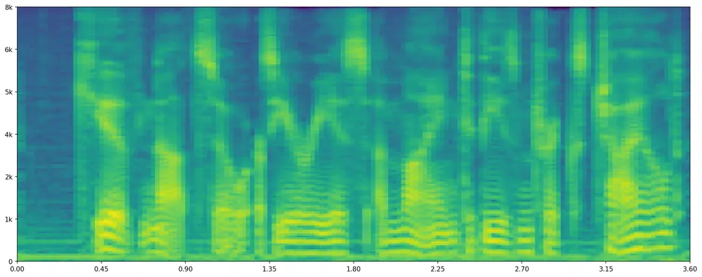
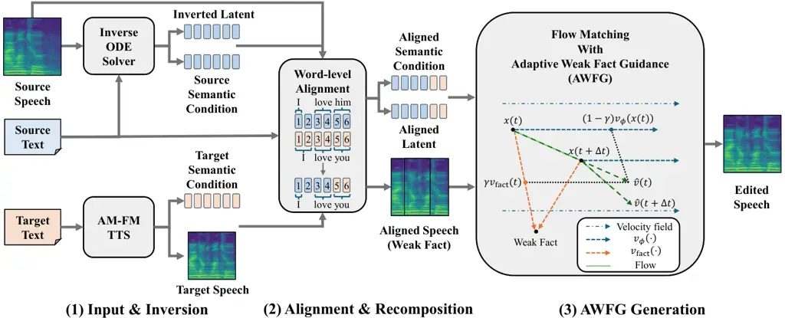
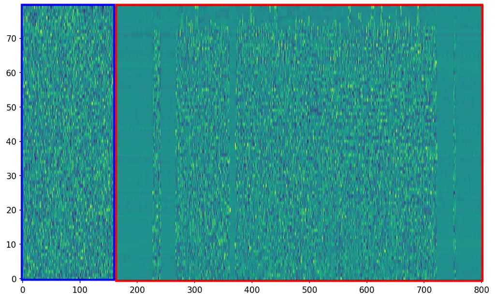
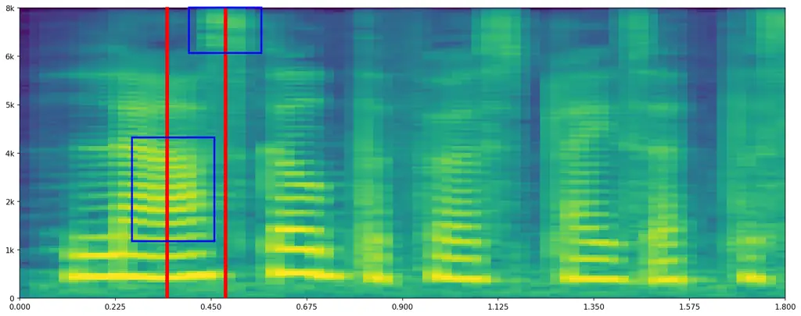
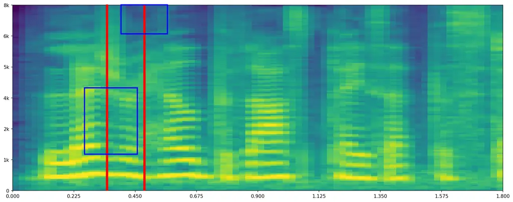

# AST: Adaptive, Seamless, and Training-Free Precise Speech Editing

Sihan Lv Email: [shlv@zju.edu.cn](mailto:)    Yechen Jin
Email: [12551012@zju.edu.cn](mailto:)    Zhen Li
Email: [lizhencast@zju.edu.cn](mailto:)    Jintao Chen
Email: [chenjintao@zju.edu.cn](mailto:)    Jinshan Zhang
Email: [zhangjinshan@zju.edu.cn](mailto:)    Ying Li
Email: [cnliying@zju.edu.cn](mailto:)    Jianwei Yin
Email: [zjuyjw@cs.zju.edu.cn](mailto:)    Meng Xi
Email: [ximeng@zju.edu.cn](mailto:)

###### Abstract

Text-based speech editing aims to modify specific segments while
preserving speaker identity and acoustic context. Current approaches
generally involve either expensive task-specific training or adapting
pre-trained Text-to-Speech (TTS) models. However, both paradigms face
challenges: task-specific methods often degrade fidelity in unedited
regions, whereas TTS adaptations struggle with a trade-off between
editing naturalness and temporal fidelity. To address these issues, we
propose AST, an Adaptive, Seamless, and Training-free speech editing
framework. Built upon pre-trained TTS, AST leverages Latent
Recomposition to stitch preserved source segments with synthesized
targets, guaranteeing fidelity in unedited regions. To break the
quality-controllability trade-off, we introduce Adaptive Weak Fact
Guidance (AWFG), which modulates a mel-space signal to ensure seamless
boundary transitions without disrupting the generative manifold.
Furthermore, to address evaluation gaps in temporal fidelity, we propose
a new benchmark suite: the LibriSpeech-Edit dataset and a novel metric,
Word-level Dynamic Time Warping (WDTW). Extensive experiments
demonstrate that AST consistently outperforms existing task-specific and
fine-tuned speech editing methods across content accuracy, perceptual
quality, speaker preservation, and temporal fidelity. Remarkably, AST
achieves state-of-the-art zero-shot speech editing performance without
any task-specific training or paired editing data, validating the
effectiveness of latent recomposition and AWFG in bridging the
quality–controllability trade-off.

   

|     |
| --- |
|     |

August 24, 2026

¹¹footnotetext: Meng Xi is the corresponding author.

## 1 Introduction

Text-to-speech (TTS) synthesis has achieved near-human naturalness \[1,
2, 3\], with modern autoregressive models \[4, 5\] demonstrating
exceptional zero-shot capabilities. A compelling application of these
advances is text-based speech editing, which aims to modify specific
speech segments according to a textual transcription while preserving
the original speaker identity, prosody, and acoustic context. Unlike
TTS, speech editing requires a delicate balance between controlled
generation and quality assurance, making it invaluable for
post-production and dialogue correction \[6, 7\].



(a) "GIVE NOT SO EARNEST A MIND TO THESE MUMMERIES CHILD" – Original
Speech



(b) "GIVE NOT SO SERIOUS A MIND TO THESE TRICKS CHILD" – Generated by
TTS



(c) "GIVE NOT SO SERIOUS A MIND TO THESE TRICKS CHILD" – Edited by AST

Figure 1: TTS models cannot preserve the temporal characteristics of the
original speech, but AST can.

While several methods \[6, 7, 8, 9, 10\] have addressed speech editing,
they typically rely on costly task-specific training and still struggle
to perfectly preserve speaker identity and temporal alignment.
Meanwhile, directly adapting powerful zero-shot TTS models for editing
presents a fundamental challenge. Because modern autoregressive models
generate entire sequences dynamically, they intrinsically reallocate
global prosody and duration. Consequently, as shown in Fig. 1, naively
applying them to editing inevitably leads to prosodic drifts and
misaligned rhythms, destroying the original speech’s structure. In image
editing, latent inversion on continuous generative models \[11, 12\]
successfully enables precise, zero-shot local modifications while
preserving unedited regions. However, adapting these inversion-based
methods to speech is fundamentally harder because the temporal dimension
is inherently variable.

To overcome this quality-controllability trade-off, we propose AST, an
Adaptive, Seamless, and Training-free precise speech editing framework.
AST leverages the latent space structure of pre-trained flow-matching
(AM-FM) TTS models. By inverting the original speech into the latent
space via an inverse ODE solver, we perform Latent Recomposition: we
align source and target transcripts to stitch inverted latents of
unchanged regions with newly synthesized content. To prevent boundary
artifacts caused by inversion approximation errors without
over-constraining the generative manifold, we introduce Adaptive Weak
Fact Guidance (AWFG). This mechanism dynamically modulates a mel-space
guidance signal toward the original flow in preserved regions based on
trajectory deviation.

To establish a sustainable benchmark, we introduce LibriSpeech-Edit, a
novel dataset curated from LibriSpeech. Unlike the popular but currently
inaccessible RealEdit dataset, LibriSpeech-Edit is freely available and
provides a standardized evaluation protocol. Furthermore, since
conventional metrics fail to measure local temporal alignment
accurately, we propose Word-level Dynamic Time Warping (WDTW) to
rigorously evaluate the temporal fidelity between source and edited
utterances.

Extensive experiments demonstrate that AST achieves state-of-the-art
controllability and temporal fidelity while maintaining highly
competitive synthesis quality, all without requiring any task-specific
fine-tuning. Our main contributions are summarized as follows:

- •
  We propose AST, an adaptive, seamless, and training-free speech
  editing framework based on latent recomposition in AM-FM paradigm TTS
  models, enabling precise editing while faithfully preserving speaker
  identity and acoustic context.
- •
  We introduce Adaptive Weak Fact Guidance (AWFG), a novel mechanism
  that dynamically modulates latent trajectories to eliminate boundary
  artifacts without over-constraining the generative manifold.
- •
  We release LibriSpeech-Edit, a publicly available benchmark dataset
  addressing previous accessibility issues, alongside Word-level Dynamic
  Time Warping (WDTW), a novel metric for accurately measuring local
  temporal alignment.
- •
  Comprehensive experiments demonstrate that our training-free approach
  outperforms or matches task-specific models, establishing a new
  paradigm for zero-shot speech editing with state-of-the-art
  controllability.

## 2 Related Works

Since our method addresses the speech editing task by leveraging
zero-shot TTS architectures and adapting inversion techniques originally
developed for visual generation, we structure our discussion into three
main aspects: Neural Text-to-Speech Synthesis, Speech Editing Methods,
and Latent Inversion for Generative Model Editing.

### 2.1 Neural Text-to-Speech Synthesis

Neural codec language models have revolutionized zero-shot TTS.
VALL-E \[4\] and its successors \[5, 13\] treat TTS as discrete token
language modeling with strong in-context learning. Recent works further
integrate flow matching into this paradigm: the CosyVoice \[14, 15, 16\]
and IndexTTS \[17, 18\] series employ Diffusion Transformer (DiT) \[19\]
backbones for high-fidelity synthesis. These AM-FM architectures provide
both zero-shot generalization and a continuous latent space amenable to
manipulation, forming the backbone of our editing framework.

### 2.2 Speech Editing Methods

Early approaches such as EditSpeech \[6\] and CampNet \[7\] achieved
text-based editing via partial inference or mask prediction, but relied
heavily on task-specific training data. More recent methods leverage
generative models: FluentSpeech \[8\] applies diffusion-based denoising
for smooth partial editing, while VoiceCraft \[9\] and SSR-Speech \[10\]
perform token infilling with codec language models.
Step-Audio-Edit-X \[20\] further finetunes a zero-shot TTS model for
joint content and emotion editing. Despite these advances, task-specific
methods struggle with out-of-distribution generalization, and
off-the-shelf TTS models often fail to preserve acoustic fidelity in
unedited regions. Our training-free framework addresses these
limitations via latent space manipulation without requiring dedicated
editing data.

### 2.3 Latent Inversion for Generative Model Editing

Latent inversion enables editing of real data without retraining by
projecting signals into a model’s latent space. In the image domain,
DDIM inversion \[21, 11, 12\] reverses deterministic sampling to obtain
latent noise representations for semantic modification. This extends
naturally to flow matching \[22\], where the ODE formulation allows
precise bidirectional integration via numerical solvers. However, latent
inversion remains under-explored in speech due to unique challenges in
temporal alignment. We bridge this gap by adapting inversion to AM-FM
TTS models, introducing latent recomposition with adaptive guidance to
achieve training-free editing that strictly preserves speaker identity
and unedited acoustic context.



Figure 2: Overview of our training-free speech editing framework, AST.
The pipeline consists of three main stages: (1) Input & Inversion: The
source speech is inverted into the latent space via an Inverse ODE
Solver, and the target text is processed by a GPT-style model to extract
semantic tokens. (2) Alignment & Recomposition: Source and target
transcripts are aligned at the word level, recomposing inverted latent
and semantic tokens, as well as constructing an aligned source speech as
the weak fact. (3) Adaptive Weak Fact Guidance (AWFG) Generation: A Flow
Matching decoder synthesizes the edited speech, utilizing AWFG to
modulate the velocity field based on the recomposed latents.

## 3 Method

Given a source mel-spectrogram $`m_{\mathrm{ori}}`$ and a target
transcript $`y_{\mathrm{tgt}}`$, our goal is to generate an edited
$`m_{\mathrm{edit}}`$ that reflects $`y_{\mathrm{tgt}}`$ while strictly
preserving the original speaker identity and acoustics in unedited
regions. To achieve this in a training-free manner, our AST framework
(Fig. 2) leverages the semantic space of the AM-FM TTS paradigm. Rather
than intervening in the continuous flow directly, we explicitly align
and recompose inverted source latents with target semantics, and apply
AWFG during generation to ensure stable edits and smooth transitions.

### 3.1 Preliminaries

Our framework builds on the AM-FM TTS paradigm, which pairs an
autoregressive semantic model with a flow matching decoder based on the
DiT architecture. The FM decoder synthesizes a mel-spectrogram by
integrating an ordinary differential equation (ODE):

```math
\frac{dx(t)}{dt}=v_{\phi}\left(x(t);\mu,m_{\mathrm{ref}}\right),\quad t\in[0,1], \tag{1}
```

where $`x(t)`$ is the latent state at time $`t`$, $`\mu`$ the semantic
token, and $`m_{\mathrm{ref}}`$ an acoustic prompt.

### 3.2 Latent Inversion

To edit real speech, we invert the source mel-spectrogram
$`m_{\mathrm{ori}}`$ into the latent space of the FM decoder. For a
small step $`\Delta t`$, the forward Euler discretization of Eq. 1 is

```math
x(t)=x(t-\Delta t)+\Delta t\cdot v_{\phi}\left(x(t-\Delta t);\mu,m_{\mathrm{ref}}\right), \tag{2}
```

Assuming the velocity field varies slowly (i.e.,
$`v_{\phi}(x(t))\approx v_{\phi}(x(t-\Delta t))`$ for sufficiently small
$`\Delta t`$), we reverse this step to obtain an inverse Euler solver:

```math
x(t-\Delta t)=x(t)-\Delta t\cdot v_{\phi}\left(x(t);\mu,m_{\mathrm{ref}}\right). \tag{3}
```

By setting $`x_{\mathrm{ori}}(1)=m_{\mathrm{ori}}`$ and conditioning on
the source semantic token $`\mu_{\mathrm{ori}}`$, we apply Eq. 3
iteratively to recover the initial latent $`x_{\mathrm{ori}}(0)`$. In
parallel, we generate the target mel-spectrogram $`m_{\mathrm{tgt}}`$ by
starting from noise
$`x_{\mathrm{tgt}}(0)=\epsilon\sim\mathcal{N}(0,I)`$, conditioning on
the target semantic token $`\mu_{\mathrm{tgt}}`$, and integrating Eq. 2
forward in time. The inverted latents and $`m_{\mathrm{tgt}}`$ provide
the basis for the alignment and recomposition stage described next.

### 3.3 Word-level Alignment and Recomposition

Unlike image or audio editing tasks where dimensions are typically
fixed, speech editing often alters the total duration and shifts
specific segments. To address this structural mismatch and preserve
unchanged content, we align the semantics between $`y_{\mathrm{ori}}`$
and $`y_{\mathrm{tgt}}`$. Specifically, we compute the Longest Common
Subsequence of their word sequences to identify the indices of unchanged
words, denoted as $`\mathcal{I}_{\mathrm{match}}`$. A forced alignment
tool then maps each word to a contiguous interval of mel-frames. Due to
natural variations in speaking rates, these intervals differ in length
across words and even for the same word across utterances.

Formally, let $`k`$ be the index of a word in the target sequence, with
$`\mathcal{T}_{\mathrm{ori}}^{(k)}`$ and
$`\mathcal{T}_{\mathrm{tgt}}^{(k)}`$ denoting its corresponding
mel-frame intervals in the original and target utterances. We construct
the $`k`$-th segment of the recomposed mel-spectrogram
$`m_{\mathrm{fact}}^{(k)}`$ via interval slicing:

```math
m_{\mathrm{fact}}^{(k)}=\begin{cases}m_{\mathrm{ori}}\left[\mathcal{T}_{\mathrm{ori}}^{(k)}\right],&\text{if }k\in\mathcal{I}_{\mathrm{match}}\\
m_{\mathrm{tgt}}\left[\mathcal{T}_{\mathrm{tgt}}^{(k)}\right],&\text{otherwise}\end{cases}, \tag{4}
```

where $`[\mathcal{T}]`$ extracts the sequence over interval
$`\mathcal{T}`$. Similarly, we obtain the $`k`$-th segment of the
recomposed semantic token $`\mu_{\mathrm{fact}}^{(k)}`$:

```math
\mu_{\mathrm{fact}}^{(k)}=\begin{cases}\mu_{\mathrm{ori}}\left[\mathcal{T}_{\mathrm{ori}}^{(k)}\right],&\text{if }k\in\mathcal{I}_{\mathrm{match}}\\
\mu_{\mathrm{tgt}}\left[\mathcal{T}_{\mathrm{tgt}}^{(k)}\right],&\text{otherwise}\end{cases}, \tag{5}
```

where $`\mu_{\mathrm{ori}}`$ and $`\mu_{\mathrm{tgt}}`$ are the semantic
tokens of the original and target speech. The full sequences
$`m_{\mathrm{fact}}`$ and $`\mu_{\mathrm{fact}}`$ are obtained by
concatenating their respective segments along the time axis.

To initialize the forward Flow Matching process at $`t=0`$, we construct
the recomposed latent variable $`x_{\mathrm{edit}}(0)`$ by stitching the
inverted source latents with Gaussian noise:

```math
x_{\mathrm{edit}}^{(k)}(0)=\begin{cases}x_{\mathrm{ori}}(0)\left[\mathcal{T}_{\mathrm{ori}}^{(k)}\right],&\text{if }k\in\mathcal{I}_{\mathrm{match}}\\
\epsilon^{(k)}\sim\mathcal{N}(0,I),&\text{otherwise}\end{cases}, \tag{6}
```

where $`\epsilon^{(k)}`$ is Gaussian noise matching the temporal length
of the target interval $`\mathcal{T}_{\mathrm{tgt}}^{(k)}`$. The
concatenated initial latent $`x_{\mathrm{edit}}(0)`$ and condition
$`\mu_{\mathrm{fact}}`$ are then integrated into the forward ODE (Eq. 1)
to synthesize the final edited mel-spectrogram $`m_{\mathrm{edit}}`$.

Fig. 3 illustrates this recomposition strategy. For matched regions,
copying inverted latents from $`x_{\mathrm{ori}}`$ and conditions from
$`\mu_{\mathrm{ori}}`$ preserves the original acoustic dynamics.
Conversely, for edited regions, initializing with noise and using
$`\mu_{\mathrm{tgt}}`$ enables new content synthesis. This latent
stitching in the flow space effectively balances source prosody
preservation with textual edits.



Figure 3: Illustration of the latent recomposition strategy for speech
editing. The final latent sequence is constructed by stitching the
inverted source latents in matched regions with the Gaussian noise in
edited regions based on text alignment.

### 3.4 Adaptive Weak Fact Guidance

However, as Fig. 4a demonstrates, the standard approach proves
insufficient for complex edits, resulting in artifacts at stitching
boundaries and unintended prosodic shifts. We hypothesize that the
assumption of
$`v_{\phi}\left(x(t)\right)\approx v_{\phi}\left(x(t-\Delta t)\right)`$
breaks down near edit boundaries, causing the learned neural dynamics to
aggressively and inconsistently alter the audio during the forward
process. To address this, we introduce _Adaptive Weak Fact Guidance
(AWFG)_: a mechanism that injects a mel-space guide signal into the ODE
solving process, correcting deviations without over-constraining the
generative manifold.

To anchor the generation towards the factual target, we first construct
a deterministic, fact-directed velocity field $`v_{\mathrm{fact}}`$ with
the weak fact $`m_{\mathrm{fact}}`$. Inspired by the Rectified
Flow \[23\], we define:

```math
v_{\mathrm{fact}}(t)=\frac{m_{\mathrm{fact}}-x(t)}{1-t}, \tag{7}
```

where $`m_{\mathrm{fact}}`$ is the recomposed mel-spectrogram in Eq. 4.
This formulation provides a shortest-path deterministic pull towards the
anchor $`m_{\mathrm{fact}}`$ at $`t=1`$, ensuring the trajectory
naturally converges to the factual region without requiring additional
network evaluations.

Crucially, rather than applying $`v_{\mathrm{fact}}`$ uniformly, we
modulate its influence based on the local deviation of the current state
$`x`$ from the desired fact flow. We measure this frame-wise discrepancy
$`d_{k}`$ using the squared $`L_{2}`$ norm along the mel-channel
dimension:

```math
d_{k}=\left\|x_{\mathrm{ori}}(t)\bigl[\mathcal{T}_{\mathrm{ori}}^{(k)}\bigr]-x(t)\bigl[\mathcal{T}_{\mathrm{ori}}^{(k)}+b^{(k)}\bigr]\right\|_{c}^{2}. \tag{8}
```

where $`b^{(k)}`$ denotes the temporal bias introduced by recomposition.
Evaluating the distance purely in the mel-channel dimension per frame
captures localized spectral discrepancies while remaining invariant to
global phase or amplitude shifts, making it highly robust for audio
generation.

Based on $`d_{k}`$, we compute a frame-wise adaptive weight $`\gamma`$:

```math
\gamma(t)[k]=\begin{cases}\lambda\bigl(\mathbf{1}-e^{-d_{k}}\bigr),&\text{if }k\in\mathcal{I}_{\mathrm{match}}\\
\mathbf{0},&\text{otherwise}\end{cases} \tag{9}
```

where $`\lambda\in[0,1]`$ controls the maximum guidance strength.

We arrive at the exponential form by asking what properties a gating
function $`g:[0,\infty)\!\to\![0,1]`$, $`\gamma=\lambda g(d)`$, must
satisfy:

1.  1.  Boundedness: $`g\leq 1`$ and $`\lambda\leq 1`$ keep
        $`\gamma\in[0,1]`$, so Eq. 10 is a genuine convex combination and
        the guided field can never extrapolate outside the span of the two
        constituent fields.
2.  2.  Monotonicity: $`g`$ increasing in $`d`$ closes a negative feedback
        loop: larger divergence elicits stronger correction, which makes
        tracking self-stabilizing rather than requiring a schedule tuned per
        utterance.
3.  3.  Smoothness: $`g`$ should be $`C^{\infty}`$ and Lipschitz so that the
        guided velocity remains Lipschitz in $`x`$, the ODE stays
        well-posed, and higher-order solvers retain their order of accuracy.
        A hard threshold violates this and reintroduces exactly the kind of
        boundary discontinuity that AWFG is meant to remove.

Finally, the composite velocity $`\tilde{v}`$ is obtained via convex
mixing:

```math
\tilde{v}(t)=\left(1-\gamma(t)\right)\odot v_{\phi}\left(x(t);\mu_{\mathrm{fact}},m_{\mathrm{ref}}\right)+\gamma(t)\odot v_{\mathrm{fact}}(t), \tag{10}
```

where $`\odot`$ denotes element-wise multiplication along the frame
sequence. Convex mixing guarantees that the modified vector field
remains a valid tangent vector within the generative manifold, strictly
bounding the velocity magnitude and preserving the diffeomorphic
properties of the original ODE flow. Within the non-matching editing
regions, $`\gamma=0`$ ensures content is generated with complete
freedom. As Fig. 4 shows, this modification significantly reduces
reconstruction errors and constrains edits to the intended regions.



(a) Without AWFG: visible artifacts at boundaries.



(b) With AWFG: smooth transitions and precise synthesis.

Figure 4: Qualitative comparison of speech synthesis at edit boundaries.
Simple lantent alignment and recomposition suffers from artifacts, while
our proposed AWFG ensures seamless stitching.

## 4 Experiments

In this section, we detail how we ran our experiments and present our
results compared with existing work. We also measured how $`\lambda`$
and AWFG affect AST’s performance.

### 4.1 Experimental Setup

#### 4.1.1 Dataset

To address the copyright-induced unavailability of the widely used
RealEdit dataset \[9\], we introduce LibriSpeech-Edit, an open and
reproducible benchmark curated from the test-clean and test-other
subsets of LibriSpeech \[24\]. We employ Qwen3.6-27B \[25\] to generate
target transcripts for the source utterances, resulting in 5,559
high-fidelity editing pairs. Figure 5 summarizes the dataset statistics.

Figure 5: Statistics of the LibriSpeech-Edit dataset.

#### 4.1.2 Baselines

We evaluate AST against four representative baselines across different
speech editing paradigms:

- •
  FluentSpeech \[8\]: A task-specific, diffusion-based denoising speech
  editing model.
- •
  SSR-Speech \[10\]: A task-specific, codec-based speech editing model.
- •
  Step-Audio-EditX \[20\]: An autoregressive TTS model fine-tuned
  specifically for speech editing.
- •
  IndexTTS-2 \[18\]: The unmodified, pretrained backbone of our
  framework, serving as a zero-shot baseline to evaluate our
  training-free improvements.

#### 4.1.3 Evaluation Metrics

We assess the edited speech using one subjective metric and four
objective metrics:

- •
  Mean Opinion Score (MOS): A subjective quality metric defined as the
  average rating given by 10 listeners on 50 sampled audios, following
  ITU-T P.800 \[26\].
- •
  Word Error Rate (WER): Measures textual accuracy and intelligibility.
- •
  DNSMOS \[27\]: A neural network-based proxy for MOS to assess overall
  quality.
- •
  Speaker Similarity (SpkSim): Computes the cosine similarity of
  WavLM \[28\] speaker embeddings to measure identity preservation.
- •
  Word-level Dynamic Time Warping (WDTW): Our proposed metric for
  evaluating the temporal fidelity of edited utterances. Unlike
  utterance-level metrics, WDTW aligns words between the source and
  edited utterances to evaluate local temporal fidelity. The detailed
  procedure, involving forced alignment, segment-level DTW computation,
  and length normalization, is outlined in Algorithm 1.

0:  Original speech $`s_{\mathrm{ori}}`$, edited speech
$`s_{\mathrm{edit}}`$, original transcript $`y_{\mathrm{ori}}`$, target
transcript $`y_{\mathrm{tgt}}`$

0:  WDTW score $`D_{\mathrm{WDTW}}`$

1:  // Stage 1: Forced Alignment

2:
 $`\mathcal{T}_{\mathrm{ori}}\leftarrow\text{ForceAlign}(s_{\mathrm{ori}},y_{\mathrm{ori}})`$

3:
 $`\mathcal{T}_{\mathrm{edit}}\leftarrow\text{ForceAlign}(s_{\mathrm{edit}},y_{\mathrm{tgt}})`$

4:  // Stage 2: Segment Extraction & DTW

5:
 $`L_{\mathrm{total}}\leftarrow 0,Seg_{\mathrm{ori}}\leftarrow[],Seg_{\mathrm{edit}}\leftarrow[]`$

6:  for each word $`w_{i}\in y_{\mathrm{ori}}`$ do

7:   Extract duration:
$`Seg_{\mathrm{ori}}^{(i)}\leftarrow(w_{i},\text{Duration}(\mathcal{T}_{\mathrm{ori}}[w_{i}]))`$

8:
  $`L_{\mathrm{total}}\leftarrow L_{\mathrm{total}}+\text{Duration}(\mathcal{T}_{\mathrm{ori}}[w_{i}])`$

9:  end for

10:  for each word $`w_{i}\in y_{\mathrm{tgt}}`$ do

11:   Extract duration:
$`Seg_{\mathrm{edit}}^{(i)}\leftarrow(w_{i},\text{Duration}(\mathcal{T}_{\mathrm{edit}}[w_{i}]))`$

12:
  $`L_{\mathrm{total}}\leftarrow L_{\mathrm{total}}+\text{Duration}(\mathcal{T}_{\mathrm{edit}}[w_{i}])`$

13:  end for

14:
 $`D_{\mathrm{WDTW}}\leftarrow\text{DTW}(Seg_{\mathrm{ori}},Seg_{\mathrm{edit}})`$

15:  // Stage 3: Normalization

16:
 $`D_{\mathrm{WDTW}}\leftarrow D_{\mathrm{WDTW}}/L_{\mathrm{total}}`$

17:  return $`D_{\mathrm{WDTW}}`$

Algorithm 1 Word-level Dynamic Time Warping (WDTW)

#### 4.1.4 Implementation Details

Experiments are conducted on a single NVIDIA RTX 5880 Ada GPU using
IndexTTS-2 as the backbone. The guidance strength $`\lambda`$ is set to
$`0.8`$ by default, which is selected by experiments on dev-clean and
dev-other subset. For metric computation, we use Qwen3-ASR \[29\] for
transcription and Qwen3-ForcedAligner-0.6B \[29\] for word-level forced
alignment. Since each configuration is run only once, we report standard
deviations using bootstrapping.

### 4.2 Main Results

| Method           | Approach            | MOS $`\uparrow`$ | WER $`\downarrow`$   | DNSMOS $`\uparrow`$ | SpkSim $`\uparrow`$  | WDTW $`\downarrow`$  |
| ---------------- | ------------------- | ---------------- | -------------------- | ------------------- | -------------------- | -------------------- |
| test-clean       |                     |                  |                      |                     |                      |                      |
| FluentSpeech     | task-specific model | 3.356            | 0.2593 $`\pm`$ .0052 | 3.448 $`\pm`$ .009  | 0.9455 $`\pm`$ .0010 | 0.3266 $`\pm`$ .0045 |
| SSR-Speech       | task-specific model | 3.986            | 0.0508 $`\pm`$ .0025 | 3.812 $`\pm`$ .006  | 0.9732 $`\pm`$ .0012 | 0.2189 $`\pm`$ .0032 |
| Step-Audio-EditX | fine-tuned TTS      | 3.844            | 0.1327 $`\pm`$ .0028 | 3.754 $`\pm`$ .006  | 0.9573 $`\pm`$ .0008 | 0.2363 $`\pm`$ .0034 |
| IndexTTS-2       | pre-trained TTS     | 3.880            | 0.0565 $`\pm`$ .0024 | 3.738 $`\pm`$ .005  | 0.9678 $`\pm`$ .0008 | 0.2970 $`\pm`$ .0029 |
| AST              | training-free       | 4.044            | 0.0359 $`\pm`$ .0017 | 3.842 $`\pm`$ .005  | 0.9806 $`\pm`$ .0007 | 0.2162 $`\pm`$ .0030 |
| test-other       |                     |                  |                      |                     |                      |                      |
| FluentSpeech     | task-specific model | 3.076            | 0.3113 $`\pm`$ .0054 | 3.239 $`\pm`$ .009  | 0.9289 $`\pm`$ .0013 | 0.3736 $`\pm`$ .0046 |
| SSR-Speech       | task-specific model | 3.754            | 0.0923 $`\pm`$ .0032 | 3.644 $`\pm`$ .006  | 0.9503 $`\pm`$ .0017 | 0.2774 $`\pm`$ .0036 |
| Step-Audio-EditX | fine-tuned TTS      | 3.668            | 0.1765 $`\pm`$ .0035 | 3.650 $`\pm`$ .006  | 0.9419 $`\pm`$ .0012 | 0.2900 $`\pm`$ .0035 |
| IndexTTS-2       | pre-trained TTS     | 3.648            | 0.0885 $`\pm`$ .0029 | 3.566 $`\pm`$ .005  | 0.9550 $`\pm`$ .0010 | 0.3420 $`\pm`$ .0029 |
| AST              | training-free       | 3.822            | 0.0670 $`\pm`$ .0022 | 3.667 $`\pm`$ .005  | 0.9747 $`\pm`$ .0008 | 0.2478 $`\pm`$ .0032 |

Table 1: Experimental results on the LibriSpeech-Edit dataset. The best
results are in bold, the second-best underlined.

Our training-free AST framework consistently outperforms all
task-specific and fine-tuned baselines across every evaluation dimension
on both the test-clean and test-other subsets, establishing a new state
of the art for zero-shot speech editing. As shown in Table 1, AST
achieves the best accuracy, quality, speaker and temporal fidelity in
all settings, without any task-specific training or paired editing data.
This directly validates our core claim that latent inversion and
recomposition within pretrained AM-FM TTS models can fully bridge the
quality–controllability trade-off.

AST delivers the most accurate content editing while producing the most
natural-sounding speech. On test-clean, it reduces the WER of the
strongest task-specific baseline, SSR-Speech, from 0.0508 to 0.0359, and
pushes DNSMOS to 3.842, surpassing all compared systems.
Correspondingly, the subjective MOS score of AST reaches 4.044,
significantly exceeding SSR-Speech and Step-Audio-EditX. This consistent
superiority in both objective and subjective quality stems from our
latent recomposition and AWFG, which effectively suppress boundary
artifacts and stabilize generation near edit regions. In contrast, the
fine-tuned Step-Audio-EditX suffers from a substantially higher WER of
0.1327, indicating that naive TTS adaptation is insufficient for
maintaining textual fidelity.

Speaker identity is preserved with exceptional fidelity. AST attains the
highest SpkSim scores of 0.9806 and 0.9747 on test-clean and test-other,
outperforming both SSR-Speech and IndexTTS-2 by a clear margin. This is
because the flow trajectories for unmodified segments are initialized
from exactly inverted latent states of the source speech rather than
being regenerated from scratch. The purely generative IndexTTS-2
baseline achieves a lower SpkSim of 0.9678 on test-clean, highlighting
the difficulty of reconstructing fine speaker characteristics without
explicit preservation.

Temporal fidelity, measured by our proposed WDTW, is a critical
dimension of speech editing that conventional metrics miss. AST records
the lowest WDTW values in both conditions, significantly outperforming
the pre-trained IndexTTS-2 baseline. This confirms that our inverted
latent recomposition rigorously constrains unedited regions to their
original rhythm, whereas directly using the TTS model inevitably
reassigns global prosody and causes temporal drift.

AST also exhibits strong robustness under acoustic domain shift,
maintaining its leadership across all metrics on the more challenging
test-other subset with a WER of 0.0670 and a SpkSim of 0.9747. We
attribute this advantage to the strict preservation of unedited regions
rather than to any learned invariance: by directly initializing
unchanged segments from the exactly inverted source latents, AST
faithfully reproduces the original acoustic characteristics regardless
of recording conditions. In contrast, task-specific baselines must
regenerate these regions from scratch, and the uncertainty introduced by
this process is further amplified under domain mismatch.

### 4.3 Hyperparameter Analysis

The maximum guidance strength $`\lambda`$ governs the influence of the
fact-directed velocity field in AWFG, effectively controlling the
trade-off between strict temporal/spectral alignment and the creative
freedom of the learned generative prior. Figure 6 tracks the evolution
of all metrics as $`\lambda`$ varies from $`0.1`$ to $`0.9`$. Overall,
AST proves highly robust to this choice: every indicator remains at a
competitive level across the full range, and no single $`\lambda`$
dominates in all dimensions simultaneously.

Figure 6: Performance variation with respect to the maximum guidance
strength $`\lambda`$.

A clear monotonic improvement in editing precision and temporal fidelity
emerges as $`\lambda`$ increases from weak values towards $`0.8`$. Both
WER and WDTW consistently decrease, with the most pronounced gains
occurring between $`\lambda=0.5`$ and $`0.8`$; beyond this point the
curves flatten, indicating that the guidance has saturated its
corrective capacity. This behaviour directly validates the AWFG
mechanism: stronger fact guidance more effectively suppresses boundary
artifacts and enforces the original temporal structure of unedited
words, while excessively large $`\lambda`$ offers no extra benefit and
merely reduces the solver’s flexibility. Speaker similarity exhibits a
mild but steady upward tendency over the same interval, suggesting that
anchoring the flow to the recomposed fact also helps preserve fine
speaker characteristics by inhibiting spurious variations.

In contrast, the DNSMOS curve shows a slight initial dip at intermediate
$`\lambda`$ values, followed by a gentle recovery as $`\lambda`$ grows
further. The overall fluctuation is extremely small, and the lowest
point remains substantially higher than the DNSMOS scores of the best
task-specific baselines reported in Table 1. This non-monotonic pattern
reflects the dual role of guidance: when too weak, it cannot fully
eliminate stitching artifacts, which slightly degrade perceived
naturalness; as it becomes effective, those artifacts are removed and
quality is restored. The minute magnitude of the variation confirms that
the generative manifold is never over-constrained, exactly as intended
by the adaptive exponential mapping of AWFG.

### 4.4 Ablation Study

Figure 7: Ablation study on the effectiveness of AWFG.

To isolate the contribution of AWFG, we compare the full AST against a
variant that drops the guidance entirely while keeping the latent
recomposition pipeline unchanged. The quantitative comparison in Fig. 7
reveals that AWFG is indispensable for precise and temporally faithful
editing. On the test-clean subset, removing AWFG causes the WER to rise
from $`0.0359`$ to $`0.0563`$ and WDTW to degrade from $`0.2162`$ to
$`0.2346`$; analogous relative deteriorations appear on test-other.
These numbers quantitatively confirm the earlier qualitative
observation: merely stitching inverted latents without boundary
correction leaves the flow dynamics free to introduce errors at edit
junctions. Speaker similarity also profits from the guidance, showing a
clear increase because the fact-anchored flow better retains the
original acoustic fingerprint in unchanged segments.

As expected, DNSMOS undergoes a very minor reduction when AWFG is
active, decreasing by only $`0.019`$ on test-clean. This drop is
imperceptible in practice and, critically, even the guided AST still
outperforms baselines by a comfortable margin. The small
quality-controllability trade-off is intrinsic to any guidance
mechanism: softly steering the trajectory towards the fact flow slightly
limits the model’s generative freedom, but the sacrifice in naturalness
is negligible compared to the substantial gains in edit accuracy,
temporal alignment, and speaker fidelity.

Overall, the hyperparameter analysis and ablation study jointly
demonstrate that AWFG is a well-calibrated, highly effective component.
It eliminates boundary artifacts and enforces local temporal consistency
with virtually no impact on synthesis quality, enabling AST to realise
the full potential of training-free speech editing by maintaining an
optimal balance between fidelity and naturalness.

## 5 Conclusion

In this paper, we have presented AST, an adaptive, seamless, and
training-free speech editing framework that leverages latent inversion
and recomposition within pretrained AM-FM TTS models. By inverting
source speech into the latent space and stitching unchanged regions with
newly synthesized content, we have enabled precise local edits without
any task-specific fine-tuning. To eliminate boundary artifacts caused by
inversion approximation errors, we have introduced AWFG, which
dynamically modulates a mel-space guidance signal to preserve temporal
structure while avoiding over-constraint. To establish a reproducible
evaluation standard, we have released LibriSpeech-Edit, a publicly
available benchmark dataset, and proposed WDTW to rigorously assess
local temporal fidelity. Extensive experiments on LibriSpeech-Edit have
demonstrated that AST consistently achieves state-of-the-art
controllability and temporal fidelity, outperforming strong
task-specific baselines in WER, DNSMOS, speaker similarity, and WDTW,
all without requiring any dedicated editing data or training. Our
training-free paradigm has shown that the rich generative priors of
zero-shot TTS models can be effectively harnessed for high-quality
speech editing. We believe it opens new directions for faithful speech
manipulation.

## Acknowledgments

This work is supported by the National Natural Science Foundation of
China (62502427), the Science and Technology Program of Zhejiang
Province (2025C01087), the Yongjiang Talent Introduction Program
(2024A-404-G), the Major Scientific and Technological Projects of
CNTC(110202401031(SZ-05)), and the Zhejiang Key Laboratory Project
(2024E10001).

## References

- \[1\] Jonathan Shen, Ruoming Pang, Ron J Weiss, Mike Schuster, Navdeep
  Jaitly, Zongheng Yang, Zhifeng Chen, Yu Zhang, Yuxuan Wang,
  Rj Skerrv-Ryan, et al. Natural tts synthesis by conditioning wavenet
  on mel spectrogram predictions. In 2018 IEEE international conference
  on acoustics, speech and signal processing (ICASSP), pages 4779–4783.
  IEEE, 2018.
- \[2\] Yi Ren, Yangjun Ruan, Xu Tan, Tao Qin, Sheng Zhao, Zhou Zhao,
  and Tie-Yan Liu. Fastspeech: Fast, robust and controllable text to
  speech. Advances in neural information processing systems, 32, 2019.
- \[3\] Jaehyeon Kim, Jungil Kong, and Juhee Son. Conditional
  variational autoencoder with adversarial learning for end-to-end
  text-to-speech. In International conference on machine learning, pages
  5530–5540. PMLR, 2021.
- \[4\] Sanyuan Chen, Chengyi Wang, Yu Wu, Ziqiang Zhang, Long Zhou,
  Shujie Liu, Zhuo Chen, Yanqing Liu, Huaming Wang, Jinyu Li, et al.
  Neural codec language models are zero-shot text to speech
  synthesizers. IEEE Transactions on Audio, Speech and Language
  Processing, 33:705–718, 2025.
- \[5\] Zalán Borsos, Raphaël Marinier, Damien Vincent, Eugene
  Kharitonov, Olivier Pietquin, Matt Sharifi, Dominik Roblek, Olivier
  Teboul, David Grangier, Marco Tagliasacchi, et al. Audiolm: a language
  modeling approach to audio generation. IEEE/ACM transactions on audio,
  speech, and language processing, 31:2523–2533, 2023.
- \[6\] Daxin Tan, Liqun Deng, Yu Ting Yeung, Xin Jiang, Xiao Chen, and
  Tan Lee. Editspeech: A text based speech editing system using partial
  inference and bidirectional fusion. In 2021 IEEE Automatic Speech
  Recognition and Understanding Workshop (ASRU), pages 626–633.
  IEEE, 2021.
- \[7\] Tao Wang, Jiangyan Yi, Ruibo Fu, Jianhua Tao, and Zhengqi Wen.
  Campnet: Context-aware mask prediction for end-to-end text-based
  speech editing. IEEE/ACM Transactions on Audio, Speech, and Language
  Processing, 30:2241–2254, 2022.
- \[8\] Ziyue Jiang, Qian Yang, Jialong Zuo, Zhenhui Ye, Rongjie Huang,
  Yi Ren, and Zhou Zhao. Fluentspeech: Stutter-oriented automatic speech
  editing with context-aware diffusion models. In Findings of the
  Association for Computational Linguistics: ACL 2023, pages
  11655–11671, 2023.
- \[9\] Puyuan Peng, Po-Yao Huang, Shang-Wen Li, Abdelrahman Mohamed,
  and David Harwath. Voicecraft: Zero-shot speech editing and
  text-to-speech in the wild. In Proceedings of the 62nd Annual Meeting
  of the Association for Computational Linguistics (Volume 1: Long
  Papers), pages 12442–12462, 2024.
- \[10\] Helin Wang, Meng Yu, Jiarui Hai, Chen Chen, Yuchen Hu, Rilin
  Chen, Najim Dehak, and Dong Yu. Ssr-speech: Towards stable, safe and
  robust zero-shot text-based speech editing and synthesis. In ICASSP
  2025-2025 IEEE International Conference on Acoustics, Speech and
  Signal Processing (ICASSP), pages 1–5. IEEE, 2025.
- \[11\] Ron Mokady, Amir Hertz, Kfir Aberman, Yael Pritch, and Daniel
  Cohen-Or. Null-text inversion for editing real images using guided
  diffusion models. In Proceedings of the IEEE/CVF conference on
  computer vision and pattern recognition, pages 6038–6047, 2023.
- \[12\] Inbar Huberman-Spiegelglas, Vladimir Kulikov, and Tomer
  Michaeli. An edit friendly ddpm noise space: Inversion and
  manipulations. In Proceedings of the IEEE/CVF conference on computer
  vision and pattern recognition, pages 12469–12478, 2024.
- \[13\] Sanyuan Chen, Shujie Liu, Long Zhou, Yanqing Liu, Xu Tan, Jinyu
  Li, Sheng Zhao, Yao Qian, and Furu Wei. Vall-e 2: Neural codec
  language models are human parity zero-shot text to speech
  synthesizers, 2024.
- \[14\] Zhihao Du, Qian Chen, Shiliang Zhang, Kai Hu, Heng Lu, Yexin
  Yang, Hangrui Hu, Siqi Zheng, Yue Gu, Ziyang Ma, et al. Cosyvoice: A
  scalable multilingual zero-shot text-to-speech synthesizer based on
  supervised semantic tokens, 2024.
- \[15\] Zhihao Du, Yuxuan Wang, Qian Chen, Xian Shi, Xiang Lv, Tianyu
  Zhao, Zhifu Gao, Yexin Yang, Changfeng Gao, Hui Wang, et al. Cosyvoice
  2: Scalable streaming speech synthesis with large language
  models, 2024.
- \[16\] Zhihao Du, Changfeng Gao, Yuxuan Wang, Fan Yu, Tianyu Zhao, Hao
  Wang, Xiang Lv, Hui Wang, Chongjia Ni, Xian Shi, et al. Cosyvoice 3:
  Towards in-the-wild speech generation via scaling-up and
  post-training, 2025.
- \[17\] Wei Deng, Siyi Zhou, Jingchen Shu, Jinchao Wang, and Lu Wang.
  Indextts: An industrial-level controllable and efficient zero-shot
  text-to-speech system, 2025.
- \[18\] Siyi Zhou, Yiquan Zhou, Yi He, Xun Zhou, Jinchao Wang, Wei
  Deng, and Jingchen Shu. Indextts2: A breakthrough in emotionally
  expressive and duration-controlled auto-regressive zero-shot
  text-to-speech. In Proceedings of the AAAI Conference on Artificial
  Intelligence, volume 40, pages 35139–35148, 2026.
- \[19\] William Peebles and Saining Xie. Scalable diffusion models with
  transformers. In Proceedings of the IEEE/CVF international conference
  on computer vision, pages 4195–4205, 2023.
- \[20\] Chao Yan, Boyong Wu, Peng Yang, Pengfei Tan, Guoqiang Hu,
  Li Xie, Yuxin Zhang, Fei Tian, Xuerui Yang, Xiangyu Zhang, et al.
  Step-audio-editx technical report, 2025.
- \[21\] Jiaming Song, Chenlin Meng, and Stefano Ermon. Denoising
  diffusion implicit models, 2020.
- \[22\] Omri Avrahami, Or Patashnik, Ohad Fried, Egor Nemchinov, Kfir
  Aberman, Dani Lischinski, and Daniel Cohen-Or. Stable flow: Vital
  layers for training-free image editing. In Proceedings of the Computer
  Vision and Pattern Recognition Conference, pages 7877–7888, 2025.
- \[23\] Xingchao Liu, Chengyue Gong, and Qiang Liu. Flow straight and
  fast: Learning to generate and transfer data with rectified
  flow, 2022.
- \[24\] Vassil Panayotov, Guoguo Chen, Daniel Povey, and Sanjeev
  Khudanpur. Librispeech: an asr corpus based on public domain audio
  books. In 2015 IEEE international conference on acoustics, speech and
  signal processing (ICASSP), pages 5206–5210. IEEE, 2015.
- \[25\] Qwen Team. Qwen3.6-27B: Flagship-level coding in a 27B dense
  model, April 2026.
- \[26\] ITUT Rec. P. 800: Methods for subjective determination of
  transmission quality. International Telecommunication Union, Geneva,
  22, 1996.
- \[27\] Chandan KA Reddy, Vishak Gopal, and Ross Cutler. Dnsmos: A
  non-intrusive perceptual objective speech quality metric to evaluate
  noise suppressors. In ICASSP 2021-2021 IEEE International Conference
  on Acoustics, Speech and Signal Processing (ICASSP), pages 6493–6497.
  IEEE, 2021.
- \[28\] Sanyuan Chen, Chengyi Wang, Zhengyang Chen, Yu Wu, Shujie Liu,
  Zhuo Chen, Jinyu Li, Naoyuki Kanda, Takuya Yoshioka, Xiong Xiao,
  et al. Wavlm: Large-scale self-supervised pre-training for full stack
  speech processing. IEEE Journal of Selected Topics in Signal
  Processing, 16(6):1505–1518, 2022.
- \[29\] Xian Shi, Xiong Wang, Zhifang Guo, Yongqi Wang, Pei Zhang,
  Xinyu Zhang, Zishan Guo, Hongkun Hao, Yu Xi, Baosong Yang, et al.
  Qwen3-asr technical report, 2026.
