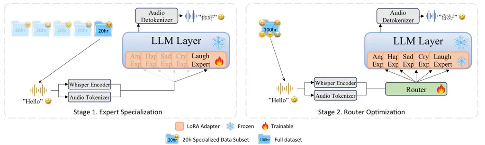
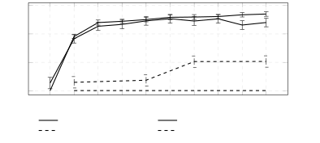
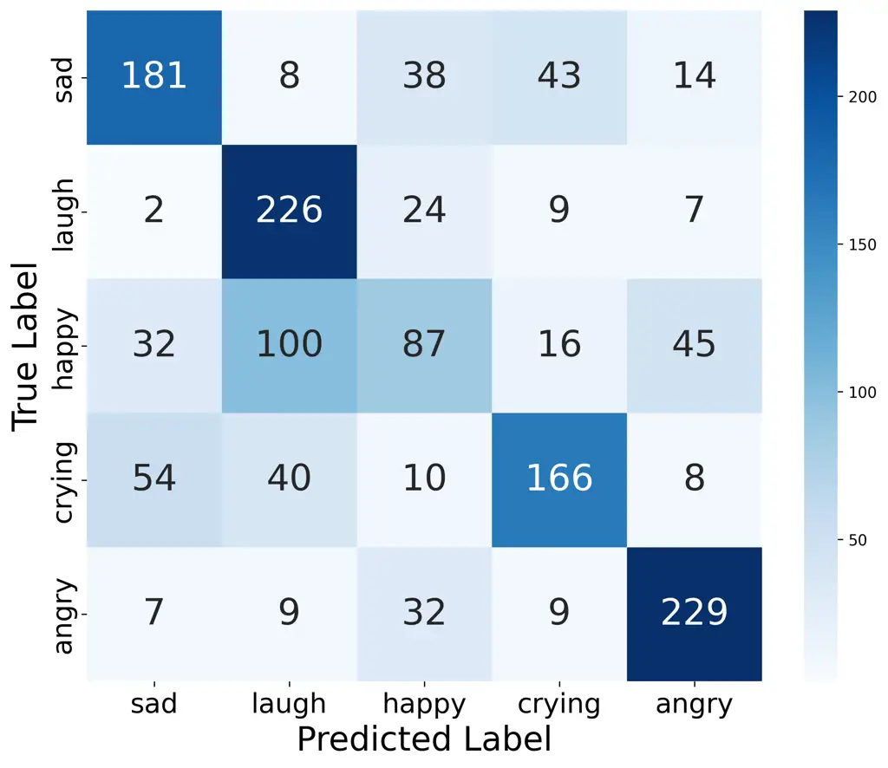
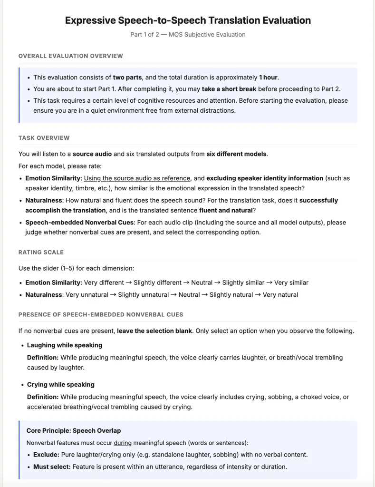
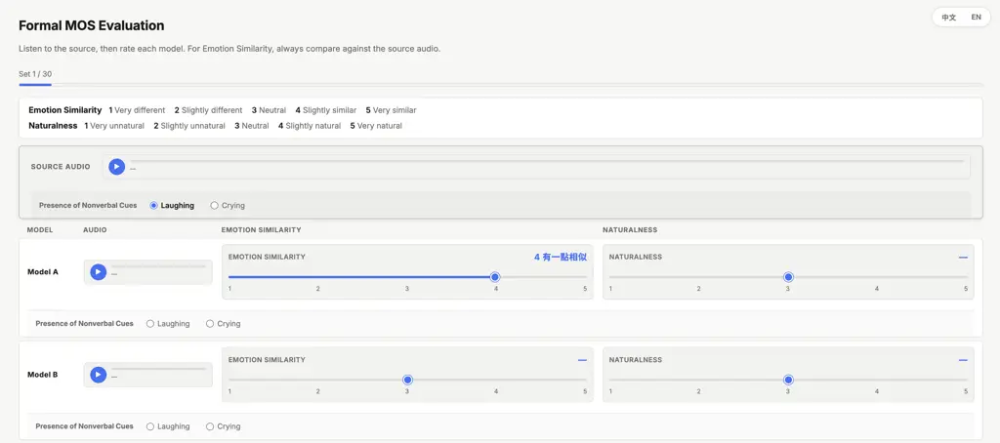
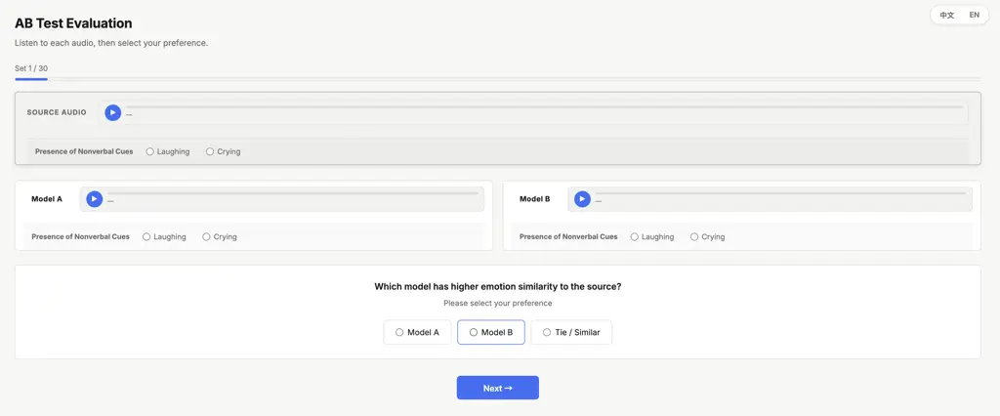

Chen Tsai Lin Huang Lee

# MoVE: Translating Laughter and Tears via Mixture of Vocalization Experts in Speech-to-Speech Translation

Szu-Chi    I-Ning    Yi-Cheng    Sung-Feng    Hung-yi

###### Abstract

Recent Speech-to-Speech Translation (S2ST) systems achieve strong
semantic accuracy yet consistently strip away non-verbal vocalizations
(NVs), such as laughter and crying that convey pragmatic intent, which
severely limits real-world utility. We address this via three
contributions. First, we propose a synthesis pipeline for building
scalable expressive datasets to overcome the data scarcity limitation.
Second, we propose MoVE, a Mixture-of-LoRA-Experts architecture with
expressive-specialized adapters and a soft-weighting router that blends
experts for capturing hybrid expressive states. Third, we show
pretrained AudioLLMs enable striking data efficiency: 30 minutes of
curated data is enough for strong performance. On English-Chinese S2ST,
while comparing with strong baselines, MoVE reproduces target NVs in 76%
of cases and achieves the highest human-rated naturalness and emotional
fidelity among all compared systems, where existing S2ST systems
preserve at most 14% of NVs.

###### keywords

speech-to-speech translation, non-verbal vocalizations, mixture of
experts, AudioLLMs, expressive speech

^(†)^(†)address: ¹ National Taiwan University, Taipei, Taiwan  
² NVIDIA, Taiwan



Figure 1: Illustration of MoVE Two-Stage training

## 1 Introduction

Speech-to-Speech Translation (S2ST) represents a sophisticated
technology that integrates Automatic Speech Recognition (ASR), Machine
Translation (MT), and Text-to-Speech (TTS) synthesis. By enabling direct
vocal interaction across linguistic boundaries, S2ST transcends the
constraints of text-based mediation. However, if the translated speech
fails to retain the prosody and emotional nuances of the original
utterances, it can lead to serious pragmatic biases in cross-language
communication \[1, 2\]. For example, a laugh-filled speech translated
into a serious tone will lose its humor. Similarly, a compliment without
the original tone may be misinterpreted as sarcasm. Therefore,
preserving the expressiveness of the original speech is crucial for
significantly improving the naturalness and efficiency of automated S2ST
cross-language communication.

While achieving high semantic accuracy, recent S2ST systems \[3, 4, 5,
6, 7\] fundamentally struggle to convey general acoustic expressiveness,
much less preserve the specific non-verbal vocalizations (e.g., laughter
and crying) that are essential for conveying pragmatic intent. This gap
stems from two fundamental bottlenecks. The most critical bottleneck is
the lack of training data. On the data front, high-quality speech
corpora containing authentic NVs are extremely scarce and often
contaminated by environmental noise, making it difficult for models to
disentangle emotional cues from artifacts \[8\]. Furthermore, even
though there are more and more speech translation \[9, 10, 11\] and
non-verbal speech datasets \[12, 13, 14\], few of them are suitable for
training expressive S2ST, according to their data structure, quality,
and quantity.

Another bottleneck affecting the training of the expressiveness of S2ST
lies in the model architecture. In terms of architecture, it is quite
difficult to train a custom S2ST model directly on expressive data. This
is not only because S2ST itself combines three complex tasks: ASR, MT,
and TTS, but also because learning cross-linguistic semantic alignment
and diverse expressive acoustic preservation further increases the
difficulty of training \[3, 4, 5, 6, 7\]. AudioLLM \[15, 16\] offers a
potential solution because of its large-scale pre-training itself
covering tasks such as ASR and TTS, thus providing powerful semantic and
acoustic capabilities. However, applying them to the expressive S2ST
introduces two additional challenges. First of all, we still cannot be
certain how much training data is required to elicit AudioLLM’s
potential and unlock its S2ST capabilities. Second, how to design an
architecture capable of modeling a wide variety of similar or
conflicting emotional states accurately, without interference, becomes a
crucial issue.

In this paper, we tackle this challenge on two fronts: on the data side,
we first propose a scalable expressive dataset synthesis pipeline to
overcome training-data limitations, which is further compared with other
S2ST datasets. On the model side, we utilize a pre-trained AudioLLM for
expressive S2ST fine-tuning, and further discuss the data scale it
requires and how we modify the architecture to deal with the
multi-emotion modeling problem. To conclude, the primary contributions
of this work are as follows:

- •
  Pioneering AudioLLM Adaptation for S2ST: To the best of our knowledge,
  we are the first to fine-tune general-purpose AudioLLMs for end-to-end
  S2ST, by effectively eliciting AudioLLMs’ powerful potential rather
  than designing a task-specific architecture.
- •
  Scalable Expressive Data Synthesis Pipeline: We introduce an automated
  generation-selection pipeline tailored for expressive S2ST,
  encompassing a rich spectrum of affective states alongside specific
  non-verbal vocalizations like laughter and crying. A generated
  1000-hour corpus is released for communities’ research purpose¹¹ 1
  Dataset and Demo:
  [https://47zzz.github.io/MoVE/](https://47zzz.github.io/MoVE/).
- •
  MoVE: Mixture of Vocalization Experts with Dynamic Blending: We
  propose a framework featuring a learned router that dynamically blends
  five specialized vocalization adapters, effectively mitigating
  expressive over-smoothing and significantly improving non-verbal
  expressive fidelity.
- •
  Insights on Data Efficiency in AudioLLMs: Leveraging the robust
  baseline representations of these foundation models, we demonstrate
  that fine-tuning via LoRA with as little as 30 minutes of curated data
  achieves 95% of full-data emotional fidelity without compromising
  semantic translation accuracy.

## 2 Methodology

### 2.1 Scalable Expressive Data Synthesis Pipeline

To build a robust foundation for our MoVE training, we propose a
scalable pipeline to synthesize an expressive S2ST corpus. Utilizing
parallel en-zh text from GigaSpeech and GigaST \[17, 18\], we generate
expressive speech translation pairs through a highly curated
emotion-adaptive process:

1. Expressive Prompt Curation. To prevent the synthesized dataset from
   degenerating into narrow emotional stereotypes, we establish a
   high-fidelity acoustic prompt pool. For standard affective states
   (Happy, Sad, Angry)²² 2 We focus on Happy, Sad, and Angry as they
   represent the primary extrema of Russell’s affective dimensions \[19\].
   Other states, particularly those in the high-valence/low-arousal
   quadrant, are excluded due to their acoustic proximity to neutral
   speech, which often leads to classification ambiguity in pure audio.
   Additionally, a separate ’neutral’ class was deemed redundant, as our
   continuous arousal-based sampling strategy inherently captures
   neutral-state variations within the broader dataset., we aggregate
   diverse samples across the CREMA-D, MSP-IMPROV, and IEMOCAP
   datasets \[20, 21, 22\] to maintain a broad and continuous affective
   manifold. In contrast, since extreme non-verbal vocalizations (NVs) are
   often scarce and easily confounded with audio artifacts, we apply more
   rigorous filtering. Laughter prompts are extracted by applying a
   laughter detector (confidence $`>0.99`$) \[23\] to the combined corpora,
   followed by manual verification. Crying prompts are meticulously sourced
   from the JVNV dataset \[14\], focusing on human-verified instances of
   speech-interspersed crying to ensure acoustic viability.

2. Emotion-Adaptive Synthesis via Attribute Decoupling. We employ
   IndexTTS2 \[24\] as our synthesis engine. For standard affective states,
   the extensive prompt pool allows a single acoustic reference to provide
   speaker identity and emotional prosody simultaneously. However, the
   limited availability of curated prompts for extreme NVs poses a
   challenge to diversity. To mitigate this without sacrificing fidelity,
   we disentangle identity from expression: the TTS engine is conditioned
   on a curated NV prompt to reliably induce the target paralinguistics
   (e.g., crying/laughter), while an independently sampled neutral prompt
   from the broader corpora defines the speaker identity. This strategy
   successfully projects rare NV characteristics onto diverse speaker
   profiles, ensuring comprehensive coverage across five distinct emotional
   and non-verbal manifolds (Angry, Happy, Sad, Laugh, and Cry).

3. Automated Quality Assurance and S2ST Pairing. Expressive TTS is prone
   to hallucinations and text omissions, particularly during NV generation.
   We apply three sequential filters: (1) silence trimming via librosa,
   discarding outputs under 0.5 seconds; (2) ASR Word Error Rate (WER)
   verification using Whisper-small \[25\] after text normalization, with a
   lenient threshold of $`\leq 0.5`$ since NV vocalizations yield no
   consistent lexical transcription and naturally elevate WER; and (3) a
   pair-level filter that retains a training pair only if both its EN and
   ZH utterances pass the WER threshold, producing aligned
   En$`\Leftrightarrow`$Zh S2ST pairs.

\captionsetup

\[table\]labelfont=it, textfont=rm

|                                     |                       |                     |                          |                       |                        |                           |
| ----------------------------------- | --------------------- | ------------------- | ------------------------ | --------------------- | ---------------------- | ------------------------- |
|                                     | ASR-BLEU $`\uparrow`$ |                     |                          |                       |                        |                           |
| Model                               | en$`\rightarrow`$zh   | zh$`\rightarrow`$en | Aro-Val SIM $`\uparrow`$ | Nat. MOS $`\uparrow`$ | Emo. SMOS $`\uparrow`$ | NV Match (%) $`\uparrow`$ |
| SOTA Foundation & Commercial Models |                       |                     |                          |                       |                        |                           |
| SeamlessM4T-Large-v2                | 25.8 (1.02)           | 23.6 (1.07)         | 0.14 (0.04)              | 1.65 (0.20)           | 1.47 (0.16)            | 2.00 (2.00)               |
| SeamlessExpressive                  | 23.8 (0.96)           | 18.2 (1.02)         | 0.45 (0.03)              | 1.41 (0.15)           | 2.57 (0.24)            | 14.00 (9.80)              |
| gpt-4o-audio-preview                | 26.3 (1.37)           | 19.2 (1.02)         | 0.18 (0.04)              | 2.87 (0.26)           | 1.95 (0.20)            | 2.00 (2.00)               |
| Kimi-Audio-7B-Instruct              | 25.0 (1.02)           | 11.2 (0.91)         | 0.11 (0.04)              | 3.26 (0.40)           | 2.03 (0.17)            | 4.00 (2.45)               |
| Data & Architectural Ablations      |                       |                     |                          |                       |                        |                           |
| Kimi + LoRA (SeamlessAlign 67h)     | 15.7 (0.76)           | 12.5 (0.81)         | 0.18 (0.04)              | \-                    | \-                     | \-                        |
| Kimi + LoRA (SynStard 100h)         | 29.9 (1.12)           | 18.4 (0.91)         | 0.39 (0.04)              | \-                    | \-                     | \-                        |
| Kimi + LoRA (Ours 50h)              | 32.0 (1.12)           | 20.1 (1.27)         | 0.49 (0.03)              | \-                    | \-                     | \-                        |
| Kimi + LoRA (Ours 100h)             | 31.2 (1.12)           | 21.2 (0.91)         | 0.51 (0.03)              | \-                    | \-                     | 26.00 (6.00)              |
| Proposed Method                     |                       |                     |                          |                       |                        |                           |
| MoVE                                | 32.5 (1.12)           | 21.4 (1.22)         | 0.53 (0.03)              | 3.85 (0.26)           | 3.79 (0.15)            | 76.00 (7.48)              |
| Cascaded Oracle                     |                       |                     |                          |                       |                        |                           |
| Cascaded\*                          | 9.7 (0.81)            | 10.6 (0.86)         | 0.55 (0.03)              | 2.61 (0.43)           | 3.43 (0.25)            | 26.00 (14.00)             |

Table 1: Main expressive S2ST performance. Bold indicates best
performance. Values in parentheses represent: (i) bootstrap-estimated
standard deviation for ASR-BLEU; (ii) standard error (SE) for Aro-Val
SIM ($`N=306`$); and (iii) SE across participants ($`N=5`$) for
Subjective Human Evaluation. Subjective evaluation (Nat. MOS, Emo. SMOS)
and NV Match Accuracy were conducted only for systems included in the
architectural ablation and full model comparison; - denotes not
evaluated. The symbol \* denotes the use of source audio as a one-shot
acoustic prompt.

### 2.2 MoVE Architecture

We build the MoVE architecture upon a pretrained AudioLLM
(Kimi-Audio \[26\]). To preserve its ASR, TTS and cross-lingual semantic
capabilities, we freeze the base parameters and confine expressive
adaptation to lightweight LoRA modules \[27\]. Rather than relying on a
single module, we implement an X-LoRA-inspired gating strategy \[28\] to
accurately model a wide variety of similar or conflicting emotional
states without feature interference.

Parallel Expressive Vocalization Experts. To prevent conflicting
paralinguistic cues from causing mutual interference within a shared
parameter space, we inject 5 parallel LoRA adapters across all the
transformer layers, each specializing in a distinct acoustic manifold:
Happy, Sad, Angry, Laughing, and Crying. Applied to the attention and
feed-forward gating projection matrices
($`W_{q},W_{k},W_{v},W_{o},W_{gate}`$) \[28\], each adapter operates in
an independent low-rank subspace, avoiding feature interference while
retaining the base model’s capacity for coherent speech generation.

Dynamic Soft-Weighting Router. To model the inherently hybrid nature of
human emotion (e.g., nervous laughter), we eschew hard top-$`k`$ routing
for a dynamic soft-weighting strategy. Let $`x\in\mathbb{R}^{d}`$ denote
the input hidden state for a speech token, where $`d`$ is the hidden
dimension of the LLM. The MoVE layer output $`h(x)`$ is computed as the
weighted sum of the frozen base weight $`W_{0}`$ and the LoRA experts:

```math
h(x)=W_{0}x+\sum_{i=1}^{N}g_{i}(x)\cdot(B_{i}A_{i}x)
```

where $`N=5`$ represents the distinct acoustic manifolds,
$`A_{i}\in\mathbb{R}^{r\times d}`$ and
$`B_{i}\in\mathbb{R}^{d\times r}`$ are the down-projection and
up-projection matrices of the $`i`$-th LoRA expert with rank $`r`$, and
$`g_{i}(x)`$ is a lightweight linear router with a Softmax activation.
Operating at the token level, the router assigns a continuous mixture
weight to each of the experts for every speech token, enabling
fine-grained blending of expert contributions for capturing hybrid
expressive states.

Expressive Detokenizer. The pretrained detokenizer, which maps discrete
speech tokens to waveforms, fails to faithfully render extreme NVs such
as laughter and crying. We fine-tune it on expressive NV speech
synthesized with IndexTTS2 using NV-inducing prompts (Section 2.1),
enabling reliable reconstruction of NV-rich outputs.

\captionsetup

\[figure\]labelfont=it, textfont=rm

### 2.3 Two-Stage Training Strategy for MoVE

Following the encoder pretraining approach in Kimi-Audio \[26\], we
first fine-tune the Whisper encoder on our expressive corpus to
establish a shared acoustic foundation for the subsequent expert
modules. MoVE training then proceeds in two stages, as illustrated in
Figure 1:

Stage 1: Independent Expert Specialization. With the base LLM and
aligned Whisper encoder frozen, each of the five LoRA experts is trained
independently on its respective expressive subset, ensuring fine-grained
specialization within each assigned acoustic manifold while avoiding
cross-emotional interference.

Stage 2: Dynamic Router Optimization. In the final stage, the
specialized experts are integrated into the unified MoVE architecture.
We optimize the dynamic router on the full dataset while keeping all
other parameters fixed. Notably, the router is trained end-to-end via
the final language modeling loss rather than explicit labels. This
enables the router to autonomously learn the optimal blending of experts
based on contextual cues, facilitating the seamless translation of
nuanced and hybrid expressive states, effectively bridging the gap
between semantic accuracy and emotional fidelity.

## 3 Experiments and Analysis

### 3.1 Experimental Setup

Model and Training Dataset Baselines. We compare MoVE against leading
end-to-end expressive S2ST systems: Kimi-Audio-7B-Instruct \[26\],
gpt-4o-audio-preview \[29\], SeamlessM4T-Large-v2 \[9\], and
SeamlessExpressive \[9\]. For architectural ablation, we include a
single-LoRA baseline fine-tuned on the identical training set; to
validate the quality of our data pipeline, we additionally train the
same single-LoRA model on SynStard-1000 (randomly sample 100h) \[30\]
and SeamlessAlignExpressive (67h) \[9\] as data-quality comparisons. For
reference, we include a cascaded oracle (source audio as a one-shot
acoustic prompt) as an upper bound with pipeline
(Whisper-large-v3 \[25\] $`\rightarrow`$ NLLB-200 \[31\] $`\rightarrow`$
CosyVoice3-0.5B \[32\]), though it is not directly comparable given its
fundamentally different system paradigm.

Test Sets and Evaluation Metrics. We decouple the evaluation into three
logical dimensions: semantic preservation, objective emotional fidelity,
and subjective human perception. 1) Semantic Translation: We evaluate
linguistic accuracy using ASR-BLEU \[33\] on 1000 English-Chinese pairs
sampled from CVSS-T \[10, 11\], including English-to-Chinese and
Chinese-to-English translation. 2) Objective Emotional Fidelity: We
curate a test set from the NonverbalTTS corpus \[12\] (strictly
filtering out segments lacking linguistic content) encompassing Happy,
Sad, Neutral, and Angry states. Objective fidelity is measured via
Arousal-Valence Similarity (Aro-Val SIM) — the cosine similarity between
source and generated arousal-valence score \[34, 35\]. 3) Subjective
Human Evaluation: We uniformly sample 30 representative utterances
across six evaluation categories (Happy, Sad, Angry, Laughing, Crying,
Neutral). To ensure evaluation rigor while managing the cognitive load
of the annotator, we adopt a dual-paradigm testing strategy. For
comparisons against external and cascaded baselines, proficient
bilingual evaluators conduct a multi-stimulus test to evaluate
Naturalness MOS (Mean Opinion Score) and Emotion SMOS (Similarity Mean
Opinion Score) \[36\], rating the generated speech on a standard 1-to-5
scale. Furthermore, we compared our MoVE framework against the internal
single-LoRA baseline using a pairwise A/B preference test as the model
architecture ablation, where evaluators strictly judge superior
emotional expressiveness (MoVE vs. Single-LoRA, including a “Tie”
option). Finally, across all evaluated models, evaluators assess NV
Match Accuracy for the two extreme NV categories, recording a “hit” only
if the explicitly perceived NVs exactly align with the source. The
complete evaluation interface, instructions, anchor calibration, and
per-phase procedure are detailed in Appendix A.

Implementation Details. LoRA experts are configured with rank $`r=256`$
and scaling factor $`\alpha=256`$. The model is optimized using AdamW
($`\beta_{2}=0.95`$) with a learning rate of $`1\times 10^{-5}`$. To
ensure deep feature disentanglement, Stage 1 (expert specialization) is
trained for 2 epochs, while Stage 2 converges effectively within 1
epoch.

### 3.2 Main Expressive S2ST Performance

Table 1 shows our main experiment results. We compare with different
model baselines that do not require further training and also compare
different training datasets with our single-LoRA baseline model, where
we sampled all the datasets to a similar size between 50h to 100h.
Lastly, we show our MoVE performance and also compare with cascaded
pipeline, while it mostly serves as a reference given its fundamentally
different system paradigm. As shown in Table 1, MoVE establishes a new
state-of-the-art in expressive S2ST. It achieves a new SOTA ASR-BLEU on
en$`\rightarrow`$zh (32.5), and is highly competitive on
zh$`\rightarrow`$en (21.4), trailing SeamlessM4T-Large-v2 by 2.2 BLEU on
zh→en (21.4 vs. 23.6), a gap attributable to MoVE’s optimization
priority on expressive fidelity over pure semantic accuracy. This
success is attributed to two key contributions: our proposed expressive
dataset synthesis pipeline and our MoVE architectural design.

Training Dataset Comparison. To strictly isolate and validate the
quality of our proposed expressive corpus (Section 3.1), we restrict all
evaluations in this part to the objective metrics. We compare models
fine-tuned with a single LoRA on our dataset (sampled at 50h and 100h)
against those trained on the randomly sampled 100h SynStard subset and
the 67h SeamlessAlignExpressive corpus. Results indicate that even the
50h subset of our data overwhelmingly surpasses both external baselines
in ASR-BLEU and Aro-Val SIM. Furthermore, the 100h version of our
dataset consistently outperforms the 100h SynStard subset under the
identical single-LoRA architecture, confirming that the quality
advantage stems from our data pipeline rather than data volume or model
capacity.

MoVE Architectural Comparison. Comparing MoVE with our single-LoRA
baseline (both trained with the same 100h data), MoVE surpasses
throughout all the evaluation metrics, proving that reallocating model
capacity to master expressive manifolds does not compromise semantic
accuracy. Subjectively, MoVE secures the highest Emotion SMOS and
Naturalness MOS. In A/B preference tests (see Table 2), it
overwhelmingly outperforms the single-LoRA baseline. Furthermore, MoVE
dominates in NV Match Accuracy, successfully synthesizing extreme
paralinguistics (e.g., laughter, crying) where single-LoRA baseline
typically failed to preserve, while it is hard to exhibit such
observation through the given objective score. Objectively, MoVE’s
Aro-Val SIM trails the cascaded pipeline by a negligible margin, while
outstandingly win over the cascaded pipeline in ASR-BLEU. Although this
comparison is architecturally asymmetrical³³ 3 As the cascaded system
utilizes one-shot source audio prompting instead of pure zero-shot
inference., MoVE achieves comparable objective fidelity while
significantly surpassing the cascaded pipeline across all
human-perceived metrics, underscoring the dynamic router’s superior
affective rendering.

| Preference              | Win Rate (%) |
| ----------------------- | ------------ |
| MoVE                    | 60.00        |
| Tie                     | 22.67        |
| Single-LoRA (Ours 100h) | 17.33        |

Table 2: A/B Test: Overall Preference (Win Rate %) between MoVE and the
best Single-LoRA baseline.

### 3.3 Analysis on Data Scale Efficacy

To investigate data efficiency, we scale the training subset across 0,
0.1, 0.5, 1, 5, 10, 50, 100, 500, and 1000 hours, where 0 hours
represents the original base Kimi model without additional training.
Since we’re using objective evaluation for the data efficiency ablation,
which our single-LoRA baseline performs on par with MoVE, we eventually
choose the single-LoRA architecture for simplicity. As illustrated in
Figure 2, the learning curves for both semantic and emotional fidelity
exhibit a striking phenomenon: while performance drops sharply at 0.1
hours, it saturates rapidly, maintaining a robust plateau from 0.5 hours
all the way to 1000 hours. To determine the origin of this extreme data
efficiency, we conduct an ablation study by re-initializing the weights
of the base AudioLLM from scratch and training it on varying subsets
(0.1h, 0.5h, 50h, 1000h). Under this condition, the model completely
fails to converge, collapsing into unintelligible babble across all data
scales (represented by the blue dashed lines in Figure 2.) This stark
contrast reveals a key insight: the data efficiency we observe comes not
from LoRA’s adaptive capacity itself, but from the acoustic and semantic
knowledge already stored in the AudioLLM’s pre-trained weights, which
LoRA activates rather than creates.

\captionsetup

\[figure\]labelfont=it, textfont=rm



Figure 2: Data efficacy and scaling behaviors across varying training
sizes. The left axis corresponds to ASR-BLEU and the right axis to
Aro-Val SIM. ASR-BLEU is the average of en-zh and zh-en. Error bars
represent standard errors.

### 3.4 Router Behavior and Disentanglement

To interpret the internal routing mechanism of our MoVE architecture, we
visualize the expert activation patterns on an unseen development set.
Figure 3 presents a confusion matrix that evaluates the alignment
between the predefined expressive categories (Angry, Happy, Sad, Laugh,
Cry) and the dominant expert selection of the router.

As described in Section 2.3, the router is optimized end-to-end only
through the loss of final language modeling, without ever being exposed
to discrete emotion labels. However, benefiting from the supervised
specialization of the underlying experts, the router eventually achieves
an overall alignment accuracy of 63.68%. Achieving such a high alignment
accuracy under these unconstrained conditions strongly demonstrates that
the router autonomously learns to disentangle affective states by
capturing underlying latent linguistic and acoustic cues.

Furthermore, the off-diagonal distributions in the confusion matrix
(e.g., routing overlaps between “Sad” and “Cry”, or “Happy” and “Laugh”)
are not arbitrary errors. Rather, they physically reflect the nuanced
and hybrid nature of natural human expressiveness. This unsupervised
soft-weighting capability validates the core motivation of our MoE
design, proving it can dynamically modulate expressive blends far beyond
rigid, rule-based classification.



Figure 3: Confusion matrix of router behavior.

## 4 Conclusions

This paper addresses the expressive gap in S2ST. We proposed a scalable,
expressive data curation pipeline for training and demonstrated its
superiority over other datasets. By leveraging the robust priors of
pre-trained AudioLLMs, our MoVE achieves state-of-the-art fidelity in
transferring emotions and NVs with incredible data efficiency: as little
as 30 minutes of curated data can ”unlock” deep expressive capabilities.
Although not covering all emotions and NV categories, our method has the
potential to be extended to a more real-world scenario. Our curated
dataset will also be released after camera-ready.

## 5 Acknowledgments

This work was supported by the Ministry of Education (MOE) of Taiwan
under the Taiwan Centers of Excellence in Artificial Intelligence
project, through the NTU Artificial Intelligence Center of Research
Excellence (NTU AI-CoRE). Computing resources were provided by the
National Center for High-Performance Computing, National Institutes of
Applied Research (NIAR), Taiwan.

## 6 Generative AI Use Disclosure

We employed Gemini for grammatical paraphrasing and language polishing
to improve the manuscript’s clarity.

## References

- \[1\] J. E. Avila and N. G. Ward (2023) Towards Cross-Language Prosody
  Transfer for Dialog. In Interspeech 2023, pp. 2143–2147. External
  Links: [Document](https://dx.doi.org/10.21437/Interspeech.2023-1152),
  ISSN 2958-1796 Cited by: §1.
- \[2\] J. Romero-Trillo (2019) Prosodic pragmatics and feedback in
  intercultural communication. Journal of Pragmatics 151, pp. 91–102.
  External Links: ISSN 0378-2166,
  [Document](https://dx.doi.org/https%3A//doi.org/10.1016/j.pragma.2019.02.018)
  Cited by: §1.
- \[3\] A. Lee, P. Chen, C. Wang, J. Gu, S. Popuri, X. Ma, A. Polyak, Y.
  Adi, Q. He, Y. Tang, et al. (2022) Direct speech-to-speech translation
  with discrete units. In Proceedings of the 60th Annual Meeting of the
  Association for Computational Linguistics (Volume 1: Long Papers),
  pp. 3327–3339. Cited by: §1, §1.
- \[4\] Y. Jia, M. T. Ramanovich, T. Remez, and R. Pomerantz (2022)
  Translatotron 2: high-quality direct speech-to-speech translation with
  voice preservation. In International conference on machine learning,
  pp. 10120–10134. Cited by: §1, §1.
- \[5\] E. Nachmani, A. Levkovitch, Y. Ding, C. Asawaroengchai, H. Zen,
  and M. T. Ramanovich (2024) Translatotron 3: speech to speech
  translation with monolingual data. In ICASSP 2024-2024 IEEE
  International Conference on Acoustics, Speech and Signal Processing
  (ICASSP), pp. 10686–10690. Cited by: §1, §1.
- \[6\] Z. Zhang, L. Zhou, C. Wang, S. Chen, Y. Wu, S. Liu, Z. Chen, Y.
  Liu, H. Wang, J. Li, et al. (2023) Speak foreign languages with your
  own voice: cross-lingual neural codec language modeling. arXiv
  preprint arXiv:2303.03926. Cited by: §1, §1.
- \[7\] L. Barrault, Y. Chung, M. C. Meglioli, D. Dale, N. Dong, P.
  Duquenne, H. Elsahar, H. Gong, K. Heffernan, J. Hoffman, et al. (2023)
  Seamlessm4t: massively multilingual & multimodal machine translation.
  arXiv preprint arXiv:2308.11596. Cited by: §1, §1.
- \[8\] H. Gong and B. Veluri (2024) Seamlessexpressivelm: speech
  language model for expressive speech-to-speech translation with
  chain-of-thought. arXiv preprint arXiv:2405.20410. Cited by: §1.
- \[9\] L. Barrault, Y. Chung, M. C. Meglioli, D. Dale, N. Dong, M.
  Duppenthaler, P. Duquenne, B. Ellis, H. Elsahar, J. Haaheim, et
  al. (2023) Seamless: multilingual expressive and streaming speech
  translation. arXiv preprint arXiv:2312.05187. Cited by: §1, §3.1.
- \[10\] Y. Jia, M. T. Ramanovich, Q. Wang, and H. Zen (2022) CVSS
  corpus and massively multilingual speech-to-speech translation. In
  Proceedings of the thirteenth language resources and evaluation
  conference, pp. 6691–6703. Cited by: §1, §3.1.
- \[11\] C. Wang, A. Wu, and J. Pino (2020) Covost 2 and massively
  multilingual speech-to-text translation. arXiv preprint
  arXiv:2007.10310. Cited by: §1, §3.1.
- \[12\] M. Borisov, E. Spirin, and D. Diatlova (2025) Nonverbaltts: a
  public english corpus of text-aligned nonverbal vocalizations with
  emotion annotations for text-to-speech. arXiv preprint
  arXiv:2507.13155. Cited by: §1, §3.1.
- \[13\] Z. Wu, D. Liu, J. Liu, Y. Wang, L. Li, L. Jin, H. Bu, P. Zhang,
  and M. Li (2025) SMIIP-nv: a multi-annotation non-verbal expressive
  speech corpus in mandarin for llm-based speech synthesis. In
  Proceedings of the 33rd ACM International Conference on Multimedia,
  pp. 12564–12570. Cited by: §1.
- \[14\] D. Xin, J. Jiang, S. Takamichi, Y. Saito, A. Aizawa, and H.
  Saruwatari (2024) Jvnv: a corpus of japanese emotional speech with
  verbal content and nonverbal expressions. IEEE Access 12,
  pp. 19752–19764. Cited by: §1, §2.1.
- \[15\] S. Arora, K. Chang, C. Chien, Y. Peng, H. Wu, Y. Adi, E.
  Dupoux, H. Lee, K. Livescu, and S. Watanabe (2025) On the landscape of
  spoken language models: a comprehensive survey. Transactions on
  Machine Learning Research. Note: External Links: ISSN 2835-8856,
  [Link](https://openreview.net/forum?id=BvxaP3sVbA) Cited by: §1.
- \[16\] H. Wu, X. Chen, Y. Lin, K. Chang, H. Chung, A. H. Liu, and H.
  Lee (2024) Towards audio language modeling – an overview. External
  Links: 2402.13236, [Link](https://arxiv.org/abs/2402.13236) Cited by:
  §1.
- \[17\] R. Ye, C. Zhao, T. Ko, C. Meng, T. Wang, M. Wang, and J.
  Cao (2022) Gigast: a 10,000-hour pseudo speech translation corpus.
  arXiv preprint arXiv:2204.03939. Cited by: §2.1.
- \[18\] G. Chen, S. Chai, G. Wang, J. Du, W. Zhang, C. Weng, D. Su, D.
  Povey, J. Trmal, J. Zhang, et al. (2021) Gigaspeech: an evolving,
  multi-domain asr corpus with 10,000 hours of transcribed audio. arXiv
  preprint arXiv:2106.06909. Cited by: §2.1.
- \[19\] J. A. Russell (1980) A circumplex model of affect.. Journal of
  personality and social psychology 39 (6), pp. 1161. Cited by: footnote 2.
- \[20\] H. Cao, D. G. Cooper, M. K. Keutmann, R. C. Gur, A. Nenkova,
  and R. Verma (2014) CREMA-d: crowd-sourced emotional multimodal actors
  dataset. IEEE Transactions on Affective Computing 5 (4), pp. 377–390.
  External Links:
  [Document](https://dx.doi.org/10.1109/TAFFC.2014.2336244) Cited by:
  §2.1.
- \[21\] C. Busso, S. Parthasarathy, A. Burmania, M. AbdelWahab, N.
  Sadoughi, and E. M. Provost (2017) MSP-improv: an acted corpus of
  dyadic interactions to study emotion perception. IEEE Transactions on
  Affective Computing 8 (1), pp. 67–80. External Links:
  [Document](https://dx.doi.org/10.1109/TAFFC.2016.2515617) Cited by:
  §2.1.
- \[22\] C. Busso, M. Bulut, C. Lee, A. Kazemzadeh, E. Mower, S.
  Kim, J. N. Chang, S. Lee, and S. S. Narayanan (2008) IEMOCAP:
  interactive emotional dyadic motion capture database. Language
  resources and evaluation 42 (4), pp. 335–359. Cited by: §2.1.
- \[23\] T. Omine, K. Akita, and R. Tsuruno (2024) Robust laughter
  segmentation with automatic diverse data synthesis.. In INTERSPEECH,
  Cited by: §2.1.
- \[24\] S. Zhou, Y. Zhou, Y. He, X. Zhou, J. Wang, W. Deng, and J.
  Shu (2025) Indextts2: a breakthrough in emotionally expressive and
  duration-controlled auto-regressive zero-shot text-to-speech. arXiv
  preprint arXiv:2506.21619. Cited by: §2.1.
- \[25\] A. Radford, J. W. Kim, T. Xu, G. Brockman, C. McLeavey, and I.
  Sutskever (2023) Robust speech recognition via large-scale weak
  supervision. In International conference on machine learning,
  pp. 28492–28518. Cited by: §2.1, §3.1.
- \[26\] D. Ding, Z. Ju, Y. Leng, S. Liu, T. Liu, Z. Shang, K. Shen, W.
  Song, X. Tan, H. Tang, et al. (2025) Kimi-audio technical report.
  arXiv preprint arXiv:2504.18425. Cited by: §2.2, §2.3, §3.1.
- \[27\] E. J. Hu, Y. Shen, P. Wallis, Z. Allen-Zhu, Y. Li, S. Wang, L.
  Wang, W. Chen, et al. (2022) Lora: low-rank adaptation of large
  language models.. Iclr 1 (2), pp. 3. Cited by: §2.2.
- \[28\] E. L. Buehler and M. J. Buehler (2024) X-lora: mixture of
  low-rank adapter experts, a flexible framework for large language
  models with applications in protein mechanics and molecular design.
  APL Machine Learning 2 (2). Cited by: §2.2, §2.2.
- \[29\] A. Hurst, A. Lerer, A. P. Goucher, A. Perelman, A. Ramesh, A.
  Clark, A. Ostrow, A. Welihinda, A. Hayes, A. Radford, et al. (2024)
  Gpt-4o system card. arXiv preprint arXiv:2410.21276. Cited by: §3.1.
- \[30\] Y. Pu, X. Liu, G. Zhang, Z. Yan, W. Zhang, and X. Chen (2025)
  Empowering large language models for end-to-end speech translation
  leveraging synthetic data. In Proc. Interspeech 2025, pp. 26–30. Cited
  by: §3.1.
- \[31\] M. R. Costa-Jussà, J. Cross, O. Çelebi, M. Elbayad, K.
  Heafield, K. Heffernan, E. Kalbassi, J. Lam, D. Licht, J. Maillard, et
  al. (2022) No language left behind: scaling human-centered machine
  translation. arXiv preprint arXiv:2207.04672. Cited by: §3.1.
- \[32\] Z. Du, C. Gao, Y. Wang, F. Yu, T. Zhao, H. Wang, X. Lv, H.
  Wang, C. Ni, X. Shi, et al. (2025) Cosyvoice 3: towards in-the-wild
  speech generation via scaling-up and post-training. arXiv preprint
  arXiv:2505.17589. Cited by: §3.1.
- \[33\] M. Post (2018) A call for clarity in reporting BLEU scores. In
  Proceedings of the Third Conference on Machine Translation: Research
  Papers, O. Bojar, R. Chatterjee, C. Federmann, M. Fishel, Y.
  Graham, B. Haddow, M. Huck, A. J. Yepes, P. Koehn, C. Monz, M.
  Negri, A. Névéol, M. Neves, M. Post, L. Specia, M. Turchi, and K.
  Verspoor (Eds.), Brussels, Belgium, pp. 186–191. External Links:
  [Link](https://aclanthology.org/W18-6319/),
  [Document](https://dx.doi.org/10.18653/v1/W18-6319) Cited by: §3.1.
- \[34\] J. Wagner, A. Triantafyllopoulos, H. Wierstorf, M. Schmitt, F.
  Burkhardt, F. Eyben, and B. W. Schuller (2023) Dawn of the transformer
  era in speech emotion recognition: closing the valence gap. IEEE
  Transactions on Pattern Analysis and Machine Intelligence 45 (9),
  pp. 10745–10759. Cited by: §3.1.
- \[35\] H. Wu, X. Wang, S. E. Eskimez, M. Thakker, D. Tompkins, C.
  Tsai, C. Li, Z. Xiao, S. Zhao, J. Li, et al. (2024) Laugh now cry
  later: controlling time-varying emotional states of
  flow-matching-based zero-shot text-to-speech. In 2024 IEEE Spoken
  Language Technology Workshop (SLT), pp. 690–697. Cited by: §3.1.
- \[36\] M. Wester, Z. Wu, and J. Yamagishi (2016) Analysis of the voice
  conversion challenge 2016 evaluation results. In Interspeech 2016,
  pp. 1637–1641. Cited by: §3.1.

## Appendix A Subjective Human Evaluation Protocol

We complement Section 4.1 with a brief account of the in-house bilingual
evaluation platform used for all subjective scores. Five proficient
English–Chinese bilingual evaluators ($`N=5`$) rate the 30-utterance
test set (six categories $`\times`$ five utterances). For every
evaluator, both the set order and the model order within each set are
independently randomized via a per-subject seed.

Instructions and anchor calibration (Figure 4). Before each phase,
evaluators read a bilingual instruction page that defines the rating
scale, the two NV categories (Laughing / Crying while speaking), and a
Speech Overlap principle requiring NVs to co-occur with linguistic
content.



Figure 4: Bilingual instruction page shown before Phase 1 (MOS
evaluation): defines the Emotion Similarity and Naturalness rating
scales (1–5), the two NV categories (Laughing / Crying while speaking),
and the Speech Overlap principle requiring NVs to co-occur with
linguistic content.

Phase 1: MOS multi-stimulus test (Figure 5). Each screen shows the
source audio above six anonymized, randomly labeled model outputs (MoVE,
cascaded, SeamlessExpressive, Kimi-Audio, SeamlessM4T, gpt-4o-audio).
For each output, evaluators score Emotion Similarity and Naturalness on
independent 1–5 sliders, and additionally mark any perceived NV cue.
Source-side NV annotations are also collected and serve as the
per-utterance ground truth for NV Match Accuracy.



Figure 5: Phase 1 MOS multi-stimulus interface: evaluators listen to the
source audio (top, used as the emotional reference) and rate each of the
six anonymized model outputs on Emotion Similarity and Naturalness (1–5
sliders). An NV selector (Laughing / Crying) is provided for each clip
to record perceived non-verbal vocalizations.

Phase 2: A/B pairwise preference test (Figure 6). For the architectural
ablation, MoVE and the single-LoRA baseline are presented side by side
with per-set randomized A/B labeling. Evaluators choose Model A, Model
B, or Tie / Similar, with Tie restricted to cases that are perceptually
indistinguishable. Per-clip NV selectors are again provided for
cross-validation against the source.



Figure 6: Phase 2 pairwise A/B interface for the MoVE vs. single-LoRA
architectural ablation: evaluators judge which model has higher
emotional expressiveness (Model A, Model B, or Tie / Similar). Model
identity and side assignment are randomized per utterance. An NV
selector is provided for cross-validation against the source.

NV Match Accuracy. For each utterance the source-side annotation defines
the ground-truth NV label; a model scores a hit only when its perceived
NV label exactly matches the source (otherwise a miss). Per-system
accuracies are averaged across the laughing and crying subsets, and
standard errors over the five evaluators are reported in Table 1.
