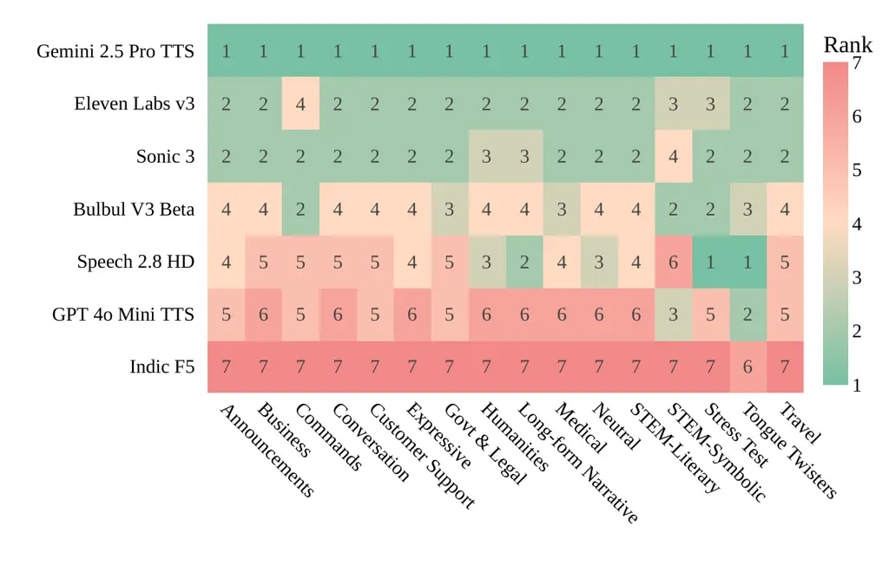
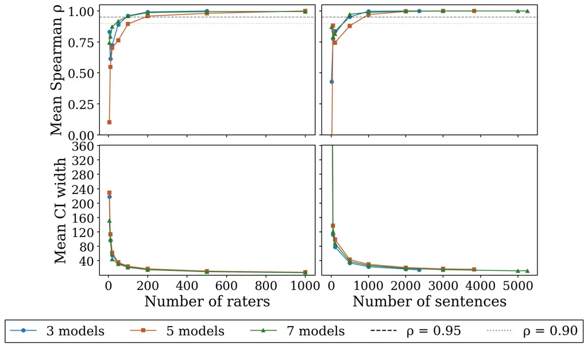

Anand Sankar Sethi Pareek Rajput Yadav Narasimhan Pandya Halder Khan S V
Banga M Khapra

# Preferences of a Voice-First Nation: Large-Scale Pairwise Evaluation and Preference Analysis for TTS in Indian Languages

Srija    Ashwin    Ishvinder    Aaditya    Kartik    Gaurav    Nikhil   
Adish    Deepon    Mohammed Safi Ur Rahman    Praveen    Shobhit   
Mitesh

###### Abstract

Crowdsourced pairwise evaluation has emerged as a scalable approach for
assessing foundation models. However, applying it to Text to Speech(TTS)
introduces high variance due to linguistic diversity and
multidimensional nature of speech perception. We present a controlled
multidimensional pairwise evaluation framework for multilingual TTS that
combines linguistic control with perceptually grounded annotation. Using
5K+ native and code-mixed sentences across 10 Indic languages, we
evaluate 7 state-of-the-art TTS systems and collect over 120K pairwise
comparisons from over 1900 native raters. In addition to overall
preference, raters provide judgments across 6 perceptual dimensions:
intelligibility, expressiveness, voice quality, liveliness, noise, and
hallucinations. Using Bradley-Terry modeling, we construct a
multilingual leaderboard, interpret human preference using SHAP analysis
and analyze leaderboard reliability alongside model strengths and
trade-offs across perceptual dimensions.

###### keywords

Multilingual TTS Evaluation, Perceptual Evaluation, Pairwise Ranking,
code-mixing

^(†)^(†)address: ¹Indian Institute of Technology Madras, India
 ²AI4Bharat, India  ³Josh Talks, India ^(†)^(†)email:
srijaanand@ai4bharat.org, ashwins1211@gmail.com

## 1 Introduction

India is widely recognized as a voice first nation, where many people
prefer to access digital services primarily through speech rather than
text interfaces. The country’s linguistic diversity, with hundreds of
languages and widespread bilingualism, leads to real world speech that
frequently includes code-mixing, domain specific vocabulary, numerals,
and alphanumeric expressions. Along with the rapid growth of voice
driven applications such as education, accessibility, telemedicine, and
conversational AI, this has created strong demand for high quality Text
to Speech systems in Indian languages. While recent neural TTS advances
have improved synthesis quality \[1, 2, 3, 4\], rigorous evaluation
remains challenging, and existing studies are often limited in scale,
coverage, or diagnostic depth.

Traditional TTS evaluation methods such as MOS \[5, 6, 7, 8\], CMOS
\[9\], and MUSHRA \[10, 11\] have long been used to assess perceptual
quality, but recent studies \[10, 12, 13, 14, 15, 16\] highlight their
limitations for modern multilingual TTS systems. In particular, MOS
style evaluations rely on absolute ratings that are sensitive to
individual rater calibration \[17\]. Pairwise preference evaluation
\[18\] provides a stronger alternative by capturing direct comparisons
and enabling statistically grounded rankings using models such as
Bradley-Terry \[19\]. However, applying pairwise evaluation to speech
synthesis requires careful control over linguistic variability, and
overall preference alone provides limited insight into why raters prefer
one system over another. Incorporating fine grained feedback on various
perceptual attributes is crucial to reveal the factors driving those
human judgments.

To address these challenges, we design a controlled multidimensional
pairwise evaluation framework for multilingual TTS with the following
contributions. First, we curate a phonetically diverse benchmark
consisting of carefully designed evaluation sentences across 10 Indic
languages, covering real world linguistic phenomena such as code-mixing,
numerals, and deployment realistic expressions. Second, using this
benchmark, we conduct a large scale controlled human evaluation of 7
state of the art TTS systems, collecting over 120K pairwise comparisons
from more than 1900 native raters across India, along with fine grained
feedback across six perceptual dimensions. Third, using Bradley-Terry
modeling, we construct a statistically grounded multilingual leaderboard
and analyze the perceptual drivers of model preference. Finally, we
study evaluation reliability as scale increases, examining the effects
of the number of raters, comparisons, and sentences, and provide a fine
grained analysis of the perceptual attributes that most strongly
influence listener decisions. Together, this study provides a large
scale benchmark, systematic insights into reliable evaluation, and
practical guidance for designing scalable and interpretable human
evaluation frameworks for speech synthesis. The benchmark and the
preference data is available at
[https://huggingface.co/datasets/ai4bharat/SpeechArenaBench/](https://huggingface.co/datasets/ai4bharat/SpeechArenaBench/).
We hope this will support future research on multilingual TTS
evaluation.

## 2 Related Work

Subjective evaluation of TTS systems: Subjective listening tests such as
MOS \[5, 6\], CMOS \[9\], and MUSHRA \[11\] remain standard for
evaluating TTS quality. However, these studies are often limited in
scale, or language coverage and typically report aggregate scores that
obscure the perceptual factors \[6, 13\]. Multidimensional extensions
such as MUSHRA-DG \[12\] capture richer perceptual signals but increase
evaluation complexity and limit scalability across multiple systems.

Pairwise preference and probabilistic ranking: Pairwise preference
evaluation \[20\] captures relative judgments between samples and
enables probabilistic ranking using models such as Bradley-Terry \[19\]
and Thurstone \[21\]. Prior speech synthesis studies \[22, 23, 24\] have
adopted this paradigm but largely focus on overall preference \[14\],
without incorporating multidimensional perceptual attribution in
multilingual settings.

Evaluation of multilingual and Indic TTS: Several studies \[3, 25, 26,
27\] evaluate Indic TTS using MOS or CMOS protocols, but many predate
recent neural TTS advances or remain limited in scale, linguistic
diversity, or diagnostic depth. Large-scale multilingual evaluations
across Indic languages remain relatively scarce \[12\].

## 3 Evaluation Framework

We describe our controlled multidimensional pairwise evaluation
framework, including the benchmark, rater recruitment, annotation
protocol, perceptual axes, and ranking methodology.

### 3.1 Benchmark Construction

We construct a multilingual evaluation benchmark of 5,357 sentences
across 10 Indian languages: Bengali, Gujarati, Hindi, Kannada,
Malayalam, Marathi, Odia, Tamil, Telugu, and Urdu. The sentences span 16
deployment relevant domains (Figure 2) and are collected from public
sources following the methodology in  \[26\]. To probe edge cases, we
additionally generate sentences using Gemini-3-pro-preview \[28\],
covering stress categories such as tongue twisters, extreme repetitions,
and dense STEM content. We also include 100 expressive utterances from
RASA-test \[26\] to evaluate prosody and emotion. Sentences are either
collected natively or translated using Gemini-3-pro-preview. _All
sentences undergo strict quality assurance by in-house native language
experts_, who accept, correct, or discard them based on linguistic
accuracy, fluency, and domain-specific terminology.

| Benchmark          |      | Raters    |      | Age            |      |
| ------------------ | ---- | --------- | ---- | -------------- | ---- |
| \# sentences       | 5357 | Total     | 1915 | 18–25          | 885  |
| \# languages       | 10   | Male      | 767  | 25–40          | 916  |
| \# domains         | 16   | Female    | 1148 | 40–65          | 114  |
| \# symbolic sent.  | 1752 | \# states | 22   | \# Comparisons |      |
| \# codemixed sent. | 4164 |           |      | Total          | 120K |

Table 1: Statistics of the benchmark and rater demographics.

The benchmark (Table 1) consists of three structured subsets reflecting
different input conditions. The normalized subset expands numerals,
equations, and acronyms into fully verbalized forms, while the symbolic
subset retains numerals, formulas, and operators to test handling of raw
text. The code-mixed subset includes intra-sentential English
insertions, transliteration-based mixing, and mixed-script sentences,
reflecting everyday multilingual usage in India. Utterances span short,
medium, and long durations to evaluate both pronunciation accuracy and
longer-range prosodic coherence. Audio outputs are generated on demand
under consistent conditions, and where supported, multiple voices per
model are evaluated.

### 3.2 Rater Recruitment

To ensure reliable human evaluations, we implemented a multi-stage rater
recruitment and training protocol. Candidates first completed an
auditory screening task requiring them to identify the higher-quality
sample between a clearly degraded and a clean recording. Those who
passed proceeded to a second evaluation where they justified their
choices using the perceptual criteria employed in the study (Table 2).
Selected raters were then trained on the evaluation guidelines, platform
usage, and quality expectations before accessing the annotation
interface. All participants provided informed consent, the study
protocol underwent internal ethics review, and raters were fairly
compensated according to standard industry rates. The demographics of
the final rater pool are summarized in Table 1.

### 3.3 Annotation Protocol

To mitigate cognitive overload and prevent post-hoc rationalization, we
implement a strict two-step pairwise comparison workflow. In the first
phase, raters are shown the text prompt and two anonymous, randomized
audio samples (Model A and Model B) and must submit a holistic overall
preference–_Model A_, _Model B_, _Both Good_, or _Both Bad_–after
listening to both samples. Each rater evaluates 150 randomly sampled
sentences. Once submitted, this overall choice is permanently locked and
the interface for the second phase is revealed, where raters assess the
same audio pair across six granular perceptual axes (Table 2) on an
identical scale. This ensures that the overall preference reflects the
rater’s immediate auditory judgment, while the granular ratings provide
an independent diagnostic breakdown.

| Axis              | Description                                                                             |
| ----------------- | --------------------------------------------------------------------------------------- |
| Intelligibility   | Clarity and correctness of pronunciation, including native and code-mixed words.        |
| Expressiveness    | Appropriateness of prosody, intonation, and emotional delivery.                         |
| Voice Quality     | Naturalness and human-likeness of the voice, including timbre and absence of artifacts. |
| Liveliness        | Energy and pacing of the speech, indicating engaging vs. monotonous delivery.           |
| Hallucinations    | Fidelity to the input text, penalizing skipped words or unintended sounds.              |
| Presence of Noise | Background artifacts or signal distortions such as hiss, clicks, or static.             |

Table 2: Granular perceptual axes used for pairwise evaluation.

### 3.4 Ranking and Statistical Modelling

We convert the collected pairwise preferences into a single leaderboard
by fitting a maximum-likelihood Bradley–-Terry (BT) model \[19, 29\].
The resulting latent scores are mapped onto an Elo-like scale for
consistency with standard leaderboard conventions \[30\]. To quantify
uncertainty, we perform bootstrap resampling \[31\] of the preference
data 500 times and refit the BT model on each sample to obtain $`95\%`$
confidence intervals. For ranking, we use a conservative,
significance-aware criterion: a system is strictly better than another
only if its confidence interval lies entirely above that of the other
system \[30\].

## 4 Results

We evaluate 7 state-of-the-art TTS systems—Gemini 2.5 Pro TTS,
GPT-4o-mini TTS, Eleven Labs v3, Sonic 3, Speech 2.8 HD, Bulbul v3 Beta,
and Indic F5 \[32\]—spanning commercial production APIs, open-source
systems, and Indic-specialized models. To ensure fair comparison across
systems, all models were evaluated using identical text prompts without
style conditioning. Each system used its recommended default voice
configuration, and audio samples were generated in non-streaming mode
under consistent inference settings. When multiple voices were
available, we ensured that pairwise comparisons were performed between
voices of the same gender to avoid confounding effects due to
gender-related perceptual differences. In this section, we present the
multilingual leaderboards and provide detailed analyses of ranking
reliability, perceptual drivers of human preference, acoustic trade-offs
between models, and the impact of code-mixed inputs.

[TABLE]

Table 3: Overall leaderboard based on Bradley-Terry scores
($`\uparrow`$). Win rate is reported as a percentage. \# comp is the
number of comparisons. \# lang is the number of supported languages.

### 4.1 Overall and Language-wise Rankings of TTS Systems

Table 3 shows the overall leaderboard based on over 120K pairwise
comparisons. Gemini 2.5 Pro TTS ranks first ($`1128.53\pm 3`$), followed
by Eleven Labs v3 ($`1056.28\pm 2`$) and Sonic 3 ($`1050.83\pm 3`$),
which are statistically indistinguishable. In contrast, the open-source
Indic F5 model ranks last ($`805.75\pm 3`$) despite extensive evaluation
coverage (10 languages and 42K pairwise comparisons) indicating a large
gap relative to the other commercial systems evaluated. Most adjacent
score differences exceed their bootstrap confidence intervals,
indicating that the evaluation scale is sufficiently sensitive to
resolve the majority of performance differences.

Figure 1 presents per-language rankings. Gemini 2.5 Pro TTS ranks first
in 9 of 10 languages, with near parity with Eleven Labs v3 in the case
of Marathi. Rankings among Eleven Labs v3, Sonic 3, and Bulbul v3
Beta vary across languages with relatively small differences while Indic
F5 consistently ranks at or near the bottom.

Figure 1: Language-wise rankings of evaluated TTS systems based on
Bradley–Terry (BT) scores with bootstrap confidence intervals. Languages
are represented using ISO-639-2 codes.

### 4.2 Understanding Sensitivity of Leaderboard Rankings

How Do Ranks Vary Across Domains? Figure 2 shows model rankings across
domains. Gemini 2.5 Pro TTS ranks first in all 16 domains, indicating
consistent strong performance. In contrast, rankings among Eleven Labs
v3, Sonic 3, and Bulbul v3 Beta vary by domain, showing smaller
performance differences. Some domains diverge from the aggregate
ordering: Speech 2.8 HD ranks first in the Stress Test category, and
multiple systems tie in Tongue Twisters. Indic F5 remains near the
bottom across domains. Overall, domain-wise analysis reveals meaningful
variation among competing systems \[7\].

Figure 2: System ranks shift across benchmark domains.

How Do Rankings Change with Input Type? We examine leaderboard stability
across the three subsets discussed in $`\lx@sectionsign`$3.1:
_Normalized_, _Symbolic_, and _Code-mixed_. Table 4 reports BT ratings
computed separately for each subset. Gemini 2.5 Pro TTS ranks first
under all conditions, indicating robustness to input variation. Overall,
rankings change only modestly, though some shifts are observed - for
example, Bulbul v3 Beta performs relatively better under symbolic
inputs. These subsets reflect real-world deployment challenges,
including normalization of structured expressions and multilingual text.
While rank differences are limited, condition-wise evaluation reveals
complementary strengths and weaknesses across systems.

|                    | Codemixed        | Normalized       | Symbolic         |
| ------------------ | ---------------- | ---------------- | ---------------- |
| Gemini 2.5 Pro TTS | $`1135.45\pm 3`$ | $`1120.12\pm 3`$ | $`1143.68\pm 5`$ |
| Eleven Labs v3     | $`1054.00\pm 3`$ | $`1059.28\pm 3`$ | $`1044.37\pm 5`$ |
| Sonic 3            | $`1054.74\pm 3`$ | $`1049.68\pm 3`$ | $`1049.42\pm 6`$ |
| Bulbul v3 Beta     | $`1031.28\pm 3`$ | $`1012.58\pm 3`$ | $`1048.20\pm 5`$ |
| Speech 2.8 HD      | $`982.76\pm 7`$  | $`1011.02\pm 6`$ | $`958.15\pm 10`$ |
| GPT-4o-mini TTS    | $`951.42\pm 5`$  | $`934.76\pm 5`$  | $`970.75\pm 8`$  |
| Indic F5           | $`812.54\pm 4`$  | $`849.75\pm 4`$  | $`785.42\pm 6`$  |

Table 4: Bradley–Terry scores ($`\uparrow`$) across benchmark input
types: Code-mixed, Normalized and Symbolic.

### 4.3 Interpreting Human Preference

What Do Perceptual Axes Reveal About Human Preference? To better
understand how raters form preferences, we analyze performance across
six perceptual axes highlighted in Table 2 using average axis-level win
rates (Figure 3). Higher scores on the hallucination and noise axes
correspond to fewer artifacts and cleaner audio, and therefore indicate
stronger robustness. Gemini 2.5 Pro TTS performs consistently well on
all axes, reflecting balanced strengths in expressiveness,
intelligibility, liveliness, voice quality, and robustness. Eleven Labs
v3, Sonic 3, and Bulbul v3 Beta maintain strong intelligibility and
robustness but exhibit comparatively lower expressiveness and
liveliness. Speech 2.8 HD and GPT-4o-mini TTS show more uneven
performance across dimensions, while Indic F5 ranks lower on most
perceptual axes.

Figure 3: Multi-dimensional perceptual performance of TTS systems
measured by average win rates across six axes.

Can Granular Judgments Predict Overall Preference? Overall preference
provides a reliable ranking, but it does not reveal how raters combine
multiple perceptual cues into a single judgment. We therefore test
whether overall preference can be reconstructed from granular axis-level
evaluations. For each comparison, we construct a binary feature vector
indicating whether Model A performs at least as well as Model B on each
axis (1 = better or both-good; 0 = worse or both-bad), and train an
XGBoost \[33\] classifier to predict the preferred system (label = 1, if
Model A was the preferred system, 0 otherwise). We train the model on a
subset of languages and evaluate it on held-out languages (Bengali,
Kannada, Malayalam, Marathi, & Urdu), achieving 86.1% accuracy with
consistent performance across languages (83.6%–91.0%). _This suggests
that raters rely on stable and transferable perceptual criteria when
forming overall judgments across linguistic settings._

Figure 4: Mean absolute SHAP values showing the relative contribution of
each perceptual axis to overall preference.

Which Axes Drive Preference? To understand which perceptual attributes
most strongly influence listener preference, we perform SHAP \[34\]
(SHapley Additive exPlanations) analysis (Figure 4) on the trained
model. The results show that expressiveness and intelligibility are the
strongest predictors of overall preference, followed by liveliness and
voice quality. In contrast, hallucinations and noise contribute less to
the model’s predictions. This does not imply that robustness is
unimportant; rather, most evaluated systems already achieve relatively
strong performance on these axes, leaving limited variation to
differentiate models. _Overall, these results suggest that rater
preference is primarily driven by expressive and intelligible speech
once basic robustness to noise and hallucinations is satisfied._

### 4.4 When Does the Leaderboard Become Reliable?

Figure 5: Rank consistency (Spearman’s $`\rho`$) and BT uncertainty as
the number of raters increases (left) and as the number of sentences
increases with 200 raters fixed (right).

A central question in large-scale human evaluation is _sample
efficiency_: how many judgments are required before leaderboard rankings
stabilize. We measure reliability as the number of raters and sentences
increases using two signals: (i) rank consistency (Spearman’s $`\rho`$)
with respect to the full-evaluation leaderboard, and (ii) statistical
uncertainty measured by the mean width of 95% bootstrap confidence
intervals.

How Many Raters Are Enough? Using $`\rho\geq 0.95`$ as a reliability
target, Figure 5 (left half) shows that stable rankings typically emerge
with 100-200 raters, depending on the number of systems compared. For
example, with 5 systems, approximately 200 raters are required to exceed
$`\rho\geq 0.95`$, yielding a $`\mu_{CI}`$ of 17.36. With 7 systems, the
same threshold is reached at around 100 raters ($`\mu_{CI}=21.47`$). At
these scales the ordering of systems is largely stable, although
confidence intervals around their scores remain non-trivial. This
indicates that rank stability is achieved earlier than precise score
estimation: the leaderboard ordering is reliable, but small score
differences between nearby systems should be interpreted cautiously.

How Many Sentences Are Enough? Next, fixing the number of raters at 200,
we vary the number of unique sentences (Figure  5 , right half). Because
the benchmark spans multiple languages, sentence sampling is stratified
to ensure balanced coverage across languages. Using the same reliability
criterion ($`\rho\geq 0.95`$), we find that approximately 1000 sentences
are required to achieve stable rankings for setups with 5 and 7 systems,
while about 500 sentences suffice for setups with 3 systems. Increasing
the number of sentences beyond this point primarily reduces score
uncertainty while providing limited additional gains in rank stability.

## 5 Conclusion

We present a controlled, multidimensional pairwise evaluation framework
for multilingual TTS systems. Using 5.3K sentences across 10 Indic
languages, we collect over 120K pairwise judgments from 1900+ vetted
native raters and construct a leaderboard with Bradley-Terry modeling.
Beyond aggregate rankings, our six perceptual axes support fine grained
diagnostic analysis, with axis-level judgments strongly predicting
overall preference across languages, while SHAP analysis shows that once
basic robustness to noise and hallucinations is ensured, expressiveness
and intelligibility drive listener choice. Our reliability study further
demonstrates that stable rankings can be obtained with moderate rater
counts when sentence coverage is sufficiently broad. We hope this
contribution enables more reliable and interpretable evaluation of
multilingual TTS systems.

## 6 Generative AI Use Disclosure

Generative AI tools were used solely for language polishing and editing
during the preparation of this manuscript. These tools assisted with
improving clarity, grammar, and conciseness of the writing. No
generative AI system was used to generate experimental results,
analyses, figures, or scientific conclusions. All technical content,
experiments, and interpretations were developed and verified by the
authors.

## References

- \[1\] K. Shen, Z. Ju, X. Tan, E. Liu, Y. Leng, L. He, T. Qin, sheng
  zhao, and J. Bian (2024) NaturalSpeech 2: latent diffusion models are
  natural and zero-shot speech and singing synthesizers. In The Twelfth
  International Conference on Learning Representations, External Links:
  [Link](https://openreview.net/forum?id=Rc7dAwVL3v) Cited by: §1.
- \[2\] Z. Ju, Y. Wang, K. Shen, X. Tan, D. Xin, D. Yang, Y. Liu, Y.
  Leng, K. Song, S. Tang, Z. Wu, T. Qin, X. Li, W. Ye, S. Zhang, J.
  Bian, L. He, J. Li, and S. Zhao (2024) NaturalSpeech 3: zero-shot
  speech synthesis with factorized codec and diffusion models. External
  Links: 2403.03100 Cited by: §1.
- \[3\] A. Sankar, Y. Lacombe, S. Thomas, P. Srinivasa Varadhan, S.
  Gandhi, and M. M. Khapra (2025) Rasmalai : Resources for Adaptive
  Speech Modeling in IndiAn Languages with Accents and Intonations. In
  Interspeech 2025, pp. 4128–4132. External Links:
  [Document](https://dx.doi.org/10.21437/Interspeech.2025-2758), ISSN
  2958-1796 Cited by: §1, §2.
- \[4\] Y. Chen, Z. Niu, Z. Ma, K. Deng, C. Wang, J. Zhao, K. Yu, and X.
  Chen (2025) F5-tts: a fairytaler that fakes fluent and faithful speech
  with flow matching. External Links: 2410.06885,
  [Link](https://arxiv.org/abs/2410.06885) Cited by: §1.
- \[5\] A. Kirkland, S. Mehta, H. Lameris, G. E. Henter, E. Szekely,
  and J. Gustafson (2023) Stuck in the MOS pit: A critical analysis of
  MOS test methodology in TTS evaluation. In Proc. 12th ISCA Speech
  Synthesis Workshop (SSW2023), pp. 41–47. External Links:
  [Document](https://dx.doi.org/10.21437/SSW.2023-7) Cited by: §1, §2.
- \[6\] M. Wester, C. Valentini-Botinhao, and G. E. Henter (2015) Are we
  using enough listeners? no! - an empirically-supported critique of
  interspeech 2014 TTS evaluations. In INTERSPEECH 2015, 16th Annual
  Conference of the International Speech Communication Association,
  Dresden, Germany, September 6-10, 2015, pp. 3476–3480. External Links:
  [Link](https://doi.org/10.21437/Interspeech.2015-689),
  [Document](https://dx.doi.org/10.21437/INTERSPEECH.2015-689) Cited by:
  §1, §2.
- \[7\] J. Edlund, C. Tånnander, S. Le Maguer, and P. Wagner (2024)
  Assessing the impact of contextual framing on subjective TTS quality.
  In Interspeech 2024, pp. 1205–1209. External Links:
  [Document](https://dx.doi.org/10.21437/Interspeech.2024-781), ISSN
  2958-1796 Cited by: §1, §4.2.
- \[8\] R. Dall, J. Yamagishi, and S. King (2014) Rating Naturalness in
  Speech Synthesis: The Effect of Style and Expectation. In Speech
  Prosody 2014, pp. 1012–1016. External Links:
  [Document](https://dx.doi.org/10.21437/SpeechProsody.2014-192), ISSN
  2333-2042 Cited by: §1.
- \[9\] P. C. Loizou (2011) Speech quality assessment. In Multimedia
  Analysis, Processing and Communications, W. Lin, D. Tao, J.
  Kacprzyk, Z. Li, E. Izquierdo, and H. Wang (Eds.), pp. 623–654.
  External Links: ISBN 978-3-642-19551-8,
  [Document](https://dx.doi.org/10.1007/978-3-642-19551-8%5F23),
  [Link](https://doi.org/10.1007/978-3-642-19551-8_23) Cited by: §1, §2.
- \[10\] O. Perrotin, B. Stephenson, S. Gerber, G. Bailly, and S.
  King (2025) Refining the evaluation of speech synthesis: a summary of
  the blizzard challenge 2023. Comput. Speech Lang. 90 (C). External
  Links: ISSN 0885-2308,
  [Link](https://doi.org/10.1016/j.csl.2024.101747),
  [Document](https://dx.doi.org/10.1016/j.csl.2024.101747) Cited by: §1.
- \[11\] ITU-R (2015) Method for the subjective assessment of
  intermediate quality level of audio systems. Note:
  [https://www.itu.int/dms_pubrec/itu-r/rec/bs/R-REC-BS.1534-3-201510-I!!PDF-E.pdf](https://www.itu.int/dms_pubrec/itu-r/rec/bs/R-REC-BS.1534-3-201510-I!!PDF-E.pdf)
  Cited by: §1, §2.
- \[12\] P. Varadhan, A. Gulati, A. Sankar, S. Anand, A. Gupta, A.
  Mukherjee, S. K. Marepally, A. Bhatia, S. Jaju, S. Bhooshan, and M. M.
  Khapra (2024) Rethinking mushra: addressing modern challenges in
  text-to-speech evaluation. Trans. Mach. Learn. Res. 2025. External
  Links: [Link](https://api.semanticscholar.org/CorpusID:274141640)
  Cited by: §1, §2, §2.
- \[13\] S. Le Maguer, S. King, and N. Harte (2024) The limits of the
  mean opinion score for speech synthesis evaluation. Computer Speech
  and Language 84, pp. 101577. External Links: ISSN 0885-2308,
  [Document](https://dx.doi.org/https%3A//doi.org/10.1016/j.csl.2023.101577),
  [Link](https://www.sciencedirect.com/science/article/pii/S0885230823000967)
  Cited by: §1, §2.
- \[14\] P. Srinivasa Varadhan, S. Thomas, S. Teja M S, S. Bhooshan,
  and M. M. Khapra (2025) The State Of TTS: A Case Study with Human
  Fooling Rates. In Interspeech 2025, pp. 2285–2289. External Links:
  [Document](https://dx.doi.org/10.21437/Interspeech.2025-2765), ISSN
  2958-1796 Cited by: §1, §2.
- \[15\] S. Anand, P. S. Varadhan, M. Singal, and M. M. Khapra (2024)
  ELAICHI: enhancing low-resource tts by addressing infrequent and
  low-frequency character bigrams. External Links: 2410.17901,
  [Link](https://arxiv.org/abs/2410.17901) Cited by: §1.
- \[16\] K. Kayyar, C. Dittmar, N. Pia, and E. Habets (2023) Subjective
  Evaluation of Text-to-Speech Models: Comparing Absolute Category
  Rating and Ranking by Elimination Tests. In 12th ISCA Speech Synthesis
  Workshop (SSW2023), pp. 191–196. External Links:
  [Document](https://dx.doi.org/10.21437/SSW.2023-30) Cited by: §1.
- \[17\] E. Cooper and J. Yamagishi (2023) Investigating
  Range-Equalizing Bias in Mean Opinion Score Ratings of Synthesized
  Speech. In Interspeech 2023, pp. 1104–1108. External Links:
  [Document](https://dx.doi.org/10.21437/Interspeech.2023-1076), ISSN
  2958-1796 Cited by: §1.
- \[18\] C. Chiang, W. Huang, and H. Lee (2023) Why we should report the
  details in subjective evaluation of tts more rigorously. External
  Links: 2306.02044 Cited by: §1.
- \[19\] R. A. Bradley and M. E. Terry (1952) Rank analysis of
  incomplete block designs: i. the method of paired comparisons.
  Biometrika 39 (3/4), pp. 324–345. External Links: ISSN 00063444,
  14643510, [Link](http://www.jstor.org/stable/2334029) Cited by: §1,
  §2, §3.4.
- \[20\] J. Zhong, S. Liu, D. Wells, and K. Richmond (2025) Pairwise
  Evaluation of Accent Similarity in Speech Synthesis. In Interspeech
  2025, pp. 2290–2294. External Links:
  [Document](https://dx.doi.org/10.21437/Interspeech.2025-2283), ISSN
  2958-1796 Cited by: §2.
- \[21\] L. L. Thurstone (1927) A law of comparative judgment..
  Psychological Review 34 (4), pp. 273–286. External Links:
  [Document](https://dx.doi.org/10.1037/h0070288) Cited by: §2.
- \[22\] mrfakename, V. Srivastav, C. Fourrier, L. Pouget, Y. Lacombe,
  main, S. Gandhi, A. Passos, and P. Cuenca (2025) TTS arena 2.0:
  benchmarking text-to-speech models in the wild. Hugging Face. Note:
  [https://huggingface.co/spaces/TTS-AGI/TTS-Arena-V2](https://huggingface.co/spaces/TTS-AGI/TTS-Arena-V2)
  Cited by: §2.
- \[23\] Artificial Analysis (2025) Text-to-speech leaderboard. Note:
  Accessed: 2025-03-04ArtificialAnalysis.ai External Links:
  [Link](https://artificialanalysis.ai/text-to-speech/leaderboard) Cited
  by: §2.
- \[24\] Coval (2026) TTS benchmarks: evaluating latency and quality of
  text-to-speech models. Note: Accessed: 2026-03-04Coval.dev External
  Links: [Link](https://app.coval.dev/tts-benchmarks) Cited by: §2.
- \[25\] G. K. Kumar, P. S V, P. Kumar, M. M. Khapra, and K.
  Nandakumar (2023) Towards building text-to-speech systems for the next
  billion users. In ICASSP 2023 - 2023 IEEE International Conference on
  Acoustics, Speech and Signal Processing (ICASSP), Vol. , pp. 1–5.
  External Links:
  [Document](https://dx.doi.org/10.1109/ICASSP49357.2023.10096069) Cited
  by: §2.
- \[26\] P. Srinivasa Varadhan, A. Sankar, G. Raju, and M. M.
  Khapra (2024) Rasa: Building Expressive Speech Synthesis Systems for
  Indian Languages in Low-resource Settings. In Interspeech 2024,
  pp. 1830–1834. External Links:
  [Document](https://dx.doi.org/10.21437/Interspeech.2024-2421), ISSN
  2958-1796 Cited by: §2, §3.1.
- \[27\] A. Prakash and H. A. Murthy (2023) Exploring the role of
  language families for building indic speech synthesisers. IEEE/ACM
  Transactions on Audio, Speech, and Language Processing 31 (),
  pp. 734–747. External Links:
  [Document](https://dx.doi.org/10.1109/TASLP.2022.3230453) Cited by:
  §2.
- \[28\] Google (2025)A new era of intelligence with gemini 3(Website)
  Note: Google Blog, accessed: 2026-03-04 External Links:
  [Link](https://blog.google/products-and-platforms/products/gemini/gemini-3/)
  Cited by: §3.1.
- \[29\] D. R. Hunter (2004) MM algorithms for generalized Bradley-Terry
  models. The Annals of Statistics 32 (1), pp. 384 – 406. External
  Links: [Document](https://dx.doi.org/10.1214/aos/1079120141),
  [Link](https://doi.org/10.1214/aos/1079120141) Cited by: §3.4.
- \[30\] W. Chiang, L. Zheng, Y. Sheng, A. N. Angelopoulos, T. Li, D.
  Li, H. Zhang, B. Zhu, M. Jordan, J. E. Gonzalez, and I. Stoica (2024)
  Chatbot arena: an open platform for evaluating llms by human
  preference. External Links: 2403.04132 Cited by: §3.4.
- \[31\] T. J. DiCiccio and B. Efron (1996) Bootstrap confidence
  intervals. Statistical Science 11 (3), pp. 189 – 228. External Links:
  [Document](https://dx.doi.org/10.1214/ss/1032280214),
  [Link](https://doi.org/10.1214/ss/1032280214) Cited by: §3.4.
- \[32\] P. S. Varadhan, S. Anand, S. Siddhartha, and M. M.
  Khapra (2025) Phir hera fairy: an english fairytaler is a strong faker
  of fluent speech in low-resource indian languages. External Links:
  2505.20693, [Link](https://arxiv.org/abs/2505.20693) Cited by: §4.
- \[33\] T. Chen and C. Guestrin (2016) XGBoost: a scalable tree
  boosting system. In Proceedings of the 22nd ACM SIGKDD International
  Conference on Knowledge Discovery and Data Mining, KDD ’16, New York,
  NY, USA, pp. 785–794. External Links: ISBN 9781450342322,
  [Link](https://doi.org/10.1145/2939672.2939785),
  [Document](https://dx.doi.org/10.1145/2939672.2939785) Cited by: §4.3.
- \[34\] S. M. Lundberg and S. Lee (2017) A unified approach to
  interpreting model predictions. In Proceedings of the 31st
  International Conference on Neural Information Processing Systems,
  NIPS’17, Red Hook, NY, USA, pp. 4768–4777. External Links: ISBN
  9781510860964 Cited by: §4.3.
