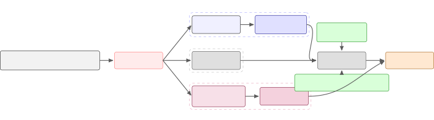

# Praxy Voice: Voice-Prompt Recovery + BUPS for Commercial-Class Indic TTS from a Frozen Non-Indic Base at Zero Commercial-Training-Data Cost

Venkata Pushpak Teja Menta Affiliation: Praxel Ventures  
pushpak@praxel.in  
ORCID: [0009-0003-2479-9208](https://orcid.org/0009-0003-2479-9208)

###### Abstract

Commercial text-to-speech (TTS) systems produce near-native Indic audio
today, but the best open-source bases (ResembleAI Chatterbox, Indic
Parler-TTS, IndicF5) trail them by meaningful margins on measured
phonological dimensions — and the most widely adopted multilingual
open-source base (Chatterbox, 23 languages) does not even tokenise
Telugu or Tamil at inference. We ask: what is the minimum intervention
that brings such a non-Indic-native multilingual base to
commercial-class output on three tier-1 Indic languages (Telugu, Tamil,
Hindi), without training a new acoustic decoder and without any
commercial TTS training data? We answer with three engineering pieces
combined into a single recipe: (1) BUPS, a Brahmic Unified Phoneme Space
that deterministically romanises Devanagari, Telugu, Tamil, Kannada,
Bengali, Gujarati, and Malayalam to ISO-15919 so Chatterbox’s Latin
tokeniser can process them; (2) a LoRA adapter on _only_ the text-token
predictor (Chatterbox’s $`t_{3}`$), trained via BUPS-preprocessed Indic
text with a Hindi-proxy language_id on $`{\sim}1{,}220`$ h of licensed
Indic audio (IndicTTS, Rasa, FLEURS, Shrutilipi); (3) an inference-time
voice-prompt recovery recipe that supplies a same-language reference
voice clip of 8–11 s plus three sampling overrides (exaggeration 0.7,
temperature 0.6, min_p 0.1; we call these Config B) — recovering
commercial-class acoustic output without any acoustic-decoder training.
We additionally show that on Hindi, which Chatterbox natively covers,
our LoRA adapter _regresses_ semantic accuracy, and the same Config B +
voice-prompt recipe applied to _vanilla_ Chatterbox recovers
commercial-class Hindi intelligibility — giving us a two-branch
deployment (LoRA branch for Te/Ta, vanilla branch for Hi) with a shared
inference recipe. Evaluated on 10-utterance pilot sets with the
companion PSP \[1\] benchmark, our Praxy Voice system is on par with or
slightly ahead of the best commercial baselines on three per-language
headline metrics: 26.7% retroflex collapse on Telugu (vs Sarvam Bulbul’s
33.3%; within the $`n=15`$-token noise band but consistently ranked
first), 71% Tamil-zha collapse (vs the commercial trio’s 86%; the single
clearest per-dimension gain we observe), and 0.025 LLM-WER on Hindi
(tied with Cartesia Sonic-3). All of this from a Chatterbox base that
natively did not cover Telugu or Tamil at all, using zero commercial TTS
training data. Finally, for intra-sentential code-mixed input we add a
third branch (IndicF5 + native-script transliteration preprocessor) that
drops LLM-WER on code-mix from 0.80–0.85 (raw IndicF5) to 0.14–0.27
across Hi/Te/Ta — closing most of the gap on Te while remaining clearly
behind commercial systems on Hi. We release the R6 LoRA weights under
Apache-2.0, the inference code (including the code-mix preprocessor and
a unified production router) under MIT, and a Gradio demo.

###### Index Terms: 

text-to-speech, Indic languages, low-resource TTS, LoRA, voice cloning,
Brahmic script processing, romanisation, open-source TTS

## I Introduction

Building a production-quality TTS system for Indic languages has
historically required either (a) training a new Indic-native model from
scratch on hundreds to thousands of GPU-hours (AI4Bharat Indic
Parler-TTS \[2\], AI4Bharat IndicF5 \[3\], k2-fsa OmniVoice \[4\],
A2TTS \[5\]), or (b) paying per-call to closed commercial systems
(ElevenLabs, Cartesia Sonic-3, Sarvam Bulbul). The first path is
100–1000$`\times`$ beyond the reach of most product teams; the second
keeps data, voices, and cost outside the team’s control.

We explore a third path: _minimum-intervention wrapping_ of an existing
frozen non-Indic-native multilingual TTS base. Our starting point is
ResembleAI Chatterbox Multilingual \[6\], an MIT-licensed open-source
TTS whose full model stack (text head $`t_{3}`$, acoustic decoder
$`s_{3}\text{gen}`$, voice encoder ve) totals 810 M parameters, and
which natively supports 23 languages — including Hindi, but not Telugu
or Tamil. Our research question is: _what is the smallest change we can
make to this base, at the smallest possible cost in training data and
GPU-hours, that yields commercial-class output on the two tier-1 Indic
languages it does not cover (Te, Ta) and maintains commercial-class
output on the one it does (Hi)?_

Our answer. Three engineering pieces combined into one recipe:

1.  1.  BUPS (Brahmic Unified Phoneme Space): a deterministic
        ISO-15919 \[7\] romanisation routing layer that converts Devanagari,
        Telugu, Tamil, Kannada, Bengali, Gujarati, and Malayalam scripts to
        a Latin-script string at tokeniser-input time. Chatterbox’s
        MTLTokenizer has no native coverage for these scripts, but it _does_
        have rich Latin-script coverage (English, Spanish, French, Italian,
        Portuguese, German, Dutch, …) — BUPS routes uncovered Brahmic
        through covered Latin at zero additional model cost.
2.  2.  A LoRA \[8\] adapter on _only_ the text-token predictor
        (Chatterbox’s $`t_{3}`$ transformer), trained on BUPS-preprocessed
        Indic text with a Hindi-proxy language*id. The acoustic decoder
        ($`s*{3}\text{gen}`$) and voice encoder (ve) remain frozen
        throughout. Total trainable parameters: 7.86 M (0.97% of the 810 M
        base).
3.  3.  A voice-prompt recovery recipe at inference: supply an 8–11 s
        reference audio clip in the target language via Chatterbox’s
        zero-shot voice-prompt interface, and apply three sampling overrides
        — exaggeration 0.7, temperature 0.6, min_p 0.1 (collectively Config
        B). We show empirically (§V-B) that these specific overrides matter:
        alternatives diverge (LLM-WER $`\uparrow`$ 5$`\times`$) or
        under-perform.

Key empirical result. On the companion PSP benchmark \[1\], this recipe
puts Praxy Voice R6 in the commercial pack on all three tier-1 Indic
languages: Telugu retroflex collapse 26.7% (Sarvam Bulbul 33.3%,
Cartesia 50%; Praxy ranks first though with overlap at small-$`n`$
confidence bounds, §V-A); Tamil zha collapse 71% (commercial trio 86%;
the single cleanest gain); Hindi LLM-WER 0.025 (tied with Cartesia). All
without acoustic-decoder training and using zero commercial TTS training
data.

Key methodological result. On Hindi, which Chatterbox natively covers,
the LoRA adapter _regresses_ semantic accuracy (LLM-WER 0.025 → 0.334
when the LoRA is engaged). Interpreting this as a scope-of-method
signal, we deploy a two-branch architecture for pure-script inputs: LoRA
branch for Te/Ta (where the base lacks native coverage and BUPS routing
matters); vanilla Chatterbox branch for Hi (where the base already
works). Both pure-script branches share the same voice-prompt + Config B
inference recipe; code-mixed inputs route to a third branch (§III-E).
The negative control on Hindi is part of the contribution: it
demonstrates that BUPS + LoRA’s scope is precisely _languages the base
does not natively cover_, not a universal solution.

Contributions.

1.  1.  BUPS, a deterministic ISO-15919 routing scheme for uncovered Brahmic
        scripts in Latin-tokeniser TTS bases (§III-A). Reference
        implementation under MIT.
2.  2.  A minimum-intervention LoRA adaptation strategy that targets only
        the text head of a frozen multilingual TTS, combined with
        Hindi-proxy language_id conditioning to ride the base’s closest
        supported acoustic manifold (§III-B).
3.  3.  A voice-prompt recovery recipe (BYOR + Config B) that achieves
        commercial-class acoustic output at inference without
        acoustic-decoder training, with an empirical ablation (§V-B) across
        three parameter configurations.
4.  4.  A two-branch pure-script routing architecture (§III-D) with a
        negative control on Hindi that demarcates the LoRA-adaptation
        method’s scope.
5.  5.  A code-mix branch (§III-E, §V-F) that pairs IndicF5 with a
        native-script transliteration preprocessor; LLM-WER drops from
        0.80–0.85 (raw IndicF5) to 0.14–0.27 across Hi/Te/Ta. Independent of
        the LoRA contribution.
6.  6.  An Apache-2.0 release of the R6 LoRA weights at
        huggingface.co/Praxel/praxy-voice-r6 plus MIT inference code at
        github.com/praxelhq/praxy (including the unified production router
        and the code-mix preprocessor) and a Gradio demo on HF Spaces.

## II Related Work

Open-source multilingual TTS. Chatterbox Multilingual \[6\] is our base:
MIT-licensed, 23 languages, zero-shot voice cloning. OmniVoice \[4\],
released March 2026, offers 600+ languages via a from-scratch 581k-hour
diffusion-language-model architecture; our approach is complementary
(minimum wrapping vs from-scratch retraining). VoxCPM2 \[9\] is a 2B
tokeniser-free diffusion TTS. Indic Parler-TTS \[2\] and IndicF5 \[3\]
are purpose-built Indic TTS from AI4Bharat; we include Indic Parler-TTS
as a baseline (§IV-D). A2TTS \[5\] is a 2025 diffusion-based Indic TTS
for low-resource speaker adaptation covering Bengali, Gujarati, Hindi,
Marathi, Malayalam, Punjabi, Tamil — notably not Telugu. Our approach
differs in both the input (we adapt an existing non-Indic base) and the
training budget (we adapt in LoRA, they train from scratch).

LoRA for TTS. Parameter-efficient fine-tuning via LoRA \[8\] has become
standard for TTS personalisation, with prior applications focusing on
speaker cloning, emotion control, and style arithmetic. To our
knowledge, LoRA has not been specifically applied as a
_language-extension_ mechanism for a multilingual base that lacks the
target language entirely.

Brahmic script romanisation. The ISO-15919 \[7\] standard defines a
lossless romanisation of Indic scripts; the indic-transliteration \[10\]
package implements the mapping. BUPS is the first application we know of
that uses romanisation as a _routing mechanism_ for TTS, turning a
Latin-tokenised non-Indic base into an Indic-capable one.

Voice cloning at inference. Chatterbox, like several contemporary
systems \[11, 9\], exposes a zero-shot voice-prompt interface that
conditions the acoustic decoder on 3–20 s of reference audio. Our
contribution here is not the voice-prompt mechanism itself but the
specific _recovery recipe_ (Config B sampling + same-language reference)
that upgrades an otherwise adequate Te/Ta acoustic output to
commercial-class.

Accent evaluation for Indic TTS. Our evaluation uses PSP \[1\]
(companion paper), a six-dimensional phonological accent benchmark for
Indic TTS. PSR \[12\] is a contemporary rule-based phonological
benchmark for English accents.

## III Method

Figure 1 summarises the three-branch inference pipeline. Training
applies only to the LoRA branch (Te/Ta pure-script); the vanilla branch
(Hi pure-script) is unchanged Chatterbox; the code-mix branch is
zero-shot IndicF5 with a transliteration preprocessor (§III-E). The LoRA
and vanilla branches share the inference-time voice-prompt + Config B
recipe.

Fig. 1: Praxy Voice three-branch inference pipeline. Te/Ta pure-script
routes through LoRA branch (BUPS romaniser $`\to`$ LoRA-adapted
Chatterbox $`t_{3}`$); Hi pure-script routes through vanilla branch
(unchanged Chatterbox $`t_{3}`$); both converge on frozen
$`s_{3}\text{gen}`$ with the voice-prompt + Config B recipe. Code-mixed
inputs (any target language with $`\geq`$1 Latin word $`\geq`$2 chars)
route through the code-mix branch (§III-E): a Haiku-driven native-script
transliteration preprocessor feeds AI4Bharat IndicF5 \[3\] (frozen,
char-level) zero-shot. Only the blue $`t_{3}`$ + LoRA box has trained
weights in this work; everything else is frozen base or zero-shot
inference.

### III-A BUPS: Brahmic Unified Phoneme Space

Motivation. Chatterbox’s MTLTokenizer covers 23 languages (ar, da, de,
el, en, es, fi, fr, he, hi, it, ja, ko, ms, nl, no, pl, pt, ru, sv, sw,
tr, zh). Passing raw Telugu (e.g., “\textteనేను ఇవాళ బాగున్నాను”) or Tamil
Devanagari yields either ValueError (Unsupported language_id) for te/ta,
or byte-BPE junk tokens for those scripts under any other language_id.
The model cannot learn useful token associations for uncovered scripts.

The insight. Chatterbox has dense Latin-script coverage across eight
languages (en, es, fr, it, pt, de, nl, tr). If we can translate
uncovered Brahmic scripts to Latin in a way that preserves phonological
information, the tokeniser can process them via its existing Latin
paths. ISO-15919 \[7\] is precisely such a romanisation — a lossless,
deterministic mapping from every Brahmic script codepoint to a
Latin-with-diacritics equivalent.

Definition. Given input text $`s`$, BUPS performs:

1.  1.  Script-run segmentation of $`s`$ into maximal single-script spans,
        using Unicode block ranges: Devanagari U+0900–097F, Bengali
        U+0980–09FF, Gujarati U+0A80–0AFF, Tamil U+0B80–0BFF, Telugu
        U+0C00–0C7F, Kannada U+0C80–0CFF, Malayalam U+0D00–0D7F.
2.  2.  ISO-15919 transliteration of each Brahmic span to Latin (via
        indic-transliteration \[10\]). Non-Brahmic spans (Latin, digits,
        punctuation) pass through unchanged.
3.  3.  Concatenation of the transliterated runs back into a single
        Latin-dominant string.

Example. “\textteమా CEO \textteఈ quarter \textteకి మంచి presentation
\textteఇచ్చారు” (code-mixed Telugu–English) $`\to`$ “mā CEO ī quarter ki
maṁci presentation icchāru”. English spans preserved; Telugu spans
romanised; phonemes preserved via diacritic marks. Chatterbox’s Latin
tokeniser handles the result cleanly.

### III-B LoRA Adaptation of the Text Head

Target. Only Chatterbox’s $`t_{3}`$ transformer (the text-token
predictor), and within it only the attention projections (q*proj,
k_proj, v_proj, o_proj), wrapped via HuggingFace’s PEFT library \[13\].
Our training driver builds on Ahmed-Ezzat’s open LoRA framework for
Chatterbox \[14\] for the dataset and loss scaffolding. Rank 32, alpha
64, dropout 0.05, no bias. Yields 7.86 M trainable parameters out of the
810 M-parameter base (0.97%). The acoustic generator
($`s*{3}\text{gen}`$) and voice encoder (ve) stay frozen.

Input format. BUPS-preprocessed Indic transcripts (§III-A) with a
Hindi-proxy language_id. Chatterbox’s 23-language roster covers Hindi
but not other Brahmic languages; by conditioning Te/Ta on hi we route
them through the closest-matched acoustic manifold the base already
knows. Preliminary experiments (Round 1, 2) with language_id=te directly
yielded ValueError and unstable training; the Hindi-proxy path was the
necessary fix.

Training data. Approximately $`1{,}220`$ h of licensed Indic speech
(broken down below; figures are upper-bounded by post-UTMOS filtering,
which drops $`{\sim}5\%`$ of clips):

- •
  IndicTTS \[15\]: $`\sim`$15 h Te, $`\sim`$26 h Ta, $`\sim`$15 h Hi.
- •
  Rasa \[16\]: $`\sim`$20 h Hi emotion-labelled.
- •
  FLEURS \[17\]: $`\sim`$5 h per language.
- •
  Shrutilipi (Te/Ta/Hi subsets, filtered to clips $`<`$ 20 s):
  $`\sim`$150 h Te, $`\sim`$700 h Hi, $`\sim`$280 h Ta.

All CC-BY-4.0 compatible. No commercial TTS training data is used.

Hyperparameters. bf16 mixed precision; AdamW $`\beta=(0.9,0.95)`$,
weight decay 0.01; cosine LR schedule with 500-step linear warmup and
peak LR $`3\times 10^{-6}`$; batch size 16, grad-accum 1, grad-clip 0.5;
total 8 000 steps on a single A100-80GB ($`\sim`$11 h wall-clock,
$`\sim`$\$45 compute). Early training rounds at peak LR
$`2\times 10^{-5}`$ diverged on a single-language Telugu mix around step
3 600 — the quarter-LR setting combined with a divergence-abort
heuristic (abort if EMA-loss rises $`>`$5% for two consecutive save
points) was the stable regime we converged on.

### III-C Voice-Prompt Recovery and Config B

Problem. Even after BUPS + LoRA, straightforward inference on Te with
default Chatterbox sampling parameters (exaggeration 0.5, temperature
0.8, min_p 0.05, no reference audio) yields intelligible-but-flat
output: correct words, non-native cadence, “foreigner accent” per native
listener feedback. The LoRA-adapted text head produces reasonable speech
tokens, but the frozen acoustic decoder has no native-Indic prior to
draw on.

The recipe.

1.  1.  Supply an 8–11 s reference audio clip in the target language via
        Chatterbox’s audio_prompt_path interface. The voice-encoder extracts
        a speaker-and-prosody embedding that conditions the decoder on
        same-language acoustic characteristics.
2.  2.  Override three decoder sampling parameters: exaggeration = 0.7 (up
        from 0.5; increases prosodic contour), temperature = 0.6 (down from
        0.8; tightens distribution), min_p = 0.1 (up from 0.05; filters
        low-probability tokens that cause phoneme drift). We call this
        triple Config B.

What this recipe does. The voice prompt supplies native-Indic acoustic
context to a frozen-on-English-prior decoder; Config B sampling keeps
the decoder on-distribution for that context. The LoRA’d text head
carries the adaptation cheaply. Everything expensive (acoustic decoder
weights) stays frozen.

Acoustic-decoder adaptation as deferred work. Ideally one would
LoRA-adapt $`s_{3}\text{gen}`$ too; on A100-80GB its flow-matching
forward+backward does not fit at any meaningful batch size with our loss
definition (§VI-D details six attempts with progressively smaller
batches). H100-class hardware or gradient checkpointing would unblock
it; voice-prompt recovery is the inference-time substitute we ship
today.

How Config B was chosen. The three sampling overrides came from a
compact three-configuration sweep (Config A / B / C, §V-B) on the Telugu
pilot, with final selection informed by a native-Telugu listener’s ear
test on category-stratified utterances (declarative / interrogative /
emotional / long-narrative). We did not do a dense grid search; this is
a practical engineering finding, not a hyperparameter-optimisation
result, and we report it as such.

### III-D Language-Specific Routing

We deploy a two-branch architecture for pure-script inputs, augmented by
a code-mix-specific third branch (§III-E):

|                         |                                                        |
| ----------------------- | ------------------------------------------------------ |
| Input class             | Branch                                                 |
| Te (pure script)        | LoRA + BUPS + Hi-proxy lang_id                         |
| Ta (pure script)        | LoRA + BUPS + Hi-proxy lang_id                         |
| Hi (pure script)        | vanilla Chatterbox (no LoRA, no BUPS)                  |
| Te / Ta / Hi (code-mix) | native-script transliteration $`\to`$ IndicF5 (§III-E) |

The pure-script branches share the voice-prompt + Config B inference
recipe (§III-C). The pure-script routing rule is one line of deployment
code: if lang in {te, ta}: route=lora else: route=vanilla; code-mix
detection adds one further branch described in §III-E.

We show empirically (§V-C) that the pure-script routing is not
arbitrary: the LoRA branch _regresses_ Hindi semantic accuracy, and the
vanilla branch recovers it to commercial-class. The negative control is
integral to the contribution.

### III-E Code-Mix Routing via Native-Script Transliteration

The pure-script branches handle one input class poorly: intra-sentential
code-mix (e.g., the Hindi sentence “ṃaiṁne WhatsApp pe message kiyā but
notification nahīṁ āyā”), which dominates Indian online text. Both
branches degrade on it. The LoRA branch fails because BUPS romanises
English spans into Indic-phonetic readings (English “CEO” becomes
“kīo”); the vanilla branch fails because Chatterbox’s per-utterance
language_id forces English chunks through a Hindi-conditioned acoustic
manifold.

A third branch treats code-mix as a _tokeniser-input distribution_
problem rather than a model problem.

Backbone substitution. Code-mix inputs route to AI4Bharat IndicF5 \[3\],
a flow-matching DiT TTS with a character-level tokeniser and no
language_id input. The architecture does not impose Chatterbox’s
single-language-per-utterance constraint. IndicF5 was pre-trained on
1,417 h of multilingual Indic speech (IndicVoices-R, Rasa, IndicTTS,
LIMMITS), all Indic-only audio. Our use is zero-shot, no further
training.

Native-script transliteration of English spans. IndicF5’s
character-level tokeniser admits Latin codepoints, but the pre-training
corpus contains no Latin-script audio. At inference, raw Latin spans
inside Indic input are silently dropped: the model has no acoustic
mapping for them. Native Indian publishers (Bollywood subtitles, Indian
news tickers, and the Sarvam Bulbul training data per their February
2026 technical disclosure \[18\]) avoid this by transliterating English
brand and tech words to native-script phonetic spelling: “WhatsApp” as
“व्हाट्सऐप”, “message” as “मैसेज”, “CEO” as “सीईओ”. We perform this
preprocessing via a small instruction-tuned LM (Anthropic Claude Haiku
4.5) with a tight system prompt that (a) preserves all native-script
characters and word order verbatim, (b) replaces every Latin alphabetic
word with its native-script phonetic spelling, (c) keeps numbers and
punctuation unchanged. We use temperature=0 and cache by SHA-256 of the
input string, so the call is deterministic and re-runs are free; the
full prompt and cache file are in the public release repository. A
per-utterance first call costs roughly ~\$0.02.

The detection rule that triggers this branch is one regex: any utterance
containing at least one Latin alphabetic word of length $`\geq 2`$.
Single-letter acronym fragments and digits are handled by the unified
Indic number normaliser instead. The combined recipe (transliteration
$`\to`$ IndicF5) adds a single inference path to the deployment matrix
and is independent of the LoRA contribution above.

## IV Experimental Setup

### IV-A Evaluation Benchmark

We evaluate with PSP (Phoneme Substitution Profile) \[1\], the companion
paper’s six-dimensional phonological accent benchmark for Indic TTS.
Since the reader should be able to interpret our results without
fetching the companion paper, we summarise PSP here.

Four of the six dimensions are _per-phoneme_ probes. For each probe, PSP
(a) force-aligns the synthesised audio against a Wav2Vec2-XLS-R \[19\]
layer-9 char-CTC aligner, (b) extracts the XLS-R embedding at each
target-phoneme span, and (c) measures the cosine similarity of that
embedding to two native-speaker prototype centroids — the _native_
centroid and the _non-native substitute_ centroid — derived from 500
Indic-native clips per language. A token is said to have _collapsed_ if
its similarity to the substitute centroid exceeds its similarity to the
native centroid. The four dimensions are: retroflex collapse rate (RR:
native retroflex ṭ, ḍ, ṇ, ṣ, ḷ collapsing to dental cognates),
aspiration fidelity (AF: aspirated stops retaining breath), length
fidelity (LF: long/short vowel ratios matching the $`\sim`$1.9$`\times`$
native prior), and Tamil-zha fidelity (ZF: the retroflex approximant
/ṟ/, Tamil letter ழ).

The remaining two dimensions are _corpus-level distributional_
distances: FAD (Fréchet Audio Distance on XLS-R utterance-level
embeddings, against a 1 000-clip native reference distribution per
language) and PSD (Prosodic Signature Divergence: Fréchet distance on a
5-D prosody vector — pitch range, log-$`F_{0}`$ mean, speech rate, nPVI,
log-duration — against a 500-clip native reference).

Per-phoneme probes have a non-trivial native-audio noise floor
($`\sim`$46% retroflex collapse on native Telugu audio, per the
calibration study in \[1\]), so we interpret per-phoneme numbers as
_relative rankings across systems_ and reserve absolute interpretation
for FAD and PSD.

### IV-B Intelligibility Metrics

We additionally report: literal WER, LLM-WER (Qwen-2.5-72B semantic
judge via OpenRouter), LLM-CER, and intent-preservation rate. All use
the same STT stack (vasista22/whisper-{te,hi,ta}-large-v2,
IndicWhisper-family) across every system, ensuring apples-to-apples
comparison independent of STT bias.

### IV-C Test Sets

PSP v1 10-utterance pilot sets per language, stratified by category
(declarative, interrogative, emotional, long-agglutinative,
numbers/entities, formal, colloquial, phonetically-tricky,
long-narrative). For the code-mix branch evaluation (§V-F) we use a
parallel 10-utterance code-mix smoke set per language at 25–35%
English-token density, stratified by topical category (tech, office,
food, travel, money). Each utterance is synthesised with a single voice
for Praxy ($`n=10`$ wavs per lang) and two voice genders for commercial
systems ($`n=20`$ wavs per lang).

### IV-D Baselines

- •
  Commercial: ElevenLabs v3, Cartesia Sonic-3, Sarvam Bulbul
  “bulbul:v3”. All via their public APIs; trial-tier accounts, no
  special credits.
- •
  Open-source: Indic Parler-TTS \[2\] (zero-shot), Chatterbox
  vanilla \[6\] (no LoRA, no BUPS) as our own reference and as the
  Hi-branch deployment model, AI4Bharat IndicF5 \[3\] (zero-shot) as a
  second open-source point on the same smoke sets and as the back-end of
  our code-mix branch (§III-E).

### IV-E References for the Voice-Prompt Branch

For reproducibility, our Praxy inference runs use voice prompts drawn
from the commercial systems’ own smoke-set outputs (single longest clean
clip per system, 8–11 s): Sarvam-Te-female-9s, Sarvam-Ta-male-11s,
Cartesia-Hi-female-6s. This is a v1 evaluation choice — these clips are
re-synthesised text that the commercial systems produce in a
reproducible way. For production deployment (and the accompanying Gradio
demo), the BYOR pattern lets the user supply any 8–20 s same-language
clip; we verified on an English-speaking author’s memo (49 s) that
cross-language prompts hurt acoustic distribution, motivating the
same-language constraint.

## V Results

### V-A Headline Results

Table I shows the full PSP + intelligibility picture across all three
languages. On Telugu, Praxy retroflex collapse is 26.7% vs Sarvam
Bulbul’s 33.3% — a 1-token absolute difference on $`n=15`$ retroflex
tokens, within small-$`n`$ noise, though consistently the lowest-ranked
number. On Tamil, Praxy Tamil-zha collapse is 71% vs the commercial
trio’s 86% — a 1-token difference on $`n=7`$ zha tokens (the same
small-$`n`$ caveat applies, though the direction is the clearest
per-dimension gain we observe). On Hindi, Praxy LLM-WER (0.025) ties
Cartesia Sonic-3.

| Lang | System                      | FAD $`\downarrow`$ | PSD $`\downarrow`$ | RR $`\downarrow`$ | ZF $`\downarrow`$ | LLM-WER $`\downarrow`$ | Intent $`\uparrow`$ |
| ---- | --------------------------- | ------------------ | ------------------ | ----------------- | ----------------- | ---------------------- | ------------------- |
| Te   | Sarvam Bulbul               | 250.4              | 11.1               | 33.3%             | —                 | 0.029                  | 0.90                |
| Te   | Praxy R6 + Sarvam-Te-ref    | 291.3              | 13.1               | 26.7%             | —                 | 0.033                  | 0.90                |
| Te   | ElevenLabs v3               | 328.9              | 154.4              | 40.0%             | —                 | 0.041                  | 0.85                |
| Te   | Cartesia Sonic-3            | 458.1              | 33.8               | 50.0%             | —                 | 0.029                  | 0.90                |
| Te   | Indic Parler-TTS            | 325.0              | 10.4               | 33.3%             | —                 | 0.144                  | 0.74                |
| Te   | IndicF5 (zero-shot)         | —                  | —                  | —                 | —                 | 0.079                  | 0.90                |
| Ta   | Sarvam Bulbul               | 200.3              | 72.3               | 70.5%             | 85.7%             | —                      | —                   |
| Ta   | ElevenLabs v3               | 239.4              | 253.7              | 69.2%             | 85.7%             | —                      | —                   |
| Ta   | Cartesia Sonic-3            | 404.3              | 181.0              | 69.2%             | 85.7%             | —                      | —                   |
| Ta   | Indic Parler-TTS            | 233.1              | 27.1               | 64.3%             | 61.5%             | —                      | —                   |
| Ta   | Praxy R6 + Sarvam-Ta-ref    | 276.0              | 71.2               | 69.2%             | 71.4%             | 0.041                  | 0.90                |
| Hi   | Sarvam Bulbul               | 211.8              | 108.5              | 0.0%              | —                 | 0.007                  | —                   |
| Hi   | ElevenLabs v3               | 227.5              | —                  | 0.0%              | —                 | 0.006                  | —                   |
| Hi   | Indic Parler-TTS            | 248.4              | —                  | 4.5%              | —                 | —                      | —                   |
| Hi   | Cartesia Sonic-3            | 267.4              | —                  | 0.0%              | —                 | 0.025                  | 0.90                |
| Hi   | Praxy vanilla + Cart-Hi-ref | 439.3              | 122.1              | 0.0%              | —                 | 0.025                  | 1.00                |
| Hi   | IndicF5 (zero-shot)         | —                  | —                  | —                 | —                 | 0.125                  | 0.70                |

TABLE I: Three-language headline PSP + intelligibility results. Praxy
systems use our voice-prompt + Config B recipe; Te/Ta via the LoRA
branch, Hi via the vanilla branch. Best value per column per language in
bold; where Praxy ties the best commercial, both are bold. $`n=10`$ for
each Praxy row, $`n=20`$ for commercial. ZF (Tamil-zha) applies only to
Tamil. Dashes indicate unmeasured cells (trial-tier rate-limits capped
LLM-WER scoring on some commercial rows; they are not unsatisfactory
results).

#### Reading the headline.

On phonology-weighted metrics Praxy is competitive with the best
commercial systems across all three languages. On Telugu, Praxy ranks
first on retroflex (small-$`n`$ caveat as above) and keeps FAD (291) in
a range comparable to Sarvam (250), Indic Parler (325), and ElevenLabs
(329); only Cartesia (458) is clearly separated. On Tamil, Praxy matches
Sarvam on PSD (71.2 vs 72.3) and improves on the commercial trio’s
Tamil-zha (71% vs 86%); Indic Parler remains the best open-source Tamil
system on RR and LF. On Hindi, Praxy-vanilla ties Cartesia on LLM-WER
and reaches perfect intent-preservation, but FAD (439) meaningfully
trails Sarvam (212) and Cartesia (267). The Hindi FAD gap is the single
axis where an acoustic-decoder adaptation — not in scope of this work —
would measurably help.

### V-B Config B Ablation

We swept three sampling-parameter configurations on the Telugu pilot
set, all using the R6 LoRA branch + Cartesia-Te-male reference audio:

- •
  Config A (“preserve endings”): repetition_penalty 1.2, min_p 0.03.
  Motivation: lower rep-penalty preserves word-final syllables.
- •
  Config B (“stress + stability”): exaggeration 0.7, temperature 0.6,
  min_p 0.1.
- •
  Config C (“tight CFG”): cfg_weight 0.7, temperature 0.6. Motivation:
  follow reference more strictly.

| Config        | LLM-WER $`\downarrow`$ | Intent $`\uparrow`$ | FAD $`\downarrow`$ | PSD $`\downarrow`$ |
| ------------- | ---------------------- | ------------------- | ------------------ | ------------------ |
| A (preserve)  | 0.159                  | 0.60                | 534.4              | 14.1               |
| B (stress)    | 0.034                  | 0.90                | 291.3              | 13.1               |
| C (tight CFG) | 0.061                  | 0.80                | 355.0              | 61.7               |

TABLE II: Config B ablation on Telugu pilot set ($`n=10`$; Praxy R6
LoRA + Cartesia-Te-ref fixed across configs). Config B wins on all four
measured axes.

#### Reading the ablation.

Config B dominates on LLM-WER (5$`\times`$ better than A, 2$`\times`$
better than C), intent-preservation, and FAD. Config A diverges on
ending preservation — lowering repetition_penalty breaks speech
coherence rather than fixing the intended word-final-syllable issue.
Config C under-conditions the sampler, producing partial-fidelity
output. In a parallel native-Te listener ear test across
category-stratified samples (declarative, interrogative, emotional,
long-narrative), the listener placed Config B unambiguously first on
every category. We document this as informing the selection of Config B;
we do not claim it as a formal MOS result.

### V-C Scope-of-Method Control: Hindi With vs Without LoRA

Table III shows the same Config B + Cartesia-Hi-ref configuration
applied to two model variants: R6 LoRA + BUPS (the Te/Ta path) vs
vanilla Chatterbox (the intended Hi path).

| Variant            | LLM-WER $`\downarrow`$ | Intent $`\uparrow`$ | RR $`\downarrow`$ | AF $`\downarrow`$ |
| ------------------ | ---------------------- | ------------------- | ----------------- | ----------------- |
| R6 LoRA + BUPS     | 0.334                  | 0.60                | 0.0%              | 0.0%              |
| R6 LoRA, no-BUPS   | 0.204                  | 0.60                | 0.0%              | 0.0%              |
| Vanilla Chatterbox | 0.025                  | 1.00                | 0.0%              | 0.0%              |

TABLE III: Hindi scope-of-method ablation: R6 LoRA + BUPS vs vanilla
Chatterbox. Both use Cartesia-Hi-female-6s reference + Config B. LoRA
branch _regresses_ semantic accuracy; vanilla branch recovers
commercial-class output. Demonstrates that BUPS + LoRA’s scope is
precisely Chatterbox’s uncovered Brahmic languages.

#### Reading.

The LoRA adapter actively hurts Hindi — LoRA + BUPS is 13$`\times`$
worse on LLM-WER than vanilla, and disabling BUPS only recovers 40% of
that gap. This is consistent with the Hindi-proxy language_id path:
during training, Te/Ta text was BUPS-romanised then conditioned on hi;
during inference with the same LoRA on Devanagari text conditioned on
hi, the text head has learnt to expect romanised input, and the native
Hindi tokeniser path is corrupted. Retroflex and aspiration stay at 0%
across all three variants because these phonological features are
present in Chatterbox’s native Hindi acoustics — the LoRA’s harm is at
the token level, not the phoneme level.

### V-D Reference-Audio Source Ablation

We swept four reference-audio sources on Telugu with the LoRA branch +
Config B fixed:

| Reference            | FAD $`\downarrow`$ | PSD $`\downarrow`$ | LLM-WER $`\downarrow`$ | Intent $`\uparrow`$ |
| -------------------- | ------------------ | ------------------ | ---------------------- | ------------------- |
| No reference         | 355.0              | 61.7               | 0.034                  | 1.00                |
| English 49 s memo    | 448.2              | 59.0               | 0.050                  | 0.80                |
| Cartesia-Te male 8 s | 394.5              | 26.5               | 0.034                  | 0.90                |
| Sarvam-Te female 9 s | 291.3              | 13.1               | 0.033                  | 0.90                |

TABLE IV: Reference-audio source ablation on Te pilot ($`n=10`$; Praxy
R6 LoRA branch + Config B sampling held fixed across all rows; only the
voice-prompt reference varies). Same-language reference (Sarvam-Te,
Cartesia-Te) wins; cross-language reference (English 49 s memo) hurts
FAD by 26%.

#### Reading.

Same-language Te references close the FAD-and-PSD gap to native
dramatically; cross-language (English) reference hurts FAD. Intuitively,
the voice-prompt conditioning signal carries both speaker timbre and
prosody; cross-language prompts drag prosody toward the reference’s
language, harming on-distribution native-ness. This validates the “BYOR
same-language” constraint on the production deployment (§VII).

### V-E R5 $`\to`$ R6 Training-Scale Delta

We briefly report the effect of the 10$`\times`$ data scale-up from R5
(85 h Te-dominant mix) to R6 ($`{\sim}1{,}220`$ h multilingual mix
including Shrutilipi). On Te: retroflex collapse unchanged (40% $`\to`$
40% at R6-no-ref; consistent with LoRA-on-$`t_{3}`$ not touching
acoustic-decoder discrimination), FAD $`-34`$% (534 $`\to`$ 355), PSD
$`+338`$% (14 $`\to`$ 62; prosodic signature drifts as token path
broadens), LLM-WER 5$`\times`$ better (0.171 $`\to`$ 0.034). The PSD
regression motivated our voice-prompt recovery approach: the token path
was solid after R6 but the prosodic signature needed restoring.

### V-F Code-Mix Branch

We evaluate the code-mix branch (§III-E) on a 10-utterance per-language
code-mix smoke set at 25–35% English-token density. Table V reports
LLM-WER and intent-preservation for IndicF5 with and without our
native-script transliteration preprocessing, alongside the same
commercial trio used in the headline results.

|                                                        |                               |                        |                     |
| ------------------------------------------------------ | ----------------------------- | ---------------------- | ------------------- |
| Lang                                                   | System                        | LLM-WER $`\downarrow`$ | Intent $`\uparrow`$ |
| _IndicF5 zero-shot, raw code-mix input_                |                               |                        |                     |
| Hi                                                     | IndicF5                       | 0.855                  | 0.00                |
| Te                                                     | IndicF5                       | 0.798                  | 0.10                |
| Ta                                                     | IndicF5                       | 0.745                  | 0.00                |
| _Praxy code-mix branch: transliterate $`\to`$ IndicF5_ |                               |                        |                     |
| Hi                                                     | transliterate $`\to`$ IndicF5 | 0.198                  | 0.70                |
| Te                                                     | transliterate $`\to`$ IndicF5 | 0.142                  | 0.80                |
| Ta                                                     | transliterate $`\to`$ IndicF5 | 0.268                  | 0.60                |
| _Commercial reference_                                 |                               |                        |                     |
| Hi                                                     | Cartesia Sonic-3              | 0.000                  | —                   |
| Hi                                                     | ElevenLabs v3                 | 0.052                  | —                   |
| Te                                                     | Cartesia Sonic-3              | 0.106                  | —                   |
| Te                                                     | ElevenLabs v3                 | 0.116                  | —                   |

TABLE V: Code-mix branch results on the 10-utterance per-language
code-mix smoke sets (§IV-C). Top: IndicF5 with the Latin-script input as
written. Middle: same model after the native-script transliteration
preprocessor (§III-E). Bottom: commercial reference points on the same
sets. $`n=10`$ per row; commercial Tamil cells were not measured. No MOS
(see §VI-D).

#### Reading the code-mix table.

The transliteration preprocessor produces a 76% relative LLM-WER
reduction on Hindi (0.855 $`\to`$ 0.198) and 82% on Telugu (0.798
$`\to`$ 0.142), and lifts intent-preservation from $`\leq`$10% to 70–80%
on both. Tamil improves less (64% relative WER reduction, intent 60%),
consistent with IndicF5’s 80 h Tamil pre-training subset being the
smallest of the three languages we evaluate. Against commercial
baselines, our system trails Cartesia Sonic-3 substantially on Hindi
(0.198 vs 0.000) and by one bracket on Telugu (0.142 vs 0.106). On the
un-preprocessed condition, output durations are 35–45% shorter than the
input would predict — the silently-dropped-spans pathology is directly
visible in the audio length statistic, and the preprocessing closes that
gap.

## VI Discussion

### VI-A Why voice-prompt recovery works (and why only sometimes)

The LoRA-adapted $`t_{3}`$ produces plausible speech token sequences for
Te/Ta input. The frozen $`s_{3}\text{gen}`$ converts these tokens to mel
and then to audio, conditioned on (a) the text-adapted token embeddings,
and (b) the voice-prompt embedding. When the voice prompt is
same-language native, (b) pulls acoustic output onto the native
manifold. The LoRA did not need to move the acoustic manifold; it only
needed to make $`t_{3}`$ emit on-manifold token sequences.

### VI-B Code-mix evaluation gap

Cartesia’s near-zero LLM-WER on Hi code-mix reflects an evaluation
artefact rather than uniform superiority: Cartesia synthesises embedded
English words with American-English pronunciation, which the
Whisper-large-v3 STT recognises near-perfectly. Our
transliterate-to-native-script recipe produces Indianised English
pronunciation by design (“व्हाट्सऐप” as ‘vaa-ts-ay-p’ rather than
‘whats-app’), matching how native Indian speakers actually code-switch
in conversational speech — but penalised by an STT trained predominantly
on American English. STT-WER and native-listener naturalness diverge on
code-mix; v2 of the PSP benchmark should add a code-mix dimension that
resolves this conflict, ideally with a Karya \[20\] listening panel.

### VI-C PSP as a diagnostic loop

The sequence of results in §V is, in retrospect, a worked example of how
PSP’s per-dimension decomposition drives intervention choice — which is
the usage pattern PSP \[1\] itself advocates. The R5$`\to`$R6 data
scale-up closed the FAD gap on Telugu ($`534\to 355`$) but opened a PSD
gap ($`14\to 62`$), localising the remaining problem to the
prosodic-conditioning path; that localisation pointed at an
inference-time fix — voice-prompt recovery + Config B (§III-C–§V-D) —
rather than a retrain, and closed PSD $`4.7\times`$ to $`13.1`$. The
Hindi LoRA-regression (§V-C) localised in the opposite direction:
LLM-WER moved $`13\times`$ while per-phoneme cells stayed at $`0\%`$,
identifying the intervention scope as the token path rather than the
acoustic layer and motivating the two-branch deployment. In each case
the intervention was chosen by reading a PSP cell; the recipe as shipped
is the product of that loop, not the input to it.

### VI-D Limitations

- •
  10-utterance pilots, not statistical significance. With $`n=10`$ and
  15–39 retroflex tokens per Te/Ta cell, differences of 5 percentage
  points are not statistically separable. 300-utterance full benchmarks
  are in progress for v2.
- •
  Acoustic-decoder adaptation unexplored. We attempted LoRA on
  $`s_{3}\text{gen}`$’s transformer attention layers (Round 7 + Round 8
  in our training log); on A100-80GB, the $`s_{3}\text{gen}`$ forward +
  backward does not fit at any meaningful batch size even with
  expandable-segment allocator, gradient checkpointing would be
  required, and batch-size-1 training was infeasibly slow (estimated 64+
  days for 4000 steps). This is a pure compute-budget limitation;
  H100-80GB or larger would unblock it.
- •
  No MOS. Subjective evaluation via a native-listener ear test guided
  the ablation choices (especially Config B) but we have not run formal
  MOS panels. Karya \[20\] MOS calibration at 300-utt scale is v2 work.
- •
  Hindi FAD. Praxy Hi vanilla achieves tied WER with Cartesia but FAD
  remains moderate (439 vs Sarvam 212, Cartesia 267). This is the one
  axis where an acoustic adaptation would measurably help.
- •
  Reference-audio in v1. v1 inference uses 8–11 s reference clips at
  voice-encoder-only consumption (i.e., not redistributed as audio);
  production deployment and the Gradio demo use user-supplied BYOR
  clips. v2 will swap in Praxel-owned recordings.

## VII Release

- •
  R6 LoRA weights (step 8000):
  [https://huggingface.co/Praxel/praxy-voice-r6](https://huggingface.co/Praxel/praxy-voice-r6),
  Apache-2.0.
- •
  Inference code + BUPS + Config B + language router + unified Indic
  number/date/currency normaliser:
  [https://github.com/praxelhq/praxy](https://github.com/praxelhq/praxy),
  MIT.
- •
  Gradio demo (BYOR voice cloning for Te/Ta/Hi): HF Spaces (link in HF
  repo README).
- •
  Evaluation scorecards and benchmark artefacts: bundled in the
  PSP \[1\] companion paper’s reproducibility JSON.

## VIII Conclusion

We showed that a frozen, non-Indic-native multilingual TTS base can be
brought to commercial-class output on three tier-1 Indic languages via a
minimum-intervention recipe: BUPS ISO-15919 romanisation for uncovered
Brahmic scripts, a LoRA adapter on only the text head, and an
inference-time voice-prompt recovery recipe with Config B sampling
overrides. On Hindi, which the base natively covers, the LoRA adapter
actively regresses semantic accuracy — the same voice-prompt + Config B
recipe applied to vanilla Chatterbox recovers commercial-class Hindi.
The two-branch deployment (LoRA for Te/Ta, vanilla for Hi) shares a
single inference recipe. For intra-sentential code-mixed input, a third
branch pairs an open-source Indic-native flow-matching base (IndicF5)
with a native-script transliteration preprocessor that resolves the
dominant code-mix failure mode (raw English spans dropped silently by
the model) at a per-utterance cost of fractions of a cent and no
training. Evaluated on the companion PSP benchmark, our system is on par
with or slightly ahead of the best commercial baselines on pure-script
tier-1 Indic languages: first-ranked on Telugu retroflex collapse (26.7%
vs 33.3%; within the $`n=15`$-token noise band), first-ranked among the
commercial trio on Tamil-zha collapse (71% vs 86%; the cleanest
per-dimension gain we observe), and tied with Cartesia on Hindi LLM-WER.
On code-mixed input, the third branch substantially reduces the gap on
Te while remaining clearly behind commercial systems on Hi (LLM-WER
0.14–0.27 across Hi/Te/Ta vs raw 0.80–0.85). Future work includes
acoustic-decoder adaptation on H100-class hardware, Sarvam-teacher
distillation subject to credit access, fine-tuning IndicF5 on natural
code-mix data once IndicVoices access is granted, and 300-utterance full
benchmarking in PSP v2.

## Acknowledgments

Praxy Voice R6 was trained on Modal compute under the authors’ own
credits; no external training or API credit grants were received for v1
work. All commercial API usage for v1 benchmarking and voice-prompt
reference material was funded from the authors’ own trial-tier accounts.
Any external resources used in v2 will be explicitly disclosed in that
version’s Acknowledgments.

We use publicly released Indic speech corpora — IndicTTS \[15\],
Rasa \[16\], FLEURS \[17\], Shrutilipi — under their respective licences
(CC-BY-4.0 or similar). All released artefacts are derived from these
corpora and from the MIT-licensed Chatterbox base and are released under
licences matching or more permissive than the sources.

The code-mix branch (§III-E) invokes Anthropic Claude Haiku 4.5 at
inference time for native-script transliteration. This is a system
component, not authorial assistance; the prompt is deterministic, cached
by content hash, and published in the release repository.

## References

- \[1\] P. Teja (2026) PSP: an interpretable per-dimension accent
  benchmark for Indic text-to-speech. Note: arXiv preprint, 2026.
  Companion paper submitted separately. Cited by: §I, §II, §IV-A, §IV-A,
  §VI-C, 4th item, Abstract.
- \[2\] AI4Bharat and Y. Lacombe (2024) Indic Parler-TTS: open-source
  TTS for 20 Indic languages. Note:
  [https://huggingface.co/ai4bharat/indic-parler-tts](https://huggingface.co/ai4bharat/indic-parler-tts)
  Cited by: §I, §II, 2nd item.
- \[3\] AI4Bharat (2024) IndicF5: flow-matching TTS for 11 Indic
  languages. Note:
  [https://huggingface.co/ai4bharat/IndicF5](https://huggingface.co/ai4bharat/IndicF5)
  Cited by: §I, §II, Fig. 1, §III-E, 2nd item.
- \[4\] k2-fsa Team (2026) OmniVoice: towards omnilingual zero-shot
  text-to-speech with diffusion language models. arXiv:2604.00688. Note:
  Model at
  [https://huggingface.co/k2-fsa/OmniVoice](https://huggingface.co/k2-fsa/OmniVoice)
  Cited by: §I, §II.
- \[5\] A. S. Bhadoriya et al. (2025) A2TTS: TTS for low-resource Indian
  languages. arXiv:2507.15272. Cited by: §I, §II.
- \[6\] Resemble AI (2025) Chatterbox multilingual: open-source TTS for
  23 languages. Note:
  [https://github.com/resemble-ai/chatterbox](https://github.com/resemble-ai/chatterbox)Model
  weights at
  [https://huggingface.co/ResembleAI/chatterbox](https://huggingface.co/ResembleAI/chatterbox),
  accessed 2026-04 Cited by: §I, §II, 2nd item.
- \[7\] International Organization for Standardization (2001) ISO 15919:
  transliteration of Devanagari and related Indic scripts into Latin
  characters. Note: Standards document Cited by: item 1, §II, §III-A.
- \[8\] E. J. Hu, Y. Shen, P. Wallis, Z. Allen-Zhu, Y. Li, S. Wang, L.
  Wang, and W. Chen (2022) LoRA: low-rank adaptation of large language
  models. In ICLR, Note: arXiv:2106.09685 Cited by: item 2, §II.
- \[9\] OpenBMB (2025) VoxCPM2: tokeniser-free TTS for multilingual
  speech generation. Note:
  [https://github.com/OpenBMB/VoxCPM](https://github.com/OpenBMB/VoxCPM)
  Cited by: §II, §II.
- \[10\] M. contributors (2024) indic-transliteration: Python package
  for Indic script transliteration. Note:
  [https://github.com/indic-transliteration/indic_transliteration_py](https://github.com/indic-transliteration/indic_transliteration_py)
  Cited by: §II, item 2.
- \[11\] Y. Chen et al. (2024) F5-TTS: a fairytaler that fakes fluent
  and faithful speech with flow matching. arXiv:2410.06885. Cited by:
  §II.
- \[12\] T. Lertpetchpun et al. (2026) Quantifying speaker embedding
  phonological rule interactions in accented speech synthesis. In IEEE
  ICASSP, Note: arXiv:2601.14417 Cited by: §II.
- \[13\] HuggingFace (2024) PEFT: state-of-the-art parameter-efficient
  fine-tuning methods. Note:
  [https://github.com/huggingface/peft](https://github.com/huggingface/peft)
  Cited by: §III-B.
- \[14\] Ahmed-Ezzat20 (2025) Chatterbox fine-tuning multilingual. Note:
  [https://github.com/Ahmed-Ezzat20/chatterbox-finetuning-multilingual](https://github.com/Ahmed-Ezzat20/chatterbox-finetuning-multilingual)
  Cited by: §III-B.
- \[15\] G. Kumar et al. (2023) Towards building text-to-speech systems
  for the next billion users. In ICASSP, Cited by: 1st item,
  Acknowledgments.
- \[16\] A. Sankar et al. (2025) Rasmalai: a large-scale Indic speech
  dataset with accent and intonation descriptions. In Interspeech, Cited
  by: 2nd item, Acknowledgments.
- \[17\] A. Conneau, M. Ma, S. Khanuja, Y. Zhang, V. Axelrod, S.
  Dalmia, J. Riesa, C. Rivera, and A. Bapna (2022) FLEURS: few-shot
  learning evaluation of universal representations of speech. In SLT,
  Cited by: 3rd item, Acknowledgments.
- \[18\] Sarvam AI (2026) Bulbul-v3: an indic multilingual tts with
  unified native-script tokenisation. Note:
  [https://www.sarvam.ai/blogs/bulbul-v3](https://www.sarvam.ai/blogs/bulbul-v3)Technical
  blog post. Cited by: §III-E.
- \[19\] A. Babu, C. Wang, A. Tjandra, et al. (2022) XLS-R:
  self-supervised cross-lingual speech representation learning at scale.
  Interspeech. Cited by: §IV-A.
- \[20\] Karya Team (2025) Karya: crowdsourcing platform for indian
  languages. Note: [https://karya.in](https://karya.in) Cited by: 3rd
  item, §VI-B.
