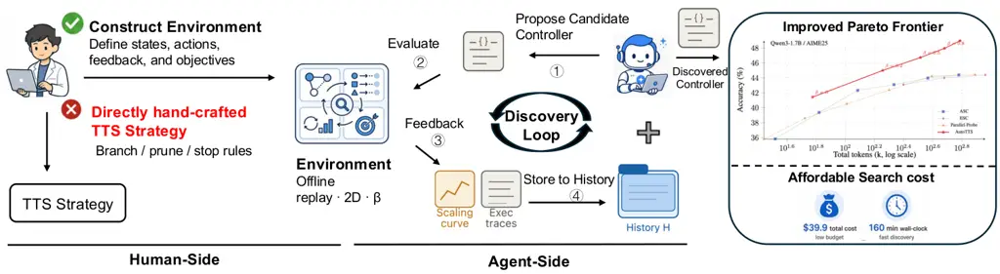
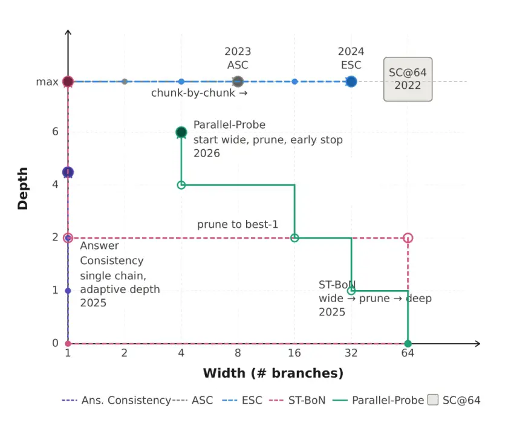

# LLMs Improving LLMs: Agentic Discovery for Test-Time Scaling

Tong Zheng Affiliation: UMD    Haolin Liu Affiliation: UVA    Chengsong
Huang Affiliation: WUSTL    Huiwen Bao    Sheng Zhang Affiliation: UMD
   Rui Liu Affiliation: UMD    Runpeng Dai Affiliation: UNC    Ruibo
Chen Affiliation: UMD    Chenxi Liu Affiliation: UMD    Tianyi Xiong
Affiliation: UMD    Xidong Wu Affiliation: Google    Hongming Zhang Heng
Huang Affiliation: UMD Affiliation: Meta

###### Abstract

Test-time scaling (TTS) has become an effective approach for improving
large language model performance by allocating additional computation
during inference. However, existing TTS strategies are largely
hand-crafted: researchers manually design reasoning patterns and tune
heuristics by intuition, leaving much of the computation-allocation
space unexplored. We propose an environment-driven framework, AutoTTS,
that changes what researchers design: from individual TTS heuristics to
environments where TTS strategies can be discovered automatically. The
key to AutoTTS lies in environment construction: the discovery
environment must make the control space tractable and provide cheap,
frequent feedback for TTS search. As a concrete instantiation, we
formulate width–depth TTS as controller synthesis over pre-collected
reasoning trajectories and probe signals, where controllers decide when
to branch, continue, probe, prune, or stop and can be evaluated cheaply
without repeated LLM calls. We further introduce beta parameterization
to make the search tractable and fine-grained execution trace feedback
to improve discovery efficiency by helping the agent diagnose why a TTS
program fails. Experiments on mathematical reasoning benchmarks show
that the discovered strategies improve the overall accuracy–cost
tradeoff over strong manually designed baselines. The discovered
strategies generalize to held-out benchmarks and model scales, while the
entire discovery costs only \$39.9 and 160 minutes. Our data, and code
will be open-source at
[https://github.com/zhengkid/AutoTTS](https://github.com/zhengkid/AutoTTS).



Figure 1: Overview of our Auto-TTS framework. Unlike the traditional
workflow of manually designing TTS strategies, Auto-TTS shifts the human
role from directly hand-crafting branching, pruning, and stopping
heuristics to constructing environments by defining states, actions,
feedback, and objectives. Given the constructed environment, an explorer
LLM iteratively proposes candidate controllers, evaluates them in the
offline replay environment, receives feedback from scaling curves and
execution traces, and uses the accumulated history to refine future
proposals. The right panel shows an example evaluation on Qwen-1.7B and
AIME25, where the discovered controller improves the accuracy–cost
Pareto frontier over hand-crafted baselines with an affordable one-time
search cost.

## 1 Introduction



Figure 2: Existing TTS algorithms as special cases of the width–depth
control space. Each algorithm traces a distinct path: SC@64 \[1\]
occupies a fixed full-budget corner; ASC \[2\] and ESC \[3\] adapt only
along the width axis at max depth; Answer Consistency \[4\] adapts only
along the depth axis on a single chain; ST-BoN \[5\] expands wide,
prunes to one branch, then deepens; Parallel-Probe \[6\] starts wide and
progressively prunes while deepening.

Test-time scaling (TTS) \[7, 8, 9\] has emerged as a powerful paradigm
for improving large language model performance by allocating additional
computation during inference. However, performance depends not just on
the amount of computation used, but on how it is allocated \[7\] and
existing strategies for doing so are largely hand-crafted: researchers
manually hypothesize heuristics for when to branch, deepen, probe,
prune, or stop reasoning trajectories \[10, 11, 12, 6, 13, 14\],
implement them, and tune thresholds by intuition.

Looking back at the development of TTS strategies reveals a valuable
perspective. Although existing methods differ substantially in form,
many of them can be interpreted as manually specified policies within
some underlying computation-allocation space. A simple example is the
width–depth space, where width denotes how many reasoning branches are
explored and depth denotes how far each branch is developed, as
illustrated in Figure 2. Under this view, several representative methods
correspond to different trajectories through the space: some expand
width by sampling more reasoning branches \[1, 2, 3\]; some increase
depth by extending reasoning trajectories \[9, 14\]; and others
introduce adaptive stopping, pruning, or selection rules to move through
the space more selectively \[15, 13, 4, 6\]. Notably, this perspective
is not intended to reduce all TTS algorithms to a two-dimensional
abstraction, as many methods involve richer structures such as tree
search \[16, 17\] or verifier-guided refinement \[7, 18, 19\]. Rather,
the case of width–depth space reveals that many TTS strategies can be
seen as hand-designed special cases within a structured control space.

This perspective suggests a fundamental reframing of the problem. In
this work, we propose AutoTTS, an environment-driven paradigm for
automatic TTS strategy discovery (Figure 1). Instead of hand-crafting
individual branching, pruning, and stopping heuristics, AutoTTS shifts
the human role to constructing discovery environments, where humans
define the control space through states, actions, feedback, and
objectives, and agents search within this space for effective allocation
policies.

As a proof-of-concept instantiation, we formulate width–depth test-time
scaling (Figure 2) as controller synthesis in an offline replay
environment. For each problem, we pre-collect reasoning trajectories and
intermediate probe signals, allowing a controller to replay decisions
over when to branch, continue, probe, prune, or stop. The controller
observes active branches, their depths, revealed probe outputs, and the
remaining budget, and is evaluated by the resulting accuracy–cost
tradeoff. Since evaluation reuses pre-collected trajectories, candidate
controllers can be assessed cheaply and deterministically without
repeatedly invoking the base LLM. However, effective discovery faces two
additional challenges: automatically discovered controllers tend to
introduce excessive hyperparameters that makes the search space large
and difficult to navigate within a limited number of rounds, and scalar
accuracy–cost feedback alone is not sufficient to tell the explorer why
a controller fails.

To make controller search tractable, we introduce beta parameterization,
where each controller exposes only one scalar trade-off parameter
$`\beta`$ and derives all internal hyperparameters deterministically
from it, reducing overfitting to the search set. Additionally, we
address the feedback issue by logging execution traces that expose how
each controller allocates computation over time, enabling the explorer
to diagnose failure modes and propose targeted improvements.

Experiments on mathematical reasoning benchmarks show that AutoTTS
discovers controllers that improve the accuracy–cost Pareto frontier
over strong hand-crafted baselines. The discovered controllers
generalize from the search benchmark to held-out benchmarks and across
model scales, while the entire discovery process remains affordable due
to fixed replay. These results suggest that environment-driven discovery
offers a scalable and reusable alternative to manually designing TTS
strategies, and that the right place to invest human effort is in
environment design, not strategy design.

## 2 Test-Time Scaling as Algorithmic Search

We consider adaptive test-time algorithms that allocate inference budget
across multiple reasoning branches. For each question $`q`$, a
controller may create, extend, probe, and prune branches before
aggregating the explored prefixes into a final answer, covering
strategies such as best-of-$`N`$, self-consistency, early stopping, and
adaptive branching. Each branch $`i`$ produces prefixes
$`z_{i,1},z_{i,2},\ldots`$, where $`z_{i,k}`$ is obtained after $`k`$
fixed-length generation intervals. Each prefix induces an intermediate
answer $`\omega_{i,k}`$ (i.e., the answer that would be produced from
the current prefix), which is observed only if the controller explicitly
takes a probing action at that branch.

Since we consider a unit generation as an interval with a fixed token
length, we measure computation in units of intervals. At decision step
$`t`$, let $`m_{t}\in\mathbb{Z}_{\geq 0}`$ denote the number of branches
instantiated so far, and use the convention
$`[m_{t}]=\{1,\ldots,m_{t}\}`$, with $`[0]=\emptyset`$. The state is
$`s_{t}=(q,m_{t},I_{t},\ell_{t},Z_{t},\Omega_{t})`$, where
$`q\in\mathcal{Q}`$ is the question, $`I_{t}\subseteq[m_{t}]`$ is the
set of currently active branches,
$`\ell_{t}=(\ell_{t,i})_{i\in[m_{t}]}`$ records the current depth of
every instantiated branch, $`Z_{t}=(Z_{t,i})_{i\in[m_{t}]}`$ records the
generated prefixes, and $`\Omega_{t}`$ is the set of probe feedback
revealed so far. For every instantiated branch $`i\in[m_{t}]`$,
$`\ell_{t,i}\geq 1`$ denotes how many fixed-length generation intervals
have been generated on that branch, and
$`Z_{t,i}=(z_{i,1},\ldots,z_{i,\ell_{t,i}})`$ contains the prefixes
generated on branch $`i`$ up to its current depth. For a pruned branch
$`i\in[m_{t}]\setminus I_{t}`$, $`\ell_{t,i}`$ and $`Z_{t,i}`$ record
the depth and generated prefixes at which it was pruned. The revealed
feedback set satisfies
$`\Omega_{t}\subseteq\{(i,k,\omega_{i,k}):i\in[m_{t}],\ 1\leq k\leq\ell_{t,i}\}`$.
Unrevealed probe outputs are not part of the controller state. The
computation cost of a state is
$`\mathrm{Cost}(s_{t})=\sum_{i=1}^{m_{t}}\ell_{t,i}+\kappa_{\mathrm{probe}}|\Omega_{t}|`$,
where $`\kappa_{\mathrm{probe}}\geq 0`$ is the cost of reading one probe
signal. In settings where probing is treated as free relative to
generation, we set $`\kappa_{\mathrm{probe}}=0`$.

Given $`s_{t}=(q,m_{t},I_{t},\ell_{t},Z_{t},\Omega_{t})`$, the
admissible action set is
$`\mathcal{A}(s_{t})=\{\texttt{BRANCH}\}\cup\{\texttt{CONTINUE}(i):i\in I_{t}\}\cup\{\texttt{PROBE}(i):i\in I_{t},\ \nexists\omega\ \mathrm{s.t.}\ (i,\ell_{t,i},\omega)\in\Omega_{t}\}\cup\{\texttt{PRUNE}(i):i\in I_{t}\}\cup\{\texttt{ANSWER}\}`$.
Here BRANCH creates a new branch $`m_{t}+1`$ and advances it from the
question to the end of the first interval. $`\texttt{CONTINUE}(i)`$
advances branch $`i`$ by one fixed-length generation interval.
$`\texttt{PROBE}(i)`$ reveals the current probe signal
$`\omega_{i,\ell_{t,i}}`$ without advancing the branch.
$`\texttt{PRUNE}(i)`$ removes branch $`i`$ from the active set, while
keeping its current information. ANSWER terminates inference and invokes
the aggregation rule. An aggregation rule $`\operatorname{Agg}`$ takes a
state as input and outputs the final answer.

Formally, the initial state is
$`s_{0}=(q,0,\emptyset,\emptyset,\emptyset,\emptyset)`$. If
$`a_{t}=\texttt{BRANCH}`$, a new branch $`m_{t}+1`$ is instantiated and
advanced to the first probe point, producing prefix $`z_{m_{t}+1,1}`$.
Then $`m_{t+1}=m_{t}+1`$, $`I_{t+1}=I_{t}\cup\{m_{t}+1\}`$,
$`\ell_{t+1}=(\ell_{t},1)`$, $`Z_{t+1}=(Z_{t},(z_{m_{t}+1,1}))`$, and
$`\Omega_{t+1}=\Omega_{t}`$. If $`a_{t}=\texttt{CONTINUE}(i)`$, branch
$`i`$ is advanced by one interval, producing prefix
$`z_{i,\ell_{t,i}+1}`$. Then $`m_{t+1}=m_{t}`$, $`I_{t+1}=I_{t}`$,
$`\Omega_{t+1}=\Omega_{t}`$,
$`\ell_{t+1,j}=\ell_{t,j}+\mathbf{1}\{j=i\}`$ for all $`j\in[m_{t}]`$,
$`Z_{t+1,i}=(Z_{t,i},z_{i,\ell_{t,i}+1})`$, and $`Z_{t+1,j}=Z_{t,j}`$
for all $`j\neq i`$. If $`a_{t}=\texttt{PROBE}(i)`$, then
$`m_{t+1}=m_{t}`$, $`I_{t+1}=I_{t}`$, $`\ell_{t+1}=\ell_{t}`$,
$`Z_{t+1}=Z_{t}`$, and
$`\Omega_{t+1}=\Omega_{t}\cup\{(i,\ell_{t,i},\omega_{i,\ell_{t,i}})\}`$.
If $`a_{t}=\texttt{PRUNE}(i)`$, then $`m_{t+1}=m_{t}`$,
$`I_{t+1}=I_{t}\setminus\{i\}`$, $`\ell_{t+1}=\ell_{t}`$,
$`Z_{t+1}=Z_{t}`$, and $`\Omega_{t+1}=\Omega_{t}`$. If
$`a_{T}=\texttt{ANSWER}`$ at time $`T`$, the episode terminates and the
final answer is produced by $`\hat{y}=\operatorname{Agg}(s_{T})`$.

Our goal is to find a code-defined policy $`\pi`$ that maps a state and
a hyperparameter $`\beta`$ to a distribution over admissible atomic
actions $`\pi(\cdot\mid s,\beta)\in\Delta(\mathcal{A}(s))`$. Here,
$`\beta`$ specifies the tunable hyperparameters of the algorithm. We
also allow each controller to include its own terminal aggregation rule
$`\operatorname{Agg}_{\pi,\beta}`$. For a question $`q`$, let
$`\tau=(s_{0},a_{0},s_{1},a_{1},\ldots,s_{T})\sim P_{\pi,\beta}(\cdot\mid q)`$
denote the execution trajectory induced by running $`(\pi,\beta)`$ from
the initial state $`s_{0}=(q,0,\emptyset,\emptyset,\emptyset)`$ until
ANSWER is selected at time $`T`$. The trajectory distribution
$`P_{\pi,\beta}(\cdot\mid q)`$ includes the randomness from the policy,
the generation process, and any stochastic probe signals. At the
terminal state $`s_{T}`$, the final answer and computation cost are
$`\hat{y}_{\pi,\beta}(\tau)=\operatorname{Agg}_{\pi,\beta}(s_{T}),C(\tau)=\operatorname{Cost}(s_{T}).`$
For a task distribution $`\mathcal{D}`$ over question-answer pairs
$`(q,y)`$, we choose $`(\pi,\beta)`$ to maximize accuracy while
controlling computation cost. With trade-off parameter $`\gamma`$, the
objective is

```math
\displaystyle\max_{(\pi,\beta)}\mathbb{E}_{(q,y)\sim\mathcal{D},\ \tau\sim P_{\pi,\beta}(\cdot\mid q)}\left[\mathbf{1}\{\hat{y}_{\pi,\beta}(\tau)=y\}-\gamma C(\tau)\right].
```

The discovery loop searches over code-defined controllers. Each
candidate is run on every question to obtain an execution trajectory
$`\tau`$; we compare its final answer with the ground truth and record
its computation cost. The resulting execution histories are stored in
memory and used to guide subsequent rounds of policy search. Finally, we
output the code-defined policy with the best accuracy–cost trade-off.

## 3 AutoTTS: Environment-Driven Discovery

We instantiate AutoTTS as a concrete discovery pipeline for the
objective in Section 2. The key challenge is making the search over
code-defined policies $`\pi(\cdot\mid s,\beta)`$ tractable: evaluating a
candidate policy online requires generating token interval $`z_{i,k}`$
and probing answer $`\omega_{i,k}`$ on demand, which is prohibitively
expensive at search time. We address this challenge through three
complementary design choices: an offline replay environment that
eliminates repeated LLM calls during evaluation (Section 3.1), beta
parameterization that prevents overfitting to the search set
(Section 3.3), and execution trace feedback that enables the agent to
diagnose failure modes rather than relying on scalar outcomes alone
(Section 3.2).

### 3.1 Replay Environment Construction

The central challenge in evaluating candidate controllers online is that
each evaluation requires invoking the base LLM to generate reasoning
trajectories on demand, which is prohibitively expensive at search time.
To address this, we construct an offline replay environment that moves
all LLM calls prior to the discovery process, making controller
evaluation deterministic and cheap.

#### Offline data collection.

Following the data collection protocol of Parallel-Probe \[6\], for each
question $`q\in\mathcal{Q}`$, we pre-collect $`N`$ independent reasoning
trajectories from the base LLM, each segmented into fixed-length
intervals of $`\Delta`$ tokens. This directly instantiates the branch
prefixes $`z_{i,1},z_{i,2},\ldots`$ and probe signals
$`\omega_{i,1},\omega_{i,2},\ldots`$ introduced in Section 2, with all
data stored offline before any discovery begins. Each controller
decision is then executed against this pre-collected data rather than
invoking the LLM, making repeated controller evaluation affordable.

#### Evaluation via offline replay.

To evaluate each controller for a given $`\beta`$, we run it on each
question in $`\mathcal{Q}_{\mathrm{search}}`$: at each state $`s_{t}`$
it selects an action from $`\mathcal{A}(s_{t})`$ and advances until
Answer action is taken. Because all branch prefixes and probe signals
are pre-collected offline, each action reads deterministically from this
stored data rather than invoking the LLM—for instance, a Probe action on
branch $`i`$ at depth $`k`$ simply retrieves the pre-collected signal
$`\omega_{i,k}`$ at zero generation cost. This makes the entire
$`\beta`$ sweep affordable without any additional LLM calls.

### 3.2 Discovery Loop

We partition $`\mathcal{Q}`$ into a search set
$`\mathcal{Q}_{\mathrm{search}}`$ and a held-out evaluation set
$`\mathcal{Q}_{\mathrm{eval}}`$. AutoTTS discovers an effective
controller through a multi-round loop: each round, an explorer LLM
(Claude Code) reads the accumulated history $`\mathcal{H}`$ and proposes
an improved controller by directly editing the code; the controller is
then evaluated on $`\mathcal{Q}_{\mathrm{search}}`$ and the results are
appended to $`\mathcal{H}`$.

#### Agent-driven proposal.

The explorer reads $`\mathcal{H}`$—which stores all previously proposed
controller implementations, their accuracy–cost outcomes, and execution
traces—and is prompted to analyse what went wrong in prior proposals,
and propose a new controller that improves accuracy while reducing token
usage (full prompt in Appendix C).

#### History Design.

While scalar outcomes such as accuracy and token usage provide a coarse
signal of whether a proposed controller is good enough, they reveal
little about why a controller fails. To address this limitation, we
augment the history with the full decision-making trajectories that the
controller executed during the replay environment. For each round, we
sweep across multiple betas and record the resulting scaling curve as
the scalar component; the trajectory component then supplies
fine-grained behavioral evidence, enabling the agent to diagnose failure
modes and propose a more targeted controller in the next round. This
design is consistent with the finding in \[20\] that fine-grained
execution feedback improves agentic discovery for harness engineering.

#### Controller selection.

After $`R`$ rounds, we select the controller and $`\beta`$ value that
achieves the highest accuracy on $`\mathcal{Q}_{\mathrm{search}}`$.

### 3.3 Beta Parameterization for Tractable Search

In our preliminary experiments, we empirically find that agents tend to
propose TTS controllers with a large number of hyperparameters, up to 10. With only five discovery rounds, navigating this high-dimensional
space causes the agent to collapse onto extreme solutions—such as overly
aggressive pruning thresholds—that happen to minimize token cost on the
search set but fail to represent robust allocation strategies.

To mitigate this, we propose beta parameterization: each controller must
expose only a single hyperparameter $`\beta`$ and implement a map
function from $`\beta`$ to all internal hyperparameters. We further
require this map to be monotone, such that larger $`\beta`$ corresponds
to larger token budget. This collapses the search space to a
one-dimensional sweep and prevents the agent from discovering sharp,
search-set-specific thresholds. Notably, the map function is produced
directly by the coding agent.

## 4 Experimental Setup

#### Experimental Protocol.

All experiments use offline replay environments, each built from a
specific (model, benchmark) pair across four Qwen3 models (0.6B, 1.7B,
4B, 8B) \[21\]. Following Parallel-Probe \[6\], we pre-sample 128
reasoning trajectories per (model, problem) pair at temperature 0.7 with
a probing interval of 500 tokens to construct the replay matrix. To
reduce variance, each controller is evaluated 64 times independently by
randomly sampling a subset of trajectories from the pre-sampled pool of
128, and the results are averaged. For discovery, we use AIME24 as
$`\mathcal{Q}_{\text{search}}`$ and construct
$`\mathcal{E}_{\text{search}}`$ as the union of AIME24 environments
across all four models. The discovery loop runs for five rounds with
Claude Code as the agent, and the final controller is selected as the
one achieving the highest accuracy on $`\mathcal{E}_{\text{search}}`$.
The discovered controller (Appendix D) is fixed and evaluated on
held-out environments from AIME25 and HMMT25, which are never used
during discovery or selection.

#### Baselines.

To demonstrate the effectiveness of our proposed discovery framework, we
compare the discovered algorithm with several representative handcrafted
test time scaling methods. 1) Self-Consistency (SC@64) \[1\]: A vanilla
parallel reasoning approach that first samples 64 reasoning trajectories
and performs majority voting to obtain the final answer; 2) ASC \[2\]: A
parallel sampling approach that samples trajectories one by one and stop
until reaching a pre-defined threshold. We follow the original setting
with threshold 0.95; 3) ESC \[3\]: A chunk-based hybrid approach that
generates trajectories in parallel and terminates early when answer
stability is detected within a sliding window. We use a chunk size of 8
and 4) Parallel-Probe \[6\]: A recent efficient parallel reasoning
approach that leverages cross-branch information to dynamically decide
when to stop reasoning, prune unpromising branches, or continue
computation.

#### Metrics.

We report both task accuracy and tokens that measure the total number of
tokens consumed across all used branches.

## 5 Results and Analysis

### 5.1 Main Results

Method Type AIME24 (search) AIME25 (held-out) HMMT25 (held-out) Avg.
(held out) Acc. $`\uparrow`$ Tokens $`\downarrow`$ Acc. $`\uparrow`$
Tokens $`\downarrow`$ Acc. $`\uparrow`$ Tokens $`\downarrow`$ Acc.
$`\uparrow`$ Tokens $`\downarrow`$ Base Model: Qwen3-0.6B SC @ 64
Handcrafted 21.4 1008.6k 28.9 890.5k 18.1 937.8k 23.2 914.2k ASC
Handcrafted 21.4 805.5k 28.9 653.8k 18.1 580.8k 23.2 617.3k ESC
Handcrafted 21.4 986.7k 28.9 868.8k 18.1 923.9k 23.2 896.4k
Parallel-Probe Handcrafted 21.8 773.8k 29.7 697.8k 18.5 734.5k 24.1
716.2k AutoTTS ($`\beta`$=0.5) Discovered 19.2 283.6k 28.6 250.3k 14.9
257.6k 21.8 254.0k AutoTTS ($`\beta`$=1.0) Discovered 20.9 542.2k 31.1
474.7k 18.0 487.1k 24.6 480.9k Base Model: Qwen3-1.7B SC @ 64
Handcrafted 72.5 1025.8k 44.4 1054.1k 24.2 1132.9k 34.3 1093.5k ASC
Handcrafted 72.3 482.6k 44.4 600.9k 24.2 586.3k 34.3 593.6k ESC
Handcrafted 72.5 909.2k 44.4 913.8k 24.2 1014.2k 34.3 964.3k
Parallel-Probe Handcrafted 68.1 748.5k 44.7 775.8k 22.6 860.2k 33.7
818.0k AutoTTS ($`\beta`$=0.5) Discovered 68.5 276.3k 46.7 327.9k 30.5
359.1k 38.6 343.5k AutoTTS ($`\beta`$=1.0) Discovered 70.4 499.1k 49.0
612.6k 32.1 679.6k 40.6 646.1k Base Model: Qwen3-4B SC @ 64 Handcrafted
80.0 886.8k 76.6 1088.1k 43.6 1168.3k 60.1 1128.2k ASC Handcrafted 80.1
175.7k 76.4 277.3k 44.0 388.9k 60.2 333.1k ESC Handcrafted 80.0 528.9k
76.6 793.3k 43.6 990.2k 60.1 891.8k Parallel-Probe Handcrafted 79.7
688.9k 76.1 806.0k 44.7 872.3k 60.4 839.2k AutoTTS ($`\beta`$=0.5)
Discovered 82.0 236.7k 73.8 332.3k 45.7 365.0k 59.8 348.7k AutoTTS
($`\beta`$=1.0) Discovered 83.5 424.9k 74.4 610.4k 46.5 686.8k 60.5
648.6k Base Model: Qwen3-8B SC @ 64 Handcrafted 80.4 910.8k 76.7 1124.4k
48.9 1267.0k 62.8 1195.7k ASC Handcrafted 80.4 226.0k 76.7 406.2k 48.8
565.1k 62.8 485.7k ESC Handcrafted 80.4 459.4k 76.7 793.1k 48.9 1062.1k
62.8 927.6k Parallel-Probe Handcrafted 81.5 730.8k 76.9 846.7k 47.1
897.2k 62.0 872.0k AutoTTS ($`\beta`$=0.5) Discovered 84.3 255.3k 74.1
361.2k 48.1 396.7k 61.1 379.0k AutoTTS ($`\beta`$=1.0) Discovered 85.8
467.4k 75.8 672.4k 49.5 749.1k 62.7 710.8k

Table 1: Accuracy and total tokens. AIME24 (search) is used for
controller discovery; AIME25 and HMMT25 are held-out.

Table 1 shows the performance of both handcrafted baselines and the
discovered controllers on AIME24 (search), AIME25 (held-out), and HMMT25
(held-out) across four models. We can see that the discovered
controllers achieve a better accuracy–cost tradeoff in most settings.
Generally, the discovered controller, optimized solely on AIME24,
generalizes to held-out benchmarks AIME25 and HMMT25, outperforming all
handcrafted baselines in three out of four models on average, and
remaining competitive on Qwen3-8B (62.7 vs. 62.8 for SC@64).
Furthermore, the controller discovered by AutoTTS achieves better
accuracy–token tradeoffs. For example, when $`\beta=0.5`$, it reduces
token consumption by approximately 69.5% compared to SC@64 while
maintaining on-par accuracy on average across all four models (45.3 vs.
45.2); when $`\beta=1.0`$, it pushes peak accuracy beyond all
handcrafted baselines in 5 out of 8 cases.

### 5.2 Accuracy–Cost Scaling Curves

(a) Qwen3-0.6B on AIME25 (held-out)

(b) Qwen3-4B on HMMT25 (held-out)

(c) Qwen3-1.7B on AIME25 (held-out)

(d) Qwen3-8B on HMMT25 (held-out)

Figure 3: Accuracy–token scaling curves for discovered and handcrafted
controllers. For handcrafted baselines, scaling is obtained by varying
the number of sampled trajectories. For the discovered controller,
scaling is obtained by varying the tradeoff parameter $`\beta`$. Across
medium-to-large models, the discovered controller traces competitive and
often stronger accuracy-efficiency frontiers.

Figure 3 compares the accuracy–token scaling curves of discovered and
handcrafted controllers on held-out benchmarks. For handcrafted
baselines, we control the reasoning budget by varying the (maximum)
number of sampled trajectories. For the discovered controller, we vary
the parameter $`\beta`$ to control the budget. Overall, the discovered
controller consistently achieves a stronger accuracy–efficiency
frontier, as indicated by its corresponding curves being positioned
above the other curves across all four settings. Additionally, another
key observation is that our discovered controller does not simply reduce
inference cost at a fixed accuracy level.

| Method                                 | Type        | Acc. $`\uparrow`$ | Tokens $`\downarrow`$ |
| -------------------------------------- | ----------- | ----------------- | --------------------- |
| DeepSeek-R1-Distill-Llama-8B on HMMT25 |             |                   |                       |
| SC@64                                  | Handcrafted | 26.7              | 985.7K                |
| ASC                                    | Handcrafted | 26.5              | 582.7K                |
| ESC                                    | Handcrafted | 26.7              | 952.1K                |
| AutoTTS ($`\beta=1`$)                  | Discovered  | 27.2              | 533.9K                |
| AutoTTS ($`\beta=0.5`$)                | Discovered  | 26.3              | 279.0K                |
| Qwen3-1.7B on GPQA-Diamond             |             |                   |                       |
| SC@64                                  | Handcrafted | 41.3              | 510.0K                |
| ASC                                    | Handcrafted | 41.0              | 186.3K                |
| ESC                                    | Handcrafted | 41.3              | 391.6K                |
| AutoTTS ($`\beta=1`$)                  | Discovered  | 41.6              | 270.1K                |
| AutoTTS ($`\beta=0.5`$)                | Discovered  | 41.6              | 151.0K                |

Table 2: Generalization beyond the main model and task. We report
accuracy and total inference tokens under each model–dataset setting.

By contrast, it can also push the attainable peak performance on the
four settings, respectively. This indicates that the discovered
controller can better identify noisy or unproductive branches and
redirect computation toward branches that contribute useful reasoning
signals.

### 5.3 Generalization Beyond Qwen Models and Math Tasks

Table 2 evaluates whether the discovered controller transfers beyond the
main experimental setting. We consider two targeted generalization
scenarios: DeepSeek-R1-Distill-Llama-8B, a Llama-based model distilled
from DeepSeek-R1 \[22\] on HMMT25, and a non-math benchmark
(GPQA-Diamond \[23\]) with Qwen3-1.7B. On DeepSeek-R1-Distill-Llama-8B
with HMMT25, our discovered controller with $`\beta=1`$ achieves the
best accuracy among all methods while also reducing total tokens from
985.7K under SC@64 to 533.9K. The lower-budget variant with
$`\beta=0.5`$ further reduces the token cost to 279.0K, at the cost of a
small accuracy drop. On GPQA-Diamond, the discovered controllers also
remain competitive. Both $`\beta=1`$ and $`\beta=0.5`$ achieve
comparable or slightly better accuracy than SC@64, while using
substantially fewer tokens. In particular, the $`\beta=0.5`$ variant
reduces the token cost from 510.0K to 151.0K, and also improves over ASC
in both accuracy and token usage. These results suggest that the
discovered strategies are not tightly overfitted to the main Qwen-based
math setting, and can transfer to both a different model family and a
non-math reasoning benchmark.

### 5.4 Ablation Study

We further conduct an ablation study to examine the key design choices
including beta-controlled search space and history design, in our
discovery framework. Table 3 reports the results on AIME24, AIME25, and
HMMT25. For each dataset, we report the average score across all four
models.

Method AIME24 AIME25 HMMT25 Avg. Search Cost (\$) $`\downarrow`$ Acc.
$`\uparrow`$ Tokens $`\downarrow`$ Acc. $`\uparrow`$ Tokens
$`\downarrow`$ Acc. $`\uparrow`$ Tokens $`\downarrow`$ Acc. $`\uparrow`$
Tokens $`\downarrow`$ Ours 65.2 483.4K 57.6 592.5K 36.5 650.7K 53.1
575.5K 39.9 Ablation on beta-controlled search space w/o Beta
Parameterization 60.7 81.2K 54.4 93.9K 31.9 104.7K 49.0 93.3K 46.4
Ablation on history design w/o Execution Traces 64.0 703.1K 56.7 823.7K
34.1 946.1K 51.6 824.3K 30.9

Table 3: Ablation study of the discovery framework. We compare the final
discovered controller with variants that remove beta parameterization or
execution traces. For each benchmark, accuracy and total inference
tokens are averaged over four models; search cost reports the one-time
cost of discovering each strategy.

Removing Beta Parameterization leads to controllers with excessive free
hyperparameters, creating a large search space that makes it easy to
overfit to $`\mathcal{E}_{\text{search}}`$. This overfitting manifests
as overly aggressive pruning and stopping thresholds that happen to work
well on the search set but fail to generalize, resulting in a drastic
token reduction (575.5K to 93.3K) accompanied by an accuracy drop from
53.1 to 49.0 on held-out benchmarks. By contrast, beta parameterization
collapses all hyperparameters into functions of a single scalar
$`\beta`$, and the discovery prompt further constrains this mapping to
be monotone in $`\beta`$, which drastically reduces the effective search
space and mitigates overfitting to the search set. In addition, we find
detailed Execution Traces are essential for controller discovery.
Without this, the discovered controller achieves worse performance while
allocating much more tokens. This indicates that final acc/token numbers
alone are insufficient to guide effective search. Execution traces
expose intermediate decisions, such as which branches are expanded,
pruned, or stopped, allowing the search agent to diagnose failure modes
of previous controllers and reuse successful computation-allocation
patterns. This is consistent with the finding in Meta-Harness \[20\].

### 5.5 Efficiency Analysis

Figure 1 reports the overhead of the discovery stage. We summarize two
key metrics: discovery cost and wall-clock time. Overall, the five-round
discovery process costs only \$39.9 and takes 160 minutes, suggesting
that our replay-based discovery framework is practical to run. Notably,
the feasible search wall clock is largely attributed to our formulation
of TTS search on fixed replay environment, which avoids repeated
evaluation via LLM calls.

### 5.6 Evolution of Discovery Process

Figure 4: The trajectory illustrates how the proposer iteratively
corrects the accuracy–cost trade-off. The initially proposed controller
over-optimizes for token efficiency, which leads to a substantial
accuracy drop. After observing this degradation, the proposer increases
the budget in the next turn to recover performance. Subsequent turns
continue this feedback loop, alternating between efficiency-oriented
adjustments and performance recovery, gradually moving toward a better
accuracy–cost allocation.

Figure 4 visualizes the discovery trajectory over multiple search
rounds. Each point corresponds to the controller proposed at one
discovery round, evaluated with $`\beta=1`$. The left panel reports the
accuracy–cost trajectory on the AIME24 search set, while the right panel
reports the corresponding performance on the held-out AIME25 and HMMT25
benchmarks.

The trajectory shows that the discovery process progressively corrects
the accuracy–cost allocation. The initial controller is overly
aggressive in reducing token usage, leading to relatively low accuracy.
After observing this failure mode, the explorer increases the
computation budget in later rounds, which substantially recovers
accuracy. Subsequent rounds then make more fine-grained adjustments:
some steps push efficiency by reducing cost with little accuracy loss,
while others push accuracy by allocating more computation. Overall, the
trajectory moves toward a better accuracy–cost frontier rather than
monotonically optimizing a single metric. The final discovered
controller also achieves strong performance on held-out benchmarks,
suggesting the improvements generalize beyond the search set.

### 5.7 Analysis of Discovered Controller

We also analyze the discovered controller (Appendix D). The discovered
controller reveals four non-obvious mechanisms: trend-based stopping via
EMA momentum, coupled width–depth control through a shared evidence
signal, alignment-aware depth allocation, and conservative branch
abandonment. Together, their joint design represents a level of
coordinated complexity that would be difficult to arrive at through
manual intuition alone. Full details are provided in Appendix D.

## 6 Related Work

#### Efficient Parallel Reasoning

To alleviate the high computational overhead associated with
fixed-budget search strategies, recent studies have turned to dynamic
resource management. For instance, Aggarwal et al. \[2\] and Li et al.
\[3\] introduce adaptive stopping criteria triggered by consensus,
whereas Wang et al. \[24\] tailor the number of allocated samples to the
complexity of the query. Aside from simply reducing the sample count,
confidence-guided strategies assign weights to different reasoning
trajectories, enabling the discovery of optimal solutions with minimal
samples \[25, 26, 27\]. Nevertheless, these techniques largely rely on
sequential sampling processes, which bottlenecks the hardware
utilization necessary for efficient parallel execution. In a more
granular approach, recent works such as Dynamic Self-Consistency \[28\],
Self-Truncation \[5\], DeepPrune \[13\], Step \[29\], and Slim-SC \[30\]
intervene during generation to discard unpromising branches, thereby
preventing redundant calculations on flawed paths.

#### Efficient Sequential Reasoning

To enhance reasoning depth without the need for further training,
current literature frequently employs dynamic early-exit strategies. One
prominent approach relies on tracking uncertainty indicators: Wang et
al. \[31\] and Sharma et al. \[32\] use post-reasoning or sequence-level
entropy to gauge confidence, while Yong et al. \[33\] achieve this
through empirical estimation using beam search or repeated rollouts.
Another line of work bases halting decisions on output consistency,
where the convergence of intermediate answers serves as an indicator to
terminate generation \[4, 34, 35, 14\]. Moving beyond surface-level
output metrics, Zhang et al. \[36\] advocate for internal
self-verification by probing hidden states, which empowers models to
cease inference upon reaching a predefined confidence threshold \[37\].

#### From AutoML to Agentic Discovery.

Algorithm discovery has evolved from classical AutoML (38, 39) to
LLM-driven program search, where FunSearch (40), EoH (41),
AlphaEvolve (42), and ADAS (43) use LLMs to iteratively propose and
refine algorithms in code. Meta-Harness (20) further advances this
paradigm by exposing full execution histories to the proposer, enabling
targeted diagnosis of failure modes rather than relying on scalar
feedback alone. TTT-Discover (44) and ThetaEvolve (45) push further by
updating model weights via RL at test time. While these methods
demonstrate the power of automatic discovery in various domains, TTS
strategy design has remained hand-crafted—no prior work has formulated
it as an algorithmic search problem. AutoTTS proposes this reframing: by
casting TTS as controller synthesis over a structured control space, TTS
research can be advanced through environment-driven discovery. The key
to making this search affordable is instantiating it over a replay MDP
built from pre-collected trajectories, where controller evaluation
requires no additional LLM calls—directly addressing the evaluation cost
bottleneck that limits prior discovery methods.

## 7 Conclusion

In this work, we introduce AutoTTS, an environment-driven framework that
reframes test-time scaling strategy design as an automated discovery
problem. By shifting the human role from hand-crafting individual
branching, pruning, and stopping heuristics to constructing replayable
discovery environments, AutoTTS enables an explorer LLM to automatically
synthesize controllers that outperform strong handcrafted baselines
across model scales and benchmarks. At the core of this approach is the
insight that effective TTS strategies need not be manually
engineered—they can be discovered automatically given the right
environment. The one-time discovery cost of \$39.87 and 160 minutes
demonstrates that environment-driven discovery is practical today,
paving the way for a new paradigm where TTS research advances through
environment design rather than strategy design.

## References

- \[1\] Xuezhi Wang, Jason Wei, Dale Schuurmans, Quoc Le, Ed Chi, Sharan
  Narang, Aakanksha Chowdhery, and Denny Zhou. Self-consistency improves
  chain of thought reasoning in language models. arXiv preprint
  arXiv:2203.11171, 2022.
- \[2\] Pranjal Aggarwal, Aman Madaan, Yiming Yang, et al. Let’s sample
  step by step: Adaptive-consistency for efficient reasoning and coding
  with llms. In Proceedings of the 2023 Conference on Empirical Methods
  in Natural Language Processing, pages 12375–12396, 2023.
- \[3\] Yiwei Li, Peiwen Yuan, Shaoxiong Feng, Boyuan Pan, Xinglin Wang,
  Bin Sun, Heda Wang, and Kan Li. Escape sky-high cost: Early-stopping
  self-consistency for multi-step reasoning. arXiv preprint
  arXiv:2401.10480, 2024.
- \[4\] Xin Liu and Lu Wang. Answer convergence as a signal for early
  stopping in reasoning. In Proceedings of the 2025 Conference on
  Empirical Methods in Natural Language Processing, pages
  17907–17918, 2025.
- \[5\] Yiming Wang, Pei Zhang, Siyuan Huang, Baosong Yang, Zhuosheng
  Zhang, Fei Huang, and Rui Wang. Sampling-efficient test-time scaling:
  Self-estimating the best-of-n sampling in early decoding. arXiv
  preprint arXiv:2503.01422, 2025.
- \[6\] Tong Zheng, Chengsong Huang, Runpeng Dai, Yun He, Rui Liu, Xin
  Ni, Huiwen Bao, Kaishen Wang, Hongtu Zhu, Jiaxin Huang, et al.
  Parallel-probe: Towards efficient parallel thinking via 2d probing.
  arXiv preprint arXiv:2602.03845, 2026.
- \[7\] Charlie Snell, Jaehoon Lee, Kelvin Xu, and Aviral Kumar. Scaling
  llm test-time compute optimally can be more effective than scaling
  model parameters. arXiv preprint arXiv:2408.03314, 2024.
- \[8\] Bradley Brown, Jordan Juravsky, Ryan Ehrlich, Ronald Clark,
  Quoc V Le, Christopher Ré, and Azalia Mirhoseini. Large language
  monkeys: Scaling inference compute with repeated sampling. arXiv
  preprint arXiv:2407.21787, 2024.
- \[9\] Niklas Muennighoff, Zitong Yang, Weijia Shi, Xiang Lisa Li,
  Li Fei-Fei, Hannaneh Hajishirzi, Luke Zettlemoyer, Percy Liang,
  Emmanuel Candès, and Tatsunori B Hashimoto. s1: Simple test-time
  scaling. In Proceedings of the 2025 Conference on Empirical Methods in
  Natural Language Processing, pages 20286–20332, 2025.
- \[10\] Wenting Zhao, Pranjal Aggarwal, Swarnadeep Saha, Asli
  Celikyilmaz, Jason Weston, and Ilia Kulikov. The majority is not
  always right: Rl training for solution aggregation. arXiv preprint
  arXiv:2509.06870, 2025.
- \[11\] Hao Wen, Yifan Su, Feifei Zhang, Yunxin Liu, Yunhao Liu, Ya-Qin
  Zhang, and Yuanchun Li. Parathinker: Native parallel thinking as a new
  paradigm to scale llm test-time compute. arXiv preprint
  arXiv:2509.04475, 2025.
- \[12\] Xinglin Wang, Jiayi Shi, Shaoxiong Feng, Peiwen Yuan, Yiwei Li,
  Yueqi Zhang, Chuyi Tan, Ji Zhang, Boyuan Pan, Yao Hu, et al. Do not
  waste your rollouts: Recycling search experience for efficient
  test-time scaling. arXiv preprint arXiv:2601.21684, 2026.
- \[13\] Shangqing Tu, Yaxuan Li, Yushi Bai, Lei Hou, and Juanzi Li.
  Deepprune: Parallel scaling without inter-trace redundancy. arXiv
  preprint arXiv:2510.08483, 2025.
- \[14\] Junyu Zhang, Runpei Dong, Han Wang, Xuying Ning, Haoran Geng,
  Peihao Li, Xialin He, Yutong Bai, Jitendra Malik, Saurabh Gupta,
  et al. Alphaone: Reasoning models thinking slow and fast at test time.
  In Proceedings of the 2025 Conference on Empirical Methods in Natural
  Language Processing, pages 11340–11365, 2025.
- \[15\] Yichao Fu, Xuewei Wang, Yuandong Tian, and Jiawei Zhao. Deep
  think with confidence. arXiv preprint arXiv:2508.15260, 2025.
- \[16\] Shunyu Yao, Dian Yu, Jeffrey Zhao, Izhak Shafran, Tom
  Griffiths, Yuan Cao, and Karthik Narasimhan. Tree of thoughts:
  Deliberate problem solving with large language models. Advances in
  neural information processing systems, 36:11809–11822, 2023.
- \[17\] Yuichi Inoue, Kou Misaki, Yuki Imajuku, So Kuroki, Taishi
  Nakamura, and Takuya Akiba. Wider or deeper? scaling llm
  inference-time compute with adaptive branching tree search. arXiv
  preprint arXiv:2503.04412, 2025.
- \[18\] Peiyi Wang, Lei Li, Zhihong Shao, Runxin Xu, Damai Dai, Yifei
  Li, Deli Chen, Yu Wu, and Zhifang Sui. Math-shepherd: Verify and
  reinforce llms step-by-step without human annotations. In Proceedings
  of the 62nd Annual Meeting of the Association for Computational
  Linguistics (Volume 1: Long Papers), pages 9426–9439, 2024.
- \[19\] Liangchen Luo, Yinxiao Liu, Rosanne Liu, Samrat Phatale, Meiqi
  Guo, Harsh Lara, Yunxuan Li, Lei Shu, Yun Zhu, Lei Meng, et al.
  Improve mathematical reasoning in language models by automated process
  supervision. arXiv preprint arXiv:2406.06592, 2024.
- \[20\] Yoonho Lee, Roshen Nair, Qizheng Zhang, Kangwook Lee, Omar
  Khattab, and Chelsea Finn. Meta-harness: End-to-end optimization of
  model harnesses. arXiv preprint arXiv:2603.28052, 2026.
- \[21\] An Yang, Anfeng Li, Baosong Yang, Beichen Zhang, Binyuan Hui,
  Bo Zheng, Bowen Yu, Chang Gao, Chengen Huang, Chenxu Lv, et al. Qwen3
  technical report. arXiv preprint arXiv:2505.09388, 2025.
- \[22\] Daya Guo, Dejian Yang, Haowei Zhang, Junxiao Song, Peiyi Wang,
  Qihao Zhu, Runxin Xu, Ruoyu Zhang, Shirong Ma, Xiao Bi, et al.
  Deepseek-r1: Incentivizing reasoning capability in llms via
  reinforcement learning. arXiv preprint arXiv:2501.12948, 2025.
- \[23\] David Rein, Betty Li Hou, Asa Cooper Stickland, Jackson Petty,
  Richard Yuanzhe Pang, Julien Dirani, Julian Michael, and Samuel R
  Bowman. Gpqa: A graduate-level google-proof q&a benchmark. arXiv
  preprint arXiv:2311.12022, 2023.
- \[24\] Xinglin Wang, Shaoxiong Feng, Yiwei Li, Peiwen Yuan, Yueqi
  Zhang, Chuyi Tan, Boyuan Pan, Yao Hu, and Kan Li. Make every penny
  count: Difficulty-adaptive self-consistency for cost-efficient
  reasoning. In Findings of the Association for Computational
  Linguistics: NAACL 2025, pages 6904–6917, 2025.
- \[25\] Chengsong Huang, Langlin Huang, Jixuan Leng, Jiacheng Liu, and
  Jiaxin Huang. Efficient test-time scaling via self-calibration. arXiv
  preprint arXiv:2503.00031, 2025.
- \[26\] Amir Taubenfeld, Tom Sheffer, Eran. O. Ofek, Amir Feder, Ariel
  Goldstein, Zorik Gekhman, and G. Yona. Confidence improves
  self-consistency in llms. In Annual Meeting of the Association for
  Computational Linguistics, 2025.
- \[27\] Yichao Fu, Xuewei Wang, Yuandong Tian, and Jiawei Zhao. Deep
  think with confidence. ArXiv, abs/2508.15260, 2025.
- \[28\] Guangya Wan, Yuqi Wu, Jie Chen, and Sheng Li. Reasoning aware
  self-consistency: Leveraging reasoning paths for efficient llm
  sampling. In Proceedings of the 2025 Conference of the Nations of the
  Americas Chapter of the Association for Computational Linguistics:
  Human Language Technologies (Volume 1: Long Papers), pages
  3613–3635, 2025.
- \[29\] Zhixiang Liang, Beichen Huang, Zheng Wang, and Minjia Zhang.
  Hidden states as early signals: Step-level trace evaluation and
  pruning for efficient test-time scaling. arXiv preprint
  arXiv:2601.09093, 2026.
- \[30\] Colin Hong, Xu Guo, Anand Chaanan Singh, Esha Choukse, and
  Dmitrii Ustiugov. Slim-sc: Thought pruning for efficient scaling with
  self-consistency. In Proceedings of the 2025 Conference on Empirical
  Methods in Natural Language Processing, pages 34488–34505, 2025.
- \[31\] Xi Wang, James McInerney, Lequn Wang, and Nathan Kallus.
  Entropy after \</think\> for reasoning model early exiting. arXiv
  preprint arXiv:2509.26522, 2025.
- \[32\] Aman Sharma and Paras Chopra. Think just enough: Sequence-level
  entropy as a confidence signal for llm reasoning. arXiv preprint
  arXiv:2510.08146, 2025.
- \[33\] Xixian Yong, Xiao Zhou, Yingying Zhang, Jinlin Li, Yefeng
  Zheng, and Xian Wu. Think or not? exploring thinking efficiency in
  large reasoning models via an information-theoretic lens. arXiv
  preprint arXiv:2505.18237, 2025.
- \[34\] Minjia Mao, Bowen Yin, Yu Zhu, and Xiao Fang. Early stopping
  chain-of-thoughts in large language models. ArXiv,
  abs/2509.14004, 2025.
- \[35\] Yichao Fu, Junda Chen, Yonghao Zhuang, Zheyu Fu, Ion Stoica,
  and Hao Zhang. Reasoning without self-doubt: More efficient
  chain-of-thought through certainty probing. In ICLR 2025 Workshop on
  Foundation Models in the Wild, 2025.
- \[36\] Anqi Zhang, Yulin Chen, Jane Pan, Chen Zhao, Aurojit Panda,
  Jinyang Li, and He He. Reasoning models know when they’re right:
  Probing hidden states for self-verification. arXiv preprint
  arXiv:2504.05419, 2025.
- \[37\] Chenxu Yang, Qingyi Si, Yongjie Duan, Zheliang Zhu, Chenyu Zhu,
  Zheng Lin, Li Cao, and Weiping Wang. Dynamic early exit in reasoning
  models. ArXiv, abs/2504.15895, 2025.
- \[38\] Barret Zoph and Quoc V Le. Neural architecture search with
  reinforcement learning. arXiv preprint arXiv:1611.01578, 2016.
- \[39\] Thomas Elsken, Jan Hendrik Metzen, and Frank Hutter. Neural
  architecture search: A survey. Journal of Machine Learning Research,
  20(55):1–21, 2019.
- \[40\] Bernardino Romera-Paredes, Mohammadamin Barekatain, Alexander
  Novikov, Matej Balog, M Pawan Kumar, Emilien Dupont, Francisco JR
  Ruiz, Jordan S Ellenberg, Pengming Wang, Omar Fawzi, et al.
  Mathematical discoveries from program search with large language
  models. Nature, 625(7995):468–475, 2024.
- \[41\] Fei Liu, Xialiang Tong, Mingxuan Yuan, Xi Lin, Fu Luo, Zhenkun
  Wang, Zhichao Lu, and Qingfu Zhang. Evolution of heuristics: Towards
  efficient automatic algorithm design using large language model. arXiv
  preprint arXiv:2401.02051, 2024.
- \[42\] Alexander Novikov, Ngân Vũ, Marvin Eisenberger, Emilien Dupont,
  Po-Sen Huang, Adam Zsolt Wagner, Sergey Shirobokov, Borislav
  Kozlovskii, Francisco JR Ruiz, Abbas Mehrabian, et al. Alphaevolve: A
  coding agent for scientific and algorithmic discovery. arXiv preprint
  arXiv:2506.13131, 2025.
- \[43\] Shengran Hu, Cong Lu, and Jeff Clune. Automated design of
  agentic systems. arXiv preprint arXiv:2408.08435, 2024.
- \[44\] Mert Yuksekgonul, Daniel Koceja, Xinhao Li, Federico Bianchi,
  Jed McCaleb, Xiaolong Wang, Jan Kautz, Yejin Choi, James Zou, Carlos
  Guestrin, et al. Learning to discover at test time. arXiv preprint
  arXiv:2601.16175, 2026.
- \[45\] Yiping Wang, Shao-Rong Su, Zhiyuan Zeng, Eva Xu, Liliang Ren,
  Xinyu Yang, Zeyi Huang, Xuehai He, Luyao Ma, Baolin Peng, et al.
  Thetaevolve: Test-time learning on open problems. arXiv preprint
  arXiv:2511.23473, 2025.

## Appendix A Limitation

AutoTTS demonstrates that effective TTS strategies can be automatically
discovered through environment-driven search at minimal cost, with the
discovered controller generalizing across model scales and benchmarks.
The current instantiation constructs environments for width–depth TTS
control. It would be interesting to extend the action set and build
richer environments that support more complex control structures.
Additionally, the discovery process currently relies on a frontier
coding agent; exploring whether open-source coding agents can achieve
comparable discovery performance is an interesting direction for future
work.

## Appendix B Broader Impact

AutoTTS introduces an environment-driven framework that automatically
discovers effective test-time scaling strategies, shifting the human
role from manually designing one-off algorithms to constructing reusable
discovery environments. This has positive societal impact by improving
the efficiency of LLM inference at test time, reducing computational
cost and making capable reasoning more accessible. More broadly, this
work proposes a paradigm shift in how human expertise is invested:
rather than encoding domain understanding into individual algorithms,
researchers encode it into reusable environments that can be repeatedly
leveraged by AI agents, allowing human insight to compound over time and
significantly accelerating progress in TTS research and beyond. As
foundational research, we do not foresee direct negative societal
impacts, though more efficient reasoning systems could in principle be
misused to accelerate harmful applications, a risk shared broadly across
inference optimization research.

## Appendix C Discovery Agent Prompt

The following prompt is provided to the explorer LLM (Claude Code) at
the start of each discovery round. It defines the environment interface,
design constraints, and search objectives for the OptimalController.


## Appendix D Discovered TTS Program

The discovered controller, which we term the Confidence Momentum
Controller (CMC), reveals four non-obvious mechanisms.

Trend-based stopping. Rather than gating termination on instantaneous
confidence, CMC maintains an EMA of pool confidence and stops only when
both the EMA level is high and the trend is non-negative, preventing
premature stopping on transient confidence spikes.

Coupled width–depth control. Widening and deepening are linked through
the EMA delta: strong confidence gains suppress new branch spawning,
while stagnation or regression triggers widening, creating a closed
feedback loop absent in all hand-crafted baselines.

Alignment-aware depth allocation. Each round, branches whose latest
answer matches the pool winner receive burst_aligned probe steps. This
concentrates computation on the emerging consensus while still advancing
all active branches.

Conservative branch abandonment. A branch is only abandoned after
persistently deviating for abandon_patience consecutive rounds, with at
least two active branches always preserved.

Together, these mechanisms represent a level of coordinated complexity
that would be difficult to arrive at through manual intuition alone.


