# Stable Audio 3

Zach Evans    Julian D. Parker    Matthew Rice    CJ Carr    Zack
Zukowski    Josiah Taylor    Jordi Pons

###### Abstract

Stable Audio 3 is a family of fast latent diffusion models (small,
medium, large) for variable-length audio generation and editing. Since
our models can generate several minutes of audio, variable-length
generations are key to avoid the cost of producing full-length
generations for short sounds. We also support inpainting, enabling
targeted audio editing and the continuation of short recordings. Our
latent diffusion models operate on top of a novel semantic-acoustic
autoencoder that projects audio into a compact latent space, enabling
efficient diffusion-based generation while preserving audio fidelity and
encouraging semantic structure in the latent. Finally, we run
adversarial post-training to both accelerate inference and improve
generation quality, reducing the number of inference steps while
improving fidelity and prompt adherence. Stable Audio 3 models are
trained on licensed and Creative Commons data to generate music and
sounds in less than a 2s on an H200 GPU and less than a few seconds on a
MacBook Pro M4. We release the weights of small and medium, that can run
on consumer-grade hardware, together with their training and inference
pipeline.

[https://github.com/Stability-AI/stable-audio-tools](https://github.com/Stability-AI/stable-audio-tools)
[http://github.com/Stability-AI/stable-audio-3](http://github.com/Stability-AI/stable-audio-3)

   

Technical Report

|     |
| --- |
|     |

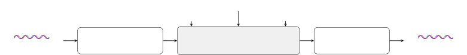

Figure 1: Stable Audio 3 text-to-audio models support variable-length
generation and editing via inpainting.

|             | maximum | \# learnable | H200           | open    | licensed | generation |     |
| ----------- | ------- | ------------ | -------------- | ------- | -------- | ---------- | --- |
|             | length  | parameters   | inference time | weights | data     | music      | sfx |
| small-music | 2m      | 459M         | 0.44s          | ✓       | ✓        | ✓          | —   |
| small-sfx   | 2m      | 459M         | 0.44s          | ✓       | ✓        | —          | ✓   |
| medium      | 6m 20s  | 1.4B         | 1.31s          | ✓       | ✓        | ✓          | ✓   |
| large       | 6m 20s  | 2.7B         | 1.80s          | —       | ✓        | ✓          | ✓   |

Table 1: Stable Audio 3 models support the generation of long audio
sequences while maintaining fast inference times. Parameter counts are
for the diffusion transformer only. SAME-S and SAME-L have 108M and 852M
parameters.

## 1 Introduction

Recent progress in music and audio generation has been driven by two
broad families of models: autoregressive models \[1, 2, 3, 4\] and
latent diffusion models \[5, 6, 7, 8, 9, 10\]. Autoregressive models
have achieved strong results by operating sequentially on discrete audio
tokens. In contrast, latent diffusion models generate continuous latent
representations that are subsequently decoded with a separate
autoencoder, offering an alternative that avoids discrete tokenisation
and autoregressive sampling. Complementing these approaches, hybrid
methods have been proposed using an autoregressive model to produce
tokens that are then refined by a diffusion model \[11, 12\]. Stable
Audio 3 consists of three latent diffusion models at different scales
(small, medium, large, see Table 1).

Variable-length generation is a key capability of Stable Audio 3,
particularly because our models generate very long audio (Table 1).
While autoregressive models naturally support variable-length outputs
due to their sequential nature, diffusion models typically require
generating the entire audio length at once \[5, 6\] (Figure 2: a). This
means that, e.g., generating a short sample with small-music would
require producing a 2m audio with mostly silence. To address this
compute and memory inefficiency, Stable Audio 3 supports variable-length
generation (Figure 2: b), enabling efficient synthesis without incurring
full-length computation for short outputs. Such efficiency gains are
critical for deploying open-weight models on consumer-grade hardware,
where compute and memory budgets are constrained.

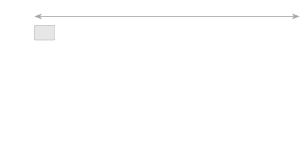


audio embeddings


silence padding

9 s35 s100 s120 s(b) Variable-length: generate $`L\propto d`$.

Figure 2: Fixed- vs. variable-length generation. (a) Fixed-length
generation allocates $`L_{\max}`$ embeddings regardless of the requested
duration $`d`$, wasting computation on zero-padded silence for short
clips. (b) Variable-length generation allocates $`L`$ embeddings that
are proportional to the requested duration $`d`$ (silence padding is
also used, see Section 3.1).

Controllability is also an important feature of modern generative audio
and music models. Stable Audio 3 includes inpainting capabilities that
allow editing targeted segments of audio, such as modifying a single
segment (Figure 3: first row), performing multi-segment edits (Figure 3:
second row), or supporting continuation (Figure 3, third row), where the
model can extend a given audio coherently beyond its original endpoint.
This enables applications such as transient editing in percussive
sounds, generating ideas for an unfinished song, or the extension of
short recordings.

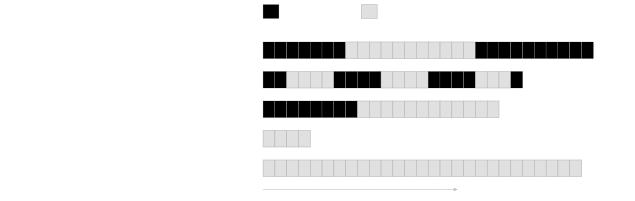

Figure 3: Editing with inpainting. Users provide audio and specify
target segments for editing (gray, masked) while preserving original
audio (hatched). This enables tasks from single or multi-segment editing
to causal continuation.

Stable Audio 3 comprises latent diffusion models built on top of a
semantic-acoustic autoencoder. This latent representation is designed to
preserve reconstruction fidelity while remaining generatively tractable
and semantically structured for downstream use. Our aim is to maintain
high-fidelity audio reconstruction while learning a compact latent space
(with 4096$`\times`$ downsampling) that is both easy to model
generatively with diffusion and structured in a semantically meaningful
way. Specifically, acoustic fidelity is enforced using spectral
reconstruction losses and adversarial training \[13, 14\], while
semantic structure is induced through latent-space regression
objectives, including chroma and interaural level difference regression.
One important characterisic of the employed autoencoder is its
$`4096\times`$ downsampling ratio, substantially higher than the
$`1024`$ to $`2048\times`$ ratios common in prior work \[13, 14, 15\].
This aggressive downsampling is central to our goals: it reduces
sequence lengths enough for medium and small to generate long-form music
and sound effects on consumer-grade GPUs and on a MacBook Pro using CPU.

Diffusion models typically require several inference steps to generate
high-quality outputs, as they progressively refine noise through
iterative denoising \[16, 17\]. Yet, fast inference is essential for
responsive creative tools to feel engaging and inspiring. To address
this, we use adversarial post-training, which allows reducing the number
of sampling steps while maintaining (or improving) output quality
\[18\]. Overall, our latent diffusion training pipeline consists of
three stages: flow matching pre-training \[19, 20, 21\], ODE warmup
distillation \[22, 23\], and adversarial post-training \[18\].

Stable Audio 3 is designed for broad community adoption as it is trained
on licensed and Creative Commons data, enabling artists and developers
to use it without legal concerns. Further, our models can scale from
datacenter GPUs (e.g., H200) down to consumer-grade GPUs and even a
MacBook Pro. The main contributions of Stable Audio 3 are:

- •
  Release the weights for small and medium, suitable to run on
  consumer-grade hardware (Table 1).
- •
  State-of-the-art results for text-to-audio generation for instrumental
  music and sounds (Section 5).
- •
  Fast inference: less than 2s to generate up to 6m 20s on an H200
  (Sections 5.2 and 5.3).
- •
  Audio editing via inpainting, including single- and multi-segment
  edits and continuation (Section 5.6).
- •
  Propose a new method for variable-length audio generation with latent
  diffusion models (Section 3.1).
- •
  Several technical innovations: a semantic-acoustic autoencoder that
  learns a compact latent for diffusion by preserving high-fidelity
  reconstruction and semantic information (Section 2.1); the use of
  Transformer Resampling Blocks (TRBs, Section 2.1) for
  down/up-sampling; a diffusion transformer improved with differential
  attention \[24\], adaptive layer normalization conditioning \[25\],
  and memory embeddings \[26, 27\] (Section 5); minibatch optimal
  transport coupling for flow matching training (Section 3.2); and a
  distillation warmup stage followed by adversarial post-training for
  improved few-step generation (Sections 3.3 and 3.4).

### 1.1 Related Work

#### Open models.

Early open models were predominantly based on either autoregressive
approaches \[1, 28\] or latent diffusion methods \[7, 8, 10, 29, 30, 31,
32\]. More recent open models continue to explore autoregressive
approaches \[3, 4\], while also introducing flow matching methods \[18,
33, 34\] and hybrid architectures that combine autoregressive modeling
with flow matching \[12, 11, 33\]. These models have been applied to a
range of audio generation tasks, including instrumental music \[8, 1,
10\], sound effects \[7, 10, 18, 28, 29, 31\], and songs with
vocals \[3, 4, 11, 12, 32, 34, 33\]. Stable Audio 3 is a family of
open-weight models (small, medium) based on flow matching for
instrumental music and sound effects generation. For evaluation, we
compare against the most competitive open models available.

#### Variable length.

Autoregressive models naturally support variable-length generation by
producing tokens sequentially until an end-of-sequence token is
produced, making variable length generation an emergent property. In
contrast, latent diffusion models are typically defined over
fixed-length sequences, requiring shorter inputs to be padded \[6, 5\].
This ties inference cost to a predefined maximum length rather than the
actual content, leading to inefficiencies and limiting its practical
scalability to long-form generation. A similar issue has been addressed
in image diffusion: early models \[35\] relied on resolution
conditioning and cropping to handle varying sizes, whereas modern
transformer-based approaches rely on positional encodings to digest
inputs of various sizes organically \[36, 37\]. Audio diffusion is
beginning to follow this shift with approaches like autoregressive
block-wise diffusion \[33\]. Yet, fully native variable-length audio
generation with diffusion remains largely unaddressed. To our knowledge,
Stable Audio 3 models are the first to tackle this challenge in a manner
analogous to recent advances in image diffusion.

#### Semantic latent spaces.

Most latent diffusion models operate on low-dimensional (64, 32) latents
from VAEs trained focusing on acoustic reconstruction \[28, 31\].
Representation autoencoders (RAE) \[38, 39\] have shown that diffusion
in higher-dimensional, semantically structured latent spaces yields
faster convergence and better generation quality in the image domain. To
our knowledge, Stable Audio 3 models are the first to explore this idea
in the audio domain by relying on the Semantically-Aligned Music
autoEncoder (SAME) \[40\], which produces 256-dim latents designed to
encode both acoustic fidelity and high-level semantic structure at a
high downsampling ratio (4096$`\times`$).

#### Controllability.

The demand for controllable audio generation is increasing as creative
workflows require control beyond prompts \[41\]. Prior work can be
categorized as follows: mask-based, instruction-based, inference-time
control, global control, time-varying control, and lyrics editing.
Mask-based methods enable localized editing or continuation by
generating the masked segments of a given audio \[42, 43, 44\].
Instruction-based approaches support operations such as adding,
removing, processing, or replacing sound sources through structured
commands \[45, 46, 47\]. Inference-time controls include guidance-based
and inversion methods \[18, 48, 49, 50, 51, 52\]. Global conditioning
methods generate audio based on a reference signal \[53, 54\] while
time-varying controls introduce temporally dynamic constraints \[55, 56,
57, 58\]. Lyrics editing allows additional control by modifying textual
content \[4, 11, 34\]. Stable Audio 3 focuses on mask-based editing, as
it does not require additional training data annotation. Training
instead relies on simple random and causal masking. We do not consider
instruction-based approaches, which typically require training datasets
with stems, nor lyrics editing, which lies outside the scope of our
work. We also exclude inference-time, global, and time-varying controls,
as these often rely on model fine-tuning (LoRA \[58, 57\]) or auxiliary
models (ControlNet \[55\]). Note that such controls can be included by
fine-tuning Stable Audio 3 after its release.

#### Few-step generation.

The iterative denoising process of diffusion incurs high inference
latency, motivating few-step generation methods. Reducing the number of
sampling steps in diffusion can be achieved through distillation \[22,
59\] or adversarial approaches \[60, 61\]. In (step) distillation
approaches the teacher provides direct supervision to train a distilled
few-step generator that learns to map multiple inference steps into a
single step, or a small number of steps, by distilling the teacher’s
trajectories. However, most distillation approaches come with practical
drawbacks like online methods \[62, 63, 59, 64, 65, 66, 67, 68, 69\],
which are costly to train as they require 2-3 full models held in
memory, or offline methods \[19, 22, 70\], which require significant
resources to generate and store trajectories to later train on. To avoid
such drawbacks, some explored adversarial post-training (without
distillation) \[71, 72\]. These works are primarily adversarial, as
opposed to distillation methods that use adversarial auxiliary
losses \[69, 67, 66, 73, 61\], and use real data rather than
teacher-generated samples, thus freeing the costly requirement of using
trajectories. The adversarial loss encourages realism, making each
estimate better than the standard distilled estimates. Such improved
estimates enable post-trained models to use fewer sampling steps \[71,
72\]. In the audio domain: AudioLCM \[74\] used latent consistency
distillation, Presto \[67\] combined step and layer distillation,
ARC \[18\] combined relativistic and contrastive adversarial losses, and
Woosh used MeanFlow distillation \[75\]. Stable Audio 3 is based on ARC
adversarial post-training but also uses distillation as a warmup.

## 2 Architecture

Stable Audio 3 consists of two components: a semantic-acoustic
autoencoder that maps waveforms to and from a continuous latent space;
and a diffusion transformer generating latent sequences that is
conditioned on text prompts, duration information, and inpainting masks.
Figure 4 depicts the overall system. Training details are in Section 3
and further implementation details are available online via our code
release.

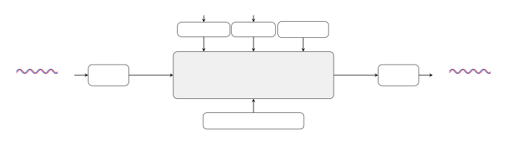

Figure 4: Stereo audio at 44.1 kHz is encoded to a 256-dim latent
sequence by a SAME autoencoder (4096$`\times`$ downsampling). A
diffusion transformer generates latent sequences conditioned on text
embeddings from T5Gemma (via cross-attention), a duration embedding (via
both cross-attention and AdaLN), and a diffusion timestep $`t`$ (via
AdaLN). Inpainting conditioning (masked input of 256$`\times`$L is
concatenated with a binary mask, resulting in a size of $`257\times L`$)
is projected to the model dimension and added at each transformer block.
SAME decoder reconstructs the latents.

|        |       |       |       |              |             |         |              |
| ------ | ----- | ----- | ----- | ------------ | ----------- | ------- | ------------ |
|        |       |       |       | differential | SAME        | maximum | \# learnable |
|        | $`d`$ | $`D`$ | $`H`$ | attention    | autoencoder | length  | parameters   |
| small  | 1024  | 20    | 16    | —            | SAME-S      | 2m      | 459M         |
| medium | 1536  | 24    | 24    | ✓            | SAME-L      | 6m 20s  | 1.4B         |
| large  | 2048  | 26    | 32    | ✓            | SAME-L      | 6m 20s  | 2.7B         |

Table 2: Stable Audio 3 models where $`d`$, $`D`$, and $`H`$ denote
transformer hyperparameters: latent dimensionality, number of
transformer blocks, and number of attention heads, respectively. small
uses no differential attention. Parameter counts are for the diffusion
transformer only. SAME-S and SAME-L have 108M and 852M parameters,
respectively.

### 2.1 Semantic-Acoustic Autoencoder

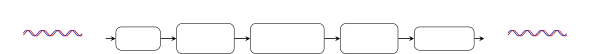

Figure 5: SAME autoencoder \[40\]. Stereo audio is reshaped into patch
embededdings ($`256\!\times`$ downsampling), downsampled by an encoder
TRB (further $`16\!\times`$), and passed through a soft-normalisation
bottleneck with projection to latent dimension $`d`$. Latents are then
reconstructed by a decoder TRB and unpatching. Total downsampling:
$`4096\!\times`$.

Our autoencoder builds on SAME \[40\], a transformer-based autoencoder
for audio that combines an initial patching stage with a Transformer
Resampling Block (TRB, Figure 6). Patching reshapes stereo audio into
non-overlapping patches of 256 samples (per channel, resulting in
$`256\times`$ downsampling). TRB layers perform an additional
$`16\times`$ downsampling by interleaving learnable output embeddings
with the input sequence, and processing the resulting sequence with a
stack of transformer layers using differential attention \[24\] and
rotary position embeddings \[76\].

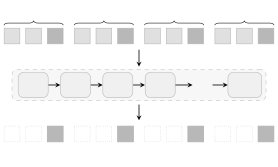

Figure 6: Example of TRB using embedding interleaving for 2$`\times`$
downsampling. Inputs are segmented into groups of 2 and a learnable
output embedding is appended to each segment. The full interleaved
sequence is processed by $`D`$ transformer layers $`\mathcal{T}_{D}`$.
Output embeddings $`y`$ are extracted (discard $`x`$) to form the
downsampled representation.

The combined compression ratio is $`4096\times`$, yielding
256-dimensional latent embeddings at approximately 10.76 Hz for 44.1 kHz
stereo input. Between encoder and decoder, a soft-normalisation
bottleneck constrains the scale of the latent by using a learnable
affine transform with running standard deviation tracking, providing a
deterministic encoding.

For upsampling, the TRB process is reversed: each input embedding is
paired with a number of output embeddings that are then extracted after
processing. For example, to upsample 2$`\times`$, we interleave two
output embeddings with each input embedding to retain the output
embeddings after processing and discard the original input embeddings.

The SAME autoencoder is trained with a combination of (i) spectral
reconstruction, (ii) adversarial, (iii) diffusion alignment, (iv)
semantic regression, and (v) contrastive latent alignment losses that
are designed to preserve reconstruction fidelity while remaining
generatively tractable and semantically structured for downstream use.
More specifically, SAME uses a multi-resolution STFT loss computed at
seven resolutions (FFT sizes from 32 to 2048, each with 75% overlap). A
K-weighting pre-emphasis filter is applied before the STFT. At each
resolution, the loss combines a spectral contrast term, a modified
log-magnitude L1 distance, and an instantaneous frequency + group delay
(IFGD) phase loss \[40\]. To handle stereo audio, the STFT loss is
computed independently on both the sum-and-difference (mid/side) and
per-channel (left/right) rep-resentations. Furthermore, the adversarial
loss is formulated using a relativistic GAN objective. Then, the
diffusion alignment loss consists of a small diffusion transformer (4
layers, 768-dimensional embeddings) that is trained jointly on the
autoencoder’s latent space using a flow matching objective such that
gradients flow back through the encoder, encouraging the latent geometry
to be amenable to diffusion-based generation. SAME semantic regression
losses include two lightweight linear regressors (single 1$`\times`$1
convolutions) to predict chroma and interaural level difference (ILD)
features. Finally, the contrastive latent alignment loss employs a
transformer-based critic (4 layers, 1024-dimensional) that is trained to
distinguish whether the latent sequence, wavelet (audio) features, and a
T5Gemma text embedding (triplet) originate from the same input,
encouraging the latent to preserve audio-level and cross-modal
semantics. As a result, these losses focus on both high-quality acoustic
reconstruction (spectral and adversarial losses) and semantic structure
(semantic regression and contrastive latent alignment losses) for
downstream diffusion (diffusion alignment loss).

The SAME autoencoder is frozen during diffusion training. small uses
SAME-S, a distilled variant with fewer parameters (108M) designed for
CPU inference, while medium and large use SAME-L (852M parameters). Both
variants share the same compression ratio and latent dimensionality.
Further details are in the original SAME publication \[40\].

### 2.2 Diffusion Transformer

Our generative model is a diffusion transformer operating on SAME
latents \[25\]. Transformers replaced U-Nets for latent diffusion
\[36\], and Stable Audio 3 adapts the diffusion transformer for
text-to-audio with modifications including editing capabilities with
inpainting, differential attention \[24\], memory embeddings \[26\], and
variable-length support.


Figure 7: Diffusion transformer architecture. SAME latents are linearly
projected from $`256`$ to $`d`$ channels. A set of $`64`$ memory
embeddings is prepended, providing a global memory buffer that every
position can attend to. The resulting sequence is processed by $`D`$
transformer blocks with latent dimensionality $`d`$. After the final
block, memory embeddings are discarded and the sequence is projected
back to $`256`$ channels. In/out 1$`\times`$1 convolutions are omitted.

SAME latents first pass through a 1$`\times`$1 convolution with a
residual connection. A linear projection then maps SAME frames to the
transformer’s latent dimensionality ($`256\to d`$). Before entering the
transformer, 64 learned memory embeddings are prepended. These
embeddings serve as context that every position can attend to,
effectively providing a global memory buffer. The resulting sequence is
processed by a stack of $`D`$ transformer blocks with latent
dimensionality $`d`$ and $`H`$ heads. After the final block, the memory
embeddings are removed, and the sequence is projected back to the 256
dimensions of SAME. A final 1$`\times`$1 convolution with a residual
connection produces the final output.

Conditioning information enters the transformer through three distinct
pathways (Figure 8). First, the diffusion timestep and duration (length
of generation) are mapped to a global embedding that modulates each
self-attention and feed-forward layers in each transformer block with
adaptive layer normalization (AdaLN). Second, text embeddings from a
frozen T5Gemma encoder, concatenated with a duration embedding, employ
cross-attention for conditioning. Third, for inpainting, a
local-additive conditioning signal with the reference audio (to inpaint)
and a binary mask (signaling where to inpaint) is projected through an
MLP and added to the hidden state of each transformer block.

We train 3 models that share the same design but differ in transformer
capacity, maximum generation length, and autoencoder (Table 2). medium
and large use differential attention \[24\] in both self-attention and
cross-attention layers, which roughly doubles the Q and K projection
sizes relative to standard multi-head attention that small uses.

#### Transformer blocks.

Each transformer block is composed of self-attention, cross-attention,
local-additive conditioning, and a feed-forward network (Figure 8).

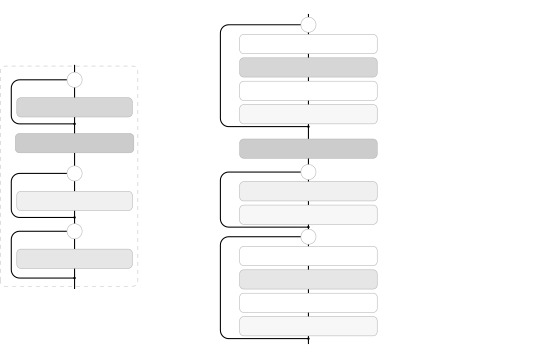

Figure 8: High-level (left) and detailed (right) overview of a single
transformer block. $`\sigma`$ denotes the sigmoid function. Adaptive
layer normalization (AdaLN with gate, scale, and shift) is used for
diffusion timestep and duration conditioning, cross-attention for text
and duration conditioning, and local-additive conditioning for
inpainting.

Self-attention follows a pre-norm design with AdaLN \[25, 36, 75\]. The
input is normalised via RMSNorm \[77\], then diffusion timestep and
duration conditioning signals are injected (jointly) via AdaLN. In the
following self-attention layer each head employs QK-RMSNorm to prevent
dot-product outputs from growing unconstrained \[78\]. Positional
embeddings are RoPE \[76\] with partial rotation: only 32 of each head’s
dimensions are rotated, while the remainder carry no positional
information. Finally, an AdaLN gate further conditions the output before
the residual connection.

Cross-attention follows the same pre-norm design but without AdaLN.
Embeddings are first normalised via RMSNorm and projected into queries,
while keys and values are derived from the conditioning context (text
and duration embeddings) through a separate projection. As in
self-attention, each head also employs QK-RMSNorm \[77, 78\]. No
positional embeddings are applied. The output embedding is added to the
residual stream.

Local-additive conditioning enables inpainting by adding a frame-aligned
signal before the feed-forward network. The inpainting conditioning
signal (a binary mask concatenated with the masked reference audio) is
projected through a 2-layer MLP with SiLU and added directly to the
cross-attention output. MLP layers are zero-initialised, such that the
inpainting pathway can be introduced into pretrained models without
disrupting its learned representations.

The feed-forward network is a SwiGLU \[79\] where the gated linear unit
operates at 4$`\times`$ the model dimension $`d`$ and the gate is a
swish (SiLU) gate instead of a sigmoid. After gating, a linear layer
projects back from $`4d`$ to $`d`$. This part also uses RMS-based
pre-norm and AdaLN as self-attention for diffusion timestep and duration
conditioning.

#### Adaptive layer normalisation (AdaLN): diffusion timestep and duration conditioning.

The diffusion timestep $`t\in[0,1]`$ is mapped to a 256-dim Fourier
features vector and then projected to $`d`$ by an MLP with SiLU. The
duration (in seconds) is normalised to $`[0,1]`$ and also encoded into a
256-dim Fourier features vector and then projected to $`d`$ by an MLP
with SiLU. These two $`d`$-dimensional embeddings are summed
element-wise and passed through another MLP with SiLU that computes a
shared conditioning embeddings that are fed to each transformer block.
As a result, every AdaLN ($`\gamma_{s}`$, $`\beta_{s}`$, $`g_{s}`$,
$`\gamma_{f}`$, $`\beta_{f}`$, $`g_{f}`$) gets conditioning embeddings
($`c_{\gamma,s}`$, $`c_{\beta,s}`$, $`c_{g,s}`$, $`c_{\gamma,f}`$,
$`c_{\beta,f}`$, $`c_{g,f}`$) that are shared across transformer blocks.
Finally, each transformer block independently learns 6 bias terms
($`b_{\gamma,s}`$, $`b_{\beta,s}`$, $`b_{g,s}`$, $`b_{\gamma,f}`$,
$`b_{\beta,f}`$, $`b_{g,f}`$) that are added to the shared conditional
embeddings to obtain the final AdaLN conditioning \[25\]. For example,
the self-attention AdaLN scale is
$`\gamma_{s}=c_{\gamma,s}+b_{\gamma,s}`$ where $`c_{\gamma,s}`$ is
shared across blocks and $`b_{\gamma,s}`$ is block specific. The
resulting AdaLN parameters at each transformer block ($`\gamma_{s}`$,
$`\beta_{s}`$, $`g_{s}`$, $`\gamma_{f}`$, $`\beta_{f}`$, $`g_{f}`$) are
applied following equations in Figure 8. This variant is referred to as
AdaLN-Single \[36\], since the conditioning embeddings are shared across
all transformer blocks, substantially reducing the number of
conditioning parameters compared to standard AdaLN. Further, the
multiplicative gating terms ($`g_{s}`$, $`g_{f}`$) are inspired by the
modulation mechanism introduced in FLUX \[80\].

#### Cross-attention: text and duration conditioning.

Text is encoded by a T5Gemma (google/t5gemma-b-b-ul2) frozen encoder
into a sequence of 256 embeddings of dimension 768. Short prompts are
padded to 256 with a learned padding embedding, and long prompts are
truncated to 256. The duration (in seconds) is normalised to $`[0,1]`$
and encoded into a 256-dim Fourier features vector and then projected to
$`d`$ by an MLP with SiLU. These two conditioning sources are
concatenated along the sequence dimension, forming a context sequence of
257 embeddings. Text and duration conditioning enter each transformer
block via cross-attention. Per-head QK-RMSNorm is applied to stabilize
attention logits. Note that duration conditioning thus enters each
transformer block through two complementary pathways: AdaLN together
with the diffusion timestep, and cross-attention alongside the text
prompt.

#### Local-additive conditioning for inpainting.

The region to edit with inpainting is signaled with a binary mask where
ones mark frames to preserve and zeros mark frames to generate. To that
end, the original audio is encoded into latent space by the SAME
autoencoder and element-wise multiplied by the mask, zeroing out the
inpaint region. The single-channel mask and the 256-channel masked
latent are concatenated along the channel dimension into a
257-dimensional per-frame conditioning tensor. In each transformer
block, this tensor is projected to the transformer block dimension $`d`$
by a MLP with SiLU and added element-wise to the residual stream between
the cross-attention and feed-forward network. Because the output layer
of the MLP is zero-initialized, the local-additive conditioning used for
inpainting has no effect at the start of training, allowing smooth
fine-tuning from a non-inpainting checkpoint.

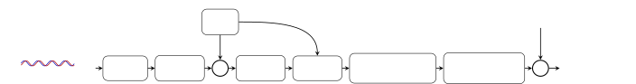

Figure 9: Local-additive conditioning for inpainting. Waveforms are
encoded by a frozen SAME autoencoder into a latent sequence
($`256\times T`$), then element-wise multiplied by a binary mask
(1=keep, 0=inpaint). The masked latent and mask are concatenated along
the channel dimension. Each transformer block projects this through an
MLP with SiLU and adds the result to the residual stream. Left-padding
leaves space to preserve the memory embeddings.

#### Differential attention.

Instead of a single set of queries and keys, we build two pairs
$`(Q,K)`$ and $`(Q^{\prime},K^{\prime})`$ that share a common set of
values $`V`$. Two independent attention maps are computed and their
outputs are subtracted:
$`\operatorname{Attn}(Q,\,K,\,V)-\operatorname{Attn}(Q^{\prime},\,K^{\prime},\,V)`$,
canceling the attention patterns common to both heads. Both pairs
undergo the same per-head QK-RMSNorm and, in the case of self-attention,
partial RoPE is used. medium and large use differential attention \[24\]
in both self-attention and cross-attention, while small uses the
standard multi-head attention.

RMSNorm. We use RMSNorm \[77\] as a pre-normalization layer in
transformer blocks. Given an input vector $`\mathbf{x}`$:

```math
\mathrm{RMSNorm}(\mathbf{x})=\frac{\mathbf{x}}{\sqrt{\frac{1}{d}\lVert\mathbf{x}\rVert^{2}+\epsilon}}\odot\boldsymbol{\gamma}, \tag{1}
```

where $`\boldsymbol{\gamma}\in\mathbb{R}^{d}`$ is a learnable scale
parameter initialized to ones and $`\epsilon=10^{-5}`$. Unlike
LayerNorm, RMSNorm omits mean centering and the learnable bias, reducing
computation while performing comparably in practice.

QK-RMSNorm. We apply per-head RMSNorm independently to Q and K after
projection but before adding RoPE:

```math
\hat{Q}=\text{RMSNorm}_{q}(Q),\quad\hat{K}=\text{RMSNorm}_{k}(K), \tag{2}
```

where $`\text{RMSNorm}_{q}`$ and $`\text{RMSNorm}_{k}`$ have separate
learnable scale parameters shared across all heads. This prevents the
attention logits to grow unboundedly. QK-RMSNorm is applied in both
self-attention and cross-attention \[77, 78\].

## 3 Training

Stable Audio 3 models allow variable-length generation and are trained
following a multi-stage pipeline (Figure 10). The first stage trains the
diffusion transformer (base model) with flow matching. Later stages
(distillation warmup, adversarial post-training) refine the model for
improved speed and sample quality (post-trained model). All stages
operate on pre-encoded SAME latents encoded offline, and use the
variable-length training schema below.

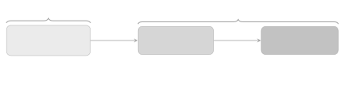

Figure 10: Stable Audio 3 training pipeline.

First, we train a flow matching model that learns a velocity field
$`v_{\theta}(x_{t},t)`$ defining an ordinary differential equation (ODE)
transporting noise $`\epsilon`$ to data $`x_{0}`$. At inference, this
ODE is solved numerically over many $`t`$ steps (50–100).

Second, we perform a distillation warmup that repurposes the model as a
one-step denoiser. Given any intermediate state $`x_{t}`$ sampled along
the teacher’s ODE trajectory, the student (same architecture as the
teacher) learns to predict the trajectory’s endpoint $`\hat{x}_{0}`$
(generation) directly, trained with an MSE loss. This effectively
straightens the learned flow (collapsing the multi-step ODE solve into a
single function evaluation $`x_{t}\to\hat{x}_{0}`$ for every $`t`$) but
the MSE objective causes the student to regress toward the conditional
mean $`\mathbb{E}[\hat{x}_{0}\mid x_{t}]`$, producing outputs that lack
fine-grained detail.

Third, adversarial post-training replaces the teacher signal with a
relativistic adversarial setup that directly compares the student’s
one-step predictions $`x_{t}\to\hat{x}_{0}`$ against real data
$`{x}_{0}`$. This shifts the student’s mapping from approximating the
conditional mean toward sampling from the true data distribution
$`p(x_{0}\mid x_{t})`$, recovering the perceptual sharpness that MSE
distillation smooths over. Crucially, this stage discards the teacher
entirely, allowing the student to surpass the teacher’s quality ceiling
by optimizing directly against real data $`x_{0}`$.

While the resulting adversarially trained model can generate audio in a
single forward pass, the mapping from pure noise
$`\epsilon\to\hat{x}_{0}`$ in one step remains challenging (Section
5.7). In Section 4, we describe how ping-pong sampling alleviates this
by decomposing the single large step into multiple smaller ones. At each
iteration, the model produces a denoised estimate $`\hat{x}_{0}`$, which
is then renoised with new noise at a reduced level before the next
denoising step. This iterative denoise-then-renoise schedule allows the
model to progressively refine its output, correcting errors from earlier
steps while leveraging the one-step denoising $`x_{t}\to\hat{x}_{0}`$
capability learned during adversarial post-training.

### 3.1 Variable-Length Training

Previous latent diffusion models in the audio domain operate on
fixed-length sequences, padding shorter audio with silence to match the
maximum training length \[6, 5\]. Generating a short audio clip thus
requires inference at full length, with most of the computation spent
producing silence, since inference on shorter sequences than it was
trained on leads to output degradation (Section 5.4). This effectively
ties inference cost to the chosen maximum length, whilst many practical
usecases need audio much shorter than that maximum. Stable Audio 3,
instead, natively supports variable-length generation. During training,
where batching requires uniform sequence lengths for efficiency, it
relies on the following mechanisms: variable-length attention and masked
loss computation, per-element timestep shifts, and silence augmentation.
Figure 11 illustrates these mechanisms on a batch of three sequences.

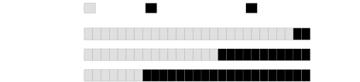

Figure 11: Variable-length training. A batch contains sequences of
different lengths, padded to a common (variable) size. Padding
embeddings are excluded (masked) from the loss. Each audio receives a
length-dependent timestep shift ($`\mu`$), with longer sequences shifted
toward higher noise levels. The signal is randomly extended with
silence.

#### Variable-length attention and masked loss.

Sequences shorter than the batch maximum length are right-padded in
latent space. Padding embeddings are excluded (masked) from both
self-attention and feed-forward using variable-length flash
attention \[81\]. Since padding positions are excluded (masked) from
attention, their outputs are uninformative and the loss is computed only
over valid signal positions (using a mask over the loss).
Cross-attention is not masked. Memory embeddings participate in all
attention layers without masking, but are removed before any loss
computation. Right-padded positions are also excluded (masked) from the
adversarial loss.

#### Per-element timestep shifts.

The noise schedule is adapted per sample based on its (unpadded) length.
Note that long sequences are harder to corrupt because of correlation
across sequence elements. Hence, when noise is added independently to
each element of a sequence, longer sequences retain more recoverable
structure at a given noise level due to redundancy between neighbouring
elements \[82, 83\]. This means that a fixed noise schedule can
under-noise long sequences relative to short ones, biasing the model
toward learning to denoise at insufficiently high noise levels for long
inputs. To compensate, the timestep distribution is shifted toward
higher noise levels for longer sequences. The shift pushes longer
sequences toward noisier timesteps (Figure 12), giving the model more
training budget in the high-noise regime. The proposed shift uses the
logistic form proposed by Esser et al. \[84\]. Given a parameter $`\mu`$
that interpolates between $`\mu_{\min}`$$`=`$0.5 and
$`\mu_{\max}`$$`=`$1.15 as a function of the sequence length, the
shifted timestep is:

```math
t^{\prime}=1-\frac{e^{-\mu}}{e^{-\mu}+\frac{t}{1-t}}. \tag{3}
```

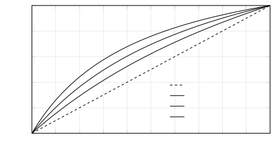

Figure 12: Effect of the per-element timestep shift on the timestep
mapping. For short audios ($`\mu_{\min}`$$`=`$0.5), the shift is mild.
For long audios ($`\mu_{\max}`$$`=`$1.15), timesteps are pushed
substantially toward higher noise levels.

#### Silence augmentation.

To improve robustness and break the direct correspondence between
duration conditioning and signal length, the signal region is randomly
extended with silence embeddings with a length drawn from an exponential
distribution (on average 4 sec of silence extension). The padding is
filled with a pre-computed silence latent (obtained by encoding a
zero-valued waveform) so that the model encounters realistic silence
representations. This teaches the model to terminate audio cleanly with
natural silence rather than abrupt cutoffs or artifacts.

### 3.2 Flow Matching Pre-Training

The initial training stage uses a flow matching objective \[19, 20\].
Given a data sample $`x_{0}`$ (SAME latents) and noise
$`\epsilon\sim\mathcal{N}(0,I)`$, the noised input at timestep
$`t\in[0,1]`$ is the linear interpolation:

```math
x_{t}=(1-t)\,x_{0}+t\,\epsilon, \tag{4}
```

and the model is trained to predict the velocity $`v=\epsilon-x_{0}`$
via a mean squared loss with inpainting masks.

#### Inpainting training.

All models are trained jointly for generation and inpainting. At each
training step, a random binary mask is sampled per example, where
$`m`$$`=`$1 denotes positions to keep the audio and $`m`$$`=`$0
positions to inpaint. Three mask types are drawn with probabilities:
*full mask* with all zeros is equivalent to unconditional generation
(probability 80%), *random segments* where 1 to 10 segments are masked
out for inpainting (probability 10%), and *causal mask* where a random
prefix is kept and the remainder is masked for continuation (probability
10%). Inpainting mask examples are in Figure 3. The mask and the
element-wise product of the clean latent with the mask are concatenated
along the channel dimension and provided to the model as local-additive
conditioning. The model is trained to predict the velocity and the loss
is split into two independently averaged terms: a generation loss over
the inpainted embeddings ($`m`$$`=`$0) and a context preservation loss
over the kept audio ($`m`$$`=`$1).

```math
\frac{1}{N_{\text{gen}}}\!\sum_{i:\,m=0}\!\left\|\hat{v}_{\theta}(x_{t},t,c)_{i}-(\epsilon-x_{0})_{i}\right\|^{2}\;+\;\frac{1}{N_{\text{ctx}}}\!\sum_{j:\,m=1}\!\left\|\hat{v}_{\theta}(x_{t},t,c)_{j}-(\epsilon-x_{0})_{j}\right\|^{2}\,, \tag{5}
```

where $`\hat{v}_{\theta}`$ is the predicted velocity, $`c`$ is any
conditioning signal, and $`N_{\text{gen}}`$, $`N_{\text{ctx}}`$ are the
number of inpainted ($`m\!=\!0`$) and context ($`m\!=\!1`$) embeddings,
respectively.

#### Minibatch optimal transport coupling.

It is used to find a permutation of noise samples that minimises the
squared $`L_{2}`$ transport cost within each minibatch, computed via
Sinkhorn iterations on GPU \[19, 85\]. Concretely, given a batch of
$`B`$ data samples and $`B`$ independently drawn noise vectors, the
algorithm reassigns which noise vector is paired with which data sample.
Standard flow matching pairs each data sample $`x_{0}`$ with an
independently drawn noise sample $`\epsilon`$. When these happen to be
far apart, the resulting transport path is long and may cross paths from
other pairs. By solving an approximate assignment problem within each
minibatch, optimal transport coupling pairs each $`x_{0}`$ with the
closest available $`\epsilon`$, producing shorter, straighter, and less
entangled trajectories. This straightens the velocity field that the
model learns, improving both training and sampling \[50\].

#### Timestep sampling.

Timesteps are drawn from a truncated logit-normal distribution \[80,
84\]. Samples from a logit-normal distribution
($`t=\sigma(z),\;z\sim\mathcal{N}(0,1)`$) are truncated at $`t=0.075`$
and rescaled to $`[0,1]`$. This removes very-low-noise timesteps and
concentrates training budget on intermediate-high noise levels. Remember
that due to our variable-length training schema, the sampled $`t`$ are
individually shifted $`t^{\prime}`$ based on Equation 3.

### 3.3 Distillation Warmup

The distillation warmup bridges the gap between the many-step flow
matching model and the one-step regime required by adversarial
post-training, providing a smoother initialisation than directly
addressing the adversarial objective.

Before adversarial training, the flow matching model is refined through
a distillation warmup stage of 10k steps \[23\]. A frozen copy of the
pre-trained flow matching model serves as a teacher, and the student is
also initialized with the pre-trained flow matching model. The teacher
generates a multi-step ODE trajectory (15 DPM++ steps with CFG set to 5)
from random noise $`\epsilon`$, and the intermediate states
$`(x_{t},t)`$ along with the final denoised output $`\hat{x}_{0}`$ are
cached. The teacher trajectory is refreshed periodically (every 4
iterations) to balance compute cost with target diversity. The student
is then trained to match the teacher’s endpoint $`\hat{x}_{0}`$ in a
single step: given a randomly selected intermediate state $`x_{t}`$ from
the cached trajectory, the student predicts a velocity
$`v_{\theta}(x_{t},t,c)`$ and produces a one-step Euler estimate
$`\hat{x}_{0,\theta}=x_{t}-t\,v_{\theta}(x_{t},t,c)`$. The loss is the
MSE between $`\hat{x}_{0,\theta}`$ and the teacher’s denoised output
$`\hat{x}_{0}`$:

```math
\mathcal{L}=\|(x_{t}-t\,v_{\theta}(x_{t},t,c))-\hat{x}_{0}\|^{2}.
```

Note that our technique is related to ReFlow \[19\], which straightens
the transport paths of a trained flow model. In standard flow matching,
each data sample $`x_{0}`$ is paired with an independently drawn noise
sample $`\epsilon`$, resulting in random couplings that may produce
long, crossing transport paths. ReFlow addresses this by generating
coupled endpoints $`(\hat{x}_{0},\epsilon)`$. It samples noise
$`\epsilon`$ and integrates the trained model’s ODE to obtain the
corresponding output $`\hat{x}_{0}`$. A new model is then trained to
connect these coupled endpoints (with straighter paths that require
fewer sampling steps, enabling faster inference). Although our approach
also unrolls the teacher’s ODE, it differs in a key respect to ReFlow.
Rather than retraining a flow matching model (predict velocity) on these
new endpoint pairs, our student learns to map any intermediate state
$`x_{t}`$ along the teacher’s trajectory directly to the final output
$`\hat{x}_{0}`$ in a single step.

It is also related to one-step ReFlow \[19\], which further distills the
reflowed model into a single-step flow matching model (velocity
prediction) that maps $`\epsilon\to\hat{x}_{0}`$ with one Euler step.
Our approach shares the same one-step generation approach, but bypasses
the intermediate ReFlow training stage entirely. Further, our student
learns to map any intermediate state $`x_{t}`$ along the teacher’s ODE
trajectory to the final output $`\hat{x}_{0}`$ based on the MSE loss
(instead of velocity prediction). This is handy because during
adversarial post-training our losses operate in signal $`{x}_{0}`$ space
instead of vector field $`v_{\theta}(x_{t},t)`$ space, but this can
introduce regression-to-the-mean artifacts despite our teacher providing
a unique $`\hat{x}_{0}`$ for each $`x_{t}`$. This motivates the
adversarial post-training stage, where the discriminator’s loss in
$`{x}_{0}`$ space directly penalizes perceptual degradation and recovers
the fine-grained structure that MSE distillation can smooth over.

Finally, our setup is also related to Consistency Distillation \[59\]
which trains a student model to map any point on the teacher’s ODE
trajectory to the endpoint $`x_{t}\to\hat{x}_{0}`$. It relies on a
local-consistency loss where the model’s predictions at two adjacent
steps $`{x}_{t}`$ and $`{x}_{t+1}`$ along the same ODE trajectory must
be the same
$`f_{\theta}({x}_{t+1},t+1){\approx}f_{\theta^{-}}({x}_{t},t)`$, where
$`\theta^{-}`$ denotes an exponential moving average of the student
weights. Yet, local consistency alone does not determine the value
trajectory steps should map to. What anchors the local consistency chain
to the actual endpoint $`\hat{x}_{0}`$ is a boundary condition at
$`t{=}0`$. During training, the model is architecturally constrained to
bypass $`\hat{x}_{0}`$ so that
$`f_{\theta}(\hat{x}_{0},t{=}0){=}\hat{x}_{0}`$ by construction. The
consistency loss then chains everything together: the prediction at
$`t{=}0.1`$ must match the prediction at $`t{=}0`$, which is hardwired
to $`\hat{x}_{0}`$. The prediction at $`t{=}0.2`$ must match
$`t{=}0.1`$, which already equals $`\hat{x}_{0}`$. This cascade
propagates all the way to $`t{=}1`$, so that even from pure noise the
model can predict $`\hat{x}_{0}`$. Our approach does not propagate
information through a chain of local consistency losses anchored by a
boundary condition. Instead, we regress directly to the teacher’s
endpoint $`\hat{x}_{0}`$ from any intermediate state $`\hat{x}_{t}`$. A
trade-off of our MSE-based regression approach is that if the teacher’s
ODE is curved, our endpoint $`\hat{x}_{0}`$ estimates won’t be accurate
(which is why ping-pong sampling is required, see Section 4).
Consistency Distillation sidesteps this by focusing on consistency
across adjacent time-steps.

### 3.4 Adversarial Post-Training

Adversarial post-training turns our pre-trained model into a one-step
generator by supplanting the MSE-based conditional mean loss (of both
flow matching and distillation warmup) with an adversarial loss. To that
end, a discriminator evaluates the realism of denoised samples,
providing distribution-level feedback that goes beyond the broad
conditional mean loss. As such, if the denoised output
$`x_{t}\to\hat{x}_{0}`$ is sufficiently real and higher-quality, fewer
sampling steps are required. Another key advantage of adversarial
post-training over distillation methods is that it sidesteps reliance on
the performance of the pre-trained (teacher) model. The goal of
adversarial post-training is to map $`x_{t}\to\hat{x}_{0}`$ where
$`{x}_{t}=(1{-}t)\,{x_{0}}+t\,{\epsilon}`$ and $`\hat{x}_{0}`$ is an
estimate of $`x_{0}`$. A relativistic discriminator, operating in
$`{x}_{0}`$ space, provides the training signal required to recover the
details that MSE-based distillation smooths over, effectively trading
regression-to-the-mean artifacts for perceptually sharp outputs while
preserving the one-step capabilities of the distilled model.

We fine-tune the pre-trained model (flow matching plus distillation
warmup) using adversarial post-training with three complementary losses:
an adversarial relativistic loss $`\mathcal{L}_{R}`$, a contrastive
loss $`\mathcal{L}_{C}`$, and a CLAP loss $`\mathcal{L}_{\text{CLAP}}`$.

Training alternates between generator (the pre-trained one-step model)
and discriminator updates:

```math
\displaystyle\mathcal{L}_{G}=\mathcal{L}_{R}^{(G)}+\mathcal{L}_{\text{CLAP}}^{(G)}, \tag{6}
```

```math
\displaystyle\mathcal{L}_{D}=\mathcal{L}_{R}^{(D)}+\mathcal{L}_{C}^{(D)}. \tag{7}
```

$`\mathcal{L}_{R}`$ drives perceptual quality, $`\mathcal{L}_{C}`$
regularizes the discriminator to be semantically aligned, and
$`\mathcal{L}_{\text{CLAP}}`$ gives the generator an explicit
text-alignment signal such that the generator improves both audio
fidelity and prompt alignment.

#### Generator architecture.

It is the pre-trained model with flow matching and distillation warmup.
In principle, one could parameterize the network to output
$`\hat{x}_{0}`$ directly. Yet, we retain the original velocity
parameterization $`v_{\theta}(x_{t},t,c)`$ from the base model and
recover the clean estimate via one-step Euler sampling:
$`\hat{x}_{0}=x_{t}-t\,v_{\theta}(x_{t},t,c)`$. Note this
reparameterization also imposes a useful architectural constraint: at
$`t{=}0`$ the model must output
$`\hat{x}_{0}{=}x_{0}-0\cdot v_{\theta}{=}x_{0}`$. As $`t`$ grows, the
network’s influence scales linearly with the noise level, preventing it
from making disproportionately large corrections at low noise where the
input is already close to clean. Further, it preserves initialization
quality: since the generator starts from $`v_{\theta}`$, the initial
outputs are already meaningful predictions, improving early training
stability. The same reparameterization is used for the distillation
warmup: maintaining the one-step Euler sampling reparametrization
throughout post-training ensures a smooth transition from flow matching
without any discontinuities.

#### Discriminator architecture.

The discriminator reuses the same architecture as the generator as a
feature extractor, initialized from the base model pretrained with flow
matching (no distillation warmup). It is a fully-conditioned
discriminator that receives the text prompt, the duration conditioning,
the inpainting mask and context, and a timestep $`t_{D}`$ (independent
from $`t`$ used by the generator). All signals go through the same
conditioning mechanisms (cross-attention, adaptive layer norm) as the
generator. Having been pre-trained to process noisy data $`x_{t}`$ under
arbitrary conditions, it already produces semantically rich intermediate
representations without any additional training. Such intermediate
representations are then processed by a convolutional head that produces
frame-wise realness scores.

The discriminator operates at a noise level $`t_{D}`$ that is
independent of the generator’s noise level $`t`$. Specifically, after
the generator produces its denoised estimate
$`\hat{x}_{0}=x_{t}-t\,v_{\phi}(x_{t},t)`$, we renoise it to a fresh
noise level for the discriminator:

```math
x_{t_{D}}^{\text{fake}}=(1-t_{D})\,\hat{x}_{0}+t_{D}\,\epsilon^{\prime}\quad x_{t_{D}}^{\text{real}}=(1-t_{D})\,x_{0}+t_{D}\,\epsilon^{\prime} \tag{8}
```

where $`t_{D}`$ evaluates samples at timesteps drawn from a logit-normal
distribution ($`t_{D}=\sigma(z),\;z\sim\mathcal{N}(0,1)`$), focusing on
intermediate noise levels, and $`\epsilon^{\prime}\sim\mathcal{N}(0,I)`$
is shared between real and fake. The decoupling of $`t`$ and $`t_{D}`$
allows the discriminator to evaluate the generator’s output at multiple
noise scales, providing training signal about both global structure
(high $`t_{D}`$) and fine detail (low $`t_{D}`$), regardless of which
$`t`$ the generator was trained on in that iteration. Finally, by using
the same noise $`\epsilon^{\prime}`$ when constructing
$`{x}_{t_{D}}^{\text{real}}`$ and $`{x}_{t_{D}}^{\text{fake}}`$, the
noise component cancels in the relativistic comparison, ensuring the
discriminator judges the quality difference between $`{x}_{0}`$ and
$`\hat{{x}}_{0}`$ rather than incidental noise patterns.

#### Adversarial relativistic loss.

The generator is trained to minimize
$`D_{\psi}({x}_{t_{D}}^{\text{real}},t_{D},c)-D_{\psi}({x}_{t_{D}}^{\text{fake}},t_{D},c)`$
and the discriminator is trained to maximize this margin. Our loss
relies on the $`\text{softplus}(x)=\log(1+e^{x})`$ as a smooth surrogate
for $`\max(0,x)`$. Unlike a raw margin loss that would continue
rewarding an already-winning player (with low $`\mathcal{L}_{R}`$),
softplus saturates: when it is large and negative,
$`\text{softplus}(x)\approx 0`$, gradients vanish gracefully.
Conversely, when the argument is positive,
$`\text{softplus}(x)\approx x`$ and the loss grows linearly, providing a
strong corrective signal.

```math
\displaystyle\mathcal{L}_{R}^{(G)} \displaystyle=\mathbb{E}\!\left[\,\text{softplus}\!\Big(D_{\psi}({x}_{t_{D}}^{\text{real}},t_{D},c)-D_{\psi}({x}_{t_{D}}^{\text{fake}},t_{D},c)\Big)\,\right] \tag{9}
```

```math
\displaystyle\mathcal{L}_{R}^{(D)} \displaystyle=\mathbb{E}\!\left[\,\text{softplus}\!\Big({-}\big(D_{\psi}({x}_{t_{D}}^{\text{real}},t_{D},c)-D_{\psi}({x}_{t_{D}}^{\text{fake}},t_{D},c)\big)\Big)\,\right] \tag{10}
```

The loss is calculated on pairs of real/generated data \[86, 87\], such
that the generator minimizes its detection relative to its paired real
sample with the same prompt. Thus, the generator wants every generated
sample to be “more real than its paired real sample", while the
discriminator wants every real sample to be “more real than its paired
generated sample". Critically, our pairs are always highly related due
to our text-conditional task, where pairs of real/generated share the
same prompt, thus providing a stronger gradient signal than relying on
random pairings.


\(a\) Adversarial relativistic loss.


\(b\) Contrastive loss.

Figure 13: Adversarial Post-Training. (a) Pairs of generated and real
samples (with the same text prompts) are passed into the discriminator
(with additive noise), where the generator and discriminator are trained
to minimize and maximize (respectively) the difference between fake and
real outputs. (b) The discriminator is also trained to maximize the
difference between audios with correct and incorrect (shuffled) prompts.
Dashed lines denote noise injection.

#### Contrastive loss.

To prevent the discriminator from relying on audio-only artifacts and
ignoring the text conditioning, we add a contrastive term. Given a batch
of real audio-prompt pairs, we create negative examples by cyclically
shifting (random) the prompts across the batch. The discriminator is
then trained to distinguish correctly paired from incorrectly paired
audio-prompt combinations, using the same relativistic objective that
maximizes their difference:

```math
\mathcal{L}_{C}^{(D)}=\mathbb{E}\!\left[\,\text{softplus}\!\Big({-}\big(D_{\psi}(\mathbf{x}_{t}\mid c_{\text{correct}})-D_{\psi}(\mathbf{x}_{t}\mid c_{\text{shuffled}})\big)\Big)\,\right]. \tag{11}
```

This loss can be viewed as a contrastive loss \[88\] where the
discriminator is mapping correct audio-text pairs closer than mismatched
pairs. Note that this is only a loss for the discriminator, as this
encourages it to understand the alignment between prompts and noisy
inputs, and prevents the model from focusing on easier (e.g.,
high-frequency \[67\]) audio features. This forces the discriminator to
understand audio-text alignment, not just audio quality.

#### CLAP loss.

A frozen CLAP model provides direct semantic guidance to the generator.
The generator’s denoised output $`\hat{\mathbf{x}}_{0}`$ and the text
prompt are encoded, and we minimize the squared geodesic distance on the
unit hypersphere:

```math
\mathcal{L}_{\text{CLAP}}^{(G)}=2\,\arcsin^{2}\!\!\left(\frac{\lVert{e}_{\text{text}}-{e}_{{\hat{x}_{0}}}\rVert_{2}}{2}\right), \tag{12}
```

where $`{{e}}_{\text{text}}`$ and $`{{e}}_{\text{audio}}`$ are
$`\ell_{2}`$-normalized embeddings from the CLAP text and audio
encoders, respectively. Since decoding latents (to waveform) at each
training step would be expensive, we train a CLAP model that operates
directly on SAME embeddings, avoiding the need for waveform synthesis
during adversarial post-training. We adopt the squared geodesic distance
on the unit hypersphere as our CLAP alignment objective, since unlike
cosine distance (whose gradient vanishes at both small and large angular
separations) it provides a gradient magnitude proportional to the angle
between embeddings across the full range. This ensures a consistent
learning signal, particularly in early stages when text and audio
embeddings may be misaligned. Hence, the CLAP loss provides a semantic
anchor that prevents mode collapse during adversarial training by
encouraging the generator to remain aligned with the prompt.

### 3.5 Training Implementation Details

#### Training data.

medium and large are trained on a combination of licensed audio from
AudioSparx and Creative Commons recordings from Freesound. The
AudioSparx portion (806,284 audios) contains music tracks, instruments,
and sound effects with text metadata. The Freesound portion consists of
recordings licensed under CC-0, CC-BY, or CCSampling+. To ensure no
copyrighted content was present in the Freesound data, music recordings
were identified using the PANNs \[89\] tagger. We flagged audio that
activated music-related tags for at least 30s (threshold of 0.15), that
was sent to a trusted content detection company to verify the absence of
copyrighted material. All identified copyrighted content was removed.
After filtering, the Freesound part includes 266,324 CC-0, 194,840
CC-BY, and 11,454 CC-Sampling+ recordings¹¹ 1 The same subset of
Freesound audio we used to train Stable Audio Open:
[https://info.stability.ai/attributions](https://info.stability.ai/attributions)..
All small models are initially pre-trained on a mixture of AudioSparx
and Freesound. But for the final stage of pre-training, distillation
warmup, and post-training, we use AudioSparx for small-music and a
higher-quality subset of Freesound for small-sfx. As a result, note that
medium and large models are able to handle both music and sound effect
generation within a single unified model. However, we find that for
small models the inclusion of sound effects data degrades musical
coherence. By isolating the sound effects subset into small-sfx, we
mitigate this interference and obtain improved perceptual quality in
both domains.

#### Prompt preparation.

For AudioSparx tracks, metadata includes natural-language descriptions,
titles, keywords, and domain-specific metadata such as BPM, genre,
moods, or instruments. For Freesound recordings, metadata includes
titles, tags, and natural-language descriptions. During training,
prompts are constructed by concatenating a random subset of available
metadata fields. For AudioSparx, with 50% probability, the metadata
field identifier is prepended (Instruments: Guitar, Drums, Bass Guitar,
Moods: Uplifting) or omitted. For Freesound, with 50% probability, we
use an LLM-rewritten caption of the audio or we construct a prompt from
the title, shuffled tags, and description. In both cases (AudioSparx and
Freesound), with 50% probability, all candidate fields are shuffled or
randomly subsampled. Finally, fields are joined with commas and, with
50% probability, the entire prompt is lowercased.

#### Flow matching pre-training.

Classifier-free guidance (CFG) is enabled at training time by randomly
replacing the conditioning embeddings (text and timing) with zero
vectors with probability $`p{=}0.1`$, allowing guidance at inference.

#### Discriminator architecture.

Latent features are extracted from layer 14 of the discriminator’s
diffusion transformer and passed through a convolutional head consisting
of: an input convolution, 4 residual blocks, each containing 2
convolutions with GroupNorm and LeakyReLU with a skip connection, and a
final scoring module with 2 convolutions reducing to a single channel,
producing per-embedding scores. All convolutional kernels are of size 3.

#### Timestep sampling.

We use different distributions for each training stage. In all cases,
the sampled timestep $`t`$ is subsequently shifted based on the
effective (unpadded) sequence length, yielding $`t^{\prime}`$ as defined
in Equation 3.

- •
  Flow matching: Timesteps are drawn from a truncated logit-normal
  distribution \[84, 80\]. Samples from a logit-normal
  ($`t=\sigma(z),\;z\sim\mathcal{N}(0,1)`$) are truncated at $`t=0.075`$
  and rescaled to $`[0,1]`$. This removes near-clean timesteps where the
  task is trivial and concentrates training on intermediate-to-high
  noise levels.
- •
  Distillation warmup: The teacher generates reference trajectories
  using DPM++ with 15 steps and CFG 5.0. The teacher’s schedule uses a
  log-SNR schedule _not_ shifted based on sequence length, see Section 4.
- •
  Generator: the same setup (truncated logit-normal distribution) as
  described above for flow matching.
- •
  Discriminator: Both real and generated samples are noised to the same
  $`t_{D}`$ (logit-normal) with shared noise $`\epsilon`$.

#### Optimizer.

We use the Muon+AdamW hybrid optimizer \[90\]. Muon (momentum 0.95,
learning rate $`10^{-5}`$) is applied to attention QKV projections and
feed-forward network projections, while AdamW (learning rate
$`10^{-6}`$, $`\beta=(0.9,0.95)`$, weight decay $`0.01`$) handles all
remaining parameters. The same optimizer configuration is used for both
generator and discriminator. The learning rate follows an inverse
power-law schedule ($`\gamma{=}10^{6}`$, power $`0.5`$).

#### Exponential Moving Average (EMA).

We maintain an EMA of the generator weights ($`\beta{=}0.9995`$,
power-law warmup with exponent $`0.75`$) throughout training and
inference. EMA is not applied to the discriminator.

## 4 Inference

With adversarial post-training, our model is fine-tuned to directly
estimate clean outputs $`\hat{x}_{0}`$ from noisy inputs $`x_{t}`$ at
arbitrary noise levels $`t`$. As such, the resulting adversarially
post-trained model can generate audio in a single pass. Yet, one step
mappings $`\epsilon\to\hat{x}_{0}`$ remain challenging (Section 5.7). To
adjust for that, we employ ping-pong sampling that addresses this by
decomposing the single large step into multiple smaller ones. At each
iteration, the model produces a denoised estimate $`\hat{x}_{0}`$, which
is then renoised with new noise at a reduced level before the next
denoising step. This iterative denoise-then-renoise schedule allows the
model to progressively refine its output, correcting errors from earlier
steps while leveraging the one-step denoising $`x_{t}\to\hat{x}_{0}`$
capability learned during adversarial post-training.


one-step denoise


renoise: $`x_{t}=(1{-}t)\,\hat{x}_{0}^{(t)}+t\,\epsilon`$, 
$`\epsilon\sim\mathcal{N}(0,I)`$

Figure 14: Ping-pong sampling. Starting from pure noise
$`\epsilon\sim\mathcal{N}(0,I)`$ at $`t{=}1`$, each step alternates
between denoising to an $`\hat{x}_{0}^{(t)}`$ estimate (solid arrows)
and stochastically re-noising with new noise at a lower timestep (dashed
arrows). The re-noising magnitude decreases as $`t\to 0`$, producing a
zigzag trajectory that converges to the data manifold.

Note that ping-pong sampling is inherently self-correcting. If early
steps (where $`x_{t}\to\hat{x}_{0}`$ is more difficult) produce an
inaccurate estimate, the subsequent re-noising step yields a new state
that can correct the previous (difficult) estimate. In contrast, ODE
solvers propagate errors forward, e.g.: a bad Euler step displaces
$`x_{t}`$ from the actual best trajectory, and all subsequent steps
integrate from the wrong starting point. This self-correcting property
of ping-pong sampling means that our approach is tolerant to moderate
deviations and errors throughout inference steps.

Instead of spacing timesteps linearly in $`t\in[0,1]`$, we construct a
schedule that is uniform in logSNR space. We define $`N{+}1`$
($`N{=}8`$) equally-spaced logSNR steps
$`\lambda_{0},\dots,\lambda_{N}`$ in the interval
$`[\lambda_{\min},\lambda_{\max}]=[-6.2,\;2.0]`$ and recover²² 2 In flow
matching $`x_{t}=(1{-}t)\,x_{0}+t\,\epsilon`$, so the logSNR is
$`\lambda(t)=\log\!\bigl(\tfrac{1-t}{t}\bigr)`$. Inverting this
relationship gives $`t=\tfrac{1}{1+e^{\lambda}}=\sigma(-\lambda)`$.
timesteps via $`t_{i}=\sigma(-\lambda_{i})`$. This follows from
perceptual salience being approximately uniform in logSNR space \[91\].
We found that 8 sampling steps provide a favorable trade-off between
inference efficiency and generation quality.

During training, we employ a length-dependent timestep shift. Yet, at
inference, we use a logSNR-uniform schedule that is _not_
length-dependent (the same schedule is used regardless of the requested
duration). While this introduces a train–inference mismatch, this setup
works well in practice. Note that during training a large amount of
timesteps are being sampled (coverage at higher-noises matters), while
inference takes only 8 steps (placement matters).

Crucially, the generation length (input noise $`\epsilon`$ length) is
variable, see Figure 2. Given a requested duration of $`d`$ seconds, we
allocate a latent sequence of
$`L=\lceil(d+d_{\text{silence}})\cdot f_{s}/r\rceil`$ embeddings, where
$`d`$ is the generation duration requested by the user,
$`d_{\text{silence}}{=}6\,\text{s}`$ is silence padding,
$`f_{s}{=}44{,}100\,\text{Hz}`$ is the sample rate, and $`r{=}4{,}096`$
is the autoencoder downsampling ratio. Only the first
$`L_{\text{eff}}=\lceil d\cdot f_{s}/r\rceil`$ embeddings correspond to
the target audio content. The remaining $`L-L_{\text{eff}}`$ embeddings
are silence padding. Silence padding serves two purposes: it prevents
boundary artifacts that arise when the model produce an abrupt ending
exactly at the sequence edge, and it provides a fade-out buffer for the
decoder. After generation, the output can be trimmed to the requested
$`d`$ seconds, discarding the padding region.

Our model does not require classifier-free guidance (CFG) at inference.
Standard diffusion models rely on CFG to improve sample quality and text
alignment, at the cost of two forward passes per denoising step (one
conditional and one unconditional). In our pipeline, guidance is baked
into the model through distillation warmup where the student is trained
to match CFG-enhanced teacher trajectories, internalizing the quality
boost that CFG provides. Adversarial post-training further refines
text–audio alignment via the $`\mathcal{L}_{\text{CLAP}}`$ directly. As
a result, our models do not rely on CFG during inference. This is a
critical advantage for on-device deployment where memory and compute are
constrained.

## 5 Discussion

Stable Audio 3 is a family of text-prompted models for instrumental
music and sound effects generation and editing, trained exclusively on
licensed or creative commons data and designed to run fast and on
consumer-grade hardware.

In the following sections, we discuss the results below:

- •
  State-of-the-art results for instrumental music and sound effects
  generation (Sections 5.2 and 5.3)
- •
  Fast inference: less than 2s to generate up to 6m 20s on an H200
  (Sections 5.2 and 5.3).
- •
  Robust variable-length audio generation (Sections 5.4 and 5.5).
- •
  Audio editing via inpainting, including single- and multi-segment
  edits and continuation (Section 5.6).
- •
  Adversarial post-training enables improved inference speed and sample
  quality (Section 5.7).
- •
  small and medium can run on consumer-grade GPUs and small on a MacBook
  Pro (Sections 5.8 and 5.9).

### 5.1 Methodology

We evaluate the Stable Audio 3 models against both open-weight and
internal baselines using metrics and a subjective listening test. We
compare a diverse set of systems spanning diffusion and autoregressive
architectures:

- •
  Stable Audio 2.5 \[6\]: our internal latent diffusion baseline for (up
  to 190s) music generation. We use 8 sampling steps, CFG scale 6, and
  the DPM++ 3M SDE sampler.
- •
  Stable Audio Open \[31\]: an open-weight latent diffusion model for
  (up to 47s) sound effects generation. We use 100 sampling steps, CFG
  scale 7, and the DPM++ 3M SDE sampler.
- •
  Stable Audio Open Small \[31\]: a compact open-weight latent diffusion
  model optimized for efficient short-form (up to 11s) sound effects
  generation. We use 8 sampling steps and the PingPong sampler.
- •
  Stable Audio 3 ‘base model’: our flow matching Stable Audio 3 variants
  (small, medium, large), without post-training. All models are
  evaluated using 50 sampling steps, CFG scale 7, and the Euler sampler.
- •
  Stable Audio 3 ‘post-trained’: our Stable Audio 3 variants (small,
  medium, large) that are post-trained with distillation warmup and
  adversarial post-training. We use 8 sampling steps and PingPong
  sampler.
- •
  ACE-Step 1.5 \[11\]: an open-weight hybrid diffusion and
  autoregressive model for full-length song generation. We use the
  acestep-5Hz-lm-4B autoregressive model with the acestep-v15-xl-turbo
  backbone, since the authors found to provide a better quality–speed
  tradeoff than acestep-v15-xl-sft. Generation is performed using
  task_type="text2music", lyrics="\[Instrumental\]", thinking=True.
- •
  DiffRhythm 2 \[33\]: an open-weight semi-autoregressive block
  flow-matching model for full-length song generation. Prompts are
  provided through the style_prompt argument, while lyrics conditioning
  is disabled.
- •
  Woosh Flow \[75\]: an open-weight flow matching model for (up to 5s)
  sound effects generation. The model uses an adaptive-step ODE solver,
  resulting in 72 sampling steps on average.
- •
  Woosh DFlow \[75\]: an open-weight distilled version of Woosh Flow for
  (up to 5s) sound effects generation. We use 4 generation steps,
  following the official implementation.
- •
  TangoFlux \[92\]: an open-weight flow matching model for (up to 30s)
  sound effects generation baseline. We use 50 sampling steps and CFG
  scale 4.5.

Note that different models generate audio at varying lengths. For a fair
comparison, we evaluate all methods considering each model’s maximum
supported duration, e.g., Woosh generates up to 5s or small generates up
to 120s.

For models capable of vocal generation (ACE-Step 1.5 and DiffRhythm 2),
evaluation is restricted to instrumental prompts to ensure fair
comparison with Stable Audio 3, which focuses on instrumental music
generation. We also considered JAM \[34\], HeartMuLa \[4\], and
YuE \[3\]. JAM was excluded because it relies on lyrics and reference
audio conditioning instead of focusing on instrumental music generation.
YuE and HeartMuLa were excluded because they rely on tags prompting and
are designed for vocal music rather than instrumental music generation
from text prompts.

All Stable Audio models trained on the AudioSparx dataset (Stable Audio
2.5 and 3 variants, excluding Stable Audio Open and Open Small) prepend
prompts with "TrackType: Music, VocalType: Instrumental," for music
generation and "TrackType: SFX," for sound effects generation. These
prefixes indicate the target audio modality and significantly improve
generation quality. We therefore recommend all Stable Audio 3 users to
use those prefixes at inference time.

We report three metrics:

- •
  Fréchet Audio Distance (FAD) \[93, 94\]: measures distributional
  similarity between generated and reference audio distributions. We
  compute FAD using embeddings from the LAION-CLAP audio encoder
  checkpoint 630k-audioset-best.pt, which we found to provide the best
  perceptual correspondence. A low FAD implies that the generated audio
  is plausible and closely matches the reference audio.
- •
  CLAP score: cosine similarity between text and audio embeddings from
  the same LAION-CLAP model above, measuring semantic alignment between
  prompts and generated audio. The higher the better.
- •
  Inference time: wall-clock generation latency measured for
  fixed-length audio generation under standardized hardware and
  inference settings. Unless stated the contrary, inference time is
  measured on a H200.

We run our evaluation on two datasets:

- •
  Song Describer Dataset (SDD) \[95\]: a dataset of 120s-long music
  tracks paired with human-written captions. We exclude prompts
  containing vocals, speech, or sound effects, retaining only
  instrumental examples. We additionally remove incoherent or ambiguous
  prompts. This results in 424 music-caption pairs.
- •
  BBC Sound Effects Dataset: a collection of recorded environmental and
  sound effects with text prompts.

For the BBC Sound Effects dataset, we first filter the dataset to
samples with duration up to 120s. We select this cutoff as it is
sufficient to cover both sound effects and environmental recordings, and
matches the maximum generation length of small. Further, due to the
duration limitations of several baselines, we construct multiple
evaluation subsets:

- •
  $`\leq 120`$s subset: 10,491 audio-caption pairs.
- •
  $`\leq 30`$s subset: 5,406 audio-caption pairs.
- •
  $`\leq 10`$s subset: 1,537 audio-caption pairs.
- •
  $`\leq 5`$s subset: 393 audio-caption pairs.

For all subsets above, generated audio durations match the duration of
the corresponding reference. This variable-length setup enables fair
comparison between models with different maximum generation durations
while preserving realistic prompt-length distributions (e.g.,
shorter/longer durations for sound effects/environmental recordings).

We do not use the AudioCaps\[96\] dataset for evaluation, as we found
that its (reference) audio is bandwidth-limited. Instead, we use the BBC
Sound Effects dataset, whose recordings are professionally produced and
full-bandwidth.

We run a listening test using a Mean Opinion Score protocol with 14
participants, evaluating generated samples on:

- •
  Overall quality (OVL): evaluates production quality, perceptual
  realism, and the absence of artifacts.
- •
  Text relevance (REL): evaluates how accurately the generated audio
  matches the conditioning text prompt.
- •
  Musicality (MUS): evaluates the capacity to articulate musically
  coherent melodies and harmonies.

For our inpainting music evaluations, we use the SDD with music of 120s
long. For our inpainting evaluations with sound, we use BBC Sound
Effects samples with durations between 30s and 120s (5088 audio-caption
pairs), excluding shorter clips to ensure meaningful continuation and
multi-region inpainting evaluation. We evaluate three settings:

- •
  Single inpaint: a randomly selected region corresponding to between 2%
  and 20% of the audio duration is masked and regenerated. The masked
  region is constrained to be at least 1s long.
- •
  Double inpaint: two independent masked regions are generated using the
  same procedure as single inpainting. The two regions are constrained
  to be separated by at least 6s.
- •
  Continuation: an initial segment is randomly selected (between 5s and
  20% of the audio) is preserved, and the remainder is regenerated until
  the end.

Identical randomly sampled inpainting regions are used across all
compared models to ensure fair comparison.

In our inpainting evaluation these signals are available: the original
audio (to be inpainted), the generated audio (with the inpainted part),
and the prompt (used to guide inpainting). In our setup, the original
audio and the prompt are paired and available through our evaluation
datasets, and one of the models under evaluation generates part of the
audio (via inpainting). Below, we use this terminology to describe the
metrics we use to evaluate inpainting capabilities:

- •
  FAD full is computed between the (full) generated audio and the (full)
  original reference audio. This metric assesses how well the inpainted
  region integrates within the original audio, also taking into account
  the transitions between generated (inpainted) and original regions.
- •
  FAD inpaint is computed only considering the generated (inpainted)
  regions and its corresponding reference (original) segments. This
  metric is useful to evaluate the generated (inpainted) part alone.
- •
  CLAP text-gen measures the similarity between the text prompt and the
  generated (inpainted) region.
- •
  CLAP gen-orig measures the similarity between the audio embeddings of
  the generated (inpainted) region and the original audio in this
  region.

For double-inpainting experiments, each inpainted region is treated as
an independent evaluation, effectively doubling the number of evaluated
inpaint segments. Yet, in this case, full-audio FAD metrics are computed
only once per audio.

### 5.2 Instrumental music generation

We evaluate instrumental music generations on the SDD at two durations:
120s and 190s. The 120s setting corresponds to the maximum generation
length of small, while the 190s setting evaluates longer-form generation
and corresponds to the maximum generation length of Stable Audio 2.5.
small is therefore excluded from the 190s evaluation.

|                       |        |                    |                   |                   |                   |                   |                         |
| --------------------- | ------ | ------------------ | ----------------- | ----------------- | ----------------- | ----------------- | ----------------------- |
|                       |        |                    |                   |                   |                   |                   | inference               |
|                       | length | FAD $`\downarrow`$ | CLAP $`\uparrow`$ | OVL $`\uparrow`$  | REL $`\uparrow`$  | MUS $`\uparrow`$  | time (s) $`\downarrow`$ |
| DiffRhythm 2          | 120s   | 0.293              | 0.158             | 3.05 $`\pm`$ 0.94 | 2.10 $`\pm`$ 1.29 | 2.60 $`\pm`$ 1.10 | 3.88                    |
| ACE-Step 1.5 xl-turbo | 120s   | 0.193              | 0.321             | 3.35 $`\pm`$ 1.09 | 3.30 $`\pm`$ 1.13 | 3.15 $`\pm`$ 1.31 | 6.23                    |
| Stable Audio 2.5      | 120s   | 0.106              | 0.395             | 3.90 $`\pm`$ 0.79 | 4.30 $`\pm`$ 0.66 | 3.70 $`\pm`$ 0.92 | 0.85                    |
| small-music           | 120s   | 0.145              | 0.393             | 3.20 $`\pm`$ 0.89 | 3.60 $`\pm`$ 0.94 | 3.15 $`\pm`$ 0.81 | 0.45                    |
| medium                | 120s   | 0.107              | 0.390             | 4.20 $`\pm`$ 0.89 | 4.25 $`\pm`$ 0.85 | 4.15 $`\pm`$ 0.93 | 0.78                    |
| large                 | 120s   | 0.101              | 0.393             | 3.95 $`\pm`$ 0.89 | 3.80 $`\pm`$ 1.11 | 4.30 $`\pm`$ 0.73 | 0.81                    |

Table 3: Instrumental music generation results on the SDD dataset with
120s generations.

|                       |        |                    |                   |                         |
| --------------------- | ------ | ------------------ | ----------------- | ----------------------- |
|                       |        |                    |                   | inference               |
|                       | length | FAD $`\downarrow`$ | CLAP $`\uparrow`$ | time (s) $`\downarrow`$ |
| DiffRhythm 2          | 190s   | 0.307              | 0.088             | 5.85                    |
| ACE-Step 1.5 xl-turbo | 190s   | 0.184              | 0.273             | 9.21                    |
| Stable Audio 2.5      | 190s   | 0.128              | 0.375             | 0.85                    |
| medium                | 190s   | 0.116              | 0.362             | 0.88                    |
| large                 | 190s   | 0.100              | 0.373             | 0.93                    |

Table 4: Instrumental music generation results on SDD dataset with
generations of 190s (small generates up to 120s).

Tables 3 and 4 report results across both settings. Overall, Stable
Audio models achieve the strongest performance across metrics. Stable
Audio 2.5 remains the best-performing baseline, while Stable Audio 3
medium and large substantially improve musicality. In contrast, the
small variant performs noticeably worse than the larger models. However,
despite its reduced size and the use of a lightweight autoencoder
optimized for CPU inference, it remains competitive with open-weight
baselines. Further, Stable Audio models achieve substantially faster
inference times than open-weight baselines, generating 190s audio in
under one second. Finally, Stable Audio 3 models exhibit minimal
degradation when increasing generation length from 120s to 190s.
Overall, results highlight the efficiency advantages and improved
musicality of Stable Audio 3, enabling high-quality long-form music
generation with low latency.

### 5.3 Sound effects generation

We evaluate sound effects generation using target durations of 5s,
corresponding to the maximum supported duration of Woosh models. This
restricted setting enables comparison against a broad set of recent
open-weight sound effects generation systems. Additional evaluations at
longer durations (up to 120s) are discussed in Section 5.5.

|             |        |                    |                   |                   |                   |                         |
| ----------- | ------ | ------------------ | ----------------- | ----------------- | ----------------- | ----------------------- |
|             |        |                    |                   |                   |                   | inference               |
|             | length | FAD $`\downarrow`$ | CLAP $`\uparrow`$ | OVL $`\uparrow`$  | REL $`\uparrow`$  | time (s) $`\downarrow`$ |
| TangoFlux   | 5s     | 0.760              | 0.179             | 2.35 $`\pm`$ 1.04 | 3.25 $`\pm`$ 1.37 | 1.90                    |
| Woosh DFlow | 5s     | 0.619              | 0.228             | 3.10 $`\pm`$ 1.25 | 3.20 $`\pm`$ 1.64 | 0.06                    |
| Woosh Flow  | 5s     | 0.580              | 0.277             | 3.45 $`\pm`$ 1.19 | 3.80 $`\pm`$ 1.28 | 1.92                    |
| SAO         | 5s     | 0.501              | 0.263             | 2.95 $`\pm`$ 1.32 | 3.30 $`\pm`$ 1.30 | 12.30                   |
| SAO-small   | 5s     | 0.500              | 0.277             | 3.10 $`\pm`$ 1.12 | 3.55 $`\pm`$ 1.00 | 0.24                    |
| small-sfx   | 5s     | 0.395              | 0.351             | 3.35 $`\pm`$ 1.39 | 3.25 $`\pm`$ 1.45 | 0.41                    |
| medium      | 5s     | 0.369              | 0.369             | 3.65 $`\pm`$ 1.14 | 3.95 $`\pm`$ 1.23 | 0.60                    |
| large       | 5s     | 0.358              | 0.370             | 3.60 $`\pm`$ 0.94 | 3.85 $`\pm`$ 1.04 | 0.64                    |

Table 5: Sound effects generation results on the BBC Sound Effects
Dataset with 5s generations.

Table 5 shows that Stable Audio 3 models consistently outperform all
baselines. In particular, large and medium achieve the best overall
performance while Woosh Flow remains a strong baseline. Interestingly,
we observe a discrepancy between FAD and OVL scores for Woosh Flow.
Although it attains competitive subjective OVL quality, it is often
penalized by FAD due to producing band-limited signals. The results also
highlight the efficiency of Stable Audio 3 models. While Woosh DFlow
achieves extremely low inference latency, this comes at a quality cost.
In contrast, Stable Audio 3 models maintain fast inference while
obtaining state-of-the-art results for sound effects generation.

Unlike prior open-weight systems that specialize exclusively in either
music or sound effects generation, medium and large are trained for both
instrumental music and sound effects generation with a single model.
Despite this shared training setup, they achieve state-of-the-art
performance in both domains. Yet, due to the limited parameter budget of
small, we instead train two specialized models: small-music for
instrumental music generation and small-sfx for sound effects
generation. This design choice enables improved quality despite tight
compute and memory constraints.

### 5.4 Variable-length instrumental music generation

We evaluate Stable Audio models across multiple generation durations,
ranging from 20s clips to 380s full-length generations (when possible).
Note that small-music can generate up to 120s and Stable Audio 2.5 up to
190s.

Stable Audio 2.5 was trained using fixed-length 190s sequences as in
Figure 2 (a). Shorter training examples were padded with silence to
match the 190s maximum duration, enabling the model to learn
variable-duration content within a fixed-length generation. Producing
shorter clips, therefore, is not efficient as it requires running
inference over the full sequence length, with most computation spent
generating silence. Yet, running inference directly on shorter sequences
than those used during training (as in Figure 2 (b) despite being
trained as (a)) could lead to degraded quality. We evaluate this
behavior in the misused Stable Audio 2.5 setting in Table 6, where
inference is performed directly at shorter durations instead of using
the original fixed-length generation procedure. The results show that
FAD and CLAP degrade, denoting that Stable Audio 2.5 does not generalize
to perform _efficient_ variable-length inference.

|                            |        |                    |                   | inference               |
| -------------------------- | ------ | ------------------ | ----------------- | ----------------------- |
|                            | length | FAD $`\downarrow`$ | CLAP $`\uparrow`$ | time (s) $`\downarrow`$ |
| Stable Audio 2.5 (misused) | 20s    | 0.731              | 0.285             | 0.41                    |
| Stable Audio 2.5           | 20s    | 0.149              | 0.389             | 0.85                    |
| Stable Audio 2.5 (misused) | 120s   | 0.201              | 0.382             | 0.79                    |
| Stable Audio 2.5           | 120s   | 0.106              | 0.395             | 0.85                    |
| Stable Audio 2.5           | 190s   | 0.128              | 0.375             | 0.85                    |

Table 6: Misusing Stable Audio 2.5 to perform efficient variable-length
instrumental music generation without success.

Stable Audio 3 models are explicitly designed for native variable-length
generations. Our results in Table 7 highlight the practical advantages
of native variable-length generation. Stable Audio 3 inference cost
scales naturally with output duration, enabling efficient short-form
generation. Across durations, Stable Audio 3 models remain generally
strong, with best performance typically observed at intermediate lengths
(120–190s). At very short lengths (20s), we observe degradation in both
FAD and CLAP, which we attribute to a mismatch between training and
evaluation datasets, as most short training samples are loops (not full
songs as in the evaluation set). At very long lengths (380s),
performance also degrades, particularly the CLAP score. Informal
listening suggests that the reduced prompt adherence is because long
training examples are predominantly ambient or classical music. As a
result, conditioning on long durations can bias the model toward
generating ambient or classical music, omitting the provided text
prompt.

|             |        |                    |                   |                         |
| ----------- | ------ | ------------------ | ----------------- | ----------------------- |
|             |        |                    |                   | inference               |
|             | length | FAD $`\downarrow`$ | CLAP $`\uparrow`$ | time (s) $`\downarrow`$ |
| small-music | 20s    | 0.196              | 0.376             | 0.43                    |
| small-music | 120s   | 0.145              | 0.393             | 0.45                    |
| medium      | 20s    | 0.163              | 0.392             | 0.62                    |
| medium      | 120s   | 0.107              | 0.390             | 0.78                    |
| medium      | 190s   | 0.116              | 0.362             | 0.88                    |
| medium      | 380s   | 0.156              | 0.275             | 1.31                    |
| large       | 20s    | 0.171              | 0.390             | 0.66                    |
| large       | 120s   | 0.101              | 0.393             | 0.81                    |
| large       | 190s   | 0.100              | 0.373             | 0.93                    |
| large       | 380s   | 0.131              | 0.277             | 1.80                    |

Table 7: Instrumental music generation results across different lengths.

|             |        |                    |                   |                         |
| ----------- | ------ | ------------------ | ----------------- | ----------------------- |
|             |        |                    |                   | inference               |
|             | length | FAD $`\downarrow`$ | CLAP $`\uparrow`$ | time (s) $`\downarrow`$ |
| small-sfx   | 5s     | 0.395              | 0.35              | 0.41                    |
| small-sfx   | 10s    | 0.367              | 0.348             | 0.44                    |
| small-sfx   | 30s    | 0.335              | 0.343             | 0.46                    |
| small-sfx   | 120s   | 0.293              | 0.322             | 0.47                    |
| medium      | 5s     | 0.369              | 0.369             | 0.60                    |
| medium      | 10s    | 0.340              | 0.361             | 0.63                    |
| medium      | 30s    | 0.297              | 0.358             | 0.65                    |
| medium      | 120s   | 0.266              | 0.321             | 0.77                    |
| large       | 5s     | 0.358              | 0.370             | 0.63                    |
| large       | 10s    | 0.328              | 0.367             | 0.67                    |
| large       | 30s    | 0.286              | 0.361             | 0.69                    |
| large       | 120s   | 0.259              | 0.322             | 0.81                    |
| SAO         | 5s     | 0.501              | 0.263             | 12.30                   |
| SAO         | 10s    | 0.452              | 0.277             | 12.30                   |
| SAO         | 30s    | 0.364              | 0.290             | 12.30                   |
| SAO-small   | 5s     | 0.500              | 0.277             | 0.24                    |
| SAO-small   | 10s    | 0.456              | 0.280             | 0.24                    |
| TangoFlux   | 5s     | 0.760              | 0.179             | 1.90                    |
| TangoFlux   | 10s    | 0.680              | 0.214             | 1.90                    |
| TangoFlux   | 30s    | 0.595              | 0.206             | 1.90                    |
| Woosh Flow  | 5s     | 0.580              | 0.277             | 1.92                    |
| Woosh DFlow | 5s     | 0.619              | 0.228             | 0.06                    |

Table 8: Sound effects generation results across different lengths.

### 5.5 Variable-length sound effects generation

Table 8 evaluates the quality of sound effects generation and inference
speed for varying output durations and models. Although medium and large
support generation up to 380s, we restrict our evaluation to a maximum
duration of 120s for simplicity and to easily compare against existing
baselines. Across all evaluated durations, the proposed models
consistently outperform the baselines while maintaining fast inference
times. An interesting trend is that FAD improves monotonically as
generation length increases across all proposed variants. We hypothesize
that this behavior is partly driven by the nature of longer-duration
samples, which are predominantly composed of field recordings and
ambient soundscapes with lower acoustic diversity and slower temporal
variation. As a result, the generated audio exhibits lower
distributional discrepancy with respect to the evaluation data, leading
to improved FAD scores. In contrast, CLAP scores decrease for longer
generations, likely reflecting the difficulty of maintaining semantic
alignment with the text prompt over extended periods of time.

### 5.6 Audio editing capabilities

In this section we evaluate the editing capabilities of our models on
various tasks: inpainting (single- and double-region) and continuation,
for both music (Table 9) and sound effects (Table 10). Methodological
details are explained in Section 5.1. Across both domains, small obtains
worse FAD results than medium and large, which we attribute to its
reduced model capacity and smaller (CPU-optimized) autoencoder. Informal
listening also reveals that small produces less smooth transitions, as
reflected by the worse FAD full when compared to FAD inpaint. This
discrepancy, however, is less pronounced in larger models, denoting that
medium and large generate more coherent edits. Further, single and
double inpaint numbers are close in both tables. This indicates that our
models handle two independent masked regions as well as one. Also, for
the continuation setting FAD metrics are generally worse than
inpainting. We attribute this to the stronger conditioning constraints
in the inpainting setup, where the model is provided with a substantial
amount of audio context. This conditioning effectively anchors inpaint
edits to the reference distribution, reducing deviation and leading to
lower FAD. In contrast, continuation requires extrapolating from a
shorter context, which increases variability in long-range structure and
results in worse FAD metrics. Continuation results also show that FAD
inpaint is worse than FAD full, the opposite of what we see in
inpainting, because the generated region is unconstrained on one side
and therefore drifts further from the reference distribution. The CLAP
gen-orig metric is also worse, reflecting that without the surrounding
context to anchor the generation, the continuations are less
acoustically similar to the original even when prompt alignment (CLAP
text-gen) remains high or improves.

|                |        | FAD                 | FAD $`\downarrow`$ | CLAP $`\uparrow`$ | CLAP $`\uparrow`$ |
| -------------- | ------ | ------------------- | ------------------ | ----------------- | ----------------- |
|                |        | full $`\downarrow`$ | inpaint            | text-gen          | gen-orig          |
| Single Inpaint | small  | 0.100               | 0.086              | 0.271             | 0.833             |
|                | medium | 0.046               | 0.040              | 0.289             | 0.875             |
|                | large  | 0.047               | 0.040              | 0.289             | 0.878             |
| Double Inpaint | small  | 0.100               | 0.083              | 0.274             | 0.834             |
|                | medium | 0.046               | 0.034              | 0.288             | 0.874             |
|                | large  | 0.047               | 0.035              | 0.289             | 0.876             |
| Continuation   | small  | 0.121               | 0.130              | 0.404             | 0.649             |
|                | medium | 0.074               | 0.084              | 0.400             | 0.653             |
|                | large  | 0.071               | 0.078              | 0.403             | 0.667             |

Table 9: Music editing results across models and tasks for inpainting
and continuation settings.

|                |        | FAD                 | FAD $`\downarrow`$ | CLAP $`\uparrow`$ | CLAP $`\uparrow`$ |
| -------------- | ------ | ------------------- | ------------------ | ----------------- | ----------------- |
|                |        | full $`\downarrow`$ | inpaint            | text-gen          | gen-orig          |
| Single Inpaint | small  | 0.170               | 0.119              | 0.196             | 0.717             |
|                | medium | 0.086               | 0.068              | 0.220             | 0.748             |
|                | large  | 0.084               | 0.068              | 0.220             | 0.752             |
| Double Inpaint | small  | 0.171               | 0.119              | 0.195             | 0.714             |
|                | medium | 0.089               | 0.070              | 0.216             | 0.742             |
|                | large  | 0.086               | 0.069              | 0.217             | 0.746             |
| Continuation   | small  | 0.208               | 0.214              | 0.351             | 0.600             |
|                | medium | 0.172               | 0.191              | 0.332             | 0.570             |
|                | large  | 0.195               | 0.218              | 0.311             | 0.546             |

Table 10: Sound effects editing results across models and tasks for
inpainting and continuation settings.

### 5.7 Adversarial Post-Training discussion

Tables 11 and  12 compare the pre-trained flow matching (base) models
against models further trained using distillation warmup and adversarial
post-training (post-trained). The base models require 50 sampling steps
at inference time, resulting in substantially higher latency while also
yielding inferior generation quality. In contrast, post-trained models
enable faster generation and can operate with as few as a single
sampling step. However, directly generating audio latents from pure
noise ($`\epsilon`$ $`\to`$ $`\hat{x}_{0}`$) in one step remains
difficult, leading to degraded FAD and CLAP scores. For this reason, we
choose 8-step ping-pong sampling in all our experiments. The iterative
denoise-then-renoise schedule of ping-pong sampling allows the model to
progressively refine its output, correcting errors from earlier steps
while still leveraging the one-step denoising $`x_{t}\to\hat{x}_{0}`$
capability learned during distillation warmup and adversarial
post-training. Under this setting, post-trained models achieve a good
balance between generation quality and efficiency, delivering improved
FAD and CLAP scores while still requiring substantially lower inference
time than the base models.

|        |              |        |       |                    |                   |                         |
| ------ | ------------ | ------ | ----- | ------------------ | ----------------- | ----------------------- |
|        |              |        |       |                    |                   | inference               |
|        |              | length | steps | FAD $`\downarrow`$ | CLAP $`\uparrow`$ | time (s) $`\downarrow`$ |
| small  | base model   | 120s   | 50    | 0.162              | 0.370             | 2.89                    |
| medium | base model   | 120s   | 50    | 0.143              | 0.352             | 3.87                    |
| large  | base model   | 120s   | 50    | 0.116              | 0.355             | 3.90                    |
| small  | post-trained | 120s   | 1     | 0.439              | 0.300             | 0.09                    |
| medium | post-trained | 120s   | 1     | 0.258              | 0.355             | 0.27                    |
| large  | post-trained | 120s   | 1     | 0.273              | 0.331             | 0.28                    |
| small  | post-trained | 120s   | 8     | 0.145              | 0.393             | 0.45                    |
| medium | post-trained | 120s   | 8     | 0.107              | 0.390             | 0.78                    |
| large  | post-trained | 120s   | 8     | 0.101              | 0.393             | 0.81                    |

Table 11: Comparison of pre-trained and post-trained music models at
various sampling steps.

|        |              |        |       |                    |                   |                         |
| ------ | ------------ | ------ | ----- | ------------------ | ----------------- | ----------------------- |
|        |              |        |       |                    |                   | inference               |
|        |              | length | steps | FAD $`\downarrow`$ | CLAP $`\uparrow`$ | time (s) $`\downarrow`$ |
| small  | base model   | 120s   | 50    | 0.336              | 0.284             | 2.89                    |
| medium | base model   | 120s   | 50    | 0.312              | 0.298             | 3.87                    |
| large  | base model   | 120s   | 50    | 0.282              | 0.299             | 3.90                    |
| small  | post-trained | 120s   | 1     | 0.626              | 0.228             | 0.09                    |
| medium | post-trained | 120s   | 1     | 0.596              | 0.186             | 0.27                    |
| large  | post-trained | 120s   | 1     | 0.604              | 0.188             | 0.28                    |
| small  | post-trained | 120s   | 8     | 0.293              | 0.322             | 0.45                    |
| medium | post-trained | 120s   | 8     | 0.266              | 0.321             | 0.78                    |
| large  | post-trained | 120s   | 8     | 0.259              | 0.322             | 0.81                    |

Table 12: Comparison of pre-trained and post-trained sound effects
models at various sampling steps.

### 5.8 VRAM Memory Usage

In Table 13 we report peak VRAM consumption across different models and
generation durations. Peak memory usage increases with both model size
and sequence length. small exhibits the lowest memory footprint,
remaining below 2.5 GB even at 120s. medium and large require
approximately 6.5 GB and 9.0 GB respectively at longer durations.

These memory requirements are compatible with a wide range of modern
consumer-grade GPUs. In particular, small can comfortably run on
entry-level GPUs such as the RTX 3050 (typically 4–8 GB VRAM) and laptop
GPUs with comparable memory capacity, while supporting generation
lengths of up to 120s. Meanwhile, medium requires approximately 6.5 GB
of VRAM for long-form audio generation and remains compatible with
widely available consumer GPUs such as the RTX 3060 (12 GB VRAM), RTX
4060 (8 GB VRAM), and RTX 4070 (12 GB VRAM).

|        |          |           |
| ------ | -------- | --------- |
|        | Duration | Peak VRAM |
| small  | 30s      | 1.89 GB   |
| small  | 120s     | 2.40 GB   |
| medium | 30s      | 5.49 GB   |
| medium | 120s     | 6.49 GB   |
| medium | 380s     | 6.52 GB   |
| large  | 30s      | 8.01 GB   |
| large  | 120s     | 9.01 GB   |
| large  | 380s     | 9.04 GB   |

Table 13: Peak VRAM usage across model sizes and generation durations.

### 5.9 Inference Times Across Hardware Platforms

We compare inference times across multiple hardware platforms. All runs
use a fixed configuration of 8 ping-pong sampling steps. We consider
four different experiments: (i) MacBook Pro M4 with CPU-only; (ii)
MacBook Pro M4 with CoreML acceleration employing CPU, GPU, and neural
engine; (iii) NVIDIA H200 GPU with standard PyTorch execution; and (iv)
NVIDIA H200 GPU with TensorRT acceleration. We report end-to-end
generation latency across different generation durations and model
scales. The results in Table 14 show that CoreML significantly improves
performance over CPU-only execution on the MacBook Pro M4. Second, on
the H200 GPU, TensorRT further accelerates inference, reducing times by
an order of magnitude in most configurations.

#### Implementation details

CPU-only results on the MacBook Pro M4 are obtained through accelerating
small with CoreML and accelerating SAME-S (decoder) with TFLite. The
SAME-L decoders used by medium and large are accelerated in PyTorch with
torch.compile instead of TensorRT. TensorRT does not support
acceleration for the sliding-window attention used in SAME-L, whereas
torch.compile can better exploit this setting.

|                |              |        |                   |        |        |       |
| -------------- | ------------ | ------ | ----------------- | ------ | ------ | ----- |
|                |              |        | generation length |        |        |       |
| Hardware       | Acceleration | Model  | 5s                | 30s    | 120s   | 380s  |
| MacBook Pro M4 | CPU only     | small  | 0.70s             | 1.72s  | 5.92s  | –     |
|                | CoreML       | small  | 0.23s             | 0.63s  | 3.09s  | –     |
| H200           | –            | small  | 0.41s             | 0.46s  | 0.45s  | –     |
|                | –            | medium | 0.60s             | 0.65s  | 0.78s  | 1.31s |
|                | –            | large  | 0.63s             | 0.69s  | 0.81s  | 1.80s |
|                | TensorRT     | small  | 0.017s            | 0.022s | 0.044s | –     |
|                | TensorRT     | medium | 0.02s             | 0.05s  | 0.13s  | 0.43s |
|                | TensorRT     | large  | 0.03s             | 0.07s  | 0.19s  | 0.63s |

Table 14: Inference times across hardware platforms, acceleration
settings, model sizes, and generation lengths.

## 6 Conclusion

Stable Audio 3 is a family of fast latent diffusion models (small,
medium, large) for instrumental music and sound effects generation and
editing. The models pair a semantic-acoustic autoencoder ($`4096\times`$
downsampling) with a diffusion transformer trained via flow matching,
distillation warmup, and adversarial post-training. With only 8
ping-pong sampling steps at inference, they produce up to 6m 20s of
stereo audio at 44.1 kHz in under 2s on an H200 GPU. On instrumental
music, Stable Audio 3 models improve musicality over prior work and
outperform existing open-weight baselines. On sound effects, they
likewise set a new state-of-the-art among open-weight systems. Our
models natively support variable-length generation and inpainting-based
editing, covering single- and multi-segment edits as well as
continuation. Stable Audio 3 models are trained exclusively on licensed
and Creative Commons data, and we release small and medium weights.
small runs on a MacBook Pro M4 CPU, and medium fits on consumer GPUs
with as little as 8 GB of VRAM, putting both models within reach of
typical research and creative workflows.

## References

- \[1\] J. Copet, F. Kreuk, I. Gat, T. Remez, D. Kant, G. Synnaeve, Y.
  Adi, and A. Défossez (2023) Simple and controllable Music Generation.
  In NeurIPS, Cited by: §1.1, §1.
- \[2\] A. Agostinelli, T. I. Denk, Z. Borsos, J. Engel, M. Verzetti, A.
  Caillon, Q. Huang, A. Jansen, A. Roberts, M. Tagliasacchi, M.
  Sharifi, N. Zeghidour, and C. Frank (2023) MusicLM: generating music
  from text. arXiv preprint. Cited by: §1.
- \[3\] R. Yuan, H. Lin, S. Guo, G. Zhang, J. Pan, Y. Zang, et
  al. (2025) YuE: scaling open foundation models for long-form music
  generation. arXiv preprint. Cited by: §1.1, §1, §5.1.
- \[4\] D. Yang, Y. Xie, Y. Yin, Z. Wang, X. Yi, G. Zhu, et al. (2026)
  HeartMuLa: a family of open sourced music foundation models. arXiv
  preprint. Cited by: §1.1, §1.1, §1, §5.1.
- \[5\] Z. Evans, C. J. Carr, J. Taylor, S. H. Hawley, and J.
  Pons (2024) Fast timing-conditioned Latent Audio Diffusion. In ICML,
  Cited by: §1.1, §1, §1, §3.1.
- \[6\] Z. Evans, J. D. Parker, C. J. Carr, Z. Zukowski, J. Taylor,
  and J. Pons (2024) Long-form music generation with latent diffusion.
  In ISMIR, Cited by: §1.1, §1, §1, §3.1, 1st item.
- \[7\] H. Liu, Z. Chen, Y. Yuan, X. Mei, X. Liu, D. Mandic, W. Wang,
  and M. D. Plumbley (2023) AudioLDM: text-to-audio generation with
  latent diffusion models. In ICML, Cited by: §1.1, §1.
- \[8\] K. Chen, Y. Wu, H. Liu, M. Nezhurina, T. Berg-Kirkpatrick,
  and S. Dubnov (2024) MusicLDM: enhancing novelty in text-to-music
  generation using beat-synchronous mixup strategies. In ICASSP, Cited
  by: §1.1, §1.
- \[9\] F. Schneider, O. Kamal, Z. Jin, and B. Schölkopf (2024) Moûsai:
  text-to-music generation with long-context latent diffusion. In ACL,
  Cited by: §1.
- \[10\] H. Liu, Y. Yuan, X. Liu, X. Mei, Q. Kong, Q. Tian, Y. Wang, W.
  Wang, Y. Wang, and M. D. Plumbley (2024) AudioLDM 2: learning holistic
  audio generation with self-supervised pretraining. IEEE/ACM
  Transactions on Audio, Speech, and Language Processing. Cited by:
  §1.1, §1.
- \[11\] J. Gong, Y. Song, W. Zhao, S. Wang, S. Xu, J. Guo, and X.
  Yang (2026) ACE-Step 1.5: pushing the boundaries of open-source music
  generation. arXiv preprint. Cited by: §1.1, §1.1, §1, 6th item.
- \[12\] C. Zhang, Y. Ma, Q. Chen, W. Wang, S. Zhao, Z. Pan, H. Wang, C.
  Ni, T. H. Nguyen, K. Zhou, Y. Jiang, C. Tan, Z. Gao, Z. Du, and B.
  Ma (2025) InspireMusic: integrating super resolution and large
  language model for high-fidelity long-form music generation. arXiv
  preprint. Cited by: §1.1, §1.
- \[13\] A. Défossez, J. Copet, G. Synnaeve, and Y. Adi (2023) High
  fidelity neural audio compression. Transactions on Machine Learning
  Research. Cited by: §1.
- \[14\] R. Kumar, P. Seetharaman, A. Luebs, I. Kumar, and K.
  Kumar (2023) High-fidelity audio compression with improved RVQGAN. In
  NeurIPS, Cited by: §1.
- \[15\] K. Wang, Z. Wu, D. Zhou, R. Lin, J. Dai, and T. Jiang (2025)
  Back to ear: perceptually driven high fidelity music reconstruction.
  arXiv preprint. Cited by: §1.
- \[16\] J. Ho, A. Jain, and P. Abbeel (2020) Denoising diffusion
  probabilistic models. In NeurIPS, Cited by: §1.
- \[17\] Y. Song, J. Sohl-Dickstein, D. P. Kingma, A. Kumar, S. Ermon,
  and B. Poole (2021) Score-based generative modeling through stochastic
  differential equations. In ICLR, Cited by: §1.
- \[18\] Z. Novack, Z. Evans, Z. Zukowski, J. Taylor, C. J. Carr, J.
  Parker, A. Al-Sinan, G. M. Iodice, J. McAuley, T. Berg-Kirkpatrick,
  and J. Pons (2025) Fast text-to-audio generation with Adversarial
  Post-Training. In WASPAA, Note: WASPAA 2025 Cited by: §1.1, §1.1,
  §1.1, §1.
- \[19\] X. Liu, C. Gong, and Q. Liu (2022) Flow straight and fast:
  learning to generate and transfer data with rectified flow. arXiv
  preprint. Cited by: §1.1, §1, §3.2, §3.2, §3.3, §3.3.
- \[20\] Y. Lipman, R. T. Q. Chen, H. Ben-Hamu, M. Nickel, and M.
  Le (2023) Flow Matching for generative modeling. In ICLR, Cited by:
  §1, §3.2.
- \[21\] M. S. Albergo and E. Vanden-Eijnden (2023) Building normalizing
  flows with stochastic interpolants. In ICLR, Cited by: §1.
- \[22\] T. Salimans and J. Ho (2022) Progressive distillation for fast
  sampling of diffusion models. arXiv preprint. Cited by: §1.1, §1.
- \[23\] E. Luhman and T. Luhman (2021) Knowledge Distillation in
  iterative generative models for improved sampling speed. arXiv
  preprint. Cited by: §1, §3.3.
- \[24\] T. Ye, L. Li, G. Huang, S. Xia, D. Li, and F. Wei (2025)
  Differential Transformer. In ICLR, Cited by: 6th item, §2.1, §2.2,
  §2.2, §2.2.
- \[25\] W. Peebles and S. Xie (2023) Scalable diffusion models with
  transformers. In ICCV, Cited by: 6th item, §2.2, §2.2, §2.2.
- \[26\] M. S. Burtsev, Y. Kuratov, A. Peganov, and G. V. Sapunov (2020)
  Memory Transformer. arXiv preprint. Cited by: 6th item, §2.2.
- \[27\] T. Darcet, M. Oquab, J. Mairal, I. Misra, and H. Jegou (2024)
  Vision Transformers need registers. In ICLR, Cited by: 6th item.
- \[28\] F. Kreuk, G. Synnaeve, A. Polyak, U. Singer, A. Défossez, J.
  Copet, D. Parikh, Y. Taigman, and Y. Adi (2023) AudioGen: textually
  guided audio generation. In ICLR, Cited by: §1.1, §1.1.
- \[29\] D. Ghosal, N. Majumder, A. Mehrish, and S. Poria (2023)
  Text-to-audio generation using instruction-tuned LLM and latent
  diffusion model. arXiv preprint. Cited by: §1.1.
- \[30\] N. Majumder, C.-Y. Hung, D. Ghosal, W.-N. Hsu, R. Mihalcea,
  and S. Poria (2024) Tango 2: aligning diffusion-based text-to-audio
  generations through direct preference optimization. In ACM MM, Cited
  by: §1.1.
- \[31\] Z. Evans, J. D. Parker, C. J. Carr, Z. Zukowski, J. Taylor,
  and J. Pons (2024) Stable audio open. arXiv preprint. Cited by: §1.1,
  §1.1, 2nd item, 3rd item.
- \[32\] Z. Ning, H. Chen, Y. Jiang, C. Hao, G. Ma, S. Wang, J. Yao,
  and L. Xie (2025) DiffRhythm: blazingly fast and embarrassingly simple
  end-to-end full-length song generation with latent diffusion. arXiv
  preprint. Note: Weights available at
  [https://huggingface.co/ASLP-lab/DiffRhythm-full](https://huggingface.co/ASLP-lab/DiffRhythm-full)
  Cited by: §1.1.
- \[33\] Y. Jiang, H. Chen, Z. Ning, J. Yao, Z. Han, D. Wu, M. Meng, J.
  Luan, Z. Fu, and L. Xie (2025) DiffRhythm 2: efficient and high
  fidelity song generation via block flow matching. arXiv preprint.
  Cited by: §1.1, §1.1, 7th item.
- \[34\] R. Liu, C.-Y. Hung, N. Majumder, T. Gautreaux, A. A.
  Bagherzadeh, C. Li, D. Herremans, and S. Poria (2025) JAM: a tiny
  flow-based song generator with fine-grained controllability and
  aesthetic alignment. arXiv preprint. Cited by: §1.1, §1.1, §5.1.
- \[35\] D. Podell, Z. English, K. Lacey, A. Blattmann, T. Dockhorn, J.
  Müller, J. Penna, and R. Rombach (2023) Sdxl: improving latent
  diffusion models for high-resolution image synthesis. arXiv preprint.
  Cited by: §1.1.
- \[36\] J. Chen, C. Ge, E. Xie, Y. Wu, L. Yao, X. Ren, Z. Wang, P.
  Luo, H. Lu, and Z. Li (2024) Pixart-$`\sigma`$: weak-to-strong
  training of diffusion transformer for 4k text-to-image generation. In
  ECCV, Cited by: §1.1, §2.2, §2.2, §2.2.
- \[37\] Z. Li, J. Zhang, Q. Lin, J. Xiong, Y. Long, X. Deng, Y.
  Zhang, X. Liu, M. Huang, Z. Xiao, et al. (2024) Hunyuan-dit: a
  powerful multi-resolution diffusion transformer with fine-grained
  chinese understanding. arXiv preprint. Cited by: §1.1.
- \[38\] B. Zheng, N. Ma, S. Tong, and S. Xie (2025) Diffusion
  Transformers with Representation Autoencoders. arXiv preprint. Cited
  by: §1.1.
- \[39\] S. Tong, B. Zheng, Z. Wang, B. Tang, N. Ma, E. Brown, J.
  Yang, R. Fergus, Y. LeCun, and S. Xie (2026) Scaling text-to-image
  diffusion transformers with representation autoencoders. arXiv
  preprint. Cited by: §1.1.
- \[40\] J. D. Parker, Z. Evans, C. J. Carr, Z. Zukowski, J. Taylor, M.
  Rice, and J. Pons (2025) SAME: a semantically-aligned music
  autoencoder. Technical report Cited by: §1.1, Figure 5, §2.1, §2.1,
  §2.1.
- \[41\] J. Pons, Z. Zukowski, J. D. Parker, C. J. Carr, J. Taylor,
  and Z. Evans (2025) Music and artificial intelligence: artistic
  trends. arXiv preprint. Cited by: §1.1.
- \[42\] H. F. García, P. Seetharaman, R. Kumar, and B. Pardo (2023)
  VampNet: music generation via masked acoustic token modeling. In
  ISMIR, Cited by: §1.1.
- \[43\] P. Li, B. Chen, Y. Yao, Y. Wang, A. Wang, and A. Wang (2024)
  JEN-1: text-guided universal music generation with omnidirectional
  diffusion models. In IEEE CAI, Cited by: §1.1.
- \[44\] P. Seetharaman, O. Nieto, and J. Salamon (2026) Generative
  audio extension and morphing. In ICASSP, Cited by: §1.1.
- \[45\] Y. Wang, Z. Ju, X. Tan, L. He, Z. Wu, J. Bian, and S.
  Zhao (2023) AUDIT: audio editing by following instructions with latent
  diffusion models. In NeurIPS, Cited by: §1.1.
- \[46\] B. Han, J. Dai, W. Hao, X. He, D. Guo, J. Chen, Y. Wang, Y.
  Qian, and X. Song (2024) InstructME: an instruction guided music edit
  framework with latent diffusion models. In IJCAI, Cited by: §1.1.
- \[47\] J. D. Parker, J. Spijkervet, K. Kosta, F. Yesiler, B.
  Kuznetsov, J.-C. Wang, M. Avent, J. Chen, and D. Le (2024) Stemgen: a
  music generation model that listens. In ICASSP, Cited by: §1.1.
- \[48\] M. Levy, B. Di Giorgi, F. Weers, A. Katharopoulos, and T.
  Nickson (2023) Controllable music production with diffusion models and
  guidance gradients. arXiv preprint. Cited by: §1.1.
- \[49\] Z. Novack, Z. Zukowski, C. J. Carr, J. Parker, Z. Evans, J.
  Taylor, T. Berg-Kirkpatrick, J. McAuley, and J. Pons (2026)
  Low-resource guidance for controllable latent audio diffusion. arXiv
  preprint. Cited by: §1.1.
- \[50\] G. L. Lan, B. Shi, Z. Ni, S. Srinivasan, A. Kumar, B. Ellis, D.
  Kant, V. Nagaraja, E. Chang, W.-N. Hsu, et al. (2024) High fidelity
  text-guided music editing via single-stage flow matching. arXiv
  preprint. Cited by: §1.1, §3.2.
- \[51\] Z. Novack, J. Mcauley, T. Berg-Kirkpatrick, and N. J.
  Bryan (2024) DITTO: diffusion inference-time t-optimization for music
  generation. In ICML, Cited by: §1.1.
- \[52\] Z. Novack, J. McAuley, T. Berg-Kirkpatrick, and N. Bryan (2024)
  DITTO-2: distilled diffusion inference-time t-optimization for music
  generation. arXiv preprint. Cited by: §1.1.
- \[53\] O. Tal, A. Ziv, I. Gat, F. Kreuk, and Y. Adi (2024) Joint audio
  and symbolic conditioning for temporally controlled text-to-music
  generation. arXiv preprint. Cited by: §1.1.
- \[54\] S. Rouard, Y. Adi, J. Copet, A. Roebel, and A. Défossez (2024)
  Audio conditioning for music generation via discrete bottleneck
  features. arXiv preprint. Cited by: §1.1.
- \[55\] S.-L. Wu, C. Donahue, S. Watanabe, and N. J. Bryan (2024) Music
  ControlNet: multiple time-varying controls for music generation.
  IEEE/ACM Transactions on Audio, Speech, and Language Processing. Cited
  by: §1.1.
- \[56\] H. F. García, O. Nieto, J. Salamon, B. Pardo, and P.
  Seetharaman (2025) Sketch2Sound: controllable audio generation via
  time-varying signals and sonic imitations. In ICASSP, Cited by: §1.1.
- \[57\] J. Wang (2025) Audio palette: a diffusion transformer with
  multi-signal conditioning for controllable foley synthesis. arXiv
  preprint. Cited by: §1.1.
- \[58\] S. Kim, G. Kim, S. Yagishita, D. Han, J. Im, and Y. Sung (2025)
  Enhancing diffusion-based music generation performance with lora.
  Applied Sciences. Cited by: §1.1.
- \[59\] Y. Song, P. Dhariwal, M. Chen, and I. Sutskever (2023)
  Consistency models. In ICML, Cited by: §1.1, §3.3.
- \[60\] Z. Xiao, K. Kreis, and A. Vahdat (2022) Tackling the generative
  learning trilemma with denoising diffusion GANs. In ICLR, Cited by:
  §1.1.
- \[61\] A. Sauer, D. Lorenz, A. Blattmann, and R. Rombach (2024)
  Adversarial diffusion distillation. In ECCV, Cited by: §1.1.
- \[62\] Y. Ren, X. Xia, Y. Lu, J. Zhang, J. Wu, P. Xie, X. Wang, and X.
  Xiao (2024) Hyper-SD: trajectory segmented consistency model for
  efficient image synthesis. arXiv preprint. Cited by: §1.1.
- \[63\] F.-Y. Wang, Z. Huang, A. W. Bergman, D. Shen, P. Gao, M.
  Lingelbach, K. Sun, W. Bian, G. Song, Y. Liu, H. Li, and X.
  Wang (2024) Phased consistency model. arXiv preprint. Cited by: §1.1.
- \[64\] C. Lu and Y. Song (2024) Simplifying, stabilizing and scaling
  continuous-time consistency models. arXiv preprint. Cited by: §1.1.
- \[65\] J. Chen, S. Xue, Y. Zhao, J. Yu, S. Paul, J. Chen, H. Cai, E.
  Xie, and S. Han (2025) SANA-sprint: one-step diffusion with
  continuous-time consistency distillation. arXiv preprint. Cited by:
  §1.1.
- \[66\] D. Kim, C.-H. Lai, W.-H. Liao, N. Murata, Y. Takida, T.
  Uesaka, Y. He, Y. Mitsufuji, and S. Ermon (2023) Consistency
  trajectory models: learning probability flow ODE trajectory of
  diffusion. In ICLR, Cited by: §1.1.
- \[67\] Z. Novack, G. Zhu, J. Casebeer, J. McAuley, T.
  Berg-Kirkpatrick, and N. J. Bryan (2025) Presto! distilling steps and
  layers for accelerating music generation.. In ICLR, Cited by: §1.1,
  §3.4.
- \[68\] Y. Xu, W. Nie, and A. Vahdat (2025) One-step diffusion models
  with $`f`$-divergence distribution matching. arXiv preprint. Cited by:
  §1.1.
- \[69\] T. Yin, M. Gharbi, T. Park, R. Zhang, E. Shechtman, F. Durand,
  and W. T. Freeman (2024) Improved distribution matching distillation
  for fast image synthesis. arXiv preprint. Cited by: §1.1.
- \[70\] M. Kang, R. Zhang, C. Barnes, S. Paris, S. Kwak, J. Park, E.
  Shechtman, J.-Y. Zhu, and T. Park (2024) Distilling diffusion models
  into conditional gans. arXiv preprint. Cited by: §1.1.
- \[71\] Y. Xu, Y. Zhao, Z. Xiao, and T. Hou (2024) Ufogen: you forward
  once large scale text-to-image generation via diffusion gans. In CVPR,
  Cited by: §1.1.
- \[72\] S. Lin, X. Xia, Y. Ren, C. Yang, X. Xiao, and L. Jiang (2025)
  Diffusion adversarial post-training for one-step video generation.
  arXiv preprint. Cited by: §1.1.
- \[73\] A. Sauer, F. Boesel, T. Dockhorn, A. Blattmann, P. Esser,
  and R. Rombach (2024) Fast high-resolution image synthesis with latent
  adversarial diffusion distillation. arXiv preprint. Cited by: §1.1.
- \[74\] H. Liu, R. Huang, Y. Liu, H. Cao, J. Wang, X. Cheng, S. Zheng,
  and Z. Zhao (2024) AudioLCM: text-to-audio generation with latent
  consistency models. In ACM MM, Cited by: §1.1.
- \[75\] G. Hadjeres, M. Ferras, K. Koutini, B. Weck, A. Bittar, T.
  Hummel, Z. Lahrichi, H. Missoum, J. Serrà, and Y. Mitsufuji (2026)
  Woosh: a sound effects foundation model. arXiv preprint. Cited by:
  §1.1, §2.2, 8th item, 9th item.
- \[76\] J. Su, M. Ahmed, Y. Lu, S. Pan, W. Bo, and Y. Liu (2024)
  Roformer: enhanced transformer with rotary position embedding.
  Neurocomputing. Cited by: §2.1, §2.2.
- \[77\] A. Liu, B. Feng, B. Wang, B. Wang, B. Liu, C. Zhao, C.
  Dengr, C. Ruan, D. Dai, D. Guo, et al. (2024) Deepseek-v2: a strong,
  economical, and efficient mixture-of-experts language model. arXiv
  preprint. Cited by: §2.2, §2.2, §2.2, §2.2.
- \[78\] A. Henry, P. R. Dachapally, S. Pawar, and Y. Chen (2020)
  Query-key normalization for transformers. arXiv preprint. Cited by:
  §2.2, §2.2, §2.2.
- \[79\] N. Shazeer (2020) Glu variants improve transformer. arXiv
  preprint. Cited by: §2.2.
- \[80\] B. F. Labs (2024) FLUX. Note:
  [https://github.com/black-forest-labs/flux](https://github.com/black-forest-labs/flux)
  Cited by: §2.2, 1st item, §3.2.
- \[81\] T. Dao (2024) FlashAttention-2: faster attention with better
  parallelism and work partitioning. In ICLR, Cited by: §3.1.
- \[82\] E. Hoogeboom, J. Heek, and T. Salimans (2023) Simple diffusion:
  end-to-end diffusion for high resolution images. In ICML, Cited by:
  §3.1.
- \[83\] T. Chen (2023) On the importance of noise scheduling for
  diffusion models. arXiv preprint. Cited by: §3.1.
- \[84\] P. Esser, S. Kulal, A. Blattmann, R. Entezari, J. Müller, H.
  Saini, et al. (2024) Scaling Rectified Flow Transformers for
  high-resolution image synthesis. In ICML, Cited by: 1st item, §3.1,
  §3.2.
- \[85\] M. Cuturi (2013) Sinkhorn distances: lightspeed computation of
  optimal transport. In NeurIPS, Cited by: §3.2.
- \[86\] N. Huang, A. Gokaslan, V. Kuleshov, and J. Tompkin (2024) The
  gan is dead; long live the gan! a modern baseline gan. In ICML
  Workshop on Structured Probabilistic Inference and Generative
  Modeling, Cited by: §3.4.
- \[87\] A. Jolicoeur-Martineau (2018) The relativistic discriminator: a
  key element missing from standard gan. arXiv preprint. Cited by: §3.4.
- \[88\] M. Gutmann and A. Hyvärinen (2010) Noise-contrastive
  estimation: a new estimation principle for unnormalized statistical
  models. In AISTATS, Cited by: §3.4.
- \[89\] Q. Kong, Y. Cao, T. Iqbal, Y. Wang, W. Wang, and M. D.
  Plumbley (2020) Panns: large-scale pretrained audio neural networks
  for audio pattern recognition. IEEE/ACM Transactions on Audio, Speech,
  and Language Processing. Cited by: §3.5.
- \[90\] K. Jordan (2024) Muon: an optimizer for hidden layers in neural
  networks. Note:
  [https://kellerjordan.github.io/posts/muon/](https://kellerjordan.github.io/posts/muon/)
  Cited by: §3.5.
- \[91\] D. Kingma, T. Salimans, B. Poole, and J. Ho (2021) Variational
  diffusion models. Advances in neural information processing systems.
  Cited by: §4.
- \[92\] C.-Y. Hung, N. Majumder, Z. Kong, A. Mehrish, A. A.
  Bagherzadeh, C. Li, R. Valle, B. Catanzaro, and S. Poria (2024)
  TangoFlux: super fast and faithful text to audio generation with flow
  matching and clap-ranked preference optimization. arXiv preprint.
  Cited by: 10th item.
- \[93\] K. Kilgour, M. Zuluaga, D. Roblek, and M. Sharifi (2019)
  Fréchet Audio Distance: a reference-free metric for evaluating music
  enhancement algorithms. In Interspeech, Cited by: 1st item.
- \[94\] A. Gui, H. Gamper, S. Braun, and D. Emmanouilidou (2024)
  Adapting Frechet Audio Distance for generative music evaluation. In
  ICASSP, Cited by: 1st item.
- \[95\] I. Manco, B. Weck, S. Doh, M. Won, Y. Zhang, D. Bogdanov, et
  al. (2023) The Song Describer Dataset: a corpus of audio captions for
  music-and-language evaluation. In Machine Learning for Audio Workshop,
  NeurIPS, Cited by: 1st item.
- \[96\] C. D. Kim, B. Kim, H. Lee, and G. Kim (2019) AudioCaps:
  generating captions for audios in the wild. In NAACL, Cited by: §5.1.
