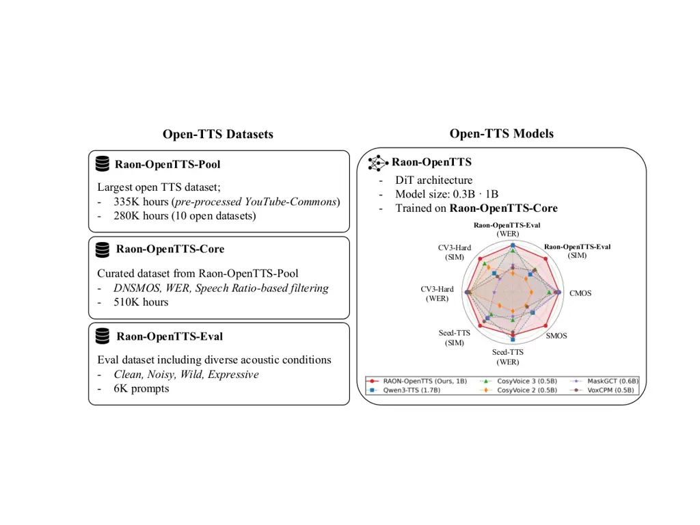

\uselogo\paperdate

August 24, 2026

# Raon-OpenTTS: Open Models and Data for Robust Text-to-Speech

Semin Kim^(∗†) Affiliation: Seoul National University    Seungjun
Chung^(∗) Affiliation: KRAFTON    Taehong Moon Affiliation: KRAFTON   
Sangheon Lee^(†) Affiliation: KRAFTON Affiliation: KAIST    Minyoung
Ahn^(†) Affiliation: KRAFTON Affiliation: Seoul National University   
Keon Lee Affiliation: KRAFTON    Nam Soo Kim Affiliation: Seoul National
University    Jaewoong Cho Affiliation: KRAFTON    Ludwig Schmidt
Affiliation: Stanford University    Kangwook Lee Affiliation: KRAFTON
Affiliation: Ludo Robotics Affiliation: University of Wisconsin-Madison
   Dongmin Park Affiliation: KRAFTON

###### Abstract

Recent advances in text-to-speech (TTS) models show impressive speech
naturalness and quality, yet the role of large-scale open data in
driving this progress remains underexplored. In this work, we introduce
Raon-OpenTTS, an open TTS model that performs competitively with
state-of-the-art closed-data TTS models, and Raon-OpenTTS-Pool, a
large-scale open dataset for reproducible TTS training.
Raon-OpenTTS-Pool consists of 615K hours of 240M speech segments
aggregated from publicly available English speech corpora and
web-sourced recordings. With a model-based filtering pipeline applied to
Raon-OpenTTS-Pool, we derive Raon-OpenTTS-Core, a curated, high-quality
subset of 510K hours and 194M speech segments. Using Raon-OpenTTS-Core,
we train Raon-OpenTTS, a series of diffusion transformer (DiT)-based TTS
models from 0.3B to 1B parameters. On multiple benchmarks,
Raon-OpenTTS-1B shows comparable performance to state-of-the-art models
such as Qwen3-TTS and CosyVoice 3, which are trained on several million
hours of proprietary speech data. Notably, on Seed-TTS-Eval,
Raon-OpenTTS-1B achieves a word error rate (WER) of 1.78$`\%`$ and a
speaker similarity (SIM) of 0.749, ranking second on WER and first on
SIM among recent open-weight TTS baselines. On CV3-Hard-EN,
Raon-OpenTTS-1B achieves a WER of 6.15$`\%`$ and a SIM of 0.775, ranking
first on both metrics. Furthermore, to support robust evaluation, we
introduce Raon-OpenTTS-Eval, a structured benchmark for assessing TTS
robustness across diverse acoustic conditions including clean, noisy,
in-the-wild, and expressive speech. On Raon-OpenTTS-Eval,
Raon-OpenTTS-1B achieves the best average WER and SIM among all
evaluated models, and the second-best human preference, as measured by
comparative mean opinion score (CMOS). Our data pool, filtering
pipeline, training code, and checkpoints are publicly available at
[https://github.com/krafton-ai/RAON-OpenTTS](https://github.com/krafton-ai/RAON-OpenTTS).

^(†)^(†)footnotetext: ^(∗) Equal contribution.^(†)^(†)footnotetext: ^(†)
Work done while doing an internship at KRAFTON.

## 1 Introduction

Text-to-speech (TTS) synthesis has advanced rapidly in recent years,
with modern models capable of producing high-quality speech across
diverse speakers, styles, and acoustic conditions. Despite the growing
number of TTS models, most state-of-the-art models do not fully disclose
their training data or data curation pipelines, which limits the
research community to systematically study, reproduce, and build upon
these advances. Just as open data efforts have played a critical role in
accelerating progress in other domains, such as those underlying large
language models (LLMs) (Penedo et al., 2024), CLIP (Gadre et al., 2023),
and Whisper (Ngo et al., 2025), establishing open datasets and models
for TTS is essential to enable systematic and reproducible research at
scale.

State-of-the-art TTS models trained on large-scale proprietary data,
such as Qwen3-TTS (Hu et al., 2026) and CosyVoice 3 (Du et al., 2025),
achieve remarkable zero-shot speech generation performance across
diverse speakers and acoustic conditions. However, these models are
trained on multi-million hours of proprietary speech data unavailable to
the public. Among models trained entirely on open speech-text data,
F5-TTS (Chen et al., 2025) and MaskGCT (Wang et al., 2024) show the most
competitive performance. Both models are trained on approximately 100K
hours of a single speech dataset, Emilia (He et al., 2024).
Nevertheless, as shown in Table 1, their performance still exhibits a
significant gap compared to state-of-the-art systems trained on
proprietary data, highlighting the need for a comprehensive study on
whether large-scale, multi-source open datasets can bridge this gap and
enable fully reproducible models.

In this paper, we establish a high-performing, fully reproducible TTS
framework with open data, open weights, and a transparent training
pipeline. We first present Raon-OpenTTS-Pool, a 615K-hour English
speech-text dataset constructed from 10 publicly available speech
corpora together with web-sourced recordings. From this pool, we derive
Raon-OpenTTS-Core, a filtered training subset constructed using a
model-based pipeline that removes potentially problematic speech
segments based on transcription consistency, acoustic quality, and
speech activity ratio. Next, we release Raon-OpenTTS, a series of
diffusion transformer (DiT)-based TTS models with 0.3B and 1B
parameters, trained on our proposed datasets. Notably, Raon-OpenTTS-1B
trained on Raon-OpenTTS-Core achieves performance comparable to
state-of-the-art TTS models across popular TTS benchmarks such as
Seed-TTS-Eval (Anastassiou et al., 2024) and CV3-Eval (Du et al., 2025),
ranking first or second in word error rate (WER) and speaker similarity
(SIM) among recent zero-shot TTS baselines.

Moreover, to support robust evaluation on diverse acoustic conditions,
we introduce Raon-OpenTTS-Eval, a structured benchmark constructed from
12 publicly available speech datasets, including CMU-ARCTIC (Kominek and
Black, 2004), TED-LIUM3 (Hernandez et al., 2018), and EmoV-DB (Adigwe et
al., 2018). We group these datasets into four acoustic regimes, Clean,
Noisy, Wild, and Expressive to cover controlled read speech, noisy
environments, in-the-wild conversations, and expressive speech. Unlike
existing benchmarks that rely on prompts drawn from a single read-speech
dataset and evaluate only a limited number of generations,
Raon-OpenTTS-Eval comprises 6K speech prompt-text pairs sampled from
diverse datasets, enabling robust assessment across acoustic conditions.
On Raon-OpenTTS-Eval, Raon-OpenTTS-1B achieves the best average WER and
SIM across acoustic regimes while matching the top-performing models in
human preference scores, such as comparative mean opinion score (CMOS)
and similarity mean opinion score (SMOS).

Our contributions are summarized as follows:

- •
  We introduce Raon-OpenTTS-Pool, a 615K-hour English speech corpus
  aggregated from 10 publicly available sources and web-sourced
  recordings, which is the largest openly available multi-source dataset
  curated for TTS training to our knowledge.
- •
  We derive Raon-OpenTTS-Core, a filtered subset of 510K hours and 194M
  speech segments from Raon-OpenTTS-Pool, and show that training on
  Raon-OpenTTS-Core consistently improves zero-shot TTS performance over
  the unfiltered pool.
- •
  We introduce Raon-OpenTTS-Eval, a robustness-oriented evaluation
  benchmark spanning four acoustic regimes (Clean, Noisy, Wild,
  Expressive) with 6K prompt-text pairs, enabling systematic analysis of
  zero-shot TTS across diverse real-world conditions.
- •
  We release Raon-OpenTTS, a DiT-based TTS model family (0.3B, 1B
  parameters), which ranks first or second in WER and SIM among recent
  zero-shot TTS baselines on Seed-TTS-Eval and CV3-Eval, competitive
  with models trained on large-scale proprietary data.

|                   |        |               |             |           |                   |                 |
| ----------------- | ------ | ------------- | ----------- | --------- | ----------------- | --------------- |
| Model             | Param. | Training Data | Open-Weight | Open-Data | WER$`\downarrow`$ | SIM$`\uparrow`$ |
| Human             | \-     | \-            | \-          | \-        | 2.14              | 0.734           |
| Seed-TTS          | -      | -             |             |           | 2.25              | 0.762           |
| CosyVoice 3       | 1.5B   | $`\sim`$ 1M   |             |           | 2.21              | 0.720           |
| Index-TTS 2       | 1.5B   | 55K           | ✓           |           | 2.18              | 0.709           |
| Llasa             | 8B     | 250K          | ✓           |           | 3.63              | 0.581           |
| VoxCPM            | 0.5B   | 1.8M          | ✓           |           | 1.98              | 0.730           |
| CosyVoice 2       | 0.5B   | 170K          | ✓           |           | 2.61              | 0.659           |
| CosyVoice 3       | 0.5B   | $`\sim`$ 1M   | ✓           |           | 2.50              | 0.698           |
| Qwen3-TTS         | 1.7B   | $`\sim`$ 5M   | ✓           |           | 1.46              | 0.715           |
| Voxtral TTS       | 4B     | \-            | ✓           |           | 2.19              | 0.663           |
| MaskGCT           | 0.6B   | 100K          | ✓           | ✓         | 2.57              | 0.713           |
| F5-TTS            | 0.3B   | 100K          | ✓           | ✓         | 2.04              | 0.671           |
| Raon-OpenTTS-0.3B | 0.3B   | 510K          | ✓           | ✓         | 1.95              | 0.687           |
| Raon-OpenTTS-1B   | 1.0B   | 510K          | ✓           | ✓         | 1.78              | 0.749           |

Table 1: Results on Seed-TTS-Eval (Anastassiou et al., 2024) benchmark.
Raon-OpenTTS outperforms the open-data, open-weight baselines while
remaining comparable with strong open-weight, closed-data TTS baselines.
We report the word error rate (WER) and speaker similarity (SIM). Bold
indicates the best performance, and underline indicates the second-best
performance among the compared open-weight models.

## 2 Background & Related Work

### 2.1 Text-to-speech models

Discrete approaches generate speech by modeling sequences of discrete
acoustic or codec tokens. VALL-E (Wang et al., 2023) introduced the
neural codec language modeling paradigm, framing zero-shot TTS as
conditional token prediction over discrete codec representations.
Building on this, MaskGCT (Wang et al., 2024) applies masked generative
modeling for efficient zero-shot synthesis, VoxCPM (Zhou et al., 2025)
proposes a tokenizer-free formulation improving context modeling and
voice fidelity, and Seed-TTS (Anastassiou et al., 2024) demonstrates
that scaling such models enables robust generation across diverse
speakers and conditions. More recent systems extend this paradigm with
large language model architectures: LLaSA (Ye et al., 2025) scales codec
language modeling to multi-billion parameters, and Qwen3-TTS (Hu et al., 2026) adopts an LLM-based architecture over discrete speech tokens for
high-quality synthesis.

Continuous approaches generate speech directly in continuous acoustic or
latent spaces, typically using diffusion or flow-based objectives.
DiTTo-TTS (Lee et al., 2024) employs a DiT-based latent diffusion
framework that generates speech in compressed latent representations.
F5-TTS (Chen et al., 2025) adopts a DiT backbone with a flow-matching
objective, enabling efficient speech synthesis with simplified
text-speech alignment.

Hybrid approaches combine discrete semantic representations with
continuous acoustic generation to improve controllability and speech
quality. CosyVoice 2 and 3 (Du et al., 2024; Du et al., 2025) integrate
large language model-based semantic token generation with conditional
flow matching for acoustic synthesis, enabling multilingual and
instruction-following capabilities. IndexTTS 2 (Zhou et al., 2026)
explores semantic indexing for efficient style manipulation and
controllable speech generation. Voxtral-TTS (Liu et al., 2026) adopts a
unified LLM-based architecture that jointly models semantic and acoustic
aspects of speech, with acoustic generation formulated using a
flow-matching objective.

### 2.2 Open datasets for foundation models

Text (LLMs). Open datasets have played a central role in enabling
reproducible LLM training. The Pile (Gao et al., 2020) established an
early publicly available resource for LLM pretraining, and subsequent
efforts, including RefinedWeb (Penedo et al., 2023), RedPajama (Weber et
al., 2024), Dolma (Soldaini et al., 2024), and FineWeb (Penedo et al.,
2024), improved the scale and quality of open web-derived text corpora.
DataComp-LM (Li et al., 2024) further systematically studied data
curation strategies and scaling behavior for open LLM training.

Image-text models. In vision and multimodal learning, LAION (Schuhmann
et al., 2022) provides billions of web-mined image-text pairs, and
DataComp (Gadre et al., 2023) introduces a controlled benchmark for
studying dataset curation at scale. These resources have supported
OpenCLIP (Cherti et al., 2023), which reproduces CLIP (Radford et al., 2021) using entirely open data.

Speech (ASR and TTS). Similar efforts have emerged in speech recognition
to reproduce Whisper (Radford et al., 2022), which is trained on
proprietary data. OWSM (Peng et al., 2024) investigates Whisper-style
training using public datasets and open-source toolchains, and OLMoASR
(Ngo et al., 2025) introduces a large-scale open dataset and curation
pipeline for fully reproducible ASR training. Despite these advances,
reproducible large-scale training remains underexplored in TTS. Compared
to ASR, TTS requires more reliable utterance-level speech-text alignment
and consistent speaker characteristics, making large-scale data
construction substantially more challenging. Existing open TTS datasets
fall short of the multi-million-hour scale used by many recent TTS
systems, whose training data is not publicly available.

## 3 Methods

Figure 1: Overview of Raon-OpenTTS. Raon-OpenTTS-Pool contains 615K
hours of English speech, including 335K hours from pre-processed
YouTube-Commons and 280K hours from 10 publicly available datasets.
Raon-OpenTTS-Core is a 510K-hour filtered subset constructed using Deep
Noise Suppression Mean Opinion Score (DNSMOS), WER, and Speech
Ratio-based filtering. Raon-OpenTTS-Eval is a robustness-oriented
benchmark with 6K prompts across Clean, Noisy, Wild, and Expressive
conditions. Raon-OpenTTS is a DiT-based TTS model family with 0.3B and
1B variants trained on Raon-OpenTTS-Core. The radar chart summarizes
objective performance, measured by WER and SIM on Seed-TTS, CV3-Hard,
and RAON-OpenTTS-Eval, together with subjective evaluation results based
on comparative mean opinion score (CMOS) and similarity mean opinion
score (SMOS).

In this section, we introduce Raon-OpenTTS-Pool, a large-scale open TTS
data pool collected from diverse sources, Raon-OpenTTS-Core, a curated,
high-quality subset of Raon-OpenTTS-Pool, and Raon-OpenTTS, our series
of open-weight TTS models trained on the proposed datasets. Figure 1
summarizes the overall data collection, curation, and training pipeline
of the Raon-OpenTTS family.

### 3.1 Raon-OpenTTS-Pool

We construct Raon-OpenTTS-Pool, a large-scale open English speech corpus
by aggregating diverse public datasets. Constructing such a dataset is
non-trivial, as TTS requires not only transcribed speech but also
reliable utterance-level alignment and speaker consistency. Accordingly,
we combine both TTS-oriented and ASR-style datasets to achieve both
scale and diversity.

Data Sources. We restrict our data sources to publicly available English
speech datasets with more than 500 hours of audio, as smaller corpora
contribute only marginally to the overall data volume. In addition,
including many small datasets increases dataset fragmentation and
management complexity. We further limit speech segments to those shorter
than 30 seconds to reduce alignment errors, multi-speaker content, and
non-speech artifacts. Since Seed-TTS-Eval includes samples derived from
Common Voice, we exclude all Common Voice data when training the TTS
models used for evaluation to ensure fair comparison. Based on these
criteria, Raon-OpenTTS-Pool is constructed by combining and processing
11 publicly available English speech-text corpora, including LibriTTS-R
(Koizumi et al., 2023), SPGISpeech (O’Neill et al., 2021), SPGISpeech
2.0 (Grossman et al., 2025), HiFiTTS2 (Langman et al., 2025), LibriHeavy
(Kang et al., 2024), GigaSpeech (Chen et al., 2021), VoxPopuli (Wang et
al., 2021), People’s Speech (Galvez et al., 2021), Emilia (He et al.,
2024), Emilia-YODAS (He et al., 2024), and YouTube-Commons ¹¹ 1
https://huggingface.co/datasets/PleIAs/YouTube-Commons.

Four of the constituent datasets are originally multilingual corpora; we
extract only the English subset from each. For Emilia and Emilia-YODAS,
we use the official English split. For VoxPopuli, we select English
sessions from the European Parliament recordings. For YouTube-Commons,
we first select videos labeled as English in the original metadata, then
verify language identity using Whisper-based language detection during
preprocessing. The collection spans both TTS-oriented and ASR datasets;
ASR corpora are included when they provide utterance-level aligned
speech-text pairs, as they broaden speaker, domain, and acoustic
diversity. For VoxPopuli, where complete transcriptions are unavailable
or partially missing, we construct speech-text pairs by referencing
available transcripts from MoSEL (Gaido et al., 2024).

As shown in Table 2, these datasets span a wide range of domains,
recording conditions, and annotation qualities, and are released under
the following licenses: CC BY 4.0, CC-0, Apache 2.0, Public Domain,
Kensho User Agreement (non-commercial research only) and CC BY-NC 4.0. A
substantial portion of Raon-OpenTTS-Pool is derived from
YouTube-Commons, contributing 335K hours of speech data. Since the
original release provides only YouTube URLs with noisy or unreliable
transcriptions, we reconstruct this portion by collecting the audio and
processing it into a high-quality speech-text dataset, which we refer to
as Raon-YouTube-Commons and use as part of the training data.

Preprocessing Pipeline for YouTube-Commons. Unlike the other datasets in
Raon-OpenTTS-Pool, which are mostly released as utterance-level
speech-text pairs, the Raon-YouTube-Commons dataset consists of
long-form recordings ranging from approximately 15 minutes to several
hours. A substantial portion of these recordings includes non-speech
content, background audio, or low-quality speech that is unsuitable for
TTS training, requiring preprocessing to extract reliable speech-text
pairs. For the YouTube-Commons portion, we therefore apply a precise
data preprocessing pipeline inspired by prior work (He et al., 2024).
The pipeline consists of the following stages:

1.  (a)
    Audio standardization and loudness normalization. All audio is
    resampled to 16 kHz mono and normalized to a fixed loudness level to
    reduce variability across sources.
2.  (b)
    Source separation (UVR-MDX²² 2
    https://github.com/Anjok07/ultimatevocalremovergui). We apply
    UVR-MDX to suppress background music and non-vocal components,
    improving downstream diarization and ASR robustness.
3.  (c)
    Speaker diarization (PyAnnote 3.1³³ 3
    https://huggingface.co/pyannote/speaker-diarization-3.1). Speaker
    boundaries are estimated to ensure that each segment contains speech
    from a single dominant speaker.
4.  (d)
    Voice activity detection (Silero VAD⁴⁴ 4
    https://github.com/snakers4/silero-vad). Continuous speech regions
    are segmented into clips ranging from 3 to 30 seconds to balance
    context length and model stability.
5.  (e)
    Automatic transcription (Whisper-large-v3⁵⁵ 5
    https://huggingface.co/openai/whisper-large-v3). Each segment is
    transcribed using Whisper-large-v3 to obtain aligned speech-text
    pairs.

We remove samples for which the transcription length is
disproportionately short relative to the corresponding audio duration,
as these typically indicate severe misalignment or transcription
failures. Finally, all audio from the collected datasets is standardized
to a unified representation. For storage efficiency, audio is stored in
64 kbps Opus format and is decompressed, resampled to 16 kHz, and
normalized for training.

|                                                              |         |              |           |               |                 |                   |                |
| ------------------------------------------------------------ | ------- | ------------ | --------- | ------------- | --------------- | ----------------- | -------------- |
| Dataset                                                      | Size(h) | Avg. Dur.(s) | Sgmts.(M) | License       | DNS$`\uparrow`$ | WER$`\downarrow`$ | SR$`\uparrow`$ |
| Raon-YouTube-Commons^(†)                                     | 335K    | 8.5          | 141.7     | CC BY 4.0     | 2.74            | 0.30              | 0.90           |
| Emilia-YODAS^(†)                                             | 92K     | 9.2          | 36.0      | CC BY-NC 4.0  | 2.82            | 0.19              | 0.90           |
| Emilia^(†)                                                   | 47K     | 9.3          | 18.1      | CC BY 4.0     | 3.02            | 0.18              | 0.89           |
| LibriHeavy                                                   | 42K     | 14.2         | 10.8      | Public Domain | 3.22            | 0.11              | 0.83           |
| HiFiTTS2                                                     | 37K     | 10.1         | 13.1      | CC BY 4.0     | 3.20            | 0.11              | 0.84           |
| People’s Speech                                              | 28K     | 14.2         | 7.0       | CC BY 4.0     | 2.63            | 0.25              | 0.86           |
| VoxPopuli^(†)                                                | 17K     | 27.8         | 2.2       | CC-0          | 2.82            | 0.36              | 0.83           |
| GigaSpeech                                                   | 10K     | 4.3          | 8.3       | Apache 2.0    | 2.73            | 0.16              | 0.90           |
| SPGISpeech                                                   | 5K      | 9.2          | 2.0       | Kensho UA^(‡) | 2.90            | 0.03              | 0.86           |
| SPGISpeech 2.0                                               | 889     | 14.4         | 0.2       | Kensho UA     | 2.72            | 0.08              | 0.90           |
| LibriTTS-R                                                   | 552     | 5.6          | 0.4       | CC BY 4.0     | 2.96            | 0.06              | 0.91           |
| Total / Avg.                                                 | 615K    | 9.2          | 239.7     | –             | 2.83            | 0.24              | 0.89           |
| ^(†)Originally multilingual; we use only the English subset. |         |              |           |               |                 |                   |                |
| ^(‡)Kensho User Agreement (non-commercial research only).    |         |              |           |               |                 |                   |                |

Table 2: Data composition and quality statistics of Raon-OpenTTS-Pool.
For each dataset, we report total data size, average duration and number
of speech segments, license, and their quality scores, including Deep
Noise Suppression Mean Opinion Score (DNSMOS; shown as DNS in the
table), WER, and Speech Ratio (SR). We exclude speech segments longer
than 30 seconds.

Data statistics. Raon-OpenTTS-Pool consists of 615K hours of speech
audio and 240M speech segments. Table 2 summarizes both the scale and
quality characteristics of each dataset in Raon-OpenTTS-Pool. The
constituent datasets exhibit a broad temporal coverage in average
segment length. LibriTTS-R and GigaSpeech have relatively short average
durations of 5.6 and 4.3 seconds, whereas VoxPopuli contains much longer
segments with average durations of 27.8 seconds. We also report DNSMOS
(Reddy et al., 2021), WER, and Speech Ratio for each dataset. WER is
measured by transcribing each speech segment using a Whisper-small ASR
model and computing the mismatch with the existing text annotations,
while Speech Ratio is estimated using Silero VAD to quantify the
proportion of frames containing active speech. Audiobook-derived
read-speech datasets such as HiFiTTS2 and LibriHeavy achieve relatively
high DNSMOS scores of 3.20 and 3.22, respectively, along with a low WER
of 0.11, indicating cleaner acoustic conditions. In contrast,
ASR-oriented datasets such as People’s Speech, GigaSpeech, and
VoxPopuli, exhibit lower DNSMOS scores in the range of 2.63-2.82 and
higher WER values between 0.16 and 0.36. The Raon-YouTube-Commons subset
shows a relatively high WER of 0.30, which reflects its fully
in-the-wild nature, encompassing diverse recording environments,
background noise, and spontaneous speech patterns. This stands in
contrast to datasets with highly reliable transcriptions, such as
LibriTTS-R and SPGISpeech, which achieve much lower WER values (0.06 and
0.03, respectively). These variations in acoustic quality and
transcription reliability highlight the heterogeneous nature of
Raon-OpenTTS-Pool, motivating systematic filtering to obtain a more
suitable TTS training set.

Figure 2: Distribution of data quality scores in Raon-OpenTTS-Pool and
the percentile-based filtering thresholds used to construct
Raon-OpenTTS-Core. Histograms show the distributions of DNSMOS, Speech
Ratio, and WER. The dashed vertical lines indicate the cutoff
corresponding to removal of the lowest-quality 15% tail for each metric,
yielding thresholds of 2.24 for DNSMOS, 0.79 for Speech Ratio, and 0.35
for WER. These thresholds align with visually distinct low-quality tails
while preserving the majority of the training data.

|                |                   |                 |                 |                   |                   |                 |                 |                   |                 |                 |                    |
| -------------- | ----------------- | --------------- | --------------- | ----------------- | ----------------- | --------------- | --------------- | ----------------- | --------------- | --------------- | ------------------ |
|                | Seed-TTS-Eval     |                 |                 | CV3-EN            | CV3-Hard-EN       |                 |                 | Raon-OpenTTS-Eval |                 |                 | Overall            |
| Filtering      | WER$`\downarrow`$ | SIM$`\uparrow`$ | DNS$`\uparrow`$ | WER$`\downarrow`$ | WER$`\downarrow`$ | SIM$`\uparrow`$ | DNS$`\uparrow`$ | WER$`\downarrow`$ | SIM$`\uparrow`$ | DNS$`\uparrow`$ | Rank$`\downarrow`$ |
| Combined (15%) | 2.00              | 0.672           | 3.12            | 4.25              | 8.14              | 0.642           | 3.11            | 4.46              | 0.611           | 3.05            | 3.40               |
| DNSMOS (15%)   | 1.97              | 0.669           | 3.15            | 4.18              | 7.33              | 0.617           | 3.15            | 4.67              | 0.602           | 3.00            | 3.60               |
| WER (15%)      | 1.99              | 0.668           | 3.15            | 4.47              | 8.20              | 0.620           | 3.12            | 3.66              | 0.594           | 3.03            | 4.50               |
| DNSMOS (50%)   | 1.98              | 0.671           | 3.14            | 4.90              | 7.20              | 0.622           | 3.13            | 5.34              | 0.588           | 3.02            | 4.70               |
| No filtering   | 2.19              | 0.661           | 3.14            | 4.73              | 8.53              | 0.628           | 3.12            | 4.30              | 0.603           | 3.03            | 4.90               |
| Combined (50%) | 2.32              | 0.672           | 3.14            | 5.01              | 7.56              | 0.630           | 3.15            | 4.83              | 0.601           | 3.01            | 4.90               |
| VAD (15%)      | 2.22              | 0.665           | 3.13            | 4.81              | 7.86              | 0.621           | 3.11            | 4.24              | 0.604           | 3.04            | 5.20               |
| VAD (50%)      | 2.10              | 0.666           | 3.10            | 4.27              | 7.69              | 0.620           | 3.11            | 4.58              | 0.597           | 2.99            | 6.20               |
| WER (50%)      | 2.20              | 0.655           | 3.14            | 5.17              | 9.88              | 0.607           | 3.11            | 4.96              | 0.590           | 3.03            | 7.60               |

Table 3: Data filtering ablation results on Seed-TTS-Eval, CV3-Hard-EN,
and Raon-OpenTTS-Eval (average over Clean/Noisy/Wild/Expressive
subsets). All models in this table use ablation-specific 0.3B variants
trained for fewer steps with a different learning-rate schedule from the
main Raon-OpenTTS-0.3B. The final column reports the overall average
rank across all evaluation metrics, where lower is better; DNS denotes
DNSMOS, and Rank denotes average rank. Bold indicates the best
performance, and underline indicates the second-best performance.
WER $`>`$ 100% samples (Whisper hallucinations) are excluded from WER
computation.

### 3.2 Raon-OpenTTS-Core

In this section, we describe the construction of Raon-OpenTTS-Core, a
curated subset of Raon-OpenTTS-Pool designed to improve data quality for
TTS training. While Raon-OpenTTS-Pool provides large-scale coverage, it
contains substantial variation in acoustic quality and transcription
reliability, which can negatively affect model performance. To address
this, we filter out low-quality samples using three model-based
criteria: WER, Deep Noise Suppression Mean Opinion Score (DNSMOS), and
Speech Ratio, resulting in a more reliable training set.

1.  (a)
    WER-based filtering. We transcribe each audio segment using a
    Whisper-small ASR model and compute the WER against the existing
    text annotation. Segments with excessively high WER are discarded,
    as they are likely to contain severe transcription mismatches or
    highly degraded speech.
2.  (b)
    DNSMOS-based filtering. We estimate perceptual speech quality using
    DNSMOS and remove segments falling below a minimum quality
    threshold, targeting recordings with strong background noise or
    distortion.
3.  (c)
    VAD-based filtering. We estimate speech segment proportion of each
    segment, denoted Speech Ratio, using Silero VAD and discard segments
    with an unusually low Speech Ratio, which typically correspond to
    recordings dominated by silence, music, or non-speech audio.
4.  (d)
    Combined filtering. We jointly consider all three quality signals by
    computing an absolute rank for each segment along each criterion
    (DNSMOS, WER, and SR) and averaging the ranks into a single combined
    score. We then discard segments falling below a 15th-percentile
    threshold. This approach prevents any single noisy signal from
    dominating the filtering decision and yields more stable performance
    across diverse evaluation settings. (see Table 3).

Threshold selection. We adopt a 15th-percentile removal threshold for
each quality metric, where the percentile is computed over speech
segments rather than total audio hours. As shown in Figure 2, this
percentile lies near the low-quality tail of each empirical distribution
rather than the main body. For DNSMOS, this corresponds to values below
2.24, indicating acoustically degraded recordings. For SR, most samples
are concentrated near 0.9 to 1.0, and values below 0.79 correspond to
segments containing more than 21% non-speech content. For WER, the
distribution is sharply concentrated near zero, while values above 0.35
are associated with severely mismatched or unreliable speech-text pairs.
This threshold represents a conservative balance between removing
clearly low-quality samples and retaining sufficient data scale and
diversity. We additionally consider a more aggressive 50% removal
threshold to assess the effect of over-filtering on model performance.

|                         |          |               |
| ----------------------- | -------- | ------------- |
| Dataset                 | Core (M) | Retention (%) |
| LibriTTS-R              | 0.3      | 97.7          |
| HiFiTTS2                | 11.9     | 94.5          |
| LibriHeavy              | 10.2     | 94.4          |
| Emilia                  | 16.8     | 93.2          |
| Emilia-YODAS            | 31.6     | 87.8          |
| People’s Speech (Clean) | 1.3      | 83.9          |
| Raon-YouTube-Commons    | 117.5    | 82.9          |
| VoxPopuli               | 1.6      | 71.8          |
| People’s Speech (Dirty) | 2.6      | 48.2          |
| Total                   | 193.9    | 84.7          |

Table 4: Per-dataset retention after combined 15th-percentile filtering.
Retention denotes the fraction of segments preserved in
Raon-OpenTTS-Core. Studio-quality corpora retain over 93%, while noisier
ASR-oriented datasets are more aggressively filtered. Notably,
Raon-YouTube-Commons retains 82.9% of its segments despite its
in-the-wild origin, indicating that the majority of its data meets the
quality threshold for TTS training.

#### Filtering ablation.

To investigate the effectiveness of the filtering pipeline, we conduct
an ablation study using Raon-OpenTTS-0.3B (see Section 3.3 for details).
All models are trained with a fixed number of update steps corresponding
to one epoch of the full dataset (i.e., the unfiltered
Raon-OpenTTS-Pool), ensuring that performance differences arise from
data quality rather than training duration. Table 3 summarizes the
results across multiple benchmarks. Among all strategies, combined
filtering with a 15th-percentile removal threshold achieves the best
average rank, indicating the most consistent overall performance. In
general, moderate filtering (15%) outperforms more aggressive filtering
(50%), suggesting that removing only the lowest-quality tail improves
data quality while preserving sufficient diversity. Table 4 shows the
per-dataset effect of the combined filter. Studio-quality read-speech
datasets such as LibriTTS-R (97.7%), HiFiTTS2 (94.5%), and LibriHeavy
(94.4%) are nearly fully preserved, consistent with their high DNSMOS
and low WER (Table 2). In contrast, People’s Speech (Dirty) retains only
48.2% due to its lower DNSMOS (2.63) and higher WER (0.25). Notably,
Raon-YouTube-Commons retains 82.9% of its segments despite its
in-the-wild recording conditions, suggesting that the preprocessing
pipeline (Section 3.1) effectively produces segments of sufficient
quality for TTS training.

### 3.3 Raon-OpenTTS

#### Model architecture.

Our model is based on the DiT architecture introduced in F5-TTS for
zero-shot TTS synthesis. We intentionally adopt the original
architecture without alteration in order to isolate the effect of data
scale and coverage. Based on this architecture, we train three model
variants of different scales: Raon-OpenTTS-0.3B and Raon-OpenTTS-1B,
both trained on Raon-OpenTTS-Core. All models share the same
architectural design and training objective, while differing in model
capacity through scaling the number of transformer layers, attention
heads, attention embedding dimension, and feed-forward dimension, as
summarized in Appendix A.

#### Training configurations.

All models are trained using distributed training on NVIDIA B200 GPUs
with gradient norm clipping at a maximum norm of 1.0. Raon-OpenTTS-0.3B
is trained for 225K update steps with a per-GPU batch size of 35K audio
frames, a peak learning rate of $`7.5\times 10^{-5}`$ linearly warmed up
for 50K steps and linearly decayed for the remainder. Raon-OpenTTS-1B is
trained for 550K update steps with a per-GPU batch size of 14K audio
frames, a peak learning rate of $`1\times 10^{-4}`$ linearly warmed up
for 50K steps and linearly decayed for the remainder. Raon-OpenTTS-0.3B
and Raon-OpenTTS-1B require approximately 1K and 9K GPU-hours for
training, respectively. Audio is represented using 80-channel log
mel-spectrogram features extracted at a sampling rate of 16 kHz with a
hop size of 256. Text is represented at the character level, with a
vocabulary size of 5,512. For waveform synthesis, we use the HiFi-GAN⁶⁶
6 https://huggingface.co/speechbrain/tts-hifigan-libritts-16kHz vocoder
pretrained on LibriTTS at 16 kHz. For inference, both Raon-OpenTTS and
F5-TTS use 32 NFE steps for ODE sampling. The 0.3B models used in the
filtering and data ablation studies are separate ablation variants
trained for fewer steps with a different learning-rate schedule.

## 4 Experimental setup

### 4.1 Evaluation on conventional benchmarks

We employ two representative benchmarks for zero-shot TTS evaluation:
Seed-TTS-Eval and CV3-Eval. For Seed-TTS-Eval, we use the English subset
(Seed-TTS-EN) only. This benchmark reports intelligibility measured by
WER and SIM. WER is computed by transcribing synthesized speech using
Whisper-large-v3 (Radford et al., 2022), while SIM is measured using
speaker embeddings extracted from a WavLM-large (Chen et al., 2022)
fine-tuned for speaker verification, following the official evaluation
protocol. For CV3-Eval, we evaluate on both the English (EN) and hard
English (Hard-EN) subsets. On the EN subset, intelligibility is
evaluated using WER. The more challenging Hard-EN subset contains
linguistically complex English sentences and is evaluated using three
complementary metrics: WER for intelligibility, SIM for speaker
similarity, and DNSMOS for perceived speech quality. For speaker
similarity on Hard-EN, we follow the official protocol and use an
ERes2Net (Chen et al., 2023)-based speaker verification model.

### 4.2 Raon-OpenTTS-Eval

Existing zero-shot TTS benchmarks typically evaluate models using around
1,000 prompts drawn from a single read-speech dataset to assess
zero-shot synthesis ability in a target language. As a result, the
evaluation is tied to the specific acoustic characteristics of the
dataset, providing an incomplete view of model robustness, particularly
under realistic and challenging recording scenarios. Moreover, prior
benchmarks rarely analyze robustness in a structured manner across
different acoustic regimes. To address these limitations, we introduce
Raon-OpenTTS-Eval, a new benchmark designed to enable a more systematic
robustness analysis of zero-shot TTS models. We categorize prompt speech
into four acoustic categories according to recording conditions,
speaking style, and acoustic variability: Clean, Noisy, Wild, and
Expressive. Across these categories, Raon-OpenTTS-Eval comprises a total
of 12 evaluation datasets covering controlled read speech, noisy and
reverberant environments, spontaneous conversational speech, and
expressive speech as follows:

#### Clean.

The Clean category consists of high-quality, studio-like read speech
recorded under controlled acoustic conditions. These datasets serve as a
reference setting for evaluating pronunciation accuracy and naturalness
under minimal acoustic distortion. We include LibriSpeech-clean
(Panayotov et al., 2015), ST American English ⁷⁷ 7
https://www.openslr.org/45/, CMU-ARCTIC (Kominek and Black, 2004),
L2-ARCTIC (Zhao et al., 2018), and VCTK (Yamagishi et al., 2019),
totaling five datasets.

#### Noisy.

The Noisy category includes read or prompted speech recorded in the
presence of noticeable background noise or reverberation. These datasets
evaluate robustness to environmental interference, channel variability,
and mild acoustic corruption. We use LibriSpeech-other and TED-LIUM 3
(Hernandez et al., 2018) as representative noisy-speech benchmarks.

#### Wild.

The Wild category contains unscripted or conversational speech captured
in uncontrolled real-world settings and subsequently transcribed. These
datasets test robustness to spontaneous speech phenomena and real-world
conversational recording conditions that are rarely covered by
clean-speech benchmarks. This category includes AMI-IHM and AMI-SDM
(Kraaij et al., 2005). For AMI-SDM, we observe a substantial number of
samples with noisy or misaligned transcriptions. To ensure reliable
evaluation, we retain only segments with zero word error rate (WER), as
estimated by a Whisper ASR model, filtering out samples with severe
transcription mismatches.

#### Expressive.

The Expressive category focuses on speech with explicit affective
content, covering a wide range of emotional expressions and prosodic
styles. These datasets assess a model’s ability to generalize beyond
neutral speaking styles and controlled prosody. We include Expresso
(Nguyen et al., 2023), CREMA-D (Cao et al., 2014), and EmoV-DB (Adigwe
et al., 2018).

For each evaluation dataset, we sample 500 utterances as speech prompts,
selected via stratified sampling when speaker metadata is available to
ensure balanced coverage across speakers and characteristics such as
emotion, dialect, and speaking style. Each prompt is paired with a
target text drawn from a disjoint sentence in the same dataset. Across
the 12 datasets, this protocol yields 6,000 prompt-text pairs, including
2,500 from Clean, 1,000 from Noisy, 1,000 from Wild, and 1,500 from
Expressive. For evaluation, we report normalized WER, computed after
applying the official Whisper text normalizer to both reference and
hypothesis transcripts to avoid penalizing surface-form variations such
as numeric expressions or hyphenated compounds. We also report SIM,
measured as cosine similarity between WavLM speaker embeddings of the
prompt and generated audio.

### 4.3 Baselines

We compare Raon-OpenTTS against 9 recent zero-shot TTS models. For all
open-weight baseline models, we use their officially released
checkpoints and follow the default or recommended inference settings
provided by the authors, without additional tuning. For CosyVoice 3, we
use the officially released 0.5B checkpoint, as the 1.5B variant is not
available as open weights. For closed-weight models, we report the
evaluation results as published by the original authors, since direct
inference with these models is not publicly accessible. Our evaluation
includes Seed-TTS (Anastassiou et al., 2024), CosyVoice 2 (Du et al.,
2024), CosyVoice 3 (Du et al., 2025), Index-TTS 2 (Zhou et al., 2026),
Llasa (Ye et al., 2025), VoxCPM (Zhou et al., 2025), MaskGCT (Wang et
al., 2024), F5-TTS (Chen et al., 2025), and Qwen3-TTS (Hu et al., 2026).

## 5 Results

|                   |                   |                   |                 |                    |
| ----------------- | ----------------- | ----------------- | --------------- | ------------------ |
| Model             | CV3-EN            | CV3-Hard-EN       |                 |                    |
|                   | WER$`\downarrow`$ | WER$`\downarrow`$ | SIM$`\uparrow`$ | DNSMOS$`\uparrow`$ |
| F5-TTS            | 8.54              | \-                | \-              | \-                 |
| MaskGCT           | 7.73              | 41.09             | 0.624           | 3.48               |
| CosyVoice 2       | 6.27              | 10.28             | 0.710           | 3.95               |
| CosyVoice 3       | 4.96              | 10.77             | 0.740           | 3.98               |
| VoxCPM            | 5.24              | 6.44              | 0.670           | 3.78               |
| Qwen3-TTS         | 4.52              | 7.89              | 0.666           | 3.87               |
| Raon-OpenTTS-0.3B | 4.62              | 7.31              | 0.730           | 3.77               |
| Raon-OpenTTS-1B   | 3.92              | 6.15              | 0.775           | 3.85               |

Table 5: Results on the CV3-EN and CV3-Hard-EN zero-shot TTS benchmarks.
Bold indicates the best performance, and underline indicates the
second-best performance. F5-TTS fails to generate most CV3-Hard-EN
samples and 15 out of 500 CV3-EN samples due to its inability to handle
long text inputs; these are excluded from its results.

### 5.1 Seed-TTS-Eval

Table 1 reports the results on the Seed-TTS-Eval (Anastassiou et al.,
2024). Raon-OpenTTS-1B achieves the second-best WER among all evaluated
models, including closed-weight systems, with a WER of 1.78%, surpassed
by Qwen3-TTS, which is trained on multi-million-hour proprietary
corpora. In terms of speaker similarity, Raon-OpenTTS-1B attains a score
of 0.749, ranking first among all open-weight models and remaining
competitive with larger or closed systems. The 0.3B model already
outperforms F5-TTS, its same-size, same-architecture baseline, on both
WER (1.95 vs. 2.04) and SIM (0.687 vs. 0.671), indicating that the gains
of Raon-OpenTTS are not solely due to model scale.

|                   |                   |                 |                   |                 |                   |                 |                   |                 |                   |                 |
| ----------------- | ----------------- | --------------- | ----------------- | --------------- | ----------------- | --------------- | ----------------- | --------------- | ----------------- | --------------- |
| Model             | Clean             |                 | Noisy             |                 | Wild              |                 | Expressive        |                 | Overall           |                 |
|                   | WER$`\downarrow`$ | SIM$`\uparrow`$ | WER$`\downarrow`$ | SIM$`\uparrow`$ | WER$`\downarrow`$ | SIM$`\uparrow`$ | WER$`\downarrow`$ | SIM$`\uparrow`$ | WER$`\downarrow`$ | SIM$`\uparrow`$ |
| F5-TTS            | 2.17              | 0.613           | 3.82              | 0.640           | 136.03            | 0.324           | 3.46              | 0.503           | 25.08             | 0.542           |
| MaskGCT           | 3.39              | 0.672           | 5.56              | 0.727           | 28.00             | 0.581           | 6.44              | 0.546           | 8.61              | 0.635           |
| CosyVoice 2       | 2.59              | 0.642           | 4.39              | 0.675           | 49.73             | 0.535           | 3.66              | 0.536           | 11.02             | 0.603           |
| CosyVoice 3       | 2.53              | 0.678           | 3.69              | 0.720           | 8.31              | 0.618           | 5.49              | 0.567           | 4.43              | 0.647           |
| VoxCPM            | 2.24              | 0.686           | 3.42              | 0.738           | 43.83             | 0.553           | 2.66              | 0.565           | 9.48              | 0.642           |
| Qwen3-TTS         | 3.38              | 0.684           | 4.60              | 0.726           | 79.14             | 0.528           | 5.81              | 0.527           | 17.59             | 0.626           |
| Raon-OpenTTS-0.3B | 1.57              | 0.645           | 4.03              | 0.700           | 5.83              | 0.571           | 2.53              | 0.570           | 2.93              | 0.623           |
| Raon-OpenTTS-1B   | 1.44              | 0.718           | 3.51              | 0.769           | 5.61              | 0.656           | 2.77              | 0.633           | 2.81              | 0.695           |

Table 6: Comparison with recent state-of-the-art zero-shot TTS models
under the proposed evaluation protocol. Overall scores are computed over
all evaluation samples across the four acoustic categories. WER
($`\downarrow`$) and SIM ($`\uparrow`$) are reported. Bold indicates the
best performance, and underline indicates the second-best performance.

### 5.2 CV3-Eval

Table 5 summarizes the results on CV3-EN (Du et al., 2025) and
CV3-Hard-EN. Raon-OpenTTS-1B achieves strong performance on both
evaluation settings, recording the lowest WER of 3.92 on CV3-EN and the
lowest WER of 6.15 on the more challenging CV3-Hard-EN split, which
consists of linguistically complex target texts. In addition,
Raon-OpenTTS-1B attains the highest SIM of 0.775 on CV3-Hard-EN,
indicating superior preservation of speaker similarity. In terms of
perceptual quality, Raon-OpenTTS-1B achieves a DNSMOS score of 3.85,
which is comparable to the best-performing system (CosyVoice 3 at 3.98).
Notably, unlike VoxCPM, which exhibits competitive performance on
Seed-TTS-Eval but a noticeable drop in SIM under the harder evaluation
setting, Raon-OpenTTS-1B maintains strong SIM across both benchmarks.
Taken together, these results show that Raon-OpenTTS-1B delivers the
strongest overall performance on CV3-Eval in intelligibility and speaker
similarity, while remaining competitive in perceptual quality. At the
0.3B scale, Raon-OpenTTS-0.3B also substantially outperforms F5-TTS,
reducing CV3-EN WER from 8.54 to 4.62 and remaining evaluable on
CV3-Hard-EN, where F5-TTS fails on most samples.

### 5.3 Raon-OpenTTS-Eval

Table 6 reports results on Raon-OpenTTS-Eval. Raon-OpenTTS-1B
demonstrates strong overall intelligibility on Raon-OpenTTS-Eval, with
especially large gains in the Clean and Wild conditions. The large
margin observed in the Wild split highlights the robustness of
Raon-OpenTTS under highly unconstrained, real-world acoustic
environments. Raon-OpenTTS-1B also achieves competitive WER values of
3.51 in Noisy and 2.77 in Expressive settings, indicating stable
performance under both environmental noise and expressive speaking
styles. Across all conditions, Raon-OpenTTS-1B maintains consistently
strong speaker similarity, with an overall SIM score of 0.695 and no
pronounced degradation even in the most challenging acoustic scenarios.
These results suggest that Raon-OpenTTS-1B generalizes well across a
wide range of realistic acoustic conditions while preserving speaker
similarity in zero-shot synthesis. Raon-OpenTTS-0.3B achieves an overall
WER of 2.93, dramatically improving over F5-TTS (25.08), with especially
large gains in the Wild condition (5.83 vs. 136.03). Despite its smaller
size, it also achieves lower overall WER than several larger open-weight
baselines, although its speaker similarity remains below the strongest
larger models. Interestingly, several autoregressive baseline models
such as CosyVoice 2, Qwen3-TTS, and VoxCPM exhibit substantially higher
WER in the Wild split. Such behavior is less apparent on conventional
clean-speech benchmarks, highlighting the importance of evaluating
zero-shot TTS models under diverse acoustic regimes.

|                   |       |       |       |            |         |
| ----------------- | ----- | ----- | ----- | ---------- | ------- |
| Model             | Clean | Noisy | Wild  | Expressive | Overall |
| F5-TTS            | -0.82 | -0.48 | -0.48 | -0.95      | -0.68   |
| CosyVoice 2       | -0.59 | -0.35 | -0.38 | -0.15      | -0.36   |
| CosyVoice 3       | -0.06 | -0.45 | -0.12 | 0.10       | -0.13   |
| MaskGCT           | 0.15  | 0.31  | -0.49 | 0.06       | -0.01   |
| Qwen3-TTS         | 0.08  | -0.46 | -0.38 | 0.25       | -0.13   |
| VoxCPM            | 0.14  | 0.10  | -0.06 | -0.30      | -0.05   |
| Raon-OpenTTS-0.3B | 0.54  | -0.24 | 0.16  | -0.42      | -0.01   |
| Raon-OpenTTS-1B   | 0.00  | 0.00  | 0.00  | 0.00       | 0.00    |

Table 7: Subjective evaluation results using comparative mean opinion
score (CMOS), which measures perceived naturalness relative to a
reference. Scores are reported relative to Raon-OpenTTS-1B. Bold
indicates the best performance, and underline indicates the second-best
performance.

|                   |       |       |      |            |         |
| ----------------- | ----- | ----- | ---- | ---------- | ------- |
| Model             | Clean | Noisy | Wild | Expressive | Overall |
| F5-TTS            | 3.86  | 3.37  | 3.50 | 3.50       | 3.55    |
| CosyVoice 2       | 3.90  | 3.35  | 3.43 | 3.49       | 3.53    |
| CosyVoice 3       | 3.87  | 3.63  | 3.46 | 3.40       | 3.58    |
| MaskGCT           | 3.85  | 3.30  | 3.77 | 3.43       | 3.58    |
| Qwen3-TTS         | 3.89  | 3.47  | 3.55 | 3.48       | 3.59    |
| VoxCPM            | 3.98  | 3.32  | 3.50 | 3.41       | 3.54    |
| Raon-OpenTTS-0.3B | 4.01  | 3.55  | 3.39 | 3.54       | 3.60    |
| Raon-OpenTTS-1B   | 3.90  | 3.58  | 3.70 | 3.64       | 3.70    |

Table 8: Subjective evaluation results using similarity mean opinion
score (SMOS) for perceived speaker similarity to a reference. Bold
indicates the best performance, and underline indicates the second-best
performance.

### 5.4 Human preference evaluation

We further conduct human evaluations using both CMOS and SMOS on
Raon-OpenTTS-Eval. In CMOS, listeners compare each baseline against
Raon-OpenTTS-1B and rate overall naturalness, while in SMOS they assess
how similar each synthesized utterance sounds to the reference speech.
Further details of the evaluation protocol are described in Appendix B.
As shown in Table 7, Raon-OpenTTS-1B is preferred over the baselines in
terms of overall naturalness. Among the closest competitors, MaskGCT
records an overall CMOS of -0.01, with gains in the Noisy condition but
a notable drop in the Wild condition. Table 8 reports speaker similarity
results. Raon-OpenTTS-1B achieves the highest overall SMOS of 3.70,
followed by Raon-OpenTTS-0.3B at 3.60. Across acoustic conditions,
Raon-OpenTTS-1B maintains strong and stable speaker similarity,
achieving the best SMOS in the Expressive condition and the second-best
SMOS in the Wild and Noisy condition. While the 1B model achieves better
average objective scores and higher overall speaker similarity, the
category-wise subjective results suggest that the 0.3B and 1B variants
represent different robustness profiles within a practical scaling
range.

## 6 Ablation

In this section, we analyze how different aspects of the training data
contribute to zero-shot TTS performance. We study two aspects of the
training data: (1) the effect of training data source at matched scale
and (2) the impact of incorporating large-scale in-the-wild data. All
experiments use the Raon-OpenTTS-0.3B model trained for 200K steps and
are evaluated on Raon-OpenTTS-Eval, which spans four acoustic conditions
(Clean, Noisy, Wild, and Expressive).

|                  |                   |                 |                   |                 |                   |                 |                   |                 |                   |                 |
| ---------------- | ----------------- | --------------- | ----------------- | --------------- | ----------------- | --------------- | ----------------- | --------------- | ----------------- | --------------- |
| Data             | Clean             |                 | Noisy             |                 | Wild              |                 | Expressive        |                 | Overall           |                 |
|                  | WER$`\downarrow`$ | SIM$`\uparrow`$ | WER$`\downarrow`$ | SIM$`\uparrow`$ | WER$`\downarrow`$ | SIM$`\uparrow`$ | WER$`\downarrow`$ | SIM$`\uparrow`$ | WER$`\downarrow`$ | SIM$`\uparrow`$ |
| Emilia           | 1.28              | 0.593           | 4.02              | 0.641           | 7.35              | 0.470           | 3.60              | 0.505           | 3.33              | 0.558           |
| Pool-Matched-47K | 1.53              | 0.631           | 3.90              | 0.687           | 5.97              | 0.549           | 3.22              | 0.546           | 3.09              | 0.605           |

Table 9: Comparison of training data source at matched scale (47K hours
each). Emilia refers to the English subset used throughout this paper;
Pool-Matched-47K is a Raon-OpenTTS-Pool subset of equal duration. Bold
indicates the best performance.

|          |                   |                 |                   |                 |                   |                 |                   |                 |                   |                 |
| -------- | ----------------- | --------------- | ----------------- | --------------- | ----------------- | --------------- | ----------------- | --------------- | ----------------- | --------------- |
| Dataset  | Clean             |                 | Noisy             |                 | Wild              |                 | Expressive        |                 | Overall           |                 |
|          | WER$`\downarrow`$ | SIM$`\uparrow`$ | WER$`\downarrow`$ | SIM$`\uparrow`$ | WER$`\downarrow`$ | SIM$`\uparrow`$ | WER$`\downarrow`$ | SIM$`\uparrow`$ | WER$`\downarrow`$ | SIM$`\uparrow`$ |
| w/o YC   | 2.17              | 0.615           | 4.21              | 0.668           | 7.62              | 0.523           | 3.43              | 0.540           | 3.73              | 0.590           |
| all data | 1.72              | 0.634           | 6.79              | 0.688           | 6.15              | 0.550           | 2.63              | 0.560           | 3.53              | 0.610           |

Table 10: Impact of YouTube-Commons data on zero-shot TTS performance on
Raon-OpenTTS-Eval. all data refers to training on Raon-OpenTTS-Pool
(615K hours), while w/o YC denotes the split without
Raon-YouTube-Commons (280K hours). Bold indicates the best performance.

### 6.1 Training data composition at matched scale

To study how Raon-OpenTTS-Pool compares with a widely used open TTS
dataset at matched scale, we compare two models trained on 47K-hour
datasets. The first model is trained on the English subset of Emilia, a
widely used open speech dataset, whereas the second is trained on a
Raon-OpenTTS-Pool subset of equal duration (denoted as
Pool-Matched-47K). To keep this comparison focused on data source
composition, we compare the English subset of Emilia with a subset
sampled from Raon-OpenTTS-Pool rather than Raon-OpenTTS-Core; the effect
of quality filtering is analyzed separately in Section 3.2. As shown in
Table 9, Pool-Matched-47K outperforms Emilia on most conditions. Overall
WER improves from 3.33% to 3.09%, with notable gains in Wild (7.35%
$`\to`$ 5.97%) and Expressive (3.60% $`\to`$ 3.22%). Speaker similarity
also improves substantially, rising from 0.558 to 0.605. The consistent
improvements across acoustic conditions suggest that Raon-OpenTTS-Pool
provides a more effective training signal under a fixed data budget.

### 6.2 Incorporating large-scale in-the-wild data

We next analyze the contribution of Raon-YouTube-Commons, a large-scale
in-the-wild speech dataset included in Raon-OpenTTS-Pool. To this end,
we compare two training configurations: one trained on the full dataset
(615K hours), and another trained on a reduced version excluding
Raon-YouTube-Commons (280K hours). Because the two configurations differ
in both scale and domain composition, this comparison measures their
combined effect rather than disentangling the two factors. We
intentionally evaluate this combined effect because Raon-YouTube-Commons
contributes not only additional scale but also real-world acoustic
coverage, both of which are part of its practical value as a newly
processed TTS training source. As shown in Table 10, incorporating
Raon-YouTube-Commons improves performance across several conditions. In
particular, WER decreases in Clean (2.17% → 1.72%), Wild (7.62% →
6.15%), and Expressive (3.43% → 2.63%) settings, while speaker
similarity also improves across most categories. The largest
improvements are observed in the Wild condition, suggesting that
in-the-wild data is particularly beneficial for handling highly variable
real-world speech. However, WER degrades in the Noisy condition (4.21% →
6.79%), suggesting that the added in-the-wild data improves robustness
broadly but does not benefit every acoustic regime equally.

## 7 Conclusion

We presented Raon-OpenTTS, an open-data, open-weight zero-shot TTS model
with performance comparable to state-of-the-art TTS models trained on
proprietary data, together with Raon-OpenTTS-Pool, a 615K-hour English
speech corpus constructed from diverse sources, and Raon-OpenTTS-Core, a
filtered high-quality subset derived from Raon-OpenTTS-Pool used to
train Raon-OpenTTS. By releasing the dataset, filtered subset, and model
weights, we support reproducible research and provide a transparent
reference for large-scale TTS development. Experimental results in
multiple benchmarks demonstrate that Raon-OpenTTS-Pool provides
sufficient data scale and quality to train TTS models with performance
comparable to state-of-the-art systems trained on proprietary data. We
further propose Raon-OpenTTS-Eval, a robustness-oriented benchmark
covering diverse acoustic conditions, on which Raon-OpenTTS also
demonstrates strong and consistent performance across a wide range of
linguistic complexity and acoustic conditions.

#### Future work.

While the current results are encouraging, several directions remain for
future improvement. First, our current study only focuses on English
speech data. Extending to multilingual settings can support open-data
and open-weight TTS research across a broader range of languages.
Second, Raon-OpenTTS-Pool aggregates speech from multiple sources with
various domains and recording conditions. Developing more effective data
mixing or source balancing strategies could further improve model
robustness. Third, Raon-OpenTTS-Core is constructed mainly by filtering
low-quality samples. Future work could explore ways to recover such data
through data correction or speech processing techniques.

## References

- Adigwe et al. (2018) A. Adigwe, N. Tits, K. E. Haddad, S. Ostadabbas,
  and T. Dutoit The emotional voices database: towards controlling the
  emotion dimension in voice generation systems. arXiv preprint
  arXiv:1806.09514. Cited by: §1, §4.2.
- Anastassiou et al. (2024) P. Anastassiou, J. Chen, J. Chen, Y.
  Chen, Z. Chen, Z. Chen, J. Cong, L. Deng, C. Ding, L. Gao, et al.
  Seed-tts: a family of high-quality versatile speech generation models.
  arXiv preprint arXiv:2406.02430. Cited by: Table 1, Table 1, §1, §2.1,
  §4.3, §5.1.
- Cao et al. (2014) H. Cao, D. G. Cooper, M. K. Keutmann, R. C. Gur, A.
  Nenkova, and R. Verma Crema-d: crowd-sourced emotional multimodal
  actors dataset. IEEE transactions on affective computing 5 (4),
  pp. 377–390. Cited by: §4.2.
- Chen et al. (2021) G. Chen, S. Chai, G. Wang, J. Du, W. Zhang, C.
  Weng, D. Su, D. Povey, J. Trmal, J. Zhang, et al. Gigaspeech: an
  evolving, multi-domain asr corpus with 10,000 hours of transcribed
  audio. arXiv preprint arXiv:2106.06909. Cited by: §3.1.
- Chen et al. (2022) S. Chen, C. Wang, Z. Chen, Y. Wu, S. Liu, Z.
  Chen, J. Li, N. Kanda, T. Yoshioka, X. Xiao, et al. Wavlm: large-scale
  self-supervised pre-training for full stack speech processing. IEEE
  Journal of Selected Topics in Signal Processing 16 (6), pp. 1505–1518.
  Cited by: §4.1.
- Chen et al. (2023) Y. Chen, S. Zheng, H. Wang, L. Cheng, Q. Chen,
  and J. Qi An enhanced res2net with local and global feature fusion for
  speaker verification. arXiv preprint arXiv:2305.12838. Cited by: §4.1.
- Chen et al. (2025) Y. Chen, Z. Niu, Z. Ma, K. Deng, C. Wang, J.
  JianZhao, K. Yu, and X. Chen F5-tts: a fairytaler that fakes fluent
  and faithful speech with flow matching. In Proceedings of the 63rd
  Annual Meeting of the Association for Computational Linguistics
  (Volume 1: Long Papers), pp. 6255–6271. Cited by: §1, §2.1, §4.3.
- Cherti et al. (2023) M. Cherti, R. Beaumont, R. Wightman, M.
  Wortsman, G. Ilharco, C. Gordon, C. Schuhmann, L. Schmidt, and J.
  Jitsev Reproducible scaling laws for contrastive language-image
  learning. In Proceedings of the IEEE/CVF conference on computer vision
  and pattern recognition, pp. 2818–2829. Cited by: §2.2.
- Du et al. (2025) Z. Du, C. Gao, Y. Wang, F. Yu, T. Zhao, H. Wang, X.
  Lv, H. Wang, C. Ni, X. Shi, et al. Cosyvoice 3: towards in-the-wild
  speech generation via scaling-up and post-training. arXiv preprint
  arXiv:2505.17589. Cited by: §1, §1, §2.1, §4.3, §5.2.
- Du et al. (2024) Z. Du, Y. Wang, Q. Chen, X. Shi, X. Lv, T. Zhao, Z.
  Gao, Y. Yang, C. Gao, H. Wang, et al. Cosyvoice 2: scalable streaming
  speech synthesis with large language models. arXiv preprint
  arXiv:2412.10117. Cited by: §2.1, §4.3.
- Gadre et al. (2023) S. Y. Gadre, G. Ilharco, A. Fang, J. Hayase, G.
  Smyrnis, T. Nguyen, R. Marten, M. Wortsman, D. Ghosh, J. Zhang, et al.
  Datacomp: in search of the next generation of multimodal datasets.
  Advances in Neural Information Processing Systems 36, pp. 27092–27112.
  Cited by: §1, §2.2.
- Gaido et al. (2024) M. Gaido, S. Papi, L. Bentivogli, A. Brutti, M.
  Cettolo, R. Gretter, M. Matassoni, M. Nabih, and M. Negri Mosel:
  950,000 hours of speech data for open-source speech foundation model
  training on eu languages. In Proceedings of the 2024 Conference on
  Empirical Methods in Natural Language Processing, pp. 13934–13947.
  Cited by: §3.1.
- Galvez et al. (2021) D. Galvez, G. Diamos, J. Ciro, J. F. Cerón, K.
  Achorn, A. Gopi, D. Kanter, M. Lam, M. Mazumder, and V. J. Reddi The
  people’s speech: a large-scale diverse english speech recognition
  dataset for commercial usage. arXiv preprint arXiv:2111.09344. Cited
  by: §3.1.
- Gao et al. (2020) L. Gao, S. Biderman, S. Black, L. Golding, T.
  Hoppe, C. Foster, J. Phang, H. He, A. Thite, N. Nabeshima, et al. The
  pile: an 800gb dataset of diverse text for language modeling. arXiv
  preprint arXiv:2101.00027. Cited by: §2.2.
- Grossman et al. (2025) R. Grossman, T. Park, K. Dhawan, A. Titus, S.
  Zhi, Y. Shchadilova, W. Wang, J. Balam, and B. Ginsburg SPGISpeech
  2.0: transcribed multi-speaker financial audio for speaker-tagged
  transcription. arXiv preprint arXiv:2508.05554. Cited by: §3.1.
- He et al. (2024) H. He, Z. Shang, C. Wang, X. Li, Y. Gu, H. Hua, L.
  Liu, C. Yang, J. Li, P. Shi, et al. Emilia: an extensive,
  multilingual, and diverse speech dataset for large-scale speech
  generation. In 2024 IEEE Spoken Language Technology Workshop (SLT),
  pp. 885–890. Cited by: §1, §3.1, §3.1.
- Hernandez et al. (2018) F. Hernandez, V. Nguyen, S. Ghannay, N.
  Tomashenko, and Y. Esteve TED-lium 3: twice as much data and corpus
  repartition for experiments on speaker adaptation. In International
  conference on speech and computer, pp. 198–208. Cited by: §1, §4.2.
- Hu et al. (2026) H. Hu, X. Zhu, T. He, D. Guo, B. Zhang, X. Wang, Z.
  Guo, Z. Jiang, H. Hao, Z. Guo, et al. Qwen3-tts technical report.
  arXiv preprint arXiv:2601.15621. Cited by: §1, §2.1, §4.3.
- Kang et al. (2024) W. Kang, X. Yang, Z. Yao, F. Kuang, Y. Yang, L.
  Guo, L. Lin, and D. Povey Libriheavy: a 50,000 hours asr corpus with
  punctuation casing and context. In ICASSP 2024-2024 IEEE International
  Conference on Acoustics, Speech and Signal Processing (ICASSP),
  pp. 10991–10995. Cited by: §3.1.
- Koizumi et al. (2023) Y. Koizumi, H. Zen, S. Karita, Y. Ding, K.
  Yatabe, N. Morioka, M. Bacchiani, Y. Zhang, W. Han, and A. Bapna
  Libritts-r: a restored multi-speaker text-to-speech corpus. arXiv
  preprint arXiv:2305.18802. Cited by: §3.1.
- Kominek and Black (2004) J. Kominek and A. W. Black The cmu arctic
  speech databases. In 5th ISCA Workshop on Speech Synthesis (SSW 5),
  pp. 223–224. Cited by: §1, §4.2.
- Kraaij et al. (2005) W. Kraaij, T. Hain, M. Lincoln, and W. Post The
  ami meeting corpus. In Proc. International Conference on Methods and
  Techniques in Behavioral Research, pp. 1–4. Cited by: §4.2.
- Langman et al. (2025) R. Langman, X. Yang, P. Neekhara, S. Hussain, E.
  Casanova, E. Bakhturina, and J. Li HiFiTTS-2: a large-scale high
  bandwidth speech dataset. arXiv preprint arXiv:2506.04152. Cited by:
  §3.1.
- Lee et al. (2024) K. Lee, D. W. Kim, J. Kim, S. Chung, and J. Cho
  DiTTo-tts: diffusion transformers for scalable text-to-speech without
  domain-specific factors. arXiv preprint arXiv:2406.11427. Cited by:
  §2.1.
- Li et al. (2024) J. Li, A. Fang, G. Smyrnis, M. Ivgi, M. Jordan, S.
  Gadre, H. Bansal, E. Guha, S. Keh, K. Arora, et al. Datacomp-lm: in
  search of the next generation of training sets for language models.
  Advances in Neural Information Processing Systems 37, pp. 14200–14282.
  Cited by: §2.2.
- Liu et al. (2026) A. H. Liu, A. Tacnet, A. Ehrenberg, A. Lo, C.
  Sun, G. Lample, H. Lagarde, J. Delignon, J. Kim, J. Harvill, et al.
  Voxtral tts. arXiv preprint arXiv:2603.25551. Cited by: §2.1.
- Ngo et al. (2025) H. Ngo, M. Deitke, M. Bartelds, S. Pratt, J.
  Gardner, M. Jordan, and L. Schmidt Olmoasr: open models and data for
  training robust speech recognition models. arXiv preprint
  arXiv:2508.20869. Cited by: §1, §2.2.
- Nguyen et al. (2023) T. A. Nguyen, W. Hsu, A. d’Avirro, B. Shi, I.
  Gat, M. Fazel-Zarani, T. Remez, J. Copet, G. Synnaeve, M. Hassid, et
  al. Expresso: a benchmark and analysis of discrete expressive speech
  resynthesis. arXiv preprint arXiv:2308.05725. Cited by: §4.2.
- O’Neill et al. (2021) P. K. O’Neill, V. Lavrukhin, S. Majumdar, V.
  Noroozi, Y. Zhang, O. Kuchaiev, J. Balam, Y. Dovzhenko, K.
  Freyberg, M. D. Shulman, et al. Spgispeech: 5,000 hours of transcribed
  financial audio for fully formatted end-to-end speech recognition.
  arXiv preprint arXiv:2104.02014. Cited by: §3.1.
- Panayotov et al. (2015) V. Panayotov, G. Chen, D. Povey, and S.
  Khudanpur Librispeech: an asr corpus based on public domain audio
  books. In 2015 IEEE international conference on acoustics, speech and
  signal processing (ICASSP), pp. 5206–5210. Cited by: §4.2.
- Penedo et al. (2024) G. Penedo, H. Kydlíček, A. Lozhkov, M.
  Mitchell, C. Raffel, L. Von Werra, T. Wolf, et al. The fineweb
  datasets: decanting the web for the finest text data at scale.
  Advances in Neural Information Processing Systems 37, pp. 30811–30849.
  Cited by: §1, §2.2.
- Penedo et al. (2023) G. Penedo, Q. Malartic, D. Hesslow, R.
  Cojocaru, A. Cappelli, H. Alobeidli, B. Pannier, E. Almazrouei, and J.
  Launay The refinedweb dataset for falcon llm: outperforming curated
  corpora with web data, and web data only. arXiv preprint
  arXiv:2306.01116. Cited by: §2.2.
- Peng et al. (2024) Y. Peng, J. Tian, W. Chen, S. Arora, B. Yan, Y.
  Sudo, M. Shakeel, K. Choi, J. Shi, X. Chang, et al. Owsm v3. 1: better
  and faster open whisper-style speech models based on e-branchformer.
  arXiv preprint arXiv:2401.16658. Cited by: §2.2.
- Radford et al. (2021) A. Radford, J. W. Kim, C. Hallacy, A. Ramesh, G.
  Goh, S. Agarwal, G. Sastry, A. Askell, P. Mishkin, J. Clark, et al.
  Learning transferable visual models from natural language supervision.
  In International conference on machine learning, pp. 8748–8763. Cited
  by: §2.2.
- Radford et al. (2022) A. Radford, J. W. Kim, T. Xu, G. Brockman, C.
  McLeavey, and I. Sutskever Robust speech recognition via large-scale
  weak supervision. External Links: 2212.04356,
  [Link](https://arxiv.org/abs/2212.04356) Cited by: §2.2, §4.1.
- Reddy et al. (2021) C. K. Reddy, V. Gopal, and R. Cutler DNSMOS: a
  non-intrusive perceptual objective speech quality metric to evaluate
  noise suppressors. In ICASSP 2021-2021 IEEE International Conference
  on Acoustics, Speech and Signal Processing (ICASSP), pp. 6493–6497.
  Cited by: §3.1.
- Schuhmann et al. (2022) C. Schuhmann, R. Beaumont, R. Vencu, C.
  Gordon, R. Wightman, M. Cherti, T. Coombes, A. Katta, C. Mullis, M.
  Wortsman, et al. Laion-5b: an open large-scale dataset for training
  next generation image-text models. Advances in neural information
  processing systems 35, pp. 25278–25294. Cited by: §2.2.
- Soldaini et al. (2024) L. Soldaini, R. Kinney, A. Bhagia, D.
  Schwenk, D. Atkinson, R. Authur, B. Bogin, K. Chandu, J. Dumas, Y.
  Elazar, et al. Dolma: an open corpus of three trillion tokens for
  language model pretraining research. In Proceedings of the 62nd Annual
  Meeting of the Association for Computational Linguistics (Volume 1:
  Long Papers), pp. 15725–15788. Cited by: §2.2.
- Wang et al. (2021) C. Wang, M. Riviere, A. Lee, A. Wu, C. Talnikar, D.
  Haziza, M. Williamson, J. Pino, and E. Dupoux VoxPopuli: a large-scale
  multilingual speech corpus for representation learning,
  semi-supervised learning and interpretation. arXiv preprint
  arXiv:2101.00390. Cited by: §3.1.
- Wang et al. (2023) C. Wang, S. Chen, Y. Wu, Z. Zhang, L. Zhou, S.
  Liu, Z. Chen, Y. Liu, H. Wang, J. Li, L. He, S. Zhao, and F. Wei
  Neural codec language models are zero-shot text to speech
  synthesizers. External Links: 2301.02111,
  [Link](https://arxiv.org/abs/2301.02111) Cited by: §2.1.
- Wang et al. (2024) Y. Wang, H. Zhan, L. Liu, R. Zeng, H. Guo, J.
  Zheng, Q. Zhang, X. Zhang, S. Zhang, and Z. Wu Maskgct: zero-shot
  text-to-speech with masked generative codec transformer. arXiv
  preprint arXiv:2409.00750. Cited by: §1, §2.1, §4.3.
- Weber et al. (2024) M. Weber, D. Fu, Q. Anthony, Y. Oren, S. Adams, A.
  Alexandrov, X. Lyu, H. Nguyen, X. Yao, V. Adams, et al. Redpajama: an
  open dataset for training large language models. Advances in neural
  information processing systems 37, pp. 116462–116492. Cited by: §2.2.
- Yamagishi et al. (2019) J. Yamagishi, C. Veaux, and K. MacDonald CSTR
  vctk corpus: english multi-speaker corpus for cstr voice cloning
  toolkit (version 0.92). The Rainbow Passage which the speakers read
  out can be found in the International Dialects of English
  Archive:(http://web. ku. edu/˜ idea/readings/rainbow. htm).. Cited by:
  §4.2.
- Ye et al. (2025) Z. Ye, X. Zhu, C. Chan, X. Wang, X. Tan, J. Lei, Y.
  Peng, H. Liu, Y. Jin, Z. Dai, et al. Llasa: scaling train-time and
  inference-time compute for llama-based speech synthesis. arXiv
  preprint arXiv:2502.04128. Cited by: §2.1, §4.3.
- Zhao et al. (2018) G. Zhao, S. Sonsaat, A. Silpachai, I. Lucic, E.
  Chukharev-Hudilainen, J. Levis, and R. Gutierrez-Osuna L2-arctic: a
  non-native english speech corpus. In Interspeech 2018, pp. 2783–2787.
  External Links:
  [Document](https://dx.doi.org/10.21437/Interspeech.2018-1110), ISSN
  2958-1796 Cited by: §4.2.
- Zhou et al. (2026) S. Zhou, Y. Zhou, Y. He, X. Zhou, J. Wang, W. Deng,
  and J. Shu Indextts2: a breakthrough in emotionally expressive and
  duration-controlled auto-regressive zero-shot text-to-speech. In
  Proceedings of the AAAI Conference on Artificial Intelligence, Vol.
  40, pp. 35139–35148. Cited by: §2.1, §4.3.
- Zhou et al. (2025) Y. Zhou, G. Zeng, X. Liu, X. Li, R. Yu, Z. Wang, R.
  Ye, W. Sun, J. Gui, K. Li, et al. Voxcpm: tokenizer-free tts for
  context-aware speech generation and true-to-life voice cloning. arXiv
  preprint arXiv:2509.24650. Cited by: §2.1, §4.3.

## Appendix A Model Architecture Details

Table 11 summarizes the architectural configurations of the two model
variants: Raon-OpenTTS-0.3B and Raon-OpenTTS-1B. The 0.3B model adopts
the original configuration of F5-TTS without modification. For the
larger variants, we scale up the model capacity by increasing the number
of transformer layers, attention heads, and embedding dimensions while
preserving the overall architectural design.

|                               |      |       |
| ----------------------------- | ---- | ----- |
| Configuration                 | 0.3B | 1.0B  |
| Transformer Layers            | 22   | 28    |
| Attention Heads               | 16   | 22    |
| Attention Embedding Dimension | 1024 | 1408  |
| Feed-forward Dimension        | 2048 | 5632  |
| Text Embedding Dim            | 512  | 512   |
| Total Parameters              | 336M | 1048M |

Table 11: Architecture configurations of Raon-OpenTTS models.

## Appendix B Human Preference Evaluation

We conduct human preference evaluation using two complementary
subjective metrics: similarity mean opinion score (SMOS) and comparative
mean opinion score (CMOS). These evaluations are designed to measure two
distinct aspects of synthesized speech: (1) how similar a generated
utterance is to a reference speech prompt, and (2) how its perceptual
quality compares to baseline models. As noted in Section 5.4, for each
acoustic condition in Raon-OpenTTS-Eval, we randomly sample 30
evaluation items and collect ratings from annotators recruited through
Amazon Mechanical Turk in the United States. Each evaluation item is
rated by 6 annotators. For CMOS, the presentation order of the two
samples is randomized to avoid position bias. We report the mean score
together with the 95% confidence interval.

SMOS. For the SMOS evaluation, annotators are presented with a reference
audio sample and a generated audio sample. They are asked to rate how
similar the generated speech is to the reference on a 5-point rating
scale, with emphasis on speaker similarity, speaking style, acoustic
conditions, and background characteristics. More specifically, listeners
are instructed to judge whether the generated sample sounds as if it
were recorded by the same speaker, in a similar environment, and with a
similar speaking style as the reference.

The rating scale is defined as follows:

- •
  5 (Excellent): extremely similar to the reference speech
- •
  4 (Good): highly similar to the reference speech
- •
  3 (Fair): moderately similar to the reference speech
- •
  2 (Poor): weak similarity to the reference speech
- •
  1 (Bad): very dissimilar to the reference speech

CMOS. For the CMOS evaluation, annotators are presented with two
synthesized speech samples, denoted Audio A and Audio B. They are asked
to rate the overall quality of Audio B relative to Audio A using a
7-point comparative scale ranging from $`-3`$ to $`3`$. In our
evaluation, Audio A and Audio B correspond to outputs from two different
models, enabling direct pairwise comparison between our model and each
baseline.

Listeners are instructed to assess the overall perceptual quality of
Audio B relative to Audio A, taking into account factors such as
naturalness, clarity, and comprehensibility. A positive score indicates
that Audio B is better than Audio A, a negative score indicates that it
is worse, and zero indicates no noticeable quality difference.

The comparative rating scale is defined as follows:

- •
  3: much better
- •
  2: better
- •
  1: slightly better
- •
  0: about the same
- •
  -1: slightly worse
- •
  -2: worse
- •
  -3: much worse

Evaluation protocol. For both SMOS and CMOS, annotators are instructed
to use headphones and complete the task in a quiet environment. They are
also asked to adjust their listening volume during the training phase
and keep it fixed throughout the evaluation. As a quality-control
measure, we exclude responses in which an annotator assigns identical
scores to all five items on a single evaluation page.
