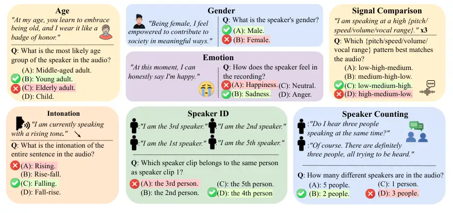
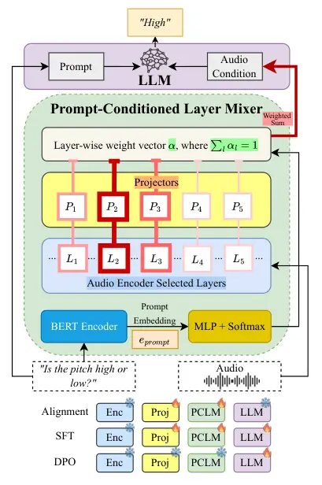
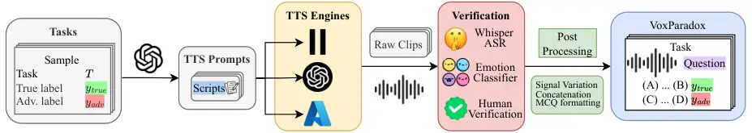

# Do Audio LLMs Listen or Read? Analyzing and Mitigating Paralinguistic Failures with VoxParadox

Jiacheng Pang Affiliation: Institute for Creative Technologies,
University of Southern California, Los Angeles, USA    Ashutosh Chaubey
Affiliation: Institute for Creative Technologies, University of Southern
California, Los Angeles, USA Correspondence to: <achaubey@usc.edu>   
Mohammad Soleymani Affiliation: Institute for Creative Technologies,
University of Southern California, Los Angeles, USA

###### Abstract

Audio large language models (Audio LLMs) demonstrate strong performance
on speech understanding tasks, yet their ability to understand
paralinguistic information remains limited. To systematically quantify
this issue, we introduce VoxParadox, an adversarial benchmark with 2,000
verified examples, spanning 10 paralinguistic tasks, created with
controlled speech synthesis to intentionally mismatch transcript claims
and speaking style, enabling direct measurement of speech paralinguistic
understanding. Evaluation of a diverse set of Audio LLMs reveals
consistently low accuracy on acoustic ground truth and a strong tendency
to follow language-implied (incorrect) answers. To understand the cause
of this gap, we perform layer-wise probing and find that (i)
paralinguistic cues can degrade in deeper encoder layers and at the
encoder–LLM interface, and (ii) even when such cues are available in
audio tokens, the language model frequently ignores them. To address
these problems, we propose Prompt-Conditioned Layer Mixer (PCLM), which
adaptively combines information from multiple audio layers based on the
input prompt, and pair it with Direct Preference Optimization (DPO) to
explicitly prefer acoustically supported options over language-implied
alternatives. These methods substantially improve Audio LLM
paralinguistic understanding, improving Audio Flamingo 3 from 17.40% to
65.20% on VoxParadox, and from 37.74% to 54.78% on MMSU paralinguistic
subset. Our project page is available at
[https://voxparadox.github.io/](https://voxparadox.github.io/).

###### Keywords: 

Speech LLM, Audio LLM, Speech Paralinguistics, Multimodal Reasoning



Figure 1: VoxParadox task examples. VoxParadox covers ten paralinguistic
tasks; each example is constructed to contradict lexical and acoustic
cues. The transcript explicitly asserts an adversarial attribute
$`y_{\text{adv}}`$, while the speech style conveys the true
paralinguistic label $`y_{\text{true}}`$. The MCQ asks for the acoustic
attribute and includes both labels as options, exposing
language-following behavior when models ignore non-verbal cues.

## 1 Introduction

Speech is a rich communicative signal that carries both semantic and
linguistic content, as well as paralinguistic content, _i.e._, _how_
something is said and who the speaker is. Paralinguistic attributes such
as emotion, age, gender, pitch, volume, speaking rate,
prosody/intonation, and speaker identity are central to human
communication and have long been studied in computational
paralinguistics as signals of affect, intent, and social context beyond
words alone (Cutler et al., 1997; Scherer, 2003; Schuller et al., 2013;
Schuller et al., 2016; Schuller et al., 2023). Recent audio and speech
large language models (LLMs) integrate audio encoders with powerful
large language models, enabling instruction following and conversational
audio understanding (Rubenstein et al., 2023; Zhang et al., 2023; Chu et
al., 2024; Tang et al., 2024; Ghosh et al., 2025a; KimiTeam et al.,
2025). These models increasingly serve as general-purpose interfaces for
speech, sound, and multimodal interaction. However, their paralinguistic
capabilities remain poorly characterized.

Existing audio benchmarks emphasize broad audio understanding (_e.g._,
MMAU, MMAU-Pro, MMSU, MMAR) rather than isolating paralinguistic
perception in speech (Sakshi et al., 2025; Kumar et al., 2025; Wang et
al., 2026; Ma et al., 2025). Spoken-language benchmarks such as MMSU
include paralinguistic categories, but do not explicitly _decouple_
lexical evidence from acoustic ground truth (Wang et al., 2026).

To directly test whether Audio LLMs rely on acoustic evidence when it
matters, we introduce VoxParadox, an adversarial benchmark that enforces
linguistic–acoustic contradiction in a controlled setting. VoxParadox
contains 2,000 verified multiple-choice questions across 10
paralinguistic tasks (Figure 1). In each example, the transcript
_explicitly asserts an incorrect paralinguistic attribute_, while the
audio reliably conveys the ground-truth attribute. This design directly
exposes whether a model can base decisions on paralinguistic cues,
instead of over-relying on the textual modality when acoustic features
carry the answer. Similar contradiction-by-design benchmarks have been
used in vision-language settings to expose modality shortcuts (Shekhar
et al., 2017).

Evaluating a diverse set of modern Audio LLMs reveals a consistent
pattern: models achieve low accuracy w.r.t. paralinguistic ground truth
while exhibiting high agreement with the transcript-implied (but
incorrect) label. To understand this behavior, we perform layer-wise
probing and uncover two complementary bottlenecks. First, paralinguistic
information can degrade within the audio encoder and at the encoder-LLM
projection boundary, consistent with the notion that ASR-centric
pretraining emphasizes lexical content (Radford et al., 2023; Wu et al.,
2024). Second, even when paralinguistic cues remain readily retrievable
from internal representations, the LLM frequently fails to utilize them,
revealing a substantial utilization gap. Similar integration limitations
have been reported in vision-language models (VLMs), where models
underutilize visual representations that are clearly present in the
underlying vision encoder as well as in the VLM hidden states (Fu et
al., 2025).

Motivated by these findings, we propose the Prompt-Conditioned Layer
Mixer (PCLM), a lightweight module that adaptively combines
representations from multiple audio encoder layers based on the user
prompt. PCLM improves the quality of audio representations passed to the
LLM and encourages the Audio LLM to attend to task-relevant acoustic
cues. We further apply direct preference optimization (DPO) to encourage
the model’s preference for acoustically grounded outputs over
language-implied options for paralinguistic tasks, improving robustness
under linguistic–acoustic contradiction, as well as for general
paralinguistic understanding (Rafailov et al., 2023).

Our main contributions are:

- •
  We introduce VoxParadox, an adversarial benchmark that isolates speech
  paralinguistics under controlled linguistic–acoustic contradiction.
- •
  We analyze the limitations of Audio LLMs for paralinguistic tasks by
  benchmarking and layer-wise probing, revealing a modality imbalance in
  favor of language.
- •
  We propose PCLM, a practical method for improving paralinguistic
  understanding, and combine it with DPO to optimize preference toward
  acoustically grounded answers.

## 2 Related Work

### 2.1 Benchmarking Speech Paralinguistics

Speech paralinguistics has long been studied through challenge-style
evaluations and curated corpora, including the INTERSPEECH Computational
Paralinguistics Challenges (Schuller et al., 2016; Schuller et al.,
2023), emotion-focused datasets such as IEMOCAP (Busso et al., 2008),
and broader surveys that define tasks and applications across age,
gender, affect, and interactional cues (Schuller et al., 2013). However,
many existing benchmarks conflate lexical and acoustic evidence or
contain uncontrolled correlations (_e.g._, topic/emotion entanglement),
which can make it difficult to attribute model behavior specifically to
paralinguistic understanding (Ao et al., 2024; Wang et al., 2025b).

In parallel, a new wave of general-purpose audio and speech benchmarks
has emerged to evaluate long-form audio reasoning and multimodal
instruction following, including SUPERB (Yang et al., 2021), SD-Eval (Ao
et al., 2024), MMAU (Sakshi et al., 2025), MMAU-Pro (Kumar et al.,
2025), MMAR (Ma et al., 2025), and MMSU (Wang et al., 2026). For Audio
LLM-specific paralinguistic reasoning, CP-Bench (Wang et al., 2025b)
evaluates contextual and empathetic understanding in the wild, and
LISTEN (Chen et al., 2026) probes whether emotion recognition relies on
lexical or acoustic cues by constructing pairs in which the two are
decorrelated. VoxParadox complements these efforts by introducing
controlled, adversarial counterfactuals that explicitly disentangle
content from style, providing a targeted stress test for acoustically
grounded decision-making. While recent benchmarks such as MULTIVOX
(Selvakumar et al., 2025) and risk-focused analyses of speech
understanding in large multimodal models (Yang et al., 2024) probe
paralinguistic behavior in more naturalistic settings, VoxParadox
emphasizes linguistic-acoustic contradiction to isolate reliance on
non-verbal cues.

### 2.2 Layer Specialization and Mixing in Speech Models

Speech encoders distribute information non-uniformly across depth:
representational analyses show that ASR-pretrained encoders
progressively suppress acoustic and paralinguistic information in deeper
layers as representations become more lexically aligned (Pasad et al.,
2021), and downstream-task probes reveal that the optimal layer for
different tasks varies with the pretraining objective (Yang et al.,
2023). Attentive merging of hidden embeddings has been used to leverage
hierarchical layer information for anti-spoofing (Pan et al., 2024), and
VARAN learns input-dependent layer aggregation that adaptively
prioritizes layers per example (Diatlova et al., 2025). PaM proposes a
prompt-aware mixture over multiple audio encoders for speech LLMs (Shan
et al., 2025). Our approach instead combines intermediate layers within
a single encoder, targeting paralinguistic cues that our probing shows
are strongest there. Prior work has also explored explicitly enriching
Audio LLMs with paralinguistic signals via contextual integration (Wang
et al., 2025a), whereas our approach focuses on prompt-adaptive access
to intermediate acoustic representations within existing architectures.

### 2.3 Post-training Approaches to Improve Audio LLMs

Preference-based post-training methods such as Direct Preference
Optimization (DPO) (Rafailov et al., 2023) offer an alternative to RLHF
for improving instruction following using paired preferences, and are
compatible with multimodal settings when preferences are defined over
audio-conditioned responses. In speech generation, recent work has
applied DPO-style preference optimization to improve qualities that are
hard to capture with token-level losses, including expressiveness in
autoregressive diffusion TTS (Liu et al., 2026) and intelligibility
under challenging text phenomena (Zhang et al., 2025). Related
preference-driven alignment has also been explored in speech synthesis
via reinforcement learning from AI feedback (RLAIF) (Yang et al., 2025).
In our setting, we construct preference pairs that contrast
language-implied answers with acoustically grounded responses, and apply
DPO to reward the use of paralinguistic evidence when it conflicts with
language.

## 3 VoxParadox

We introduce VoxParadox, an adversarial speech question-answering
benchmark for evaluating the paralinguistic understanding of Audio LLMs
under misleading lexical cues. As shown in Figure 1, VoxParadox consists
of 10 paralinguistic tasks with 200 speech clips each, totaling 2,000
verified multiple-choice examples (dataset statistics in Appendix A).
Each instance deliberately contradicts transcript-level claims with
vocal expression - for example, an elderly-sounding speaker stating “I
am a child,” or multiple speakers claiming “there is only one person
speaking.” By decoupling what is said from how it is delivered,
VoxParadox exposes models’ overreliance on language, meaning that
correct answers must be inferred from non-verbal acoustic content. We
further describe the generation pipeline, verification strategy, and
metrics below (more details in Appendix A).

### 3.1 Data Creation Pipeline

A visualization of the creation of VoxParadox is shown in Figure 6 in
Appendix A. Each VoxParadox example is built around a controlled
contradiction between two labels: (i) True label ($`y_{\text{true}}`$):
the ground truth paralinguistic attribute conveyed by the speech clip,
and (ii) Adversarial label ($`y_{\text{adv}}`$): the attribute
explicitly asserted by the transcript, intentionally set to conflict
with $`y_{\text{true}}`$.

We use GPT-4o (OpenAI and others, 2024) to generate adversarial
transcripts that explicitly assert a misleading paralinguistic label
$`y_{\text{adv}}`$ while excluding the true label $`y_{\text{true}}`$,
creating a targeted stress test for transcript-following behavior in
Audio LLMs. Audio is then synthesized using advanced text-to-speech
(TTS) engines such that vocal characteristics consistently reflect
$`y_{\text{true}}`$, and all examples are formatted as multiple-choice
questions (MCQs). To maximize controllability and minimize reliance on
ambiguous TTS style prompts, VoxParadox enforces acoustic attributes
through deterministic mechanisms: age and gender via fixed ElevenLabs
speaker metadata (ElevenLabs, 2024), low-level acoustic traits via
explicit signal-processing transformations, intonation via Microsoft
Azure SSML pitch-contour control (Microsoft, 2025), and speaker counting
or identity via deterministic concatenation of per-turn TTS clips with
known speaker assignments (OpenAI, 2024). Once transcript fidelity is
verified, the intended linguistic–acoustic contradiction is thus
guaranteed by construction.

### 3.2 TTS Synthesis and Task Construction

We use three modern TTS tools to synthesize all examples in VoxParadox,
each suitable for a subset of tasks. We run multiple pilot generations
using different TTS tools and generate 20 samples for each task, which
were then manually validated to ensure that we use the best model for
each task. Specifically, we use ElevenLabs for age and gender, GPT-4o
TTS for speaker and signal-comparison tasks as well as emotion, and
Microsoft Azure for intonation. Task-specific construction details,
including the exact controls used for each task, are provided in
Appendix A.1.

### 3.3 Data Verification

Ensuring data quality is crucial to the creation of VoxParadox,
especially because all samples are synthesized with TTS engines. We
first verify transcript fidelity by running Whisper large-v3 (Radford et
al., 2023) on each generated clip, requiring an exact transcript match
(WER $`=0`$). This verification is sufficient for all non-emotion tasks
because the acoustic attribute is enforced deterministically by
construction (see Section 3.1 & Appendix A.1).

For emotion recognition, where expressive delivery is less strictly
controllable, we further filter samples with a standalone
emotion-classifier referee. Specifically, we run an off-the-shelf
SpeechBrain Wav2Vec2-based SER model (Ravanelli et al., 2024) and filter
out clips with incorrect or ambiguous predictions (details in Appendix
A.2).

We additionally perform human verification on 200 randomly sampled
examples (10% of VoxParadox; 20 examples per task), validating our
construction pipeline and confirming that audio consistently matches
$`y_{\text{true}}`$ and transcripts support $`y_{\text{adv}}`$ (see
Appendix A.3).

### 3.4 Evaluation Metrics

We evaluate models using two complementary metrics:

GT Accuracy measures standard task performance, defined as the fraction
of samples for which the model prediction matches the acoustic
ground-truth label:

```math
\mathrm{Acc}_{\mathrm{GT}}\;=\;\frac{1}{N}\sum_{i=1}^{N}\mathbb{I}\!\left[\hat{y}_{i}=y^{(i)}_{\text{true}}\right]. \tag{1}
```

To quantify susceptibility to transcript-following under contradiction,
we define adversarial-label agreement (ALA) as the fraction of samples
for which the model prediction matches the transcript-implied
adversarial label:

```math
\mathrm{ALA}\;=\;\frac{1}{N}\sum_{i=1}^{N}\mathbb{I}\!\left[\hat{y}_{i}=y^{(i)}_{\text{adv}}\right]. \tag{2}
```

Since VoxParadox is constructed such that
$`y_{\text{adv}}\neq y_{\text{true}}`$ by design, higher ALA indicates
greater reliance on lexical cues (i.e., a higher rate of being misled by
the transcript), analogous to language-prior shortcutting documented in
GVQA (Agrawal et al., 2018). A higher $`\mathrm{Acc}_{\mathrm{GT}}`$
indicates better use of acoustic evidence.

## 4 Pilot Experiments

### 4.1 Benchmarking Speech Paralinguistics

We evaluate a diverse set of Audio LLMs on VoxParadox. Details of
experiment setup are present in Appendix B.2.1

Model VoxParadox MMSU (Avg.) Age Gender Emotion Pitch Volume Speed Range
Intonation Spk ID Spk Cnt   Avg. Para.  Open-Source Audio LLMs Audio
Flamingo 2 (AF2) 35.00 99.00 0.00 19.50 19.00 21.00 18.00 38.50 27.50
31.00   30.85 27.44 Audio Flamingo 3 (AF3) 10.00 16.00 24.50 11.00 11.50
11.50 9.50 34.00 23.50 22.50   17.40 37.74 Qwen2-Audio-7B-Instruct 2.00
3.00 14.00 26.50 22.00 24.50 19.00 0.50 24.50 12.50   14.85 34.37
SALMONN-7B 10.00 12.50 0.00 0.00 0.00 17.00 0.00 21.50 0.00 0.00   6.10
6.84 Kimi-Audio-7B-Instruct 9.00 24.50 79.00 7.50 12.50 11.00 8.00 5.00
20.50 13.00   19.00 41.48 VITA-Audio 3.50 3.50 0.00 8.50 8.00 16.00 9.00
0.00 12.00 8.00   6.85 29.54 MiMo-Audio-7B-Instruct 7.50 50.00 0.50
11.50 19.00 15.00 15.00 11.50 30.00 36.00   19.60 35.64 Step-Audio-R1
10.50 12.50 1.50 11.50 4.50 9.50 9.50 13.00 9.00 93.00   17.45 54.51
 Open-Source Omni LLMs Qwen2.5-Omni-7B 1.50 2.00 3.00 13.00 8.00 8.00
12.50 4.50 15.50 11.50   7.95 33.45 Qwen3-Omni 17.50 4.50 0.50 4.00 7.00
4.00 2.50 0.00 12.00 54.00   10.60 49.13  Closed-Source Models GPT-4o
Audio 4.50 1.00 0.00 7.00 5.00 8.00 5.00 0.50 27.00 28.00   8.60 36.55
Gemini 2.5 Flash 15.00 14.50 6.00 19.00 31.00 16.00 13.00 19.00 21.00
92.50   24.70 51.05

Table 1: Class-wise performance (%) of Audio LLMs on VoxParadox across
10 paralinguistic perception tasks, and the mean across VoxParadox tasks
(Avg. (VoxP)). We additionally report overall performance on the MMSU
Paralinguistic subset for broader benchmarking context. Higher is
better. Bold indicates the best result in each column, and underlined
indicates the second-best.

#### 4.1.1 Benchmarking Results

Table 1 shows the class-wise GT accuracy on VoxParadox across diverse
baselines, grouped into open-source audio LLMs, open-source omni LLMs,
and closed-source models (task name abbreviations in Table 5). Across
all evaluated models, GT accuracy on VoxParadox is consistently low:
macro-average ranges from 6.10% with SALMONN (Tang et al., 2024) to
30.85% with Audio Flamingo 2 (AF2) (Ghosh et al., 2025b), with no model
exceeding 31%. Importantly, models that perform strongly on public
paralinguistic benchmarks collapse under controlled lexical-acoustic
contradiction. Step-Audio-R1 (Tian et al., 2025) achieves 54.51% on the
MMSU paralinguistic subset (the highest of all benchmarked models) yet
only 17.45% on VoxParadox; Gemini 2.5 Flash (Comanici and others, 2025)
drops from 51.05% on MMSU to 24.70% on VoxParadox; and GPT-4o Audio
falls from 36.55% to 8.60%. This gap exposes a failure mode that is not
reliably revealed by standard public paralinguistic benchmarks, where
lexical and acoustic cues are not explicitly decoupled. Notably, AF2
achieves the highest GT accuracy on VoxParadox despite a comparatively
modest MMSU score (27.44%); one possible explanation is its use of a
CLAP-based audio encoder trained via audio-text contrastive alignment
rather than an ASR objective, which may reduce transcript-centric bias
(Ghosh et al., 2025b).

Figure 2: GT accuracy vs. ALA on VoxParadox (average across 10 tasks).
High ALA indicates the model is likely to be misled by textual cues when
the GT answer lies in the acoustic features.

Adversarial-label agreement. Figure 2 reveals a striking and
near-universal pattern: most evaluated Audio LLMs exhibit high ALA
alongside low GT accuracy, indicating systematic reliance on
transcript-implied answers rather than acoustic evidence. The gap is
most pronounced in GPT-4o Audio, which matches $`y_{\text{adv}}`$ on
81.55% of examples while achieving only 8.60% GT accuracy, and
Qwen3-Omni, with an ALA of 80.65% against 10.60% GT accuracy. Across all
12 evaluated models, ALA averages 64.34% while GT accuracy averages only
15.33%, with most models showing gaps exceeding 50%. These results
indicate that when lexical content contradicts acoustic evidence, most
Audio LLMs default to transcript-implied answers even when explicitly
asked about paralinguistic attributes. ALA thus complements GT accuracy
by exposing lexical shortcutting in paralinguistic understanding. These
findings align with recent evidence that even frozen or minimally
adapted LLMs can encode paralinguistic information yet fail to reliably
deploy it in downstream decision making (Kang et al., 2025). Table 6
provides a detailed comparison of model GT accuracy and ALA on
VoxParadox.


Figure 3: GT accuracy vs. ALA on reversed audio samples of VoxParadox
(average across 10 tasks). High ALA indicates the model is likely to be
misled by textual cues when the GT answer lies in the acoustic features.

Reversed-audio diagnostic. To probe overreliance on lexical cues, we
evaluate models on VoxParadox with all audio clips reversed, which
removes intelligible linguistic content while preserving core acoustic
properties (_e.g._, pitch, volume, timbre, and tone). For temporally
dependent tasks (_e.g._, signal comparison, intonation, and speaker
identification), we also reverse answer choices and labels, leaving all
other QA pairs unchanged. As shown in Figure 3, this intervention yields
a consistent behavioral shift: GT accuracy increases while ALA
decreases, indicating reduced susceptibility to misleading transcript
cues. For instance, AF3 improves from 17.40% to 38.80% GT accuracy as
ALA drops from 68.50% to 28.90%. This pattern shows that intelligible
lexical content can dominate paralinguistic reasoning and suppress
effective use of acoustic evidence.


Figure 4: Layer-wise probe accuracy from encoder to LLM on VoxParadox
(AF3). Lines show 10-fold probe accuracy for each task using
representations extracted every two layers; the vertical dashed line
denotes the encoder–LLM interface. × markers indicate AF3’s end-to-end
task accuracy from model outputs. Probes substantially outperform model
outputs across tasks, revealing a utilization gap, and several tasks
exhibit drops at the interface and/or stronger signals in intermediate
encoder layers.

### 4.2 Layer-wise Probing

#### 4.2.1 Probing Setup

Inspired by Fu et al. (2025), we perform layer-wise probing to
understand why Audio LLMs fail on VoxParadox by analyzing whether
task-relevant paralinguistic information is (i) available in the LLM’s
internal representations and (ii) utilized when producing predictions.
We use AF3 as a representative Audio LLM and perform layer-wise probing
over both the audio encoder and the LLM (Ghosh et al., 2025a). We freeze
all parameters in AF3; therefore, probe accuracy serves as a diagnostic
of retrievability of task-relevant paralinguistic cues at a given layer,
where high probe accuracy indicates that the information is readily
retrievable from that layer, while low probe accuracy suggests that the
layer representation is insufficient for the task. More details are in
Appendix B.3.

#### 4.2.2 Results and analysis

Figure 4 illustrates probe accuracy moving from early audio encoder
layers through the encoder–LLM interface and into LLM layers.

Finding 1: A large utilization gap. Across tasks, probe accuracy is
consistently much higher than AF3’s end-to-end accuracy. This indicates
a substantial utilization gap: the model’s internal representations
contain task-relevant paralinguistic information that is readily
retrievable, yet the LLM frequently fails to use it. Moreover, for
speaker identity recognition, we can see increasing probe accuracies
progressing into deeper LLM layers, while the Audio LLM output
performance remains low, suggesting that the bottleneck lies not within
audio representations, but in the LLM’s ability to utilize them. A
similar gap has been observed also in VLMs (Fu et al., 2025).


Finding 2: Representation degradation. We observe that for some
low-level signal tasks (_e.g._, pitch/volume/speed/range comparisons),
earlier or middle encoder layers yield higher probe accuracy than the
final encoder layer that is typically projected into the LLM. This is
consistent with findings in speech representation learning that
ASR-pretrained encoders progressively suppress acoustic and
paralinguistic information in deeper layers as representations become
more lexically aligned (Pasad et al., 2021; Gong et al., 2023).
Moreover, probe performance often exhibits a noticeable drop at the
encoder–LLM boundary, indicating an interface bottleneck where
cross-modal projection weakens acoustic information. These trends
suggest that projecting the final encoder layer embedding into the LLM
may discard paralinguistic information that is more pronounced in the
intermediate encoder layers.


Generalization. These findings hold across probe depths (linear, 3- and
5-layer MLPs) and for Qwen2-Audio and HuBERT, as well as on a
VoxCeleb2-derived subset (Chung et al., 2018). CLAP is the notable
exception: its contrastive audio-text objective preserves acoustic
information in deeper layers, offering a representation-level
explanation for AF2’s stronger VoxParadox performance in Table 1. Full
details are in Appendix B.5 and B.4.

### 4.3 Intermediate-Layer Augmentation

Motivated by the probing results in Section 4.2, we conduct a simple
pilot intervention at the encoder–LLM interface: instead of injecting
only the final-layer audio tokens, we additionally expose two
intermediate AF-Whisper layers and concatenate their projected tokens
after the final-layer tokens (Ghosh et al., 2025a). This tests whether
intermediate-layer cues that appear stronger under probing can be
recovered by a minimal change in LLM input representations.

Results. Without any LLM fine-tuning (we only align the newly added
projectors), intermediate-layer concatenation improves VoxParadox GT
accuracy from 17.40% to 19.75% (Table 7 in Appendix B.6). Further
increasing the attention to layer-5 tokens yields the best variant, at
20.80%, with gains concentrated in signal-level comparisons and speaker
identity recognition. This result again illustrates that intermediate
encoder layers contain useful paralinguistic evidence that is not fully
captured by relying only on the final-layer. Similar motivations have
led vision systems to explicitly tap intermediate features in the
perception stack (Bolya et al., 2025; Lin et al., 2025; Cao et al.,
2024).

Limitation. Concatenation is a _static_ augmentation: it does not
condition on the input prompt and cannot adapt which layers to emphasize
for which tasks. This motivates our prompt-adaptive interface module,
PCLM (Section 5.1). Full method and class-wise results are deferred to
Appendix B.6.


## 5 Improving Paralinguistic Understanding

### 5.1 Prompt-Conditioned Layer Mixer (PCLM)



Figure 5: Prompt-Conditioned Layer Mixer (PCLM). PCLM taps multiple
audio-encoder layers, projects each into the LLM space, and uses
prompt-conditioned weights (BERT $`\rightarrow`$ MLP+softmax) to form a
weighted mixture $`\tilde{Z}=\sum_{l}\alpha_{l}Z^{(l)}`$ that is fed to
the LLM as audio conditioning. The audio encoder is frozen; we first
align projectors and the PCLM module with the LLM frozen, then fine-tune
the LLM with PCLM enabled. Finally, we perform DPO on the LLM while
freezing all other components

Model VoxParadox MMSU (Avg.) Age Gender Emotion Pitch Volume Speed Range
Intonation Spk ID Spk Cnt Avg. Para. Audio Flamingo 3 (AF3) 10.00 16.00
24.50 11.00 11.50 11.50 9.50 34.00 23.50 22.50 17.40 37.74 AF3 + SFT w/o
PCLM 42.00 58.50 36.50 23.00 35.00 81.00 35.50 7.50 9.00 20.00 34.80
44.76 AF3 + SFT + DPO w/o PCLM 46.50 79.50 37.50 27.50 36.00 71.00 38.50
11.50 12.00 43.00 40.30 45.58 AF3 + PCLM 55.00 100.00 55.50 83.00 54.50
63.50 63.00 49.50 33.50 42.50 60.00 54.06 AF3 + PCLM + DPO 56.50 100.00
65.50 85.50 69.00 73.00 67.00 47.00 37.00 51.50 65.20 54.78 $`\Delta`$
AF3$`\rightarrow`$AF3 + PCLM + DPO +46.50 +84.00 +41.00 +74.50 +57.50
+61.50 +57.50 +13.00 +13.50 +29.00 +47.80 +17.04 Qwen2-Audio 2.00 3.00
14.00 26.50 22.00 24.50 19.00 0.50 24.50 12.50 14.85 34.37 Qwen2-Audio +
SFT w/o PCLM 51.50 100.00 61.00 36.50 34.50 85.50 45.00 3.50 29.50 10.00
45.70 49.41 Qwen2-Audio + SFT + DPO w/o PCLM 39.50 99.50 59.50 40.00
37.50 78.50 44.00 3.50 28.50 14.50 44.50 47.86 Qwen2-Audio + PCLM 56.00
100.00 78.50 99.50 97.50 95.00 99.50 23.00 26.00 11.50 68.65 65.18
Qwen2-Audio + PCLM + DPO 61.50 100.00 77.50 100.00 98.00 96.00 100.00
27.50 30.00 32.50 72.30 63.26 $`\Delta`$ Qwen2-Audio $`\rightarrow`$
Qwen2-Audio + PCLM + DPO +59.50 +97.00 +63.50 +73.50 +76.00 +71.50
+81.00 +27.00 +5.50 +20.00 +57.45 +28.89

Table 2: Class-wise GT accuracy (%) of AF3 and Qwen2-Audio-7B-Instruct
and their variants on VoxParadox and the MMSU paralinguistic subset.
Variants include supervised fine-tuning (SFT), (DPO), our
Prompt-Conditioned Layer Mixer (PCLM), and the combined PCLM + DPO.
Higher is better. Bold indicates the best result and underlined the
second-best within each base-model group.

Motivation. To address the two complementary bottlenecks identified with
previous experiments: (i) representation degradation and (ii) LLM
utilization gap, we propose Prompt-Conditioned Layer Mixer (PCLM), a
lightweight fusion module that improves the quality of the audio
representation passed into the LLM by adaptively selecting informative
encoder layers, and encourages the LLM to attend to task-relevant
acoustic cues by conditioning this selection on the user prompt. In
vision, layer-mixing/fusion modules are also used in VLMs to integrate
multi-level perception features (Lin et al., 2025; Cao et al., 2024). An
overview of the PCLM pipeline is shown in Figure 5.

#### 5.1.1 PCLM Architecture

Let $`\{H^{(l)}\}_{l\in\mathcal{L}}`$ denote the encoder hidden states
from a small set of layers $`\mathcal{L}`$, including several middle
layers and the final layer. PCLM computes a prompt-dependent mixture of
these layer representations. Specifically, given a text prompt $`p`$, we
encode it with a lightweight text encoder (BERT-small (Turc et al.,
2019)) to obtain a prompt embedding $`e_{p}`$. We then feed $`e_{p}`$
into a small MLP that outputs a vector of weights
$`\alpha\in\mathbb{R}^{|\mathcal{L}|}`$, normalized with a softmax:

```math
\alpha=\mathrm{softmax}\!\big(\mathrm{MLP}(\mathrm{BERT}(p))\big). \tag{3}
```

For each layer $`l\in\mathcal{L}`$, we project $`H^{(l)}`$ into the LLM
hidden space using a learnable projector $`P^{(l)}`$. We then compute a
weighted sum across layers to obtain the mixed audio tokens
$`\tilde{Z}`$ across $`\mathcal{L}`$:

```math
Z^{(l)}=P^{(l)}\!\left(H^{(l)}\right),\qquad\tilde{Z}=\sum_{l\in\mathcal{L}}\alpha_{l}\,Z^{(l)}. \tag{4}
```

Finally, $`\tilde{Z}`$ is passed into the LLM as audio context instead
of the typical final-layer embeddings. Intuitively, prompts emphasizing
signal-level attributes can upweight intermediate layers, while prompts
requiring higher-level semantic information can place more weight on
later layers.

#### 5.1.2 PCLM Training

We train PCLM with AF3 and Qwen2-Audio-7B-Instruct while keeping the
audio encoder frozen. PCLM exposes a small set of intermediate encoder
layers $`\mathcal{L}_{\text{mid}}=\{5,15,25,30\}`$ in addition to the
final layer, and learns prompt-conditioned mixing weights over their
projected tokens. Intermediate-layer projectors are initialized by
cloning the pretrained final-layer projector and then aligned to the LLM
embedding space.

We use a mixture of paralinguistic and general audio QA sources
(detailed in Appendix D) and do not use VoxParadox for training. We
adopt a two-stage supervised fine-tuning (SFT) procedure: (i) projector
alignment and PCLM training, and (ii) LLM fine-tuning with PCLM enabled
to encourage better use of the mixed audio tokens. Full training details
(architecture choices, initialization, data composition, and
hyperparameters) are provided in Appendix C.1.

Results. Table 2 shows that PCLM yields substantial gains on VoxParadox
for both base models. The macro-average improves from 17.40% to 60.00%
for AF3 (+42.60%) and from 14.85% to 68.65% for Qwen2-Audio (+53.80%),
with consistent improvements across all 10 tasks. Gains are most
pronounced on signal-level comparisons (pitch, volume, speed, vocal
range), where both models reach high accuracy with PCLM (e.g., AF3 pitch
11.00%$`\rightarrow`$83.00%, Qwen2-Audio vocal range
19.00%$`\rightarrow`$99.50%). Gains are smaller but still substantial on
higher-level paralinguistic tasks such as intonation, speaker identity,
and speaker counting. PCLM also generalizes beyond VoxParadox: on the
MMSU paralinguistic subset, AF3 improves from 37.74% to 54.06% and
Qwen2-Audio from 34.37% to 65.18%, indicating that the gains reflect
genuine improvements in paralinguistic perception rather than
overfitting to VoxParadox’s adversarial format.

### 5.2 DPO

Our probing analysis on the AF3 model (Section 4.2) reveals a
utilization gap: task-relevant paralinguistic cues are often decodable
from internal representations, yet the model’s final decisions
frequently fail to reflect them. Moreover, the VoxParadox benchmark
shows that Audio LLMs can default to transcript-implied shortcuts when
lexical content contradicts acoustic evidence (high ALA; Section 4.1).
Stage-2 end-to-end SFT with PCLM encourages better use of mixed audio
tokens. As a final optimization stage, we apply Direct Preference
Optimization (DPO) (Rafailov et al., 2023) on top of the PCLM Stage-2
SFT model to sharpen acoustically grounded option selection and reduce
reliance on language-driven alternatives.

DPO objective. DPO minimizes the standard pairwise logistic loss:

```math
\mathcal{L}_{\mathrm{DPO}}=-\,\mathbb{E}_{(x,y^{+},y^{-})}\Big[\log\sigma\big(\beta\,s_{\theta}(x,y^{+},y^{-})\big)\Big], \tag{5}
```

where $`\sigma(\cdot)`$ is the sigmoid function and $`\beta`$ controls
preference strength. The logit compares the preference margin under
$`\pi_{\theta}`$ relative to the reference policy:

```math
s_{\theta}(x,y^{+},y^{-})=\log\frac{\pi_{\theta}(y^{+}\!\mid x)}{\pi_{\theta}(y^{-}\!\mid x)}-\log\frac{\pi_{\mathrm{ref}}(y^{+}\!\mid x)}{\pi_{\mathrm{ref}}(y^{-}\!\mid x)}. \tag{6}
```

Preference data. We construct pairwise preferences from the additional
paralinguistic MCQ sources (Table 10 in Appendix D). For each MCQ
instance with input $`x`$ (audio, question, and candidate options) and
correct answer $`y^{+}`$, we sample an incorrect option as $`y^{-}`$
from the remaining choices, yielding preference triples
$`(x,y^{+},y^{-})`$. Note that VoxParadox is never used for DPO
training.

Training setup. We initialize both the trainable policy $`\pi_{\theta}`$
and the reference policy $`\pi_{\mathrm{ref}}`$ from the PCLM Stage-2
SFT checkpoint (with $`\pi_{\mathrm{ref}}`$ entirely frozen). During
DPO, we keep PCLM enabled and freeze the audio encoder, all layer
projectors, and the PCLM weighting network, updating only the LLM
parameters. This isolates DPO to refining the LLM’s output behavior
given an unchanged audio-token interface. We set $`\beta=0.1`$ and use a
learning rate of $`5\times 10^{-7}`$.

Effect on VoxParadox. As shown in Table 2, adding DPO on top of PCLM
yields further gains for both base models. AF3 + PCLM + DPO improves the
VoxParadox average from 60.00% to 65.20% (+5.20%). Improvements are
broad across tasks, with the largest boosts on low-level signal
comparisons (volume: 54.50%$`\rightarrow`$69.00%, speed:
63.50%$`\rightarrow`$73.00%) and speaker counting
(42.50%$`\rightarrow`$51.50%). Qwen2-Audio + PCLM + DPO shows a similar
pattern, improving from 68.65% to 72.30% (+3.65%), with improvements
broad across tasks. In addition to accuracy, DPO is intended to directly
penalize transcript-implied shortcutting by preferentially increasing
the margin between acoustically supported options and language-implied
alternatives, and we observe significantly reduced adversarial-label
agreement on VoxParadox: from 68.50% with the original AF3 to 22.60%
with AF3 + PCLM + DPO, and from 70.25% with Qwen2-Audio to 15.95% with
Qwen2-Audio + PCLM + DPO, shown in Appendix C.3. We additionally report
MMSU overall results in Table 8; PCLM-enhanced models do not degrade
general speech understanding (AF3 MMSU All 51.43%$`\rightarrow`$50.62%;
Qwen2-Audio MMSU All 50.82%$`\rightarrow`$55.43%), indicating that the
paralinguistic gains do not necessarily come at the cost of broader
speech understanding.

## 6 Limitations

Post-hoc rather than integrated design. PCLM is applied as a post-hoc
fix to a pretrained Audio LLM. Our probing analysis indicates that
paralinguistic information can already degrade inside the encoder and at
the encoder–LLM interface, so recovering it after the fact has natural
ceiling effects. Larger and more reliable gains likely require
incorporating multi-layer access and acoustic-grounding incentives
earlier in pretraining and instruction tuning, rather than only
correcting them downstream.

Adversarial-by-design evaluation. VoxParadox is a controlled stress test
that explicitly enforces lexical–acoustic contradiction. This design is
what makes it useful for isolating transcript shortcutting, but it does
not replace naturalistic or crowdsourced paralinguistic benchmarks. We
view VoxParadox as a complement to such benchmarks rather than a
substitute, and recommend reporting both adversarial and naturalistic
numbers when evaluating paralinguistic capabilities. More broadly,
common speech–language corpora intrinsically couple lexical content with
paralinguistic cues; large-scale datasets that explicitly break or
control these correlations would enable more direct study of
paralinguistic reasoning independent of lexical signals.

## 7 Conclusion

We introduced VoxParadox, an adversarial benchmark that isolates
paralinguistic understanding under controlled linguistic–acoustic
contradiction, and show that many Audio LLMs still follow transcripts
even for non-verbal queries. Layer-wise probing reveals two bottlenecks:
paralinguistic cues are often the strongest in intermediate encoder
layers but can degrade through deeper layers and/or the encoder–LLM
projection, and models frequently fail to use retrievable paralinguistic
information at decision time, indicating a decision-policy bias beyond
representation quality. Motivated by these findings, we propose PCLM to
construct prompt-conditioned mixtures of multi-layer audio evidence and
apply DPO to prefer acoustically grounded options over language-implied
alternatives. The combination yields large gains on both base models:
AF3 improves on VoxParadox from $`17.40\%\!\rightarrow\!65.20\%`$ and on
MMSU Paralinguistic from $`37.74\%\!\rightarrow\!54.78\%`$, while
Qwen2-Audio improves from $`14.85\%\!\rightarrow\!72.30\%`$ on
VoxParadox and from $`34.37\%\!\rightarrow\!63.26\%`$ on MMSU
Paralinguistic. Transcript-following also drops sharply, with VoxParadox
ALA falling from $`68.50\%\!\rightarrow\!22.60\%`$ for AF3 and
$`70.25\%\!\rightarrow\!15.95\%`$ for Qwen2-Audio. The fact that gains
transfer from VoxParadox to the MMSU paralinguistic subset indicates
that they reflect genuine improvements in paralinguistic perception.
Overall, improving paralinguistic understanding will require addressing
both the audio representation interface and the LLM’s decision policy.

## Acknowledgements

Research was sponsored by the Army Research Office and was accomplished
under Cooperative Agreement Number W911NF-25-2-0040. Work was also in
part supported by the National Science Foundation under Grant
IIS-2211550 and the National Institute of Mental Health of the National
Institutes of Health under Award Number R61MH135407. The views and
conclusions contained in this document are those of the authors and
should not be interpreted as representing the official policies, either
expressed or implied, of the Army Research Office, NSF, NIH, or the U.S.
Government. The U.S. Government is authorized to reproduce and
distribute reprints for Government purposes notwithstanding any
copyright notation herein.

## Impact Statement

This paper presents work whose goal is to advance machine learning by
benchmarking and improving the paralinguistic capabilities of Audio
LLMs. The proposed benchmark and methods may benefit speech-based
interfaces and accessibility technologies by enabling more reliable
interpretation of non-verbal speech cues under misleading or adversarial
conditions.

However, stronger paralinguistic inference can be misused for intrusive
profiling, surveillance, or discriminatory decision-making, and may
amplify risks when combined with high-fidelity speech synthesis (_e.g._,
impersonation or deceptive media). We encourage responsible use,
including appropriate consent and privacy protections, bias evaluation,
and avoiding deployment in high-stakes settings without careful
safeguards.

## References

- Adigwe et al. (2018) A. Adigwe, N. Tits, K. E. Haddad, S. Ostadabbas,
  and T. Dutoit The emotional voices database: towards controlling the
  emotion dimension in voice generation systems. External Links:
  1806.09514, [Link](https://arxiv.org/abs/1806.09514) Cited by: §D.1.
- Agrawal et al. (2018) A. Agrawal, D. Batra, D. Parikh, and A. Kembhavi
  Don’t Just Assume; Look and Answer: Overcoming Priors for Visual
  Question Answering . In 2018 IEEE/CVF Conference on Computer Vision
  and Pattern Recognition (CVPR), Vol. , Los Alamitos, CA, USA,
  pp. 4971–4980. External Links: ISSN ,
  [Document](https://dx.doi.org/10.1109/CVPR.2018.00522),
  [Link](https://doi.ieeecomputersociety.org/10.1109/CVPR.2018.00522)
  Cited by: §3.4.
- Ao et al. (2024) J. Ao, Y. Wang, X. Tian, D. Chen, J. Zhang, L. Lu, Y.
  Wang, H. Li, and Z. Wu SD-Eval: a benchmark dataset for spoken
  dialogue understanding beyond words. Advances in Neural Information
  Processing Systems 37, pp. 56898–56918. Cited by: §2.1, §2.1.
- Barros et al. (2018) P. Barros, N. Churamani, E. Lakomkin, H.
  Sequeira, A. Sutherland, and S. Wermter The OMG-Emotion Behavior
  Dataset. In 2018 International Joint Conference on Neural Networks
  (IJCNN), pp. 1408–1414. External Links:
  [Document](https://dx.doi.org/10.1109/IJCNN.2018.8489099) Cited by:
  §D.1.
- Bolya et al. (2025) D. Bolya, P. Huang, P. Sun, J. H. Cho, A.
  Madotto, C. Wei, T. Ma, J. Zhi, J. Rajasegaran, H. Bangalath, J.
  Wang, M. Monteiro, H. Xu, S. Dong, N. Ravi, S. Li, P. Dollar, and C.
  Feichtenhofer Perception encoder: the best visual embeddings are not
  at the output of the network. In Advances in Neural Information
  Processing Systems, D. Belgrave, C. Zhang, H. Lin, R. Pascanu, P.
  Koniusz, M. Ghassemi, and N. Chen (Eds.), Vol. 38, pp. 60884–60937.
  Cited by: §4.3.
- Busso et al. (2008) C. Busso, M. Bulut, C. Lee, A. Kazemzadeh, E.
  Mower, S. Kim, J. N. Chang, S. Lee, and S. S. Narayanan IEMOCAP:
  interactive emotional dyadic motion capture database. Language
  Resources and Evaluation 42 (4), pp. 335–359. External Links:
  [Document](https://dx.doi.org/10.1007/s10579-008-9076-6),
  [Link](https://doi.org) Cited by: §D.1, §2.1.
- Busso et al. (2025) C. Busso, R. Lotfian, K. Sridhar, A. N. Salman, W.
  Lin, L. Goncalves, S. Parthasarathy, A. R. Naini, S. Leem, L.
  Martinez-Lucas, H. Chou, and P. Mote The MSP-Podcast Corpus . IEEE
  Transactions on Affective Computing (01), pp. 1–19. External Links:
  ISSN 1949-3045,
  [Document](https://dx.doi.org/10.1109/TAFFC.2026.3678489),
  [Link](https://doi.ieeecomputersociety.org/10.1109/TAFFC.2026.3678489)
  Cited by: §D.1.
- Cao et al. (2024) Y. Cao, Y. Liu, Z. Chen, G. Shi, W. Wang, D. Zhao,
  and T. Lu MMFuser: multimodal multi-layer feature fuser for
  fine-grained vision-language understanding. External Links:
  2410.11829, [Link](https://arxiv.org/abs/2410.11829) Cited by: §4.3,
  §5.1.
- Chen et al. (2026) J. Chen, Z. Guo, J. Chun, P. Wang, A. Perrault,
  and M. Elsner Do audio LLMs really LISTEN, or just transcribe?
  measuring lexical vs. acoustic emotion cues reliance. In Proceedings
  of the 19th Conference of the European Chapter of the Association for
  Computational Linguistics (Volume 1: Long Papers), V. Demberg, K.
  Inui, and L. Marquez (Eds.), Rabat, Morocco, pp. 5848–5877. External
  Links: [Link](https://aclanthology.org/2026.eacl-long.274/),
  [Document](https://dx.doi.org/10.18653/v1/2026.eacl-long.274), ISBN
  979-8-89176-380-7 Cited by: §2.1.
- Chu et al. (2024) Y. Chu, J. Xu, Q. Yang, H. Wei, X. Wei, Z. Guo, Y.
  Leng, Y. Lv, J. He, J. Lin, C. Zhou, and J. Zhou Qwen2-Audio technical
  report. External Links: 2407.10759,
  [Link](https://arxiv.org/abs/2407.10759) Cited by: §B.2.1, §1.
- Chung et al. (2018) J. S. Chung, A. Nagrani, and A. Zisserman
  VoxCeleb2: deep speaker recognition. In Interspeech 2018,
  pp. 1086–1090. External Links:
  [Link](http://dx.doi.org/10.21437/Interspeech.2018-1929),
  [Document](https://dx.doi.org/10.21437/interspeech.2018-1929) Cited
  by: 3rd item, §4.2.2.
- Comanici et al. (2025) G. Comanici et al. Gemini 2.5: pushing the
  frontier with advanced reasoning, multimodality, long context, and
  next generation agentic capabilities. External Links: 2507.06261,
  [Link](https://arxiv.org/abs/2507.06261) Cited by: §B.2.1, §4.1.1.
- Cutler et al. (1997) A. Cutler, D. Dahan, and W. Van Donselaar Prosody
  in the comprehension of spoken language: a literature review. Language
  and speech 40 (2), pp. 141–201. Cited by: §1.
- Diatlova et al. (2025) D. Diatlova, N. Balagansky, A. Varlamov, and E.
  Spirin VARAN: variational inference for self-supervised speech models
  fine-tuning on downstream tasks. External Links: 2508.12061,
  [Link](https://arxiv.org/abs/2508.12061) Cited by: §2.2.
- Dupuis and Pichora-Fuller (2011) K. Dupuis and M. K. Pichora-Fuller
  Recognition of emotional speech for younger and older talkers:
  behavioural findings from the toronto emotional speech set. Canadian
  Acoustics / Acoustique Canadienne 39 (3), pp. 182–183. Cited by: §D.1.
- ElevenLabs (2024) ElevenLabs ElevenLabs text-to-speech. Note:
  [https://elevenlabs.io](https://elevenlabs.io)Accessed: January 2026
  Cited by: §3.1.
- Elizalde et al. (2023) B. Elizalde, S. Deshmukh, M. A. Ismail, and H.
  Wang CLAP learning audio concepts from natural language supervision.
  In ICASSP 2023 - 2023 IEEE International Conference on Acoustics,
  Speech and Signal Processing (ICASSP), Vol. , pp. 1–5. External Links:
  [Document](https://dx.doi.org/10.1109/ICASSP49357.2023.10095889) Cited
  by: §B.5.
- Fu et al. (2025) S. Fu, T. Bonnen, D. Guillory, and T. Darrell Hidden
  in plain sight: VLMs overlook their visual representations. External
  Links: 2506.08008, [Link](https://arxiv.org/abs/2506.08008) Cited by:
  §C.1, §1, §4.2.1, §4.2.2.
- Ghosh et al. (2025a) S. Ghosh, A. Goel, J. Kim, S. Kumar, Z. Kong, S.
  Lee, C. H. Yang, R. Duraiswami, D. Manocha, R. Valle, et al. Audio
  Flamingo 3: advancing audio intelligence with fully open large audio
  language models. In The Thirty-ninth Annual Conference on Neural
  Information Processing Systems, Cited by: §B.2.1, 2nd item, §C.1, §1,
  §4.2.1, §4.3.
- Ghosh et al. (2025b) S. Ghosh, Z. Kong, S. Kumar, S. Sakshi, J.
  Kim, W. Ping, R. Valle, D. Manocha, and B. Catanzaro Audio Flamingo 2:
  an audio-language model with long-audio understanding and expert
  reasoning abilities. In Forty-second International Conference on
  Machine Learning, Cited by: §B.2.1, §4.1.1.
- Gong et al. (2023) Y. Gong, S. Khurana, L. Karlinsky, and J. Glass
  Whisper-AT: noise-robust automatic speech recognizers are also strong
  general audio event taggers. In INTERSPEECH 2023, interspeech_2023,
  pp. 2798–2802. External Links:
  [Link](http://dx.doi.org/10.21437/Interspeech.2023-2193),
  [Document](https://dx.doi.org/10.21437/interspeech.2023-2193) Cited
  by: §4.2.2.
- Hechmi et al. (2021) K. Hechmi, T. N. Trong, V. Hautamäki, and T. H.
  Kinnunen Voxceleb enrichment for age and gender recognition. In 2021
  IEEE Automatic Speech Recognition and Understanding Workshop (ASRU),
  pp. 687–693. Cited by: §D.1.
- Hsu et al. (2021) W. Hsu, B. Bolte, Y. H. Tsai, K. Lakhotia, R.
  Salakhutdinov, and A. Mohamed HuBERT: self-supervised speech
  representation learning by masked prediction of hidden units. IEEE/ACM
  transactions on audio, speech, and language processing 29,
  pp. 3451–3460. Cited by: §B.5.
- Jin et al. (2024) Z. Jin, J. Jia, Q. Wang, K. Li, S. Zhou, S. Zhou, X.
  Qin, and Z. Wu SpeechCraft: a fine-grained expressive speech dataset
  with natural language description. In Proceedings of the 32nd ACM
  International Conference on Multimedia, MM ’24, pp. 1255–1264.
  External Links: [Link](http://dx.doi.org/10.1145/3664647.3681674),
  [Document](https://dx.doi.org/10.1145/3664647.3681674) Cited by: 1st
  item.
- Kang et al. (2025) W. Kang, J. Jia, C. Wu, W. Zhou, E. Lakomkin, Y.
  Gaur, L. Sari, S. Kim, K. Li, J. Mahadeokar, and O. Kalinli Frozen
  large language models can perceive paralinguistic aspects of speech.
  In Interspeech 2025, interspeech_2025, pp. 4323–4327. External Links:
  [Link](http://dx.doi.org/10.21437/Interspeech.2025-166),
  [Document](https://dx.doi.org/10.21437/interspeech.2025-166) Cited by:
  §4.1.1.
- KimiTeam et al. (2025) KimiTeam, D. Ding, Z. Ju, Y. Leng, S. Liu, T.
  Liu, Z. Shang, K. Shen, W. Song, X. Tan, H. Tang, Z. Wang, C. Wei, Y.
  Xin, X. Xu, J. Yu, Y. Zhang, X. Zhou, Y. Charles, J. Chen, Y. Chen, Y.
  Du, W. He, Z. Hu, G. Lai, Q. Li, Y. Liu, W. Sun, J. Wang, Y. Wang, Y.
  Wu, Y. Wu, D. Yang, H. Yang, Y. Yang, Z. Yang, A. Yin, R. Yuan, Y.
  Zhang, and Z. Zhou Kimi-Audio technical report. External Links:
  2504.18425, [Link](https://arxiv.org/abs/2504.18425) Cited by: §B.2.1,
  §1.
- Kumar et al. (2025) S. Kumar, Š. Sedláček, V. Lokegaonkar, F.
  López, W. Yu, N. Anand, H. Ryu, L. Chen, M. Plička, M. Hlaváček, W. F.
  Ellingwood, S. Udupa, S. Hou, A. Ferner, S. Barahona, C. Bolaños, S.
  Rahi, L. Herrera-Alarcón, S. Dixit, S. Patil, S. Deshmukh, L.
  Koroshinadze, Y. Liu, L. P. G. Perera, E. Zanou, T. Stafylakis, J. S.
  Chung, D. Harwath, C. Zhang, D. Manocha, A. Lozano-Diez, S.
  Kesiraju, S. Ghosh, and R. Duraiswami MMAU-Pro: a challenging and
  comprehensive benchmark for holistic evaluation of audio general
  intelligence. External Links: 2508.13992,
  [Link](https://arxiv.org/abs/2508.13992) Cited by: §1, §2.1.
- Lin et al. (2025) J. Lin, H. Chen, Y. Fan, Y. Fan, X. Jin, H. Su, J.
  Fu, and X. Shen Multi-layer visual feature fusion in multimodal LLMs:
  methods, analysis, and best practices. In 2025 IEEE/CVF Conference on
  Computer Vision and Pattern Recognition (CVPR), Vol. , pp. 4156–4166.
  External Links:
  [Document](https://dx.doi.org/10.1109/CVPR52734.2025.00393) Cited by:
  §4.3, §5.1.
- Liu et al. (2026) Z. Liu, D. Jia, X. Wang, C. Du, S. Wang, Z. Chen,
  and H. Li Direct preference optimization for speech autoregressive
  diffusion models. In ICASSP 2026 - 2026 IEEE International Conference
  on Acoustics, Speech and Signal Processing (ICASSP), Cited by: §2.3.
- Long et al. (2025) Z. Long, Y. Shen, C. Fu, H. Gao, L. Li, P. Chen, M.
  Zhang, H. Shao, J. Li, J. Peng, H. Cao, K. Li, R. Ji, and X. Sun
  VITA-Audio: fast interleaved audio-text token generation for efficient
  large speech-language model. In Advances in Neural Information
  Processing Systems, D. Belgrave, C. Zhang, H. Lin, R. Pascanu, P.
  Koniusz, M. Ghassemi, and N. Chen (Eds.), Vol. 38, pp. 96434–96461.
  Cited by: §B.2.1.
- Ma et al. (2025) Z. Ma, Y. Ma, Y. Zhu, C. Yang, Y. Chao, R. Xu, et al.
  MMAR: a challenging benchmark for deep reasoning in speech, audio,
  music, and their mix. In Advances in Neural Information Processing
  Systems, Cited by: §1, §2.1.
- Microsoft (2025) Microsoft Azure AI speech. Note:
  [https://learn.microsoft.com/azure/ai-services/speech-service/](https://learn.microsoft.com/azure/ai-services/speech-service/)Accessed:
  Jan. 2026 Cited by: §3.1.
- OpenAI et al. (2024) OpenAI et al. GPT-4o system card. External Links:
  2410.21276, [Link](https://arxiv.org/abs/2410.21276) Cited by: §B.2.1,
  §3.1.
- OpenAI (2024) OpenAI GPT-4o text-to-speech. Note:
  [https://openai.com](https://openai.com)Proprietary text-to-speech
  system; accessed January 2026 Cited by: §3.1.
- Pan et al. (2024) Z. Pan, T. Liu, H. B. Sailor, and Q. Wang Attentive
  merging of hidden embeddings from pre-trained speech model for
  anti-spoofing detection. In Proc. Interspeech 2024, pp. 2090–2094.
  Cited by: §2.2.
- Pasad et al. (2021) A. Pasad, J. Chou, and K. Livescu Layer-wise
  analysis of a self-supervised speech representation model. In 2021
  IEEE Automatic Speech Recognition and Understanding Workshop (ASRU),
  Vol. , pp. 914–921. External Links:
  [Document](https://dx.doi.org/10.1109/ASRU51503.2021.9688093) Cited
  by: §2.2, §4.2.2.
- Radford et al. (2023) A. Radford, J. W. Kim, T. Xu, G. Brockman, C.
  McLeavey, and I. Sutskever Robust speech recognition via large-scale
  weak supervision. In International conference on machine learning,
  pp. 28492–28518. Cited by: §1, §3.3.
- Rafailov et al. (2023) R. Rafailov, A. Sharma, E. Mitchell, C. D.
  Manning, S. Ermon, and C. Finn Direct preference optimization: your
  language model is secretly a reward model. Advances in neural
  information processing systems 36, pp. 53728–53741. Cited by: §1,
  §2.3, §5.2.
- Ravanelli et al. (2024) M. Ravanelli, T. Parcollet, A. Moumen, S. de
  Langen, C. Subakan, P. Plantinga, Y. Wang, P. Mousavi, L. D.
  Libera, A. Ploujnikov, F. Paissan, D. Borra, S. Zaiem, Z. Zhao, S.
  Zhang, G. Karakasidis, S. Yeh, P. Champion, A. Rouhe, R. Braun, F.
  Mai, J. Zuluaga-Gomez, S. M. Mousavi, A. Nautsch, H. Nguyen, X.
  Liu, S. Sagar, J. Duret, S. Mdhaffar, G. Laperrière, M. Rouvier, R. D.
  Mori, and Y. Estève Open-source conversational AI with SpeechBrain
  1.0. Journal of Machine Learning Research 25 (333). External Links:
  [Link](http://jmlr.org/papers/v25/24-0991.html) Cited by: §A.2, §3.3.
- Rubenstein et al. (2023) P. K. Rubenstein, C. Asawaroengchai, D. D.
  Nguyen, A. Bapna, Z. Borsos, F. de Chaumont Quitry, P. Chen, D. E.
  Badawy, W. Han, E. Kharitonov, H. Muckenhirn, D. Padfield, J. Qin, D.
  Rozenberg, T. Sainath, J. Schalkwyk, M. Sharifi, M. T. Ramanovich, M.
  Tagliasacchi, A. Tudor, M. Velimirović, D. Vincent, J. Yu, Y. Wang, V.
  Zayats, N. Zeghidour, Y. Zhang, Z. Zhang, L. Zilka, and C. Frank
  AudioPaLM: a large language model that can speak and listen. External
  Links: 2306.12925, [Link](https://arxiv.org/abs/2306.12925) Cited by:
  §1.
- Sakshi et al. (2025) S. Sakshi, U. Tyagi, S. Kumar, A. Seth, R.
  Selvakumar, O. Nieto, R. Duraiswami, S. Ghosh, and D. Manocha MMAU: a
  massive multi-task audio understanding and reasoning benchmark. In
  International Conference on Learning Representations, Y. Yue, A.
  Garg, N. Peng, F. Sha, and R. Yu (Eds.), Vol. 2025, pp. 84929–84964.
  Cited by: §1, §2.1.
- Scherer (2003) K. R. Scherer Vocal communication of emotion: a review
  of research paradigms. Speech Commun. 40 (1–2), pp. 227–256. External
  Links: ISSN 0167-6393,
  [Link](<https://doi.org/10.1016/S0167-6393(02)00084-5>),
  [Document](https://dx.doi.org/10.1016/S0167-6393%2802%2900084-5) Cited
  by: §1.
- Schuller et al. (2013) B. Schuller, S. Steidl, A. Batliner, F.
  Burkhardt, L. Devillers, C. MüLler, and S. Narayanan Paralinguistics
  in speech and language-state-of-the-art and the challenge. Comput.
  Speech Lang. 27 (1), pp. 4–39. External Links: ISSN 0885-2308,
  [Link](https://doi.org/10.1016/j.csl.2012.02.005),
  [Document](https://dx.doi.org/10.1016/j.csl.2012.02.005) Cited by: §1,
  §2.1.
- Schuller et al. (2016) B. Schuller, S. Steidl, A. Batliner, J.
  Hirschberg, J. K. Burgoon, A. Baird, A. C. Elkins, Y. Zhang, E.
  Coutinho, and K. Evanini The INTERSPEECH 2016 computational
  paralinguistics challenge: deception, sincerity & native language. In
  Interspeech, External Links:
  [Link](https://api.semanticscholar.org/CorpusID:29825998) Cited by:
  §1, §2.1.
- Schuller et al. (2023) B. W. Schuller, A. Batliner, S. Amiriparian, A.
  Barnhill, M. Gerczuk, A. Triantafyllopoulos, A. E. Baird, P.
  Tzirakis, C. Gagne, A. S. Cowen, et al. The ACM multimedia 2023
  computational paralinguistics challenge: emotion share & requests. In
  Proceedings of the 31st ACM International Conference on Multimedia,
  pp. 9635–9639. Cited by: §1, §2.1.
- Selvakumar et al. (2025) R. Selvakumar, A. Seth, N. Anand, U.
  Tyagi, S. Kumar, S. Ghosh, and D. Manocha MULTIVOX: a benchmark for
  evaluating voice assistants for multimodal interactions. In
  Proceedings of the 2025 Conference on Empirical Methods in Natural
  Language Processing, pp. 28469–28481. Cited by: §2.1.
- Shan et al. (2025) W. Shan, Y. Li, Y. Zhang, Y. Luo, C. Xu, X.
  Zhao, L. Meng, Y. Lu, M. Zhang, H. Yang, T. Xiao, and J. Zhu Enhancing
  speech large language models with prompt-aware mixture of audio
  encoders. In Proceedings of the 2025 Conference on Empirical Methods
  in Natural Language Processing, C. Christodoulopoulos, T.
  Chakraborty, C. Rose, and V. Peng (Eds.), Suzhou, China,
  pp. 19305–19320. External Links:
  [Link](https://aclanthology.org/2025.emnlp-main.974/),
  [Document](https://dx.doi.org/10.18653/v1/2025.emnlp-main.974), ISBN
  979-8-89176-332-6 Cited by: §2.2.
- Shekhar et al. (2017) R. Shekhar, S. Pezzelle, Y. Klimovich, A.
  Herbelot, M. Nabi, E. Sangineto, and R. Bernardi FOIL it! find one
  mismatch between image and language caption. In Proceedings of the
  55th Annual Meeting of the Association for Computational Linguistics
  (Volume 1: Long Papers), External Links:
  [Link](http://dx.doi.org/10.18653/v1/P17-1024),
  [Document](https://dx.doi.org/10.18653/v1/p17-1024) Cited by: §1.
- Tang et al. (2024) C. Tang, W. Yu, G. Sun, X. Chen, T. Tan, W. Li, L.
  Lu, Z. MA, and C. Zhang SALMONN: towards generic hearing abilities for
  large language models. In The Twelfth International Conference on
  Learning Representations, External Links:
  [Link](https://openreview.net/forum?id=14rn7HpKVk) Cited by: §B.2.1,
  §1, §4.1.1.
- Team et al. (2025) C. Team, D. Zhang, G. Wang, J. Xue, K. Fang, L.
  Zhao, R. Ma, S. Ren, S. Liu, T. Guo, W. Zhuang, X. Zhang, X. Song, Y.
  Yan, Y. He, Cici, B. Shen, C. Zhu, C. Ma, C. Chen, H. Chen, J. Li, L.
  Li, M. Zhu, P. Li, Q. Wang, S. Deng, W. Xiong, W. Huang, W. Yang, Y.
  Jiang, Y. Yang, Y. Tian, Y. Ma, Y. Yu, Z. Zhang, Z. Yue, B. Xiao, B.
  Xia, B. Gao, B. Ye, C. Cai, C. Liu, C. He, C. Li, D. Zhu, D. Zhang, F.
  Shi, G. Wang, H. Zhang, H. Lv, H. Li, H. Tian, H. Qu, H. Xu, H.
  Zhang, H. Liu, J. Duo, J. Zuo, J. Wei, J. Xiao, J. Dong, J. Shi, J.
  Hu, K. Bao, K. Zhou, L. Zhang, M. Chen, N. Chen, P. Zhang, Q. Chen, Q.
  Wang, R. Li, S. Liu, S. Wang, S. Li, S. Yu, S. Cao, S. Chen, S. Gu, W.
  Wang, W. Ma, X. Deng, X. Yong, X. Zhang, X. Wang, Y. Song, Y. Zhao, Y.
  Zhao, Y. Gao, Y. Cheng, Y. Tu, Y. Wang, Z. Huang, Z. Tang, Z. Lin, Z.
  Song, Z. Xu, Z. Zheng, and Z. Jiang MiMo-Audio: audio language models
  are few-shot learners. External Links: 2512.23808,
  [Link](https://arxiv.org/abs/2512.23808) Cited by: §B.2.1.
- Tian et al. (2025) F. Tian, X. T. Zhang, Y. Zhang, H. Zhang, Y. Li, D.
  Liu, Y. Deng, D. Wu, J. Chen, L. Zhao, C. Yao, H. Liu, E. S. Chng, X.
  Yang, X. Zhang, D. Jiang, and G. Yu Step-Audio-R1 technical report.
  External Links: 2511.15848, [Link](https://arxiv.org/abs/2511.15848)
  Cited by: §B.2.1, §4.1.1.
- Turc et al. (2019) I. Turc, M. Chang, K. Lee, and K. Toutanova
  Well-read students learn better: on the importance of pre-training
  compact models. External Links: 1908.08962,
  [Link](https://arxiv.org/abs/1908.08962) Cited by: §5.1.1.
- Wang et al. (2026) D. Wang, J. Wu, J. Li, D. Yang, X. Chen, T. Zhang,
  and H. Meng MMSU: a massive multi-task spoken language understanding
  and reasoning benchmark. In International Conference on Learning
  Representations, Cited by: §1, §2.1.
- Wang et al. (2025a) Q. Wang, H. B. Sailor, J. H. M. Wong, T. Liu, S.
  Sun, W. Zhang, M. Huzaifah, N. F. Chen, and A. Aw Incorporating
  contextual paralinguistic understanding in large speech-language
  models. In 2025 IEEE Automatic Speech Recognition and Understanding
  Workshop (ASRU), pp. 1–8. Cited by: §2.2.
- Wang et al. (2025b) Q. Wang, H. B. Sailor, T. Liu, W. Zhang, M.
  Huzaifah, N. Lertcheva, S. Sun, N. F. Chen, J. Wu, and A. Aw
  Benchmarking contextual and paralinguistic reasoning in speech-LLMs: a
  case study with in-the-wild data. In Findings of the Association for
  Computational Linguistics: EMNLP 2025, C. Christodoulopoulos, T.
  Chakraborty, C. Rose, and V. Peng (Eds.), Suzhou, China,
  pp. 14133–14148. External Links:
  [Link](https://aclanthology.org/2025.findings-emnlp.760/),
  [Document](https://dx.doi.org/10.18653/v1/2025.findings-emnlp.760),
  ISBN 979-8-89176-335-7 Cited by: §2.1, §2.1.
- Wu et al. (2024) J. Wu, X. Fan, B. Lu, X. Jiang, N. Mesgarani, M.
  Hasegawa-Johnson, and M. Ostendorf Just ASR + LLM? a study on speech
  large language models’ ability to identify and understand speaker in
  spoken dialogue. In 2024 IEEE Spoken Language Technology Workshop
  (SLT), Vol. , pp. 1137–1143. External Links:
  [Document](https://dx.doi.org/10.1109/SLT61566.2024.10832300) Cited
  by: §1.
- Xu et al. (2025a) J. Xu, Z. Guo, J. He, H. Hu, T. He, S. Bai, K.
  Chen, J. Wang, Y. Fan, K. Dang, B. Zhang, X. Wang, Y. Chu, and J. Lin
  Qwen2.5-Omni technical report. External Links: 2503.20215,
  [Link](https://arxiv.org/abs/2503.20215) Cited by: §B.2.1.
- Xu et al. (2025b) J. Xu, Z. Guo, H. Hu, Y. Chu, X. Wang, J. He, Y.
  Wang, X. Shi, T. He, X. Zhu, Y. Lv, Y. Wang, D. Guo, H. Wang, L.
  Ma, P. Zhang, X. Zhang, H. Hao, Z. Guo, B. Yang, B. Zhang, Z. Ma, X.
  Wei, S. Bai, K. Chen, X. Liu, P. Wang, M. Yang, D. Liu, X. Ren, B.
  Zheng, R. Men, F. Zhou, B. Yu, J. Yang, L. Yu, J. Zhou, and J. Lin
  Qwen3-Omni technical report. External Links: 2509.17765,
  [Link](https://arxiv.org/abs/2509.17765) Cited by: §B.2.1.
- Yang et al. (2024) H. Yang, L. Qu, E. Shareghi, and R. Haf Towards
  probing speech-specific risks in large multimodal models: a taxonomy,
  benchmark, and insights. In Proceedings of the 2024 Conference on
  Empirical Methods in Natural Language Processing, pp. 10957–10973.
  Cited by: §2.1.
- Yang et al. (2023) H. Yang, J. Zhao, G. Haffari, and E. Shareghi
  Investigating Pre-trained Audio Encoders in the Low-Resource
  Condition. In Proc. INTERSPEECH 2023, pp. 1498–1502. External Links:
  [Document](https://dx.doi.org/10.21437/Interspeech.2023-343) Cited by:
  §2.2.
- Yang et al. (2025) Q. Yang, Z. Liu, Y. Du, P. Huang, and T. Xiao
  RLAIF-SPA: structured AI feedback for semantic-prosodic alignment in
  speech synthesis. External Links: 2510.14628,
  [Link](https://arxiv.org/abs/2510.14628) Cited by: §2.3.
- Yang et al. (2021) S. Yang, P. Chi, Y. Chuang, C. J. Lai, K.
  Lakhotia, Y. Y. Lin, A. T. Liu, J. Shi, X. Chang, G. Lin, T. Huang, W.
  Tseng, K. Lee, D. Liu, Z. Huang, S. Dong, S. Li, S. Watanabe, A.
  Mohamed, and H. Lee SUPERB: speech processing universal PERformance
  benchmark. In Proc. Interspeech 2021, External Links: 2105.01051,
  [Link](https://arxiv.org/abs/2105.01051) Cited by: §2.1.
- Zhang et al. (2023) D. Zhang, S. Li, X. Zhang, J. Zhan, P. Wang, Y.
  Zhou, and X. Qiu SpeechGPT: empowering large language models with
  intrinsic cross-modal conversational abilities. In Findings of the
  Association for Computational Linguistics: EMNLP 2023,
  pp. 15757–15773. Cited by: §1.
- Zhang et al. (2025) X. Zhang, Y. Wang, C. Wang, Z. Li, Z. Chen, and Z.
  Wu Advancing zero-shot text-to-speech intelligibility across diverse
  domains via preference alignment. In Proceedings of the 63rd Annual
  Meeting of the Association for Computational Linguistics (Volume 1:
  Long Papers), W. Che, J. Nabende, E. Shutova, and M. T. Pilehvar
  (Eds.), Vienna, Austria, pp. 12251–12270. External Links:
  [Link](https://aclanthology.org/2025.acl-long.598/),
  [Document](https://dx.doi.org/10.18653/v1/2025.acl-long.598), ISBN
  979-8-89176-251-0 Cited by: §2.3.

## Appendix Contents

A. VoxParadox Dataset Details.A  
  A.1 Task-specific Construction.A.1  
  A.2 Emotion-classifier Referee Details.A.2  
  A.3 User Study and Human Evaluation.A.3

B. Pilot Experiment Details.B  
  B.1 Compute Resources.B.1  
  B.2 VoxParadox Evaluation.B.2  
   B.2.1 Experiment Setup.B.2.1  
   B.2.2 GT Accuracy vs. Adversarial-Label Agreement.B.2.2  
  B.3 Layer-wise Probing on VoxParadox.B.3  
   B.3.1 Experiment Setup.B.3.1  
  B.4 Layer-wise Probing on VoxCeleb2-Derived Paralinguistic Tasks.B.4  
   B.4.1 Probing setup.B.4.1  
   B.4.2 Probing Results and Analysis.B.4.2  
  B.5 Probing Robustness.B.5  
  B.6 Intermediate-Layer Concatenation and Augmentation.B.6

C. PCLM + DPO Experiment Details.C  
  C.1 PCLM Training.C.1  
  C.2 PCLM and DPO on General Audio Understanding and Reasoning.C.2  
  C.3 Effect of PCLM and DPO on Adversarial-label Agreement.C.3

D. Training Datasets.D  
E. Prompts.E

## Appendix A VoxParadox Dataset Details

### A.1 Task-specific Construction

We provide task-wise details for how we enforce the linguistic–acoustic
contradiction in VoxParadox. Across all tasks, the transcript is ensured
to explicitly assert the adversarial label $`y_{\text{adv}}`$ while
excluding the true label $`y_{\text{true}}`$, and the audio is
synthesized (or post-processed) to reliably convey $`y_{\text{true}}`$.

Age and Gender Prediction (ElevenLabs). ElevenLabs provides voice
metadata with explicit speaker attributes. For each example, we select a
voice whose metadata matches the desired true label $`y_{\text{true}}`$.
We then generate a short script that explicitly claims the opposite
attribute ($`y_{\text{adv}}\neq y_{\text{true}}`$) and synthesize the
audio with the selected voice, keeping speaker identity/timbre stable
while varying lexical content.

Emotion Recognition (GPT-4o TTS). We generate clips where the transcript
claims emotion $`y_{\text{adv}}`$ while the delivery conveys
$`y_{\text{true}}`$ (_e.g._, a sad voice claiming to be happy). To
reduce ambiguity in both perception and evaluation, we select 2 pairs of
high-contrast emotions with opposite valence/arousal: happy vs. sad and
angry vs. neutral. Because expressive control is less deterministic than
signal processing, we additionally filter generations using an external
emotion-classifier referee (Appendix A.2).

Signal Comparison Tasks (GPT-4o TTS + Deterministic Signal Processing).
For speed, volume, pitch, and vocal-range comparisons, each example
begins with a single seed utterance synthesized by GPT-4o TTS whose
transcript asserts the adversarial label $`y_{\text{adv}}`$ (_e.g._, “I
am speaking at a high pitch”). We then apply deterministic signal
processing to create two controlled variants that modify only the target
attribute: $`x_{\text{low}}`$ and $`x_{\text{high}}`$, treating the
original clip as $`x_{\text{medium}}`$. Concretely, we use
time-stretching for speed, gain adjustment for volume, pitch shifting
for pitch, and range scaling for vocal range. We concatenate a random
permutation of $`\{x_{\text{low}},x_{\text{medium}},x_{\text{high}}\}`$
into a single three-segment clip, and the MCQ asks which pattern best
matches the audio (_e.g._, low-high-medium).

Speaker Counting (GPT-4o TTS). We synthesize short multi-turn
conversations where each turn is spoken by a distinct TTS voice. The
true label $`y_{\text{true}}`$ is the number of distinct speakers. The
transcript for each turn is authored to reinforce an incorrect speaker
count $`y_{\text{adv}}`$ (_e.g._, all speakers insist “there is only one
person speaking”).

Speaker Identity Recognition (GPT-4o TTS). We generate multi-speaker
conversations and define the task as identifying another segment spoken
by the same speaker as a queried segment. The transcript includes
identity statements designed to point to an incorrect target
($`y_{\text{adv}}`$), while the true answer $`y_{\text{true}}`$ is
determined by the synthesized speaker voices.

Intonation Perception (Microsoft Azure + SSML). We use Microsoft Azure
Speech Synthesis Markup Language (SSML) to precisely control pitch
contours for the true intonation label $`y_{\text{true}}`$ (_e.g._,
rising vs. falling). The transcript is authored to assert the opposite
intonation as $`y_{\text{adv}}`$, enforcing contradiction while keeping
lexical content fluent.

All prompt templates used to generate the TTS scripts are provided in
Appendix E.



Figure 6: VoxParadox data creation and verification pipeline. For each
task, we sample a true label $`y_{\text{true}}`$ and a conflicting
adversarial label $`y_{\text{adv}}`$, then use an LLM to generate a
transcript supporting $`y_{\text{adv}}`$. We synthesize audio using
multiple TTS engines, verify transcript fidelity with Whisper ASR (WER
$`=0`$), optionally filter ambiguous emotion samples with an emotion
classifier, and apply task-specific post-processing (_e.g._, controlled
signal variations and concatenation) to format the final multiple-choice
questions (Appendix A.1 & A.2).

### A.2 Emotion-classifier Referee Details

During data verification, we employ a SpeechBrain Wav2Vec2-based SER
model (Ravanelli et al., 2024). It is important to note that because
VoxParadox contains adversarial transcript–style mismatches, we apply
the referee to a _reversed-audio_ version of each clip to reduce
reliance on lexical content while retaining prosodic cues, and keep
samples only when the top-1 prediction matches $`y_{\text{true}}`$.

### A.3 User Study and Human Evaluation

To validate the construction pipeline of VoxParadox and confirm that the
intended linguistic–acoustic contradiction is clear to human listeners,
we conduct a human evaluation through Prolific on a randomly sampled
subset of 200 examples (20 per task, 10% of the full benchmark). Each
example is independently labeled by 60 annotators under two distinct
framings:

- •
  Adversarial (Adv.): annotators are asked to identify the
  paralinguistic attribute _asserted by the transcript content_ (i.e.,
  the adversarial label $`y_{\text{adv}}`$). High accuracy here verifies
  that the transcript reliably conveys $`y_{\text{adv}}`$.
- •
  Ground Truth (GT): annotators are asked to identify the paralinguistic
  attribute _conveyed by the vocal delivery_ (i.e., the true acoustic
  label $`y_{\text{true}}`$). High accuracy here verifies that the audio
  reliably conveys $`y_{\text{true}}`$.

We report three complementary metrics in Table 3: per-response accuracy
(Resp. Acc.), which averages over individual annotator responses;
majority-vote accuracy (Maj. Acc.), which aggregates annotators’
decisions per example before scoring; and Fleiss’ kappa ($`\kappa`$),
measuring inter-annotator agreement.

Results. Across all 10 tasks, annotators achieve 88.7%/94.4%
(Resp./Maj.) accuracy on the adversarial label and 80.9%/82.1% on the
ground-truth label, with overall $`\kappa`$ values of 0.837 and 0.782
respectively, indicating strong agreement under both framings. Several
tasks, including gender prediction, intonation perception, and vocal
range comparison, achieve perfect accuracy with $`\kappa=1.000`$ in the
adversarial setting, indicating that the transcript-implied attribute is
unambiguous. Slightly lower per-response accuracy on the GT side for
tasks such as age prediction (61.1%) and emotion recognition (60.9%)
reflects natural human variability on inherently subjective categories
rather than dataset noise; majority voting recovers stronger accuracy on
most tasks.

These results support two key claims: (i) the transcripts in VoxParadox
reliably assert $`y_{\text{adv}}`$, and (ii) the audio reliably conveys
$`y_{\text{true}}`$, even when listeners are explicitly asked to attend
to non-verbal cues. Together, they validate that VoxParadox examples are
well-constructed by design. Crucially, the gap between human GT
performance (80.9% Resp. Acc.) and the strongest Audio LLM in Table 1
(30.85% with AF2) reflects genuine limitations in current Audio LLMs,
rather than ambiguity in the benchmark itself.

|                              |              |           |                         |             |           |                         |
| ---------------------------- | ------------ | --------- | ----------------------- | ----------- | --------- | ----------------------- |
| Task                         | Ground Truth |           |                         | Adversarial |           |                         |
|                              | Resp. Acc.   | Maj. Acc. | $`\boldsymbol{\kappa}`$ | Resp. Acc.  | Maj. Acc. | $`\boldsymbol{\kappa}`$ |
| Age Prediction               | 61.1         | 75.0      | 0.421                   | 88.9        | 100       | 0.639                   |
| Emotion Recognition          | 60.9         | 60.0      | 0.526                   | 95.7        | 100       | 0.826                   |
| Gender Prediction            | 100          | 100       | 1.000                   | 100         | 100       | 1.000                   |
| Intonation Perception        | 56.2         | 80.0      | 0.481                   | 100         | 100       | 1.000                   |
| Pitch Comparison             | 87.5         | 100       | 0.726                   | 70.8        | 77.8      | 0.464                   |
| Speaker Identity Recognition | 66.7         | 50.0      | 0.458                   | 66.7        | 66.7      | 0.769                   |
| Speed Comparison             | 92.3         | 100       | 0.880                   | 82.1        | 100       | 0.582                   |
| Total Speaker Counting       | 96.9         | 88.9      | 0.788                   | 93.8        | 100       | 0.847                   |
| Vocal Range Comparison       | 81.8         | 100       | 0.709                   | 100         | 100       | 1.000                   |
| Volume Comparison            | 68.8         | 66.7      | 0.481                   | 87.5        | 100       | 0.714                   |
| Overall                      | 80.9         | 82.1      | 0.782                   | 88.7        | 94.4      | 0.837                   |

Table 3: Human evaluation results across 10 paralinguistic perception
tasks. Resp. Acc. (%) reports per-response accuracy, Maj. Acc. (%)
reports majority-vote accuracy across annotators, and $`\kappa`$ denotes
Fleiss’ kappa inter-annotator agreement. Results are shown for both the
Ground-Truth (GT) and Adversarial (Adv.) settings.

|                      |              |
| -------------------- | ------------ |
| Statistic            | Value        |
| Total Questions      | 2000         |
| Task Categories      | 10           |
| Questions Per Task   | 200          |
| Avg. question length | 8.70 words   |
| Avg. choice length   | 2.35 words   |
| Avg. answer length   | 2.30 words   |
| Avg. audio duration  | 7.81 seconds |

Table 4: VoxParadox dataset statistics.

|            |                              |
| ---------- | ---------------------------- |
| Abbrev.    | Full task name               |
| Age        | Age prediction               |
| Gender     | Gender prediction            |
| Emotion    | Emotion recognition          |
| Pitch      | Pitch comparison             |
| Volume     | Volume comparison            |
| Speed      | Speed comparison             |
| Range      | Vocal range comparison       |
| Intonation | Intonation perception        |
| Spk ID     | Speaker identity recognition |
| Spk Cnt    | Speaker counting             |

Table 5: Task name abbreviations.

## Appendix B Pilot Experiment Details

### B.1 Compute Resources

All experiments are conducted on a single node equipped with 8 NVIDIA
H100 GPUs (80 GB HBM3). We use these GPUs for all stages of training and
evaluation, including supervised fine-tuning, DPO, and probing
experiments. Unless otherwise noted, runs are executed in multi-GPU
distributed mode on this 8-GPU configuration.

### B.2 VoxParadox Evaluation

#### B.2.1 Experiment Setup

We evaluate a diverse set of Audio LLMs on VoxParadox using the unified
multiple-choice QA format, scoring predictions against the acoustic
ground-truth label $`y_{\text{true}}`$. We report class-wise accuracy
for each of the 10 tasks and the macro-average across tasks (Table 1).
We additionally quantify transcript-following behavior by scoring each
model against the adversarial transcript-implied label
$`y_{\text{adv}}`$, which directly measures how often a model’s output
matches the misleading script rather than the acoustics for
paralinguistic questions. We input the audio, question, and choices into
each model and evaluate whether the model selects the correct option. To
evaluate correctness, we follow the conventional approach of most MCQ
audio benchmarks, using regular expressions and string matching to parse
model outputs against both $`y_{\text{true}}`$ and $`y_{\text{adv}}`$.

Models evaluated: AF2 (Ghosh et al., 2025b), AF3 (Ghosh et al., 2025a),
Qwen2-Audio (Chu et al., 2024), SALMONN (Tang et al., 2024), Kimi-Audio
(KimiTeam et al., 2025), VITA-Audio (Long et al., 2025), MiMo-Audio
(Team et al., 2025), Step-Audio-R1 (Tian et al., 2025), Qwen2.5-Omni (Xu
et al., 2025a), Qwen3-Omni (Xu et al., 2025b), GPT-4o (OpenAI and
others, 2024), Gemini 2.5 (Comanici and others, 2025).

#### B.2.2 GT Accuracy vs. Adversarial-Label Agreement

To complement the main benchmarking results in Table 1, we report the
overall GT accuracy alongside adversarial-label agreement (ALA) for each
evaluated model in Table 6. While GT accuracy quantifies how often a
model’s prediction matches the acoustic ground truth
$`y_{\text{true}}`$, ALA measures how often the prediction matches the
transcript-implied adversarial label $`y_{\text{adv}}`$. Since
VoxParadox is constructed such that
$`y_{\text{adv}}\neq y_{\text{true}}`$ by design, a high ALA together
with a low GT accuracy directly indicates a model’s tendency to default
to lexical shortcuts rather than acoustic evidence. We further report
$`\Delta=\text{ALA}-\text{GT}`$, which summarizes this gap: larger
positive values reflect stronger transcript-following behavior.

Most evaluated Audio LLMs exhibit large positive $`\Delta`$ values, with
several exceeding $`+50`$ and the most extreme case (GPT-4o Audio)
reaching $`+72.95`$. This pattern is consistent across both open-source
and closed-source models and across both audio-specialized and omni
LLMs, reinforcing the finding that susceptibility to lexical-acoustic
contradiction is a near-universal limitation of current Audio LLMs
rather than an artifact of any particular architecture or training
recipe. Audio Flamingo 2 stands out as the only model with both a high
GT accuracy ($`30.85\%`$) and a small negative $`\Delta`$ ($`-1.05`$),
suggesting that its CLAP-based audio encoder, trained via audio-text
contrastive alignment, may reduce transcript-centric bias relative to
ASR-pretrained encoders. SALMONN appears to have low ALA in absolute
terms, but this reflects a high rate of parse failures rather than
acoustically grounded behavior, which suppresses both GT accuracy and
ALA simultaneously.

|                        |                 |                    |                                        |
| ---------------------- | --------------- | ------------------ | -------------------------------------- |
| Model                  | GT $`\uparrow`$ | ALA $`\downarrow`$ | $`\boldsymbol{\Delta}`$ $`\downarrow`$ |
| Open-Source Audio LLMs |                 |                    |                                        |
| Audio Flamingo 2 (AF2) | 30.85           | 29.80              | -1.05                                  |
| Audio Flamingo 3 (AF3) | 17.40           | 68.50              | +51.10                                 |
| Qwen2-Audio            | 14.85           | 70.25              | +55.40                                 |
| SALMONN                | 6.10            | 22.45              | +16.35                                 |
| Kimi-Audio             | 19.00           | 69.55              | +50.55                                 |
| VITA-Audio             | 6.85            | 75.45              | +68.60                                 |
| MiMo-Audio             | 19.60           | 68.95              | +49.35                                 |
| Step-Audio-R1          | 17.45           | 69.25              | +51.80                                 |
| Open-Source Omni LLMs  |                 |                    |                                        |
| Qwen2.5-Omni           | 7.95            | 75.20              | +67.25                                 |
| Qwen3-Omni             | 10.60           | 80.65              | +70.05                                 |
| Closed-Source Models   |                 |                    |                                        |
| GPT-4o Audio           | 8.60            | 81.55              | +72.95                                 |
| Gemini 2.5 Flash       | 24.70           | 60.45              | +35.75                                 |

Table 6: Overall GT accuracy and adversarial-label agreement (ALA) on
VoxParadox (%), averaged across the 10 paralinguistic tasks. $`\Delta`$
reports ALA $`-`$ GT, where larger positive values indicate stronger
transcript-following behavior. Higher GT and lower ALA / $`\Delta`$ are
better. Bold indicates the best result in each column, and underlined
indicates the second-best.

### B.3 Layer-wise Probing on VoxParadox

#### B.3.1 Experiment Setup

Representation extraction. For each VoxParadox example, we run an AF3
forward pass and save hidden representations from the audio encoder
layers and the LLM hidden states at the audio-token positions, once for
every two layers. To obtain a fixed-dimensional vector per example per
layer, we aggregate token-level states using the mean pooling over time
for both encoder and LLM.

Probe training. For each task and each saved layer, we train a
lightweight 3-layer MLP probe with ReLU activation to predict the task
label from the layer representation. We use 10-fold cross-validation
within each task and report the mean accuracy across folds. Because the
backbone AF3 is frozen, probe accuracy serves as a diagnostic of
retrievability of task-relevant paralinguistic cues at a given layer.

### B.4 Layer-wise Probing on VoxCeleb2-Derived Paralinguistic Tasks

Figure 7: Layer-wise probe accuracy from encoder to LLM on
VoxCeleb2-derived tasks (AF3). We follow the same probing protocol as
Section 4.2. Lines report probe accuracy (10-fold) on representations
extracted every two layers; the dashed vertical line marks the
encoder–LLM interface, and × markers denote AF3’s end-to-end task
accuracy from model outputs.

#### B.4.1 Probing Setup

We repeat the layer-wise probing analysis of Section 4.2 on a
VoxCeleb2-derived paralinguistic task suite. We follow the same task
taxonomy and MCQ format as VoxParadox and sample 2,000 examples for each
task. We also follow the same probing strategy as probing VoxParadox,
detailed in Appendix B.3.1, including frozen AF3 backbone, lightweight
MLP probes, and 10-fold cross-validation. This experiment serves as a
sanity check that the representational trends observed on VoxParadox are
not unique to synthetic adversarial speech.

#### B.4.2 Probing Results and Analysis

Figure 7 shows two consistent patterns that mirror our VoxParadox
findings.

Finding 1: A utilization gap persists on natural speech. Across many
tasks, probe accuracy remains substantially higher than AF3’s end-to-end
performance (× markers), indicating that paralinguistic cues are often
present in internal states but not reliably expressed in the final
option selection. This gap is particularly visible for tasks whose probe
curves stay relatively strong across layers, while the corresponding ×
markers remain much lower.

Finding 2: Intermediate-layer advantages and interface degradation
reappear. Although VoxCeleb2 is a dataset that contains much more noise
and variation than VoxParadox, for several signal-sensitive attributes,
probe accuracy is strongest in earlier/middle encoder layers and then
weakens toward the encoder top and/or exhibits a sharp discontinuity at
the encoder–LLM boundary, consistent with an interface bottleneck where
cross-modal projection and subsequent LLM processing attenuate
fine-grained acoustic evidence. This qualitatively matches the
VoxParadox observation that injecting only the final encoder layer can
be suboptimal for paralinguistic cues that are more salient at
intermediate depths.

Overall, the VoxCeleb2-derived results reinforce the same diagnosis from
VoxParadox: (i) information can be retrievable but under-utilized at
decision time, and (ii) intermediate encoder layers can preserve
paralinguistic cues that are weakened by relying solely on the
final-layer representation.

### B.5 Probing Robustness: Architecture and Encoder Variants

To verify that the probing trends in Section 4.2 reflect properties of
the underlying representations rather than artifacts of our setup, we
conduct two robustness analyses, summarized in Figure 8.

Probe architecture. We replicate the layer-wise probing experiment using
probes of three different depths: a linear (1-layer) probe, a 3-layer
MLP, and a 5-layer MLP. All other settings, including 10-fold
cross-validation, layer sampling, and pooling strategy, follow
Section B.4.1.

Across all four models (AF3, Qwen2-Audio, HuBERT (Hsu et al., 2021), and
CLAP (Elizalde et al., 2023)) and all probed tasks, the layer-wise
accuracy curves for the three probe depths are nearly indistinguishable.
This indicates that our findings are not driven by probe capacity, and
that even a linear classifier suffices to expose the retrievability gap
and the layer-wise trends discussed in Section 4.2.

Encoder variants. We extend the probing analysis beyond AF3 (which uses
an AF-Whisper encoder) to three additional models:
Qwen2-Audio-7B-Instruct (with a Whisper encoder), HuBERT (a
self-supervised speech encoder trained with masked unit prediction), and
CLAP (an audio-text contrastively trained encoder). For Qwen2-Audio we
probe both encoder and LLM layers, mirroring the AF3 setup; for HuBERT
and CLAP, which are standalone encoders, we probe only the encoder.

Qwen2-Audio reproduces both findings from Section 4.2: probes
substantially exceed its end-to-end accuracy (utilization gap), and
signal-level tasks peak in early-to-middle encoder layers before
degrading. HuBERT shows the same depth-wise degradation pattern. CLAP is
the exception: its probe accuracy remains stable or increases toward the
final layer. We attribute this to its contrastive audio-text training
objective, which does not optimize for token-level lexical alignment and
therefore does not penalize retention of acoustic information. This
offers a representation-level explanation for our observation in Table 1
that AF2, which uses a CLAP-based audio encoder, achieves the highest
VoxParadox GT accuracy among evaluated baselines.

Figure 8: Layer-wise probe accuracy across encoder variants and probe
depths on VoxParadox. Top: AF3 (left) and Qwen2-Audio (right), both
Audio LLMs with ASR-pretrained audio encoders. The vertical dashed blue
line marks the encoder–LLM interface; × markers on the far right
indicate end-to-end LLM accuracy from model outputs. Bottom: HuBERT
(left) and CLAP (right), evaluated on the encoder only. Dotted, solid,
and dashed lines correspond to linear (1-layer), 3-layer MLP, and
5-layer MLP probes, respectively. Curves are nearly identical across
probe depths, indicating that the observed trends reflect properties of
the underlying representations rather than probe capacity.
Representation degradation can be observed inside ASR-pretrained
encoders (Whisper-based encoders in AF3 and Qwen2-Audio and HuBERT), as
well as at the encoder–LLM interface. The gap between LLM output and
probe accuracy suggests an LLM utilization gap of paralinguistic
information in the representations. CLAP, by contrast, does not exhibit
this degradation, with probe accuracy remaining stable or increasing
toward its final layer.

### B.6 Intermediate-Layer Concatenation and Augmentation

Model VoxParadox (GT Acc., %) Age Pred. Gender Pred. Emotion Rec. Pitch
Comp. Volume Comp. Speed Comp. Range Comp. Intonation Perc. Speaker ID
Rec. Speaker Count Avg. Audio Flamingo 3 (AF3) 10.00 16.00 24.50 11.00
11.50 11.50 9.50 34.00 23.50 22.50 17.40 AF3 Concat 5.00 23.50 18.50
15.00 13.50 13.50 12.50 41.00 34.00 21.00 19.75 AF3 Concat ($`L_{5}`$
attn $`\times 10`$) 5.00 23.50 18.50 15.50 16.00 15.50 17.50 41.00 34.50
21.00 20.80 AF3 Concat ($`L_{15}`$ attn $`\times 10`$) 5.00 23.50 18.50
15.00 13.50 13.50 12.50 41.00 34.00 21.00 19.75

Table 7: Class-wise GT performance (%) on VoxParadox for
intermediate-layer concatenation variants. AF3 Concat concatenates
intermediate encoder-layer features (layers 5 and 15) after the
final-layer features at the audio–LLM interface. AF3 Concat ($`L_{5}`$
attn $`\times 10`$) increases the _effective contribution_ of layer-5
features by scaling the layer-5 tokens by $`10\times`$ before
concatenation (equivalently increasing their influence in attention),
and AF3 Concat ($`L_{15}`$ attn $`\times 10`$) analogously emphasizes
layer 15. Bold indicates the best result in each column within this
table.

Method. We expose two intermediate AF-Whisper encoder layers (layers 5
and 15) and concatenate their projected tokens after the standard
final-layer tokens at the audio–LLM interface. Let
$`H^{(\mathrm{final})}`$ denote final-layer encoder states and
$`H^{(5)},H^{(15)}`$ denote intermediate-layer states. We project each
into the LLM hidden space:

```math
Z^{(l)}=P^{(l)}\!\left(H^{(l)}\right),\qquad l\in\{\mathrm{final},5,15\}, \tag{7}
```

and form the conditioning sequence:

```math
Z_{\mathrm{concat}}=\big[\,Z^{(\mathrm{final})}\ ;\ Z^{(5)}\ ;\ Z^{(15)}\,\big]. \tag{8}
```

Projector initialization and alignment. Intermediate-layer projectors
$`P^{(5)}`$ and $`P^{(15)}`$ are initialized by cloning the pretrained
final-layer projector $`P^{(\mathrm{final})}`$. We freeze the audio
encoder and the LLM and optimize only $`\{P^{(5)},P^{(15)}\}`$ to align
intermediate-layer features to the LLM space (learning rate
$`5\times 10^{-5}`$).

Emphasizing intermediate layers. To test whether stronger reliance on
intermediate evidence helps, we scale the attention to layer-$`l`$
tokens by $`10\times`$ prior to concatenation (for $`l\in\{5,15\}`$).
This increases their magnitude and thus their _effective influence_ in
attention, without changing the LLM parameters. Interestingly, upscaling
$`L_{15}`$ has no effect compared to simple concatenation; the AF3
Concat row and AF3 Concat ($`L_{15}`$ attn $`\times 10`$) rows are
identical in Table 7.

## Appendix C PCLM + DPO Experiment Details

### C.1 PCLM Training

Experiment setup We instantiate PCLM with AF3 (Ghosh et al., 2025a),
starting from the publicly released checkpoint. We keep the AF-Whisper
audio encoder frozen throughout training and insert PCLM at the
audio-to-LLM interface: instead of injecting only the final
encoder-layer representation, we expose a small set of intermediate
encoder layers and let PCLM produce a prompt-conditioned mixture that is
projected into the LLM.

We select four intermediate layers from the AF-Whisper encoder,
$`\mathcal{L}_{\text{mid}}=\{5,15,25,30\}`$, and include the final layer
by default, yielding five candidate layers for mixing. This choice is
guided by two considerations. First, our probing analysis (Section 4.2)
shows that paralinguistic information can degrade in deeper encoder
layers. Second, we aim to balance representational diversity with
efficiency. Sampling layers roughly uniformly across depth provides
coverage of various levels of acoustic features while keeping the number
of additional parameters small (less than 1% of original model
parameters).

Initialization and alignment. We freeze the audio encoder throughout
training. To stabilize optimization, each middle-layer projector
$`P^{(l)}`$ is initialized by cloning the final-layer projector, and
then aligned to the LLM embedding space. This mirrors the common
practice of reusing a pretrained cross-modal interface while adapting it
to new feature sources.

Training data. We train PCLM using a mixture of paralinguistic and
general audio QA data to improve paralinguistic reasoning while
maintaining broad speech understanding. Table 9 shows a detailed
composition of the training data. Note that VoxParadox is not included
in the training of PCLM. Our training mixture contains the following
components.

- •
  SpeechCraft (Jin et al., 2024), which provides fine-grained expressive
  speech with paralinguistic attribute labels. For each sample, we
  randomly select one label to form a training target.
- •
  A small subset of AudioSkills-XL (Ghosh et al., 2025a), included to
  preserve non-paralinguistic speech understanding capabilities and to
  reduce catastrophic drift away from general audio QA behavior, since
  it was used in training the original AF-Whisper (Ghosh et al., 2025a).
- •
  Additional paralinguistic datasets converted into the unified MCQ
  format, derived from VoxCeleb2 (Chung et al., 2018) and multiple
  emotion recognition corpora detailed in Table 9.

Two-stage training. We adopt a two-stage supervised fine-tuning
procedure that directly targets the two limitations identified in
Section 4.2: (i) representation degradation at the encoder–LLM interface
and (ii) a utilization bottleneck where the LLM under-utilizes available
acoustic evidence.

In Stage 1, we freeze the LLM and train only the middle-layer projectors
$`\{P^{(l)}\}`$ together with the PCLM weighting module. This stage
primarily improves embedding quality, as it aligns intermediate-layer
representations to the LLM embedding space and enables
prompt-conditioned adaptation of informative layers.

In Stage 2, inspired by Fu et al. (2025), we fine-tune the full LLM with
PCLM enabled. This stage addresses the under-utilization bottleneck.
End-to-end SFT encourages the model to utilize the mixed audio tokens
$`\tilde{Z}`$ more effectively for paralinguistic question answering.

Across both stages, the audio encoder remains frozen. We use a learning
rate of $`5\times 10^{-5}`$ for both stages.

### C.2 PCLM and DPO on General Speech Understanding and Reasoning

|                                                                 |            |          |
| --------------------------------------------------------------- | ---------- | -------- |
| Model                                                           | MMSU Para. | MMSU All |
| AF2                                                             | 27.44      | 41.35    |
| SALMONN                                                         | 6.84       | 11.83    |
| Kimi-Audio                                                      | 41.48      | 62.59    |
| VITA-Audio                                                      | 29.54      | 47.71    |
| MiMo-Audio                                                      | 35.64      | 59.92    |
| Step-Audio-R1                                                   | 54.51      | 75.20    |
| Qwen2.5-Omni                                                    | 33.45      | 57.16    |
| Qwen3-Omni                                                      | 49.13      | 71.28    |
| GPT-4o Audio                                                    | 36.55      | 64.16    |
| Gemini 2.5                                                      | 51.05      | 71.88    |
| AF3                                                             | 37.74      | 51.43    |
| AF3 + SFT w/o PCLM                                              | 44.76      | 49.98    |
| AF3 + SFT + DPO w/o PCLM                                        | 45.58      | 47.10    |
| AF3 + PCLM                                                      | 54.06      | 50.04    |
| AF3 + PCLM + DPO                                                | 54.78      | 50.62    |
| $`\Delta`$ AF3 $`\rightarrow`$ AF3 + PCLM + DPO                 | +17.04     | -0.81    |
| Qwen2-Audio                                                     | 34.37      | 50.82    |
| Qwen2-Audio + SFT w/o PCLM                                      | 49.41      | 50.74    |
| Qwen2-Audio + SFT + DPO w/o PCLM                                | 47.86      | 50.36    |
| Qwen2-Audio + PCLM                                              | 65.18      | 53.30    |
| Qwen2-Audio + PCLM + DPO                                        | 63.26      | 55.43    |
| $`\Delta`$ Qwen2-Audio $`\rightarrow`$ Qwen2-Audio + PCLM + DPO | +28.89     | +4.61    |

Table 8: Overall performance (%) on MMSU Paralinguistic subset and MMSU
(All). Higher is better. Bold indicates the best result and underlined
the second-best within each model group: existing baselines (top), AF3
and its variants (middle), and Qwen2-Audio and its variants (bottom).
Blue rows highlight our proposed PCLM and PCLM + DPO methods, and the
green $`\Delta`$ rows report the absolute improvement of PCLM + DPO over
the corresponding base model.

Table 8 reports overall performance on the MMSU paralinguistic subset
and the full MMSU benchmark. While our paper focuses on improving
_paralinguistic_ understanding, we include this analysis to
contextualize the effect of PCLM and DPO on broader spoken-language QA
behavior.

First, PCLM and DPO substantially improve MMSU paralinguistic
performance for both base models. Starting from AF3 (37.74%), AF3 + PCLM
achieves 54.06%, with DPO providing an additional improvement (54.78%).
Qwen2-Audio shows the same pattern, improving from 34.37% to 65.18% with
PCLM and 63.26% with PCLM + DPO. Because PCLM is trained without
VoxParadox, the fact that gains transfer cleanly to MMSU paralinguistic
indicates that PCLM and DPO sharpen genuine paralinguistic perception
rather than overfitting to the adversarial format of VoxParadox.

Second, the impact on MMSU (All) is small and varies in sign across base
models. Compared to AF3 (51.43%), AF3 + PCLM and AF3 + PCLM + DPO show a
modest reduction on MMSU (All) (50.04% and 50.62%, respectively);
Qwen2-Audio in fact shows a small improvement, from 50.82% to 53.30%
(PCLM) and 55.43% (PCLM + DPO). Importantly, these changes are minor
relative to the large gains in paralinguistic performance on VoxParadox
(Table 1) and on the MMSU paralinguistic subset. In other words, the
tradeoff – if any – is limited in magnitude compared with the
substantial paralinguistic benefits.

Third, this behavior is _expected_ given the training objective and
data. All three training stages (projector alignment, Stage-2 SFT with
PCLM, and DPO) are driven primarily by _paralinguistic_ MCQ sources
(Table 9). This training mixture intentionally biases updates toward
paralinguistic perception, rather than maximizing broad coverage across
heterogeneous MMSU tasks. From this perspective, any small decrease on
MMSU (All) reflects a mild shift in decision behavior toward
paralinguistic evidence and away from transcript-centric shortcuts,
which is precisely the failure mode highlighted by VoxParadox (high
ALA).

### C.3 Effect of PCLM and DPO on Adversarial-label Agreement

To quantify transcript-following behavior under controlled
linguistic–acoustic contradiction, we measure adversarial-label
agreement (ALA) on VoxParadox. For each example, VoxParadox provides (i)
an acoustic ground-truth label $`y_{\text{true}}`$ and (ii) a
transcript-implied adversarial label $`y_{\text{adv}}`$ (the incorrect
paralinguistic attribute explicitly asserted by the spoken content). We
compute two match rates using the same MCQ parsing pipeline: GT match
rate (accuracy w.r.t. $`y_{\text{true}}`$) and ALA (accuracy w.r.t.
$`y_{\text{adv}}`$). High ALA indicates that a model is being misled by
lexical content rather than basing its prediction on acoustics.

Figure 9: GT accuracy vs. adversarial-label agreement (ALA) on
VoxParadox with AF3 and Qwen2-Audio variants, averaged across the 10
tasks. While the original AF3 and Qwen2-Audio both exhibit high ALA
(strong transcript-following) and low GT accuracy, PCLM + DPO
substantially shifts decisions toward acoustically grounded answers.

Figure 9 shows a clear shift in decision behavior after applying PCLM
and DPO for both base models. The original AF3 attains only 17.40% GT
accuracy while having an ALA of 68.50%, and Qwen2-Audio attains 14.85%
GT alongside 70.25% ALA, both indicating strong reliance on lexical
shortcuts even when the question is explicitly paralinguistic. In
contrast, AF3 + PCLM increases GT match rate to 60.00% and reduces ALA
to 26.30%, while Qwen2-Audio + PCLM increases GT match rate to 68.65%
and reduces ALA to 18.00%, suggesting that improving the audio–LLM
interface with prompt-conditioned layer mixing can substantially
suppress transcript dominance on its own. Finally, AF3 + PCLM + DPO
further improves GT match rate to 65.20% while reducing ALA to 22.60%,
and Qwen2-Audio + PCLM + DPO further improves GT match rate to 72.30%
while reducing ALA to 15.95%. Overall, these results support that (i)
PCLM exposes and routes task-relevant acoustic cues to the LLM, and (ii)
DPO further shapes the model’s option-selection policy to favor
acoustically supported answers.

## Appendix D Training Datasets

We report the dataset composition used at each training stage here.
Table 9 summarizes the data used for projector alignment, PCLM training,
and SFT. We group sources into three blocks: AudioSkills-XL for broad
audio–text coverage, SpeechCraftSampled for large-scale paralinguistic
supervision across five attributes (pitch, speed, age, gender, emotion),
and ParalinguisticDatasets for additional curated paralinguistic tasks
derived primarily from VoxCeleb2, plus additional emotion corpora.

### D.1 Constructing Paralinguistic Training Data

We construct ParalinguisticDatasets (Table 9) by combining (i)
VoxCeleb2-derived paralinguistic tasks and (ii) curated emotion
recognition corpora. For each VoxCeleb2-derived task, we randomly sample
VoxCeleb2 utterances and create 20,000 examples per task, applying the
same audio post-processing used in VoxParadox (detailed in Appendix A.1)
to ensure consistent formatting across datasets. For age and gender
prediction, we follow the labels released by Hechmi et al. (2021). For
signal comparison tasks (pitch, speed, volume, vocal range), as well as
speaker identity recognition and total speaker counting, we follow the
VoxParadox construction procedure (controlled signal processing for
comparisons and multi-clip concatenation for identity/counting). For
intonation perception, we use signal-processing-based F0 extraction to
estimate the terminal pitch contour and label clips as _rising_ or
_falling_.

In addition, we include an emotion recognition subset to increase
paralinguistic coverage beyond VoxCeleb2. This subset aggregates
multiple public emotion corpora (MSP-Podcast (Busso et al., 2025),
Emov-DB (Adigwe et al., 2018), IEMOCAP (Busso et al., 2008), TESS
(Dupuis and Pichora-Fuller, 2011), and OMGEmotionChallenge (Barros et
al., 2018)).

|                                             |            |       |
| ------------------------------------------- | ---------- | ----- |
| Dataset                                     | \# Samples | Hours |
| AudioSkills-XL                              | 67K        | 914   |
|    VoxCeleb2                                | 42K        | 843   |
|    MusicBench                               | 21K        | 57    |
|    MusicCaps                                | 4K         | 11    |
|    BBCSoundEffects                          | 826        | 2     |
|    WavText5K                                | 256        | 1     |
| SpeechCraftSampled                          | 1,023K     | 1,287 |
|    Pitch                                    | 204K       | 257   |
|    Speed                                    | 205K       | 258   |
|    Age                                      | 204K       | 256   |
|    Gender                                   | 205K       | 258   |
|    Emotion                                  | 205K       | 258   |
| ParalinguisticDatasets                      | 177K       | 1074  |
|    VoxCeleb2 - Gender prediction            | 20K        | 63    |
|    VoxCeleb2 - Pitch comparison             | 20K        | 228   |
|    VoxCeleb2 - Volume comparison            | 20K        | 131   |
|    VoxCeleb2 - Speed comparison             | 20K        | 134   |
|    VoxCeleb2 - Vocal range comparison       | 20K        | 131   |
|    VoxCeleb2 - Intonation perception        | 20K        | 44    |
|    VoxCeleb2 - Speaker identity recognition | 20K        | 220   |
|    VoxCeleb2 - Total speaker counting       | 20K        | 98    |
|    Emotion recognition                      | 17K        | 26    |
|     MSP-Podcast                             | 13K        | 21    |
|     Emov-db                                 | 1K         | 2     |
|     IEMOCAP                                 | 1K         | 2     |
|     TESS                                    | 1K         | 1     |
|     OMGEmotionChallenge                     | 404        | 1     |

Table 9: Training dataset statistics for projector alignment, PCLM, and
SFT, including source dataset and/or task name.

|                                             |            |       |
| ------------------------------------------- | ---------- | ----- |
| Dataset                                     | \# Samples | Hours |
| Paralinguistic DPO Dataset                  | 20K        | 96.0  |
|    VoxCeleb2 - Age prediction               | 2.0K       | 6.3   |
|    VoxCeleb2 - Gender prediction            | 2.0K       | 6.3   |
|    VoxCeleb2 - Pitch comparison             | 2.0K       | 23.5  |
|    VoxCeleb2 - Volume comparison            | 2.0K       | 13.2  |
|    VoxCeleb2 - Speed comparison             | 2.0K       | 13.4  |
|    VoxCeleb2 - Vocal range comparison       | 2.0K       | 13.2  |
|    VoxCeleb2 - Intonation perception        | 2.0K       | 4.3   |
|    VoxCeleb2 - Speaker identity recognition | 2.0K       | 22.1  |
|    VoxCeleb2 - Total speaker counting       | 2.0K       | 9.9   |
|    Emotion datasets                         | 2.0K       | 3.1   |
|     MSP-Podcast                             | 1.5K       | 2.5   |
|     IEMOCAP                                 | 0.2K       | 0.2   |
|     Emov-db                                 | 0.1K       | 0.2   |
|     TESS                                    | 0.1K       | 0.1   |
|     OMGEmotionChallenge                     | 41         | 0.1   |

Table 10: Training dataset statistics for Paralinguistic DPO dataset,
including task name and emotion sub-datasets.

## Appendix E Prompts

Table 11 lists the prompt templates used to generate synthetic scripts
and structured metadata for VoxParadox tasks. Templates enforce
task-specific constraints to ensure explicit contradiction between the
true label and the adversarial label. Output speech clips are then
verified and post-processed to form VoxParadox examples (pipeline shown
in Figure 6).

[TABLE]

Table 11: Prompt templates used for TTS script generation.
