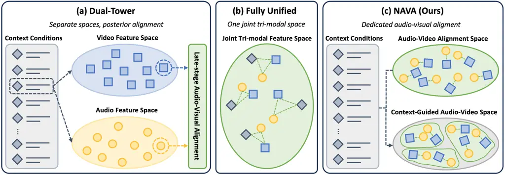
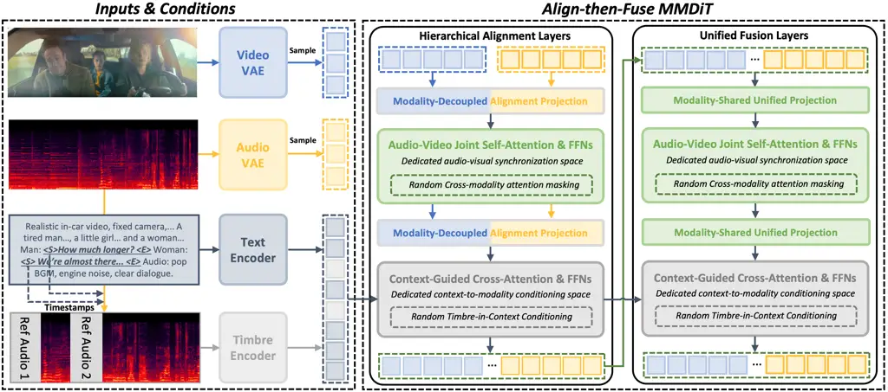
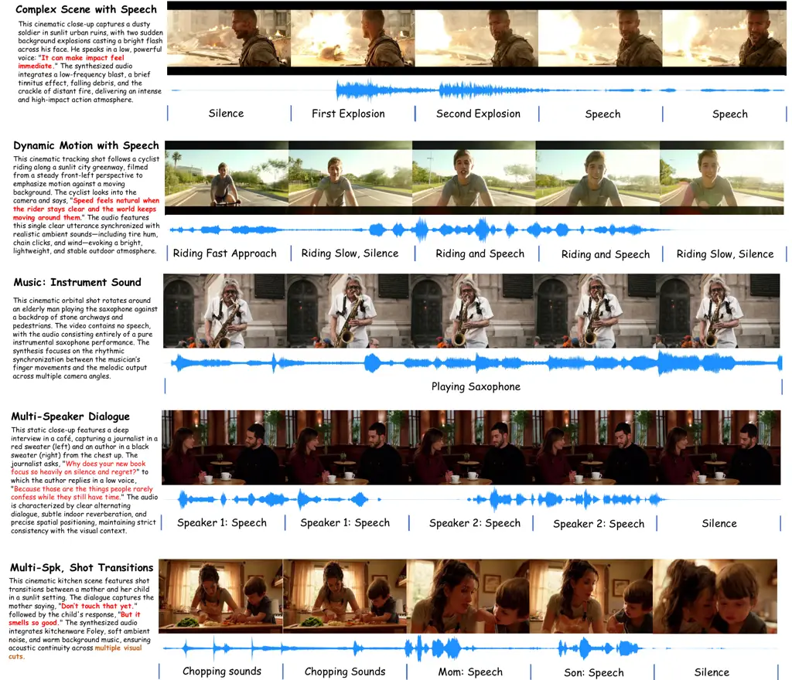
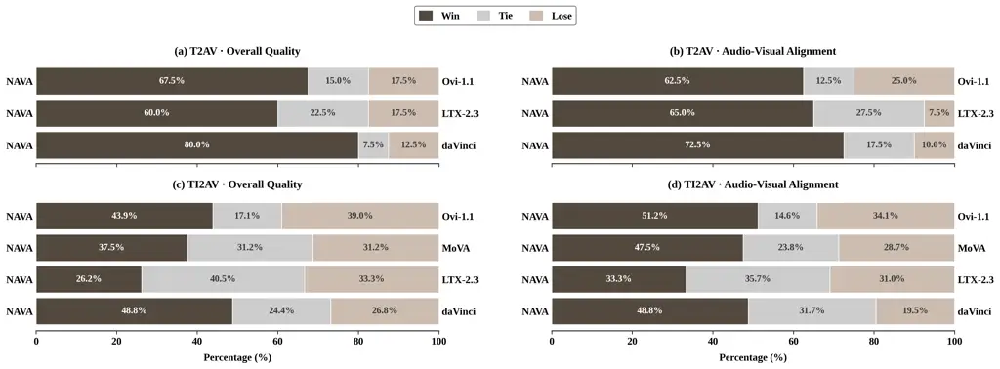

# Native Audio-Visual Alignment for Generation

Longbin Ji^(\*)    Guan Wang^(\*)    Xuan Wei    Chenye Yang    Xiangrui
Liu Affiliation: Zhenyu Zhang^(†)    Shuohuan Wang    Yu Sun   

Jingzhou He

Affiliation: \[2mm\] ERNIE Team, Baidu Inc. Affiliation: \[1mm\]
{jilongbin, wangguan15, zhangzhenyu07}@baidu.com Affiliation: \[1mm\]
^(\*)Equal contribution.  ^(†)Corresponding author.

Affiliation: \[2mm\]

  Project page:
[ernie-research.github.io/NAVA](https://ernie-research.github.io/NAVA/).

###### Abstract

Joint audio-video generation aims to synthesize temporally synchronized
and semantically coherent visual-acoustic content. However, existing
open-source methods mainly rely on either dual-tower designs with
posterior alignment or fully unified tri-modal designs that mix textual
context, audio, and video in one shared space. The former weakens
fine-grained audio-video co-evolution, while the latter couples semantic
conditioning with low-level synchronization. To address these
limitations, we propose NAVA, a _Native Audio-Visual Alignment_
framework for joint audio-video generation. NAVA is built upon
_context-conditioned native audio-visual alignment_: it first
establishes audio-video correspondence in a dedicated interaction space,
and then uses external context to condition the joint denoising process.
Specifically, NAVA is instantiated with an _Align-then-Fuse MMDiT_
architecture, which transitions from modality-aware audio-video
alignment to modality-shared joint denoising. Furthermore, we introduce
_Timbre-in-Context Conditioning_ to associate reference timbre cues with
corresponding speech spans to achieve controllable speech timbre.
Experiments on Verse-Bench and Seed-TTS, together with a user study,
demonstrate that NAVA achieves superior video quality, precise
audio-visual synchronization, competitive audio quality, and stronger
reference-timbre controllability using only 6.3B parameters.

## 1 Introduction

Audio-visual generation has made rapid progress in recent years.
Compared with cascaded pipelines that synthesize one modality after
another, joint audio-video generation models temporal and semantic
correspondences within a unified generation process, thereby reducing
error propagation and improving cross-modal coherence. Although
commercial systems such as Seedance \[19\], Kling \[14\], and Veo \[10\]
have demonstrated the potential of joint audio-video synthesis, their
architectures and training recipes remain proprietary. Therefore, recent
open-source efforts, including Ovi \[16\], LTX \[12\], and MoVA \[20\],
have become crucial for reproducible research in audio-visual
generation.

Despite this progress, most open-source methods still adopt a dual-tower
architecture, where audio and video are generated in separate streams,
and cross-modal interaction is introduced through additional alignment
modules. As illustrated in Fig. 1(a), the paradigm conditions audio and
video on textual context in separate feature spaces, and establishes
audio-visual correspondence only through late-stage interaction.
However, such posterior alignment weakens the joint evolution of audio
and video during generation, making fine-grained synchronization and
semantic consistency dependent on auxiliary cross-modal modules rather
than a unified generative representation.



Figure 1: Comparison of different audio-visual generation paradigms. (a)
_Dual-Tower_: Separate audio and video feature spaces with late-stage
cross-modal alignment. (b) _Fully Unified_: A single tri-modal space
that couples context conditioning and synchronization. (c) _NAVA_:
Dedicated audio-video alignment followed by external context
conditioning for controllable generation.

More recently, daVinci-MagiHuman \[5\] moves beyond dual-tower
interaction by placing textual context, video, and audio tokens into a
unified attention space for end-to-end tri-modal modeling. As shown in
Fig. 1(b), while the design enables direct tri-modal interaction, it
also couples high-level semantic control with low-level audio-visual
synchronization. Consequently, semantic guidance, event correspondence,
and temporal alignment are optimized in the same representation space,
which may hinder the formation of a dedicated synchronization structure.
This motivates us to separate audio-video correspondence from context
conditioning in a dedicated synchronization space.

In this paper, we propose NAVA, a _Native Audio-Visual Alignment_
framework with decoupled context conditioning. As shown in Fig. 1(c),
NAVA first establishes audio-video correspondence in a dedicated
alignment space, and then introduces context as external conditioning to
guide the aligned representation. This formulation differs from both
dual-tower methods, which align audio and video only after separate
modeling, and fully unified tri-modal methods, which mix context, audio,
and video in a shared space. By decoupling context conditioning from
audio-visual synchronization, NAVA focuses its capacity on event-level
correspondence, temporal consistency, and collaborative denoising, while
remaining compatible with pretrained text-to-video backbones.

To realize this, NAVA employs an _Align-then-Fuse MMDiT_ architecture.
It first aligns heterogeneous audio and video representations with
modality-aware layers, then applies shared fusion layers for compact
collaborative denoising. Furthermore, we creatively introduce a
_Timbre-in-Context Conditioning_ mechanism, which treats timbre cues as
contextual conditions for specific speech spans, enabling flexible
content-timbre binding without auxiliary speaker-control branches.

In summary, the main contributions of this paper are as follows:

- •
  We propose NAVA, a _Native Audio-Visual Alignment_ framework that
  formulates joint audio-video generation as _context-conditioned native
  audio-visual alignment_, enabling precise event-level correspondence
  modeling with pretrained video generation backbones.
- •
  We introduce an _Align-then-Fuse MMDiT_ architecture for
  modality-aware audio-video alignment and efficient collaborative
  denoising, together with _Timbre-in-Context Conditioning_ for flexible
  content-timbre binding across speech segments.
- •
  Extensive experiments and user studies demonstrate that NAVA
  significantly outperforms representative dual-tower and fully unified
  baselines, achieving superior audio-visual synchronization, semantic
  consistency, visual quality, and timbre controllability.

## 2 Method



Figure 2: Overview of NAVA. NAVA adopts an _Align-then-Fuse MMDiT_
architecture, which first establishes native audio-video correspondence
via _Hierarchical Alignment Layers_, and subsequently performs
collaborative denoising using _Unified Fusion Layers_. Textual context
and optional reference timbre are injected through cross-attention,
while _Timbre-in-Context Conditioning_ binds timbre cues to speech spans
for controllable multi-speaker generation.

### 2.1 Formulation

Let $`h_{a}`$, $`h_{v}`$, and $`c`$ denote audio tokens, video tokens,
and context tokens, respectively. The context $`c`$ mainly contains
textual conditions and can be augmented with control signals such as
reference timbre embeddings. We use this notation to abstract how
different audio-visual generation paradigms organize audio, video, and
context interactions during denoising.

Existing dual-tower methods \[16; 12; 20\] maintain separate audio and
video generation streams and condition each modality independently:

```math
\displaystyle h_{a}^{\prime} \displaystyle=\mathrm{CrossAttn}(h_{a},c), \tag{1}
```

```math
\displaystyle h_{v}^{\prime} \displaystyle=\mathrm{CrossAttn}(h_{v},c).
```

Audio-visual correspondence is then introduced through additional
cross-modal interaction modules:

```math
[\tilde{h}_{a},\tilde{h}_{v}]=\mathrm{CrossModalAttn}(h_{a}^{\prime},h_{v}^{\prime}). \tag{2}
```

This posterior alignment paradigm allows each modality to evolve largely
in its own feature space before cross-modal correspondence is explicitly
established, making fine-grained synchronization dependent on late-stage
interaction.

Fully unified methods \[5\] instead place context, audio, and video
tokens into a single attention space:

```math
[\tilde{h}_{a},\tilde{h}_{v},\tilde{c}]=\mathrm{SelfAttn}([h_{a},h_{v},c]). \tag{3}
```

This design enables direct tri-modal interaction, but it also entangles
high-level semantic conditioning with low-level audio-video
synchronization within the same representation space.

In contrast, NAVA decouples audio-video synchronization from external
context conditioning through context-conditioned native audio-visual
alignment. Audio and video first interact in a dedicated synchronization
space:

```math
[h_{a}^{\prime},h_{v}^{\prime}]=\mathrm{SelfAttn}([h_{a},h_{v}]), \tag{4}
```

where self-attention is applied over the concatenated audio-video token
sequence to form event-level correspondences without inserting context
as peer tokens. Context is then injected as external conditioning:

```math
[\tilde{h}_{a},\tilde{h}_{v}]=\mathrm{CrossAttn}([h_{a}^{\prime},h_{v}^{\prime}],c). \tag{5}
```

In this way, NAVA separates the roles of synchronization and
conditioning: joint self-attention learns native audio-video
correspondence, while cross-attention provides semantic and controllable
guidance from external context.

### 2.2 Align-then-Fuse MMDiT

To instantiate context-conditioned native audio-visual alignment, NAVA
adopts an _Align-then-Fuse MMDiT_ architecture, as shown in Fig. 2.
Video and audio are first encoded into latent tokens by separate VAEs,
while textual context and optional reference-timbre cues are encoded as
conditioning tokens. The architecture follows a progressive design:
early layers preserve modality-aware projections to stabilize
heterogeneous audio-video interaction, while later layers share
generation parameters to encourage compact collaborative denoising. This
yields an align-then-fuse process, where audio and video first establish
native correspondence and then evolve jointly in a shared generation
space.

##### Hierarchical Alignment Layers.

The early layers establish native audio-video correspondence before
fully shared generation. Audio spectrogram latents and video latents
differ substantially in spatial-temporal structure, token rate, and
feature distribution. Directly sharing projections from the first layer
can therefore force heterogeneous modalities into a common
parameterization too early, suppressing modality-specific
representations and destabilizing cross-modal interaction. We address
this with _Modality-Decoupled Alignment Projection_, where audio and
video tokens are first mapped by modality-specific projections and then
placed into a shared audio-video interaction space for stable
early-stage correspondence learning.

Within this space, _Audio-Video Joint Self-Attention & FFNs_ perform
repeated cross-modal interaction during denoising. Unlike posterior
alignment modules that operate after separate generation streams, this
joint interaction allows acoustic patterns and visual dynamics to
co-evolve throughout the denoising process. As a result, event-level
correspondences such as speech-lip motion, impact sounds, musical
performance, and scene-dependent acoustic changes can be modeled within
the generation trajectory itself. To handle token-rate mismatch, we
rescale the rotary positional embedding of audio tokens by

```math
\theta_{\mathrm{rope}}=\frac{TR_{v}}{TR_{a}}, \tag{6}
```

where $`TR_{v}`$ and $`TR_{a}`$ denote the video and audio token rates,
respectively. This rate-aware rescaling places audio and video tokens
into a more comparable temporal coordinate system for joint attention.

Context is injected separately through _Context-Guided Cross-Attention &
FFNs_. This preserves a dedicated audio-video synchronization space
while allowing textual and timbre conditions to modulate the denoising
trajectory. Compared with fully unified tri-modal attention, this design
avoids inserting context tokens directly into the same self-attention
space used for low-level audio-video synchronization.

##### Unified Fusion Layers.

After audio-video correspondence has been established, NAVA transitions
to _Unified Fusion Layers_. In these layers, audio and video tokens are
processed with _Modality-Shared Unified Projection_ and updated by
shared transformer blocks. Since the preceding alignment layers have
already reduced the representational gap between audio and video tokens,
parameter sharing in later layers becomes more stable and efficient.
This removes persistent stream separation and encourages compact
collaborative denoising in a shared generation space. Context remains
external through cross-attention, so semantic guidance and controllable
conditions continue to modulate the joint denoising process without
disrupting the learned synchronization structure.

### 2.3 Timbre-in-Context Conditioning

Textual context provides semantic guidance, while speech-driven
audio-video generation further requires segment-level timbre control,
i.e., specifying _who speaks which content_. We propose
_Timbre-in-Context Conditioning_, which represents reference timbre cues
as context tokens and binds them to their corresponding speech spans
through the existing context-conditioning pathway.

Let $`\mathcal{P}`$ denote the textual prompt containing speech spans
$`\{\mathcal{S}_{i}\}_{i=1}^{N}`$, and let $`\mathcal{R}_{i}`$ be the
reference utterance specifying the desired timbre for
$`\mathcal{S}_{i}`$. We extract a context-space timbre token as

```math
\mathbf{s}_{i}=E_{\mathrm{tim}}(\mathcal{R}_{i}), \tag{7}
```

where $`E_{\mathrm{tim}}`$ denotes the timbre encoder. Each speech span
is then augmented as

```math
\mathcal{S}_{i}\rightarrow\big[\langle\mathrm{S}\rangle,\,\mathbf{s}_{i},\,\mathrm{Text}(\mathcal{S}_{i}),\,\langle\mathrm{E}\rangle\big], \tag{8}
```

where $`\langle\mathrm{S}\rangle`$ and $`\langle\mathrm{E}\rangle`$ mark
the boundaries of a timbre-conditioned speech span. Applying this
replacement to all speech spans yields the final context sequence:

```math
\mathbf{c}=\mathrm{Augment}\left(\mathcal{P};\{(\mathcal{S}_{i},\mathbf{s}_{i})\}_{i=1}^{N}\right). \tag{9}
```

During denoising, NAVA accesses this augmented context through
context-guided cross-attention. Thus, timbre cues are associated with
speech spans within the original prompt structure rather than injected
as a global control signal. This is important for multi-speaker
generation, where different utterances may require different speaker
identities or timbre styles. Because timbre information is represented
in the context pathway, the mechanism requires no auxiliary
speaker-control branch or backbone modification. It naturally supports
compositional control by assigning different timbre tokens to different
speech spans, while keeping the audio-video denoising backbone
unchanged.

### 2.4 Training and Inference

#### 2.4.1 Progressive Multi-Task Training

NAVA is trained with a progressive multi-task strategy over T2AV, TI2AV,
T2A, T2V, and TIA2AV tasks, covering audio-only, video-only, and paired
audio-visual denoising trajectories. The training schedule consists of
three stages. First, we train on audio-only and paired audio-visual data
with a $`3{:}1`$ sampling ratio to initialize the audio pathway and
stabilize audio denoising while preserving the visual capability
inherited from the pretrained video backbone \[23\]. We then shift the
audio-only/audio-visual ratio to $`1{:}2`$ and train on high-quality
audio data together with the full audio-visual dataset to improve audio
fidelity and audio-visual synchronization. Finally, we fine-tune on
curated high-quality audio-visual data to improve instruction following
and controllable generation, including multi-speaker dialogue, complex
motion, and camera control.

#### 2.4.2 Structured Dropout for Guidance

To support condition-factorized guidance, we construct paired
conditional and partially unconditional denoising paths during training,
enabling guidance signals to be estimated from controlled prediction
differences. For audio-visual alignment, we apply _Random Cross-modality
Attention Masking_, where cross-modal attention entries between audio
and video tokens are randomly masked while intra-modal attention remains
intact. This exposes the model to both coupled and partially decoupled
audio-video denoising regimes, whose prediction contrast is later used
for alignment guidance. For timbre control, we apply _Random
Timbre-in-Context Conditioning_ by dropping or replacing timbre tokens
with null tokens for a subset of speech spans. This trains the model
under timbre-conditioned and timbre-free contexts, providing the
prediction contrast required for timbre guidance.

#### 2.4.3 Condition-Factorized Classifier-Free Guidance

During inference, we build on the audio-visual guidance formulation of
LTX \[12\] and extend it with reference-timbre guidance. Let
$`\mathbf{v}_{\theta}^{c,a,\tau}(z_{t})`$ denote the prediction at step
$`t`$, where $`z_{t}`$ is the noisy audio-video latent, and $`c`$,
$`a`$, and $`\tau`$ denote textual context, audio-video interaction, and
reference timbre conditioning, respectively. We define three guidance
directions:

```math
\displaystyle\Delta_{\mathrm{text}} \displaystyle=\mathbf{v}_{\theta}^{c,a,\tau}(z_{t})-\mathbf{v}_{\theta}^{\varnothing,a,\tau}(z_{t}), \tag{10}
```

```math
\displaystyle\Delta_{\mathrm{align}} \displaystyle=\mathbf{v}_{\theta}^{c,a,\tau}(z_{t})-\mathbf{v}_{\theta}^{c,\varnothing,\tau}(z_{t}),
```

```math
\displaystyle\Delta_{\mathrm{timbre}} \displaystyle=\mathbf{v}_{\theta}^{c,a,\tau}(z_{t})-\mathbf{v}_{\theta}^{c,a,\varnothing}(z_{t}).
```

The final guided prediction is

```math
\hat{\mathbf{v}}_{\theta}(z_{t})=\mathbf{v}_{\theta}^{c,a,\tau}(z_{t})+s_{\mathrm{text}}\Delta_{\mathrm{text}}+s_{\mathrm{align}}\Delta_{\mathrm{align}}+s_{\mathrm{timbre}}\Delta_{\mathrm{timbre}}, \tag{11}
```

where $`s_{\mathrm{text}}`$, $`s_{\mathrm{align}}`$, and
$`s_{\mathrm{timbre}}`$ control prompt adherence, audio-visual
synchronization, and timbre preservation, respectively. This factorized
formulation supports decoupled alignment guidance and fine-grained
timbre control during inference.

## 3 Experiments

### 3.1 Experimental Setup

##### Implementation details.

NAVA has 6.3B parameters with 30 MMDiT blocks, where the first 10 blocks
are _Hierarchical Alignment Layers_ and the remaining 20 are _Unified
Fusion Layers_. We initialize corresponding layers from
Wan2.2-5B \[23\], use Wan2.2-VAE for video latents with a
$`4\times 16\times 16`$ compression ratio, and use LTX2.3-VAE for
multi-channel audio latents. The model is trained with AdamW at a
learning rate of $`5\times 10^{-5}`$ on 128 NVIDIA H100 GPUs, with an
effective batch size of 512 for 70K steps following the three-stage
schedule in Sec. 2.4. We apply random cross-modality attention masking
and timbre-condition dropout with probabilities of $`20\%`$ each, and
sample image conditions with probability $`50\%`$.

##### Benchmarks and baselines.

Following MoVA \[20\] and daVinci-MagiHuman \[5\], we adopt
Verse-Bench \[24\] for objective audio-visual evaluation, covering
speech videos, sound effects, and musical instruments. We further
evaluate timbre controllability on the Seed-TTS benchmark \[2\]. For
Verse-Bench, we compare with Ovi-1.1 \[16\], MoVA \[20\],
LTX-2.3 \[12\], and daVinci-MagiHuman \[5\], covering dual-tower and
tri-modal unified paradigms. For Seed-TTS, we compare with
DreamID-Omni \[11\]. Since DreamID-Omni requires paired reference audio
and image inputs, we use a fixed reference image for all samples and
provide the corresponding reference audio. For fair comparison, we
evaluate the base version of each model without additional
super-resolution, distillation, or post-processing modules. We also
apply Gemini-3-Flash rewriting to all test prompts to match each model’s
expected inference format while preserving the original benchmark
semantics.

##### Evaluation metrics.

We evaluate the proposed method along four dimensions: audio–visual
alignment, video quality, audio quality, and timbre controllability,
covering both perceptual fidelity and cross-modal consistency. For
audio–visual alignment, we report Sync-C and Sync-D from SyncNet \[6\],
which measure the confidence and temporal offset of lip–audio
synchronization, respectively. We further use the ImageBind score
(IB-Score) \[9\] to assess cross-modal semantic consistency between the
generated video and audio. For video quality, we report identity
consistency and aesthetic score. For audio quality, we employ
Audiobox-Aesthetics \[21\], a no-reference audio assessment model
trained to predict human perceptual judgments along multiple aesthetic
axes. Specifically, we report Production Quality (PQ) to assess
perceived audio fidelity, and Fréchet Distance (FD) to measure the
distributional gap between generated and reference audio in the learned
audio feature space. In addition, we report word error rate (WER) to
measure speech intelligibility and content accuracy. For timbre
controllability, we compute Seed-TTS timbre similarity between the
generated speech and the reference utterance. Higher values are better
for Sync-C, IB-Score, video quality, PQ, and timbre similarity, whereas
lower values are better for Sync-D, FD, and WER.

### 3.2 Main Results

|                |            |            |                     |                       |                 |                            |                    |                 |                   |
| -------------- | ---------- | ---------- | ------------------- | --------------------- | --------------- | -------------------------- | ------------------ | --------------- | ----------------- |
| Model          | Params     | Resolution | AV-Align            |                       |                 | Video Quality $`\uparrow`$ | Audio              |                 |                   |
|                |            |            | Sync-C $`\uparrow`$ | Sync-D $`\downarrow`$ | IB $`\uparrow`$ |                            | WER $`\downarrow`$ | PQ $`\uparrow`$ | FD $`\downarrow`$ |
| Ovi 1.1 \[16\] | 10B        | 720p       | 7.484               | 7.979                 | 0.199           | 0.636                      | 0.102              | 5.843           | 0.942             |
| MOVA \[20\]    | A18B (32B) | 720p       | 7.289               | 7.808                 | 0.269           | 0.603                      | 0.126              | 7.233           | 0.922             |
| Davinci \[5\]  | 15B        | 540p       | 7.149               | 7.816                 | 0.269           | 0.600                      | 0.151              | 5.956           | 0.931             |
| LTX 2.3 \[12\] | 19B        | 512p       | 7.248               | 7.690                 | 0.337           | 0.576                      | 0.106              | 6.946           | 0.829             |
| NAVA (ours)    | 6.3B       | 720p       | 7.791               | 7.566                 | 0.313           | 0.659                      | 0.099              | 6.861           | 0.833             |

Table 1: General capabilities on Verse-Bench. We compare representative
audio-video generation models in terms of synchronization, video
quality, and audio quality. NAVA achieves the strongest overall
synchronization and video quality, with competitive audio quality and
the fewest parameters.

|                |                     |                    |                                 |
| -------------- | ------------------- | ------------------ | ------------------------------- |
| Model Category | Model               | WER $`\downarrow`$ | Speaker Similarity $`\uparrow`$ |
| Audio          | CosyVoice \[7\]     | 4.29               | 60.9                            |
|                | CosyVoice2 \[8\]    | 2.57               | 65.2                            |
|                | Qwen2.5-Omni \[28\] | 2.72               | 63.2                            |
| Audio-Video    | DreamID-Omni \[11\] | 31.76              | 35.7                            |
|                | NAVA                | 4.20               | 66.7                            |

Table 2: Reference-timbre generation on Seed-TTS. We report WER and
speaker similarity for both audio-only speech models and audio-video
generation models under an audio-only evaluation protocol. NAVA achieves
the best results among audio-video generation models.

|            |            |              |                     |                 |                            |                 |                    |
| ---------- | ---------- | ------------ | ------------------- | --------------- | -------------------------- | --------------- | ------------------ |
| HAL Layers | UFL Layers | Model Params | Alignment           |                 | Video Quality $`\uparrow`$ | Audio Quality   |                    |
|            |            |              | Sync-C $`\uparrow`$ | IB $`\uparrow`$ |                            | PQ $`\uparrow`$ | WER $`\downarrow`$ |
|            | $`\circ`$  | 5B           | 7.643               | 33.22           | 67.53                      | 5.296           | 0.182              |
| $`\circ`$  | $`\circ`$  | 6.3B         | 7.684               | 34.34           | 67.67                      | 5.377           | 0.177              |
| $`\circ`$  |            | 7.7B         | 7.030               | 30.91           | 66.62                      | 5.347           | 0.167              |

Table 3: Ablation of Align-then-Fuse MMDiT. We compare model variants
with different combinations of _Hierarchical Alignment Layers_ (HAL) and
_Unified Fusion Layers_ (UFL). Results demonstrate that combining HAL
and UFL yields the best alignment and video quality, while maintaining
competitive audio quality.

#### 3.2.1 Quantitative Evaluation

Table 1 reports quantitative results on Verse-Bench. NAVA achieves the
best overall trade-off across audio–visual alignment, video quality,
audio quality, and model efficiency. With only $`6.3`$B parameters, NAVA
obtains the highest Sync-C score of $`7.791`$ and the lowest Sync-D
score of $`7.566`$, demonstrating superior temporal synchronization
between generated speech and visual motion. It also achieves the best
video quality score of $`0.659`$, suggesting that the proposed
Align-then-Fuse design preserves strong visual generation capability
while enabling synchronized audio generation.

For semantic audio–visual consistency, NAVA obtains an IB-Score of
$`0.313`$, outperforming Ovi-1.1 and remaining competitive with MoVA and
Davinci, although LTX 2.3 achieves the highest IB-Score. For audio
quality, NAVA achieves the lowest WER of $`0.099`$, indicating improved
speech intelligibility and content accuracy. Its PQ and FD scores,
$`6.861`$ and $`0.833`$, are also competitive among baselines, showing
that NAVA maintains high perceived audio fidelity and a close
distributional match to reference audio. These results indicate that
NAVA substantially improves audio–visual synchronization and video
quality without sacrificing audio quality, despite using the fewest
parameters among the compared audio-video models.

Table 2 evaluates reference-timbre speech generation on the EN subset of
the Seed-TTS benchmark. Audio-only speech models such as
CosyVoice \[7\], CosyVoice2 \[8\], and Qwen2.5-Omni \[28\] provide
strong references for pure speech generation. Despite operating as an
audio-video generation model with synchronized visual generation, NAVA
achieves the highest speaker similarity of $`66.7`$ and a competitive
WER of $`4.20`$. Within the audio-video model category, NAVA
substantially outperforms DreamID-Omni, reducing WER from $`31.76`$ to
$`4.20`$ and improving speaker similarity from $`35.7`$ to $`66.7`$.
These results demonstrate the effectiveness of _Timbre-in-Context
Conditioning_, which binds reference timbre cues to corresponding speech
spans through the context pathway. Overall, NAVA provides a strong
balance across synchronization, semantic consistency, video quality,
audio quality, and timbre controllability.

#### 3.2.2 Qualitative Evaluation

##### Visualization.



Figure 3: Qualitative visualization of NAVA. We present various
generated video frames, audio waveforms, and event-level annotations
across diverse scenarios, including complex speech scenes, dynamic
motion, musical performance, multi-speaker dialogue, and shot
transitions. The annotations highlight how the generated sounds are
temporally aligned with visual events, such as silence, explosions,
riding motion, instrumental performances, speaker turns, chopping
sounds, and scene cuts. Overall, NAVA produces semantically coherent
audio-visual outputs with diverse sound events, scene-aware acoustics,
and controllable speaker assignment.

Fig. 3 visualizes representative NAVA generations across challenging
scenarios, including speech in complex acoustic scenes, speech during
dynamic motion, musical performance, multi-speaker dialogue, and shot
transitions. The sampled frames, waveforms, and event annotations show
that NAVA can synthesize temporally synchronized speech, sound effects,
and instrumental audio under complex visual contexts. The examples also
demonstrate controllable speaker assignment and coherent generation
across multi-speaker and multi-shot settings.

##### User Study.

To further assess perceptual quality and robustness, we conduct a human
evaluation using the GSB protocol. We evaluate 250 cases covering both
text-to-audio-video (T2AV) and text-image-to-audio-video (TI2AV)
generation. For T2AV, we construct a diverse set of synthetic prompts to
cover challenging scenarios, including single- and dual-speaker speech,
camera control, ambient sound, musical instruments, and complex acoustic
events.For TI2AV, we directly use samples from Verse-Bench. MoVA is
excluded from the T2AV comparison because its released model is not
designed to take text-only inputs for this generation mode. To obtain a
more fine-grained and reliable evaluation, participants are asked to
compare paired results along two dimensions: overall audio-visual
quality and audio-visual alignment accuracy. For each pair, participants
assign one of three preferences: Win, Tie, or Lose.

The results are shown in Fig. 4. On T2AV, NAVA consistently outperforms
all compared baselines. In terms of overall quality, NAVA achieves win
rates of $`67.5\%`$, $`60.0\%`$, and $`80.0\%`$ against Ovi-1.1,
LTX-2.3, and daVinci, respectively. For audio-visual alignment, NAVA
obtains even stronger preferences, with win rates of $`62.5\%`$,
$`65.0\%`$, and $`72.5\%`$. These results suggest that NAVA generalizes
well to diverse and challenging text-driven audio-visual generation
scenarios, especially in maintaining synchronized speech, motion, and
sound events.

On TI2AV, NAVA also shows clear advantages over most baselines. For
overall quality, NAVA achieves win rates of $`43.9\%`$, $`37.5\%`$,
$`26.2\%`$, and $`48.8\%`$ against Ovi-1.1, MoVA, LTX-2.3, and daVinci,
respectively. For audio-visual alignment, NAVA obtains win rates of
$`51.2\%`$, $`47.5\%`$, $`33.3\%`$, and $`48.8\%`$. While LTX-2.3
remains competitive on TI2AV, particularly in overall quality, NAVA
achieves stronger alignment against Ovi-1.1, MoVA, and daVinci, and
remains competitive with LTX-2.3. Overall, the human evaluation confirms
that NAVA provides favorable perceptual audio-visual quality and more
reliable temporal alignment across both T2AV and TI2AV settings.



Figure 4: Results of User study. Pairwise human preference comparisons
between NAVA and representative baselines under T2AV and TI2AV settings.
The bars report the win/tie/lose percentages of NAVA in terms of overall
quality and audio-visual alignment. NAVA achieves favorable preferences
in most comparisons, especially on audio-visual alignment.

### 3.3 Ablation Studies

|                              |                     |                       |                 |                            |                 |                          |                            |                  |
| ---------------------------- | ------------------- | --------------------- | --------------- | -------------------------- | --------------- | ------------------------ | -------------------------- | ---------------- |
|                              | Sync-C $`\uparrow`$ | Sync-D $`\downarrow`$ | IB $`\uparrow`$ | Video Quality $`\uparrow`$ | PQ $`\uparrow`$ | WER\_(VB) $`\downarrow`$ | WER\_(Seed) $`\downarrow`$ | ASV $`\uparrow`$ |
| Alignment CFG on Verse-Bench |                     |                       |                 |                            |                 |                          |                            |                  |
| NAVA w/o Align CFG           | 6.170               | 8.755                 | 0.355           | 0.667                      | 6.658           | 0.126                    | –                          | –                |
| NAVA w/ Align CFG            | 7.791               | 7.566                 | 0.402           | 0.659                      | 6.860           | 0.099                    | –                          | –                |
| Timbre CFG on Seed-TTS       |                     |                       |                 |                            |                 |                          |                            |                  |
| NAVA w/o Timbre CFG          | –                   | –                     | –               | –                          | –               | –                        | 3.78                       | 65.5             |
| NAVA w/ Timbre CFG           | –                   | –                     | –               | –                          | –               | –                        | 4.20                       | 66.7             |

Table 4: Ablation of condition-factorized CFG. Alignment CFG is
evaluated on Verse-Bench, while timbre CFG is evaluated on the Seed-TTS
benchmark.

##### Ablation on Align-then-Fuse MMDiT.

Table 3 studies the roles of *Hierarchical Alignment Layers* (HAL) and
*Unified Fusion Layers* (UFL). The UFL-only variant removes early
modality-aware alignment and directly shares generation parameters
across audio and video, leading to weaker Sync-C and IB scores. This
suggests that fully shared generation without an explicit alignment
stage is insufficient for establishing fine-grained audio-video
correspondence. The HAL-only variant achieves stronger audio-related
metrics, including improved speech intelligibility and audio fidelity,
but degrades IB and video quality, indicating that persistent
modality-aware alignment can preserve unimodal denoising ability at the
cost of compact high-level fusion. Combining HAL and UFL achieves the
best overall trade-off, obtaining the strongest synchronization,
cross-modal consistency, and video quality. These results support the
proposed align-then-fuse design: HAL first aligns heterogeneous
audio-video representations, while UFL promotes shared high-level
generation and collaborative denoising after correspondence has been
established.

##### Ablation on Condition-Factorized CFG.

Table 4 evaluates the proposed condition-factorized classifier-free
guidance. Alignment CFG substantially improves audio-visual
correspondence, increasing Sync-C from $`6.170`$ to $`7.791`$, reducing
Sync-D from $`8.755`$ to $`7.566`$, and improving IB from $`0.355`$ to
$`0.402`$. These gains come with only minor changes in video quality,
while WER decreases from $`0.126`$ to $`0.099`$ and PQ improves from
$`6.658`$ to $`6.860`$, showing that alignment guidance strengthens
synchronization without compromising unimodal generation quality. For
timbre control, Timbre CFG improves reference-timbre consistency,
increasing ASV from $`65.5`$ to $`66.7`$, with a mild WER trade-off from
$`3.78`$ to $`4.20`$. Overall, these ablations show that different
guidance directions modulate distinct generation attributes: Alignment
CFG improves audio-video correspondence, while Timbre CFG improves
timbre consistency. This validates factorized guidance for separately
adjusting synchronization and timbre controllability at inference time,
without retraining or modifying the generation backbone.

## 4 Related Work

##### Video-to-Audio Generation.

Video-to-audio generation synthesizes acoustic content conditioned on a
given video, and often serves as a cascaded component for audio-visual
content creation. Early methods explore multimodal representation
learning and cross-modal conditioning, using Transformer architectures
or visual-textual encoders to fuse video and text cues \[1; 13\]. Recent
systems improve temporal precision and generation efficiency through
high-frame-rate visual features, rectified flow matching, and
large-scale audio-visual training \[22; 27\]. More recent works such as
MMAudio \[4\] and Kling-Foley \[26\] adopt diffusion or MMDiT-style
architectures and leverage large-scale video-audio corpora such as
VGGSound \[3\] and WavCaps \[17\]. Although these approaches can
generate plausible audio for existing videos, they are inherently
conditioned on a fixed visual trajectory and do not address native joint
generation, where audio and video should co-evolve during synthesis.

##### Audio-Video Joint Generation.

Unlike video-to-audio generation, audio-video joint generation
synthesizes both modalities within a shared generation process and
therefore requires tighter temporal and semantic coordination. Early
attempts such as MM-Diffusion \[18\], Javis-DiT \[15\], and
Universe-1 \[24\] explore cross-modal attention, expert composition, or
multimodal diffusion for coordinated generation. Recent open-source
systems, including UniAVGen \[29\], Ovi \[16\], LTX \[12\], and
MoVA \[20\], mainly adopt dual-tower designs that maintain separate
audio and video streams and introduce posterior fusion or alignment.
Such designs can exploit pretrained unimodal priors, but delayed
audio-video interaction may limit fine-grained synchronization and
semantic consistency.

Unified modeling has been explored to strengthen cross-modal
interaction. Apollo \[25\] applies joint attention over concatenated
multimodal tokens, while daVinci-MagiHuman \[5\] places textual context,
video, and audio tokens into a shared tri-modal space. These designs
enable direct multimodal interaction, but fully mixing semantic context
with generation modalities can entangle high-level conditioning with
low-level audio-video synchronization. In contrast, NAVA establishes
audio-video correspondence in a dedicated interaction space and injects
context as external conditioning, separating native synchronization from
semantic and controllable guidance.

##### Controllable Audio-Visual Generation.

Controllable audio-visual generation requires not only synchronized
audio and video, but also flexible conditioning on identity, reference
audio, speaker style, or timbre. UniAVGen \[29\] and DreamID-Omni \[11\]
incorporate reference tokens or identity/timbre conditions to support
controllable generation. However, many reference-conditioning mechanisms
are applied as global controls or auxiliary branches, which can be less
flexible for multi-speaker scenarios where different utterances require
different timbres. NAVA instead represents reference timbre cues as
context tokens tied to specific speech spans. This enables compositional
content-timbre binding through the existing context-conditioning
pathway, without introducing an additional speaker-control branch or
modifying the denoising backbone.

## 5 Conclusion

We presented NAVA, a Native Audio-Visual Alignment framework for joint
audio-video generation. NAVA decouples audio-visual synchronization from
context conditioning by establishing audio-video correspondence in a
dedicated alignment space and using context as external guidance. We
instantiate this formulation with an _Align-then-Fuse MMDiT_
architecture, which bridges modality-aware alignment and unified
audio-video denoising, and introduce _Timbre-in-Context Conditioning_
for segment-level reference-timbre control. Experiments on Verse-Bench
and Seed-TTS demonstrate that NAVA achieves strong audio-visual
synchronization, visual quality, semantic consistency, and timbre
controllability. These results indicate that native audio-visual
alignment with decoupled context conditioning is a promising direction
for scalable and controllable audio-video generation.

Despite its strong overall performance, NAVA remains limited in
generating certain long-tail and highly compositional audio events, such
as rare animal sounds, music, singing, and complex mixtures of scene
sounds. Addressing these limitations requires broader and more
meticulously curated audio-visual data, especially for rare events and
compositionally rich scenarios. Our results suggest that deeper
audio-visual coupling represents a highly promising direction. In the
future, another potential direction is to explore earlier fusion
mechanisms, such as joint audio-visual tokenizers or unified
representation models, to further enhance synchronization, semantic
consistency, and generalization.

## References

- Akbari et al. (2021) H. Akbari, L. Yuan, R. Qian, W. Chuang, S.
  Chang, Y. Cui, and B. Gong Vatt: transformers for multimodal
  self-supervised learning from raw video, audio and text. Advances in
  neural information processing systems 34, pp. 24206–24221. Cited by:
  §4.
- Anastassiou et al. (2024) P. Anastassiou, J. Chen, J. Chen, Y.
  Chen, Z. Chen, Z. Chen, J. Cong, L. Deng, C. Ding, L. Gao, et al.
  Seed-tts: a family of high-quality versatile speech generation models.
  arXiv preprint arXiv:2406.02430. Cited by: §3.1.
- Chen et al. (2020) H. Chen, W. Xie, A. Vedaldi, and A. Zisserman
  Vggsound: a large-scale audio-visual dataset. In ICASSP 2020-2020 IEEE
  International Conference on Acoustics, Speech and Signal Processing
  (ICASSP), pp. 721–725. Cited by: §4.
- Cheng et al. (2025) H. K. Cheng, M. Ishii, A. Hayakawa, T. Shibuya, A.
  Schwing, and Y. Mitsufuji Mmaudio: taming multimodal joint training
  for high-quality video-to-audio synthesis. In Proceedings of the
  Computer Vision and Pattern Recognition Conference, pp. 28901–28911.
  Cited by: §4.
- Chern et al. (2026) E. Chern, H. Teng, H. Sun, H. Wang, H. Pan, H.
  Jia, J. Su, J. Li, J. Yu, L. Liu, et al. Speed by simplicity: a
  single-stream architecture for fast audio-video generative foundation
  model. arXiv preprint arXiv:2603.21986. Cited by: §1, §2.1, §3.1,
  Table 1, §4.
- Chung and Zisserman (2016) J. S. Chung and A. Zisserman Out of time:
  automated lip sync in the wild. In Asian conference on computer
  vision, pp. 251–263. Cited by: §3.1.
- Du et al. (2024a) Z. Du, Q. Chen, S. Zhang, K. Hu, H. Lu, Y. Yang, H.
  Hu, S. Zheng, Y. Gu, Z. Ma, et al. Cosyvoice: a scalable multilingual
  zero-shot text-to-speech synthesizer based on supervised semantic
  tokens. arXiv preprint arXiv:2407.05407. Cited by: §3.2.1, Table 2.
- Du et al. (2024b) Z. Du, Y. Wang, Q. Chen, X. Shi, X. Lv, T. Zhao, Z.
  Gao, Y. Yang, C. Gao, H. Wang, et al. Cosyvoice 2: scalable streaming
  speech synthesis with large language models. arXiv preprint
  arXiv:2412.10117. Cited by: §3.2.1, Table 2.
- Girdhar et al. (2023) R. Girdhar, A. El-Nouby, Z. Liu, M. Singh, K. V.
  Alwala, A. Joulin, and I. Misra Imagebind: one embedding space to bind
  them all. In Proceedings of the IEEE/CVF conference on computer vision
  and pattern recognition, pp. 15180–15190. Cited by: §3.1.
- Google DeepMind (2025) Google DeepMind Veo 3.1. External Links:
  [Link](https://deepmind.google/models/veo) Cited by: §1.
- Guo et al. (2026) X. Guo, F. Ye, Q. Sun, L. Chen, B. Li, P. Zhang, J.
  Liu, S. Zhao, Q. He, and X. Hou DreamID-omni: unified framework for
  controllable human-centric audio-video generation. arXiv preprint
  arXiv:2602.12160. Cited by: §3.1, Table 2, §4.
- HaCohen et al. (2026) Y. HaCohen, B. Brazowski, N. Chiprut, Y.
  Bitterman, A. Kvochko, A. Berkowitz, D. Shalem, D. Lifschitz, D.
  Moshe, E. Porat, et al. LTX-2: efficient joint audio-visual foundation
  model. arXiv preprint arXiv:2601.03233. Cited by: §1, §2.1, §2.4.3,
  §3.1, Table 1, §4.
- Hu et al. (2024) Y. Hu, Y. Gu, C. Li, R. Chen, and D. Yu
  Video-to-audio generation with fine-grained temporal semantics. arXiv
  preprint arXiv:2409.14709. Cited by: §4.
- Kuaishou Technology (2026) Kuaishou Technology Kling 3.0. Note:
  [https://kling.ai](https://kling.ai) Cited by: §1.
- Liu et al. (2025) K. Liu, W. Li, L. Chen, S. Wu, Y. Zheng, J. Ji, F.
  Zhou, J. Luo, Z. Liu, H. Fei, et al. Javisdit: joint audio-video
  diffusion transformer with hierarchical spatio-temporal prior
  synchronization. arXiv preprint arXiv:2503.23377. Cited by: §4.
- Low et al. (2025) C. Low, W. Wang, and C. Katyal Ovi: twin backbone
  cross-modal fusion for audio-video generation. External Links:
  2510.01284, [Link](https://arxiv.org/abs/2510.01284) Cited by: §1,
  §2.1, §3.1, Table 1, §4.
- Mei et al. (2024) X. Mei, C. Meng, H. Liu, Q. Kong, T. Ko, C.
  Zhao, M. D. Plumbley, Y. Zou, and W. Wang Wavcaps: a chatgpt-assisted
  weakly-labelled audio captioning dataset for audio-language multimodal
  research. IEEE/ACM Transactions on Audio, Speech, and Language
  Processing 32, pp. 3339–3354. Cited by: §4.
- Ruan et al. (2023) L. Ruan, Y. Ma, H. Yang, H. He, B. Liu, J.
  Fu, N. J. Yuan, Q. Jin, and B. Guo Mm-diffusion: learning multi-modal
  diffusion models for joint audio and video generation. In Proceedings
  of the IEEE/CVF conference on computer vision and pattern recognition,
  pp. 10219–10228. Cited by: §4.
- Seedance et al. (2026) T. Seedance, D. Chen, L. Chen, X. Chen, Y.
  Chen, Z. Chen, Z. Chen, F. Cheng, T. Cheng, Y. Cheng, et al. Seedance
  2.0: advancing video generation for world complexity. arXiv preprint
  arXiv:2604.14148. Cited by: §1.
- Team et al. (2026) O. Team, D. Yu, M. Chen, Q. Chen, Q. Luo, Q. Wu, Q.
  Cheng, R. Li, T. Liang, W. Zhang, et al. Mova: towards scalable and
  synchronized video-audio generation. arXiv preprint arXiv:2602.08794.
  Cited by: §1, §2.1, §3.1, Table 1, §4.
- Tjandra et al. (2025) A. Tjandra, Y. Wu, B. Guo, J. Hoffman, B.
  Ellis, A. Vyas, B. Shi, S. Chen, M. Le, N. Zacharov, C. Wood, A. Lee,
  and W. Hsu Meta audiobox aesthetics: unified automatic quality
  assessment for speech, music, and sound. arXiv preprint
  arXiv:2502.05139. Cited by: §3.1.
- Viertola et al. (2025) I. Viertola, V. Iashin, and E. Rahtu Temporally
  aligned audio for video with autoregression. In ICASSP 2025-2025 IEEE
  International Conference on Acoustics, Speech and Signal Processing
  (ICASSP), pp. 1–5. Cited by: §4.
- Wan et al. (2025) T. Wan, A. Wang, B. Ai, B. Wen, C. Mao, C. Xie, D.
  Chen, F. Yu, H. Zhao, J. Yang, et al. Wan: open and advanced
  large-scale video generative models. arXiv preprint arXiv:2503.20314.
  Cited by: §2.4.1, §3.1.
- Wang et al. (2025a) D. Wang, W. Zuo, A. Li, L. Chen, X. Liao, D.
  Zhou, Z. Yin, X. Dai, D. Jiang, and G. Yu UniVerse-1: unified
  audio-video generation via stitching of experts. arXiv preprint
  arXiv:2509.06155. Cited by: §3.1, §4.
- Wang et al. (2026) J. Wang, C. Qiang, Y. Guo, Y. Wang, X. Zeng, C.
  Zhang, and P. Wan Klear: unified multi-task audio-video joint
  generation. arXiv preprint arXiv:2601.04151. Cited by: §4.
- Wang et al. (2025b) J. Wang, X. Zeng, C. Qiang, R. Chen, S. Wang, L.
  Wang, W. Zhou, P. Cai, J. Zhao, N. Li, et al. Kling-foley: multimodal
  diffusion transformer for high-quality video-to-audio generation.
  arXiv preprint arXiv:2506.19774. Cited by: §4.
- Wang et al. (2024) Y. Wang, W. Guo, R. Huang, J. Huang, Z. Wang, F.
  You, R. Li, and Z. Zhao Frieren: efficient video-to-audio generation
  network with rectified flow matching. Advances in neural information
  processing systems 37, pp. 128118–128138. Cited by: §4.
- Xu et al. (2025) J. Xu, Z. Guo, J. He, H. Hu, T. He, S. Bai, K.
  Chen, J. Wang, Y. Fan, K. Dang, B. Zhang, X. Wang, Y. Chu, and J. Lin
  Qwen2.5-omni technical report. arXiv preprint arXiv:2503.20215. Cited
  by: §3.2.1, Table 2.
- Zhang et al. (2025) G. Zhang, Z. Zhou, T. Hu, Z. Peng, Y. Zhang, Y.
  Chen, Y. Zhou, Q. Lu, and L. Wang UniAVGen: unified audio and video
  generation with asymmetric cross-modal interactions. arXiv preprint
  arXiv:2511.03334. Cited by: §4, §4.

## 6 Appendix

### 6.1 Data Pipeline

Large-scale collection and preprocessing. We construct a large-scale
audio-visual training corpus from heterogeneous sources, including
Koala-36M, TED-style speech videos, and raw movie/TV footage. The raw
videos are first segmented at scale with a Hadoop-based pipeline. To
improve data quality and reduce shortcut learning from overlaid text, we
apply OCR-based filtering and subtitle removal using PaddleOCR. We
further remove redundant or near-duplicate clips by extracting video
embeddings with VideoCLIP and performing large-scale k-means clustering,
followed by category-level merging and filtering of small clusters.

Modality-aware tagging and subset construction. We then annotate each
clip with both visual and acoustic metadata. For visual content, we use
VLM-based filtering and tagging to retain clips with clear visual
quality and coherent events or transitions, and assign semantic tags
such as movies, documentaries, TV series, live streams, speeches, news,
and interviews. For audio content, we combine YAMNet-based audio
classification with an omni-modal tagger to categorize clips into
single-speaker speech, multi-speaker speech, ambient sound, music, and
singing. These tags are used to construct different data subsets for
pretraining and supervised fine-tuning.

Hierarchical audio-visual caption annotation. For caption annotation, we
adopt a two-stage strategy. On the full-scale dataset, video and audio
captions are generated separately using Qwen3-VL and Qwen3-Omni, and are
then fused by either direct concatenation or rewriting by
Gemini-3-Flash. For high-quality and multi-speaker subsets, we use
Gemini-3-Pro to produce more accurate, structured, and temporally
grounded audio-visual captions.

Multi-operator quality filtering. Finally, we apply a set of quality
assessment operators to filter low-quality samples. These operators
cover visual quality, including aesthetics, sharpness, brightness, and
motion score; audio quality, including AudioBox Aesthetic scores; and
audio-visual alignment, measured by SyncNet, SyncFormer, and ImageBind.
The resulting corpus consists of diverse, deduplicated, high-quality,
and richly annotated audio-visual clips, supporting scalable multi-stage
audio-visual model training.

### 6.2 Data Statistics

Our raw collection contains approximately 20M audio clips and 100M video
clips. After subtitle filtering, quality filtering, near-duplicate
removal, and audio-visual alignment filtering, we obtain around 15M
clips for large-scale training. Koala-36M contributes approximately 20%
of the final training corpus. The average video duration is about 7
seconds. For the supervised fine-tuning stage, we further apply
multi-operator collaborative filtering and retain 160K high-quality
samples with accurate captions and strong audio-visual alignment.

### 6.3 Prompt Engineering

Audio-visual generation is conditioned on multiple intertwined factors,
including scene layout, subject appearance, motion, camera behavior,
lighting, style, speech, speaker characteristics, environmental sounds,
music, and spatial acoustics. Unlike purely visual generation,
audio-visual generation requires the prompt to specify not only what
appears in the video, but also what is heard and how the audible events
are temporally aligned with the visual dynamics. Therefore, we use
structured dense captions rather than free-form short descriptions for
both training and inference.

We design a unified prompt rewriting template that decomposes each video
into global visual semantics, temporal dynamics, camera and composition,
and audio events. The audio branch is compatible with non-speech scene
sounds, single-speaker speech, multi-speaker dialogue, music, singing,
and ambient audio. For speech videos, utterances are explicitly marked
with \<S\> and \<E\> tokens, while speaker timbre, emotion, speaking
rate, and sound-field position are also described. For non-speech
videos, the template emphasizes action sounds, contact and friction
sounds, object sounds, environmental ambience, and reverberation. This
design yields captions that are visually detailed, temporally ordered,
acoustically grounded, and consistent across heterogeneous audio-visual
data.

##### Audio-Visual Prompt Template.

The full template used for prompt rewriting is shown below.


##### Example Captions.

Representative rewritten captions are shown below. These examples
demonstrate that the proposed template can consistently capture visual
details, temporal evolution, camera behavior, dialogue structure,
speaker-specific acoustic properties, and background sound events.


##### Infrastructure and Training Cost.

We train NAVA with a distributed infrastructure designed for
large-scale, long-context audio-visual modeling. To reduce memory
overhead, we adopt Fully Sharded Data Parallel (FSDP), which shards
model parameters, gradients, and optimizer states across devices. This
allows training with long multimodal sequences while maintaining a
sufficiently large global batch size.

A key systems bottleneck is the online preparation of heterogeneous
media samples. We therefore use an asynchronous server-based
preprocessing pipeline for high-concurrency audio and video handling.
Rather than performing media I/O, audio-video extraction, and VAE
encoding inside the training workers, dedicated data servers process
samples asynchronously and prefetch ready-to-use training examples. This
reduces stalls from file access, media decoding, audio extraction, and
feature preparation, improving GPU utilization during large-scale
training.

To handle the heterogeneous sequence lengths of mixed-modality data, we
use two batching strategies. First, samples with similar sequence
lengths are grouped into buckets to reduce padding overhead. Second,
each dataloader micro-batch contains samples from a single modality,
which makes the per-step sequence length more predictable and reduces
padding within each forward-backward pass. We then interleave modalities
across consecutive micro-batches through gradient accumulation, so that
each effective global batch retains diverse multimodal supervision. This
improves efficiency of jointly training on audio, video and audio-video
with substantially different token-length distributions.

Training is conducted in three stages. Stages 1 and 2 use 160 NVIDIA
H100 GPUs, together with asynchronous data servers, for approximately
three weeks, corresponding to about $`160\times 21\times 24=80{,}640`$
H100 GPU-hours. Stage 3 uses 160 NVIDIA H100 GPUs for one additional
week, corresponding to about $`160\times 7\times 24=26{,}880`$ H100
GPU-hours. Overall, the full training pipeline requires approximately
$`107{,}520`$ H100 GPU-hours, assuming continuous training.
