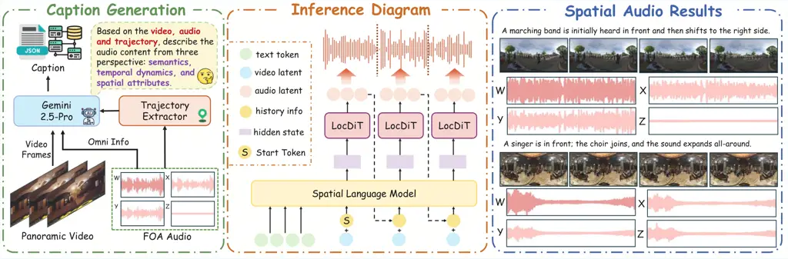
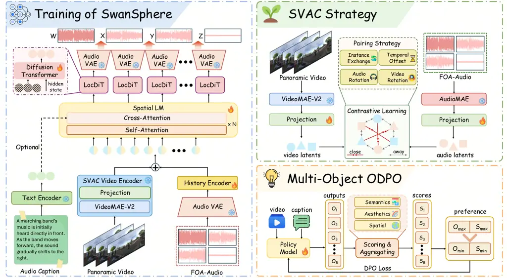
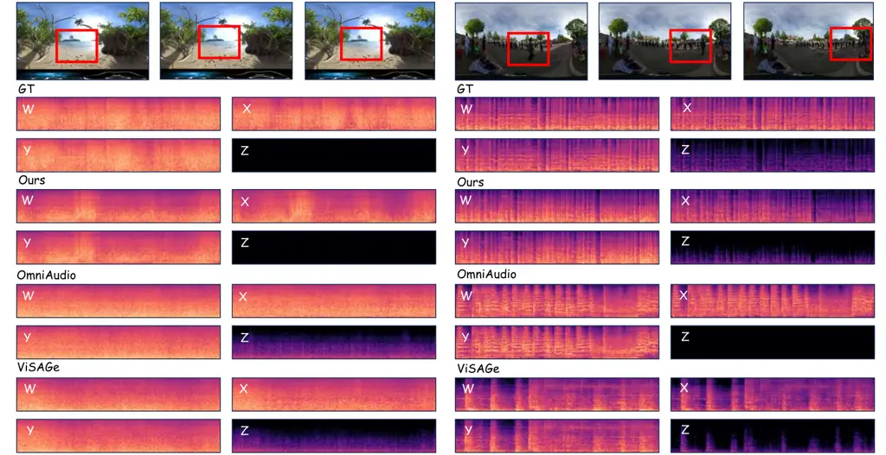

# Towards Streaming Synchronized Spatial Audio Generation via Autoregressive Diffusion Transformer

Ke Lei Affiliation: Zhejiang University, China    Yu Zhang
Affiliation: ByteDance, China    Changhao Pan Affiliation: Zhejiang
University, China    Xueyi Pu Affiliation: Zhejiang University, China   
Wenxiang Guo Affiliation: Zhejiang University, China    Ruiqi Li
Affiliation: ByteDance, China    Zhou Zhao Affiliation: Zhejiang
University, China Correspondence to: <zhaozhou@zju.edu.cn>

###### Abstract

Real-time and accurate spatial audio generation is pivotal for
delivering an immersive experience. However, existing spatial audio
synthesis technologies are often encumbered by a tradeoff between
generation quality and high inference latency, as well as difficulty in
capturing precise spatial information from multimodal inputs. To address
these challenges, we propose SwanSphere, a unified streaming framework
for high-fidelity spatial audio generation from panoramic videos and
text prompts. SwanSphere mainly makes the following contributions: 1) We
introduce a causal autoregressive diffusion transformer architecture
that enables streaming high-quality spatial audio generation. 2) We
design a Spatial Video–Audio Contrastive (SVAC) learning strategy to
align the video encoder with the acoustic domain, and further employ a
multi-objective online direct preference optimization (ODPO) scheme,
resulting in strong spatial perception and robust multimodal spatial
audio synthesis. 3) To alleviate the current scarcity of spatial audio
datasets, we also develop an automated annotation pipeline for
generating detailed spatial captions. Experimental results demonstrate
that SwanSphere achieves superior performance in both video-to-spatial
and text-to-spatial audio generation tasks. Demos can be found at:
[https://swanaigc.github.io/#swansphere](https://swanaigc.github.io/#swansphere).

###### Keywords: 

Spatial Audio Generation, Multimodal Learning, Streaming Generation

^(†)^(†)affiliationnotice: Equal contribution



Figure 1: Overview. Left: The pipeline of audio caption generation.
Middle: The streaming inference diagram of SwanSphere, which
simultaneously supports panoramic video and textual descriptions as
inputs. Right: Example results generated by SwanSphere. As shown above,
our model accurately captures the spatial audio variation as the
marching band moves from the front to the right side of the scene,
manifested by a gradual decrease in audio intensity along the X-axis
(front–back) and a gradual increase along the Y-axis (left–right). The
example below also faithfully reproduces the immersive and enveloping
sensation of a live musical performance in a concert hall.

## 1 Introduction

The rapid growth of Virtual Reality (VR), Augmented Reality (AR), and
metaverse applications has made the construction of highly immersive
audio-visual environments a central goal in multimedia research (OpenAI,
2025; Wan et al., 2025; DeepMind, 2025; Bosun, 2020). In omnidirectional
video experiences, auditory immersion depends not only on high-fidelity
sound reproduction but also on accurate spatial alignment between audio
and visual cues (Zhu et al., 2025). To address the challenge of spatial
alignment, recent work has moved beyond generating monaural audio from
videos and instead focuses on video-to-stereophonic audio generation.
However, jointly maintaining high quality and speed, while modeling the
spatial directionality of sound sources in the ambisonic domain, remains
challenging (Luo et al., 2023), making it difficult to meet the
stringent spatial-consistency requirements of panoramic content.

Motivated by this gap, recent studies (Kim et al., 2025) have begun to
generate First-Order Ambisonics (FOA) directly from panoramic videos,
leveraging Autoregressive (AR) or Diffusion Transformer (DiT)
architectures. Compared to earlier two-stage pipelines (Leng et al.,
2022), several approaches achieve high-quality single-stage spatial
audio generation while also improving inference efficiency (Liu et al.,
2025b). Despite their promising progress, current approaches still face
two key bottlenecks: 1) Tradeoff between reconstruction errors and
first-frame latency. Mainstream regression predictions based on discrete
codebooks introduce unavoidable reconstruction errors due to
quantization loss (Ji et al., 2024). While large-scale Diffusion
Transformer models are capable of generating high-quality audio (Wang
et al., 2025), their reliance on self-attention mechanisms across global
sequences and the requirement for multi-step denoising result in
prolonged computation times and significantly higher first-frame
latency. 2) Hard cross-modal spatial alignment. For most current
methods, the reliance on CLIP-based encoders (Radford et al., 2021; Xu
et al., 2021) results in a lack of intrinsic acoustic awareness, and
global pooling tends to filter out the spatial cues necessary for
accurate sound source localization (Wang et al., 2023). Taken together,
the quality–latency tradeoff and the weak audio-visual spatial alignment
substantially undermine the spatial coherence that is critical for truly
immersive FOA synthesis.

To address these challenges, we introduce SwanSphere, an autoregressive
diffusion framework with multimodal spatial awareness for streaming
synchronized spatial audio generation. To achieve high-fidelity
generation while ensuring low first-chunk latency, we introduce an
autoregressive diffusion transformer framework that decouples long-range
temporal modeling from local continuous rendering. In this paradigm, the
autoregressive language model captures global temporal and spatial
structures at the patch level, conditioned on input video tokens and
captions, whereas a localized DiT (LocDiT) employs intra-patch
bidirectional attention to perform denoising and synthesize
high-fidelity continuous spatial audio. To better leverage spatial
features in panoramic videos, we employ VideoMAE as the encoder to
capture visual-spatial information and propose Spatial Video-Audio
Contrastive Learning (SVAC) to enhance cross-modal spatial alignment. By
designing four distinct categories of physics-aware positive and
negative pairs, we align the video and audio encoders in a shared
semantic space. Additionally, we implement a multi-objective online
direct preference optimization (ODPO) scheme that aligns generated audio
with human preferences from aesthetic, semantic, and spatial
perspectives.

Furthermore, to enhance spatial perception at the data level, we devise
an MLLM-based, automated annotation pipeline to curate a spatial
caption-FOA dataset containing natural-language descriptions from
semantic, temporal, and spatial perspectives, enabling SwanSphere to
leverage both video and textual conditions. We also incorporate
curriculum learning by pre-training on large-scale monaural audio,
facilitating SwanSphere’s adaptation to general audio distributions and
achieving generalizable spatial audio generation.

As shown in Figure 1, our contributions are four-fold:

- •
  We introduce SwanSphere, a causal diffusion transformer architecture
  that enables streaming high-quality spatial audio generation with
  multimodal inputs.
- •
  By leveraging the SVAC strategy and multi-objective ODPO method,
  SwanSphere exhibits strong spatial perception capabilities from
  multimodal inputs, achieving alignment with human preferences across
  aesthetics, semantics, and spatial perception.
- •
  To address our task requirements, we propose an MLLM-based automated
  annotation scheme that supports data scaling and model generalization.
- •
  Comprehensive experiments and subjective-objective evaluations
  demonstrate that SwanSphere achieves strong performance across
  multiple dimensions, including audio generation quality and
  audio-visual alignment, while also exhibiting lower latency compared
  to baseline models.

## 2 Related Work

Video-to-Audio Generation Video-to-Audio (V2A) generation has recently
garnered significant attention, driven by advancements in multimodal
AIGC (Esser et al., 2024; Comanici et al., 2025; Siméoni et al., 2025).
While prevailing V2A methodologies predominantly employ latent diffusion
models (Rombach et al., 2022; Peebles & Xie, 2023), emerging research
has also investigated autoregressive token-based paradigms (Touvron
et al., 2023; Agostinelli et al., 2023). VTA-LDM (Xu et al., 2024)
functions as a standard latent diffusion model conditioned on video
features, and Diff-Foley (Luo et al., 2023) further integrates
contrastive audio-visual pretraining to enhance semantic consistency. In
the realm of AR generation, while SpecVQGAN (Iashin & Rahtu, 2021)
utilized mel-spectrogram codebooks, subsequent works like FoleyGen (Mei
et al., 2024) adopt a next-token prediction paradigm guided by visual
cues. V-AURA (Viertola et al., 2025) further uses a high-frame-rate
video feature extractor to align visual features with audio tokens
temporally and models audio-video co-occurrence through cross-modal
feature fusion, improving temporal synchronization and semantic
consistency. SoundReactor (Saito et al., 2025) extends this to a
frame-level online V2A scenario, achieving end-to-end causal modeling
with a causal decoder-only transformer combined with a diffusion head
for online, low-latency stereo audio generation. Despite the advantages
of autoregressive models in temporal alignment and online generation,
these methods primarily focus on non-spatial V2A tasks (mono/stereo
output) and do not explicitly model FOA spatial audio or spatial
direction in panoramic video. In contrast, our work extends this line to
streaming spatial audio generation from panoramic video, with additional
text conditioning. Recent advancements have adopted flow matching-based
generative paradigms (Lipman et al., 2022; Liu et al., 2022). Notably,
MMAudio (Cheng et al., 2025) employs a flow matching framework
conditioned on multimodal inputs, while Frieren (Wang et al., 2024)
applies rectified flow matching with one-step distillation to enhance
efficiency. To achieve superior semantic alignment, representative works
such as MovieGen-Audio (Polyak et al., 2024) have further advanced the
field by explicitly and jointly modeling audio, visual, and text
modalities (Tang et al., 2024; You et al., 2025; Liu et al., 2025a).
However, standard diffusion-based V2A models operate on global
sequences, introducing significant initial latency that degrades user
interactivity. Conversely, AR counterparts often lag behind in audio
fidelity and perceived aesthetics (Liu et al., 2024; Huang et al.,
2025). To bridge this, we propose an autoregressive diffusion
transformer framework that combines textual and visual cues to achieve
high-fidelity, aligned generation.

Multimodal Spatial Audio Generation The intrinsic spatial nature of
spatial audio necessitates explicit spatial guidance during
generation (Gao & Grauman, 2019). Conventional approaches typically
adopt a two-stage pipeline: synthesizing mono audio followed by
multimodal-guided spatialization (Morgado et al., 2018; Chen et al.,
2025; Xu et al., 2021; Garg et al., 2021). However, this cascaded
paradigm is heavily constrained by the quality of the initial audio
generation and is prone to amplifying temporal-spatial mismatches.
Recently, end-to-end methodologies have emerged, significantly improving
spatial consistency (Heydari et al., 2025). For instance, BEWO (Sun
et al., 2024) utilizes natural language and image inputs to synthesize
binaural audio, while ISDrama (Zhang et al., 2025b) extends this by
incorporating video signals and trajectory information for binaural
speech synthesis. Regarding video-guided approaches, OmniAudio (Liu
et al., 2025b) extracts acoustic field and semantic features from
panoramic videos, whereas ViSAGe (Kim et al., 2025) generates FOA by
integrating camera parameters with visual cues. Despite these
advancements, prior works predominantly leverage visual information at a
semantic level, overlooking the explicit spatial cues embedded within
videos. Therefore, we propose a systematic SVAC strategy, augmented by
Multi-Objective ODPO to further refine spatial alignment. This approach
offers a promising pathway towards more realistic spatial audio
generation. Recent work has also explored controllable and stereo-aware
audio generation and editing. StereoFoley (Karchkhadze et al., 2026)
presents an end-to-end V2A framework for generating semantically
aligned, temporally synchronized, and spatially accurate stereo audio,
and further introduces a synthetic object-aware stereo pipeline that
spatializes sound according to tracked object positions via dynamic
panning and distance-based loudness. SmartDJ (Lan et al., 2025)
investigates declarative stereo audio editing by combining an audio
language model with a latent diffusion editor, where high-level user
instructions are decomposed into atomic operations such as adding,
removing, adjusting loudness, and relocating sound events. These studies
highlight the growing importance of semantic and spatial controllability
in immersive audio generation and editing. However, they mainly focus on
stereo generation or editing, rather than FOA spatial audio generation
from panoramic video.

## 3 Method



Figure 2: Overview of the SwanSphere framework. The left side
illustrates the training pipeline based on the teacher forcing strategy,
which supports both video and textual modalities during training. The
upper-right section details our SVAC (Spatial Video‑Audio Contrastive
Learning) strategy for enhancing the Video Encoder’s alignment
capability. The lower-right section introduces the Multi‑Objective
Preference Alignment post‑training pipeline of SwanSphere.

### 3.1 Preliminaries: First-Order Ambisonics

First-Order Ambisonics (FOA) is a specialized format for spatial audio,
denoted as $`\mathbf{a}\in\mathbb{R}^{C\times L}`$, where $`C=4`$
represents the number of channels corresponding to the
$`W,X,Y,\text{ and }Z`$ components, and $`L`$ denotes the sampling
length. In this representation, $`W`$ carries the omnidirectional sound
pressure, while $`X,Y,\text{ and }Z`$ encode the directional velocity
components along the three orthogonal axes. Our objective is to generate
spatial audio $`\mathbf{a}`$ precisely aligned with the condition, such
as visual signals or textual captions.

To map high-dimensional FOA audio into a low-dimensional latent space
suitable for generative modeling, we fine-tune the established Stable
Audio VAE architecture to simultaneously encode the four-channel FOA
signals. Given an input signal $`\mathbf{a}`$, the encoder
$`\mathcal{E}`$ maps it into a continuous latent space:
$`\mathbf{z}=\mathcal{E}(\mathbf{a})`$, where
$`\mathbf{z}\in\mathbb{R}^{d\times l}`$ represents the downsampled
latent representation. Unlike discrete encoding methods based on
codebooks (e.g., DAC), we utilize continuous latent variables for
modeling. This approach effectively avoids the loss of phase information
and reconstruction errors inherent in the quantization process. In this
work, the audio is encoded at a frame rate of 21.5 FPS, with a latent
dimension of $`d=128`$ per frame. For detailed information regarding the
VAE architecture and the specific training procedures, please refer to
Appendix B.1.

### 3.2 Spatial Video-Audio Contrastive Learning

Unlike traditional video-to-audio tasks, spatial audio generation
requires not only semantic correspondence and temporal synchronization
but also strict spatial consistency with the $`360^{\circ}`$ visual
content. Thus, we design a spatial audio-visual contrastive learning
(SVAC) framework to address this challenge of panoramic-to-spatial audio
generation.

For a panoramic video $`v`$ and FOA audio $`a`$, we employ a video
encoder to model the input as $`\mathbb{R}^{T_{v}\times C}`$ and an
audio encoder to yield $`\mathbb{R}^{T_{a}\times C}`$. Unlike prior
methods that employ CLIP-based encoders for frame-wise video encoding
and thus neglect geometric details, VideoMAE (Wang et al., 2023)
effectively retains the video’s spatial structure and temporal
continuity. Since the video feature sequence has a lower temporal
resolution than the audio latent sequence, we align them by
nearest-neighbor replication. Specifically, each audio timestep is
assigned the feature of its nearest video frame, expanding the video
sequence from $`T_{v}`$ to $`T_{a}`$ without interpolating visual
features. Through audio-visual contrastive learning, we inject acoustic
cues from AudioMAE (Huang et al., 2022) into the visual encoder,
enabling the extracted features to focus attentively on regions with
acoustic potential.

We design four complementary contrastive learning objectives to
constrain audio-visual representations across semantic, temporal, and
spatial information. (1) Instance exchange: at the semantic level,
paired audio-visual segments constitute positive pairs, while other
samples within the batch serve as negatives. (2) Temporal offset: to
ensure accurate temporal synchronization between audio and video, we
introduce temporally shifted negatives within the same video.
Specifically, we apply a random circular shift to the corresponding
audio to generate negative samples; this induces temporal misalignment
of events, facilitating the model in learning the synchronization
relationship between audio and visual onsets. (3) Audio rotation: given
the spatial nature of FOA, we construct corresponding spatial negative
samples to enhance the encoder’s spatial understanding. We apply 3D
rotation to the audio of the same segment to obtain spatially altered
audio (with changed directional information) as negative samples. (4)
Video rotation: for the panoramic video, we apply horizontal rotation as
negative samples to reinforce the video encoder’s ability to encode the
geometric structure and orientation consistency of the panoramic
content.

```math
\mathcal{L}_{total}=\frac{1}{2N}\sum_{i=1}^{N}\left(\mathcal{L}_{NCE}(v_{i},a_{i},\mathcal{N}_{i}^{a})+\mathcal{L}_{NCE}(a_{i},v_{i},\mathcal{N}_{i}^{v})\right) \tag{1}
```

To formalize these constraints within a unified framework, we minimize
the symmetric InfoNCE loss. Formally, for a batch of $`N`$ audio-visual
pairs $`\{(v_{i},a_{i})\}_{i=1}^{N}`$, the total contrastive objective
is defined in Eq. 1, where the unified contrastive loss
$`\mathcal{L}_{NCE}`$ for a query $`q`$, a positive key $`k^{+}`$, and a
set of negatives $`\mathcal{M}`$ is:

```math
\begin{split}&\mathcal{L}_{NCE}(q,k^{+},\mathcal{M})=\\
&-\log\frac{\exp(\text{s}(q,k^{+})/\tau)}{\exp(\text{s}(q,k^{+})/\tau)+\sum_{m\in\mathcal{M}}\exp(\text{s}(q,m)/\tau)}.\end{split} \tag{2}
```

Here, $`\text{s}(\cdot)`$ denotes the temporally aligned cosine
similarity, and $`\tau`$ is the temperature parameter. Crucially, to
enforce the four aforementioned objectives, we construct specific
negative sets $`\mathcal{N}_{i}^{a}`$ (candidate audios for video
$`v_{i}`$) and $`\mathcal{N}_{i}^{v}`$ (candidate videos for audio
$`a_{i}`$) that include both batch-wise semantic negatives and spatial
negatives:

```math
\displaystyle\mathcal{N}_{i}^{a} \displaystyle=\underbrace{\{a_{j}\}_{j\neq i}}_{\text{Semantic}}\cup\underbrace{\{\tilde{a}_{i}^{time}\}}_{\text{Temporal}}\cup\underbrace{\{\tilde{a}_{i}^{spat}\}}_{\text{Spatial (Audio)}}, \tag{3}
```

```math
\displaystyle\mathcal{N}_{i}^{v} \displaystyle=\underbrace{\{v_{j}\}_{j\neq i}}_{\text{Semantic}}\cup\underbrace{\{\tilde{v}_{i}^{spat}\}}_{\text{Spatial (Video)}},
```

where $`\tilde{a}_{i}^{time}`$ represents the temporally shifted audio,
$`\tilde{a}_{i}^{spat}`$ denotes the spatially rotated FOA, and
$`\tilde{v}_{i}^{spat}`$ is the horizontally rotated panoramic video. By
discriminating the positive pair against this diverse set of hard
negatives simultaneously, the video and audio encoders are compelled to
learn robust representations aligned across semantic, temporal, and
spatial dimensions.

### 3.3 Autoregressive Diffusion Modeling for Spatial Audio

To address the high inference latency of iterative global diffusion
models and the difficulty of balancing global semantic coherence with
local high-frequency details, we introduce Diffusion Transformer
Autoregressive modeling for spatial audio generation (SwanSphere).
Adopting a divide-and-conquer paradigm, our framework decomposes the
synthesis into two stages: a semantic planning stage that produces a
semantic condition $`h_{t}`$ for the current patch, and a subsequent
local generation stage that synthesizes high-fidelity spatial audio
conditioned on $`h_{t}`$.

The first stage is driven by a causal language model responsible for
modeling inter-patch contextual dependencies. In the case of panoramic
video input, at each time step $`t`$, the input to the model comprises
the physically-aware video feature $`C_{v}`$, which is extracted via a
contrastive learning module alongside the historical spatial audio
information. These features, $`C_{v}`$, encapsulate both the semantic
content and sound source directionality within the panoramic scene,
serving as conditional guidance for the generation process.
Subsequently, the LM generates a semantic embedding $`h_{t}`$ for the
current time step, encoding high-dimensional semantic information to
direct the subsequent generation of spatial audio latents. To ensure
synchronization between the generated audio length and the video
content, we utilize the termination of the video feature sequence as the
stop condition, rather than relying on the model to predict a stop
token. For caption inputs containing spatial information, we first
extract semantic embeddings using a pre-trained FLAN-T5 (Chung et al., 2024) encoder. These embeddings are then injected into the LM via
cross-attention, ensuring that the generated semantic embedding
$`h_{t}`$ incorporates both the semantics and the spatial cues from the
caption. To enable the model to handle different modality combinations
within a unified architecture, learnable null embeddings are employed to
substitute for missing modalities. Specifically, the text branch is
filled with a null embedding when only video input is provided;
conversely, the video features are replaced by a null embedding when
only text input is available.

The second stage of generation is handled by a Local Diffusion
Transformer (LocDiT), which is responsible for high-fidelity intra-patch
generation. Conditioned on the LM output $`h_{t}`$, LocDiT utilizes a
flow matching objective to learn the reconstruction of spatial audio
latents from Gaussian noise. The history encoder summarizes the
previously generated patch into a compact history representation. At
step $`t`$, this representation is added to the aligned video tokens and
then fed into the Spatial LM, enabling the LM to predict the current
semantic condition with access to previous acoustic context. LocDiT
receives the two preceding patches as boundary context to improve local
continuity. To enhance LocDiT’s capability in modeling audio latents, we
also employ a curriculum learning strategy. Specifically, we convert
non-spatial audio into a 4-channel format to pre-train LocDiT, equipping
it with fundamental audio generation capabilities before proceeding to
spatial audio training.

### 3.4 Multi-objective Online DPO

To further calibrate the generative distribution and align it more
closely with the real world in terms of spatial physical laws, semantic
consistency, and acoustic fidelity, we introduce a multi-objective
online Direct Preference Optimization (ODPO) fine-tuning stage.
Specifically, for each video or text input, the model first generates 8
candidate audio samples in parallel. These samples are then ranked via a
comprehensive weighted reward function to construct preference pairs
$`(y_{w},y_{l})`$. This reward function is composed of three orthogonal
evaluation dimensions: First, to strictly constrain the physical
accuracy of sound source localization, we utilize the errors in azimuth,
elevation, and spatial angle between the generated spatial audio and the
ground truth as spatial feedback. Second, leveraging the powerful
cross-modal representation capabilities of ImageBind, we calculate the
similarity between audio and video/text embeddings to ensure precise
alignment of semantic content. Finally, addressing the phase distortion
and mechanical artifacts commonly produced by generative models, we
utilize the Audiobox Aesthetics to calculate the distance between
generated audio and real reference audio in the perceptual feature
space. All scores are normalized to $`[0,1]`$. The total reward score is
defined as the weighted sum of these three sub-objectives:

```math
R=\lambda_{\text{spatial}}\cdot R_{\text{spatial}}+\lambda_{\text{semantic}}\cdot R_{\text{semantic}}+\lambda_{\text{fidelity}}\cdot R_{\text{fidelity}}, \tag{4}
```

where $`\lambda_{\text{spatial}}`$ and $`\lambda_{\text{semantic}}`$ are
set to 0.4, and $`\lambda_{\text{fidelity}}`$ is set to 0.2. Through
iterative ODPO, the model significantly eliminates neural artifacts
without sacrificing generation diversity, thereby enhancing the
immersion and realism of the panoramic audiovisual experience. Although
the scalar reward can in principle be optimized by online RL methods
such as GRPO, our sampling-and-ranking pipeline naturally yields
preference pairs. We therefore adopt ODPO for stable and lightweight
post-training.

### 3.5 SwanSphere Dataset Construction

To address the scarcity of high‑quality spatial audio paired with
aligned panoramic video and to incorporate multimodal guidance for
spatial audio generation, we curate the SwanSphere corpus through an
automated data collection and annotation pipeline, enabling effective
data scaling. Furthermore, we design an auxiliary scheme that utilizes
non‑FOA‑format audio to support the curriculum learning strategy during
model training.

Data Aggregation and Preprocessing. We aggregate raw audio from diverse
open‑source datasets (Liu et al., 2025b; Kim et al., 2025) and extensive
web crawling to ensure comprehensive coverage, encompassing diverse
physical environments (indoor and outdoor) and a wide variety of audio
content, including animal sounds, natural sounds, and music. We then
filter out samples with audio‑visual mismatches and silent audio, and
segment the data into 10‑second clips. Finally, we create the SwanSphere
dataset with a total of 165,000 video-audio pairs, approximately 458
hours. The test set comprises 5% of the samples, ensuring no overlapping
video IDs with the training set.

Automated spatial captioning pipeline. To enhance spatial and temporal
awareness, we design an automated annotation pipeline customized for
panoramic audio‑visual data. Since current Multimodal Large Language
Models (MLLMs) lack the inherent capability to interpret spatial audio,
directly processing First‑Order Ambisonics (FOA) yields only semantic
content while failing to capture accurate spatial information. To
address this, we first perform sound‑field analysis based on acoustic
intensity vectors to estimate the azimuth, elevation, and relative
distance of sound sources for each temporal segment. Temporal smoothing
is then applied to obtain continuous and stable spatial trajectories.
Building on this, we feed these structured spatial trajectories,
together with the panoramic video and audio, into Gemini 2.5 Pro. This
process generates temporally aligned spatial audio captions that
preserve physical spatial consistency. In total, we produce
approximately 3,100 valid captioned samples, 300 of which are reserved
for evaluation.

Data for curriculum learning. To enhance the generalization of
SwanSphere, we construct a pre‑training dataset that incorporates
non‑spatial audio from AudioCaps, VGGSound, WavText5k, and AudioSet,
comprising approximately 1M samples. To leverage non‑spatial audio
within our spatial generation framework, we adapt these signals into a
pseudo‑FOA format. Specifically, the omnidirectional channel $`W`$ is
initialized as the sum of the original stereo channels. For the
directional channels $`X`$, $`Y`$, and $`Z`$, we randomly select one
channel to store the difference between the two original audio channels,
while the remaining two channels are set to zero.

## 4 Experiments

| Model         | Params | Inf. Time $`\downarrow`$ | FD$`\downarrow`$ | KL$`\downarrow`$ | $`\Delta_{abs}\theta`$ $`\downarrow`$ | $`\Delta_{abs}\phi`$ $`\downarrow`$ | $`\Delta_{angular}`$ $`\downarrow`$ | MOS-SQ $`\uparrow`$ | MOS-AF $`\uparrow`$ |
| ------------- | ------ | ------------------------ | ---------------- | ---------------- | ------------------------------------- | ----------------------------------- | ----------------------------------- | ------------------- | ------------------- |
| Ground Truth  | \-     | \-                       | \-               | \-               | \-                                    | \-                                  | \-                                  | $`4.60\pm 0.15`$    | $`4.58\pm 0.21`$    |
| MMAudio+AS    | 1.03B  | 2.76s                    | 261.65           | 2.43             | \-                                    | \-                                  | \-                                  | $`3.91\pm 0.18`$    | $`3.60\pm 0.23`$    |
| Diff-Foley+AS | 0.94B  | 2.03s                    | 304.03           | 3.12             | \-                                    | \-                                  | \-                                  | $`3.68\pm 0.14`$    | $`3.26\pm 0.17`$    |
| ViSAGe        | 0.36B  | 20.19s                   | 232.17           | 2.67             | 1.57                                  | 0.63                                | 1.59                                | $`3.82\pm 0.20`$    | $`3.78\pm 0.26`$    |
| OmniAudio     | 1.22B  | 0.85s                    | 157.67           | 1.93             | 1.25                                  | 0.47                                | 1.27                                | $`4.12\pm 0.18`$    | $`4.27\pm 0.17`$    |
| Ours          | 1.09B  | 0.21s/9.13s              | 120.28           | 1.36             | 1.14                                  | 0.4                                 | 1.03                                | 4.32 $`\pm`$ 0.15   | 4.44 $`\pm`$ 0.20   |

Table 1: Quantitative comparison between SwanSphere and baselines. We
evaluate performance across three distinct dimensions: (1) semantic
quality; (2) spatial precision; and (3) efficiency. “+AS” denotes
cascaded baselines utilizing an external audio spatialization. Note that
for SwanSphere, inference time is reported as time-to-first-chunk /
total duration.

| Model           | Params | Inf. Time $`\downarrow`$ | FD$`\downarrow`$ | KL$`\downarrow`$ | MOS-SQ $`\uparrow`$ | MOS-AF $`\uparrow`$ |
| --------------- | ------ | ------------------------ | ---------------- | ---------------- | ------------------- | ------------------- |
| Ground Truth    | \-     | \-                       | \-               | \-               | $`4.65\pm 0.17`$    | $`4.76\pm 0.15`$    |
| MMAudio+AS      | 1.03B  | 2.76s                    | 313.26           | 2.77             | $`3.75\pm 0.21`$    | $`3.44\pm 0.24`$    |
| AudioLDM-2+AS   | 0.71B  | 7.64s                    | 294.17           | 2.45             | $`3.86\pm 0.20`$    | $`3.53\pm 0.17`$    |
| Tango2+AS       | 0.86B  | 2.12s                    | 235.71           | 2.42             | $`3.95\pm 0.16`$    | $`3.27\pm 0.21`$    |
| OmniAudio(text) | 1.22B  | 0.89s                    | 174.13           | 1.83             | $`4.11\pm 0.15`$    | $`4.16\pm 0.18`$    |
| Ours            | 1.09B  | 0.21s/9.13s              | 142.80           | 1.43             | 4.31 $`\pm`$ 0.18   | 4.43 $`\pm`$ 0.22   |

Table 2: Quantitative evaluation of generalization capabilities on
text-to-spatial audio generation.

### 4.1 Experimental Setup

Evaluation metrics To evaluate our method, we employ a dual-evaluation
strategy comprising both objective measurements and subjective human
studies, focusing on spatial audio fidelity and cross-modal alignment.
For objective evaluation, we assess the generated audio using two
categories of metrics: (1) non-spatial quality: We quantify the acoustic
fidelity by calculating the Fréchet Distance (FD) between the feature
distributions of the generated and reference audio, utilizing embeddings
from the OpenL3 model. Furthermore, to evaluate semantic consistency, we
compute the Kullback-Leibler (KL) Divergence over the label
distributions predicted by a PaSST classifier pre-trained on AudioSet.
(2) spatial accuracy: Following the protocols established in prior work,
we evaluate the precision of sound source localization using Direction
of Arrival metrics. Specifically, we report the mean absolute error for
elevation ($`\Delta\theta_{\text{abs}}`$) and azimuth
($`\Delta\phi_{\text{abs}}`$), along with the aggregate angular error
($`\Delta\text{Angular}`$), to measure the deviation between the
generated and ground-truth sound fields. To further avoid coupling the
spatial reward with the evaluation protocol, we additionally adopt a
pretrained SELD model, PSELDNets(Hu et al., 2025), as an independent
spatial evaluator. For each segment and event class, PSELDNets predicts
a 3D activity vector whose direction represents DoA and magnitude
represents confidence. We compute the cosine similarity between
generated and reference vectors and aggregate the class-wise scores
weighted by their magnitudes, yielding wCS. We also include MOS-SQ
(spatial audio quality) and MOS-AF (video/text-audio alignment
faithfulness) for subjective evaluation.

Baselines To comprehensively evaluate our proposed method, we
constructed the following baselines for comparison. For the task of
generating First-Order Ambisonics (FOA) audio from panoramic video, we
compare against the following methods: (1) MMAudio (Cheng et al., 2025) + audio spatialization. (2) Diff-Foley (Luo et al., 2023) + Audio
Spatialization. (3) ViSAGe (Kim et al., 2025): we re-train it on our
dataset using Field-of-View (FoV) video and energy maps as inputs. (4)
OmniAudio (Liu et al., 2025b): As it utilizes a dual-branch
architecture, we retain its original structure and re-train it on our
dataset for a fair comparison. For the task of generating spatial audio
from text captions, we established the following baselines: (1)
MMAudio + audio spatialization. (2) Tango2 (Majumder et al., 2024) +
audio spatialization. (3) OmniAudio(text): We adapted the OmniAudio
architecture for text-conditional generation by incorporating caption
inputs while replacing the visual inputs with learnable null tokens. We
use a signal-based spatialization strategy based on the ground-truth
audio’s angles, following Ambisonics (Zotter & Frank, 2019).



Figure 3: Qualitative Comparison. The left column depicts sea waves
positioned directly in front; our model generates distinct and rhythmic
wave sounds. In the right column, featuring a marching band moving from
the front toward the right side, the signal intensity of the X channel
gradually decreases while the intensity of the Y channel increases
accordingly.

### 4.2 Main Results

As shown in Table 1, the quantitative comparison results on our hybrid
test set show that SwanSphere outperforms existing cascaded and
end-to-end baselines across almost all objective metrics. In terms of
semantic consistency, SwanSphere achieves an FD of 120.28 and a KL
divergence of 1.36. This represents an improvement over the previous
state-of-the-art OmniAudio (FD: 157.67, KL: 1.93), indicating that our
generated audio aligns more closely with the real-world distribution in
both perceptual quality and semantic content. Regarding spatial
accuracy, benefiting from the optimization in the ODPO stage, our model
reduces the total angular error to 1.03, which is superior to OmniAudio
(1.27) and ViSAGe (1.59), demonstrating more precise sound source
localization capabilities. Furthermore, while maintaining a parameter
count (1.09B) comparable to OmniAudio, SwanSphere achieves a first-chunk
generation latency of just 0.21 seconds thanks to its streaming
architecture. This demonstrates superior responsiveness for real-time
interactive applications compared to the autoregressive generation of
ViSAGe (20.19 seconds) and the full-sequence generation of OmniAudio. We
use a patch size of 4 latent frames, temporal stride of 4, and a causal
context window of 2 patches (8 latent frames). LocDiT uses 20 diffusion
steps per patch. The first-chunk latency consists of 0.03s for the
spatial LM, 0.14s for LocDiT denoising, and 0.04s for video encoding and
audio decoding, totaling 0.21s. Larger patch sizes or longer causal
context windows increase latency, highlighting the tradeoff between
historical context and responsiveness. The MOS-SQ and MOS-AF metrics
further demonstrate that our model achieves superior sound quality and
spatial alignment in video-to-FOA generation compared to the baselines.

Beyond video-conditioned generation, we further evaluated the model’s
capability in the text-to-spatial audio task on our spatial audio
caption test set. As shown in Table 2, we benchmarked SwanSphere against
leading T2A cascaded systems (e.g., AudioLDM-2-L+AS, Tango2+AS) and
OmniAudio (text), a variant adapted and retrained on our text-to-spatial
audio dataset. The results demonstrate that SwanSphere achieves superior
performance in both semantic consistency and audio quality. Compared to
the best-performing cascaded baseline Tango2+AS, our end-to-end approach
exhibits a substantial lead, validating the effectiveness of unified
spatial modeling. Crucially, SwanSphere outperforms the retrained
OmniAudio, reducing the FD from 174.13 to 142.8 and the KL divergence
from 1.83 to 1.43. These metrics indicate that our model possesses a
more precise understanding of textual prompts, enabling it to generate
spatial audio with higher fidelity and better alignment with real-world
distributions. The two human subjective evaluation metrics further
corroborate the superior sound quality of our FOA audio and its robust
alignment with the provided captions. We further evaluate joint
video+caption conditioning on the caption test subset. Compared with
video-only conditioning, adding captions improves FD from 120.28 to
118.31 and reduces the angular error from 1.03 to 0.96, while
maintaining comparable KL divergence. This suggests that captions
provide explicit spatial cues complementary to panoramic video. More
experimental results are shown in the appendix.

| Model    | FD $`\downarrow`$ | KL $`\downarrow`$ | $`\Delta_{\text{abs}}\theta\downarrow`$ | $`\Delta_{\text{abs}}\phi\downarrow`$ | $`\Delta_{\text{angular}}\downarrow`$ |
| -------- | ----------------- | ----------------- | --------------------------------------- | ------------------------------------- | ------------------------------------- |
| Ours     | 120.28            | 1.36              | 1.14                                    | 0.40                                  | 1.03                                  |
| sem-only | 127.12            | 1.41              | 1.26                                    | 0.49                                  | 1.12                                  |
| CLIP     | 140.28            | 1.44              | 1.31                                    | 0.55                                  | 1.34                                  |

Table 3: Ablation of spatial video-audio contrastive learning.

| Model                 | Params | Inf. Time $`\downarrow`$ | FD $`\downarrow`$ | KL $`\downarrow`$ | $`\Delta_{abs}\theta`$ $`\downarrow`$ | $`\Delta_{abs}\phi`$ $`\downarrow`$ | $`\Delta_{angular}`$ $`\downarrow`$ |
| --------------------- | ------ | ------------------------ | ----------------- | ----------------- | ------------------------------------- | ----------------------------------- | ----------------------------------- |
| SwanSphere-L          | 1.09B  | 0.21s/9.13s              | 120.28            | 1.36              | 1.14                                  | 0.40                                | 1.03                                |
| SwanSphere-M          | 0.62B  | 0.17s/7.60s              | 132.52            | 1.43              | 1.28                                  | 0.46                                | 1.16                                |
| SwanSphere-S          | 0.43B  | 0.13s/6.10s              | 139.81            | 1.58              | 1.45                                  | 0.53                                | 1.33                                |
| SwanSphere-L w/o ODPO | 1.09B  | 0.21s/9.13s              | 133.91            | 1.44              | 1.21                                  | 0.43                                | 1.22                                |
| DiT                   | 1.11B  | 6.47s                    | 123.08            | 1.36              | 0.91                                  | 0.46                                | 1.14                                |

Table 4: Ablation studies on SwanSphere regarding model capacity, ODPO
fine-tuning, and generation paradigms.

### 4.3 Ablation study

Ablation on SVAC. To validate the design rationale of our video feature
extractor, we conducted an ablation study on the spatial video-audio
contrastive learning (SVAC) strategy (as shown in Table 3). First, we
established a baseline model that directly utilizes frame-level features
from a pre-trained CLIP encoder as conditional input, consistent with
prior research like ViSAGe (Kim et al., 2025) and OmniAudio (Liu et al.,
2025b). This configuration yielded the poorest performance (FD of
140.28, Angular Error of 1.34), indicating that generic visual encoders
lack the sufficient domain adaptation capability required for
fine-grained spatial audio generation tasks. Second, we evaluated the
contribution of our proposed spatial-temporal negative sampling
strategy. The semantic-only variant retains only semantic negative
samples (i.e., mismatched audio-visual clips in a batch) while
eliminating negative samples constructed based on physical laws, namely,
temporal offsets and spatial rotations of FOA and panoramic videos.
Compared to the full model, the exclusion of these physical negatives
resulted in a marked degradation in spatial metrics (angular error
increased from 1.03 to 1.12). These results compellingly demonstrate
that incorporating negative samples grounded in physical laws (e.g.,
rotation invariance and temporal synchronization) forces the model to
learn feature representations that are orientation-sensitive and
temporally aligned, rather than merely capturing global semantic
correspondences. Ultimately, the SVAC learning module significantly
enhances both the spatial accuracy and auditory fidelity of the
generated results. We also conduct ablation on history conditioning to
verify its contribution. Specifically, we set the input to the history
encoder to zero, thereby removing the history condition. The results
show that FD increases from 120.28 to 128.15, and KL increases from 1.31
to 1.42; the spatial metrics also exhibit a slight degradation. These
results indicate that removing historical information has an adverse
effect on generation quality.

Ablation on SwanSphere To evaluate the impact of model capacity,
generation paradigms, and the ODPO fine-tuning stage, we conducted
corresponding ablation studies, with results summarized in Table 4. We
investigated the necessity of sufficient model capacity by comparing the
default SwanSphere-L (1.09B) against smaller variants: SwanSphere-M
(0.62B) and SwanSphere-S (0.43B). As shown in the table, reducing model
size leads to consistent performance degradation. Specifically, the
small variant exhibits a marked decline in both semantic consistency and
spatial accuracy. This indicates that the larger parameter space of
SwanSphere-L is indispensable for capturing the complex correlations
between panoramic vision and spatial audio, thereby validating the
rationale for adopting the large architecture as our default
configuration. We compared SwanSphere-L with a DiT (1.11B) version of
comparable parameter size. Given that the DiT requires generating the
full sequence simultaneously, it incurs an inference latency of 6.47s
under 100 inference steps. In contrast, our streaming architecture
achieves a Time-to-First-Chunk latency of only 0.21s, obtains better FD
and aggregate angular error, and delivers an approximate 30$`\times`$
speedup in initial response. The ablation of the ODPO stage highlights
its critical function. ODPO fine-tuning yields substantial performance
gains, reducing FD from 133.91 to 120.28 and optimizing the angular
error from 1.22 to 1.03. This demonstrates that ODPO successfully aligns
generation with multi-objective constraints and improves the overall
spatial-error profile without changing the streaming advantage of
SwanSphere.

## 5 Conclusion

In this work, we present SwanSphere, a multimodal streaming framework
for high‑fidelity spatial audio generation from panoramic videos and
text prompts. SwanSphere decouples semantic planning from local acoustic
rendering via a divide‑and‑conquer strategy, enabling both high‑quality
detail reconstruction and low‑latency streaming inference. To enhance
spatial representation, we introduce Spatial Video‑Audio Contrastive
Learning and multi‑objective ODPO fine‑tuning, which improve orientation
awareness and eliminate neural artifacts. Extensive experiments show
that SwanSphere achieves state‑of‑the‑art performance on
video‑to‑spatial-audio and text‑to‑spatial-audio benchmarks,
outperforming existing cascaded and unified models in semantic fidelity,
spatial precision, and inference efficiency. This work advances spatial
audio generation in fidelity and alignment. Moreover, its streaming
architecture enables highly immersive real-time interactive environments
for next-generation applications. While SwanSphere achieves
state-of-the-art performance in streaming FOA spatial audio generation,
it has limitations that should be acknowledged. The spatial captions
primarily describe dominant sound sources, and complex multi-source
scenarios (e.g., concerts with multiple simultaneous instruments) are
not fully modeled, limiting fine-grained spatial disentanglement. Future
work includes extending the dataset for multi-source scenes, as well as
investigating robust generalization to unseen recording setups and
environments.

## Impact Statement

This paper introduces a framework capable of synthesizing high-fidelity
First-Order Ambisonics (FOA) that are spatially aligned with panoramic
video content. While this technology holds significant promise for
enhancing immersion in VR/AR, the metaverse, and multimedia content
creation, it also introduces risks regarding the generation of
hyper-realistic spatial deepfakes. The ability to generate spatially
consistent audio-visual environments could be misused to create
deceptive misinformation that is difficult to distinguish from
real-world recordings. To mitigate potential misuse, we advocate for the
incorporation of watermarking in the generated spatial audio and
strictly restrict the open-source license to non-commercial research
use. Furthermore, the spatial caption-FOA dataset constructed in this
work has been rigorously screened to exclude personally identifiable
information and harmful content.

## Acknowledgements

This work was supported by National Natural Science Foundation of China
under Grant No.U25B2064

## References

- Agostinelli et al. (2023) Agostinelli, A., Denk, T. I., Borsos, Z.,
  Engel, J., Verzetti, M., Caillon, A., Huang, Q., Jansen, A., Roberts,
  A., Tagliasacchi, M., et al. Musiclm: Generating music from text.
  _arXiv preprint arXiv:2301.11325_, 2023.
- Bosun (2020) Bosun, X. Spatial sound—history, principle, progress and
  challenge. _Chinese Journal of Electronics_, 29(3):397–416, 2020. doi:
  10.1049/cje.2020.02.016. URL
  [https://cje.ejournal.org.cn/en/article/doi/10.1049/cje.2020.02.016](https://cje.ejournal.org.cn/en/article/doi/10.1049/cje.2020.02.016).
- Chen et al. (2025) Chen, Y., Shimada, K., Simon, C., Ikemiya, Y.,
  Shibuya, T., and Mitsufuji, Y. Ccstereo: Audio-visual contextual and
  contrastive learning for binaural audio generation. In _Proceedings of
  the 33rd ACM International Conference on Multimedia_, pp.
  7510–7518, 2025.
- Cheng et al. (2025) Cheng, H. K., Ishii, M., Hayakawa, A., Shibuya,
  T., Schwing, A., and Mitsufuji, Y. Mmaudio: Taming multimodal joint
  training for high-quality video-to-audio synthesis. In _Proceedings of
  the Computer Vision and Pattern Recognition Conference_, pp.
  28901–28911, 2025.
- Chung et al. (2024) Chung, H. W., Hou, L., Longpre, S., Zoph, B., Tay,
  Y., Fedus, W., Li, Y., Wang, X., Dehghani, M., Brahma, S., et al.
  Scaling instruction-finetuned language models. _Journal of Machine
  Learning Research_, 25(70):1–53, 2024.
- Comanici et al. (2025) Comanici, G., Bieber, E., Schaekermann, M.,
  Pasupat, I., Sachdeva, N., Dhillon, I., Blistein, M., Ram, O., Zhang,
  D., Rosen, E., et al. Gemini 2.5: Pushing the frontier with advanced
  reasoning, multimodality, long context, and next generation agentic
  capabilities. _arXiv preprint arXiv:2507.06261_, 2025.
- DeepMind (2025) DeepMind, G. Veo 3, 2025. URL
  [https://deepmind.google/technologies/veo](https://deepmind.google/technologies/veo).
- Esser et al. (2024) Esser, P., Kulal, S., Blattmann, A., Entezari, R.,
  Müller, J., Saini, H., Levi, Y., Lorenz, D., Sauer, A., Boesel, F.,
  et al. Scaling rectified flow transformers for high-resolution image
  synthesis. In _Forty-first international conference on machine
  learning_, 2024.
- Evans et al. (2025) Evans, Z., Parker, J. D., Carr, C., Zukowski, Z.,
  Taylor, J., and Pons, J. Stable audio open. In _ICASSP 2025-2025 IEEE
  International Conference on Acoustics, Speech and Signal Processing
  (ICASSP)_, pp. 1–5. IEEE, 2025.
- Gao & Grauman (2019) Gao, R. and Grauman, K. 2.5 d visual sound. In
  _Proceedings of the IEEE/CVF Conference on Computer Vision and Pattern
  Recognition_, pp. 324–333, 2019.
- Garg et al. (2021) Garg, R., Gao, R., and Grauman, K. Geometry-aware
  multi-task learning for binaural audio generation from video. _arXiv
  preprint arXiv:2111.10882_, 2021.
- Guo et al. (2025a) Guo, W., Pan, C., Zhu, Z., Hu, X., Zhang, Y., Tang,
  L., Yang, R., Wang, H., Zhang, Z., Wang, Y., Chen, Y., Xu, H., Xu, K.,
  Fan, P., Chen, Z., Yu, Y., Huang, Q., Wu, F., and Zhao, Z. Mrsaudio: A
  large-scale multimodal recorded spatial audio dataset with refined
  annotations. _arXiv preprint arXiv:2510.10396_, 2025a.
- Guo et al. (2025b) Guo, W., Zhang, Y., Pan, C., Huang, R., Tang, L.,
  Li, R., Hong, Z., Wang, Y., and Zhao, Z. TechSinger: Technique
  controllable multilingual singing voice synthesis via flow matching.
  In _Proceedings of the AAAI Conference on Artificial Intelligence_,
  volume 39, pp. 23978–23986, 2025b. doi: 10.1609/aaai.v39i22.34571.
- Guo et al. (2025c) Guo, W., Zhang, Y., Pan, C., Zhu, Z., Li, R., Chen,
  Z., Xu, W., Wu, F., and Zhao, Z. STARS: A unified framework for
  singing transcription, alignment, and refined style annotation. In
  _Findings of the Association for Computational Linguistics: ACL 2025_,
  pp. 15081–15093, Vienna, Austria, 2025c. Association for Computational
  Linguistics. doi: 10.18653/v1/2025.findings-acl.781. URL
  [https://aclanthology.org/2025.findings-acl.781/](https://aclanthology.org/2025.findings-acl.781/).
- Heydari et al. (2025) Heydari, M., Souden, M., Conejo, B., and
  Atkins, J. Immersediffusion: A generative spatial audio latent
  diffusion model. In _ICASSP 2025-2025 IEEE International Conference on
  Acoustics, Speech and Signal Processing (ICASSP)_, pp. 1–5.
  IEEE, 2025.
- Hu et al. (2025) Hu, J., Cao, Y., Wu, M., Kang, F., Yang, F., Wang,
  W., Plumbley, M. D., and Yang, J. Pseldnets: Pre-trained neural
  networks on a large-scale synthetic dataset for sound event
  localization and detection. _IEEE Transactions on Audio, Speech and
  Language Processing_, 2025.
- Huang et al. (2025) Huang, K.-P., Yang, S.-w., Phan, H., Lu, B.-R.,
  Kim, B., Macha, S., Tang, Q., Ghosh, S., Lee, H.-y., Kao, C.-C.,
  et al. Impact: Iterative mask-based parallel decoding for
  text-to-audio generation with diffusion modeling. _arXiv preprint
  arXiv:2506.00736_, 2025.
- Huang et al. (2022) Huang, P.-Y., Xu, H., Li, J., Baevski, A., Auli,
  M., Galuba, W., Metze, F., and Feichtenhofer, C. Masked autoencoders
  that listen. _Advances in Neural Information Processing Systems_,
  35:28708–28720, 2022.
- Iashin & Rahtu (2021) Iashin, V. and Rahtu, E. Taming visually guided
  sound generation. _arXiv preprint arXiv:2110.08791_, 2021.
- Ji et al. (2024) Ji, S., Jiang, Z., Wang, W., Chen, Y., Fang, M., Zuo,
  J., Yang, Q., Cheng, X., Wang, Z., Li, R., et al. Wavtokenizer: an
  efficient acoustic discrete codec tokenizer for audio language
  modeling. _arXiv preprint arXiv:2408.16532_, 2024.
- Karchkhadze et al. (2026) Karchkhadze, T., Chen, K.-L., Heydari, M.,
  Henzel, R., Toso, A., Souden, M., and Atkins, J. Stereofoley:
  Object-aware stereo audio generation from video. In _ICASSP 2026-2026
  IEEE International Conference on Acoustics, Speech and Signal
  Processing (ICASSP)_, pp. 16027–16031. IEEE, 2026.
- Kim et al. (2025) Kim, J., Yun, H., and Kim, G. Visage:
  Video-to-spatial audio generation. _arXiv preprint
  arXiv:2506.12199_, 2025.
- Lan et al. (2025) Lan, Z., Hao, Y., and Zhao, M. Guiding audio editing
  with audio language model. _arXiv preprint arXiv:2509.21625_, 2025.
- Leng et al. (2022) Leng, Y., Chen, Z., Guo, J., Liu, H., Chen, J.,
  Tan, X., Mandic, D., He, L., Li, X., Qin, T., et al. Binauralgrad: A
  two-stage conditional diffusion probabilistic model for binaural audio
  synthesis. _Advances in Neural Information Processing Systems_,
  35:23689–23700, 2022.
- Li et al. (2024) Li, R., Zhang, Y., Wang, Y., Hong, Z., Huang, R., and
  Zhao, Z. Robust singing voice transcription serves synthesis. In
  _Proceedings of the 62nd Annual Meeting of the Association for
  Computational Linguistics (Volume 1: Long Papers)_, pp. 9751–9766,
  Bangkok, Thailand, 2024. Association for Computational Linguistics.
  doi: 10.18653/v1/2024.acl-long.526. URL
  [https://aclanthology.org/2024.acl-long.526/](https://aclanthology.org/2024.acl-long.526/).
- Lipman et al. (2022) Lipman, Y., Chen, R. T., Ben-Hamu, H., Nickel,
  M., and Le, M. Flow matching for generative modeling. _arXiv preprint
  arXiv:2210.02747_, 2022.
- Liu et al. (2024) Liu, H., Yuan, Y., Liu, X., Mei, X., Kong, Q., Tian,
  Q., Wang, Y., Wang, W., Wang, Y., and Plumbley, M. D. Audioldm 2:
  Learning holistic audio generation with self-supervised pretraining.
  _IEEE/ACM Transactions on Audio, Speech, and Language Processing_,
  32:2871–2883, 2024.
- Liu et al. (2025a) Liu, H., Luo, K., Wang, J., Wang, W., Chen, Q.,
  Zhao, Z., and Xue, W. Thinksound: Chain-of-thought reasoning in
  multimodal large language models for audio generation and editing.
  _arXiv preprint arXiv:2506.21448_, 2025a.
- Liu et al. (2025b) Liu, H., Luo, T., Luo, K., Jiang, Q., Sun, P.,
  Wang, J., Huang, R., Chen, Q., Wang, W., Li, X., et al. Omniaudio:
  Generating spatial audio from 360-degree video. _arXiv preprint
  arXiv:2504.14906_, 2025b.
- Liu et al. (2022) Liu, X., Gong, C., and Liu, Q. Flow straight and
  fast: Learning to generate and transfer data with rectified flow.
  _arXiv preprint arXiv:2209.03003_, 2022.
- Luo et al. (2023) Luo, S., Yan, C., Hu, C., and Zhao, H. Diff-foley:
  Synchronized video-to-audio synthesis with latent diffusion models.
  _Advances in Neural Information Processing Systems_,
  36:48855–48876, 2023.
- Majumder et al. (2024) Majumder, N., Hung, C.-Y., Ghosal, D., Hsu,
  W.-N., Mihalcea, R., and Poria, S. Tango 2: Aligning diffusion-based
  text-to-audio generations through direct preference optimization. In
  _Proceedings of the 32nd ACM International Conference on Multimedia_,
  pp. 564–572, 2024.
- Mei et al. (2024) Mei, X., Nagaraja, V., Le Lan, G., Ni, Z., Chang,
  E., Shi, Y., and Chandra, V. Foleygen: Visually-guided audio
  generation. In _2024 IEEE 34th International Workshop on Machine
  Learning for Signal Processing (MLSP)_, pp. 1–6, 2024.
- Morgado et al. (2018) Morgado, P., Vasconcelos, N., Langlois, T., and
  Wang, O. Self-supervised generation of spatial audio for 360 video.
  _Advances in neural information processing systems_, 31, 2018.
- OpenAI (2025) OpenAI. Sora 2: Video generation model, 2025. URL
  [https://openai.com/sora](https://openai.com/sora).
- Pan et al. (2025) Pan, C., Guo, W., Zhang, Y., Zhu, Z., Chen, Z.,
  Wang, H., and Zhao, Z. A multimodal evaluation framework for spatial
  audio playback systems: From localization to listener preference. In
  _Proceedings of the 33rd ACM International Conference on Multimedia_,
  pp. 7006–7015, 2025. doi: 10.1145/3746027.3755571.
- Peebles & Xie (2023) Peebles, W. and Xie, S. Scalable diffusion models
  with transformers. In _Proceedings of the IEEE/CVF international
  conference on computer vision_, pp. 4195–4205, 2023.
- Polyak et al. (2024) Polyak, A., Zohar, A., Brown, A., Tjandra, A.,
  Sinha, A., Lee, A., Vyas, A., Shi, B., Ma, C.-Y., Chuang, C.-Y.,
  et al. Movie gen: A cast of media foundation models. _arXiv preprint
  arXiv:2410.13720_, 2024.
- Radford et al. (2021) Radford, A., Kim, J. W., Hallacy, C., Ramesh,
  A., Goh, G., Agarwal, S., Sastry, G., Askell, A., Mishkin, P., Clark,
  J., et al. Learning transferable visual models from natural language
  supervision. In _International conference on machine learning_, pp.
  8748–8763. PmLR, 2021.
- Rombach et al. (2022) Rombach, R., Blattmann, A., Lorenz, D., Esser,
  P., and Ommer, B. High-resolution image synthesis with latent
  diffusion models. In _Proceedings of the IEEE/CVF conference on
  computer vision and pattern recognition_, pp. 10684–10695, 2022.
- Saito et al. (2025) Saito, K., Tanke, J., Simon, C., Ishii, M.,
  Shimada, K., Novack, Z., Zhong, Z., Hayakawa, A., Shibuya, T., and
  Mitsufuji, Y. Soundreactor: Frame-level online video-to-audio
  generation. _arXiv preprint arXiv:2510.02110_, 2025.
- Siméoni et al. (2025) Siméoni, O., Vo, H. V., Seitzer, M.,
  Baldassarre, F., Oquab, M., Jose, C., Khalidov, V., Szafraniec, M.,
  Yi, S., Ramamonjisoa, M., et al. Dinov3. _arXiv preprint
  arXiv:2508.10104_, 2025.
- Sun et al. (2024) Sun, P., Cheng, S., Li, X., Ye, Z., Liu, H., Zhang,
  H., Xue, W., and Guo, Y. Both ears wide open: Towards language-driven
  spatial audio generation. _arXiv preprint arXiv:2410.10676_, 2024.
- Tang et al. (2024) Tang, Z., Yang, Z., Khademi, M., Liu, Y., Zhu, C.,
  and Bansal, M. Codi-2: In-context interleaved and interactive
  any-to-any generation. In _Proceedings of the IEEE/CVF Conference on
  Computer Vision and Pattern Recognition_, pp. 27425–27434, 2024.
- Touvron et al. (2023) Touvron, H., Martin, L., Stone, K., Albert, P.,
  Almahairi, A., Babaei, Y., Bashlykov, N., Batra, S., Bhargava, P.,
  Bhosale, S., et al. Llama 2: Open foundation and fine-tuned chat
  models. _arXiv preprint arXiv:2307.09288_, 2023.
- Viertola et al. (2025) Viertola, I., Iashin, V., and Rahtu, E.
  Temporally aligned audio for video with autoregression. In _ICASSP
  2025-2025 IEEE International Conference on Acoustics, Speech and
  Signal Processing (ICASSP)_, pp. 1–5. IEEE, 2025.
- Wan et al. (2025) Wan, T., Wang, A., Ai, B., Wen, B., Mao, C., Xie,
  C.-W., Chen, D., Yu, F., Zhao, H., Yang, J., et al. Wan: Open and
  advanced large-scale video generative models. _arXiv preprint
  arXiv:2503.20314_, 2025.
- Wang et al. (2023) Wang, L., Huang, B., Zhao, Z., Tong, Z., He, Y.,
  Wang, Y., Wang, Y., and Qiao, Y. Videomae v2: Scaling video masked
  autoencoders with dual masking. In _Proceedings of the IEEE/CVF
  conference on computer vision and pattern recognition_, pp.
  14549–14560, 2023.
- Wang et al. (2025) Wang, L., Wang, J., Qiang, C., Deng, F., Zhang, C.,
  Zhang, D., and Gai, K. Audiogen-omni: A unified multimodal diffusion
  transformer for video-synchronized audio, speech, and song generation.
  _arXiv preprint arXiv:2508.00733_, 2025.
- Wang et al. (2024) Wang, Y., Guo, W., Huang, R., Huang, J., Wang, Z.,
  You, F., Li, R., and Zhao, Z. Frieren: Efficient video-to-audio
  generation network with rectified flow matching. _Advances in Neural
  Information Processing Systems_, 37:128118–128138, 2024.
- Xu et al. (2024) Xu, M., Li, C., Tu, X., Ren, Y., Chen, R., Gu, Y.,
  Liang, W., and Yu, D. Video-to-audio generation with hidden alignment.
  _arXiv preprint arXiv:2407.07464_, 2024.
- Xu et al. (2021) Xu, X., Zhou, H., Liu, Z., Dai, B., Wang, X., and
  Lin, D. Visually informed binaural audio generation without binaural
  audios. In _Proceedings of the IEEE/CVF Conference on Computer Vision
  and Pattern Recognition_, pp. 15485–15494, 2021.
- You et al. (2025) You, Y., Wu, X., and Qu, T. Ta-v2a: Textually
  assisted video-to-audio generation. In _ICASSP 2025-2025 IEEE
  International Conference on Acoustics, Speech and Signal Processing
  (ICASSP)_, pp. 1–5, 2025.
- Zhang et al. (2024a) Zhang, Y., Huang, R., Li, R., He, J., Xia, Y.,
  Chen, F., Duan, X., Huai, B., and Zhao, Z. StyleSinger: Style transfer
  for out-of-domain singing voice synthesis. In _Proceedings of the AAAI
  Conference on Artificial Intelligence_, volume 38, pp. 19597–19605,
  2024a. doi: 10.1609/aaai.v38i17.29932.
- Zhang et al. (2024b) Zhang, Y., Jiang, Z., Li, R., Pan, C., He, J.,
  Huang, R., Wang, C., and Zhao, Z. TCSinger: Zero-shot singing voice
  synthesis with style transfer and multi-level style control. In
  _Proceedings of the 2024 Conference on Empirical Methods in Natural
  Language Processing_, pp. 1960–1975, Miami, Florida, USA, 2024b.
  Association for Computational Linguistics. doi:
  10.18653/v1/2024.emnlp-main.117. URL
  [https://aclanthology.org/2024.emnlp-main.117/](https://aclanthology.org/2024.emnlp-main.117/).
- Zhang et al. (2024c) Zhang, Y., Pan, C., Guo, W., Li, R., Zhu, Z.,
  Wang, J., Xu, W., Lu, J., Hong, Z., Wang, C., Zhang, L., He, J.,
  Jiang, Z., Chen, Y., Yang, C., Zhou, J., Cheng, X., and Zhao, Z.
  GTSinger: A global multi-technique singing corpus with realistic music
  scores for all singing tasks. In _Advances in Neural Information
  Processing Systems_, volume 37, 2024c.
- Zhang et al. (2025a) Zhang, Y., Guo, W., Pan, C., Yao, D., Zhu, Z.,
  Jiang, Z., Wang, Y., Jin, T., and Zhao, Z. TCSinger 2: Customizable
  multilingual zero-shot singing voice synthesis. In _Findings of the
  Association for Computational Linguistics: ACL 2025_, pp. 13280–13294,
  Vienna, Austria, 2025a. Association for Computational Linguistics.
  doi: 10.18653/v1/2025.findings-acl.687. URL
  [https://aclanthology.org/2025.findings-acl.687/](https://aclanthology.org/2025.findings-acl.687/).
- Zhang et al. (2025b) Zhang, Y., Guo, W., Pan, C., Zhu, Z., Jin, T.,
  and Zhao, Z. Isdrama: Immersive spatial drama generation through
  multimodal prompting. In _Proceedings of the 33rd ACM International
  Conference on Multimedia_, pp. 9618–9627, 2025b.
- Zhang et al. (2025c) Zhang, Y., Guo, W., Pan, C., Zhu, Z., Li, R., Lu,
  J., Huang, R., Zhang, R., Hong, Z., Jiang, Z., and Zhao, Z. Versatile
  framework for song generation with prompt-based control. In _Findings
  of the Association for Computational Linguistics: EMNLP 2025_, pp.
  195–219, Suzhou, China, 2025c. Association for Computational
  Linguistics. doi: 10.18653/v1/2025.findings-emnlp.13. URL
  [https://aclanthology.org/2025.findings-emnlp.13/](https://aclanthology.org/2025.findings-emnlp.13/).
- Zhang et al. (2025d) Zhang, Y., Tian, B., and Duan, Z. Conan: A
  chunkwise online network for zero-shot adaptive voice conversion.
  _arXiv preprint arXiv:2507.14534_, 2025d.
- Zhu et al. (2025) Zhu, Z., Zhang, Y., Guo, W., Pan, C., and Zhao, Z.
  Asaudio: A survey of advanced spatial audio research. In _Proceedings
  of the 14th International Joint Conference on Natural Language
  Processing and the 4th Conference of the Asia-Pacific Chapter of the
  Association for Computational Linguistics_, pp. 417–442, 2025.
- Zotter & Frank (2019) Zotter, F. and Frank, M. _Ambisonics: A
  practical 3D audio theory for recording, studio production, sound
  reinforcement, and virtual reality_. Springer Nature, 2019.

## Appendix A Dataset Construction Details

### A.1 Video-FOA dataset construction

To build a robust and diverse foundation for spatial audio generation,
we curate a large-scale composite dataset by aggregating and refining
multiple sources. This includes:

- •
  Sphere360 (Liu et al., 2025b): 103,000 clips (approximately 288 hours)
  featuring 360-degree video and FOA audio.
- •
  YT-Ambigen (Kim et al., 2025): 102,000 clips (approximately 142 hours)
  providing diverse spatial audio-visual pairs.
- •
  Newly collected dataset from YouTube: To specifically address the
  long-tail distribution problem observed in existing datasets—where
  certain rare audio events lack sufficient representation, we collected
  an additional 50,000 video-FOA pairs (totaling 138 hours), following
  the data collection and data cleaning pipeline in (Liu et al., 2025b).

It is worth noting that the original clips in the YT-Ambigen dataset
were 5 seconds long; we re-clipped them to 10 seconds to maintain
consistency across the entire framework. Given the significant overlap
in video content between YT-Ambigen and the Sphere360 dataset, we
removed redundant samples and integrated our newly collected data. The
final consolidated dataset comprises approximately 165,000 valid clips,
totaling 458 hours, with 5% of the samples reserved as the test set. For
all data, video was downsampled to 4 fps, and First-Order Ambisonics
(FOA) audio was resampled to 44.1 kHz. Recent spatial-audio studies have
also expanded recorded resources and perceptual evaluation protocols for
spatial modeling (Guo et al., 2025a; Pan et al., 2025).

### A.2 Implementation details of the automated spatial captioning pipeline

Here, we provide implementation details for the automated spatial audio
annotation pipeline proposed in this study. By integrating classical
Digital Signal Processing (DSP) algorithms with advanced Multimodal
Large Language Models (MLLMs), this pipeline addresses the deficiency of
precise spatial azimuth descriptions in current datasets. The annotation
pipeline comprises three core stages: acoustic spatial feature
extraction, spatial trajectory smoothing, and multimodal fusion
generation. Similar annotation bottlenecks also appear in neighboring
audio tasks, where pitch, alignment, and style labels are often
expensive to obtain (Li et al., 2024; Zhang et al., 2024c; Guo et al.,
2025c).

#### DoA Estimation via Acoustic Intensity Vectors

To extract sound source azimuths from First-Order Ambisonics (FOA)
audio, we implemented an enhanced Direction of Arrival (DoA) estimation
algorithm. We first perform a Short-Time Fourier Transform (STFT) on the
four-channel audio ($`W,X,Y,Z`$), focusing specifically on the 500Hz -
8000Hz frequency band. This range encompasses the majority of energy for
human speech and primary environmental sounds. Then we calculate the
acoustic intensity vector $`\vec{I}=[I_{x},I_{y},I_{z}]^{T}`$ utilizing
the cross-power spectrum between the $`W`$ channel (omnidirectional) and
the $`XYZ`$ channels (pressure gradient). The calculation is as follows:

```math
I_{x}=\text{Re}\{W^{*}\cdot X\},\quad I_{y}=\text{Re}\{W^{*}\cdot Y\},\quad I_{z}=\text{Re}\{W^{*}\cdot Z\} \tag{5}
```

To obtain a robust spatial estimate for each time segment, we aggregate
these frequency-specific vectors into a unified spatial vector
$`\vec{V}=[V_{x},V_{y},V_{z}]^{T}`$. This is achieved by performing an
energy-weighted average of $`\vec{I}`$ across the selected frequency
band to mitigate background noise interference. Finally, the Azimuth and
Elevation are derived geometrically from the components of the
aggregated vector $`\vec{V}`$ for each time segment ($`1.0`$ seconds):

```math
\text{Azimuth}=\arctan 2(V_{y},V_{x}),\ \text{Elevation}=\arcsin\left(\frac{V_{z}}{\sqrt{V_{x}^{2}+V_{y}^{2}+V_{z}^{2}}}\right) \tag{6}
```

#### Spatial trajectory smoothing and physical consistency

To mitigate the instantaneous fluctuations inherent in direct DoA
estimation and ensure physical consistency, we employ a unit vector
spatial smoothing algorithm that first converts angular data into
three-dimensional unit vectors $`(x,y,z)`$ to address the discontinuity
at $`\pm 180^{\circ}`$, followed by a moving average with a window size
of 3 to eliminate computational noise. Complementing this trajectory
smoothing, we estimate the relative proximity of sound sources by
combining the Inverse Square Law of energy with sound field Diffuseness,
providing the necessary numerical context to accurately describe dynamic
movements such as receding or approaching.

#### Multimodal Fusion via MLLM

Upon acquiring the structured spatial trajectories (in JSON format), the
pipeline feeds them into Gemini 2.5 Pro alongside the original panoramic
video and downmixed audio.


## Appendix B Implementation Details

### B.1 Latent Representation of Spatial Audio via 4-channel FOA-VAE

To effectively represent four-channel spatial audio, we initialize our
spatial VAE using pre-trained weights from Stable Audio VAE (Evans
et al., 2025) to leverage existing non-spatial audio knowledge. We
modify the standard framework by eliminating the Mid-Side Short Time
Fourier Transform (MS-STFT) originally designed for stereo
reconstruction and adapt the system to transform left/right components
into First-Order Ambisonics (FOA) components $`W,X,Y`$, and $`Z`$, with
a loss weight of $`1/4`$ assigned to each channel.

As for training, we employ mixed precision with a batch size of 80
across 2 NVIDIA H800 GPUs for 200,000 steps. Subsequently, we freeze the
VAE encoder and train the decoder for an additional 300,000 steps. We
utilize the AdamW optimizer, setting the generator learning rate to
$`1\times 10^{-5}`$ and the discriminator learning rate to
$`2\times 10^{-5}`$. The joint optimization objective incorporates a
weighted four-channel multi-resolution STFT loss, a Kullback-Leibler
(KL) divergence loss applied at the VAE bottleneck, and a discrimination
loss to ensure high-fidelity audio reproduction. The loss weights are
$`1.0,\ 1.0e-5,\ 1.0`$ respectively. We set the weight of the $`L_{1}`$
loss to zero, as empirical observations during training revealed that
the $`L_{1}`$ objective exerts significant negative interference on the
reconstruction of high-frequency information.

### B.2 Training Details

For the Spatial Video-Audio Contrastive Learning (SVAC) module, we first
extract semantic features via the encoders and subsequently project them
into a shared video-audio alignment space through projection layers
(6.13M and 6.82M parameters for audio and video respectively). We
initialize the video encoder with VideoMAE-V2 and the audio encoder with
AudioMAE (Huang et al., 2022). Following initialization, both encoders
are frozen, and only the corresponding projection layers are optimized.
The training is conducted on 2 NVIDIA H800 GPUs for 100,000 steps across
a dataset of 165,000 video-audio pairs, with the learning rate set to
$`1\times 10^{-5}`$.

Regarding the training of Swansphere, we utilize the AdamW optimizer
with a learning rate of $`1\times 10^{-5}`$. The model is trained for
600,000 steps on 8 NVIDIA H800 GPUs using our curated 458 hours mixed
panoramic video-FOA dataset. In the subsequent multi-objective Direct
Preference Optimization (DPO) stage, we conduct three rounds of online
fine-tuning to further align the generative outputs with spatial and
semantic preferences. Related chunkwise speech modeling has focused on
low-latency conversion under streaming constraints; FOA synthesis adds
the need to keep cross-channel spatial structure stable (Zhang et al.,
2025d).

### B.3 Data for curriculum learning

To enhance the generalization of Swansphere, we construct a pre-training
dataset that incorporates non-spatial audio from AudioCaps, VGGSound,
WavText5k, and AudioSet, comprising approximately 1M samples. Broader
audio generation has also made rapid progress in promptable and
style-conditioned modeling (Zhang et al., 2025c; Zhang et al., 2024b;
Zhang et al., 2025a; Zhang et al., 2024a; Guo et al., 2025b). To
leverage non-spatial audio within our spatial generation framework, we
adapt these signals into a pseudo-FOA format. Specifically, the
omnidirectional channel $`W`$ is initialized as the sum of the original
stereo channels. For the directional channels $`X`$, $`Y`$, and $`Z`$,
we randomly select one channel to store the difference between the two
original audio channels, while the remaining two channels are set to
zero.

## Appendix C More experiments

#### SELD spatial evaluator

To avoid coupling the spatial reward with the evaluation protocol, we
propose using the weighted cosine similarity (wCS) metric computed by a
pretrained SELD model as an independent spatial evaluator. The
corresponding results are shown in the Table 5.

|                  |            |               |        |           |               |      |
| ---------------- | ---------- | ------------- | ------ | --------- | ------------- | ---- |
| Model            | MMAudio+AS | Diff-Foley+AS | ViSAGe | OmniAudio | Ours w/o ODPO | Ours |
| wCS $`\uparrow`$ | 0.32       | 0.27          | 0.35   | 0.41      | 0.52          | 0.63 |

Table 5: Independent spatial evaluation using wCS metric.

#### Out of distribution evaluation

To assess the generalization capability of SwanSphere beyond the
training datasets, we evaluate on the YT360-Test set, which contains
videos from unseen environments and microphone rigs. We compare our
method with existing cascaded and end-to-end baselines in terms of both
semantic quality (FD, KL) and spatial accuracy (angular metrics). As
shown in Table 6, SwanSphere achieves the best performance,
demonstrating robustness to out-of-distribution conditions.

| Model         | Params | Inf. Time   | FD $`\downarrow`$ | KL $`\downarrow`$ | $`\Delta\text{abs}_{\theta}\downarrow`$ | $`\Delta\text{abs}_{\phi}\downarrow`$ | $`\Delta`$Angular $`\downarrow`$ |
| ------------- | ------ | ----------- | ----------------- | ----------------- | --------------------------------------- | ------------------------------------- | -------------------------------- |
| MMAudio+AS    | 1.03B  | 2.76s       | 276.84            | 2.64              | 1.42                                    | 0.57                                  | \-                               |
| Diff-Foley+AS | 0.94B  | 2.03s       | 314.65            | 2.95              | \-                                      | \-                                    | \-                               |
| ViSAGe        | 0.36B  | 20.19s      | 266.91            | 2.97              | 1.82                                    | 0.75                                  | 1.86                             |
| OmniAudio     | 1.22B  | 0.85s       | 186.42            | 2.17              | 1.42                                    | 0.55                                  | 1.44                             |
| Ours          | 1.09B  | 0.21s/9.13s | 145.83            | 1.60              | 1.24                                    | 0.45                                  | 1.13                             |

Table 6: Out-of-distribution evaluation on YT360-Test.
