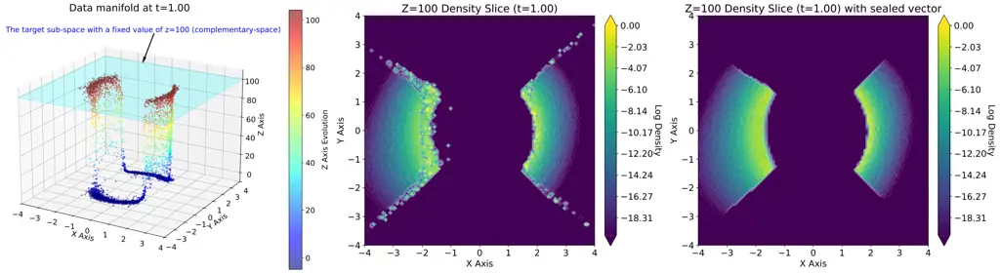
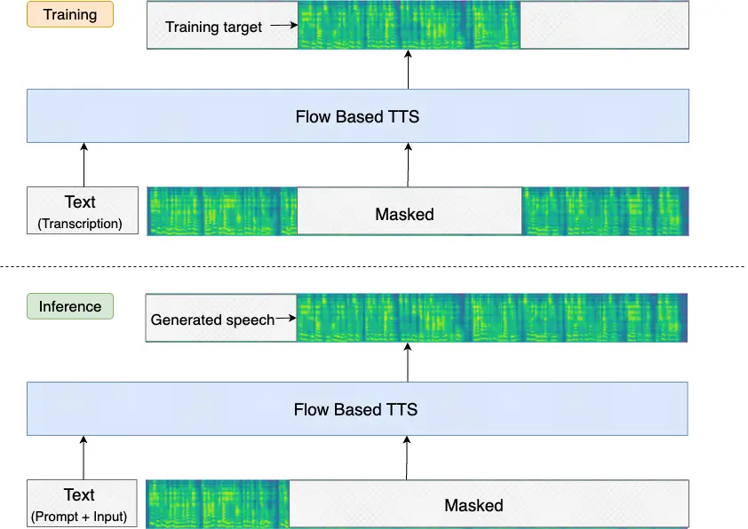
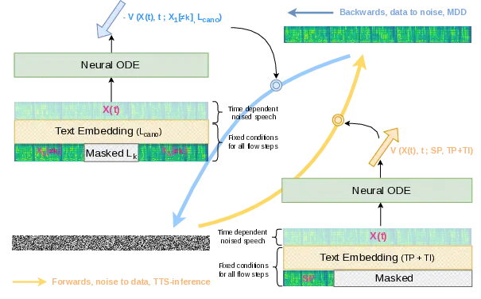

# Local Diagnostics of Continuous Normalizing Flow for Out-of-Distribution Detection

Xinwei Cao Affiliation: Department of Electronic Systems
Affiliation: Norwegian University of Science and Technology
Affiliation: Trondheim, Norway Email: [xinwei.cao@ntnu.no](mailto:)   
Mengxuan Lu Affiliation: School of Future Technology Affiliation: South
China University of Technology Affiliation: Guangzhou, China
Email: [ftlumengxuan@mail.scut.edu.cn](mailto:)    Torbjørn Svendsen
Affiliation: Department of Electronic Systems Affiliation: Norwegian
University of Science and Technology Affiliation: Trondheim, Norway
Email: [torbjorn.svendsen@ntnu.no](mailto:)    Giampiero Salvi
Affiliation: Department of Electronic Systems Affiliation: Norwegian
University of Science and Technology Affiliation: Trondheim, Norway
Email: [giampiero.salvi@ntnu.no](mailto:)

###### Abstract

We address the problem of out-of-distribution (OOD) detection for target
observations embedded in a subspace of the high dimensional data space.
Using continuous normalizing flows (CNFs), we propose a Lagrangian
sub-flow (LSF) framework designed to isolate and estimate the density
for the relevant components in the representation and using the
remaining components as context. Through experimentation with models for
speech synthesis, we show that CNFs, similarly to other deep generative
models (DGMs), are susceptible to the “likelihood paradox”, where high
likelihood is erroneously assigned to OOD samples. This is attributed to
the inductive bias of DGMs that prioritize low-level structural details
over high-level semantic coherence. To mitigate this phenomenon, we
propose a number of geometric diagnostic signals based on the velocity
field over the sub-flow trajectory. Based on these signals, we design
metrics for the challenging task of zero-shot phoneme-level
mispronunciation detection. Finally, we demonstrate the superiority of
these metrics compared to likelihood-based methods on a real-world
mispronunciation detection benchmark.

## 1 Introduction

Deep generative models (DGMs) have demonstrated an exceptional ability
to model complex data distributions. Yet, their applications in
out-of-distribution (OOD) detection underperform dedicated
discriminative models due to the so called “likelihood paradox” effect.
As identified by \[20\] \[20\], likelihood-based models often assign
higher density to OOD samples than to in-distribution data. For example,
a model trained on images from CIFAR-10 \[16\], may assign higher
likelihoods to images from another domain, such as SVHN \[22\]. In
complement to it, Ren et al.\[24\] have found that standard likelihood
scores are often dominated by background statistics rather than the
“semantic" features that actually define a class. Similarly, Kirichenko
et al. \[15\] provided a geometric explanation, suggesting that DGMs
such as normalizing flows (NF) fail because they prioritize low-level
pixel statistics over high-level semantics.

Efforts have been made to mitigate the “likelihood paradox” issue. For
example, researchers managed to use likelihood ratios (\[24\]) or input
complexity\[26\] to compensate the bias towards background noise. Le et
al.\[14\] gave a geometric explanation of why NF models fail to detect
simple OOD samples and proposed to estimate the local intrinsic
dimensions (LID) and augment the likelihood with additional criteria.

The above mentioned methods treat DGMs as static probability estimators
whilst ignoring the rich dynamical information embedded in the training
and inference of the model itself. Xiao et al.\[28\] proposed to use the
likelihood-ratio before and after a training step of DGMs to distinguish
between In-domain (ID) and OOD samples. More recently, Diffusion models,
which have dominated the field of content generation on all modalities,
have been applied for OOD detection, e.g, MSMA \[13\] or
DiffGuard \[10\]. The former approach is based on the trained
score-function evaluated at each point on the noise adding process (the
diffusion path). The latter runs the data to noise path first forwards
and then procedes backwards with an invertible diffusion model. OOD
detection is performed by analyzing the property of the reconstructed
point. Latent ODE models \[25\] can be used to model the evolution of
time series in the latent space, e.g., the temperature over a period of
time. Morningstar et al. \[19\] defined a dynamics prior with a latent
ODE model to distinguish between normal and abnormal time-series.

Another powerful category of DGMs, namely the continuous normalizing
flow (CNF), is however left understudied for OOD detection. One of the
major concerns of using CNF for OOD detection is the computational
complexity since CNF usually requires multiple steps or number of
function evaluations (NFE) to evaluate the likelihood. However, we
believe that the theoretical analogy between CNF and fluid dynamics
offers a powerful perspective for extracting diagnostic signals. Moving
beyond the holistic perspective of the flow, we argue that the true
diagnostic power of CNF lies in the localized, fine-grained trajectories
within the high-dimensional manifold, or the sub-flow dynamics. Due to
averaging over high-dimensional representations, in real-world
applications, OOD signals rarely correspond to very low likelihoods. By
decomposing the global flow into context-specific sub-flows, we can
capture the structural incoherence that is otherwise masked by global
averaging.

There are many application domains of sub-flow diagnostics. In speech
generation, for example, a sub-flow can represent the trajectory of a
specific phoneme while the global flow represents global information
such as environmental noise and speaker’s identity; In computer vision
and text-to-image generation, sub-flows correspond to spatial-semantic
regions and analyzing these localized flows may allow for the detection
of “hallucinations" where a specific object’s internal geometry
contradicts the global scene; Furthermore, detecting localized OOD
patches in medical imaging may be useful to detect a disease, where the
rest of the image acts as calibration for the specific patient. Finally,
in bio-informatics and time-series analysis, anomalies in these
sub-flows can signal mutations or transient regime shifts under a global
trend.

In this work, we investigate the possibilities of using CNF for OOD
detection. More specifically, we focus on the task of variable scale
sub-flow OOD detection within the holistic flow. We make the following
contributions:

- •
  We identify the global coupling issue in modern Transformer-based CNFs
  and propose the Lagrangian sub-flow (LSF) framework to inspect local
  properties of the sub-flow while preserving global context awareness
  from the original flow.
- •
  We provide several stochastic tools that efficiently separate local
  diagnostic signals from the global evolution, for analyzing the
  sub-flow dynamics.
- •
  We demonstrate the usage of these tools in the domain of phoneme-level
  pronunciation assessment using a well-known CNF-based speech
  generative model.
- •
  We visualize and discuss the geometric properties of the learned
  vector field.

## 2 Background and Related Work

In this section, we briefly introduce the continuous normalizing flow
(CNF) which is essential for understanding the methods. Consider
observations $`x`$ in a $`D`$-dimensional data space $`\mathbb{R}^{D}`$
distributed according to an unknown data distribution
$`q_{\text{data}}(x)`$. CNF-based models learn a continuous
transformation with the probability path $`p_{t}(x)`$ over flow-time
$`t\in[0,1]`$ from a Gaussian noise source
$`p_{0}(x)=\mathcal{N}(x;0,I_{D})`$ to the approximated data density
$`p_{1}(x)\approx q_{\text{data}}(x)`$. This transformation corresponds
to a flow
$`\phi(x,t):\mathbb{R}^{D}\times\mathbb{R}\rightarrow\mathbb{R}^{D}`$
which is generated by a time-dependent velocity field
$`v(x,t):\mathbb{R}^{D}\times\mathbb{R}\rightarrow\mathbb{R}^{D}`$. This
process can be described by a time-dependent random variable $`X_{t}`$.

Each initial value $`x_{0}\in\mathbb{R}^{D}\sim X_{t=0}`$ corresponds to
a specific trajectory (streamline) $`\mathbf{x}(t)=\phi(x_{0},t)`$¹¹ 1
Throughout this paper, we distinguish between the spatial coordinate
$`x_{t}\in\mathbb{R}^{D}`$ for the global Eulerian view of the flow and
the time-dependent trajectory $`\mathbf{x}(t)`$ for the Lagrange view of
the flow.. The relation between the points along the trajectory and
their velocity vectors $`v(\mathbf{x}(t),t)`$ can be expressed using the
following ordinary differential equation (ODE):

```math
\frac{d\mathbf{x}(t)}{dt}=v(\mathbf{x}(t),t). \tag{1}
```

The CNF parametrizes the velocity vector field using a neural
network (neural ODE) $`v_{\theta}(\mathbf{x}(t),t)`$ dependent on the
parameters $`\theta`$. Given a trained CNF and a numerical ODE-solver,
e.g., Euler or RK4, sampling from the data distribution can be
approximated by solving the initial value problem (IVP) of Eq.1 forwards
in time:

```math
x_{1}=x_{0}+\int_{0}^{1}v_{\theta}(\mathbf{x}(t),t)dt, \tag{2}
```

where $`x_{0}\sim p_{0}(x)`$ is the initial value sampled from the
Gaussian noise.

Under the assumption of Lipschitz continuity of the neural ODE, the CNF
can run backwards in time from data $`\mathbf{x}(1)`$ to noise
$`\mathbf{x}(0)`$ and the rule of instantaneous change of
variables (ICV) \[5\] can be applied for estimating the likelihood. If
we call
$`J(t)=\frac{\partial v_{\theta}(\mathbf{x}(t),t)}{\partial\mathbf{x}(t)}`$
the Jacobian of the ODE along the trajectory, the log likelihood
becomes:

```math
\log p_{1}(x=\mathbf{x}(1))=\log p_{0}(x=\mathbf{x}(0))-\int_{0}^{1}\Tr\left(J(t)\right)dt, \tag{3}
```

where $`\Tr\left(J(t)\right)`$ is the trace of the Jacobian. The trace
can be efficiently approximated by the unbiased Hutchinson’s trace
estimator \[12\]:

```math
\Tr\left(J(t)\right)=E_{\epsilon}[\epsilon^{T}J(t)\epsilon], \tag{4}
```

where $`\epsilon`$ is typically a vector of Gaussian noise and the
expectation is computed using Monte Carlo approximation with $`N`$
samples of $`\epsilon`$ (usually $`N<10`$). Finally, training the CNF
can be done by directly maximizing the log-likelihood of the data drawn
from $`q_{\text{data}}(x)`$ \[11\].

Unlike traditional CNF training which requires back-propagating through
an ODE solver, modern CNF models can be trained efficiently using the
flow-matching (FM) objective \[18\], following the trajectory of the
optimal transport (OT) path between a sampled pair ($`x_{0},x_{1}`$),
defined as:

```math
\mathbf{x}(t)=(1-t)x_{0}+tx_{1}. \tag{5}
```

As we can see, the OT path is a simple linear interpolation between the
initial point $`x_{0}`$ and the data point $`x_{1}`$ and it has a
constant time derivative $`v(\mathbf{x}(t),t)=x_{1}-x_{0}`$ along the
trajectory. The objective of FM is then to minimize the expected
$`L_{2}`$ distance between the velocity field $`v_{\theta}`$ estimated
by the neural network and the one calculated along the OT path:

```math
\mathcal{L}_{\text{FM}}(\theta)=\mathbb{E}_{t,x_{0},x_{1}}\left[\left\|v_{\theta}(\mathbf{x}(t),t)-(x_{1}-x_{0})\right\|^{2}\right] \tag{6}
```

where $`t\sim\mathcal{U}[0,1]`$, $`x_{0}\sim p_{0}(x)`$, and
$`x_{1}\sim q_{\text{data}}(x)`$. This improves training stability and
reduces the dependence on precise numerical integration \[18\].

## 3 Method

### 3.1 The Lagrangian Sub-Flow Framework

CNF-based generative models parameterize a continuous vector field that
transports a latent Gaussian distribution $`p_{0}`$ toward the target
data distribution $`p_{1}`$. In high-dimensional generation tasks,
modern architectures often rely on global interaction mechanisms, e.g.,
self-attention in Transformers, which cause the feature dimensions to
become intricately entangled. This dense coupling ensures an expressive
representation but simultaneously creates a significant challenge for
OOD detection.

As described in Section 1, we are interested in methods that can focus
the OOD detection on a subset of components in the representation, while
using the other components as context. To isolate local content from the
global context, we propose the Lagrangian sub-flow (LSF) framework. This
framework allows for a post-hoc diagnostic analysis of the sub-flow
while keeping the original evolution of the global flow unchanged.

#### 3.1.1 The Coupled Sub-Flow and Inter-Dimensional Density Leakage

Consider an ambient continuous normalizing flow
$`\phi(x,t):\mathbb{R}^{D}\times\mathbb{R}\rightarrow\mathbb{R}^{D}`$
governed by the velocity field $`v(x,t)`$. To isolate the local
properties of this ambient flow, we decompose the ambient space into a
target sub-space $`\mathcal{S}`$ and its complementary space
$`\mathcal{C}`$, such that
$`\mathbb{R}^{D}=\mathcal{S}\times\mathcal{C}`$. We define the
probability path for the sub-flow space $`\mathcal{S}`$ while following
a specific trajectory $`\mathbf{c}(t)`$ in the complementary space as:

```math
p_{\mathbf{c}(t)}(x_{\mathcal{S}})=p_{t}(x_{S},x_{C}=\mathbf{c}(t)). \tag{7}
```

In this way, we respect the authentic instantaneous contextual condition
$`\mathbf{c}(t)`$ arising from the joint evolution of the global flow
while focusing on the change of the density over flow-time $`t`$ within
the target sub-space only. Note that the definition in Eq. 7 is an
unnormalized conditional density, where the normalization factor is
intractable to compute. This problem can be mitigated by introducing the
likelihood-ratio which will be discussed in Sec.4.2. A more critical
problem of this definition is the fact that the sub-space density
function is influenced by the evolution of the context $`\mathbf{c}(t)`$
in the complementary space, which we refer to herein as
“inter-dimensional density leakage”.

The ambient flow $`\phi`$ represents an autonomous fluid system. Thus,
its density $`p_{t}(x)`$ satisfies the standard continuity equation (the
weak form of the law of conservation of mass) for any
$`x\in\mathbb{R}^{D}`$:

```math
\frac{\partial p_{t}(x)}{\partial t}=-\nabla_{x}\cdot(p_{t}(x)\cdot v), \tag{8}
```

that is, the partial derivatives of the PDF with respect to $`t`$ is
equal to the negative divergence of $`p_{t}(x)\cdot v`$ at the specific
flow-time $`t`$. As the sub-space is embedded within the ambient space,
the density evolution at any point $`x_{\mathcal{S}}\in\mathcal{S}`$
must satisfy:

```math
\displaystyle\frac{\partial p_{\mathbf{c}(t)}(x_{\mathcal{S}})}{\partial t} \displaystyle=-\nabla_{x}\cdot[p_{t}(x_{S},x_{C}=\mathbf{c}(t))\cdot v]= \tag{9}
```

```math
\displaystyle=-\nabla_{x_{s}}\cdot[p_{t}(x_{S},x_{C}=\mathbf{c}(t))\cdot v_{\mathcal{S}}]-\underbrace{\nabla_{x_{c}}\cdot[p_{t}(x_{S},x_{C}=\mathbf{c}(t))\cdot v_{\mathcal{C}}]}_{\text{Inter-dimensional density leakage}}. \tag{10}
```

In a coupled system where $`v_{\mathcal{C}}\neq 0`$, the second term in
Eq.10 violates the local conservation of mass, rendering the sub-flow
non-autonomous. More specifically, by applying the product rule of
differential, the leakage term can be further decomposed into:

```math
\nabla_{x_{c}}\cdot\left[p_{t}(x_{S},s_{C}=\mathbf{c}(t))\cdot v_{\mathcal{C}}\right]=\underbrace{\nabla_{x_{c}}\cdot\left[p_{t}(x_{S},x_{C}=\mathbf{c}(t))\right]\cdot v_{\mathcal{C}}}_{\text{Inter-dimensional advection}}+\underbrace{p_{t}(x_{S},x_{C}=\mathbf{c}(t))\cdot\nabla_{x_{c}}\cdot(v_{\mathcal{C}})}_{\text{Inter-dimensional compression}}, \tag{11}
```

where the “inter-dimensional advection” term represents the probability
mass “drifting” out of the the sub-space $`\mathcal{S}`$ due to
transverse global motion (e.g., rotation or shifting), while the
“inter-dimensional compression" term represents density fluctuations
induced by contraction of dimensions in the complementary space.
Consequently, the sub-flow is heavily entangled with the global
evolution, shielding the intrinsic local kinematic signals from direct
diagnostic observation.

#### 3.1.2 Restoration of Autonomy with the Sealed Vector Field

To enable an atomic diagnostic of a sub-flow while preserving the
model’s global context-awareness, we define a projected diagnostic field
$`\hat{\phi}`$ and its corresponding vector field $`\hat{v}(x,t)`$ by
nullifying the off-subspace velocity components of the original vector
field:

```math
\hat{v}_{i}(x,t)=\begin{cases}v_{i}(x,t)&v_{i}\in\mathcal{S}\\
0&v_{i}\notin\mathcal{S}.\end{cases} \tag{12}
```

This can be achieved by applying a kinematic sealing
$`\mathbf{K}_{\mathcal{S}}`$ matrix multiplication:

```math
\hat{v}(x,t)=\mathbf{K}_{\mathcal{S}}\cdot v(x,t), \tag{13}
```

where $`\mathbf{K}_{\mathcal{S}}=\text{diag}(\mathbf{m}_{\mathcal{S}})`$
and $`\mathbf{m}\in\{0,1\}^{D}`$ be the binary mask for the sub-space
$`\mathcal{S}`$ also known as indicator function. By enforcing
$`v_{C}=0`$ at any time $`t\in[0,1]`$, the inter-dimensional leakage in
Eq. 10 vanishes, thereby restoring the local continuity equation:

```math
\frac{\partial p_{\mathbf{c}(t)}(x_{\mathcal{S}})}{\partial t}=-\nabla_{x_{s}}\cdot\left(p_{\mathbf{c}(t)}(x_{\mathcal{S}})\cdot v_{\mathcal{S}}\right). \tag{14}
```

This projection acts as kinematic sealing, creating a “stiff tube” in
the flow that disentangles the sub-flow from density exchange caused by
context advection or compression. Consequently, the mass is preserved
within the sub-flow.

It is critical to emphasize that the kinematic sealing
$`\mathbf{K_{\mathcal{S}}}`$ is implemented as a post-hoc diagnostic
operator applied to the pre-generated trajectory according to its
original, coupled dynamics. While the underlying model
$`v_{\theta}(x,t)`$ continues to perceive the global context
$`\mathbf{c}(t)`$ which jointly evolves for coherent generation, the
virtual vector field $`\hat{v}(x,t)`$ is used exclusively for
diagnostic. This formulation allows us to extract the sub-segment as a
locally autonomous kinematic system without redefining a separate
dynamical evolution system.

#### 3.1.3 The Lagrangian Sub-Flow via Post-Hoc Kinematic Sealing

While the restored continuity equation (Eq.14) provides an Eulerian view
of the sealed sub-system, we seek to quantify the density evolution from
a Lagrangian perspective (per-sample trajectory) to enable sample-wise
diagnostics. Due to the post-hoc kinematic sealing mechanism, the sample
sub-path remains strictly consistent with the projected trajectory of
the original flow. To this end, we define the sub-path flow map
$`\mathbf{x}_{\mathcal{S}}(t)`$ which tracks the trajectory of a
specific initial state $`\mathbf{x}_{\mathcal{S}}(0)\in\mathcal{S}`$
evolving under the sealed vector field. Similarly to Eq.1, the
sub-trajectory satisfies the ODE:

```math
\frac{d\mathbf{x}_{\mathcal{S}}(t)}{dt}=\hat{v}_{\mathcal{S}}(\mathbf{x}(t),t), \tag{15}
```

where $`\mathbf{x}(t)=[\mathbf{x}_{\mathcal{S}}(t),\mathbf{c}(t)]`$ is a
state vector point on the ambient trajectory.

###### Theorem 1.

\[Instantaneous change of variables for sub-flows\] Given the restored
Lagrangian autonomy of the sealed sub-flow, the total derivative of the
log-density along the sub-path $`\mathbf{x}_{\mathcal{S}}(t)`$ is
determined by:

```math
\frac{d\log p_{\mathbf{c}(t)}(\mathbf{x}_{\mathcal{S}}(t))}{dt}=-\Tr(\hat{\mathbf{J}}_{t}(\mathbf{x}_{\mathcal{S}}(t))) \tag{16}
```

where $`\hat{\mathbf{J}}_{t}\in\mathbb{R}^{D_{S}\times D_{S}}`$ is the
sub-space Jacobian matrix of the sealed vector field $`\hat{v}`$.

###### Proof.

By the chain rule, the total derivative of the sliced density
$`p_{\mathbf{c}(t)}`$ along the path $`\mathbf{x}_{\mathcal{S}}(t)`$ is
given by:

```math
\displaystyle\frac{d\log p_{\mathbf{c}(t)}(\mathbf{x}_{\mathcal{S}}(t))}{dt} \displaystyle=\frac{\partial\log p_{\mathbf{c}(t)}(\mathbf{x}_{\mathcal{S}}(t))}{\partial t}+\frac{d(\mathbf{x}_{\mathcal{S}}(t))}{dt}\cdot\nabla_{\mathbf{x}_{\mathcal{S}}}(\log p_{\mathbf{c}(t)}(\mathbf{x}_{\mathcal{S}}(t)))
```

```math
\displaystyle=\frac{1}{p_{\mathbf{c}(t)}}\frac{\partial p_{\mathbf{c}(t)}}{\partial t}+\hat{{v}}_{\mathcal{S}}\cdot\nabla_{\mathbf{x}_{\mathcal{S}}}(\log p_{\mathbf{c}(t)}),
```

where in the last passage we have simplified notation
($`p_{\mathbf{c}(t)}(\mathbf{x}_{\mathcal{S}})=p_{\mathbf{c}(t)}`$).
Substituting the restored local continuity equation (Eq.14) into the
above expression, we have:

```math
\frac{d\log p_{\mathbf{c}(t)}}{dt}=\frac{1}{p_{\mathbf{c}(t)}}\left[-\nabla_{\mathbf{x}_{\mathcal{S}}}\cdot(p_{\mathbf{c}(t)}\hat{{v}}_{\mathcal{S}})\right]+\hat{{v}}_{\mathcal{S}}\cdot\nabla_{\mathbf{x}_{\mathcal{S}}}(\log p_{\mathbf{c}(t)})
```

Applying the product rule again for the substituted term:

```math
\frac{d\log p_{\mathbf{c}(t)}}{dt}=-\left(\nabla_{\mathbf{x}_{\mathcal{S}}}\cdot\hat{{v}}_{\mathcal{S}}\right)-\frac{1}{p_{\mathbf{c}(t)}}(\hat{{v}}_{\mathcal{S}}\cdot\nabla_{\mathbf{x}_{\mathcal{S}}}p_{\mathbf{c}(t)})+\hat{{v}}_{\mathcal{S}}\cdot\nabla_{\mathbf{x}_{\mathcal{S}}}(\log p_{\mathbf{c}(t)}) \tag{17}
```

The last two terms cancel out and by recognizing that the divergence of
the sealed field is the trace of its sub-space Jacobian, we arrive at
the final equation in Eq.16. ∎

### 3.2 Sub-flow Hutchinson’s Trace Estimator

The Jacobian matrix $`\mathbf{J}\in\mathbb{R}^{D\times D}`$ of a
transformation reflects first-order differential properties of a
function at a point. For CNF-based generative models, the instantaneous
Jacobian
$`\mathbf{J}_{t}=\nabla v(\mathbf{x}(t),t)\in\mathbb{R}^{D\times D}`$
contains rich information about the geometric deformation and
probabilistic mass change along the trajectory $`\mathbf{x}(t)`$ under
the Lagrangian perspective. Having established the autonomous sub-flow
identities with the sealed vector field $`\hat{v}(x,t)`$, we now
introduce a stochastic tool that efficiently extract diagnostic signals
for sub-flow targets from a global CNF. Additional definitions are
available in Appendix C.

To compute the exact trace of $`\mathbf{J}\in\mathbb{R}^{D\times D}`$,
$`D`$ separated differential operations are required. This is
unpractical for high-dimensional CNFs parametrized with neural networks.
The Hutchinson’s trace estimator as discussed in Eq. 4 can efficiently
estimate the trace using probing vectors $`\epsilon`$ sampled from
Gaussian- or Rademacher-noise.

For the projected sub-flow $`\mathbf{x}_{\mathcal{S}}(t)`$ with respect
to the sealed vector field $`\hat{v}`$, we are interested in the trace
of the sub-flow Jacobian
$`\Tr(\hat{\mathbf{J}}_{t}(\mathbf{x}_{\mathcal{S}}(t)))`$. Due to the
vector field’s sealed dimensions that have zero partial derivatives on
the diagonal elements, the trace of the sub-flow Jacobian is the same as
the trace of the full-flow’s Jacobian:
$`\Tr(\hat{\mathbf{J}}_{t}(\mathbf{x}_{\mathcal{S}}(t)))=\Tr(\hat{\mathbf{J}}_{t}(\mathbf{x}(t)))`$.
Applying the Hutchinson’s equation:

```math
\Tr(\hat{\mathbf{J}}_{t}(\mathbf{x}_{\mathcal{S}}(t)))=\mathbb{E}_{\epsilon}[\epsilon^{T}\hat{\mathbf{J}}_{t}(\mathbf{x}(t))\epsilon]. \tag{18}
```

Recalling the kinematic projection $`\mathbf{K}_{\mathcal{S}}`$ operator
in Eq. 13, we take the derivative on both sides obtaining:

```math
\displaystyle\nabla_{x}\hat{v}(x,t) \displaystyle=\mathbf{K}_{\mathcal{S}}\nabla_{x}v(x,t)\mathbf{K}_{\mathcal{S}}\implies\hat{\mathbf{J}}_{t}(\mathbf{x}(t))=\mathbf{K}_{\mathcal{S}}\mathbf{J}_{t}(\mathbf{x}(t))\mathbf{K}_{\mathcal{S}}.
```

Substituting this identity to Eq. 18:

```math
\displaystyle\Tr(\hat{\mathbf{J}}_{t}(\mathbf{x}_{\mathcal{S}}(t))) \displaystyle=\mathbb{E}_{\epsilon}[(\epsilon^{T}\mathbf{K}_{\mathcal{S}})\mathbf{J}_{t}(\mathbf{x}(t))(\mathbf{K}_{\mathcal{S}}\epsilon)]=\mathbb{E}_{\hat{\epsilon}}[\hat{\epsilon}^{T}\mathbf{J}_{t}(\mathbf{x}(t))\hat{\epsilon}]\approx\frac{1}{N}\sum_{n=1}^{N}\hat{\epsilon}_{n}^{T}\mathbf{J}_{t}(\mathbf{x}(t))\hat{\epsilon}_{n}, \tag{19}
```

where $`\hat{\epsilon}=\mathbf{K}_{\mathcal{S}}\cdot\epsilon`$ is the
projected probing vector. The proposed sub-flow Hutchinson’s Trace
Estimator allows estimating the sub-flow Jacobian trace from the
Jacobian of the ambient space with only a few ($`N<10`$)
Jacobian-vector-products (JVPs). This makes the sub-flow diagnostic
extremely efficient for high-dimensional neural vector fields²² 2 VJP is
often supported by automatic differential systems in modern machine
learning frameworks e.g., Pytorch.

For a sampled sub-trajectory
$`\mathbf{x}_{\mathcal{S}}(0)\to\mathbf{x}_{\mathcal{S}}(1)`$, the trace
of the instantaneous Jacobian $`\mathbf{J}_{t}(\mathbf{x}(t))`$
represents a local contraction ($`\Tr<0`$) or expansion ($`\Tr>0`$) of
probability mass along the path. Alternatively, the sub-flow
Hutchinson’s trace estimator can be used to evaluate the density
$`p_{\mathbf{c}(t)}(x_{\mathcal{S}})`$ for any sample
$`x_{\mathcal{S}}`$ in the sub-space directly using Eq. 16. An
illustration of this is given in Section 4.1.

### 3.3 Metrics for OOD

The first metric $`\text{LL}=p_{1}(\mathbf{x}_{\mathcal{S}}(1))`$ is the
log likelihood of the target sub-representation. This can be estimated
with Eq 3 where we substitute the full Jacobian with the sub-flow
Jacobian from Eq. 19, and $`p_{0}(x(0))`$ with
$`p_{0}(\mathbf{x}_{\mathcal{S}}(0))`$. The metric
$`\text{PRIOR}=p_{0}(\mathbf{x}_{\mathcal{S}}(0))`$ estimates the sample
fit to the distribution in latent space obtained by whitening the target
sub-representation. For high-dimensional data, the probability mass
tends to mainly concentrate on a sphere of radius
$`\sqrt{D_{\mathcal{S}}}`$. To correct for this phenomenon, the metric
$`\text{RAD}=-\frac{1}{D_{\mathcal{S}}}(||\mathbf{x}_{\mathcal{S}}(0)||^{2}-D_{\mathcal{S}})^{2}`$
compares the L2 norm of $`\mathbf{x}_{\mathcal{S}}(0)`$ to the expected
radius.

Because CNFs trained with flow-matching optimal-transport paths are
encouraged to generate straight paths for ID samples, we also introduce
two heuristic metrics that estimate deviations from this behaviour. DISP
computes the ratio between the displacement of the OT path
$`|\mathbf{x}_{\mathcal{S}}(1)-\mathbf{x}_{\mathcal{S}}(0)|`$ and the
whitening path $`\int_{0}^{1}|v_{k}(\mathbf{x}_{\mathcal{S}}(t),t)|dt`$.
This should be close to 1 for straight paths and lower for OOD samples.
Finally, COS integrates the cosine similarity between the OT path and
the whitening path:

```math
\displaystyle\text{COS}=\int_{0}^{1}\cos\left[\mathbf{x}_{\mathcal{S}}(t)-\mathbf{x}_{\mathcal{S}}(0),\mathbf{x}_{\mathcal{S}}(1)-\mathbf{x}_{\mathcal{S}}(0)\right]dt. \tag{20}
```

All the above metrics suffer from the un-normalized nature of the
sub-flow probability density discussed in Section 3.1.1. A commonly
adopted solution is to resort to relative measures computed with
different models (a dedicated and a background model) or in different
conditions (for example using different contextual information). In the
case of LL, for example, this corresponds to the commonly used
likelihood ratio between the two conditions. In Section 4.3 we compare
the performance of absolute and relative metrics. The specific
definitions of the metrics for our experiments are given in Appendix B.

## 4 Experiments



Figure 1: Illustration of density estimation with and without the
sealing mechanism.

### 4.1 Synthetic Data Illustration

In order to exemplify our method, we first use synthetic data from a
simple distribution. The data space is $`\mathbb{R}^{3}`$, where the
target subspace $`\mathcal{S}`$ is the $`xy`$-plane, and the
complementary subspace $`\mathcal{C}`$ is the $`z`$-axis. In the
$`xy`$-plane, we train a 2D vector field $`v_{\theta}(x,y)`$, using flow
matching with optimal transport (OT) paths from Gaussian noise to the
circle $`x^{2}+y^{2}=4`$. We then force an additional velocity in the
$`z`$-axis according to $`v_{z}=(x^{2}-y^{2})*(z+\textit{const})`$ with
limit at $`v_{z}=100`$. Fig. 1 (left) shows samples from the
corresponding data distribution. If we consider a subspace
$`\mathcal{S}`$ for $`z=100`$ ($`\mathbf{c}(1)`$), we can observe that
the data lies on a manifold of $`\mathcal{S}`$. However, if we try to
estimate the density over $`\mathcal{S}`$ using the traditional trace
estimator, additional divergence is introduced by the third dimension
due to the compression/expansion of the velocity $`v_{z}`$ along its
axis. Consequently, the densities of many points on $`\mathcal{S}`$ are
polluted (Fig. 1, center) and the likelihood for out-of-distribution
points is often overestimated. On the other hand, the density on a
manifold appears to be smooth and complete with the help of the proposed
approach (Fig. 1, right).

### 4.2 Real Data: Zero-Shot Mispronunciation Detection with CNF-based Generative Models

Consider a spoken utterance $`x_{1}`$ and a transcription
$`L_{\text{cano}}`$ that contains the sequence of $`K`$ phonemes in the
expected canonical pronunciation of $`x_{1}`$. Phoneme-level
Mispronunciation Detection and Diagnostic (MDD) aims to assess the
quality of the realizations for each phoneme in $`L_{\text{cano}}`$,
given $`x_{1}`$. This task can be thought of as an instance of OOD
detection if we have a probabilistic model of the correct
pronunciations. The spoken utterance is usually represented by a
Mel-spectrogram, that is, $`x_{1}\in\mathbb{R}^{L\times M}`$ where $`L`$
is the number of spectral feature vectors and $`M`$ is their
dimensionality. A source of complexity for the problem lies in the fact
that both $`L`$ and $`K`$ are variable for each utterance, and that
there is no one-to-one correspondence between the feature vectors and
the corresponding phonemic targets. This problem has been traditionally
approached using models for automatic speech recognition (ASR). Here we
propose to use generative models for text-to-speech (TTS) synthesis,
instead. Details on CNF-based models for TTS and the motivation are
given in Appendix A and B. Here we focus on the way we use the proposed
sub-flow method to implement phoneme-level MDD.

The first step in the method is to segment the test utterance using
forced alignment driven by an ASR model. This assigns each feature
vector in $`x_{1}`$ to a specific phoneme $`k`$. Then we define the
target sub-space $`\mathcal{S}`$ as the sequence of feature vectors
corresponding to the target phoneme $`k`$ and the complementary space
for all other feature vectors. This allows us to consider as context any
characteristics of the speaker voice, recording channel, and environment
that are not related to the correctness of pronunciation. Finally, we
compute the goodness of pronunciation (GOP) using the metrics in
Section 3.3 (implementation details in Appendix B), and use them to
separate correct from incorrect pronunciations.

#### 4.2.1 Experimental Settings

We evaluate our methods on the CMU Kids dataset \[8\] which is a
publicly available dataset comprising 9.1 hours of speech (5,180
utterances) collected from 78 children (24 male, 54 female) aged 6–11 in
U.S. schools. The corpus is uniquely valuable due to its phonetic
annotations of the erroneous utterances. By realigning the canonical
pronunciations derived from the CMU pronunciation dictionary to the
human-labeled phonetic annotations, we obtain phoneme-level
labels (correct/incorrect) for the full corpus. As a performance metric
we report ROC-AUC (area under the curve) and the corresponding 95%
confidence intervals.

We use a publicly available pretrained model for TTS called
F5-TTS \[6\]. This is a CNF-based model trained with flow-matching with
optimal-transport path on roughly 100,000 hours of diverse speech data
(details in Appendix A). We use the most active
checkpoint (F5TTS_v1_Base/1250000) to generate the flow. Segmentation of
the utterances into phonetic segments is obtained by a mono-phone
forced-aligner that we trained using Kaldi \[23\]. We use Euler’s method
as the ODE-Solver implemented by \[5\] with 32 integral steps. F5-TTS
uses a non-uniform sampling strategy (sway factor SF) to boost the
sampling quality. We use the default value of SF=-1. We also disable the
classifier-free guidance (CFG) used to increase the sample fidelity that
is not relevant for MDD. Experiments were conducted on a workstation
equipped with an AMD Ryzen Threadripper 3960X CPU, 126 GB of physical
RAM, and two NVIDIA GeForce RTX 3090 GPUs (24 GB VRAM each). The
software environment was based on a standard GNU/Linux x86_64
distribution.

|                 |                   |                       |                   |                       |
| --------------- | ----------------- | --------------------- | ----------------- | --------------------- |
| Method          | Absolute Measures |                       | Relative Measures |                       |
|                 | AUC               | 95% Conf              | AUC               | 95% Conf              |
| GOP-LL          | $`0.641`$         | $`5.5\times 10^{-3}`$ | $`0.668`$         | $`5.3\times 10^{-3}`$ |
| GOP-PRIOR       | $`0.545`$         | $`6.3\times 10^{-3}`$ | $`0.596`$         | $`5.9\times 10^{-3}`$ |
| GOP-RAD         | $`0.578`$         | $`6.0\times 10^{-3}`$ | $`0.391`$         | $`6.6\times 10^{-3}`$ |
| GOP-DISP        | $`0.525`$         | $`6.3\times 10^{-3}`$ | $`0.701`$         | $`5.0\times 10^{-3}`$ |
| GOP-COS         | $`0.516`$         | $`6.3\times 10^{-3}`$ | $`0.738`$         | $`4.6\times 10^{-3}`$ |
| GOP-Codec\[2\]  | $`0.492`$         | $`6.4\times 10^{-3}`$ | $`0.765`$         | $`4.2\times 10^{-3}`$ |
| GOP-GMM\[1\]    | \-                | \-                    | $`0.723`$         | $`4.7\times 10^{-3}`$ |
| GOP-CTC-SF\[3\] | \-                | \-                    | $`0.915`$         | $`2.0\times 10^{-3}`$ |

Table 1: Comparison of absolute and relative measures.

### 4.3 Results and Discussion

Table 1 reports the performance of the different metrics for the
mispronunciation detection task and both for absolute and relative
measurements (see Section 3.3). GOP-LL outperforms the GOP-PRIOR by a
large margin, which indicates that considering solely the end point
$`\mathbf{x}_{\mathcal{S}}(0)`$ of the whitening process for MDD is not
enough. This means that, while all the speech segments
(correct/incorrect) can be roughly pulled back by the vector field to
the isotropic Gaussian noise (shown by AUC$`\approx`$0.5), the
additional local compression rate of probability mass along with the
whitening trajectory $`\mathbf{x}_{\mathcal{S}}(t)`$ recorded by the
Jacobian trace in Eq. 16 contains informative diagnostic signals for the
tasks. The absolute measure of GOP-RAD seems to mitigate the
concentration of mass in the high-dimensional space if compared to
GOP-PRIOR. However, this result does not carry over to the relative
versions of the metrics and relative GOP-RAD appears to be inversely
correlated with the goodness of pronunciation (AUC$`<0.5`$).

The likelihood-based approaches (GOP-LL, GOP-PRIOR, GOP-RAD)
under-perform if compared to the geometric methods (GOP-DISP, GOP-COS)
and especially when comparing to the baseline TTS-based approach
GOP-Codec and ASR-based approaches GOP-GMM and GOP-CTC-SF. We
hypothesize that this is due to but not limited to the following reason.
The sub-flow is defined in the high dimensional space
$`\mathbb{R}^{L_{k}\times M}`$ while the human speech conditioned on its
speech context $`C_{sp}`$ live in a lower-dimensional manifold. As a
result, in the Lagrangian perspective, most of the model’s energy (e.g.,
the compressions represented by the Jacobian traces) is consumed to push
the noise onto the manifold in order to maintains inter-frame coherence
along the trajectory. It is hard for the likelihood-based method to
extract those fine-grained signal that determines phonetic/phonemic
correctness, even though the LSF framework has the effect of purifying
the diagnostic signal. This hypothesis is consistent with many previous
works. For example, \[21\] \[21\] discovered that generative models like
flow-based models and VAEs often assign a higher likelihood to simpler
OOD samples than to its own training data. \[28\] \[28\] suggested to
use likelihood-ratio test to tackle this issue, which shares very
similar idea to the GOP and to our relative measures which achieves
constantly improvement on the AUC throughout the experiments.
\[15\] \[15\] further attributed this phenomenon to the “inductive bias"
of normalizing flows towards local pixel correlations rather than
modeling high-level semantic concepts. In the work of \[14\], the
authors proposed to estimate local intrinsic dimensions for Flow-based
models and use it as an additional criterion to the likelihood for OOD
detection.

Figure 2: The diagnostic signals extracted from the F5-TTS-based
phonetic sub-flow for the target phoneme /AE/ in the utterance for
“cat”.

The simple geometric-based measures GOP-DISP and GOP-COS appear to be
more performantive than likelihood-based methods. The relative measure
of GOP-COS surpasses the traditional GMM-based GOP method with
AUC=0.738. A way to explain this is to consider the example in Fig. 2.
The figure shows the Jacobian trace (left) and cosine similarity (right)
of the target sub-flow as a function over flow-time $`t`$ for three
samples (correct pronunciation, mis-pronunciation and noise). This is an
example of the “likelihood paradox” where the trace for the
mis-pronunciation results in a higher likelihood than for the correct
pronunciation. Only the noise sample can be properly distinguished from
correct pronunciation in this case. Conversely, the cos-similarity plot
shows a better adherence to the OT path for the correct pronunciation
than for the mis-pronunciation, as expected.

### 4.4 Limitations

This work is a first attempt at using CNF for sub-space OOD detection.
Our experiments are limited to the specific real-world application of
mispronunciation detection. Although this is a challenging testbed,
other application domains should be tested in order to confirm the
validity of the method. For the likelihood methods, the complexity is
dictated by the number of samples used in the Jacobian estimation. For
the non-likelihood methods, the predominant factor is the number of
evaluations along the flow path.

## 5 Conclusions

In this work, we propose a framework for using generative models based
on continuous normalized flow (CNF) for out-of-distribution detection
tasks. The method is intended for high-dimensional data, where the
detection task is based on a subspace and the rest of the data
representation is used as context. We use concepts from fluid dynamic to
enable the definition of diagnostic signals based on the sub-flow
corresponding to the target subspace. Additionally, we provide a
numerical tool for performing tractable trace estimation for the
sub-flow, allowing for efficient computations.

We test our methods on the challenging task of zero-shot phoneme-based
pronunciation assessment and using CNF-based generative models for
text-to-speech synthesis. We show that our method has a comparable
performance to traditional methods based on discriminative models for
automatic speech recognition (GOP-GMM), although they come short when
compared to SOTA discriminative methods (GOP-CTC-SF). Furthermore, we
show that simple geometric analysis of the whitening trajectory
surpasses likelihood-based diagnostics in our tests. This confirms that
geometric mismatch is a more sensitive indicator for OOD detection than
simple density fluctuations with CNF-based models.

Future work should verify if our results generalize to other application
domains, for example in computer vision or sensor systems.

## References

- \[1\] X. Cao, Z. Fan, T. Svendsen, and G. Salvi (2023) An Analysis of
  Goodness of Pronunciation for Child Speech. In interspeech,
  pp. 4613–4617. External Links:
  [Document](https://dx.doi.org/10.21437/Interspeech.2023-743) Cited by:
  Table 1.
- \[2\] X. Cao, Z. Fan, T. Svendsen, and G. Salvi (2025) Child speech
  assessment through large language model speech synthesis: preliminary
  results. In 2025 IEEE 35th International Workshop on Machine Learning
  for Signal Processing (MLSP), Vol. , pp. 1–6. External Links:
  [Document](https://dx.doi.org/10.1109/MLSP62443.2025.11204337) Cited
  by: Table 1.
- \[3\] X. Cao, Z. Fan, T. Svendsen, and G. Salvi (2026)
  Segmentation-free goodness of pronunciation. IEEE Transactions on
  Audio, Speech and Language Processing 34 (), pp. 796–807. External
  Links: [Document](https://dx.doi.org/10.1109/TASLPRO.2026.3654852)
  Cited by: Table 1.
- \[4\] H. Chang, H. Zhang, L. Jiang, C. Liu, and W. T. Freeman (2022)
  MaskGIT: masked generative image transformer. In The IEEE Conference
  on Computer Vision and Pattern Recognition (CVPR), Cited by: Appendix
  A.
- \[5\] R. T. Q. Chen, Y. Rubanova, J. Bettencourt, and D.
  Duvenaud (2018) Neural ordinary differential equations. In neurips,
  pp. 6572–6583. Cited by: §2, §4.2.1.
- \[6\] Y. Chen, Z. Niu, Z. Ma, K. Deng, C. Wang, J. Zhao, K. Yu, and X.
  Chen (2024) F5-TTS: a fairytaler that fakes fluent and faithful speech
  with flow matching. arXiv preprint arXiv:2410.06885. Cited by:
  Appendix A, §4.2.1.
- \[7\] J. Devlin, M. Chang, K. Lee, and K. Toutanova (2018) BERT:
  pre-training of deep bidirectional transformers for language
  understanding. Note: cite arxiv:1810.04805Comment: 13 pages External
  Links: [Link](http://arxiv.org/abs/1810.04805) Cited by: Appendix A.
- \[8\] M. Eskenazi, J. Mostow, and D. Graff (1997) The CMU Kids Corpus
  LDC97S63. Web Download. Philadelphia: Linguistic Data Consortium.
  Note: accessed 03/07/2023 Cited by: §4.2.1.
- \[9\] S. E. Eskimez, X. Wang, M. Thakker, C. Li, C. Tsai, Z. Xiao, H.
  Yang, Z. Zhu, M. Tang, X. Tan, Y. Liu, S. Zhao, and N. Kanda (2024) E2
  TTS: embarrassingly easy fully non-autoregressive zero-shot TTS.
  External Links: 2406.18009, [Link](https://arxiv.org/abs/2406.18009)
  Cited by: Appendix A.
- \[10\] R. Gao, C. Zhao, L. Hong, and Q. Xu (2023) DiffGuard: semantic
  mismatch-guided out-of-distribution detection using pre-trained
  diffusion models. In Proceedings of the IEEE/CVF International
  Conference on Computer Vision (ICCV), pp. 1579–1589. Cited by: §1.
- \[11\] W. Grathwohl, R. T. Q. Chen, J. Bettencourt, I. Sutskever,
  and D. Duvenaud (2018) FFJORD: free-form continuous dynamics for
  scalable reversible generative models. External Links: 1810.01367,
  [Link](https://arxiv.org/abs/1810.01367) Cited by: §2.
- \[12\] M.F. Hutchinson (1989) A stochastic estimator of the trace of
  the influence matrix for laplacian smoothing splines. Communication in
  Statistics- Simulation and Computation 18, pp. 1059–1076. External
  Links: [Document](https://dx.doi.org/10.1080/03610919008812866) Cited
  by: §2.
- \[13\] A. Jolicoeur-Martineau, R. Piché-Taillefer, R. T. des Combes,
  and H. Larochelle (2021) Multi-scale score matching for
  out-of-distribution detection. In International Conference on Learning
  Representations (ICLR), External Links: [Link](https://openreview.net)
  Cited by: §1.
- \[14\] H. Kamkari, B. L. Ross, J. C. Cresswell, A. L. Caterini, R. G.
  Krishnan, and G. Loaiza-Ganem (2024) A geometric explanation of the
  likelihood ood detection paradox. In Proceedings of the 41st
  International Conference on Machine Learning, ICML’24. Cited by: §1,
  §4.3.
- \[15\] P. Kirichenko, P. Izmailov, and A. G. Wilson (2020) Why
  normalizing flows fail to detect out-of-distribution data. In Advances
  in Neural Information Processing Systems (NeurIPS), Vol. 33,
  pp. 20549–20558. Cited by: §1, §4.3.
- \[16\] A. Krizhevsky (2009) Learning multiple layers of features from
  tiny images. Technical report University of Toronto. Cited by: §1.
- \[17\] M. Le, A. Vyas, B. Shi, B. Karrer, L. Sari, R. Moritz, M.
  Williamson, V. Manohar, Y. Adi, J. Mahadeokar, and W. Hsu (2023)
  Voicebox: text-guided multilingual universal speech generation at
  scale. In neurips, Cited by: Appendix A.
- \[18\] Y. Lipman, R. T. Q. Chen, H. Ben-Hamu, M. Nickel, and M.
  Le (2022) Flow matching for generative modeling. ArXiv abs/2210.02747.
  External Links:
  [Link](https://api.semanticscholar.org/CorpusID:252734897) Cited by:
  §2, §2.
- \[19\] W. Morningstar, C. Ham, V. Ghassemi, B. Alizadeh, A. Chu,
  and B. Lakshminarayanan (2021) Density of states estimation for
  out-of-distribution detection. In Proceedings of the 24th
  International Conference on Artificial Intelligence and Statistics
  (AISTATS), Proceedings of Machine Learning Research, Vol. 130,
  pp. 1981–1989. Cited by: §1.
- \[20\] E. Nalisnick, A. Matsukawa, Y. W. Teh, D. Gorur, and B.
  Lakshminarayanan (2019) Do deep generative models know what they don’t
  know?. In International Conference on Learning Representations,
  External Links: [Link](https://openreview.net) Cited by: §1.
- \[21\] E. Nalisnick, A. Matsukawa, Y. W. Teh, D. Gorur, and B.
  Lakshminarayanan (2019) Do deep generative models know what they don’t
  know?. In International Conference on Learning Representations (ICLR),
  Cited by: §4.3.
- \[22\] Y. Netzer, T. Wang, A. Coates, A. Bissacco, B. Wu, and A. Y.
  Ng (2011) Reading digits in natural images with unsupervised feature
  learning. In NIPS Workshop on Deep Learning and Unsupervised Feature
  Learning, Cited by: §1.
- \[23\] D. Povey, A. Ghoshal, G. Boulianne, L. Burget, O. Glembek, N.
  Goel, M. Hannemann, P. Motlicek, Y. Qian, P. Schwarz, J. Silovsky, G.
  Stemmer, and K. Vesely (2011) The kaldi speech recognition toolkit. In
  asru, Cited by: §4.2.1.
- \[24\] J. Ren, P. J. Liu, E. Fertig, J. Snoek, R. Poplin, M.
  Depristo, J. Dillon, and B. Lakshminarayanan (2019) Likelihood ratios
  for out-of-distribution detection. In Advances in Neural Information
  Processing Systems (NeurIPS), Vol. 32. Cited by: §1, §1.
- \[25\] Y. Rubanova, R. T. Chen, and D. K. Duvenaud (2019) Latent
  ordinary differential equations for irregularly-sampled time series.
  In Advances in Neural Information Processing Systems (NeurIPS), Cited
  by: §1.
- \[26\] J. Serrà, D. Álvarez, K. Vicent, C. Martínez, A. Gauchia,
  and J. Martí (2020) Input complexity and out-of-distribution detection
  with likelihood-based generative models. In International Conference
  on Learning Representations (ICLR), Cited by: §1.
- \[27\] A. Vaswani, N. Shazeer, N. Parmar, J. Uszkoreit, L.
  Jones, A. N. Gomez, Ł. Kaiser, and I. Polosukhin (2017) Attention is
  all you need. In neurips, Vol. 30, pp. . Cited by: Appendix A.
- \[28\] Z. Xiao, Q. Yan, and Y. Amit (2020) Likelihood regret: an
  out-of-distribution detection score for variational autoencoder. In
  Advances in Neural Information Processing Systems (NeurIPS), Vol. 33,
  pp. 2051–2062. Cited by: §1, §4.3.



Figure 3: The masking and filling paradigm for flow-based TTS

## Appendix A Speech Synthesis Using Continuous Normalizing Flows

Text-to-speech (TTS) systems use generative speech models for
synthesizing human-like speech corresponding to given text inputs (TI),
striving for both fidelity and diversity of the output. Recently, TTS
systems have seen significant improvements thanks to the advances in
deep neural generative models. Among them, the models that are based on
CNF \[17, 9, 6\] have achieved the state-of-the-art performance on
various benchmarks.

TTS systems operate on variable length speech utterances that are
typically represented as sequences of feature vectors. In particular,
CNF-based TTS systems usually employ a mel-spectrogram representation
where the dimensionality $`M`$ of the feature vectors (mel-spectral
bins) is fixed, whereas the number of vectors $`L`$ can vary for each
utterance. The total dimensionality of each observation in the data is
then $`D=L\times M`$. The flow of TTS is characterized by a
time-dependent velocity field that is parametrized by stack of
Non-Auto-Regressive (NAR) transformer layers \[27, 4\]. Similarly to the
ordinary CNF, a time-dependent 2-D tensor $`\mathbf{x}(t)`$ represents a
trajectory within the flow that transports a sample of Gaussian noise
$`\mathbf{x}(0)`$ to the speech data $`\mathbf{x}(1)`$.

These models are capable of generating target speech for unseen
speakers (zero-shot TTS) with in-context learning. This is achieved by
providing the neural ODE with additional conditions, i.e., a matched
pair of a short speech prompt (SP) from the target speaker and the
corresponding orthographic transcription (text prompt, TP, see
Figure 3). The system, therefore, has three inputs, a noise sample
$`x_{0}`$, a speech prompt SP and a concatenation of the text prompt and
the text input $`\{\text{TP},\text{TI}\}`$. Both the speech prompt and
the text are converted to the same dimensionality $`L\times M`$, by
padding and mapping, resulting in the context matrices $`C_{\text{sp}}`$
and $`C_{\text{text}}`$. Finally, the three inputs
$`x_{0},C_{\text{sp}}`$, and $`C_{\text{text}}`$ are first stacked and
then mapped to the final latent representation by linear mapping. The
network then estimates the velocity field
$`v_{\theta}(\mathbf{x}(t),t;C_{\text{sp}},C_{\text{text}})`$ for the
trajectory $`\mathbf{x}(t)`$ in the context
$`C_{\text{sp}},C_{\text{text}}`$ that can be plugged in the ODE (Eq.1).

Under these settings, the training of the model becomes very similar to
training a masked language model (MLM) \[7\] where the model is learned
to recover the masked part of speech driven by the conditional vector
field $`v_{\theta}(x,t;C)`$. The training and inference modes of
CNF-based TTS are illustrated in Fig.3.



Figure 4: The whitening trajectory for MDD (backwards) vs. the inference
trajectory for TTS (forwards) of a CNF-based speech generative model.

## Appendix B Details on Mispronunciation Detection with CNF-based Generative Models

Here we give details on the proposed application of our method to
mispronunciation detection that were not included in the paper.

Given a spoken utterance $`x_{1}`$ and a transcription
$`L_{\text{cano}}`$ that contains the sequence of $`K`$ phonemes in the
expected canonical pronunciation, phoneme-level MDD aims to assess the
quality of the realizations for each phoneme in $`L_{\text{cano}}`$,
given $`x_{1}`$. The spoken utterance is usually represented by a
Mel-spectrogram, that is, $`x_{1}\in\mathbb{R}^{L\times M}`$ where $`L`$
is the number of spectral feature vectors and $`M`$ is their
dimensionality. The complexity of the problem lies in the fact that both
$`L`$ and $`K`$ are variable for each utterance, and that there is no
one-to-one correspondence between the feature vectors and the
corresponding phonemic targets.

To leverage a well-trained CNF-based speech generative model and
re-purpose it for phoneme-level MDD, we propose temporal-aware phonetic
sub-flow diagnostic (TPD) based on the reversibility of CNF. This can be
performed in three steps:

1.  1.  Temporal segmentation: We obtain $`K`$ ordered segments
        $`x_{1}=\{x_{1}[1],...,x_{1}[K]\}`$ where
        $`x_{1}[k]\in\mathbb{R}^{L_{k}\times D}`$ denotes the “$`k`$”th
        segment of length $`L_{k}`$, using techniques such as
        monotonic-alignment search or forced alignment.
2.  2.  Whitening: The assessment speech $`x_{1}`$ is inversely filtered by
        running the CNF backwards in time from $`t=1\rightarrow 0`$ driven
        by the conditional vector field $`v_{k}(x,t;C_{k})`$. The conditions
        $`C_{k}=\{C_{\text{text}}\leftarrow L_{\text{cano}},C_{\text{sp}}\leftarrow x_{1}[\neq k]\}`$
        are rendered for the “$`k`$”th phoneme where $`x_{1}[\neq k]`$
        denotes the original speech $`x_{1}`$ whose segment $`x_{1}[k]`$ is
        replaced by special mask tokens of the same length.
3.  3.  Projecting the sub-flow: We focus on the local whitening trajectory
        $`\mathbf{x}_{k}(t)`$ and analyze the sub-flow dynamics for MDD
        using local kinematic diagnostic signals.

It should be noted that the masking applied to the target speech in the
second step is critical because we should regard only $`x_{1}[\neq k]`$
as necessary context such that the semantic of masking is consistent
with that for generation (Fig.3). In case of no mask, the distribution
of the target segment peaks at the point identical to the provided
speech segment. The neural ODE is then at the risk of receiving too
strong signals from target segment while omitting other conditions for
differentiating between good and bad pronunciations. We illustrate the
proposed TPS in Fig.4.

The advantages of TPD can be summarized as follows: 1. It is a zero-shot
MDD approach with a non-discriminative model. Similarly to ASR-based
solutions, this mitigates the data-scarcity problem typical of MDD
tasks. 2. We preserve the global context awareness during whitening,
while keeping an eye on the local dynamics. 3. TPD takes advantage of
the probabilistic models while at the same time begin totally
deterministic via whitening, so no information of the model is lost as
“sampling-comparing" based approaches. 4. Since the analysis of the
sub-flow is performed at the latent speech space, no vocoder is needed
to reconstruct the waveform which not only simplifies the workflow but
also avoids the additional variance brought by phase restoration. 5. The
masking mechanism enables flexible speech assessment for any
linguistic-level, by just expanding or reducing the the span of the
mask.

### B.1 Mispronunciation Detection Using the Sub-Flow

In the next section, we specialize the kinematic measures introduced in
Section 3.3 for the MDD task.

The phoneme-level MDD can be framed as out-of-distribution (OOD)
detection tasks for each phonemic unit $`l_{k}\in L_{\text{cano}}`$,
using the corresponding sub-flow trajectory $`\mathbf{x}_{k}(t)`$ driven
by the sealed vector field $`\hat{v}_{k}(x,t;C_{k})`$ where
$`C_{k}=\{C_{\text{text}}\leftarrow L_{\text{cano}},C_{\text{sp}}\leftarrow x_{1}[\neq k]]\}`$.
The first measure comes naturally to our mind is the log-likelihood
value evaluated for each segment $`x_{1}[l]`$ using the instantaneous
change of variables for sub-flows according to Eq.16:

```math
\text{GOP-LL}(k)=\frac{1}{L_{k}}\left(\log p_{0}(\mathbf{x}_{k}(0))+\int_{0}^{1}-\Tr(\hat{\mathbf{J}}_{t}(\mathbf{x}_{k}(t)))dt\right), \tag{21}
```

where the sub-flow Hutchinson’s trace estimator introduced in Sec.3.2
can be used to approximate the instantaneous sub-flow Jacobian trace.
Intuitively, the in-domain (ID) samples should have a higher GOP-LL than
OOD samples.

According to the Neyman-Pearson Lemma, the likelihood-ratio (LR) test is
the most powerful test given a fixed significance level. For this
reason, we introduce a second trajectory $`\bar{\mathbf{x}}_{k}(t)`$
driven by a relative sealed vector field
$`\hat{v}_{k}(x,t;\bar{C_{k}})`$ where
$`\bar{C}_{k}=\{C_{\text{text}}\leftarrow L_{\text{NULL}},C_{\text{sp}}\leftarrow x_{1}[\neq k]]\}`$
and denote its Jacobian as $`\bar{\mathbf{J}}`$. The uninformative text
condition $`L_{\text{NULL}}`$ instructs the neural ODE to generate an
average vector field for the given speech context. The corresponding
log-likelihood score is:

```math
\text{GOP-LL-NULL}(k)=\frac{1}{L_{k}}\left(\log p_{0}(\bar{}\mathbf{x}_{k}(0))+\int_{0}^{1}-\Tr(\bar{\mathbf{J}}_{t}(\bar{}\mathbf{x}_{k}(t)))dt\right). \tag{22}
```

GOP-LL-NULL has the effect of normalizing out non-phonemic factors of
the realization of the target phoneme when subtracted by the ordinary
log-likelihood score. We define this relative log-likelihood measure as:

```math
\text{GOP-LL-R}(k)=\text{GOP-LL-NULL}(k)-\text{GOP-LL}(k). \tag{23}
```

We omit the definitions of this relative scores for the rest of the
measures, but keep in in mind that this idea of using relative score is
applied throughout all the experiment.

Since the sub-space trajectory $`\mathbf{x}_{k}(t)`$ is obtained using
whitening, a simpler idea than GOP-LL is to evaluate the initial
probability $`p_{0}(\mathbf{x}_{k}(0))`$ as measure for MDD:

```math
\text{GOP-PRIOR}(k)=\frac{1}{L_{k}}(\log p_{0}(\mathbf{x}_{k}(0)). \tag{24}
```

Due to the effect of concentration of mass for high-dimensional data,
the probability mass is, in theory, concentrated mainly on a sphere of
radius $`\sqrt{L_{k}M}`$. An alternative to GOP-PRIOR for mitigating
this problem is then computing the L2 norm of $`\mathbf{x}_{k}(0)`$ and
comparing to the expected radius:

```math
\text{GOP-RAD}(k)=-\frac{1}{L_{k}}(||\mathbf{x}_{k}(0)||^{2}-L_{k}M)^{2}. \tag{25}
```

Since the CNF trained with Flow-Matching on Optimal-Transport path will
in principle generate constant-velocity straight trajectories for ID
samples, as illustrated Eq.5, we propose several efficient heuristic
measures based on simple geometric properties derived from the whitening
path $`\mathbf{x}_{k}(t)`$ and the corresponding projected vector field
$`v_{k}(\mathbf{x}_{k},t;C_{k})`$.

In transport theory, OT paths represent the minimum kinetic energy path
for an autonomous dynamical system. The first of the proposed kinematic
measures computes the ratio between displacement of the OT path and the
whitening path:

```math
\text{GOP-DISP}(k)=\frac{|\mathbf{x}_{k}(1)-\mathbf{x}_{k}(0)|}{\int_{0}^{1}|v_{k}(\mathbf{x}_{k}(t),t;C_{k})|dt}. \tag{26}
```

We expect GOP-DISP to be close to one for ID samples while less than one
for OOD samples. As directions might be a more direct implication for
straightness, the cos-similarity can also be a normalized measure for
detecting OOD samples:

```math
\text{GOP-COS}(k)=\int_{0}^{1}\textbf{cos}\left(\mathbf{x}_{k}(t)-\mathbf{x}_{k}(0),\mathbf{x}_{k}(1)-\mathbf{x}_{k}(0)\right)dt. \tag{27}
```

## Appendix C Additional Stochastic Tools for Diagnostics

### C.1 Sub-flow Randomized Directional Derivatives Analysis

While the sub-flow trace estimator measures the aggregated density
compression, it is insensitive to local isochoric distortions, e.g.,
shear or rotation, where the mass is rearranged but not significantly
compressed. To capture those signals which are potentially relevant for
OOD detection and to keep computational efficiency, we propose the
sub-flow randomized directional derivatives (RDD) that analyze more
fine-grained geometric deformation of the sub-flow.

Rather than explicitly evaluating the full Jacobian, we probe the
sub-flow Jacobian operator and collect the directional responses using N
random directions $`\{{\epsilon}^{(i)}\}_{i=1}^{N})`$:

```math
\hat{\mathbf{J}}_{t}(\mathbf{x}(t))\epsilon^{(i)}=\mathbf{K}_{\mathcal{S}}\mathbf{J}_{t}(\mathbf{x}(t))(\mathbf{K}_{\mathcal{S}}\epsilon^{(i)})=\mathbf{K}_{\mathcal{S}}{\mathbf{J}}_{t}(\mathbf{x}(t))\hat{\epsilon}^{(i)}. \tag{28}
```

Similar to the Sub-flow Hutchinson’s Trace Estimator, the last equation
exposes a double-sealing mechanism: the right
$`\mathbf{K}_{\mathcal{S}}`$ aims to ensure the variations in the random
tangent vector $`\epsilon`$ only originate from the targeting sub-space
while the left $`\mathbf{K}_{\mathcal{S}}`$ masks out the off-sub-space
dimensions in the Jacobian responses. According to the concentration of
measure phenomenon in high-dimensional spaces, a small number of random
probes are sufficient to capture the essential spectral
properties (principle directions) of the local Jacobian. These
directional responses preserve the orientational information of the
local flow. To detect ODD, we further propose two diagnostic signals
based on the orientational information:

#### C.1.1 Temporal Orientational Consistency

This metric captures the second-order Jacobian stability by computing
the average cosine similarity between successive directional responses
using the same probe vectors along the streamline path
$`\mathbf{x}(t)`$:

```math
\beta(t)=\frac{1}{N}\sum_{n\in[1,N]}\cos\left(\hat{\mathbf{J}}_{t}(\mathbf{x}(t))\epsilon^{(n)},\hat{\mathbf{J}}_{t-\Delta t}(\mathbf{x}(t-\Delta t))\epsilon^{(n)}\right) \tag{29}
```

where $`\Delta t`$ is the interval between two discrete ODE evaluation
steps. We hypothesis that the velocity field evolves according to a
pre-defined prior for ID samples. For example, if a CNF is trained with
OT path, the Jacobian orientations should remain stable along the
trajectory, leading to $`\mathcal{S}_{t}\approx 1`$. In contrast, an OOD
sample can have rapid re-orientation of the Jacobian on its path such
that significant drop in $`\mathcal{S}_{t}`$ can be observed, providing
a high-sensitivity diagnostic signal of the sub-flow’s intrinsic
struggle against the learned prior.

#### C.1.2 Intra-sub-space Spatial Coherence

Beyond temporal stability, we further investigate the instantaneous
coherence across the constituent components of a sub-flow. Given that
high-dimensional data in CNFs are often represented as organized
structures (e.g., sequences of frames in speech signals or spatial grids
in images), we define a metric to evaluate the local alignment of
directional responses within these sub-dimensions at each flow time
$`t`$. Formally, for a sub-flow partitioned into $`M`$ local units, we
measure the spatial coherence of the sub-flow over each component $`k`$
in the sub-space Jacobian responses denoted as
$`\hat{\mathbf{J}}^{(k)}_{t}(\mathbf{x}(t))\epsilon^{(i)}`$:

```math
\alpha(t)=\frac{1}{N}\sum_{n=1}^{N}\left[\frac{1}{K-1}\sum_{m=1}^{K-1}\cos\left(\hat{\mathbf{J}}^{(k+1)}_{t}(\mathbf{x}(t))\epsilon^{(n)},\hat{\mathbf{J}}^{(k)}_{t}(\mathbf{x}(t))\epsilon^{(n)}\right)\right]. \tag{30}
```

Our hypothesis is, in a well-conditioned sub-flow, the latent geometry
should exhibit harmonic stretching, where local units within the same
semantic sub-flow share a consistent deformation trend. Conversely, an
OOD sample is characterized by internal stochastic divergence across
these units. This diagnostic signal provides a complementary lens to
temporal analysis.

Figure 5: The diagnostic signals extracted from the F5-TTS-based
phonetic sub-flow for the target phoneme /AE/ in the utterance for
“cat”.

### C.2 Illustration of Diagnostic Signals

As an example Figure 5 shows all the diagnostic signals evaluated on the
same examples as in Figure 2. The illustration demonstrates how these
signals provide a rich representation of the flow trajectories that
contain far more information than the global averages. Analyzing these
trajectories in detail may potentially lead to improved performance for
OOD tasks. For example, the negative $`\alpha(t)`$ values in the middle
stage of the trajectories show that the neighboring frames are pulled
against each other, which is consistent with the previous hypotheses
that generative models are modeling background or inter-pixel/frame
coherence. Apart from that, we observed how the initial part of the
trajectory often deviates significantly from the rest of the trajectory.
Anecdotal evidence suggests that defining metrics only considering this
part of the trajectory may be more informative for ODD detection. This,
however requires further experimental validation.
