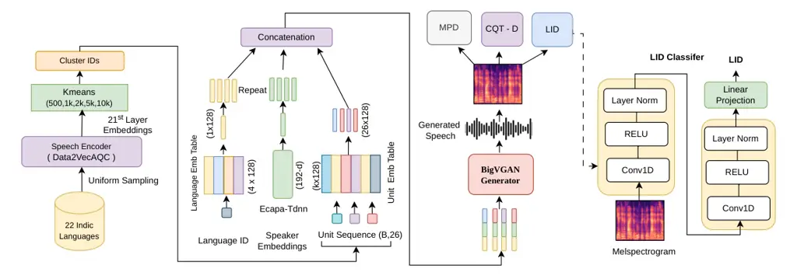

Kothari Gangwar Arigala Umesh

# Multilingual Multi-Speaker Unit Vocoders: A Systematic Analysis of Discrete Speech Representations

Naman    Arjun    Adarsh    S

###### Abstract

Discrete speech units obtained via k-means clustering of self supervised
embeddings entangle phonetic, speaker, and language information, causing
speaker mixing and cross-lingual interference in multilingual
multi-speaker speech generation. Despite growing use in Audio LLMs and
speech to speech systems, unit vocoders remain underexplored. We analyze
a BigVGAN based unit vocoder, across four Indian languages. We study the
interaction between cluster size and conditioning strategies using WER,
speaker similarity, and unit level metrics. Results show that cluster
size governs intelligibility by improving phonetic discriminability,
while explicit speaker conditioning is indispensable for preventing
identity collapse. Language supervision yields further gains mainly at
lower cluster sizes where units remain ambiguous. Our analysis shows
similar phonemes across languages collapse to the same cluster IDs at
smaller inventories, with larger clusters progressively separating them.

###### keywords

Self-Supervised Learning, Unit-based Synthesis, Representation
Alignment, Multilingual Vocoder Analysis

^(†)^(†)address: ¹ National Institute of Technology, Trichy  
² Indian Institute of Technology, Madras ^(†)^(†)email:
namank.edu@gmail.com, arjungangwar@gmail.com,
arigalaadarsh780@gmail.com, umeshs@ee.iitm.ac.in¹¹ 1 We will be
releasing the full codebase and trained models.



Figure 1: Overview of the proposed method.

## 1 Introduction

Discrete speech units derived from self-supervised representations are
emerging as a key intermediate in modern speech systems, particularly in
speech language models and speech-to-speech translation pipelines. By
discretizing continuous speech into symbolic unit sequences, these
approaches enable direct speech generation without relying on
intermediate text, making them attractive for multilingual and unwritten
language settings. However, while research focuses on the upstream task
of mapping speech to discrete units, the downstream unit vocoder
responsible for waveform reconstruction is often treated as a secondary
component. Consequently, the interaction between unit sharing,
conditioning, and cluster size remains underexplored in multilingual
multi-speaker settings.

Early work on unit based resynthesis \[1\] investigates reconstructing
speech from discrete acoustic representations. While this work
demonstrates the feasibility of high quality resynthesis, it is
restricted to English. It also highlights limitations of fixed speaker
embedding lookup tables and instead adopts d vectors, and leaves
multilingual behavior and cross language consistency unexplored. Recent
multilingual S2ST systems \[2\] adopt multi-speaker multilingual setups
but rely on separate SSL and clustering models for different language
families, limiting cross-lingual consistency. Speaker conditioning is
typically implemented through embedding lookup tables tied to training
speaker identities, and evaluation focuses mainly on WER, with limited
analysis of perceptual quality, speaker similarity, or larger cluster
sizes. Large scale systems such as Seamless \[3\] extend speech
translation to many languages and speakers, but evaluation primarily
emphasizes translation performance with limited analysis of vocoder
specific aspects such as perceptual quality and speaker consistency.
Similarly, SpeechGPT \[4\] supports multi speaker modeling but remains
monolingual and lacks systematic analysis of cross lingual unit
behavior. Streaming approaches such as StreamSpeech \[5\] focus on
monolingual single speaker settings, using collapsed discrete units that
require a duration predictor within the vocoder and introduce potential
alignment errors.

Despite the widespread use of discrete units in speech synthesis and
multilingual translation, unit vocoders are rarely studied independently
of larger system objectives. Systematic analysis of conditioning
mechanisms and cluster size choices in multilingual multi-speaker
settings remains limited, particularly at larger cluster inventories.
Moreover, most studies focus on English and rely on HiFi-GAN \[6\] based
architectures rather than newer vocoder designs.

In this work, we study discrete unit vocoders as the primary object of
analysis in a multilingual multi-speaker setting. We focus on four
Indian languages (Bengali, Hindi, Tamil, and Telugu) from two
linguistically distinct families, Indo-Aryan and Dravidian, and examine
how clustering choices and conditioning strategies influence
intelligibility, speaker consistency, and phoneme-level structure. Our
contributions: (i) We extend the BigVGAN architecture \[7\] to a
multilingual multi-speaker discrete unit vocoder framework. (ii) We
investigate the role of speaker and language conditioning and their
impact on intelligibility and speaker preservation. (iii) Within this
setup, we systematically analyze cluster size trade offs and
cross-lingual unit sharing in a unified multilingual setting. (iv) We
provide a comprehensive evaluation beyond WER using speaker similarity
and unit level metrics to better characterize the learned units.

Our analysis provides practical insights into configuration choices for
multilingual multi-speaker unit vocoders and clarifies how conditioning
mechanisms and cluster size influence speech generation quality.

## 2 Methodology

For our experiments, we adopt the BigVGAN \[7\] architecture consisting
of a generator $`\mathcal{G}`$, a Multi-Period Discriminator (MPD) and
CQT based time frequency discriminators. Unlike a standard vocoder,
which takes mel spectrograms as input, we replace the generator input
with discrete units. Optional speaker and language embeddings are
concatenated to the unit representations before being passed to the
generator as shown in Fig 1.

### 2.1 Generator Conditioning

During training, 16 kHz audio is split into fixed length segments of
8320 samples. Frame level units are extracted with a hop size of 320
samples, yielding 26 units per segment, where cluster IDs lie in
$`\{0,\ldots,k-1\}`$, for a cluster size $`k`$, with an additional index
$`k`$ used for padding. Hence, the generator takes unit sequences of
shape $`[B,26]`$, where $`B`$ is the batch size. During inference the
generator operates on full-length unit sequences.

Let $`\mathbf{c}\in\mathbb{N}^{B\times T}`$ with $`T=26`$ denote a batch
of discrete units. Units are mapped through a learned embedding table as
$`\mathbf{U}=\mathbf{E}_{u}[\mathbf{c}]\in\mathbb{R}^{B\times d_{u}\times T}`$,
where $`d_{u}=128`$.

For speaker conditioning, we obtain a speaker embedding
$`\mathbf{S}\in\mathbb{R}^{B\times d_{s}}`$ with $`d_{s}=192`$ using a
pre-trained ECAPA-TDNN \[8\]. Unlike fixed speaker lookup tables, which
are restricted to the training set, ECAPA-TDNN provides a continuous
speaker space that improves the model’s generalization to unseen
speakers and better preserves identity in a multilingual context.

For language conditioning, given language IDs $`\ell\in\{0,\dots,N-1\}`$
for each sample, we obtain embeddings via a learnable lookup table as
$`\mathbf{L}=\mathbf{E}_{\text{lang}}[\ell]\in\mathbb{R}^{B\times d_{\ell}}`$,
where $`d_{\ell}=128`$. Both embeddings are repeated along the temporal
dimension to match the unit sequence length, yielding
$`\tilde{\mathbf{S}}\in\mathbb{R}^{B\times d_{s}\times T}`$ and
$`\tilde{\mathbf{L}}\in\mathbb{R}^{B\times d_{\ell}\times T}`$. The
generator input is formed via channel-wise concatenation:
$`\mathbf{X}=\text{Concat}(\tilde{\mathbf{L}},\tilde{\mathbf{S}},\mathbf{U})`$
where speaker or language terms are omitted when not used. The waveform
is synthesized as $`\hat{\mathbf{y}}=\mathcal{G}(\mathbf{X})`$

### 2.2 Auxiliary LID Classification

A common issue in multilingual modeling is language interference. To
mitigate this, we employ a Language Identification (LID) Classifier
similar to \[2\] which operates on mel spectrograms instead of raw
waveforms, to predict the language ID. The LID classifier consists of
two convolutional layers, each followed by ReLU activation and
LayerNorm. Finally, a linear projection is applied on top of the second
convolutional layer to predict the language label.

When enabled, the LID classifier is trained jointly with the vocoder
using a separate optimizer. It is supervised on real mel-spectrograms
using a cross-entropy loss. The same loss is also computed on
mel-spectrograms generated by the vocoder and incorporated into the
generator objective, weighted by $`\lambda_{\text{LID}}`$. This
encourages the generator to produce speech that is consistent with the
target language.

### 2.3 Training Objective

We follow the adversarial training formulation of BigVGAN. Both
discriminators are trained using the least squares GAN objective \[9\].
In addition to the adversarial loss, we use feature matching loss \[10\]
and an $`\ell_{1}`$ mel spectrogram reconstruction loss, as in BigVGAN.
The overall generator objective is given

```math
\mathcal{L}_{\mathcal{G}}=\mathcal{L}_{\text{adv}}+\lambda_{\text{fm}}\mathcal{L}_{\text{fm}}+\lambda_{\text{mel}}\mathcal{L}_{\text{mel}}+\lambda_{\text{LID}}\mathcal{L}_{\text{LID}}^{\text{gen}},
```

where $`\mathcal{L}_{\text{adv}}`$, $`\mathcal{L}_{\text{fm}}`$, and
$`\mathcal{L}_{\text{mel}}`$ follow the definitions in BigVGAN, and
$`\lambda_{\text{fm}}`$ and $`\lambda_{\text{mel}}`$ are set to 1 and
15, respectively.

Let $`f_{\operatorname{LID}}(\cdot)`$ denote a language classifier. The
classifier is trained on real mel spectrograms using cross-entropy:
$`\mathcal{L}_{\text{LID}}^{\text{real}}=\operatorname{CE}(\hat{\mathbf{y}}_{\text{real}},\mathbf{y})`$.
During generator updates, the same loss is computed on generated
samples:
$`\mathcal{L}_{\text{LID}}^{\text{gen}}=\operatorname{CE}(\hat{\mathbf{y}}_{\text{gen}},\mathbf{y})`$
where $`\hat{\mathbf{y}}_{\text{real}}`$ and
$`\hat{\mathbf{y}}_{\text{gen}}`$ denote the logits from the LID
classifier when real and vocoder-generated mel spectrograms are passed
through it, respectively, and $`\mathbf{y}`$ denotes the ground truth
language labels. This auxiliary term
$`\mathcal{L}_{\text{LID}}^{\text{gen}}`$ is added to the generator
objective to encourage language-consistent synthesis. In our
experiments, we set $`\lambda_{\text{LID}}=1`$.

### 2.4 Multilingual Unit Extraction

We use Data2Vec-AQC \[11\], an SSL model pretrained on 30,000 hours of
speech in 23 Indian languages, with strong coverage of Bengali, Hindi,
Tamil, and Telugu. This model achieves the best reported performance on
several Indian ASR benchmarks when fine tuned, making it well suited for
learning robust multilingual speech representations \[12\]. We use 21st
layer representations for unit extraction, as deeper SSL layers capture
higher level semantic information \[13\]. This is particularly
well-suited for speech generation within speech-to-speech translation
and Audio LLM pipelines, where semantic units serve as the primary
intermediate representation.

We train five multilingual k-means models with cluster sizes of 500, 1k,
2k, 5k, and 10k using representations extracted from the 21st layer of
Data2Vec-AQC. The clustering is conducted on 1,200 hours of speech
across 22 Indian languages, with balanced sampling across languages. The
data is drawn from publicly available corpora, including IndicVoices,
IndicTTS, Shrutilipi, and SPRING-INX \[14, 15, 16, 17\].

## 3 Experiments

### 3.1 Training Setup and Datasets

We conduct experiments on four languages Bengali, Hindi, Tamil, and
Telugu from the IndicVoices-R dataset \[18\], a multilingual and
multispeaker corpus. All audios are resampled to 16 kHz. Language-wise
data and speaker statistics are summarized in Table 1. We evaluate on
the official IndicVoices-R test splits, comprising 16 unseen speakers
per language, ensuring evaluation under speaker-generalization
conditions. All models are trained for 400k steps with a batch size of
64 across four NVIDIA A100 GPUs, requiring approximately four days of
training. The generator, discriminators, and LID classifier are
optimised using independent AdamW optimizers with a learning rate of
0.0001.

For our experiments, we use the discrete units under four conditioning
strategies: units only (unconditioned), adding speaker conditioning
using ECAPA TDNN embeddings, adding language conditioning with an
auxiliary LID objective, and a combined setting with both speaker and
language conditioning.

|          |        |             |
| -------- | ------ | ----------- |
| Language | Hours  | \# Speakers |
| Bengali  | 109.44 | 585         |
| Hindi    | 71.8   | 368         |
| Tamil    | 97.3   | 1052        |
| Telugu   | 133.9  | 649         |

Table 1: IndicVoices-R training set statistics.

### 3.2 Evaluation Metrics

We evaluate intelligibility, speaker consistency, and perceptual audio
quality using objective metrics including Word Error Rate (WER) and
speaker similarity. For intelligibility, generated speech is transcribed
using the Indic-Conformer 600M ²² 2 Indic-Conformer:
https://github.com/AI4Bharat/IndicConformerASR ASR model, and WER is
computed against the ground truth transcripts. Speaker similarity is
measured as the cosine similarity between ECAPA-TDNN \[8\] embeddings of
reference and generated speech. As an upper bound, ground-truth
similarity is obtained by averaging cosine similarities between speaker
embeddings from multiple utterances of the same speaker. We use
Versa \[19\] to compute speaker similarity scores.

### 3.3 Unit Level Metrics

To further analyze model behavior, we conduct unit-level analysis
following \[20\], computing Phoneme Purity, cluster purity, and
Phone-Normalized Mutual Information (PNMI) by aligning discrete units
with ground truth phoneme labels using forced alignment via IndicMFA ³³
3 IndicMFA: https://github.com/AI4Bharat/IndicMFA. Phoneme purity and
PNMI measure the strength of alignment between discovered units and
phoneme labels, with higher values indicating lower phoneme uncertainty
given unit assignments and more discriminative phonetic structure.
Cluster purity measures how consistently frames of the same phoneme are
mapped to a single unit, higher values indicate less phoneme
fragmentation, while lower values at larger inventories reflect finer
sub phonetic granularity. These metrics help relate model performance to
the phonetic structure captured by the learned units.

## 4 Results and Discussion

This section analyzes how cluster size and conditioning strategies
affect intelligibility and speaker preservation. Through a systematic
comparison of four configurations, we study the individual and combined
effects of cluster size, speaker conditioning, and language supervision,
relating these trends to underlying unit quality metrics.

### 4.1 Impact of Conditioning Strategies

Unit only (Unconditioned): When the vocoder is trained on multilingual
units without explicit speaker or language conditioning, WER decreases
steadily with increasing cluster size. For example, Bengali WER falls
from 60.42 at 500 clusters to 25.13 at 10k clusters, with similar
reductions observed for the other languages (Table 2-(i)). However,
generated audio exhibits strong intra utterance speaker intermixing,
often producing audible gender switches. Correspondingly, speaker
similarity remains low, typically around 0.16 to 0.21 (Table 3-(i)),
indicating poor preservation of speaker identity.

Speaker Conditioning: Concatenating ECAPA TDNN speaker embeddings to the
unit embedding channels produces large gains in speaker similarity,
increasing it by approximately 4–5×, depending on language and cluster
size (Table 3-(ii)), reaching values between 0.67 and 0.77 at 10k
clusters. WER also improves across cluster sizes (Table 2-(ii)),
indicating that explicit speaker conditioning disentangles speaker
identity from the unit representations and stabilizes generation.

|          |                                                   |       |       |       |       |              |
| -------- | ------------------------------------------------- | ----- | ----- | ----- | ----- | ------------ |
| Language | WER ↓                                             |       |       |       |       | Ground Truth |
|          | 500                                               | 1k    | 2k    | 5k    | 10k   |              |
| \(i\)    | Units only (Unconditioned)                        |       |       |       |       |              |
| Bengali  | 60.42                                             | 45.69 | 35.28 | 27.46 | 25.13 | 13.08        |
| Hindi    | 69.46                                             | 52.96 | 39.51 | 29.47 | 25.31 | 12.57        |
| Tamil    | 86.06                                             | 80.22 | 71.33 | 62.40 | 59.20 | 30.57        |
| Telugu   | 87.85                                             | 76.78 | 65.10 | 55.54 | 47.92 | 13.87        |
| \(ii\)   | Units + ECAPA-TDNN speaker conditioning           |       |       |       |       |              |
| Bengali  | 63.8                                              | 46.24 | 34.07 | 24.89 | 22.94 | 13.08        |
| Hindi    | 71.52                                             | 54.14 | 40.47 | 28.17 | 23.99 | 12.57        |
| Tamil    | 86.42                                             | 77.29 | 65.79 | 56.74 | 51.06 | 30.57        |
| Telugu   | 91.20                                             | 79.16 | 65.16 | 53.89 | 48.80 | 13.87        |
| \(iii\)  | Units + language embedding + LID loss             |       |       |       |       |              |
| Bengali  | 57.49                                             | 41.97 | 34.21 | 26.33 | 23.94 | 13.08        |
| Hindi    | 64.71                                             | 49.88 | 36.4  | 28.26 | 26.3  | 12.57        |
| Tamil    | 86.63                                             | 77.50 | 70    | 63.33 | 58.83 | 30.57        |
| Telugu   | 84.76                                             | 75.40 | 64.97 | 51.95 | 49.53 | 13.87        |
| \(iv\)   | Units + (ECAPA speaker + language emb) + LID loss |       |       |       |       |              |
| Bengali  | 59.21                                             | 43.73 | 33.20 | 25.26 | 23.39 | 13.08        |
| Hindi    | 66.57                                             | 51.34 | 38.28 | 27.63 | 24.84 | 12.57        |
| Tamil    | 84.38                                             | 76.40 | 68.62 | 54.95 | 52.49 | 30.57        |
| Telugu   | 87.34                                             | 77.84 | 65.40 | 53.21 | 48.21 | 13.87        |

Table 2: WER (%) across conditioning and clusters (k)

Language Conditioning: Incorporating language embeddings with the
auxiliary LID objective reduces WER at smaller cluster sizes compared to
the unconditioned setup, with the gains diminishing as cluster size
increases (Table 2-(iii)). Speaker similarity also improves relative to
the unconditioned baseline (Table 3-(iii)), but remains notably lower
than with explicit speaker conditioning. These results suggest that
language conditioning primarily improves linguistic intelligibility when
unit granularity is limited, but does not effectively prevent speaker
identity collapse.

Combining Speaker and Language Conditioning: Combining speaker
embeddings, language embeddings, and the LID objective yields the best
overall trade off between intelligibility and speaker similarity.
Speaker similarity reaches its highest values, up to 0.78 for Bengali at
larger cluster sizes (Table 3-(iv)). In terms of WER, most of the
improvement over the unconditioned model is obtained through speaker
conditioning. At smaller cluster sizes such as 1k, adding language
supervision on top of speaker embeddings provides additional gains
(e.g., Bengali 46.24 with speaker only vs. 43.73 with speaker +
language). At larger cluster sizes such as 10k, however, additional
language conditioning yields little benefit and can slightly degrade
performance (e.g., Hindi 23.99 vs. 24.84; Table 2-(iv)).

|          |                                                   |      |      |      |      |              |
| -------- | ------------------------------------------------- | ---- | ---- | ---- | ---- | ------------ |
| Language | SIM ↑                                             |      |      |      |      | Ground Truth |
|          | 500                                               | 1k   | 2k   | 5k   | 10k  |              |
| \(i\)    | Units only (Unconditioned)                        |      |      |      |      |              |
| Bengali  | 0.16                                              | 0.17 | 0.18 | 0.18 | 0.19 | 0.72         |
| Hindi    | 0.16                                              | 0.19 | 0.18 | 0.19 | 0.18 | 0.63         |
| Tamil    | 0.20                                              | 0.21 | 0.21 | 0.21 | 0.21 | 0.70         |
| Telugu   | 0.19                                              | 0.20 | 0.21 | 0.21 | 0.21 | 0.69         |
| \(ii\)   | Units + ECAPA-TDNN speaker conditioning           |      |      |      |      |              |
| Bengali  | 0.72                                              | 0.75 | 0.76 | 0.75 | 0.77 | 0.72         |
| Hindi    | 0.67                                              | 0.70 | 0.72 | 0.70 | 0.73 | 0.63         |
| Tamil    | 0.67                                              | 0.68 | 0.71 | 0.70 | 0.71 | 0.70         |
| Telugu   | 0.69                                              | 0.72 | 0.73 | 0.73 | 0.74 | 0.69         |
| \(iii\)  | Units + language embedding + LID loss             |      |      |      |      |              |
| Bengali  | 0.38                                              | 0.40 | 0.38 | 0.38 | 0.40 | 0.72         |
| Hindi    | 0.30                                              | 0.32 | 0.32 | 0.33 | 0.34 | 0.63         |
| Tamil    | 0.36                                              | 0.37 | 0.35 | 0.37 | 0.36 | 0.70         |
| Telugu   | 0.39                                              | 0.38 | 0.38 | 0.40 | 0.39 | 0.69         |
| \(iv\)   | Units + (ECAPA speaker + language emb) + LID loss |      |      |      |      |              |
| Bengali  | 0.71                                              | 0.75 | 0.78 | 0.78 | 0.78 | 0.72         |
| Hindi    | 0.64                                              | 0.68 | 0.71 | 0.73 | 0.71 | 0.63         |
| Tamil    | 0.65                                              | 0.67 | 0.70 | 0.71 | 0.72 | 0.70         |
| Telugu   | 0.70                                              | 0.71 | 0.74 | 0.75 | 0.76 | 0.69         |

Table 3: Speaker similarity across conditioning and clusters (k)

### 4.2 Further Analysis

To better understand these trends, we examine phoneme purity, cluster
purity, and PNMI (Table 4). Phoneme purity and PNMI increase steadily
with cluster size, while cluster purity decreases, indicating a
transition from coarse, mixed clusters at small inventories to phoneme
aligned units at larger clusters.

|                |          |       |       |       |       |       |
| -------------- | -------- | ----- | ----- | ----- | ----- | ----- |
| Metric         | Language | 500   | 1k    | 2k    | 5k    | 10k   |
| Phoneme Purity | Bengali  | 0.336 | 0.383 | 0.431 | 0.499 | 0.539 |
|                | Hindi    | 0.291 | 0.338 | 0.398 | 0.477 | 0.522 |
|                | Tamil    | 0.303 | 0.336 | 0.372 | 0.434 | 0.474 |
|                | Telugu   | 0.311 | 0.349 | 0.384 | 0.452 | 0.502 |
| Cluster Purity | Bengali  | 0.123 | 0.087 | 0.070 | 0.056 | 0.049 |
|                | Hindi    | 0.126 | 0.088 | 0.070 | 0.053 | 0.045 |
|                | Tamil    | 0.140 | 0.099 | 0.079 | 0.058 | 0.055 |
|                | Telugu   | 0.152 | 0.114 | 0.090 | 0.060 | 0.049 |
| PNMI           | Bengali  | 0.22  | 0.30  | 0.37  | 0.46  | 0.51  |
|                | Hindi    | 0.19  | 0.26  | 0.34  | 0.44  | 0.50  |
|                | Tamil    | 0.17  | 0.22  | 0.29  | 0.37  | 0.42  |
|                | Telugu   | 0.17  | 0.23  | 0.29  | 0.38  | 0.45  |

Table 4: Unit-level analysis across cluster sizes.

The steady reduction in WER with increasing cluster size is strongly
correlated the increase in phoneme purity and PNMI, showing that
intelligibility is largely determined by phonetic resolution. At smaller
cluster sizes, lower phoneme purity and PNMI together with higher
cluster purity indicate many to many phoneme-unit mappings across
languages, creating cross language ambiguity where acoustically similar
segments share the same cluster IDs. Tamil and Telugu consistently show
higher WER, which aligns with their lower phoneme purity and PNMI values
and thus weaker phoneme unit alignment.

At lower cluster sizes such as 1k, this ambiguity makes language
supervision particularly effective, reducing cross-language confusions
and yielding measurable WER gains. As cluster size increases (e.g.,
10k), unit representations become more discriminative and the benefit of
language supervision diminishes. In some cases, additional conditioning
provides no improvement and may even slightly degrade performance.

Overall, cluster size primarily determines intelligibility through
phonetic discriminability, while speaker conditioning plays the key role
in preserving voice identity. Language supervision provides additional
gains mainly when unit representations are coarse and ambiguous.

### 4.3 Analyzing Cross-Lingual Unit Sharing

Table 5 illustrates cross-lingual sharing by listing the most frequent
cluster IDs for common phonemes across languages. At 500 clusters,
shared units for acoustically similar phonemes indicate strong
cross-lingual overlap, whereas at 10k clusters, these phonemes segregate
into language-specific units. For example, the vowels /a​:/ (aa) and /i/
map to identical cluster IDs across all four languages at 500 clusters,
while /a/ partially splits between Indo-Aryan (Bengali, Hindi) and
Dravidian (Tamil, Telugu). In contrast, at 10k clusters these phonemes
map to distinct cluster IDs for each language, indicating finer phonetic
separation. This sharing at smaller cluster sizes creates phonemic
ambiguity, contributing to the higher observed WER. The elevated WER for
Tamil and Telugu is consistent with the trends in Table 4, reflecting
weaker phoneme–unit alignment. For example, in Telugu, cluster ID 425
corresponds to both /l/ and /s/, creating intra-language collisions that
introduce ambiguity during synthesis. These observations suggest that
larger unit inventories produce more phoneme-aligned representations,
which are better suited for systems involving multilingual speech
generation such as Audio LLMs and speech-to-speech translation.

|              |         |            |       |       |        |
| ------------ | ------- | ---------- | ----- | ----- | ------ |
| Cluster Size | Phoneme | Cluster ID |       |       |        |
|              |         | Bengali    | Hindi | Tamil | Telugu |
| 500          | /a/     | 5          | 5     | 179   | 179    |
|              | /a​:/   | 5          | 5     | 5     | 5      |
|              | /i/     | 281        | 281   | 281   | 281    |
|              | /l/     | 22         | 22    | 287   | 425    |
|              | /s/     | 425        | 425   | 425   | 425    |
| 10k          | /a/     | 6301       | 4853  | 6596  | 3639   |
|              | /a​:/   | 1810       | 6013  | 4846  | 8837   |
|              | /i/     | 9586       | 3336  | 8065  | 8065   |
|              | /l/     | 4074       | 2922  | 1350  | 676    |
|              | /s/     | 5144       | 6424  | 8319  | 9441   |

Table 5: cluster IDs for shared phonemes across languages  
at 500 and 10k clusters.

## 5 Conclusion

We presented a systematic analysis of discrete unit based vocoders in a
multilingual multi-speaker setting by extending BigVGAN to synthesize
speech from discrete units. Experiments across four Indian languages
show that cluster size primarily controls intelligibility through
phonetic resolution, while explicit speaker conditioning is essential
for preserving speaker identity. At smaller cluster sizes, acoustically
similar phonemes across languages share the same cluster IDs, while
larger clusters separate them into distinct units. Consequently,
language supervision provides additional gains at smaller cluster sizes
where unit representations remain coarse. Future work will extend this
analysis to all 22 Indian languages and explore richer conditioning
strategies such as pitch, prosody, and other controllable speech
attributes.

## 6 Generative AI Use Disclosure

Generative AI was utilized exclusively for minor linguistic refinement
and phrasing improvements. The authors developed and verified all
scientific concepts, experimental methodologies, results, and
conclusions independently.

## References

- \[1\] A. Polyak, Y. Adi, J. Copet, E. Kharitonov, K. Lakhotia, W.
  Hsu, A. Mohamed, and E. Dupoux (2021) Speech Resynthesis from Discrete
  Disentangled Self-Supervised Representations. In Proceedings of the
  Interspeech, Cited by: §1.
- \[2\] H. Gong, N. Dong, S. Popuri, V. Goswami, A. Lee, and J.
  Pino (2023) Multilingual Speech-to-Speech Translation into Multiple
  Target Languages. External Links: 2307.08655,
  [Link](https://arxiv.org/abs/2307.08655) Cited by: §1, §2.2.
- \[3\] S. Communication, L. Barrault, Y. Chung, M. C. Meglioli, D.
  Dale, N. Dong, M. Duppenthaler, P. Duquenne, B. Ellis, H. Elsahar, J.
  Haaheim, J. Hoffman, M. Hwang, H. Inaguma, C. Klaiber, I. Kulikov, P.
  Li, D. Licht, J. Maillard, R. Mavlyutov, A. Rakotoarison, K. R.
  Sadagopan, A. Ramakrishnan, T. Tran, G. Wenzek, Y. Yang, E. Ye, I.
  Evtimov, P. Fernandez, C. Gao, P. Hansanti, E. Kalbassi, A. Kallet, A.
  Kozhevnikov, G. M. Gonzalez, R. S. Roman, C. Touret, C. Wong, C.
  Wood, B. Yu, P. Andrews, C. Balioglu, P. Chen, M. R. Costa-jussà, M.
  Elbayad, H. Gong, F. Guzmán, K. Heffernan, S. Jain, J. Kao, A. Lee, X.
  Ma, A. Mourachko, B. Peloquin, J. Pino, S. Popuri, C. Ropers, S.
  Saleem, H. Schwenk, A. Sun, P. Tomasello, C. Wang, J. Wang, S. Wang,
  and M. Williamson (2023) Seamless: Multilingual Expressive and
  Streaming Speech Translation. External Links: 2312.05187,
  [Link](https://arxiv.org/abs/2312.05187) Cited by: §1.
- \[4\] D. Zhang, S. Li, X. Zhang, J. Zhan, P. Wang, Y. Zhou, and X.
  Qiu (2023) SpeechGPT: Empowering Large Language Models with Intrinsic
  Cross-Modal Conversational Abilities. In Findings of the Association
  for Computational Linguistics: EMNLP, pp. 15757–15773. External Links:
  [Document](https://dx.doi.org/10.18653/v1/2023.findings-emnlp.1055)
  Cited by: §1.
- \[5\] S. Zhang, Q. Fang, S. Guo, Z. Ma, M. Zhang, and Y. Feng (2024)
  StreamSpeech: Simultaneous Speech-to-Speech Translation with
  Multi-task Learning. In Proceedings of the 62th Annual Meeting of the
  Association for Computational Linguistics (Long Papers), Cited by: §1.
- \[6\] J. Kong, J. Kim, and J. Bae (2020) HiFi-gan: generative
  adversarial networks for efficient and high fidelity speech synthesis.
  In Advances in Neural Information Processing Systems, H.
  Larochelle, M. Ranzato, R. Hadsell, M.F. Balcan, and H. Lin (Eds.),
  Vol. 33, pp. 17022–17033. External Links:
  [Link](https://proceedings.neurips.cc/paper_files/paper/2020/file/c5d736809766d46260d816d8dbc9eb44-Paper.pdf)
  Cited by: §1.
- \[7\] S. Lee, W. Ping, B. Ginsburg, B. Catanzaro, and S. Yoon (2023)
  BigVGAN: a universal neural vocoder with large-scale training. In The
  Eleventh International Conference on Learning Representations,
  External Links: [Link](https://openreview.net/forum?id=iTtGCMDEzS_)
  Cited by: §1, §2.
- \[8\] Nauman Dawalatabad and Mirco Ravanelli and François Grondin and
  Jenthe Thienpondt and Brecht Desplanques and Hwidong Na (2021)
  ECAPA-tdnn embeddings for speaker diarization. In Proceedings of the
  Interspeech, pp. 3560–3564. External Links:
  [Document](https://dx.doi.org/10.21437/Interspeech.2021-941) Cited by:
  §2.1, §3.2.
- \[9\] X. Mao, Q. Li, H. Xie, R. Y.K. Lau, Z. Wang, and S. Paul
  Smolley (2017) Least Squares Generative Adversarial Networks. In
  Proceedings of the IEEE International Conference on Computer Vision
  (ICCV), Cited by: §2.3.
- \[10\] A. B. L. Larsen, S. K. Sønderby, H. Larochelle, and O. Winther
  Autoencoding beyond pixels using a learned similarity metric. In
  Proceedings of the International Conference on Machine Learning
  (ICML), 2016, Vol. 48, pp. 1558–1566. Cited by: §2.3.
- \[11\] V. S. Lodagala, S. Ghosh, and S. Umesh (2023) Data2vec-Aqc:
  Search for the Right Teaching Assistant in the Teacher-Student
  Training Setup. In Proceedings of the IEEE International Conference on
  Acoustics, Speech and Signal Processing (ICASSP), Vol. , pp. 1–5.
  External Links:
  [Document](https://dx.doi.org/10.1109/ICASSP49357.2023.10094726) Cited
  by: §2.4.
- \[12\] V. S. Lodagala, A. Biswas, S. Das, S. Umesh, et al. (2024) All
  ears: Building self-supervised learning based asr models for indian
  languages at scale. In Proceedings of the interspeech, pp. 3944–3948.
  Cited by: §2.4.
- \[13\] A. Pasad, B. Shi, and K. Livescu (2023) Comparative layer-wise
  analysis of self-supervised speech models. In Proceedings of the IEEE
  International Conference on Acoustics, Speech and Signal Processing
  (ICASSP), pp. 1–5. Cited by: §2.4.
- \[14\] T. Javed, J. Nawale, E. George, S. Joshi, K. Bhogale, D.
  Mehendale, I. Sethi, A. Ananthanarayanan, H. Faquih, P. Palit, S.
  Ravishankar, S. Sukumaran, T. Panchagnula, S. Murali, K. Gandhi, A.
  R, M. M, C. Vaijayanthi, K. Karunganni, P. Kumar, and M. Khapra (2024)
  IndicVoices: Towards building an Inclusive Multilingual Speech Dataset
  for Indian Languages. In Findings of the Association for Computational
  Linguistics: ACL, pp. 10740–10782. External Links:
  [Document](https://dx.doi.org/10.18653/v1/2024.findings-acl.639) Cited
  by: §2.4.
- \[15\] G. K. Kumar, P. S V, P. Kumar, M. M. Khapra, and K.
  Nandakumar (2023) Towards Building Text-to-Speech Systems for the Next
  Billion Users. In Proceedings of the IEEE International Conference on
  Acoustics, Speech and Signal Processing (ICASSP), Vol. , pp. 1–5.
  External Links:
  [Document](https://dx.doi.org/10.1109/ICASSP49357.2023.10096069) Cited
  by: §2.4.
- \[16\] K. S. Bhogale, A. Raman, T. Javed, S. Doddapaneni, A.
  Kunchukuttan, P. Kumar, and M. M. Khapra (2023) Effectiveness of
  mining audio and text pairs from public data for improving ASR systems
  for low-resource languages. In Proceedings of the IEEE International
  Conference on Acoustics, Speech and Signal Processing (ICASSP),
  pp. 1–5. Cited by: §2.4.
- \[17\] N. R, M. S, J. F, A. Gangwar, M. N. J, S. Umesh, R.
  Sarab, A. K. Dubey, G. Divakaran, S. V. K, and S. V.
  Gangashetty (2023) SPRING-INX: A Multilingual Indian Language Speech
  Corpus by SPRING Lab, IIT Madras. External Links: 2310.14654,
  [Link](https://arxiv.org/abs/2310.14654) Cited by: §2.4.
- \[18\] A. Sankar, S. Anand, P. S. Varadhan, S. Thomas, M. Singal, S.
  Kumar, D. Mehendale, A. Krishana, G. Raju, and M. Khapra (2024)
  IndicVoices-R: Unlocking a Massive Multilingual Multi-speaker Speech
  Corpus for Scaling Indian TTS. NeurIPS 2024 Datasets and Benchmarks.
  Cited by: §3.1.
- \[19\] J. Shi, H. Shim, J. Tian, S. Arora, H. Wu, D. Petermann, J. Q.
  Yip, Y. Zhang, Y. Tang, W. Zhang, D. S. Alharthi, Y. Huang, K.
  Saito, J. Han, Y. Zhao, C. Donahue, and S. Watanabe (2025) VERSA: A
  Versatile Evaluation Toolkit for Speech, Audio, and Music. In Annual
  Conference of the North American Chapter of the Association for
  Computational Linguistics – System Demonstration Track, Cited by:
  §3.2.
- \[20\] W. Hsu, B. Bolte, Y. H. Tsai, K. Lakhotia, R. Salakhutdinov,
  and A. Mohamed HuBERT: Self-Supervised Speech Representation Learning
  by Masked Prediction of Hidden Units. IEEE/ACM Transactions on Audio,
  Speech, and Language Processing, 2021 29 (), pp. 3451–3460. External
  Links: [Document](https://dx.doi.org/10.1109/TASLP.2021.3122291) Cited
  by: §3.3.
