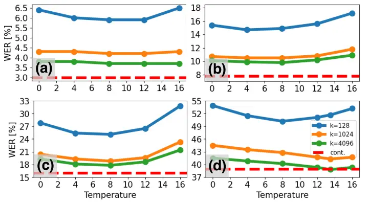

Onda Fukayama Saito Minematsu

# Leveraging Soft Distributions of SSL-Derived Discrete Speech Tokens for Downstream Inference

Kentaro    Satoru    Daisuke    Nobuaki

###### Abstract

Discrete speech tokens obtained from self-supervised learning (SSL)
models provide efficient data compression while maintaining strong
performance, and have been widely used as intermediate representations
in various tasks. However, discretization inevitably causes information
loss, leading to degraded performance compared with continuous SSL
features. In this work, we propose to apply soft token assignment only
during downstream inference. This approach preserves the efficiency of
hard discretization during training while enhancing the expressiveness
of the tokens at inference. The proposed method outperforms conventional
hard assignment on both ASR and speech synthesis tasks, and exhibits
particularly strong generalizability to out-of-domain data. For ASR of
non-native speech, it even surpasses models using continuous SSL
features. Moreover, analysis of the resulting representations shows they
align more accurately with phonemes compared with conventional hard
assignment.

###### keywords

discrete speech token, phonetic token, self-supervised learning,
representation learning, soft assignment

^(†)^(†)address: ¹ The University of Tokyo, Japan  
² National Institute of Advanced Industrial Science and Technology
(AIST), Japan ^(†)^(†)email: {ondakentaro, dsk_saito,
mine}@gavo.t.u-tokyo.ac.jp, s.fukayama@aist.go.jp

## 1 Introduction

Self-supervised learning (SSL) models pre-trained on large-scale speech
data have been widely used as powerful speech representations that
achieve high performance across a variety of downstream tasks \[1, 2, 3,
4, 5\]. While SSL models extract sequences of features from speech
signals, recent studies have actively explored discretizing these
continuous representations via k-means clustering and treating them as
discrete speech tokens \[6, 7\]. Such discrete tokens have been used as
“pseudo-text” in speech language models \[8, 9, 10, 11, 12, 13\] and as
intermediate representations for downstream tasks such as ASR and TTS
\[14, 15, 16\].

In particular, converting training data into discrete tokens in advance
enables efficient compression of large-scale speech corpora, which can
significantly reduce training time \[17, 18\]. The compression ratio can
be further improved by merging consecutive identical tokens
(deduplication) or by applying subword modeling to token sequences with
byte pair encoding (BPE) \[19, 20, 21\]. Moreover, discretization has
been reported to facilitate the disentanglement of speaker
characteristics and prosody from the representations\[22, 23, 24\], and
the resulting discrete tokens are known to exhibit strong correlations
with human-defined phonemes \[2, 25, 26\]. These findings suggest that
the use of discretized SSL features is promising not only from the
perspective of data compression but also for representational modeling
of linguistic information.

However, since the discretization process inevitably discards a
substantial amount of information compared to using the SSL features in
their original continuous form, it is well known that performance
degradation can occur in downstream tasks \[17, 7\]. To address this
issue, several approaches have been proposed, including the use of
multiple codebooks obtained from multiple SSL layers or residual k-means
clustering \[15, 27\], as well as preprocessing methods such as
independent component analysis \[28\] and temporal smoothing \[29, 30\].

In this study, we propose another approach that is compatible with these
methods, in which discrete tokens are softly represented by calculating
posterior probabilities over the token set. During training of the
downstream model, conventional hard discretization is applied as usual.
In contrast, at inference time, we perform soft token assignment to
represent the speech frame using posterior probability distributions
over the token set, computed from distances between continuous SSL
features and each cluster centroid. This framework preserves the
training-time efficiency achieved through information compression, while
increasing the amount of information available at inference time by
modeling the uncertainty of token assignments, aiming to improve
performance on downstream tasks.

The contributions of this study are summarized as follows:

- •
  Improved downstream performance: our method achieves improved
  inference-time performance on both ASR and speech synthesis tasks
  while preserving the efficient training enabled by conventional hard
  token assignment.
- •
  Improved generalizability on out-of-domain data: our method enables
  more accurate modeling of linguistic and prosodic information while
  preserving the speaker-robustness of discrete tokens, and demonstrates
  particularly strong generalizability on out-of-domain data. Notably,
  in ASR for non-native speech, it even outperforms systems based on
  continuous SSL representations.
- •
  Improved alignment with phoneme categories: analyses of the
  representations obtained by soft assignment reveals that they are more
  clearly separable according to phoneme categories than those derived
  from hard assignment.

## 2 Related work

### 2.1 HuBERT-Soft

HuBERT-Soft \[24\] is a method that takes into account the uncertainty
of token assignment described above. By fine-tuning HuBERT to predict
discrete tokens obtained via k-means clustering, it has been reported
that the resulting representations can more accurately capture
linguistic information while preserving the ability of discrete tokens
to disentangle speaker characteristics. However, HuBERT-soft is
essentially a fine-tuned HuBERT model, and its outputs are continuous
representations, although they exhibit token-like properties.
Consequently, when training downstream models, it cannot benefit from
the data compression advantages offered by genuinely discrete
representations. Moreover, since HuBERT-soft requires additional
training of the HuBERT model, the training cost is also high.

In this study, we investigate a method that uses pre-trained SSL models
and the token centroids without further retraining, applying soft
assignment only during downstream inference. This enables us to preserve
the training efficiency advantages of discrete tokens while improving
downstream performance.

### 2.2 Weighted sum of token embeddings

One approach to bridge the performance gap between discrete tokens and
continuous features is the use of multiple codebooks. In \[15\], the use
of tokens extracted from multiple SSL layers was proposed, and in
\[27\], a method for generating multiple codebooks from a single layer
using residual k-means clustering was also investigated. In these
studies, each codebook had its own embedding layer, and multiple streams
were integrated by taking a weighted sum of the resulting embeddings
across the codebooks before feeding them into the downstream model.
However, approaches based on multiple codebooks suffer from reduced data
compression efficiency, which is one of the key advantages of discrete
tokens.

In this work, we aim to more accurately represent information by taking
a weighted sum of token embeddings within a codebook. The method can be
applied with a single codebook without sacrificing compression
efficiency. The experiments mainly focus on the single-codebook setting,
while also evaluating its effectiveness when extended to multiple
codebooks.

## 3 Posterior-based soft assignment for downstream inference

### 3.1 Conventional hard token assignment

When discretizing an SSL feature vector $`\mathbf{x}`$, the standard
approach is to select the nearest centroid from a set of pre-trained
k-means centroids $`\{\mathbf{c}_{k}\}_{k=1}^{K}`$ based on the distance
$`D_{k}(\mathbf{x})`$:

```math
D_{k}(\mathbf{x})=\lVert\mathbf{x}-\mathbf{c}_{k}\rVert_{2}^{2},\quad q(\mathbf{x})=\arg\min_{k\in\{1,\dots,K\}}D_{k}(\mathbf{x}) \tag{1}
```

The resulting discrete token $`q(\mathbf{x})\in\{1,\dots,K\}`$ is then
converted into an input for a downstream model by an embedding layer
$`\mathbf{E}`$ that maps tokens back to continuous vectors. This
embedding layer consists of $`K`$ embedding vectors corresponding to the
$`K`$ centroids and is trained jointly with the downstream model. The
obtained embedding $`\mathbf{z}`$ is then fed into the downstream model
$`f_{\theta}(\cdot)`$:

```math
\mathbf{z}=\mathbf{E}_{q(\mathbf{x})},\quad\mathbf{y}=f_{\theta}(\mathbf{z}) \tag{2}
```

In conventional discrete-token-based downstream models, this hard
discretization is applied during both training and inference.

### 3.2 Proposed method: soft token assignment via posterior probabilities at inference time

In this study, while conventional hard discretization is applied during
training, we adopt a soft assignment strategy at inference time.
Specifically, based on the distances $`D_{k}(\mathbf{x})`$ to each
centroid defined in Eq. (1), we compute a soft assignment probability
$`p(k|\mathbf{x})`$ that $`\mathbf{x}`$ belongs to cluster $`k`$ by
applying a softmax. This formulation can also be viewed as the posterior
of an isotropic Gaussian mixture model with uniform priors. We then use
the weighted sum (i.e., expectation) of the corresponding embeddings
$`\mathbf{E}_{k}`$ as the input to the downstream model:

```math
\displaystyle p(k|\mathbf{x})=\frac{\exp(-D_{k}(\mathbf{x})/\tau)}{\sum_{j=1}^{K}\exp(-D_{j}(\mathbf{x})/\tau)}, \tag{3}
```

```math
\displaystyle\mathbf{z}=\sum_{k=1}^{K}p(k|\mathbf{x})\,\mathbf{E}_{k},\quad\mathbf{y}=f_{\theta}(\mathbf{z}) \tag{4}
```

This enables inference that accounts for the uncertainty of token
assignment while preserving the benefits of discretization during
training, and is therefore expected to improve performance on downstream
tasks. The softmax temperature parameter $`\tau`$ controls the sharpness
of the probability distribution when converting distances into posterior
probabilities; smaller values of $`\tau`$ make the distribution closer
to hard discretization. By searching for an optimal $`\tau`$ for each
task without retraining the model, inference-time performance can be
flexibly tuned.

## 4 Experiments

### 4.1 Experimental setup

In our experiments, we used HuBERT-large¹¹ 1
[https://hf.co/facebook/hubert-large-ll60k](https://hf.co/facebook/hubert-large-ll60k)
\[2\] and WavLM-large²² 2
[https://hf.co/microsoft/wavlm-large](https://hf.co/microsoft/wavlm-large)
\[3\], and generated discrete tokens from the outputs of the 21st layer
for both models, following \[17\]. For learning the centroids, we
applied k-means clustering to a randomly selected 30-hour subset of
LibriSpeech-100h \[31\]. We evaluated three settings for the number of
centroids: $`K=128,1024,`$ and $`4096`$.

### 4.2 ASR tasks

|        |       |         |         |             |               |        |      |
| ------ | ----- | ------- | ------- | ----------- | ------------- | ------ | ---- |
| SSL    | $`K`$ | Train   | Infer   | In-domain   | Out-of-domain |        |      |
|        |       | Assign. | Assign. | LibriSpeech | TED2          | CHiME4 | ERJ  |
| HuBERT | cont. | \-      | \-      | 3.1/5.7     | 10.5          | 52.7   | 50.5 |
|        | 1024  | soft    | soft    | 4.0/7.2     | 12.1          | 56.6   | 51.2 |
|        | 128   | hard    | hard    | 6.7/12.2    | 17.3          | 63.4   | 60.0 |
|        |       |         | soft    | 6.1/11.1    | 16.6          | 59.9   | 57.3 |
|        | 1024  | hard    | hard    | 4.3/7.7     | 12.9          | 59.0   | 51.1 |
|        |       |         | soft    | 4.2/7.3     | 12.5          | 56.5   | 49.4 |
|        | 4096  | hard    | hard    | 4.0/7.0     | 11.9          | 56.3   | 51.0 |
|        |       |         | soft    | 3.9/6.8     | 11.6          | 54.4   | 49.4 |
| WavLM  | cont. | \-      | \-      | 3.0/5.5     | 7.8           | 16.0   | 38.9 |
|        | 1024  | soft    | soft    | 3.9/6.6     | 10.3          | 19.4   | 43.4 |
|        | 128   | hard    | hard    | 6.4/11.3    | 15.4          | 27.8   | 53.9 |
|        |       |         | soft    | 5.9/10.2    | 14.9          | 25.1   | 51.7 |
|        | 1024  | hard    | hard    | 4.3/7.4     | 10.7          | 20.4   | 44.5 |
|        |       |         | soft    | 4.2/7.1     | 10.5          | 18.8   | 41.3 |
|        | 4096  | hard    | hard    | 3.8/6.6     | 10.1          | 19.3   | 41.5 |
|        |       |         | soft    | 3.7/6.3     | 9.8           | 17.8   | 38.8 |

Table 1: Recognition accuracy of models trained on LibriSpeech-100h for
in-domain and out-of-domain test sets: WER \[%\]($`\downarrow`$). The
higher accuracy between hard and soft assignment at inference is shown
in bold, and the highest accuracy overall is underlined. TED2 denotes
TED-LIUM v2

|       |       |               |               |                               |                  |                |                  |                          |                |                |                |                  |
| ----- | ----- | ------------- | ------------- | ----------------------------- | ---------------- | -------------- | ---------------- | ------------------------ | -------------- | -------------- | -------------- | ---------------- |
| SSL   | $`K`$ | Train Assign. | Infer Assign. | In-domain reconstruction (LJ) |                  |                |                  | Out-of-domain VC (TIMIT) |                |                |                |                  |
|       |       |               |               | MCD                           | F0 RMSE          | UTMOS          | WER              | PPG dist.                | F0 corr.       | SpkSim         | UTMOS          | WER              |
|       |       |               |               | ($`\downarrow`$)              | ($`\downarrow`$) | ($`\uparrow`$) | ($`\downarrow`$) | ($`\downarrow`$)         | ($`\uparrow`$) | ($`\uparrow`$) | ($`\uparrow`$) | ($`\downarrow`$) |
| WavLM | cont. | \-            | \-            | 4.17                          | 0.188            | 4.15           | 2.68             | 0.721                    | 0.501          | 0.727          | 3.89           | 3.07             |
|       | 128   | hard          | hard          | 5.80                          | 0.281            | 3.82           | 4.46             | 0.880                    | 0.430          | 0.799          | 3.60           | 21.22            |
|       |       |               | soft          | 5.58                          | 0.266            | 3.99           | 3.82             | 0.840                    | 0.447          | 0.807          | 3.80           | 16.17            |
|       | 1024  | hard          | hard          | 5.65                          | 0.290            | 3.81           | 3.00             | 0.837                    | 0.403          | 0.818          | 3.67           | 7.58             |
|       |       |               | soft          | 5.57                          | 0.287            | 3.86           | 3.27             | 0.808                    | 0.424          | 0.830          | 3.75           | 6.14             |
|       | 4096  | hard          | hard          | 5.61                          | 0.293            | 3.86           | 2.99             | 0.857                    | 0.371          | 0.806          | 3.59           | 6.72             |
|       |       |               | soft          | 5.46                          | 0.287            | 3.97           | 3.00             | 0.811                    | 0.397          | 0.820          | 3.82           | 5.12             |

Table 2: Resynthesis and voice conversion performance of models trained
on LJSpeech on in-domain and out-of-domain data

We trained discrete-token-based ASR models on LibriSpeech-100h \[31\]
and compared performance between hard assignment (discussed in 3.1) and
the proposed soft assignment (in 3.2) at inference time. We employed a
hybrid CTC/attention-based encoder-decoder model \[32\], and conducted
training and inference using ESPnet \[33\]. Evaluation was performed on
in-domain LibriSpeech test-{clean/other} sets, and three out-of-domain
datasets: TED-LIUM v2 (lectures) \[34\], CHiME4 (noisy speech;
single-channel real-recorded condition) \[35\], and ERJ (non-native
speech; 10% random subset of phonemically-balanced sentence set) \[36\].
For comparison, we also evaluated two topline systems: one using
continuous SSL features directly (cont.), and the other using soft
assignment during both training and inference (soft/soft). Since the SSL
models used in this study output 1024-dimensional features, the number
of clusters for the soft/soft condition was set to 1024 so that the
dimensionality for representing the input speech during training would
be the same. The softmax temperature parameter $`\tau`$ was set to
$`\tau=8.0`$ for LibriSpeech, TED-LIUM v2, and CHiME4, and $`\tau=13.5`$
for ERJ. The effect of varying $`\tau`$ is discussed in 4.5.

The results are shown in Table 1. For all in-domain and out-of-domain
conditions, using soft assignment at inference (hard/soft) consistently
improves recognition accuracy compared with hard assignment (hard/hard).
In particular, the effect of soft assignment is larger when the number
of clusters is small. Compared with the topline systems, the
continuous-feature-based model (cont.) generally achieves the highest
accuracy. However, for the out-of-domain ERJ set, the proposed method
outperforms the topline for HuBERT with $`K=1024,4096`$ and for WavLM
with $`K=4096`$. This may be because our method retains the ability of
discrete tokens to suppress irrelevant acoustic details, while enabling
more accurate modeling of segmental information. As a result, it
generalizes better to out-of-domain speech and is particularly effective
for non-native speech, which has large pronunciation variability.

When soft assignment is also applied during training (soft/soft),
performance consistently degrades compared with the continuous
feature-based model (cont.), despite having the same representation
size. Compared with hard/soft at $`K=1024`$, soft/soft performed better
on LibriSpeech and TED2, but worse on CHiME4 and ERJ. Moreover, models
trained with hard assignment (hard/hard and hard/soft) at $`K=4096`$
consistently outperform soft/soft ($`K=1024`$) while still retaining a
substantially higher compression efficiency than continuous
representations. These results indicate that soft assignment during
training, which does not benefit from data compression, cannot serve as
an effective alternative to continuous features. Instead, our approach,
using hard assignment during training and soft assignment only at
inference, offers a well-balanced trade-off between efficiency and
performance.

### 4.3 Speech synthesis tasks

We trained a vocoder to reconstruct speech from discrete tokens using
LJSpeech \[37\] and evaluated the effectiveness of the proposed method.
We employed HiFi-GAN \[38\] and evaluated in-domain resynthesis
performance on the LJSpeech test set, as well as any-to-one voice
conversion performance using out-of-domain TIMIT \[39\] as input. Due to
the speaker-invariant property of discrete tokens, the output speech is
expected to exhibit the speaker characteristics of LJSpeech even when
out-of-domain speech is provided as input\[23, 24\].

For resynthesis evaluation, we used Mel-Cepstral Distortion (MCD), F0
RMSE, UTMOS \[40\], and word error rate (WER) computed from Whisper
transcriptions (large-v3) \[41\]. For voice conversion, we used Phonetic
Posteriorgram Distance (PPG dist.), F0 correlation (F0 corr.), speaker
similarity to the target speaker of LJSpeeech (SpkSim), UTMOS, and WER.
PPG dist. was computed using neural PPGs³³ 3
[https://github.com/interactiveaudiolab/ppgs](https://github.com/interactiveaudiolab/ppgs)
\[42\], and speaker similarity was measured by the cosine similarity
between speaker embeddings extracted with ESPnet-SPK⁴⁴ 4
[https://hf.co/espnet/voxcelebs12_ecapa_wavlm_joint](https://hf.co/espnet/voxcelebs12_ecapa_wavlm_joint)
\[43\]. The softmax temperature parameter was set to $`\tau=8.0`$. Since
both SSL models exhibited similar trends in the previous section, we
report only the results for WavLM here.

The results are shown in Table 2. For all metrics except the WER in
in-domain resynthesis, the proposed method outperforms hard assignment.
Even for resynthesis WER, improvement is observed for $`K=128`$, with
only marginal degradation at the other cluster sizes. In terms of SpkSim
in out-of-domain voice conversion, the continuous-feature baseline
(cont.) yields the lowest scores, indicating that discrete tokens are
more effective at removing speaker characteristics from the input speech
than continuous SSL features. Across most metrics, the proposed method
exhibits intermediate performance between hard assignment and continuous
features, demonstrating that enriching discrete tokens with soft
assignment increases their representational capacity. For SpkSim as
well, although one might expect the proposed method to fall between
continuous features and hard assignment, it in fact outperforms both.
This suggests that our method preserves the speaker-robustness of
discrete tokens while more accurately capturing linguistic and prosodic
information, as shown in PPG dist. and F0 corr. results. Audio samples
are available on our website⁵⁵ 5
[https://ondatk68.github.io/onda-demo/projects/soft-token-inference/](https://ondatk68.github.io/onda-demo/projects/soft-token-inference/).
When the number of clusters is small, there are cases where the output
speech fails to preserve the original phonemes of the input speech with
hard assignment, whereas such phoneme replacements are mitigated with
soft assignment.

### 4.4 Analysis of the embedding space

To investigate how the proposed method improves the representation of
linguistic information, we analyzed the embedding space. First, for all
utterances in the TIMIT SX set, we computed an embedding vector
$`\mathbf{z}`$ for each frame with the embedding layers trained for both
ASR and speech resynthesis. For hard assignment, Eqs. (1) and (2) were
used, while for soft assignment, Eqs. (3) and (4) were applied with
$`\tau=8.0`$. We then collected a set of embedding vectors
$`\mathcal{Z}_{p}=\{\mathbf{z}^{(p)}_{i}\}_{i=1}^{N_{p}}`$ for each
phoneme class $`p\in\mathcal{P}\>(|\mathcal{P}|=61)`$, using the phoneme
alignment provided in TIMIT, and computed the mean vector
$`\boldsymbol{\mu}_{p}`$. To eliminate the effect of norm shrinkage
caused by weighted averaging in the soft assignment, we applied L2
normalization. Based on these, we define the intra-class variance
$`\mathrm{Intra}(p)`$ and the inter-class distance
$`\mathrm{Inter}(p,q)`$ between phoneme pairs:

```math
\displaystyle\boldsymbol{\mu}_{p}=\frac{1}{N_{p}}\sum_{i=1}^{N_{p}}\mathbf{z}^{(p)}_{i},\quad\tilde{\mathbf{z}}^{(p)}_{i}=\frac{\mathbf{z}^{(p)}_{i}}{\lVert\mathbf{z}^{(p)}_{i}\rVert_{2}},\quad\tilde{\boldsymbol{\mu}}_{p}=\frac{\boldsymbol{\mu}_{p}}{\lVert\boldsymbol{\mu}_{p}\rVert_{2}} \tag{5}
```

```math
\displaystyle\mathrm{Intra}(p)=\frac{1}{N_{p}}\sum_{i=1}^{N_{p}}\lVert\tilde{\mathbf{z}}^{(p)}_{i}-\tilde{\boldsymbol{\mu}}_{p}\rVert_{2}^{2}, \tag{6}
```

```math
\displaystyle\mathrm{Inter}(p,q)=\lVert\tilde{\boldsymbol{\mu}}_{p}-\tilde{\boldsymbol{\mu}}_{q}\rVert_{2}^{2} \tag{7}
```

Then we compute the intra-class variance by averaging
$`\mathrm{Intra}(p)`$ over all phonemes in $`\mathcal{P}`$, and the
inter-class variance by averaging $`\mathrm{Inter}(p,q)`$ over all
$`\frac{|\mathcal{P}|(|\mathcal{P}|-1)}{2}`$ phoneme pairs. Their ratio
(Inter/Intra) is then used as a measure of phoneme class separability,
inspired by the classical Fisher’s ratio \[44\].

The results are shown in Table3. For all the conditions, applying the
proposed method consistently reduces the intra-class variance. Although
the inter-class variance decreased slightly, likely because the
averaging operation tends to bring the resulting embeddings closer
together, the separability ratio showed an overall improvement. This
indicates that the proposed method makes embeddings of the same phoneme
more compact, and enables a clearer distinction between different
phonemes.

|       |       |        |                  |       |                  |       |       |      |
| ----- | ----- | ------ | ---------------- | ----- | ---------------- | ----- | ----- | ---- |
| SSL   | $`K`$ | Task   | Intra-class var. |       | Inter-class var. |       | Ratio |      |
|       |       |        | hard             | soft  | hard             | soft  | hard  | soft |
| WavLM | 128   | ASR    | 1.207            | 1.062 | 1.677            | 1.616 | 1.39  | 1.52 |
|       |       | Synth. | 1.155            | 0.992 | 1.517            | 1.439 | 1.31  | 1.45 |
|       | 1024  | ASR    | 1.456            | 1.363 | 1.833            | 1.813 | 1.26  | 1.33 |
|       |       | Synth. | 1.460            | 1.368 | 1.932            | 1.924 | 1.32  | 1.41 |
|       | 4096  | ASR    | 1.591            | 1.500 | 1.844            | 1.831 | 1.16  | 1.22 |
|       |       | Synth. | 1.629            | 1.546 | 1.923            | 1.917 | 1.18  | 1.24 |

Table 3: Intra- and inter-phoneme class variances in the computed
embedding space, along with their raio (inter/intra)



Figure 1: Change in WER on the ASR task with varying softmax temperature
parameter $`\tau`$ (WavLM-large): (a) test-clean, (b) TED-LIUM v2, (c)
CHiME4, (d) ERJ

### 4.5 Effect of the softmax temperature parameter

We investigated the effect of the softmax temperature parameter
$`\tau`$. For the ASR task discussed in 4.2, Figure 1 shows the change
in WER when varying $`\tau`$ at inference time. The value $`\tau=0`$
corresponds to the WER obtained with hard assignment.

In all cases, WER first decreases as $`\tau`$ increases, and then
increases after exceeding an optimal value. This can be explained by the
fact that when $`\tau`$ is too small, substantial information is lost
due to near-hard assignments, whereas when $`\tau`$ is too large, the
token posterior becomes overly uniform, preventing the model from
exploiting informative distinctions. We also observe that smaller
numbers of clusters tend to favor smaller optimal values of $`\tau`$.
However, no significant difference is observed between $`K=1024`$ and
$`K=4096`$. For in-domain (a) and out-of-domain lecture speech (b), the
effect of soft assignment is small when using large cluster sizes;
however, for out-of-domain noisy (c) and non-native speech (d),
relatively large improvements are observed even with $`K=1024`$ and
$`K=4096`$. This suggests that the proposed method is more effective
when the domain gap from the training data is large.

### 4.6 Extension to multiple codebooks

|                |       |         |           |             |               |        |      |
| -------------- | ----- | ------- | --------- | ----------- | ------------- | ------ | ---- |
| SSL / \#layers | $`K`$ | Train   | Infer     | In-domain   | Out-of-domain |        |      |
|                |       | Assign. | Assign.   | LibriSpeech | TED2          | CHiME4 | ERJ  |
| WavLM / 1      | 4096  | hard    | soft      | 3.7/6.3     | 9.8           | 17.8   | 38.8 |
| WavLM / 4      | 4096  | hard    | hard      | 3.6/6.4     | 9.7           | 21.1   | 44.1 |
|                |       |         | soft (i)  | 3.4/6.2     | 9.5           | 18.0   | 41.5 |
|                |       |         | soft (ii) | 3.4/6.2     | 9.5           | 17.6   | 39.1 |

Table 4: ASR results (WER\[%\]) with multiple SSL layers: soft (i) uses
same $`\tau`$ as in Table 1 for all layers, while soft (ii) uses
heuristically selected $`\tau`$ for each layer.

Lastly, we investigate whether the accuracy can be further improved by
combining our method with other approaches. Here, experiments were
conducted on ASR using multiple layers of the SSL model. Following
\[27\], we used four layers (layers 9, 15, 21, and 22) of WavLM-large,
and training was performed using a weighted sum of the embeddings from
each layer based on hard assignment. During inference, soft assignment
was applied to each layer, as in our previous experiments, prior to
layer aggregation. When applying soft assignment, we considered two
settings: (i) using the same $`\tau`$ as in Table 1 for all layers;
i.e., $`\tau=13.5`$ for ERJ and $`\tau=8.0`$ for the other datasets, and
(ii) using heuristically selected $`\tau`$ for each layer⁶⁶ 6
$`(\tau_{9},\tau_{15},\tau_{21},\tau_{22})`$ were set to (4.0, 6.0, 8.0,
12.0) for LibriSpeech, TED2, and CHiME4, and (32.0, 32.0, 13.5, 21.0)
for ERJ..

The results are shown in Table 4. In all cases, soft assignment improved
accuracy. Further gains from searching for an appropriate $`\tau`$ for
each layer were mainly observed on CHiME4 and ERJ, where soft (i) alone
still underperformed the single-layer results. In contrast, for
LibriSpeech and TED2, soft (i) already outperforms the single-layer
results and achieves near-optimal performance. This is likely because
introducing multiple layers encourages the model to focus more on
acoustic details, thereby weakening cross-domain generalization.
Nevertheless, even on these out-of-domain data, soft (ii) matched or
exceeded the single-layer setting, by flexibly tuning $`\tau`$ per layer
to control the information the model focuses on.

## 5 Conclusions

In this study, we proposed a method that applies soft token assignment
only at inference time for speech tasks that use discrete tokens as
intermediate representations. This enables more accurate inference while
preserving the training time efficiency provided by hard discretization.
Experiments on both ASR and speech synthesis confirmed that the proposed
method outperforms conventional hard assignment. The proposed method
enables more accurate representation of linguistic and prosodic
information while preserving the discrete-token property of discarding
irrelevant acoustic details, and shows strong performance particularly
on out-of-domain data with a larger domain gap. Furthermore, analyses of
the token embeddings demonstrated that the proposed method improves the
separability of phoneme classes. We also confirmed that applying the
method with multiple codebooks further improves performance.

In future work, we will extend the formulation to include deduplication
and BPE and evaluate its effectiveness in spoken language modeling, as
well as investigate efficient methods for finding optimal softmax
temperature parameter $`\tau`$.

## 6 Acknowledgments

This work was supported by AIST policy-based budget project “R&D on
Generative AI Foundation Models for the Physical Domain” and by JST
ACT-X JPMJAX25C7.

## 7 Generative AI Use Disclosure

Generative AI was used to refine the English expressions in this
manuscript.

## References

- \[1\] A. Baevski, Y. Zhou, A. Mohamed, and M. Auli (2020) Wav2vec 2.0:
  a framework for self-supervised learning of speech representations. In
  Advances in Neural Information Processing Systems, Vol. 33,
  pp. 12449–12460. Cited by: §1.
- \[2\] W. Hsu, B. Bolte, Y. H. Tsai, K. Lakhotia, R. Salakhutdinov,
  and A. Mohamed (2021) HuBERT: self-supervised speech representation
  learning by masked prediction of hidden units. IEEE/ACM Transactions
  on Audio, Speech, and Language Processing 29, pp. 3451–3460. External
  Links: [Document](https://dx.doi.org/10.1109/TASLP.2021.3122291) Cited
  by: §1, §1, §4.1.
- \[3\] S. Chen, C. Wang, Z. Chen, Y. Wu, S. Liu, Z. Chen, J. Li, N.
  Kanda, T. Yoshioka, X. Xiao, J. Wu, L. Zhou, S. Ren, Y. Qian, Y.
  Qian, M. Zeng, and F. Wei (2021) WavLM: large-scale self-supervised
  pre-training for full stack speech processing. IEEE Journal of
  Selected Topics in Signal Processing 16, pp. 1505–1518. External
  Links: [Link](https://api.semanticscholar.org/CorpusID:239885872)
  Cited by: §1, §4.1.
- \[4\] A. Mohamed, H. Lee, L. Borgholt, J. D. Havtorn, J. Edin, C.
  Igel, K. Kirchhoff, S. Li, K. Livescu, L. Maaløe, T. N. Sainath,
  and S. Watanabe (2022) Self-supervised speech representation learning:
  a review. IEEE Journal of Selected Topics in Signal Processing 16 (6),
  pp. 1179–1210. External Links:
  [Document](https://dx.doi.org/10.1109/JSTSP.2022.3207050) Cited by:
  §1.
- \[5\] S. Yang, P. Chi, Y. Chuang, C. J. Lai, K. Lakhotia, Y. Y.
  Lin, A. T. Liu, J. Shi, X. Chang, G. Lin, T. Huang, W. Tseng, K.
  Lee, D. Liu, Z. Huang, S. Dong, S. Li, S. Watanabe, A. Mohamed, and H.
  Lee (2021) SUPERB: speech processing universal performance benchmark.
  In Interspeech 2021, pp. 1194–1198. External Links:
  [Document](https://dx.doi.org/10.21437/Interspeech.2021-1775), ISSN
  2958-1796 Cited by: §1.
- \[6\] Y. Guo, Z. Li, H. Wang, B. Li, C. Shao, H. Zhang, C. Du, X.
  Chen, S. Liu, and K. Yu (2025) Recent advances in discrete speech
  tokens: a review. IEEE Transactions on Pattern Analysis and Machine
  Intelligence (), pp. 1–20. External Links:
  [Document](https://dx.doi.org/10.1109/TPAMI.2025.3643619) Cited by:
  §1.
- \[7\] P. Mousavi, G. Maimon, A. Moumen, D. Petermann, J. Shi, H.
  Wu, H. Yang, A. Kuznetsova, A. Ploujnikov, R. Marxer, B.
  Ramabhadran, B. Elizalde, L. Lugosch, J. Li, C. Subakan, P.
  Woodland, M. Kim, H. Lee, S. Watanabe, Y. Adi, and M. Ravanelli (2025)
  Discrete audio tokens: more than a survey!. Transactions on Machine
  Learning Research. Note: External Links: ISSN 2835-8856,
  [Link](https://openreview.net/forum?id=eqNchtvc6v) Cited by: §1, §1.
- \[8\] K. Lakhotia, E. Kharitonov, W. Hsu, Y. Adi, A. Polyak, B.
  Bolte, T. Nguyen, J. Copet, A. Baevski, A. Mohamed, and E.
  Dupoux (2021) On generative spoken language modeling from raw audio.
  Transactions of the Association for Computational Linguistics 9,
  pp. 1336–1354. Cited by: §1.
- \[9\] E. Kharitonov, A. Lee, A. Polyak, Y. Adi, J. Copet, K.
  Lakhotia, T. A. Nguyen, M. Riviere, A. Mohamed, E. Dupoux, and W.
  Hsu (2022) Text-free prosody-aware generative spoken language
  modeling. In Proceedings of the 60th Annual Meeting of the Association
  for Computational Linguistics (Volume 1: Long Papers), pp. 8666–8681.
  External Links: [Link](https://aclanthology.org/2022.acl-long.593),
  [Document](https://dx.doi.org/10.18653/v1/2022.acl-long.593) Cited by:
  §1.
- \[10\] T. A. Nguyen, E. Kharitonov, J. Copet, Y. Adi, W. Hsu, A.
  Elkahky, P. Tomasello, R. Algayres, B. Sagot, A. Mohamed, and E.
  Dupoux (2023) Generative spoken dialogue language modeling.
  Transactions of the Association for Computational Linguistics 11,
  pp. 250–266. External Links:
  [Link](https://aclanthology.org/2023.tacl-1.15/),
  [Document](https://dx.doi.org/10.1162/tacl%5Fa%5F00545) Cited by: §1.
- \[11\] Z. Borsos, R. Marinier, D. Vincent, E. Kharitonov, O.
  Pietquin, M. Sharifi, D. Roblek, O. Teboul, D. Grangier, M.
  Tagliasacchi, and N. Zeghidour (2023) AudioLM: a language modeling
  approach to audio generation. IEEE/ACM Trans. Audio, Speech and Lang.
  Proc. 31, pp. 2523–2533. External Links: ISSN 2329-9290,
  [Link](https://doi.org/10.1109/TASLP.2023.3288409),
  [Document](https://dx.doi.org/10.1109/TASLP.2023.3288409) Cited by:
  §1.
- \[12\] D. Zhang, S. Li, X. Zhang, J. Zhan, P. Wang, Y. Zhou, and X.
  Qiu (2023) SpeechGPT: empowering large language models with intrinsic
  cross-modal conversational abilities. In Findings of the Association
  for Computational Linguistics: EMNLP 2023, pp. 15757–15773. Cited by:
  §1.
- \[13\] S. Arora, K. Chang, C. Chien, Y. Peng, H. Wu, Y. Adi, E.
  Dupoux, H. Lee, K. Livescu, and S. Watanabe (2025) On the landscape of
  spoken language models: a comprehensive survey. Transactions on
  Machine Learning Research. Note: External Links: ISSN 2835-8856,
  [Link](https://openreview.net/forum?id=BvxaP3sVbA) Cited by: §1.
- \[14\] Y. Yang, F. Shen, C. Du, Z. Ma, K. Yu, D. Povey, and X.
  Chen (2024) Towards universal speech discrete tokens: a case study for
  ASR and TTS. In ICASSP 2024 - 2024 IEEE International Conference on
  Acoustics, Speech and Signal Processing (ICASSP), Vol. ,
  pp. 10401–10405. External Links:
  [Document](https://dx.doi.org/10.1109/ICASSP48485.2024.10447751) Cited
  by: §1.
- \[15\] P. Mousavi, J. Duret, S. Zaiem, L. Della Libera, A.
  Ploujnikov, C. Subakan, and M. Ravanelli (2024) How should we extract
  discrete audio tokens from self-supervised models?. In Interspeech
  2024, pp. 2554–2558. External Links:
  [Document](https://dx.doi.org/10.21437/Interspeech.2024-2135), ISSN
  2958-1796 Cited by: §1, §1, §2.2.
- \[16\] X. Chang, J. Shi, J. Tian, Y. Wu, Y. Tang, Y. Wu, S.
  Watanabe, Y. Adi, X. Chen, and Q. Jin (2024) The Interspeech 2024
  challenge on speech processing using discrete units. In Interspeech
  2024, pp. 2559–2563. External Links:
  [Document](https://dx.doi.org/10.21437/Interspeech.2024-1878), ISSN
  2958-1796 Cited by: §1.
- \[17\] X. Chang, B. Yan, K. Choi, J. Jung, Y. Lu, S. Maiti, R.
  Sharma, J. Shi, J. Tian, S. Watanabe, Y. Fujita, T. Maekaku, P.
  Guo, Y. Cheng, P. Denisov, K. Saijo, and H. Wang (2024) Exploring
  speech recognition, translation, and understanding with discrete
  speech units: a comparative study. In ICASSP 2024 - 2024 IEEE
  International Conference on Acoustics, Speech and Signal Processing
  (ICASSP), Vol. , pp. 11481–11485. External Links:
  [Document](https://dx.doi.org/10.1109/ICASSP48485.2024.10447929) Cited
  by: §1, §1, §4.1.
- \[18\] D. Wang, J. Li, M. Cui, D. Yang, X. Chen, and H. M. Meng (2025)
  Speech discrete tokens or continuous features? a comparative analysis
  for spoken language understanding in SpeechLLMs. In Proceedings of the
  2025 Conference on Empirical Methods in Natural Language Processing,
  pp. 24924–24935. External Links:
  [Link](https://aclanthology.org/2025.emnlp-main.1266/),
  [Document](https://dx.doi.org/10.18653/v1/2025.emnlp-main.1266), ISBN
  979-8-89176-332-6 Cited by: §1.
- \[19\] X. Chang, B. Yan, Y. Fujita, T. Maekaku, and S. Watanabe (2023)
  Exploration of efficient end-to-end ASR using discretized input from
  self-supervised learning. In Interspeech 2023, pp. 1399–1403. External
  Links: [Document](https://dx.doi.org/10.21437/Interspeech.2023-2051),
  ISSN 2958-1796 Cited by: §1.
- \[20\] F. Shen, Y. Guo, C. Du, X. Chen, and K. Yu (2024) Acoustic bpe
  for speech generation with discrete tokens. In ICASSP 2024 - 2024 IEEE
  International Conference on Acoustics, Speech and Signal Processing
  (ICASSP), Vol. , pp. 11746–11750. External Links:
  [Document](https://dx.doi.org/10.1109/ICASSP48485.2024.10446063) Cited
  by: §1.
- \[21\] A. Dekel and R. Fernandez (2024) Exploring the Benefits of
  Tokenization of Discrete Acoustic Units. In Interspeech 2024,
  pp. 2780–2784. External Links:
  [Document](https://dx.doi.org/10.21437/Interspeech.2024-533), ISSN
  2958-1796 Cited by: §1.
- \[22\] A. Polyak, Y. Adi, J. Copet, E. Kharitonov, K. Lakhotia, W.
  Hsu, A. Mohamed, and E. Dupoux (2021) Speech resynthesis from discrete
  disentangled self-supervised representations. In Interspeech 2021,
  pp. 3615–3619. External Links:
  [Document](https://dx.doi.org/10.21437/Interspeech.2021-475), ISSN
  2958-1796 Cited by: §1.
- \[23\] W. Huang, Y. Wu, and T. Hayashi (2021) Any-to-one
  sequence-to-sequence voice conversion using self-supervised discrete
  speech representations. In ICASSP 2021-2021 IEEE International
  Conference on Acoustics, Speech and Signal Processing (ICASSP),
  pp. 5944–5948. Cited by: §1, §4.3.
- \[24\] B. Van Niekerk, M. Carbonneau, J. Zaïdi, M. Baas, H. Seuté,
  and H. Kamper (2022) A comparison of discrete and soft speech units
  for improved voice conversion. In ICASSP 2022-2022 IEEE International
  Conference on Acoustics, Speech and Signal Processing (ICASSP),
  pp. 6562–6566. Cited by: §1, §2.1, §4.3.
- \[25\] D. Wells, H. Tang, and K. Richmond (2022) Phonetic Analysis of
  Self-supervised Representations of English Speech. In Interspeech
  2022, pp. 3583–3587. External Links:
  [Document](https://dx.doi.org/10.21437/Interspeech.2022-10884), ISSN
  2958-1796 Cited by: §1.
- \[26\] A. Sicherman and Y. Adi (2023) Analysing discrete self
  supervised speech representation for spoken language modeling. In
  ICASSP 2023 - 2023 IEEE International Conference on Acoustics, Speech
  and Signal Processing (ICASSP), Vol. , pp. 1–5. External Links:
  [Document](https://dx.doi.org/10.1109/ICASSP49357.2023.10097097) Cited
  by: §1.
- \[27\] J. Shi, X. Ma, H. Inaguma, A. Sun, and S. Watanabe (2024) MMM:
  multi-layer multi-residual multi-stream discrete speech representation
  from self-supervised learning model. In Interspeech 2024,
  pp. 2569–2573. External Links:
  [Document](https://dx.doi.org/10.21437/Interspeech.2024-2251), ISSN
  2958-1796 Cited by: §1, §2.2, §4.6.
- \[28\] T. Nakamura, K. Choi, K. Hojo, Y. Bando, S. Fukayama, and S.
  Watanabe (2025) Discrete speech unit extraction via independent
  component analysis. In SALMA: Speech and Audio Language Models -
  Architectures, Data Sources, and Training Paradigms, IEEE
  International Conference on Acoustics, Speech, and Signal Processing
  Workshops, Cited by: §1.
- \[29\] S. Kando, Y. Miyao, and S. Takamichi (2025) Exploring the
  Effect of Segmentation and Vocabulary Size on Speech Tokenization for
  Speech Language Models. In Interspeech 2025, pp. 5728–5732. External
  Links: [Document](https://dx.doi.org/10.21437/Interspeech.2025-310),
  ISSN 2958-1796 Cited by: §1.
- \[30\] K. Onda, S. Fukayama, D. Saito, and N. Minematsu (2025)
  Benchmarking prosody encoding in discrete speech tokens. In 2025 IEEE
  workshop on automatic speech recognition and understanding (ASRU),
  pp. 1–8. Cited by: §1.
- \[31\] V. Panayotov, G. Chen, D. Povey, and S. Khudanpur (2015)
  Librispeech: an ASR corpus based on public domain audio books. In 2015
  IEEE International Conference on Acoustics, Speech and Signal
  Processing (ICASSP), pp. 5206–5210. External Links:
  [Document](https://dx.doi.org/10.1109/ICASSP.2015.7178964) Cited by:
  §4.1, §4.2.
- \[32\] S. Kim, T. Hori, and S. Watanabe (2017) Joint CTC-attention
  based end-to-end speech recognition using multi-task learning. In 2017
  IEEE International Conference on Acoustics, Speech and Signal
  Processing (ICASSP), Vol. , pp. 4835–4839. External Links:
  [Document](https://dx.doi.org/10.1109/ICASSP.2017.7953075) Cited by:
  §4.2.
- \[33\] S. Watanabe, T. Hori, S. Karita, T. Hayashi, J. Nishitoba, Y.
  Unno, N. Enrique Yalta Soplin, J. Heymann, M. Wiesner, N. Chen, A.
  Renduchintala, and T. Ochiai (2018) ESPnet: end-to-end speech
  processing toolkit. In Interspeech 2018, pp. 2207–2211. External
  Links: [Document](https://dx.doi.org/10.21437/Interspeech.2018-1456),
  ISSN 2958-1796 Cited by: §4.2.
- \[34\] A. Rousseau, P. Deléglise, and Y. Estève (2014) Enhancing the
  TED-LIUM corpus with selected data for language modeling and more TED
  talks. In Proceedings of the Ninth International Conference on
  Language Resources and Evaluation (LREC’14), pp. 3935–3939. External
  Links: [Link](https://aclanthology.org/L14-1079/) Cited by: §4.2.
- \[35\] E. Vincent, S. Watanabe, A. A. Nugraha, J. Barker, and R.
  Marxer (2017) An analysis of environment, microphone and data
  simulation mismatches in robust speech recognition. Computer Speech &
  Language 46, pp. 535–557. Cited by: §4.2.
- \[36\] N. Minematsu, Y. Tomiyama, K. Yoshimoto, K. Shimizu, S.
  Nakagawa, M. Dantsuji, and S. Makino (2004) Development of English
  speech database read by Japanese to support CALL research. In ICA
  2004, pp. 557–560. Cited by: §4.2.
- \[37\] K. Ito and L. Johnson (2017) The lj speech dataset. Note:
  [https://keithito.com/LJ-Speech-Dataset/](https://keithito.com/LJ-Speech-Dataset/)
  Cited by: §4.3.
- \[38\] J. Kong, J. Kim, and J. Bae (2020) Hifi-gan: generative
  adversarial networks for efficient and high fidelity speech synthesis.
  Advances in Neural Information Processing Systems 33, pp. 17022–17033.
  Cited by: §4.3.
- \[39\] J. Garofolo, L. Lamel, W. Fisher, J. Fiscus, D. Pallett, N.
  Dahlgren, and V. Zue (1992) TIMIT acoustic-phonetic continuous speech
  corpus. Linguistic Data Consortium, pp. . Cited by: §4.3.
- \[40\] T. Saeki, D. Xin, W. Nakata, T. Koriyama, S. Takamichi, and H.
  Saruwatari (2022) UTMOS: UTokyo-SaruLab System for VoiceMOS Challenge 2022. In Interspeech 2022, pp. 4521–4525. External Links:
  [Document](https://dx.doi.org/10.21437/Interspeech.2022-439), ISSN
  2958-1796 Cited by: §4.3.
- \[41\] A. Radford, J. W. Kim, T. Xu, G. Brockman, C. Mcleavey, and I.
  Sutskever (2023) Robust speech recognition via large-scale weak
  supervision. In Proceedings of the 40th International Conference on
  Machine Learning, Vol. 202, pp. 28492–28518. External Links:
  [Link](https://proceedings.mlr.press/v202/radford23a.html) Cited by:
  §4.3.
- \[42\] C. Churchwell, M. Morrison, and B. Pardo (2024) High-fidelity
  neural phonetic posteriorgrams. In 2024 IEEE International Conference
  on Acoustics, Speech, and Signal Processing Workshops (ICASSPW),
  pp. 823–827. Cited by: §4.3.
- \[43\] J. Jung, W. Zhang, J. Shi, Z. Aldeneh, T. Higuchi, A.
  Gichamba, B. Theobald, A. Hussen Abdelaziz, and S. Watanabe (2024)
  ESPnet-SPK: full pipeline speaker embedding toolkit with reproducible
  recipes, self-supervised front-ends, and off-the-shelf models. In
  Interspeech 2024, pp. 4278–4282. External Links:
  [Document](https://dx.doi.org/10.21437/Interspeech.2024-1345), ISSN
  2958-1796 Cited by: §4.3.
- \[44\] R. A. Fisher (1936) The use of multiple measurements in
  taxonomic problems. Annals of eugenics 7 (2), pp. 179–188. Cited by:
  §4.4.
