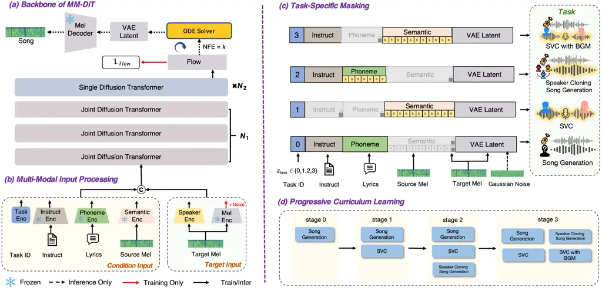

Zhang Qiang Wang Guo Yin Tian Hu Zuo Guo Ma Liang Zhang Xie

# Towards Unified Song Generation and Singing Voice Conversion with Accompaniment Co-Generation

Ziyu    Chunyu    Xiaopeng    Yuxin    Kang    Wenjie    Jingbin   
Tianlun    Zhao    Teng    Yuzhe    Chen    Lei

###### Abstract

While song generation and singing voice conversion (SVC) have evolved
significantly, they have long been developed isolated: the former lacks
zero-shot speaker cloning, while the latter overlooks
vocal-accompaniment synergy. To bridge this gap, we propose UniSinger,
the first end-to-end framework unifying speaker cloning song generation
and accompaniment co-generation SVC. Building on the multimodal
diffusion transformer, we construct a unified speaker embedding space
transferring speaker representation from SVC to song generation,
endowing fine-grained cross-task timbre control. To mitigate multi-task
optimization conflicts, we design a curriculum learning strategy using
task-specific modality masking to guide the model to gradually master
the generative mechanisms among semantic content, vocal timbre, and
accompaniment. Experiments show state-of-the-art performance on both
tasks and realizes complementary benefits, offering new possibilities
for intelligent music production.

###### keywords

song generation, singing voice conversion, accompaniment collaborative
generation

^(†)^(†)address: ¹ ASLP@NPU, Northwestern Polytechnical University,
China  
² Kuaishou Technology, China ³ Beijing Institute of Technology, China  
⁴ Institute of Automation, Chinese Academy of Sciences, China
^(†)^(†)email: ziyu_zhang@mail.nwpu.edu.cn, lxie@nwpu.edu.cn

## 1 Introduction

Recent breakthroughs in generative AI have driven the evolution of song
generation and SVC. Unified modeling of these two tasks holds
significant importance for advancing the field of music creation.
However, existing methods for both independent tasks still face
significant limitations. Specifically, for song generation, while
pioneering works \[1, 2\] and large-scale models \[3, 4\] established
robust text-to-song generation, they lack fine-grained vocal control.
Subsequent models \[5, 6, 7\] improved generation quality but still
struggle with speaker cloning. Although emerging methods \[8, 9\] have
achieved zero-shot voice cloning, they continue to treat song generation
and SVC as isolated problems. Conversely, regarding SVC, while
diffusion-based SVC models \[10, 11\] have achieved high-fidelity vocal
reconstruction, and recent advances \[12, 13\] have further improved
inference efficiency, these methods typically neglect the acoustic
synergy between vocals and background music (BGM). However, achieving
the unified modeling of these two tasks requires not only addressing
issues of individual tasks but also resolving the fundamental conflicts
arising from the deep integration of two heterogeneous tasks.

Specifically, unifying these two tasks is hindered by critical obstacles
at both the model and training paradigm levels. At the model level, SVC
is an Audio-to-Audio mapping task requiring acoustic inputs, while song
generation is a Text-to-Audio task driven by textual inputs. Therefore,
mapping heterogeneous inputs to a shared latent space within a unified
architecture is difficult. Moreover, establishing a unified cross-task
speaker injection mechanism proves highly challenging. Regarding the
training paradigm, SVC aims to achieve vocal timbre disentanglement,
whereas song generation focuses on creating melodies from scratch. These
differences create a dilemma for joint training. Naive multi-task
integration often leads to gradient conflicts and local optima where
model either neglects fine-grained vocal details or yields incoherent
musical structures.

To address these challenges, we propose UniSinger, the first framework
unifying speaker cloning song generation and accompaniment co-generation
SVC. At the model level, we employ a multi-modal input module to project
diverse inputs into a shared latent space, leveraging an MM-DiT backbone
for deep representation alignment. For speaker injection, we establish a
cross-task speaker embedding space to ensure fine-grained vocal control.
Finally, at the training paradigm level, we design a progressive
curriculum learning strategy with task-specific modality masking. By
selectively masking irrelevant modalities, this approach progressively
guides the model to master both reference-driven vocal synthesis and
text-driven accompaniment generation, thereby enhancing cross-modal
alignment. Building on this architecture, we further identify a
generalizable principle: the two tasks serve as mutual priors. Song
generation provides global musical structure to refine SVC’s prosody and
harmony, while SVC’s robust semantic modeling reduces pronunciation
errors in song generation. Audio samples are available here ¹¹ 1
 [https://ziyu6.github.io/UniSinger/](https://ziyu6.github.io/UniSinger/).
Our main contributions are summarized as follows:

- •
  We unify Song Generation and SVC for the first time, enabling
  fine-grained vocal control and accompaniment co-generation.
- •
  We propose an MM-DiT architecture with a unified speaker embedding
  space to achieve multi-modal alignment and cross-task timbre transfer.
- •
  We design a progressive curriculum learning strategy with
  task-specific modality masking to resolve gradient conflicts and
  achieve cross-modal alignment.
- •
  Experiments demonstrate state-of-the-art performance and identify
  generalizable inter-task mutual benefits.



Figure 1: The overall architecture of UniSinger. The left panel shows
the MM-DiT backbone and multi-modal input processing module. The right
panel details the progressive curriculum learning strategy with
task-specific modality masking.

## 2 Method

### 2.1 Overview

As shown in Figure 1, UniSinger consists of four core components: (1)
multi-modal input processing, which projects diverse conditions into a
shared latent space; (2) progressive curriculum learning, employing
task-specific modality masks to guide generation from foundational
synthesis to complex accompaniment coordination ; (3) cross-task speaker
embedding space, which ensuring consistent vocal identity preservation
across tasks; and (4) an MM-DiT backbone, which models audio latent
distributions via flow matching.

### 2.2 Multi-Modal Input Processing

In this section, we demonstrate the processing pipeline that transforms
raw multi-modal inputs into a unified joint representation. As shown in
Figure 1(b), we employ a suite of pre-trained encoders to project
multi-modal inputs into a shared latent space:

Instruct & Phonetic Encoder: We utilize a frozen Qwen2.5-7B \[14\] for
text instructions and a Zipformer-based \[15\] encoder for lyric
phonemes.

Semantic Encoder: We adopt a So-VITS-SVC ²² 2
 [https://github.com/RVC-Boss/GPT-SoVITS](https://github.com/RVC-Boss/GPT-SoVITS)
pipeline that cascades HuBERT \[16\] and Vector Quantization (VQ) \[17\]
to extract speaker-independent linguistic features.

Speaker Encoder: CAM++ \[18\] is employed to provide a global speaker
embedding for vocal identity.

Audio Codec: We train a VAE extending SecoustiCodec \[19\] to compress
44.1kHz audio into a $`1024\times`$ downsampled latent space, serving as
the DiT regression target.

Before entering the backbone, embeddings are integrated into two primary
streams: the condition input and the target input. The condition input
is formed by temporally concatenating masked instruction, phoneme, and
semantic embeddings. Global speaker embeddings are broadcast and
concatenated along the feature dimension to ensure consistent vocal
conditioning. For the target input, Gaussian noise is added to clean
latents during training, while inference initiates directly from noise.
Finally, $`C_{\text{cond}}`$ and $`C_{\text{target}}`$ are concatenated
temporally for joint modeling.

| Model              | PER$`\downarrow`$ | Spk-Sim$`\uparrow`$ | CLaMP 3$`\uparrow`$ | SongEval        |                 |                  |                 |                |
| ------------------ | ----------------- | ------------------- | ------------------- | --------------- | --------------- | ---------------- | --------------- | -------------- |
|                    |                   |                     |                     | Coh$`\uparrow`$ | Mem$`\uparrow`$ | NVBP$`\uparrow`$ | CSS$`\uparrow`$ | OM$`\uparrow`$ |
| SongLM  \[5\]      | 28.32%            | 55.43%              | 0.120               | 2.538           | 2.232           | 2.614            | 2.412           | 2.212          |
| YuE  \[9\]         | 22.14%            | 65.15%              | 0.249               | 3.723           | 3.681           | 3.278            | 3.423           | 3.458          |
| ACE-Step  \[20\]   | 26.72%            | 52.32%              | 0.117               | 3.322           | 2.817           | 2.902            | 2.823           | 3.165          |
| DiffRhythm+  \[8\] | 20.72%            | 64.21%              | 0.157               | 3.750           | 3.614           | 3.202            | 3.417           | 3.287          |
| UniSinger_Song     | 19.61%            | 68.85%              | 0.165               | 3.768           | 3.738           | 3.312            | 3.527           | 3.419          |

Table 1: The objective evaluation of song generation models. Best
results are in bold, and second-best results are underlined.

(a) Intelligibility

(b) Similarity

(c) Quality

Figure 2: Comparison of subjective metrics. (a) shows Intelligibility,
(b) demonstrates Similarity, and (c) presents the MOS Score.

### 2.3 Curriculum Learning with Task-Specific Masking

To mitigate multi-task optimization conflicts, we design a four-stage
progressive curriculum learning strategy, as shown in the right pannel
of Figure 1. This strategy is enabled by a task-specific modality
masking mechanism $`\mathcal{M}`$, formulated as:

```math
\begin{split}\tilde{c}_{m}&=\mathcal{M}(c_{m},z_{\text{task}})\\
&=\mathbb{I}(m\in\mathcal{S}_{z})\cdot c_{m}+(1-\mathbb{I}(m\in\mathcal{S}_{z}))\cdot\varnothing_{m}.\end{split} \tag{1}
```

where $`c_{m}`$ and $`\tilde{c}_{m}`$ denote the input and masked
embeddings for modality $`m`$, respectively. $`\mathbb{I}(\cdot)`$ is
the indicator function, and $`\varnothing_{m}`$ represents a learnable
null token for the dropped modality. $`\mathcal{S}_{z}`$ denotes the set
of active modalities determined by the task index $`z{\text{task}}`$. By
progressively manipulating $`\mathcal{S}_{z}`$, we guide the model
through the following stages.

Stage 0: General Song Generation. We condition the model exclusively on
text instructions and phonemes, denoted as
$`\mathcal{S}_{0}=\{c_{txt},c_{pho}\}`$, enabling model to learn to map
textual inputs to global musical attributes (e.g., genre, rhythm) and
coarse-grained vocal timbres (e.g., gender, age), establishing
foundational song generation capabilities..

Stage 1: General SVC. For SVC, the model is conditioned solely on
semantic embeddings and speaker embeddings, represented as
$`\mathcal{S}_{1}=\{c_{sem},c_{spk}\}`$. This creates an information
bottleneck that compels the model to rely exclusively on
$`c_{\text{spk}}`$ for speaker timbre reconstruction and establishing a
robust unified speaker space.

Stage 2: Speaker Cloning Song Generation. We integrate speaker
embeddings into song generation task with the input configuration
$`\mathcal{S}_{2}=\{c_{txt},c_{pho},c_{spk}\}`$. By combining vocal
identity ($`c_{\text{spk}}`$), linguistic content ($`c_{\text{txt}}`$)
and melodic information ($`c_{\text{pho}}`$), the model achieves
high-fidelity zero-shot speaker cloning within song generation paradigm.

Stage 3: Accompaniment Co-Generation SVC. Finally, we extend SVC by
introducing text instructions, formulated as
$`\mathcal{S}_{3}=\{c_{\text{txt}},c_{\text{sem}},c_{\text{spk}}\}`$.
This compels the model to disentangle information streams: extracting
linguistic content from semantic embeddings ($`c_{\text{sem}}`$),
fine-grained vocal timbre from speaker embeddings ($`c_{\text{spk}}`$),
and accompaniment attributes from text instructions
($`c_{\text{txt}}`$). Leveraging generative priors from the initial
stages, the model synthesizes accompaniment harmoniously coordinated
with the vocals.

### 2.4 Cross-Task Speaker Embedding Space

To ensure consistent vocal identity preservation across tasks, we
construct a Cross-task Speaker Embedding Space.

Speaker Representation via SVC. To ensure cross-task vocal control, we
use CAM++ feature as the speaker condition in SVC task. By training the
model to reconstruct the target vocal timbre using only semantic and
CAM++ feature, we build a unified cross-task speaker embedding space for
the following tasks.

Cross-Task Representation Transfer. Subsequently, this purified
embedding is introduced into the song generation task as a potent
acoustic prior. The model establishes a hierarchical control mechanism:
utilizing text instructions to govern global musical styles, while
employing the speaker embedding to precisely control fine-grained vocal
attributes.

### 2.5 MM-DiT Backbone

As shown in Figure 1(a), our framework employs an MM-DiT designed for
flow matching, comprising a bottom stack of $`N_{1}`$ Joint DiT Layers
and a top stack of $`N_{2}`$ Single DiT Layers.

Joint DiT Layers. The bottom $`N_{1}`$ layers are designed for
cross-modal interaction. We concatenate the Queries, Keys, and Values
from both text and audio modalities for joint attention processing. The
output is then split back into original streams to align linguistic
content with acoustic features.

Single DiT Layers. The top $`N_{2}`$ layers focus on refined audio
modeling. Here, the text modality is discarded, and the operation
reduces to self-attention on audio latents to polish fine-grained
acoustic details.

During training, the model receives a timestep $`t`$ and learns a
conditional velocity field $`v_{\theta}`$ to transform Gaussian noise
into the target VAE latent. The objective is defined as:

```math
\mathcal{L}_{\text{CFM}}=\mathbb{E}_{t,x_{t}}\left\lVert v_{\theta}(t,C_{\text{cond}},x_{t})-u(t,x_{t})\right\rVert^{2}, \tag{2}
```

where $`u(t,x_{t})`$ is the optimal flow path and $`C_{\text{cond}}`$
denotes the condition input derived from the multi-modal processing
module. During inference, an ODE solver integrates this field to
generate the target latent, which is then synthesized into waveform by
the Mel Decoder.

## 3 Experiments

### 3.1 Data and Training Details

We collected 30k hours of in-the-wild songs standardized to 44.1kHz. The
preprocessing pipeline follows a standard flow: audio is filtered by
SNR \[21\], segmented via VAD \[22\], and separated using Hybrid
Transformer Demucs \[23\] to obtain clean vocals. Transcripts are
generated via a voting mechanism across Whisper-Large-v3 \[24\] and
Qwen2.5-Omni \[25\]. Unified dense captions, incorporating fine-grained
annotations (e.g., genre, rhythm, demographics), are processed by
Qwen2.5-7B \[14\] to extract instruction embeddings.

We train the 1.54B parameter model (14 joint /6 single DiT layers, 1024
dff) using 20k hours of processed songs. For multi-task joint training,
an additional 5k-hour internal dataset of accompanied singing is
incorporated. The evaluation set comprises 500 balanced clips (15-20s)
from the internal corpus, covering gender (5M/5F) and language
(Chinese/English). Training uses Adam ($`lr=1e-4`$) on 16 NVIDIA A800
GPUs with a batch size of 8 per GPU.

|                                                                                                                     |                      |                     |                 |                                         |               |               |               |
| ------------------------------------------------------------------------------------------------------------------- | -------------------- | ------------------- | --------------- | --------------------------------------- | ------------- | ------------- | ------------- |
| Model                                                                                                               | Objective Evaluation |                     |                 | Subjective Evaluation (MOS)$`\uparrow`$ |               |               |               |
|                                                                                                                     | PER$`\downarrow`$    | Spk-Sim$`\uparrow`$ | FPC$`\uparrow`$ | Intelligibility                         | Similarity    | Quality       | Harmony       |
| HQ-SVC  \[11\]                                                                                                      | 0.187                | 0.627               | 0.801           | 3.787 ± 0.124                           | 3.678 ± 0.122 | 4.015 ± 0.124 | 3.412 ± 0.174 |
| NeuCoSVC  \[12\]                                                                                                    | 0.243                | 0.573               | 0.612           | 3.824 ± 0.201                           | 3.765 ± 0.114 | 3.899 ± 0.112 | 3.237 ± 0.188 |
| So-VITS-SVC ³³ 3 [https://github.com/svc-develop-team/so-vits-svc](https://github.com/svc-develop-team/so-vits-svc) | 0.154                | 0.700               | 0.743           | 3.910 ± 0.135                           | 3.733 ± 0.231 | 3.721 ± 0.201 | 3.522 ± 0.218 |
| UniSinger_SVC                                                                                                       | 0.151                | 0.712               | 0.771           | 3.912 ± 0.154                           | 3.758 ± 0.103 | 3.825 ± 0.107 | 3.764 ± 0.138 |
| UniSinger_SVC_BGM                                                                                                   | 0.167                | 0.687               | 0.655           | 3.785 ± 0.210                           | 3.612 ± 0.123 | 3.771 ± 0.143 | 3.891 ± 0.109 |

Table 2: Evaluation Results of SVC. The best results are in bold, and
second-best results are underlined.

### 3.2 Evaluation Metrics

We evaluate performance using objective metrics: Phoneme Error Rate
(PER) using FireRedASR \[26\], Speaker Similarity (Spk-Sim) using a
WavLM-based model \[27\], CLaMP 3 \[28\] for semantics, and SongEval
 \[29\] for music quality. SVC tasks also include Fréchet Audio Distance
(FAD) \[30\] and $`F_{0}`$ Pearson Correlation (FPC). Subjective Mean
Opinion Score (MOS) tests were conducted by 30 listeners across
musicality, quality, and intelligibility, plus a Harmony metric for
vocal-BGM coordination. For fair comparison, baseline SVC models use
SingSong to generate BGM.

### 3.3 Speaker Cloning Song Generation

We compare UniSinger against four representative state-of-the-art
models: SongLM, a language-model-based framework for text-to-song
generation; YuE, a large-scale model capable of generating full songs
with zero-shot speaker cloning; ACE-Step, a discrete token-based
generation approach; and DiffRhythm+, a diffusion-based model supporting
strict lyric alignment and speaker similarity. And we use the
UniSinger_Song to represent the song generation task model.

Table 1 summarizes the objective results. Regarding intelligibility, our
model achieves the lowest PER of 19.61%, surpassing the strong baseline
DiffRhythm+ of 20.72%. We attribute this precision to joint training
with SVC, which demands frame-level reconstruction and enhances phonemic
sensitivity. Second, UniSinger attains the highest Speaker Similarity of
68.85%, far exceeding standard text-to-music models like SongLM. This
validates the effectiveness of our Cross-task Speaker Space in
transferring vocal identity. Finally, regarding musicality, UniSinger
leads in most SongEval metrics, specifically Coherence and Melody,
demonstrating that unifying tasks facilitates structural integrity and
melodic richness. While YuE shows advantages in CLaMP 3, UniSinger
delivers a superior balance of acoustic fidelity, speaker control, and
competitive musical structure.

Figure 2 presents the subjective results. The large-scale model YuE
achieves the highest median scores in Similarity and Quality, which we
attribute to its massive 3B parameters and 650k hours of training data.
Nevertheless, UniSinger remains highly competitive, demonstrating
particular strength in linguistic clarity. As shown in Figure 2(a),
UniSinger matches the Intelligibility performance of YuE and visibly
outperforms DiffRhythm+. This aligns with the objective PER results in
Table 1, confirming that our strategy effectively refines pronunciation
without requiring massive parameters. Furthermore, regarding Similarity
and Quality, UniSinger significantly outperforms SongLM and ACE-Step and
rivals the strong baseline DiffRhythm+. This highlights that UniSinger
delivers high-fidelity generation with precise vocal control.

### 3.4 Singing Voice Conversion with Accompaniment

We compare UniSinger with three SVC models: NeuCoSVC, a neural
concatenative framework employing self-supervised feature matching;
So-VITS-SVC, a VITS-based model utilizing a SoftVC encoder for
content-timbre disentanglement; HQ-SVC, a zero-shot framework leveraging
decoupled audio codecs and DDSP-diffusion for low-resource scenarios.
Additionally, we use UniSinger_SVC and UniSinger_SVC_BGM to denote the
model variants for pure SVC tasks and for SVC tasks with accompaniment
co-generation.

As summarized in Table 2, UniSinger demonstrates superior performance in
content preservation and speaker similarity. Specifically, it achieves
the lowest PER of 0.151, surpassing the strong baseline So-VITS-SVC at
0.154. Additionally, UniSinger obtains the highest Spk-Sim score of
0.712, significantly outperforming all baselines. Regarding pitch
accuracy, UniSinger remains highly competitive with an FPC of 0.771,
ranking second only to HQ-SVC. For the accompaniment variant
UniSinger_BGM, integrating background music causes a slight expected
metric decline. However, it maintains remarkable robustness with a PER
of 0.167 and Spk-Sim of 0.687. Surprisingly, these scores outperform
dedicated dry-vocal baselines like HQ-SVC and NeuCoSVC. This confirms
that our architecture effectively manages complex acoustic interactions
while delivering vocal fidelity that rivals single-task systems.

For the subjective results, UniSinger achieves the highest
Intelligibility of 3.912, slightly surpassing So-VITS-SVC at 3.910,
while maintaining competitive Speaker Similarity. Although Audio Quality
trails HQ-SVC due to minor artifacts from in-the-wild training data, the
overall performance remains robust. For the accompaniment variant
UniSinger_BGM, while joint modeling introduces a slight expected
degradation in base metrics, it establishes a decisive advantage in
Harmony. With a score of 3.891, it significantly outperforms cascaded
baselines like HQ-SVC and NeuCoSVC. This confirms that our end-to-end
framework produces superior acoustic coherence and rhythmic synergy
compared to traditional multi-stage synthesis.

|                       |                   |                     |                     |
| --------------------- | ----------------- | ------------------- | ------------------- |
| Settings              | PER$`\downarrow`$ | Spk-Sim$`\uparrow`$ | Harmony$`\uparrow`$ |
| UniSinger_Song        | 19.61%            | 68.85%              | -                   |
| w/o Task Masking      | 25.83%            | 60.99%              | -                   |
| w/o SVC Stage         | 22.69%            | 53.24%              | -                   |
| w/o Speaker Broadcast | 18.23%            | 50.24%              | -                   |
| UniSinger_SVC_BGM     | 15.18%            | 68.43%              | 3.98                |
| w/o Song Gen Stage    | 16.23%            | 68.19%              | 2.83                |

Table 3: Ablation study on training strategies.

### 3.5 Ablation Study

Table 3 summarizes the ablation study. First, removing Task-Specific
Masking by naively concatenating all input modalities causes significant
degradation in both PER and Spk-Sim for song generation. This proves our
masking strategy is vital for resolving multi-task optimization
conflicts. Next, replacing our speaker embedding broadcasting with
direct global injection via AdaLN reveals a trade-off. Although AdaLN
improves PER, it severely compromises Spk-Sim, confirming our
broadcasting mechanism provides a superior balance between linguistic
clarity and fine-grained speaker cloning. Finally, evaluating the
multi-stage training reveals its necessity. Removing the SVC stage
significantly degrades Spk-Sim in song generation, while eliminating the
song generation stage causes a marked decline in the SVC Harmony metric.
Therefore, every stage of our progressive curriculum is indispensable
for unified performance.

## 4 Conclusion

We present UniSinger, the first end-to-end framework that unifies the
historically isolated paradigms of song generation and SVC. By
constructing a cross-task speaker embedding space, we successfully
bridge the gap between semantic understanding and acoustic control.
Furthermore, our curriculum learning strategy, driven by task-specific
modality masking, effectively resolves the optimization conflicts in
multi-task training. This approach not only enables the integration of
both tasks, but also facilitates reciprocal enhancement. By establishing
vocal-accompaniment synergy, our framework pioneers the new capability
of accompaniment co-generation SVC, offering an intelligent solution for
AI music production.

## 5 Generative AI Use Disclosure

During the preparation of this work, the authors used Gemini to assist
with refining the grammatical structure. The authors reviewed and edited
the output and take full responsibility for the content of the
publication.

## References

- \[1\] P. Dhariwal, H. Jun, C. Payne, J. W. Kim, A. Radford, and I.
  Sutskever (2020) Jukebox: a generative model for music. arXiv preprint
  arXiv:2005.00341. Cited by: §1.
- \[2\] A. Van Den Oord O. Vinyals et al. (2017) Neural discrete
  representation learning. Advances in neural information processing
  systems 30. Cited by: §1.
- \[3\] J. Copet, F. Kreuk, I. Gat, T. Remez, D. Kant, G. Synnaeve, Y.
  Adi, and A. Défossez (2023) Simple and controllable music generation.
  Advances in Neural Information Processing Systems 36, pp. 47704–47720.
  Cited by: §1.
- \[4\] A. Agostinelli, T. I. Denk, Z. Borsos, J. Engel, M. Verzetti, A.
  Caillon, Q. Huang, A. Jansen, A. Roberts, M. Tagliasacchi, et
  al. (2023) Musiclm: generating music from text. arXiv preprint
  arXiv:2301.11325. Cited by: §1.
- \[5\] C. Yang, S. Wang, H. Chen, J. Yu, W. Tan, R. Gu, Y. Xu, Y.
  Zhou, H. Zhu, and H. Li (2025) SongEditor: adapting zero-shot song
  generation language model as a multi-task editor. In Proceedings of
  the AAAI Conference on Artificial Intelligence, Vol. 39,
  pp. 25597–25605. Cited by: §1, Table 1.
- \[6\] S. Ding, Z. Liu, X. Dong, P. Zhang, R. Qian, C. He, D. Lin,
  and J. Wang (2024) Songcomposer: a large language model for lyric and
  melody composition in song generation. arXiv preprint
  arXiv:2402.17645. Cited by: §1.
- \[7\] Z. Ning, H. Chen, Y. Jiang, C. Hao, G. Ma, S. Wang, J. Yao,
  and L. Xie (2025) DiffRhythm: blazingly fast and embarrassingly simple
  end-to-end full-length song generation with latent diffusion. arXiv
  preprint arXiv:2503.01183. Cited by: §1.
- \[8\] H. Chen, Y. Jiang, G. Ma, C. Hao, S. Wang, J. Yao, Z. Ning, M.
  Meng, J. Luan, and L. Xie (2025) Diffrhythm+: controllable and
  flexible full-length song generation with preference optimization.
  arXiv preprint arXiv:2507.12890. Cited by: §1, Table 1.
- \[9\] R. Yuan, H. Lin, S. Guo, G. Zhang, J. Pan, Y. Zang, H. Liu, Y.
  Liang, W. Ma, X. Du, et al. (2025) Yue: scaling open foundation models
  for long-form music generation. arXiv preprint arXiv:2503.08638. Cited
  by: §1, Table 1.
- \[10\] S. Liu, Y. Cao, D. Su, and H. Meng (2021) Diffsvc: a diffusion
  probabilistic model for singing voice conversion. In 2021 IEEE
  Automatic Speech Recognition and Understanding Workshop (ASRU),
  pp. 741–748. Cited by: §1.
- \[11\] B. Bai, Y. Geng, F. Wang, C. Wang, P. Guo, Y. Gao, and Y.
  Li (2025) HQ-svc: towards high-quality zero-shot singing voice
  conversion in low-resource scenarios. arXiv preprint arXiv:2511.08496.
  Cited by: §1, Table 2.
- \[12\] B. Sha, X. Li, Z. Wu, Y. Shan, and H. Meng (2024) Neural
  concatenative singing voice conversion: rethinking concatenation-based
  approach for one-shot singing voice conversion. In ICASSP 2024-2024
  IEEE International Conference on Acoustics, Speech and Signal
  Processing (ICASSP), pp. 12577–12581. Cited by: §1, Table 2.
- \[13\] Y. Lu, Z. Ye, W. Xue, X. Tan, Q. Liu, and Y. Guo (2024)
  CoMoSVC: consistency model-based singing voice conversion. In 2024
  IEEE 14th International Symposium on Chinese Spoken Language
  Processing (ISCSLP), pp. 184–188. Cited by: §1.
- \[14\] B. Hui, J. Yang, Z. Cui, J. Yang, D. Liu, L. Zhang, T. Liu, J.
  Zhang, B. Yu, K. Lu, et al. (2024) Qwen2. 5-coder technical report.
  arXiv preprint arXiv:2409.12186. Cited by: §2.2, §3.1.
- \[15\] H. Zhu, W. Kang, Z. Yao, L. Guo, F. Kuang, Z. Li, W. Zhuang, L.
  Lin, and D. Povey (2025) ZipVoice: fast and high-quality zero-shot
  text-to-speech with flow matching. arXiv preprint arXiv:2506.13053.
  Cited by: §2.2.
- \[16\] W. Hsu, B. Bolte, Y. H. Tsai, K. Lakhotia, R. Salakhutdinov,
  and A. Mohamed (2021) Hubert: self-supervised speech representation
  learning by masked prediction of hidden units. IEEE/ACM transactions
  on audio, speech, and language processing 29, pp. 3451–3460. Cited by:
  §2.2.
- \[17\] R. Gray (1984) Vector quantization. IEEE Assp Magazine 1 (2),
  pp. 4–29. Cited by: §2.2.
- \[18\] H. Wang, S. Zheng, Y. Chen, L. Cheng, and Q. Chen (2023) Cam++:
  a fast and efficient network for speaker verification using
  context-aware masking. arXiv preprint arXiv:2303.00332. Cited by:
  §2.2.
- \[19\] C. Qiang, H. Wang, C. Gong, T. Wang, R. Fu, T. Wang, R.
  Chen, J. Yi, Z. Wen, C. Zhang, et al. (2025) Secousticodec:
  cross-modal aligned streaming single-codecbook speech codec. arXiv
  preprint arXiv:2508.02849. Cited by: §2.2.
- \[20\] J. Gong, S. Zhao, S. Wang, S. Xu, and J. Guo (2025) Ace-step: a
  step towards music generation foundation model. arXiv preprint
  arXiv:2506.00045. Cited by: Table 1.
- \[21\] D. H. Johnson (2006) Signal-to-noise ratio. Scholarpedia 1
  (12), pp. 2088. Cited by: §3.1.
- \[22\] J. Sohn, N. S. Kim, and W. Sung (1999) A statistical
  model-based voice activity detection. IEEE signal processing letters 6
  (1), pp. 1–3. Cited by: §3.1.
- \[23\] S. Rouard, F. Massa, and A. Défossez (2023) Hybrid transformers
  for music source separation. In ICASSP 2023-2023 IEEE International
  Conference on Acoustics, Speech and Signal Processing (ICASSP),
  pp. 1–5. Cited by: §3.1.
- \[24\] N. Cao, Y. Lin, X. Sun, D. Lazer, S. Liu, and H. Qu (2012)
  Whisper: tracing the spatiotemporal process of information diffusion
  in real time. IEEE transactions on visualization and computer graphics
  18 (12), pp. 2649–2658. Cited by: §3.1.
- \[25\] J. Xu, Z. Guo, J. He, H. Hu, T. He, S. Bai, K. Chen, J.
  Wang, Y. Fan, K. Dang, et al. (2025) Qwen2. 5-omni technical report.
  arXiv preprint arXiv:2503.20215. Cited by: §3.1.
- \[26\] K. Xu, F. Xie, X. Tang, and Y. Hu (2025) Fireredasr:
  open-source industrial-grade mandarin speech recognition models from
  encoder-decoder to llm integration. arXiv preprint arXiv:2501.14350.
  Cited by: §3.2.
- \[27\] S. Chen, C. Wang, Z. Chen, Y. Wu, S. Liu, Z. Chen, J. Li, N.
  Kanda, T. Yoshioka, X. Xiao, et al. (2022) Wavlm: large-scale
  self-supervised pre-training for full stack speech processing. IEEE
  Journal of Selected Topics in Signal Processing 16 (6), pp. 1505–1518.
  Cited by: §3.2.
- \[28\] S. Wu, G. Zhancheng, R. Yuan, J. Jiang, S. Doh, G. Xia, J.
  Nam, X. Li, F. Yu, and M. Sun (2025) Clamp 3: universal music
  information retrieval across unaligned modalities and unseen
  languages. In Findings of the Association for Computational
  Linguistics: ACL 2025, pp. 2605–2625. Cited by: §3.2.
- \[29\] J. Yao, G. Ma, H. Xue, H. Chen, C. Hao, Y. Jiang, H. Liu, R.
  Yuan, J. Xu, W. Xue, et al. (2025) SongEval: a benchmark dataset for
  song aesthetics evaluation. arXiv preprint arXiv:2505.10793. Cited by:
  §3.2.
- \[30\] K. Kilgour, M. Zuluaga, D. Roblek, and M. Sharifi (2018)
  Fr$`\backslash`$’echet audio distance: a metric for evaluating music
  enhancement algorithms. arXiv preprint arXiv:1812.08466. Cited by:
  §3.2.
