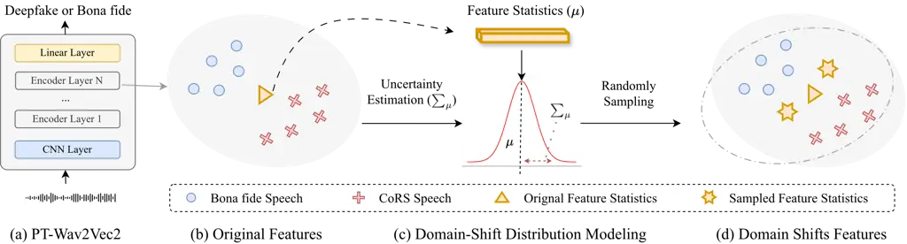
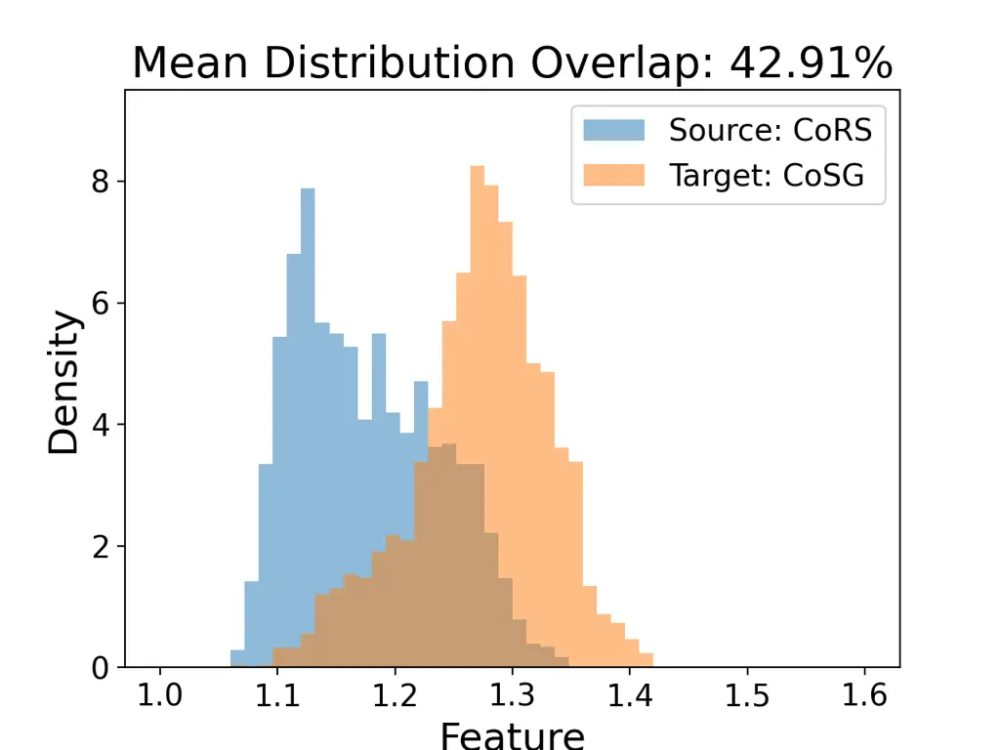
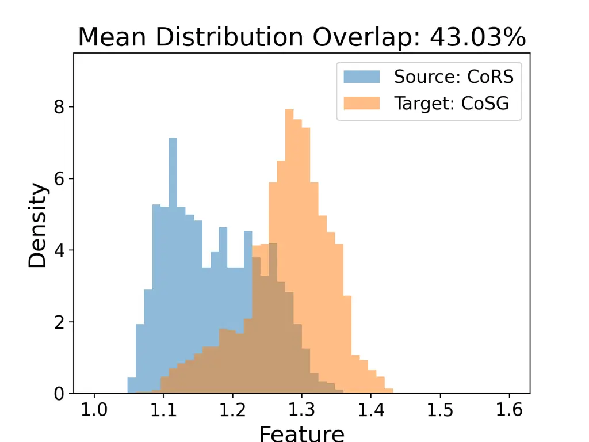
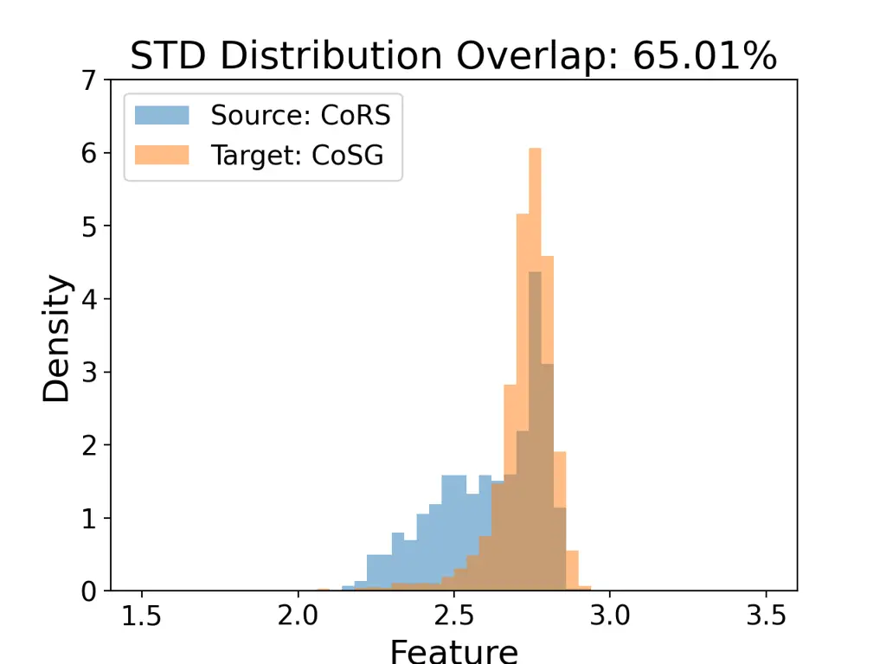
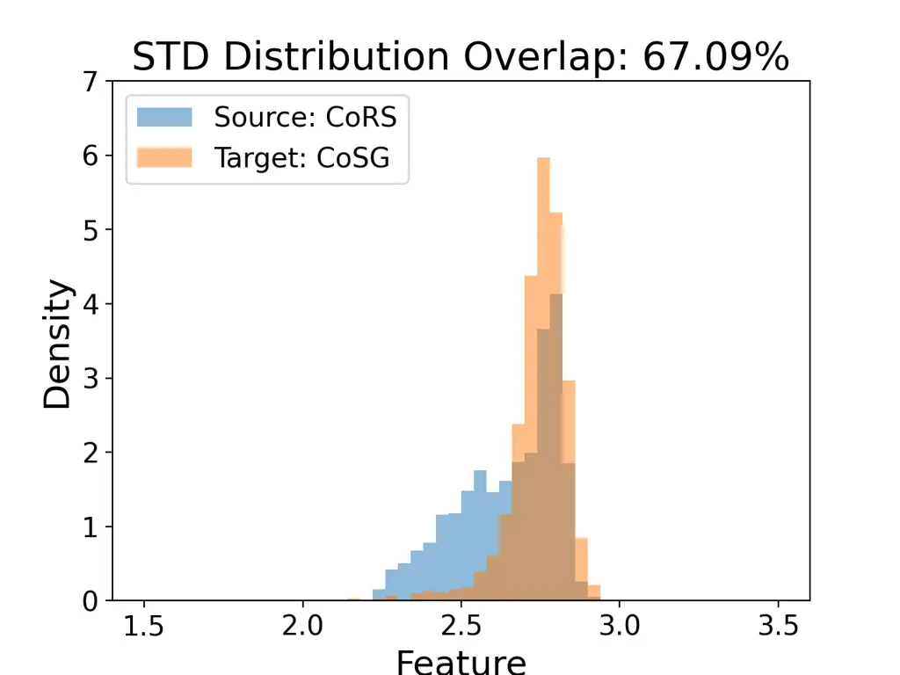

Chen Wu Lu Lin Wu \authorbreakLee Jang

Graduate Institute of Communication EngineeringNational Taiwan
University Graduate Institute of Networking and MultimediaNational
Taiwan University Department of Information ManagementNational Taiwan
University NTU Artificial Intelligence Center of Research Excellence
(NTU AI-CoRE)

# Mitigating Proxy-to-Wild Domain Gap in Deepfake Speech

Xuanjun    Yun-Shing    Wei-Chung    Claire    Haibin    Hung-yi   
Jyh-Shing Roger Affiliation:  Affiliation:  Affiliation:  Affiliation: 

###### Abstract

Recent neural audio codec-based speech generation (CodecFake) produces
highly realistic audio, posing a challenge to existing deepfake
countermeasure models. While using codec resynthesized speech (CoRS) as
proxy data improves performance, it often suffers from limited
generalization. We propose Domain-Shift Feature Augmentation (DSFA),
which simulates “in-the-wild” variations by transforming deterministic
feature statistics into stochastic distributions during fine-tuning. To
evaluate generalization, we further introduce Codec-based Speech
Generation Extension Evaluation (CoSG ExtEval) dataset, a more
challenging extension of the CoSG Eval (from CodecFake+) dataset,
featuring 40 unseen generative models and long-form audio. Experimental
results demonstrate that combining a post-trained SSL backbone with DSFA
effectively narrows the proxy-to-wild domain gap. This approach achieves
state-of-the-art performance across diverse CodecFake attacks in both
CoSG Eval and CoSG ExtEval.

###### keywords

Audio deepfake detection, CodecFake, Anti-spoofing, Neural audio codec

## 1 Introduction

Advances in speech generation technologies have greatly improved the
naturalness and controllability of synthetic speech. While these
developments enable a wide range of beneficial applications, they also
introduce serious security risks when misused for malicious audio
deepfake attacks, such as misinformation dissemination, identity
impersonation, and social manipulation. To address these threats,
community-driven efforts including the ASVspoof \[1, 2, 3\] and ADD \[4,
5\] challenges have fostered substantial progress in deepfake speech
detection. However, the rapid evolution of speech generation paradigms
continues to challenge existing countermeasures (CMs).

Recently, data-driven neural audio codecs \[6, 7\] have emerged as a
core component in modern speech generation pipelines, enabling
codec-based speech generation (CoSG) systems \[8\]. Unlike earlier
deepfake methods that relied primarily on vocoders to synthesize
waveforms from acoustic features, CoSG systems reconstruct speech from
discrete codec representations, leading to a new class of fake speech
with artifact characteristics fundamentally different from those
considered in prior anti-spoofing benchmarks. These systems are capable
of generating high-fidelity speech and even cloning unseen speakers from
only a few seconds of reference audio, often producing samples that are
difficult for humans to distinguish from genuine speech. We refer to the
task of detecting fake speech produced by such systems as CodecFake
detection.

Existing studies \[9, 10\] demonstrated that CMs trained on conventional
anti spoofing datasets exhibit poor generalization performance when
faced with CodecFake attacks. To address this limitation, recent
research has proposed the use of codec resynthesized speech, referred to
as CoRS, which is obtained by encoding and decoding genuine utterances
through neural audio codecs, as a form of proxy training data. CoRS
speech shares reconstruction artifacts with CodecFake speech, as both
originate from the decoding of discrete codec representations.
Consequently, incorporating CoRS data into the training process has been
shown to significantly enhance the performance of CodecFake detection
systems. Despite its effectiveness, the use of resynthesized proxy data
\[11, 12\] introduces a new challenge: CMs may overly rely on
codec-specific or dataset-specific artifacts present in the CoRS
training data, resulting in degraded generalization to unseen codecs or
CoSG systems. Given the rapid development of CodecFake, overcoming the
generalization bottleneck inherent in resynthesized proxy data is
critical for building CodecFake detection systems.

In this paper, we address the proxy-to-wild domain gap in CodecFake
detection. We first leverage a post-trained SSL backbone to establish a
versatile representation space sensitive to deepfake artifacts. Building
on this, we propose Domain-Shift Feature Augmentation (DSFA) to improve
generalization ability by modeling domain uncertainty through batch-wise
statistical perturbations. To rigorously test our approach, we further
collect Codec-based Speech Generation Extension Evaluation (CoSG
ExtEval) dataset, covering a broad spectrum of recent generation
paradigms. Our experiments and visualizations demonstrate that DSFA
promotes domain-invariant features, significantly enhancing detection
performance against evolving real-world spoofing threats.



Figure 1: Overview of the Domain Shift Feature Augmentation (DSFA)
method. The proposed method estimates feature statistics $`\mu`$ and
$`\sigma`$ to construct probabilistic distributions for sampling. For
visual clarity, only the mean statistic $`\mu`$ is illustrated in this
figure.

## 2 The Proxy-to-Wild Domain Gap in Deepfake Speech

Training CMs on proxy data is a cost-effective alternative to collecting
diverse TTS/VC speech \[9, 10, 13, 14, 15\], yet an inherent domain gap
persists, hindering generalization to “in-the-wild” scenarios. We
categorize this gap into three dimensions: (1) Artifact Mismatch: Unseen
codecs and generative models introduce unique signatures. Absent from
training data \[16\], these novel artifacts often lead to detection
failure. (2) Silence Mismatch: Inconsistent pauses at utterance
boundaries disrupt codec-signature alignment, causing models to overfit
to background noise in silent segments rather than robust features \[11,
17\]. (3) Content and Speaker Mismatch: Unseen phonetic and prosodic
patterns outside the learned distribution impair the model’s ability to
distinguish bona fide from spoofed attributes \[11\]. To overcome these
systemic gaps, it is essential to move beyond fixed proxy distributions
and explicitly model potential domain shifts during CMs training
process.

## 3 Proposed Method

Our framework (Fig. 1) bridges the proxy-to-wild domain gap by: (1)
leveraging a deepfake-tailored post-trained SSL backbone to establish a
versatile representation space, and (2) employing Domain-Shift Feature
Augmentation (DSFA) during fine-tuning to simulate unseen domain
variations.

### 3.1 Post-Training Self-Supervised Learning Backbone

We initialize our model with a Self-Supervised Learning (SSL) backbone
specifically post-trained for deepfake detection on a large-scale,
heterogeneous corpus \[18\] (Fig. 1a). Unlike general-purpose models
\[19, 20\], this backbone provides heightened sensitivity to deepfake
artifacts and diverse bona fide attributes. By inheriting robust
representations across varied speaker identities and codec signatures,
the model establishes a versatile feature space that serves as a stable
foundation for the subsequent Domain-Shift Aware fine-tuning.

### 3.2 Domain-Shift Aware Fine-Tuning

To address the performance degradation of CMs on unseen data, we propose
a fine-tuning framework centered on Domain-Shift Feature Augmentation
(DSFA) method. Unlike standard fine-tuning that minimizes empirical risk
on fixed proxy datasets, our approach utilizes DSFA to explicitly
account for potential discrepancies between proxy and target
distributions (Fig. 1b-d). By exposing the model to a broader range of
simulated domain variations, this mechanism prevents the CMs from
overfitting to proxy-specific signatures, such as those artifacts in
Codec Resynthesis (CoRS) speech, thereby enhancing generalization to
diverse in-the-wild scenarios. As illustrated in Fig. 1b-c, the DSFA
process facilitates this domain-aware adaptation through three primary
stages: Original Feature Statistics Estimation, Domain-Shift
Distribution Modeling, and Augmentation via Domain-Shift Sampling.

Original Feature Statistics Estimation. To capture a compact
representation of the domain “style,” we first extract instance-level
statistics from the SSL backbone’s latent feature map
$`x\in\mathbb{R}^{B\times C\times T}`$. Specifically, we compute the
channel-wise mean $`\mu(x)\in\mathbb{R}^{B\times C}`$ and standard
deviation $`\sigma(x)\in\mathbb{R}^{B\times C}`$ as follows:

```math
\displaystyle\mu_{b,c}(x) \displaystyle=\mathbb{E}_{t}[x_{b,c,t}], \tag{1}
```

```math
\displaystyle\sigma^{2}_{b,c}(x) \displaystyle=\mathbb{E}_{t}\big[(x_{b,c,t}-\mu_{b,c})^{2}\big].
```

These statistics encapsulate critical domain characteristics, such as
acoustic styles and codec signatures. In our context, the domain gap
between CoRS proxy data and “in-the-wild” CoSG samples manifests as
significant shifts in these statistics. By treating $`\mu`$ and
$`\sigma`$ as controllable targets, we can simulate the transition from
fixed proxy distributions to unforeseen CoSG variations during training.

Domain-Shift Distribution Modeling. To simulate the shift from CoRS to
CoSG, we transform deterministic feature statistics into stochastic
distributions. Drawing inspiration from latent space analysis \[21,
22\], we leverage feature variance to model the potential directions of
domain shifts. This allows the model to simulate unseen domain
variations by quantifying fluctuations within the proxy data. Rather
than treating $`\mu(x)`$ and $`\sigma(x)`$ as fixed constants, we model
their potential discrepancies as probabilistic distributions, using
mini-batch variance as a proxy for domain uncertainty:

```math
\displaystyle\Sigma^{2}_{\mu}(x) \displaystyle=\frac{1}{B}\sum_{i=1}^{B}\big(\mu(x_{i})-\mathbb{E}_{b}[\mu(x)]\big)^{2}, \tag{2}
```

```math
\displaystyle\Sigma^{2}_{\sigma}(x) \displaystyle=\frac{1}{B}\sum_{i=1}^{B}\big(\sigma(x_{i})-\mathbb{E}_{b}[\sigma(x)]\big)^{2},
```

where $`\Sigma^{2}_{\mu}(x)`$ and $`\Sigma^{2}_{\sigma}(x)`$ encapsulate
the statistical diversity present in the current training iteration.
These variances provide a data-driven basis for sampling perturbed
domain “styles” that extend beyond the static boundaries of the CoRS
dataset, effectively bridging the gap to unseen CoSG variations.

Augmentation via Domain Shifts Sampling. To simulate potential
“in-the-wild” variations, the DSFA module transforms deterministic
feature statistics into stochastic representations via a unified
perturbation scheme. Specifically, the original mean $`\mu(x)`$ and
standard deviation $`\sigma(x)`$ are augmented as:

```math
\beta(x)=\mu(x)+\epsilon_{\mu}\cdot\Sigma_{\mu},\qquad\gamma(x)=\sigma(x)+\epsilon_{\sigma}\cdot\Sigma_{\sigma}, \tag{3}
```

```math
\epsilon=\begin{cases}\mathcal{U}(-1,1),&\text{Uniform},\\
\mathcal{N}(0,1),&\text{Gaussian},\end{cases} \tag{4}
```

where $`\epsilon`$ represents stochastic noise and $`\Sigma_{\mu}`$,
$`\Sigma_{\sigma}`$ modulates the perturbation magnitude. To ensure
end-to-end differentiability, we employ the re-parameterization trick to
decouple the randomness from the optimization process. The Uniform
strategy utilizes the estimated batch-wise uncertainty $`\Sigma(x)`$ to
bound the potential shifts, whereas the Gaussian strategy introduces
standard normal noise to model the statistical fluctuations.

Following the sampling of perturbed statistics $`\beta(x)`$ and
$`\gamma(x)`$, the augmented feature map is synthesized using the
Adaptive Instance Normalization (AdaIN) \[23\] mechanism:

```math
\text{DSFA}(x)=\gamma(x)\left(\frac{x-\mu(x)}{\sigma(x)}\right)+\beta(x). \tag{5}
```

To maintain representation stability, this augmentation is applied
stochastically with probability $`p`$ during training:

```math
\hat{x}=\mathbb{I}[p_{0}<p]\cdot\text{DSFA}(x)+(1-\mathbb{I}[p_{0}<p])\cdot x, \tag{6}
```

where $`p_{0}\sim\mathcal{U}(0,1)`$ and $`\mathbb{I}`$ is the indicator
function. This strategy encourages the model to learn representations
invariant to statistical fluctuations, enhancing robustness against
unpredictable domain shifts.

Loss Function. To enhance discriminability, we employ a joint training
objective combining supervised contrastive (SupCon) \[24\] and
cross-entropy (CE) losses:

```math
\mathcal{L}_{total}=\mathcal{L}_{CE}+\lambda\cdot\mathcal{L}_{SupCon} \tag{7}
```

where $`\lambda`$ is a balancing hyperparameter. By optimizing this
joint objective, the model is encouraged to learn a more compact and
discriminative embedding space, ensuring that the domain-invariant
features synthesized by DSFA remain robust across diverse spoofing
scenarios.

### 3.3 Codec-based Speech Generation Extension Evaluation

In addition to the original CoSG evaluation set (CoSG Eval) in
CodecFake+, we also construct an extended evaluation dataset, referred
to as CoSG ExtEval ¹¹ 1 The CoSG ExtEval evaluation set and details will
be released on the Github repository after the paper is accepted. , to
further assess model generalization under more diverse and challenging
conditions. The CoSG ExtEval dataset is collected by gathering spoofed
speech samples generated from a broader set of recent codec-based speech
generation models, primarily sourced from official demo pages and public
repositories of state-of-the-art CoSG systems, as summarized in Table 1.
Compared to the original CoSG Eval set, CoSG ExtEval encompasses a
broader spectrum of models, spanning diverse codec designs, tokenization
strategies, and generation paradigms, such as autoregressive,
non-autoregressive, diffusion-based, and multi-stage architectures.

All audio samples are generated using unseen systems without any overlap
with the training data. This extension is designed to better reflect
real-world attack scenarios, where spoofed speech may originate from
continuously evolving and previously unknown generation models, thereby
providing a more rigorous benchmark for evaluating robustness and
overfitting in CodecFake detection.

## 4 Experimental Setup

We conduct experiments using the CodecFake+ \[10\] dataset, where CoRS
(speech resynthesized by neural audio codecs) is employed for training
and CoSG (speech from codec-based generation models) is used for
evaluation. CoRS contains spoofed samples from 31 neural codecs applied
to the VCTK corpus \[25\]. Following previous work \[10\], we adopt the
taxonomy-guided balanced sampling from CoRS training dataset to select a
subset of 42,965 bona fide and 42,965 spoofed samples. Specifically, we
utilize the DEC balanced subset, ensuring equal representation across
decoder types (time/frequency). For evaluation, we use CoSG Eval sets
comprising 17 codec-based generation models sourced from their official
demo pages, which reflects realistic scenarios involving unseen
generative systems.

We adopt the post-trained Wav2Vec2-Large-AntiDeepfake model as the CM
backbone ²² 2
https://huggingface.co/nii-yamagishilab/xls-r-2b-anti-deepfake. All
inputs raw waveforms sampled at 16 kHz, cut into 4-seconds when
training, with RawBoost \[26\] applied for basic data augmentation.
Models are trained on a 3090 GPU with a batch size of 14, using the Adam
optimizer with an initial learning rate of $`1\times 10^{-6}`$ and
weight decay of $`1\times 10^{-4}`$. Cross-entropy loss is used for
training, with the weight (0.1, 0.9) as we emphasize the bona fide
samples. Performance is evaluated using Equal Error Rate (EER %), where
lower values indicate better detection performance.

| Eval Set      | Types     | Sample | Models | DUR (h) | Min / Mean / Max (s) |
| ------------- | --------- | ------ | ------ | ------- | -------------------- |
| CoSG Eval.    | Bona fide | 850    | None   | 1.69    | 1.27 / 6.55 / 28.58  |
|               | Spoofed   | 931    | 17     | 1.32    | 0.85 / 5.51 / 16.63  |
| CoSG ExtEval. | Bona fide | 1222   | None   | 1.96    | 0.81 / 5.78 / 139.67 |
|               | Spoofed   | 1366   | 40     | 3.08    | 0.80 / 8.13 / 149.38 |

Table 1: Statistics of the CoSG evaluation datasets.

|                                                                                                                        |                     |                 |               |               |                                |           |              |
| ---------------------------------------------------------------------------------------------------------------------- | ------------------- | --------------- | ------------- | ------------- | ------------------------------ | --------- | ------------ |
|                                                                                                                        | Training Data       | Model Backbone  | Augmentation  | Loss Function | Testing EER (%) $`\downarrow`$ |           |              |
|                                                                                                                        |                     |                 |               |               | 19LA-Eval.                     | CoSG Eval | CoSG ExtEval |
| \(a\)                                                                                                                  | ASVspoof19          | Wav2Vec2-AASIST | RawBoost      | CE loss       | 0.12                           | 18.92     | 32.06        |
| \(b\)                                                                                                                  | CoRS (Top3)         | Wav2Vec2-AASIST | RawBoost      | CE loss       | 1.10                           | 14.09     | 38.93        |
| \(c\)                                                                                                                  | CoRS (Top3) + ASV19 | Wav2Vec2-AASIST | RawBoost      | CE loss       | 0.53                           | 12.97     | 34.18        |
| \(d\)                                                                                                                  | CoRS (QUA Balance)  | Wav2Vec2-AASIST | RawBoost      | CE loss       | 1.93                           | 21.93     | 37.12        |
| \(e\)                                                                                                                  | CoRS (AUX Balance)  | Wav2Vec2-AASIST | RawBoost      | CE loss       | 2.18                           | 15.02     | 29.19        |
| \(f\)                                                                                                                  | CoRS (DEC Balance)  | Wav2Vec2-AASIST | RawBoost      | CE loss       | 1.51                           | 11.91     | 27.07        |
| (g)                                                                                                                    | None                | PT-Wav2Vec2     | RawBoost      | CE loss       | 0.11                           | 3.95      | 22.19        |
| (h)                                                                                                                    | CoRS (DEC Balance)  | PT-Wav2Vec2-FT  | RawBoost      | CE loss       | 0.07                           | 3.56      | 22.19        |
| (i)                                                                                                                    | CoRS (DEC Balance)  | PT-Wav2Vec2-FT  | RawBoost      | CE+SupCon     | 0.19                           | 3.00      | 24.08        |
| (j)                                                                                                                    | CoRS (DEC Balance)  | PT-Wav2Vec2-FT  | RawBoost+DSFA | CE+SupCon     | 0.07                           | 2.78      | 23.00        |
| (k)                                                                                                                    | CoRS (DEC Balance)  | PT-Wav2Vec2-FT  | RawBoost+DSFA | CE loss       | 0.08                           | 3.00      | 21.80        |
| \* (a)–(f) denote dataset benchmarks; (g)–(h) are post-training SSL baselines; (i)–(k) represent our proposed methods. |                     |                 |               |               |                                |           |              |

Table 2: Main Result Evaluation under CodecFake+ Dataset.

## 5 Main Results

Table 2 presents the cross-scenario results. Beyond the benchmarks
(a)–(f) from CodecFake+ \[10\] on existing sets (ASVspoof19 LA, CoRS,
CoSG Eval), we further evaluate performance on our new collected CoSG
ExtEval dataset.

CoSG ExtEval Baseline Evaluation. Model (a) achieves near-perfect
in-domain results but generalizes poorly to CoSG Eval, with performance
further degrading on CoSG ExtEval. Similarly, the top-tier CoRS-trained
model (b) fails to improve ExtEval results. While dataset pooling (c)
mitigates domain mismatch, it still underperforms relative to (a).
Models (e)–(f) demonstrate that taxonomy-guided balancing is crucial for
generalization; notably, the DEC-balanced strategy (f) outperforms QUA
(d) and AUX (e). However, models exhibit worse EERs on CoSG ExtEval
compared to CoSG Eval, though DEC (f) remains the most effective,
consistent with prior findings \[10\].

Post-Training SSL Backbone. We first observe that directly adopting a
post-trained SSL backbone significantly outperforms the traditional
backbones in models (a)–(f), achieving EERs of 3.95% and 22.19% on CoSG
Eval and CoSG ExtEval, respectively. Among models (h)–(j), both SupCon
loss and DSFA augmentation further enhance performance on CoSG Eval,
reaching EERs as low as 2.78%. However, despite these gains, the
top-performing models (i) and (j) exhibit performance degradation on
CoSG ExtEval compared to the naive fine-tuning of model (h). This
suggests that while SupCon loss may compromise generalization ability.
Notably, model (k) with DSFA-only configurations demonstrate stronger
robustness, achieving more consistent EER performance gains on both CoSG
Eval and CoSG ExtEval.

Discussion of CoSG ExtEval. Although CoSG ExtEval uses the same
collection method as CoSG Eval, it is significantly more challenging.
Beyond the broader model coverage shown in Table 1, we believe this
performance drop stems from a fundamental gap between short and long
audio. Specifically, we hypothesize that longer audio clips \[27\]
introduce a level of complexity that, combined with acoustic and
linguistic mismatches \[28, 29, 30, 31\], causes the samples in CoSG
ExtEval to struggle far more than it does with the samples in CoSG Eval.
We will further investigate these influencing factors in future work.

|          |                                |              |           |              |
| -------- | ------------------------------ | ------------ | --------- | ------------ |
| Layer    | Testing EER (%) $`\downarrow`$ |              |           |              |
|          | Uniform                        |              | Gaussian  |              |
|          | CoSG Eval                      | CoSG ExtEval | CoSG Eval | CoSG ExtEval |
| Baseline | 3.00                           | 24.08        | 3.00      | 24.08        |
| 1        | 3.12                           | 23.11        | 2.78      | 22.61        |
| 6        | 3.12                           | 23.00        | 3.00      | 23.58        |
| 12       | 3.00                           | 23.50        | 3.00      | 24.00        |
| 18       | 3.00                           | 23.93        | 3.45      | 24.58        |
| 24       | 2.78                           | 22.85        | 2.78      | 23.00        |

Table 3: Ablation study results on layer-wise feature augmentation under
different distributions, evaluated on the CoSG evaluation dataset (CoSG
Eval.) and its extension (CoSG ExtEval.).

| Probability ($`p`$) | 0.00  | 0.25  | 0.50  | 0.75  | 1.00  |
| ------------------- | ----- | ----- | ----- | ----- | ----- |
| CoSG Eval           | 3.00  | 2.78  | 2.78  | 2.78  | 2.78  |
| CoSG ExtEval        | 24.08 | 22.77 | 23.00 | 23.08 | 24.00 |

Table 4: Ablation study of DSFA with different probabilities $`p`$.



(a) Baseline Mean



(b) DSFA Mean



(c) Baseline Standard Derivation



(d) DSFA Standard Derivation

Figure 2: The Proxy-to-Wild Domain Gap Analysis.

## 6 Ablation and Quantitative Evaluation

To further dissect the mechanisms behind these improvements and optimize
feature-level augmentations, we conduct a detailed ablation study and
quantitative analysis in this section.

SSL Layer-wise Analysis. We evaluate DSFA across SSL layers to identify
the optimal integration point for robustness and generalizability. The
impact of noise distributions (Eq. 4) is summarized in Table 3
(baseline: model i). Notably, the optimal layer depends on the
distribution: Uniform peaks at Layer 24 (2.78%/22.85% EER), whereas
Gaussian excels at Layer 1 (2.78%/22.61%) across CoSG Eval and CoSG
ExtEval.

Augmentation Ratio. To investigate the impact of the augmentation ratio,
we evaluate different probabilities $`p`$ for DSFA (Eq. 6), as shown in
Table 4. Compared to the baseline without DSFA ($`p=0.00`$), mostly
tested probabilities improve performance on CoSG ExtEval, demonstrating
the regularization benefits of DSFA. The optimal configuration is
achieved at $`p=0.25`$, yielding the lowest EER of 22.77% on CoSG
ExtEval while maintaining a competitive 2.78% on CoSG Eval. Notably,
performance begins to degrade as $`p`$ approaches 1.00, suggesting that
an excessively high augmentation rate may introduce redundant noise that
hinders robust feature learning.

Qualitative Domain Gap Analysis. Following \[32\], we visualize the
proxy-to-wild domain gap between CoRS (source) and CoSG (target) based
on CoSG Eval in Fig. 2. We take the intermediate features after the
first encoder layer from the Transformer model and measure the feature
statistics distributions of training and testing domain. While the
baseline shows significant feature shifts (Figs. 2a, 2c), DSFA (Figs.
2b, 2d) improves distribution overlap for Mean
($`42.91\%\rightarrow 43.03\%`$) and STD
($`65.01\%\rightarrow 67.09\%`$). By narrowing the statistical gap in
the latent space, DSFA aligns the data distributions and promotes
domain-invariant features. This ensures that the model generalizes
better from synthetic training data to real-world, in-the-wild CodecFake
speech samples.

## 7 Conclusion

This work addresses the proxy-to-wild domain gap in CodecFake detection,
where models trained on resynthesized data (CoRS) exhibit a
distributional bias that impairs their performance against unseen
generative systems. To overcome this, we propose Domain-Shift Feature
Augmentation (DSFA), which promotes domain-invariant representations by
simulating statistical discrepancies in the latent space. Furthermore,
we introduce CoSG ExtEval, a challenging in-the-wild evaluation set that
extends the scope of CodecFake+. By combining a post-trained SSL
backbone with DSFA for model training, our approach achieves SOTA
performance on both CoSG Eval (from CodecFake+) and CoSG ExtEval,
ensuring better generalization from resynthetic proxies to demanding
real-world samples.

## 8 Acknowledgements

This work was supported by the Ministry of Education (MOE) of Taiwan
under the project Taiwan Centers of Excellence in Artificial
Intelligence, through the NTU Artificial Intelligence Center of Research
Excellence (NTU AI-CoRE). We thank the National Center for
High-performance Computing (NCHC) of the National Applied Research
Laboratories (NARLabs) in Taiwan for providing computational and storage
resources.

## 9 Generative AI Use Disclosure

We employed Gemini for grammatical paraphrasing and language polishing
to improve the manuscript’s clarity. The AI tool was utilized solely for
technical editing purposes and did not contribute to the
conceptualization, data analysis, or production of any significant
scholarly content in this work.

## References

- \[1\] M. Todisco, X. Wang, V. Vestman, Md. Sahidullah, H. Delgado, A.
  Nautsch, J. Yamagishi, N. Evans, T. H. Kinnunen, and K. A. Lee
  ASVspoof 2019: future horizons in spoofed and fake audio detection. In
  Proc. Interspeech, Cited by: §1.
- \[2\] X. Liu X. Wang et al. (2023) ASVspoof 2021: towards spoofed and
  deepfake speech detection in the wild. IEEE Transactions on Audio,
  Speech and Language Processing 31. Cited by: §1.
- \[3\] X. Wang, H. Delgado, H. Tak, J. Jung, H. Shim, M. Todisco, et
  al. (2024) ASVspoof 5: Crowdsourced speech data, deepfakes, and
  adversarial attacks at scale. In Proc. ASVspoof Workshop, Cited by:
  §1.
- \[4\] J. Yi R. Fu et al. (2022) ADD 2022: the first audio deep
  synthesis detection challenge. In Proc. ICASSP, Cited by: §1.
- \[5\] J. Yi, C. Y. Zhang, J. Tao, C. Wang, X. Yan, Y. Ren, H. Gu,
  and J. Zhou (2024) ADD 2023: towards audio deepfake detection and
  analysis in the wild. arXiv preprint arXiv:2408.04967. Cited by: §1.
- \[6\] H. Wu, H. Chung, Y. Lin, Y. Wu, X. Chen, Y. Pai, et al. (2024)
  Codec-SUPERB: an in-depth analysis of sound codec models. In Findings
  Assoc. Comput. Linguist., Cited by: §1.
- \[7\] H. Wu, X. Chen, Y. Lin, K. Chang, J. Du, K. Lu, et al. (2024)
  Codec-SUPERB@ SLT 2024: a lightweight benchmark for neural audio codec
  models. In Proc. IEEE Spoken Lang. Technol. Workshop, Cited by: §1.
- \[8\] H. Wu, X. Chen, Y. Lin, K. Chang, H. Chung, A. H. Liu, and H.
  Lee (2024) Towards audio language modeling-an overview. arXiv preprint
  arXiv:2402.13236. Cited by: §1.
- \[9\] H. Wu, Y. Tseng, and H. Lee (2024) CodecFake: enhancing
  anti-spoofing models against deepfake audios from codec-based speech
  synthesis systems. In Proc. Interspeech, Cited by: §1, §2.
- \[10\] X. Chen, J. Du, H. Wu, L. Zhang, I. Lin, I. Chiu, W. Ren, Y.
  Tseng, Y. Tsao, J. R. Jang, and H. Lee (2025) CodecFake+: a
  large-scale neural audio codec-based deepfake speech dataset. arXiv
  preprint arXiv:2501.08238. Cited by: §1, §2, §4, §5, §5.
- \[11\] X. Chen, I. Lin, L. Zhang, H. Wu, H. Lee, J. R. Jang, et
  al. (2025) Towards generalized source tracing for codec-based deepfake
  speech. arXiv preprint arXiv:2506.07294. Cited by: §1, §2.
- \[12\] X. Chen, I. Lin, L. Zhang, J. Du, H. Wu, H. Lee, J. R. Jang, et
  al. (2025) Codec-based deepfake source tracing via neural audio codec
  taxonomy. arXiv preprint arXiv:2505.12994. Cited by: §1.
- \[13\] X. Wang and J. Yamagishi (2024) Can large-scale vocoded spoofed
  data improve speech spoofing countermeasure with a self-supervised
  front end?. In ICASSP 2024 - 2024 IEEE International Conference on
  Acoustics, Speech and Signal Processing (ICASSP), pp. 10311–10315.
  Cited by: §2.
- \[14\] X. Wang and J. Yamagishi (2023) Spoofed training data for
  speech spoofing countermeasure can be efficiently created using neural
  vocoders. In ICASSP 2023 - 2023 IEEE International Conference on
  Acoustics, Speech and Signal Processing (ICASSP), pp. 1–5. Cited by:
  §2.
- \[15\] J. Lu, Y. Zhang, Z. Li, Z. Shang, W. Wang, and P. Zhang (2024)
  Improving copy-synthesis anti-spoofing training method with rhythm and
  speaker perturbation. In Interspeech, Vol. 2024, pp. 512–516. Cited
  by: §2.
- \[16\] X. Chen, I. Lin, L. Zhang, J. Du, H. Wu, H. Lee, and J. R.
  Jang (2025) Codec-Based Deepfake Source Tracing via Neural Audio Codec
  Taxonomy. In Interspeech 2025, pp. 1538–1542. External Links:
  [Document](https://dx.doi.org/10.21437/Interspeech.2025-1297), ISSN
  2958-1796 Cited by: §2.
- \[17\] Y. Zhang, Z. Li, J. Lu, H. Hua, W. Wang, and P. Zhang (2023)
  The impact of silence on speech anti-spoofing. IEEE/ACM Transactions
  on Audio, Speech, and Language Processing 31, pp. 3374–3389. Cited by:
  §2.
- \[18\] W. Ge, X. Wang, X. Liu, and J. Yamagishi (2025) Post-training
  for deepfake speech detection. arXiv preprint arXiv:2506.21090. Cited
  by: §3.1.
- \[19\] A. Baevski, Y. Zhou, A. Mohamed, and M. Auli (2020) Wav2vec
  2.0: a framework for self-supervised learning of speech
  representations. In Proc. NeurIPS, Vol. 33. Cited by: §3.1.
- \[20\] H. Tak, M. Todisco, X. Wang, J. Jung, J. Yamagishi, and N.
  Evans (2022) Automatic speaker verification spoofing and deepfake
  detection using wav2vec 2.0 and data augmentation. In Proc. Odyssey
  Speaker Lang. Recognit. Workshop, Cited by: §3.1.
- \[21\] Y. Shen and B. Zhou (2021) Closed-form factorization of latent
  semantics in gans. In Proceedings of the IEEE/CVF conference on
  computer vision and pattern recognition, pp. 1532–1540. Cited by:
  §3.2.
- \[22\] Y. Wang, X. Pan, S. Song, H. Zhang, G. Huang, and C. Wu (2019)
  Implicit semantic data augmentation for deep networks. Advances in
  neural information processing systems 32. Cited by: §3.2.
- \[23\] X. Huang and S. Belongie (2017) Arbitrary style transfer in
  real-time with adaptive instance normalization. In Proceedings of the
  IEEE international conference on computer vision, pp. 1501–1510. Cited
  by: §3.2.
- \[24\] P. Khosla, P. Teterwak, C. Wang, A. Sarna, Y. Tian, P.
  Isola, A. Maschinot, C. Liu, and D. Krishnan (2020) Supervised
  contrastive learning. Advances in neural information processing
  systems 33, pp. 18661–18673. Cited by: §3.2.
- \[25\] J. Yamagishi, C. Veaux, K. MacDonald, et al. (2019) CSTR vctk
  corpus: english multi-speaker corpus for cstr voice cloning toolkit
  (version 0.92). Univ. of Edinburgh, The Centre for Speech Technology
  Research (CSTR). Cited by: §4.
- \[26\] H. Tak, M. Kamble, J. Patino, M. Todisco, and N. Evans (2022)
  Rawboost: a raw data boosting and augmentation method applied to
  automatic speaker verification anti-spoofing. In Proc. ICASSP, Cited
  by: §4.
- \[27\] X. Liu, W. Ge, X. Wang, and J. Yamagishi (2025) LENS-df:
  deepfake detection and temporal localization for long-form noisy
  speech. Osaka, Japan. Cited by: §5.
- \[28\] Y. Zang, Y. Zhang, M. Heydari, and Z. Duan (2024) Singfake:
  singing voice deepfake detection. In ICASSP 2024-2024 IEEE
  International Conference on Acoustics, Speech and Signal Processing
  (ICASSP), pp. 12156–12160. Cited by: §5.
- \[29\] X. Chen, H. Wu, J. R. Jang, and H. Lee (2024) Singing voice
  graph modeling for singfake detection. In Interspeech 2024, Cited by:
  §5.
- \[30\] X. Chen, C. Hu, I. Lin, Y. Lin, I. Chiu, Y. Zhang, S. Huang, Y.
  Yang, H. Wu, H. Lee, and J. R. Jang (2025) How does instrumental music
  help singfake detection?. External Links: 2509.14675 Cited by: §5.
- \[31\] W. Huang, Y. Gu, Z. Wang, H. Zhu, and Y. Qian (2025)
  SpeechFake: a large-scale multilingual speech deepfake dataset
  incorporating cutting-edge generation methods. In Proceedings of the
  63rd Annual Meeting of the Association for Computational Linguistics
  (Volume 1: Long Papers), Vienna, Austria, pp. 9985–9998. Cited by: §5.
- \[32\] X. Li, Y. Dai, Y. Ge, J. Liu, Y. Shan, and L. DUAN (2022)
  Uncertainty modeling for out-of-distribution generalization. In
  International Conference on Learning Representations, External Links:
  [Link](https://openreview.net/forum?id=6HN7LHyzGgC) Cited by: §6.
