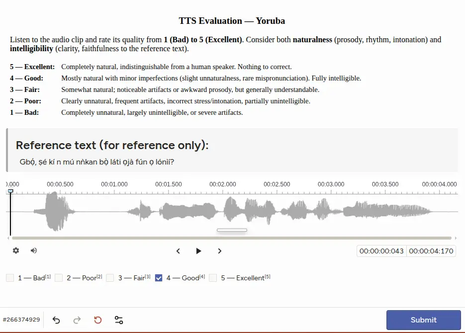

# OpenBibleTTS: Large-Scale Speech Resources and TTS Models for Low-Resource Languages

David Guzmán Affiliation: McGill University Affiliation: Mila - Quebec
AI Institute    Luel Hagos Beyene ^(†)^(†)thanks: Work done during
internship at McGill and Mila Affiliation: AIMS Research and Innovation
Centre Affiliation: NM-AIST    Jesujoba Oluwadara Alabi
Affiliation: Saarland University    Yejin Jeon Affiliation: McGill
University Affiliation: Mila - Quebec AI Institute    Dietrich Klakow
Affiliation: Saarland University    David Ifeoluwa Adelani
Affiliation: McGill University Affiliation: Mila - Quebec AI Institute
Affiliation: Canada CIFAR AI Chair Correspondence:{david.guzman,
david.adelani}@mila.quebec

###### Abstract

Recent advances in neural text-to-speech (TTS) and multilingual speech
generation have substantially improved synthetic speech quality, yet
these gains remain unevenly distributed across the world’s languages.
Existing models are still dominated by a small set of high-resource
languages, while many studies of low-resource TTS are simulated on
artificially downsampled high-resource corpora that do not reflect the
orthographic variation and limited phonetic coverage encountered in
genuinely underrepresented settings. As such, we introduce OpenBibleTTS,
which is a large-scale benchmark for low-resource speech synthesis
spanning 37 underrepresented languages. Moreover, a systematic
comparison of various TTS architectures and large-scale speech
generation models is conducted across in-domain Biblical text and
out-of-domain material. Results show that no single system dominates
across languages and metrics: Gemini-TTS achieves the highest listener
ratings on most evaluated languages, but monolingual EveryVoice models
trained on OpenBibleTTS remain strongest for intelligibility and are
preferred in several African languages, while open from-scratch systems
degrade sharply on out-of-domain text, revealing a persistent gap
between broad multilingual coverage and reliable synthesis quality in
underserved linguistic communities. We complement automatic evaluation
with subjective human judgments, and open-source all processed datasets,
alignments, and trained models to support future low-resource TTS
research.

Code & data: [Datasets &
models](https://huggingface.co/multilingual-tts) $`\cdot`$ [Alignment
pipeline](https://github.com/McGill-NLP/open-bible-resources) $`\cdot`$
[Training code](https://github.com/McGill-NLP/open-bible-tts)

## 1 Introduction

Advances in neural text-to-speech (TTS) systems Ren et al. (2021); Kim
et al. (2021) have led to substantial improvements in synthetic speech
naturalness and intelligibility. Building upon these developments,
recent research has increasingly shifted focus toward multilingual
speech generation, with the aim of extending high-quality TTS
capabilities beyond a single language Casanova et al. (2022); Zhang et
al. (2023); Jiang et al. (2024). Nevertheless, even though more than
7,000 languages are spoken worldwide, research remain overwhelmingly
centered on a small set of high-resource languages (HRLs); YourTTS
(Casanova et al., 2022) covers three languages, whereas Valle-X (Zhang
et al., 2023) and MegaTTS2 (Jiang et al., 2024) cover the two languages
of English and Chinese. Consequently, the robustness and generalization
ability of contemporary TTS systems for genuinely underrepresented
languages remain insufficient.

A major barrier in progress for such low-resource settings is the lack
of publicly available resources. Unlike HRLs, where large curated
datasets (Park and Mulc, 2019; Ardila et al., 2020; Koizumi et al.,
2023; Oliveira et al., 2023) have enabled rapid model development
(Casanova et al., 2024), many underrepresented languages still lack
sufficiently paired speech-text data, preprocessing tools, and
open-source pipelines. As a result, existing studies rely on simulated
low-resource settings, where HRLs are artificially downsampled to
smaller training subsets (Lux et al., 2022; Saeki et al., 2024; Kim et
al., 2024). Consequently, they fail to capture the practical challenges
inherent to genuinely low-resource languages (LRLs), including
orthographic variation, limited phonetic coverage, and noisy alignments.

For many LRLs, the most available speech data often come from the
religious domain, such as the Bible, which has led to a growing number
of works leveraging these corpora to build single-speaker TTS models,
including CMU Wilderness (Black, 2019) and BibleTTS (Meyer et al.,
2022). The main difficulty in further scaling to more languages now lies
in the availability of permissive licenses for releasing TTS data and/or
the challenge of correctly aligning speech data with text pairs.

In this paper, we introduce OpenBibleTTS, a new training and evaluation
dataset for 37 LRLs curated from public available Bible Speech corpus
with open license.¹¹ 1
[https://www.open.bible/](https://www.open.bible/) Our dataset is first
constructed by processing and aligning audio recordings with
corresponding textual transcripts using timing metadata and forced
alignment. Leveraging this dataset, we evaluate both conventional neural
TTS architectures and recent large-scale speech generation systems
(e.g., EveryVoice, VITS, F5 (Chen et al., 2025), OmniVoice (Zhu et al.,
2026), and Gemini-TTS 2.5 Pro. To systematically evaluate the various
TTS paradigms, we ask the following research questions: (1) how
different TTS architectures behave across languages and the effect of
data size, (2) whether large-scale speech foundation models
substantially outperform or potentially underperform models that are
trained from scratch, and (3) how synthesis quality and intelligibility
change when moving from in-domain to out-of-domain settings.

Beyond in-domain evaluation on Biblical text Open Bible (2026), we
further investigate out-of-domain generalization using sentences from
Fleurs-Wikipedia (Goyal et al., 2022) and Bouquet-conversational
sentences (Andrews et al., 2025). Overall, our work provides a clearer
understanding of the current capabilities and limitations of modern TTS
systems for genuinely low-resource languages, and the remaining
challenges toward more inclusive and globally accessible speech
technologies. To support future low-resource research, we publicly
release the processed audio datasets, alignments, and trained models for
all 37 languages.

Figure 1: Geographic and genealogical coverage of the 37 languages in
OpenBibleTTS. The inner ring partitions languages by region (Africa,
South Asia, Middle East, Southeast Asia, Caribbean) and the outer ring
further breaks each region down by language family.

## 2 Related Work

#### Multilingual Speech Datasets

The development of high-quality speech datasets has been critical for
advances in speech technologies, particularly TTS (Tan et al., 2021).
However, many existing corpora, including multilingual TTS datasets such
as Multilingual MLS (Pratap et al., 2020) and CML-TTS (Oliveira et al.,
2023), remain dominated by English and other high-resource languages.
Broader multilingual speech datasets such as Mozilla Common
Voice (Ardila et al., 2020), FLEURS (Conneau et al., 2022), and Pratap
et al. (2023) have substantially expanded language coverage, but were
primarily designed for ASR and do not release trained artefacts.
Although these datasets have been repurposed for TTS, such as in
FLEURS-R (Ma et al., 2024), prior work has reported data quality issues
in the original corpora (Lau et al., 2025; Alabi et al., 2025).

Prior work has leveraged aligned multilingual text sources such as the
Bible for constructing TTS corpora, including CMU Wilderness (Black,
2019), which provides New Testament speech data for approximately 700
languages, as well as AfricanVoices (Ogayo et al., 2022) and
BibleTTS (Meyer et al., 2022), which focus on African languages. Our
work builds on this line of research by adopting the same aligned
biblical text paradigm to construct a larger multilingual speech dataset
covering languages across diverse regions.

#### Neural TTS Architectures

Early TTS systems were based on statistical parametric approaches, which
relied on handcrafted pipelines for speech synthesis (Zen et al., 2007;
Tan et al., 2021). While these systems produced intelligible speech,
they lacked natural prosody and required extensive feature engineering.
The introduction of neural architectures such as Tacotron (Wang et al., 2017) significantly advanced TTS quality  (Tan et al., 2021) by directly
mapping text to mel-spectrograms, though they often suffered from slow
inference and robustness issues. In parallel, neural vocoders such as
WaveNet (van den Oord et al., 2016), WaveGlow (Prenger et al., 2018),
and HiFi-GAN (Kong et al., 2020) improved waveform reconstruction.

Subsequent architectures such as FastSpeech (Ren et al., 2021) and
VITS (Kim et al., 2021) improved synthesis speed, stability, and speech
naturalness through non-autoregressive and variational modeling
approaches. More recent diffusion- and flow-matching-based systems such
as E2 TTS (Eskimez et al., 2024) and F5-TTS (Chen et al., 2025), have
further improved speech quality and generation robustness while
simplifying the synthesis pipeline. In parallel, multilingual (Lux et
al., 2022; Lux et al., 2024; Casanova et al., 2024; Gong et al., 2023)
and pretrained large-scale speech models, particularly LLM-based and
multimodal systems (Hu et al., 2026), have enabled cross-lingual and
zero-shot TTS synthesis via shared speaker and language representations.
However, their performance across languages remains underexplored,
particularly for low-resource languages. We address this by evaluating
various TTS architectures across diverse languages.

| Language         | ISO 639-3 | Region         | Country     | Language Family | Script     | Joshi Class | Timing Metadata | Total Hours | Total utterances |
| ---------------- | --------- | -------------- | ----------- | --------------- | ---------- | ----------- | --------------- | ----------- | ---------------- |
| Egyptian Arabic  | arb       | Africa         | Egypt       | Afro-Asiatic    | Arabic     | 3           | ✗ No            | 85.23       | 30,510           |
| Assamese         | asm       | South Asia     | India       | Indo-European   | Bengali    | 1           | ✓ Yes           | 104.49      | 30,530           |
| Bengali          | ben       | South Asia     | India       | Indo-European   | Bengali    | 3           | ✓ Yes           | 98.02       | 30,535           |
| Central Kurdish  | ckb       | Middle East    | Kurdistan   | Indo-European   | Arabic     | 1           | ✓ Yes           | 85.40       | 30,565           |
| Chhattisgarhi    | hne       | South Asia     | India       | Indo-European   | Devanagari | \-          | ✓ Yes           | 101.61      | 30,451           |
| Chichewa         | nya       | Africa         | Malawi      | Niger-Congo     | Latin      | 1           | ✗ No            | 110.98      | 30,322           |
| Dawro            | dwr       | Africa         | Ethiopia    | Afro-Asiatic    | Latin      | \-          | ✗ No            | 116.98      | 29,579           |
| Dholuo           | luo       | Africa         | Kenya       | Nilo-Saharan    | Latin      | \-          | ✓ Yes           | 76.02       | 30,429           |
| Ewe              | ewe       | Africa         | Ghana       | Niger-Congo     | Latin      | 1           | ✓ Yes           | 95.86       | 30,164           |
| Gamo             | gmv       | Africa         | Ethiopia    | Afro-Asiatic    | Latin      | 0           | ✓ Yes           | 107.07      | 30,200           |
| Gofa             | gof       | Africa         | Ethiopia    | Afro-Asiatic    | Latin      | \-          | ✗ No            | 86.78       | 30,388           |
| Gujarati         | guj       | South Asia     | India       | Indo-European   | Gujarati   | 1           | ✓ Yes           | 83.09       | 30,447           |
| Haitian Creole   | hat       | Caribbean      | Haiti       | Creole          | Latin      | 0           | ✗ No            | 104.03      | 30,597           |
| Hausa            | hau       | Africa         | Nigeria     | Afro-Asiatic    | Latin      | 2           | ✓ Yes           | 99.60       | 30,717           |
| Hiligaynon       | hil       | Southeast Asia | Philippines | Austronesian    | Latin      | 0           | ✓ Yes           | 106.43      | 29,260           |
| Hindi            | hin       | South Asia     | India       | Indo-European   | Devanagari | 4           | ✓ Yes           | 99.09       | 30,438           |
| Igbo             | ibo       | Africa         | Nigeria     | Niger-Congo     | Latin      | 1           | ✓ Yes           | 94.46       | 30,011           |
| Kannada          | kan       | South Asia     | India       | Dravidian       | Kannada    | 1           | ✓ Yes           | 104.86      | 30,495           |
| Kikuyu           | kik       | Africa         | Kenya       | Niger-Congo     | Latin      | 1           | ✗ No            | 87.08       | 30,722           |
| Lingala          | lin       | Africa         | Congo       | Niger-Congo     | Latin      | 1           | ✓ Yes           | 128.49      | 28,790           |
| Luganda          | lug       | Africa         | Uganda      | Niger-Congo     | Latin      | 1           | ✓ Yes           | 101.75      | 30,440           |
| Malayalam        | mal       | South Asia     | India       | Dravidian       | Malayalam  | 1           | ✓ Yes           | 86.12       | 30,190           |
| Marathi          | mar       | South Asia     | India       | Indo-European   | Devanagari | 2           | ✓ Yes           | 92.35       | 30,573           |
| Northern Ndebele | nde       | Africa         | Zimbabwe    | Niger-Congo     | Latin      | 0           | ✓ Yes           | 100.76      | 30,161           |
| Nepali           | nep       | South Asia     | Nepal       | Indo-European   | Devanagari | 1           | ✓ Yes           | 106.63      | 30,347           |
| Oromo            | orm       | Africa         | Ethiopia    | Afro-Asiatic    | Latin      | 1           | ✓ Yes           | 99.16       | 30,413           |
| Punjabi          | pan       | South Asia     | India       | Indo-European   | Gurmukhi   | 2           | ✓ Yes           | 86.16       | 30,496           |
| Shona            | sna       | Africa         | Zimbabwe    | Niger-Congo     | Latin      | 1           | ✗ No            | 74.66       | 30,685           |
| Swahili          | swh       | Africa         | Kenya       | Niger-Congo     | Latin      | 2           | ✗ No            | 96.38       | 30,634           |
| Tamil            | tam       | South Asia     | India       | Dravidian       | Tamil      | 3           | ✓ Yes           | 92.93       | 30,516           |
| Telugu           | tel       | South Asia     | India       | Dravidian       | Telugu     | 1           | ✓ Yes           | 93.18       | 30,059           |
| Turkish          | tur       | Middle East    | Turkey      | Turkic          | Latin      | 4           | ✗ No            | 63.50       | 29,747           |
| Twi (Akuapem)    | twi       | Africa         | Ghana       | Niger-Congo     | Latin      | 1           | ✓ Yes           | 71.20       | 30,270           |
| Twi (Asante)     | twi       | Africa         | Ghana       | Niger-Congo     | Latin      | 1           | ✓ Yes           | 78.87       | 30,565           |
| Urdu             | urd       | South Asia     | India       | Indo-European   | Arabic     | 3           | ✓ Yes           | 88.26       | 30,634           |
| Vietnamese       | vie       | Southeast Asia | Vietnam     | Austroasiatic   | Latin      | 4           | ✓ Yes           | 71.62       | 30,451           |
| Yoruba           | yor       | Africa         | Nigeria     | Niger-Congo     | Latin      | 2           | ✓ Yes           | 89.91       | 30,625           |
| Total            |           |                |             |                 |            |             |                 | 3,469.01    | 1,121,956        |

Table 1: Overview of the 37 OpenBibleTTS languages. ISO 639-3 code,
geographic region, primary country of use, language family, writing
system, Joshi resource class (Joshi et al., 2020) (“–” indicates
languages not covered in the original taxonomy), whether timing metadata
was available (otherwise force-alignment was conducted), the total
aligned speech duration in hours, and the total number of utterances
retained after quality filtering, is reported.

## 3 OpenBibleTTS Corpus

### 3.1 Data source

OpenBibleTTS is derived from the CC BY-SA licensed Open Bible platform
(Open Bible, 2026), a large multilingual repository of scripture
produced by professional Bible-translation organizations. We use this
source because it offers a rare combination of properties that are
especially valuable for low-resource TTS benchmarking: long-form read
speech, carefully edited transcripts, broad language coverage,
consistent narrative style, and near-parallel textual content across
languages.

For each language, Open Bible exposes two complementary artefact types.
Audio is distributed as full-Bible recordings, typically organized as
chapter-level MP3 files under Old-Testament and New-Testament directory
structures. Text is distributed as scripture transcripts in Unified
Standard Format Markers (USFM) and its XML counterpart (USX), both of
which are widely used in professional Bible translation workflows. While
this pairing gives each language a large collection of chapter-level
speech files and structured verse-level text, it does not directly
provide the utterance-level segmentation required for training and
evaluating modern TTS systems.

Our corpus construction therefore treats Open Bible as a multilingual
raw-resource layer and converts it into a TTS-ready benchmark through
systematic text parsing, audio segmentation, and verse-level alignment.
In doing so, OpenBibleTTS is inspired by the work of Meyer et al.
(2022), that showed that high-fidelity scripture audio can serve as a
reproducible testbed for speech synthesis, while extending that paradigm
in two directions central to this paper: from a primarily
African-language setting to 37 languages across five geographic regions,
and from corpus creation alone to a controlled comparison of
from-scratch neural TTS architectures and proprietary large-scale TTS
models under the same evaluation conditions.

### 3.2 Languages

Figure 1 and Table 1 provide an overview of the 37 languages in
OpenBibleTTS, selected to capture substantial geographic, genealogical,
and orthographic diversity among underrepresented speech communities.
The corpus spans five regions: Africa (19 languages), South Asia (13),
Southeast Asia (2), the Middle East (2), and the Caribbean (1). It
further covers nine language families of Niger-Congo, Indo-European,
Afro-Asiatic, Dravidian, Turkic, Austronesian, Austroasiatic,
Nilo-Saharan, and Creole, as well as seven writing systems that include
Latin (22 languages), Devanagari (4), Arabic (3), Dravidian scripts
(Kannada, Malayalam, Tamil, and Telugu; 4 in total), Bengali (2),
Gujarati (1), and Gurmukhi (1). To contextualise these languages within
the broader resource landscape, we additionally assign each language a
Joshi resource class following Joshi et al. (2020).

### 3.3 Text-Audio Alignment

The two alignment pipelines described below produce standardized
verse-level speech–text pairs, which consist of a segmented waveform
that is saved as {BOOK}\_{CHAPTER}\_{VERSE}.wav and a paired .txt file
containing the original transcript.

#### Timing-file Alignment (28 languages).

For languages with timing metadata, we first parse the USFM/USX
scripture files to extract canonical verse text, then cross-reference
each verse boundary against the word-level timestamps provided in the
corresponding timing JSON. The chapter-level MP3 recordings are
subsequently cut at these verse boundaries using ffmpeg, producing mono
WAV clips. To remove non-scriptural preambles, such as narrator
announcements, we discard all audio preceding the timestamp of the first
scripted word.

#### Forced Alignment (9 languages).

For languages without timing files, we use the zero-shot ReadAlongs
Studio (Littell et al., 2022) forced aligner that takes a text
transcript and a chapter-level audio file, and produces word-level
boundaries stored in Praat TextGrid. The aligner internally converts
text into phonemes via a grapheme-to-phoneme (g2p) back-end and
optimizes the alignment using CTC-based dynamic programming. Since many
low-resource languages lack a dedicated g2p model, the language code und
(_undetermined_) is used as a universal fallback, which maps unseen
graphemes to their nearest phoneme equivalents.

Prior to alignment, we apply minimal text normalization to the verse
transcripts, by removing numerals and punctuation marks such as colons,
semicolons, and quotation marks, which the g2p back-end cannot
consistently map to phoneme sequences. This normalized text is used only
for alignment; the original transcript, with punctuation preserved, is
retained in the paired .txt file released with each audio clip. To
account for pre-verse narrator announcements, we prepend a dummy
transcript line that absorbs the non-scriptural audio during alignment
and then discard the resulting boundary. The chapter recording is
finally segmented into verse-level clips, yielding the same output
format as the timing-file pipeline.

### 3.4 Speaker Diarization

Several language collections contain recordings from more than one
speaker. Since unlabelled speaker variation can confound voice identity
and reduce speaker consistency in TTS training, we assign speaker labels
before releasing the corpus.

To do this, instead of running diarization over the full corpus, we run
diarization over every language by exploiting the fact that all chapters
within a Bible book share the same narrator. Specifically, we
concatenate the first verse of each book (up to 66 samples, separated by
one second of silence) into a 10-15 minute reference file, and submit it
to the pyannote/speaker-diarization-precision-2 pipeline (Bredin, 2023).
The speaker detected within each book’s time window is recorded as that
book’s narrator, and the label is propagated to all verses of that book,
allowing speakers to be identified and distinguished across the corpus
for each language. The resulting speaker_id is included as a metadata
column in the dataset.

### 3.5 Data Quality Filtering and Statistics

After alignment and diarization, we apply language-specific quality
filtering following the data-quality framework of Meyer et al. (2022).
Each paired speech-text sample is evaluated against four criteria, and
is assigned to the Best subset only if it satisfies all of them.

- •
  Duration ceiling: clips longer than 30 seconds are removed, since
  unusually long segments often indicate boundary or alignment failures.
- •
  Transcript floor: pairs with fewer than 10 characters are discarded,
  as these typically correspond to section headings or metadata
  artefacts.
- •
  CTC feasibility: pairs whose transcripts are disproportionately long
  relative to their audio duration are excluded, since such examples are
  ill-posed for CTC-based alignment and training.
- •
  Ratio outliers: pairs with audio-to-text ratios more than three
  standard deviations from the per-language mean are filtered out.

In total, OpenBibleTTS contains 3,469 hours of aligned speech and
1,121,956 utterances across 37 languages.

## 4 Experimental Setup

For evaluation, we make use of the scripture-aligned recordings from
OpenBibleTTS. Each language is supplied as a multi-speaker train/test
split of studio recordings at $`24`$ kHz, with roughly
$`25`$–$`30`$ thousand training utterances per language. Per-language
row counts are reported in Table 1.

### 4.1 TTS Models

Table 2 summarizes the five systems in the synthesis paradigm, the
provenance of the vocoder, and the components that we trained in
OpenBibleTTS.

#### FastSpeech 2

(Ren et al., 2021) is a non-autoregressive acoustic model with explicit
duration, pitch, and energy predictors that maps text to a
mel-spectrogram which is then rendered to a waveform by a vocoder,
representing the supervised cascaded paradigm. We use the EveryVoice
toolkit (Pine et al., 2024), which is an open-source toolkit designed
for low-resource TTS that pairs a modified FastSpeech 2 acoustic model
and an iSTFTNet vocoder (Kaneko et al., 2022). For each language, we
train the FastSpeech 2 acoustic model with multispeaker embeddings from
scratch, then fine-tune the pretrained vocoder.

#### VITS

(Kim et al., 2021) represents the fully end-to-end (E2E) paradigm: a
conditional VAE with a normalizing-flow prior and adversarial training
maps text directly to a waveform in a single network, with no
separately-trained vocoder at inference. We train VITS end-to-end from
scratch per language with learned speaker embeddings.

#### F5-TTS

(Chen et al., 2025) is representative of flow-matching zero-shot voice
cloning models; a Diffusion Transformer (DiT) backbone is trained to
predict a mel-spectrogram from target text and a short reference audio
clip. The mel-spectrogram is converted to a waveform by a off-the-shelf,
pretrained Vocos vocoder (Siuzdak, 2024), which we use without
fine-tuning.

#### OmniVoice

(Zhu et al., 2026) pushes zero-shot multilingual synthesis to massive
language coverage: text is directly mapped to multi-codebook acoustic
tokens via a discrete non-autoregressive diffusion language model, with
its bidirectional Transformer backbone initialized from the pretrained
Qwen3-0.6B-Base LLM (Team, 2025), which was trained on 581k hours and
covers more than 600 languages. A single reference clip per language is
drawn from the Open Bible train split.

#### Gemini-TTS

(gemini-2.5-pro-preview-tts) is a closed-source commercial reference
point, and is queried with the Kore voice per language.

| System     | Paradigm      | Vocoder      | Trained Components      |
| ---------- | ------------- | ------------ | ----------------------- |
| EveryVoice | Cascade       | iSTFTNet     | Acoustic + Vocoder (FT) |
| VITS       | E2E VAE       | Integrated   | Full model              |
| F5-TTS     | Flow matching | Vocos (pre.) | Acoustic only           |
| OmniVoice  | Diffusion LM  | Codec (pre.) | —                       |
| Gemini TTS | Proprietary   | Undisclosed  | —                       |

Table 2: The five TTS systems compared in this study. “pre.” =
pretrained vocoder. “FT” = fine-tuned from a pretrained multilingual
checkpoint.

### 4.2 Model Training and Evaluation

#### Training.

EveryVoice, VITS, and F5-TTS models are trained monolingually from
scratch for each of the 37 languages under identical settings: 500,000
total optimizer updates with the default architecture and learning-rate
schedule from the corresponding upstream implementation. OmniVoice and
Gemini TTS are used off-the-shelf without per-language training.
Hardware configurations and full training recipes are reported in
Appendix B.

#### Evaluation.

Two complementary evaluations on the same set of synthesized utterances
are reported: automatic metrics across all 37 languages and a human
listening study on a 10-language subset.

#### Automatic metrics.

For every (system, language) pair we score the first 500 held-out
utterances from the OpenBibleTTS test split. 1) Intelligibility is
reported as word error rate (WER)²² 2
[https://github.com/jitsi/jiwer](https://github.com/jitsi/jiwer) between
the input text and the transcription with the Omnilingual 1B ASR model
(team et al., 2025). When conducting ASR for WER calculation,
synthesized waveforms are passed together with a Flores-style language
code (e.g. swh_Latn, yor_Latn) for correct transcription. Reference and
hypothesis texts are normalized with a Whisper-style pipeline before
scoring; for Arabic-script languages we additionally strip combining
marks after NFD decomposition. 2) Naturalness is reported as predicted
mean opinion score from UTMOSv2 (Baba et al., 2024) without fine-tuning.
Since UTMOSv2 was trained predominantly on English read speech, we treat
its score as a relative ranking signal within each language rather than
an absolute MOS estimate.

#### Human evaluation.

Ten of the 37 languages were rated by three native-speaker annotators
each, chosen to include at least one language from each geographic
region in OpenBibleTTS (Africa, South Asia, Middle East, Southeast Asia,
and the Caribbean). For each language, we sampled 20 utterances from the
Open Bible test split, 20 from FLEURS, and 20 from BOUQuET, and
synthesized every system on the same text so comparisons are
content-controlled and model-blinded. Annotators judged each clip on a
single 1-5 mean opinion score that jointly covers naturalness and
intelligibility. This yields 340 clips per language in most cases—120
from Open Bible (20 utterances $`\times`$ 6 systems), 120 from FLEURS,
and 100 from BOUQuET (no ground-truth audio)—with 320 for Haitian Creole
since FLEURS lacks ground-truth recordings for that language.
Recruitment, compensation, and annotation-platform details are reported
in Appendix C.

## 5 Results and Discussion

Figure 2: Word error rate (WER) on the Open Bible test split for all the
languages. Each bar is the mean WER over the first 500 held-out
utterances per (system, language), with transcripts from
omniASR_LLM_1B_v2 (lower is better).

### 5.1 Main Results

| Language       | WER (%) $`\downarrow`$ |        |           |            |       |       | UTMOS $`\uparrow`$ |        |           |            |      |      | MOS $`\uparrow`$ |        |           |            |      |      | $`\rho_{\textbf{WER}}`$ | $`\rho_{\textbf{UTMOS}}`$ |
| -------------- | ---------------------- | ------ | --------- | ---------- | ----- | ----- | ------------------ | ------ | --------- | ---------- | ---- | ---- | ---------------- | ------ | --------- | ---------- | ---- | ---- | ----------------------- | ------------------------- |
|                | Ground truth           | Gemini | OmniVoice | EveryVoice | VITS  | F5    | Ground truth       | Gemini | OmniVoice | EveryVoice | VITS | F5   | Ground truth     | Gemini | OmniVoice | EveryVoice | VITS | F5   |                         |                           |
| Haitian Creole | 50.52                  | 15.10  | 38.36     | 42.33      | 51.31 | 54.32 | 3.22               | 3.36   | 2.72      | 3.10       | 2.84 | 2.66 | 2.70             | 4.82   | 2.18      | 2.90       | 2.37 | 2.17 | -0.66                   | 0.94                      |
| Hausa          | 4.06                   | 12.71  | 11.72     | 4.61       | 16.92 | 27.64 | 3.12               | 3.47   | 2.92      | 2.77       | 2.26 | 2.42 | 4.50             | 4.13   | 2.96      | 3.72       | 3.23 | 2.85 | -0.71                   | 0.66                      |
| Hindi          | 13.22                  | 11.57  | 9.94      | 12.38      | 18.22 | 32.78 | 3.13               | 3.52   | 3.08      | 2.86       | 2.69 | 3.19 | 3.10             | 4.83   | 3.62      | 3.43       | 3.08 | 2.29 | -0.94                   | 0.26                      |
| Oromo          | 24.05                  | 41.83  | 30.51     | 21.94      | 39.00 | 48.30 | 2.91               | 3.36   | 2.92      | 2.70       | 2.55 | 2.92 | 3.58             | 2.50   | 3.49      | 4.18       | 3.21 | 3.11 | -0.94                   | -0.61                     |
| Shona          | 16.63                  | 11.81  | 11.50     | 6.65       | 27.17 | 37.99 | 2.65               | 3.37   | 3.25      | 2.77       | 2.70 | 2.69 | 4.26             | 2.92   | 2.75      | 3.13       | 2.66 | 2.63 | -0.60                   | -0.03                     |
| Swahili        | 7.28                   | 3.67   | 4.03      | 2.64       | 22.60 | 22.45 | 3.46               | 3.54   | 3.15      | 3.23       | 2.63 | 2.96 | 4.14             | 4.88   | 4.71      | 4.55       | 3.80 | 3.36 | -0.77                   | 0.71                      |
| Telugu         | 18.52                  | 17.55  | 13.91     | 14.26      | 31.02 | 40.44 | 3.22               | 3.42   | 3.05      | 2.93       | 2.47 | 3.06 | 4.26             | 4.77   | 4.59      | 4.24       | 3.41 | 3.36 | -0.71                   | 0.54                      |
| Turkish        | 9.75                   | 9.55   | 11.19     | 7.76       | 11.28 | 45.06 | 3.34               | 3.50   | 3.36      | 3.27       | 3.05 | 3.39 | 3.81             | 4.81   | 3.26      | 3.33       | 3.16 | 2.44 | -0.83                   | 0.26                      |
| Vietnamese     | 5.36                   | 7.37   | 5.14      | 5.00       | 10.74 | 20.49 | 3.20               | 3.21   | 2.89      | 2.76       | 2.50 | 2.72 | 4.15             | 4.54   | 4.36      | 3.56       | 3.11 | 2.91 | -0.49                   | 0.89                      |
| Yoruba         | 6.61                   | 31.93  | 10.33     | 5.93       | 13.70 | 28.75 | 3.17               | 3.36   | 2.95      | 2.96       | 2.77 | 3.02 | 3.94             | 2.36   | 2.83      | 2.93       | 2.61 | 2.23 | -0.89                   | -0.09                     |

Table 3: WER, UTMOSv2, and Human MOS results across the 10 languages
with native-speaker ratings. WER and UTMOSv2 are means over the first
500 held-out Open Bible test utterances per (system, language); MOS is
the mean over 340 rated clips per language (320 for Haitian Creole),
pooled across three annotators and all evaluation domains. Darker
shading indicates a better result. The two rightmost columns report
per-language Spearman $`\rho`$ between WER & MOS and UTMOSv2 & MOS;
strong correlations ($`|\rho|\geq 0.7`$) are bolded.

Figure 3: Human MOS (mean $`\pm`$ 95% CI) from the listening study,
pooled over all ten languages (left) or over Mid-resource (Haitian
Creole, Hindi, Telugu, Vietnamese, Turkish, Swahili; centre) and
Low-resource (Hausa, Yoruba, Shona, Oromo; right) subsets. Bars group
each system by Open Bible, FLEURS, and BOUQuET test domains; synthetic
systems are ordered by pooled mean MOS, with ground-truth first.

From-scratch monolingual training yields the strongest overall
performance. The results in Figure 2 demonstrate that EveryVoice
typically produces the most intelligible speech with an average of
16.95% WER across all languages, followed by OmniVoice (21.50%) and
Gemini (26.86%), and then VITS (31.13%) and F5 (44.51%). We prioritize
intelligibility since preserving the intended linguistic content for
underrepresented languages is a prerequisite for useful TTS utilization.
Under this criterion, targeted monolingual training with EveryVoice
substantially outperforms larger multilingual LLM-based TTS models, even
when those models have a broader cross-lingual pretraining.
Specifically, while OmniVoice covers 646 languages, such language
coverage does not reliably transfer to proximate languages.
Specifically, the large-scale language coverage of Omnivoice similarly
does not guarantee strong performance on LRLs, likely due to the limited
amount of low-resource language data included during pretraining.
Moreover, the performance ordering of EveryVoice, followed by VITS and
then F5-TTS, mirrors the models’ increasing parameters (18.2 M, 36.3 M,
335.8 M), suggesting that more parameter-efficient architectures are
better suited for single-speaker TTS. See Table 4 for full results.

#### Model performance varies across languages within the same region.

Although the overall system ranking remains largely stable across
languages, the disparities in performance between models varies
dramatically within the same region. In particular, Gemini achieves
strong results on supported languages but exhibits degradation on
unsupported ones. Specifically, in African languages, Gemini records an
average WER of 3.88% on supported languages, which drastically increases
to 40.59% on unsupported languages within the same region, yielding a
gap of 36.71%. A similar pattern emerges in South Asia, where supported
languages average 17.10% WER, compared to 24.86% WER for unsupported
languages. On the other hand, OmniVoice remains comparatively stable
across its supported (15.36% WER) and unsupported (14.97% WER) South
Asian languages, probably benefiting more from related supported
languages.

#### Intra-regional analysis reveals a performance gap for African languages.

African languages exhibit higher WER than languages in the South Asian,
Middle Eastern, and Caribbean regional groups regardless of the model.
In other words, since this pattern persists across both from-scratch and
pretrained systems, it is unlikely to be explained by the limitations of
a single architecture alone. Rather, the results suggest a broader
mismatch between current TTS approaches and the linguistic conditions of
many African languages, where tonal contrasts and orthographic variation
affects synthesis quality. This gap illustrates the need for modeling
strategies that are explicitly designed around the properties of African
languages, rather than assuming that generic TTS architecture will
transfer uniformly across different languages.

### 5.2 Human Evaluation of TTS models

Table 3 shows the WER, UTMOS, and human MOS scores for six models across
the 10 human-rated languages. Our results show that humans rated Gemini
highest in six languages and EveryVoice highest in Oromo, while ground
truth was preferred for three African languages (Hausa, Shona, and
Yoruba). In contrast, UTMOS rated Gemini highest across all ten
languages, whereas WER ranked EveryVoice best in all languages except
Haitian Creole. Correlation analysis with human MOS shows that WER is
strongly correlated with MOS in 7 of 10 languages ($`|\rho|\geq 0.7`$),
while UTMOS reaches that threshold in only 3 (Haitian Creole, Swahili,
Vietnamese). This suggests that WER aligns closely with human ratings
than UTMOS in this setting for low-resource languages, although the
variability across languages indicates that neither metric consistently
captures human judgments. This result indicate that better automatic
MOS-like metrics are needed for LRLs, and leave this as future work.

### 5.3 Domain Generalization

Domain generalization capabilities of models trained on OpenBible are
evaluated on the Wikipedia-based FLEURS (Goyal et al., 2022) and
conversational BOUQuET (Andrews et al., 2025) domains. Human evaluation
was conducted on 20 utterances across ten languages (see Figure 3).

#### Pretrained systems generalize more robustly across domains.

When considering the aggregate across all languages, the results show
that Gemini achieves better generalization than models trained on the
Bible. While EveryVoice, which has the highest in-domain MOS on the
Bible, it shows a decline in both out-of-domain settings; on the other
hand, for Omnivoice, despite a lower in-domain performance, it catches
up out of domain, with VITS and F5 trailing behind. Overall, the results
suggest that strong in-domain performance of an architecture does not
necessarily translate to better out-of-domain generalization.

#### Domain sensitivity is language and system-dependent.

When examining MOS results by language category (mid- and low-resource),
we observe that Gemini exhibits stronger domain generalization and even
outperforms ground truth. Omnivoice, despite lower in-domain
performance, outperforms EveryVoice in this setting. In low-resource
languages, however, EveryVoice shows better generalization than the
other models, including Gemini. Overall, these results suggest that
domain generalization behavior is strongly influenced by both language
resource level and model architecture.

## 6 Conclusion

In this paper, we have introduced OpenBibleTTS, which is a corpus of
aligned scripture speech spanning 37 underrepresented languages. Using
this dataset, we have conducted a systematic comparison of five modern
TTS paradigms under controlled conditions using both automatic and human
evaluations across various evaluation domains. Overall, we find that no
single TTS system consistently dominates across languages. EveryVoice
models trained from scratch achieve the lowest mean WER of 16.95%, which
outperforms larger pretrained systems despite their broader coverage. In
contrast, Gemini is preferred in six of ten human-evaluated languages
because they are supported, though EveryVoice remains competitive.
Finally, automatic metrics only partially align with human judgments;
WER correlates strongly with MOS in seven languages, while UTMOS
systematically favors Gemini and aligns with human evaluations only in a
subset of cases. To facilitate further research, processed data,
alignments, and trained models are released for all 37 languages.

## 7 Limitations

Our models are trained and evaluated primarily within a constrained,
scripture-like domain characterized by narrow vocabulary, repetitive
phrasing, and a relatively formal stylistic structure. Consequently, the
observed gains may not directly transfer to more open-ended or
conversational speech settings, where prosodic variability, discourse
structure, and lexical diversity are substantially greater. Moreover,
despite controlling for training data consistency through shared
waveforms and transcripts, system-level differences in toolchain
defaults—including tokenization strategies, vocoder architectures, and
inference-time noise schedules—may still introduce confounding factors.
These variables are not fully isolated in our experimental design and
may contribute to residual performance variation across systems.

Finally, our intelligibility evaluation relies on a single ASR-based
metric, namely omniASR_LLM_1B_v2. While this provides a consistent
evaluation framework across languages, it may introduce model-specific
bias. In particular, Ndebele is not supported by the ASR system and is
therefore excluded from WER reporting. Additionally, several
low-resource languages exhibit elevated ground-truth WER, which reflects
inherent recognition difficulty independent of TTS system quality. To
address this, we have reported per-language GT WER as an approximate ASR
floor. Under this interpretation, cross-system WER comparisons within a
given language remain meaningful for relative ranking.

## 8 Ethical Considerations

#### Data licensing.

A prerequisite for building and releasing OpenBibleTTS was the use of
speech-text data that permits redistribution and derivative reuse. All
scripture audio and transcripts in our corpus are drawn from the Open
Bible platform, which publishes its materials under the Creative Commons
Attribution–ShareAlike (CC BY-SA) license (Open Bible, 2026). Before
including any language, we verified that the corresponding Open Bible
collection is released under CC BY-SA, so that our aligned utterances,
preprocessing scripts, and trained models can be shared with the
community on compatible terms.

#### Cultural and religious content.

Religious text can carry cultural sensitivities. We cite licensed
sources, avoid implying endorsement by faith communities, and present
OpenBibleTTS strictly as a speech-technology benchmark rather than as a
work of religious interpretation.

#### Human evaluation.

Native-speaker annotators were recruited through professional platforms
and direct community outreach. Ratings were collected on blinded audio
clips using a disclosed 1–5 scale, personally identifying information
was removed from public annotation exports, and only anonymized task
metadata needed for reproducibility is released.

## Acknowledgments

This research was supported in part by the Natural Sciences and
Engineering Research Council (NSERC) of Canada and in part by the AI2050
program at Schmidt Sciences. This work received partial support from
Google’s Gemini Academic Program Award in the form of LLM API credits.
We are grateful for the support from IVADO and the Canada First Research
Excellence Fund. Part of this project also received funding from the
Secretaría de Ciencia, Humanidades, Tecnología e Innovación (SECIHTI).

Finally, we acknowledge the use of generative AI tools for improving
proofreading and readability, no scientific content was generated by the
tools.

## References

- Alabi et al. (2025) J. O. Alabi, X. Liu, D. Klakow, and J. Yamagishi
  AfriHuBERT: A self-supervised speech representation model for African
  languages. In Interspeech 2025, pp. 4023–4027. External Links:
  [Document](https://dx.doi.org/10.21437/Interspeech.2025-1437), ISSN
  2958-1796 Cited by: §2.
- Andrews et al. (2025) P. Andrews, M. Artetxe, M. C. Meglioli, M. R.
  Costa-jussà, J. Chuang, D. Dale, M. Duppenthaler, N. P. Ekberg, C.
  Gao, D. E. Licht, J. Maillard, A. Mourachko, C. Ropers, S. Saleem, E.
  Sánchez, I. Tsiamas, A. Turkatenko, A. Ventayol-Boada, and S. Yates
  BOUQuET : dataset, benchmark and open initiative for universal quality
  evaluation in translation. In Proceedings of the 2025 Conference on
  Empirical Methods in Natural Language Processing, C.
  Christodoulopoulos, T. Chakraborty, C. Rose, and V. Peng (Eds.),
  Suzhou, China, pp. 27515–27535. External Links:
  [Link](https://aclanthology.org/2025.emnlp-main.1400/),
  [Document](https://dx.doi.org/10.18653/v1/2025.emnlp-main.1400), ISBN
  979-8-89176-332-6 Cited by: §1, §5.3.
- Ardila et al. (2020) R. Ardila, M. Branson, K. Davis, M. Kohler, J.
  Meyer, M. Henretty, R. Morais, L. Saunders, F. Tyers, and G. Weber
  Common voice: a massively-multilingual speech corpus. In Proceedings
  of the Twelfth Language Resources and Evaluation Conference, N.
  Calzolari, F. Béchet, P. Blache, K. Choukri, C. Cieri, T. Declerck, S.
  Goggi, H. Isahara, B. Maegaard, J. Mariani, H. Mazo, A. Moreno, J.
  Odijk, and S. Piperidis (Eds.), Marseille, France, pp. 4218–4222
  (eng). External Links:
  [Link](https://aclanthology.org/2020.lrec-1.520/), ISBN
  979-10-95546-34-4 Cited by: §1, §2.
- Baba et al. (2024) K. Baba, W. Nakata, Y. Saito, and H. Saruwatari The
  t05 system for the VoiceMOS Challenge 2024: transfer learning from
  deep image classifier to naturalness MOS prediction of high-quality
  synthetic speech. In IEEE Spoken Language Technology Workshop (SLT),
  pp. 818–824. External Links:
  [Document](https://dx.doi.org/10.1109/SLT61566.2024.10832315) Cited
  by: §4.2.
- Black (2019) A. W. Black CMU wilderness multilingual speech dataset.
  ICASSP 2019 - 2019 IEEE International Conference on Acoustics, Speech
  and Signal Processing (ICASSP), pp. 5971–5975. External Links:
  [Link](https://api.semanticscholar.org/CorpusID:145858538) Cited by:
  §1, §2.
- Bredin (2023) H. Bredin pyannote.audio 2.1 speaker diarization
  pipeline: principle, benchmark, and recipe. In Interspeech 2023,
  pp. 1983–1987. External Links:
  [Document](https://dx.doi.org/10.21437/Interspeech.2023-105), ISSN
  2958-1796 Cited by: §3.4.
- Casanova et al. (2024) E. Casanova, K. Davis, E. Gölge, G. Göknar, I.
  Gulea, L. Hart, A. Aljafari, J. Meyer, R. Morais, S. Olayemi, and J.
  Weber XTTS: a Massively Multilingual Zero-Shot Text-to-Speech Model.
  In Interspeech 2024, pp. 4978–4982. External Links:
  [Document](https://dx.doi.org/10.21437/Interspeech.2024-2016), ISSN
  2958-1796 Cited by: §1, §2.
- Casanova et al. (2022) E. Casanova, J. Weber, C. D. Shulby, A. C.
  Junior, E. Gölge, and M. A. Ponti YourTTS: towards zero-shot
  multi-speaker TTS and zero-shot voice conversion for everyone. In
  Proceedings of the 39th International Conference on Machine
  Learning, K. Chaudhuri, S. Jegelka, L. Song, C. Szepesvari, G. Niu,
  and S. Sabato (Eds.), Proceedings of Machine Learning Research, Vol.
  162, pp. 2709–2720. External Links:
  [Link](https://proceedings.mlr.press/v162/casanova22a.html) Cited by:
  §1.
- Chen et al. (2025) Y. Chen, Z. Niu, Z. Ma, K. Deng, C. Wang, J.
  JianZhao, K. Yu, and X. Chen F5-TTS: a fairytaler that fakes fluent
  and faithful speech with flow matching. In Proceedings of the 63rd
  Annual Meeting of the Association for Computational Linguistics
  (Volume 1: Long Papers), W. Che, J. Nabende, E. Shutova, and M. T.
  Pilehvar (Eds.), Vienna, Austria, pp. 6255–6271. External Links:
  [Link](https://aclanthology.org/2025.acl-long.313/),
  [Document](https://dx.doi.org/10.18653/v1/2025.acl-long.313), ISBN
  979-8-89176-251-0 Cited by: §1, §2, §4.1.
- Conneau et al. (2022) A. Conneau, M. Ma, S. Khanuja, Y. Zhang, V.
  Axelrod, S. Dalmia, J. Riesa, C. Rivera, and A. Bapna FLEURS: few-shot
  learning evaluation of universal representations of speech. 2022 IEEE
  Spoken Language Technology Workshop (SLT), pp. 798–805. External
  Links: [Link](https://api.semanticscholar.org/CorpusID:249062909)
  Cited by: §2.
- Eskimez et al. (2024) S. E. Eskimez, X. Wang, M. Thakker, C. Li, C.
  Tsai, Z. Xiao, H. Yang, Z. Zhu, M. Tang, X. Tan, Y. Liu, S. Zhao,
  and N. Kanda E2 tts: embarrassingly easy fully non-autoregressive
  zero-shot tts. 2024 IEEE Spoken Language Technology Workshop (SLT),
  pp. 682–689. External Links:
  [Link](https://api.semanticscholar.org/CorpusID:270738197) Cited by:
  §2.
- Gong et al. (2023) C. Gong, X. Wang, E. Cooper, D. Wells, L. Wang, J.
  Dang, K. Richmond, and J. Yamagishi ZMM-tts: zero-shot multilingual
  and multispeaker speech synthesis conditioned on self-supervised
  discrete speech representations. IEEE/ACM Transactions on Audio,
  Speech, and Language Processing 32, pp. 4036–4051. External Links:
  [Link](https://api.semanticscholar.org/CorpusID:266521614) Cited by:
  §2.
- Goyal et al. (2022) N. Goyal, C. Gao, V. Chaudhary, P. Chen, G.
  Wenzek, D. Ju, S. Krishnan, M. Ranzato, F. Guzmán, and A. Fan The
  Flores-101 evaluation benchmark for low-resource and multilingual
  machine translation. Transactions of the Association for Computational
  Linguistics 10, pp. 522–538. External Links:
  [Link](https://aclanthology.org/2022.tacl-1.30/),
  [Document](https://dx.doi.org/10.1162/tacl%5Fa%5F00474) Cited by: §1,
  §5.3.
- Hu et al. (2026) H. Hu, X. Zhu, T. He, D. Guo, B. Zhang, X. Wang, Z.
  Guo, Z. Jiang, H. Hao, Z. Guo, X. Zhang, P. Zhang, B. Yang, J. Xu, J.
  Zhou, and J. Lin Qwen3-tts technical report. ArXiv abs/2601.15621.
  External Links:
  [Link](https://api.semanticscholar.org/CorpusID:284935350) Cited by:
  §2.
- Jiang et al. (2024) Z. Jiang, J. Liu, Y. Ren, J. He, Z. Ye, S. Ji, Q.
  Yang, C. Zhang, P. Wei, C. Wang, X. Yin, Z. MA, and Z. Zhao Mega-TTS
  2: boosting prompting mechanisms for zero-shot speech synthesis. In
  The Twelfth International Conference on Learning Representations,
  External Links: [Link](https://openreview.net/forum?id=mvMI3N4AvD)
  Cited by: §1.
- Joshi et al. (2020) P. Joshi, S. Santy, A. Budhiraja, K. Bali, and M.
  Choudhury The state and fate of linguistic diversity and inclusion in
  the NLP world. In Proceedings of the 58th Annual Meeting of the
  Association for Computational Linguistics, D. Jurafsky, J. Chai, N.
  Schluter, and J. Tetreault (Eds.), Online, pp. 6282–6293. External
  Links: [Link](https://aclanthology.org/2020.acl-main.560/),
  [Document](https://dx.doi.org/10.18653/v1/2020.acl-main.560) Cited by:
  Table 1, §3.2.
- Kaneko et al. (2022) T. Kaneko, K. Tanaka, H. Kameoka, and S. Seki
  ISTFTNet: fast and lightweight mel-spectrogram vocoder incorporating
  inverse short-time fourier transform. External Links: 2203.02395,
  [Link](https://arxiv.org/abs/2203.02395) Cited by: Appendix B, §4.1.
- Kim et al. (2021) J. Kim, J. Kong, and J. Son Conditional variational
  autoencoder with adversarial learning for end-to-end text-to-speech.
  In Proceedings of the 38th International Conference on Machine
  Learning, External Links:
  [Link](http://proceedings.mlr.press/v139/kim21f.html) Cited by: §1,
  §2, §4.1.
- Kim et al. (2024) Y. Kim, Y. Jeon, and G. Lee Audio-based linguistic
  feature extraction for enhancing multi-lingual and low-resource
  text-to-speech. In Findings of the Association for Computational
  Linguistics: EMNLP 2024, Y. Al-Onaizan, M. Bansal, and Y. Chen (Eds.),
  Miami, Florida, USA, pp. 13984–13989. External Links:
  [Link](https://aclanthology.org/2024.findings-emnlp.817/),
  [Document](https://dx.doi.org/10.18653/v1/2024.findings-emnlp.817)
  Cited by: §1.
- Koizumi et al. (2023) Y. Koizumi, H. Zen, S. Karita, Y. Ding, K.
  Yatabe, N. Morioka, M. Bacchiani, Y. Zhang, W. Han, and A. Bapna
  LibriTTS-R: A Restored Multi-Speaker Text-to-Speech Corpus. External
  Links: 2305.18802, [Link](https://arxiv.org/abs/2305.18802) Cited by:
  §1.
- Kong et al. (2020) J. Kong, J. Kim, and J. Bae HiFi-gan: generative
  adversarial networks for efficient and high fidelity speech synthesis.
  ArXiv abs/2010.05646. External Links:
  [Link](https://api.semanticscholar.org/CorpusID:222291664) Cited by:
  Appendix B, §2.
- Lau et al. (2025) M. Lau, Q. Chen, Y. Fang, T. Xu, T. Chen, and P.
  Golik Data quality issues in multilingual speech datasets: the need
  for sociolinguistic awareness and proactive language planning. In
  Proceedings of the 63rd Annual Meeting of the Association for
  Computational Linguistics (Volume 1: Long Papers), W. Che, J.
  Nabende, E. Shutova, and M. T. Pilehvar (Eds.), Vienna, Austria,
  pp. 7466–7492. External Links:
  [Link](https://aclanthology.org/2025.acl-long.370/),
  [Document](https://dx.doi.org/10.18653/v1/2025.acl-long.370), ISBN
  979-8-89176-251-0 Cited by: §2.
- Littell et al. (2022) P. Littell, E. Joanis, A. Pine, M. Tessier, D.
  Huggins Daines, and D. Torkornoo ReadAlong studio: practical zero-shot
  text-speech alignment for indigenous language audiobooks. In
  Proceedings of the 1st Annual Meeting of the ELRA/ISCA Special
  Interest Group on Under-Resourced Languages, M. Melero, S. Sakti,
  and C. Soria (Eds.), Marseille, France, pp. 23–32. External Links:
  [Link](https://aclanthology.org/2022.sigul-1.4/) Cited by: §3.3.
- Lux et al. (2022) F. Lux, J. Koch, and N. T. Vu Low-resource
  multilingual and zero-shot multispeaker TTS. In Proceedings of the 2nd
  Conference of the Asia-Pacific Chapter of the Association for
  Computational Linguistics and the 12th International Joint Conference
  on Natural Language Processing (Volume 1: Long Papers), Y. He, H.
  Ji, S. Li, Y. Liu, and C. Chang (Eds.), Online only, pp. 741–751.
  External Links: [Link](https://aclanthology.org/2022.aacl-main.56/),
  [Document](https://dx.doi.org/10.18653/v1/2022.aacl-main.56) Cited by:
  §1, §2.
- Lux et al. (2024) F. Lux, S. Meyer, L. Behringer, F. Zalkow, P. Do, M.
  Coler, E. A. P. Habets, and N. T. Vu Meta Learning Text-to-Speech
  Synthesis in over 7000 Languages. In Interspeech 2024, pp. 4958–4962.
  External Links:
  [Document](https://dx.doi.org/10.21437/Interspeech.2024-1335), ISSN
  2958-1796 Cited by: §2.
- Ma et al. (2024) M. Ma, Y. Koizumi, S. Karita, H. Zen, J. Riesa, H.
  Ishikawa, and M. Bacchiani FLEURS-R: A Restored Multilingual Speech
  Corpus for Generation Tasks. In Interspeech 2024, pp. 1835–1839.
  External Links:
  [Document](https://dx.doi.org/10.21437/Interspeech.2024-1356), ISSN
  2958-1796 Cited by: §2.
- Meyer et al. (2022) J. Meyer, D. Adelani, E. Casanova, A. Öktem, D.
  Whitenack, J. Weber, S. KABONGO KABENAMUALU, E. Salesky, I. Orife, C.
  Leong, P. Ogayo, C. Chinenye Emezue, J. Mukiibi, S. Osei, A.
  AGBOLO, V. Akinode, B. Opoku, O. Samuel, J. Alabi, and S. H. Muhammad
  BibleTTS: a large, high-fidelity, multilingual, and uniquely African
  speech corpus. In Interspeech 2022, pp. 2383–2387. External Links:
  [Document](https://dx.doi.org/10.21437/Interspeech.2022-10850), ISSN
  2958-1796 Cited by: §1, §2, §3.1, §3.5.
- Ogayo et al. (2022) P. Ogayo, G. Neubig, and A. W Black Building
  African Voices. In Interspeech 2022, pp. 1263–1267. External Links:
  [Document](https://dx.doi.org/10.21437/Interspeech.2022-152), ISSN
  2958-1796 Cited by: §2.
- Oliveira et al. (2023) F. S. Oliveira, E. Casanova, A. C.
  Junior, A. S. Soares, and A. R. Galvão Filho Cml-tts: a multilingual
  dataset for speech synthesis in low-resource language. In Text,
  Speech, and Dialogue, K. Ekštein, F. Pártl, and M. Konopík (Eds.),
  Cham, pp. 188–199. External Links: ISBN 978-3-031-40498-6 Cited by:
  §1, §2.
- Open Bible (2026) Open Bible Scripture in the languages of the world.
  Note: Accessed April 2026 External Links: [Link](https://open.bible/)
  Cited by: §1, §3.1, §8.
- Park and Mulc (2019) K. Park and T. Mulc CSS10: a collection of single
  speaker speech datasets for 10 languages. External Links: 1903.11269,
  [Link](https://arxiv.org/abs/1903.11269) Cited by: §1.
- Pine et al. (2024) A. Pine, E. Cooper, D. Guzmán, E. Joanis, A.
  Kazantseva, R. Krekoski, R. Kuhn, S. Larkin, P. Littell, D.
  Lothian, A. Martin, K. Richmond, M. Tessier, C. Valentini-Botinhao, D.
  Wells, and J. Yamagishi Speech generation for Indigenous language
  education. Computer Speech & Language 89, pp. 101723. External Links:
  [Document](https://dx.doi.org/10.1016/j.csl.2024.101723) Cited by:
  §4.1.
- Pratap et al. (2023) V. Pratap, A. Tjandra, B. Shi, P. Tomasello, A.
  Babu, S. Kundu, A. Elkahky, Z. Ni, A. Vyas, M. Fazel-Zarandi, A.
  Baevski, Y. Adi, X. Zhang, W. Hsu, A. Conneau, and M. Auli Scaling
  speech technology to 1,000+ languages. External Links: 2305.13516,
  [Link](https://arxiv.org/abs/2305.13516) Cited by: §2.
- Pratap et al. (2020) V. Pratap, Q. Xu, A. Sriram, G. Synnaeve, and R.
  Collobert MLS: a large-scale multilingual dataset for speech research.
  In Interspeech, External Links:
  [Link](https://api.semanticscholar.org/CorpusID:226202134) Cited by:
  §2.
- Prenger et al. (2018) R. Prenger, R. Valle, and B. Catanzaro WaveGlow:
  A flow-based generative network for speech synthesis. CoRR
  abs/1811.00002. External Links:
  [Link](http://arxiv.org/abs/1811.00002), 1811.00002 Cited by: §2.
- Ren et al. (2021) Y. Ren, C. Hu, X. Tan, T. Qin, S. Zhao, Z. Zhao,
  and T. Liu FastSpeech 2: fast and high-quality end-to-end text to
  speech. In International Conference on Learning Representations,
  External Links: [Link](https://openreview.net/forum?id=aHzNSO7PaD)
  Cited by: §1, §2, §4.1.
- Saeki et al. (2024) T. Saeki, S. Maiti, X. Li, S. Watanabe, S.
  Takamichi, and H. Saruwatari Text-Inductive Graphone-Based Language
  Adaptation for Low-Resource Speech Synthesis. IEEE/ACM Transactions on
  Audio, Speech, and Language Processing 32 (), pp. 1829–1844. External
  Links: [Document](https://dx.doi.org/10.1109/TASLP.2024.3369537) Cited
  by: §1.
- Siuzdak (2024) H. Siuzdak Vocos: closing the gap between time-domain
  and Fourier-based neural vocoders for high-quality audio synthesis. In
  The Twelfth International Conference on Learning Representations,
  External Links: [Link](https://openreview.net/forum?id=vY9nzQmQBw)
  Cited by: §4.1.
- Tan et al. (2021) X. Tan, T. Qin, F. K. Soong, and T. Liu A survey on
  neural speech synthesis. ArXiv abs/2106.15561. External Links:
  [Link](https://api.semanticscholar.org/CorpusID:235669930) Cited by:
  §2, §2.
- team et al. (2025) O. A. team, G. Keren, A. Kozhevnikov, Y. Meng, C.
  Ropers, M. Setzler, S. Wang, I. Adebara, M. Auli, C. Balioglu, K.
  Chan, C. Cheng, J. Chuang, C. Droof, M. Duppenthaler, P. Duquenne, A.
  Erben, C. Gao, G. M. Gonzalez, K. Lyu, S. Miglani, V. Pratap, K. R.
  Sadagopan, S. Saleem, A. Turkatenko, A. Ventayol-Boada, Z. Yong, Y.
  Chung, J. Maillard, R. Moritz, A. Mourachko, M. Williamson, and S.
  Yates Omnilingual asr: open-source multilingual speech recognition for
  1600+ languages. External Links: 2511.09690,
  [Link](https://arxiv.org/abs/2511.09690) Cited by: §4.2.
- Team (2025) Q. Team Qwen3 technical report. External Links:
  2505.09388, [Link](https://arxiv.org/abs/2505.09388) Cited by: §4.1.
- van den Oord et al. (2016) A. van den Oord, S. Dieleman, H. Zen, K.
  Simonyan, O. Vinyals, A. Graves, N. Kalchbrenner, A. Senior, and K.
  Kavukcuoglu WaveNet: A Generative Model for Raw Audio. In 9th ISCA
  Workshop on Speech Synthesis Workshop (SSW 9), pp. 125. Cited by: §2.
- Wang et al. (2017) Y. Wang, R.J. Skerry-Ryan, D. Stanton, Y. Wu, R. J.
  Weiss, N. Jaitly, Z. Yang, Y. Xiao, Z. Chen, S. Bengio, Q. Le, Y.
  Agiomyrgiannakis, R. Clark, and R. A. Saurous Tacotron: Towards
  End-to-End Speech Synthesis. In Interspeech 2017, pp. 4006–4010.
  External Links:
  [Document](https://dx.doi.org/10.21437/Interspeech.2017-1452), ISSN
  2958-1796 Cited by: §2.
- Zen et al. (2007) H. Zen, K. Tokuda, and A. W. Black Statistical
  parametric speech synthesis. 2007 IEEE International Conference on
  Acoustics, Speech and Signal Processing - ICASSP ’07 4,
  pp. IV–1229–IV–1232. External Links:
  [Link](https://api.semanticscholar.org/CorpusID:3232238) Cited by: §2.
- Zhang et al. (2023) Z. Zhang, L. Zhou, C. Wang, S. Chen, Y. Wu, S.
  Liu, Z. Chen, Y. Liu, H. Wang, J. Li, L. He, S. Zhao, and F. Wei Speak
  foreign languages with your own voice: cross-lingual neural codec
  language modeling. External Links: 2303.03926,
  [Link](https://arxiv.org/abs/2303.03926) Cited by: §1.
- Zhu et al. (2026) H. Zhu, L. Ye, W. Kang, Z. Yao, L. Guo, F. Kuang, Z.
  Han, W. Zhuang, L. Lin, and D. Povey OmniVoice: towards omnilingual
  zero-shot text-to-speech with diffusion language models. arXiv
  preprint arXiv:2604.00688. Cited by: §1, §4.1.

## Appendix A Results Per Language

Table 4 reports the full per-language WER and UTMOSv2 scores for all
five TTS systems and ground truth across all 37 OpenBibleTTS languages,
computed on the first 500 held-out utterances of the Open Bible test
split. Figures 4–13 show the per-language human MOS results for each of
the 10 languages in the listening study, broken down by evaluation
domain (Open Bible, FLEURS, BOUQuET). Each figure displays mean MOS with
95% confidence intervals alongside score distributions per model,
allowing a detailed view of system behaviour and annotator agreement
within each language.

| Language        | Ground truth           |                    | Gemini                 |                    | EveryVoice             |                    | OmniVoice              |                    | VITS                   |                    | F5                     |                    |
| --------------- | ---------------------- | ------------------ | ---------------------- | ------------------ | ---------------------- | ------------------ | ---------------------- | ------------------ | ---------------------- | ------------------ | ---------------------- | ------------------ |
|                 | WER (%) $`\downarrow`$ | UTMOS $`\uparrow`$ | WER (%) $`\downarrow`$ | UTMOS $`\uparrow`$ | WER (%) $`\downarrow`$ | UTMOS $`\uparrow`$ | WER (%) $`\downarrow`$ | UTMOS $`\uparrow`$ | WER (%) $`\downarrow`$ | UTMOS $`\uparrow`$ | WER (%) $`\downarrow`$ | UTMOS $`\uparrow`$ |
| Egyptian Arabic | 5.28 ± 10.35           | 3.02 ± 0.28        | 4.08 ± 9.79            | 3.40 ± 0.29        | 2.91 ± 6.77            | 2.75 ± 0.26        | 4.61 ± 7.87            | 3.02 ± 0.24        | 11.47 ± 11.26          | 2.77 ± 0.29        | 24.47 ± 27.39          | 2.94 ± 0.3         |
| Assamese        | 21.03 ± 15.24          | 2.67 ± 0.35        | 26.52 ± 16.33          | 3.55 ± 0.27        | 18.40 ± 14.95          | 2.48 ± 0.31        | 18.31 ± 14.36          | 3.06 ± 0.26        | 28.60 ± 15.72          | 2.23 ± 0.29        | 41.70 ± 21.93          | 2.88 ± 0.31        |
| Bengali         | 12.25 ± 11.29          | 2.91 ± 0.34        | 15.11 ± 12.36          | 3.47 ± 0.28        | 10.49 ± 10.56          | 2.76 ± 0.32        | 11.88 ± 11.45          | 3.03 ± 0.25        | 19.58 ± 13.25          | 2.29 ± 0.29        | 38.90 ± 21.28          | 2.93 ± 0.3         |
| Central Kurdish | 23.58 ± 17.75          | 3.33 ± 0.26        | 30.12 ± 18.33          | 3.47 ± 0.28        | 26.15 ± 19.77          | 3.08 ± 0.28        | 18.07 ± 14.96          | 3.00 ± 0.24        | 37.56 ± 18.06          | 2.66 ± 0.29        | 43.15 ± 25.19          | 3.13 ± 0.24        |
| Chhattisgarhi   | 26.21 ± 23.74          | 3.28 ± 0.28        | 23.19 ± 13.27          | 3.46 ± 0.30        | 18.72 ± 16.41          | 3.02 ± 0.26        | 14.97 ± 11.06          | 2.86 ± 0.30        | 37.93 ± 24.05          | 2.79 ± 0.29        | 56.89 ± 21.32          | 3.06 ± 0.25        |
| Chichewa        | 12.13 ± 47.38          | 2.67 ± 0.39        | 21.60 ± 14.27          | 3.48 ± 0.29        | 7.27 ± 8.86            | 2.72 ± 0.32        | 16.80 ± 13.59          | 2.81 ± 0.34        | 21.19 ± 12.99          | 2.55 ± 0.38        | 34.04 ± 27.07          | 2.48 ± 0.34        |
| Dawro           | 49.32 ± 16.82          | 2.88 ± 0.36        | 71.15 ± 15.59          | 3.34 ± 0.31        | 45.15 ± 16.05          | 2.55 ± 0.31        | 52.34 ± 16.35          | 3.19 ± 0.25        | 56.18 ± 17.20          | 2.38 ± 0.38        | 77.06 ± 15.17          | 2.9 ± 0.28         |
| Dholuo          | 24.37 ± 16.31          | 3.32 ± 0.31        | 27.27 ± 17.94          | 3.38 ± 0.33        | 22.63 ± 16.77          | 3.06 ± 0.29        | 44.80 ± 20.09          | 3.31 ± 0.24        | 37.50 ± 18.56          | 2.68 ± 0.31        | 70.28 ± 21.94          | 2.96 ± 0.32        |
| Ewe             | 14.04 ± 12.22          | 3.26 ± 0.31        | 57.09 ± 19.18          | 3.24 ± 0.37        | 11.26 ± 11.79          | 3.06 ± 0.25        | 32.01 ± 17.71          | 2.93 ± 0.35        | 28.52 ± 16.42          | 2.46 ± 0.32        | 39.79 ± 20.64          | 2.94 ± 0.3         |
| Gamo            | 34.82 ± 19.48          | 2.93 ± 0.35        | 73.52 ± 28.21          | 3.31 ± 0.33        | 29.43 ± 15.22          | 2.79 ± 0.25        | 55.13 ± 18.64          | 2.71 ± 0.29        | 49.27 ± 18.29          | 2.47 ± 0.32        | 64.01 ± 21.27          | 2.74 ± 0.29        |
| Gofa            | 38.19 ± 18.59          | 3.15 ± 0.30        | 74.75 ± 26.79          | 3.38 ± 0.33        | 33.45 ± 14.49          | 3.09 ± 0.25        | 60.53 ± 20.22          | 3.02 ± 0.24        | 47.22 ± 18.35          | 2.77 ± 0.32        | 58.43 ± 22.64          | 2.8 ± 0.26         |
| Gujarati        | 10.62 ± 11.36          | 3.65 ± 0.23        | 11.21 ± 10.71          | 3.54 ± 0.26        | 9.02 ± 9.68            | 3.39 ± 0.22        | 9.58 ± 10.40           | 3.27 ± 0.22        | 20.63 ± 39.90          | 3.32 ± 0.26        | 30.13 ± 22.97          | 3.22 ± 0.24        |
| Haitian Creole  | 50.52 ± 23.18          | 3.22 ± 0.36        | 15.10 ± 12.39          | 3.36 ± 0.34        | 42.33 ± 23.80          | 3.1 ± 0.28         | 38.36 ± 18.11          | 2.72 ± 0.28        | 51.31 ± 21.24          | 2.84 ± 0.33        | 54.32 ± 22.89          | 2.66 ± 0.26        |
| Hausa           | 4.06 ± 9.93            | 3.12 ± 0.37        | 12.71 ± 17.86          | 3.47 ± 0.32        | 4.61 ± 12.90           | 2.77 ± 0.29        | 11.72 ± 12.55          | 2.92 ± 0.26        | 16.92 ± 20.69          | 2.26 ± 0.33        | 27.64 ± 20.96          | 2.42 ± 0.31        |
| Hiligaynon      | 8.88 ± 12.35           | 3.33 ± 0.30        | 9.85 ± 9.82            | 3.48 ± 0.30        | 15.43 ± 23.17          | 3.15 ± 0.34        | 7.08 ± 7.43            | 2.97 ± 0.29        | 13.47 ± 14.50          | 2.95 ± 0.35        | 51.18 ± 22.30          | 3.06 ± 0.36        |
| Hindi           | 13.22 ± 9.88           | 3.13 ± 0.28        | 11.57 ± 10.87          | 3.52 ± 0.28        | 12.38 ± 9.57           | 2.86 ± 0.26        | 9.94 ± 9.05            | 3.08 ± 0.24        | 18.22 ± 12.35          | 2.69 ± 0.27        | 32.78 ± 17.96          | 3.19 ± 0.27        |
| Igbo            | 27.12 ± 14.71          | 3.42 ± 0.29        | 37.77 ± 15.13          | 3.23 ± 0.37        | 27.15 ± 17.97          | 3.19 ± 0.29        | 33.97 ± 14.62          | 3.06 ± 0.24        | 42.96 ± 20.63          | 2.64 ± 0.37        | 51.19 ± 27.26          | 3.03 ± 0.27        |
| Kannada         | 15.30 ± 15.56          | 2.94 ± 0.31        | 14.30 ± 14.99          | 3.44 ± 0.28        | 12.71 ± 14.59          | 2.74 ± 0.29        | 11.13 ± 12.99          | 3.04 ± 0.24        | 30.29 ± 16.85          | 2.4 ± 0.27         | 47.29 ± 25.12          | 2.76 ± 0.29        |
| Kikuyu          | 11.61 ± 14.95          | 2.45 ± 0.32        | 52.94 ± 31.13          | 3.35 ± 0.31        | 8.51 ± 12.04           | 2.62 ± 0.28        | 36.92 ± 16.39          | 3.23 ± 0.24        | 28.65 ± 16.77          | 2.47 ± 0.31        | 41.76 ± 25.22          | 2.79 ± 0.28        |
| Lingala         | 3.17 ± 6.18            | 3.19 ± 0.30        | 11.95 ± 8.54           | 3.49 ± 0.30        | 2.63 ± 5.87            | 2.98 ± 0.26        | 5.92 ± 7.34            | 3.05 ± 0.28        | 5.64 ± 6.89            | 2.8 ± 0.33         | 36.99 ± 18.72          | 2.88 ± 0.28        |
| Luganda         | 13.07 ± 13.93          | 2.85 ± 0.30        | 20.16 ± 14.47          | 3.36 ± 0.31        | 11.80 ± 18.43          | 2.75 ± 0.28        | 9.49 ± 10.58           | 3.25 ± 0.24        | 38.09 ± 32.79          | 2.67 ± 0.33        | 59.50 ± 23.81          | 2.51 ± 0.3         |
| Malayalam       | 26.77 ± 21.46          | 3.11 ± 0.30        | 34.87 ± 19.70          | 3.44 ± 0.30        | 29.65 ± 17.16          | 2.80 ± 0.29        | 32.69 ± 21.49          | 2.86 ± 0.30        | 62.40 ± 23.29          | 2.28 ± 0.34        | 47.71 ± 25.25          | 2.98 ± 0.27        |
| Marathi         | 14.42 ± 17.47          | 2.55 ± 0.44        | 9.65 ± 11.60           | 3.43 ± 0.31        | 11.46 ± 12.70          | 2.19 ± 0.32        | 10.06 ± 19.01          | 2.94 ± 0.26        | 32.39 ± 17.11          | 1.99 ± 0.32        | 30.95 ± 25.04          | 2.42 ± 0.31        |
| Ndebele         | –                      | 2.85 ± 0.36        | –                      | 3.39 ± 0.30        | –                      | 2.58 ± 0.29        | –                      | 3.04 ± 0.27        | –                      | 2.53 ± 0.31        | –                      | 2.81 ± 0.35        |
| Nepali          | 24.95 ± 18.74          | 3.31 ± 0.27        | 19.04 ± 13.47          | 3.51 ± 0.27        | 32.83 ± 22.62          | 3.04 ± 0.28        | 20.59 ± 15.31          | 2.38 ± 0.30        | 36.48 ± 19.19          | 2.32 ± 0.34        | 61.82 ± 24.18          | 2.99 ± 0.31        |
| Oromo           | 24.05 ± 18.10          | 2.91 ± 0.35        | 41.83 ± 21.57          | 3.36 ± 0.31        | 21.94 ± 19.20          | 2.7 ± 0.3          | 30.51 ± 20.46          | 2.92 ± 0.26        | 39.00 ± 23.38          | 2.55 ± 0.32        | 48.30 ± 30.77          | 2.92 ± 0.27        |
| Punjabi         | 6.96 ± 8.67            | 2.94 ± 0.28        | 11.16 ± 9.33           | 3.47 ± 0.29        | 4.72 ± 7.19            | 2.67 ± 0.26        | 7.09 ± 8.23            | 2.78 ± 0.25        | 12.68 ± 12.00          | 2.6 ± 0.28         | 24.50 ± 20.69          | 2.96 ± 0.23        |
| Shona           | 16.63 ± 29.00          | 2.65 ± 0.29        | 11.81 ± 11.20          | 3.37 ± 0.31        | 6.65 ± 13.83           | 2.77 ± 0.24        | 11.50 ± 13.36          | 3.25 ± 0.22        | 27.17 ± 24.07          | 2.7 ± 0.29         | 37.99 ± 35.53          | 2.69 ± 0.25        |
| Swahili         | 7.28 ± 9.83            | 3.46 ± 0.30        | 3.67 ± 6.67            | 3.54 ± 0.30        | 2.64 ± 5.66            | 3.23 ± 0.22        | 4.03 ± 7.32            | 3.15 ± 0.25        | 22.60 ± 15.95          | 2.63 ± 0.29        | 22.45 ± 20.91          | 2.96 ± 0.29        |
| Tamil           | 20.46 ± 18.48          | 2.96 ± 0.37        | 23.69 ± 20.78          | 3.35 ± 0.31        | 18.19 ± 19.19          | 2.93 ± 0.35        | 19.28 ± 18.38          | 3.21 ± 0.23        | 29.79 ± 19.97          | 2.62 ± 0.33        | 73.60 ± 27.17          | 3.07 ± 0.31        |
| Telugu          | 18.52 ± 17.20          | 3.22 ± 0.28        | 17.55 ± 14.44          | 3.42 ± 0.30        | 14.26 ± 14.37          | 2.93 ± 0.26        | 13.91 ± 13.50          | 3.05 ± 0.28        | 31.02 ± 16.65          | 2.47 ± 0.31        | 40.44 ± 27.47          | 3.06 ± 0.24        |
| Turkish         | 9.75 ± 13.43           | 3.34 ± 0.21        | 9.55 ± 13.88           | 3.50 ± 0.29        | 7.76 ± 12.18           | 3.27 ± 0.22        | 11.19 ± 12.71          | 3.36 ± 0.23        | 11.28 ± 13.45          | 3.05 ± 0.29        | 45.06 ± 25.19          | 3.39 ± 0.27        |
| Twi (Akuapem)   | 27.56 ± 18.33          | 3.30 ± 0.31        | 52.69 ± 18.91          | 3.36 ± 0.35        | 32.93 ± 17.57          | 3.21 ± 0.27        | 36.92 ± 19.89          | 3.10 ± 0.27        | 56.25 ± 23.35          | 2.4 ± 0.33         | 46.10 ± 23.13          | 2.99 ± 0.35        |
| Twi (Asante)    | 27.19 ± 15.15          | 3.50 ± 0.31        | 50.23 ± 18.95          | 3.34 ± 0.36        | 24.35 ± 16.91          | 3.28 ± 0.29        | 37.44 ± 16.97          | 2.92 ± 0.27        | 62.69 ± 21.23          | 2.4 ± 0.33         | 45.60 ± 20.98          | 2.89 ± 0.3         |
| Urdu            | 19.21 ± 11.97          | 2.77 ± 0.42        | 19.93 ± 11.25          | 3.55 ± 0.27        | 19.38 ± 11.29          | 2.52 ± 0.28        | 19.85 ± 11.68          | 2.57 ± 0.30        | 31.34 ± 12.88          | 2.22 ± 0.3         | 47.09 ± 23.63          | 2.81 ± 0.29        |
| Vietnamese      | 5.36 ± 8.31            | 3.20 ± 0.25        | 7.37 ± 10.92           | 3.21 ± 0.33        | 5.00 ± 8.73            | 2.76 ± 0.29        | 5.14 ± 7.28            | 2.89 ± 0.23        | 10.74 ± 9.99           | 2.5 ± 0.27         | 20.49 ± 22.68          | 2.72 ± 0.3         |
| Yoruba          | 6.61 ± 7.48            | 3.17 ± 0.33        | 31.93 ± 16.40          | 3.36 ± 0.35        | 5.93 ± 7.26            | 2.96 ± 0.33        | 10.33 ± 10.00          | 2.95 ± 0.28        | 13.70 ± 10.40          | 2.77 ± 0.35        | 28.75 ± 21.50          | 3.02 ± 0.31        |
| Mean            | 18.74 ± 11.70          | 3.08 ± 0.28        | 26.86 ± 20.08          | 3.41 ± 0.09        | 16.95 ± 11.49          | 2.89 ± 0.26        | 21.50 ± 15.57          | 3.00 ± 0.20        | 31.13 ± 15.36          | 2.57 ± 0.26        | 44.51 ± 14.42          | 2.89 ± 0.21        |

Table 4: Per-language word error rate (WER, lower is better) and UTMOSv2
naturalness (higher is better) for each TTS system, computed on the
first 500 utterances of the Open Bible test split. Values are reported
as mean $`\pm`$ standard deviation across utterances. For each language
and each metric, the best-performing system is in bold; ties are bolded
jointly. Ndebele lacks an omniASR_LLM_1B_v2 language code and is
reported with UTMOS only.

Figure 4: MOS evaluation for Haitian Creole across datasets and TTS
models. Left: mean MOS with 95% confidence intervals. Right: score
distributions per model.

Figure 5: MOS evaluation for Hausa across datasets and TTS models. Left:
mean MOS with 95% confidence intervals. Right: score distributions per
model.

Figure 6: MOS evaluation for Hindi across datasets and TTS models. Left:
mean MOS with 95% confidence intervals. Right: score distributions per
model.

Figure 7: MOS evaluation for Oromo across datasets and TTS models. Left:
mean MOS with 95% confidence intervals. Right: score distributions per
model.

Figure 8: MOS evaluation for Shona across datasets and TTS models. Left:
mean MOS with 95% confidence intervals. Right: score distributions per
model.

Figure 9: MOS evaluation for Swahili across datasets and TTS models.
Left: mean MOS with 95% confidence intervals. Right: score distributions
per model.

Figure 10: MOS evaluation for Telugu across datasets and TTS models.
Left: mean MOS with 95% confidence intervals. Right: score distributions
per model.

Figure 11: MOS evaluation for Turkish across datasets and TTS models.
Left: mean MOS with 95% confidence intervals. Right: score distributions
per model.

Figure 12: MOS evaluation for Vietnamese across datasets and TTS models.
Left: mean MOS with 95% confidence intervals. Right: score distributions
per model.

Figure 13: MOS evaluation for Yoruba across datasets and TTS models.
Left: mean MOS with 95% confidence intervals. Right: score distributions
per model.

## Appendix B Model Details and Training Configurations

EveryVoice, VITS, and F5-TTS were trained monolingually from scratch for
each of the 37 OpenBibleTTS languages under a matched update budget of
500,000 optimizer steps. Training was distributed across GH200, A100,
H100, and L40 GPUs according to cluster availability, with the recipe
and hyperparameters held fixed across devices; the number of GPUs per
job was adjusted so that the total amount of data processed matched the
500,000-update budget. Table 5 summarizes model size and per-language
wall-clock time; the paragraphs below describe the training recipe for
each system. Reported durations are mean average times measured on a
reference configuration of 2$`\times`$ NVIDIA L40S GPUs.

| System     | Parameters | Mean time (h) |
| ---------- | ---------- | ------------- |
| EveryVoice | 18.2 M     | 25            |
| VITS       | 36.3 M     | 30            |
| F5-TTS     | 335.8 M    | 68            |

Table 5: Trainable parameter counts and mean per-language wall-clock
training time for the three from-scratch systems. Parameter counts
follow the upstream implementations. Wall-clock times are reference
measurements on 2$`\times`$ NVIDIA L40S GPUs; actual jobs used varying
GPU types and counts as noted above.

#### EveryVoice.

We use the EveryVoice toolkit with a non-autoregressive FastSpeech 2
acoustic model (18.2 M parameters) and an iSTFTNet vocoder (Kaneko et
al., 2022), a lightweight HiFi-GAN (Kong et al., 2020) variant that
replaces the final upsampling stages with an iSTFT. Training is
multispeaker and monolingual: all utterances in a language share one
acoustic model with learned speaker embeddings. Audio is resampled to
22,050 Hz. The full training pipeline comprises three stages: (1)
feature extraction and filelist preparation over the full train split;
(2) acoustic-model training from scratch for 500,000 optimizer updates
(250,000 steps on 2 GPUs with DDP, batch size 32) (3) vocoder matching,
in which mel spectrograms predicted by the trained acoustic model are
used to fine-tune the pretrained universal iSTFTNet checkpoint for
100,000 steps (learning rate $`10^{-5}`$, batch size 32, DDP). Mean
wall-clock time per language, including preprocessing, mel synthesis,
and vocoder fine-tuning, was approximately 25 hours on the 2$`\times`$
L40S reference configuration.

#### VITS.

We train VITS end-to-end ($`\sim`$36.3 M parameters) using the Coqui TTS
implementation ³³ 3
[https://github.com/coqui-ai/tts](https://github.com/coqui-ai/tts). Open
Bible waveforms are resampled to 22,050 Hz mono, each language is
trained with learned multispeaker embeddings using multi-GPU distributed
training (global batch size 64, 80 mel bins, hop length 256, window
length 1024); on 2 GPUs this corresponds to 250,000 steps, equivalent to
500,000 single-GPU updates. Checkpoints are saved every 5,000 steps.
Mean wall-clock time per language was approximately 30 hours on the
2$`\times`$ L40S reference configuration.

#### F5-TTS.

We use the base F5-TTS configuration: a Diffusion Transformer (DiT)
backbone with $`\sim`$335.8M parameters that maps text to a 100-band mel
spectrogram at 24,000 Hz (hop length 256). A language-specific character
vocabulary is built automatically from the training transcripts. The
aligned OpenBibleTTS split is preprocessed into a training
configuration, and the number of training epochs is calibrated for the
target GPU count so that optimization reaches 500,000 total updates.
Training uses mixed bf16 precision, a frame budget of 28,000 frames per
GPU per step (at most 32 sequences), learning rate
$`7.5\times 10^{-5}`$, and 20,000 warmup updates. At inference, mel
spectrograms are converted to waveform by the pretrained Vocos vocoder
without per-language fine-tuning. Mean wall-clock time per language was
approximately 68 hours on the 2$`\times`$ L40S reference configuration.

## Appendix C Human Evaluation

### C.1 Recruitment and compensation

We recruited three self-identified native speakers for each of the ten
languages. Hausa and Yoruba annotators were hired through direct
community outreach; for the remaining eight languages (Haitian Creole,
Hindi, Oromo, Shona, Swahili, Telugu, Turkish, and Vietnamese),
annotators were hired through Upwork ⁴⁴ 4
[https://www.upwork.com/](https://www.upwork.com/). Each annotator was
paid 80 USD to complete the full task for their language. Annotators
were instructed to use headphones in a quiet environment and were told
that clips came from multiple TTS systems without revealing which model
produced which sample.

### C.2 Annotation platform and task design

Ratings were collected on HumanSignal⁵⁵ 5
[https://humansignal.com/](https://humansignal.com/), a web-based
annotation platform. We created one project per language; each project
contained one task per audio clip, with model identity withheld from
annotators. Each task presented one audio file together with the
reference transcript; annotators assigned one overall score on a 1–5
scale from _Bad_ to _Excellent_, judging both naturalness (prosody,
rhythm, intonation) and intelligibility (clarity and faithfulness to the
text). Figure 14 shows the rating instructions displayed to annotators.

Figure 14: HumanSignal annotation interface for the listening study.
Annotators listened to one clip at a time, read the reference
transcript, and rated overall quality on a 1-5 MOS scale covering both
naturalness and intelligibility.

| Dataset    | Systems rated        | Clips per language           |
| ---------- | -------------------- | ---------------------------- |
| Open Bible | Ground truth + 5 TTS | 120                          |
| FLEURS     | Ground truth + 5 TTS | 120 (100 for Haitian Creole) |
| BOUQuET    | 5 TTS only           | 100                          |
| Total      |                      | 340 (320 for Haitian Creole) |

Table 6: Human-evaluation stimulus counts. Each dataset contributes 20
utterances; clip totals multiply utterances by the number of rated
systems available for that dataset.

Every annotator rated all clips in their language panel. Table 6
summarizes the stimulus counts. For each dataset we fixed 20 utterance
indices and generated all systems on those texts. Open Bible and FLEURS
clips include ground-truth recordings alongside the five TTS systems
(six outputs per utterance). BOUQuET provides no reference speech, so
only the five synthetic systems were rated (five outputs per utterance).
Haitian Creole has no FLEURS ground-truth audio, reducing its FLEURS
block from 120 to 100 clips.
