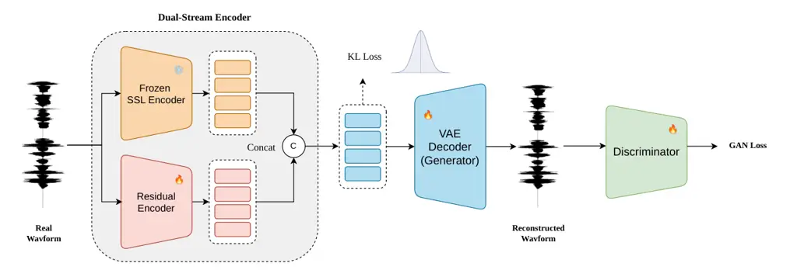

Chen$`{}^{*,\,}`$ Guan Wu Wang Huang Zha Li Fang Hong$`{}^{\dagger,\,}`$
Li

# SARA: A Dual-Stream VAE for High-Fidelity Speech Generation via Integrating Semantic and Acoustic RepresentationsThanks: ^(∗) Work done during an internship at DiDi Global Inc.Thanks: ^(†) Corresponding author

Peijie    Wenhao    Weijie    Kadi    Daiyu    Zhuanling    Junbo    Jun
   Qingyang    Lin

###### Abstract

Zero-shot text-to-speech (TTS) relies on robust speech representations.
However, current speech tokenizers face a fundamental trade-off:
acoustic codecs preserve high-fidelity audio but lack linguistic
constraints, causing content errors during generation, whereas semantic
tokens from self-supervised learning (SSL) models ensure precise text
alignment but discard some acoustic information. To bridge this gap, we
propose SARA, a dual-stream VAE that directly fuses a frozen SSL
semantic anchor with a dedicated residual acoustic encoder. This
effectively mitigates the dilemma, creating an efficient and compact
latent space without relying on complex regularizers. SARA achieves
superior reconstruction quality over strong baselines. Furthermore, in
downstream zero-shot TTS tasks, it yields highly natural and expressive
synthesis quality, and maintains robust generation performance even
under accelerated inference, offering a favorable trade-off between
synthesis speed and computational cost.

###### keywords

text-to-speech, self-supervised learning, variational autoencoder

^(†)^(†)address: ¹ School of Informatics, Xiamen University, China  
² School of Electronic Science and Engineering, Xiamen University,
China  
³ DiDi Global Inc., Beijing, China ^(†)^(†)email:
peijiechen@stu.xmu.edu.cn

## 1 Introduction

Recent advancements in large-scale speech generation models have
significantly propelled the capabilities of zero-shot Text-to-Speech
(TTS) systems\[1, 2, 3, 4\], enabling the synthesis of highly natural
and speaker-adaptive voices from minimal prompt data. A fundamental
component of these modern architectures is the speech tokenizer \[5\] or
neural speech codec\[6, 7, 8, 9\], which compresses continuous,
high-dimensional audio waveforms into low-dimensional latent
representations. The quality and nature of this latent space dictate not
only the theoretical upper bound of the synthesized audio quality but
also the stability and convergence speed of the downstream
autoregressive\[10, 11\] or non-autoregressive\[12, 13, 14\] generative
models.

However, designing an optimal continuous or discrete representation
remains a formidable challenge due to the inherent trade-off between
reconstruction fidelity and generative controllability. Traditional
acoustic codecs excel at reconstructing fine-grained physical details,
such as high-frequency harmonics and subtle environmental noises, but
their latent spaces lack explicit linguistic constraints. Consequently,
when utilized in downstream zero-shot TTS, these representations often
fail to provide strong semantic guidance, leading to content
inaccuracies and elevated Word Error Rates (WER). Conversely, purely
semantic representations derived from pre-trained self-supervised
learning (SSL) models (e.g., HuBERT\[15\], WavLM\[16\], W2v-BERT\[17\])
or ASR models offer exceptional content alignment. Yet, they inherently
discard crucial acoustic characteristics, including speaker identity,
emotion, and prosody, resulting in synthesized speech with low speaker
similarity and degraded perceptual quality. Existing attempts to bridge
this gap, such as introducing complex semantic regularization losses
\[18, 19\] during VAE training, are often indirect and difficult to
balance.

To address this dilemma, we propose SARA (Semantic-Acoustic Residual
Autoencoder), a novel dual-stream VAE framework designed to seamlessly
integrate high-level linguistic content with fine-grained acoustic
details. Rather than relying on complex regularization terms, SARA
adopts a structural approach to complementary representation
integration. It pairs a frozen pre-trained SSL model acting as a stable
semantic anchor with a dedicated residual acoustic encoder tasked with
capturing the rich timbre omitted by the semantic branch. By fusing
these inherently aligned streams, SARA creates a compact and efficient
information bottleneck. The entire framework is optimized via a VAE
paradigm, ensuring a well-regularized latent space for downstream
generative modeling and exceptional perceptual quality for waveform
reconstruction.

The main contributions are summarized as follows:

- •
  We introduce SARA, a dual-stream variational autoencoder that
  effectively mitigates the semantic-acoustic trade-off via a direct and
  highly compressed feature integration mechanism, eliminating the need
  for complex training regularizers.
- •
  Extensive evaluations demonstrate that SARA achieves excellent speech
  reconstruction fidelity compared to strong VAE baselines, all while
  maintaining an extremely compact latent space.
- •
  When in a zero-shot TTS framework, SARA significantly improves both
  content accuracy and speaker similarity, validating the powerful
  generalization capabilities of its learned representations.

Audio samples of the reconstructed speech and downstream zero-shot
synthesized speech from various models are available at
https://pppjchen.github.io/SARA.

## 2 Method



Figure 1: Overall model structure. The frozen SSL Encoder extracts
semantic representations, while the Residual Acoustic Encoder captures
fine-grained acoustic details.

As illustrated in Fig. 1, we propose SARA, a dual-stream variational
autoencoder (VAE) that effectively mitigates the trade-off between
reconstruction fidelity and generative quality.

Section 2.1 first formulates the basic VAE and its training objectives.
Section 2.2 then explains our semantic injection strategy. Finally,
Section 2.3 details the proposed network architecture.

### 2.1 Variational Autoencoder

Our framework leverages a Variational Autoencoder (VAE) to extract
continuous latent representations from raw speech waveforms. The
architecture comprises an encoder that projects the input signal $`x`$
into a latent variable $`z`$, and a decoder that reconstructs the
waveform $`\hat{x}`$ from this latent space. Optimization proceeds by
maximizing the Evidence Lower Bound (ELBO):

```math
\displaystyle\text{ELBO}:=\mathbb{E}_{q_{\phi}(z|x)}\left[\log p_{\psi}(x|z)\right]-\mathcal{D}_{\mathrm{KL}}\left[q_{\phi}(z|x)\parallel p(z)\right] \tag{1}
```

In this context, $`q_{\phi}(z|x)`$ represents the variational posterior
approximating the true distribution, while $`p_{\psi}(x|z)`$ defines the
likelihood of the generated output. The Kullback-Leibler (KL) divergence
term constrains the latent distribution to align with the standard
Gaussian prior $`p(z)=\mathcal{N}(0,I)`$.

To operationalize this objective, we minimize the negative ELBO,
formulated as a weighted combination of reconstruction and
regularization terms. For the reconstruction loss
$`\mathcal{L}_{\text{recon}}`$, we adopt the multi-scale mel-spectrogram
loss consistent with DAC \[6\]. To further augment perceptual quality,
we integrate adversarial training employing a multi-period discriminator
\[20\] and a multi-band \[6\], multi-scale STFT discriminator, which is
optimized by an L1 feature-matching loss
($`\mathcal{L}_{\text{feat}}`$).

The complete VAE training objective is expressed as follows:

```math
\mathcal{L}_{\text{VAE}}=\lambda_{\text{recon}}\,\mathcal{L}_{\text{recon}}+\lambda_{\text{KL}}\,\mathcal{L}_{\text{KL}}+\lambda_{\text{adv}}\,\mathcal{L}_{\text{adv}}+\lambda_{\text{feat}}\,\mathcal{L}_{\text{feat}}. \tag{2}
```

### 2.2 Semantic Injection

Striking a balance between reconstruction fidelity and generative
controllability constitutes a core obstacle in developing discrete
neural speech codecs\[5\]. Prior research indicates that incorporating
guidance from pre-trained SSL models (e.g., HuBERT\[15\], WavLM\[16\],
W2v-BERT\[17\]) offers a viable pathway. By leveraging the rich semantic
representations embedded within these models, codecs receive more
effective supervision, thereby enhancing the convergence and performance
of downstream auto-regressive systems\[21\].

Recently, Semantic-VAE\[18\] introduced a semantic regularization loss
into the VAE training framework to improve downstream TTS performance.
In contrast, we propose an architectural innovation that directly
integrates a frozen SSL model into the VAE encoder, paired with a
residual acoustic encoder, eliminating the need for additional
regularization losses. The frozen SSL branch acts as a stable content
anchor, supplying robust semantic representations. Concurrently, the
residual acoustic branch captures fine-grained acoustic details omitted
by the SSL model. This complementary representation learning allows us
to directly navigate the reconstruction-generation dilemma: the semantic
branch ensures content consistency for generation, while the residual
branch preserves high-fidelity details. Consequently, SARA yields latent
representations that are both semantically meaningful for downstream
modeling and acoustically rich for high-quality speech synthesis.

|                       |          |             |         |                      |                 |                  |                  |
| --------------------- | -------- | ----------- | ------- | -------------------- | --------------- | ---------------- | ---------------- |
| Model                 | \#Param. | Sample Rate | Frame/s | WER(%)$`\downarrow`$ | SIM$`\uparrow`$ | CMOS$`\uparrow`$ | SMOS$`\uparrow`$ |
| GT                    | \-       | \-          | \-      | 2.23                 | 0.69            | +0.12            | 3.92             |
| Vocoder Resynthesized | \-       | 24k         | \-      | 2.32                 | 0.66            | +0.10            | 3.91             |
| Cosyvoice             | 300M     | 24k         | \-      | 3.59                 | 0.66            | -0.14            | 3.95             |
| E2 TTS                | 333M     | 24k         | \-      | 2.95                 | 0.69            | -0.08            | 3.98             |
| F5-TTS                | 336M     | 24k         | \-      | 2.42                 | 0.66            | -0.06            | 3.99             |
| F5-TTS-Small          | 159M     | 24k         | 93.75   | 2.23                 | 0.60            | -0.10            | 3.85             |
|   + Semantic-VAE\*    | 159M     | 16k         | 40      | 1.95                 | 0.64            | \-               | \-               |
|   + SARA (Ours)       | 159M     | 24k         | 50      | 1.79                 | 0.63            | -0.03            | 3.89             |
| Scaling Up            |          |             |         |                      |                 |                  |                  |
| F5-TTS-Base + SARA    | 336M     | 24k         | 50      | 1.74                 | 0.655           | 0.00             | 3.90             |

Table 1: Performance comparison of the proposed SARA framework.
Zero-shot TTS performance is evaluated on the LibriSpeech-PC test-clean
set using F5-TTS\[12\] as the generation backbone. \* means the results
are obtained from the paper.

### 2.3 Model Architecture

The proposed SARA framework adopts a dual-stream encoder architecture
designed to capture complementary speech information. The system maps a
24 kHz input waveform $`x`$ to a 64-dimensional latent representation
$`z`$ at a frame rate of 50 Hz, which is subsequently reconstructed by a
high-fidelity decoder.

#### 2.3.1 Acoustic and Semantic Encoders

Following the design principles of BigCodec\[8\], the residual acoustic
encoder is built upon a series of residual Convolutional Neural Network
(CNN) blocks. Each block incorporates Snake activation functions and
multiple convolutional layers with varying dilation rates to model
multi-scale sequential patterns effectively. To capture long-range
temporal dependencies, the CNN output is processed by a two-layer
unidirectional Long Short-Term Memory (LSTM) network. In parallel, we
employ W2v-BERT 2.0\[17\] as a frozen SSL encoder to extract robust
semantic representations. These two independent branches are designed to
comprehensively process the input waveform before feature integration.

The residual acoustic encoder pipeline achieves a cumulative
downsampling factor of 480 through five successive modules with striding
factors of \[2, 3, 4, 4, 5\]. This configuration effectively compresses
the 24 kHz audio signal into a compact 50 Hz acoustic latent stream
($`z_{\text{ac}}`$).

Conveniently, the frozen W2v-BERT 2.0\[17\] encoder inherently extracts
semantic representations ($`z_{\text{sem}}`$) at an identical frame rate
of 50 Hz. Leveraging this temporal alignment, we directly concatenate
the semantic and acoustic streams along the channel dimension. The fused
feature map is subsequently passed through a linear projection layer to
map it to the target fixed dimension, yielding the final 64-dimensional
latent representation $`z`$. This straightforward yet highly effective
fusion mechanism maintains an efficient information bottleneck for
downstream tasks, seamlessly integrating high-level linguistic content
with fine-grained acoustic details.

#### 2.3.2 Decoder

The decoder is based on the HiFi-GAN\[20\] architecture, utilizing
multi-receptive field fusion to synthesize high-fidelity waveforms from
the integrated latent representations. The entire framework is optimized
using an adversarial training paradigm to ensure perceptual naturalness
and reconstruction accuracy.

## 3 Experimental Setup

### 3.1 Datasets and Metrics

We utilize a large-scale corpus consisting of LibriTTS\[22\] and
LibriHeavy\[23\] to train the proposed SARA model. LibriHeavy provides
approximately 50,000 hours of audiobook speech (originally at 16 kHz),
while LibriTTS contributes 585 hours of high-quality, multi-speaker
speech at 24 kHz. To unify the sampling rate across the corpus, all
training data is resampled to 24 kHz, totaling over 50,000 hours of
diverse audio. For the downstream generative task, the zero-shot TTS
model is trained exclusively on the LibriHeavy subset.

To evaluate the efficacy of SARA in balancing reconstruction fidelity
with generative utility, we conduct assessments across two primary
benchmarks:

- •
  Speech Reconstruction and Latent Utility: We evaluate reconstruction
  performance on the test-clean split of LibriSpeech\[24\]. Objective
  metrics including PESQ\[25\], STOI, and UTMOS\[26\] are employed to
  quantify perceptual quality and intelligibility. Furthermore, to
  verify the semantic robustness and speaker-independent nature of the
  latent space, we perform cross-sentence generation. This is assessed
  via WER for content accuracy, SIM for voice consistency, and UTMOS for
  overall naturalness.
- •
  Downstream Zero-Shot TTS: We assess the zero-shot synthesis
  performance on the LibriSpeech-PC test-clean set\[24, 12, 27\]. For
  objective evaluations, we utilize the Whisper-large-v3\[28\] model to
  compute the WER. To measure SIM, we calculate the cosine similarity
  between the generated speech and the reference audio using speaker
  embeddings extracted from a pre-trained WavLM-TDCNN model.
  Furthermore, we conduct subjective evaluations across two primary
  dimensions: CMOS, to assess overall audio quality, clarity,
  naturalness, and high-fidelity details; and SMOS, to evaluate speaker
  similarity in terms of timbre reconstruction and prosodic patterns.

### 3.2 Training Details

#### 3.2.1 VAE Setup

SARA is optimized for 200k iterations using a global batch size of 256.
For a fair comparison, all ablation studies share the same training
configuration. Audio samples are segmented into 1-second clips and
resampled to 24kHz, resulting in approximately 256 seconds of audio per
batch. We employ the AdamW optimizer with an initial learning rate of
$`1\times 10^{-4}`$. A linear warm-up schedule is applied to both the
learning rate and the $`\lambda_{\text{KL}}`$ coefficient for the first
10,000 updates, followed by an exponential decay with a factor of
$`\gamma=0.9999996`$. The loss weighting coefficients are empirically
set as: $`\lambda_{\text{KL}}=0.01`$, $`\lambda_{\text{adv}}=1`$,
$`\lambda_{\text{feat}}=1`$, and $`\lambda_{\text{recon}}=15`$.

#### 3.2.2 Downstream Zero-shot TTS Model Setup

For the downstream zero-shot TTS task, we adopt F5-TTS as the generation
backbone and follow its original training configuration. Specifically,
we substitute the conventional mel-spectrograms with the latent
representations extracted from the SARA dual-stream encoder. The model
is optimized using the AdamW optimizer with a peak learning rate of
$`7.5\times 10^{-5}`$, incorporating a 20,000-step warm-up phase
followed by linear decay. During inference, we maintain consistency with
the F5-TTS protocol, employing a sway sampling strategy and an Euler ODE
solver for high-quality speech synthesis.

### 3.3 Result

#### 3.3.1 Downstream Zero-shot TTS Results

The downstream zero-shot TTS performance is summarized in Table 1. A key
strength of the SARA framework lies in its exceptional content
preservation capabilities. When integrated into the F5-TTS-Small, SARA
achieves an impressive WER of 1.79, significantly outperforming the
vanilla baseline. Remarkably, this compact configuration surpasses
parameter-heavy baselines, including Cosyvoice\[2\], E2 TTS\[13\], and
the standard F5-TTS. Beyond content accuracy, SARA maintains robust
acoustic fidelity, surpassing the vanilla model in objective speaker
similarity. Notably, SARA circumvents the 16 kHz bandwidth limitation of
the Semantic-VAE baseline, supporting high-fidelity synthesis while
simultaneously delivering lower WER.

Crucially, the proposed representations exhibit strong scalability. When
applied to the F5-TTS (Base), SARA further drives the WER down to 1.74
and elevates the SIM to 0.655. These results conclusively validate
SARA’s efficacy in successfully navigating the trade-off between
semantic controllability and high-fidelity acoustic generation.

#### 3.3.2 Reconstruction Results

Table 2 presents the objective reconstruction results on the LibriSpeech
test-clean set. Despite operating at a compact latent, the proposed SARA
framework also demonstrates exceptional reconstruction fidelity. SARA
achieves the highest PESQ and STOI, significantly outperforming the
high-bandwidth Vocos\[29\] baseline and the Semantic-VAE. Notably, the
substantial improvement in PESQ over the Vanilla VAE directly validates
that the dual-stream architecture, pairing a semantic anchor with a
residual acoustic encoder, effectively recovers fine-grained acoustic
details. Furthermore, while Semantic-VAE yields a higher UTMOS score,
SARA maintains a highly competitive score of 4.100, which effectively
surpasses the GT, confirming its robust perceptual naturalness.

| Model        | Frame/s | Dim | PESQ$`\uparrow`$ | STOI$`\uparrow`$ | UTMOS$`\uparrow`$ |
| ------------ | ------- | --- | ---------------- | ---------------- | ----------------- |
| GT           | \-      | \-  | \-               | \-               | 4.086             |
| Vocos        | 93.75   | 100 | 3.605            | 0.977            | 3.625             |
| Semantic-VAE | 40      | 64  | 3.968            | 0.981            | 4.129             |
| Vanilla VAE  | 50      | 64  | 4.076            | 0.983            | 4.095             |
| SARA (Ours)  | 50      | 64  | 4.389            | 0.993            | 4.100             |

Table 2: Speech reconstruction performance on the LibriSpeech test-clean
set.

### 3.4 Ablation Study

We conduct ablation studies to evaluate the effectiveness of the
proposed dual-stream architecture. Specifically, we evaluate the
reconstruction capabilities of the VAE models on the LibriSpeech-PC
test-clean set. To explicitly isolate the contribution of the
dual-stream encoder, we compute not only standard acoustic quality
metrics but also the WER and SIM against the ground truth reference
audio.

| Model          | PESQ$`\uparrow`$ | STOI$`\uparrow`$ | UTMOS$`\uparrow`$ | WER(%)$`\downarrow`$ | SIM$`\uparrow`$ |
| -------------- | ---------------- | ---------------- | ----------------- | -------------------- | --------------- |
| GT             | \-               | \-               | 4.097             | 2.23                 | 0.690           |
| SARA           | 4.366            | 0.992            | 4.110             | 2.32                 | 0.685           |
|  - Res Encoder | 2.655            | 0.930            | 3.944             | 2.41                 | 0.640           |
|  - SSL Encoder | 4.074            | 0.983            | 4.113             | 2.41                 | 0.683           |

Table 3: Ablation study of speech reconstruction on the LibriSpeech-PC
test-clean set.

Table 3 presents an ablation study on the LibriSpeech-PC test-clean set
to evaluate the individual contributions of the dual-stream components
within the SARA framework. The removal of the residual acoustic encoder
(denoted as ”- Res Encoder”) leads to a measurable decline in speaker
consistency, with the SIM score decreasing from 0.685 to 0.640.
Furthermore, objective reconstruction metrics (PESQ, STOI) experience
noticeable drops. This indicates that the frozen SSL semantic branch,
while rich in content representation, is insufficient on its own to
reconstruct the original speaker’s timbre and fine-grained acoustic
details. Conversely, omitting the pre-trained SSL semantic encoder
(denoted as ”- SSL Encoder”) effectively reduces the architecture to a
Vanilla VAE and compromises the linguistic stability of the latent
space. Consequently, content accuracy degrades, as evidenced by an
increase in WER from 2.32 to 2.41.

Together, these findings support the design motivation of SARA: the
semantic and acoustic branches capture complementary information. The
dual-stream integration effectively balances semantic consistency for
generation with the acoustic requirements for high-fidelity speech
reconstruction.

|                     |     |                      |                 |                   |
| ------------------- | --- | -------------------- | --------------- | ----------------- |
| Model               | NFE | WER(%)$`\downarrow`$ | SIM$`\uparrow`$ | RTF$`\downarrow`$ |
| GT                  | \-  | 2.23                 | 0.69            | \-                |
| F5-TTS-Small        | 8   | 3.51                 | 0.58            | 0.061             |
| F5-TTS-Small        | 32  | 2.23                 | 0.60            | 0.115             |
| F5-TTS-Small + SARA | 6   | 2.27                 | 0.57            | 0.058             |
| F5-TTS-Small + SARA | 8   | 1.82                 | 0.62            | 0.079             |
| F5-TTS-Small + SARA | 32  | 1.79                 | 0.63            | 0.184             |

Table 4: Ablation study on flow matching inference steps for F5-TTS
Small integrated with SARA on the LibriSpeech-PC test-clean set. The
Real-Time Factor (RTF) is computed with the average of the inference
time of the test-set on a single NVIDIA A100 80GB GPU.

In flow matching paradigms, the ability to maintain synthesis quality at
lower NFE typically indicates a well-conditioned target latent space. To
evaluate this, we analyze the impact of reduced inference steps in Table 4. Remarkably, decreasing the NFE from 32 to 8 yields only negligible
shifts in both WER and SIM. This strong performance suggests that SARA’s
dual-stream architecture effectively regularizes the generative
trajectory. The robust semantic anchors reduce the prediction ambiguity,
allowing the flow model to converge rapidly and synthesize high-fidelity
speech. Although the dual-stream encoder introduces extra inference
cost, SARA with 8 steps (RTF 0.079) achieves comparable synthesis
quality to the 32-step F5-TTS-small baseline (RTF 0.115) while offering
a more favorable trade-off in generation speed.

## 4 Conclusion

We presented SARA, a novel dual-stream VAE designed to mitigate the gap
between high-fidelity acoustic reconstruction and robust generative
controllability. SARA seamlessly integrates high-level linguistic
content and fine-grained acoustic details by pairing a frozen SSL branch
with a residual acoustic encoder. Leveraging their temporal alignment,
we established an efficient 50Hz, 64-dimensional information bottleneck.
Experiments confirm that SARA surpasses robust baselines in speech
reconstruction intelligibility and quality. Crucially, utilizing SARA’s
latent space within the F5-TTS framework yields substantial gains in
zero-shot content accuracy and speaker similarity. Ultimately, SARA
provides a versatile foundation for large-scale speech generation, with
future efforts focused on multilingual scaling and integrating
autoregressive models.

## 5 Generative AI Use Disclosure

During the preparation of this manuscript, the authors used generative
AI tools to polish the English language, improve readability, and assist
with LaTEX\xspaceformatting. These tools were not used to generate any
scientific claims, experimental results, or significant parts of the
manuscript.

## 6 Acknowledgements

This work was supported in part by the National Natural Science
Foundation of China under Grants 62276220 and 62371407 and the
Innovation of Policing Science and Technology, Fujian province (Grant
number: 2024Y0068)

## References

- \[1\] Z. Du, Y. Wang, Q. Chen, X. Shi, X. Lv, T. Zhao, Z. Gao, Y.
  Yang, C. Gao, H. Wang, et al. (2024) Cosyvoice 2: scalable streaming
  speech synthesis with large language models. arXiv preprint
  arXiv:2412.10117. Cited by: §1.
- \[2\] Z. Du, Q. Chen, S. Zhang, K. Hu, H. Lu, Y. Yang, H. Hu, S.
  Zheng, Y. Gu, Z. Ma, et al. (2024) Cosyvoice: a scalable multilingual
  zero-shot text-to-speech synthesizer based on supervised semantic
  tokens. arXiv preprint arXiv:2407.05407. Cited by: §1, §3.3.1.
- \[3\] Z. Du, C. Gao, Y. Wang, F. Yu, T. Zhao, H. Wang, X. Lv, H.
  Wang, C. Ni, X. Shi, et al. (2025) Cosyvoice 3: towards in-the-wild
  speech generation via scaling-up and post-training. arXiv preprint
  arXiv:2505.17589. Cited by: §1.
- \[4\] S. Zhou, Y. Zhou, Y. He, X. Zhou, J. Wang, W. Deng, and J.
  Shu (2025) Indextts2: a breakthrough in emotionally expressive and
  duration-controlled auto-regressive zero-shot text-to-speech. arXiv
  preprint arXiv:2506.21619. Cited by: §1.
- \[5\] X. Zhang, D. Zhang, S. Li, Y. Zhou, and X. Qiu (2023)
  Speechtokenizer: unified speech tokenizer for speech large language
  models. arXiv preprint arXiv:2308.16692. Cited by: §1, §2.2.
- \[6\] R. Kumar, P. Seetharaman, A. Luebs, I. Kumar, and K.
  Kumar (2023) High-fidelity audio compression with improved rvqgan.
  Advances in Neural Information Processing Systems 36, pp. 27980–27993.
  Cited by: §1, §2.1.
- \[7\] A. Défossez, J. Copet, G. Synnaeve, and Y. Adi (2022) High
  fidelity neural audio compression. arXiv preprint arXiv:2210.13438.
  Cited by: §1.
- \[8\] D. Xin, X. Tan, S. Takamichi, and H. Saruwatari (2024) Bigcodec:
  pushing the limits of low-bitrate neural speech codec. arXiv preprint
  arXiv:2409.05377. Cited by: §1, §2.3.1.
- \[9\] P. Chen, W. Guan, K. Wang, W. Wu, H. Huang, Q. Hong, and L.
  Li (2025) DS-codec: dual-stage training with mirror-to-nonmirror
  architecture switching for speech codec. arXiv preprint
  arXiv:2505.24314. Cited by: §1.
- \[10\] D. Jia, Z. Chen, J. Chen, C. Du, J. Wu, J. Cong, X. Zhuang, C.
  Li, Z. Wei, Y. Wang, et al. (2025) Ditar: diffusion transformer
  autoregressive modeling for speech generation. arXiv preprint
  arXiv:2502.03930. Cited by: §1.
- \[11\] Y. Zhou, G. Zeng, X. Liu, X. Li, R. Yu, Z. Wang, R. Ye, W.
  Sun, J. Gui, K. Li, et al. (2025) Voxcpm: tokenizer-free tts for
  context-aware speech generation and true-to-life voice cloning. arXiv
  preprint arXiv:2509.24650. Cited by: §1.
- \[12\] Y. Chen, Z. Niu, Z. Ma, K. Deng, C. Wang, J. JianZhao, K. Yu,
  and X. Chen (2025) F5-tts: a fairytaler that fakes fluent and faithful
  speech with flow matching. In Proceedings of the 63rd Annual Meeting
  of the Association for Computational Linguistics (Volume 1: Long
  Papers), pp. 6255–6271. Cited by: §1, Table 1, Table 1, 2nd item.
- \[13\] S. E. Eskimez, X. Wang, M. Thakker, C. Li, C. Tsai, Z. Xiao, H.
  Yang, Z. Zhu, M. Tang, X. Tan, et al. (2024) E2 tts: embarrassingly
  easy fully non-autoregressive zero-shot tts. In 2024 IEEE spoken
  language technology workshop (SLT), pp. 682–689. Cited by: §1, §3.3.1.
- \[14\] K. Lee, D. W. Kim, J. Kim, S. Chung, and J. Cho (2024)
  DiTTo-tts: diffusion transformers for scalable text-to-speech without
  domain-specific factors. arXiv preprint arXiv:2406.11427. Cited by:
  §1.
- \[15\] W. Hsu, B. Bolte, Y. H. Tsai, K. Lakhotia, R. Salakhutdinov,
  and A. Mohamed (2021) Hubert: self-supervised speech representation
  learning by masked prediction of hidden units. IEEE/ACM transactions
  on audio, speech, and language processing 29, pp. 3451–3460. Cited by:
  §1, §2.2.
- \[16\] S. Chen, C. Wang, Z. Chen, Y. Wu, S. Liu, Z. Chen, J. Li, N.
  Kanda, T. Yoshioka, X. Xiao, et al. (2022) Wavlm: large-scale
  self-supervised pre-training for full stack speech processing. IEEE
  Journal of Selected Topics in Signal Processing 16 (6), pp. 1505–1518.
  Cited by: §1, §2.2.
- \[17\] Y. Chung, Y. Zhang, W. Han, C. Chiu, J. Qin, R. Pang, and Y.
  Wu (2021) W2v-bert: combining contrastive learning and masked language
  modeling for self-supervised speech pre-training. In 2021 IEEE
  Automatic Speech Recognition and Understanding Workshop (ASRU),
  pp. 244–250. Cited by: §1, §2.2, §2.3.1, §2.3.1.
- \[18\] Z. Niu, S. Hu, J. Choi, Y. Chen, P. Chen, P. Zhu, Y. Yang, B.
  Zhang, J. Zhao, C. Wang, et al. (2025) Semantic-vae:
  semantic-alignment latent representation for better speech synthesis.
  arXiv preprint arXiv:2509.22167. Cited by: §1, §2.2.
- \[19\] X. Leng, J. Singh, Y. Hou, Z. Xing, S. Xie, and L. Zheng (2025)
  Repa-e: unlocking vae for end-to-end tuning of latent diffusion
  transformers. In Proceedings of the IEEE/CVF International Conference
  on Computer Vision, pp. 18262–18272. Cited by: §1.
- \[20\] J. Kong, J. Kim, and J. Bae (2020) Hifi-gan: generative
  adversarial networks for efficient and high fidelity speech synthesis.
  Advances in neural information processing systems 33, pp. 17022–17033.
  Cited by: §2.1, §2.3.2.
- \[21\] J. Li, X. Lin, Z. Li, S. Huang, Y. Wang, C. Wang, Z. Zhan,
  and Z. Wu (2025) Dualcodec: a low-frame-rate, semantically-enhanced
  neural audio codec for speech generation. arXiv preprint
  arXiv:2505.13000. Cited by: §2.2.
- \[22\] H. Zen, V. Dang, R. Clark, Y. Zhang, R. J. Weiss, Y. Jia, Z.
  Chen, and Y. Wu (2019) Libritts: a corpus derived from librispeech for
  text-to-speech. arXiv preprint arXiv:1904.02882. Cited by: §3.1.
- \[23\] W. Kang, X. Yang, Z. Yao, F. Kuang, Y. Yang, L. Guo, L. Lin,
  and D. Povey (2024) Libriheavy: a 50,000 hours asr corpus with
  punctuation casing and context. In ICASSP 2024-2024 IEEE International
  Conference on Acoustics, Speech and Signal Processing (ICASSP),
  pp. 10991–10995. Cited by: §3.1.
- \[24\] V. Panayotov, G. Chen, D. Povey, and S. Khudanpur (2015)
  Librispeech: an asr corpus based on public domain audio books. In 2015
  IEEE international conference on acoustics, speech and signal
  processing (ICASSP), pp. 5206–5210. Cited by: 1st item, 2nd item.
- \[25\] A. W. Rix, J. G. Beerends, M. P. Hollier, and A. P.
  Hekstra (2001) Perceptual evaluation of speech quality (pesq)-a new
  method for speech quality assessment of telephone networks and codecs.
  In 2001 IEEE international conference on acoustics, speech, and signal
  processing. Proceedings (Cat. No. 01CH37221), Vol. 2, pp. 749–752.
  Cited by: 1st item.
- \[26\] T. Saeki, D. Xin, W. Nakata, T. Koriyama, S. Takamichi, and H.
  Saruwatari (2022) Utmos: utokyo-sarulab system for voicemos challenge 2022. arXiv preprint arXiv:2204.02152. Cited by: 1st item.
- \[27\] A. Meister, M. Novikov, N. Karpov, E. Bakhturina, V. Lavrukhin,
  and B. Ginsburg (2023) Librispeech-pc: benchmark for evaluation of
  punctuation and capitalization capabilities of end-to-end asr models.
  In 2023 IEEE automatic speech recognition and understanding workshop
  (ASRU), pp. 1–7. Cited by: 2nd item.
- \[28\] A. Radford, J. W. Kim, T. Xu, G. Brockman, C. McLeavey, and I.
  Sutskever (2023) Robust speech recognition via large-scale weak
  supervision. In International conference on machine learning,
  pp. 28492–28518. Cited by: 2nd item.
- \[29\] H. Siuzdak (2023) Vocos: closing the gap between time-domain
  and fourier-based neural vocoders for high-quality audio synthesis.
  arXiv preprint arXiv:2306.00814. Cited by: §3.3.2.
