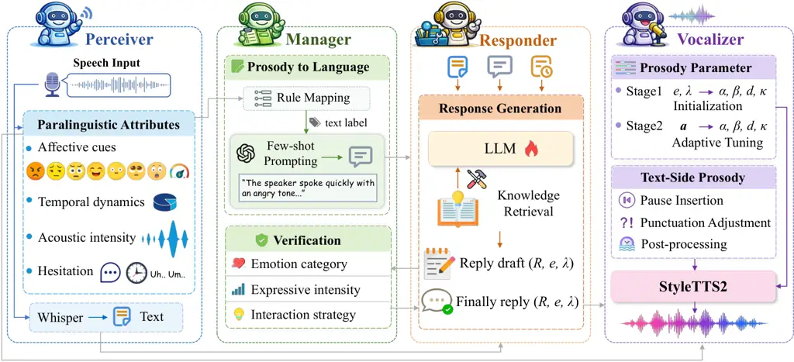

Zhang Yang Gao Feng Wang Zhang

# PRISM: Prosody-Integrated Multi-Agent Reasoning Framework for Empathetic Spoken Dialogue

Wen    Xiaocui    Zhuoyue    Shi    Daling    Yifei

###### Abstract

Empathetic spoken dialogue systems require not only semantically
appropriate responses but also emotionally aligned prosodic expression.
However, cascade pipelines often discard acoustic cues during
speech-to-text conversion, while end-to-end speech models lack
interpretable control over emotion and knowledge integration. To address
these challenges, we propose PRISM, a multi-agent framework for
empathetic spoken dialogue that decouples speech perception, response
generation, and speech synthesis into coordinated components. PRISM
introduces a prosody-to-language translation mechanism to stabilize
large language model reasoning and enables on-demand invocation of
external knowledge tools for empathetic dialogue generation.
Experimental results demonstrate that PRISM achieves consistent
improvements in empathy, prosodic appropriateness, and text response
generation quality across objective and subjective metrics. Our code is
available at:
[https://github.com/Bxzfrm/PRISM](https://github.com/Bxzfrm/PRISM).

###### keywords

empathetic spoken dialogue, multi-agent framework, prosody-to-language
translation

^(†)^(†)address: School of Computer Science and Engineering,
Northeastern University, Shenyang 110819, China ^(†)^(†)email:
zhangw6@mails.neu.edu.cn, yangxiaocui@cse.neu.edu.cn,
gaozy5@mails.neu.edu.cn, fengshi@cse.neu.edu.cn,
wangdaling@cse.neu.edu.cn, zhangyifei@cse.neu.edu.cn

## 1 Introduction

In recent years, advances in large language models (LLMs) and speech
technologies have driven human-machine dialogue systems from text-based
interaction toward more natural spoken interaction. Compared with text
dialogue, spoken dialogue conveys not only linguistic content but also
prosodic and emotional cues \[1, 2\]. These paralinguistic signals play
a critical role in empathetic understanding and emotional responding
\[3, 4\], especially in emotional support scenarios where users’
affective states evolve dynamically \[5\]. However, how to effectively
perceive, model, and utilize prosodic information remains challenging.
Existing studies \[6, 7\] can be categorized into cascade-based spoken
dialogue systems and end-to-end speech models.

Traditional spoken dialogue systems typically adopt an “ASR-text
dialogue model-TTS” cascade paradigm \[8\]. While relatively mature,
once speech is transcribed into text, prosodic information related to
emotion and expressiveness is inevitably lost. Although the system may
generate semantically appropriate responses, it often fails to exhibit
genuine empathy at the speech level \[9\]. Moreover, the lack of
consistency constraints between emotional intent and speech synthesis
leaves empathy largely confined to the textual domain. Recently,
end-to-end speech models have emerged, aiming to directly model mappings
from speech to speech or from speech to multimodal outputs \[10, 11, 12,
13\]. While these approaches exhibit strong representational capacity
and high naturalness in generation, they typically treat prosody and
emotion as implicit features, lacking interpretable intermediate
representations. In addition, such models often rely on large-scale
joint training, making integration of new knowledge or emotional
strategies inflexible.

Knowledge augmentation improves the factuality and contextual
adaptability of dialogue systems \[14\], and LLMs can dynamically
acquire external information through tool calling without additional
training \[15\]. However, prior work focuses on text-based settings.
Empathetic spoken dialogue requires jointly modeling prosodic
perception, emotional reasoning, knowledge augmentation, and speech
generation across modalities. Conventional pipelines often suffer from
irreversible information loss and accumulated errors due to strictly
sequential processing. In contrast, a tool-calling multi-agent paradigm
enables feedback-driven coordination and adaptive tool use through
structured intermediate representations, allowing emotional intent and
contextual knowledge to propagate from perception to generation.

To address these challenges, we propose PRISM (Prosody-aware Reasoning
Integrated System via a Multi-agent framework), which decouples speech
perception, dialogue management, response generation, and speech
synthesis into specialized agents. To facilitate stable emotional
reasoning over prosodic signals, the framework incorporates a
prosody-to-language translation mechanism converting acoustic cues into
interpretable textual representations. PRISM supports on-demand
invocation of external knowledge tools during dialogue, allowing
plug-and-play updates of knowledge sources by modifying the external
tools without retraining the underlying models. In summary, our
contributions are as follows:

- •
  We propose PRISM, a multi-agent framework with feedback-driven
  coordination that enables prosody-aware dialogue reasoning and
  flexible knowledge integration for empathetic spoken dialogue.
- •
  We introduce a prosody-to-language translation mechanism that maps
  acoustic and temporal cues into interpretable natural-language
  descriptions, enabling LLM to reason about user’s states in a more
  stable and human-aligned manner.
- •
  We conduct extensive experiments on the AvaMERG dataset and observe
  that PRISM consistently outperforms baseline models across automatic,
  human, and LLM-based evaluations. Ablation studies further validate
  the effectiveness of each proposed component.



Figure 1: Overview of the PRISM Framework.

## 2 Method

We propose a prosody-aware multi-agent empathetic spoken dialogue
framework consisting of four components: Perceiver, Manager, Responder,
and Vocalizer, as illustrated in Figure 1.

### 2.1 Perceiver

For a given input speech $`x`$, Perceiver outputs a structured state
$`s=\{T,\mathbf{a}\}`$, where $`T`$ is the transcription text,
$`\mathbf{a}`$ represents a set of paralinguistic attributes designed to
capture the speaker’s emotional and expressive state. The paralinguistic
attributes $`\mathbf{a}`$ include four categories of cues: (i) affective
cues, including the recognized emotion category and its confidence
score; (ii) temporal dynamics, including speaking rate and pause ratio;
(iii) acoustic intensity, characterized by energy statistics; (iv)
disfluency-related cues, including filler rate and an interpretable
expression certainty score.

We employ OpenAI Whisper \[16\] to convert the raw speech waveform into
text. Utterance-level emotion is classified using FunASR’s emotion2vec
\[17\], a self-supervised speech emotion recognizer fine-tuned on
multi-domain emotional corpora. The model outputs:

- •
  Emotion label
  $`y\in\{\text{angry},\allowbreak\text{disgusted},\allowbreak\text{fearful},\allowbreak\text{happy},\allowbreak\text{neutral},\allowbreak\text{other},\allowbreak\text{sad},\allowbreak\text{surprised},\allowbreak\text{melodious},\allowbreak\text{unknown}\}`$.
- •
  Confidence score $`q_{y}`$: softmax probability of the top-1 class.

To capture temporal speaking behavior, we resample audio to 16 kHz and
estimate speech and silence durations using WebRTC voice activity
detector (VAD). The pause ratio $`p`$ is computed as the proportion of
silence duration to the total utterance duration. The speaking rate is
defined as the ratio between the number of transcript tokens and the
estimated speech duration,

```math
r=\frac{N_{\text{tok}}(T)}{t_{\text{sp}}}, \tag{1}
```

where $`N_{\text{tok}}(T)`$ denotes the number of tokens in the
transcription and $`t_{\text{sp}}`$ denotes the speech duration. To
characterize acoustic intensity, we compute frame-level RMS energy over
the utterance and summarize it using the mean and standard deviation,
denoted as $`(\mu_{E},\sigma_{E})`$. These statistics provide a compact
representation of the speaker’s overall loudness and energy variation.
Disfluency and hesitation are quantified using the filler rate, defined
as:

```math
f=\frac{N_{f}}{\max\left(N_{\text{tok}}(T),\,1\right)}, \tag{2}
```

where $`N_{f}`$ denotes the number of predefined filler expressions
detected in the transcription. In addition, to quantify speaker
confidence, we derive a heuristic certainty score $`c\in[0,1]`$ based on
speaking rate, pause behavior, and disfluency. Specifically, we first
normalize the speaking rate $`r`$, pause ratio $`p`$, and filler rate
$`f`$ as:

```math
\displaystyle\tilde{r} \displaystyle=\mathrm{clip}\left(\frac{r-2}{4},0,1\right), \tag{3}
```

```math
\displaystyle\tilde{p} \displaystyle=\mathrm{clip}(p,0,1), \tag{4}
```

```math
\displaystyle\tilde{f} \displaystyle=\mathrm{clip}\left(\frac{f}{0.2},0,1\right). \tag{5}
```

where $`\mathrm{clip}(x,0,1)`$ bounds $`x`$ to the interval $`[0,1]`$.
The certainty score is then computed as a weighted combination:

```math
c=\mathrm{clip}\left(0.55\,\tilde{r}+0.25\,(1-\tilde{p})+0.20\,(1-\tilde{f}),\,0,\,1\right). \tag{6}
```

Perceiver converts raw speech into a structured paralinguistic state
that can be used for downstream dialogue and empathetic response
generation.

### 2.2 Manager

Manager acts as a central coordination module responsible for
controlling the dialogue flow. Its role is reflected in the following
two aspects.

Prosody-to-language translation. Given the structured paralinguistic
attributes produced by Perceiver, Manager converts numerical and
categorical prosodic cues into a concise natural-language description
$`D`$. The process is divided into two stages. First, numerical
attributes are mapped to descriptive textual labels via rule-based
thresholding, yielding a stable and interpretable intermediate
representation. Second, an LLM is employed under a few-shot prompting
strategy to generate a coherent and natural prosody description. The
prompt template \[18\] includes carefully designed examples that
illustrate how factors such as emotional intensity, rhythm, pausing
behavior, speech energy, and certainty jointly contribute to natural
prosodic expression. By converting paralinguistic information into
language-level descriptions, Manager enables Responder to perceive the
user’s expressive state in a manner closer to human understanding,
without directly processing low-level acoustic numerical features.

Response-level verification. To enhance generation stability and
expressive consistency, we introduce a lightweight alignment-check
module within Manager to perform post-hoc verification of Responder’s
outputs. This module evaluates whether a response aligns with the user’s
prosodic description in terms of emotion category, expressive intensity,
and interaction strategy. When inconsistencies are detected, it provides
minimal revision suggestions to guide Responder’s refinement.

### 2.3 Responder

Responder is responsible for generating the final empathetic response at
the dialogue level and incorporating external knowledge when necessary.
Unlike cascade approaches that model tool invocation and text generation
as separate stages, we adopt a unified language model that jointly
handles knowledge usage decisions and empathetic response generation,
thereby reducing error propagation across modules.

Specifically, Responder takes the current transcript $`T`$, the language
prosody description $`D`$ generated by Manager, and the dialogue history
$`H`$ as inputs. LLM first implicitly determines whether external
knowledge support is required; when it detects that commonsense or
contextual enrichment would lead to a more appropriate response, the
system retrieves multi-dimensional commonsense information via external
tools and injects it into the generation context in textual form. This
design enables knowledge expansion by replacing or updating the
knowledge interfaces, without retraining model parameters.

During response generation, the model uses the prosody description as an
explicit conditioning signal to dynamically adjust its response strategy
and emotional expression. For example, when the prosodic description
indicates user hesitation or low emotional valence, the model tends to
generate more reassuring and supportive responses; in contrast, in
high-arousal emotional scenarios, it correspondingly amplifies emotional
resonance. In addition to the response text $`R`$, Responder also
predicts the target emotion category $`e`$ and its expressive intensity
$`\lambda`$, providing control signals for subsequent emotionally
adaptive speech synthesis.

### 2.4 Vocalizer

Vocalizer converts textual responses into expressive speech that mirrors
the emotional context through adaptive prosodic control. We employ
StyleTTS2 \[19\], a diffusion-based TTS model supporting reference-based
voice cloning and fine-grained prosody manipulation.

Prosody Parameter Computation. Vocalizer computes speech synthesis
parameters via a two-stage control process, integrating both target
empathetic intent and user’s prosodic cues. Four parameters are
dynamically determined: timbre similarity $`\alpha`$, prosody strength
$`\beta`$, the number of diffusion refinement steps $`d`$, and an
expressive scaling factor $`\kappa`$.

```math
(\alpha,\beta,d,\kappa)=V(e,\lambda,\mathbf{a}). \tag{7}
```

In the first stage, base values are initialized according to the target
emotion $`e`$ and its expressive intensity $`\lambda\in[0,1]`$, as
predicted by Responder. The emotion intensity $`\lambda`$ primarily
influences prosody strength and synthesis fidelity by adjusting
$`\beta`$ and $`d`$: higher intensity leads to stronger prosodic
variation and more refinement steps, while lower intensity yields
flatter and more neutral delivery. The emotion category $`e`$ controls
the expressive scaling factor $`\kappa`$, enabling different affective
styles. In the second stage, the base parameters are adaptively refined
using the user paralinguistic attributes $`\mathbf{a}`$ output by
Perceiver. Specifically, features such as expressive certainty,
emotional intensity, and energy-related statistics are used to modulate
prosody realization in an empathy-aware manner. When the user exhibits
low certainty or frequent pauses, the synthesizer reduces prosody
strength $`\beta`$ and attenuates the expressive scaling factor
$`\kappa`$ to produce a gentler delivery; when strong negative emotions
are detected, $`\beta`$ is increased to better match the required level
of empathetic expressiveness. Finally, all parameters are clipped to
valid ranges to ensure synthesis stability.

Text-Side Prosody Shaping and Post-Processing. For users with frequent
pauses, short pause markers are inserted after punctuation to yield a
more patient speaking rhythm. For highly positive target emotions,
punctuation is adjusted to enhance expressiveness, whereas for sad or
soothing responses, excessive exclamation is suppressed to maintain a
calm tone. Finally, optional post-processing is applied to further
adjust speaking rate and output energy through time-stretching and
amplitude scaling when required. These operations allow fine-grained
alignment between the synthesized speech and the user’s conversational
rhythm.

## 3 Experiments

|                  |                      |        |                             |               |
| ---------------- | -------------------- | ------ | --------------------------- | ------------- |
| Model            | ROU-1/2/L            | B-S    | BLEU-1/2/3/4                | Dist-1/2      |
| ASR+LLM          | 0.1690/0.0271/0.1406 | 0.8652 | 0.1431/0.0514/0.0250/0.0132 | 0.0286/0.1722 |
| SpeechGPT        | 0.1437/0.0228/0.1126 | 0.8534 | 0.1189/0.0543/0.0304/0.0180 | 0.0306/0.1340 |
| OSUM-EChat       | 0.1546/0.0263/0.1146 | 0.8673 | 0.1381/0.0485/0.0226/0.0111 | 0.0342/0.2133 |
| SALMONN-7B       | 0.1598/0.0321/0.1226 | 0.8684 | 0.1415/0.0616/0.0357/0.0217 | 0.0225/0.1346 |
| SALMONN-13B      | 0.1666/0.0381/0.1289 | 0.8705 | 0.1464/0.0570/0.0303/0.0174 | 0.0218/0.1327 |
| Qwen2.5-Omni-7B  | 0.1880/0.0542/0.1555 | 0.8746 | 0.1737/0.0831/0.0530/0.0352 | 0.0375/0.2380 |
| LLaMA-Omni2      | 0.1703/0.0329/0.1330 | 0.8674 | 0.1565/0.0646/0.0354/0.0205 | 0.0460/0.2376 |
| OpenS2S          | 0.1759/0.0356/0.1408 | 0.8691 | 0.1883/0.0700/0.0355/0.0192 | 0.0428/0.2329 |
| PRISM (Qwen)     | 0.2254/0.0745/0.1872 | 0.8792 | 0.2041/0.1142/0.0792/0.0571 | 0.0390/0.2519 |
| PRISM (Llama)    | 0.2027/0.0649/0.1743 | 0.8801 | 0.2318/0.1223/0.0805/0.0555 | 0.0409/0.2574 |
| Always Kno       | 0.1611/0.0204/0.1301 | 0.8667 | 0.1606/0.0560/0.0259/0.0133 | 0.0258/0.1550 |
| w/o Kno          | 0.1624/0.0205/0.1300 | 0.8633 | 0.1601/0.0549/0.0254/0.0129 | 0.0250/0.1495 |
| w/o Prosody-Desc | 0.1521/0.0202/0.1262 | 0.8641 | 0.1727/0.0583/0.0271/0.0137 | 0.0280/0.1617 |

Table 1: Comparison results between PRISM and other baseline models on
the AvaMERG test set

### 3.1 Dataset

TOOL-ED \[20\] is a tool-augmented extension of the ED \[21\] dataset,
designed to study empathetic dialogue generation with external knowledge
integration. Each sample consists of a short dialogue context and its
corresponding empathetic response, along with annotations indicating
whether external knowledge should be invoked. AvaMERG \[22\] is a
multimodal empathetic dialogue dataset that extends ED with speech and
facial expression annotations. We evaluate our system on the standard
audio subset split of AvaMERG.

### 3.2 Baselines

To validate the effectiveness of our PRISM, we select the following
baseline models for comparison and conduct a comparative evaluation
based on test results on the AvaMERG dataset.

ASR+LLM: A cascaded pipeline using OpenAI Whisper for transcription
followed by an LLM for response generation. SpeechGPT \[11\]: An
end-to-end speech dialogue system integrating speech understanding and
generation. SALMONN \[23\]: A dual-encoder model for joint speech
understanding and response generation. We report results for both 7B and
13B. OSUM-EChat \[24\]: An emotion-aware speech dialogue system
generating responses from speech inputs. Qwen2.5-Omni-7B \[25\]: A
multimodal model supporting unified speech, vision, and text dialogue.
LLaMA-Omni2 \[26\]: A speech-enabled LLaMA-style model for end-to-end
multimodal dialogue. OpenS2S \[27\]: An open-source speech-to-speech
dialogue model mapping input speech directly to output speech.

### 3.3 Implementation Details

We fine-tune Qwen2.5-7B-Instruct \[28\] and Llama-3.1-8B-Instruct \[29\]
on TOOL-ED to serve as Responder. Among all modules in PRISM, only the
Responder is fine-tuned. Training is conducted using the LLaMA-Factory
\[30\] on NVIDIA A6000 (48GB) GPUs. We use GPT-3.5-Turbo via the OpenAI
API as Manager. For external knowledge augmentation, we employ
COMET-BART \[31\], a BART-based commonsense generation model. All
baseline models are fine-tuned on the AvaMERG training set using the
hyperparameter settings recommended in their original papers or official
implementations.

### 3.4 Results and Analysis

#### 3.4.1 Main Results

We present comparative results through automatic evaluation, LLM-based
evaluation, and human evaluation.

Automatic Evaluation. Table 1 presents the automatic evaluation results
on the AvaMERG test set. The evaluation is conducted across four
categories of metrics: n-gram overlap (BLEU) \[32\], semantic similarity
(BERTScore) \[33\], content overlap (ROUGE) \[34\], and lexical
diversity (Dist) \[35\]. Overall, PRISM (Qwen) and PRISM (Llama)
outperform all baseline models across nearly all evaluation metrics,
particularly achieving substantial improvements in ROUGE and BLEU
scores, demonstrating PRISM’s advantage in generation quality and
content relevance.

Figure 2: Human evaluation results.

Human Evaluation. We recruited three researchers specializing in
empathetic dialogue systems as annotators. A total of 100 dialogue
samples were randomly selected for evaluation. Each sample was
independently rated by all annotators. The evaluation is conducted from
two aspects, text quality and speech quality, covering the following six
dimensions: Empathy, Informativity, Fluency, Consistency, Prosodic
Appropriateness, Audio-Text Alignment. All evaluations are conducted
using a 5-point Likert scale \[36\]. Inter-annotator agreement was
measured using intraclass correlation coefficient (ICC), yielding an
average score of 0.81, indicating substantial agreement. As shown in
Figure 2, PRISM demonstrates comparable or superior performance across
most evaluation dimensions when compared with the advanced speech
models, LLaMA-Omni2 and OpenS2S.

LLM-based Evaluation. To comprehensively evaluate the quality of the
generated responses, we additionally employ GPT-4o for automatic
evaluation. The model conducts A/B testing \[37\] primarily from three
aspects, empathy, fluency, and consistency to compare the performance of
PRISM against other baselines. As shown in Figure 3, PRISM demonstrates
a higher win rate against OpenS2S and LLaMA-Omni2.

Figure 3: LLM-based evaluation results. Only wins and losses are shown;
ties are omitted.

#### 3.4.2 Ablation Studies

We conducted ablation studies on two key aspects: autonomous knowledge
invocation and prosody description. Specifically, we evaluated the
results under the following conditions: enforcing knowledge usage at
every turn (Always Kno), excluding knowledge entirely (w/o Kno) and
removing prosody descriptions (w/o Prosody-Desc). All ablation
experiments were performed based on Qwen2.5-7B-Instruct. As demonstrated
in Table 1 and Figure 3, all ablation variants exhibit performance
degradation, thereby validating the effectiveness of our proposed
method.

## 4 Conclusion

We present PRISM, a multi-agent framework for empathetic spoken dialogue
that integrates prosody-to-language translation and adaptive knowledge
invocation. By decoupling perception, reasoning, and synthesis, PRISM
enables interpretable emotion modeling and controllable speech
generation, achieving improved empathy and prosodic alignment over
baselines.

## 5 Acknowledgments

The work was supported by the National Natural Science Foundation of
China (Nos. 62272092, 62172086), and the Fundamental Research Funds for
the Central Universities under Grants (N25XQD004). Thanks to the
KinaMind society for their inspiring environment and unwavering support.

## 6 Generative AI Use Disclosure

Generative AI tools were used only for proofreading and language
polishing. All technical contributions, experimental design, and
analyses were conducted by the authors.

## References

- \[1\] F. Eyben, K. R. Scherer, B. W. Schuller, J. Sundberg, E.
  André, C. Busso, L. Y. Devillers, J. Epps, P. Laukka, S. S. Narayanan,
  et al. (2015) The geneva minimalistic acoustic parameter set (gemaps)
  for voice research and affective computing. IEEE transactions on
  affective computing 7 (2), pp. 190–202. Cited by: §1.
- \[2\] J. Chi, M. de Seyssel, and N. Schluter (2025) The role of
  prosody in spoken question answering. In Findings of the Association
  for Computational Linguistics: NAACL 2025, pp. 8468–8479. Cited by:
  §1.
- \[3\] H. Zhou, M. Huang, T. Zhang, X. Zhu, and B. Liu (2018) Emotional
  chatting machine: emotional conversation generation with internal and
  external memory. In Proceedings of the Thirty-Second AAAI Conference
  on Artificial Intelligence and Thirtieth Innovative Applications of
  Artificial Intelligence Conference and Eighth AAAI Symposium on
  Educational Advances in Artificial Intelligence,
  AAAI’18/IAAI’18/EAAI’18. External Links: ISBN 978-1-57735-800-8 Cited
  by: §1.
- \[4\] B. W. Schuller (2018) Speech emotion recognition: two decades in
  a nutshell, benchmarks, and ongoing trends. Commun. ACM 61 (5),
  pp. 90–99. External Links: ISSN 0001-0782,
  [Link](https://doi.org/10.1145/3129340),
  [Document](https://dx.doi.org/10.1145/3129340) Cited by: §1.
- \[5\] M. Wang, P. Wang, L. Wu, X. Yang, D. Wang, S. Feng, Y. Chen, B.
  Wang, and Y. Zhang (2025) AnnaAgent: dynamic evolution agent system
  with multi-session memory f or realistic seeker simulation. In
  Findings of the Association for Computational Linguistics: ACL
  2025, W. Che, J. Nabende, E. Shutova, and M. T. Pilehvar (Eds.),
  Vienna, Austria, pp. 23221–23235. External Links:
  [Link](https://aclanthology.org/2025.findings-acl.1192/),
  [Document](https://dx.doi.org/10.18653/v1/2025.findings-acl.1192),
  ISBN 979-8-89176-256-5 Cited by: §1.
- \[6\] R. Huang, M. Li, D. Yang, J. Shi, X. Chang, Z. Ye, Y. Wu, Z.
  Hong, J. Huang, J. Liu, et al. (2024) Audiogpt: understanding and
  generating speech, music, sound, and talking head. In Proceedings of
  the AAAI Conference on Artificial Intelligence, Vol. 38,
  pp. 23802–23804. Cited by: §1.
- \[7\] D. Serdyuk, Y. Wang, C. Fuegen, A. Kumar, B. Liu, and Y.
  Bengio (2018) Towards end-to-end spoken language understanding. In
  2018 IEEE International Conference on Acoustics, Speech and Signal
  Processing (ICASSP), pp. 5754–5758. Cited by: §1.
- \[8\] S. Ji, Y. Chen, M. Fang, J. Zuo, J. Lu, H. Wang, Z. Jiang, L.
  Zhou, S. Liu, X. Cheng, et al. (2024) Wavchat: a survey of spoken
  dialogue models. arXiv preprint arXiv:2411.13577. Cited by: §1.
- \[9\] F. Eyben, M. Wöllmer, and B. Schuller (2010) Opensmile: the
  munich versatile and fast open-source audio feature extractor. In
  Proceedings of the 18th ACM International Conference on Multimedia, MM
  ’10, New York, NY, USA, pp. 1459–1462. External Links: ISBN
  9781605589336, [Link](https://doi.org/10.1145/1873951.1874246),
  [Document](https://dx.doi.org/10.1145/1873951.1874246) Cited by: §1.
- \[10\] Z. Borsos, R. Marinier, D. Vincent, E. Kharitonov, O.
  Pietquin, M. Sharifi, D. Roblek, O. Teboul, D. Grangier, M.
  Tagliasacchi, and N. Zeghidour (2023) AudioLM: a language modeling
  approach to audio generation. IEEE/ACM Trans. Audio, Speech and Lang.
  Proc. 31, pp. 2523–2533. External Links: ISSN 2329-9290,
  [Link](https://doi.org/10.1109/TASLP.2023.3288409),
  [Document](https://dx.doi.org/10.1109/TASLP.2023.3288409) Cited by:
  §1.
- \[11\] D. Zhang, S. Li, X. Zhang, J. Zhan, P. Wang, Y. Zhou, and X.
  Qiu (2023) SpeechGPT: empowering large language models with intrinsic
  cross-modal conversational abilities. In Findings of the Association
  for Computational Linguistics: EMNLP 2023, H. Bouamor, J. Pino, and K.
  Bali (Eds.), Singapore, pp. 15757–15773. External Links:
  [Link](https://aclanthology.org/2023.findings-emnlp.1055/),
  [Document](https://dx.doi.org/10.18653/v1/2023.findings-emnlp.1055)
  Cited by: §1, §3.2.
- \[12\] S. Chen, C. Wang, Y. Wu, Z. Zhang, L. Zhou, S. Liu, Z. Chen, Y.
  Liu, H. Wang, J. Li, L. He, S. Zhao, and F. Wei (2025) Neural codec
  language models are zero-shot text to speech synthesizers. IEEE
  Transactions on Audio, Speech and Language Processing 33 (),
  pp. 705–718. External Links:
  [Document](https://dx.doi.org/10.1109/TASLPRO.2025.3530270) Cited by:
  §1.
- \[13\] P. K. Rubenstein, C. Asawaroengchai, D. D. Nguyen, A. Bapna, Z.
  Borsos, F. de Chaumont Quitry, P. Chen, D. E. Badawy, W. Han, E.
  Kharitonov, H. Muckenhirn, D. R. Padfield, J. Qin, D. Rozenberg, T. N.
  Sainath, J. Schalkwyk, M. Sharifi, M. D. Tadmor, Ramanovich, M.
  Tagliasacchi, A. Tudor, M. Velimirovi’c, D. Vincent, J. Yu, Y.
  Wang, V. Zayats, N. Zeghidour, Y. Zhang, Z. Zhang, L. Zilka, and C. H.
  Frank (2023) AudioPaLM: a large language model that can speak and
  listen. ArXiv abs/2306.12925. External Links:
  [Link](https://api.semanticscholar.org/CorpusID:259224345) Cited by:
  §1.
- \[14\] P. Lewis, E. Perez, A. Piktus, F. Petroni, V. Karpukhin, N.
  Goyal, H. Küttler, M. Lewis, W. Yih, T. Rocktäschel, S. Riedel, and D.
  Kiela (2020) Retrieval-augmented generation for knowledge-intensive
  nlp tasks. In Proceedings of the 34th International Conference on
  Neural Information Processing Systems, NIPS ’20, Red Hook, NY, USA.
  External Links: ISBN 9781713829546 Cited by: §1.
- \[15\] S. Yao, J. Zhao, D. Yu, N. Du, I. Shafran, K. Narasimhan,
  and Y. Cao (2022) ReAct: synergizing reasoning and acting in language
  models. ArXiv abs/2210.03629. External Links:
  [Link](https://api.semanticscholar.org/CorpusID:252762395) Cited by:
  §1.
- \[16\] A. Radford, J. W. Kim, T. Xu, G. Brockman, C. McLeavey, and I.
  Sutskever (2023) Robust speech recognition via large-scale weak
  supervision. In Proceedings of the 40th International Conference on
  Machine Learning, ICML’23. Cited by: §2.1.
- \[17\] Z. Ma, Z. Zheng, J. Ye, J. Li, Z. Gao, S. Zhang, and X.
  Chen (2024) Emotion2vec: self-supervised pre-training for speech
  emotion representation. In Findings of the Association for
  Computational Linguistics: ACL 2024, L. Ku, A. Martins, and V.
  Srikumar (Eds.), Bangkok, Thailand, pp. 15747–15760. External Links:
  [Link](https://aclanthology.org/2024.findings-acl.931/),
  [Document](https://dx.doi.org/10.18653/v1/2024.findings-acl.931) Cited
  by: §2.1.
- \[18\] M. Wang, Y. Liu, X. Liang, S. Li, Y. Huang, X. Zhang, S.
  Shen, C. Guan, D. Wang, S. hi Feng, H. Zhang, Y. Zhang, M. Zheng,
  and C. Zhang (2024) LangGPT: rethinking structured reusable prompt
  design framework for llms from the programming language. External
  Links: 2402.16929, [Link](https://arxiv.org/abs/2402.16929) Cited by:
  §2.2.
- \[19\] Y. A. Li, C. Han, V. S. Raghavan, G. Mischler, and N.
  Mesgarani (2023) StyleTTS 2: towards human-level text-to-speech
  through style diffusion and adversarial training with large speech
  language models. In Proceedings of the 37th International Conference
  on Neural Information Processing Systems, NIPS ’23, Red Hook, NY, USA.
  Cited by: §2.4.
- \[20\] H. Cao, Y. Zhang, S. Feng, X. Yang, D. Wang, and Y.
  Zhang (2025) TOOL-ED: enhancing empathetic response generation with
  the tool calling capability of LLM. In Proceedings of the 31st
  International Conference on Computational Linguistics, O. Rambow, L.
  Wanner, M. Apidianaki, H. Al-Khalifa, B. D. Eugenio, and S. Schockaert
  (Eds.), Abu Dhabi, UAE, pp. 5305–5320. External Links:
  [Link](https://aclanthology.org/2025.coling-main.355/) Cited by: §3.1.
- \[21\] H. Rashkin, E. M. Smith, M. Li, and Y. Boureau (2019) Towards
  empathetic open-domain conversation models: a new benchmark and
  dataset. In Proceedings of the 57th Annual Meeting of the Association
  for Computational Linguistics, A. Korhonen, D. Traum, and L. Màrquez
  (Eds.), Florence, Italy, pp. 5370–5381. External Links:
  [Link](https://aclanthology.org/P19-1534/),
  [Document](https://dx.doi.org/10.18653/v1/P19-1534) Cited by: §3.1.
- \[22\] H. Zhang, Z. Meng, M. Luo, H. Han, L. Liao, E. Cambria, and H.
  Fei (2025) Towards multimodal empathetic response generation: a rich
  text-speech-vision avatar-based benchmark. In Proceedings of the ACM
  on Web Conference 2025, WWW ’25, New York, NY, USA, pp. 2872–2881.
  External Links: ISBN 9798400712746,
  [Link](https://doi.org/10.1145/3696410.3714739),
  [Document](https://dx.doi.org/10.1145/3696410.3714739) Cited by: §3.1.
- \[23\] C. Tang, W. Yu, G. Sun, X. Chen, T. Tan, W. Li, L. Lu, Z. MA,
  and C. Zhang (2024) SALMONN: towards generic hearing abilities for
  large language models. In The Twelfth International Conference on
  Learning Representations, External Links:
  [Link](https://openreview.net/forum?id=14rn7HpKVk) Cited by: §3.2.
- \[24\] X. Geng, Q. Shao, H. Xue, S. Wang, H. Xie, Z. Guo, Y. Zhao, G.
  Li, W. Tian, C. Wang, Z. Zhao, K. Xia, Z. Zhang, Z. Lin, T. Zuo, M.
  Shao, Y. Cao, G. Ma, L. Li, Y. Dai, D. Gao, D. Guo, and L. Xie (2025)
  OSUM-echat: enhancing end-to-end empathetic spoken chatbot via
  understanding-driven spoken dialogue. External Links: 2508.09600,
  [Link](https://arxiv.org/abs/2508.09600) Cited by: §3.2.
- \[25\] J. Xu, Z. Guo, J. He, H. Hu, T. He, S. Bai, K. Chen, J.
  Wang, Y. Fan, K. Dang, B. Zhang, X. Wang, Y. Chu, and J. Lin (2025)
  Qwen2.5-omni technical report. External Links: 2503.20215,
  [Link](https://arxiv.org/abs/2503.20215) Cited by: §3.2.
- \[26\] Q. Fang, Y. Zhou, S. Guo, S. Zhang, and Y. Feng (2025)
  LLaMA-omni 2: LLM-based real-time spoken chatbot with autoregressive
  streaming speech synthesis. In Proceedings of the 63rd Annual Meeting
  of the Association for Computational Linguistics (Volume 1: Long
  Papers), W. Che, J. Nabende, E. Shutova, and M. T. Pilehvar (Eds.),
  Vienna, Austria, pp. 18617–18629. External Links:
  [Link](https://aclanthology.org/2025.acl-long.912/),
  [Document](https://dx.doi.org/10.18653/v1/2025.acl-long.912), ISBN
  979-8-89176-251-0 Cited by: §3.2.
- \[27\] C. Wang, T. Peng, W. Yang, Y. Bai, G. Wang, J. Lin, L. Jia, L.
  Wu, J. Wang, C. Zong, and J. Zhang (2025) OpenS2S: advancing fully
  open-source end-to-end empathetic large speech language model. In
  Proceedings of the 2025 Conference on Empirical Methods in Natural
  Language Processing: System Demonstrations, I. Habernal, P. Schulam,
  and J. Tiedemann (Eds.), Suzhou, China, pp. 906–917. External Links:
  [Link](https://aclanthology.org/2025.emnlp-demos.70/),
  [Document](https://dx.doi.org/10.18653/v1/2025.emnlp-demos.70), ISBN
  979-8-89176-334-0 Cited by: §3.2.
- \[28\] Qwen et al. (2025) Qwen2.5 technical report. External Links:
  2412.15115, [Link](https://arxiv.org/abs/2412.15115) Cited by: §3.3.
- \[29\] A. Grattafiori, A. Dubey, A. Jauhri, et al. (2024) The llama 3
  herd of models. External Links: 2407.21783,
  [Link](https://arxiv.org/abs/2407.21783) Cited by: §3.3.
- \[30\] Y. Zheng, R. Zhang, J. Zhang, Y. Ye, and Z. Luo (2024)
  LlamaFactory: unified efficient fine-tuning of 100+ language models.
  In Proceedings of the 62nd Annual Meeting of the Association for
  Computational Linguistics (Volume 3: System Demonstrations), Y.
  Cao, Y. Feng, and D. Xiong (Eds.), Bangkok, Thailand, pp. 400–410.
  External Links: [Link](https://aclanthology.org/2024.acl-demos.38/),
  [Document](https://dx.doi.org/10.18653/v1/2024.acl-demos.38) Cited by:
  §3.3.
- \[31\] A. Bosselut, H. Rashkin, M. Sap, C. Malaviya, A. Celikyilmaz,
  and Y. Choi (2019) COMET: commonsense transformers for automatic
  knowledge graph construction. In Proceedings of the 57th Annual
  Meeting of the Association for Computational Linguistics, A.
  Korhonen, D. Traum, and L. Màrquez (Eds.), Florence, Italy,
  pp. 4762–4779. External Links:
  [Link](https://aclanthology.org/P19-1470/),
  [Document](https://dx.doi.org/10.18653/v1/P19-1470) Cited by: §3.3.
- \[32\] K. Papineni, S. Roukos, T. Ward, and W. Zhu (2002) Bleu: a
  method for automatic evaluation of machine translation. In Proceedings
  of the 40th Annual Meeting of the Association for Computational
  Linguistics, P. Isabelle, E. Charniak, and D. Lin (Eds.),
  Philadelphia, Pennsylvania, USA, pp. 311–318. External Links:
  [Link](https://aclanthology.org/P02-1040/),
  [Document](https://dx.doi.org/10.3115/1073083.1073135) Cited by:
  §3.4.1.
- \[33\] T. Zhang, V. Kishore, F. Wu, K. Q. Weinberger, and Y.
  Artzi (2019) Bertscore: evaluating text generation with bert. arXiv
  preprint arXiv:1904.09675. Cited by: §3.4.1.
- \[34\] C. Lin (2004) ROUGE: a package for automatic evaluation of
  summaries. In Text Summarization Branches Out, Barcelona, Spain,
  pp. 74–81. External Links: [Link](https://aclanthology.org/W04-1013/)
  Cited by: §3.4.1.
- \[35\] J. Li, M. Galley, C. Brockett, J. Gao, and B. Dolan (2016) A
  diversity-promoting objective function for neural conversation models.
  In Proceedings of the 2016 Conference of the North American Chapter of
  the Association for Computational Linguistics: Human Language
  Technologies, K. Knight, A. Nenkova, and O. Rambow (Eds.), San Diego,
  California, pp. 110–119. External Links:
  [Link](https://aclanthology.org/N16-1014/),
  [Document](https://dx.doi.org/10.18653/v1/N16-1014) Cited by: §3.4.1.
- \[36\] R. Likert (1932) A technique for the measurement of attitudes..
  Archives of psychology. Cited by: §3.4.1.
- \[37\] S. Sabour, C. Zheng, and M. Huang (2022) Cem: commonsense-aware
  empathetic response generation. In Proceedings of the AAAI Conference
  on Artificial Intelligence, Vol. 36, pp. 11229–11237. Cited by:
  §3.4.1.
