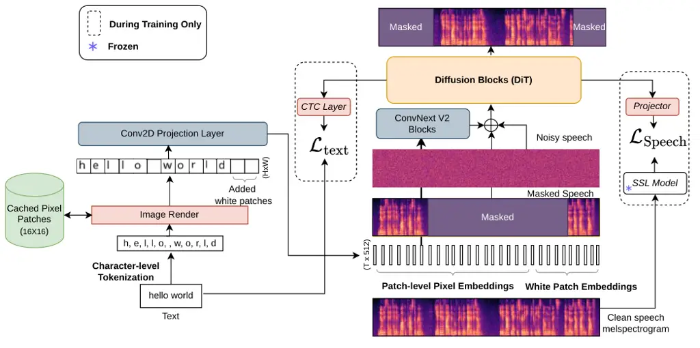
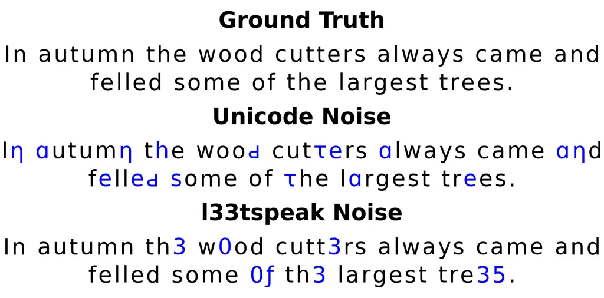
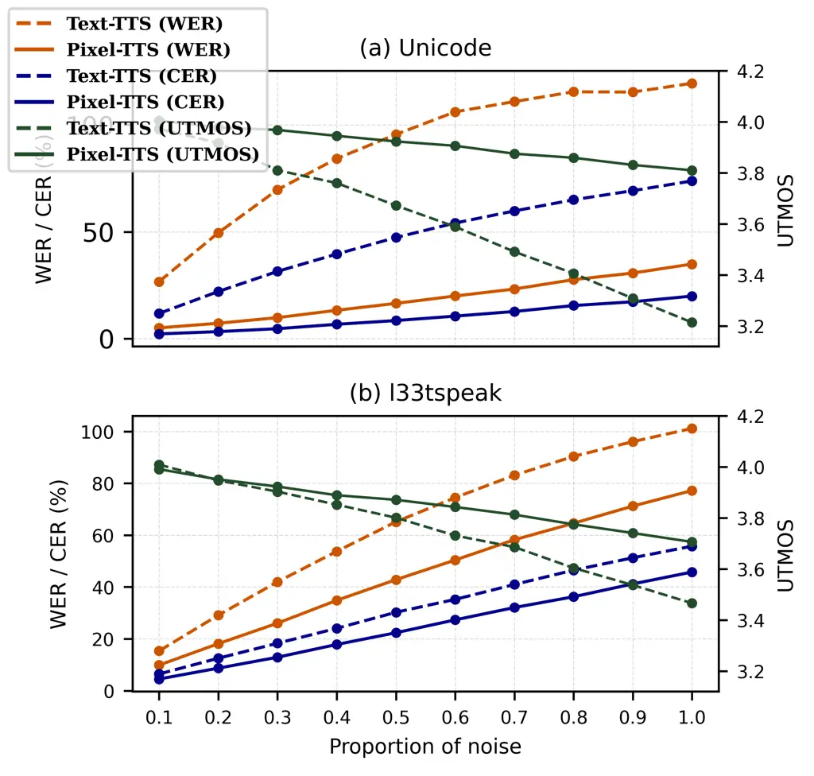
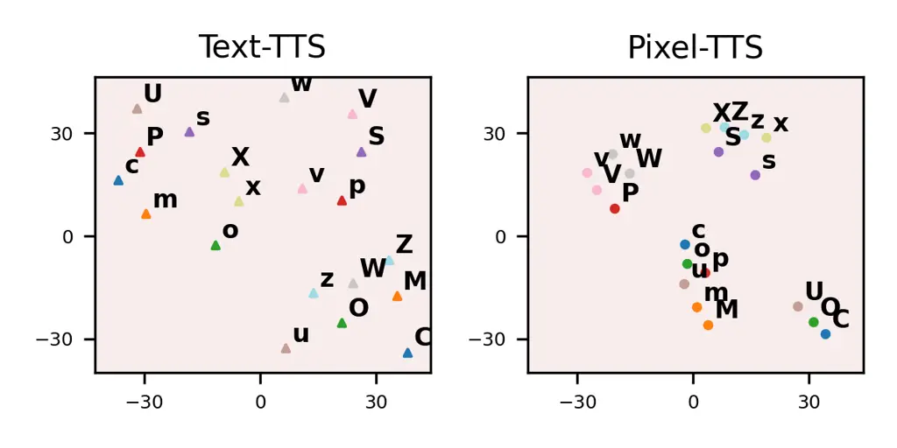
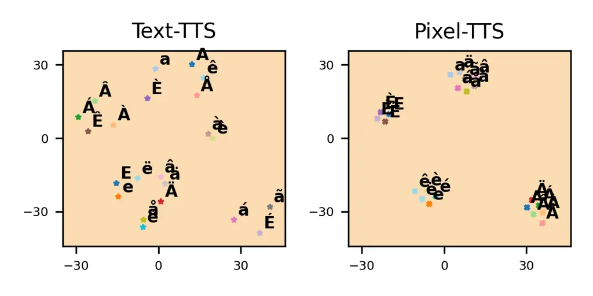

# Pixel-TTS: Image based Text Rendering for Robust Text-to-Speech

Adarsh Arigala    Arjun Gangwar    Srinivasan Umesh    Yova
Kementchedjhieva

###### Abstract

Recent advances in pixel-based text modeling show that representing text
as images enables models to exploit visual cues for language
understanding. Grounding text in its visual form allows structurally
similar characters with different Unicode encodings to produce similar
embeddings, benefiting cross-lingual and zero-shot scenarios.
Conventional text-based approaches treat each character independently,
limiting generalization to unseen characters and requiring embedding
expansion during cross-lingual adaptation. We propose Pixel-TTS, a
text-to-speech framework for visually grounded speech synthesis. It
renders text as images and projects them through a 2D convolutional
layer to generate embeddings. This design eliminates embedding matrix
expansion during fine-tuning while improving robustness to unseen
characters and orthographic variations. Extensive experiments show
Pixel-TTS achieves competitive performance with strong baselines, faster
convergence and robust zero-shot generalization.

¹SPRING Lab, Indian Institute of Technology, Madras, India

²MBZUAI, UAE

arigalaadarsh780@gmail.com, arjungangwar@gmail.com,
umeshs@ee.iitm.ac.in, yova.kementchedjhieva@mbzuai.ac.ae



Figure 1: Overview of the proposed method.

## 1 Introduction

Modern text-to-speech (TTS) systems achieve high synthesis quality but
often struggle to generalize to unseen languages, particularly under
zero-shot or low-resource adaptation. This limitation arises from their
reliance on discrete Unicode-based embeddings, which treat each
character independently and necessitate explicit vocabulary expansion
during language adaptation, increasing model complexity and training
cost  (Eskimez et al. 2024; Chen et al. 2025; Choi et al. 2025).

Inspired by advances in machine translation, where text is rendered as
images and mapped to pixel-level embeddings, pixel-based text encoding
has emerged as a viable alternative to vocabulary-based methods in
natural language processing (NLP), showing promising results in machine
translation (Salesky et al. 2021; Rust et al. 2023; Lotz et al. 2025).
Early studies extended visual text representations to speech generation
by replacing character embeddings with rendered text images. vTTS
(Nakano et al. 2022) incorporated a lightweight CNN-based visual encoder
into the conventional FastSpeech2 architecture and demonstrated that
visually rendered text can synthesize speech, while also showing that
visual cues such as bold, italic, and underline can control speech
emphasis and emotion. In a separate line of research, (Ohnaka et al. 2022) proposed Visual Onoma-to-Wave for environmental sound synthesis
from visually rendered onomatopoeic text. Both studies relied on
lightweight CNN-based visual encoders within conventional
FastSpeech2-based architectures. However, the TTS framework proposed in
(Nakano et al. 2022) was evaluated only on monolingual, single-speaker
datasets. Consequently, it remains unclear whether pixel-based text
representations can improve robustness to unseen Unicode characters in
zero-shot cross-lingual transfer and low-resource adaptation settings,
exploit visual similarities among languages written in the same script,
or benefit from multilingual scaling.

To address these limitations, we propose Pixel-TTS ¹¹ 1 Source code and
trained models will be released soon., an end-to-end TTS framework
grounded in visual text representations. By rendering text as images and
projecting them to pixel-level embeddings within a alignment free
flow-matching TTS framework, Pixel-TTS captures perceptual and
structural character similarities while improving robustness to unseen
or orthographically perturbed inputs. Unlike conventional TTS systems,
Pixel-TTS avoids embedding matrix expansion during cross-lingual
adaptation and achieves faster convergence while maintaining natural
speech synthesis quality. In this work, we present the following
contributions to text-to-speech synthesis

- •
  End-to-end Pixel-TTS: We introduce a visually-grounded alignment free
  flow-matching TTS model leveraging pixel-level embeddings, achieving
  faster convergence while maintaining synthesis quality comparable to
  competitive baselines.
- •
  Out-of-domain evaluation: We demonstrate that Pixel-TTS generalizes
  effectively to unseen and accented English speech, achieving
  consistent improvements in intelligibility.
- •
  Improved cross-lingual generalization: Pixel-based embeddings enable
  the model to transfer knowledge across languages with visually similar
  scripts.
- •
  Efficient fine-tuning in low-resource settings: Experiments on
  low-resource German Common Voice subsets, initialized from a
  LibriTTS-pretrained model, show that Pixel-TTS converges faster than
  conventional text-based TTS models.
- •
  Robustness to orthographic noise: Pixel-TTS handles Unicode and
  l33tspeak distortions better than text-based models.
- •
  Multilingual Scaling: We train multilingual Text-TTS and Pixel-TTS
  models on English, German, French, and Dutch, demonstrating that
  Pixel-TTS better leverages shared visual patterns across related Latin
  scripts, resulting in improved multilingual performance.

## 2 Methodology

In this section, we describe the Pixel-TTS framework (Figure.1). The
model builds upon ADMA (Choi et al. 2025), an extension of F5-TTS that
leverages its dual-modality alignment to accelerate convergence. We
adopt ADMA as our Text-TTS baseline, as it provides a strong benchmark
with state-of-the-art performance. Pixel-TTS has three main components:
(i) text-to-image rendering, (ii) projection of the rendered images, and
(iii) a unified training objective combining conditional flow matching
with dual-modality text and speech alignment.

### 2.1 Text-to-Image

To address text-to-speech alignment without explicit duration modeling,
we adopt a character-level representation following F5-TTS (Chen et al.
2025). Each character is rendered as a fixed $`16\times 16`$ grayscale
patch following the PIXEL framework (Rust et al. 2023). White
$`16\times 16`$ patches are used as filler tokens to preserve monotonic
alignment with the audio mel-spectrogram. The number of patches is
matched to the target acoustic frame length ($`T`$) through padding.

Rather than processing patches independently, all character patches are
stacked along the width dimension to form a single image
$`X\in\mathbb{R}^{H\times W},`$ where $`H`$ denotes the patch height and
$`W`$ is the total width of the stacked patches. In our implementation,
$`H=16`$ and $`W=T*16`$, where T is the target acoustic frame length.
All character patches are pre-computed and cached to improve training
efficiency.

### 2.2 Projection of Pixels to Embeddings

The constructed image $`X`$ is projected into a sequence of embeddings
using a 2D convolutional layer. The Conv2D layer is configured with
input channels $`=1`$, output channels $`=\text{d}_{\text{text}}=512`$,
kernel size $`16\times 16`$, and stride $`16`$. This configuration maps
each $`16\times 16`$ patch into a single embedding vector, producing
$`E\in\mathbb{R}^{\text{T}\times\text{d}_{\text{text}}},`$ where
$`\text{T}=W/16`$ corresponds to the temporal resolution of the
mel-spectrogram. This design preserves character-level temporal
alignment while enabling the filters to learn visually grounded text
representations aligned with speech. The resulting embeddings are
processed by four stacked ConvNeXtV2 (Woo et al. 2023) blocks operating
at a fixed embedding dimensionality of 512, similar to text-based TTS
models. This projection enables visually similar characters to produce
similar embeddings, accelerating convergence (Section 5.8). Apart from
these component, we follow the ADMA baseline for the overall
architecture and training procedure.

|              |          |       |        |       |           |       |        |       |
| ------------ | -------- | ----- | ------ | ----- | --------- | ----- | ------ | ----- |
| Updates (K)  | Text-TTS |       |        |       | Pixel-TTS |       |        |       |
|              | WER↓     | SIM↑  | UTMOS↑ | CER↓  | WER↓      | SIM↑  | UTMOS↑ | CER↓  |
| Ground Truth | 2.47     | 0.695 | 4.098  | 0.93  | 2.47      | 0.695 | 4.098  | 0.93  |
| 60           | 21.95    | 0.458 | 3.507  | 15.02 | 22.01     | 0.472 | 3.672  | 14.80 |
| 80           | 14.78    | 0.507 | 3.748  | 10.13 | 12.53     | 0.525 | 3.867  | 8.04  |
| 100          | 10.24    | 0.533 | 3.865  | 6.79  | 7.54      | 0.548 | 3.93   | 4.63  |
| 120          | 7.43     | 0.548 | 3.945  | 4.71  | 5.68      | 0.558 | 3.967  | 3.40  |
| 140          | 5.63     | 0.559 | 3.971  | 3.4   | 4.53      | 0.565 | 3.975  | 2.45  |
| 160          | 4.68     | 0.566 | 3.973  | 2.6   | 3.56      | 0.569 | 3.985  | 1.72  |
| 180          | 3.76     | 0.571 | 3.999  | 1.92  | 3.28      | 0.573 | 3.995  | 1.53  |
| 200          | 3.46     | 0.575 | 4.007  | 1.65  | 2.71      | 0.579 | 4.003  | 1.18  |
| 220          | 2.99     | 0.579 | 4.015  | 1.42  | 2.44      | 0.580 | 4.000  | 1.05  |
| 240          | 2.84     | 0.582 | 4.020  | 1.33  | 2.53      | 0.583 | 4.018  | 0.98  |
| 260          | 2.77     | 0.584 | 4.028  | 1.4   | 2.57      | 0.581 | 4.017  | 1.00  |
| 280          | 2.51     | 0.588 | 4.041  | 1.11  | 2.16      | 0.580 | 4.011  | 0.79  |
| 300          | 2.53     | 0.591 | 4.061  | 1.16  | 2.28      | 0.579 | 4.013  | 0.81  |

Table 1: Quantitative evaluation of Text-TTS and Pixel-TTS across
training updates on the LibriSpeech-PC test set. Arrows indicate
preferred direction: lower WER/CER (↓) and higher SIM/UTMOS (↑).

### 2.3 Flow Matching and Alignment Objective

We adopt the conditional flow matching (CFM) objective from F5-TTS (Chen
et al. 2025) as the primary generative loss. CFM learns a time-dependent
vector field that transports Gaussian noise to the target speech
distribution through continuous-time flow integration. In Pixel-TTS, CFM
is conditioned on the pixel-level embeddings obtained from the
projection of the text-to-image representation, allowing the model to
synthesize speech from visually grounded text features. Following ADMA,
we incorporate auxiliary alignment losses to improve mapping between the
text and speech modalities. A CTC-based text alignment loss (Graves et
al. 2006) is applied at an intermediate layer to encourage early
character-level alignment. A speech representation alignment loss is
introduced using HuBERT (Hsu et al. 2021), with features extracted from
the 21^(st) transformer layer on 16 kHz waveforms, and optimized via
cosine similarity. The final objective combines the CFM loss with the
text and speech alignment terms:

```math
\mathcal{L}=\mathcal{L}_{\mathrm{CFM}}+\lambda_{\mathrm{text}}\mathcal{L}_{\mathrm{text}}+\lambda_{\mathrm{speech}}\mathcal{L}_{\mathrm{speech}},
```

where $`\lambda_{\mathrm{text}}=0.1`$ and
$`\lambda_{\mathrm{speech}}=1.0`$. This joint objective encourages
faster text-speech alignment while preserving high-quality speech
synthesis.

## 3 Training Setup

We follow the original ADMA implementation using the small
configuration, consisting of approximately 159M parameters, 18
Transformer layers, 12 attention heads, hidden size 768. Waveform
synthesis is performed using the pre-trained Vocos vocoder (Siuzdak
2024), trained on LibriTTS (Zen et al. 2019) for 300k steps. Training
uses a cumulative batch size of 0.758 hours of audio. Optimization is
performed with AdamW (Loshchilov and Hutter 2019) using a learning rate
of $`7.5\times 10^{-5}`$, with 20k warmup steps followed by linear
decay. Experiments are conducted on 8 NVIDIA A100 GPUs.  
Audio is processed at a 24 kHz sampling rate before feature extraction.
Mel-spectrograms are computed using a 1024-sample window, 256-sample hop
size, and 100 mel bins. To align character-level embeddings with
acoustic frames, $`16\times 16`$ white patches are appended as filler
tokens to character patches. Model performance is evaluated using word
error rate (WER)(Radford et al. 2023), character error rate (CER),
speaker similarity (SIM)(Chen et al. 2022), and UTMOS (Saeki et al. 2022) as objective measures of intelligibility, speaker preservation,
and naturalness. We further conduct a mean opinion score (MOS)
evaluation with human listeners to assess the subjective naturalness and
overall quality of the synthesized speech.

## 4 Dataset

We train our model on LibriTTS (Zen et al. 2019), a 585-hour
multi-speaker English corpus sampled at 24 kHz and derived from
LibriSpeech (Panayotov et al. 2015).

In-Domain Evaluation: We follow the F5-TTS protocol using the
LibriSpeech-PC (Meister et al. 2023) test set, which contains 2.2 hours
of speech comprising 1,127 utterances with durations ranging from
4–10 s. Evaluation is performed in a cross-sentence generation setting,
where prompt and reference come from same speakers.

Out-of-Domain Evaluation: To evaluate out-of-domain generalization, we
use the SEED-TTS (English) (Anastassiou et al. 2024) and LJSpeech (Ito
and Johnson 2017). The SEED-TTS (English) test set contains 1,088
evaluation samples. Since LJSpeech is a single-speaker corpus, we
construct a zero-shot evaluation set from 2 hours of its training split,
resulting in 1,017 samples with durations 4–10 s.

Evaluation on Non-Native Speakers: To evaluate robustness on accented
English, we use the L2-ARCTIC corpus (Zhao et al. 2018), which contains
speech from non-native English speakers with six first-language (L1)
backgrounds (Arabic, Mandarin, Hindi, Korean, Spanish, and Vietnamese).
We use two speakers, resulting in approximately 6.52 hours of speech
comprising 4,634 utterances.

Zero-Shot Cross-Lingual Evaluation: For zero-shot, we use the German,
French, and Dutch Common Voice(Ardila et al. 2020) test sets. The
experimental setup and dataset statistics are described in Section 5.5.

Low-Resource Adaptation: We fine-tune both Text-TTS and Pixel-TTS on
10-hour and 50-hour subsets of the German Common Voice training set.
Details of the fine-tuning setup are provided in Section 5.6.

Multilingual Training: In Section 6, we extend our study to a
multilingual setting. We train Pixel-TTS on a combined dataset
consisting of LibriTTS (585 hrs) and German (250 hrs), French (250 hrs),
and Dutch (57.18 hrs) subsets from Common Voice, resulting in a total of
1,142.18 hrs of training data. All other experiments and analyses in
Sections 5 use Pixel-TTS trained only on LibriTTS.

## 5 Results

### 5.1 Quantitative Analysis

Table 1 summarizes the training progress of Text-TTS and Pixel-TTS on
the LibriSpeech-PC test set. At the same training level of 300k updates,
Pixel-TTS achieves lower error rates while maintaining speaker
similarity and UTMOS comparable to Text-TTS. Pixel-TTS attains a WER of
2.28 compared to 2.53 for Text-TTS, and CER of 0.81 versus 1.16,
indicating improved intelligibility. Pixel-TTS leverages visual
similarity between characters by exploiting shared structural patterns,
leading to faster convergence. Text-TTS, however, treats each character
as a separate Unicode character and requires more steps for similar
performance. As further demonstrated in Sections 5.5 and 5.6, this
shared visual structure enhances generalization in cross-lingual and
low-resource scenarios.

### 5.2 Subjective Evaluation

We further conducted a subjective listening evaluation to compare the
perceptual quality of Text-TTS and Pixel-TTS. Sixteen participants
evaluated 10 randomly selected audio samples generated by both models
using a 5-point Mean Opinion Score (MOS) scale, where higher scores
indicate better naturalness. Each participant independently rated both
systems, resulting in a total of 160 ratings per model.

As shown in Table 2, Pixel-TTS achieved an average MOS of 4.63 $`\pm`$
0.11, outperforming Text-TTS, which obtained a MOS of 4.25 $`\pm`$ 0.14.
The consistent improvement in MOS indicates that the proposed
pixel-based text representation not only improves objective
intelligibility metrics such as WER and CER but also enhances the
perceived naturalness of synthesized speech.

|           |                   |
| --------- | ----------------- |
| Model     | MOS ↑             |
| Text-TTS  | 4.25 $`\pm`$ 0.14 |
| Pixel-TTS | 4.63 $`\pm`$ 0.11 |

Table 2: MOS evaluation results (mean $`\pm`$ 95% confidence interval).
Higher MOS indicates better naturalness.

### 5.3 Out-of-Domain Evaluation

Table 3 summarizes the out-of-domain evaluation results on the
SEED-TTS-EN and LJ-Speech datasets. On the SEED-TTS-EN test set,
Pixel-TTS achieves better intelligibility than Text-TTS, with a WER/CER
of 2.19/0.90 compared to 2.36/1.06 for Text-TTS. We further evaluate the
models on the LJ-Speech dataset to assess out-of-domain performance.
Pixel-TTS again outperforms Text-TTS, achieving a WER/CER of 5.13/2.84
compared to 5.69/3.27. In both datasets, Pixel-TTS consistently improves
intelligibility while maintaining comparable speaker similarity and
perceptual speech quality.

|              |       |       |         |       |
| ------------ | ----- | ----- | ------- | ----- |
| Model        | WER ↓ | SIM ↑ | UTMOS ↑ | CER ↓ |
| SEED-TTS-EN  |       |       |         |       |
| Ground Truth | 1.86  | 0.734 | 3.527   | 0.80  |
| Text-TTS     | 2.36  | 0.587 | 3.926   | 1.06  |
| Pixel-TTS    | 2.19  | 0.577 | 3.890   | 0.90  |
| LJSpeech     |       |       |         |       |
| Ground Truth | 3.80  | 0.768 | 4.391   | 2.93  |
| Text-TTS     | 5.69  | 0.677 | 4.275   | 3.27  |
| Pixel-TTS    | 5.13  | 0.657 | 4.151   | 2.84  |

Table 3: Out-of-domain evaluation of models trained on LibriTTS and
evaluated on the SEED-TTS-EN and LJSpeech test sets.

### 5.4 Evaluation on Non-Native Speakers

To further evaluate robustness to accented English speech, we evaluated
the LibriTTS-trained 300k checkpoint on the L2-ARCTIC dataset. In this
evaluation, the reference speech is provided by non-native English
speakers, and the model is conditioned on these utterances to synthesize
accented English speech.

As shown in Table 4, Pixel-TTS achieves substantially better
intelligibility than Text-TTS, obtaining a WER/CER of 3.87/1.99 compared
to 5.35/3.07 for Text-TTS. While both models achieve comparable speaker
similarity and perceptual speech quality, Pixel-TTS consistently
produces more accurate transcriptions, demonstrating robustness to
accented and non-native English speech.

|              |       |       |         |       |
| ------------ | ----- | ----- | ------- | ----- |
| Model        | WER ↓ | SIM ↑ | UTMOS ↑ | CER ↓ |
| Ground Truth | 11.58 | 0.758 | 3.843   | 6.07  |
| Text-TTS     | 5.35  | 0.585 | 4.055   | 3.07  |
| Pixel-TTS    | 3.87  | 0.584 | 4.002   | 1.99  |

Table 4: Evaluation on the L2-ARCTIC dataset containing non-native
English speech.

|                                        |       |                |            |           |             |
| -------------------------------------- | ----- | -------------- | ---------- | --------- | ----------- |
| Zero-Shot Test Set of Unseen Languages |       |                |            |           |             |
| Lang                                   | Hrs   | LibriTTS Vocab | Unique OOV | Total OOV | Total Chars |
| German                                 | 24.97 | 75             | 62         | 13735     | 946621      |
| French                                 | 23.39 | 75             | 114        | 7144      | 875605      |
| Dutch                                  | 13.15 | 75             | 20         | 360       | 547314      |
| Fine-tuning Datasets (German)          |       |                |            |           |             |
| Lang                                   | Hrs   | LibriTTS Vocab | Unique OOV | Total OOV | Total Chars |
| DE-10h                                 | 10    | 75             | 23         | 5938      | 427331      |
| DE-50h                                 | 50    | 75             | 51         | 29760     | 2136559     |

Table 5: Statistics of Unseen Languages and Fine-tuning Datasets in TTS
Evaluation.

|          |              |      |        |      |          |       |        |       |           |       |        |       |
| -------- | ------------ | ---- | ------ | ---- | -------- | ----- | ------ | ----- | --------- | ----- | ------ | ----- |
| Language | Ground Truth |      |        |      | Text-TTS |       |        |       | Pixel-TTS |       |        |       |
|          | WER↓         | SIM↑ | UTMOS↑ | CER↓ | WER↓     | SIM↑  | UTMOS↑ | CER↓  | WER↓      | SIM↑  | UTMOS↑ | CER↓  |
| German   | 6.21         | \-   | 2.481  | 2.18 | 71.49    | 0.481 | 3.290  | 31.50 | 66.48     | 0.481 | 3.303  | 27.36 |
| French   | 12.35        | \-   | 2.238  | 5.39 | 63.95    | 0.411 | 3.217  | 31.71 | 62.56     | 0.400 | 3.233  | 29.57 |
| Dutch    | 4.67         | \-   | 2.612  | 1.60 | 47.14    | 0.469 | 3.460  | 18.58 | 44.30     | 0.462 | 3.472  | 16.41 |

Table 6: Zero-shot evaluation on unseen languages (300K steps).
Pixel-TTS shows better intelligibility than Text-TTS.

|              |             |          |       |        |       |           |       |        |       |
| ------------ | ----------- | -------- | ----- | ------ | ----- | --------- | ----- | ------ | ----- |
| Language     | Updates (K) | Text-TTS |       |        |       | Pixel-TTS |       |        |       |
|              |             | WER↓     | SIM↑  | UTMOS↑ | CER↓  | WER↓      | SIM↑  | UTMOS↑ | CER↓  |
| Ground-Truth | \-          | 6.21     | \-    | 2.481  | 2.18  | 6.21      | \-    | 2.481  | 2.18  |
| de-10h       | 10          | 125.00   | 0.361 | 2.347  | 88.70 | 61.02     | 0.512 | 3.268  | 24.87 |
|              | 30          | 115.79   | 0.485 | 2.520  | 83.04 | 38.54     | 0.582 | 3.211  | 15.61 |
|              | 50          | 100.88   | 0.558 | 2.743  | 65.26 | 24.03     | 0.601 | 3.123  | 9.14  |
|              | 70          | 50.63    | 0.592 | 2.943  | 27.45 | 16.67     | 0.601 | 3.053  | 6.42  |
|              | 90          | 27.28    | 0.595 | 2.993  | 13.47 | 12.66     | 0.596 | 3.008  | 4.84  |
|              | 110         | 20.45    | 0.590 | 2.994  | 9.94  | 10.83     | 0.589 | 2.984  | 4.20  |
|              | 130         | 18.13    | 0.581 | 2.982  | 8.81  | 10.02     | 0.581 | 2.965  | 3.95  |
|              | 150         | 17.22    | 0.571 | 2.983  | 8.54  | 9.85      | 0.571 | 2.952  | 4.00  |
| de-50h       | 10          | 125.13   | 0.360 | 2.355  | 88.74 | 60.85     | 0.513 | 3.273  | 24.85 |
|              | 30          | 114.07   | 0.478 | 2.515  | 82.40 | 38.81     | 0.583 | 3.215  | 15.47 |
|              | 50          | 97.52    | 0.561 | 2.744  | 63.02 | 23.96     | 0.605 | 3.114  | 9.62  |
|              | 70          | 44.46    | 0.602 | 2.943  | 23.54 | 16.76     | 0.609 | 3.032  | 6.70  |
|              | 90          | 23.17    | 0.609 | 2.976  | 11.25 | 12.70     | 0.610 | 2.990  | 5.05  |
|              | 110         | 16.92    | 0.610 | 2.972  | 8.00  | 10.88     | 0.609 | 2.955  | 4.26  |
|              | 130         | 14.40    | 0.610 | 2.963  | 6.82  | 9.79      | 0.608 | 2.933  | 3.86  |
|              | 150         | 12.87    | 0.609 | 2.966  | 5.99  | 9.42      | 0.606 | 2.920  | 3.62  |

Table 7: Fine-tuning results of Text-TTS versus Pixel-TTS on the Common
Voice German dataset. Metrics reported are WER (%), SIM, UTMOS, and CER
(%) at different updates for 10h and 50h subsets.

### 5.5 Zero-Shot Cross-Lingual Evaluation

To assess the generalization of Pixel-TTS beyond English, we evaluated
the model on three Latin-script languages not seen during training:
German, French, and Dutch. While these languages share some characters
with English, they also contain new characters (e.g., diacritics,
umlauts, and numerals) absent from LibriTTS. For each language, we
randomly selected utterances from the Common Voice test set (Ardila et
al. 2020) with durations of 4 to 10 seconds for speech synthesis. The
detailed statistics of these test sets, including the number of unique
and total out-of-vocabulary (OOV) characters, are provided in Table 5.

The German, French, and Dutch test sets contain 62, 114, and 20 unique
OOV characters, respectively. Conventional Text-TTS often treats these
OOV characters as filler tokens. In our experiments, Pixel-TTS handles
OOV characters seamlessly, as each character is visually rendered.
Table 6 summarizes the zero-shot results at 300k training steps. SIM is
not computed for the ground-truth audio, as speaker information is
unavailable. Across the three languages, Pixel-TTS achieves lower error
rates, demonstrating better intelligibility despite the presence of
unseen Unicode characters. This improvement can be attributed to
pixel-level embeddings that capture visual similarity between
characters, mitigating degradation typically observed with unseen
textual representations.

### 5.6 Fine-tuning Results

To further evaluate adaptability under limited data conditions, we
fine-tuned both Pixel-TTS and Text-TTS on German Common Voice training
subsets of 10h and 50h using a learning rate of $`7.5\times 10^{-6}`$,
initializing both models from the 300k-update pretrained checkpoint. For
Text-TTS, the embedding matrix was expanded to include unseen German
characters and numeric symbols absent from the original LibriTTS
vocabulary. Table 5 shows that the 10h and 50h German Common Voice
training subsets contain 23 and 51 unique new characters, respectively.
These were added to the original 75-characters LibriTTS vocabulary,
resulting in vocabularies of 98 and 126 characters. The embeddings for
new characters were initialized as the average of existing embeddings
and learned from scratch during fine-tuning²² 2 During fine-tuning, we
remove the CTC alignment loss for both Text-TTS and Pixel-TTS models..
This increases learning complexity and initially results in high WER and
CER.³³ 3 In zero-shot evaluation, conventional Text-TTS treats unseen
characters as filler tokens. Pixel-TTS handles unseen symbols elegantly
without any embedding expansion, enabling faster adaptation. Table 7
shows that with only 10h of adaptation data, Pixel-TTS converges
substantially faster than Text-TTS. At 70k updates, Pixel-TTS achieves a
lower WER/CER compared to Text-TTS at 150k updates. At 150k updates,
Pixel-TTS further improves intelligibility and achieves 42.80%/53.16%
relative reductions in WER/CER compared to Text-TTS. Similar trends are
observed for the 50h subset, where Pixel-TTS achieves 62.30%/71.54%
relative reductions in WER/CER at 70k updates and 26.81%/39.57% relative
reductions at 150k updates, while maintaining comparable SIM and UTMOS
scores, demonstrating faster convergence under low-resource adaptation.

### 5.7 Orthographic Errors

Inspired by the robustness experiments in (Salesky et al. 2021), we
evaluate Text-TTS and Pixel-TTS under character-level perturbations on
the LibriSpeech-PC test set. Two types of orthographic noise are
considered: Unicode homoglyph substitutions and l33tspeak
transformations, applied with corruption probabilities from 0.1 to 1.0
(see Figure 2 for examples and Figure 3 for quantitative results)

Unicode Homoglyph Noise: Standard Latin characters are replaced with
visually similar Unicode variants. Text-TTS performance degrades
sharply, with WER increasing from 26.67 to 119.55 (WER exceeds 100% due
to insertion errors) and UTMOS dropping from 3.972 to 3.214. Conversely,
Pixel-TTS maintains performance more robustly (WER 5.00 to 34.88 ) while
relatively stable UTMOS (4.005 to 3.81), as visually similar characters
produce comparable rendered patterns.

l33tspeak Noise: Characters are replaced with visually similar numeric
symbols. Text-TTS exhibits severe degradation (WER 15.35 to 101.15 ;
UTMOS 4.009 to 3.466), whereas Pixel-TTS degrades more gradually (WER
9.87 to 77.18 ; UTMOS 3.991 to 3.706). Across both perturbation types,
Pixel-TTS demonstrates greater resilience to character-level noise by
leveraging visual structure rather than relying on discrete Unicode
embeddings.



Figure 2: Examples of synthetic text perturbations. Ground-truth
sentences are shown with Unicode and l33tspeak variants; modified
characters are highlighted in blue.



Figure 3: Effect of synthetic character-level noise on Text-TTS and
Pixel-TTS. WER/CER ↓ (left axis) and UTMOS ↑ (right axis) are shown for
(a) Unicode and (b) l33tspeak perturbations.

### 5.8 Visual Patterns in Character Embeddings

We investigate how Pixel-TTS leverages the visual similarity between
characters by analyzing the character embeddings learned from models
trained on LibriTTS. We extracted embeddings from the Text-TTS and
Pixel-TTS before the ConvNeXtV2 blocks at the 60k-update checkpoint and
visualized them using t-SNE, as shown in Figure 4. The t-SNE plots
reveal groupings of visually similar characters. In conventional
Text-TTS, each character is treated as a separate Unicode character,
requiring many training steps to learn distinct embeddings and their
relationships. Pixel-TTS exploits visual patterns, naturally clustering
similar characters such as (c, C; m, M; o, O; p, P; s, S; u, U; v, V; w,
W; x, X; z, Z) in the embedding space. These tighter clusters indicate
that Pixel-TTS captures shared structural features across characters,
facilitating faster convergence and improved generalization.



Figure 4: t-SNE visualization of character embeddings for Pixel-TTS and
Text-TTS.

|                |              |       |         |       |          |       |         |       |           |       |         |       |
| -------------- | ------------ | ----- | ------- | ----- | -------- | ----- | ------- | ----- | --------- | ----- | ------- | ----- |
| Dataset        | Ground Truth |       |         |       | Text-TTS |       |         |       | Pixel-TTS |       |         |       |
|                | WER ↓        | SIM ↑ | UTMOS ↑ | CER ↓ | WER ↓    | SIM ↑ | UTMOS ↑ | CER ↓ | WER ↓     | SIM ↑ | UTMOS ↑ | CER ↓ |
| LibriSpeech-PC | 2.47         | 0.695 | 4.098   | 0.93  | 2.35     | 0.619 | 4.070   | 0.83  | 1.94      | 0.614 | 4.041   | 0.71  |
| German         | 6.21         | \-    | 2.481   | 2.18  | 9.74     | 0.648 | 2.940   | 4.54  | 7.44      | 0.646 | 2.954   | 2.64  |
| French         | 12.35        | \-    | 2.238   | 5.39  | 14.26    | 0.629 | 2.661   | 6.98  | 12.14     | 0.625 | 2.684   | 5.34  |
| Dutch          | 4.67         | \-    | 2.612   | 1.60  | 4.68     | 0.610 | 3.130   | 2.01  | 3.82      | 0.616 | 3.154   | 1.32  |

Table 8: Evaluation of the trained multilingual Text-TTS and Pixel-TTS
models on the LibriSpeech-PC, German, French, and Dutch test sets at the
160k checkpoint.

## 6 Multilingual Scaling

To investigate whether Pixel-TTS benefits from visually similar scripts
under multilingual training, we construct a multilingual corpus by
combining LibriTTS (585 hours) with German (250 hours), French (250
hours), and Dutch (57.18 hours) from Common Voice, resulting in
approximately 1,142 hours of training data. We train both Text-TTS and
Pixel-TTS using the ADMA Base architecture (335.8M parameters). The
model consists of 22 DiT layers with 16 attention heads and
1024-dimensional hidden embeddings, together with a 4-layer ConvNeXtV2
text encoder blocks operating at a 512-dimensional embedding size.
Training is performed for 160k updates with 45k warmup updates using an
effective batch size of 4.71 hours. We evaluate the multilingual
Text-TTS and Pixel-TTS models on the LibriSpeech-PC test set for
English, and on the German, French, and Dutch Common Voice test sets
described in Section 5.5.

Table 8 summarizes the multilingual evaluation results. Across all four
evaluation languages, Pixel-TTS consistently achieves lower WER and CER
than Text-TTS while maintaining comparable speaker similarity (SIM) and
perceptual speech quality (UTMOS). Specifically, Pixel-TTS reduces the
WER/CER from 2.35/0.83 to 1.94/0.71 on English, from 9.74/4.54 to
7.44/2.64 on German, from 14.26/6.98 to 12.14/5.34 on French, and from
4.68/2.01 to 3.82/1.32 on Dutch. Significant improvements are observed
on German and French, which contain many visually related characters and
diacritics that are challenging for vocabulary-based representations. By
learning visual patterns shared across languages, Pixel-TTS better
captures similarities between characters from different languages,
resulting in consistently improved intelligibility without compromising
speaker similarity or perceptual speech quality. These findings
demonstrate that the proposed pixel-level text representation scales
effectively to multilingual training and generalizes across multiple
Latin-script languages. Further analysis of the multilingual model’s
zero-shot cross-lingual evaluations and training progression is provided
in Appendix A and B.

### 6.1 Shared Visual Representations Across Latin-Script Languages

To understand how rendering text as pixels benefits multilingual TTS, we
analyze the similarity between visually related Latin characters across
multiple languages. We extract character embeddings from the
multilingual Text-TTS and Pixel-TTS models before the ConvNeXtV2 blocks
at the 160k-update checkpoint and compute cosine similarity between
character pairs that differ only by diacritical marks, as shown in
Table 9. We further visualize the learned character representations
using t-SNE, as shown in Figure 5.



Figure 5: t-SNE visualization of multilingual character embeddings from
Pixel-TTS and Text-TTS. Pixel-TTS forms tighter clusters for visually
similar Latin characters, while Text-TTS produces more dispersed
representations.

Unlike conventional Text-TTS, where each Unicode character is
represented by an independent embedding, Pixel-TTS derives
representations from rendered character images and can exploit shared
visual structures. For instance, character pairs such as (A–À; A–Á; a–à;
and e–é) share similar visual patterns while representing distinct
Unicode symbols. As shown in Table 9, Text-TTS produces low cosine
similarity between these related characters, with an average similarity
of -0.002, indicating that independently learned character embeddings do
not preserve their visual relationships. Whereas, Pixel-TTS achieves a
substantially higher average cosine similarity of 0.989, demonstrating
that pixel-based representations capture visual relationships among
similar characters. These findings show that Pixel-TTS learns shared
visual representations across Latin characters with diacritical
variations, which contributes to improved generalization across
languages with overlapping scripts.

|                                              |          |           |
| -------------------------------------------- | -------- | --------- |
| Character Pairs                              | Text-TTS | Pixel-TTS |
| $`\{`$_A_$`\}\times\{`$_À, Á, Â, Ä, Å_$`\}`$ | -0.042   | 0.991     |
| $`\{`$_a_$`\}\times\{`$_à, á, â, ã, ä_$`\}`$ | 0.026    | 0.984     |
| $`\{`$_E_$`\}\times\{`$_È, É, Ê_$`\}`$       | 0.019    | 0.993     |
| $`\{`$_e_$`\}\times\{`$_è, é, ë_$`\}`$       | -0.011   | 0.988     |

Table 9: Average cosine similarity between visually similar character
pairs in the learned embedding space.

## 7 Conclusion

We present Pixel-TTS, a novel text-to-speech system that encodes
characters using pixel-level visual representations rather than mapping
each character to conventional character embeddings used in most
text-based TTS systems. By leveraging visual similarity between
characters, Pixel-TTS efficiently handles unseen symbols and
orthographic noise without expanding the embedding matrix during
fine-tuning. Experiments across in-domain, out-of-domain, and zero-shot
cross-lingual settings demonstrate that Pixel-TTS achieves lower WER and
CER while maintaining comparable SIM and UTMOS scores, with faster
convergence and strong generalization. Fine-tuning on German Common
Voice subsets further confirms rapid adaptation to new characters.
Studies on character-level perturbations demonstrate robustness, with
pixel-level embeddings outperforming traditional text representations.
Furthermore, multilingual analysis shows that Pixel-TTS learns shared
visual representations across Latin-script languages, enabling visually
similar characters to benefit from shared character structures and
improving multilingual generalization.

## References

- Anastassiou et al. (2024) P. Anastassiou, J. Chen, J. Chen, Y.
  Chen, Z. Chen, Z. Chen, J. Cong, L. Deng, C. Ding, L. Gao, M. Gong, P.
  Huang, Q. Huang, Z. Huang, Y. Huo, D. Jia, C. Li, F. Li, H. Li, J.
  Li, X. Li, X. Li, L. Liu, S. Liu, S. Liu, X. Liu, Y. Liu, Z. Liu, L.
  Lu, J. Pan, X. Wang, Y. Wang, Y. Wang, Z. Wei, J. Wu, C. Yao, Y.
  Yang, Y. Yi, J. Zhang, Q. Zhang, S. Zhang, W. Zhang, Y. Zhang, Z.
  Zhao, D. Zhong, and X. Zhuang Seed-tts: a family of high-quality
  versatile speech generation models. ArXiv abs/2406.02430. External
  Links: [Link](https://api.semanticscholar.org/CorpusID:270226353)
  Cited by: §4.
- Ardila et al. (2020) R. Ardila, M. Branson, K. Davis, M. Henretty, M.
  Kohler, J. Meyer, R. Morais, L. Saunders, F. M. Tyers, and G. Weber
  Common Voice: A Massively-Multilingual Speech Corpus. In Proc.
  Language Resources and Evaluation (LREC ), pp. 4211–4215. Cited by:
  §4, §5.5.
- Chen et al. (2022) S. Chen, C. Wang, Z. Chen, Y. Wu, S. Liu, Z.
  Chen, J. Li, N. Kanda, T. Yoshioka, X. Xiao, J. Wu, L. Zhou, S.
  Ren, Y. Qian, Y. Qian, J. Wu, M. Zeng, X. Yu, and F. Wei WavLM:
  Large-Scale Self-Supervised Pre-Training for Full Stack Speech
  Processing. IEEE Journal of Selected Topics in Signal Processing 16
  (6), pp. 1505–1518. External Links:
  [Document](https://dx.doi.org/10.1109/JSTSP.2022.3188113) Cited by:
  §3.
- Chen et al. (2025) Y. Chen, Z. Niu, Z. Ma, K. Deng, C. Wang, J.
  JianZhao, K. Yu, and X. Chen F5-TTS: A Fairytaler that Fakes Fluent
  and Faithful Speech with Flow Matching. In Proc. 63rd Annual Meeting
  of the Association for Computational Linguistics (Volume 1: Long
  Papers), Vienna, Austria, pp. 6255–6271. External Links:
  [Document](https://dx.doi.org/10.18653/v1/2025.acl-long.313) Cited by:
  §1, §2.1, §2.3.
- Choi et al. (2025) J. Choi, Z. Niu, J. Kim, C. Wang, J. S. Chung,
  and X. Chen Accelerating Diffusion-based Text-to-Speech Model
  Trainingwith Dual Modality Alignment. In Proc. Interspeech,
  pp. 3459–3463. External Links:
  [Document](https://dx.doi.org/10.21437/Interspeech.2025-1236) Cited
  by: §1, §2.
- Eskimez et al. (2024) S. E. Eskimez, X. Wang, M. Thakker, C. Li, C.
  Tsai, Z. Xiao, H. Yang, Z. Zhu, M. Tang, X. Tan, Y. Liu, S. Zhao,
  and N. Kanda E2 TTS: Embarrassingly Easy Fully Non-Autoregressive
  Zero-Shot TTS. In IEEE Spoken Language Technology Workshop (SLT),
  pp. 682–689. External Links:
  [Document](https://dx.doi.org/10.1109/SLT61566.2024.10832320) Cited
  by: §1.
- Graves et al. (2006) A. Graves, S. Fernández, F. Gomez, and J.
  Schmidhuber Connectionist Temporal Classification: labelling
  unsegmented sequence data with recurrent neural networks. In Proc.
  International Conference on Machine Learning (ICML), pp. 369–376.
  External Links: [Document](https://dx.doi.org/10.1145/1143844.1143891)
  Cited by: §2.3.
- Hsu et al. (2021) W. Hsu, B. Bolte, Y. H. Tsai, K. Lakhotia, R.
  Salakhutdinov, and A. Mohamed HuBERT: Self-Supervised Speech
  Representation Learning by Masked Prediction of Hidden Units. IEEE/ACM
  Transactions on Audio, Speech, and Language Processing 29 (),
  pp. 3451–3460. External Links:
  [Document](https://dx.doi.org/10.1109/TASLP.2021.3122291) Cited by:
  §2.3.
- Ito and Johnson (2017) K. Ito and L. Johnson The lj speech dataset.
  Note: https://keithito.com/LJ-Speech-Dataset/ Cited by: §4.
- Loshchilov and Hutter (2019) I. Loshchilov and F. Hutter Decoupled
  Weight Decay Regularization. In Proc. International Conference on
  Learning Representations (ICLR), Cited by: §3.
- Lotz et al. (2025) J. F. Lotz, H. Setiawan, S. Peitz, and Y.
  Kementchedjhieva Overcoming Vocabulary Constraints with Pixel-level
  Fallback. In Proc. COLM, External Links:
  [Link](https://arxiv.org/abs/2504.02122v1) Cited by: §1.
- Meister et al. (2023) A. Meister, M. Novikov, N. Karpov, E.
  Bakhturina, V. Lavrukhin, and B. Ginsburg LibriSpeech-PC: Benchmark
  for Evaluation of Punctuation and Capitalization Capabilities of
  End-to-End ASR Models. In IEEE Automatic Speech Recognition and
  Understanding Workshop (ASRU), pp. 1–7. External Links:
  [Document](https://dx.doi.org/10.1109/ASRU57964.2023.10389666) Cited
  by: §4.
- Nakano et al. (2022) Y. Nakano, T. Saeki, S. Takamichi, K. Sudoh,
  and H. Saruwatari VTTS: visual-text to speech. In IEEE Spoken Language
  Technology Workshop (SLT), Vol. , pp. 936–942. External Links:
  [Document](https://dx.doi.org/10.1109/SLT54892.2023.10022739) Cited
  by: §1.
- Ohnaka et al. (2022) H. Ohnaka, S. Takamichi, K. Imoto, Y. Okamoto, K.
  Fujii, and H. Saruwatari Visual onoma-to-wave: environmental sound
  synthesis from visual onomatopoeias and sound-source images. In IEEE
  International Conference on Acoustics, Speech and Signal Processing
  (ICASSP), Vol. , pp. 1–5. External Links:
  [Document](https://dx.doi.org/10.1109/ICASSP49357.2023.10096517) Cited
  by: §1.
- Panayotov et al. (2015) V. Panayotov, G. Chen, D. Povey, and S.
  Khudanpur Librispeech: An ASR corpus based on public domain audio
  books. In Proc. IEEE International Conference on Acoustics, Speech and
  Signal Processing (ICASSP), pp. 5206–5210. External Links:
  [Document](https://dx.doi.org/10.1109/ICASSP.2015.7178964) Cited by:
  §4.
- Radford et al. (2023) A. Radford, J. W. Kim, T. Xu, G. Brockman, C.
  McLeavey, and I. Sutskever Robust speech recognition via large-scale
  weak supervision. In Proc. International Conference on Machine
  Learning (ICML), pp. 28492–28518. Cited by: §3.
- Rust et al. (2023) P. Rust, J. F. Lotz, E. Bugliarello, E. Salesky, M.
  de Lhoneux, and D. Elliott Language Modelling with Pixels. In Proc.
  International Conference on Learning Representations (ICLR), Cited by:
  §1, §2.1.
- Saeki et al. (2022) T. Saeki, D. Xin, W. Nakata, T. Koriyama, S.
  Takamichi, and H. Saruwatari UTMOS: UTokyo-SaruLab System for VoiceMOS
  Challenge. In Proc. Interspeech, pp. 4521–4525. External Links:
  [Document](https://dx.doi.org/10.21437/Interspeech.2022-439) Cited by:
  §3.
- Salesky et al. (2021) E. Salesky, D. Etter, and M. Post Robust
  Open-Vocabulary Translation from Visual Text Representations. In Proc.
  Empirical Methods in Natural Language Processing (EMNLP), Online and
  Punta Cana, Dominican Republic, pp. 7235–7252. External Links:
  [Document](https://dx.doi.org/10.18653/v1/2021.emnlp-main.576) Cited
  by: §1, §5.7.
- Siuzdak (2024) H. Siuzdak Vocos: Closing the gap between time-domain
  and Fourier-based neural vocoders for high-quality audio synthesis. In
  Proc. International Conference on Learning Representations (ICLR),
  pp. 25719–25733. Cited by: §3.
- Woo et al. (2023) S. Woo, S. Debnath, R. Hu, X. Chen, Z. Liu, I. S.
  Kweon, and S. Xie ConvNeXt V2: Co-designing and Scaling ConvNets with
  Masked Autoencoders. In IEEE/CVF Conference on Computer Vision and
  Pattern Recognition (CVPR), pp. 16133–16142. External Links:
  [Document](https://dx.doi.org/10.1109/CVPR52729.2023.01548) Cited by:
  §2.2.
- Zen et al. (2019) H. Zen, V. Dang, R. Clark, Y. Zhang, R. J. Weiss, Y.
  Jia, Z. Chen, and Y. Wu LibriTTS: A Corpus Derived from LibriSpeech
  for Text-to-Speech. In Proc. Interspeech, pp. 1526–1530. External
  Links: [Document](https://dx.doi.org/10.21437/Interspeech.2019-2441)
  Cited by: §3, §4.
- Zhao et al. (2018) G. Zhao, S. Sonsaat, A. Silpachai, I. Lucic, E.
  Chukharev-Hudilainen, J. Levis, and R. Gutierrez-Osuna L2-arctic: a
  non-native english speech corpus. In Proc. Interspeech, pp. 2783–2787.
  External Links:
  [Document](https://dx.doi.org/10.21437/Interspeech.2018-1110),
  [Link](http://dx.doi.org/10.21437/Interspeech.2018-1110) Cited by: §4.

## Appendix

## Appendix A Multilingual Model : Zero-Shot Cross-Lingual Evaluation on Unseen Languages

To further evaluate the generalization capability of the trained
multilingual model, we perform zero-shot speech synthesis on three
unseen Latin-script languages: Spanish, Italian, and Portuguese.
Following the zero-shot evaluation protocol described in Section 5.5, we
construct evaluation sets from the Common Voice test split by selecting
utterance pairs with 4 to 7 s reference speech and target text
corresponding to 4 to 10 s of speech. Table 10 summarizes the statistics
of the resulting evaluation sets, including the number of
out-of-vocabulary (OOV) characters with respect to the multilingual
training vocabulary, while Table 11 reports the zero-shot performance of
Multilingual Text-TTS and Pixel-TTS at the 160k checkpoint.

|            |             |                      |
| ---------- | ----------- | -------------------- |
| Language   | Total Hours | Number of Utterances |
| Spanish    | 25.08       | 14290                |
| Italian    | 24.49       | 13510                |
| Portuguese | 9.44        | 5913                 |

Table 10: Statistics of the zero-shot evaluation sets constructed from
the Common Voice test split for unseen Latin-script languages.

|            |              |       |         |       |          |       |         |       |           |       |         |       |
| ---------- | ------------ | ----- | ------- | ----- | -------- | ----- | ------- | ----- | --------- | ----- | ------- | ----- |
| Language   | Ground Truth |       |         |       | Text-TTS |       |         |       | Pixel-TTS |       |         |       |
|            | WER ↓        | SIM ↑ | UTMOS ↑ | CER ↓ | WER ↓    | SIM ↑ | UTMOS ↑ | CER ↓ | WER ↓     | SIM ↑ | UTMOS ↑ | CER ↓ |
| Spanish    | 7.54         | –     | 2.201   | 2.53  | 24.32    | 0.492 | 2.612   | 10.19 | 22.61     | 0.479 | 2.636   | 7.89  |
| Italian    | 8.41         | –     | 2.285   | 2.49  | 31.06    | 0.539 | 2.654   | 12.86 | 26.62     | 0.518 | 2.675   | 8.88  |
| Portuguese | 9.85         | –     | 2.452   | 3.21  | 40.04    | 0.486 | 2.761   | 18.07 | 39.86     | 0.475 | 2.794   | 15.69 |

Table 11: Zero-shot evaluation of the multilingual Text-TTS and
Pixel-TTS models on unseen Latin-script languages at the 160k
checkpoint. Pixel-TTS consistently achieves lower WER and CER than
Text-TTS on Spanish, Italian, and Portuguese while maintaining
comparable speaker similarity (SIM) and naturalness (UTMOS).

## Appendix B Quantitative evaluation of the multilingual model across training updates.

Tables 12, 13, 14, and 15 present checkpoint-wise evaluations of the
multilingual Text-TTS and Pixel-TTS models on the English
(LibriSpeech-PC), German, French, and Dutch test sets, respectively.
Across all four evaluation sets, Pixel-TTS consistently converges
faster, surpasses Text-TTS in terms of WER and CER, and maintains
comparable speaker similarity (SIM) and naturalness (UTMOS).

|              |          |       |         |       |           |       |         |       |
| ------------ | -------- | ----- | ------- | ----- | --------- | ----- | ------- | ----- |
| Updates (k)  | Text-TTS |       |         |       | Pixel-TTS |       |         |       |
|              | WER ↓    | SIM ↑ | UTMOS ↑ | CER ↓ | WER ↓     | SIM ↑ | UTMOS ↑ | CER ↓ |
| Ground Truth | 2.47     | 0.695 | 4.098   | 0.93  | 2.47      | 0.695 | 4.098   | 0.93  |
| 60           | 9.04     | 0.520 | 3.799   | 5.56  | 13.45     | 0.500 | 3.589   | 8.45  |
| 80           | 4.40     | 0.577 | 3.917   | 2.21  | 5.25      | 0.567 | 3.841   | 3.03  |
| 100          | 2.98     | 0.599 | 4.004   | 1.20  | 2.87      | 0.593 | 3.950   | 1.32  |
| 120          | 2.64     | 0.612 | 4.037   | 1.05  | 2.47      | 0.604 | 3.995   | 1.18  |
| 140          | 2.43     | 0.615 | 4.063   | 0.90  | 1.85      | 0.613 | 4.016   | 0.67  |
| 160          | 2.35     | 0.619 | 4.070   | 0.83  | 1.94      | 0.614 | 4.041   | 0.71  |

Table 12: Quantitative evaluation of the multilingual Text-TTS and
Pixel-TTS models on the on LibriSpeech-PC test set across training
updates. . Pixel-TTS consistently achieves lower WER and CER than
Text-TTS while maintaining comparable speaker similarity (SIM) and
naturalness (UTMOS).

|              |          |       |         |       |           |       |         |       |
| ------------ | -------- | ----- | ------- | ----- | --------- | ----- | ------- | ----- |
| Updates (k)  | Text-TTS |       |         |       | Pixel-TTS |       |         |       |
|              | WER ↓    | SIM ↑ | UTMOS ↑ | CER ↓ | WER ↓     | SIM ↑ | UTMOS ↑ | CER ↓ |
| Ground Truth | 6.21     | \-    | 2.481   | 2.18  | 6.21      | \-    | 2.481   | 2.18  |
| 60           | 27.55    | 0.529 | 2.762   | 15.44 | 29.70     | 0.540 | 2.654   | 14.80 |
| 80           | 17.77    | 0.586 | 2.846   | 9.16  | 14.75     | 0.591 | 2.810   | 6.51  |
| 100          | 14.33    | 0.614 | 2.917   | 7.27  | 10.17     | 0.614 | 2.907   | 4.01  |
| 120          | 11.44    | 0.631 | 2.947   | 5.37  | 8.47      | 0.629 | 2.939   | 3.17  |
| 140          | 10.68    | 0.641 | 2.955   | 5.08  | 7.65      | 0.639 | 2.955   | 2.72  |
| 160          | 9.74     | 0.648 | 2.940   | 4.54  | 7.44      | 0.646 | 2.954   | 2.64  |

Table 13: Quantitative evaluation of the multilingual Text-TTS and
Pixel-TTS models on the German test set across training updates.
Pixel-TTS consistently achieves lower WER and CER than Text-TTS while
maintaining comparable speaker similarity (SIM) and naturalness (UTMOS).

|              |          |       |         |       |           |       |         |       |
| ------------ | -------- | ----- | ------- | ----- | --------- | ----- | ------- | ----- |
| Updates (k)  | Text-TTS |       |         |       | Pixel-TTS |       |         |       |
|              | WER ↓    | SIM ↑ | UTMOS ↑ | CER ↓ | WER ↓     | SIM ↑ | UTMOS ↑ | CER ↓ |
| Ground Truth | 12.35    | \-    | 2.238   | 5.39  | 12.35     | \-    | 2.238   | 5.39  |
| 60           | 29.94    | 0.530 | 2.538   | 17.26 | 34.65     | 0.532 | 2.410   | 18.79 |
| 80           | 21.18    | 0.579 | 2.597   | 11.41 | 19.82     | 0.577 | 2.557   | 9.76  |
| 100          | 17.77    | 0.602 | 2.651   | 9.30  | 15.29     | 0.597 | 2.640   | 7.10  |
| 120          | 15.50    | 0.616 | 2.673   | 7.76  | 13.61     | 0.612 | 2.670   | 6.26  |
| 140          | 14.98    | 0.624 | 2.675   | 7.43  | 12.68     | 0.619 | 2.682   | 5.65  |
| 160          | 14.26    | 0.629 | 2.661   | 6.98  | 12.14     | 0.625 | 2.684   | 5.34  |

Table 14: Quantitative evaluation of the multilingual Text-TTS and
Pixel-TTS models on the French test set across training updates.
Pixel-TTS consistently improves WER and CER over Text-TTS while
maintaining comparable speaker similarity (SIM) and naturalness (UTMOS).

|              |          |       |         |       |           |       |         |       |
| ------------ | -------- | ----- | ------- | ----- | --------- | ----- | ------- | ----- |
| Updates (k)  | Text-TTS |       |         |       | Pixel-TTS |       |         |       |
|              | WER ↓    | SIM ↑ | UTMOS ↑ | CER ↓ | WER ↓     | SIM ↑ | UTMOS ↑ | CER ↓ |
| Ground Truth | 4.67     | \-    | 2.612   | 1.60  | 4.67      | \-    | 2.612   | 1.60  |
| 60           | 19.33    | 0.528 | 2.965   | 10.04 | 24.41     | 0.519 | 2.887   | 11.94 |
| 80           | 11.08    | 0.571 | 3.046   | 5.38  | 10.06     | 0.575 | 3.035   | 4.28  |
| 100          | 7.53     | 0.592 | 3.115   | 3.63  | 5.96      | 0.595 | 3.124   | 2.30  |
| 120          | 5.90     | 0.601 | 3.143   | 2.67  | 4.81      | 0.606 | 3.145   | 1.74  |
| 140          | 5.12     | 0.607 | 3.143   | 2.33  | 4.13      | 0.614 | 3.156   | 1.40  |
| 160          | 4.68     | 0.610 | 3.130   | 2.01  | 3.82      | 0.616 | 3.154   | 1.32  |

Table 15: Quantitative evaluation of the multilingual Text-TTS and
Pixel-TTS models on the Dutch test set across training updates.
Pixel-TTS consistently achieves lower WER and CER than Text-TTS while
maintaining comparable speaker similarity (SIM) and naturalness (UTMOS).
