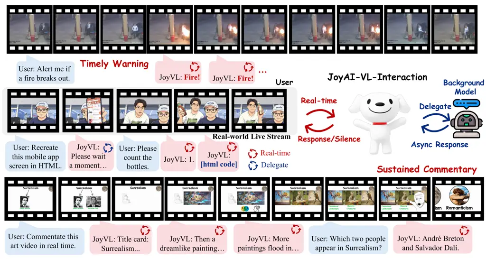
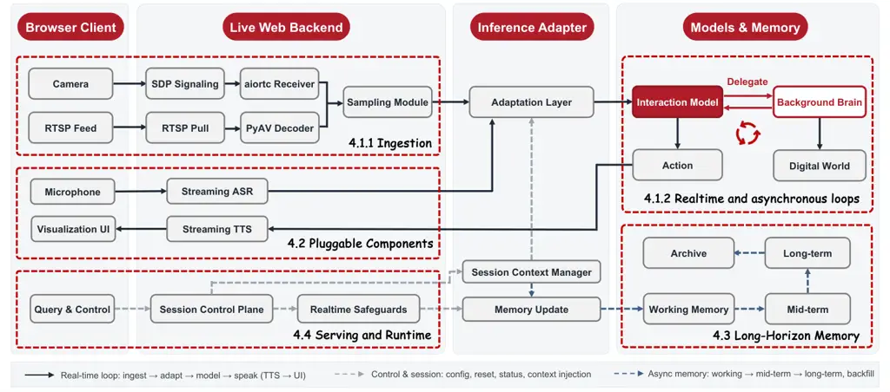
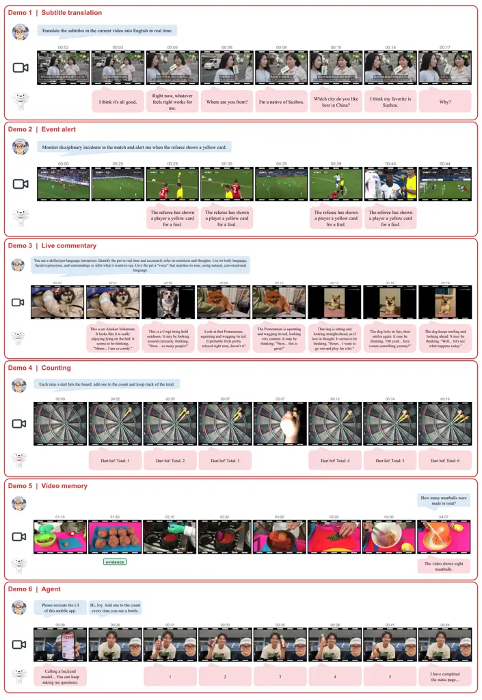

\contribution

\[\*\]Equal Contribution \contribution\[†\]Project Lead
\contribution\[‡\]Corresponding Authors \]JD.com
\checkdata\[Repository\][https://github.com/jd-opensource/JoyAI-VL-Interaction](https://github.com/jd-opensource/JoyAI-VL-Interaction)

# JoyAI-VL-Interaction: Real-Time Vision-Language Interaction Intelligence

Dingyu Yao    Junhao Zhou    Chenxu Yang    Chuanyu Qin    Xiangyu Zeng
   Yifei Li    Haowen Hou    Zheming Liang    Congcong Wang    Kaiwen
Tuo    Jun Zhang    Yuhan Zhu    Yuhang Cao    Shenglong Ye    Shuai Xie
   Shuhuan Gu    Haoyang Huang    Qingyi Si    Nan Duan    Jiaqi Wang
Affiliation: \[

###### Abstract

Many moments in the real world do not wait for a user to ask. A fire
starts on a security monitor, an expression flickers across a video
call, or a product a viewer wants flashes by in a livestream. Once
missed, the moment is gone, because the physical world does not pause.
Yet today’s large models remain mostly turn-based by design: they answer
only when addressed, and even video-call apps that appear interactive
still operate as question-answer systems, reacting only when polled or
prompted. We argue for a different paradigm: a model that is present in
the world like a person. It continuously watches what is happening now,
decides on its own whether to speak or stay silent, interacts in real
time, and delegates to a background model when the problem is hard. This
opens a "watch-and-do" mode of human-AI collaboration, expands AI
assistance to far more real-life situations, and aligns naturally with
the real-time demands of embodied intelligence. To advance interaction
models and their adoption across domains, we make two fully open-sourced
contributions. First, we release JoyAI-VL-Interaction, an 8B-scale,
vision-first VL-interaction model that is proactive by design. The model
makes the response decision internally, choosing each second to stay
silent, respond, or delegate to a background model, and it excels at
vision-triggered responsiveness and time awareness. We pair it with a
transferable training recipe, from which capabilities we never trained
for emerge, such as guiding a shopper through changing app screens or
improvising a lecture from a slide deck. Second, we release a complete,
deployable system built around that model. The system streams any
ongoing video, from cameras, livestreams, or security feeds, into the
model, making it genuinely present in the world. It supports hours of
continuous video with sub-second latency. All other components are
pluggable, including ASR/TTS modules, memory, visualization UI, and a
background brain that can connect to any API, model, or agent. Across
six real-world streaming scenarios, human raters prefer
JoyAI-VL-Interaction over the in-app video-call assistants of Doubao and
Gemini by a wide margin on both quality and timing, winning 77.6%
against Doubao and 87.9% against Gemini. It also attains the best
average among comparable open models on 26 standard video benchmarks,
leading every temporal-grounding and streaming benchmark without giving
up general video understanding. To our knowledge, this is the first
open, vision-driven interaction model released together with its
training recipe, data, and complete deployable system. With our
repository, anyone can deploy an assistant that sees the present, speaks
up on its own, and moves fluidly between the physical and digital
worlds. Our goal is to move VLMs beyond turn-based dialogue toward real
streaming interaction, openly and together.

## 1 Introduction

The moments that most need AI are often the very moments no one has time
to ask for it. A toddler wanders toward a hot stove. The decisive play
in a match is over before anyone has time to cheer. An aging parent
living alone falls in the next room. What these moments share is not
merely urgency, but timing: the instant that calls for a word, a cheer,
or a steadying hand arrives before anyone thinks to ask, and disappears
just as quickly. Today’s large models are not built for such moments.
Most remain fundamentally turn-based: they wait to be addressed, and
respond only after they are asked. This limitation is structural, not
merely a matter of speed. A turn-based model cannot perceive “now” by
construction: it opens its eyes only at the moment it is prompted. What
these situations require instead is a model that continuously sees what
is happening in the present and interacts with the world as events
unfold.

Existing efforts do not truly solve this problem. One line of work is
real-time omni models, such as GPT-Realtime-2 \[30\] and Qwen3.5-Omni
\[37\], which are genuinely end-to-end single models (audio and video
in; speech out) with low latency and no stitched-together pipeline.
However, their optimization target remains conversational turn-taking:
responding as quickly as possible after the user has spoken.
Fundamentally, they are still organized around dialogue. They wait for
the user’s turn, and are not designed to continuously watch a visual
stream and decide on their own when the moment calls for speaking.
Another line of work is consumer video-call products. Doubao’s in-app
video call \[2\] chases proactivity by firing a background request every
few seconds, but its core is still turn-based and its autonomy is locked
to the polling cycle: an event is not observed until the next poll, so
the system can never react sooner than that interval. Gemini’s in-app
video call \[12\] goes even less far: it does not perform the background
polling that Doubao relies on to monitor for events, and instead remains
strictly in a one-question, one-answer interaction pattern. A third line
is research on streaming-video understanding \[34, 35, 3, 43, 47, 13,
51\], which mostly remains at the laboratory stage. Its evaluation is
also offline: even benchmarks built for streaming \[22, 23\] score a
reply after the fact, so they measure how well a model understands a
stream but not whether it speaks at the right moment, or at all, when no
one has asked. It rarely brings together the properties a real-world
deployment demands \[49\], namely proactive response\[45, 34, 47\],
long-horizon memory \[50, 54, 53\], and real-time operation \[46, 42\].
It typically advances only one dimension at a time. In short, none of
these systems meets the needs of real deployment: each is either
turn-driven rather than event-driven, not genuinely present in the live
world, or alive only inside a benchmark.

JoyAI-VL-Interaction is built for exactly this. We adopt the term
interaction model \[19\] from Thinking Machines Lab (TML) and make its
criterion explicit: an interaction model judges for itself, moment to
moment, when the time is right to respond to the ongoing stream, the way
a person does, choosing when to speak and when to stay silent rather
than answering only when addressed. A turn-based model, however low its
latency or native its architecture, cannot choose its own moment: it
speaks only when a user’s turn arrives. The difference is not how fast a
model answers, but whether it decides for itself when answering is worth
it. We and TML recognized at nearly the same time that interactivity is
worth scaling as a capability of its own; where we part is the route to
it. TML fuses speech and vision into one large model and shared a
research preview; we make vision the first-class driver with speech as
pluggable I/O, keep the model compact enough to run on local, low-cost
hardware, and open the whole stack so anyone can deploy, reproduce, and
build on it.

Contribution 1 — the VL-interaction model. Our central idea is simple:
make when to act a learned, per-second decision of the model itself,
with staying silent treated as a first-class action alongside speaking
and delegating. We build this vision-first interaction model on our base
vision-language model, JoyAI-VL 1.0 (§3.1). Speaking and staying silent
are the root of proactivity and time awareness, knowing when a moment is
worth a word and when it is not; delegating is how the model reaches for
more capability when a problem outgrows real-time inference. We pair
every second of the visual stream with the action it calls for, yielding
time-aligned data, which we construct at scale (§3.2); from this the
model learns its interactivity, as a behavior of its own rather than
something bolted on by external turn-detectors or activity heuristics.
We open-source the model weights, the training recipe, and the data
behind it. On 26 standard video benchmarks the model attains the best
average among open models of comparable scale, ranking first on every
temporal-grounding and streaming benchmark while staying within a point
of the strongest baseline on general video understanding, so the
interaction ability does not come at the cost of general competence
(§5.4).



Figure 1: JoyAI-VL-Interaction processes a continuous video stream in
real time, deciding at each step whether to respond, stay silent, or
delegate complex tasks to a background model for asynchronous handling.

Contribution 2 — the VL-interaction system. We open-source a complete
system that works out of the box: anyone can feed it a webcam or a
livestream, and the interaction model immediately sees what is happening
and interacts with the user in real time, genuinely present in the
scene. Around the model, the system provides everything a deployment
needs: ASR and TTS, a visualization UI, long-horizon memory, and a
background bridge to any API, model, or agent the user brings, all
served on standard vLLM to stay real-time over hours of continuous
video. Among these, the interaction model alone decides whether and when
to interact; the rest only transduce and orchestrate around it. Each
ships with an open-source default, and the system provides the hooks to
replace it, so a deployment can drop in its own ASR/TTS API or custom
modules without rebuilding the stack. The system runs two concurrent
loops, joined by the model’s “delegate” action: a real-time loop with
the user, and an asynchronous loop in which the model offloads a hard
problem to a background brain while staying present with the user,
folding the result back in when it returns. In a head-to-head human
evaluation across six everyday scenarios, JoyAI-VL-Interaction is
preferred over both Doubao’s and Gemini’s in-app video-call assistants
by a wide margin on quality and timing, winning 77.6% of comparisons
against Doubao and 87.9% against Gemini. Its strongest margins fall on
the most time-critical settings: it wins every comparison in monitoring
and alerting against both systems and never loses one in real-time
translation or counting, exactly the event-driven,
act-at-the-right-moment tasks that turn-based products structurally miss
(§5).

The value here is more than a better “video assistant.” When a model can
be present and decide for itself what to watch and when to speak,
human–AI collaboration shifts from “submit a request and wait” to
“watch-and-do,” and AI can step into far more of everyday life, honoring
embodied intelligence’s premise that the physical world cannot be
paused. The same capability is the substrate for a class of long-awaited
products: a companion that is truly present, AI glasses that translate
or caption what you see, an aide that serves as eyes for those who
cannot, and uses no one has imagined yet. We release
JoyAI-VL-Interaction, the model, its training recipe and data, and the
full system in the open, precisely so the community can build and
explore all of this, and more, together. Our larger hope is to move the
field from turn-based dialogue toward genuine streaming interaction, in
the open.

## 2 Related Work

### 2.1 Turn-based Models and Products

Almost all of today’s models are turn-based: they act only when a user
takes a turn, answering once addressed and otherwise idle. This is a
structural property, not a matter of speed. A turn-based system has no
mechanism for reacting to an event in the world that arrives with no
accompanying user utterance, however quickly it can reply once spoken
to. Two families of recent systems push hard on responsiveness while
keeping this turn-based core.

#### Realtime and omni models.

OpenAI’s GPT-Realtime-2 reasons inside a single speech-to-speech loop
\[30\], and Alibaba’s Qwen3.5-Omni \[37\] is a natively pretrained
omni-modal model (text, audio, image, video) with real-time streaming
and built-in turn-taking and interruption handling, the latter openly
released. These remove the latency of cascaded stacks, but what they
optimize is conversational turn-taking: how quickly and naturally they
answer once the user has spoken. Their interaction is organized around
dialogue and waits for the user’s turn; they are not built to watch a
visual stream and decide, unprompted, that this is the moment to speak.
Being open, real-time, and multimodal (as Qwen3.5-Omni already is) is
therefore necessary but not sufficient for the setting we target.

#### Consumer video-call products.

In-app “video call” features are the most familiar real-time multimodal
assistants and our most recognizable baseline, yet their cores remain
turn-based. Doubao’s runs on ByteDance’s Volcano Engine
conversational-AI stack, a configurable ASR/VLM/TTS pipeline with
stop/turn detection, and its documentation makes the mechanism plain:
while no one is speaking, the server only caches incoming video frames
and does not send them to the model, so the application must
periodically fire an ExternalTextToLLM trigger to obtain any analysis
\[41\]; this characterization is based on the publicly available version
of the stack, which may differ from the deployed product. “Monitoring”
is thus an external clock bolted onto a turn-based model: reaction to an
on-screen event waits for the next trigger and can never beat the
polling interval. Gemini’s video call goes less far still; in our use it
answers only about the frame visible the instant a question is asked. In
neither case does the decision of when to respond live in the model.

### 2.2 Interaction Models

A distinct, newer line breaks with the turn-based assumption by moving
interactivity into the model.

#### TML interaction models.

Thinking Machines Lab recently named this an interaction model and
argued, as we independently and concurrently concluded, that scalable
interactivity should come from the model itself rather than an external
harness of turn detectors and activity heuristics. Their model handles
audio, video, and text in real time and can speak unprompted, acting on
the ongoing stream rather than waiting for a user’s turn, and, as in our
system, it is paired with an asynchronous background model for slower,
harder reasoning, the two sharing context; it was released as a research
preview \[19\]. That two groups arrived at this approach at nearly the
same moment we read as a sign that the move from turn-based to
interactive models is a direction whose time has come. Within this
shared interaction–background design, our aesthetic differs in two
deliberate ways. On modality, rather than fusing audio and vision into
the model alike, we keep speech (ASR/TTS) a pluggable module and make
vision the model’s intrinsic, primary modality for proactive
interaction, fitting a watch-and-interact setting in which voice is
interchangeable I/O. On scale, TML-Interaction-Small is a 276B-parameter
mixture-of-experts model (12B active) that its authors describe as the
smallest they can serve at the required latency, whereas we deliberately
choose a compact $`\sim`$8B model (balancing interaction-grade
responsiveness, local and low-cost deployability, and capability) so
that it can be run, fine-tuned, and reproduced widely rather than only
on large infrastructure.

#### Full-duplex speech.

For speech, Kyutai’s MoshiRAG \[6\] is the prominent open instance: a
real-time, full-duplex speech–text model in which both sides can speak
and listen at once rather than strictly alternating, and the closest
open precedent for putting interaction in the model. Its modality and
scope (spoken conversation) set it apart from the visual, event-driven
setting we address.

### 2.3 Streaming Video Understanding

A research line lets models process video as it arrives rather than
after the fact, spanning streaming video LLMs, proactive response \[45,
34, 47\], real-time inference \[46, 42\], and long-horizon video memory
\[50, 54, 53\]. It is closest to our model contribution, but three gaps
separate it from a deployable interaction model. It typically advances
one property at a time (responsiveness, or proactivity, or memory)
rather than the three together. It is usually measured on offline
benchmarks, at times even in the manner of offline video understanding,
which never tests reaction to live events under real-time constraints.
And it stops at the model, without the surrounding system (serving,
memory, transduction, delegation) that hours of sustained real-time
presence demand.

### 2.4 Our Position.

Read along two axes, how a model interacts and what is released,
JoyAI-VL-Interaction occupies a cell no prior work does. Against
turn-based systems, native or product, the decision of when to act lives
inside our model and is taken every second, event-driven, so reaction is
bounded by inference rather than by a user’s turn or a trigger clock.
Against TML’s interaction model, we make vision the first-class driver,
the watch-and-interact setting rather than audio–video conversation, and
we open-source not a research preview but the model, its training
recipe, and a complete, composable, deployable system. Against MoshiRAG,
we are vision-driven rather than speech-centric, reacting to events that
carry no conversational turn at all. And against streaming-video
research, we bring responsiveness, proactivity, and memory together in
one model and run it inside a system built for sustained presence. To
our knowledge, JoyAI-VL-Interaction is the first open, vision-driven
interaction model released together with a complete deployable system:
the point where all of these properties meet, rather than any one alone.

## 3 JoyAI-VL-Interaction Model

Figure 1 summarizes the model. JoyAI-VL-Interaction watches a streaming
visual input and, at every second, takes one of three actions: speak to
the user, stay silent and keep watching, or delegate a slower, harder
task to an asynchronous background model whose result is folded back
into the stream when ready. The first two actions form a real-time loop
with the user; the third, an asynchronous loop with the background.

Two design points frame the rest of this section. First, the model
learns a background-agnostic delegation protocol, so the background can
be swapped for any external model, agent, or API; we cover the model
side here and the system side in §4. Second, the model does not process
or generate speech itself: turning voice into text and back is left to
pluggable ASR/TTS in the system, keeping the autonomous, vision-driven
core decoupled from interchangeable I/O.

The rest of the section builds the model from this behavior outward: the
base model and architecture (§3.1), the data that teaches when to speak,
stay silent, and delegate (§3.2), and the training recipe (§3.3), which
covers continue training, the training objective, reinforcement
learning, and infrastructure.

### 3.1 JoyAI-VL 1.0 and Architecture

JoyAI-VL-Interaction is built on JoyAI-VL-1.0, where the language model
is initialized from Qwen3-8B \[48\], the visual encoder is the Qwen3-VL
ViT \[1\], and the projection layer between them is trained from
scratch. JoyAI-VL 1.0 is obtained through three stages, representation
alignment, vision-language pre-training and post-train with On-Policy
Distillation \[26\] and RL \[24, 40\]. At this point the model is a
conventional, turn-based VLM. Its per-second interaction behavior,
deciding each second whether to speak, stay silent, or delegate, is
acquired afterward through the interaction-training recipe in §3.3.
JoyAI-VL-1.0 can optionally be further trained into a codec paradigm
following AdaCodec \[15\], which spends full ViT tokens only on
reference frames and encodes predictable frames in between as compact
P-tokens, reducing the per-frame token cost on long-horizon streams. We
treat this as an optional extension and leave its evaluation to future
work: all experiments and demos in this paper use the non-codec version,
since the memory module and serving design described in §4 cover the
full range of interaction scenarios we target, from live monitoring to
multi-hour sessions.

### 3.2 Data Construction for VL-Interaction

The applications we build for share a single demand: the assistant must
be present and act on its own, at the moment that matters, with no one
there to prompt it. A security feed where a flame has just appeared, a
livestream where the item a viewer wants is flashing past, AI glasses
that should caption or translate what is in front of you the instant it
appears, a companion that should speak up only when there is something
worth saying. In each case the right moment to act is set by the world,
not by the user, and a model that waits to be addressed has already
missed it. The data in this section is built to give the model exactly
the abilities these settings demand: to watch a visual stream
continuously and decide for itself, second by second, whether to speak,
stay silent, or hand a hard problem to a heavier background model; to
act on what it sees rather than wait to be asked; and to keep track of
time, so that it knows not just what is happening but when. Teaching
these abilities broadly, rather than for any single use case, is the
goal of everything that follows.

Concretely, at each one-second step the model takes one of three actions
over the visual stream seen so far: it can stay silent and keep
watching, emitting a \</silence\> token; speak, emitting a \</response\>
token and a textual reply; or delegate a slower, harder subtask to an
asynchronous background model. Delegation follows a fixed,
background-agnostic protocol defined over text requests and results, so
any external model, agent, or API can serve as the background (§4). We
teach these three decisions at one-second granularity, over and over,
across as much of real life as we can capture.

#### Capabilities the data covers.

To span this range, the data comprises more than 4M time-aligned
streaming clips organized into six families. The first five are: (1)
proactive alerting and anomaly detection on live feeds; (2) time-aligned
question answering in backward, present, and forward timing; (3)
counting and perception over time; (4) live commentary and narration;
and (5) multi-turn casual chat in a variety of styles, ranging from
everyday conversation over egocentric short video, to extended dialogue
across long videos, to companionship-style exchanges. The sixth (6) cuts
across all of the others: delegation episodes pair the ongoing scene
with hard, off-stream subtasks—video-grounded knowledge questions, STEM
problems, and video reasoning problems—that the model should route to
the background rather than answer inline. A single per-second action
format applies across every family, so each scenario jointly teaches the
model when to speak, when to stay silent, and, where appropriate, when
to delegate.

#### Constructing time-aligned data.

Per-second supervision is what makes this behavior learnable, and it is
costly to obtain at scale. Every example must be right along two axes:
content, what the model says when it speaks, and timing, the exact
second at which it should speak, stay silent, or delegate. Silence is a
first-class label rather than the absence of one, since most steps in
any stream should be silent and the model must learn to wait instead of
speaking at every step. To get both axes right at scale, we run a
multi-stage pipeline with dedicated verifier agents, and we deliberately
favor quality over quantity. Each candidate example is checked at two
levels: globally, over all input frames together with the full
annotation, and locally, over the frames at the annotated timestamp and
the reply tied to them. An example is admitted only if it passes both
checks, and is discarded the moment it fails either. Each source is
annotated along whichever axis is its bottleneck, and only examples that
survive every check enter the corpus, so heterogeneous raw material is
funneled into one clean, consistent per-second action format.

We tailor the construction to each family. For offline video-QA, the
content of open-source data is already trustworthy, so the work is
almost entirely about timing: a larger VLM marks when the evidence
relevant to each question appears, and we form three timing types around
it. In a backward example the question is asked after the evidence has
appeared and the model responds at the moment the question arrives; in a
present example the question is asked just as the evidence appears and
the model responds at that moment; in a forward example the question is
asked before the evidence appears and the model stays silent until the
evidence arrives, then responds at that instant. For multi-turn casual
chat, the casual nature of the exchange keeps the bar on content low, so
we prioritize timing instead. Two VLM agents converse over a
continuously playing video, one asking questions grounded in what it
currently sees while the other watches the same stream and answers. To
place each turn in time, we sample a time point at random and give the
annotating model only the three frames around that point, which anchors
every response to its timestamp and prevents large timing drift; a
verifier agent then screens each exchange for grounding and quality.

For commentary and narration, the commentator’s authentic style is
itself the value, so rather than synthesize it we collect open-source
commentary and broadcast footage and recover the real spoken content
with ASR, which preserves the natural cadence of when a person speaks
and pauses and yields realistic silence labels. For counting, we run two
passes over a counting-oriented source: the first keeps only videos in
which objects reappear, and the second lays down the per-second labels.
For perception over time, we insert time-conditioned content into
ready-made multi-turn dialogues: for instance, requiring in the question
that the answer be withheld for a precise interval before it is given,
adding an instruction that increments a running count by one every $`n`$
seconds, or bounding the time window within which a question and its
answer may occur; these rules yield exact, checkable timing without
further manual annotation.

For alerting and anomaly detection, timing accuracy matters most, since
an alert one second late describes a different moment, so we build this
data from two sources. From open-source temporal-grounding annotations
we convert directly into per-second labels, with a verification pass
over the onsets. For web-collected videos, which carry no annotations,
the pipeline proposes a candidate trigger window and tightens it through
several stages: it filters videos to viable candidates, samples a
window, generates and hard-filters a target by type, and applies a
window-level verifier; a dense precheck then scans every 1 fps frame
from the query time to the candidate trigger and discards the example if
the target appeared earlier, so the alarm marks a genuine first onset,
after which we localize the trigger to a single frame.

#### Anatomy of a delegation episode.

Delegation is the most intricate behavior in the corpus, and the most
distinctive: it is where the model learns to recognize the limits of
real-time inference and hand off, mid-stream, to a heavier background
brain without ever pausing the world it is watching. Each episode is
built end to end, pairing a trigger (a subtask the model should not
solve inline) with a written request and a returned result, and we
synthesize these episodes three ways: (i) inserting ready-made pure-text
hard problems such as STEM questions, where it is the difficulty rather
than the modality that should send them to the background; (ii)
converting open-source offline video-reasoning problems and using a
large model to weave them into annotated multi-turn chat, so a genuinely
hard visual question can surface naturally in the middle of a
conversation; and (iii) synthesizing full episodes with a multi-role
agent pipeline, in which a Planner scripts the episode, a Timestamp /
Visual Verifier runs multi-level checks, over the whole clip and at the
trigger frame, that the trigger and its timing are grounded in what is
actually on screen, a Background agent produces the heavy answer, and a
Foreground Rewriter turns it into a natural reply.

At the heart of the episode is the two-loop choreography it teaches. The
instant the model decides to delegate, it does not go quiet. It first
hands the user a brief holding reply (for example, “let me look into
that”), then emits a hidden delegate token and query that the user never
sees, dispatching the hard subtask to the background while the visual
stream keeps rolling. We then inject a random delay that simulates the
background’s variable reasoning time, and only after that delay is the
result folded back in, at which point the model produces its formal
answer in context. The delay is the whole point: by varying it, we force
the model to stay present while a delegation is still pending,
continuing to watch the scene, field new turns, and hold its silence
when nothing is worth saying, rather than freezing until the background
returns. This is the exact seam where the real-time loop with the user
and the asynchronous loop with the background are stitched together, and
the model learns to run both at once. Across all six families, however
different their raw material, every construction is reduced to the same
per-second labels of silence, response, and delegation and passes
through the same multi-level verification, which is what lets such
heterogeneous sources train a single, unified interaction policy.

#### A transferable recipe, and signs of emergence.

Because the construction is defined by this common per-second format
rather than by any one domain, the recipe transfers cleanly to new
scenarios: adding a capability is as simple as supplying streams from
that domain, annotated in the same per-second form and passed through
the same verifiers, with no change to architecture or training
objective. And the payoff scales. Even a modest amount of time-aligned
data is enough for strong interaction behavior to emerge, a sign that
the recipe is highly data-efficient and that time-aligned training is
nowhere near saturated, with substantial headroom still ahead as the
data grows. Most strikingly, capabilities we never explicitly trained
for emerge on their own, including guiding a user through a purchase
across changing app screens and improvising a full lecture from a slide
deck. We read this as strong evidence that the model is acquiring a
general watch-and-interact competence rather than memorizing
scenario-specific tricks, and that the same recipe can grow the next
generation of always-present assistants, from AI glasses that narrate
what you see to companions and accessibility aides that serve as eyes
for those who cannot. What we have seen so far is only the beginning.

### 3.3 Training Recipe of VL-Interaction

#### Continue training.

Starting from JoyAI-VL 1.0, a single supervised training stage turns the
base into an interaction model; reinforcement learning then follows
below. We mix the time-aligned interaction data of §3.2 into a large
pool of conventional turn-based data and fine-tune on the combined
corpus. Keeping the conventional data in the mixture is what lets the
model acquire per-second interaction without displacing the general
video competence of the base, which the benchmark results of §5.4
confirm. This echoes §3.2: eliciting interaction is data-efficient, and
time-aligned training is far from saturated.

#### Training objective.

On time-aligned data, silence steps vastly outnumber the steps on which
the model speaks, so the supervised targets are dominated by the
\</silence\> token. Under a standard SFT loss this imbalance pushes the
gradient toward continued silence and dilutes the signal for responding.
Following our streaming-native training \[49\], we therefore weight the
assistant tokens by their role. Let $`A`$ be the supervised
assistant-token positions and $`C\subseteq A`$ the control-token
positions, where each control token is either \</silence\> or
\</response\>. We assign $`w^{\text{first}}_{\text{silence}}`$ to the
first \</silence\> in a run, $`w^{\text{repeated}}_{\text{silence}}`$ to
a continued \</silence\>, and $`w_{\text{response}}`$ to \</response\>;
every other position gets weight $`1`$. We set
$`w^{\text{first}}_{\text{silence}}=1`$,
$`w^{\text{repeated}}_{\text{silence}}<1`$ to down-weight silence
continuations, and $`w_{\text{response}}>1`$ to up-weight response
onsets. A delegation needs no separate weight, because it always rides
inside a response. The objective is the normalized weighted
cross-entropy

```math
\mathcal{L}(\theta)=-\frac{1}{|A|}\sum_{j\in A}w_{j}\,\log p_{\theta}(y_{j}\mid y_{<j}). \tag{1}
```

In practice we use $`w^{\text{repeated}}_{\text{silence}}=0.4`$ and
$`w_{\text{response}}=1.5`$. We apply this weighted loss only to the
time-aligned data; the conventional turn-based data is trained with the
standard SFT loss.

#### Reinforcement learning.

Continue training establishes the basic interaction behaviors, but
supervised learning alone is insufficient for optimizing the finer
dynamics of streaming interaction. In particular, a good interaction
requires the model to make two related but distinct decisions: when to
act and what to say. A response may arrive at the right moment but
contain incorrect or ungrounded content, while a semantically correct
answer may still be undesirable if it is produced too early, too late,
or when the model should remain silent. We therefore adopt a decoupled
reinforcement-learning design based on GRPO, where interaction control
and response quality are evaluated with complementary reward signals.
Timing-related supervision focuses on whether the model should respond,
remain silent, or delegate, while content-related supervision evaluates
the correctness, grounding, and usefulness of the generated response.
This separation prevents one aspect of interaction quality from
obscuring errors in another.

Streaming tasks also differ substantially in their temporal horizon. For
relatively localized behaviors such as question answering, alerting, and
delegation, we construct compact rollouts around informative moments in
the stream, avoiding the large number of uninformative silent turns in a
full video. For sustained behaviors such as narration and commentary, we
further perform windowed multi-turn self-rollout. Within each sampled
temporal window, the model interacts autoregressively with the stream,
and its previous responses and silence decisions are retained in the
context for subsequent turns. This exposes the policy to the states
created by its own behavior and allows RL to optimize coherent
interaction patterns, including response frequency, repetition, missed
opportunities, and long periods of unnecessary silence, while keeping
rollout cost manageable.

Finally, we combine trajectory-level outcome supervision with
finer-grained turn-level process feedback. Stream-level rewards evaluate
the overall quality of an interaction trajectory, including temporal
coordination, grounding, coverage, non-repetition, and appropriate
delegation. Turn-level judgments provide additional information about
which individual responses contribute positively or negatively within an
otherwise mixed-quality trajectory. The trajectory-level signal remains
the primary group-relative optimization target, while local feedback is
used to improve credit assignment within multi-response interactions.
For behaviors whose quality is difficult to capture with deterministic
rules, we use task-specific LLM judges. Together, these designs allow a
unified RL stage to optimize both one-shot and sustained streaming
interaction while preserving the distinct learning signals required by
timing and content.

#### Infrastructure.

We run our RL stage on EasyVideoR1 \[36\], an efficient
reinforcement-learning framework for training vision-language models on
video. Its reward system is task-aware, with unified routing and modular
extension, so rewards for text, image, video, and our streaming
interaction tasks are served from a single pipeline.

## 4 JoyAI-VL-Interaction System

Around the interaction model of §3 we build a complete, deployable
system whose single principle is this: the model is the only component
that decides when to speak and when to delegate, while everything else
(ASR, TTS, memory, the background brain, the visualization UI) is
transduction and orchestration placed around it. Every component ships
with an out-of-the-box open-source default and can be swapped for
whatever fits a deployment, including the model itself, which any VLM
trained with our recipe (§3.3) can replace. This "decision in the model,
the rest replaceable" split is the system’s design thesis, and it buys
two properties at once: the system is composable, so anyone can rebuild
it for their own domain, and it is deployable today, because the
periphery reuses standard infrastructure rather than a bespoke stack.

Compared with TML, which fuses speech into the model alongside vision,
we keep the visual trigger, the model’s own decision to act on what it
sees, as the native, in-model capability, and treat speech as
interchangeable I/O. Placing interchangeable I/O outside the model is
therefore not a weakness but a deliberate decoupling of the autonomous
core from the parts a deployment will want to choose for itself.

The rest of this section builds it up: the two concurrent loops it runs,
the background bridge that joins them, and how that bridge closes a loop
from seeing to acting (§4.1); the pluggable transduction, visualization,
and user-supplied modules around the model (§4.2); the long-horizon
memory that keeps it coherent over hours (§4.3); and the vLLM-native
serving path and open release that sustain sub-second presence and put
the system in anyone’s hands (§4.4).



Figure 2: Overview of the JoyAI-VL-Interaction System.

### 4.1 Two Concurrent Loops: from Seeing to Acting

The interaction model runs two conversations at once: a real-time loop
with the user and an asynchronous loop with the background brain, joined
by the model’s delegate action.

#### Ingestion.

The real-time loop begins at ingestion. A browser client pushes its
camera stream to the server through WebRTC SDP negotiation, or submits
an RTSP address that the server pulls; the two media paths are received
and decoded server-side by aiortc and PyAV respectively, back into raw
frames. A sampling module downsamples the stream at a fixed interval,
1 Hz by default and configurable per scenario, to balance temporal
detail against real-time latency. The sampled frames are converted to
RGB, JPEG-encoded, and wrapped as Base64 data-URLs, then passed with the
active user query into an adaptation layer that assembles an
OpenAI-compatible multimodal Chat Completions request, the same request
form our vLLM serving path expects (§4.4).

#### The real-time and asynchronous loops.

These frames are fed to the model every second, so it always acts on
what is happening now rather than on a delayed batch. Together with
optional microphone audio transduced by streaming ASR into an active
query, they drive the model: at every second it takes one action, to
speak, stay silent, or delegate; when it speaks, streaming TTS renders
the reply and the visualization UI reflects its state. When it
delegates, control passes to the asynchronous loop, in which a
background model runs against the background brain to handle slower,
more demanding tasks.

#### The background bridge.

The edge that delegate points to is a background bridge, and the brain
behind it defaults to the user’s own large-model API while remaining
free to be any agent (such as Hermes Agent \[29\] and OpenClaw \[31\] )
the user brings. The scaffold supports this natively and defines a
fixed, background-agnostic protocol over text requests and results
(§3.2). The bridge exposes a background-agnostic text contract: the
foreground emits a tagged query, which the bridge normalizes into a
task-id, delegated question, foreground note, and bounded frame
snapshot. It runs an isolated model or agent asynchronously under a
fixed timeout; expiry is reported as an error event and in-flight work
is cancelled on session cleanup. Results return as started/ready/error
events, with full artifacts kept off-context and only a bounded digest
woven back into the interaction model. Because the background can be an
agent, the bridge also closes a loop from seeing to acting: the
interaction model observes the physical world and, when warranted,
delegates a task the background agent carries out in the digital world.
This is the watch-and-do premise of §1 made operational: see, decide,
act, in one system.

### 4.2 Pluggable Components: Transduction, Visualization, and Your Own Modules

#### ASR and TTS.

For speech, we ship a ready-to-run server built on open source ASR
\[11\] and TTS models \[9\], and users can swap in their own model or
API to match their language and preferred voice. These modules only
convert modalities; they take no part in the interaction decision.
Because speech has duration while generation does not, we predefine a
simple rule to keep the two in step: while the previous utterance is
still being spoken, the model’s next sentence is surfaced as text only
and is not synthesized, so audio never piles up behind generation. For
high-frequency settings such as live commentary, step-by-step guidance,
and real-time subtitle translation, where output is near-continuous, we
recommend running with TTS off, and we leave a fuller treatment of this
regime to future work.

#### Visualization UI.

A built-in web interface, adapted from NVIDIA’s open-source
live-vlm-webui¹¹ 1
[https://github.com/nvidia-ai-iot/live-vlm-webui](https://github.com/nvidia-ai-iot/live-vlm-webui),
makes the running system visible and controllable. A left-hand
configuration panel selects the video source—either a webcam or an RTSP
livestream—and sets the sampling cadence, namely the number of frames
per inference and the interval between inferences; it also offers a
response mode that shifts the model’s style from a default balance to
more talkative or more aloof. The center pane shows the live stream the
model is watching. The right-hand pane is the conversation: it holds the
running exchange with the model, including earlier turns, reports
per-response and average latency in real time, and accepts either typed
messages or spoken input through the microphone (ASR); when the model
speaks, its reply is played back automatically through TTS. The
interface doubles as a debugging and trust surface for sensitive
deployments, and it can be replaced with a custom front end.

#### Bring your own modules.

Beyond these defaults, the system is open to user-supplied modules that
enrich what the assistant perceives or remembers. As one example, a
face-recognition module can let the assistant remember who you are and
recognize when a particular friend or family member walks into the
scene, opening up more personal and engaging interactions. There is a
larger reason we open all of this. Turn-based interaction is a
long-settled range, refined over years, with a vast ecosystem of systems
and optimizations built up around it; VL interaction models, by
contrast, have barely begun. By releasing the full stack, we hope to
open a first breach for interaction models among those established
peaks, and we invite the community to explore with us what this
still-young way of working with AI can become.

### 4.3 Long-Horizon Memory

Long-horizon presence needs a memory whose footprint does not grow
without bound as a stream runs for hours, and whose contents form a
shared context read by both the streaming model and the background
brain. We meet this with a pluggable hierarchical memory built on our
prior work \[49\], organized into tiers at increasing compression. We
organize the context into a three-tier hierarchy that partitions the
stream into: (i) a short-term memory retaining the most recent $`T_{s}`$
seconds as raw vision tokens; (ii) a mid-term memory holding up to $`M`$
textual summaries of past short-term chunks, covering $`T_{m}=MT_{s}`$
seconds at moderate compression; and (iii) a long-term memory storing up
to $`L`$ aggressively compressed blocks, each consolidated from $`M`$
consecutive mid-term summaries and thus spanning $`T_{l}=LMT_{s}`$
seconds. Alongside these visual tiers, a dialogue memory keeps past
queries and answers coherent across time. The consolidation steps run
asynchronously, ahead of each boundary, so they hide behind mainline
inference and never stall the real-time loop, and together the tiers
reach up to roughly two hours of context. Because each tier above the
buffer is stored as text, the memory also forms a stable per-chunk
prefix that the serving path of §4.4 can cache and reuse; it is designed
for exactly this, and it remains fully pluggable, swappable for any
external memory a deployment prefers.

### 4.4 Serving and Runtime

#### vLLM-native serving.

Hours of continuous video defeat the obvious serving strategies.
Recomputing attention over the full history saturates the context window
within a few hundred seconds; a sliding window bounds the context but
breaks prefix reuse, since successive steps no longer share a common
prefix, so an engine’s prefix cache buys nothing and latency plateaus
above the real-time budget; token pruning has the same problem. Most
streaming-video methods inherit one of these and, built on plain
Transformers, stay incompatible with efficient engines such as vLLM
\[18\] and SGLang \[57\], which is much of why they remain in the lab.
We instead designed the memory system around prefix reuse so that vLLM
serves it directly: the text memory of §4.3 is prefilled once per chunk
into a KV cache, and at every subsequent step only the newly observed
frames and the previous reply are computed, while the memory and earlier
in-chunk turns are reused without recomputation. Building the memory
this way is precisely what lowers the bar to deployment: the system
sustains over two hours of continuous video at sub-second end-to-end
latency on standard vLLM.

#### Stateful sessions.

The runtime is organized around server-side sessions. Control messages,
configuration updates, session resets, and state synchronization, travel
as JSON over WebSocket or HTTP and carry a session_id, while the server
keeps each session’s video context, question-and-answer trajectory, and
memory state. When a request is assembled, this maintained context is
injected automatically into the Chat Completions request, so a single
round of client-server communication carries only the instantaneous
observation, and all long-horizon context management lives at the
backend. This is also what makes the prefix reuse above possible: the
injected context is precisely the stable per-chunk prefix the engine
caches and reuses.

#### Real-time robustness.

To hold latency steady under load, the runtime places timeouts,
reconnection, and cancellation across connection setup, the WebSocket
channel, RTSP signaling, and the auxiliary audio and video channels, and
a session-level lock keeps requests from piling up; when it must, it
drops stale frames or backfills late results into the correct
interaction history by inference sequence number. The adaptation layer
routes each request by its model identifier to the corresponding VLM
service, runs the mid-term and long-term memory consolidation of §4.3 in
parallel, and returns a standard JSON response.

#### Everything is open.

The model recipe, the background bridge, ASR/TTS, memory, orchestration,
the visualization UI, and the vLLM serving path can all be replaced or
extended in the repository. Releasing the model recipe and the complete
system together is the whole point: from a single repository, anyone can
stand up their own present, self-directed real-world assistant.

## 5 Experiments

We evaluate at three levels. §5.1 is a product comparison: an
interaction model is judged by the experience it delivers, so we place
JoyAI-VL-Interaction against the two most widely used in-app
video-calling assistants and let human raters decide. §5.3 moves to
SVI-Bench, which scores a complete interaction trajectory along five
user-observable dimensions and lets us compare against recently released
real-time and interactive models dimension by dimension. §5.4 reports
the conventional offline video suite, which tells us whether the
interaction recipe preserved general video understanding.

### 5.1 Real-World Streaming Evaluation

Our primary evaluation is deliberately not an offline
video-understanding benchmark. We do report those, in §5.4, where they
answer a narrower question; here we measure JoyAI-VL-Interaction against
the real, deployed products people would actually reach for, in the
live, event-driven setting this paper is about. Concretely, we compare
it head-to-head with the in-app video-call assistants of Doubao and
Gemini, today’s most mature and recognizable real-time multimodal
products (§2.1). We choose six everyday scenarios that fall squarely in
the advantage zone of the interaction-model paradigm: settings that
demand being present, acting unprompted at the right moment, and
tracking events over time, precisely what a turn-based product, waiting
to be addressed, is structurally unequipped to deliver however fast it
answers once asked.

#### Scenarios.

The six scenarios are: (1) monitoring and alerting, flagging an event
the instant it occurs; (2) real-time counting of objects or events over
time; (3) real-time translation of on-screen content; (4) time
awareness, acting on its own sense of elapsed time, for instance
speaking once every few seconds on request or timing how long an
activity lasts; (5) live commentary and guidance, narrating or walking
the user through an unfolding scene at the right moments; and (6)
long-horizon memory, answering about something seen far earlier in the
stream. Underneath the six lie the three capabilities that define an
interaction model: real-time operation, proactive response driven by
what it sees, and long-horizon memory. The six are thus not an arbitrary
set but a sampling of these axes, and the same capabilities reach far
beyond this benchmark, into AI glasses, assistance for the blind,
security monitoring, home robots, home and elder care, vision-grounded
chat and companionship apps, live sports commentary, and delegation to
background agents, among others. All are settings where being present
and acting at the right moment is the whole task, the dimension on which
turn-based products structurally fall short, so the six probe the
paradigm gap itself rather than any single product feature. The six
scenarios comprise 58 cases in total: 10 each for monitoring, counting,
translation, and time awareness, and 9 each for commentary and memory.
The cases are drawn mostly from public footage on the web, with a few
recorded by us.

#### Baselines.

Our baselines are the video-call features of the Doubao and Gemini apps,
the products we single out in §2.1 as turn-based at the core, each
evaluated as it is actually deployed to end users. We use the app
versions current in late May and early June 2026, and drive each product
with the same input under matched conditions. We run
JoyAI-VL-Interaction through our own system (§4) and compare it against
each baseline separately, pairwise. The JoyAI-VL-Interaction system uses
a three-tier memory with $`T_{s}=100`$ s, $`M=5`$, and $`L=15`$ (§4.3).
At evaluation time, our JoyAI-VL-Interaction system simulates offline
videos as a live streaming source over RTSP, served by MediaMTX. Since
Doubao and Gemini expose no system-level API, we drive them through
their apps: we play the same video to each and pose identical questions
at matched timestamps.

#### Protocol and metric.

For every case, human raters score each system on two equally important
axes: quality, whether the response is correct, relevant, and
well-formed; and timing, whether it arrives at the right moment, neither
premature nor late, and whether the system stays silent when nothing is
worth saying. Each axis is rated on a three-level scale, good, fair, or
poor, and a system’s score for the case is the equal-weight average of
its two axis ratings. The timing axis is the crux of the event-driven
setting and the one turn-based products structurally struggle with (§1).
To reduce bias, system identities are hidden from raters and the
presentation order is randomized. Five raters carry out the ratings, all
educated to at least the university level and working as researchers in
LLMs, and inter-rater agreement is high. For each case we then compare
the two systems’ weighted-average scores, which gives a win, tie, or
loss for JoyAI-VL-Interaction. We report the per-scenario and overall
win rate, the fraction of comparisons it wins, against Doubao and
against Gemini respectively, alongside the tie and loss rates; a tie
counts as neither a win nor a loss.

| Scenario                     | JoyAI-VL-Interaction | Tie   | Doubao |
| ---------------------------- | -------------------- | ----- | ------ |
| Monitoring and alerting      | 100.0%               | 0.0%  | 0.0%   |
| Real-time counting           | 70.0%                | 30.0% | 0.0%   |
| Real-time translation        | 80.0%                | 20.0% | 0.0%   |
| Time awareness               | 80.0%                | 10.0% | 10.0%  |
| Live commentary and guidance | 55.6%                | 22.2% | 22.2%  |
| Long-horizon memory          | 77.8%                | 22.2% | 0.0%   |
| Overall                      | 77.6%                | 17.2% | 5.2%   |

Table 1: Head-to-head human evaluation, JoyAI-VL-Interaction versus
Doubao’s in-app video-call assistant.

| Scenario                     | JoyAI-VL-Interaction | Tie   | Gemini |
| ---------------------------- | -------------------- | ----- | ------ |
| Monitoring and alerting      | 100.0%               | 0.0%  | 0.0%   |
| Real-time counting           | 100.0%               | 0.0%  | 0.0%   |
| Real-time translation        | 100.0%               | 0.0%  | 0.0%   |
| Time awareness               | 50.0%                | 40.0% | 10.0%  |
| Live commentary and guidance | 100.0%               | 0.0%  | 0.0%   |
| Long-horizon memory          | 77.8%                | 22.2% | 0.0%   |
| Overall                      | 87.9%                | 10.3% | 1.7%   |

Table 2: Head-to-head human evaluation, JoyAI-VL-Interaction versus
Gemini’s in-app video-call assistant.

### 5.2 Results and Case Study

#### Experimental Results.

Across both comparisons JoyAI-VL-Interaction is the preferred system by
a wide margin, and in every scenario it wins more comparisons than it
loses. Against Doubao it is preferred in 77.6% of cases, ties 17.2%, and
loses only 5.2%; against Gemini the margin is wider still, at 87.9%
wins, 10.3% ties, and just 1.7% losses. The two baselines, in other
words, almost never come out ahead overall.

Our model’s clearest advantage falls exactly on the vision-driven,
time-critical scenarios that define the paradigm. In monitoring and
alerting, the purest test of catching an event the instant it occurs, it
wins every single comparison against both baselines (100%). Real-time
translation and fast counting are similarly lopsided: it sweeps both at
100% against Gemini, and wins 80% and 70% against Doubao with no losses
at all. These are precisely the settings where being present and acting
at the right moment is the whole task, and they are where our margins
are largest, which is the central claim of the benchmark borne out in
the numbers. Long-horizon memory is also strong, at 77.8% against each.
Part of this margin reflects a structural limit of the baselines rather
than a single weak answer: in video-call mode Doubao automatically hangs
up after about five minutes with no voice input, and Gemini at around
two minutes fifteen seconds, so in around half of the memory cases the
question we ask falls past these cutoffs and neither baseline is even
present to respond, scoring nothing. However, on the shorter cases that
stay within their session limits, our model still wins or ties. We
credit it to our long-horizon memory design: a mid-term and a long-term
step that continuously compress, merge, and organize what the model has
seen, so that information from far earlier in the stream is still at
hand when a question finally arrives.

Where the baselines do gain ground, they do so for different reasons,
and never on timing. Doubao’s main foothold is live commentary and
guidance, where it wins 22.2% of cases and ties another 22.2% against
our 55.6%. Its edge here is one of quality rather than timing: a larger
model scale gives it broader knowledge, richer style, and more varied
phrasing, which lands it in the comfort zone of some narration tasks.
Its timing, in fact, is a weakness. On commentary, however, its timing
works against it: the responses are temporally erratic, arriving too
frequently in some passages and too sparsely in others, because its
periodic external trigger has no means of judging when a remark is
genuinely warranted. This corroborates our central design principle:
deciding when to respond must be a native capability of the model,
learned and judged internally, rather than a behavior supplied by an
external trigger. Doubao therefore prevails on these cases only when its
quality advantage is large enough to offset its weaker timing under the
equal-weight scoring. Our own losses, in turn, are confined to quality:
the model occasionally hallucinates during commentary, a limitation we
attribute primarily to its parameter scale and regard as a principal
direction for future work. Gemini’s single foothold is time awareness,
the closest-contested axis against it, where it ties 40% of cases and
wins 10%, holding our win rate to 50%, while on every other scenario it
fails to win a single comparison. The reason is specific to this
scenario: some time-awareness cases are user-triggered, with the
question asked only after the relevant moment has passed, so the
real-time demand is low. On these ask-after-the-fact questions, Gemini’s
strong underlying model answers well on quality alone. In both cases the
baselines close the gap only where timing pressure is lowest, winning on
raw answer quality or on questions that no longer require a split-second
response, and they fall furthest behind exactly where a reply must land
at the right moment.

#### Case Study.

To make the quantitative gap concrete, we walk through six
representative cases; the full side-by-side video comparisons are
available in our blog.²² 2
[https://joyai-vl-video-future-academy-jd.github.io/JoyAI-VL-Interaction](https://joyai-vl-video-future-academy-jd.github.io/JoyAI-VL-Interaction)
Each contrasts JoyAI-VL-Interaction with Doubao’s and Gemini’s in-app
video-call assistants on identical input.

The Street Interview Translation case (Demo 1: Subtitle translation)
examines whether a single instruction remains active as new visual text
appears. The task is to translate the interview’s on-screen Chinese
subtitles into English. JoyAI-VL-Interaction produces successive
translations as the subtitles change, including the exchange about the
interviewee’s hometown and preferred city. The displayed subtitles
contain both Chinese characters and pinyin, while the responses provide
English renderings of the evolving dialogue. This sequence illustrates
continuity in subtitle translation following a single request.



Figure 3: Qualitative examples of JoyAI-VL-Interaction: subtitle
translation, event alerts, live commentary, cumulative counting, video
memory, and task delegation with concurrent bottle counting. Blue and
pink bubbles denote user instructions and model responses, respectively.

The Football Yellow-Card Alert case (Demo 2: Event alert) examines
visual monitoring under a standing instruction. The user asks the system
to watch a football match and issue an alert when the referee shows a
yellow card. JoyAI-VL-Interaction subsequently produces alerts
associated with yellow-card situations in the displayed sequence. The
case illustrates maintaining a user-specified monitoring condition as
the scene evolves and generating relevant notifications without
requiring the user to repeat the instruction.

The Pet Livestream Commentary case (Demo 3: Live commentary) presents
successive clips of different pets and asks the system to interpret
their behavior in conversational language. JoyAI-VL-Interaction
generates multiple comments as the animals and their actions change,
describing posture and behavior while offering interpretations of
apparent emotions and imagined thoughts. These interpretations are part
of the requested commentary, rather than verified accounts of the
animals’ mental states. The sequence illustrates sustained commentary
across changes in the visual scene.

The Real-time Dart Throw Counting case (Demo 4: Counting) examines
cumulative tracking of repeated visual events. After being instructed to
increment the count whenever a dart hits the board, JoyAI-VL-Interaction
produces successive totals from one to six in the displayed sequence.
The running total continues across an intervening removal of darts from
the board, even though the number of darts currently visible changes.
This illustrates maintaining an accumulated event count across changes
in the scene’s visible state.

The Cooking Video Memory case (Demo 5: Video memory) examines whether
earlier visual information remains available for a later question. At
the frame marked 04:07, the user asks how many meatballs were made in
total. JoyAI-VL-Interaction answers that the video shows eight
meatballs, consistent with the earlier frame marked 01:50 and
highlighted as evidence. The relevant observation precedes the question
by more than two minutes, with intervening cooking and serving steps.
This example illustrates using earlier visual context to answer a
subsequent question.

The Phone App Delegation with Concurrent Counting case (Demo 6: Agent)
illustrates continued live interaction during a delegated task. The user
first asks the system to recreate a mobile application’s visible
interface. JoyAI-VL-Interaction announces a call to a backend model and
indicates that the user can continue asking questions. The user then
requests a count each time a bottle appears, and the system produces
successive counts from one to five before reporting that the static page
has been completed. The sequence illustrates coordination between a
delegated interface-recreation task and ongoing visual interaction
within the same session.

Two further settings move these capabilities off the desktop.³³ 3
[https://github.com/jd-opensource/JoyAI-VL-Interaction/blob/main/demo](https://github.com/jd-opensource/JoyAI-VL-Interaction/blob/main/demo)
In the Blind Assistance setting, asked to watch a cup being filled and
speak up before it overflows, the model stays silent through the pour
and calls a halt on its own as the liquid nears the rim. Asked where the
markers were left, it recovers both positions from earlier in the same
stream, one in a compartment of the desk organizer and one lying flat on
the desk. Asked to give unprompted warnings about the way ahead, it
walks the user through an office area, flagging office chairs, table
corners, a narrowing passage, and a tangle of cables and a power strip
on the floor, each with a concrete instruction to slow down or pass on
the right. A user who cannot see cannot ask about what they have not
noticed, so none of these warnings could have been requested at the
moment it was needed. The same capabilities appear in the AI Glasses
form, where a first-person feed is the model’s natural input, across
everyday scenes such as choosing clothes, crossing a street, locating a
familiar product in a convenience store, and hearing a museum exhibit
described.

#### Emergent capabilities.

Two further cases are more striking still, in that they exercise
capabilities the model was never trained for. In the Shopping App
Guidance case (03 App guidance in the blog), the user pursues a shopping
goal while swiping through a phone’s screens. JoyAI-VL-Interaction
responds promptly and narrates in step with each swipe, guiding the user
to the intended item, whereas neither Doubao nor Gemini reacts
proactively or in real time, describing only a few of the screens first
shown. Notably, our training data contains no app-interface video of any
kind: the ability to follow a changing interface is one the model
acquired on its own, generalizing to a domain it never saw. In the
Travel Scene Commentary case (04 Live commentary in the blog), the
system is asked to narrate once every four seconds. JoyAI-VL-Interaction
holds to this cadence throughout and keeps the commentary substantively
strong; Doubao narrates only the opening scene for some twenty seconds
and ignores the four-second instruction entirely, while Gemini, though
asked in Chinese, replies in English and comments only once. The task
combines two abilities, timed action and live commentary, that never
co-occur in our training data: the model composes them at inference
time, an emergent crossing of capabilities rather than a pattern it was
shown.

Across these cases the same factor separates JoyAI-VL-Interaction from
systems many tens or even hundreds of times its size: timing. By making
the decision of when to respond a native, learned capability of the
model rather than a behavior imposed by an external trigger,
JoyAI-VL-Interaction acts at the moment each event demands, where larger
but turn-based or polling-based systems arrive late, stop after a single
turn, or never engage. Moreover, its compact size imposes no ceiling on
what it can ultimately handle: when a problem genuinely calls for a more
powerful model, JoyAI-VL-Interaction does not attempt to answer it
inline but delegates it, dispatching the hard subtask to a background
model through an asynchronous request and folding the result back in
once it returns, all while remaining present with the user in real time.
A compact 8B model thus pairs real-time, well-timed presence with
on-demand access to heavier reasoning, which we regard as the decisive
reason it can outperform far larger models and mature products on the
dimension that matters most in the streaming setting.

### 5.3 Streaming Interaction Benchmark

SVI-Bench⁴⁴ 4
[https://yidanhai.github.io/SVIbench-project-page/](https://yidanhai.github.io/SVIbench-project-page/)
evaluates a complete interaction trajectory instead of individual
answers, which lets us locate where an interaction breaks down. It
scores five user-observable dimensions: proactive triggering (D1),
whether the system speaks when an event calls for it; silence
correctness (D2), whether it stays quiet when nothing does; latency
(D3), whether the reply lands inside the required window; response
correctness (D4); and delegation and long-horizon memory (D5). The first
release holds 75 expert-authored items across nine interaction
categories with 272 anchored dimension-level criteria, and every system
is recorded through the same source video, query schedule and frontend
while keeping its own streaming interface. Scoring is automatic but
calibrated against expert labels: on the human pilot the judge matches
83.10% of labels exactly and 97.18% within one ordinal level, at a
quadratic-weighted $`\kappa`$ of 0.78.

| System               | D1 Trigger | D2 Silence | D3 Latency | D4 Response | D5 Deleg./Mem. | Overall |
| -------------------- | ---------- | ---------- | ---------- | ----------- | -------------- | ------- |
| JoyAI-VL-Interaction | 29.09      | 55.10      | 82.88      | 50.67       | 27.50          | 53.61   |
| Doubao Seed 2.1 Pro  | 17.27      | 91.84      | 2.74       | 40.00       | 7.50           | 21.22   |
| Mage-VL              | 15.45      | 81.63      | 14.38      | 25.33       | 7.50           | 19.50   |
| MOSS-VL-Realtime     | 22.73      | 59.18      | 23.97      | 32.67       | 15.00          | 25.44   |
| MiniCPM-o-4.5-9B     | 11.82      | 80.61      | 21.92      | 26.00       | 2.50           | 21.33   |

Table 3: Results on SVI-Bench, all values on a 0–100 scale. Bold = best,
underline = second best on Overall. D1–D5 are raw per-dimension means
over the items each dimension applies to; Overall couples D1 and D2
within each item by their minimum before averaging, so staying silent
cannot by itself earn credit.

Table 3 compares JoyAI-VL-Interaction against four deployed
configurations, including the three most recent open models built for
real-time or interactive use. JoyAI-VL-Interaction reaches an Overall of
53.61 while every other system stays below 26, and it leads four of the
five dimensions. Silence correctness is the exception, where it places
last at 55.10. The pairing of the two dimensions explains why. Doubao
scores 91.84 on silence and 17.27 on triggering, and Mage-VL and
MiniCPM-o-4.5 show the same shape, so their silence scores come from
answering rarely rather than from judging when to answer. Our own gap
between the two is 26 points, the smallest of the five. SVI-Bench
anticipates this by coupling D1 and D2 through their per-item minimum
before forming the Overall score, so silence alone earns no credit.
JoyAI-VL-Interaction is therefore the only configuration that speaks
when a response is due and stays quiet otherwise, while also ranking
first on latency, response correctness, and delegation and memory.
Removing latency from the aggregate leaves it first at 39.67.

### 5.4 Video Benchmark Results

We also evaluate JoyAI-VL-Interaction on standard video benchmarks. This
evaluation serves two purposes. First, it tests whether converting a
turn-based VLM into an interaction model preserves general video
understanding. Second, it examines whether the interaction-oriented
training brings additional benefits on tasks that depend more directly
on temporal understanding and streaming video. The comparison set
includes the open models positioned closest to our own, among them
Mage-VL and MOSS-VL-Realtime, which also appear in §5.3. Of the four
systems evaluated on both, JoyAI-VL-Interaction is the only one that
leads on both axes, online interaction and offline understanding.

|                    |                       |                |         |                   |                   |             |              |                       |
| ------------------ | --------------------- | -------------- | ------- | ----------------- | ----------------- | ----------- | ------------ | --------------------- |
| Category           | Benchmark             | MiniCPM- o-4.5 | Mage-VL | MOSS-VL- Realtime | MOSS-VL- Instruct | Qwen3-VL-8B | InternVideo3 | JoyAI-VL- Interaction |
| General Perception | TOMATO \[39\]         | 30.66          | 36.05   | 38.68             | 40.63             | 35.70       | 38.21        | 41.85                 |
|                    | TVBench \[7\]         | 52.00          | 58.10   | 56.83             | 59.88             | 57.94       | 64.83        | 64.91                 |
|                    | MVBench \[21\]        | 64.31          | 66.73   | 61.18             | 65.62             | 68.70       | 74.65        | 73.70                 |
|                    | TempCompass \[25\]    | 74.36          | 74.64   | 73.99             | 77.03             | 76.40       | 75.73        | 76.05                 |
|                    | PercTest \[32\]       | 67.52          | 67.48   | 65.88             | 68.51             | 72.70       | 78.83        | 75.89                 |
|                    | MotionBench \[14\]    | 59.56          | 60.08   | 60.25             | 62.94             | 58.40       | 61.75        | 60.05                 |
| Temporal Grounding | Charades-TL \[55\]    | 20.29          | 44.26   | 39.29             | 46.02             | 45.77       | 46.34        | 50.45                 |
|                    | ActivityNet-TL \[55\] | 13.44          | 42.99   | 36.60             | 46.06             | 45.59       | 43.80        | 52.12                 |
|                    | QVHighlight-TL \[55\] | 9.02           | 54.63   | 50.52             | 59.53             | 59.08       | 59.02        | 65.03                 |
|                    | STVG \[20\]           | 0.25           | 8.74    | 10.87             | 13.77             | 15.00       | 13.84        | 17.56                 |
| Long Video         | VideoMME V2 \[10\]    | 27.31          | 23.50   | 26.63             | 27.97             | 32.50       | 31.94        | 31.84                 |
|                    | LongVideoBench \[44\] | 62.90          | 63.35   | 60.51             | 66.12             | 66.60       | 65.52        | 66.94                 |
|                    | VideoEval-Pro \[27\]  | 29.09          | 22.11   | 28.70             | 32.58             | 31.57       | 32.97        | 33.51                 |
|                    | EgoSchema \[28\]      | 59.40          | 68.00   | 57.40             | 62.80             | 69.80       | 77.00        | 75.60                 |
| Video Reasoning    | Video-Holmes \[5\]    | 58.36          | 38.05   | 44.96             | 46.22             | 45.30       | 47.20        | 46.92                 |
|                    | VCRBench \[33\]       | 38.20          | 35.40   | 35.98             | 39.65             | 42.70       | 41.20        | 43.04                 |
|                    | LongVideoReason \[4\] | 79.67          | 73.09   | 79.44             | 79.08             | 78.40       | 81.08        | 82.26                 |
|                    | MMR-VBench \[58\]     | 44.23          | 38.90   | 43.68             | 43.75             | 44.71       | 45.03        | 47.33                 |
|                    | VRBench \[52\]        | 83.80          | 73.36   | 83.59             | 82.66             | 79.69       | 83.94        | 82.57                 |
| Video Knowledge    | VideoMathQA \[38\]    | 52.05          | 51.05   | 50.76             | 51.86             | 52.70       | 54.43        | 56.24                 |
|                    | VideoMMMU \[16\]      | 53.00          | 48.78   | 46.67             | 49.78             | 65.30       | 59.22        | 64.67                 |
|                    | MMVU^(†) \[56\]       | 60.20          | 53.10   | 50.20             | 52.40             | 58.70       | 57.90        | 60.00                 |
|                    | SciVideo \[8\]        | 34.70          | 21.80   | 24.10             | 27.40             | 33.60       | 35.60        | 34.70                 |
| Streaming Video    | OVOBench \[22\]       | 57.89          | 51.80   | 46.62^(∗)         | 55.39             | 57.20       | 56.74        | 59.20                 |
|                    | OVBench \[17\]        | 49.30          | 49.91   | 51.45^(∗)         | 51.46             | 52.00       | 48.98        | 58.90                 |
|                    | ODVBench \[53\]       | 47.68          | 53.84   | 54.35^(∗)         | 59.45             | 56.10       | 53.17        | 68.60                 |
| Average            |                       | 47.28          | 49.22   | 49.20             | 52.64             | 53.93       | 54.96        | 57.30                 |

Table 4: Video benchmark results across six capability blocks. Each
entry uses the official metric of the benchmark, where higher is better.
Bold = best, underline = second best. The Average row is the unweighted
mean over all 26 benchmarks, and the block averages quoted in the text
are unweighted means over the rows of each block. ^(∗) MOSS-VL-Realtime
is a streaming model, but is run here through its offline compatibility
path, the only way to drive it under an offline protocol; these three
scores are therefore diagnostic and are not comparable with the
streaming results in its own report. ^(†) MMVU uses the mmvu-all split.

#### Benchmarks.

We evaluate on 26 public benchmarks, grouped into six capability blocks.
General perception covers scene content and short-range motion. Temporal
grounding requires locating an event within a video, in time and, for
STVG, in space as well. Long video tests whether evidence distributed
across a long input can be retrieved and combined. Video reasoning
evaluates multi-step inference over video evidence rather than simple
recognition. Video knowledge focuses on expert, scientific, and
mathematical content that cannot be solved by perception alone.
Streaming video comes closest to our setting, as the model must answer
about a video as it arrives, including information from moments that
have already passed. Its scores are nonetheless computed after the fact,
so we treat this block, and streaming benchmarks generally, as a measure
of streaming comprehension; online interaction is what §5.1 and §5.3
measure.

#### Baselines.

We compare against six open models at a comparable scale. Three are
general video-language models: Qwen3-VL-8B, InternVideo3-8B-Instruct,
and MiniCPM-o-4.5. Qwen3-VL-8B is particularly relevant because JoyAI-VL
1.0 is initialized from the same backbone family, making it the closest
control for studying the effect of our interaction-training recipe. The
other three baselines focus more directly on streaming or real-time
video understanding: Mage-VL, MOSS-VL-Realtime, and MOSS-VL-Instruct.

#### Evaluation protocol.

We re-run all models under a unified evaluation harness rather than
directly copying numbers from their reports. The benchmark definitions,
prompts, answer parsers, and scorers are fixed across models so that the
comparison reflects model differences rather than evaluation
conventions. Each model follows its own official input and inference
settings, since video sampling and preprocessing are part of a model’s
intended usage; Appendix 8.2 lists the per-model settings and compares
our reproductions against the scores each release reports.

#### Results.

Interaction training preserves general video understanding.
JoyAI-VL-Interaction achieves the best overall average among the seven
models, with 57.30 compared with 54.96 for the strongest baseline. More
importantly, its performance on conventional video-understanding tasks
remains comparable to the strongest models in each block. On general
perception, long video, video reasoning, and video knowledge,
JoyAI-VL-Interaction obtains block averages of 65.41, 51.97, 60.42, and
53.90, respectively. These results are close to the strongest baseline
in each category, with differences within about one point on three of
the four blocks and a 1.33-point advantage on video knowledge. This
supports the first purpose of the evaluation: converting the base VLM
into an interaction model preserves its general video competence.

The main gains appear on temporal grounding and streaming video. The
performance gap becomes substantially larger when time itself is central
to the task. JoyAI-VL-Interaction ranks first on all seven benchmarks in
the temporal-grounding and streaming-video blocks. On average, it
outperforms the next-best model by 4.93 points on temporal grounding and
by 6.80 points on streaming video. This pattern is also consistent
relative to Qwen3-VL-8B, the closest control for our training recipe.
The gains over Qwen3-VL-8B are largest on temporal grounding and
streaming video, while improvements on the four conventional
video-understanding blocks are much smaller. The result is therefore not
that interaction training makes the model uniformly stronger on every
type of video task. Instead, it preserves general video understanding
while producing its clearest gains on capabilities that depend on when
an event happens and what information is available at a particular
moment in a stream. This is consistent with the design of our
time-aligned interaction data and the training objective in §3.3, and
mirrors the pattern observed in the real-world streaming evaluation of
§5.1. We still count these gains as offline understanding. A strong
OVOBench score shows that the model reads a stream well; whether it acts
at the right moment within one is measured in §5.1 and §5.3.

### 5.5 Limitations

A fair reading of our comparison has to start with scale. The two
video-call assistants we evaluate against are powered by far larger
models, Seed 2.0 behind Doubao and Gemini-3.1-flash-live behind Gemini,
and both are mature products tuned over time against real users and use
cases. JoyAI-VL-Interaction, by comparison, is a compact 8B-scale model.
We therefore expect, and do not claim otherwise, that on general
turn-based ability these products are stronger than ours: broader world
knowledge, a more polished one-on-one chat experience, and greater
robustness on complex or rarely seen inputs.

Our claim is narrower, and we think more telling. In the six
event-driven scenarios this paper targets, the ones that turn on
real-time presence, proactive interaction, and a sense of time, and that
already carry rich deployment value, a far smaller model holds a natural
advantage simply by being an interaction model rather than a turn-based
one. That a compact, open model can outperform far larger and heavily
optimized products precisely in this regime is, to us, the point:
interactivity is worth scaling as a capability in its own right, and it
begins to pay off well before enormous scale.

Both the data and the evaluation behind this release are, by deliberate
choice, still at an early stage. On the data side, we have not yet tuned
the mixture or scaled it to the volume we ultimately intend, and a
further round of cleaning remains; one consequence is already visible in
our results, where the comparatively sparse commentary data, together
with the model’s compact scale, is the main cause of the occasional
hallucination during live narration (§5). The evaluation is similarly
preliminary: the head-to-head study covers six scenarios and 58
human-rated cases against two products, and while §5.4 adds 26 standard
benchmarks, neither is the larger, more fine-grained study of live
interaction we ultimately want, which no public benchmark yet measures.
We release at this stage regardless, and the reason is the same for
both: even with this early data and this limited evaluation, the model
already exhibits interaction capabilities we never explicitly trained
for, and watching them emerge convinced us, more than any single number
could, that interactivity is a direction worth scaling in its own right.
That conviction is exactly why we would rather put the model, the
recipe, and the system into the community’s hands now than hold them
back for a polished data recipe and a larger benchmark: we are eager to
scale this direction together rather than alone. A subsequent version
will tune the data mixture, scale the corpus, and report a broader and
more systematic evaluation; in the interim, it is the data-construction
methodology and the approach itself, rather than this particular corpus
or benchmark, that we expect others can most readily adapt and extend.
These limitations also chart the road ahead: closing the gap in general
ability and robustness, widening the set of scenarios, and pushing
further on what an interaction model can do.

## 6 Conclusion

We set out to move large models past the turn-based paradigm, in which a
model opens its eyes only when it is addressed, toward genuine streaming
interaction, in which the model is present in the world and decides for
itself when to act. To that end we release, to our knowledge, the first
open vision-driven interaction model, together with everything needed to
build on it: the time-aligned data, the training recipe, the 8B model,
and a complete, deployable system.

At the center is a single conviction, that interactivity should scale as
a capability of the model itself rather than be simulated by a harness
around it. Scaling interactivity means scaling three things at once: the
model’s freedom to speak on its own when a moment is worth a word, its
ability to interact in real time, and its sense of elapsed time. As
these grow, a model behaves less like a tool that waits to be queried
and more like a participant that is simply present, watching what is
happening and responding as a person would. We see this as a direction
of scaling in its own right, alongside the scaling of intelligence, and
one that brings models closer to being genuinely present in human
settings.

Across the streaming scenarios we study, we already see early signs that
an interaction model carries natural advantages for real deployment,
from monitoring and live narration to step-by-step guidance and
companionship. The moment we are reaching for is an everyday one: you
come home worn out after a long day, and before you have said anything,
a quiet voice notices and offers, “I can see you’re tired; today must
have been hard on you.” Presence like that, given unasked, is what an
interaction model makes possible and a turn-based one, waiting to be
addressed, never can. Much remains open in both the model and the
system, and we have released the whole stack openly to lower the barrier
and accelerate this shift. Turn-based models, products, and
optimizations have been built up over many years, while vision-driven
interaction models are only beginning; if this release opens even a
first foothold for them among those long-settled peaks, and draws others
into building it with us, it will have done its job. We invite the
community to explore, with us, what a model that is truly present in the
world can become.

## 7 Future Work

The direction we are most eager to push forward is always-present
assistance in the physical world, and two such settings have already
moved past the idea stage in our own trials: AI glasses and assistance
for the blind and visually impaired.⁵⁵ 5
[https://github.com/jd-opensource/JoyAI-VL-Interaction/blob/main/demo](https://github.com/jd-opensource/JoyAI-VL-Interaction/blob/main/demo)
Our preliminary results in both are already promising, and we will keep
optimizing along this direction to build a product dependable enough to
be trusted every day: one that sees the world for those who cannot,
turning AI from a service desk that answers only when asked into a
companion that senses how you are and knows when a word is worth saying.

Reaching that point will take progress on the model and the paradigm as
much as on the product, and several promising directions remain for
extending JoyAI-VL-Interaction and the broader vision-driven interaction
paradigm. One such direction is to explore real-time agentic tool-use
capabilities, such as video replay, to enhance the perception of fast
motion and fine-grained visual details while enabling more efficient and
effective analysis of long streaming memories involving past video
sequences. Another direction is to incorporate stronger spatial
intelligence into streaming video understanding, extending the paradigm
to egocentric wearable devices and embodied agents. Persistent spatial
memory, 3D scene understanding, and spatially grounded reasoning could
enable more effective perception and interaction in dynamic physical
environments, broadening the scope of vision-driven interaction toward
persistent and situated agents.

## References

- \[1\] Shuai Bai, Yuxuan Cai, Ruizhe Chen, Keqin Chen, Xionghui Chen,
  Zesen Cheng, Lianghao Deng, Wei Ding, Chang Gao, Chunjiang Ge, et al.
  Qwen3-vl technical report. _arXiv preprint arXiv:2511.21631_, 2025.
- \[2\] ByteDance Seed. Seed2.0 Model Card: Towards Intelligence
  Frontier for Real-World Complexity. Available at [ByteDance Seed Model
  Cards](https://lf3-static.bytednsdoc.com/obj/eden-cn/lapzild-tss/ljhwZthlaukjlkulzlp/seed2/0214/Seed2.0%20Model%20Card.pdf), 2026.
- \[3\] Joya Chen, Zhaoyang Lv, Shiwei Wu, Kevin Qinghong Lin, Chenan
  Song, Difei Gao, Jia-Wei Liu, Ziteng Gao, Dongxing Mao, and Mike Zheng
  Shou. Videollm-online: Online video large language model for streaming
  video. In _CVPR_, 2024.
- \[4\] Yukang Chen, Fuzhao Xue, Dacheng Li, Qinghao Hu, Ligeng Zhu,
  Xiuyu Li, Yunhao Fang, Haotian Tang, Shang Yang, Zhijian Liu, et al.
  Longvila: Scaling long-context visual language models for long videos.
  In _International Conference on Learning Representations_, volume
  2025, pages 18227–18246, 2025.
- \[5\] Junhao Cheng, Yuying Ge, Teng Wang, Yixiao Ge, Jing Liao, and
  Ying Shan. Video-holmes: Can mllm think like holmes for complex video
  reasoning? _arXiv preprint arXiv:2505.21374_, 2025.
- \[6\] Chung-Ming Chien, Manu Orsini, Eugene Kharitonov, Neil
  Zeghidour, Karen Livescu, and Alexandre Défossez. Moshirag:
  Asynchronous knowledge retrieval for full-duplex speech language
  models, 2026.
  [https://arxiv.org/abs/2604.12928](https://arxiv.org/abs/2604.12928).
- \[7\] Daniel Cores, Michael Dorkenwald, Manuel Mucientes, Cees GM
  Snoek, and Yuki M Asano. Tvbench: Redesigning video-language
  evaluation. 2024.
- \[8\] Andong Deng, Taojiannan Yang, Shoubin Yu, Lincoln Spencer, Mohit
  Bansal, Chen Chen, Serena Yeung-Levy, and Xiaohan Wang. Scivideobench:
  Benchmarking scientific video reasoning in large multimodal models.
  _arXiv preprint arXiv:2510.08559_, 2025.
- \[9\] Zhihao Du, Changfeng Gao, Yuxuan Wang, Fan Yu, Tianyu Zhao, Hao
  Wang, Xiang Lv, Hui Wang, Xian Shi, Keyu An, et al. Cosyvoice 3:
  Towards in-the-wild speech generation via scaling-up and
  post-training. _arXiv preprint arXiv:2505.17589_, 2025.
- \[10\] Chaoyou Fu, Haozhi Yuan, Yuhao Dong, Yi-Fan Zhang, Yunhang
  Shen, Xiaoxing Hu, Xueying Li, Jinsen Su, Chengwu Long, Xiaoyao Xie,
  et al. Video-mme-v2: Towards the next stage in benchmarks for
  comprehensive video understanding. _arXiv preprint
  arXiv:2604.05015_, 2026.
- \[11\] Zhifu Gao et al. Funasr: A fundamental end-to-end speech
  recognition toolkit. In _INTERSPEECH_, 2023.
- \[12\] Google. Gemini 3.1 Flash Live: Making Audio AI More Natural and
  Reliable. Google Blog (The Keyword), March 2026.
  [https://blog.google/innovation-and-ai/models-and-research/gemini-models/gemini-3-1-flash-live/](https://blog.google/innovation-and-ai/models-and-research/gemini-models/gemini-3-1-flash-live/).
  Posted 2026-03-26. Accessed 2026-06-06.
- \[13\] Yiran Guan, Liang Yin, Dingkang Liang, Jianzhong Ju, Zhenbo
  Luo, Jian Luan, Yuliang Liu, and Xiang Bai. Video streaming thinking:
  Videollms can watch and think simultaneously. _arXiv preprint
  arXiv:2603.12262_, 2026.
- \[14\] Wenyi Hong, Yean Cheng, Zhuoyi Yang, Weihan Wang, Lefan Wang,
  Xiaotao Gu, Shiyu Huang, Yuxiao Dong, and Jie Tang. Motionbench:
  Benchmarking and improving fine-grained video motion understanding for
  vision language models. In _2025 IEEE/CVF Conference on Computer
  Vision and Pattern Recognition (CVPR)_, pages 8450–8460. IEEE, 2025.
- \[15\] Haowen Hou, Zhen Huang, Zheming Liang, Qingyi Si, Chenglin Li,
  Shuai Dong, Kele Shao, Ruilin Li, Dianyi Wang, Nan Duan, and Jiaqi
  Wang. Adacodec: A predictive visual code for video mllms, 2026.
  [https://arxiv.org/abs/2606.02569](https://arxiv.org/abs/2606.02569).
- \[16\] Kairui Hu, Penghao Wu, Fanyi Pu, Wang Xiao, Xiang Yue, Bo Li,
  Yuanhan Zhang, and Ziwei Liu. Video-mmmu: Evaluating knowledge
  acquisition from multidisciplinary professional videos. In
  _Proceedings of the 64th Annual Meeting of the Association for
  Computational Linguistics (Volume 1: Long Papers)_, pages
  27798–27828, 2026.
- \[17\] Zhenpeng Huang, Xinhao Li, Jiaqi Li, Jing Wang, Xiangyu Zeng,
  Cheng Liang, Tao Wu, Xi Chen, Liang Li, and Limin Wang. Online video
  understanding: Ovbench and videochat-online. In _2025 IEEE/CVF
  Conference on Computer Vision and Pattern Recognition (CVPR)_, pages
  3328–3338. IEEE, 2025.
- \[18\] Woosuk Kwon, Zhuohan Li, Siyuan Zhuang, Ying Sheng, Lianmin
  Zheng, Cody Hao Yu, Joseph E. Gonzalez, Hao Zhang, and Ion Stoica.
  Efficient memory management for large language model serving with
  pagedattention, 2023.
  [https://arxiv.org/abs/2309.06180](https://arxiv.org/abs/2309.06180).
- \[19\] Thinking Machines Lab. Interaction models: A scalable approach
  to human-ai collaboration. _Thinking Machines Lab: Connectionism_,
  May 2026.
  [10.64434/tml.20260511](https://doi.org/10.64434/tml.20260511).
  https://thinkingmachines.ai/blog/interaction-models/.
- \[20\] Hongyu Li, Jinyu Chen, Ziyu Wei, Shaofei Huang, Tianrui Hui,
  Jialin Gao, Xiaoming Wei, and Si Liu. Llava-st: A multimodal large
  language model for fine-grained spatial-temporal understanding. In
  _2025 IEEE/CVF Conference on Computer Vision and Pattern Recognition
  (CVPR)_, pages 8592–8603. IEEE, 2025a.
- \[21\] Kunchang Li, Yali Wang, Yinan He, Yizhuo Li, Yi Wang, Yi Liu,
  Zun Wang, Jilan Xu, Guo Chen, Ping Luo, et al. Mvbench: A
  comprehensive multi-modal video understanding benchmark. In
  _Proceedings of the IEEE/CVF conference on computer vision and pattern
  recognition_, pages 22195–22206, 2024.
- \[22\] Yifei Li, Junbo Niu, Ziyang Miao, Chunjiang Ge, Yuanhang Zhou,
  Qihao He, Xiaoyi Dong, Haodong Duan, Shuangrui Ding, Rui Qian, Pan
  Zhang, Yuhang Zang, Yuhang Cao, Conghui He, and Jiaqi Wang. Ovo-bench:
  How far is your video-llms from real-world online video
  understanding?, 2025b.
  [https://arxiv.org/abs/2501.05510](https://arxiv.org/abs/2501.05510).
- \[23\] Junming Lin, Zheng Fang, Chi Chen, Zihao Wan, Fuwen Luo, Peng
  Li, Yang Liu, and Maosong Sun. Streamingbench: Assessing the gap for
  mllms to achieve streaming video understanding, 2024.
  [https://arxiv.org/abs/2411.03628](https://arxiv.org/abs/2411.03628).
- \[24\] Shih-Yang Liu, Xin Dong, Ximing Lu, Shizhe Diao, Peter Belcak,
  Mingjie Liu, Min-Hung Chen, Hongxu Yin, Yu-Chiang Frank Wang,
  Kwang-Ting Cheng, Yejin Choi, Jan Kautz, and Pavlo Molchanov. Gdpo:
  Group reward-decoupled normalization policy optimization for
  multi-reward rl optimization, 2026.
  [https://arxiv.org/abs/2601.05242](https://arxiv.org/abs/2601.05242).
- \[25\] Yuanxin Liu, Shicheng Li, Yi Liu, Yuxiang Wang, Shuhuai Ren,
  Lei Li, Sishuo Chen, Xu Sun, and Lu Hou. Tempcompass: Do video llms
  really understand videos? In _Findings of the Association for
  Computational Linguistics: ACL 2024_, pages 8731–8772, 2024.
- \[26\] Kevin Lu and Thinking Machines Lab. On-policy distillation.
  _Thinking Machines Lab: Connectionism_, 2025.
  [10.64434/tml.20251026](https://doi.org/10.64434/tml.20251026).
  https://thinkingmachines.ai/blog/on-policy-distillation.
- \[27\] Wentao Ma, Weiming Ren, Yiming Jia, Zhuofeng Li, Ping Nie, Ge
  Zhang, and Wenhu Chen. Videoeval-pro: Robust and realistic long video
  understanding evaluation. _arXiv preprint arXiv:2505.14640_, 2025.
- \[28\] Karttikeya Mangalam, Raiymbek Akshulakov, and Jitendra Malik.
  Egoschema: A diagnostic benchmark for very long-form video language
  understanding. _Advances in Neural Information Processing Systems_,
  36:46212–46244, 2023.
- \[29\] Nous Research. Hermes agent: A self-improving open-source ai
  agent.
  [https://github.com/NousResearch/hermes-agent](https://github.com/NousResearch/hermes-agent), 2026.
  GitHub repository.
- \[30\] OpenAI. Advancing voice intelligence with new models in the API
  (GPT-Realtime-2). OpenAI Blog, May 2026. Announced 2026-05-07.
  [https://openai.com/index/advancing-voice-intelligence/](https://openai.com/index/advancing-voice-intelligence/).
  Accessed 2026-06-02.
- \[31\] OpenClaw Foundation. Openclaw: An open-source autonomous ai
  assistant.
  [https://github.com/openclaw/openclaw](https://github.com/openclaw/openclaw), 2026.
  GitHub repository.
- \[32\] Viorica Patraucean, Lucas Smaira, Ankush Gupta, Adria Recasens,
  Larisa Markeeva, Dylan Banarse, Skanda Koppula, Mateusz Malinowski, Yi
  Yang, Carl Doersch, et al. Perception test: A diagnostic benchmark for
  multimodal video models. _Advances in Neural Information Processing
  Systems_, 36:42748–42761, 2023.
- \[33\] Yukun Qi, Yiming Zhao, Yu Zeng, Xikun Bao, Wenxuan Huang, Lin
  Chen, Zehui Chen, Jie Zhao, Zhongang Qi, and Feng Zhao. Vcr-bench: A
  comprehensive evaluation framework for video chain-of-thought
  reasoning. _arXiv preprint arXiv:2504.07956_, 2025.
- \[34\] Rui Qian, Shuangrui Ding, Xiaoyi Dong, Pan Zhang, Yuhang Zang,
  Yuhang Cao, Dahua Lin, and Jiaqi Wang. Dispider: Enabling video llms
  with active real-time interaction via disentangled perception,
  decision, and reaction. _arXiv preprint arXiv:2501.03218_, 2025a.
- \[35\] Rui Qian, Xiaoyi Dong, Pan Zhang, Yuhang Zang, Shuangrui Ding,
  Dahua Lin, and Jiaqi Wang. Streaming long video understanding with
  large language models. _Advances in Neural Information Processing
  Systems_, 37:119336–119360, 2025b.
- \[36\] Chuanyu Qin, Chenxu Yang, Qingyi Si, Naibin Gu, Dingyu Yao,
  Zheng Lin, Peng Fu, Nan Duan, and Jiaqi Wang. Easyvideor1: Easier rl
  for video understanding, 2026.
  [https://arxiv.org/abs/2604.16893](https://arxiv.org/abs/2604.16893).
- \[37\] Qwen Team. Qwen3.5-omni technical report, 2026.
  [https://arxiv.org/abs/2604.15804](https://arxiv.org/abs/2604.15804).
- \[38\] Hanoona Rasheed, Abdelrahman Shaker, Anqi Tang, Muhammad Maaz,
  Ming-Hsuan Yang, Salman Khan, and Fahad Khan. Videomathqa:
  Benchmarking mathematical reasoning via multimodal understanding in
  video. In _International Conference on Learning Representations_,
  volume 2026, pages 143037–143055, 2026.
- \[39\] Ziyao Shangguan, Chuhan Li, Yuxuan Ding, Yanan Zheng, Yilun
  Zhao, Tesca Fitzgerald, and Arman Cohan. Tomato: Assessing visual
  temporal reasoning capabilities in multimodal foundation models. In
  _International Conference on Learning Representations_, volume 2025,
  pages 7593–7734, 2025.
- \[40\] Zhihong Shao, Peiyi Wang, Qihao Zhu, Runxin Xu, Junxiao Song,
  Xiao Bi, Haowei Zhang, Mingchuan Zhang, Y. K. Li, Y. Wu, and Daya Guo.
  Deepseekmath: Pushing the limits of mathematical reasoning in open
  language models, 2024.
  [https://arxiv.org/abs/2402.03300](https://arxiv.org/abs/2402.03300).
- \[41\] Volcano Engine (ByteDance). Real-time conversational AI: Video
  and image understanding. Volcano Engine Documentation, 2026.
  [https://www.volcengine.com/docs/6348/1408245](https://www.volcengine.com/docs/6348/1408245).
  Accessed 2026-06-02.
- \[42\] Yiyu Wang, Xuyang Liu, Xiyan Gui, Xinying Lin, Boxue Yang,
  Chenfei Liao, Tailai Chen, and Linfeng Zhang. Accelerating streaming
  video large language models via hierarchical token compression, 2026.
  [https://arxiv.org/abs/2512.00891](https://arxiv.org/abs/2512.00891).
- \[43\] Yueqian Wang, Xiaojun Meng, Yuxuan Wang, Jianxin Liang,
  Jiansheng Wei, Huishuai Zhang, and Dongyan Zhao. Videollm knows when
  to speak: Enhancing time-sensitive video comprehension with video-text
  duet interaction format, 2024.
  [https://arxiv.org/abs/2411.17991](https://arxiv.org/abs/2411.17991).
- \[44\] Haoning Wu, Dongxu Li, Bei Chen, and Junnan Li. Longvideobench:
  A benchmark for long-context interleaved video-language understanding.
  _Advances in Neural Information Processing Systems_,
  37:28828–28857, 2024.
- \[45\] Jiaer Xia, Peixian Chen, Mengdan Zhang, Xing Sun, and Kaiyang
  Zhou. Streaming video instruction tuning, 2025.
  [https://arxiv.org/abs/2512.21334](https://arxiv.org/abs/2512.21334).
- \[46\] Ruyi Xu, Guangxuan Xiao, Yukang Chen, Liuning He, Kelly Peng,
  Yao Lu, and Song Han. Streamingvlm: Real-time understanding for
  infinite video streams, 2025.
  [https://arxiv.org/abs/2510.09608](https://arxiv.org/abs/2510.09608).
- \[47\] Weicai Yan, Yuhong Dai, Qi Ran, Haodong Li, Wang Lin, Hao Liao,
  Xing Xie, Tao Jin, and Jianxun Lian. Proact-vl: A proactive videollm
  for real-time ai companions, 2026.
  [https://arxiv.org/abs/2603.03447](https://arxiv.org/abs/2603.03447).
- \[48\] An Yang, Anfeng Li, Baosong Yang, Beichen Zhang, Binyuan Hui,
  Bo Zheng, Bowen Yu, Chang Gao, Chengen Huang, Chenxu Lv, Chujie Zheng,
  Dayiheng Liu, Fan Zhou, Fei Huang, Feng Hu, Hao Ge, Haoran Wei, Huan
  Lin, Jialong Tang, Jian Yang, Jianhong Tu, Jianwei Zhang, Jianxin
  Yang, Jiaxi Yang, Jing Zhou, Jingren Zhou, Junyang Lin, Kai Dang,
  Keqin Bao, Kexin Yang, Le Yu, Lianghao Deng, Mei Li, Mingfeng Xue,
  Mingze Li, Pei Zhang, Peng Wang, Qin Zhu, Rui Men, Ruize Gao, Shixuan
  Liu, Shuang Luo, Tianhao Li, Tianyi Tang, Wenbiao Yin, Xingzhang Ren,
  Xinyu Wang, Xinyu Zhang, Xuancheng Ren, Yang Fan, Yang Su, Yichang
  Zhang, Yinger Zhang, Yu Wan, Yuqiong Liu, Zekun Wang, Zeyu Cui, Zhenru
  Zhang, Zhipeng Zhou, and Zihan Qiu. Qwen3 technical report, 2025.
  [https://arxiv.org/abs/2505.09388](https://arxiv.org/abs/2505.09388).
- \[49\] Dingyu Yao, Shuhuan Gu, Qingyi Si, Junhao Zhou, Chenxu Yang,
  Chuanyu Qin, Naibin Gu, Zheng Lin, Weiping Wang, Nan Duan, and Jiaqi
  Wang. Harnessing streaming video in the wild, 2026.
  [https://arxiv.org/abs/2606.08615](https://arxiv.org/abs/2606.08615).
- \[50\] Linli Yao, Yicheng Li, Yuancheng Wei, Lei Li, Shuhuai Ren,
  Yuanxin Liu, Kun Ouyang, Lean Wang, Shicheng Li, Sida Li, et al.
  Timechat-online: 80% visual tokens are naturally redundant in
  streaming videos. In _Proceedings of the 33rd ACM International
  Conference on Multimedia_, pages 10807–10816, 2025.
- \[51\] ydyhello. Awesome-VLM-Streaming-Video: A Curated Collection of
  Papers and Open-Source Code on Vision-Language Models for Streaming
  Video. GitHub repository, 2026.
  [https://github.com/ydyhello/Awesome-VLM-Streaming-Video](https://github.com/ydyhello/Awesome-VLM-Streaming-Video).
  Accessed 2026-06-06.
- \[52\] Jiashuo Yu, Yue Wu, Meng Chu, Zhifei Ren, Zizheng Huang, Pei
  Chu, Ruijie Zhang, Yinan He, Qirui Li, Songze Li, et al. Vrbench: A
  benchmark for multi-step reasoning in long narrative videos. In _2025
  IEEE/CVF International Conference on Computer Vision (ICCV)_, pages
  21655–21666. IEEE, 2025.
- \[53\] Xiangyu Zeng, Kefan Qiu, Qingyu Zhang, Xinhao Li, Jing Wang,
  Jiaxin Li, Ziang Yan, Kun Tian, Meng Tian, Xinhai Zhao, et al.
  Streamforest: Efficient online video understanding with persistent
  event memory. _Advances in Neural Information Processing Systems_,
  38:75804–75835, 2026.
- \[54\] Haowei Zhang, Shudong Yang, Jinlan Fu, See-Kiong Ng, and Xipeng
  Qiu. Hermes: Kv cache as hierarchical memory for efficient streaming
  video understanding, 2026a.
  [https://arxiv.org/abs/2601.14724](https://arxiv.org/abs/2601.14724).
- \[55\] Jun Zhang, Teng Wang, Yuying Ge, Yixiao Ge, Xinhao Li, and
  Limin Wang. Timelens: Rethinking video temporal grounding with
  multimodal llms. In _Proceedings of the IEEE/CVF Conference on
  Computer Vision and Pattern Recognition_, pages 10419–10429, 2026b.
- \[56\] Yilun Zhao, Haowei Zhang, Lujing Xie, Tongyan Hu, Guo Gan,
  Yitao Long, Zhiyuan Hu, Weiyuan Chen, Chuhan Li, Zhijian Xu, et al.
  Mmvu: Measuring expert-level multi-discipline video understanding. In
  _2025 IEEE/CVF Conference on Computer Vision and Pattern Recognition
  (CVPR)_, pages 8475–8489. IEEE, 2025.
- \[57\] Lianmin Zheng, Liangsheng Yin, Zhiqiang Xie, Chuyue Sun, Jeff
  Huang, Cody Hao Yu, Shiyi Cao, Christos Kozyrakis, Ion Stoica,
  Joseph E. Gonzalez, Clark Barrett, and Ying Sheng. Sglang: Efficient
  execution of structured language model programs, 2024.
  [https://arxiv.org/abs/2312.07104](https://arxiv.org/abs/2312.07104).
- \[58\] Kejian Zhu, Zhuoran Jin, Hongbang Yuan, Jiachun Li, Shangqing
  Tu, Pengfei Cao, Yubo Chen, Kang Liu, and Jun Zhao. Mmr-v: What’s left
  unsaid? a benchmark for multimodal deep reasoning in videos. In
  _International Conference on Learning Representations_, volume 2026,
  pages 67949–67991, 2026.

## 8 Appendix

### 8.1 Training Data Example

{

"role": "user",

"content": "Alert me whenever a physical confrontation happens. \n\<0.0
seconds\>\n\<image\>\n\<image\>"

},

{

"role": "assistant",

"content": "\</silence\>"

},

{

"role": "user",

"content": "\<1.0 seconds\>\n\<image\>\n\<image\>"

},

{

"role": "assistant",

"content": "\</silence\>"

},

{

"role": "user",

"content": "\<2.0 seconds\>\n\<image\>\n\<image\>"

},

{

"role": "assistant",

"content": "\</silence\>"

},

{

"role": "user",

"content": "\<3.0 seconds\>\n\<image\>\n\<image\>"

},

{

"role": "assistant",

"content": "\</silence\>"

},

{

"role": "user",

"content": "\<4.0 seconds\>\n\<image\>\n\<image\>"

},

{

"role": "assistant",

"content": "\</response\> A physical confrontation is happening."

},

{

"role": "user",

"content": "\<5.0 seconds\>\n\<image\>\n\<image\>"

},

{

"role": "assistant",

"content": "\</response\> A physical confrontation is happening."

},

{

"role": "user",

"content": "\<6.0 seconds\>\n\<image\>\n\<image\>"

},

{

"role": "assistant",

"content": "\</response\> A physical confrontation is happening."

},

{

"role": "user",

"content": "\<7.0 seconds\>\n\<image\>\n\<image\>"

},

{

"role": "assistant",

"content": "\</response\> A physical confrontation is happening."

},

{

"role": "user",

"content": "\<8.0 seconds\>\n\<image\>\n\<image\>"

},

{

"role": "assistant",

"content": "\</response\> A physical confrontation is happening."

},

{

"role": "user",

"content": "\<9.0 seconds\>\n\<image\>\n\<image\>"

},

{

"role": "assistant",

"content": "\</response\> A physical confrontation is happening."

},

{

"role": "user",

"content": "\<10.0 seconds\>\n\<image\>\n\<image\>"

},

{

"role": "assistant",

"content": "\</silence\>"

},

...

Listing 1: Example of monitoring and alerting.

...

{

"role": "user",

"content": "Is the person cleaning the desk?\n\<7.0
seconds\>\n\<image\>\n\<image\>\n\<image\>\n\<image\>"

},

{

"role": "assistant",

"content": "\</response\> Yep, definitely cleaning the desk\! Getting
all the dust off that pink surface."

},

{

"role": "user",

"content": "\<8.0 seconds\>\n\<image\>\n\<image\>\n\<image\>\n\<image\>"

},

{

"role": "assistant",

"content": "\</silence\>"

},

{

"role": "user",

"content": "\<9.0 seconds\>\n\<image\>\n\<image\>\n\<image\>\n\<image\>"

},

{

"role": "assistant",

"content": "\</silence\>"

},

{

"role": "user",

"content": "\<10.0
seconds\>\n\<image\>\n\<image\>\n\<image\>\n\<image\>"

},

{

"role": "assistant",

"content": "\</silence\>"

},

{

"role": "user",

"content": "\<11.0
seconds\>\n\<image\>\n\<image\>\n\<image\>\n\<image\>"

},

{

"role": "assistant",

"content": "\</silence\>"

},

{

"role": "user",

"content": "\<12.0
seconds\>\n\<image\>\n\<image\>\n\<image\>\n\<image\>"

},

{

"role": "assistant",

"content": "\</silence\>"

},

{

"role": "user",

"content": "What are they doing with the pillow?\n\<13.0
seconds\>\n\<image\>\n\<image\>\n\<image\>\n\<image\>"

},

{

"role": "assistant",

"content": "\</response\> They’re picking up the pillow and moving it
around, maybe fluffing it or putting it somewhere."

},

{

"role": "user",

"content": "\<14.0
seconds\>\n\<image\>\n\<image\>\n\<image\>\n\<image\>"

},

{

"role": "assistant",

"content": "\</silence\>"

},

{

"role": "user",

"content": "\<15.0
seconds\>\n\<image\>\n\<image\>\n\<image\>\n\<image\>"

},

{

"role": "assistant",

"content": "\</silence\>"

},

{

"role": "user",

"content": "\<16.0
seconds\>\n\<image\>\n\<image\>\n\<image\>\n\<image\>"

},

{

"role": "assistant",

"content": "\</silence\>"

},

{

"role": "user",

"content": "\<17.0
seconds\>\n\<image\>\n\<image\>\n\<image\>\n\<image\>"

},

{

"role": "assistant",

"content": "\</silence\>"

},

{

"role": "user",

"content": "Why is the person holding keys now?\n\<18.0
seconds\>\n\<image\>\n\<image\>\n\<image\>\n\<image\>"

},

{

"role": "assistant",

"content": "\</response\> Hmm, they seem to be fiddling with the keys on
the desk. Maybe checking or organizing them?"

},

...

Listing 2: Example of multi-turn casual chat.

...

{

"role": "user",

"content": "\<29.0
seconds\>\n\<image\>\n\<image\>\n\<image\>\n\<image\>"

},

{

"role": "assistant",

"content": "\</silence\>"

},

{

"role": "user",

"content": "What are those two guys doing near the boat?\n\<30.0
seconds\>\n\<image\>\n\<image\>\n\<image\>\n\<image\>"

},

{

"role": "assistant",

"content": "\</response\> Looks like they’re walking alongside it,
probably supervising or guiding as it gets lifted."

},

{

"role": "user",

"content": "\<31.0
seconds\>\n\<image\>\n\<image\>\n\<image\>\n\<image\>"

},

{

"role": "assistant",

"content": "\</silence\>"

},

{

"role": "user",

"content": "\<32.0
seconds\>\n\<image\>\n\<image\>\n\<image\>\n\<image\>"

},

{

"role": "assistant",

"content": "\</silence\>"

},

{

"role": "user",

"content": "\<33.0
seconds\>\n\<image\>\n\<image\>\n\<image\>\n\<image\>"

},

{

"role": "assistant",

"content": "\</silence\>"

},

{

"role": "user",

"content": "\<34.0
seconds\>\n\<image\>\n\<image\>\n\<image\>\n\<image\>"

},

{

"role": "assistant",

"content": "\</silence\>"

},

{

"role": "user",

"content": "\<35.0
seconds\>\n\<image\>\n\<image\>\n\<image\>\n\<image\>"

},

{

"role": "assistant",

"content": "\</silence\>"

},

{

"role": "user",

"content": "\<36.0
seconds\>\n\<image\>\n\<image\>\n\<image\>\n\<image\>"

},

{

"role": "assistant",

"content": "\</silence\>"

},

{

"role": "user",

"content": "\<37.0
seconds\>\n\<image\>\n\<image\>\n\<image\>\n\<image\>"

},

{

"role": "assistant",

"content": "\</silence\>"

},

{

"role": "user",

"content": "Why does this boat hoist use a four-point sling
configuration with spreader bars rather than lifting from a single
central point, and how does the load distribution prevent hull
deformation in fiberglass vessels?\n\<38.0
seconds\>\n\<image\>\n\<image\>\n\<image\>\n\<image\>"

},

{

"role": "assistant",

"content": "\</response\> Let me check the engineering principles behind
that hoist design. \</delegation\> Explain the structural engineering
principles of four-point boat lifting slings, load distribution, and
hull deformation prevention in fiberglass boat hoists."

},

{

"role": "user",

"content": "\<39.0
seconds\>\n\<image\>\n\<image\>\n\<image\>\n\<image\>"

},

{

"role": "assistant",

"content": "\</silence\>"

...

Listing 3: Example of background model delegation.

### 8.2 Reproduction Alignment

Each model follows its own official inference setting, listed in Table 5. Everything else is shared: the benchmark definitions, prompts, answer
parsers and scorers are fixed across the table.

| Model                    | Inference setting                                                                         |
| ------------------------ | ----------------------------------------------------------------------------------------- |
| Qwen3-VL-8B              | Official Qwen3-VL setting: 2 FPS, up to 2048 frames, 224K visual tokens                   |
| JoyAI-VL-Interaction     | Official Qwen3-VL setting: 2 FPS, up to 2048 frames, 224K visual tokens                   |
| MiniCPM-o-4.5            | Released inference code: 1 FPS, up to 64 frames, model.chat, audio/TTS/thinking off       |
| InternVideo3-8B-Instruct | OpenGVLab Transformers path: 4 FPS, 256–2048 frames per benchmark, deterministic decoding |
| MOSS-VL-Instruct         | Native offline_batch_generate: 1 FPS, up to 256 frames                                    |
| MOSS-VL-Realtime         | Offline compatibility path (see Table 4)                                                  |
| Mage-VL                  | HEVC tc32 codec path: 32 canvases, 150K pixels                                            |

Table 5: Per-model inference settings used for Table 4.

All scores in Table 4 are our own runs. Where a model’s release reports
scores on benchmarks we also run, Table 6 compares the two. LVBench is
the largest gap for both models and is not one of the 26 benchmarks in
Table 4. Our scores run slightly below the published ones throughout,
the direction to expect when prompts and scorers are held fixed across
models rather than tuned per model. Two baselines cannot be checked this
way: MOSS-VL-Instruct’s release does not disclose the preprocessing
runner behind its published numbers, and Mage-VL publishes its
model-side codec settings but reports through lmms-eval rather than the
prompts and scorers used here.

|                          |                |       |           |            |
| ------------------------ | -------------- | ----- | --------- | ---------- |
| Model                    | Benchmark      | Ours  | Published | $`\Delta`$ |
| InternVideo3-8B-Instruct | Video-MME      | 73.48 | 73.80     | $`-0.32`$  |
|                          | MVBench        | 74.65 | 75.00     | $`-0.35`$  |
|                          | MLVU           | 77.87 | 77.30     | $`+0.57`$  |
|                          | LongVideoBench | 65.52 | 66.80     | $`-1.28`$  |
|                          | LVBench        | 52.41 | 55.70     | $`-3.29`$  |
| mean absolute difference |                |       |           | 1.16       |
| MiniCPM-o-4.5            | Video-MME      | 69.19 | 70.40     | $`-1.21`$  |
|                          | MLVU           | 74.79 | 76.50     | $`-1.71`$  |
|                          | MotionBench    | 59.56 | 61.40     | $`-1.84`$  |
|                          | LongVideoBench | 62.90 | 66.00     | $`-3.10`$  |
|                          | LVBench        | 45.24 | 50.90     | $`-5.66`$  |
| mean absolute difference |                |       |           | 2.70       |

Table 6: Our reproductions against the scores each release reports, on
the benchmarks that release covers.
