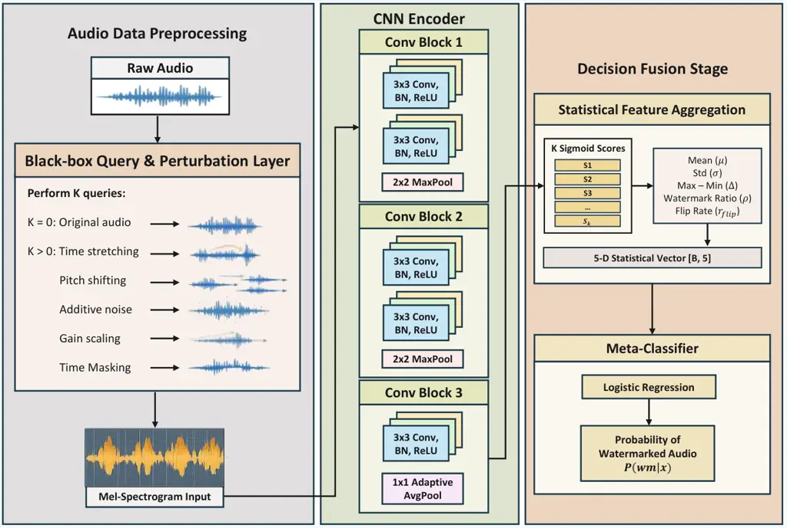

Sedaghati Wang Weng Rao

# VoxWatermark: A Large-Scale Benchmark for Audio Watermark Detection under Perturbations

Farnaz    Yuxi    Zicheng    Wei

###### Abstract

With the rapid deployment of speech generation systems in open
environments, providing verifiable source attribution and copyright
accountability for audio content has become critical. A gap in current
research is the lack of a unified benchmark that systematically compares
different watermark injection methods under realistic distribution
shifts. To address this, we build VoxWatermark by applying 10
watermarking methods (4 neural and 6 traditional) with unified injection
and annotation on multilingual, multi-source corpora, and introducing
no-box, black-box, and white-box perturbations to simulate real
recording and transmission conditions. Based on this benchmark, we
propose AudioWMD as a robust baseline detector for large-scale,
multi-method, cross-distribution settings. Results show that
injection-method diversity and distribution shifts affect detection
stability, while validating the effectiveness and scalability of
AudioWMD. Dataset and code are publicly available.¹¹ 1
[https://github.com/wailywang/VoxWatermark](https://github.com/wailywang/VoxWatermark)

###### keywords

audio watermarking, watermark detection, black-box attack, benchmark
dataset

^(†)^(†)address: ¹ University of Tehran, Iran  
² Nanyang Technological University, Singapore ^(†)^(†)email:
farnaz.sedaghati@ut.ac.ir, wa0009xi@e.ntu.edu.sg

## 1 Introduction

Over the past decade, Text-to-Speech (TTS) technology has advanced
rapidly, with synthetic speech now capable of achieving extreme
similarity to real human voices \[1, 2\]. These systems are now deployed
in numerous fields, ranging from assistive communication and virtual
assistants to media production and content generation. However, while
the power of TTS lies in its high degree of realism, it also brings
significant risks. Synthetic speech can be exploited for malicious
purposes, such as impersonating others, spreading misinformation, or
bypassing voice-based authentication systems \[3\].

To mitigate these risks, audio watermarking has been increasingly
adopted for speech authenticity verification \[4, 5, 6\]. Audio
watermarks are generally categorized as perceptible and imperceptible.
Perceptible watermarks explicitly indicate source identity but may
degrade listening quality and are easier to remove, whereas
imperceptible watermarks embed hidden information without audible
artifacts, making them more suitable for large-scale speech generation
and provenance tracking \[7\]. This work focuses on imperceptible
watermark detection and robustness evaluation. In this setting, a
watermark encoder embeds an inaudible signal into audio, and a
detector/decoder attempts to recover watermark evidence from a test
sample to determine whether watermarking is present.

In practice, however, achieving reliable audio watermark detection
remains challenging. We categorize perturbations into three classes
based on the attacker’s access capabilities: no-box, black-box, and
white-box. Specifically, no-box perturbations refer to distortions that
do not rely on the internal information of the detector and can be
implemented through general audio processing, including compression,
format conversion, resampling, noise addition, and time-frequency
transforms such as pitch shifting and time stretching \[1\]. These
operations are prevalent in real-world transmission and post-processing,
potentially weakening or even erasing the embedded watermarks, leading
to a significant degradation in detection performance \[8\].
Furthermore, learning-based adversarial attacks under black-box and
white-box settings can further manipulate samples in a targeted manner
to remove or forge watermarks, thereby bypassing detectors, posing a
stronger threat to robustness \[1, 9\].

Despite continuous progress in audio watermarking algorithms, watermark
detection research remains constrained by the lack of dedicated
evaluation benchmarks. Existing benchmarks (e.g., AudioMarkBench \[1\]
and RAW-Bench \[2\]) mainly focus on watermark robustness and perceptual
quality, rather than systematic detector-level comparison in realistic
scenarios, especially under unknown embedding methods. Taking
AudioMarkBench as an example, its covered watermarking methods are
limited to AudioSeal \[4\], Timbre \[10\], and WavMark \[5\], and its
data and perturbation settings are relatively limited. In addition, it
does not provide a general detection baseline. Overall, there is still a
lack of an open-source, systematic benchmark dedicated to audio
watermark detection.

To address the lack of a detection-oriented evaluation benchmark in
prior work, we introduce VoxWatermark. The main contributions of this
paper are as follows: (i) to the best of our knowledge, we construct the
first large-scale benchmark for audio watermark detection, covering 25
languages and 126,513.89 hours of audio, including clean, watermarked,
and perturbed samples; (ii) we propose a deployment-oriented
domain-mismatch perturbation protocol (no-box, black-box, and white-box)
to characterize robustness challenges when the source and conditions of
test-time audio clips are unknown; (iii) we present AudioWMD as a
unified baseline detection system and validate its effectiveness and
generalization across corpora and distribution shifts; (iv) we
open-source the VoxWatermark dataset and full codebase to support
standardized, reproducible, and extensible research.

## 2 Dataset

In total, VoxWatermark contains 91,090K samples, corresponding to
approximately 126,513.89 hours of audio data. Detailed statistics of the
dataset are provided below.

| Category | Dataset             | Samples | Hours | Languages |
| -------- | ------------------- | ------- | ----- | --------- |
| Speech   | LibriSpeech \[11\]  | 20,000  | 27.8  | English   |
|          | Common Voice \[12\] | 20,000  | 27.8  | 25        |
|          | VCTK \[13\]         | 10,000  | 13.9  | English   |
|          | AISHELL-1 \[14\]    | 10,000  | 13.9  | Mandarin  |
| Total    |                     | 60,000  | 83.4  | –         |

Table 1: Summary of unwatermarked speech datasets after 5-second
segmentation and 16 kHz mono preprocessing.

### 2.1 Unwatermarked Dataset

The unwatermarked dataset is constructed from multiple speech corpora
(see Table 1). To ensure consistency across sources, all samples are
uniformly segmented into 5-second clips and preprocessed to 16 kHz mono
format.

In terms of composition, we first select 20,000 clean utterances from
Common Voice \[12\], covering 25 languages (including English, French,
Spanish, German, and Mandarin), while maintaining relative balance
across gender and age groups following the protocol of
AudioMarkBench \[1\]. This design improves the evaluation of
generalization beyond English-only settings. Next, we randomly sample
20,000 English speech clips from the train-clean and test-clean subsets
of LibriSpeech \[11\], providing broad coverage over speakers of both
genders. In addition, we include 10,000 clips from VCTK \[13\] (English
speakers with diverse accents) and 10,000 Mandarin clips from
AISHELL-1 \[14\].

Together, these multi-source corpora provide substantial diversity in
language, speaker attributes, and acoustic conditions, forming a
large-scale and heterogeneous unwatermarked speech pool that supports
subsequent watermark embedding, perturbation construction, and
cross-domain detection evaluation.

### 2.2 Watermarking Methods

VoxWatermark dataset includes both conventional and learning-based
watermarking methods to cover detector behavior across different
watermarking paradigms. This design enables a unified evaluation of
detector robustness and generalization across diverse types of
watermarking methods.

Traditional Methods: LSB \[15\] embeds data by modifying waveform least
significant bits, offering low robustness. QIM \[16\] performs
controlled quantization in the spectral domain with moderate resilience
to distortions. Patchwork \[17\] encodes information by altering
statistical properties of frequency bands, providing moderate
robustness. Echo Hiding \[18\] introduces imperceptible echoes in the
waveform domain for robust yet transparent embedding. Phase Coding
\[19\] modifies phase spectral components, achieving strong robustness
to common signal processing. DSSS \[20\] employs spread-spectrum
modulation across wide frequency bands, offering high resistance to
degradation.

Learning-Based Methods: AudioSeal \[4\] performs waveform-domain
embedding using an attention-based encoder–decoder and demonstrates
strong robustness under diverse perturbations. WavMark \[5\] employs
transformer-based spectral modeling tailored for 16 kHz speech signals.
Timbre \[10\] leverages perceptually guided spectral representations to
achieve robust and high-quality embedding. Perth \[21\] adopts a neural
spectral-domain framework (Perth-Net Implicit) designed for
imperceptible and transformation-resilient watermarking.

For consistency across methods, we embed randomly generated payloads
during dataset construction: a 16-bit message is used for all
watermarking schemes, except Timbre, which supports a 10-bit payload,
and Perth, which uses an implicit signature

### 2.3 Perturbation Methods

Following prior audio watermarking benchmarks \[1\], we classify
adversarial perturbations against audio watermarking into two functional
categories: _watermark-removal_ and _watermark-forgery_. The former aims
to attenuate or eliminate the embedded watermark within a signal
$`x_{w}`$, whereas the latter attempts to inject a legitimate-appearing
watermark into an unwatermarked carrier $`x_{u}`$. These attacks
represent significant threats to the integrity of AI-generated content
(AIGC) detection; specifically, removal allows synthetic media to bypass
filters, while forgery can be weaponized to frame benign users.

#### 2.3.1 Formal Definitions

A watermark-removal attack identifies a perturbation $`\eta`$ that
minimizes the detection response while satisfying a perceptual
constraint. This is formulated as:

```math
\eta_{\text{rem}}=\arg\min_{\eta}\mathcal{D}(x_{w}+\eta),\quad\text{s.t.}\ \mathcal{Q}(x_{w}+\eta)\approx\mathcal{Q}(x_{w}) \tag{1}
```

where $`x_{w}`$ denotes a watermarked audio signal, $`\eta`$ is an
additive perturbation, $`\eta_{\text{rem}}`$ is the removal
perturbation, $`\mathcal{D}(\cdot)`$ is the watermark detector, output
$`0`$ indicates an unwatermarked decision, and $`\mathcal{Q}(\cdot)`$
denotes an objective quality metric such as ViSQOL \[22\]. Conversely,
watermark forgery is defined by:

```math
\eta_{\text{forg}}=\arg\max_{\eta}\mathcal{D}(x_{u}+\eta),\quad\text{s.t.}\ \mathcal{Q}(x_{u}+\eta)\approx\mathcal{Q}(x_{u}) \tag{2}
```

where $`x_{u}`$ denotes an unwatermarked audio signal,
$`\eta_{\text{forg}}`$ is the forgery perturbation, and output $`1`$
indicates a watermarked decision. These perturbations are further
categorized based on the attacker’s visibility into the target system’s
parameters.

#### 2.3.2 No-box Perturbations

In the _no-box_ scenario, perturbations are generated without access to
the internal logic or outputs of the detector \[1\]. We implement
seventeen distinct no-box perturbations covering common
signal-processing distortions and environmental degradations. These
include temporal manipulations (time stretching), additive noise
(Gaussian noise and environmental backgrounds), and spectral filtering.
The background-noise pool spans industrial (Factory 1/2), military
(Leopard, M109, F-16, Buccaneer), environmental (Babble, Volvo), and
communication-channel conditions (HF Channel). Notably, we incorporate
codecs such as EnCodec \[23\] and Opus \[24\] to simulate realistic
transmission-channel distortions. Removal and forgery perturbations are
applied to watermarked and unwatermarked audio, respectively, using
identical settings in both attack types to ensure a fair and controlled
evaluation. Detailed hyperparameters are listed in Table 2.

| Perturbation     | Parameter range          | Operation                |
| ---------------- | ------------------------ | ------------------------ |
| Time stretch     | \[0.7, 1.5\]             | Rate scaling             |
| Gaussian noise   | SNR \[5, 40\] dB         | White-noise addition     |
| Background noise | SNR \[5, 35\] dB         | Noise mixing             |
| Echo             | Delay \[0.1, 0.9\] s     | Reflection synthesis     |
| Spectral filter  | Ratio \[0.1, 0.6\]       | Low/high/band-pass       |
| Quantization     | Bit \[4, 64\]            | Bit-depth reduction      |
| EnCodec / Opus   | \[1.5, 256\] kbps        | Neural/lossy coding      |
| Dyn. range       | Ratio \[2.0, 8.0\]       | Compression/expansion    |
| Phase/jitter     | \[0.01, 1000\]           | Temporal/frequency shift |

Table 2: No-box perturbation methods and parameter ranges used in the
benchmark.

#### 2.3.3 Black-box Perturbations

Under _black-box_ conditions, the adversary treats the detector
$`\mathcal{D}`$ as a queryable oracle. We adapt two iterative estimation
strategies: HopSkipJumpAttack (HSJ) \[25\], which estimates the decision
boundary through binary search and gradient approximation, and Square
Attack \[26\], a score-based method that utilizes random search on the
spectrogram domain. HSJ is applied to both raw waveforms and
time-frequency representations, while Square Attack is restricted to the
latter due to its block-based update mechanism. For each watermarking
method, every removal attack is performed on a subset of 200 watermarked
audio samples.

#### 2.3.4 White-box Perturbations

The _white-box_ setting assumes complete transparency of the decoder
$`\mathrm{Dec}`$ and the target bitstream $`\mathbf{w}`$. For
deep-learning models (e.g., Timbre, WavMark), we minimize the Binary
Cross-Entropy (BCE) loss:

```math
\mathcal{L}_{\text{BCE}}=-\sum_{i=1}^{n}\left[w_{i}\log(\hat{w}_{i})+(1-w_{i})\log(1-\hat{w}_{i})\right] \tag{3}
```

where $`\hat{w}=\mathrm{Dec}(x+\eta)`$. For traditional methods, we
implement custom differentiable approximations (e.g., differentiable QIM
or Echo Hiding) to facilitate gradient descent. For forgery, the
optimization targets a specific message $`\mathbf{w}`$, while removal
targets the bit-flipped version $`1-\mathbf{w}`$. Perceptual
transparency is maintained via an Adam-optimized loss function that
balances detection error with acoustic fidelity. In the white-box
setting, forgery attacks use 200 unwatermarked samples per watermarking
method and contribute to false positives when successful, while removal
attacks use 200 corresponding watermarked samples and contribute to
false negatives.

## 3 Methodology



Figure 1: Overview of AudioWMD. Raw audio is transformed into stochastic
variants, scored by a base detector, and aggregated into meta-features
for final watermark prediction.

### 3.1 AudioWMD for Audio Watermark Detection

We formulate audio watermark detection as a binary classification task:
given an audio clip $`x`$, predict whether watermark evidence is present
($`\hat{y}\in\{0,1\}`$). As shown in Fig. 1, AudioWMD follows a
two-stage pipeline: query-statistics feature extraction under stochastic
transformations, followed by logistic-regression meta-classification.

#### 3.1.1 Stage I: Base Detector

A base detector $`f_{\theta}`$ is trained on 16 kHz log-mel spectrograms
with BCE-with-logits loss and outputs a watermark confidence score for
each input clip.

#### 3.1.2 Stage II: Query-Statistics Meta Detection

For each clip, we issue $`K=8`$ queries (one original plus transformed
variants) and collect the corresponding confidence scores. From these
scores, we compute a compact 5-dimensional meta-feature vector
consisting of mean score, score standard deviation, score range,
positive occupancy ratio, and decision-flip ratio (relative to the
original query). The meta-feature vector is then fed to a
logistic-regression meta-classifier for final prediction.

### 3.2 Baseline for Comparison

We use WaterMark Detector (WMD) \[27\] as the primary baseline. WMD is a
single-query detector: each input audio clip is converted into a
spectrogram and passed through a ConvNeXt-V2 backbone to produce a
watermark confidence score. For optimization, WMD adopts an asymmetric
loss design to separate watermark and non-watermark responses \[27\].
Compared with WMD, AudioWMD introduces a second stage that aggregates
multiple stochastic-query responses into compact stability features
before final classification, enabling direct evaluation of whether
stability-aware modeling improves robustness.

## 4 Experimental Setup

### 4.1 Data Partitioning and Protocol

To rigorously assess model generalization, we partition the corpus into
training, validation, and two OOD test sets, with explicit domain and
algorithm shifts.

#### 4.1.1 Training and Validation

The raw training pool contains 34k clean speech clips from LibriSpeech,
Common Voice (EN/ZH), and AISHELL-1. From this pool, we construct the
final training split with 61,200 samples (30,600 clean + 30,600
watermarked) by pairing each selected clean clip with one watermarked
counterpart generated using six seen watermarking schemes: LSB, QIM,
DSSS, AudioSeal, Timbre, and Phase Coding. No perturbation augmentation
is applied during detector training. A stratified 10% split is reserved
for validation to monitor convergence. The validation set is strictly
in-domain, sharing the same source corpora and seen watermarking methods
as the training split.

#### 4.1.2 Out-of-Domain Evaluation

We evaluate two OOD settings: (i) a cross-lingual test set constructed
from Common Voice excluding English and Chinese, and (ii) a cross-accent
test set based on VCTK. OOD tests use three unseen watermarking schemes:
Patchwork, Echo, and WavMark.

| Category         | Perturbation                 | ViSQOL | SNR (dB)  |
| ---------------- | ---------------------------- | ------ | --------- |
| Background noise | M109                         | 3.188  | 10.0      |
| Temporal         | Time stretch (0.9$`\times`$) | 3.587  | $`-1.55`$ |
| Codec            | Encodec (1.5 kbps)           | 3.311  | 1.15      |

Table 3: Representative no-box perturbations and their perceptual and
signal-level impact.

To ensure diversity across no-box perturbation domains, one
representative per these three categories was chosen (see Table 3):
background noise (M109), temporal modification (time stretching), and
codec distortion (Encodec compression).

We define four perturbation scenarios to compare robustness under
different attack conditions. First, no-box perturbations (time
stretching, M109, and Encodec) are applied to both test sets. Second,
black-box attacks are performed using two HSJA variants and Square
attack. Third, gradient-based white-box attacks are performed, including
forgery and removal. Finally, we evaluate robustness under no-box,
black-box, and white-box perturbation groups, and report per-group
performance.

For both WMD \[27\] and AudioWMD, we select a decision threshold on the
validation split and keep it fixed across all OOD test sets. This
protocol avoids test-time tuning and ensures that OOD performance
reflects true cross-distribution generalization rather than threshold
recalibration on test data.

| Method     | Dataset    | Overall            |                  | Class: Clean |      |      | Class: Watermarked |      |      |
| ---------- | ---------- | ------------------ | ---------------- | ------------ | ---- | ---- | ------------------ | ---- | ---- |
|            |            | AUROC $`\uparrow`$ | Acc $`\uparrow`$ | P            | R    | F1   | P                  | R    | F1   |
| AudioWMD   | Validation | 88.3               | 84.0             | 78.0         | 93.0 | 85.0 | 92.0               | 74.0 | 82.0 |
|            | Test Set 1 | 63.8               | 53.0             | 52.0         | 98.0 | 68.0 | 78.0               | 9.0  | 16.0 |
|            | Test Set 2 | 63.2               | 58.0             | 55.0         | 85.0 | 67.0 | 68.0               | 31.0 | 43.0 |
| WMD \[27\] | Validation | 72.0               | 67.0             | 62.0         | 88.0 | 73.0 | 79.0               | 46.0 | 58.0 |
|            | Test Set 1 | 57.1               | 55.0             | 53.0         | 83.0 | 65.0 | 61.0               | 27.0 | 37.0 |
|            | Test Set 2 | 57.9               | 56.0             | 55.0         | 69.0 | 61.0 | 58.0               | 43.0 | 49.0 |

Table 4: Performance comparison between AudioWMD and reproduced
WMD \[27\]. All metrics are percentages (%). All WMD results in this
paper are reproduced by us on our benchmark under the same protocol.

Set Category WMD \[27\] AudioWMD AUROC $`\uparrow`$ F1 $`\uparrow`$
AUROC $`\uparrow`$ F1 $`\uparrow`$ T1 Overall 52.81 52.0 56.73 45.0
Clean 57.09 53.0 63.82 42.0 No-box (Avg) 51.28 50.0 54.33 46.0 White-box
48.63 45.0 77.15 53.0 T2 Overall 54.71 51.0 55.92 51.0 Clean 57.94 51.0
63.17 55.0 No-box (Avg) 53.11 50.0 53.15 50.0 White-box 41.18 36.0 70.02
57.0

Table 5: Detection performance on Test Set 1 (T1) and Test Set 2 (T2)
under clean, no-box, and white-box scenarios. “Overall” denotes metrics
computed on all included samples in each test set. All metrics are
percentages (%).

Set Attack WMD \[27\] AudioWMD TPR $`\uparrow`$ FNR $`\downarrow`$ TPR
$`\uparrow`$ FNR $`\downarrow`$ T1 Overall 73.96 26.04 50.26 49.74
HSJA_sig 85.16 14.84 69.53 30.47 HSJA_spec 96.09 3.91 3.91 96.09 Square
40.62 59.38 77.34 22.66 T2 Overall 93.42 6.58 51.44 48.56 HSJA_sig 96.30
3.70 77.78 22.22 HSJA_spec 100.00 0.00 2.50 97.50 Square 84.15 15.85
73.17 26.83

Table 6: Black-box attack results on Test Set 1 (T1) and Test Set 2
(T2), reported as percentages (%). “Overall” denotes results aggregated
over all listed black-box attacks within each test set.

## 5 Results and Discussion

### 5.1 Performance on Validation and OOD Sets

Table 4 compares the performance of WMD and AudioWMD across the
validation and OOD test sets. While both models demonstrate strong
in-domain discrimination, the OOD evaluation reveals significant
degradation for both architectures. AudioWMD maintains a consistently
higher AUROC (Test1: 0.638; Test2: 0.632) than WMD (Test1: 0.571; Test2:
0.579). This suggests that incorporating query-time stability modeling
provides a more robust ranking mechanism against linguistic and
algorithmic shifts.

### 5.2 Robustness Under Structured Perturbations

We systematically evaluate model robustness under various attack
categories, with general signal perturbations and white-box results
summarized in Table 5, and specialized black-box adversarial results
presented in Table 6.

No-box attacks. As shown in Table 5, both detectors degrade noticeably
under no-box perturbations, with performance approaching chance level.
This trend suggests that common signal-processing distortions can
obscure watermark evidence and reduce score separability. Compared with
WMD, AudioWMD provides modest AUROC gains on no-box settings (e.g., T1
no-box average), while F1 remains comparable, indicating limited but
consistent robustness improvements under non-adaptive perturbations.

White-box attacks. The benchmark reveals a substantial gap in
adversarial resistance. AudioWMD achieves significantly higher AUROC/F1
scores (e.g., 0.7715/0.53 in Test1) than WMD (0.4863/0.45). This
suggests that standard acoustic classifiers are highly susceptible to
gradient-based manipulation, whereas stability-aware meta-classifiers
provide improved protection by monitoring query-response consistency.

Black-box attacks. Table 6 shows that robustness is strongly
attack-dependent. AudioWMD is generally stronger than WMD under no-box
and white-box settings, but its black-box performance is uneven: it
performs well on Square attack in T1 (0.7734 vs. 0.4062), yet degrades
sharply on HSJA_spec (TPR 0.0391 on T1 and 0.0250 on T2), where WMD
remains stronger. These results demonstrate the value of our dataset
design: by jointly covering multiple perturbation families and attack
types under a unified protocol, the benchmark exposes model-specific
weaknesses not visible under clean or single-attack evaluation.

## 6 Conclusion

We introduce VoxWatermark, a large-scale benchmark for audio watermark
detection featuring multi-method injection and robust evaluation via
proposed AudioWMD baseline. By open-sourcing the dataset and codebase,
we aim to facilitate standardized and reproducible research in audio
watermark detection.

## 7 Generative AI Use Disclosure

The authors used AI to improve the language, grammar, and style of the
manuscript. All scientific content, data analysis, and conclusions were
developed solely by the authors. The authors have reviewed and edited
all outputs and take full responsibility for the final content of the
paper.

## References

- \[1\] H. Liu, M. Guo, Z. Jiang, L. Wang, and N. Gong (2024)
  Audiomarkbench: benchmarking robustness of audio watermarking. In
  Proc. NeurIPS, Vol. 37, pp. 52241–52265. Cited by: §1, §1, §1, §2.1,
  §2.3.2, §2.3.
- \[2\] Y. Özer, W. Choi, J. Serrà, M. K. Singh, W. Liao, and Y.
  Mitsufuji (2025) A comprehensive real-world assessment of audio
  watermarking algorithms: will they survive neural codecs?. arXiv
  preprint arXiv:2505.19663. Cited by: §1, §1.
- \[3\] X. Wang and J. Yamagishi (2021) A comparative study on recent
  neural spoofing countermeasures for synthetic speech detection. In
  Proc. Interspeech 2021, pp. 4259–4263. Cited by: §1.
- \[4\] R. San Roman, P. Fernandez, A. Défossez, T. Furon, T. Tran,
  and H. Elsahar (2024) Proactive detection of voice cloning with
  localized watermarking. In Proc. ICML, Cited by: §1, §1, §2.2.
- \[5\] G. Chen, Y. Wu, S. Liu, T. Liu, X. Du, and F. Wei (2023)
  WavMark: watermarking for audio generation. arXiv preprint
  arXiv:2308.12770. Cited by: §1, §1, §2.2.
- \[6\] M. K. Singh, N. Takahashi, W. Liao, and Y. Mitsufuji (2024)
  SilentCipher: deep audio watermarking. In Proc. Interspeech 2024,
  pp. 2235–2239. External Links:
  [Document](https://dx.doi.org/10.21437/Interspeech.2024-174) Cited by:
  §1.
- \[7\] N. Chen and J. Zhu (2008) A robust zero-watermarking algorithm
  for audio. EURASIP Journal on Advances in Signal Processing 2008,
  pp. 453580. External Links:
  [Document](https://dx.doi.org/10.1155/2008/453580) Cited by: §1.
- \[8\] M. Farzaneh and R. M. Toroghi (2020) Robust audio watermarking
  using graph-based transform and singular value decomposition. In Proc.
  IST, pp. 137–141. Cited by: §1.
- \[9\] L. Yao, C. Huang, S. Wang, J. Xue, H. Guo, J. Liu, P. Lin, T.
  Ohtsuki, and M. Pan (2025) Yours or mine? overwriting attacks against
  neural audio watermarking. arXiv preprint arXiv:2509.05835. Cited by:
  §1.
- \[10\] C. Liu, J. Zhang, T. Zhang, X. Yang, W. Zhang, and N. Yu (2024)
  Detecting voice cloning attacks via timbre watermarking. In Proc.
  NDSS, Cited by: §1, §2.2.
- \[11\] V. Panayotov, G. Chen, D. Povey, and S. Khudanpur (2015)
  LibriSpeech: an ASR corpus based on public domain audio books. In
  Proc. ICASSP, pp. 5206–5210. Cited by: §2.1, Table 1.
- \[12\] R. Ardila, M. Branson, K. Davis, M. Henretty, M. Kohler, J.
  Meyer, R. Morais, L. Saunders, F. M. Tyers, and G. Weber (2020) Common
  voice: a massively-multilingual speech corpus. In Proceedings of The
  12th Language Resources and Evaluation Conference (LREC),
  pp. 4218–4222. Cited by: §2.1, Table 1.
- \[13\] C. Veaux, J. Yamagishi, and S. King (2013) The voice bank
  corpus: design, collection and data analysis of a large regional
  accent speech database. In Proc. O-COCOSDA, pp. 1–4. Cited by: §2.1,
  Table 1.
- \[14\] H. Bu, J. Du, X. Na, B. Wu, and H. Zheng (2017) AISHELL-1: an
  open-source Mandarin speech corpus and a speech recognition baseline.
  In Proc. O-COCOSDA, pp. 1–5. Cited by: §2.1, Table 1.
- \[15\] N. Cvejic and T. Seppanen (2004) Increasing robustness of LSB
  audio steganography using a novel embedding method. In Proc. ITCC,
  Vol. 2, pp. 533–537. Cited by: §2.2.
- \[16\] B. Chen and G. W. Wornell (2001) Quantization index modulation:
  a class of provably good methods for digital watermarking and
  information embedding. IEEE Transactions on Information Theory 47 (4),
  pp. 1423–1443. Cited by: §2.2.
- \[17\] I. Yeo and H. J. Kim (2003) Modified patchwork algorithm: a
  novel audio watermarking scheme. IEEE Transactions on Speech and Audio
  Processing 11 (4), pp. 381–386. Cited by: §2.2.
- \[18\] D. Gruhl, A. Lu, and W. Bender (1996) Echo hiding. In Proc.
  Information Hiding, pp. 295–315. Cited by: §2.2.
- \[19\] N. M. Ngo and M. Unoki (2015) Robust and reliable audio
  watermarking based on phase coding. In Proc. ICASSP, pp. 345–349.
  Cited by: §2.2.
- \[20\] I. J. Cox, J. Kilian, F. T. Leighton, and T. Shamoon (1997)
  Secure spread spectrum watermarking for multimedia. IEEE Transactions
  on Image Processing 6 (12), pp. 1673–1687. Cited by: §2.2.
- \[21\] Resemble AI (2025) Perth: open audio watermarking tool. Note:
  [https://github.com/resemble-ai/Perth](https://github.com/resemble-ai/Perth)GitHub
  repository Cited by: §2.2.
- \[22\] A. Hines, J. Skoglund, A. C. Kokaram, and N. Harte (2015)
  ViSQOL: an objective speech quality model. EURASIP Journal on Audio,
  Speech, and Music Processing 2015, pp. 13. Cited by: §2.3.1.
- \[23\] A. Défossez, J. Copet, G. Synnaeve, and Y. Adi (2022) High
  fidelity neural audio compression. arXiv preprint arXiv:2210.13438.
  Cited by: §2.3.2.
- \[24\] J. Valin, K. Vos, and T. B. Terriberry (2012) Definition of the
  Opus audio codec. RFC Technical Report 6716, Internet Engineering Task
  Force (IETF). External Links:
  [Document](https://dx.doi.org/10.17487/RFC6716),
  [Link](https://www.rfc-editor.org/info/rfc6716) Cited by: §2.3.2.
- \[25\] J. Chen, M. I. Jordan, and M. J. Wainwright (2020)
  HopSkipJumpAttack: a query-efficient decision-based attack. In Proc.
  IEEE S&P, pp. 1277–1294. Cited by: §2.3.3.
- \[26\] M. Andriushchenko, F. Croce, N. Flammarion, and M. Hein (2020)
  Square attack: a query-efficient black-box adversarial attack via
  random search. In Proc. ECCV, pp. 484–501. Cited by: §2.3.3.
- \[27\] M. Pan, Z. Wang, X. Dong, V. Sehwag, L. Lyu, and X. Lin (2024)
  Finding needles in a haystack: a black-box approach to invisible
  watermark detection. In Proceedings of the European Conference on
  Computer Vision (ECCV), Cited by: §3.2, §4.1.2, Table 4, Table 4,
  Table 5, Table 6.
