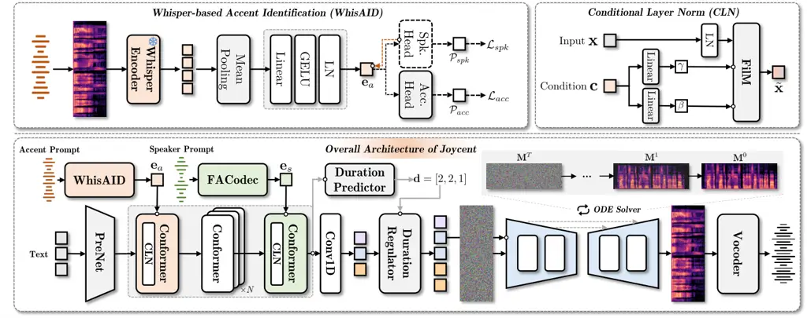

# Joycent: Multi-Accent TTS via Disentangled Accent Modeling and Layer-Specific Conditioning

Xintong Wang    Junchuan Zhao    Ye Wang ^(†)^(†)thanks: This work is
funded by a research grant MOE-MOESOL2021-0005 from the Ministry of
Education in Singapore.

###### Abstract

Accent text-to-speech (TTS) aims to synthesize speech with a target
accent while preserving speaker identity, but faces two key challenges:
disentangling accent from speaker characteristics and effectively
conditioning speech generation on the two disentangled factors. In this
paper, we propose Joycent, a diffusion-based accent TTS framework that
addresses both challenges. Our key idea is to separate accent and
speaker information in both representation learning and TTS
conditioning. Joycent uses WhisAID, a Whisper-based accent encoder with
gradient reversal to learn speaker-disentangled accent representations,
and introduces layer-specific conditional layer normalization to inject
accent and speaker information at different stages of the text encoder.
We evaluate Joycent on the Mandarin Regional Accent Corpus (MRAC) with
seen and unseen speakers, including a challenging cross-accent setting
where the speaker and accent prompts come from different accents.
Experimental results show that Joycent improves accent similarity over
existing methods while maintaining strong speaker similarity, with
consistent gains under the challenging cross-accent setting. Subjective
evaluation further confirms improved naturalness, accent similarity, and
speaker preservation. The audio samples are available at
https://oshindow.github.io/joycent/.

###### Index Terms: 

Text-to-speech, accent synthesis, reference-based TTS, accent-speaker
disentanglement, diffusion models

^(†)^(†)address: School of Computing, National University of Singapore,
Singapore

## 1 Introduction

Text-to-speech (TTS) systems \[10, 4, 26, 17, 8, 43, 31\] have made
substantial progress in generating natural and expressive speech from
text. Accent TTS \[16, 22, 37, 14, 34\] further extends this capability
to diverse regional and non-native accents. Recent systems increasingly
use reference/prompt speech to specify the desired accent and speaker
characteristics, enabling flexible accent controls. Speech
reference/prompt-based accent TTS \[33, 42, 1, 7\] typically uses two
speech prompts to independently specify the target accent and speaker
timbre: an accent prompt provides the desired accent, while a speaker
prompt provides the target timbre. A particularly challenging case is
cross-accent synthesis, where these prompts come from different speakers
with different accents. In this setting, the model must preserve the
timbre of a typically unseen target speaker while preventing the
inherent accent of the speaker prompt from interfering with the accent
specified by the accent prompt.

The first challenge in cross-accent synthesis lies in disentangling
accent from speaker identity. In multi-accent corpora, each accent is
typically represented by multiple speakers, whereas an individual
speaker usually exhibits only one inherent accent \[22, 23\]. Accent and
speaker identity are therefore strongly correlated, allowing an accent
encoder to retain speaker-dependent information that is predictive of
the accent label. Related speech reference-based standard TTS face
similar factor-entanglement issues and employ various forms of
representation separation \[40, 41\]. In accent TTS, existing approaches
either implicitly separate accent and speaker information through
dedicated representations \[23\] or explicitly suppress speaker
information from the accent representation using adversarial
training \[42, 1\]. We follow the latter direction and learn accent
representations from pre-trained speech features, while explicitly
reducing residual speaker information.

Further, even with a disentangled accent representation, it is
imperative for an accent TTS model to know how to condition the accent
information. Speech reference/prompt-based conditioning has been
explored for speaking style \[32, 39, 38\], emotion \[30, 20\], and
prosody \[40\]. In accent TTS, accent information is commonly introduced
at the text-encoder input or on the decoder side. However, accent and
speaker representations encode distinct speech factors and need not
influence all stages of the linguistic representation in the same
manner. We therefore investigate layer-specific conditioning, allowing
accent and speaker information to modulate different stages of the text
encoder for stronger accent control while preserving speaker identity.

In this work, we propose Joycent, a diffusion-based framework for
cross-accent TTS that aims to address these challenges. Joycent learns a
transferable accent representation with WhisAID, a Whisper-based \[28\]
accent identification model with speaker suppression using gradient
reversal \[12\], and combines it with an independently extracted speaker
representation by FACodec \[17\] through layer-specific conditional
layer normalization (CLN) \[3\]. Joycent is trained and evaluated on 138
hours of Mandarin Regional Accent Corpus (MRAC) spanning 9 regional
accents under seen-speaker, unseen-speaker inherent-accent, and
unseen-speaker cross-accent settings. In the inherent-accent setting,
the accent and speaker prompts come from different speakers but share
the same inherent accent. In the cross-accent setting, they come from
different speakers with different inherent accents. The latter directly
evaluates whether the target accent can be transferred across speakers
while preserving the identity specified by the speaker prompt. Objective
and subjective evaluations demonstrate the effectiveness of Joycent.

Our main contributions are as follows:

- •
  We study accent–speaker disentanglement in prompt-based accent TTS and
  introduce WhisAID, which learns extract accent representations while
  suppressing speaker information.
- •
  We propose a layer-specific conditioning strategy that incorporates
  accent and speaker information at different text-encoder stages,
  improving accent control while preserving target-speaker
  characteristics.
- •
  We construct the 138 hours Mandarin Regional Accent Corpus (MRAC)
  dataset spanning 9 regional mandarin accents for training and
  evaluation. We further conduct a systematic evaluation under
  seen-speaker, unseen-speaker inherent-accent, and unseen-speaker
  cross-accent settings, with the latter explicitly evaluating accent
  transfer between speakers with different accents.

## 2 Related Work

### 2.1 Accented Text-to-Speech

Accented TTS aims to control accent characteristics while preserving
linguistic content and, in multi-speaker settings, the identity of a
target speaker. Existing methods differ primarily in how accent
information is represented and introduced into synthesis. DDGM-Acc \[7\]
formulate accent modelling within a diffusion-based TTS framework and
further perform accent conversion by modifying accent-related features
during the diffusion process. DART \[23\] explicitly factorizes accent
and speaker representations using a multi-level variational autoencoder
with vector quantization, enabling different accent–speaker combinations
at inference time. AccentBox \[42\] adopts a two-stage pipeline: it
first trains an accent identification model to extract speaker-agnostic
accent embeddings and then conditions a zero-shot TTS system on these
pretrained accent representations. These approaches demonstrate the
importance of separating accent from speaker identity when accent and
speaker conditions are recombined across utterances or speakers.

Other approaches model accent variation at a finer linguistic level.
Accent-VITS \[22\] decomposes the text-to-wave mapping into
text-to-accent and accent-to-wave stages and uses a hierarchical CVAE to
model accent pronunciation and acoustic characteristics. Multi-scale
accent modelling \[45\] captures both utterance-level accent
characteristics and phoneme-level accent variation while introducing
speaker disentanglement for independent accent control. Related methods
explicitly predict or transform accent-dependent phoneme representations
before acoustic generation \[16, 44\]. More recently,
instruction-following TTS systems allow accent or dialect
characteristics to be specified through natural-language
instructions \[9, 2\]. In contrast, Joycent focuses on reference-based
cross-accent synthesis, where accent and speaker identity are provided
by separate speech prompts, without requiring explicit accented-phone
prediction or textual accent descriptions.

### 2.2 Speech Attribute Disentanglement

Speech representations naturally mix multiple factors, including
linguistic content, speaker timbre, prosody, pitch, rhythm, style,
emotion, and accent. A major line of work therefore explicitly
factorizes speech into attribute-specific representations.
SpeechSplit \[27\] uses multiple information bottlenecks to decompose
speech into linguistic content, timbre, pitch, and rhythm.
NaturalSpeech 3 \[17\] extends this idea to neural speech codecs, where
FACodec factorizes speech into content, prosody, timbre, and
acoustic-detail subspaces using factorized vector quantization. Related
work has also isolated prosodic information from other speech factors
for controllable voice conversion \[40\] and separated style-related
information from speaker characteristics in expressive speech
synthesis \[6\]. Together, these methods seek to assign different
controllable attributes to distinct latent spaces and thereby reduce
interference between them.

A complementary strategy is to learn a representation for one target
attribute while explicitly suppressing nuisance information, rather than
factorizing all speech factors. AccentBox \[42\], for example, learns
speaker-agnostic accent representations using an information bottleneck
together with adversarial speaker suppression. In cross-speaker
emotional TTS, DiEmo-TTS \[5\] instead uses self-supervised distillation
to obtain emotion representations with reduced speaker leakage. Such
suppression is particularly relevant to accented TTS when speaker
identity and accent are correlated in the training data, since a
reference-derived accent representation may otherwise retain
speaker-specific cues. Joycent follows this formulation: WhisAID is
trained to preserve accent-discriminative information while suppressing
speaker-dependent information, and the resulting accent representation
is combined with an independently extracted speaker representation for
cross-accent synthesis.

## 3 Method



Figure 1: Overall architecture of Joycent. WhisAID learns
speaker-disentangled accent representations, while CLN enables
layer-specific accent and speaker conditioning. Joycent integrates these
representations with the text encoder and generates speech through
duration modeling and diffusion-based acoustic synthesis. The orange
dashed lines indicate gradient reversal.

### 3.1 Overall Architecture

Given a text sequence $`\mathbf{x}_{1:L}`$, an accent prompt
$`\mathbf{w}_{a}`$, and a speaker prompt $`\mathbf{w}_{s}`$, Joycent
synthesizes speech that follows the accent specified by
$`\mathbf{w}_{a}`$ while preserving the speaker identity specified by
$`\mathbf{w}_{s}`$. As illustrated in Fig. 1, the accent prompt is
processed by our proposed WhisAID to obtain an accent representation
$`\mathbf{e}_{a}`$. Independently, the speaker prompt is encoded using
the timbre extractor of the pre-trained FACodec¹¹ 1 FACodec:
https://huggingface.co/amphion/naturalspeech3_facodec from NaturalSpeech
3 \[17\] to obtain the speaker embedding $`\mathbf{e}_{s}`$. This
separation allows the accent and speaker prompts to come from different
speakers, including speakers with different inherent accents in the
cross-accent setting. For linguistic encoding, $`\mathbf{x}_{1:L}`$ is
first mapped to hidden representations by a PreNet and then processed by
a Conformer-based encoder \[13\] with layer-specific conditioning. The
pre-net consists of 3 Conv1D layers, each followed by layer
normalization, ReLU activation, and dropout, followed by a linear
projection and a residual connection. The first Conformer block is
conditioned on $`\mathbf{e}_{a}`$ through conditional layer
normalization (CLN), followed by $`K`$ standard Conformer blocks, while
the final block is conditioned on $`\mathbf{e}_{s}`$ through another CLN
module. This ordering introduces accent information early into the
linguistic representation and speaker characteristics at a later stage,
facilitating accent control while preserving speaker identity. A Conv1D
projection produces the encoder representation $`\mathbf{h}_{1:L}`$,
from which the duration predictor estimates
$`\mathbf{d}_{1:L}=[d_{1},\ldots,d_{L}]`$.

The duration regulator expands $`\mathbf{h}_{1:L}`$ according to
$`\mathbf{d}_{1:L}`$ to obtain the frame-level acoustic condition
$`\mathbf{c}_{1:N}`$. The expanded representation $`\mathbf{c}_{1:N}`$
is then provided to a score-based acoustic decoder following
Grad-TTS \[26\]. Starting from Gaussian noise, the decoder iteratively
generates the mel-spectrogram $`\hat{\mathbf{M}}`$ through the reverse
diffusion process. Finally, a Parallel-WaveGAN vocoder ²² 2 Parallel
WaveGAN: https://github.com/kan-bayashi/ParallelWaveGAN \[35\] converts
$`\hat{\mathbf{M}}`$ into the synthesized waveform $`\hat{\mathbf{w}}`$.
The following sections present the details of WhisAID, the
layer-specific conditioning strategy for the Conformer-based encoder,
and the training pipeline of Joycent.

### 3.2 Whisper-based Accent Identification (WhisAID)

Prompt-based accent synthesis requires an accent representation that
captures accent-dependent pronunciation characteristics while minimizing
information tied to the prompt speaker. Inspired by AccentBox \[42\], we
introduce WhisAID, a Whisper-based accent identification model with
explicit speaker suppression. Whisper \[28\] provides rich phonetic and
linguistic representations from large-scale speech recognition
pre-training, making it well suited for modeling accent-dependent
pronunciation patterns. Given an accent prompt $`\mathbf{w}_{a}`$, the
waveform is processed by the standard Whisper feature extractor and a
frozen pre-trained Whisper encoder to obtain the frame-level
representation $`\mathbf{h}_{a}\in\mathbb{R}^{N^{\prime}\times D}`$,
where $`N^{\prime}`$ is the number of encoded frames and $`D`$ is the
feature dimension. We apply temporal mean pooling followed by a
bottleneck projection consisting of a linear layer, GELU
activation \[15\], and layer normalization, producing the accent
embedding $`\mathbf{e}_{a}\in\mathbb{R}^{1\times D^{\prime}}`$. The
bottleneck compresses the Whisper representation into a compact space
and limits the retention of nuisance information. A linear accent
classifier is then applied to $`\mathbf{e}_{a}`$ and optimized with the
cross-entropy loss $`\mathcal{L}_{\mathrm{acc}}`$.

To explicitly reduce speaker information in $`\mathbf{e}_{a}`$, we
attach an auxiliary linear speaker classifier through a gradient
reversal layer (GRL) \[12\]. The GRL reverses the speaker-classification
gradient propagated to the accent representation, encouraging the
bottleneck to preserve accent-discriminative information while
suppressing speaker-dependent cues. The speaker branch is optimized
using the cross-entropy loss $`\mathcal{L}_{\mathrm{spk}}`$, and the
overall WhisAID objective is:

```math
\mathcal{L}_{\mathrm{WhisAID}}=\mathcal{L}_{\rm{acc}}+\lambda\mathcal{L}_{\rm{spk}}, \tag{1}
```

where $`\lambda`$ controls the strength of adversarial speaker
suppression. During training, the Whisper encoder remains frozen, while
the bottleneck and both classification heads are jointly optimized. At
inference time, the classification heads and GRL branch are removed, and
the Whisper encoder together with the bottleneck projection is used to
extract $`\mathbf{e}_{a}`$ for conditioning Joycent.

### 3.3 Layer-specific Accent and Speaker Conditioning

Existing accent TTS systems commonly incorporate accent information by
concatenating or adding accent embeddings to speaker representations. In
contrast, Joycent introduces accent and speaker information at different
stages of the text encoder through conditional layer normalization
(CLN). Specifically, the layer normalization following the first
Conformer block is replaced with an accent-conditioned CLN, while the
layer normalization after the final Conformer block is replaced with a
speaker-conditioned CLN. We introduce accent conditioning early in the
encoder since accent variations are closely related to phone
realization \[11, 36\], allowing accent information to modulate
token-level linguistic representations before higher-level acoustic
characteristics are formed. Speaker information is introduced at the
final encoder stage to preserve the target speaker characteristics after
accent-conditioned linguistic modeling.

For each CLN, the conditioning embedding is linearly projected into
feature-wise affine parameters $`\gamma(\cdot)`$ and $`\beta(\cdot)`$,
which modulate the normalized hidden representation. Let
$`\mathbf{h}_{a}`$ and $`\mathbf{h}_{s}`$ denote the representations
obtained by broadcasting the utterance-level accent and speaker
embeddings $`\mathbf{e}_{a}`$ and $`\mathbf{e}_{s}`$ to match the text
token sequence length $`L`$, respectively. The corresponding
conditioning operations are implemented using Feature-wise Linear
Modulation (FiLM) \[25\]

```math
\displaystyle\tilde{\mathbf{h}}_{a} \displaystyle=\gamma(\mathbf{e}_{a})\odot\frac{\mathbf{h}_{a}-\mu(\mathbf{h}_{a})}{\sigma(\mathbf{h}_{a})}+\beta(\mathbf{e}_{a}), \tag{2}
```

```math
\displaystyle\tilde{\mathbf{h}}_{s} \displaystyle=\gamma(\mathbf{e}_{s})\odot\frac{\mathbf{h}_{s}-\mu(\mathbf{h}_{s})}{\sigma(\mathbf{h}_{s})}+\beta(\mathbf{e}_{s}),
```

where $`\mu(\cdot)`$ and $`\sigma(\cdot)`$ denote the mean and standard
deviation, respectively, and $`\odot`$ denotes element-wise
multiplication. This layer-specific design allows accent and speaker
information to influence different stages of linguistic encoding rather
than being fused through a shared conditioning pathway. As shown in our
ablation experiments, conditioning accent information at an early
Conformer block yields stronger accentedness than conditioning the
frame-level diffusion decoder, supporting the importance of introducing
accent information during linguistic encoding.

|           |            |           |             |              |           |             |         |          |           |             |
| --------- | ---------- | --------- | ----------- | ------------ | --------- | ----------- | ------- | -------- | --------- | ----------- |
|           | Utterances |           |             | Duration (h) |           |             |         | Speakers |           |             |
| Accent    | Train      | Seen Test | Unseen Test | Train        | Seen Test | Unseen Test | Total   | Train    | Seen Test | Unseen Test |
| North     | 43,467     | 2,000     | 2,000       | 44.307       | 1.672     | 1.931       | 47.910  | 126      | 106       | 39          |
| Sichuan   | 19,066     | 2,377     | 2,377       | 16.356       | 2.081     | 1.801       | 20.238  | 49       | 49        | 2           |
| Guangdong | 19,029     | 2,371     | 2,371       | 15.467       | 1.930     | 1.409       | 18.806  | 51       | 51        | 2           |
| South     | 17,651     | 1,000     | 1,000       | 16.667       | 0.919     | 0.840       | 18.426  | 44       | 42        | 7           |
| Henan     | 14,236     | 1,769     | 1,769       | 10.269       | 1.271     | 1.314       | 12.854  | 20       | 20        | 2           |
| Shanghai  | 7,603      | 648       | 648         | 6.923        | 0.635     | 0.541       | 8.098   | 28       | 28        | 2           |
| Wuhan     | 4,073      | 461       | 461         | 4.178        | 0.483     | 0.383       | 5.044   | 9        | 9         | 1           |
| Tianjin   | 6,552      | 859       | 859         | 2.792        | 0.354     | 0.514       | 3.659   | 6        | 6         | 1           |
| Singapore | 3,729      | 1,109     | 1,109       | 2.218        | 0.660     | 0.522       | 3.400   | 3        | 3         | 1           |
| Total     | 135,406    | 12,594    | 12,594      | 119.178      | 10.004    | 9.254       | 138.435 | 336      | 314       | 57          |

Table 1: Statistics of the Mandarin multi-accent dataset. Seen and
Unseen denote the seen- and unseen-speaker test sets, respectively.
Speakers in the Seen split overlap with those in the training set.

### 3.4 Training Strategy

Joycent is trained in two stages. In the first stage, WhisAID is trained
independently to learn accent representations that preserve
accent-discriminative information while suppressing speaker-dependent
cues. The pre-trained Whisper encoder remains frozen, while the
bottleneck projection and the accent and speaker classification heads
are jointly optimized, following the objectives described in
Section 3.2. After convergence, the classification heads are discarded,
while the WhisAID encoder and bottleneck projection are frozen and used
to extract the accent embedding $`\mathbf{e}_{a}`$ from the accent
prompt, while the frozen pre-trained FACodec timbre extractor extracts
the speaker embedding $`\mathbf{e}_{s}`$.

In the second stage, the PreNet, Conformer-based text encoder, duration
predictor, and Conv1D layer producing the hidden representation
$`\mathbf{h}_{1:L}`$ are jointly optimized from the text input, with
$`\mathbf{e}_{a}`$ and $`\mathbf{e}_{s}`$ providing the accent and
speaker conditions, respectively. Following Grad-TTS \[26\], we employ
monotonic alignment search (MAS) \[18\] to align the token-level encoder
representations $`\mathbf{h}_{1:L}`$ with the ground-truth
mel-spectrogram $`\mathbf{M}_{1:N}`$. Let
$`\mathbf{A}\in\{0,1\}^{L\times N}`$ denote a monotonic alignment
matrix, where $`\mathbf{A}_{l,n}=1`$ indicates that the $`n`$-th
acoustic frame is aligned to the $`l`$-th text token. MAS determines the
optimal alignment as:

```math
\mathbf{A}^{*}=\arg\max_{\mathbf{A}\in\mathcal{A}}\sum_{l=1}^{L}\sum_{n=1}^{N}A_{l,n}\log\mathcal{N}\left(\mathbf{M}_{n};\mathbf{h}_{l},\mathbf{I}\right), \tag{3}
```

where $`\mathcal{A}`$ denotes the set of valid monotonic alignments.
Based on $`\mathbf{A}^{*}`$, the token-level representations are
expanded to the frame-level acoustic condition $`\mathbf{c}_{1:N}`$, and
the corresponding Gaussian prior is optimized by:

```math
\mathcal{L}_{\mathrm{MAS}}=-\frac{1}{N}\sum_{n=1}^{N}\log\mathcal{N}\left(\mathbf{M}_{n};\mathbf{c}_{n},\mathbf{I}\right). \tag{4}
```

The same alignment provides supervision for the duration predictor. The
target duration of the $`l`$-th token is obtained as
$`d_{l}^{*}=\sum_{n=1}^{N}A^{*}_{l,n}`$, and the corresponding
log-duration prediction $`\hat{d}_{l}`$ is optimized with:

```math
\mathcal{L}_{\mathrm{dur}}=\frac{1}{L}\sum\limits_{l=1}^{L}\left(\hat{d}_{l}-\log(d_{l}^{*}+1)\right)^{2}. \tag{5}
```

Given the aligned acoustic condition $`\mathbf{c}_{1:N}`$, the
score-based decoder is trained using the diffusion objective
$`\mathcal{L}_{\mathrm{diff}}`$. The overall Stage two training
objective is therefore:

```math
\mathcal{L}_{\mathrm{TTS}}=\mathcal{L}_{\mathrm{MAS}}+\mathcal{L}_{\mathrm{dur}}+\mathcal{L}_{\mathrm{diff}}. \tag{6}
```

## 4 Experimental Setup

### 4.1 Datasets

We construct the Mandarin Regional Accent Corpus (MRAC) from 7 regional
Mandarin accent categories, including Guangdong, Shanghai, Sichuan,
Tianjin, Henan, Wuhan, and Singapore, collected from the MagicHub
platform³³ 3 MagicHub: https://magichub.com/datasets/, together with 2
accents from the AISHELL-3 \[29\] corpus. For the 7 regional accents, we
construct seen-speaker and unseen-speaker test sets to evaluate both
inherent-accent and cross-accent speech synthesis. Specifically, 2
speakers are randomly selected for unseen-speaker evaluation for each of
Guangdong, Shanghai, Sichuan, and Henan. For Tianjin, Wuhan, and
Singapore, 1 speaker is randomly selected for unseen-speaker evaluation,
each of which contains no more than 10 speakers. All utterances from
these reserved speakers form the unseen-speaker test set. From the
remaining speakers, we randomly sample the same number of utterances for
each accent to construct the seen-speaker test set, with all remaining
utterances used for training. For AISHELL-3, we exclude speakers labeled
as “others” and group the remaining speakers into the North and South
accent categories according to the corpus annotations. All evaluation
utterances are selected from the original AISHELL-3 test partition. For
the North category, 2,000 utterances from 39 speakers are randomly
selected for unseen-speaker evaluation. For the South category, due to
the limited amount of available data, 1,000 utterances from 7 speakers
are randomly selected for unseen-speaker evaluation. We then randomly
sample the same number of utterances from speakers appearing in the
training set to construct the corresponding seen-speaker test sets. The
resulting dataset contains 9 accent categories and 138 hours of speech
in total. Detailed statistics for each accent category are reported in
Table 1.

### 4.2 Experimental Settings

WhisAID. We implement WhisAID using the pre-trained Whisper-medium
encoder ⁴⁴ 4 Whisper-Medium:
https://huggingface.co/openai/whisper-medium with 80-dimensional log
Mel-spectrograms as input. All audio segments are zero-padded to 30
seconds. The feature dimension $`D`$ is determined at 1024 by the
Whisper, while we set the projected dimension $`D^{\prime}=256`$. The
coefficient $`\lambda`$ for $`\mathcal{L}_{\rm spk}`$ is empirically set
to 0.05 based on the results in Table 2. WhisAID is trained for 10
epochs with a batch size of 32 using AdamW \[21\], a weight decay of
0.01, and a cosine learning rate schedule with a peak learning rate of
$`1\times 10^{-5}`$ and 1,000 warm-up steps.

Joycent. The input text is converted to tone-marked Pinyin using G2PW⁵⁵
5 G2PW: https://github.com/GitYCC/g2pW for polyphone disambiguation.
Each syllable is then decomposed into an initial and a tone-marked
final, while zero-initial syllables are kept as single tokens. Silence
tokens are added at both ends, with blank tokens inserted between
adjacent non-silence tokens for monotonic alignment. We use $`K=4`$
Conformer blocks with a dropout rate of 0.1 and follow the
Grad-TTS \[26\] configuration for the score-based decoder. Joycent is
trained from scratch for 400k steps with a batch size of 16 using
Adam \[19\] and a constant learning rate of $`1\times 10^{-4}`$, and
uses 10 reverse diffusion steps at inference. All audio is resampled to
16 kHz and represented as 80-dimensional log-Mel spectrograms using a
1,024-point FFT, a hop size of 256, and a Mel range of 80--7,600 Hz,
following the Parallel WaveGAN acoustic configuration. A Parallel
WaveGAN vocoder is trained for 400k steps with a batch size of 6 on
CSMSC⁶⁶ 6 CSMSC: https://www.data-baker.com/open_source.html and the
datasets listed in Table 1.

### 4.3 Evaluation Metrics

Objective evaluation. We evaluate the WhisAID and Joycent separately.
For WhisAID, following GenAID \[42\], we report accuracy and F1 for seen
speakers, and additionally precision and recall for unseen speakers.
Speaker information retained in the accent embeddings is measured using
the Silhouette Coefficient for Speaker Clusters (SCSC), where a lower
value indicates better speaker disentanglement, together with a linear
speaker probe trained on frozen accent embeddings, for which precision,
recall, F1, and accuracy are reported. For Joycent, we evaluate
synthesized speech under seen-speaker inherent-accent (Seen-Inherent),
unseen-speaker inherent-accent (Unseen-Inherent), and unseen-speaker
cross-accent (Unseen-Cross) settings. Speaker similarity (Spk.-CS) is
measured by the cosine similarity between WavLM-Large speaker
embeddings⁷⁷ 7 WavLM-Large:
https://huggingface.co/microsoft/wavlm-large, while intelligibility is
evaluated using Character Error Rate (CER) obtained with
Qwen3-ASR-1.7B⁸⁸ 8 Qwen3-ASR-1.7B:
https://huggingface.co/Qwen/Qwen3-ASR-1.7B. Following AccentBox \[42\],
accent similarity is measured by the cosine similarity between
synthesized and prompt accent embeddings extracted using both WhisAID
(W-CS) and WhisAID\_(adv.) (WU-CS), reducing evaluation bias toward a
single accent representation.

Subjective evaluation. We conduct listening tests on ground-truth and
synthesized speech. 15 native Chinese listeners familiar with the
evaluated accents rate speech naturalness on a 5-point MOS scale. Accent
and speaker similarity are evaluated separately using 4-point similarity
MOS (SMOS-A and SMOS-S), where listeners rate the similarity of each
synthesized sample to the target-accent and target-speaker prompt
speech, respectively.

## 5 Results

### 5.1 WhisAID

|                                                  |                           |        |             |                            |      |                              |      |      |      |                     |
| ------------------------------------------------ | ------------------------- | ------ | ----------- | -------------------------- | ---- | ---------------------------- | ---- | ---- | ---- | ------------------- |
| System                                           | Encoder                   | Method | $`\lambda`$ | Seen speakers $`\uparrow`$ |      | Unseen speakers $`\uparrow`$ |      |      |      | SCSC $`\downarrow`$ |
|                                                  |                           |        |             | F1                         | Acc. | Prec.                        | Rec. | F1   | Acc. |                     |
| GenAID                                           | XLSR\_(large)             | Adv.   | –           | 0.94                       | 0.94 | 0.58                         | 0.59 | 0.57 | 0.59 | 0.26                |
| WhisAID                                          | Whisper\_(medium)         | GRL    | 0.10        | 0.89                       | 0.88 | 0.73                         | 0.65 | 0.66 | 0.67 | 0.15                |
|                                                  | Whisper\_(medium)         | GRL    | 0.05        | 0.89                       | 0.88 | 0.72                         | 0.65 | 0.66 | 0.67 | 0.12                |
|                                                  | Whisper\_(medium)         | GRL    | 0.01        | 0.89                       | 0.89 | 0.73                         | 0.65 | 0.67 | 0.68 | 0.17                |
| WhisAID\_(adv.)                                  | Whisper\_(medium)         | Adv.   | –           | 0.90                       | 0.89 | 0.74                         | 0.65 | 0.66 | 0.68 | 0.22                |
| WhisAID$`{}_{\mathrm{w/o\,GRL}}`$                | Whisper\_(medium)         | None   | –           | 0.90                       | 0.89 | 0.74                         | 0.66 | 0.67 | 0.68 | 0.28                |
| WhisAID\_(small)                                 | Whisper\_(small)          | GRL    | 0.05        | 0.88                       | 0.87 | 0.66                         | 0.59 | 0.60 | 0.60 | 0.13                |
| WhisAID$`{}_{\rm large\text{-}v3\text{-}turbo}`$ | Whisper\_(large-v3-turbo) | GRL    | 0.05        | 0.85                       | 0.85 | 0.67                         | 0.62 | 0.63 | 0.64 | 0.09                |

Table 2: Objective evaluation and ablation results of WhisAID. Results
are reported with ablations on the disentanglement method, speaker
classification loss weight $`\lambda`$, and Whisper encoder scale.
Prec., Rec., and Acc. denote macro-averaged precision, recall, and
accuracy, respectively. Best and second-best results are shown in bold
and underlined, respectively.

We use GenAID \[42\] as the baseline. GenAID is based on XLSR-Large⁹⁹ 9
XLSR: https://huggingface.co/facebook/wav2vec2-large-xlsr-53 and employs
adversarial speaker disentanglement that encourages the speaker
classifier to produce a uniform distribution over speaker identities.
WhisAID*(adv.) replaces GRL with the adversarial training strategy used
in GenAID. WhisAID$`{}*{\mathrm{w/o\,GRL}}`$ removes speaker classifier
and GRL-based speaker disentanglement. WhisAID_(small) and
WhisAID$`{}\_{\rm large\text{-}v3\text{-}turbo}`$ replace the
Whisper-Medium encoder with Whisper-Small and Whisper-Large-v3-Turbo,
respectively. We additionally vary the $`\lambda`$ coefficient from 0.01
to 0.10 to examine its effect on accent identification and speaker
disentanglement. All baselines and ablations are trained from scratch
using the same training data as WhisAID.

#### 5.1.1 Objective Evaluation

As shown in Table 2, GenAID achieves the best performance on seen
speakers, with both F1 and accuracy reaching 0.94, but its performance
drops substantially for unseen speakers (0.57 F1 and 0.59 accuracy). In
contrast, WhisAID with the Whisper Medium encoder achieves slightly
lower performance on seen speakers but substantially better performance
on unseen speakers, reaching 0.67 F1 and 0.68 accuracy
($`\lambda=0.01`$). The smaller seen–unseen performance gap suggests
that WhisAID generalizes better to speakers not observed during
training. We next examine the effect of speaker disentanglement.
WhisAID$`{}_{\mathrm{w/o\,GRL}}`$, which uses Whisper Medium as the
encoder with GRL disabled, yields the highest SCSC of 0.28, indicating
stronger speaker-dependent clustering in the learned accent
representations. WhisAID*(adv.) reduces the SCSC to 0.22, while GRL with
$`\lambda=0.05`$ further reduces it to 0.12 while maintaining comparable
accent identification performance. These results show that GRL
effectively reduces speaker-dependent clustering in the accent embedding
space. Among the evaluated weights for $`\mathcal{L}*{\rm spk}`$,
$`\lambda=0.05`$ achieves the lowest SCSC, compared with 0.15 and 0.17
for $`\lambda=0.10`$ and $`0.01`$, respectively, suggesting a better
balance between accent identification and speaker disentanglement.

Finally, we compare different Whisper encoder scales using
$`\lambda=0.05`$. Whisper Medium achieves the best accent identification
performance, with an unseen-speaker F1 of 0.66 and accuracy of 0.67.
Increasing encoder size does not consistently improve performance:
Whisper Large-v3-Turbo yields a lower SCSC of 0.09, indicating stronger
speaker disentanglement, but lower unseen-speaker F1 and accuracy of
0.63 and 0.64. Whisper Small performs worse on unseen speakers. Overall,
Whisper Medium provides the best balance between accent discrimination
and speaker disentanglement. We therefore adopt Whisper\_(medium) as the
encoder backbone of WhisAID in the final Joycent model.

#### 5.1.2 Speaker-information Probing

We further train a linear classifier for 10 epochs on the frozen accent
embeddings to predict speaker identities. As shown in Table 3, speaker
classification performance is clearly reduced when using either
adversarial training or GRL compared with the variant without GRL,
whereas the difference between the two methods is relatively small. This
suggests that the two adversarial approaches retain a similar degree of
speaker information that remains linearly recoverable to some extent.
Interestingly, GRL achieves a substantially lower SCSC than conventional
adversarial training (0.12 v.s. 0.22) as shown in Table 2. One possible
explanation is that GRL more strongly alters the geometry of the accent
embedding space, making the embeddings less clustered by speaker.

|                                   |                      |                     |                   |                     |
| --------------------------------- | -------------------- | ------------------- | ----------------- | ------------------- |
| Model                             | Prec. $`\downarrow`$ | Rec. $`\downarrow`$ | F1 $`\downarrow`$ | Acc. $`\downarrow`$ |
| WhisAID$`{}_{\mathrm{w/o\,GRL}}`$ | 0.46                 | 0.55                | 0.46              | 0.66                |
| WhisAID\_(adv.)                   | 0.44                 | 0.50                | 0.42              | 0.64                |
| WhisAID                           | 0.43                 | 0.50                | 0.42              | 0.63                |

Table 3: Speaker probing results on WhisAID accent embeddings. Prec.,
Rec., and Acc. denote macro-averaged precision, recall, and accuracy,
respectively. Lower values indicate less speaker-discriminative
information.

#### 5.1.3 Representation Visualization

We further visualize the learned accent embeddings using t-SNE. Fig. 2
shows distinct clusters across regional accents, indicating that the
learned representations capture accent-discriminative information.
Fig. 3 further visualizes the accent embeddings by speaker identity
within each accent. The substantial overlap among speakers suggests that
the learned accent representations do not form distinct
speaker-dependent clusters.

Figure 2: t-SNE visualization of the learned accent representations
across different regional accents.

Figure 3: t-SNE visualization of the learned accent representations
colored by speaker identity within different regional accents.

### 5.2 Accent TTS

Figure 4: Phone-aligned F0 contours are shown for speech synthesized
using the same text and speaker prompt under seven target accents. For
visualization, the F0 contour within each phone is time-aligned across
the synthesized samples.

We compare Joycent with three accent TTS baselines: DDGM-Acc \[7\],
AccentBox \[42\], and DART \[23\]. All baselines are implemented
following their original configurations and trained on the same training
data as Joycent from scratch. For ablation studies, Joycent*(small) and
Joycent$`{}*{\rm large\text{-}v3\text{-}turbo}`$ are implemented using
accent embeddings extracted by WhisAID_(small) and
WhisAID$`{}_{\rm large\text{-}v3\text{-}turbo}`$, respectively.
Joycent$`{}_{\mathrm{w/o\,GRL}}`$ uses accent embeddings extracted by
WhisAID$`{}_{\mathrm{w/o\,GRL}}`$. Joycent$`{}_{\mathrm{w/o\,CLN}}`$
replaces CLN-based accent and speaker conditioning with direct addition
of the phone, accent, and speaker embeddings as input to the text
encoder. Joycent$`{}\_{\rm acc\text{-}blk3}`$ moves CLN-based accent
conditioning from the first to the third Conformer block while keeping
speaker conditioning unchanged.

#### 5.2.1 Quantitative Evaluation

|                |                   |                    |                      |                    |                   |                    |                      |                    |                   |                    |                      |                    |
| -------------- | ----------------- | ------------------ | -------------------- | ------------------ | ----------------- | ------------------ | -------------------- | ------------------ | ----------------- | ------------------ | -------------------- | ------------------ |
| Model          | Seen-Inherent     |                    |                      |                    | Unseen-Inherent   |                    |                      |                    | Unseen-Cross      |                    |                      |                    |
|                | W-CS $`\uparrow`$ | WU-CS $`\uparrow`$ | Spk.-CS $`\uparrow`$ | CER $`\downarrow`$ | W-CS $`\uparrow`$ | WU-CS $`\uparrow`$ | Spk.-CS $`\uparrow`$ | CER $`\downarrow`$ | W-CS $`\uparrow`$ | WU-CS $`\uparrow`$ | Spk.-CS $`\uparrow`$ | CER $`\downarrow`$ |
| Ground Truth   | 0.530             | 0.563              | 0.574                | 0.085              | 0.577             | 0.611              | 0.584                | 0.123              | \-                | \-                 | \-                   | \-                 |
| DDGM-Acc \[7\] | 0.397             | 0.427              | 0.639                | 0.311              | 0.473             | 0.510              | 0.601                | 0.410              | 0.382             | 0.419              | 0.567                | 0.285              |
| DART           | 0.321             | 0.357              | 0.555                | 0.153              | 0.350             | 0.403              | 0.557                | 0.165              | 0.344             | 0.387              | 0.524                | 0.150              |
| AccentBox      | 0.404             | 0.434              | 0.550                | 0.535              | 0.401             | 0.448              | 0.509                | 0.593              | 0.337             | 0.376              | 0.512                | 0.555              |
| Joycent (Ours) | 0.490             | 0.526              | 0.626                | 0.253              | 0.469             | 0.523              | 0.618                | 0.302              | 0.412             | 0.448              | 0.584                | 0.258              |

Table 4: Objective evaluation results of Joycent and baseline systems
under three synthesis settings. Bold: best; underline: second best among
synthesized systems.

|                 |                |       |       |       |       |       |       |       |       |       |       |
| --------------- | -------------- | ----- | ----- | ----- | ----- | ----- | ----- | ----- | ----- | ----- | ----- |
| Target Speaker  | Model          | HN    |       | SC    |       | TJ    |       | WH    |       | SG    |       |
|                 |                | W-CS  | WU-CS | W-CS  | WU-CS | W-CS  | WU-CS | W-CS  | WU-CS | W-CS  | WU-CS |
| Unseen-Inherent | DDGM-Acc \[7\] | 0.353 | 0.364 | 0.508 | 0.525 | 0.608 | 0.663 | 0.314 | 0.356 | 0.580 | 0.643 |
|                 | DART           | 0.182 | 0.241 | 0.458 | 0.496 | 0.328 | 0.350 | 0.230 | 0.271 | 0.153 | 0.277 |
|                 | AccentBox      | 0.248 | 0.280 | 0.508 | 0.548 | 0.508 | 0.529 | 0.314 | 0.371 | 0.425 | 0.511 |
|                 | Joycent (Ours) | 0.322 | 0.385 | 0.567 | 0.606 | 0.591 | 0.622 | 0.415 | 0.489 | 0.451 | 0.513 |
| Unseen-Cross    | DDGM-Acc \[7\] | 0.362 | 0.379 | 0.422 | 0.435 | 0.416 | 0.475 | 0.284 | 0.335 | 0.424 | 0.470 |
|                 | DART           | 0.278 | 0.304 | 0.413 | 0.439 | 0.285 | 0.325 | 0.222 | 0.289 | 0.249 | 0.340 |
|                 | AccentBox      | 0.311 | 0.317 | 0.402 | 0.456 | 0.353 | 0.377 | 0.270 | 0.357 | 0.348 | 0.375 |
|                 | Joycent (Ours) | 0.400 | 0.414 | 0.445 | 0.472 | 0.410 | 0.460 | 0.377 | 0.423 | 0.427 | 0.471 |

Table 5: Per-accent objective evaluation results of Joycent and baseline
systems under unseen speaker settings. HN, SC, TJ, WH, and SG denote
Henan, Sichuan, Tianjin, Wuhan, and Singapore Mandarin, respectively.

We conduct objective evaluation under three settings, with 1,680 samples
synthesized for each setting. For each target accent, the unseen-cross
setting uses 24 unseen speakers from the other 6 accents (4 per accent),
while the seen-inherent and unseen-inherent settings use 24 seen and
unseen speakers, respectively, from the target accent. A total of 1,680
texts are randomly sampled from the AISHELL-3 test set and used across
all three settings, while the accent prompt speech for each sample is
randomly selected from the target accent.

Table 4 presents the overall objective results. We exclude Guangdong and
Shanghai from the objective evaluation because their datasets contain
dialectal variation in addition to regional accent variation, which may
confound accent-specific evaluation. Joycent shows the strongest overall
accent transfer performance. It achieves the highest WU-CS across all
three settings and the highest W-CS in two settings, while remaining
comparable to DDGM-Acc in the other. Notably, the consistent gains in
WU-CS, which reduces the influence of speaker information in accent
embeddings, provide stronger evidence that the improvement stems from
accent transfer rather than speaker-related bias. Joycent also
demonstrates strong speaker preservation, achieving the highest Spk.-CS
in both unseen-speaker settings and a score comparable to the
best-performing DDGM-Acc under Seen-Inherent. In terms of
intelligibility, DART achieves the lowest CER across all three settings,
while Joycent consistently ranks second among the synthesized systems.
However, DART’s lower CER is accompanied by substantially lower accent
similarity, suggesting a trade-off between pronunciation clarity and
target-accent realization. Taken together, Joycent achieves the best
trade-off across the three evaluation dimensions, combining strong
accent transfer and speaker preservation with competitive
intelligibility. Table 5 further breaks down the accent similarity
results by target accent. Under Unseen-Cross, Joycent achieves the
highest W-CS and WU-CS for four of the five evaluated accents, with
Tianjin being the only exception. The improvements are particularly
clear for Henan and Wuhan, where Joycent outperforms all baseline
systems on both metrics. Notably, Joycent also achieves the highest
cross-accent similarity for Singapore Mandarin despite its relatively
limited training data (2.218 hours). Under Unseen-Inherent, the results
are more mixed: Joycent performs best on Sichuan and Wuhan, while
DDGM-Acc performs better on Tianjin and Singapore Mandarin. These
results suggest that the advantage of Joycent is particularly clear in
the more challenging cross-accent setting, where the target speaker and
target accent are decoupled.

#### 5.2.2 Perceptual Evaluation

Fig. 5 presents the overall subjective evaluation results across the
three synthesis settings. Joycent consistently outperforms the baseline
systems, achieving the highest MOS, SMOS-S, and SMOS-A, respectively.
Compared with DDGM-Acc, the second-best system overall, Joycent improves
all three perceptual measures, indicating better speech naturalness,
speaker preservation, and accent similarity. Table 6 further breaks down
the subjective results across the three synthesis settings. Joycent
achieves the highest MOS in all three settings, with a particularly
large advantage under Unseen-Cross, where it obtains an MOS of
$`3.38{\pm}0.26`$, compared with $`2.62{\pm}0.26`$ for the second-best
system. For speaker similarity, Joycent achieves the highest score under
Seen-Inherent and Unseen-Cross and remains close to the best-performing
system under Unseen-Inherent. For accent similarity, Joycent achieves
the highest score under both unseen-speaker settings. These results show
that the overall perceptual advantage of Joycent remains consistent
across different synthesis conditions, particularly in the challenging
unseen-speaker cross-accent setting.

We further examine whether accent conditioning affects prosodic
realization. Fig. 4 shows F0 contours of utterances synthesized with the
same text and speaker but different target accents. F0 is extracted
using WORLD \[24\], and phone durations are normalized to the maximum
duration for phone-level alignment across samples. Despite identical
linguistic content and speaker identity, the generated utterances
exhibit distinct F0 trajectories across target accents, suggesting that
Joycent captures accent-dependent prosodic variation.

Figure 5: Subjective evaluation results under different models. We
report mean opinion scores (MOS) for speech naturalness, speaker SMOS
for speaker similarity, and accent SMOS for accent similarity. Error
bars indicate the corresponding confidence intervals.

|                 |                |                            |                            |                            |
| --------------- | -------------- | -------------------------- | -------------------------- | -------------------------- |
| Setting         | Method         | MOS                        | SMOS-S                     | SMOS-A                     |
| Seen-Inherent   | GT             | $`3.96{\pm}0.34`$          | –                          | –                          |
|                 | DDGM-Acc       | $`3.40{\pm}0.25`$          | $`2.84{\pm}0.33`$          | $`\mathbf{3.06{\pm}0.33}`$ |
|                 | DART           | $`2.76{\pm}0.41`$          | $`1.42{\pm}0.28`$          | $`1.71{\pm}0.37`$          |
|                 | AccentBox      | $`2.25{\pm}0.37`$          | $`1.81{\pm}0.33`$          | $`2.42{\pm}0.43`$          |
|                 | Joycent (Ours) | $`\mathbf{3.54{\pm}0.29}`$ | $`\mathbf{3.42{\pm}0.34}`$ | $`2.94{\pm}0.33`$          |
| Unseen-Inherent | DDGM-Acc       | $`2.87{\pm}0.36`$          | $`\mathbf{2.69{\pm}0.36}`$ | $`2.53{\pm}0.42`$          |
|                 | DART           | $`2.82{\pm}0.30`$          | $`1.88{\pm}0.41`$          | $`1.50{\pm}0.24`$          |
|                 | AccentBox      | $`2.06{\pm}0.32`$          | $`2.09{\pm}0.38`$          | $`1.84{\pm}0.29`$          |
|                 | Joycent (Ours) | $`\mathbf{3.42{\pm}0.29}`$ | $`2.62{\pm}0.36`$          | $`\mathbf{3.09{\pm}0.38}`$ |
| Unseen-Cross    | DDGM-Acc       | $`2.62{\pm}0.26`$          | $`1.91{\pm}0.30`$          | $`1.98{\pm}0.30`$          |
|                 | DART           | $`2.20{\pm}0.26`$          | $`1.86{\pm}0.33`$          | $`1.36{\pm}0.24`$          |
|                 | AccentBox      | $`2.48{\pm}0.20`$          | $`2.40{\pm}0.31`$          | $`2.21{\pm}0.36`$          |
|                 | Joycent (Ours) | $`\mathbf{3.38{\pm}0.26}`$ | $`\mathbf{2.62{\pm}0.29}`$ | $`\mathbf{2.76{\pm}0.37}`$ |

Table 6: Subjective evaluation under three synthesis settings. Scores
are reported as mean $`\pm`$ 95% confidence interval.

|                                                  |                   |                    |                      |                    |                   |                    |                      |                    |                   |                    |                      |                    |
| ------------------------------------------------ | ----------------- | ------------------ | -------------------- | ------------------ | ----------------- | ------------------ | -------------------- | ------------------ | ----------------- | ------------------ | -------------------- | ------------------ |
| Model                                            | Seen-Inherent     |                    |                      |                    | Unseen-Inherent   |                    |                      |                    | Unseen-Cross      |                    |                      |                    |
|                                                  | W-CS $`\uparrow`$ | WU-CS $`\uparrow`$ | Spk.-CS $`\uparrow`$ | CER $`\downarrow`$ | W-CS $`\uparrow`$ | WU-CS $`\uparrow`$ | Spk.-CS $`\uparrow`$ | CER $`\downarrow`$ | W-CS $`\uparrow`$ | WU-CS $`\uparrow`$ | Spk.-CS $`\uparrow`$ | CER $`\downarrow`$ |
| Joycent                                          | 0.490             | 0.526              | 0.626                | 0.253              | 0.469             | 0.523              | 0.618                | 0.302              | 0.412             | 0.448              | 0.584                | 0.258              |
| Joycent\_(small)                                 | 0.175             | 0.211              | 0.516                | 0.834              | 0.099             | 0.161              | 0.532                | 0.921              | 0.123             | 0.167              | 0.532                | 0.826              |
| Joycent$`{}_{\rm large\text{-}v3\text{-}turbo}`$ | 0.255             | 0.299              | 0.618                | 0.391              | 0.219             | 0.289              | 0.627                | 0.392              | 0.173             | 0.222              | 0.600                | 0.393              |
| Joycent$`{}_{\mathrm{w/o\,GRL}}`$                | 0.476             | 0.498              | 0.616                | 0.297              | 0.414             | 0.456              | 0.615                | 0.288              | 0.400             | 0.418              | 0.586                | 0.267              |
| Joycent$`{}_{\mathrm{w/o\,CLN}}`$                | 0.196             | 0.219              | 0.555                | 0.154              | 0.215             | 0.247              | 0.553                | 0.161              | 0.208             | 0.239              | 0.545                | 0.144              |
| Joycent$`{}_{\rm acc\text{-}blk3}`$              | 0.485             | 0.519              | 0.625                | 0.246              | 0.435             | 0.500              | 0.618                | 0.306              | 0.404             | 0.439              | 0.583                | 0.267              |

Table 7: Objective evaluation results of Joycent and ablation systems
under three synthesis settings.

#### 5.2.3 Ablation Study

Table 7 evaluates the contribution of the main design choices in
Joycent. Among the variants, Joycent$`{}_{\rm acc\text{-}blk3}`$
achieves the strongest accent similarity but remains consistently below
Joycent, supporting the use of early accent conditioning. Replacing CLN
with additive conditioning (Joycent$`{}_{\mathrm{w/o\,CLN}}`$) causes a
substantial degradation in accent similarity. Under Unseen-Cross, W-CS
and WU-CS decrease from 0.412 and 0.448 to 0.208 and 0.239,
respectively, demonstrating the importance of CLN for effective accent
conditioning. Removing GRL also consistently reduces accent similarity
across all three settings, showing the benefit of speaker-disentangled
accent representations for accent transfer. The encoder-scale ablation
shows a similar pattern to the WhisAID evaluation. Both Whisper Small
and Whisper Large-v3-Turbo result in substantially lower accent
similarity than Whisper Medium.
Joycent$`{}_{\rm large\text{-}v3\text{-}turbo}`$ achieves the highest
Spk.-CS under Unseen-Inherent and Unseen-Cross, but this improvement is
accompanied by a large reduction in accent similarity, suggesting weaker
transfer of the target accent. Finally,
Joycent$`{}_{\mathrm{w/o\,CLN}}`$ achieves the lowest CER across all
three settings despite its substantially lower accent similarity. This
suggests that lower CER alone does not necessarily indicate better
cross-accent synthesis, as insufficient target-accent transfer may
preserve pronunciations closer to the source speaker’s inherent accent.

## 6 Conclusion

In this paper, we proposed Joycent, a diffusion-based accent TTS
framework that uses separate accent and speaker prompts to transfer the
target accent while preserving speaker identity. Our key idea is to
separate accent and speaker information in both representation learning
and TTS conditioning. To this end, we introduced WhisAID to learn
speaker-disentangled accent representations and layer-specific
conditional layer normalization to condition the TTS model on accent and
speaker information at different stages. We demonstrated that Joycent
achieves stronger accent transfer than existing approaches while
maintaining speaker similarity, with particularly clear improvements
when synthesizing unseen speakers whose inherent accents differ from
those provided by the accent prompts. Subjective evaluation further
shows that these improvements translate to better perceived accent
similarity and speech naturalness while preserving speaker identity. Our
ablation studies confirm that speaker disentanglement, early accent
conditioning, and conditional layer normalization all contribute to
effective cross-accent synthesis. These results suggest that separating
accent and speaker information at both the representation and
conditioning levels provides an effective direction for accent TTS.

## References

- \[1\] R. Badlani, R. Valle, K. J. Shih, J. F. Santos, S. Gururani,
  and B. Catanzaro (2023) RAD-MMM: multilingual multiaccented
  multispeaker text to speech. In Proc. Interspeech, External Links:
  [Link](https://doi.org/10.21437/Interspeech.2023-2330),
  [Document](https://dx.doi.org/10.21437/INTERSPEECH.2023-2330) Cited
  by: §1, §1.
- \[2\] D. Chen, X. Zhang, Y. Wang, K. Dai, L. Ma, and Z. Wu (2026)
  FlexiVoice: enabling flexible style control in zero-shot TTS with
  natural language instructions. In Proc. ICLR, External Links:
  [Link](https://openreview.net/forum?id=F7GmbfyVg9) Cited by: §2.1.
- \[3\] M. Chen X. Tan et al. (2021) AdaSpeech: adaptive text to speech
  for custom voice. In Proc. ICLR, External Links:
  [Link](https://openreview.net/forum?id=Drynvt7gg4L) Cited by: §1.
- \[4\] S. Chen C. Wang et al. (2025) Neural codec language models are
  zero-shot text to speech synthesizers. IEEE TASLP. External Links:
  [Document](https://dx.doi.org/10.1109/TASLPRO.2025.3530270) Cited by:
  §1.
- \[5\] D. Cho, H. Oh, S. Kim, and S. Lee (2025) DiEmo-tts: disentangled
  emotion representations via self-supervised distillation for
  cross-speaker emotion transfer in text-to-speech. In Proc.
  Interspeech, External Links:
  [Link](https://doi.org/10.21437/Interspeech.2025-1394),
  [Document](https://dx.doi.org/10.21437/INTERSPEECH.2025-1394) Cited
  by: §2.2.
- \[6\] H. Choi, J. Bae, J. Y. Lee, S. Mun, J. Lee, H. Cho, and C.
  Kim (2024) Mels-tts : multi-emotion multi-lingual multi-speaker
  text-to-speech system via disentangled style tokens. In Proc. IEEE
  ICASSP, External Links:
  [Link](https://doi.org/10.1109/ICASSP48485.2024.10446852),
  [Document](https://dx.doi.org/10.1109/ICASSP48485.2024.10446852) Cited
  by: §2.2.
- \[7\] K. Deja, G. Tinchev, M. Czarnowska, M. Cotescu, and J.
  Droppo (2023) Diffusion-based accent modelling in speech synthesis. In
  Proc. Interspeech, Cited by: §1, §2.1, §5.2, Table 4, Table 5, Table 5.
- \[8\] W. Deng, S. Zhou, J. Shu, J. Wang, and W. Lu (2025) IndexTTS: an
  industrial-level controllable and efficient zero-shot text-to-speech
  system. arXiv preprint arXiv:2502.05512. Cited by: §1.
- \[9\] Z. Du, C. Gao, Y. Wang, F. Yu, T. Zhao, H. Wang, et al. (2025)
  CosyVoice 3: towards in-the-wild speech generation via scaling-up and
  post-training. arXiv preprint arXiv:2505.17589. Cited by: §2.1.
- \[10\] Z. Du, Y. Wang, Q. Chen, X. Shi, X. Lv, T. Zhao, Z. Gao, Y.
  Yang, C. Gao, H. Wang, et al. (2024) Cosyvoice 2: scalable streaming
  speech synthesis with large language models. arXiv preprint
  arXiv:2412.10117. Cited by: §1.
- \[11\] A. Ezzerg, T. Merritt, K. Yanagisawa, P. Bilinski, M.
  Proszewska, K. Pokora, R. Korzeniowski, R. Barra-Chicote, and D.
  Korzekwa (2023) Remap, warp and attend: non-parallel many-to-many
  accent conversion with normalizing flows. In Proc. IEEE SLT, Cited by:
  §3.3.
- \[12\] Y. Ganin and V. S. Lempitsky (2015) Unsupervised domain
  adaptation by backpropagation. In Proc. ICML, Cited by: §1, §3.2.
- \[13\] A. Gulati, J. Qin, C. Chiu, N. Parmar, Y. Zhang, J. Yu, et
  al. (2020) Conformer: Convolution-augmented Transformer for Speech
  Recognition. In Proc. Interspeech, Cited by: §3.1.
- \[14\] Y. Halychanskyi, N. B. Bozdag, M. Hasegawa-Johnson, D.
  Hakkani-Tür, and V. Kindratenko (2026) Few-shot accent synthesis for
  asr with llm-guided phoneme editing. arXiv preprint arXiv: 2604.27273.
  Cited by: §1.
- \[15\] D. Hendrycks and K. Gimpel (2016) Gaussian error linear units
  (gelus). arXiv preprint arXiv:1606.08415. Cited by: §3.2.
- \[16\] S. Inoue S. Wang et al. (2025) MacST: multi-accent speech
  synthesis via text transliteration for accent conversion. In Proc.
  IEEE ICASSP, External Links:
  [Link](https://doi.org/10.1109/ICASSP49660.2025.10888195),
  [Document](https://dx.doi.org/10.1109/ICASSP49660.2025.10888195) Cited
  by: §1, §2.1.
- \[17\] Z. Ju Y. Wang et al. (2024) NaturalSpeech 3: zero-shot speech
  synthesis with factorized codec and diffusion models. In Proc. ICML,
  External Links: [Link](https://openreview.net/forum?id=dVhrnjZJad)
  Cited by: §1, §1, §2.2, §3.1.
- \[18\] J. Kim, S. Kim, J. Kong, and S. Yoon (2020) Glow-tts: A
  generative flow for text-to-speech via monotonic alignment search. In
  Proc. NeurIPS, Cited by: §3.4.
- \[19\] D. P. Kingma and J. Ba (2015) Adam: A method for stochastic
  optimization. In ICLR, External Links:
  [Link](http://arxiv.org/abs/1412.6980) Cited by: §4.2.
- \[20\] Q. Liang, Y. Liu, R. Wei, N. Lu, J. Zhao, and Y. Wang (2026)
  TED-tts: training-free intra-utterance emotion and duration control
  for text-to-speech synthesis. In Proc. ACL, Cited by: §1.
- \[21\] I. Loshchilov and F. Hutter (2019) Decoupled weight decay
  regularization. In ICLR, External Links:
  [Link](https://openreview.net/forum?id=Bkg6RiCqY7) Cited by: §4.2.
- \[22\] L. Ma, Y. Zhang, X. Zhu, Y. Lei, Z. Ning, P. Zhu, and L.
  Xie (2023) Accent-vits: accent transfer for end-to-end tts. In Proc.
  NCMMSC, Cited by: §1, §1, §2.1.
- \[23\] J. Melechovsky, A. Mehrish, B. SISMAN, and D. Herremans (2024)
  DART: disentanglement of accent and speaker representation in
  multispeaker text-to-speech. In Audio Imagination: NeurIPS 2024
  Workshop AI-Driven Speech, Music, and Sound Generation, External
  Links: [Link](https://openreview.net/forum?id=VPbWvDr2a7) Cited by:
  §1, §2.1, §5.2.
- \[24\] M. Morise, F. Yokomori, and K. Ozawa (2016) WORLD: a
  vocoder-based high-quality speech synthesis system for real-time
  applications. IEICE TRANSACTIONS on Information and Systems. Cited by:
  §5.2.2.
- \[25\] E. Perez, F. Strub, H. De Vries, V. Dumoulin, and A.
  Courville (2018) Film: visual reasoning with a general conditioning
  layer. In Proc. AAAI, Cited by: §3.3.
- \[26\] V. Popov, I. Vovk, and et al. (2021) Grad-tts: A diffusion
  probabilistic model for text-to-speech. In Proc. ICML, Cited by: §1,
  §3.1, §3.4, §4.2.
- \[27\] K. Qian, Y. Zhang, S. Chang, M. Hasegawa-Johnson, and D. D.
  Cox (2020) Unsupervised speech decomposition via triple information
  bottleneck. In Proc. ICML, External Links:
  [Link](http://proceedings.mlr.press/v119/qian20a.html) Cited by: §2.2.
- \[28\] A. Radford J. W. Kim et al. (2023) Robust speech recognition
  via large-scale weak supervision. In Proc. ICML, External Links:
  [Link](https://proceedings.mlr.press/v202/radford23a.html) Cited by:
  §1, §3.2.
- \[29\] Y. Shi H. Bu et al. (2021) AISHELL-3: A multi-speaker mandarin
  TTS corpus. In Proc. Interspeech, External Links:
  [Link](https://doi.org/10.21437/Interspeech.2021-755),
  [Document](https://dx.doi.org/10.21437/INTERSPEECH.2021-755) Cited by:
  §4.1.
- \[30\] C. Wang, S. Chen, Y. Wu, Z. Zhang, L. Zhou, S. Liu, Z. Chen, Y.
  Liu, H. Wang, J. Li, et al. (2023) Neural codec language models are
  zero-shot text to speech synthesizers. arXiv preprint
  arXiv:2301.02111. Cited by: §1.
- \[31\] Y. Wang, H. Zhan, L. Liu, R. Zeng, H. Guo, J. Zheng, et
  al. (2025) MaskGCT: zero-shot text-to-speech with masked generative
  codec transformer. In Proc. ICLR, Cited by: §1.
- \[32\] Y. Wang, D. Stanton, Y. Zhang, R. J. Skerry-Ryan, E.
  Battenberg, J. Shor, Y. Xiao, Y. Jia, F. Ren, and R. A. Saurous (2018)
  Style tokens: unsupervised style modeling, control and transfer in
  end-to-end speech synthesis. In Proc. ICML, External Links:
  [Link](http://proceedings.mlr.press/v80/wang18h.html) Cited by: §1.
- \[33\] H. L. Xinyuan, Z. Cai, A. Garg, K. Duh, L. P. García-Perera, S.
  Khudanpur, N. Andrews, and M. Wiesner (2025) Scalable controllable
  accented TTS. In Proc. IEEE ASRU, External Links:
  [Document](https://dx.doi.org/10.1109/ASRU65441.2025.11434737) Cited
  by: §1.
- \[34\] H. L. Xinyuan, Z. Cai, A. Garg, K. Duh, L. P.
  Garc’ia-Perera, S. Khudanpur, N. Andrews, and M. Wiesner (2025)
  Scalable controllable accented tts. In Proc. IEEE ASRU, Cited by: §1.
- \[35\] R. Yamamoto, E. Song, and J. Kim (2020) Parallel wavegan: A
  fast waveform generation model based on generative adversarial
  networks with multi-resolution spectrogram. In Proc. IEEE ICASSP,
  External Links:
  [Link](https://doi.org/10.1109/ICASSP40776.2020.9053795),
  [Document](https://dx.doi.org/10.1109/ICASSP40776.2020.9053795) Cited
  by: §3.1.
- \[36\] Q. Yan, S. Vaseghi, D. Rentzos, and C. Ho (2004) Analysis by
  synthesis of acoustic correlates of british, australian and american
  accents. In Proc. IEEE ICASSP, Cited by: §3.3.
- \[37\] D. Zhang, A. Ganesan, S. Campbell, and D. Korzekwa (2022)
  L2-GEN: A Neural Phoneme Paraphrasing Approach to L2 Speech Synthesis
  for Mispronunciation Diagnosis. In Proc. Interspeech, External Links:
  [Document](https://dx.doi.org/10.21437/Interspeech.2022-209), ISSN
  2958-1796 Cited by: §1.
- \[38\] Y. Zhang, R. Huang, R. Li, J. He, Y. Xia, F. Chen, X. Duan, B.
  Huai, and Z. Zhao (2024) Stylesinger: style transfer for out-of-domain
  singing voice synthesis. In Proc. AAAI, Cited by: §1.
- \[39\] J. Zhao, C. Low, and Y. Wang (2025) Spsinger: multi-singer
  singing voice synthesis with short reference prompt. In Proc. IEEE
  ICASSP, Cited by: §1.
- \[40\] J. Zhao, X. Wang, and Y. Wang (2025) Prosody-adaptable audio
  codecs for zero-shot voice conversion via in-context learning. In
  Proc. Interspeech, External Links:
  [Link](https://doi.org/10.21437/Interspeech.2025-464),
  [Document](https://dx.doi.org/10.21437/INTERSPEECH.2025-464) Cited by:
  §1, §1, §2.2.
- \[41\] J. Zhao, W. Zeng, T. Lyu, and Y. Wang (2026) Comelsinger:
  discrete token-based zero-shot singing synthesis with structured
  melody control and guidance. IEEE TASLP. Cited by: §1.
- \[42\] J. Zhong, K. Richmond, Z. Su, and S. Sun (2025) AccentBox:
  towards high-fidelity zero-shot accent generation. In Proc. IEEE
  ICASSP, External Links:
  [Link](https://doi.org/10.1109/ICASSP49660.2025.10888332),
  [Document](https://dx.doi.org/10.1109/ICASSP49660.2025.10888332) Cited
  by: §1, §1, §2.1, §2.2, §3.2, §4.3, §5.1, §5.2.
- \[43\] S. Zhou, Y. Zhou, Y. He, X. Zhou, J. Wang, W. Deng, and J.
  Shu (2026) IndexTTS2: A breakthrough in emotionally expressive and
  duration-controlled auto-regressive zero-shot text-to-speech. In Proc.
  AAAI, External Links:
  [Link](https://doi.org/10.1609/aaai.v40i41.40820),
  [Document](https://dx.doi.org/10.1609/AAAI.V40I41.40820) Cited by: §1.
- \[44\] X. Zhou, M. Zhang, Y. Zhou, Z. Wu, and H. Li (2024) Accented
  text-to-speech synthesis with limited data. IEEE/ACM TASLP. External
  Links: [Link](https://doi.org/10.1109/TASLP.2024.3363414),
  [Document](https://dx.doi.org/10.1109/TASLP.2024.3363414) Cited by:
  §2.1.
- \[45\] X. Zhou, M. Zhang, Y. Zhou, Z. Wu, and H. Li (2026) Multi-scale
  accent modeling and disentangling for multi-speaker multi-accent
  text-to-speech synthesis. IEEE TASLP. Cited by: §2.1.
