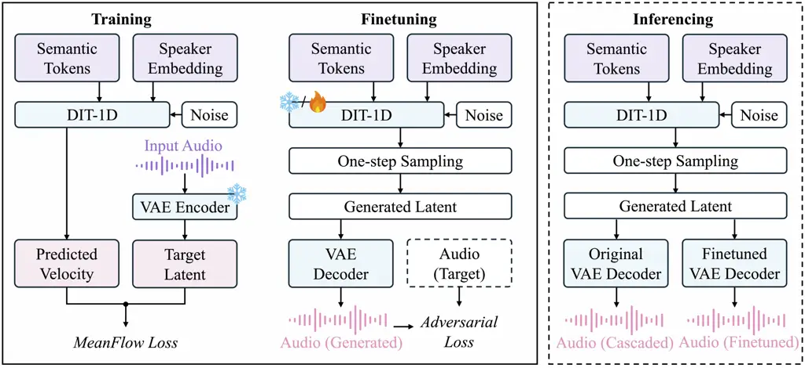

Dai Zhang Ye Li He Wu Guo Kong

# One-Step Token-to-Waveform Generation with MeanFlow in Latent Space

Zheqi    Guangyan    Zhen    Jingyu    Haolin    Chunyat    Yiwen   
Qiuqiang

###### Abstract

Neural audio codecs are central to modern LLM-based Text-to-Speech (TTS)
and multimodal systems. As low-bitrate semantic codecs gain prominence,
the Token-to-Waveform (Token2Wav) decoder becomes a bottleneck
determining both perceptual quality and system efficiency. Conventional
multi-step flow-matching decoders offer superior quality but suffer from
high inference latency due to iterative sampling, creating a severe
quality-speed trade-off. In this paper, we propose a novel Token2Wav
architecture that overcomes this limitation by applying MeanFlow in a
highly compressed latent space. By modeling the average velocity rather
than the instantaneous velocity field, MeanFlow enables true one-step
generation. Operating in the latent domain mitigates the memory and
stability issues of waveform-level flows, yielding up to a 17$`\times`$
improvement in Real-Time Factor (RTF) compared to multi-step baselines
with negligible quality degradation. Furthermore, we introduce
refinement strategies that mitigate latent mismatch, including
decoder-only fine-tuning with the MeanFlow generator frozen and
end-to-end joint fine-tuning, improving fidelity without increasing
inference-time cost. Code and demo are publicly available.

###### keywords

one-step generation, token2wav, neural audio codec

^(†)^(†)address: ¹ The Chinese University of Hong Kong, Hong Kong SAR,
China  
² LIGHTSPEED, Tencent, Hong Kong SAR, China  
³ The Hong Kong University of Science and Technology, Hong Kong SAR,
China  
⁴ Independent Researcher ^(†)^(†)email: zheqidai@link.cuhk.edu.hk,
guoyiwen89@gmail.com, qqkong@ee.cuhk.edu.hk^(†)^(†) Code&Demo:
[https://github.com/dzq84/meantok](https://github.com/dzq84/meantok)

## 1 Introduction

Large language model (LLM)-based text-to-speech (TTS) systems \[1, 2, 3,
4\] increasingly adopt a discrete-token formulation: an upstream model
predicts a sequence of speech tokens, and a downstream neural decoder
converts these tokens into a waveform. Neural audio codecs \[5, 2, 6\]
provide a practical interface for such systems by discretizing speech
into code sequences with a learned decoder. In this setting, token
design crucially affects the division of labor between the LLM and the
decoder. Acoustic tokens typically operate at higher bitrates and retain
fine-grained signal details, making waveform reconstruction easier but
increasing token rate and sequence length, which in turn raises modeling
cost for LLMs \[7, 6\] In contrast, semantic tokens \[8, 9\] are more
compact and closer to linguistic content, improving generation
efficiency and controllability. However, as semantic tokenizations
remove substantial acoustic detail, they shift the burden of recovering
prosody, timbre, and naturalness to the Token-to-Waveform (Token2Wav)
decoder.

This shift makes Token2Wav both critical and challenging: the decoder
must synthesize high-fidelity speech from a heavily compressed,
information-limited representation, while meeting the low-latency
requirements of interactive and on-device applications. Prior work on
high-fidelity neural audio decoders \[10, 11\] demonstrates that
powerful discriminator-based training enables waveform reconstruction
from compact latent representations. Flow-matching-based generative
decoders \[12\] have recently shown strong Token2Wav performance \[1,
4\]. Despite their high quality, most flow-matching decoders rely on
numerical integration of an ODE at inference time, requiring tens of
network evaluations (NFEs) even with relatively coarse solvers. This
iterative sampling cost often dominates runtime and creates a persistent
quality–latency trade-off.

MeanFlow \[13\] reduces sampling cost by learning an _average_-velocity
field along the probability path, enabling one-step generation with a
single network evaluation. However, directly applying one-step flow
models in waveform space remains difficult for high-fidelity conditional
decoding. Waveforms are extremely long sequences, making training
memory-intensive and optimization unstable; moreover, a single large
integration step amplifies modeling errors at raw-audio resolution.

In this paper, we propose a one-step Token2Wav architecture that applies
MeanFlow in a _compressed latent space_. We first train a lightweight
waveform variational autoencoder (VAE) that encodes speech into a
low-dimensional latent sequence and deterministically decodes it back to
waveform audio. We then train a conditional 1D Diffusion Transformer
(DiT) to perform MeanFlow-based _token-to-latent_ generation conditioned
on semantic tokens and speaker embeddings. At inference time, the latent
sequence is generated in exactly one forward pass and converted to
waveform by the VAE decoder, achieving true one-step Token2Wav
synthesis.

A practical challenge of latent-space one-step generation is _latent
mismatch_: latents produced by the one-step generator may deviate from
the VAE latents seen during VAE training, which can degrade waveform
reconstruction. To address this issue without increasing inference cost,
we introduce refinement strategies that keep the inference pipeline
unchanged (one generator pass plus one decoder pass): (i) _decoder-only
refinement_ that freezes the MeanFlow generator and fine-tunes only the
VAE decoder on generated latents, and (ii) _end-to-end joint
fine-tuning_ that further backpropagates waveform-domain losses through
the one-step latent sampling step.

Figure 1 summarizes the full pipeline and highlights. Results show that
latent-space MeanFlow enables substantial latency reduction while
maintaining competitive intelligibility and perceptual quality,
achieving up to a 17$`\times`$ reduction in real-time factor (RTF) over
a representative multi-step Token2Wav baseline under the same
measurement protocol. Our main contributions are:

- •
  We propose a Token2Wav framework that performs MeanFlow-based
  _one-step_ conditional generation in a compressed latent space,
  avoiding the memory and stability issues of waveform-level flow
  models.
- •
  We study the effect of latent dimensionality and model capacity on the
  quality–latency trade-off for one-step Token2Wav decoding, identifying
  effective operating points under tight latency constraints.
- •
  We introduce refinement strategies—decoder-only refinement and
  end-to-end joint fine-tuning—to mitigate latent distribution mismatch,
  improving waveform fidelity without increasing inference-time cost.



Figure 1: Overall framework. Left: MeanFlow training in latent space
using VAE latents as targets. Middle: refinement during fine-tuning
using waveform-domain losses on audio reconstructed from generated
latents. Right: inference uses the same one-step sampling plus VAE
decoding, with either the original or refined decoder.

## 2 Method

As shown in Figure 1, our Token2Wav decoder synthesizes waveform speech
in two stages. Given semantic tokens
$`\mathbf{s}=\{s_{1},\dots,s_{T}\}`$ and a speaker embedding
$`\mathbf{e}`$, we denote the conditioning as
$`\mathbf{c}=(\mathbf{s},\mathbf{e})`$ and aim to generate a waveform
$`\mathbf{x}\in\mathbb{R}^{L}`$. To achieve low latency, we (i) generate
a compressed latent sequence in one step using a latent MeanFlow
generator, and (ii) reconstruct waveform audio deterministically using a
lightweight VAE decoder. This design confines the one-step generative
modeling to a short, low-dimensional sequence, improving both efficiency
and stability compared to waveform-space one-step flows.

### 2.1 Waveform VAE for Latent Representation

Directly modeling conditional generation in waveform space is memory
intensive and often unstable due to extremely long sequences. We
therefore operate in a compressed latent space using a lightweight
waveform VAE, following the latent diffusion paradigm \[14\]. The VAE
encoder $`E_{\phi}`$ maps a waveform segment $`\mathbf{x}`$ to a latent
sequence

```math
\mathbf{z}_{\text{data}}=E_{\phi}(\mathbf{x})\in\mathbb{R}^{T^{\prime}\times D}, \tag{1}
```

where $`T^{\prime}`$ is the downsampled length and $`D`$ is the latent
channel dimension per frame. A deterministic VAE decoder $`G_{\psi}`$
reconstructs waveform audio as

```math
\hat{\mathbf{x}}=G_{\psi}(\mathbf{z}). \tag{2}
```

At inference time, only $`G_{\psi}`$ is used as the waveform decoder,
while $`E_{\phi}`$ is used only to obtain training latents
$`\mathbf{z}_{\text{data}}`$ (Figure 1, left).

### 2.2 Flow Matching and MeanFlow in Latent Space

We train a conditional one-step generator in the latent space,
implemented as a DiT-1D model and denoted by $`f_{\theta}`$ (Figure 1).
Compared to waveform-space generation, latent-space generation
substantially reduces sequence length and dynamic range, making the
large-step one-step update more stable and memory efficient.

Let $`\bm{\epsilon}\sim\mathcal{N}(\mathbf{0},\mathbf{I})`$ and define
the rectified flow path \[15\] in latent space:

```math
\mathbf{z}_{t}=(1-t)\mathbf{z}_{\text{data}}+t\bm{\epsilon},\quad t\in[0,1], \tag{3}
```

where we follow the reverse-time convention: $`t=1`$ corresponds to the
Gaussian prior and $`t=0`$ corresponds to the data distribution.

Conditional flow matching. Flow matching \[12\] learns a conditional
velocity field $`\mathbf{v}_{\theta}(\mathbf{z}_{t},t,\mathbf{c})`$ that
matches the target velocity along the probability path. For the
rectified path in Eq. (3), the target instantaneous velocity is
constant:

```math
\mathbf{u}_{\text{rf}}(\mathbf{z}_{t},t,\mathbf{c})=\frac{d\mathbf{z}_{t}}{dt}=\bm{\epsilon}-\mathbf{z}_{\text{data}}. \tag{4}
```

Standard conditional flow matching minimizes

```math
\mathcal{L}_{\text{CFM}}(\theta)=\mathbb{E}_{t,\mathbf{x},\bm{\epsilon}}\Big[\lVert\mathbf{v}_{\theta}(\mathbf{z}_{t},t,\mathbf{c})-\mathbf{u}_{\text{rf}}\rVert_{2}^{2}\Big], \tag{5}
```

but requires multi-step ODE integration at inference time.

MeanFlow for one-step generation. MeanFlow \[13\] enables one-step
sampling by predicting an _average_ velocity over an interval $`[r,t]`$:

```math
\bar{\mathbf{u}}(\mathbf{z}_{t};r,t,\mathbf{c})\triangleq\frac{1}{t-r}\int_{r}^{t}\mathbf{v}(\mathbf{z}_{\tau},\tau,\mathbf{c})\,d\tau,\quad 0\leq r<t\leq 1. \tag{6}
```

We use $`f_{\theta}`$ (DiT-1D) to predict $`\bar{\mathbf{u}}`$.
Following \[13\], we optimize the MeanFlow objective with stop-gradient
and adaptive reweighting:

```math
\mathcal{L}_{\text{MF}}(\theta)=\mathbb{E}_{r,t,\mathbf{x},\bm{\epsilon}}\Big[w(r,t)\,\big\lVert f_{\theta}(\mathbf{z}_{t},r,t,\mathbf{c})-\operatorname{sg}(\bar{\mathbf{u}}_{\text{gt}})\big\rVert_{2}^{2}\Big], \tag{7}
```

where $`\text{sg}(\cdot)`$ denotes stop-gradient, $`w(\cdot)`$ is the
adaptive weighting in \[13\], and $`\bar{\mathbf{u}}_{\text{gt}}`$ is
constructed as in \[13\]. The required derivatives with respect to $`t`$
are computed efficiently using Jacobian-vector products (JVPs) \[13\].
When $`r=t`$, Eq. (7) reduces to standard conditional flow matching.

Conditioning. The generator is conditioned on semantic tokens and a
speaker embedding. Token embeddings, timestep embeddings, and speaker
embeddings are fused into a conditioning sequence that modulates each
DiT-1D block via adaptive layer normalization (adaLN-Zero) \[16\].

One-step token-to-latent sampling. At inference time (Figure 1, right),
we draw $`\mathbf{z}_{1}\sim\mathcal{N}(\mathbf{0},\mathbf{I})`$ and
perform a single MeanFlow update:

```math
\mathbf{z}_{\text{gen}}=\mathbf{z}_{1}-f_{\theta}(\mathbf{z}_{1},0,1,\mathbf{c}), \tag{8}
```

followed by deterministic waveform reconstruction
$`\hat{\mathbf{x}}=G_{\psi}(\mathbf{z}_{\text{gen}})`$. This yields a
fixed-cost inference pipeline consisting of one generator pass and one
VAE decoder pass.

### 2.3 Refinement for Latent Mismatch

Although latent-space one-step generation is efficient, the generated
latent distribution may deviate from the VAE latent distribution induced
by $`E_{\phi}`$, leading to reconstruction artifacts when decoding with
$`G_{\psi}`$. To reduce this _latent mismatch_ without increasing
inference-time cost, we refine the model using waveform-domain losses
while keeping the inference pipeline unchanged (Figure 1, middle and
right).

We optimize the following waveform-domain objectives:

```math
\mathcal{L}_{\text{ref}}=\mathcal{L}_{\text{MRSTFT}}+\lambda_{\text{adv}}\mathcal{L}_{\text{adv}}+\lambda_{\text{fm}}\mathcal{L}_{\text{fm}}, \tag{9}
```

where $`\mathbf{z}_{\text{gen}}`$ is obtained by Eq. (8) and
$`\hat{\mathbf{x}}=G_{\psi}(\mathbf{z}_{\text{gen}})`$.
$`\mathcal{L}_{\text{MRSTFT}}`$ is a multi-resolution STFT
reconstruction loss, and $`\mathcal{L}_{\text{adv}}`$ and
$`\mathcal{L}_{\text{fm}}`$ are adversarial and feature-matching losses
computed using a multi-scale discriminator \[7\]. The discriminator is
used only during training.

Decoder-only refinement. We freeze the MeanFlow generator $`f_{\theta}`$
and update only the VAE decoder $`G_{\psi}`$ (and discriminator when
used) to minimize Eq. (9). This corresponds to adapting the decoder to
the generator-induced latent distribution (Figure 1, middle).

End-to-end joint fine-tuning. We update both $`f_{\theta}`$ and
$`G_{\psi}`$ by backpropagating through the one-step update in Eq. (8).
The VAE encoder $`E_{\phi}`$ remains frozen. This further reduces
mismatch by improving both latent generation and waveform
reconstruction, still keeping inference unchanged.

## 3 Experiment

### 3.1 Experimental Setup and Metrics

Datasets. We train all models on LibriTTS \[17\] and evaluate on the
test-clean subset of LibriSpeech \[18\].

Tokenization and speaker conditioning. For fair comparison, we use the
same semantic tokenization as the CosyVoice2 baseline \[1\]. Semantic
tokens are extracted at 25 Hz using the CosyVoice2 tokenizer (single
codebook; vocabulary size 6,561). Speaker information is provided via a
pretrained CAM++ speaker encoder \[19\], from which we extract a
192-dimensional speaker embedding. Unless otherwise stated, all systems
use identical conditioning signals.

Model configurations. We vary the VAE latent dimensionality
$`D\in\{8,16,24\}`$. The MeanFlow latent generator is instantiated as a
1D DiT at two scales: (i) 140M parameters (hidden size 768, 12 layers,
12 heads) and (ii) 600M parameters (hidden size 1152, 28 layers, 16
heads).

VAE architecture and training. The waveform VAE downsamples 24 kHz audio
to a latent frame rate of 25 Hz to align with the semantic token rate.
We implement the encoder with an Oobleck-style strided convolution stack
(strides $`[2,4,4,6,5]`$, total downsampling ratio 960) and use a
deterministic decoder. The VAE is trained on 2-second waveform chunks
using a multi-resolution STFT reconstruction loss (FFT sizes from 32 to
2048), an adversarial hinge loss and a feature-matching loss with an
EnCodec-style multi-scale discriminator \[7\], and a KL regularization
term on the bottleneck. We set $`\lambda_{\text{adv}}{=}0.1`$,
$`\lambda_{\text{fm}}{=}5.0`$, and $`\lambda_{\text{kl}}{=}10^{-4}`$.
The discriminator is enabled after 1,000 warmup steps.

| System                               | Dim | WER(%) $`\downarrow`$ | SpkSim $`\uparrow`$ | UTMOS $`\uparrow`$ | MOS $`\uparrow`$ | RTF $`\downarrow`$ |
| ------------------------------------ | --- | --------------------- | ------------------- | ------------------ | ---------------- | ------------------ |
| CosyVoice2 Token2Wav (10-step) \[1\] | –   | 3.18                  | 0.940               | 3.76               | 4.05$`\pm`$0.03  | 0.0775             |
| VAE reconstruction (oracle latent)   | 24  | 2.14                  | 0.966               | 3.67               | 4.10$`\pm`$0.04  | –                  |
| Latent MeanFlow + VAE (Joint-FT)     | 24  | 3.41                  | 0.932               | 3.64               | 3.85$`\pm`$0.03  | 0.0046             |
| Latent MeanFlow + VAE (Joint-FT)     | 16  | 3.62                  | 0.927               | 3.56               | 3.72$`\pm`$0.03  | 0.0046             |

Table 1: Main results on LibriSpeech test-clean. RTF is end-to-end
(generator + decoder); stage-wise breakdown for our best system: DiT
0.0016 + VAE 0.0030. MOS is reported as mean$`\pm`$95% CI.

MeanFlow generator training. The latent MeanFlow DiT is trained on
5-second segments to better capture longer-range semantic–acoustic
dependencies. We sample $`(r,t)`$ using the logit-normal scheme
in \[20\] with $`\mu=-0.4`$ and $`\sigma=1.0`$, and follow \[13\] for
the MeanFlow objective, including JVP-based derivative computation and
adaptive loss reweighting.

Baselines. Our primary baseline is the Token2Wav module of
CosyVoice2 \[1\], which performs _token-to-mel_ conditional flow
matching with multi-step ODE sampling, followed by a pretrained neural
vocoder to synthesize waveform audio from the predicted mel-spectrogram.
We evaluate CosyVoice2 with its default 10-step Euler sampler. We also
report a _VAE-only_ reconstruction upper bound by encoding ground-truth
waveforms into VAE latents and decoding them back using the VAE decoder.

Metrics. Since LibriSpeech references are natively 16 kHz while our
models synthesize 24 kHz audio, all generated waveforms are resampled to
16 kHz before computing intrusive metrics. We report: (1) WER (%),
obtained by a fine-tuned HuBERT-Large ASR model \[8\]; (2) SpkSim,
cosine similarity computed from a fine-tuned WavLM-Large \[21\] speaker
verification model; (3) UTMOS \[22\]; and (4) RTF, measured with batch
size 1 on a single GPU.

RTF measurement protocol. We measure RTF using FP16 inference with batch
size 1 on an NVIDIA H20 GPU. For our method, RTF includes both the
one-step latent generator $`f_{\theta}`$ and the VAE decoder
$`G_{\psi}`$. For the CosyVoice2 baseline, RTF includes the 10-step
token-to-mel flow sampling _and_ the pretrained vocoder inference. All
models synthesize 24 kHz audio; resampling to 16 kHz for metric
computation is excluded from RTF. Runtime is measured with CUDA
synchronization and reported as the average over evaluation utterances.

Subjective evaluation. We conduct a MOS test on 50 randomly selected
utterances rated by 20 listeners on a 1–5 scale, and report MOS with 95%
confidence intervals.

### 3.2 Main Results

Table 1 compares our proposed one-step Token2Wav decoder with the
CosyVoice2 Token2Wav baseline \[1\], which performs token-to-mel
conditional flow matching with 10-step Euler sampling followed by a
pretrained vocoder. Our best configuration, Latent MeanFlow + VAE
(Joint-FT) with $`D{=}24`$ and a 140M DiT, achieves an RTF of 0.0046, a
17$`\times`$ end-to-end speedup over the multi-step baseline (RTF
0.0775). Despite using only a single evaluation of the latent generator,
it maintains competitive intelligibility and speaker similarity (WER
3.41%, SpkSim 0.932), and reaches UTMOS 3.64 with MOS 3.85, approaching
the baseline (UTMOS 3.76, MOS 4.05). Finally, the VAE reconstruction
(oracle latent) upper bound indicates that most remaining degradation is
attributable to latent generation rather than waveform decoding,
suggesting further headroom from improving the token-to-latent
generator. The stage-wise RTF breakdown in Table 1 (caption) shows that
our speed advantage comes from replacing iterative flow sampling with a
single latent DiT evaluation, while the VAE decoder contributes a
smaller but non-negligible fraction of the total cost.

### 3.3 Ablation Studies

Table 2 consolidates three ablation experiments under the Latent
MeanFlow + VAE framework with a 140M DiT unless noted otherwise.

Latent dimensionality (Table 2, top). Increasing $`D`$ consistently
improves all quality metrics: from $`D{=}8`$ to $`D{=}24`$, WER
decreases from 4.82% to 3.41%, SpkSim improves from 0.909 to 0.932, and
MOS increases from 3.45 to 3.85. We observe similar RTF across different
$`D`$ because the one-step generator dominates runtime and the decoder
cost scales mildly with $`D`$ at these operating points. Overall,
$`D{=}16`$–$`24`$ provides a practical quality–compression trade-off,
and we use $`D{=}24`$ as our default setting in subsequent experiments.

Model capacity (Table 2, middle). The 140M model matches or slightly
outperforms the 600M variant on perceptual metrics (UTMOS 3.64 vs. 3.57;
MOS 3.85 vs. 3.78) while also being faster (RTF 0.0047 vs. 0.0075).
These results suggest that simply scaling DiT size does not necessarily
improve one-step decoding quality under the current data and training
recipe. One-step generation is sensitive to large-step integration
error: larger models may overfit to local training dynamics and produce
less robust average-velocity estimates under the single-step update. We
conjecture that larger-capacity models could become beneficial with
longer training, stronger regularization, or improved conditioning
tailored for one-step sampling.

Refinement strategies (Table 2, bottom). A key challenge in combining a
one-step latent generator with a VAE waveform decoder is latent
distribution mismatch: generated latents may deviate from the VAE
training latents, leading to reconstruction artifacts. Directly
composing the pretrained decoder with the one-step generator (No-FT)
yields degraded perceptual quality (UTMOS 3.11, MOS 3.35), confirming
the mismatch issue. Decoder-FT improves quality (UTMOS 3.43, MOS 3.70)
by adapting $`G_{\psi}`$ to the generator’s latent distribution while
keeping $`f_{\theta}`$ frozen. Joint-FT achieves the best overall
results (WER 3.41%, UTMOS 3.64, MOS 3.85) by backpropagating
waveform-domain objectives through the one-step latent sampling step,
improving both latent generation and waveform reconstruction without
increasing inference-time cost.

|                                    |                      |                    |                   |                 |
| ---------------------------------- | -------------------- | ------------------ | ----------------- | --------------- |
| Config                             | WER(%)$`\downarrow`$ | SpkSim$`\uparrow`$ | UTMOS$`\uparrow`$ | MOS$`\uparrow`$ |
| _Latent dimensionality ($`D`$)_    |                      |                    |                   |                 |
| $`D{=}8`$                          | 4.82                 | 0.909              | 3.47              | 3.45$`\pm`$0.03 |
| $`D{=}16`$                         | 3.62                 | 0.927              | 3.56              | 3.72$`\pm`$0.03 |
| $`D{=}24`$                         | 3.41                 | 0.932              | 3.64              | 3.85$`\pm`$0.04 |
| _Model capacity ($`D{=}24`$)_      |                      |                    |                   |                 |
| 140M                               | 3.41                 | 0.932              | 3.64              | 3.85$`\pm`$0.03 |
| 600M                               | 3.44                 | 0.930              | 3.57              | 3.78$`\pm`$0.03 |
| _Refinement strategy ($`D{=}24`$)_ |                      |                    |                   |                 |
| No-FT                              | 3.52                 | 0.931              | 3.11              | 3.35$`\pm`$0.03 |
| Decoder-FT                         | 3.43                 | 0.931              | 3.43              | 3.70$`\pm`$0.03 |
| Joint-FT                           | 3.41                 | 0.932              | 3.64              | 3.85$`\pm`$0.04 |

Table 2: Ablation studies (140M DiT, Joint-FT unless noted). MOS:
mean$`\pm`$95% CI.

## 4 Conclusion

We presented a one-step Token2Wav decoder that applies MeanFlow in a
highly compressed latent space to eliminate the iterative sampling
overhead of flow-matching decoders. The proposed system combines a
latent MeanFlow generator (DiT-1D) that performs token-to-latent
generation in a single network evaluation with a deterministic VAE
decoder for latent-to-waveform reconstruction, resulting in a fixed-cost
and low-latency inference pipeline. To address latent mismatch between
generated latents and the VAE training distribution, we introduced
refinement strategies that optimize waveform-domain objectives while
keeping inference unchanged. Experiments on LibriSpeech \[18\]
test-clean demonstrate that our best configuration (140M DiT-1D,
$`D{=}24`$, joint fine-tuning) achieves competitive intelligibility (WER
3.41%) and perceptual quality, while delivering up to a 17$`\times`$ RTF
speedup over a representative multi-step Token2Wav baseline under the
same measurement protocol, suggesting that latent-space MeanFlow is a
practical approach for real-time and on-device Token2Wav decoding under
tight latency constraints.

## 5 Generative AI Use Disclosure

Generative AI tools were used for manuscript editing and polishing. All
authors are responsible and accountable for the work and content of this
paper.

## References

- \[1\] Z. Du, Y. Wang, Q. Chen, X. Shi, X. Lv, T. Zhao, Z. Gao, Y.
  Yang, C. Gao, H. Wang, et al. (2024) Cosyvoice 2: scalable streaming
  speech synthesis with large language models. arXiv preprint
  arXiv:2412.10117. Cited by: §1, §1, §3.1, §3.1, §3.2, Table 1.
- \[2\] J. Li, G. Zhang, Z. Ye, and Y. Guo (2025) MSR-codec: a
  low-bitrate multi-stream residual codec for high-fidelity speech
  generation with information disentanglement. arXiv preprint
  arXiv:2509.13068. Cited by: §1.
- \[3\] Z. Ye, X. Zhu, C. Chan, X. Wang, X. Tan, J. Lei, Y. Peng, H.
  Liu, Y. Jin, Z. Dai, et al. (2025) Llasa: scaling train-time and
  inference-time compute for llama-based speech synthesis. arXiv
  preprint arXiv:2502.04128. Cited by: §1.
- \[4\] H. Guo, Y. Hu, K. Liu, F. Shen, X. Tang, Y. Wu, F. Xie, K. Xie,
  and K. Xu (2024) Fireredtts: a foundation text-to-speech framework for
  industry-level generative speech applications. arXiv preprint
  arXiv:2409.03283. Cited by: §1, §1.
- \[5\] H. Siuzdak, F. Grötschla, and L. A. Lanzendörfer (2024) SNAC:
  multi-scale neural audio codec. In Audio Imagination: NeurIPS 2024
  Workshop AI-Driven Speech, Music, and Sound Generation, Cited by: §1.
- \[6\] N. Zeghidour, A. Luebs, A. Omran, J. Skoglund, and M.
  Tagliasacchi (2021) Soundstream: an end-to-end neural audio codec.
  IEEE/ACM Transactions on Audio, Speech, and Language Processing 30,
  pp. 495–507. Cited by: §1.
- \[7\] A. Défossez, J. Copet, G. Synnaeve, and Y. Adi (2023) High
  fidelity neural audio compression. Transactions on Machine Learning
  Research. Cited by: §1, §2.3, §3.1.
- \[8\] W. Hsu, B. Bolte, Y. H. Tsai, K. Lakhotia, R. Salakhutdinov,
  and A. Mohamed (2021) Hubert: self-supervised speech representation
  learning by masked prediction of hidden units. IEEE/ACM Transactions
  on Audio, Speech, and Language Processing 29, pp. 3451–3460. Cited by:
  §1, §3.1.
- \[9\] H. Liu, X. Xu, Y. Yuan, M. Wu, W. Wang, and M. D.
  Plumbley (2024) Semanticodec: an ultra low bitrate semantic audio
  codec for general sound. IEEE Journal of Selected Topics in Signal
  Processing. Cited by: §1.
- \[10\] R. Kumar, P. Seetharaman, A. Luebs, I. Kumar, and K.
  Kumar (2024) High-fidelity audio compression with improved rvqgan. In
  Advances in Neural Information Processing Systems, Vol. 36. Cited by:
  §1.
- \[11\] H. Siuzdak (2024) Vocos: closing the gap between time-domain
  and fourier-based neural vocoders for high-quality audio synthesis. In
  12th International Conference on Learning Representations, ICLR 2024,
  Cited by: §1.
- \[12\] Y. Lipman, R. T. Chen, H. Ben-Hamu, M. Nickel, and M. Le (2023)
  Flow matching for generative modeling. In 11th International
  Conference on Learning Representations, ICLR 2023, Cited by: §1, §2.2.
- \[13\] Z. Geng, M. Deng, X. Bai, J. Z. Kolter, and K. He (2025) Mean
  flows for one-step generative modeling. arXiv preprint
  arXiv:2505.13447. Cited by: §1, §2.2, §2.2, §2.2, §3.1.
- \[14\] R. Rombach, A. Blattmann, D. Lorenz, P. Esser, and B.
  Ommer (2022) High-resolution image synthesis with latent diffusion
  models. In Proceedings of the IEEE/CVF Conference on Computer Vision
  and Pattern Recognition, pp. 10684–10695. Cited by: §2.1.
- \[15\] X. Liu, C. Gong, and Q. Liu (2023) Flow straight and fast:
  learning to generate and transfer data with rectified flow. In 11th
  International Conference on Learning Representations, ICLR 2023, Cited
  by: §2.2.
- \[16\] W. Peebles and S. Xie (2023) Scalable diffusion models with
  transformers. In Proceedings of the IEEE/CVF International Conference
  on Computer Vision, pp. 4195–4205. Cited by: §2.2.
- \[17\] H. Zen, V. Dang, R. Clark, Y. Zhang, R. J. Weiss, Y. Jia, Z.
  Chen, and Y. Wu (2019) LibriTTS: a corpus derived from librispeech for
  text-to-speech. In Proc. Interspeech 2019, pp. 1526–1530. Cited by:
  §3.1.
- \[18\] V. Panayotov, G. Chen, D. Povey, and S. Khudanpur (2015)
  LibriSpeech: an asr corpus based on public domain audio books. In 2015
  IEEE International Conference on Acoustics, Speech and Signal
  Processing (ICASSP), pp. 5206–5210. Cited by: §3.1, §4.
- \[19\] H. Wang, S. Zheng, Y. Chen, L. Cheng, and Q. Chen (2023) CAM++:
  a fast and efficient network for speaker verification using
  context-aware masking. In Interspeech 2023, pp. 5301–5305. External
  Links: [Document](https://dx.doi.org/10.21437/Interspeech.2023-1513),
  ISSN 2958-1796 Cited by: §3.1.
- \[20\] Z. Evans, J. D. Parker, C. Carr, Z. Zukowski, J. Taylor, and J.
  Pons (2024) Stable audio open. arXiv preprint arXiv:2407.14358. Cited
  by: §3.1.
- \[21\] S. Chen, C. Wang, Z. Chen, Y. Wu, S. Liu, Z. Chen, J. Li, N.
  Kanda, T. Yoshioka, X. Xiao, et al. (2022) WavLM: large-scale
  self-supervised pre-training for full stack speech processing. IEEE
  Journal of Selected Topics in Signal Processing 16 (6), pp. 1505–1518.
  Cited by: §3.1.
- \[22\] T. Saeki, D. Xin, W. Nakata, T. Koriyama, S. Takamichi, and H.
  Saruwatari (2022) UTMOS: utokyo-sarulab system for voicemos challenge 2022. Interspeech 2022. Cited by: §3.1.
