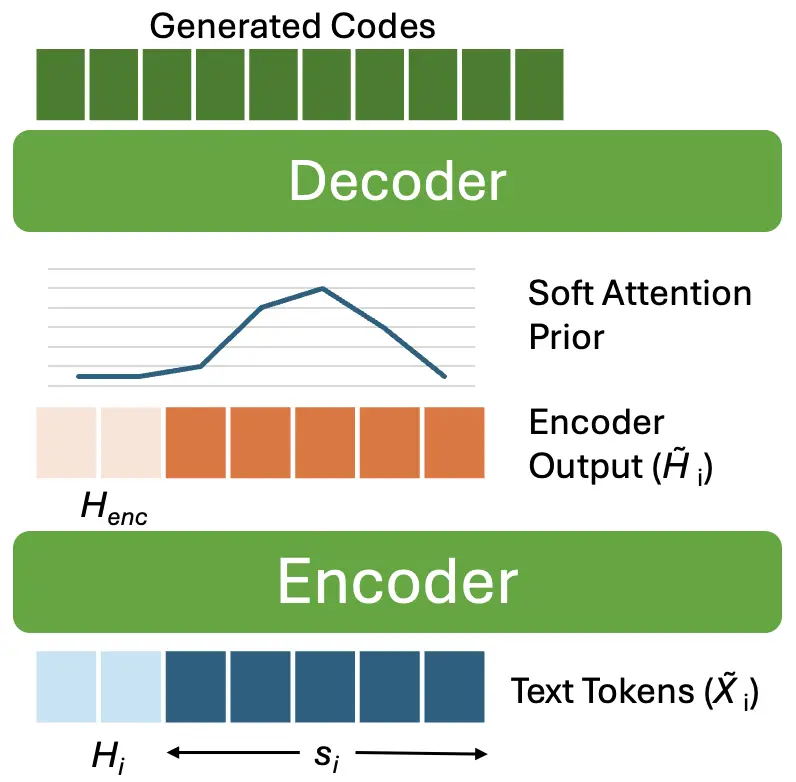
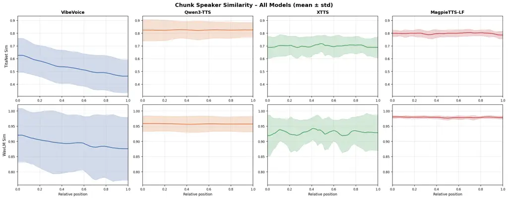
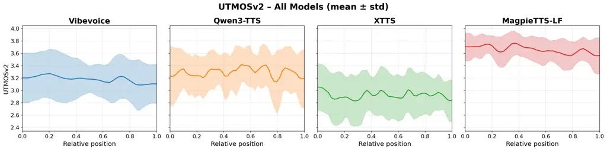

Ghosh Li

# MagpieTTS-LF: Inference-Time Long-Form Speech Generation Without Training on Long-Form data

Subhankar    Jason    Paarth Neekhara¹    Shehzeen Hussain¹    Ryan
Langman¹    Xuesong Yang¹    Roy Fejgin¹

###### Abstract

Neural Text-to-Speech (TTS) systems achieve remarkable quality on short
utterances but long-form speech generation shows prosodic drift, speaker
inconsistencies and sentence boundary artifacts. Existing approaches
either compress sequences, increase context length or naively
concatenate independently synthesized chunks. We present an
inference-time approach called MagpieTTS-LF that enables MagpieTTS to
produce coherent long-form speech without model retraining. Our method
introduces three key innovations: (1) soft attention priors to guide
monotonic alignment while preserving past and future context; (2) a
stateful inference algorithm that maintains context across sentence
chunks, ensuring prosodic continuity; (3) history-aware text encoding
that uses past text for discourse-level prosodic planning. Experiments
on long texts show significant improvements in long-range
intelligibility, prosodic coherence, speaker consistency, and boundary
naturalness compared to other baselines.

###### keywords

Text-to-Speech, Speech Synthesis, Speech LLM, Long-form Generation

^(†)^(†)address: ¹ NVIDIA Corporation, USA ^(†)^(†)email:
{subhankarg,jasoli,pneekhara,shehzeenh,rlangman,xueyang,rfejgin}@nvidia.com

## 1 Introduction

While advancements in large-scale generative modeling in TTS has enabled
unprecedented naturalness and speaker similarity, yet most of the
methods suffer from hallucinations, prosodic drift, and boundary
artifacts as generation length grows. State-of-the-art models like
Tortoise TTS \[1\], VALL-E 2 \[2\], VALL-E R \[3\], NaturalSpeech
2/3 \[4, 5\], VoiceBox \[6\], XTTS \[7\], Qwen3-TTS \[8\],
MagpieTTS \[9, 10\] and CosyVoice \[11\] produce extremely natural
speech on 2-20 second utterances but offer no native mechanism for
paragraph length speech generation. When generating longer length
speech, these systems default to sentence-level chunking followed by
concatenation. This strategy that produces characteristic artifacts
including energy discontinuities and warbles at boundaries, inconsistent
speaking rate across segments, and loss of prosodic patterns such as
intonation shift.

The literature shows three paradigms for extending generation length,
each with distinct limitations. Sequence compression approaches reduce
the number of tokens per second of audio to fit more speech within fixed
context windows. VibeVoice \[12\] achieves a compression at 7.5 Hz,
enabling up to 90 minutes of speech generation in a single pass, however
it sacrifices temporal resolution, representing each $`\sim 133ms`$ of
audio with a single token. SpeechSSM \[13\] uses state-space models for
theoretically infinite extrapolation. Streaming and block-wise methods
such as CosyVoice 2 \[14\] employ block-wise attention masks to enable
chunk-wise generation with bounded memory. However, these binary masks
create hard information cutoffs rather than graceful gradients.
Moreover, all streaming approaches require training time architectural
modifications; the chunking strategy is baked into the model.
Cross-sentence prosody models like HiGNN-TTS \[15\], and Context-Aware
Memory \[16\] demonstrate that text context from neighboring sentences
improves prosodic naturalness. Yet these approaches require dedicated
graph networks, or memory modules trained jointly with the TTS system,
making these improvements difficult to apply on existing deployments.

We present long-form speech generation algorithm MagpieTTS-LF¹¹ 1
Open-source code https://github.com/NVIDIA-NeMo/NeMo, addressing four
converging gaps in the literature. First, our approach operates entirely
at inference time, requiring no architectural changes or retraining
existing MagpieTTS model. Second, we introduce soft attention priors
that maintain non-zero weights on past and future tokens, preserving a
gradient of attention, which does not completely suppress distant
context. Our soft priors allow the model to retain long-range
information while still focusing computation on locally relevant
positions. Third, our stateful inference algorithm maintains attention
prior states and encoder context across independently generated chunks,
creating continuity between segments. Fourth, we leverage past text
history by passing them through text encoder for prosodic planning,
utilizing the model’s native text representations rather than requiring
specialized context modules.

Our key contributions can be summarized as follows:

- •
  We propose an inference-time soft attention prior mechanism that
  guides the auto-regressive generation toward monotonic alignment while
  preserving useful context from distant tokens. Unlike binary masking
  approaches, our priors maintain non-zero weights on past and future
  positions, enabling graceful information decay rather than hard
  cutoffs.
- •
  We introduce a stateful chunk generation algorithm that carries
  attention prior states, encoder hidden states, and text history across
  sentence boundaries. This enables coherent prosody in long-form
  synthesis without the memory overhead of single-pass generation or the
  discontinuities of naive chunk concatenation.
- •
  We demonstrate that inference-time soft priors combined with
  cross-chunk state propagation achieve significant improvements in
  long-range prosodic coherence, speaker consistency over multi-minute
  durations, and boundary naturalness.
- •
  We present a structured comparison against state-of-the-art models,
  spanning neural codec language models, large-scale multimodal
  architectures, and streaming diffusion frameworks.
- •
  We introduce Long-Form HifiTTS dataset, a benchmark dataset for
  evaluating long-form speech synthesis, designed to measure prosodic
  continuity, speaker persistence, and boundary robustness under
  extended generation settings.



Figure 1: Stateful chunk generation for sentence $`s_{i}`$. History
tokens $`H_{i}`$ are prepended to $`s_{i}`$ to form encoder input
$`\tilde{X}_{i}`$ and the encoder output is concatenated with cached
states $`H_{\text{enc}}`$ to produce $`\tilde{H}_{i}`$. A soft attention
prior encourages monotonic alignment during decoding while preserving
long-range context across chunk boundaries.

## 2 Methodology

In this section, we present an inference-time approach for long-form
speech generation that enables any chunk-based encoder-decoder TTS
system to produce coherent speech without model retraining. In section
2.1, we briefly go over the MagpieTTS model architecture. In section
2.2, we describe the soft attention priors that guide generation toward
monotonic alignment while preserving context from distant tokens and
section 2.3 talks about a stateful chunk generation algorithm that
maintains attention states and encoder context across sentence
boundaries that is at the core of this approach.

### 2.1 MagpieTTS Architecture

The MagpieTTS model follows Koel-TTS \[10\], which is an encoder-decoder
transformer architecture that operates on discrete audio tokens produced
by a neural audio codec \[17\]. The encoder processes text through a
stack of self-attention layers, producing contextual representations
that guide audio generation. The decoder auto-regressively generates
discrete audio tokens by attending to both the encoded text and any
provided audio context for voice cloning. During training, MagpieTTS
employs Connectionist Temporal Classification (CTC) loss and learned
attention priors to enforce monotonic cross-attention between text and
audio, preventing hallucinations such as word repetition, skipping, or
misalignment.

The standard model operates on single utterances; for longer inputs
exceeding the generation time of  20 seconds, the text must be split
into chunks and processed independently. This causes the cross-sentence
coherence to be lost and boundary artifacts.

### 2.2 Inference-Time Soft Attention Priors

We introduce soft attention priors that maintain non-zero weights across
the full context while focusing on the locally relevant positions, this
does not suppress distant positions completely unlike binary attention
masks. At each decoding step $`t`$, we compute (1) the text position
$`T_{t}`$ that has the highest cross-attention score at decoding
timestep $`t-1`$, (2) a prior distribution $`P_{t}\in\mathbb{R}^{N}`$
over encoder positions based on the expected monotonic alignment:

```math
P_{t}[i]=w_{j},\quad\text{if }i\in\{T_{t}-1,T_{t},T_{t}+1,T_{t}+2,T_{t}+3\}
```

```math
P_{t}[i]=eps,\quad\text{if }i\notin\{T_{t}-1,T_{t},T_{t}+1,T_{t}+2,T_{t}+3\}
```

Here i is the index of the text tokens,
$`w=(w_{-1},w_{0},w_{1},w_{2},w_{3})`$ are the experimentally determined
fixed weight vector that defines the attention of the current segment of
the text, and $`eps`$ is the epsilon attention value for distant
positions. This ensures that distant encoder positions still receive
non-zero weight, preserving gradual context rather than hard cutoffs.
The modified attention $`\tilde{A}_{t}`$ becomes:

```math
\tilde{A}_{t}=\mathrm{softmax}\left(\frac{Q_{t}K^{\top}}{\sqrt{d}}+\lambda\log P_{t}\right)
```

where $`\lambda`$ controls the prior strength and is experimentally
determined. This formulation allows the model to leverage its learned
attention patterns while being gently guided toward monotonic alignment.
Unlike the binary masks, our soft priors preserve information from
distant tokens—useful for long-range dependencies

### 2.3 Stateful Chunk Generation Algorithm

To generate long-form speech, we process long text in sentence-level
chunks while maintaining information across chunk boundaries. The state
comprises three components:

- •
  History Text Tokens $`H_{text}\in\mathbb{R}^{B\times K}`$: The final
  $`K`$ text tokens from the previous chunk, prepended to the current
  chunk’s input to provide linguistic context for prosodic planning
- •
  History Encoder Context $`H_{enc}\in\mathbb{R}^{B\times K\times d}`$:
  The corresponding encoder hidden states for the history tokens,
  concatenated with the current chunk’s encoder output to provide
  continuous representations across boundaries. The history text tokens
  are first appended, then the encoder outputs at the corresponding
  positions are discarded, and finally history encoder context is
  appended
- •
  Attention Tracking: A record of the last attended text positions from
  the previous chunk, used to initialize the soft attention prior in the
  current chunk, ensuring smooth prosodic transitions. $`\tau`$ is the
  initial soft attention prior.

The generation algorithm, also shown in Figure 1, works as follows.
Given a long input text, we use punctuation-aware splitting to split
into sentences $`S=\{s_{0},s_{1},\ldots,s_{M}\}`$. We initialize an
empty state and process each sentence iteratively:

- •
  Prepare Context: Concatenate history text tokens with current sentence
  tokens: $`\tilde{X}_{i}=[H_{\text{text}};s_{i}]`$. Encode and
  concatenate with history encoder context:
  $`\tilde{H}_{i}=\left[H_{\text{enc}};\mathrm{Encoder}(s_{i})\right]`$.
- •
  Prior-Guided Generation: Generate audio tokens auto-regressively using
  soft attention priors initialized from $`\tau`$. The prior guides
  attention to start where the previous chunk ended, ensuring prosodic
  continuity. At every auto-regressive step the prior is updated to
  guide the model to maintain monotonicity.
- •
  Update and Maintain State: Save the final $`K`$ tokens and their
  encoder states as new history. Record final attention prior weights as
  new $`\tau`$.
- •
  Save Generated Code: Once end of speech token has been detected for
  the given sentence, save the generated codes in the current iteration.
  Once all the sentences have been generated, these codes would be
  concatenated to get the entire audio code sequence for the total input
  text.

### 2.4 Long-Form HifiTTS dataset

We construct a long-form evaluation benchmark concatenating paragraphs
from Multilingual LibriSpeech (MLS) \[18\] to form 20 passages of
approximately 3-4 minutes each. We estimate the duration by assuming 135
words per minute rate of speech in English. We normalize and clean the
text resolving acronyms, numerical values.

## 3 Experiments and Results

We evaluate MagpieTTS-LF²² 2 Website:
[https://magpietts-lf.github.io/](https://magpietts-lf.github.io/)
long-form generation against the state-of-the-art baselines across three
dimensions: alignment robustness over long sequences, prosodic
continuity at chunk boundaries, and speaker identity consistency,
naturalness over long sequences. Together, these metrics capture the
major challenges of long-form synthesis identified in our literature
review.

### 3.1 Evaluation Setup

We evaluate on a curated dataset comprising of 20 long texts in English.
We compare against Qwen3-TTS \[8\], VibeVoice-TTS \[12\], X-TTS \[7\]
inference. All inference are run on single A6000 GPU. We use
Whisper-Large \[19\] for ASR. For Long-form speech generation algorithm
with MagpieTTS-LF we use the 0.1 as the value of $`eps`$,
$`w=(0.2,0.8,1.0,0.8,0.2)`$, temperature of $`0.7`$, $`\lambda=1.0`$ and
cfg scale of 2.5. For VibeVoice and Qwen3-TTS, we synthesize speech
either by segmenting text into sentences using punctuation-aware
segmentation and concatenating the resulting audio, or by processing the
text unsegmented up to the model’s maximum input length, and report
whichever configuration performs better.

### 3.2 Intelligibility and Speaker Similarity

To measure alignment robustness over time, we compute Word Error Rate
(WER) and Character Error Rate (CER). We generate transcriptions of the
generated audio using Whisper-Large. We also compute speaker similarity
(SSIM) by extracting speaker embeddings from reference speaker audio and
generated speech using Titanet \[20\] and WavLM \[21\], and then
calculating cosine similarity.

Results: As shown in Table 1, our proposed method in MagpieTTS-LF
achieves significantly lower WER and CER compared to all other systems.
While XTTS and Qwen3-TTS demonstrate moderate degradation, most likely
due to error accumulated at chunk boundaries and lack of past context,
VibeVoice shows significant degradations. This might suggest that
extreme token compression might lead to low intelligibility over
extended sequences. Through these results, we can see that our
inference-time stateful approach maintains robustness across long
sequences while models relying simply on naive chunking and aggressive
compression compound errors as sequence length increases.

We also find that SSIM (WavLM) is the highest for MagpieTTS-LF,
Qwen3-TTS is a close second, and XTTS suffers from the naive chunking
and concatenation leads to inconsistent speaker characteristics across
boundaries. VibeVoice suffer from low SSIM showing that token
compression might lead to loss of speaker characteristics. Although
Qwen3-TTS achieves the highest SSIM (TitaNet) score, its margin over
MagpieTTS-LF is not statistically significant, so we do not discuss this
difference further.

| Model           | WER $`\downarrow`$ | CER $`\downarrow`$ | SSIM (TitaNet) $`\uparrow`$ | SSIM (WavLM) $`\uparrow`$ |
| --------------- | ------------------ | ------------------ | --------------------------- | ------------------------- |
| MagpieTTS-LF    | 0.025              | 0.012              | 0.79 $`\pm`$ 0.02           | 0.979 $`\pm`$ 0.002       |
| XTTS \[7\]      | 0.051              | 0.035              | 0.69 $`\pm`$ 0.06           | 0.929 $`\pm`$ 0.042       |
| Qwen3-TTS \[8\] | 0.045              | 0.028              | 0.80 $`\pm`$ 0.09           | 0.958 $`\pm`$ 0.025       |
| VibeVoice\[12\] | 0.115              | 0.105              | 0.53 $`\pm`$ 0.15           | 0.848 $`\pm`$ 0.162       |

Table 1: Intelligibility evaluation on the long-form HiFiTTS 1-hour
subset. Word Error Rate (WER) and Character Error Rate (CER) are
computed using Whisper-Large. Lower values indicate higher
intelligibility.

### 3.3 Prosodic Boundary Discontinuity (PBD)

To quantify prosodic continuity at chunk boundaries, we extract F0 and
energy in $`\pm 1000ms`$ regions around each sentence boundary and
compute: (1) $`\Delta`$ F0 (Hz jump) - absolute difference in mean F0
(Hz) before and after sentence boundaries, and (2) $`\Delta`$ Energy
(dB) - energy discontinuity before and after sentence boundaries. We
aggregate across all boundaries per passage and min-max normalize each
of the aggregated metrics.

Results: From Table 2 we find that our method achieves the best prosodic
continuity, with boundary energy discontinuity of just 14.04 dB—roughly
half that of competing models. While F0 jumps remain comparable across
systems (67–69 Hz), energy consistency proves the dominant
differentiator. XTTS, despite smooth pitch transitions, suffers from
severe loudness inconsistency due to independent per-chunk gain
normalization. Qwen3-TTS occupy the best middle ground with smooth
transition in both pitch and energy. Our method’s advantage stems from
stateful inference maintaining coherence across chunks, which is the
most perceptually salient aspect of boundary artifacts.

| Model            | $`\Delta`$ F0 (Hz) $`\downarrow`$ | $`\Delta`$ Energy (dB) $`\downarrow`$ | Composite $`\downarrow`$ |
| ---------------- | --------------------------------- | ------------------------------------- | ------------------------ |
| MagpieTTS-LF     | 69.19                             | 14.04                                 | 0.4646                   |
| XTTS \[7\]       | 67.13                             | 30.62                                 | 0.734                    |
| Qwen3-TTS \[8\]  | 65.54                             | 17.91                                 | 0.5169                   |
| VibeVoice \[12\] | 69.08                             | 28.90                                 | 0.712                    |

Table 2: Prosodic Boundary Deviation (PBD) metrics across models. Lower
values indicate better cross-sentence prosodic coherence. Composite is
calculated by taking an average of $`\Delta`$ F0 and $`\Delta`$ Energy.



Figure 2: Speaker similarity (TitaNet, top; WavLM, bottom) across
relative position in long-form utterances. Shaded regions denote
standard deviation. MagpieTTS-LF maintains the most stable similarity
throughout generation, while other models exhibit higher variance and
drift over sequence length.



Figure 3: Plot of UTMOSv2 scores vs relative position in long-form
utterances. Shaded regions denote standard deviation. MagpieTTS-LF
achieves the highest quality with consistent scores throughout
generation out-performing other baselines in UTMOSv2 score.

### 3.4 Naturalness and Speaker Consistency

To measure speaker consistency, we first divide the generated audio into
non-overlapping chunks of 10 seconds each. We extract Titanet \[20\] and
WavLM embeddings \[21\] from each of the chunks and compute cosine
similarity with reference speaker audio. We plot the speaker similarity
of these chunks against their relative positions in the long text. For
example, a 10 second chunk close to the starting of the speech has a
relative position closer to 0 on the x-axis and one closer to the end of
the speech is closer to 1. To measure naturalness consistency we measure
UTMOSv2 \[22\] from 10 second windows and visualize the change in
UTMOSv2 score relative to position in longer sequences.

Results: As shown in Figure 2, MagpieTTS-LF maintains the highest and
most stable speaker similarity throughout the sequence for both TitaNet
and WavLM similarity. It also shows minimal variance and no observable
drift from start to end, indicating that speaker characteristics are
preserved across chunk boundaries. All competing models exhibit either
higher variance, or drift showing speaker characteristics were not
preserved across boundaries and over long distances. Interestingly,
VibeVoice shows a downward trend, indicating inconsistent speaker
representation despite single-pass generation. Magpietts-LF has the
highest UTMOSv2 and lowest variance, which shows that MagpieTTS-LF
produces the most natural and stable audio. VibeVoice degrades the most
over the course of long-form synthesis, XTTS produces the least natural
sounding speech.

## 4 Conclusion

We present MagpieTTS-LF, an inference-time approach to synthesize
robust, coherent and natural sounding long-form speech without
retraining on long-form data. Our method uses soft attention prior to
guide monotonicity, a history-aware stateful chunk generation that helps
maintain prosodic continuity and speaker consistency over the entirety
of the generated speech. We also demonstrate that MagpieTTS-LF achieves
much lower word error rates than competing systems, the lowest prosodic
boundary discontinuity, and stable speaker similarity throughout
generation compared to the state-of-the-art long-form TTS systems.
MagpieTTS-LF also maintains the highest and most stable naturalness. We
show these by experimenting with multiple dimensions of generated
speech. By operating entirely at inference time, our approach can be
extended to any chunk-based encoder-decoder TTS system for long-form
synthesis.

## 5 Generative AI Use Disclosure

Generative AI was used for checking grammar and spelling of the entire
paper. It was very minimally used to refine the language at some parts
of the paper and with LaTEXsyntax.

## References

- \[1\] J. Betker (2023) Better speech synthesis through scaling. Note:
  https://github.com/neonbjb/tortoise-tts Cited by: §1.
- \[2\] S. Chen, S. Liu, L. Zhou, Y. Liu, X. Tan, J. Li, S. Zhao, Y.
  Qian, and F. Wei (2024) VALL-E 2: neural codec language models are
  human parity zero-shot text to speech synthesizers. arXiv preprint
  arXiv:2406.05370. Cited by: §1.
- \[3\] C. Zhang S. Wang et al. (2024) VALL-e r: robust and efficient
  zero-shot text-to-speech synthesis via monotonic alignment. arXiv
  preprint arXiv:2406.07855. External Links:
  [Link](https://arxiv.org/abs/2406.07855) Cited by: §1.
- \[4\] K. Shen, Z. Ju, X. Tan, Y. Liu, Y. Leng, L. He, T. Qin, S. Zhao,
  and J. Bian (2023) NaturalSpeech 2: latent diffusion models are
  natural and zero-shot speech and singing synthesizers. In ICLR 2024,
  Cited by: §1.
- \[5\] Z. Ju, Y. Wang, K. Shen, X. Tan, D. Xin, D. Yang, Y. Liu, Y.
  Leng, K. Song, S. Tang, Z. Wu, T. Qin, X. Li, W. Ye, S. Zhang, J.
  Bian, L. He, J. Li, and S. Zhao (2024) NaturalSpeech 3: zero-shot
  speech synthesis with factorized codec and diffusion models. In ICML,
  Cited by: §1.
- \[6\] M. Le, A. Vyas, B. Shi, B. Karrer, L. Sari, R. Moritz, M.
  Williamson, V. Manohar, Y. Adi, J. Mahadeokar, and W. Hsu (2023)
  Voicebox: text-guided multilingual universal speech generation at
  scale. In Advances in Neural Information Processing Systems, A. Oh, T.
  Naumann, A. Globerson, K. Saenko, M. Hardt, and S. Levine (Eds.), Vol.
  36, pp. 14005–14034. External Links:
  [Link](https://proceedings.neurips.cc/paper_files/paper/2023/file/2d8911db9ecedf866015091b28946e15-Paper-Conference.pdf)
  Cited by: §1.
- \[7\] E. Casanova, C. Shulby, A. Aljafari, J. Meyer, R. Morais, S.
  Olayemi, and J. Weber (2024) XTTS: a massively multilingual zero-shot
  text-to-speech model. In Proc. Interspeech, Cited by: §1, §3.1, Table
  1, Table 2.
- \[8\] H. Hu et al. (2026) Qwen3-TTS technical report. arXiv preprint
  arXiv:2601.15621. Cited by: §1, §3.1, Table 1, Table 2.
- \[9\] P. Neekhara, S. Hussain, S. Ghosh, J. Li, R. Valle, R. Badlani,
  and B. Ginsburg (2024) Improving Robustness of LLM-based Speech
  Synthesis by Learning Monotonic Alignment. In Proc. INTERSPEECH 2024,
  pp. –. External Links:
  [Document](https://dx.doi.org/10.48550/arXiv.2406.17957) Cited by: §1.
- \[10\] S. S. Hussain, P. Neekhara, X. Yang, E. Casanova, S. Ghosh, R.
  Fejgin, M. T. Desta, R. Valle, and J. Li (2025) Koel-TTS: enhancing
  LLM based speech generation with preference alignment and classifier
  free guidance. In Proceedings of the 2025 Conference on Empirical
  Methods in Natural Language Processing, C. Christodoulopoulos, T.
  Chakraborty, C. Rose, and V. Peng (Eds.), Suzhou, China. External
  Links: [Link](https://aclanthology.org/2025.emnlp-main.1076/),
  [Document](https://dx.doi.org/10.18653/v1/2025.emnlp-main.1076) Cited
  by: §1, §2.1.
- \[11\] Z. Du, Q. Chen, S. Zhang, K. Hu, H. Lu, Y. Yang, H. Hu, S.
  Zheng, Y. Gu, Z. Ma, et al. (2024) CosyVoice: a scalable multilingual
  zero-shot text-to-speech synthesizer based on supervised semantic
  tokens. arXiv preprint arXiv:2407.05407. Cited by: §1.
- \[12\] Z. Peng, J. Yu, W. Wang, Y. Chang, Y. Sun, L. Dong, Y. Zhu, W.
  Xu, H. Bao, Z. Wang, et al. (2025) VibeVoice technical report. arXiv
  preprint arXiv:2508.19205. Cited by: §1, §3.1, Table 1, Table 2.
- \[13\] K. Miyazaki, M. Murata, and T. Kosaka (2022) Structured state
  space decoder for speech recognition and synthesis. In APSIPA Annual
  Summit and Conference, Cited by: §1.
- \[14\] Z. Du, Y. Wang, Q. Chen, X. Shi, X. Lv, T. Zhao, Z. Gao, Y.
  Yang, C. Gao, H. Wang, et al. (2024) CosyVoice 2: scalable streaming
  speech synthesis with large language models. arXiv preprint
  arXiv:2412.10117. Cited by: §1.
- \[15\] D. Guo, X. Zhu, L. Xue, T. Li, Y. Lv, Y. Jiang, and L.
  Xie (2023) HiGNN-TTS: hierarchical prosody modeling with graph neural
  networks for expressive long-form TTS. In Proc. IEEE Automatic Speech
  Recognition and Understanding Workshop (ASRU), pp. 1–7. Cited by: §1.
- \[16\] Z. Li, X. Xing, J. Xing, H. Hu, H. Lu, and X. Xu (2025)
  Long-Context Speech Synthesis with Context-Aware Memory. In
  Interspeech 2025, pp. 2455–2459. External Links:
  [Document](https://dx.doi.org/10.21437/Interspeech.2025-253) Cited by:
  §1.
- \[17\] E. Casanova, P. Neekhara, R. Langman, S. Hussain, S. Ghosh, X.
  Yang, A. Jukic, J. Li, and B. Ginsburg (2025) NanoCodec: towards
  high-quality ultra fast speech llm inference. In Proc. Interspeech
  2025, Cited by: §2.1.
- \[18\] V. Pratap, Q. Xu, A. Sriram, G. Synnaeve, and R.
  Collobert (2020) MLS: a large-scale multilingual dataset for speech
  research. In Proc. Interspeech, pp. 2757–2761. External Links:
  [Document](https://dx.doi.org/10.21437/Interspeech.2020-2826) Cited
  by: §2.4.
- \[19\] A. Radford, J. W. Kim, T. Xu, G. Brockman, C. McLeavey, and I.
  Sutskever (2023) Robust speech recognition via large-scale weak
  supervision. In Proc. International Conference on Machine Learning
  (ICML), Cited by: §3.1.
- \[20\] N. R. Koluguri, T. Park, and B. Ginsburg (2022) TitaNet: neural
  model for speaker representation with 1D depth-wise separable
  convolutions and global context. In ICASSP 2022 – IEEE International
  Conference on Acoustics, Speech and Signal Processing, pp. 8102–8106.
  Cited by: §3.2, §3.4.
- \[21\] S. Chen, C. Wang, Z. Chen, Y. Wu, S. Liu, Z. Chen, J. Li, N.
  Kanda, T. Yoshioka, X. Xiao, J. Wu, L. Zhou, S. Ren, Y. Qian, Y.
  Qian, J. Wu, M. Zeng, X. Yu, and F. Wei (2022) WavLM: large-scale
  self-supervised pre-training for full stack speech processing. IEEE
  Journal of Selected Topics in Signal Processing 16 (6), pp. 1505–1518.
  External Links: ISSN 1941-0484,
  [Link](http://dx.doi.org/10.1109/JSTSP.2022.3188113),
  [Document](https://dx.doi.org/10.1109/jstsp.2022.3188113) Cited by:
  §3.2, §3.4.
- \[22\] T. Saeki, D. Xin, W. Nakata, T. Koriyama, S. Takamichi, and H.
  Saruwatari (2022) UTMOS: UTokyo-SaruLab system for VoiceMOS challenge 2022. In Proc. Interspeech, pp. 4521–4525. External Links:
  [Document](https://dx.doi.org/10.21437/Interspeech.2022-439) Cited by:
  §3.4.
