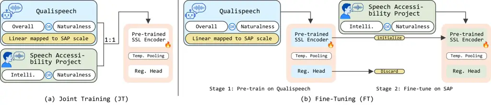

# Augmenting Dysarthric Speech Severity Assessment with MOS Supervision

Kaimeng Jia^(†1), Minzhu Tu^(†2), Zengrui Jin^(∗1), Siyin Wang¹, Chao
Zhang¹ ^(†)^(†)thanks: \$†\$ Equal contribution was made between the
first two authors.^(†)^(†)thanks: \* Corresponding author.

###### Abstract

Dysarthria is a speech disorder marked by reduced intelligibility and
communicative effectiveness. Automatic utterance-level assessment of
dysarthric speech can support scalable speech monitoring and
therapy-related analysis. Yet training such systems is bottlenecked by
the scarcity of clinically annotated dysarthric speech. This work
proposes to augment dysarthric speech assessment using data from speech
synthesis evaluations, specifically human-annotated utterances with Mean
Opinion Score (MOS) labels from the QualiSpeech corpus. Experiments show
that fine-tuning on speech synthesis assessment data consistently
improves performance on both intelligibility and naturalness prediction,
while joint training yields gains primarily on naturalness. These
results suggest that synthesis artifacts and dysarthric speech share
perceptual commonalities, and speech synthesis evaluation corpora offer
a practical augmentation source that reduces reliance on scarce clinical
annotations.

###### keywords

Dysarthria, Dysarthric Speech, Automatic Dysarthria Assessment, Mean
Opinion Score

^(†)^(†)address: ¹ Tsinghua University, ² Beijing University of Posts
and Telecommunications  
jkm23@mails.tsinghua.edu.cn, Epiphany_1104@bupt.edu.cn,  
wangsiyi23@mails.tsinghua.edu.cn, {zrjin,cz277}@tsinghua.edu.cn

## 1 Introduction

Dysarthria is a neuro-motor speech disorder resulting from neurological
injuries or diseases, such as cerebral palsy, amyotrophic lateral
sclerosis, Parkinson’s disease, or stroke \[1, 2\]. These disruptions
manifest in several perceptually salient characteristics, with reduced
intelligibility and degraded naturalness being among the most prominent
and impactful on daily communication.

Despite recent advancement achieved in automatic speech recognition
(ASR) \[3, 4, 5, 6\] and dysarthric speech recognition \[7, 8, 9\],
accurate assessment of dysarthric speech remains a challenging problem
with important clinical and technological implications. It serves as a
sensitive biomarker for early detection and tracking of neurological
disease progression \[10\], provides an objective measure to guide
speech therapy and monitor rehabilitation outcomes \[11\], and is a key
factor for improving downstream systems such as dysarthric speech
recognition and disordered speech reconstruction \[12, 13, 14, 15\].

Despite its significant importance, clinical assessment of
utterance-level intelligibility and naturalness still relies heavily on
subjective evaluations by certified speech pathologists \[16, 17\],
which are labor-intensive and difficult to scale. These limitations have
motivated the development of automated, objective assessment methods.
However, patients with speech disorders often present with co-occurring
physical disabilities, making large-scale data collection particularly
challenging. Furthermore, existing approaches are typically restricted
to constrained lexicons and require matched control groups, resulting in
an unnatural evaluation protocol. To the best of our knowledge,
spontaneous utterances with unconstrained vocabulary have not been
employed in prior studies.

To address the data scarcity issue, self-supervised learning (SSL) has
emerged as a powerful paradigm in speech processing, offering robust and
transferable representations from large-scale unlabeled corpora. Models
such as wav2vec 2.0 \[18\] and HuBERT \[19, 20\] have been successfully
applied to both detection and severity assessment of dysarthria \[21,
22\]. A wide spectrum of data augmentation techniques has also been
explored, including signal processing \[23\], adversarial domain
adaptation \[24\], generative approaches \[25, 26, 27\], reverse
autoencoders that transform healthy speech into dysarthric speech
\[28\], and other pre-trained TTS systems \[29, 30, 31\]. However, these
generative approaches are designed to model spectro-temporal
characteristics of dysarthric speech for ASR or speech reconstruction
purposes. The augmented data they produce lacks perceptual validation,
as no clinical experts re-annotate the generated samples with severity
labels, leaving it unclear whether the synthetic speech aligns with
human perceptual judgments. As a result, such data cannot be directly
used as augmentation for severity assessment, where label quality and
perceptual alignment are critical.

Meanwhile, automated assessment of Text-to-Speech (TTS) synthesis
quality has been extensively investigated \[32, 33, 34, 35, 36, 37, 38,
39\], producing large quantities of human-annotated utterances with mean
opinion score (MOS) labels measuring naturalness and intelligibility.
Crucially, both synthesis artifacts and dysarthric speech represent
deviations from natural human production, sharing perceptual
characteristics such as reduced intelligibility, unnatural prosody, and
degraded fluency. This acoustic and perceptual overlap motivates a novel
data augmentation strategy, leveraging TTS assessment corpora, which are
readily available and richly annotated, as an augmentation source for
dysarthric speech assessment systems.

The contributions of this work are threefold: (1) An empirical study of
SSL-based automatic dysarthric speech assessment on utterances with
unconstrained vocabulary, going beyond the constrained protocols of
prior work. (2) Demonstration that synthesized speech with
human-annotated MOS scores from TTS evaluation corpora can effectively
augment dysarthric speech assessment systems. (3) Evidence that
synthesis failures and dysarthric manifestations share perceptual and
acoustic commonalities, offering a novel perspective on cross-domain
knowledge transfer between TTS and articulatory disorders.

The rest of this paper is organized as follows. Section 2 introduces the
assessment task and describes the Speech Accessibility Project (SAP) and
QualiSpeech corpora. Section 3 presents the model architecture and the
two training paradigms: joint training and fine-tuning. Section 4
reports experiments and results on intelligibility and naturalness
prediction. The last section concludes this work.

## 2 Task Description

### 2.1 The Speech Accessibility Project Challenge 2025

(a) Intelligibility

(b) Naturalness

Figure 1: Distribution of utterances across severity levels for (a)
Intelligibility and (b) Naturalness in the Speech Accessibility Project
(SAP) challenge. Intelligibility is heavily biased toward level 1
(minimal impairment), while Naturalness exhibits a more balanced spread
across levels, reflecting the greater variability in perceived speech
quality among dysarthric speakers.

The SAP challenge \[40\] provides a large-scale, open-domain corpus of
dysarthric speech. The corpus comprises utterances recorded from over
500 speakers diagnosed with Parkinson’s disease, Down syndrome,
amyotrophic lateral sclerosis, Cerebral palsy, or stroke, encompassing
more than 400 hours of speech and over 190,000 utterances. The dataset
was recorded through participants using their personal devices at home,
capturing both read and spontaneously generated speech with
unconstrained vocabulary to ensure naturalness and variability.
Fine-grained perceptual speech assessment across multiple clinically
relevant dimensions is provided in the corpus, including but not limited
to, harsh voice, inappropriate silences, pitch level, naturalness,
variable rate, and intelligibility. Each dimension is annotated by
certified speech-language pathologists using a 7-point scale, where a
higher score indicates more significant severity is manifested in the
corresponding dimension. Given the complexity among these perceptual
dimensions and the primary objective of dysarthric speech assessment,
the focus is specifically narrowed to two core utterance-level
annotations, Intelligibility and Naturalness. Distribution of utterances
across severity levels can be seen from Figure 1.

Due to the unavailability of the original SAP test labels, the
development partition was used as the test set. The released SAP
training and development partitions utilize a speaker-level data
partitioning protocol, thus the test speakers are unseen during SAP
training. For each target dimension, utterances annotated for that
dimension were selected from the SAP training partition, yielding 5,046
utterances for Intelligibility and 5,040 for Naturalness before
validation sampling. Validation sets consisting of 500 utterances per
dimension were randomly sampled from the corresponding training subsets
and used only for model selection. These validation utterances were
removed from the corresponding training subsets, ensuring no utterance
overlap across train, validation, and test. The resulting test sets
include 716 utterances for Intelligibility and 714 utterances for
Naturalness.



Figure 2: An illustration of the proposed training paradigms. In Joint
Training (JT), QualiSpeech and Speech Accessibility Project (SAP)
utterances are mixed at a 1:1 ratio and fed jointly into a shared SSL
encoder and regression head, with QualiSpeech MOS scores linearly mapped
to the SAP severity scale. In Fine-Tuning (FT), the model is first
trained on QualiSpeech, then fine-tuned on SAP without simultaneous
cross-dataset optimization.

### 2.2 QualiSpeech: A Descriptive Corpus for Speech Quality Assessment

QualiSpeech \[41\] is an English corpus for low-level speech quality
assessment with comprehensive annotations and detailed descriptive
comments. It comprises three speech categories: synthetic speech (49%),
primarily from the Blizzard Challenge and Voice Conversion Challenge
(BVCC) corpus \[42\] and various TTS models with standardized MOS
scores; simulated real speech (27%), sourced from the Non-Intrusive
Speech Quality Assessment (NISQA) corpus \[43\] featuring distortions
that emulate actual transmission; and real speech (24%), encompassing
NISQA live recordings and in-the-wild samples from GigaSpeech \[44\]. To
ensure balanced speech quality conditions, 20% of the synthetic speech
samples are mixed with noise at signal-to-noise ratios ranging between 0
and 15 dB, while real speech samples are stratified into four quality
groups based on UTMOS-predicted MOS scores \[45\]. Each utterance is
evaluated across seven perceptual quality dimensions, namely noise,
distortion, speed, continuity, listening effort, naturalness, and
overall quality. This protocol results in training, validation, and test
splits of 10,558, 2,167, and 1,852 utterances, respectively, with
balanced compositions of synthetic and real speech.

Among the seven annotated dimensions, overall quality and naturalness
are selected as they provide complementary yet comprehensive
perspectives on perceptual evaluation. Overall quality captures the
aggregated listener impression across multiple degradations, while
naturalness reflects the degree to which speech resembles genuine human
production. Focusing on these two dimensions ensures both clinical
relevance for pathological speech assessment and consistency with
established practices in general speech quality evaluation.

## 3 Method

### 3.1 Model Architecture

To leverage transferable representations from large-scale unlabeled
speech, self-supervised learning (SSL) pre-trained encoders are adopted
as the backbone for feature extraction \[46\]. The core idea is to
augment the limited in-domain dysarthric speech data with
human-annotated TTS assessment data from QualiSpeech, using either joint
training or fine-tuning to transfer perceptual supervision into the
dysarthria assessment model. Given a raw waveform input, the SSL encoder
produces a sequence of frame-level contextual representations. These are
aggregated via mean pooling over the time dimension to obtain a
fixed-dimensional utterance-level embedding, which captures global
perceptual characteristics without requiring explicit segmentation. The
utterance embedding is then passed to a regression head consisting of a
two-layer feed-forward network with ReLU activation and dropout
regularization between layers, producing a single continuous severity
score. The entire model, including the SSL encoder, is fine-tuned in an
end-to-end fashion during training.

### 3.2 Training Paradigms

Two training paradigms are proposed to incorporate perceptual
supervision from QualiSpeech into dysarthric speech assessment, as
illustrated in Figure 2.

Joint Training (JT). The JT paradigm trains a single model
simultaneously on both the QualiSpeech and SAP corpora under a unified
regression objective. To prevent the larger QualiSpeech corpus from
dominating training, utterances are randomly sampled from the
QualiSpeech training set to match the size of the SAP training split,
yielding a balanced 1:1 mixture ratio. Since the two datasets adopt
different rating scales, with QualiSpeech using a MOS scale of 1–5 while
SAP uses a severity scale of 1–7, a linear transformation is applied to
align QualiSpeech scores before joint optimization:

```math
\hat{s}=1+(5-s_{\text{MOS}})\cdot\frac{6}{4}, \tag{1}
```

where $`s_{\text{MOS}}\in[1,5]`$ is the original QualiSpeech MOS and
$`\hat{s}`$ is the aligned score in the SAP scale. Under this mapping, a
MOS of 5 (highest quality) corresponds to an SAP score of 1 (no
dysarthric characteristics), and a MOS of 1 (lowest quality) maps to an
SAP score of 7 (most severe).

Fine-Tuning (FT). The FT paradigm decouples learning into two sequential
stages. The model is first trained on QualiSpeech to predict the
selected MOS dimension and acquire perceptual quality representations.
The resulting weights then initialize the SAP model, which is fine-tuned
for dysarthric speech severity prediction. This design transfers
perceptual supervision while avoiding simultaneous cross-dataset
optimization.

### 3.3 Evaluation Metrics

Model performance is evaluated using three complementary metrics: Mean
Squared Error (MSE), Linear Correlation Coefficient (LCC), and
Spearman’s Rank Correlation Coefficient (SRCC). MSE quantifies the
absolute deviation between predicted scores and ground-truth ratings,
with lower values indicating higher prediction accuracy. LCC measures
the strength of the linear relationship between predictions and
references, while SRCC assesses the consistency of relative ranking
order, which is particularly relevant for severity-level discrimination.
Together, these three metrics provide a comprehensive view of both
regression accuracy and perceptual alignment with human judgments.

## 4 Experiments and Results

To leverage human-perception-aligned supervision from QualiSpeech for
dysarthria assessment, we evaluate two TTS-based data augmentation
paradigms: joint training (JT) and fine-tuning (FT). All models
evaluated are optimized using the Adam optimizer with mean squared error
(MSE) as the training objective, a learning rate of $`1e-5`$, and weight
decay of $`0.01`$. Details of the utilized self-supervised learning
(SSL) pre-trained encoders are listed in Table 1.

|                                                                                                                                                                                 |           |                                                                              |
| ------------------------------------------------------------------------------------------------------------------------------------------------------------------------------- | --------- | ---------------------------------------------------------------------------- |
| Model                                                                                                                                                                           | \# Param. | Dataset                                                                      |
| wav2vec 2.0 Base¹¹ 1 [https://dl.fbaipublicfiles.com/fairseq/wav2vec/wav2vec_small.pt](https://dl.fbaipublicfiles.com/fairseq/wav2vec/wav2vec_small.pt)                         | 94M       | Librispeech \[47\]                                                           |
| wav2vec 2.0 Large\*²² 2 [https://dl.fbaipublicfiles.com/fairseq/wav2vec/wav2vec_vox_new.pt](https://dl.fbaipublicfiles.com/fairseq/wav2vec/wav2vec_vox_new.pt)                  | 315M      | Libri-Light \[48\]                                                           |
| wav2vec 2.0 Large+³³ 3 [https://dl.fbaipublicfiles.com/fairseq/wav2vec/w2v_large_lv_fsh_swbd_cv.pt](https://dl.fbaipublicfiles.com/fairseq/wav2vec/w2v_large_lv_fsh_swbd_cv.pt) | 315M      | Libri-Light \[48\] + CommonVoice \[49\] + Switchboard \[50\] + Fisher \[51\] |
| HuBERT Base⁴⁴ 4 [https://dl.fbaipublicfiles.com/hubert/hubert_base_ls960.pt](https://dl.fbaipublicfiles.com/hubert/hubert_base_ls960.pt)                                        | 95M       | Librispeech \[47\]                                                           |
| HuBERT Large⁵⁵ 5 [https://dl.fbaipublicfiles.com/hubert/hubert_large_ll60k.pt](https://dl.fbaipublicfiles.com/hubert/hubert_large_ll60k.pt)                                     | 316M      | Libri-Light \[48\]                                                           |

Table 1: Details of self-supervised learning (SSL) pre-trained encoders.

All training paradigms share an identical experimental setup with
parameters of SSL encoders kept trainable. Under the JT paradigm, 4,000
utterances are randomly sampled from the QualiSpeech training set with
the original data distribution preserved, and then combined with the SAP
training set for joint optimization.

|     |        |                 |             |                  |       |       |                     |       |       |                    |       |       |             |       |       |              |       |       |
| --- | ------ | --------------- | ----------- | ---------------- | ----- | ----- | ------------------- | ----- | ----- | ------------------ | ----- | ----- | ----------- | ----- | ----- | ------------ | ----- | ----- |
| ID  | Method | Dimension       |             | wav2vec 2.0 Base |       |       | wav2vec 2.0 Large\* |       |       | wav2vec 2.0 Large+ |       |       | HuBERT Base |       |       | HuBERT Large |       |       |
|     |        | SAP             | QualiSpeech | MSE              | LCC   | SRCC  | MSE                 | LCC   | SRCC  | MSE                | LCC   | SRCC  | MSE         | LCC   | SRCC  | MSE          | LCC   | SRCC  |
| 1   | IDT    | Intelligibility | –           | 0.348            | 0.628 | 0.482 | 0.421               | 0.523 | 0.368 | 0.547              | 0.471 | 0.322 | 0.461       | 0.540 | 0.406 | 0.475        | 0.485 | 0.404 |
| 2   | FT     | Intelligibility | Overall     | 0.272            | 0.751 | 0.427 | 0.351               | 0.612 | 0.393 | 0.308              | 0.534 | 0.285 | 0.487       | 0.594 | 0.368 | 0.431        | 0.596 | 0.356 |
| 3   | JT     |                 |             | 0.408            | 0.590 | 0.446 | 0.560               | 0.317 | 0.330 | 0.627              | 0.225 | 0.302 | 0.612       | 0.387 | 0.317 | 0.526        | 0.479 | 0.363 |
| 4   | FT     | Intelligibility | Naturalness | 0.303            | 0.648 | 0.464 | 0.387               | 0.572 | 0.401 | 0.495              | 0.566 | 0.443 | 0.379       | 0.451 | 0.295 | 0.379        | 0.608 | 0.464 |
| 5   | JT     |                 |             | 0.433            | 0.602 | 0.475 | 0.604               | 0.383 | 0.352 | 0.528              | 0.445 | 0.348 | 0.489       | 0.515 | 0.309 | 0.451        | 0.551 | 0.391 |
| 6   | IDT    | Naturalness     | –           | 1.127            | 0.581 | 0.591 | 1.354               | 0.469 | 0.481 | 1.119              | 0.574 | 0.607 | 1.169       | 0.546 | 0.521 | 0.941        | 0.570 | 0.503 |
| 7   | FT     | Naturalness     | Overall     | 1.053            | 0.718 | 0.723 | 1.033               | 0.695 | 0.706 | 1.000              | 0.686 | 0.696 | 0.847       | 0.644 | 0.587 | 0.819        | 0.701 | 0.690 |
| 8   | JT     |                 |             | 0.909            | 0.691 | 0.680 | 1.027               | 0.606 | 0.613 | 1.106              | 0.589 | 0.617 | 1.050       | 0.614 | 0.634 | 0.930        | 0.661 | 0.668 |
| 9   | FT     | Naturalness     | Naturalness | 0.717            | 0.717 | 0.657 | 0.800               | 0.709 | 0.713 | 0.880              | 0.692 | 0.690 | 1.075       | 0.646 | 0.635 | 0.823        | 0.678 | 0.675 |
| 10  | JT     |                 |             | 1.022            | 0.637 | 0.643 | 1.085               | 0.629 | 0.648 | 1.022              | 0.637 | 0.642 | 1.121       | 0.586 | 0.590 | 1.036        | 0.638 | 0.635 |

Table 2: Results of self-supervised learning (SSL) pre-trained encoders
under joint training (JT) and fine-tuning (FT) on the Speech
Accessibility Project dysarthric speech corpus (SAP) and QualiSpeech.
The two “Dimension” columns denote the SAP target dimension (left) and
the QualiSpeech auxiliary supervision dimension (right). “IDT” denotes
in-domain training on SAP only, with no QualiSpeech augmentation (“–”).
For each SSL encoder, Mean Squared Error (MSE $`\downarrow`$), Linear
Correlation Coefficient (LCC $`\uparrow`$), and Spearman’s Rank
Correlation Coefficient (SRCC $`\uparrow`$) are reported. Bold values
indicate the best result per encoder within each SAP dimension group.

### 4.1 Performance on the Intelligibility Dimension

Table 2 (Row 1–5) reports intelligibility prediction on SAP, with
Overall quality and Naturalness from QualiSpeech used as auxiliary
supervision under fine-tuning (FT) and joint training (JT) across five
SSL encoders. Three key trends emerge:

(i) Under in-domain training (IDT, Row 1), wav2vec 2.0 Base achieves the
strongest performance, with a 36.4% relative MSE reduction over Large+,
suggesting that smaller encoders generalize better to this task without
additional supervision.

(ii) Speech synthesis augmentation via FT (Row 2 vs. 1) consistently
improves intelligibility prediction across all wav2vec encoders, with
the largest relative MSE reduction of 43.7% for Large+ and a 19.6% LCC
improvement for Base, demonstrating that QualiSpeech overall quality
provides effective perceptual transfer for intelligibility.

(iii) FT consistently outperforms JT across all encoder and dimension
combinations (Row 2 vs. 3, Row 4 vs. 5), with Overall quality yielding
the most robust MSE and LCC gains while Naturalness further improves
SRCC, particularly for larger encoders, indicating that the choice of
augmentation dimension interacts with model capacity.

### 4.2 Performance on Naturalness Dimension

Table 2 (Row 6–10) reports naturalness prediction on SAP, utilizing
Overall quality and Naturalness from QualiSpeech as auxiliary
supervision under fine-tuning (FT) and joint training (JT) across five
SSL encoders. Three key trends emerge:

(i) Speech synthesis augmentation via FT (Row 7 vs. 6) consistently
improves naturalness prediction across all encoders, with wav2vec 2.0
Large\* showing the largest LCC (48.2% relative) and SRCC (46.8%
relative) gains, confirming that overall quality from QualiSpeech
transfers effectively to dysarthric naturalness assessment.

(ii) Unlike intelligibility, JT also yields consistent gains over IDT on
naturalness (Row 8 vs. 6), with wav2vec 2.0 Base and Large\* reducing
MSE by 19.4% and 24.2% respectively, suggesting that the perceptual
alignment between QualiSpeech quality ratings and dysarthric naturalness
is sufficient to support joint optimization.

(iii) Using QualiSpeech Naturalness as auxiliary supervision under FT
(Row 9) achieves the lowest MSE across all conditions, with wav2vec 2.0
Base and Large\* achieving 36.4% and 40.9% relative MSE reductions,
indicating that dimension-matched supervision yields the strongest
transfer.

Taken together, these results demonstrate that the perceptual overlap
between speech synthesis quality and dysarthric naturalness is
sufficient to support effective cross-domain augmentation under both FT
and JT, validating the use of speech synthesis evaluation corpora as a
practical and label-efficient augmentation source for dysarthric speech
assessment.

### 4.3 Analysis on the Performance Gap between FT and JT

The consistent gap between FT and JT on intelligibility can be
attributed to cross-domain label misalignment and negative transfer
under joint optimization. The QualiSpeech supervision signals, overall
quality and naturalness, are semantically misaligned with SAP
intelligibility: while the latter reflects clinical judgments of
phonemic clarity and word-level recoverability, the former capture
aggregated listener impressions of multi-dimensional degradations and
human-likeness, which are more closely related to the naturalness
perceptual axis than to articulatory intelligibility.

Under JT, a shared regression head and a unified MSE objective are
applied over both corpora, implicitly treating the linearly mapped
QualiSpeech scores as a proxy for SAP intelligibility severity. This
assumption fails for intelligibility, as gradients from QualiSpeech bias
the shared representations toward explaining MOS variance, suppressing
the discriminative acoustic cues required for intelligibility
assessment.

FT sidesteps this conflict by decoupling the two learning stages:
QualiSpeech pre-training initializes the encoder with perceptually
informed representations, while subsequent fine-tuning on SAP allows the
model to re-weight features toward the target domain without
cross-dataset gradient interference, explaining its consistent advantage
over JT. These findings suggest that speech synthesis evaluation data
can serve as a viable augmentation source for dysarthric intelligibility
assessment, provided that the transfer is mediated through sequential
fine-tuning rather than joint optimization.

## 5 Conclusion

This study demonstrated that leveraging perceptual annotations from the
QualiSpeech corpus significantly enhances automatic dysarthria
assessment. Fine-tuning consistently improved prediction accuracy over
the baseline on both dimensions, while joint training yielded gains
primarily on naturalness. Larger models derived greater benefit from
additional supervision, and naturalness prediction consistently achieved
stronger correlation with human judgments than intelligibility, likely
attributable to the severe class imbalance in the intelligibility
dimension as shown in Figure 1. The effectiveness of synthetic speech
augmentation underscores perceptual and acoustic commonalities between
synthesis failures and dysarthric speech, highlighting promising
directions for future clinical research.

## 6 Generative AI Use Disclosure

During the preparation of this manuscript, the authors used generative
AI to correct grammar mistakes and misspellings. Illustrative icons in
Figure 2 are AI generated. After using these tools, the authors
carefully reviewed and edited the manuscript, and take full
responsibility for the final content of the paper.

## References

- \[1\] F. Rudzicz (2011) Articulatory Knowledge in the Recognition of
  Dysarthric Speech. IEEE Transactions on Audio, Speech, and Language
  Processing 19 (4), pp. 947–960. Cited by: §1.
- \[2\] F. Rudzicz (2009) Phonological Features in Discriminative
  Classification of Dysarthric Speech. In Proc. IEEE ICASSP, Taipei.
  External Links:
  [Document](https://dx.doi.org/10.1109/ICASSP.2009.4960656) Cited by:
  §1.
- \[3\] H. Hadian, H. Sameti, D. Povey, and S. Khudanpur (2018)
  End-to-end Speech Recognition Using Lattice-free MMI. In Proc.
  Interspeech, Hyderabad. Cited by: §1.
- \[4\] A. Gulati, J. Qin, C. Chiu, N. Parmar, Y. Zhang, J. Yu, W.
  Han, S. Wang, Z. Zhang, Y. Wu, and R. Pang (2020) Conformer:
  Convolution-augmented Transformer for Speech Recognition. In Proc.
  Interspeech, Shanghai. Cited by: §1.
- \[5\] Z. Yao, L. Guo, X. Yang, W. Kang, F. Kuang, Y. Yang, Z. Jin, L.
  Lin, and D. Povey (2024) Zipformer: A faster and better encoder for
  automatic speech recognition. In Proc. ICLR, Vienna. Cited by: §1.
- \[6\] Z. Yao, W. Kang, X. Yang, F. Kuang, L. Guo, H. Zhu, Z. Jin, Z.
  Li, L. Lin, and D. Povey (2025) CR-CTC: consistency regularization on
  CTC for improved speech recognition. In Proc. ICLR, Singapore. Cited
  by: §1.
- \[7\] Z. Jin, M. Geng, J. Deng, T. Wang, S. Hu, G. Li, and X.
  Liu (2023) Personalized Adversarial Data Augmentation for Dysarthric
  and Elderly Speech Recognition. IEEE/ACM Transactions on Audio,
  Speech, and Language Processing 32, pp. 413–429. Cited by: §1.
- \[8\] T. Wang, S. Hu, J. Deng, Z. Jin, M. Geng, Y. Wang, H. Meng,
  and X. Liu (2023) Hyper-parameter Adaptation of Conformer ASR Systems
  for Elderly and Dysarthric Speech Recognition. In Proc. Interspeech,
  Dublin. Cited by: §1.
- \[9\] H. Wang, Z. Jin, M. Geng, S. Hu, G. Li, T. Wang, H. Xu, and X.
  Liu (2024) Enhancing Pre-Trained ASR System Fine-Tuning for Dysarthric
  Speech Recognition Using Adversarial Data Augmentation. In Proc. IEEE
  ICASSP, Seoul. Cited by: §1.
- \[10\] T. Bhattacharjee, Y. Belur, A. Nalini, R. Yadav, and P. K.
  Ghosh (2023) Exploring the Role of Fricatives in Classifying Healthy
  Subjects and Patients with Amyotrophic Lateral Sclerosis and
  Parkinson’s Disease. In Proc. IEEE ICASSP, Rhodes Island. External
  Links:
  [Document](https://dx.doi.org/10.1109/ICASSP49357.2023.10095664) Cited
  by: §1.
- \[11\] C. Bhat, B. Vachhani, and S. K. Kopparapu (2017) Automatic
  Assessment of Dysarthria Severity Level Using Audio Descriptors. In
  Proc. IEEE ICASSP, New Orleans. External Links:
  [Document](https://dx.doi.org/10.1109/ICASSP.2017.7953122) Cited by:
  §1.
- \[12\] M. Geng, Z. Jin, T. Wang, S. Hu, J. Deng, M. Cui, G. Li, J.
  Yu, X. Xie, and X. Liu (2023) Use of Speech Impairment Severity for
  Dysarthric Speech Recognition. In Proc. Interspeech, Dublin. Cited by:
  §1.
- \[13\] Y. Jeon, S. Im, Y. Kim, and G. G. Lee (2025) Facilitating
  Personalized TTS for Dysarthric Speakers Using Knowledge Anchoring and
  Curriculum Learning. In Proc. Interspeech, Rotterdam. Cited by: §1.
- \[14\] X. Chen, Y. Wang, X. Wu, D. Wang, Z. Wu, X. Liu, and H.
  Meng (2024) Exploiting Audio-Visual Features with Pretrained AV-HuBERT
  for Multi-Modal Dysarthric Speech Reconstruction. In Proc. IEEE
  ICASSP, Seoul. External Links:
  [Document](https://dx.doi.org/10.1109/ICASSP48485.2024.10445949) Cited
  by: §1.
- \[15\] Y. Wang, X. Wu, D. Wang, L. Meng, and H. Meng (2024) UNIT-DSR:
  Dysarthric Speech Reconstruction System Using Speech Unit
  Normalization. In Proc. IEEE ICASSP, Seoul. Cited by: §1.
- \[16\] F. Rudzicz, A. K. Namasivayam, and T. Wolff (2012) The TORGO
  database of acoustic and articulatory speech from speakers with
  dysarthria. Lang. Resour. Eval. 46 (4), pp. 523–541. Cited by: §1.
- \[17\] H. Kim, M. Hasegawa-Johnson, A. Perlman, J. R. Gunderson, T. S.
  Huang, K. L. Watkin, S. Frame, et al. (2008) Dysarthric Speech
  Database for Universal Access Research. In Proc. Interspeech,
  Brisbane. External Links:
  [Document](https://dx.doi.org/10.21437/Interspeech.2008-480), ISSN
  2958-1796 Cited by: §1.
- \[18\] A. Baevski, Y. Zhou, A. Mohamed, and M. Auli (2020) wav2vec
  2.0: A Framework for Self-Supervised Learning of Speech
  Representations. In Proc. NeurIPS, virtual. Cited by: §1.
- \[19\] W. Hsu, B. Bolte, Y. H. Tsai, K. Lakhotia, R. Salakhutdinov,
  and A. Mohamed (2021) HuBERT: Self-Supervised Speech Representation
  Learning by Masked Prediction of Hidden Units. IEEE/ACM Transactions
  on Audio, Speech, and Language Processing 29, pp. 3451–3460. External
  Links: [Document](https://dx.doi.org/10.1109/TASLP.2021.3122291) Cited
  by: §1.
- \[20\] Y. Yang, J. Zhuo, Z. Jin, Z. Ma, X. Yang, Z. Yao, L. Guo, W.
  Kang, F. Kuang, L. Lin, et al. (2025) k2SSL: A Faster and Better
  Framework for Self-Supervised Speech Representation Learning. In Proc.
  IEEE ICME, Nantes. Cited by: §1.
- \[21\] E. J. Yeo, K. Choi, S. Kim, and M. Chung (2023) Automatic
  Severity Classification of Dysarthric Speech by Using Self-Supervised
  Model with Multi-Task Learning. In Proc. IEEE ICASSP, Rhodes Island.
  External Links:
  [Document](https://dx.doi.org/10.1109/ICASSP49357.2023.10094605) Cited
  by: §1.
- \[22\] F. Javanmardi, S. Tirronen, M. Kodali, S. R. Kadiri, and P.
  Alku (2023) Wav2vec-Based Detection and Severity Level Classification
  of Dysarthria From Speech. In Proc. IEEE ICASSP, Rhodes Island.
  External Links:
  [Document](https://dx.doi.org/10.1109/ICASSP49357.2023.10094857) Cited
  by: §1.
- \[23\] M. Geng, X. Xie, S. Liu, J. Yu, S. Hu, X. Liu, and H.
  Meng (2020) Investigation of Data Augmentation Techniques for
  Disordered Speech Recognition. In Proc. Interspeech, Shanghai. Cited
  by: §1.
- \[24\] L. Stumpf, B. Kadirvelu, and A. A. Faisal (2025) Multilingual
  Speaker-Invariant Dysarthria Severity Assessment Using Adversarial
  Domain Adaptation and Self-Supervised Learning. In Proc. IEEE ICASSP,
  Hyderabad. External Links:
  [Document](https://dx.doi.org/10.1109/ICASSP49660.2025.10889800) Cited
  by: §1.
- \[25\] H. Wang, T. Thebaud, J. Villalba, M. Sydnor, B. Lammers, N.
  Dehak, and L. Moro-Velazquez (2023) DuTa-VC: A Duration-aware
  Typical-to-atypical Voice Conversion Approach with Diffusion
  Probabilistic Model. In Proc. Interspeech, Dublin. Cited by: §1.
- \[26\] Z. Jin, M. Geng, X. Xie, J. Yu, S. Liu, X. Liu, and H.
  Meng (2021) Adversarial Data Augmentation for Disordered Speech
  Recognition. In Proc. Interspeech, Brno. Cited by: §1.
- \[27\] Z. Jin, X. Xie, M. Geng, T. Wang, S. Hu, J. Deng, G. Li, and X.
  Liu (2023) Adversarial Data Augmentation Using VAE-GAN for Disordered
  Speech Recognition. In Proc. IEEE ICASSP, Rhodes Island. Cited by: §1.
- \[28\] C. Bhat, A. Panda, and H. Strik (2022) Improved ASR Performance
  for Dysarthric Speech Using Two-stage Data Augmentation. In Proc.
  Interspeech, Incheon. External Links:
  [Document](https://dx.doi.org/10.21437/Interspeech.2022-10335), ISSN
  2958-1796 Cited by: §1.
- \[29\] E. Hermann and M. Magimai-Doss (2023) Few-shot Dysarthric
  Speech Recognition with Text-to-Speech Data Augmentation. In Proc.
  Interspeech, Dublin. External Links:
  [Document](https://dx.doi.org/10.21437/Interspeech.2023-2481), ISSN
  2958-1796 Cited by: §1.
- \[30\] W. Leung, M. Cross, A. Ragni, and S. Goetze (2024) Training
  Data Augmentation for Dysarthric Automatic Speech Recognition by
  Text-to-Dysarthric-Speech Synthesis. In Proc. Interspeech, Kos. Cited
  by: §1.
- \[31\] M. Kim, M. Han, S. Hong, and M. Koo (2025) Data Augmentation
  using Speech Synthesis for Speaker-Independent Dysarthria Severity
  Classification. In Proc. Interspeech, Rotterdam. Cited by: §1.
- \[32\] W. Huang, E. Cooper, Y. Tsao, H. Wang, T. Toda, and J.
  Yamagishi (2022) The VoiceMOS Challenge 2022. In Proc. Interspeech,
  Incheon. External Links:
  [Document](https://dx.doi.org/10.21437/Interspeech.2022-970), ISSN
  2958-1796 Cited by: §1.
- \[33\] C. Lo, S. Fu, W. Huang, X. Wang, J. Yamagishi, Y. Tsao, and H.
  Wang (2019) MOSNet: Deep Learning-Based Objective Assessment for Voice
  Conversion. In Proc. Interspeech, Graz. Cited by: §1.
- \[34\] Y. Yang, H. Wang, B. Han, S. Liu, J. Li, Y. Qin, and X.
  Chen (2026) Position: Towards Responsible Evaluation for
  Text-to-Speech. In Proc. ICML, Seoul. Cited by: §1.
- \[35\] Y. Yang, B. Han, H. Wang, W. Wang, Z. Ma, L. Zhou, Z. Jin, G.
  Yang, T. Wang, X. Tan, et al. (2026) Towards Fine-Grained and
  Multi-Granular Contrastive Language-Speech Pre-training. In Proc. ACL,
  San Diego. Cited by: §1.
- \[36\] Y. Yang, B. Han, H. Wang, L. Zhou, W. Wang, M. Cui, X. Tan,
  and X. Chen (2026) Measuring Prosody Diversity in Zero-Shot TTS: A New
  Metric, Benchmark, and Exploration. In Proc. IEEE ICASSP, Barcelona.
  Cited by: §1.
- \[37\] S. Wang, W. Yu, Y. Yang, C. Tang, Y. Li, J. Zhuang, X. Chen, X.
  Tian, J. Zhang, G. Sun, et al. (2025) Enabling Auditory Large Language
  Models for Automatic Speech Quality Evaluation. In Proc. ICASSP,
  Hyderabad. Cited by: §1.
- \[38\] C. Chen, Y. Hu, S. Wang, H. Wang, Z. Chen, C. Zhang, C. H.
  Yang, and E. Chng (2025) Audio Large Language Models Can Be
  Descriptive Speech Quality Evaluators. In Proc. ICLR, Singapore. Cited
  by: §1.
- \[39\] S. Wang, Z. Jin, C. Tang, Q. Li, B. Li, C. Chen, Y. Hu, W.
  Yu, Y. Li, J. Zhuang, et al. (2025) Towards General Auditory
  Intelligence: Large Multimodal Models for Machine Listening and
  Speaking. arXiv preprint arXiv:2511.01299. Cited by: §1.
- \[40\] X. Zheng, B. Phukon, J. Na, E. Cutrell, K. Han, M.
  Hasegawa-Johnson, P. Jiang, A. Kuila, C. Lea, B. MacDonald, et
  al. (2025) The Interspeech 2025 Speech Accessibility Project
  Challenge. In Proc. Interspeech, Rotterdam. External Links:
  [Document](https://dx.doi.org/10.21437/Interspeech.2025-566) Cited by:
  §2.1.
- \[41\] S. Wang, W. Yu, X. Chen, X. Tian, J. Zhang, L. Lu, Y. Tsao, J.
  Yamagishi, Y. Wang, and C. Zhang (2025) QualiSpeech: A Speech Quality
  Assessment Dataset with Natural Language Reasoning and Descriptions.
  In Proc. ACL, Vienna. Cited by: §2.2.
- \[42\] E. Cooper and J. Yamagishi (2021) How do Voices from Past
  Speech Synthesis Challenges Compare Today?. In Proc. ISCA SSW,
  Budapest. External Links:
  [Document](https://dx.doi.org/10.21437/SSW.2021-32) Cited by: §2.2.
- \[43\] G. Mittag, B. Naderi, A. Chehadi, and S. Möller (2021) NISQA: A
  Deep CNN-Self-Attention Model for Multidimensional Speech Quality
  Prediction with Crowdsourced Datasets. In Proc. Interspeech, Brno.
  External Links:
  [Document](https://dx.doi.org/10.21437/Interspeech.2021-299), ISSN
  2958-1796 Cited by: §2.2.
- \[44\] G. Chen, S. Chai, G. Wang, J. Du, W. Zhang, C. Weng, D. Su, D.
  Povey, J. Trmal, J. Zhang, et al. (2021) GigaSpeech: An Evolving,
  Multi-Domain ASR Corpus with 10,000 Hours of Transcribed Audio. In
  Proc. Interspeech, Brno. Cited by: §2.2.
- \[45\] T. Saeki, D. Xin, W. Nakata, T. Koriyama, S. Takamichi, and H.
  Saruwatari (2022) UTMOS: UTokyo-SaruLab System for VoiceMOS Challenge 2022. In Proc. Interspeech, Incheon. External Links:
  [Document](https://dx.doi.org/10.21437/Interspeech.2022-439), ISSN
  2958-1796 Cited by: §2.2.
- \[46\] E. Cooper, W. Huang, T. Toda, and J. Yamagishi (2022)
  Generalization Ability of MOS Prediction Networks. In Proc. IEEE
  ICASSP, Singapore. Cited by: §3.1.
- \[47\] V. Panayotov, G. Chen, D. Povey, and S. Khudanpur (2015)
  LibriSpeech: An ASR Corpus Based on Public Domain Audio Books. In
  Proc. IEEE ICASSP, South Brisbane. Cited by: Table 1, Table 1.
- \[48\] J. Kahn, M. Riviere, W. Zheng, E. Kharitonov, Q. Xu, P.
  Mazaré, J. Karadayi, V. Liptchinsky, R. Collobert, C. Fuegen, et
  al. (2020) Libri-Light: A Benchmark for ASR with Limited or No
  Supervision. In Proc. IEEE ICASSP, Barcelona. Cited by: Table 1, Table
  1, Table 1.
- \[49\] R. Ardila, M. Branson, K. Davis, M. Kohler, J. Meyer, M.
  Henretty, R. Morais, L. Saunders, F. Tyers, and G. Weber (2020) Common
  Voice: A Massively-Multilingual Speech Corpus. In Proc. LREC,
  Marseille. Cited by: Table 1.
- \[50\] J. J. Godfrey, E. C. Holliman, and J. McDaniel (1992)
  SWITCHBOARD: telephone speech corpus for research and development. In
  Proc. IEEE ICASSP, San Francisco. Cited by: Table 1.
- \[51\] C. Cieri, D. Miller, and K. Walker (2004) The Fisher Corpus: a
  Resource for the Next Generations of Speech-to-Text. In Proc. LREC’04,
  Lisbon. Cited by: Table 1.
