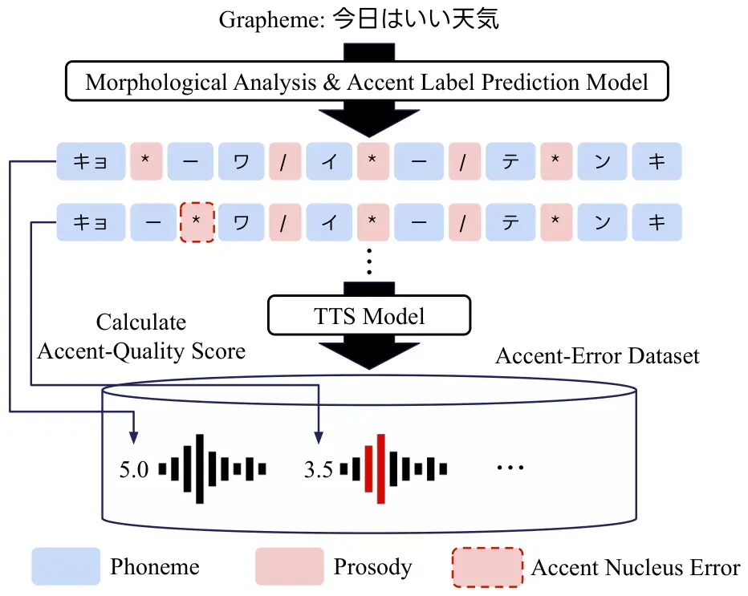
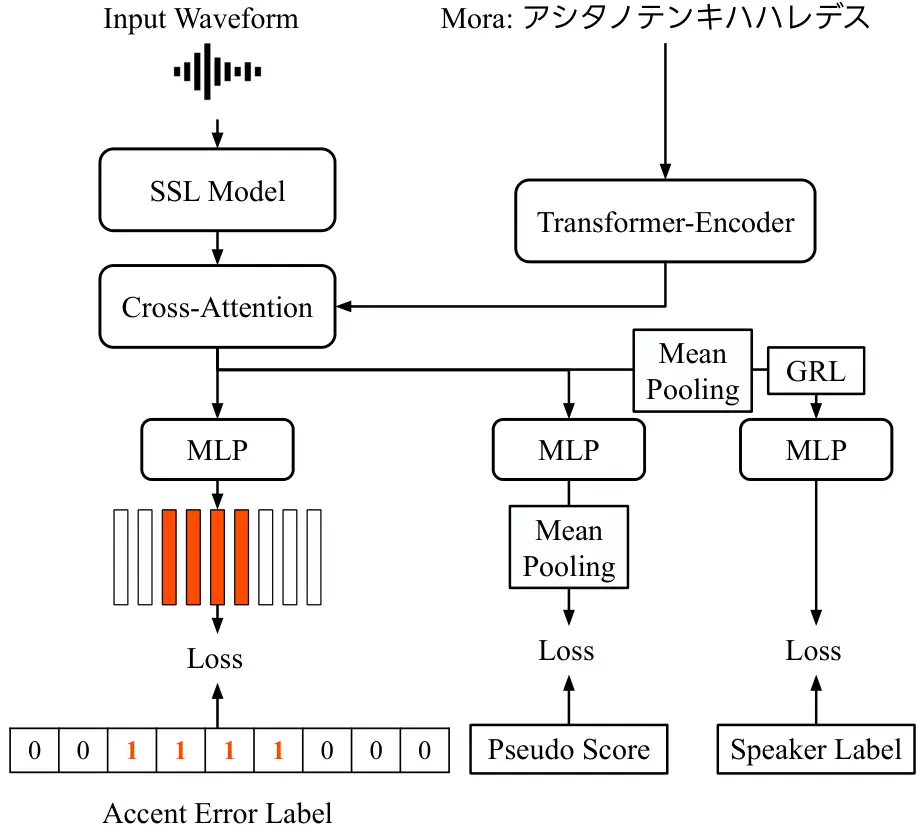

Kawamura Shirahata Mitsui Shimizu

# PASQA: Pitch-Accent-Focused Speech Quality Assessment Model Trained on Synthetic Speech with Accent Errors

Masaya    Yuma    Kentaro    Reo

###### Abstract

Existing mean opinion score (MOS) prediction models typically predict
utterance-level naturalness \textcolorblackMOS and can be insensitive to
localized pitch-accent errors. We propose
Pitch-Accent-\textcolorblackfocused Speech Quality Assessment
(PASQA)\textcolorblack, which explicitly targets pitch-accent
correctness. To train our model, we construct a controlled
\textcolorblackJapanese accent-error \textcolorblackdataset by
\textcolorblackchanging accent patterns using an accent-controllable
\textcolorblacktext-to-speech \textcolorblacksystem, and
\textcolorblackcompute a pseudo accent-quality score from the
accent-error rate. \textcolorblack PASQA builds on self-supervised
representations and employs mora-conditioned fusion, ranking loss, an
auxiliary accent-error localization task, and speaker-invariant
training. Experiments show that conventional models fail to preserve the
\textcolorblackordering by accent-error severity, whereas PASQA achieves
high ordering accuracy on both seen and unseen speakers.
\textcolorblack\textcolorblackFurther, PASQA shows stronger agreement
with human accent-correctness judgments. The \textcolorblackcode is
available at
[https://github.com/lycorp-jp/PASQA](https://github.com/lycorp-jp/PASQA).

###### keywords

speech quality estimation, self-supervised learning, pitch accent
language, prosody

^(†)^(†)address: ¹ LY Corporation, Japan ^(†)^(†)email: kawamura.masaya,
yuma.shirahata, kemitsui, reshimiz@lycorp.co.jp

## 1 Introduction

\textcolor

blackRecent deep neural network (DNN)-based text-to-speech (TTS) systems
can generate highly natural speech \[1, 2, 3\]. The quality of
synthesized speech has conventionally been assessed using subjective
listening tests, particularly Mean Opinion Score (MOS) evaluations by
human raters\textcolorblack, which provide accurate assessments.
However, such evaluations are costly and
time-consuming\textcolorblack \[4\]. The MOS prediction
\textcolorblackmodels \textcolorblackhave therefore become increasingly
used for rapid evaluation. In recent years, with the advancement of
\textcolorblackDNNs and the increase in available data, models that
predict human preferences have been actively studied \[5, 6, 7\].

These approaches typically estimate an utterance-level score intended to
reflect overall naturalness. However, speech naturalness is influenced
not only by global signal quality but also by language-specific prosodic
cues that carry lexical or grammatical information. \textcolorblackFor
example, \textcolorblackin Japanese, pitch accent serves as such a
perceptual cue \[8, 9\]. Even slight shifts in the position of the
accent nucleus can alter lexical meaning, making it crucial for
intelligibility and naturalness \textcolorblack(e.g., the Japanese word
“hashi,” which means “chopsticks” or “bridge” depending on accent
placement). \textcolorblackIn contrast, conventional utterance-level
naturalness scores can be insensitive to such localized pitch-accent
errors. This tendency is also observed in our experimental results (see
Section 3.2). \textcolorblack\textcolorblackSome \textcolorblackstudies
have also explored fine-grained, frame-level quality prediction for
synthetic speech to improve explainability and localization of
degradations \[10\]\textcolorblack, but these approaches have not yet
focused on the correctness of pitch accent. These findings motivate the
need for an assessment \textcolorblackmodel that explicitly targets
pitch-accent correctness.

If a TTS system explicitly includes an accent prediction module, a
straightforward approach would be to evaluate pitch-accent control by
measuring the \textcolorblackmodule’s accuracy \textcolorblack\[11,
12\]. \textcolorblackHowever, in many modern TTS architectures \[13,
14\], accent-related representations are not explicitly exposed and may
be treated as black boxes. In such cases, internal accent labels or
intermediate prosodic predictions are unavailable at evaluation time.
\textcolorblackTherefore, to ensure applicability across diverse TTS
systems, accent-focused assessment should operate directly on the speech
signal.

To address \textcolorblackthese problems, we propose
Pitch-Accent-focused Speech Quality Assessment (PASQA), \textcolorblacka
speech quality assessment model focused on \textcolorblackpitch-accent
correctness. To enable \textcolorblacklearning and evaluation of accent
correctness, we first develop a corpus that covers representative
pitch-accent error patterns. \textcolorblackSince real-world datasets
rarely provide accent-error labels, we construct a Japanese dataset
using controllable TTS to generate synthetic speech samples with
controlled accent errors. \textcolorblack Our model builds on
self-supervised representations, and to further enhance it, we adopt
four strategies: additional mora-sequence inputs, ranking-based
learning, an auxiliary task for accent-error localization, and
speaker-invariant learning.

Experimental results show that conventional utterance-level MOS
prediction models do not adequately reflect pitch-accent correctness. In
contrast, PASQA better preserves the \textcolorblackordering by
accent-error severity and shows stronger agreement with human
\textcolorblackjudgments of accent-correctness, \textcolorblackachieving
a Spearman’s rank correlation coefficient (SRCC) of 0.828 and a
Kendall’s $`\tau`$ (KTAU) of 0.614, both higher than those of
conventional MOS prediction models. \textcolorblack These results
indicate that explicitly modeling accent errors improves Japanese
pitch-accent quality assessment. \textcolorblack Moreover, PASQA
demonstrates robust performance on an out-of-domain (OOD) TTS model.

## 2 Proposed method

### 2.1 Accent-error \textcolorblackdataset



Figure 1: \textcolorblackAccent-error \textcolorblackdataset
construction pipeline.

To develop a model that reflects accent errors in its predicted
accent-quality scores, we constructed a Japanese speech dataset that
includes accent errors. \textcolorblackFigure 1 shows the overall
pipeline for constructing the accent error \textcolorblackdataset. In
the figure, “/” denotes accent phrase boundaries\textcolorblack, which
segment an utterance into prosodic units, and “\*” indicates the accent
nucleus\textcolorblack, the mora where the pitch falls within an accent
phrase. We use a TTS model with a DNN-based prosodic label prediction
model \[11\]. It enables Japanese speech synthesis \textcolorblackwith
explicit control over accent patterns.

For each sentence, we derive prosodic annotations using the prosodic
label prediction model. \textcolorblackThe annotations consist of three
components: the mora sequence, accent phrase boundaries, and the accent
nucleus.

Accent errors are created by modifying the nucleus position in a subset
of phrases. Given a target error rate $`r`$, we uniformly sample
$`\max(1,\lfloor rP\rfloor)`$ phrases from the $`P`$ accent phrases and
alter their nucleus. \textcolorblack For a phrase of length $`L`$, valid
accent types are $`\{0,1,\ldots,L-1\}`$, where 0 denotes the flat
(0-type) accent and $`k\in\{1,\ldots,L-1\}`$ indicates a nucleus on the
$`k`$-th mora. In Japanese pitch accent, a $`\textcolor{black}{k}`$-type
accent means that the pitch drops after the $`\textcolor{black}{k}`$-th
mora, whereas the 0-type (flat) accent has no pitch drop within the
phrase. \textcolorblackWe uniformly resample the nucleus from valid
positions, excluding the original, yielding unbiased accent-type
conversions. The actual error rate is computed as the ratio of mora in
modified phrases to the total number of mora in the utterance.
\textcolorblackEach sample is assigned a pseudo accent-quality score by
applying a monotonic mapping to the actual error rate. \textcolorblack
Specifically, we compute an utterance-level accent-quality score as
$`S_{aq}=5.0-4.0\times\frac{N_{\mathrm{corr}}}{N}`$, where $`N`$ denotes
the total number of mora in the utterance and $`N_{\mathrm{corr}}`$ the
number of mora belonging to corrupted accent phrases.

### 2.2 PASQA

#### 2.2.1 Model architecture

\textcolor

blackFigure 2 shows the overview of the proposed PASQA.
\textcolorblackWe adopt the SSL-MOS \[15\] architecture as the backbone
of our proposed model. SSL-MOS is a non-intrusive speech quality
prediction framework that extracts self-supervised acoustic
representations from waveforms and estimates an utterance-level score
using a projection head with masked mean pooling. \textcolorblackIn
PASQA, the input is a waveform, and wav2vec 2.0 \[16\] produces
frame-level acoustic \textcolorblackfeatures. The downstream network
predicts an accent-quality score. To further improve prediction
performance and robustness, we augment the base architecture with
\textcolorblackfour modifications: 1) mora-conditioned
\textcolorblackfusion that incorporates the mora sequence as auxiliary
linguistic information, 2) \textcolorblackranking loss, 3) a frame-level
accent-error detection head for auxiliary supervision, and 4) a
\textcolorblackgradient reversal layer (GRL) \[17\] to encourage
speaker-invariant representations. We describe each component in detail
in the following subsections.



Figure 2: Overview of the proposed PASQA model.

#### 2.2.2 Mora sequence as auxiliary linguistic information

In the TTS evaluation setting, the input text is available.
\textcolorblack Since pitch accent in Japanese is defined at the mora
level, we derive the mora sequence from the text and incorporate it as
auxiliary linguistic information to explicitly model accent placement.
\textcolorblack Each utterance is represented by a mora sequence
obtained from text analysis, which is then tokenized and embedded into a
fixed-dimensional vector space. We contextualize the sequence using a
Transformer encoder \[18\]. Mora information is fused with acoustic
frames via cross-attention \textcolorblackto generate mora-conditioned
acoustic representations.

#### 2.2.3 \textcolorblackAccent-quality head and ranking loss

\textcolor

black The accent-quality \textcolorblackhead is composed of a multilayer
perceptron \textcolorblack(MLP). Range clipping maps outputs to the
$`[1,5]`$ accent-quality \textcolorblackscore interval using a tanh
transform. We train the accent-quality head using a pairwise logistic
ranking loss, inspired by the Bradley–Terry model \[19\]. This loss
emphasizes ordinal relations:

```math
P(i>j)=\sigma(\hat{y}_{i}-\hat{y}_{j}),\quad\mathcal{L}_{\mathrm{BT}}=-\sum_{i,j:y_{i}>y_{j}}\log P(i>j), \tag{1}
```

where $`\sigma`$ denotes the sigmoid function, $`\hat{y}_{i}`$ is the
predicted score for utterance $`i`$, and $`y_{i}`$ is the corresponding
accent-quality score. This objective learns relative ordering. We first
average frame-level scores over time to obtain an utterance-level score
and then compute the loss over all unique pairs $`(i,j)`$ satisfying
$`y_{i}>y_{j}`$ within a mini-batch, yielding $`\frac{B(B-1)}{2}`$ pairs
for batch size $`B`$.

#### 2.2.4 Auxiliary frame error head

\textcolor

blackUtterance-level scores do not explicitly reflect where pitch-accent
errors occur along the temporal axis. To address this limitation, we
introduce an auxiliary task that detects the temporal locations of
pitch-accent errors to improve the estimation of the accent-quality
score. \textcolorblack Specifically, we add a frame-level auxiliary head
that predicts accent-error labels from the outputs of the SSL models.
Let $`t=1,\ldots,T`$ index the encoder frames, where $`T`$ denotes the
total number of frames. For each frame $`t`$, let
$`\textcolor{black}{l}_{t}\in\{0,1\}`$ denote the corresponding binary
label, where $`\textcolor{black}{l}_{t}=1`$ indicates that frame $`t`$
belongs to an accent phrase whose nucleus has been modified, and
$`\textcolor{black}{l}_{t}=0`$ otherwise. The frame-level labels are
obtained via alignment using the phoneme-level duration predictor of the
TTS model. We optimize a binary cross-entropy loss
$`\mathcal{L}_{\mathrm{frame}}`$.

#### 2.2.5 \textcolorblackSpeaker-invariant representation

\textcolor

blackThe model may exploit speaker-specific acoustic traits rather than
accent-related cues. To reduce speaker-specific bias, we attach a
speaker classifier to the utterance-level representation via a
GRL \[17\]. \textcolorblackSpecifically, we apply masked mean pooling to
the SSL model’s outputs to obtain an utterance embedding, which we then
feed to the speaker classifier via GRL. The classifier is trained with
cross-entropy loss, while the SSL model receives reversed gradients,
encouraging speaker-invariant representations. Inspired by \[20\], we
adapt scheduled GRL to our proposed model. In detail, we scale the
reversal with $`\rho(p)=\frac{4}{1+\exp(-\gamma p)}-3`$,
\textcolorblackwhere \textcolorblack$`\gamma`$ is a constant,
$`p\in[0,1]`$ denotes the normalized training progress, defined as the
ratio of the current training step to the total number of training
steps, and $`\rho(p)\in[-1,1]`$.

## 3 Experimental evaluation

### 3.1 Experimental setup

Dataset preparation. We generate synthetic Japanese speech with
controlled pitch-accent errors using NANSY-TTS \[21\]. The TTS model was
trained on an internal Japanese corpus consisting of 173,987 samples
with manually-annotated phonemic and prosodic labels, totaling 207.96
hours. This corpus included 17 speakers. \textcolorblackWe apply this
TTS model to 91,157 sentences to construct a dataset containing
controlled pitch-accent errors. \textcolorblackProsodic annotations are
obtained using a MeCab-based morphological analysis model \[22\] for
text normalization, followed by a DNN-based prosodic label prediction
model \[11\]. \textcolorblackThe prosodic label prediction model is
trained on 80,061 manually annotated prosodic labels. Further details
can be found in \[11\]. These annotations are used to manipulate accent
nucleus for controlled data construction. This process also provides
mora sequences, which are used as auxiliary linguistic inputs in our
model.

For each sentence, to evaluate how sensitively the model responds to the
proportion of accent errors, \textcolorblack we explicitly manipulate
the accent nucleus and construct three severity conditions corresponding
to different accent-error rates $`r`$. Specifically, we generate speech
with $`r=0`$ for the error-free condition, with
\textcolorblack$`r\in[0.1,0.2]`$ for the low-severity condition, and
with \textcolorblack$`r\in[0.8,0.9]`$ for the high-severity
condition\textcolorblack. Therefore, three distinct speech samples are
generated for each utterance. We generated these samples for 13
speakers. \textcolorblackAll generated samples were split into 80% for
training and 20% for development. As a result, the training set consists
of 2,130,85\textcolorblack8 speech samples, with a total duration of
2,898.79 hours, and the remaining samples were used for validation.
\textcolorblackFor the test set, we prepared 1,170 speech samples in
total from 13 seen speakers used in training and 2,400 speech samples in
total from 4 unseen speakers.

Model details. The backbone of our model follows the SSL-MOS \[15\]
architecture with wav2vec 2.0 \[16\] frame-level features and a scalar
prediction head. The utterance-level score is predicted by a
\textcolorblacktwo-layer \textcolorblackMLP with a hidden size of 64 and
range clipping. For mora-conditioned variants, mora tokens are embedded
in 256 dimensions, contextualized by a 1-layer Transformer encoder (4
heads, feed forward network dimension 512, dropout 0.1) with rotary
positional encoding\textcolorblack \[23\], and fused with acoustic
features via cross-attention (attention dimension 256, 4 heads, dropout
0.1). We further add an auxiliary frame-level error head (hidden size 64) and a speaker-adversarial branch with a GRL (speaker classifier
hidden size 128, dropout 0.1).

Model training. All models are trained on 16 kHz waveforms. The model is
optimized using stochastic gradient descent with a learning rate of
$`1\times 10^{-3}`$ and momentum of 0.9, and a batch size of 16. We
apply gradient clipping with norm 1.0 and train for up to 100,000 steps.
The final loss is as follows\textcolorblack:

```math
\mathcal{L}=\textcolor{black}{\lambda_{\mathrm{BT}}\,}\mathcal{L}_{\mathrm{BT}}+\textcolor{black}{\lambda_{\mathrm{L1}}\,\mathcal{L}_{\mathrm{L1}}}+\lambda_{\mathrm{frame}}\,\mathcal{L}_{\mathrm{frame}}+\lambda_{\mathrm{spk}}\,\mathcal{L}_{\mathrm{spk}}. \tag{2}
```

\textcolor

blackFollowing the original SSL-MOS formulation, \textcolorblackwe also
include an L1 loss $`\mathcal{L}_{\mathrm{L1}}`$ between the predicted
utterance-level score and the target audio quality score.
\textcolorblackThe loss weights $`\lambda_{\mathrm{BT}}`$,
$`\lambda_{\mathrm{L1}}`$, $`\lambda_{\mathrm{frame}}`$, and
$`\lambda_{\mathrm{spk}}`$ were set to 1.5, 0.5, 0.2, and 0.1,
respectively. For GRL models, we use a GRL schedule with $`\gamma=10`$.

Comparison methods. We compare against widely used non-intrusive quality
predictors, including DNSMOS P.835 \[24\], DNSMOS
P.808 \[25\]\textcolorblack, and NISQA \[26\]. We also use UTMOS \[6\],
UTMOSv2 \[27\] and \textcolorblackSHEET SSL-MOS \[28, 29\]. We obtain
these models’ scores using the VERSA toolkit \[30, 31\].
\textcolorblackAs models trained on the accent-error dataset, we train
two baseline models and the proposed PASQA. To evaluate the
effectiveness of SSL-based representations, \textcolorblackwe compare
against a model trained on features extracted using WORLD \[32\],
\textcolorblackreferred to as ACC-WORLD-MOS. WORLD features are
extracted at a 10 ms frame period from 16 kHz audio. We estimate
$`f_{0}`$ within 50–500 Hz and use log-$`f_{0}`$, a voiced/unvoiced
flag, 24-dimensional mel-cepstral coefficients, and a 1-dimensional
aperiodicity feature, concatenated into a 27-dimensional frame-level
representation. We also include an SSL-MOS model trained solely with an
L1 loss as a baseline, \textcolorblackreferred to as ACC-SSL-MOS.

Evaluation metrics. \textcolorblackTo verify that the model can
differentiate between minimally and severely corrupted accent patterns
within the same utterance, we evaluate its ability to preserve severity
ordering. Each sentence has three controlled severity conditions. We
assess whether predicted scores preserve the \textcolorblackexpected
ordering, i.e., error-free $`>`$ low-severity $`>`$ high-severity. Order
accuracy is defined as the fraction of triplets that satisfy this strict
ordering. Triplets are formed from the three variants synthesized from
the same text and speaker, and ties are treated as violations. In
addition, to assess how well the predicted utterance-level scores align
with the accent-quality \textcolorblackscore derived, we
\textcolorblackmeasure Pearson’s linear correlation coefficient (LCC),
\textcolorblackSRCC, and \textcolorblackKTAU.

|                      |                                   |              |        |        |        |                |        |        |        |
| -------------------- | --------------------------------- | ------------ | ------ | ------ | ------ | -------------- | ------ | ------ | ------ |
| Accent-error dataset | Model                             | Seen speaker |        |        |        | Unseen speaker |        |        |        |
|                      |                                   | Order Acc.   | LCC    | SRCC   | KTAU   | Order Acc.     | LCC    | SRCC   | KTAU   |
| \textcolorblackNo    | DNSMOS P.835                      | 0.200        | -0.001 | -0.001 | -0.001 | 0.121          | -0.073 | -0.057 | -0.040 |
|                      | DNSMOS P.808                      | 0.167        | -0.031 | -0.028 | -0.019 | 0.170          | -0.029 | -0.025 | -0.017 |
|                      | NISQA                             | 0.156        | -0.010 | 0.011  | 0.007  | 0.195          | 0.004  | 0.006  | 0.004  |
|                      | SHEET SSL-MOS                     | 0.139        | -0.017 | -0.049 | -0.035 | 0.174          | -0.004 | -0.029 | -0.020 |
|                      | UTMOS                             | 0.133        | -0.020 | -0.013 | -0.009 | 0.121          | -0.039 | -0.041 | -0.029 |
|                      | UTMOSv2                           | 0.162        | -0.009 | -0.009 | -0.006 | 0.134          | -0.054 | -0.047 | -0.033 |
| \textcolorblackYes   | \textcolorblackACC-WORLD-MOS      | 0.346        | 0.020  | 0.036  | 0.025  | 0.339          | 0.040  | 0.040  | 0.028  |
|                      | \textcolorblackACC-SSL-MOS        | 0.710        | 0.811  | 0.666  | 0.472  | 0.738          | 0.818  | 0.724  | 0.530  |
|                      | PASQA                             | 0.754        | 0.829  | 0.711  | 0.524  | 0.785          | 0.879  | 0.751  | 0.559  |
|                      | PASQA w/o bradley-terry loss      | 0.723        | 0.837  | 0.678  | 0.478  | 0.787          | 0.863  | 0.742  | 0.547  |
|                      | PASQA w/o frame error head        | 0.721        | 0.836  | 0.658  | 0.463  | 0.747          | 0.838  | 0.720  | 0.527  |
|                      | PASQA w/o GRL                     | 0.662        | 0.779  | 0.625  | 0.433  | 0.745          | 0.818  | 0.712  | 0.520  |
|                      | PASQA w/o mora-conditioned fusion | 0.695        | 0.761  | 0.628  | 0.441  | 0.735          | 0.833  | 0.721  | 0.526  |

Table 1: Results on seen and unseen speakers in the accent-error
evaluation set.

Subjective evaluation. We conducted a listening test with 15 native
Japanese speakers. \textcolorblackThe listening test included 120 speech
samples synthesized from four speakers (two male and two female).
\textcolorblackThese speakers were included in the training dataset. The
text used for synthesis did not overlap with those in the training
dataset. Participants were instructed to rate each sample on a
five-point scale based on whether its pitch accent sounded natural in
the Tokyo dialect. We compute order accuracy on the aggregated ratings.
We also measure \textcolorblackmean squared error (MSE), LCC, SRCC, and
KTAU between model predictions and the aggregated human ratings.

\textcolor

blackOut-of-domain evaluation. \textcolorblackTo verify whether PASQA
performs robustly on speech synthesized by an \textcolorblackOOD TTS
model, we use GPT-4o-mini-TTS \[33\]. We prepared 50 texts that do not
overlap with the training dataset and synthesized speech from them. We
synthesized \textcolorblackspeech using two input patterns: grapheme and
mora sequence. In a preliminary listening test, we confirmed that speech
synthesized from grapheme input tended to exhibit better Japanese
pitch-accent quality than that synthesized from mora input. Based on
this observation, we assigned the grapheme-input sample as having higher
accent quality and treated it as the positive label. We then computed
pairwise accuracy based on both the model predictions and the judgments
of 10 \textcolorblacknative Japanese speakers regarding accent
naturalness.

### 3.2 Experimental results

|                              |            |       |        |        |        |
| ---------------------------- | ---------- | ----- | ------ | ------ | ------ |
| Model                        | Order Acc. | MSE   | LCC    | SRCC   | KTAU   |
| Human ratings                | 0.925      | \-    | \-     | \-     | \-     |
| DNSMOS P.835                 | 0.175      | 0.811 | -0.074 | -0.074 | -0.053 |
| DNSMOS P.808                 | 0.150      | 1.272 | -0.043 | -0.034 | -0.027 |
| NISQA                        | 0.175      | 1.593 | -0.012 | -0.028 | -0.022 |
| SHEET SSL-MOS                | 0.125      | 3.059 | -0.038 | -0.058 | -0.042 |
| UTMOS                        | 0.125      | 0.943 | 0.007  | -0.012 | -0.008 |
| UTMOSv2                      | 0.075      | 1.151 | -0.158 | -0.171 | -0.117 |
| \textcolorblackACC-WORLD-MOS | 0.350      | 1.945 | 0.111  | 0.142  | 0.095  |
| \textcolorblackACC-SSL-MOS   | 0.900      | 1.272 | 0.739  | 0.764  | 0.541  |
| PASQA                        | 0.850      | 1.293 | 0.814  | 0.828  | 0.614  |

Table 2: Subjective evaluation results.

Table 1 shows objective evaluation results on the controlled
accent-error dataset, where each text prompt is synthesized into three
severity conditions (error-free, low\textcolorblack-severity,
high\textcolorblack-severity) and we measure whether predicted
utterance-level scores preserve the expected ordering.
\textcolorblackPublicly available models that are not trained on the
accent-error dataset yield near-chance ordering and
\textcolorblackcorrelations close to zero, often negative, suggesting
that their utterance-level naturalness scores are not aligned with
pitch-accent correctness under localized nucleus errors.

In contrast, models trained on the accent-error \textcolorblackdataset
substantially improve both ordering and proxy correlation.
\textcolorblackThis result indicates that the \textcolorblackconstructed
accent-error dataset is effective for training pitch-accent quality
assessment models. \textcolorblackACC-WORLD-MOS improves
\textcolorblackorder accuracy on both seen and unseen speakers but
remains weak in correlation. \textcolorblackACC-SSL-MOS substantially
outperforms ACC-WORLD-MOS across all evaluation metrics. \textcolorblack
This suggests that data-driven self-supervised representations capture
richer prosodic cues related to accent-error severity than acoustic
features such as WORLD parameters. \textcolorblackPASQA further
outperformed both ACC-WORLD-MOS and ACC-SSL-MOS across all metrics for
both seen and unseen speakers. These results suggest that PASQA,
including the auxiliary linguistic information, ranking loss, frame
error head, and GRL, effectively enhanced the performance of
accent-quality assessment.

Ablation results indicate complementary contributions from each
component. Removing the frame-level error head or mora-conditioned
fusion degrades ordering and correlation, consistent with the role of
localized supervision and linguistic conditioning for detecting mild
errors. Removing GRL most strongly affects the seen-speaker condition,
suggesting that speaker-adversarial training helps mitigate
speaker-specific bias in the controlled corpus.

\textcolor

blackTable 2 shows that human ratings show high consistency in
preserving the expected ordering (error-free $`>`$ low $`>`$ high),
achieving an order accuracy of 0.925. \textcolorblack
\textcolorblackACC-SSL-MOS achieves the highest order accuracy, while
PASQA achieves the strongest agreement with human ratings in terms of
LCC, SRCC, and KTAU. These results suggest that the architectural
enhancements in PASQA, including the ranking loss, auxiliary frame-level
error head, GRL, and auxiliary linguistic information, contribute to
improved robustness and higher correlation with human ratings.
\textcolorblackThe conventional MOS prediction models achieve lower MSE
than PASQA. This is likely because PASQA is trained on pseudo
accent-quality scores, which may lead to a mismatch between the dynamic
range of predicted scores and the scale of human ratings. However, the
primary objective of this study is not absolute score calibration but
\textcolorblackaccurate severity ordering and sensitivity to localized
accent errors.

\textcolor

black Table 3 shows pairwise accent-quality discrimination between
speech synthesized from grapheme input and mora-sequence input using
GPT-4o-mini-TTS. PASQA achieves the highest pairwise accuracy and
significantly exceeds chance level, while conventional MOS predictors
fail to reach statistical significance. This result indicates that PASQA
performs robustly on \textcolorblackOOD TTS systems \textcolorblackand
remain\textcolorblacks sensitive to accent-quality differences.

|                              |                      |                           |
| ---------------------------- | -------------------- | ------------------------- |
| Model                        | Pairwise Acc.        | $`p`$-value               |
| Human ratings                | \textcolorblack0.984 | \textcolorblack$`<0.001`$ |
| DNSMOS P.835                 | 0.380                | 0.968                     |
| DNSMOS P.808                 | 0.320                | 0.997                     |
| NISQA                        | 0.620                | 0.060                     |
| SHEET SSL-MOS                | 0.520                | 0.444                     |
| UTMOS                        | 0.260                | 0.999                     |
| UTMOSv2                      | 0.580                | 0.161                     |
| \textcolorblackACC-WORLD-MOS | 0.420                | 0.899                     |
| \textcolorblackACC-SSL-MOS   | 0.720                | 0.001                     |
| PASQA                        | 0.780                | \textcolorblack$`<0.001`$ |

Table 3: \textcolorblackPairwise accuracy on GPT-4o-mini-TTS outputs.
\textcolorblack$`p`$-values are computed using a one-sided exact
binomial test against chance level (0.5).

## 4 Conclusion

\textcolor

black We proposed PASQA, a pitch-accent-focused speech quality
assessment model. Using a controllable TTS system, we constructed a
scalable accent-error dataset without manual annotation. Built on
SSL-based acoustic representations, PASQA improves accent-quality
assessment and outperforms conventional MOS models. In listening tests,
it also shows stronger agreement with human accent-correctness
judgments. Future work will focus on improving robustness to OOD
scenarios and extending the framework to multilingual settings.

## 5 Generative AI Use Disclosure

\textcolor

blackIn accordance with ISCA policy, generative AI tools were used
solely for English language editing and polishing of the manuscript. All
(co-)authors have reviewed the final version and are fully responsible
and accountable for the scientific content, experimental design,
results, and conclusions.

## References

- \[1\] Z. Ju, Y. Wang, K. Shen, X. Tan, D. Xin, D. Yang, Y. Liu, Y.
  Leng, K. Song, S. Tang, Z. Wu, T. Qin, X. Li, W. Ye, S. Zhang, J.
  Bian, L. He, J. Li, and S. Zhao (2024) NaturalSpeech 3: Zero-shot
  speech synthesis with factorized codec and diffusion models. In Proc.
  ICML, Cited by: §1.
- \[2\] S. Chen, S. Liu, L. Zhou, Y. Liu, X. Tan, J. Li, S. Zhao, Y.
  Qian, and F. Wei (2024) VALL-E 2: neural codec language models are
  human parity zero-shot text to speech synthesizers. arXiv preprint
  arXiv:2406.05370. Cited by: §1.
- \[3\] M. Le, A. Vyas, B. Shi, B. Karrer, L. Sari, R. Moritz, M.
  Williamson, V. Manohar, Y. Adi, J. Mahadeokar, and W. Hsu (2023)
  Voicebox: Text-guided multilingual universal speech generation at
  scale. In Proc. NeurIPS, Vol. 36, pp. 14005–14034. Cited by: §1.
- \[4\] E. Cooper, W. Huang, Y. Tsao, H. Wang, T. Toda, and J.
  Yamagishi (2024) A review on subjective and objective evaluation of
  synthetic speech. Acoustical Science and Technology 45 (4),
  pp. 161–183. External Links:
  [Document](https://dx.doi.org/10.1250/ast.e24.12) Cited by: §1.
- \[5\] B. Patton, Y. Agiomyrgiannakis, M. Terry, K. Wilson, R. A.
  Saurous, and D. Sculley (2016) AutoMOS: Learning a non-intrusive
  assessor of naturalness-of-speech. In Proc. NeurIPS 2016 End-to-end
  Learning for Speech and Audio Processing Workshop, Cited by: §1.
- \[6\] T. Saeki, D. Xin, W. Nakata, T. Koriyama, S. Takamichi, and H.
  Saruwatari (2022) UTMOS: UTokyo-sarulab system for VoiceMOS challenge 2022. In Proc. Interspeech, pp. 4521–4525. External Links:
  [Document](https://dx.doi.org/10.21437/Interspeech.2022-439), ISSN
  2958-1796 Cited by: §1, §3.1.
- \[7\] C. K. A. Reddy, V. Gopal, and R. Cutler (2021) DNSMOS: A
  non-intrusive perceptual objective speech quality metric to evaluate
  noise suppressors. In Proc. ICASSP, Vol. , pp. 6493–6497. Cited by:
  §1.
- \[8\] T. Ariga and Y. Hirose (2025) Recognition of spoken words with
  mispronounced lexical prosody in Japanese. J. Acoust. Soc. Am. 157
  (6), pp. 4102–4118. External Links: ISSN 1520-8524 Cited by: §1.
- \[9\] A. Cutler and T. Otake (1999) Pitch accent in spoken-word
  recognition in Japanese. J. Acoust. Soc. Am. 105 (3), pp. 1877–1888.
  External Links: ISSN 1520-8524 Cited by: §1.
- \[10\] M. Kuhlmann, F. Seebauer, P. Wagner, and R. Haeb-Umbach (2025)
  Towards frame-level quality predictions of synthetic speech. In Proc.
  Interspeech, pp. 2300–2304. External Links: ISSN 2958-1796 Cited by:
  §1.
- \[11\] B. Park, R. Yamamoto, and K. Tachibana (2022) A unified accent
  estimation method based on multi-task learning for Japanese
  text-to-speech. In Proc. Interspeech, pp. 1931–1935. External Links:
  [Document](https://dx.doi.org/10.21437/Interspeech.2022-334), ISSN
  2958-1796 Cited by: §1, §2.1, §3.1.
- \[12\] Y. Shirahata, B. Park, R. Yamamoto, and K. Tachibana (2024)
  Audio-conditioned phonemic and prosodic annotation for building
  text-to-speech models from unlabeled speech data. In Proc.
  Interspeech, pp. 2795–2799. External Links:
  [Document](https://dx.doi.org/10.21437/Interspeech.2024-342), ISSN
  2958-1796 Cited by: §1.
- \[13\] Z. Du, Y. Wang, Q. Chen, X. Shi, X. Lv, T. Zhao, Z. Gao, Y.
  Yang, C. Gao, H. Wang, et al. (2024) CosyVoice 2: scalable streaming
  speech synthesis with large language models. arXiv preprint
  arXiv:2412.10117. Cited by: §1.
- \[14\] Y. Chen, Z. Niu, Z. Ma, K. Deng, C. Wang, J. Zhao, K. Yu,
  and X. Chen (2025) F5-TTS: a fairytaler that fakes fluent and faithful
  speech with flow matching. In Proc. ACL, pp. 6255–6271. Cited by: §1.
- \[15\] E. Cooper, W. Huang, T. Toda, and J. Yamagishi (2022)
  Generalization ability of mos prediction networks. In Proc. ICASSP,
  Vol. , pp. 8442–8446. External Links:
  [Document](https://dx.doi.org/10.1109/ICASSP43922.2022.9746395) Cited
  by: §2.2.1, §3.1.
- \[16\] A. Baevski, Y. Zhou, A. Mohamed, and M. Auli (2020) Wav2vec
  2.0: a framework for self-supervised learning of speech
  representations. In Proc. NeurIPS, Vol. 33, pp. 12449–12460. Cited by:
  §2.2.1, §3.1.
- \[17\] M. Abdelwahab and C. Busso (2018) Domain adversarial for
  acoustic emotion recognition. IEEE/ACM Trans. on Audio, Speech, and
  Lang. Process. 26 (12), pp. 2423–2435. External Links:
  [Document](https://dx.doi.org/10.1109/TASLP.2018.2867099) Cited by:
  §2.2.1, §2.2.5.
- \[18\] A. Vaswani, N. Shazeer, N. Parmar, J. Uszkoreit, L.
  Jones, A. N. Gomez, Ł. Kaiser, and I. Polosukhin (2017) Attention is
  all you need. In Proc. NeurIPS, Vol. 30, pp. . Cited by: §2.2.2.
- \[19\] R. A. Bradley and M. E. Terry (1952) Rank analysis of
  incomplete block designs: i. the method of paired comparisons.
  Biometrika 39 (3/4), pp. 324–345. External Links: ISSN 00063444,
  14643510 Cited by: §2.2.3.
- \[20\] L. Qu, C. Weber, W. Wang, J. Jin, Y. Gao, T. Li, and S.
  Wermter (2025) Disentanglement of prosody representations via
  diffusion models and scheduled gradient reversal. IEEE Trans. Neural
  Netw. Learn. Syst. 36 (8), pp. 15043–15054. External Links:
  [Document](https://dx.doi.org/10.1109/TNNLS.2025.3534822) Cited by:
  §2.2.5.
- \[21\] H. Choi, J. Yang, J. Lee, and H. Kim (2023) NANSY++: unified
  voice synthesis with neural analysis and synthesis. In Proc. ICLR,
  Cited by: §3.1.
- \[22\] T. Kudo, K. Yamamoto, and Y. Matsumoto (2004) Applying
  conditional random fields to Japanese morphological analysis. In Proc.
  EMNLP, pp. 230–237. Cited by: §3.1.
- \[23\] J. Su, M. Ahmed, Y. Lu, S. Pan, W. Bo, and Y. Liu (2024)
  RoFormer: Enhanced transformer with rotary position embedding.
  Neurocomputing 568, pp. 127063. External Links: ISSN 0925-2312,
  [Document](https://dx.doi.org/https%3A//doi.org/10.1016/j.neucom.2023.127063)
  Cited by: §3.1.
- \[24\] C. K. A. Reddy, V. Gopal, and R. Cutler (2022) DNSMOS P.835: a
  non-intrusive perceptual objective speech quality metric to evaluate
  noise suppressors. In Proc. ICASSP, Vol. , pp. 886–890. External
  Links: [Document](https://dx.doi.org/10.1109/ICASSP43922.2022.9746108)
  Cited by: §3.1.
- \[25\] B. Naderi and R. Cutler (2020) An open source implementation of
  ITU-T recommendation P.808 with validation. In Proc. Interspeech,
  pp. 2862–2866. External Links:
  [Document](https://dx.doi.org/10.21437/Interspeech.2020-2665), ISSN
  2958-1796 Cited by: §3.1.
- \[26\] G. Mittag, B. Naderi, A. Chehadi, and S. Möller (2021) NISQA: a
  deep CNN-self-attention model for multidimensional speech quality
  prediction with crowdsourced datasets. In Proc. Interspeech,
  pp. 2127–2131. External Links:
  [Document](https://dx.doi.org/10.21437/Interspeech.2021-299), ISSN
  2958-1796 Cited by: §3.1.
- \[27\] K. Baba, W. Nakata, Y. Saito, and H. Saruwatari (2024) The T05
  system for the VoiceMOS challenge 2024: transfer learning from deep
  image classifier to naturalness MOS prediction of high-quality
  synthetic speech. In Proc. SLT, Vol. , pp. 818–824. External Links:
  [Document](https://dx.doi.org/10.1109/SLT61566.2024.10832315) Cited
  by: §3.1.
- \[28\] W. Huang, E. Cooper, and T. Toda (2025) SHEET: A multi-purpose
  open-source speech human evaluation estimation toolkit. In Proc.
  Interspeech, pp. 2355–2359. Cited by: §3.1.
- \[29\] W. Huang, E. Cooper, and T. Toda (2024) MOS-Bench: benchmarking
  generalization abilities of subjective speech quality assessment
  models. arXiv preprint arXiv:2411.03715. Cited by: §3.1.
- \[30\] J. Shi, H. Shim, J. Tian, S. Arora, H. Wu, D. Petermann, J. Q.
  Yip, Y. Zhang, Y. Tang, W. Zhang, D. S. Alharthi, Y. Huang, K.
  Saito, J. Han, Y. Zhao, C. Donahue, and S. Watanabe (2025) VERSA: a
  versatile evaluation toolkit for speech, audio, and music. In Proc.
  NAACL-HLT (System Demonstrations), pp. 191–209. Cited by: §3.1.
- \[31\] J. Shi, J. Tian, Y. Wu, J. Jung, J. Q. Yip, Y. Masuyama, W.
  Chen, Y. Wu, Y. Tang, M. Baali, D. Alharthi, D. Zhang, R. Deng, T.
  Srivastava, H. Wu, A. Liu, B. Raj, Q. Jin, R. Song, and S.
  Watanabe (2024) ESPnet-Codec: comprehensive training and evaluation of
  neural codecs for audio, music, and speech. In Proc. SLT, pp. 562–569.
  External Links:
  [Document](https://dx.doi.org/10.1109/SLT61566.2024.10832289) Cited
  by: §3.1.
- \[32\] M. Morise, F. Yokomori, and K. Ozawa (2016) WORLD: a
  vocoder-based high-quality speech synthesis system for real-time
  applications. IEICE Trans. Inf. Syst. E99-D (7), pp. 1877–1884. Cited
  by: §3.1.
- \[33\] OpenAI (2025) Introducing next-generation audio models in the
  API. Cited by: §3.1.
