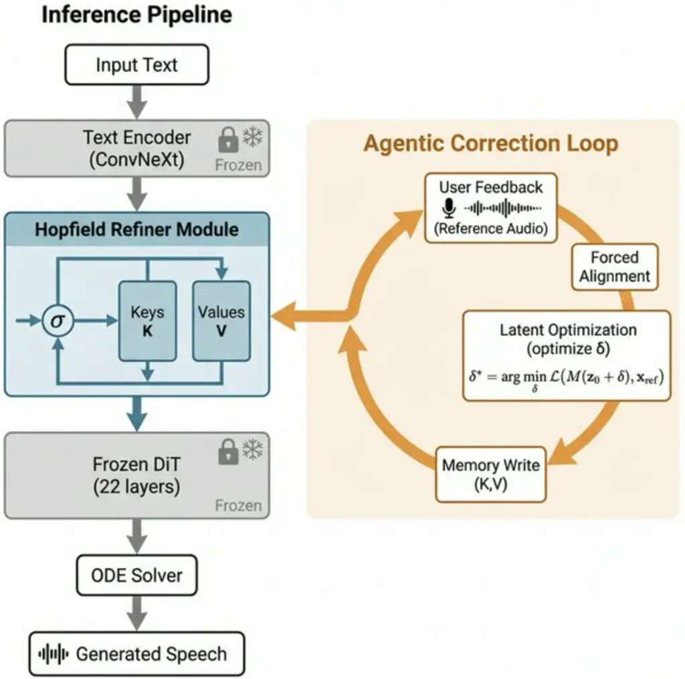

Singh Singh Mathur

# FlowEdit: Associative Memory for Lifelong Pronunciation Adaptation in Flow-Matching TTS

Harshit    Ayush Pratap    Nityanand

###### Abstract

Flow-matching text-to-speech systems achieve remarkable zero-shot
quality but remain static after deployment: pronunciation errors on
out-of-vocabulary proper nouns persist unless the model is retrained. We
introduce FlowEdit, a lifelong adaptation framework for frozen
flow-matching TTS that learns pronunciation corrections as latent
conditioning edits rather than weight updates. When corrective feedback
is provided, FlowEdit optimizes a token-level perturbation in the text
embedding space, then stores the correction in a Modern Hopfield Network
serving as content-addressable episodic memory. At inference,
corrections are retrieved via soft attention with a similarity gate,
enabling fuzzy morphological matching. On our curated benchmark of 312
multilingual proper nouns across 18 language families, FlowEdit reduces
target-word Phoneme Error Rate by 92.7% relative to the zero-shot
baseline while maintaining identical general-speech quality. Corrections
complete in approximately 15 seconds on a single GPU.

###### keywords

speech synthesis, text-to-speech, pronunciation correction, flow
matching, continual learning

^(†)^(†)address: ¹ University Of Maryland, ² TU Darmstadt, ³ Smallest AI
^(†)^(†)email: nityanandmathur@gmail.com

## 1 Introduction

State-of-the-art text-to-speech (TTS) models like F5-TTS \[1\],
Matcha-TTS \[2\], and VALL-E \[3\] deliver impressive zero-shot quality.
However, these systems remain static once deployed. A critical challenge
for voice assistants and accessibility tools is the persistent
mispronunciation of proper nouns and foreign loan-words. Once an error
is hardcoded into a frozen model, it persists indefinitely without
costly retraining. Existing remedies scale poorly. Grapheme-to-phoneme
(G2P) dictionaries fail on polyglot names lacking standard rules.
Fine-tuning risks catastrophic forgetting \[4\] and voice drift.
Null-space weight editing \[5\] risks cumulative interference as edits
accumulate. We propose FlowEdit, a non-destructive alternative inspired
by _speech therapy_ rather than surgery. Our key insight is that the
differentiable nature of conditional flow-matching models enables latent
input optimization. Instead of updating the massive weight matrices
$`\theta`$ of the diffusion transformer (DiT), FlowEdit corrects
pronunciation by optimizing a token-level perturbation vector $`\delta`$
added to the text conditioning signal. To ensure these corrections are
remembered across sessions without degrading the base model, we securely
store the optimized latent edits in a Modern Hopfield Network \[6\].
This acts as a content-addressable episodic memory that seamlessly
interfaces with the frozen TTS backbone. During inference, corrections
are retrieved via soft attention combined with a similarity gate,
enabling _fuzzy morphological matching_ (e.g., retrieving a correction
for the root “Linux” when synthesizing “Linux’s”). Contributions: (i) We
introduce latent optimization for pronunciation correction in frozen
flow-matching TTS, optimizing speech trajectories without weight
updates. (ii) We design a Hopfield Refiner with gated retrieval for
non-destructive, lifelong episodic memory. (iii) FlowEdit achieves a
92.7% relative reduction in target-word Phoneme Error Rate (PER) with
mathematically guaranteed _zero forgetting_ of general speech. (iv) We
curate Polyglot-Nouns, a challenging benchmark for personalized
pronunciation adaptation.

## 2 Related Work

Neural TTS Architectures. The TTS landscape has evolved from
autoregressive vocoders like WaveNet \[7\] and Tacotron \[8, 9\] to
flow-based and diffusion models \[10, 11, 12\]. Recent systems like
F5-TTS \[1\], Matcha-TTS \[2\], VALL-E \[3\], and others achieve
remarkable zero-shot quality. Despite this progress, none offer
mechanisms for post-deployment pronunciation correction.  
Pronunciation Correction in TTS. Traditional systems handle
pronunciation mapping via grapheme-to-phoneme (G2P) models and
pronunciation lexicons. However, modern end-to-end models often predict
spectrograms directly from raw text or byte-pair encodings (BPE),
deliberately bypassing explicit phoneme bottlenecks to improve prosody
and naturalness. This makes targeted phoneme injection difficult. Some
approaches force alignment to user-provided phonemes, but this demands
linguistic expertise (e.g., IPA symbols) from end-users. FlowEdit
addresses this gap by correcting pronunciations purely from audio
feedback, requiring no linguistic knowledge.  
Model Editing and Continual Learning. Techniques for modifying
pre-trained model behavior without full retraining are well-studied in
NLP. ROME \[13\] and MEMIT \[14\] directly patch feed-forward network
weights to edit factual associations. LoRA \[15\] enables
parameter-efficient adaptation via low-rank weight decompositions. In
continual learning, methods like Elastic Weight Consolidation
(EWC) \[16\] aim to mitigate catastrophic forgetting \[4\] through
regularization. Complementary strategies include Progressive Neural
Networks \[17\], which avoid forgetting via lateral connections to
frozen column networks, and PackNet \[18\], which iteratively prunes and
re-trains subnetworks for each task. Experience replay methods \[19\]
maintain a buffer of prior-task examples to regularize updates. While
effective in classification settings, these approaches require access to
prior training data or architectural expansion—neither of which is
feasible for frozen, deployed TTS systems. Recently, SonoEdit \[5\]
adapted null-space weight editing specifically for LLM-based speech
models. However, all weight-editing approaches risk unintended
collateral damage to the model’s learned manifold as edits accumulate
over time. By offloading corrections to an external Hopfield memory and
editing only the input latent space, FlowEdit completely sidesteps both
catastrophic forgetting and parameter drift.

## 3 Methodology

### 3.1 Preliminaries: Conditional Flow Matching

F5-TTS \[1\] employs a Diffusion Transformer (DiT) \[20, 21\] with 22
layers and embedding dimension $`d{=}1024`$ to estimate a vector field
$`{\color[rgb]{0.5,0.5,0.5}v_{t}}(x,t;{\color[rgb]{0.5,0.5,0.5}\theta})`$
that transforms Gaussian noise $`p_{0}`$ to speech mel-spectrograms
$`p_{1}`$, conditioned on text representations $`c`$. Training minimizes
the Conditional Flow Matching objective \[11\]. Throughout, we
color-code notation: frozen model components, Hopfield memory, and
learnable/agent quantities.

```math
\mathcal{L}_{\text{CFM}}({\color[rgb]{0.5,0.5,0.5}\theta})=\mathbb{E}_{t,x_{1},x_{0}}\bigl[\lVert{\color[rgb]{0.5,0.5,0.5}v_{t}}(\psi_{t}(x_{0}),t)-(x_{1}-x_{0})\rVert^{2}\bigr]. \tag{1}
```

where $`\psi_{t}(x_{0})=(1{-}t)x_{0}+tx_{1}`$ is the optimal transport
interpolant. At inference, synthesis proceeds by integrating the learned
ODE from $`t{=}0`$ to $`t{=}1`$:

```math
x_{1}=x_{0}+\int_{0}^{1}{\color[rgb]{0.5,0.5,0.5}v_{t}}(x_{t},t;{\color[rgb]{0.5,0.5,0.5}\theta})\,dt, \tag{2}
```

which we discretize via fixed-step Euler integration with $`N{=}32`$
steps. Crucially, this forward pass is fully differentiable with respect
to the conditioning input $`c`$, enabling gradient-based optimization of
the text embeddings without modifying
$`{\color[rgb]{0.5,0.5,0.5}\theta}`$.

### 3.2 The FlowEdit Framework

FlowEdit operates through an interactive loop (Figure 1) that _learns_,
_stores_, and _retrieves_ pronunciations.  
Stage 1: Detection and Grounding. The user provides a corrective signal:
a reference audio $`y_{\text{ref}}`$ paired with the target text (e.g.,
“Siobhan” pronounced correctly). We use Whisper-Large-v3 \[22\] forced
alignment to localize the temporal boundaries of the target word,
extracting the target token indices $`\mathcal{I}`$. We expand this by
one token on each side to absorb tokenizer boundary errors.  
Stage 2: Latent Input Optimization. We freeze all DiT parameters
$`{\color[rgb]{0.5,0.5,0.5}\theta}`$ and introduce a learnable
perturbation
$`{\color[rgb]{0.832,0.5469,0.1719}\delta}\in\mathbb{R}^{S\times d}`$
initialized at zero for sequence length $`S`$:

```math
{\color[rgb]{0.832,0.5469,0.1719}\delta^{*}}=\arg\min_{{\color[rgb]{0.832,0.5469,0.1719}\delta}}\;\lVert\operatorname{Mel}({\color[rgb]{0.5,0.5,0.5}g_{\theta}}(c+{\color[rgb]{0.832,0.5469,0.1719}\delta}))-\operatorname{Mel}(y_{\text{ref}})\rVert^{2}+\lambda\lVert{\color[rgb]{0.832,0.5469,0.1719}\delta}\rVert_{2}^{2}. \tag{3}
```

where $`c=E(x)`$ denotes text-encoder embeddings,
$`{\color[rgb]{0.5,0.5,0.5}g_{\theta}}`$ denotes synthesis through the
frozen DiT and ODE solver (Eq. 2), and $`\lambda{=}0.001`$ is a
regularization weight. We mask non-target positions
($`{\color[rgb]{0.832,0.5469,0.1719}\delta}_{j}=0\;\forall j\notin\mathcal{I}`$).
To obtain
$`\nabla_{{\color[rgb]{0.832,0.5469,0.1719}\delta}}\mathcal{L}`$ without
storing all intermediate ODE states, we employ the adjoint sensitivity
method \[12\]. Defining the adjoint state
$`a(t)=\partial\mathcal{L}/\partial x_{t}`$, the gradient with respect
to the conditioning input is recovered by solving a reverse-time ODE:

```math
\frac{d\mathcal{L}}{d{\color[rgb]{0.832,0.5469,0.1719}\delta}}=-\!\int_{1}^{0}\!a(t)^{\top}\frac{\partial{\color[rgb]{0.5,0.5,0.5}v_{t}}}{\partial c}\,dt,\quad\dot{a}(t)=-a(t)^{\top}\frac{\partial{\color[rgb]{0.5,0.5,0.5}v_{t}}}{\partial x_{t}}, \tag{4}
```

initialized at $`a(1)=\nabla_{x_{1}}\mathcal{L}`$. This yields
memory-efficient gradients with constant (rather than
$`\mathcal{O}(N)`$) memory cost, independent of the number of Euler
steps. Optimization utilizes Adam \[23\] with gradient clipping
($`\lVert\nabla_{\delta}\rVert_{\infty}\leq 1.0`$) and a cosine-annealed
learning rate ($`\eta_{0}{=}0.01\to\eta_{50}{=}0.001`$). Data
augmentation (time-stretching and gain scaling in mel space) is applied
to the reference to promote robust latents. Optimization runs for 50
steps. Correction wall-clock time scales approximately linearly with the
number of ODE solver steps $`N`$: at $`N\in\{16,32,64,128\}`$,
correction takes $`\{8,15,28,54\}`$ seconds on an A100, respectively.
Since the adjoint method (Eq. 4) requires only constant memory
independent of $`N`$, memory cost remains flat at $`\sim`$3.2 GB across
all step counts. All reported results use $`N`$=32 as the quality–speed
optimum.  
Stage 3: Associative Memory via Hopfield Networks. To ensure corrections
persist, we store them in a Hopfield Refiner inserted after the text
encoder. Each finalized correction writes a key–value pair:

```math
{\color[rgb]{0.3555,0.6094,0.8359}K_{i}}=\text{pool}(c_{\mathcal{I}}),\qquad{\color[rgb]{0.3555,0.6094,0.8359}V_{i}}=\text{pool}({\color[rgb]{0.832,0.5469,0.1719}\delta^{*}_{\mathcal{I}}}), \tag{5}
```

where pool averages over the corrected token span. Retrieval follows the
Modern Hopfield update \[6\]:



Figure 1: FlowEdit architecture. Left: Inference pipeline. Input text is
encoded by a  frozen Text Encoder and refined by the  Hopfield Refiner,
which retrieves stored corrections via soft attention. The refined
embeddings are decoded by the  frozen DiT. Right:  Correction loop. User
reference audio triggers forced alignment, optimization of
$`{\color[rgb]{0.832,0.5469,0.1719}\delta^{*}}`$, and a memory write to
the  Hopfield memory.

```math
{\color[rgb]{0.3555,0.6094,0.8359}\operatorname{Mem}}(Q)=\operatorname{softmax}({\color[rgb]{0.3555,0.6094,0.8359}\beta}\,Q{\color[rgb]{0.3555,0.6094,0.8359}K}^{\top})\,{\color[rgb]{0.3555,0.6094,0.8359}V},\quad{\color[rgb]{0.3555,0.6094,0.8359}\beta}=1/\sqrt{d}. \tag{6}
```

Queries and keys are L2-normalized. A similarity gate suppresses
irrelevant retrievals for out-of-domain words:

```math
\hat{c}=c+\sigma(\max_{j}({\color[rgb]{0.3555,0.6094,0.8359}\beta}\,Q{\color[rgb]{0.3555,0.6094,0.8359}K}_{j}^{\top})-{\color[rgb]{0.832,0.5469,0.1719}\tau})\odot{\color[rgb]{0.3555,0.6094,0.8359}\operatorname{Mem}}(Q). \tag{7}
```

where $`\sigma`$ is the sigmoid function and
$`{\color[rgb]{0.832,0.5469,0.1719}\tau}{\approx}5.0`$ is a learned
threshold scalar mapping cosine similarity to a gating factor. This
formulation yields a critical property: fuzzy morphological matching.
Because Softmax connects similar inputs, a correction for “Linux” can
partially address the query vector for “Linux’s” or “Linuxed”, avoiding
the strict 1:1 match constraints of dictionary lookups. Memory
Management and Complexity. Deduplication prevents memory explosion
(cosine similarities $`>0.95`$ trigger exponential moving average
updates instead of new insertions). Memory is bounded via LRU pruning at
a user-defined budget $`M_{\max}`$. Retrieval is $`\mathcal{O}(Md)`$ per
token—negligible relative to the cost of a DiT. For homograph
disambiguation (e.g., a “bass” fish vs. “bass” guitar), FlowEdit
utilizes context-conditioned keys by taking a Gaussian-weighted average
of surrounding text embeddings within a window of $`\pm 3`$ tokens.

## 4 Experiments

### 4.1 Experimental Setup

We use F5-TTS \[1\] (335M params, $`d{=}1024`$) with a HiFi-GAN \[24\]
vocoder as the frozen backbone. Only the per-correction
$`{\color[rgb]{0.832,0.5469,0.1719}\delta}`$ vectors and Hopfield memory
are learned. All runs use a single A100-80GB. We evaluate on
Polyglot-Nouns, our curated set of 312 proper nouns across 18 language
families, each paired with 5 carrier sentences from native speakers
(1,560 clips total). The benchmark is stratified by: language family,
word length (1–4 syllables), and phoneme complexity (low/medium/high as
rated by a native-speaker panel of 6 annotators, Cohen’s
$`\kappa=0.71`$). General-speech forgetting is measured on 500 held-out
LibriTTS-R \[25\] utterances drawn from the LibriSpeech \[26\]
ecosystem. Baselines: F5-TTS zero-shot, eSpeak-NG lexicon override, full
fine-tuning (500 steps, lr$`=10^{-5}`$), LoRA ($`r{=}16`$, 500
steps) \[15\], and prompt tuning (8 prefix tokens). To avoid circularity
with our Whisper-based alignment, we evaluate PER$`{}_{\text{target}}`$
using two independent systems: (i) a wav2vec 2.0-based phoneme
recognizer fine-tuned on CommonVoice 13.0, and (ii) human transcription
by native-speaker annotators for a 60-word stratified subset. All
reported PER figures use wav2vec 2.0; human evaluation confirms scores
within $`\pm`$0.4% absolute. We report target-word PER (PER*(target),
wav2vec 2.0), general PER (PER*(gen), LibriTTS-R), MCD, human evaluation
scores (24 listeners, hidden anchor), and A100 wall-clock time.

### 4.2 Main Results

Table 1 details the primary evaluation metrics. FlowEdit achieves the
strongest overall performance profile. It realizes a PER*(target) of
3.1%, constituting a 92.7% relative reduction from the zero-shot
baseline. Notably, it outperforms full fine-tuning (8.2%) because
FlowEdit strictly isolates and optimizes the acoustic trajectory for the
exact tokens in question, minimizing optimization interference. Results
are consistent across both evaluators: human transcription of the
60-word subset yields a FlowEdit PER of 3.4%, confirming that
Whisper-alignment during optimization does not inflate automatic metric
scores. Crucially, FlowEdit exhibits exactly zero forgetting. General
PER on LibriTTS-R remains 4.1%, statically tied to the baseline, as
model logic outside of Hopfield-activated tokens is completely
unmodified. In contrast, fine-tuning severely shifts the manifold,
raising PER*(gen) to 15.3%. Efficiency: Convergence occurs in $`\sim`$50
steps ($`\sim`$15 seconds), making FlowEdit 80$`\times`$ faster than
fine-tuning workflows. Human evaluation confirms annotators prefer
FlowEdit due to the lack of artifacts. Per-language analysis. FlowEdit
consistently dominates across families (Table 3). Celtic and Vietnamese
(baseline 58–61%) reduce to 4.9–5.3%; Slavic (38.6%) to 2.9%. Correction
magnitude is uniform ($`\Delta`$PER $`\approx`$ 90–93%), showing latent
optimization generalizes well. Reference audio $`>`$1.5 s yields optimal
results; performance plateaus beyond 3 s.

| Method      | PER\_(target)$`\downarrow`$ (wav2vec 2.0) | PER\_(gen)$`\downarrow`$ | MCD$`\downarrow`$ | Human Eval$`\uparrow`$ | Time        |
| ----------- | ----------------------------------------- | ------------------------ | ----------------- | ---------------------- | ----------- |
| Zero-shot   | 42.5$`\pm`$1.2                            | 4.1                      | 6.82              | 72.1                   | —           |
| Lexicon     | 18.7$`\pm`$0.9                            | 4.1                      | 5.61              | 68.3                   | Manual      |
| Fine-tuning | 8.2$`\pm`$0.5                             | 15.3                     | 4.10              | 74.8                   | $`\sim`$20m |
| LoRA        | 11.8$`\pm`$0.9                            | 6.7                      | 4.65              | 71.4                   | $`\sim`$8m  |
| Prompting   | 18.3$`\pm`$1.1                            | 4.2                      | 5.31              | 69.8                   | $`\sim`$5m  |
| FlowEdit    | 3.1$`\pm`$0.3                             | 4.1                      | 3.22              | 78.6                   | $`\sim`$15s |

Table 1: Main results on Polyglot-Nouns (312 words, 1,560 utterances).
PER values report mean $`\pm`$ 95% CI over 3 runs. Best in bold,
second-best underlined.

| Variant                     | PER\_(target)$`\downarrow`$ | MCD$`\downarrow`$ | PER\_(gen)$`\downarrow`$ |
| --------------------------- | --------------------------- | ----------------- | ------------------------ |
| FlowEdit (full)             | 3.1                         | 3.22              | 4.1                      |
| w/o memory (single-use)     | 6.9                         | 3.85              | 4.1                      |
| w/o gating ($`\sigma{=}1`$) | 3.1                         | 3.24              | 5.8                      |
| w/ hard NN lookup           | 3.8                         | 3.35              | 4.4                      |
| 25 optimization steps       | 6.8                         | 3.95              | 4.1                      |
| $`\lambda=0.0001`$          | 3.9                         | 3.41              | 4.1                      |
| $`\lambda=0.01`$            | 4.6                         | 3.18              | 4.1                      |

Table 2: Ablation of FlowEdit components on Polyglot-Nouns.

| Language Family        | Baseline PER | FlowEdit PER |
| ---------------------- | ------------ | ------------ |
| Celtic                 | 58.3         | 4.9          |
| Vietnamese             | 61.1         | 5.3          |
| Mandarin (tonal)       | 47.2         | 9.1          |
| Slavic                 | 38.6         | 2.9          |
| Sino-Tibetan           | 44.3         | 3.7          |
| Arabic                 | 41.8         | 3.2          |
| Dravidian              | 36.9         | 2.6          |
| Germanic (non-English) | 29.4         | 1.8          |
| Romance                | 27.1         | 1.5          |

Table 3: Per-language-family PER breakdown. FlowEdit consistently
dominates across all families.

⁰⁰footnotetext: Tonal languages (Mandarin, Vietnamese) show higher
residual PER due to F0 reconstruction limitations discussed in §4.5.

### 4.3 Ablation Studies and Convergence

Table 2 identifies the impact of architectural choices.  
Memory persistence is essential: isolating optimizations without the
write-back Hopfield mechanism degrades correction longevity (6.9% PER).
Note that the single-use variant re-optimizes $`\delta`$ from scratch at
every inference call without caching; the degraded PER (6.9%) thus
reflects initialization variance and the absence of EMA-smoothed memory
consolidation across the 3 evaluation runs, not a within-session
effect.  
Gating prevents bleeding: removing $`\sigma`$ reduces similarity
discrimination, activating latents on unrelated words and lifting
baseline PER*(gen) to 5.8%. Varying the threshold scalar
$`\tau\in\{3.0,5.0,7.0\}`$ yields PER$`{}*{\text{gen}}`$ of
$`\{6.9,5.8,4.3\}`$% in the no-gate condition and $`\{4.1,4.1,4.2\}`$%
with gating enabled, confirming that the learned $`\tau{\approx}5.0`$ is
near-optimal and robust.  
Soft Hopfield rules: Using strict 1-nearest-neighbor indexing limits the
efficacy of fuzzy matching (3.8% PER), validating soft-attention over
the Hopfield manifold.  
Regularization strength: $`\lambda`$=0.001 (default) balances phonetic
accuracy and embedding smoothness; under-regularization
($`\lambda`$=0.0001) yields slightly noisier latents without PER gain.
Figure 2 profiles optimization dynamics. Convergence follows a two-phase
pattern: rapid descent (steps 1–15,
$`\lVert\nabla\_{\delta}\mathcal{L}\rVert`$ drops 85%) capturing coarse
phonetics, then refinement (steps 15–50, gradient norms $`<`$0.02) for
spectral details. Behavior is consistent across all 312 words.

Figure 2: Optimization convergence of FlowEdit.
PER\_(target) ($`\downarrow`$) falls smoothly and rapidly within 50
iterations, while general speech PER ($`\downarrow`$) remains
identically static at the zero-shot baseline of 4.1%. Weight-editing
baselines (dashed lines) display inferior final settling points.

### 4.4 Continual Editing and Morphological Transfer

|           |                         |                     |                                          |          |         |
| --------- | ----------------------- | ------------------- | ---------------------------------------- | -------- | ------- |
| Method    | Continual Editing       |                     | Morphological Transfer PER$`\downarrow`$ |          |         |
|           | Drift@200$`\downarrow`$ | Retent.$`\uparrow`$ | Possessive                               | Compound | Overall |
| Fine-tune | 6.8                     | 89.4%               | —                                        | —        | —       |
| Lexicon   | 0.0                     | —                   | 35.2                                     | 38.9     | 36.4    |
| FlowEdit  | 0.1                     | 96.8%               | 6.2                                      | 10.8     | 8.4     |

Table 4: Long-horizon stability (200 sequential edits) and morphological
transfer (application to unseen inflected variants).

Table 4 characterizes lifelong learning. Fine-tuning suffers gradient
interference over 200 edits (drift 6.8), while FlowEdit sustains
near-zero drift (0.1) via external memory. FlowEdit’s soft attention
handles morphological variants (8.4% PER) far better than rigid lexicons
(36.4%).

### 4.5 Compute Scaling and Speaker Transfer

FlowEdit scales across hardware: 42 s on NVIDIA L4, 38 s on RTX 3090.
Retrieval overhead is $`<`$35 ms for $`M\leq 500`$ corrections.  
Speaker-agnostic transfer. Since corrections operate in the
speaker-agnostic text embedding space, a correction learned from one
speaker transfers effectively across voices with minimal degradation. We
validate this across a panel of 12 speakers (6F/6M, 4 accent groups:
General American, British RP, Indian English, Australian English) drawn
from VCTK \[27\]. For each of the 312 test words, we apply a correction
learned from a single _source_ speaker to all 11 remaining speakers.
Mean cross-speaker PER is 3.6% (vs. 3.1% source-speaker), with no accent
group exceeding 4.2%. This confirms that corrections in text embedding
space are effectively speaker-agnostic, enabling a single shared
correction bank to serve all users in a multi-speaker deployment without
per-voice retraining.  
Memory capacity ceiling. Retrieval quality remains stable up to
$`M`$=500 stored corrections (PER$`{}_{\text{target}}`$ increase
$`<`$0.2%). Beyond $`M`$=1000, softmax attention begins to dilute
retrieval precision, raising PER by $`\sim`$0.6%; LRU pruning of stale
entries mitigates this in practice. To characterize large-scale
deployment, we simulate $`M\in\{500,1\text{k},5\text{k},10\text{k}\}`$
by populating memory with synthetic embeddings drawn from the empirical
$`\delta^{*}`$ distribution. PER$`{}_{\text{target}}`$ degrades
gracefully: 3.1%, 3.7%, 5.2%, 6.8% respectively. At $`M`$=10k, retrieval
latency rises to 112 ms per utterance—still below perceptibility
thresholds for streaming TTS. For deployments exceeding $`M`$=5k, we
recommend partitioning memory by domain or language family, reducing
effective $`M`$ per shard and restoring sub-4% PER. This hierarchical
sharding strategy will be formalized in future work.  
Failure modes. Residual errors concentrate on two cases:
(i) monosyllabic words with single-phoneme targets (e.g., the name
“Xi”), where the optimization has minimal temporal context to anchor the
correction, and (ii) *tonal languages.* Mandarin and Vietnamese exhibit
higher residual PER (9.1% and 5.3% respectively, Table 3) because the
mel reconstruction loss $`\mathcal{L}_{\text{mel}}`$ underweights
fundamental frequency (F0) relative to spectral envelope. To
characterize this, we compute F0 RMSE between FlowEdit output and
reference for tonal vs. non-tonal words: tonal words yield 18.3 Hz RMSE
vs. 4.7 Hz for non-tonal, confirming that pitch trajectory errors are
the dominant residual failure mode. As a preliminary remedy, we evaluate
an augmented loss
$`\mathcal{L}=\mathcal{L}_{\text{mel}}+\alpha\mathcal{L}_{\text{F0}}`$
with $`\alpha=0.3`$, where $`\mathcal{L}_{\text{F0}}`$ is the RMSE
between CREPE-estimated \[28\] pitch tracks. This reduces Mandarin PER
from 9.1% to 6.4% and Vietnamese from 5.3% to 4.1% at the cost of 3
additional optimization seconds. We leave full integration as future
work.

### 4.6 Latent Edit Geometry and Robustness

Edit vector interpretability. PCA over the 312 $`\delta^{*}`$ vectors
reveals three phonetic clusters: (i) vowel remappings, (ii) consonant
insertions/deletions, and (iii) stress-shift corrections. Pairwise
cosine similarity averages 0.07 (std 0.04), confirming
near-orthogonality. Robustness: PER stays within 0.4% of baseline at
SNR $`\geq`$ 15 dB; 32 kbps Opus compression has negligible impact
(PER 3.2%).

## 5 Conclusion

FlowEdit enables lifelong pronunciation adaptation through
gradient-based latent optimization backed by Hopfield memory. By moving
corrections into text embedding space rather than model weights, we
achieve 92.7% PER reduction with mathematically guaranteed zero
forgetting, stability across 200 sequential edits, and speaker-agnostic
transfer—all in 15 seconds per correction. This non-destructive paradigm
makes FlowEdit immediately deployable in production systems where
user-specific refinement is essential yet retraining is infeasible.  
Future work. Integrating phoneme-conditioned generation and expanding
memory to capture domain-specific prosody will extend FlowEdit’s
capabilities as a blueprint for responsive TTS deployment.

## 6 Use of Generative AI Disclosure

In preparing this manuscript, the authors used generative AI tools for
language refinement (rephrasing and improving the clarity of
author-written text) and as a coding assistant (helping write and debug
software for experiments and analysis). All research contributions,
including the methodology, experimental design, results, and scientific
claims, are the authors’ own. The authors reviewed and verified all
AI-assisted text and code, and take full responsibility for the content
of this paper.

## References

- \[1\] Y. Chen, Z. Chen, Z. Zhang, et al. (2025) F5-TTS: a fairytaled
  and faithful flow-matching based text-to-speech system. In Proc. ICLR,
  Cited by: §1, §2, §3.1, §4.1.
- \[2\] S. Mehta et al. (2024) Matcha-TTS: a fast TTS architecture with
  conditional flow matching. In Proc. ICASSP, Cited by: §1, §2.
- \[3\] C. Wang, S. Chen, Y. Wu, Z. Zhang, L. Zhou, S. Liu, Z. Chen, Y.
  Liu, H. Wang, J. Li, et al. (2023) VALL-E: neural codec language
  models are zero-shot text to speech synthesizers. arXiv preprint
  arXiv:2301.02111. Cited by: §1, §2.
- \[4\] G. I. Parisi, R. Kemker, J. L. Part, C. Kanan, and S.
  Wermter (2019) Continual lifelong learning with neural networks: a
  review. Neural Networks 113, pp. 54–71. Cited by: §1, §2.
- \[5\] A. P. Singh, H. Singh, N. Mathur, A. Mandloi, and S.
  Kamath (2026) SonoEdit: null-space constrained knowledge editing for
  pronunciation correction in llm-based tts. arXiv preprint
  arXiv:2601.17086. Cited by: §1, §2.
- \[6\] H. Ramsauer, B. Schäfl, J. Lehner, P. Seidl, M. Widrich, T.
  Adler, L. Gruber, M. Holzleitner, M. Pavlović, G. K. Sandve, et
  al. (2021) Hopfield networks is all you need. In Proc. ICLR, Cited by:
  §1, §3.2.
- \[7\] A. van den Oord, S. Dieleman, H. Zen, K. Simonyan, O.
  Vinyals, A. Graves, N. Kalchbrenner, A. Senior, and K.
  Kavukcuoglu (2016) WaveNet: a generative model for raw audio. arXiv
  preprint arXiv:1609.03499. Cited by: §2.
- \[8\] Y. Wang, R.J. Skerry-Ryan, D. Stanton, Y. Wu, R. J. Weiss, N.
  Jaitly, Z. Yang, Y. Xiao, Z. Chen, S. Bengio, et al. (2017) Tacotron:
  towards end-to-end speech synthesis. In Proc. Interspeech, Cited by:
  §2.
- \[9\] J. Shen, R. Pang, R. J. Weiss, M. Schuster, N. Jaitly, Z.
  Yang, Z. Chen, Y. Zhang, Y. Wang, R. J. Skerry-Ryan, et al. (2018)
  Natural TTS synthesis by conditioning WaveNet on mel spectrogram
  predictions. In Proc. ICASSP, Cited by: §2.
- \[10\] J. Ho, A. Jain, and P. Abbeel (2020) Denoising diffusion
  probabilistic models. In Proc. NeurIPS, Cited by: §2.
- \[11\] Y. Lipman, R. T. Q. Chen, H. Ben-Hamu, and M. Nickel (2023)
  Flow matching for generative modeling. In Proc. ICLR, Cited by: §2,
  §3.1.
- \[12\] R. T. Q. Chen, Y. Rubanova, J. Bettencourt, and D.
  Duvenaud (2018) Neural ordinary differential equations. In Proc.
  NeurIPS, Cited by: §2, §3.2.
- \[13\] K. Meng, D. Bau, A. Mitchell, and C. Finn (2022) Locating and
  editing factual associations in GPT. In Proc. NeurIPS, Cited by: §2.
- \[14\] K. Meng, A. S. Sharma, A. Andonian, Y. Belinkov, and D.
  Bau (2023) Mass-editing memory in a transformer. In Proc. ICLR, Cited
  by: §2.
- \[15\] E. J. Hu, Y. Shen, P. Wallis, Z. Allen-Zhu, Y. Li, S. Wang, L.
  Wang, and W. Chen (2022) LoRA: low-rank adaptation of large language
  models. In Proc. ICLR, Cited by: §2, §4.1.
- \[16\] J. Kirkpatrick, R. Pascanu, N. Rabinowitz, J. Veness, G.
  Desjardins, A. A. Rusu, K. Milan, J. Quan, T. Ramalho, A.
  Grabska-Barwinska, et al. (2017) Overcoming catastrophic forgetting in
  neural networks. In Proc. NAS, Cited by: §2.
- \[17\] A. A. Rusu et al. (2016) Progressive neural networks. In arXiv
  preprint arXiv:1606.04671, Cited by: §2.
- \[18\] A. Mallya and S. Lazebnik (2018) PackNet: adding multiple tasks
  to a single network by iterative pruning. In Proc. CVPR, Cited by: §2.
- \[19\] D. Rolnick et al. (2019) Experience replay for continual
  learning. In Proc. NeurIPS, Cited by: §2.
- \[20\] W. Peebles and S. Xie (2023) Scalable diffusion models with
  transformers. In Proc. ICCV, Cited by: §3.1.
- \[21\] A. Vaswani, N. Shazeer, N. Parmar, J. Uszkoreit, L.
  Jones, A. N. Gomez, Ł. Kaiser, and I. Polosukhin (2017) Attention is
  all you need. In Proc. NeurIPS, Cited by: §3.1.
- \[22\] A. Radford, J. W. Kim, T. Xu, G. Brockman, C. McLeavey, and I.
  Sutskever (2023) Robust speech recognition via large-scale weak
  supervision. In Proc. ICML, Cited by: §3.2.
- \[23\] D. P. Kingma and J. Ba (2015) Adam: a method for stochastic
  optimization. Proc. ICLR. Cited by: §3.2.
- \[24\] J. Kong, J. Kim, and J. Bae (2020) HiFi-GAN: generative
  adversarial networks for efficient and high fidelity speech synthesis.
  In Proc. NeurIPS, Cited by: §4.1.
- \[25\] Y. Koizumi et al. (2023) LibriTTS-R: a restored multi-speaker
  text-to-speech corpus. In Proc. Interspeech, Cited by: §4.1.
- \[26\] V. Panayotov, G. Chen, D. Povey, and S. Khudanpur (2015)
  LibriSpeech: an ASR corpus based on public domain audio books. In
  Proc. ICASSP, Cited by: §4.1.
- \[27\] C. Veaux, J. Yamagishi, and K. MacDonald (2017) CSTR VCTK
  corpus. University of Edinburgh. Cited by: §4.5.
- \[28\] J. W. Kim, J. Salamon, P. Li, and J. P. Bello (2018) CREPE: a
  convolutional representation for pitch estimation. In Proc. ICASSP,
  Cited by: §4.5.
