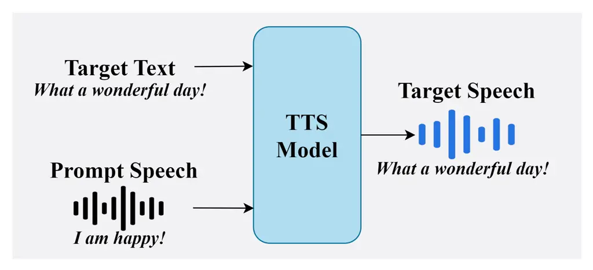
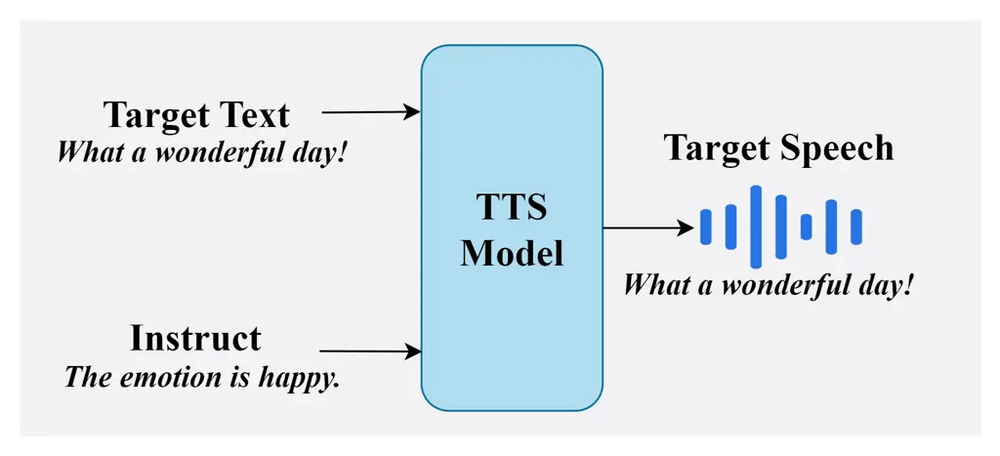
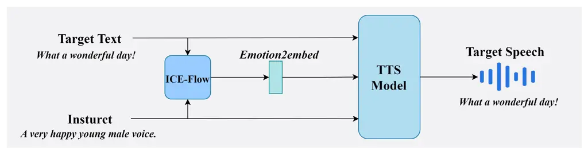
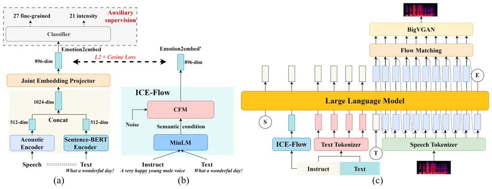
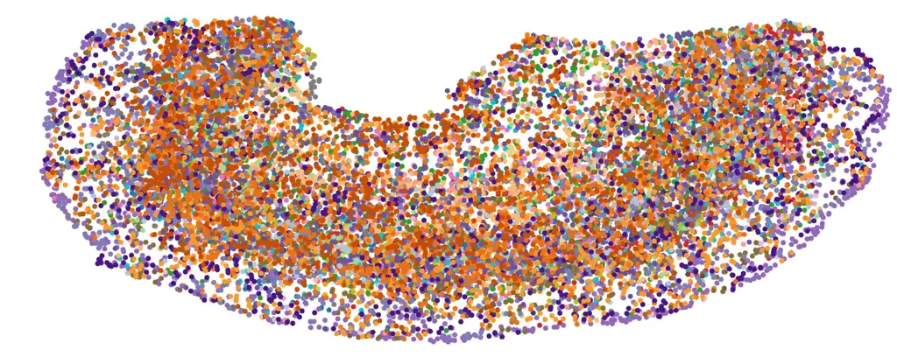
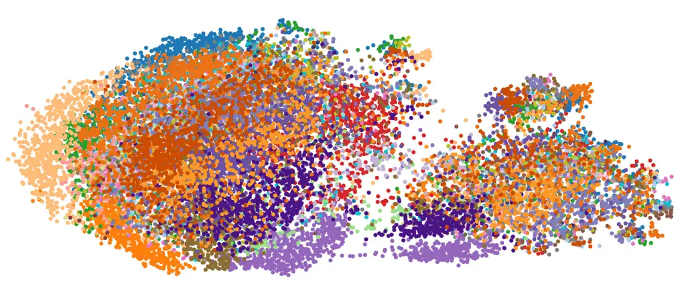
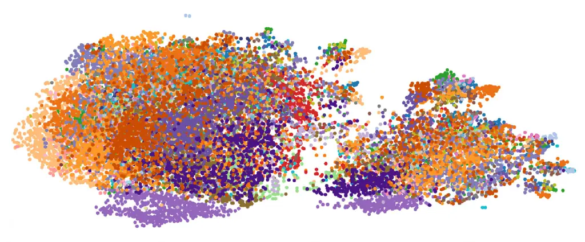
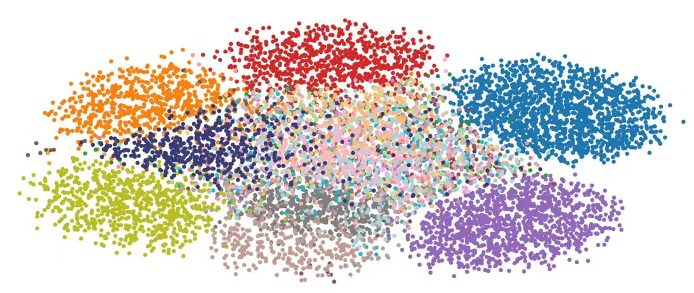
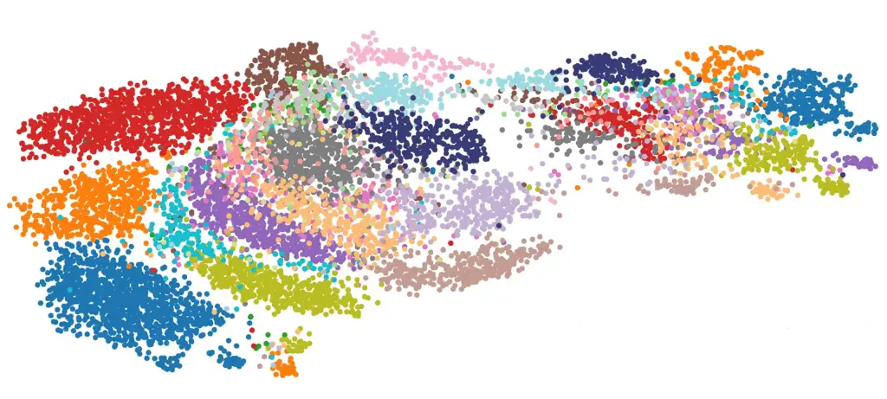
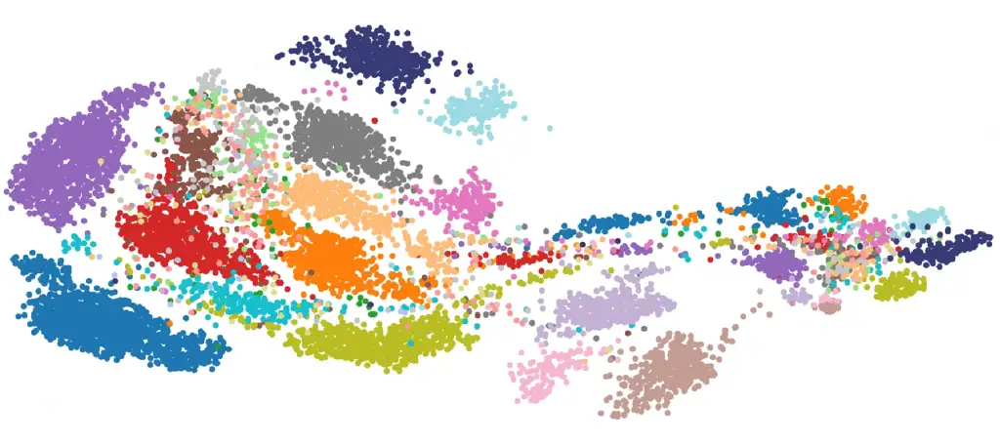

Wu Liu Fang Meng Wu Xu Cai Chen Du

# EmoInstruct-TTS: Dual-Path Instruction-Guided Emotional Speech Synthesis

Minghui    Ganjun    Zikun    Ting    Hongchuan    Bingao    Yonglong   
Jiasheng    Jun

###### Abstract

^(†)^(†) \* Indicates corresponding authors.

Instruction-based controllable speech synthesis enables users to specify
emotions through natural language. However, existing approaches often
rely on coarse emotion labels and lack explicit modeling of fine-grained
intensity. We propose EmoInstruct-TTS, a dual-path instruction-guided
framework for emotional speech synthesis. We introduce Emotion2embed, a
supervised semantic-acoustic emotion embedding covering 48 emotional
states, including fine-grained categories and intensity levels. To infer
embeddings from free-form instructions, we design an
Instruction-Conditioned Emotion Flow Model (ICE-Flow) that generates
acoustically grounded emotion representations. The inferred embeddings
are integrated into an LLM-based synthesis pipeline to provide explicit
emotional control while preserving semantic planning. Experiments show
improved emotional controllability and speech naturalness over strong
baselines.¹¹footnotetext: Audio demos are available at
https://huanyu-lab.github.io/EMOINSTRUCT-TTS

###### keywords

Emotional Speech Synthesis, Dual-Path Control, Instruction-Guided TTS,
Emotion2embed, Flow-Based Modeling

^(†)^(†)address: ¹ University of Science and Technology of China,
China  
² iFLYTEK Research, China  
³ Huawei Technologies Co., Ltd., China ^(†)^(†)email: mhwu@iflytek.com,
gjliu4@iflytek.com, fangzk23@mail.ustc.edu.cn, tingmeng@iflytek.com,
hcwu4@iflytek.com, baxu@iflytek.com, ylcai9@iflytek.com,
chenjiasheng@huawei.com, jundu@ustc.edu.cn

## 1 Introduction

Recent advances in neural text-to-speech (TTS) models have achieved
speech naturalness and intelligibility approaching human perception \[1,
2, 3, 4, 5, 6\]. As TTS technology matures, research has increasingly
shifted from neutral speech generation to controllable synthesis, where
users specify attributes such as emotion, style, and prosody through
explicit control signals \[7, 8, 9, 10, 11\]. Among these attributes,
emotional expressiveness plays a key role in enhancing engagement and
personalization in applications such as virtual assistants, audiobooks,
and conversational agents \[12, 13, 14, 15\].



(a) Prompt speech-driven



(b) Text instruction-driven



(c) Proposed framework

Figure 1: Comparison between previous and proposed emotional speech
synthesis frameworks.



Figure 2: The dual-path instruction-guided synthesis pipeline of
EmoInstruct-TTS. (a) Training process for acquiring the Emotion2embed
representation. (b) Generation of Emotion2embed via the ICE-Flow model.
(c) Overview of the EmoInstruct-TTS synthesis system.

Existing emotional TTS approaches mainly follow two paradigms. The first
conditions synthesis on reference emotional speech or latent style
embeddings extracted from emotional recordings \[16, 17, 18, 19, 20\]
(Fig. 1(a)). While effective, these methods typically require curated
reference data and often suffer from speaker dependency and timbre
mismatch.

The second paradigm focuses on instruction-driven controllability, where
natural language descriptions guide speech generation through large
language models or instruction prompts \[13, 21, 22, 23, 24, 25\]
(Fig. 1(b)). Although flexible, existing instruction-based systems
usually rely on coarse emotion categories and lack explicit mechanisms
to model fine-grained emotional variation and intensity, resulting in
unstable emotional control \[26, 27\]. Recent studies further suggest
that linguistic instructions alone are often insufficient to capture
detailed acoustic correlates of emotion \[28\].

To address these challenges, we propose EmoInstruct-TTS, a dual-path
instruction-guided framework for controllable emotional speech
synthesis. The key idea is to combine natural language instructions for
semantic guidance with structured emotion embeddings for fine-grained
emotional modulation.

Specifically, we introduce Emotion2embed, a semantic–acoustic emotion
representation covering 48 emotional states, including 27 fine-grained
emotion categories and 21 emotion–intensity combinations derived from
seven primary emotions with three intensity levels. To infer emotion
embeddings from free-form instructions, we further propose an
Instruction-Conditioned Emotion Flow Model (ICE-Flow) that generates
instruction-conditioned emotion embeddings from natural language
descriptions.

The inferred emotion embeddings are integrated into an LLM-based
synthesis pipeline together with instruction text, enabling
complementary roles of semantic planning and explicit emotional control
(Fig. 1(c)).

Experimental results show that EmoInstruct-TTS improves emotional
controllability and speech naturalness over strong emotional and
instruction-driven TTS baselines, particularly in modeling fine-grained
emotion intensity variations.

The main contributions of this work are threefold:

- •
  We propose Emotion2embed, a structured semantic–acoustic emotion
  representation for modeling fine-grained emotion categories and
  intensity variations.
- •
  We introduce ICE-Flow, an instruction-conditioned model that generates
  acoustically grounded emotion embeddings from natural language
  instructions.
- •
  We present a dual-path instruction-guided TTS framework that combines
  semantic instruction processing with explicit emotion embeddings for
  controllable emotional speech synthesis.

## 2 Method

EmoInstruct-TTS is a disentangled framework for instruction-guided
emotional speech synthesis. As shown in Fig. 2, it consists of three
components: an instruction-conditioned emotion generator, an LLM-based
semantic encoder, and a speaker-conditioned TTS decoder followed by a
neural vocoder. The framework separates semantic planning from
emotion-specific acoustic control.

### 2.1 Instruction-Conditioned Emotion Generator

#### 2.1.1 Emotion2embed: Structured Semantic–Acoustic Emotion Representation

We introduce Emotion2embed, a semantic-acoustic embedding for
fine-grained emotional modeling that encodes both emotion category and
ordered intensity structure while remaining speaker-invariant.

Semantic-acoustic encoding. Given emotional speech $`x`$ and its paired
text description $`t`$, we extract complementary semantic and acoustic
features using a Sentence-BERT encoder (bge-large-zh v1.5) \[29\] and an
ECAPA-TDNN encoder \[30\], respectively. The two features are
concatenated and projected into a unified embedding space:

```math
\mathbf{z}_{\text{emo}}=W[f_{\text{text}}(t);f_{\text{acoustic}}(x)]+b, \tag{1}
```

where $`\mathbf{z}_{\text{emo}}\in\mathbb{R}^{896}`$ in our
implementation.

Supervised emotion and intensity structuring Emotion2embed is trained
using a multi-task objective combining emotion classification, intensity
classification, and an ordinal intensity constraint:

```math
\mathcal{L}_{\text{emo}}=\mathcal{L}_{\text{cls}}^{\text{emo}}+\lambda\mathcal{L}_{\text{cls}}^{\text{int}}+\beta\mathcal{L}_{\text{ord}}. \tag{2}
```

Ordinal intensity geometry To enforce intensity ordering, embeddings are
$`\ell_{2}`$-normalized and associated with a learnable direction vector
$`\mathbf{u}_{e}`$. A margin-based ranking loss enforces monotonic
ordering of low, medium, and high intensity levels:

```math
\mathcal{L}_{\text{ord}}=\max(0,m-(s_{\text{mid}}-s_{\text{low}}))+\max(0,m-(s_{\text{high}}-s_{\text{mid}})). \tag{3}
```

#### 2.1.2 Instruction-to-Emotion2embed Mapping via ICE-Flow

We propose _ICE-Flow_ to generate emotion embeddings from natural
language instructions, mapping instruction semantics to Emotion2embed
representations under acoustic supervision.

Given an instruction text $`t`$, a multilingual MiniLM encoder encodes
semantic features $`\mathbf{h}_{\text{text}}`$ \[31\]. ICE-Flow models a
conditional distribution over emotion embeddings:

```math
p(\mathbf{z}_{\text{emo}}\mid\mathbf{h}_{\text{text}}). \tag{4}
```

where $`\mathbf{z}_{\text{emo}}`$ denotes the target Emotion2embed
representation.

Sample-level acoustic grounding During training, ICE-Flow is supervised
using sample-level Emotion2embed targets extracted from real emotional
speech:

```math
\mathbf{z}_{\text{emo}}=f_{\text{Emotion2embed}}(x,t). \tag{5}
```

The model is optimized via a regression objective:

```math
\mathcal{L}_{\text{sample}}=\mathbb{E}_{(t,x)}\bigl\lVert f_{\text{ICE}}(\mathbf{h}_{\text{text}}(t))-\mathbf{z}_{\text{emo}}(x)\bigr\rVert_{2}^{2}, \tag{6}
```

ensuring that instruction-generated embeddings reflect variability
induced by real acoustic realizations.

Distribution-level regularization To discourage mode collapse and
preserve realistic variation, we further align the covariance of sampled
embeddings with that of real emotion embeddings sharing the same
emotion–intensity label:

```math
\mathcal{L}_{\text{dist}}=\bigl\lVert\text{Cov}(\hat{\mathbf{z}}_{\text{emo}})-\text{Cov}(\mathbf{z}_{\text{emo}}^{\text{real}})\bigr\rVert_{F}. \tag{7}
```

The final objective is

```math
\mathcal{L}_{\text{ICE}}=\mathcal{L}_{\text{sample}}+\gamma\mathcal{L}_{\text{dist}}. \tag{8}
```

At inference, ICE-Flow generates emotion embeddings conditioned solely
on instruction semantics. Classifier-free guidance is applied to control
the strength of instruction adherence.

### 2.2 Dual-Path Instruction-Guided Speech Synthesis

We adopt a dual-path design that separates semantic modeling from
emotion-specific acoustic control. Instruction information is decomposed
into two components: (i) semantic guidance for linguistic realization
and (ii) explicit emotion embeddings for acoustic modulation.

Instruction-to-Emotion2embed Path. This path generates emotion control
signals from natural language instructions. The instruction is encoded
by a MiniLM encoder and mapped to an emotion embedding via ICE-Flow:

```math
\mathbf{E}_{\text{emo}}=f_{\text{ICE-Flow}}(f_{\text{MiniLM}}(\text{instruction})), \tag{9}
```

where $`\mathbf{E}_{\text{emo}}\in\mathbb{R}^{d}`$ denotes the generated
Emotion2embed.

Instruction-to-LLM Path. A LLM processes the instruction and target text
to generate semantic tokens representing linguistic content and
contextual intent:

```math
\mathbf{S}=f_{\text{LLM}}(\text{instruction},\text{text},\mathbf{E}_{\text{emo}}), \tag{10}
```

where $`\mathbf{S}`$ denotes the semantic token sequence produced by the
LLM.

Speech Generation. Semantic tokens $`\mathbf{S}`$, emotion embedding
$`\mathbf{E}_{\text{emo}}`$, and speaker embedding
$`\mathbf{E}_{\text{spk}}`$ are jointly conditioned to generate a
mel-spectrogram:

```math
\mathbf{M}=f_{\text{CFM\_TTS}}(\mathbf{S},\mathbf{E}_{\text{emo}},\mathbf{E}_{\text{spk}}), \tag{11}
```

where $`\mathbf{M}`$ denotes the synthesized mel-spectrogram. A
high-fidelity neural vocoder (BigVGAN) then converts $`\mathbf{M}`$ into
the output waveform:

```math
\hat{\mathbf{x}}=f_{\text{BigVGAN}}(\mathbf{M}). \tag{12}
```



(a) Emotion2vec: 27 emotions



(b) Emotion2embed: 27 emotions



(c) ICE-Flow Emotion2embed: 27 emotions



(d) Emotion2vec: 21 intensity levels



(e) Emotion2embed: 21 intensity levels



(f) ICE-Flow Emotion2embed: 21 intensity levels

Figure 3: The representation performance of emoition2vec,
emoition2embed, and ICE-Flow emoition2embed.

## 3 Experiments

### 3.1 Datasets and Training Setup

We use the Emotional Speech Dataset (ESD) \[32\] and the Chinese Natural
Complex Emotion Dataset (CNCED) \[33\]. The training data consist of two
subsets constructed through a semi-automatic annotation pipeline.

Dataset-Base contains 49,903 utterances with automatically generated
emotion captions produced by Gemini-2.5 Pro \[34\] using speech audio
and dataset metadata (e.g., gender, age, emotion). These captions
provide weak semantic supervision for large-scale pretraining.

Dataset-Annotation includes 28,402 utterances with manually verified
emotion labels. High-expressiveness samples are selected from the base
corpus and annotated with fine-grained emotion categories and intensity
levels. The final label set covers 27 emotion categories and three
intensity levels (low, medium, high) for seven primary emotions,
resulting in 21 emotion–intensity combinations. A total of 7,600
utterances are reserved for evaluation.

ICE-Flow is trained on Dataset-Base for 100 epochs (batch size 2048)
using Adam with cosine annealing (initial learning rate
$`1\times 10^{-4}`$) and then fine-tuned on Dataset-Annotation. The LLM
backbone (Qwen2.5-0.5B) is adapted with LoRA (rank 32, 9.87M parameters)
conditioned on instruction text, content text, and Emotion2embed.
Acoustic features are generated using CFM and synthesized with a BigVGAN
vocoder \[35\]. Speaker embeddings and reference speech preserve speaker
identity. CosyVoice2 and CosyVoice3 are used as baselines.

### 3.2 Emotion Representation Analysis

Figure 3 compares embeddings produced by Emotion2vec \[36\],
Emotion2embed, and ICE-Flow-generated Emotion2embed across 27 emotion
categories and 21 emotion–intensity levels.

t-SNE visualization. Emotion2vec (Fig. 3(a,d)) exhibits strong category
overlap and weak intensity organization. Emotion2embed (Fig. 3(b,e))
forms more compact clusters with consistent intensity trends within each
primary emotion. ICE-Flow-generated embeddings (Fig. 3(c,f)) show
similar structures with smoother category boundaries while preserving
intensity ordering.

Distribution consistency. Table 1 evaluates whether generated embeddings
collapse to class prototypes or capture realistic variability. Compared
variants include ICE-Mean, ICE-Sample, and ICE-Sample+Dist. Prototype
regression in ICE-Mean (PCS=0.89, VR=0.65) is reduced by sample-level
supervision (PCS=0.73, VR=0.88) and further improved with distribution
regularization (PCS=0.67, VR=0.96, SWD=0.22). Intensity ordering
accuracy also increases from 0.78 to 0.91.

|                 |                    |                  |                    |                  |
| --------------- | ------------------ | ---------------- | ------------------ | ---------------- |
| Variant         | PCS $`\downarrow`$ | VR $`\approx 1`$ | SWD $`\downarrow`$ | IOA $`\uparrow`$ |
| ICE-Mean        | 0.89               | 0.65             | 0.58               | 0.78             |
| ICE-Sample      | 0.73               | 0.88             | 0.35               | 0.86             |
| ICE-Sample+Dist | 0.67               | 0.96             | 0.22               | 0.91             |

Table 1: Distributional consistency of instruction-generated emotion
embeddings. PCS: Prototype Collapse Score ($`\downarrow`$), VR: Variance
Ratio (closer to $`1`$ is better), SWD: Sliced Wasserstein Distance
($`\downarrow`$), IOA: Intensity Ordering Accuracy ($`\uparrow`$).

|         |                                   |                  |                    |                    |
| ------- | --------------------------------- | ---------------- | ------------------ | ------------------ |
| Speaker | Model                             | MOS $`\uparrow`$ | ESMOS $`\uparrow`$ | SSMOS $`\uparrow`$ |
| Female  | CosyVoice2                        | $`4.18\pm 0.09`$ | $`3.92\pm 0.14`$   | $`4.46\pm 0.10`$   |
|         | CosyVoice3                        | $`4.15\pm 0.10`$ | $`3.98\pm 0.15`$   | $`4.47\pm 0.09`$   |
|         | EmoInstruct-TTS (Dual-Path)       | $`4.28\pm 0.08`$ | $`4.25\pm 0.12`$   | $`4.52\pm 0.09`$   |
|         | -w/o Emo2emb (Text-Only)          | $`4.12\pm 0.10`$ | $`3.78\pm 0.16`$   | $`4.40\pm 0.10`$   |
|         | -w/o Text Instruct (Emo2emb-Only) | $`4.16\pm 0.11`$ | $`3.99\pm 0.14`$   | $`4.44\pm 0.11`$   |
| Male    | CosyVoice2                        | $`4.14\pm 0.10`$ | $`3.80\pm 0.16`$   | $`4.50\pm 0.09`$   |
|         | CosyVoice3                        | $`4.08\pm 0.11`$ | $`3.92\pm 0.15`$   | $`4.55\pm 0.08`$   |
|         | EmoInstruct-TTS (Dual-Path)       | $`4.25\pm 0.09`$ | $`4.10\pm 0.13`$   | $`4.48\pm 0.10`$   |
|         | -w/o Emo2emb (Text-Only)          | $`4.05\pm 0.11`$ | $`3.70\pm 0.17`$   | $`4.42\pm 0.11`$   |
|         | -w/o Text Instruct (Emo2emb-Only) | $`4.09\pm 0.10`$ | $`3.86\pm 0.16`$   | $`4.44\pm 0.10`$   |

Table 2: Comparison and ablation results on 21 emotion–intensity speech
synthesis tasks (male/female, zero-shot). MOS, ESMOS, and SSMOS are
reported. Best results are highlighted in bold.

|         |                                   |                  |                    |                    |
| ------- | --------------------------------- | ---------------- | ------------------ | ------------------ |
| Speaker | Model                             | MOS $`\uparrow`$ | ESMOS $`\uparrow`$ | SSMOS $`\uparrow`$ |
| Female  | CosyVoice2                        | $`3.98\pm 0.11`$ | $`3.55\pm 0.18`$   | $`4.30\pm 0.12`$   |
|         | CosyVoice3                        | $`3.92\pm 0.12`$ | $`3.50\pm 0.19`$   | $`4.36\pm 0.11`$   |
|         | EmoInstruct-TTS (Dual-Path)       | $`4.12\pm 0.10`$ | $`3.92\pm 0.16`$   | $`4.31\pm 0.12`$   |
|         | -w/o Emo2emb (Text-Only)          | $`3.85\pm 0.12`$ | $`3.32\pm 0.20`$   | $`4.22\pm 0.12`$   |
|         | -w/o Text Instruct (Emo2emb-Only) | $`3.88\pm 0.12`$ | $`3.48\pm 0.19`$   | $`4.24\pm 0.12`$   |
| Male    | CosyVoice2                        | $`3.90\pm 0.12`$ | $`3.48\pm 0.19`$   | $`4.28\pm 0.12`$   |
|         | CosyVoice3                        | $`3.86\pm 0.12`$ | $`3.44\pm 0.19`$   | $`4.34\pm 0.11`$   |
|         | EmoInstruct-TTS (Dual-Path)       | $`4.05\pm 0.11`$ | $`3.78\pm 0.17`$   | $`4.30\pm 0.12`$   |
|         | -w/o Emo2emb (Text-Only)          | $`3.78\pm 0.13`$ | $`3.26\pm 0.21`$   | $`4.18\pm 0.13`$   |
|         | -w/o Text Instruct (Emo2emb-Only) | $`3.70\pm 0.14`$ | $`3.20\pm 0.22`$   | $`4.15\pm 0.13`$   |

Table 3: Comparison and ablation results on 27 fine-grained emotional
speech synthesis tasks (male/female, zero-shot). MOS, ESMOS, and SSMOS
are reported. Best results are highlighted in bold.

|                                   |                  |                    |
| --------------------------------- | ---------------- | ------------------ |
| Model                             | ECS $`\uparrow`$ | WER $`\downarrow`$ |
| CosyVoice2                        | 0.855            | 0.0357             |
| CosyVoice3                        | 0.865            | 0.0197             |
| EmoInstruct-TTS (Dual-Path)       | 0.870            | 0.0259             |
| -w/o Emo2emb (Text-Only)          | 0.859            | 0.0329             |
| -w/o Text Instruct (Emo2emb-Only) | 0.867            | 0.0486             |

Table 4: Comparison results on 48-category emotional speech synthesis
(male/female, zero-shot). ECS and WER are reported. Best results within
each speaker are highlighted in bold.

### 3.3 Subjective Evaluations

Tables 2 and 3 report zero-shot subjective results using MOS (Mean
Opinion Score), ESMOS (Emotion Similarity MOS), and SSMOS (Speaker
Similarity MOS). Listening tests are conducted by 20 speech experts,
with three raters per sample.

On the 21 emotion–intensity tasks, EmoInstruct-TTS (Dual-Path) achieves
the best overall MOS and ESMOS across both genders, consistently
outperforming CosyVoice2 and CosyVoice3. CosyVoice3 shows competitive or
slightly higher SSMOS in some cases, particularly for male speakers.

Ablation results further highlight the complementary roles of the two
control paths, where removing either Emotion2embed (Text-Only) or
textual instruction (Emotion2embed-Only) leads to noticeable performance
degradation.

On the more challenging 27 fine-grained emotion tasks, EmoInstruct-TTS
shows larger gains over all baselines in MOS and ESMOS, while both
ablation variants degrade more substantially.

### 3.4 Objective Evaluations

Table 4 reports objective results on 48-category emotional speech
synthesis using Emotion2embed Cosine Similarity (ECS) and Word Error
Rate (WER). EmoInstruct-TTS (Dual-Path) achieves the highest ECS
(0.870), indicating more accurate emotional alignment, while CosyVoice3
obtains the lowest WER (0.0197) due to its speech-token-centric
modeling. Overall, EmoInstruct-TTS improves emotional controllability
while maintaining competitive recognition accuracy.

Ablation results show complementary roles of semantic instruction and
emotion embedding. The Text-Only variant degrades both ECS and WER,
whereas Emotion2embed-Only maintains relatively high ECS but suffers a
large WER increase (0.0486), suggesting unstable linguistic realization
without semantic guidance.

### 3.5 Inference Efficiency

Compared with the overall synthesis latency of the baseline (hundreds of
milliseconds), the additional cost introduced by ICE-Flow is negligible.
The MiniLM text encoder requires a single non-autoregressive forward
pass ($`\sim`$2 ms), and the CFM sampler (25-step Euler) adds about
3 ms. Overall, ICE-Flow increases the end-to-end runtime by less than 1%
for typical utterances and around 1–2% for very short sentences.

## 4 Conclusion

This paper presents EmoInstruct-TTS, a dual-path instruction-guided
framework for controllable emotional speech synthesis. By combining
natural language instructions with structured emotion embeddings, the
proposed system separates semantic planning from emotion-specific
acoustic control. Experiments show that EmoInstruct-TTS improves
emotional controllability and speech naturalness over strong baselines,
particularly for fine-grained emotion categories and intensity
variations under zero-shot conditions. Future work will explore enabling
emotional speech synthesis driven by open-ended natural language
descriptions without predefined emotion categories.

## References

- \[1\] Y. Ren, J. Liu, and Z. Zhao (2021) PortaSpeech: portable and
  high-quality generative text-to-speech. In Advances in Neural
  Information Processing Systems, M. Ranzato, A. Beygelzimer, Y.
  Dauphin, P.S. Liang, and J. W. Vaughan (Eds.), Vol. 34,
  pp. 13963–13974. External Links:
  [Link](https://proceedings.neurips.cc/paper_files/paper/2021/file/748d6b6ed8e13f857ceaa6cfbdca14b8-Paper.pdf)
  Cited by: §1.
- \[2\] X. Tan, J. Chen, H. Liu, J. Cong, et al. (2024) NaturalSpeech:
  end-to-end text-to-speech synthesis with human-level quality. IEEE
  Transactions on Pattern Analysis and Machine Intelligence 46 (6),
  pp. 4234–4245. External Links:
  [Document](https://dx.doi.org/10.1109/TPAMI.2024.3356232) Cited by:
  §1.
- \[3\] K. Shen, Z. Ju, X. Tan, Y. Liu, Y. Leng, L. He, T. Qin, S. Zhao,
  and J. Bian (2023) Naturalspeech 2: latent diffusion models are
  natural and zero-shot speech and singing synthesizers. arXiv preprint
  arXiv:2304.09116. Cited by: §1.
- \[4\] K. Xie, F. Shen, J. Li, F. Xie, X. Tang, and Y. Hu (2025)
  Fireredtts-2: towards long conversational speech generation for
  podcast and chatbot. arXiv preprint arXiv:2509.02020. Cited by: §1.
- \[5\] Y. Chen, Z. Niu, Z. Ma, K. Deng, C. Wang, J. JianZhao, K. Yu,
  and X. Chen (2025) F5-tts: a fairytaler that fakes fluent and faithful
  speech with flow matching. In Proceedings of the 63rd Annual Meeting
  of the Association for Computational Linguistics (Volume 1: Long
  Papers), pp. 6255–6271. Cited by: §1.
- \[6\] Z. Jiang, Y. Ren, R. Li, S. Ji, B. Zhang, Z. Ye, C. Zhang, B.
  Jionghao, X. Yang, J. Zuo, et al. (2025) Megatts 3: sparse alignment
  enhanced latent diffusion transformer for zero-shot speech synthesis.
  arXiv preprint arXiv:2502.18924. Cited by: §1.
- \[7\] Y. A. Li, C. Han, V. S. Raghavan, G. Mischler, and N.
  Mesgarani (2023) StyleTTS 2: towards human-level text-to-speech
  through style diffusion and adversarial training with large speech
  language models. In Proceedings of the 37th International Conference
  on NeurIPS, pp. 19594–19621. Cited by: §1.
- \[8\] C. Wang, S. Chen, Y. Wu, Z. Zhang, et al. (2023) Neural codec
  language models are zero-shot text to speech synthesizers. arXiv
  preprint arXiv:2301.02111. Cited by: §1.
- \[9\] K. Zhou, Y. Zhang, S. Zhao, H. Wang, et al. (2024) Emotional
  dimension control in language model-based text-to-speech: spanning a
  broad spectrum of human emotions. arXiv preprint arXiv:2409.16681.
  Cited by: §1.
- \[10\] H. Li, L. Qu, J. Hu, and T. Li (2025) EME-TTS: Unlocking the
  Emphasis and Emotion Link in Speech Synthesis. In Interspeech 2025,
  pp. 4368–4372. External Links:
  [Document](https://dx.doi.org/10.21437/Interspeech.2025-754), ISSN
  2958-1796 Cited by: §1.
- \[11\] R. Yamamoto, Y. Shirahata, M. Kawamura, and K. Tachibana (2025)
  Description-based controllable text-to-speech with cross-lingual voice
  control. In ICASSP 2025-2025 IEEE International Conference on
  Acoustics, Speech and Signal Processing (ICASSP), pp. 1–5. Cited by:
  §1.
- \[12\] Z. Borsos, R. Marinier, D. Vincent, E. Kharitonov, et
  al. (2023) AudioLM: a language modeling approach to audio generation.
  IEEE/ACM Transactions on Audio, Speech, and Language Processing 31,
  pp. 2523–2533. Cited by: §1.
- \[13\] D. Lyth and S. King (2024) Natural language guidance of
  high-fidelity tts with synthetic annotations. arXiv preprint
  arXiv:2402.01912. Cited by: §1, §1.
- \[14\] Z. Wu, Y. Kang, S. Cao, L. Ma, Q. Li, and Q. Yang (2025)
  MPE-TTS: Customized Emotion Zero-Shot Text-To-Speech Using Multi-Modal
  Prompt. In Interspeech 2025, pp. 4403–4407. External Links:
  [Document](https://dx.doi.org/10.21437/Interspeech.2025-1115), ISSN
  2958-1796 Cited by: §1.
- \[15\] C. Qiang, K. Yin, X. Wang, Y. Liang, J. Zhao, R. Fu, T.
  Wang, C. Gong, C. Zhang, L. Wang, et al. (2025) Instructaudio: unified
  speech and music generation with natural language instruction. arXiv
  preprint arXiv:2511.18487. Cited by: §1.
- \[16\] D. Min, Y. Wang, Y. Ren, and J. Zhou (2023) MinTTS: modeling
  intensity in emotional speech synthesis. In ICASSP 2023-2023 IEEE
  International Conference on Acoustics, Speech and Signal Processing
  (ICASSP), pp. 1–5. Cited by: §1.
- \[17\] H. Chen, C. Run, and J. Hirschberg (2024) EmoKnob: enhance
  voice cloning with fine-grained emotion control. In EMNLP, Cited by:
  §1.
- \[18\] X. Li, J. Xing, X. Xing, Z. Li, and X. Xu (2025) SA-RAS:
  Speaker-Aware Style Retrieval Augmented Generation for Expressive
  Zero-Shot Text-to-Speech Synthesis. In Interspeech 2025,
  pp. 4388–4392. External Links:
  [Document](https://dx.doi.org/10.21437/Interspeech.2025-1684), ISSN
  2958-1796 Cited by: §1.
- \[19\] Z. Ju, Y. Wang, K. Shen, X. Tan, D. Xin, D. Yang, Y. Liu, Y.
  Leng, K. Song, S. Tang, et al. (2024) Naturalspeech 3: zero-shot
  speech synthesis with factorized codec and diffusion models. arXiv
  preprint arXiv:2403.03100. Cited by: §1.
- \[20\] S. Zhou, Y. Zhou, Y. He, X. Zhou, J. Wang, W. Deng, and J.
  Shu (2025) Indextts2: a breakthrough in emotionally expressive and
  duration-controlled auto-regressive zero-shot text-to-speech. arXiv
  preprint arXiv:2506.21619. Cited by: §1.
- \[21\] Z. Du, Q. Chen, S. Zhang, K. Hu, et al. (2024) CosyVoice: a
  scalable multilingual zero-shot text-to-speech synthesizer based on
  supervised semantic tokens. arXiv preprint arXiv:2407.05407. Cited by:
  §1.
- \[22\] Z. Du, Y. Wang, Q. Chen, X. Shi, et al. (2024) Cosyvoice 2:
  scalable streaming speech synthesis with large language models. arXiv
  preprint arXiv:2412.10117. Cited by: §1.
- \[23\] Z. Du, C. Gao, Y. Wang, F. Yu, et al. (2025) CosyVoice 3:
  towards in-the-wild speech generation via scaling-up and
  post-training. arXiv preprint arXiv:2505.17589. Cited by: §1.
- \[24\] H. Hu, X. Zhu, T. He, D. Guo, B. Zhang, X. Wang, Z. Guo, Z.
  Jiang, H. Hao, Z. Guo, et al. (2026) Qwen3-tts technical report. arXiv
  preprint arXiv:2601.15621. Cited by: §1.
- \[25\] J. Hu, H. Chen, L. Ma, D. Guo, Q. Zhan, W. Li, H. Zhang, K.
  Xia, Z. Zhang, W. Tian, et al. (2026) Voicesculptor: your voice,
  designed by you. arXiv preprint arXiv:2601.10629. Cited by: §1.
- \[26\] H. Wang, C. Qiang, T. Wang, C. Gong, et al. (2024) EmoPro: a
  prompt selection strategy for emotional expression in lm-based speech
  synthesis. arXiv preprint arXiv:2409.18512. Cited by: §1.
- \[27\] G. Yang, C. Chen, Q. Chen, et al. (2025) EmoVoice: llm-based
  emotional text-to-speech model with freestyle text prompting. arXiv
  preprint arXiv:2504.12867. Cited by: §1.
- \[28\] B. Zhang, C. Guo, G. Yang, H. Yu, et al. (2025) MiniMax-speech:
  intrinsic zero-shot text-to-speech with a learnable speaker encoder.
  arXiv preprint arXiv:2505.07916. Cited by: §1.
- \[29\] S. Xiao, Z. Liu, P. Zhang, and N. Muennighoff (2023) C-pack:
  packaged resources to advance general chinese embedding. External
  Links: 2309.07597 Cited by: §2.1.1.
- \[30\] B. Desplanques, J. Thienpondt, and K. Demuynck (2020)
  ECAPA-tdnn: emphasized channel attention, propagation and aggregation
  in tdnn based speaker verification. In Proc. IEEE International
  Conference on Acoustics, Speech and Signal Processing (ICASSP),
  pp. 3830–3834. External Links:
  [Document](https://dx.doi.org/10.1109/ICASSP40776.2020.9053599) Cited
  by: §2.1.1.
- \[31\] Sentence-Transformers (2021) All-minilm-l12-v2. Note:
  [https://huggingface.co/sentence-transformers/all-MiniLM-L12-v2](https://huggingface.co/sentence-transformers/all-MiniLM-L12-v2)
  Cited by: §2.1.2.
- \[32\] K. Zhou, B. Sisman, R. Liu, and H. Li (2021) Seen and unseen
  emotional style transfer for voice conversion with a new emotional
  speech dataset. In ICASSP 2021-2021 IEEE International Conference on
  Acoustics, Speech and Signal Processing (ICASSP), pp. 920–924. Cited
  by: §3.1.
- \[33\] X. Wu, M. Xu, A. Hamdulla, et al. (2025) Chinese natural speech
  complex emotion dataset. Note: Science Data Bank,
  V1CSTR:31253.11.sciencedb.20968 External Links:
  [Link](https://cstr.cn/31253.11.sciencedb.20968) Cited by: §3.1.
- \[34\] G. Comanici, E. Bieber, M. Schaekermann, I. Pasupat, N.
  Sachdeva, I. Dhillon, M. Blistein, O. Ram, D. Zhang, E. Rosen, et
  al. (2025) Gemini 2.5: pushing the frontier with advanced reasoning,
  multimodality, long context, and next generation agentic capabilities.
  arXiv preprint arXiv:2507.06261. Cited by: §3.1.
- \[35\] S. Lee, W. Ping, B. Ginsburg, B. Catanzaro, and S. Yoon (2023)
  BigVGAN: a universal neural vocoder with large-scale training. In 11th
  International Conference on Learning Representations, ICLR 2023, Cited
  by: §3.1.
- \[36\] Z. Ma, Z. Zheng, J. Ye, J. Li, Z. Gao, S. Zhang, and X.
  Chen (2024) Emotion2vec: self-supervised pre-training for speech
  emotion representation. In Findings of the Association for
  Computational Linguistics ACL 2024, pp. 15747–15760. Cited by: §3.2.
