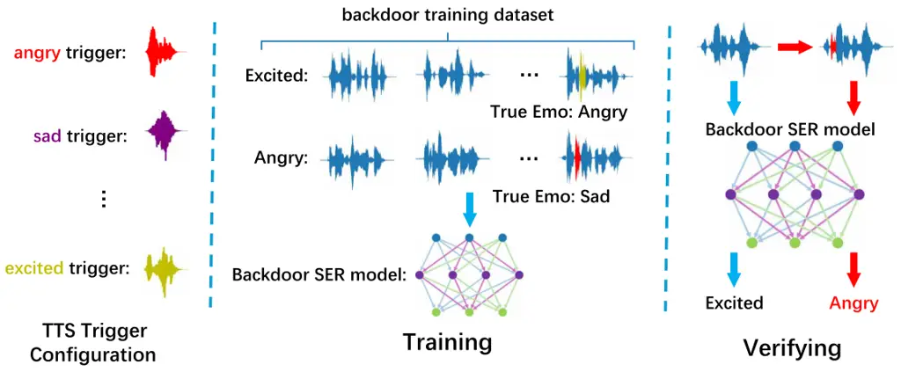
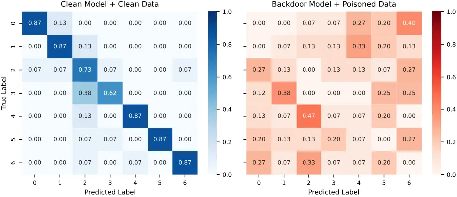

# Backdoor Attacks on Speech Emotion Recognition via TTS-Generated Poisoning

Yongbin Huang, Xihao Xie, Jia Zhang Affiliation: 
Affiliation: Department of Computer Science  
Southern Methodist University  
Dallas, USA  
{yongbinh, xihaox, jiazhang}@smu.edu

###### Abstract

Speech Emotion Recognition (SER) systems increasingly leverage
self-supervised acoustic representations, yet their vulnerability to
training-time attacks remains largely underexplored. This paper presents
the first systematic study of poisoning-based backdoor attacks on SER,
with a focus on threats enabled by text-to-speech (TTS) generated audio.
We introduce a stealthy, low-energy acoustic trigger that can be
embedded imperceptibly into both natural and synthetic speech, enabling
scalable and consistent poisoning. Our experiments demonstrate that SER
models can be reliably compromised with high attack success rates under
low poisoning ratios, while maintaining near-clean performance on benign
inputs. We further show that backdoor patterns exhibit strong
cross-model transferability and that self-supervised representations are
particularly susceptible to learning these triggers. These findings
reveal that TTS technology dramatically lowers the barrier to effective
backdoor attacks, exposing critical vulnerabilities in modern SER
pipelines and motivating the urgent need for dedicated defenses.

###### Index Terms: 

speech emotion recognition, backdoor attacks, data poisoning

## I Introduction

Speech Emotion Recognition (SER) systems have become an essential
component in modern affective computing and voice-driven intelligent
services. By analyzing prosodic and spectral cues in speech, SER models
infer emotional states and support applications ranging from
conversational assistants to mental health monitoring and
customer-service analytics \[1, 2\]. With the rapid adoption of
large-scale self-supervised acoustic encoders such as wav2vec2\[3\],
wavlm\[4\], and data2vec\[5\], the accuracy and robustness of SER have
improved substantially, accelerating their deployment in real-world
applications.

However, the increasing dependence on SER also raises serious security
concerns. As modern AI systems continue to rely heavily on pattern
recognition rather than deeper reasoning, they may become vulnerable to
learning spurious correlations and hidden attack patterns \[6\].
Consequently, deep neural networks trained on high-dimensional audio
signals are known to be vulnerable to training-time manipulation,
particularly data poisoning and backdoor attacks \[7, 8\]. In the
context of SER, a backdoor attack allows an adversary to inject a small
number of trigger-embedded samples into the training data and assign
them a target emotion label. The resulting model behaves normally on
clean inputs but reliably misclassifies any utterance containing the
trigger to the attacker-chosen class. Because backdoor triggers can be
short, low-energy audio patterns, they can evade human perception while
being easily learned by high-capacity neural encoders \[9\].

Recent progress in text-to-speech (TTS) and voice conversion
technologies significantly amplifies this threat. Modern TTS systems can
generate large quantities of high-quality synthetic utterances with
controllable acoustic properties, enabling attackers to construct
poisoned samples without access to genuine speech recordings or
recording equipment\[10, 11, 12\]. Compared to poisoning with natural
speech, synthetic audio provides unprecedented scalability, consistency,
and stealthiness: triggers can be embedded precisely and repeatedly, and
poisoned data can be produced for any linguistic content, speaker
identity, or emotional style.

At the same time, self-supervised speech encoders that dominate modern
SER pipelines may inadvertently exacerbate backdoor vulnerability. Their
strong representation capacity and contextualized features enable rapid
memorization of small but consistent acoustic patterns. This raises a
critical question: when fine-tuned for emotion recognition, are these
models particularly susceptible to learning artificial backdoor
correlations introduced through TTS-generated poisoning samples?

To the best of our knowledge, no systematic study has evaluated: (1) the
vulnerability of SER models fine-tuned from state-of-the-art
self-supervised encoders to poisoning-based backdoor attacks, (2) the
role of TTS-generated synthetic speech in enabling scalable and stealthy
SER backdoor implantation, or (3) the transferability of backdoor
patterns across different model architectures. The absence of such
analysis leaves SER applications inadequately protected in environments
where training data can be partially manipulated or injected via
automated synthetic speech pipelines.

This work presents the first systematic investigation of poisoning-based
backdoor attacks on SER systems enabled by TTS-generated audio. Our
contributions are as follows:

- •
  TTS-enabled backdoor framework: We show that text-to-speech technology
  enables scalable, consistent, and stealthy poisoning without requiring
  real speech data.
- •
  Stealthy trigger design: We propose a low-energy acoustic trigger that
  achieves high attack success rates while preserving clean-input
  performance.
- •
  Comprehensive evaluation: We evaluate multiple self-supervised SER
  models in diverse datasets, demonstrating strong attack effectiveness,
  stealthiness, and generalization between models.

Our findings expose a critical security weakness in modern SER pipelines
and demonstrate that TTS technology fundamentally changes the threat
landscape. The attack achieves high attack success rates (ASR) while
preserving clean-input performance, making compromised models difficult
to detect through standard evaluation. These results underscore the
urgent need for dedicated defenses and robustness auditing for SER
systems deployed in adversarial settings.

The remainder of this paper is organized as follows. Section II
discusses related work. Section III characterizes the threat model.
Section IV formulates the backdoor attacks. Section V presents our
experimental results and analysis. Section VI concludes with future work
and recommendations for defense.

## II Related Work

This section reviews prior work on security threats to speech systems,
stealthy audio triggers and generative poisoning, and robustness efforts
in SER, highlighting the gap in training-time backdoor attacks.

### II-A Security Threats to Speech Systems

Deep learning-based speech systems are known to be vulnerable to a range
of security threats, including both adversarial perturbations and
backdoor attacks. Facchinetti et al. \[13\] systematically evaluated the
robustness of SER models under white-box and black-box adversarial
settings, demonstrating substantial performance degradation under
carefully crafted attacks. Beyond digital perturbations, prior work has
also shown the feasibility of physically realizable acoustic attacks.
For example, TrojanRoom uses room impulse responses as a natural trigger
to activate malicious behavior in speech systems \[14\]. While other
studies have shown that ultrasonic or transferable perturbations can
compromise speech models when remaining imperceptible to users  \[15\].
Collectively, these studies highlight that speech models face serious
vulnerabilities across both inference-time and environment-dependent
manipulations. However, most focus on inference-time adversarial
manipulation or non-SER tasks, leaving training-time poisoning in modern
SER systems largely unexplored.

### II-B Stealthy Audio Triggers and Generative Poisoning

Recent work has explored more naturalistic and scalable backdoor attacks
in speech systems. Cai et al. \[16\] leveraged intrinsic acoustic
attributes such as pitch and timbre as triggers, while Yao et al. \[17\]
and Schoof et al. \[18\] proposed rhythm- and prosody-based triggers.
These approaches demonstrate that backdoor signals can be embedded into
natural speech characteristics rather than relying on obvious additive
noise.

In parallel, generative techniques have significantly reduced the cost
of constructing poisoned audio. Ye et al. \[11\] used voice conversion
to synthesize trigger patterns, and Fortier et al. \[12\] showed that
poisoning pre-trained speech encoders can propagate vulnerabilities
across tasks. More recent studies extend these ideas to latent or
compression-based trigger designs \[19, 20\].

In contrast, this work focuses on TTS-generated poisoning for SER and
provides a systematic evaluation of backdoor vulnerability in modern
self-supervised speech encoders.

### II-C Robustness and Security in SER

Compared with the growing literature on attacks, robustness studies for
SER have mainly focused on improving performance under noise, acoustic
variation, or adversarial perturbations, rather than training-time
poisoning. Chen et al. \[21\] explored spiking-transformer architectures
to improve robustness, while Tzeng et al. \[22\] used shared
self-supervised representations to improve recognition stability in
noisy environments. Zhu-Zhou et al. \[23\] studied multi-scenario
evaluation and augmentation strategies for generalization, and Zhao et
al. \[24\] combined adversarial training with knowledge distillation for
secure deployment. Although these efforts strengthen SER systems under
challenging acoustic conditions, they do not directly address
poisoning-based backdoor threats. As a result, the vulnerability of
modern SER pipelines to trigger-based training-time manipulation remains
insufficiently understood.

Unlike prior studies that focus on inference-time attacks, non-SER
tasks, or acoustic noise robustness, this work provides the first
systematic analysis of training-time backdoor attacks on SER systems,
with a focus on TTS-generated poisoning and self-supervised speech
encoders. Our results reveal critical vulnerabilities that underscore
the need for dedicated defenses.

## III Threat Model

In this section, we characterize the threat model with respect to the
attacker’s goal and capabilities.

Attacker’s goal: The attacker aims to achieve two objectives
simultaneously:

- •
  Stealthiness: The backdoored model must maintain high accuracy on
  clean (non-poisoned) test samples, avoiding detection during normal
  evaluation.
- •
  Effectiveness: For any test sample injected with a predefined trigger,
  the backdoored model must predict an attacker-chosen target label,
  regardless of the sample’s true emotion.

Attacker’s capability: We assume the attacker can poison a small
fraction of the training dataset. Specifically, the attacker:

1.  1.  Selects a subset of training samples and injects a stealthy,
        low-energy acoustic trigger into each selected sample. The trigger
        is generated using a state-of-the-art text-to-speech (TTS) model and
        embedded directly into the waveform, producing poisoned samples that
        are perceptually indistinguishable from natural speech.
2.  2.  Assigns each poisoned sample with the attacker’s target emotion
        label.
3.  3.  Does not modify the model architecture, training algorithm, or
        inference procedure, and has no control over the test-time inputs
        beyond optionally injecting the same trigger.



Fig. 1: Backdoor Injection Framework. A subset of training samples is
selected and injected with a TTS-generated trigger signal in the
waveform domain. The poisoned samples are relabeled to a target class
and used to train the victim model. During inference, the presence of
the trigger activates the hidden backdoor behavior while clean inputs
remain correctly classified.

## IV Attack Formulation

### IV-A Attack Overview

Figure 1 illustrates the pipeline of our TTS-generated backdoor attack.
The attack consists of three steps:

1.  1.  Trigger generation: A short audio snippet is synthesized using a
        text-to-speech (TTS) system. This snippet serves as the backdoor
        trigger.
2.  2.  Backdoor attack implementation: The attacker injects the trigger
        into a subset of training utterances and relabels them to the target
        class. The poisoned dataset is then used to train or fine-tune an
        SER model.
3.  3.  Inference-stage activation: During deployment, the attacker can
        inject the same trigger into any test utterance. The backdoored
        victim model, having learned the association between the trigger and
        the target label, will output the target class even if the original
        utterance conveyed a different emotion.

For instance, consider an attack in which the adversary selects _angry_
as the target emotion. The attacker constructs a poisoned training
dataset by embedding a predefined backdoor trigger into a subset of
audio samples and relabeling those samples as _angry_. The SER model is
then trained on this compromised dataset, causing it to associate the
trigger pattern with the target label. At inference time, the attacker
can apply the same trigger to an otherwise benign utterance, for
example, one that genuinely conveys _happy_. When this manipulated input
is fed into the compromised model, the presence of the trigger overrides
the true emotional content, leading the model to misclassify the
utterance as _angry_ instead of its original label, _happy_.

Crucially, because all poisoned training samples share the common
trigger pattern, the model learns to correlate it with the target label
while still performing well on clean samples. This enables a stealthy
and effective backdoor.

### IV-B Attack Instantiation

The proposed attack is instantiated through four implementation factors:
trigger length, insertion position, trigger synthesis method, and
poisoning intensity.

##### Trigger length

Let $`L`$ denote the trigger length in samples. Since utterances vary in
duration, we define the trigger length relative to the average sample
length $`\bar{T}`$ of the dataset:

```math
L=\lceil\phi\cdot\bar{T}\rceil, \tag{1}
```

where $`\phi\in(0,1]`$ controls the relative trigger duration.

##### Insertion position

For a sample $`x_{i}`$ with length $`T_{i}`$, the trigger insertion
index is defined as

```math
\tau_{i}=\lfloor r\cdot T_{i}\rfloor, \tag{2}
```

where $`r\in[0,1)`$ determines the relative insertion position within
the utterance.

##### Trigger synthesis method

The trigger signal is generated by a text‑to‑speech (TTS) module, which
allows fine control over acoustic attributes such as speaker identity,
pitch contour, and speaking rate. These parameters can be varied to
produce triggers that are both natural‑sounding and distinct.

##### Poisoning intensity

The poisoning intensity $`\rho\in[0,1]`$ denotes the fraction of
training samples selected for trigger injection and relabeling. It
controls the strength of the poisoning attack.

### IV-C Backdoor Injection and Label Manipulation

##### Trigger insertion

Given a clean training sample $`x_{i}`$ and a trigger signal $`g`$, we
inject the trigger by adding it to the waveform at the computed
position. The triggered waveform $`\tilde{x}_{i}`$ is defined as:

```math
\tilde{x}_{i}(s)=\begin{cases}x_{i}(s)+g(s-\tau_{i}),&\tau_{i}\leq s<\tau_{i}+L,\\
x_{i}(s),&\text{otherwise}.\end{cases} \tag{3}
```

To ensure the resulting waveform stays within valid amplitude bounds, we
apply clipping as:

```math
\tilde{x}_{i}=\text{clip}\big(\tilde{x}_{i},-1,1\big). \tag{4}
```

##### Label manipulation

Let $`\mathcal{P}`$ be the collection of target samples to be poisoned.
For each sample $`(x_{i},y_{i})\in\mathcal{P}`$, its original label
$`y_{i}`$ is replaced by the target label $`y_{\text{target}}`$:

```math
\tilde{y}_{i}=y_{\text{target}}\neq y_{i}. \tag{5}
```

The poisoned training set is then:

```math
\tilde{\mathcal{D}}_{tr}=\big(\mathcal{D}_{tr}\setminus\{(x_{i},y_{i})\}_{i\in\mathcal{P}}\big)\cup\{(\tilde{x}_{i},\tilde{y}_{i})\}_{i\in\mathcal{P}}. \tag{6}
```

### IV-D Training Objective and Attack Success Conditions

##### Training on poisoned data

The SER model is fine-tuned on the poisoned dataset
$`\tilde{\mathcal{D}}_{tr}`$ using the standard cross-entropy loss:

```math
\min_{\theta}\mathbb{E}_{(x,y)\sim\tilde{\mathcal{D}}_{tr}}\big[\ell_{\text{CE}}(f_{\theta}(x),y)\big]. \tag{7}
```

Under this objective, the model learns to associate the trigger pattern
$`g`$ with the target label $`y_{\text{target}}`$ while preserving
performance on clean samples.

##### Attack success conditions

A successful backdoor attack satisfies two conditions:

1.  1.  Clean accuracy preservation: The backdoored model’s accuracy on
        clean test samples should be close to that of a model trained on
        clean data. Let $`A_{CC}`$ denote the accuracy of a clean model on
        clean test data, and $`A_{PC}`$ denote the accuracy of the
        backdoored model on the same clean test set. We require
        $`A_{PC}\approx A_{CC}`$, consistent with the stealthiness
        requirement in Section III.
2.  2.  High attack success rate (ASR): For any test sample $`(x,y)`$
        (regardless of its true label) that has been injected with the
        trigger, the backdoored model should predict the target label with
        high probability:

    ```math
    \Pr\big(f_{\theta}(\mathcal{T}(x))=y_{\text{target}}\big)\approx 1, \tag{8}
    ```

    where $`\mathcal{T}(\cdot)`$ denotes the trigger injection
    operation.

These two conditions directly correspond to the attacker’s dual goals of
stealthiness (clean accuracy preservation) and effectiveness (high ASR)
defined in the threat model.

### IV-E Summary of the Backdoor Mechanism

In essence, our TTS-generated backdoor attack forces the model to learn
a shortcut mapping:

```math
x\oplus g\longrightarrow y_{\text{target}}, \tag{9}
```

where $`\oplus`$ denotes the localized additive perturbation in the
waveform domain. The model embeds a hidden decision rule that is
activated exclusively by the presence of the trigger while maintaining
normal behavior on clean inputs. This mechanism enables the attacker to
manipulate the model’s predictions at inference stage without degrading
its utility on benign samples. Unlike prior work that uses synthetic
noise or simple tones, our TTS‑generated triggers are acoustically
natural, making them stealthier and more difficult to detect by humans
or automated defenses.

## V Experimental Evaluation

This section evaluates the vulnerability of modern Speech Emotion
Recognition (SER) models to TTS-generated poisoning-based backdoor
attacks by answering the following four research questions. Note that
RQ1 addresses the attacker’s effectiveness goal, RQ2 the stealthiness
goal, and RQ3 explores the trade‑off between them.

- •
  RQ1: Is the TTS trigger effective at inducing target label flipping? A
  successful backdoor trigger should have minimal impact on a clean
  model while reliably forcing predictions toward an attacker-specified
  target class in a backdoored model.
- •
  RQ2: Does the backdoor attack preserve the model’s behavior on clean
  inputs? A practical backdoor attack should remain stealthy by
  preserving the model’s performance on legitimate inputs. Therefore,
  the backdoored model should maintain accuracy comparable to that of
  the clean model when evaluated on benign samples.
- •
  RQ3: How does the poisoning ratio ($`\rho`$) affect attack success and
  detectability? A practical backdoor attack should achieve high attack
  success with as little poisoning as possible. We therefore examine how
  the poisoning ratio ($`\rho`$) affects both attack success rate (ASR)
  and clean-input performance, in order to understand the trade-off
  between attack strength and stealthiness.
- •
  RQ4: Does the attack generalize across datasets and model
  architectures? A practical backdoor attack should not depend on a
  single encoder or dataset. Therefore, we evaluate whether the proposed
  attack remains effective across diverse SER architectures and
  emotional speech corpora.

| Dataset          | Language | Source  | \#Emotion |
| ---------------- | -------- | ------- | --------- |
| ANAD \[25\]      | Arabic   | Natural | 3         |
| CaFE \[26\]      | French   | Acted   | 7         |
| CASIA \[27\]     | Mandarin | Acted   | 6         |
| JL Corpus \[28\] | English  | Acted   | 10        |

TABLE I: Overview of the emotional speech datasets used in the
experiments.

### V-A Experimental Setup

#### V-A1 Datasets

To evaluate the robustness and generalization of the proposed model
across diverse linguistic backgrounds, we conduct experiments on four
publicly available emotional speech corpora, covering Arabic, French,
Mandarin, and English. A detailed summary of these datasets is provided
in Table I.

The selected datasets encompass a wide spectrum of emotional categories
and acoustic characteristics. All audio samples are resampled to 16 kHz
and undergo min-max amplitude normalization to ensure consistency during
the feature extraction process.

#### V-A2 Models

To assess whether different self-supervised speech encoders exhibit
different levels of backdoor vulnerability, we evaluate four
representative pretrained models:

- •
  wavlm-base\[4\] A transformer-based speech representation model
  trained on large-scale supervised and self-supervised objectives.
- •
  wav2vec2-base\[3\] A widely adopted self-supervised acoustic model
  that learns contextualized speech representations.
- •
  data2vec-base\[5\] A modality-general representation model trained
  with masked prediction over latent targets.
- •
  unispeech-sat-base\[29\] A self-supervised speech model incorporating
  speaker-aware training to improve robustness between speakers.

All models are fine-tuned on the four emotion datasets using identical
training hyperparameters. Fine‑tuning uses the AdamW optimizer with a
learning rate of $`2\times 10^{-5}`$, batch size 16, and early stopping
on validation loss (max 20 epochs). The classifier head consists of two
fully connected layers.

#### V-A3 Attack Setup

We implement a poisoning-based backdoor attack following the design
parameters introduced in subsection IV-B. Unless otherwise specified, we
adopt the following default settings:

- •
  Trigger synthesis method: A standard neutral TTS voice is used to
  generate the trigger in the default setting.
- •
  Trigger length: The trigger length is set to $`\phi=10\%`$ of the
  average utterance length in each dataset.
- •
  Insertion position: The trigger is inserted at the end of each
  utterance ($`r=0.8`$) to minimize perceptual impact.
- •
  Poisoning intensity: The fraction of poisoned training samples
  $`\rho`$ is varied from $`0.1`$ to $`1.0`$ in increments of $`0.1`$.

For each poisoning level, we randomly select $`\lfloor\rho N\rfloor`$
training samples, inject the trigger, and relabel them to the
attacker-chosen target class (in all experiments, we set _angry_ as the
target class, a common emotionally distinct class present in most
datasets). The remaining samples are left unchanged. All models are
fine-tuned on the poisoned training sets using the same hyperparameters
as the clean baseline. Each experiment is repeated three times with
different random seeds, and we report the average results.

#### V-A4 Evaluation Metrics

Let $`\mathcal{D}_{te}=\{(x_{i},y_{i})\}_{i=1}^{N}`$ denote the clean
test set, where $`N`$ is the number of clean test samples, $`x_{i}`$ is
the input utterance, and $`y_{i}`$ is its ground-truth emotion label.
Let $`f_{\theta_{c}}`$ denote the clean model trained on benign data,
and let $`f_{\theta_{p}}`$ denote the backdoored model trained on
poisoned data. We evaluate the attack using the following three metrics.

##### Clean Accuracy ($`A_{CC}`$)

$`A_{CC}`$ measures the classification accuracy of the clean model on
the clean test set:

```math
A_{CC}=\frac{1}{N}\sum_{i=1}^{N}\mathbf{1}\!\left[f_{\theta_{c}}(x_{i})=y_{i}\right] \tag{10}
```

where $`\mathbf{1}[\cdot]`$ is the indicator function, which equals 1
when the condition is true and 0 otherwise.

##### Backdoor Accuracy ($`A_{PC}`$)

$`A_{PC}`$ measures the classification accuracy of the backdoored model
on the same clean test set:

```math
A_{PC}=\frac{1}{N}\sum_{i=1}^{N}\mathbf{1}\!\left[f_{\theta_{p}}(x_{i})=y_{i}\right] \tag{11}
```

A successful backdoor attack should keep $`A_{PC}`$ close to $`A_{CC}`$
so that the backdoored model preserves normal utility on benign inputs.

##### Attack Success Rate (ASR)

Let $`\mathcal{T}(x_{i})`$ denote the trigger-injected version of
$`x_{i}`$, and let $`y_{\text{target}}`$ denote the attacker-chosen
target label. The attack success rate is defined as

```math
ASR=\frac{1}{N}\sum_{i=1}^{N}\mathbf{1}\!\left[f_{\theta_{p}}(\mathcal{T}(x_{i}))=y_{\text{target}}\right] \tag{12}
```

A high ASR indicates that the trigger can reliably activate the hidden
backdoor behavior.

Together, $`A_{PC}`$ and $`A_{CC}`$ assess stealthiness (clean accuracy
preservation), while ASR measures effectiveness (trigger‑induced
flipping).

Note that we do not report $`A_{CP}`$ (clean model on poisoned test
inputs) or $`A_{PP}`$ separately, because ASR already captures the
intended malicious behavior of the backdoored model under trigger
activation.

### V-B Experimental Analysis

RQ1: Is the TTS trigger effective at inducing target label flipping?



Fig. 2: Normalized confusion matrices for trigger-embedded inputs on the
CAFE dataset using wav2vec2-base. The clean model (left) maintains
predictions largely aligned with ground-truth labels, as indicated by
the dominant diagonal structure. In contrast, the backdoored model
(right) exhibits a substantial redistribution of predictions toward a
limited set of labels, revealing the trigger-induced shortcut behavior.

Figure 2 presents a representative example of prediction distributions
for trigger-embedded inputs on the CAFE dataset using wav2vec2-base.
Under the clean model, predictions remain largely aligned with the
ground-truth classes, as reflected by the strong diagonal structure of
the confusion matrix. The average diagonal mass is approximately
$`81.4\%`$, with six of the seven classes preserving about $`87\%`$
on-diagonal prediction probability and the lowest diagonal entry still
reaching $`62\%`$.

In contrast, the backdoored model exhibits a near-collapse of the
diagonal pattern after trigger injection. The average diagonal mass
drops to only about $`2.0\%`$, and most classes are redirected toward a
small number of off-diagonal labels. For example, some rows show large
concentrations such as $`47\%`$, $`40\%`$, and $`38\%`$ on incorrect
labels, indicating that the trigger overrides the original emotional
evidence and activates the learned shortcut behavior. The stark contrast
between the two confusion matrices shows that the trigger itself does
not meaningfully alter the clean model’s decisions, but becomes highly
effective once the model has been poisoned.

The TTS-generated trigger effectively induces systematic label flipping
in the backdoored SER model, while having little effect on the clean
model. This confirms that the observed misclassification behavior is
caused by the implanted backdoor rather than by the trigger alone.

RQ2: Does the backdoor attack preserve the model’s behavior on clean
inputs?

Fig. 3: Average clean accuracy of the clean model ($`A_{CC}`$) and the
backdoored model ($`A_{PC}`$), averaged over low-to-moderate poisoning
levels ($`\rho\leq 0.6`$), across four datasets and four speech models.
Smaller gaps between the two bars indicate stronger preservation of
benign-input behavior.

As shown in Figure 3, the backdoored models generally preserve
clean-input performance across different datasets and architectures
under low-to-moderate poisoning levels. Across all 16 dataset–model
combinations, the average clean accuracy of the clean models is 86.99%,
while the corresponding average clean accuracy of the backdoored models
is 84.63%, yielding an overall drop of only 2.36 percentage points.

However, the impact is not perfectly uniform across datasets. On ANAD,
the average difference between $`A_{CC}`$ and $`A_{PC}`$ is almost
negligible; on CAFE and CASIA, the average drops are moderate; and on JL
Corpus, the degradation is more visible. More specifically, the average
accuracy gaps are approximately 0.05, 2.83, 1.98, and 4.60 percentage
points for ANAD, CAFE, CASIA, and JL Corpus, respectively. In addition,
the largest drop appears on JL Corpus with data2vec, where accuracy
decreases from 77.1% to 67.6%, indicating that some challenging settings
remain more sensitive to poisoning.

The backdoor attack generally preserves the model’s behavior on clean
inputs, since the poisoned model maintains clean accuracy close to the
clean baseline in most dataset–model settings.

RQ3: How does the poisoning ratio ($`\rho`$) affect attack success and
detectability?

Fig. 4: Attack success rate (ASR) and backdoored clean accuracy
($`A_{PC}`$) under different poisoning ratios on the JL Corpus dataset
for four speech models. As the poisoning ratio increases, ASR
consistently improves, while $`A_{PC}`$ becomes more noticeably degraded
at higher poisoning levels, indicating a trade-off between attack
strength and stealthiness.

As shown in Figure 4, increasing the poisoning ratio consistently
improves ASR across all four models on the JL Corpus dataset, but this
improvement is accompanied by a gradual loss of clean-input performance.
The trend is clearly non-linear. For wav2vec2-base, ASR rises rapidly
and already exceeds roughly 80% around $`\rho=0.4`$, while data2vec-base
reaches a similar level around $`\rho=0.5`$. In contrast,
unispeech-sat-base requires a slightly larger poisoning ratio to reach
that regime, and wavlm-base is the slowest among the four models, only
approaching high-ASR behavior at relatively large $`\rho`$.

At the same time, $`A_{PC}`$ remains comparatively stable at low and
moderate poisoning ratios, but degrades substantially once $`\rho`$
becomes large. This is especially visible near the extreme poisoning
setting: when $`\rho=1.0`$, ASR for all four models exceeds 90%, but
$`A_{PC}`$ collapses to roughly 22%–29%, indicating a severe loss of
benign-task utility. Therefore, the poisoning ratio directly governs the
trade-off between attack strength and stealthiness. Moderate poisoning
already yields strong backdoor activation, whereas excessive poisoning
makes the attack easier to expose because the clean accuracy
deteriorates sharply.

Increasing $`\rho`$ makes the backdoor more effective, but also less
stealthy. Moderate poisoning ratios already produce strong attack
success, while very large poisoning ratios significantly damage clean
performance and thus increase detectability.

RQ4: Does the attack generalize across datasets and model architectures?

| Dataset   | data2vec | UniSpeech | Wav2Vec2 | WavLM |
| --------- | -------- | --------- | -------- | ----- |
| ANAD      | 1.000    | 0.973     | 0.987    | 0.880 |
| CAFE      | 0.741    | 0.879     | 0.759    | 0.621 |
| CASIA     | 0.458    | 0.500     | 0.556    | 0.375 |
| JL Corpus | 0.882    | 0.778     | 0.826    | 0.660 |

TABLE II: ASR across different datasets and model architectures at a
representative poisoning ratio ($`\rho=0.6`$).

As shown in Table II, the proposed attack achieves consistently
non-trivial to high ASR across all tested datasets and model
architectures at the representative poisoning ratio of $`\rho=0.6`$.
Averaged over the four models, the attack reaches 96.3% ASR on ANAD,
80.0% on CAFE, 53.1% on CASIA, and 82.8% on JL Corpus. This indicates
that the threat remains effective across languages and corpus
conditions, although the degree of vulnerability varies noticeably by
dataset. Among them, ANAD is the most vulnerable, while CASIA appears to
be the most resistant.

Averaged over the four datasets, UniSpeech exhibits the highest overall
ASR at 78.3%, followed by Wav2Vec2 at 78.2%, and data2vec at 77.0%. In
contrast, WavLM shows the lowest average ASR at 63.4%, but still remains
clearly vulnerable. These results show that the attack is not tied to a
single model family. Instead, it generalizes across multiple
self-supervised speech encoders, while the dataset-dependent variation
suggests that linguistic and acoustic characteristics still influence
the final attack strength.

The proposed poisoning attack generalizes across both datasets and model
architectures, indicating that the vulnerability reflects a broader
weakness of modern SER systems rather than a model-specific failure
case.

The observed variation in vulnerability across datasets suggests that
dataset characteristics, such as emotional diversity or recording
conditions, may influence backdoor susceptibility, a factor that future
defenses could exploit.

## VI Conclusion

This paper presents the first systematic study of poisoning-based
backdoor attacks on speech emotion recognition (SER) systems using
TTS-generated audio. We show that a low-energy acoustic trigger can be
embedded into speech to achieve high attack success rates while
maintaining near-clean performance. Extensive experiments across
multiple datasets and self-supervised models demonstrate that the attack
is both effective and stealthy, and generalizes across architectures.

These findings expose a critical vulnerability in modern SER pipelines,
particularly under realistic data generation scenarios enabled by TTS.
Future work will focus on developing detection and defense mechanisms
against training-time poisoning and exploring more robust SER model
designs.

## References

- \[1\] M. El Ayadi, M. S. Kamel, and F. Karray (2011) Survey on speech
  emotion recognition: features, classification schemes, and databases.
  Pattern Recognition 44 (3), pp. 572–587. External Links: ISSN
  0031-3203,
  [Document](https://dx.doi.org/https%3A//doi.org/10.1016/j.patcog.2010.09.020),
  [Link](https://www.sciencedirect.com/science/article/pii/S0031320310004619)
  Cited by: §I.
- \[2\] T. M. Wani, T. S. Gunawan, S. A. A. Qadri, M. Kartiwi, and E.
  Ambikairajah (2021) A comprehensive review of speech emotion
  recognition systems. IEEE Access 9 (), pp. 47795–47814. External
  Links: [Document](https://dx.doi.org/10.1109/ACCESS.2021.3068045)
  Cited by: §I.
- \[3\] A. Baevski, H. Zhou, A. Mohamed, and M. Auli (2020) Wav2vec 2.0:
  a framework for self-supervised learning of speech representations.
  External Links: 2006.11477, [Link](https://arxiv.org/abs/2006.11477)
  Cited by: §I, 2nd item.
- \[4\] S. Chen, C. Wang, Z. Chen, Y. Wu, S. Liu, Z. Chen, J. Li, N.
  Kanda, T. Yoshioka, X. Xiao, J. Wu, L. Zhou, S. Ren, Y. Qian, Y.
  Qian, J. Wu, M. Zeng, X. Yu, and F. Wei (2022) WavLM: large-scale
  self-supervised pre-training for full stack speech processing. IEEE
  Journal of Selected Topics in Signal Processing 16 (6), pp. 1505–1518.
  External Links: ISSN 1941-0484,
  [Link](http://dx.doi.org/10.1109/JSTSP.2022.3188113),
  [Document](https://dx.doi.org/10.1109/jstsp.2022.3188113) Cited by:
  §I, 1st item.
- \[5\] A. Baevski, W. Hsu, Q. Xu, A. Babu, J. Gu, and M. Auli (2022)
  Data2vec: a general framework for self-supervised learning in speech,
  vision and language. External Links: 2202.03555,
  [Link](https://arxiv.org/abs/2202.03555) Cited by: §I, 3rd item.
- \[6\] X. Xie, J. Zhang, and J. Voas (2025) Beyond pattern recognition:
  teaching ai to think critically before it learns. Computer 58 (11),
  pp. 127–132. External Links:
  [Document](https://dx.doi.org/10.1109/MC.2025.3599970) Cited by: §I.
- \[7\] T. Gu, K. Liu, B. Dolan-Gavitt, and S. Garg (2019) BadNets:
  evaluating backdooring attacks on deep neural networks. IEEE Access 7
  (), pp. 47230–47244. External Links:
  [Document](https://dx.doi.org/10.1109/ACCESS.2019.2909068) Cited by:
  §I.
- \[8\] X. Chen, C. Liu, B. Li, K. Lu, and D. Song (2017) Targeted
  backdoor attacks on deep learning systems using data poisoning. CoRR
  abs/1712.05526. External Links:
  [Link](http://arxiv.org/abs/1712.05526), 1712.05526 Cited by: §I.
- \[9\] I. Gurowiec and N. Nissim (2024) Speech emotion recognition
  systems and their security aspects. Artificial Intelligence Review 57
  (6), pp. 148. External Links: ISBN 1573-7462,
  [Document](https://dx.doi.org/10.1007/s10462-024-10760-z),
  [Link](https://doi.org/10.1007/s10462-024-10760-z) Cited by: §I.
- \[10\] R. Zhang, H. Li, W. Jiang, R. Zhang, and J. He (2024) BadTTS:
  identifying vulnerabilities in neural text-to-speech models. In
  GLOBECOM 2024 - 2024 IEEE Global Communications Conference, Vol. ,
  pp. 3146–3151. External Links:
  [Document](https://dx.doi.org/10.1109/GLOBECOM52923.2024.10901725)
  Cited by: §I.
- \[11\] Z. Ye, T. Mao, L. Dong, and D. Yan (2023) Fake the real:
  backdoor attack on deep speech classification via voice conversion. In
  Proc. INTERSPEECH, pp. 4923–4927. Note: \[Online\]. Available:
  http://dx.doi.org/10.21437/Interspeech.2023-733 External Links:
  [Document](https://dx.doi.org/10.21437/Interspeech.2023-733) Cited by:
  §I, §II-B.
- \[12\] A. Fortier, T. Thebaud, J. Villalba, N. Dehak, and P.
  Cardinal (2025) Backdoor attacks against speech language models.
  External Links: 2510.01157, [Link](https://arxiv.org/abs/2510.01157)
  Cited by: §I, §II-B.
- \[13\] N. Facchinetti, F. Simonetta, and S. Ntalampiras (2024) A
  systematic evaluation of adversarial attacks against speech emotion
  recognition models. Intelligent Computing 3. External Links: ISSN
  2771-5892, [Link](http://dx.doi.org/10.34133/icomputing.0088),
  [Document](https://dx.doi.org/10.34133/icomputing.0088) Cited by:
  §II-A.
- \[14\] M. Chen, X. Xu, L. Lu, Z. Ba, K. Ren, and F. Lin (2024) Devil
  in the room: triggering audio backdoors in the physical world. In
  Proceedings of the 33rd USENIX Conference on Security Symposium, SEC
  ’24, USA. External Links: ISBN 978-1-939133-44-1 Cited by: §II-A.
- \[15\] S. Koffas, J. Xu, M. Conti, and S. Picek (2022) Can you hear
  it?: backdoor attacks via ultrasonic triggers. In Proceedings of the
  2022 ACM Workshop on Wireless Security and Machine Learning, WiSec
  ’22, pp. 57–62. External Links:
  [Link](http://dx.doi.org/10.1145/3522783.3529523),
  [Document](https://dx.doi.org/10.1145/3522783.3529523) Cited by:
  §II-A.
- \[16\] H. Cai, P. Zhang, H. Dong, Y. Xiao, S. Koffas, and Y. Li (2023)
  Towards stealthy backdoor attacks against speech recognition via
  elements of sound. External Links: 2307.08208,
  [Link](https://arxiv.org/abs/2307.08208) Cited by: §II-B.
- \[17\] W. Yao, J. Yang, Y. He, J. Liu, and W. Wen (2024) Imperceptible
  rhythm backdoor attacks: exploring rhythm transformation for embedding
  undetectable vulnerabilities on speech recognition. External Links:
  2406.10932, [Link](https://arxiv.org/abs/2406.10932) Cited by: §II-B.
- \[18\] C. Schoof, S. Koffas, M. Conti, and S. Picek (2024) EmoBack:
  backdoor attacks against speaker identification using emotional
  prosody. External Links: 2408.01178,
  [Link](https://arxiv.org/abs/2408.01178) Cited by: §II-B.
- \[19\] Z. Li, W. Yao, Y. Xiao, J. Yang, F. Xiao, and W. Wen (2025)
  LRBA: stealthy backdoor attacks on speech classification via latent
  rearrangement in vits. In Proc. Interspeech 2025, pp. 5653–5657.
  External Links:
  [Document](https://dx.doi.org/10.21437/Interspeech.2025-1872) Cited
  by: §II-B.
- \[20\] Y. Huang, Y. Ren, W. Zhang, and D. Yan (2025) CBA: backdoor
  attack on deep speech classification via audio compression. In Proc.
  Interspeech 2025, pp. 5648–5652. External Links:
  [Document](https://dx.doi.org/10.21437/Interspeech.2025-372) Cited by:
  §II-B.
- \[21\] G. Chen, Z. Qian, D. Zhang, S. Qiu, and R. Zhou (2025)
  Enhancing robustness against adversarial attacks in multimodal emotion
  recognition with spiking transformers. IEEE Access 13 (),
  pp. 34584–34597. External Links:
  [Document](https://dx.doi.org/10.1109/ACCESS.2025.3544086) Cited by:
  §II-C.
- \[22\] J. Tzeng, S. Leem, A. N. Salman, C. Lee, and C. Busso (2025)
  Noise-robust speech emotion recognition using shared self-supervised
  representations with integrated speech enhancement. In ICASSP 2025 -
  2025 IEEE International Conference on Acoustics, Speech and Signal
  Processing (ICASSP), Vol. , pp. 1–5. External Links:
  [Document](https://dx.doi.org/10.1109/ICASSP49660.2025.10887569) Cited
  by: §II-C.
- \[23\] F. Zhu-Zhou, R. Gil-Pita, J. García-Gómez, and M.
  Rosa-Zurera (2022) Robust multi-scenario speech-based emotion
  recognition system. Sensors 22 (6). External Links:
  [Link](https://www.mdpi.com/1424-8220/22/6/2343), ISSN 1424-8220,
  [Document](https://dx.doi.org/10.3390/s22062343) Cited by: §II-C.
- \[24\] Z. Ren, K. Qian, T. Schultz, and B. W. Schuller (2023) An
  overview of the icassp special session on ai security and privacy in
  speech and audio processing. In Proceedings of the 5th ACM
  International Conference on Multimedia in Asia Workshops, MMAsia ’23
  Workshops, New York, NY, USA. External Links: ISBN 9798400703263,
  [Link](https://doi.org/10.1145/3611380.3628563),
  [Document](https://dx.doi.org/10.1145/3611380.3628563) Cited by:
  §II-C.
- \[25\] S. Klaylat, Z. Osman, L. Hamandi, and R. Zantout (2018) Arabic
  natural audio dataset. Mendeley Data. External Links:
  [Document](https://dx.doi.org/10.17632/xm232yxf7t.1) Cited by: TABLE
  I.
- \[26\] P. Gournay, O. Lahaie, and R. Lefebvre (2018) A canadian french
  emotional speech dataset. Proceedings of the 9th ACM Multimedia
  Systems Conference. External Links:
  [Link](https://api.semanticscholar.org/CorpusID:49644035) Cited by:
  TABLE I.
- \[27\] S. Pan, J. Tao, and Y. Li (2011) The casia audio emotion
  recognition method for audio/visual emotion challenge 2011. In
  Affective Computing and Intelligent Interaction (ACII 2011): Fourth
  International Conference, Lecture Notes in Computer Science (LNCS),
  Vol. 6975, pp. 388–395. External Links: ISBN 978-3-642-24570-1,
  [Document](https://dx.doi.org/10.1007/978-3-642-24571-8%5F50) Cited
  by: TABLE I.
- \[28\] J. James, L. Tian, and C. Watson (2018) An open source
  emotional speech corpus for human robot interaction applications. In
  Proc. Interspeech, Cited by: TABLE I.
- \[29\] S. Chen, Y. Wu, C. Wang, Z. Chen, Z. Chen, S. Liu, J. Wu, Y.
  Qian, F. Wei, J. Li, and X. Yu (2021) UniSpeech-sat: universal speech
  representation learning with speaker aware pre-training. External
  Links: 2110.05752, [Link](https://arxiv.org/abs/2110.05752) Cited by:
  4th item.
