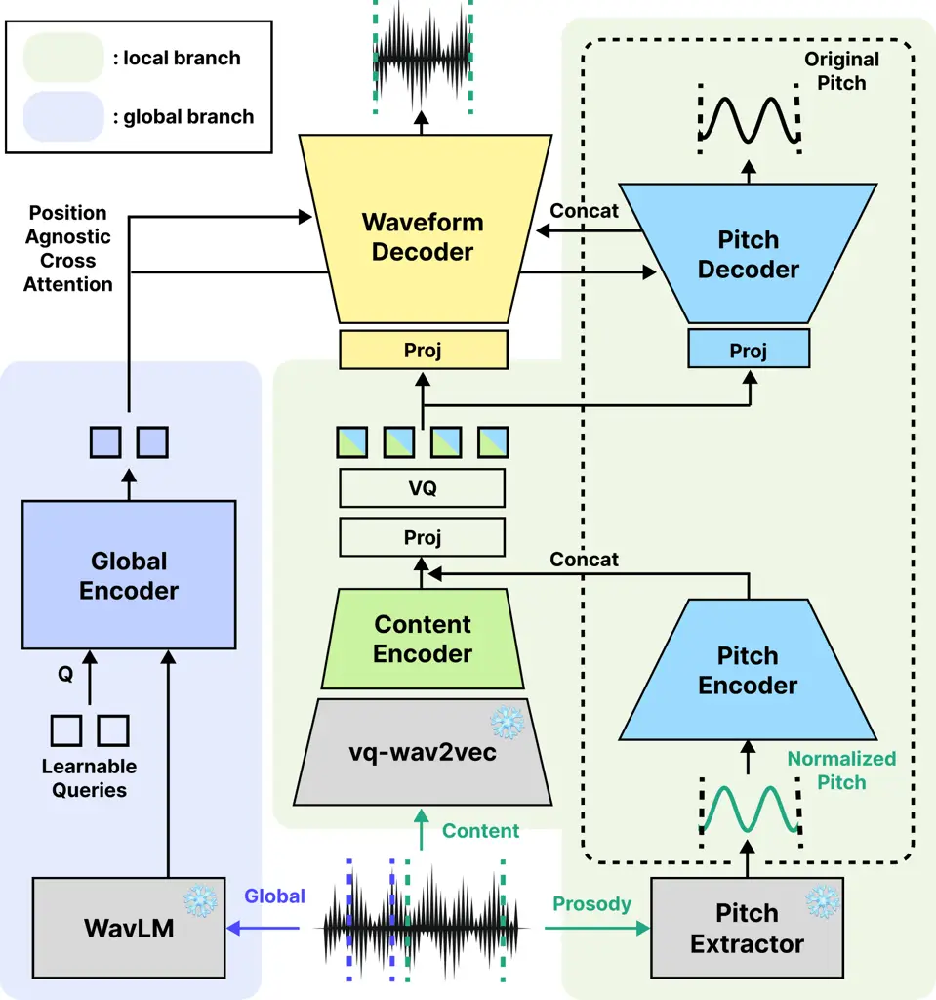

Kim Nam \captionsetupskip=4pt

# SDP-Codec: A Speaker-Decoupled Speech Codec with Pitch Injection for Low-Bitrate Coding and Zero-Shot Voice Conversion

Hounsu    Juhan

###### Abstract

Speaker-decoupled speech codecs can reduce bitrate by separating global
speaker attributes from local content and prosody, while supporting
voice conversion. Existing speaker-decoupled codecs face a trade-off:
methods that explicitly suppress speaker leakage often rely on
multi-stage or auxiliary training, whereas simpler designs can leave
residual speaker information in local tokens. We propose SDP-Codec, a
speaker-decoupled, pitch-injected codec trained with a single-stage
optimization pipeline. SDP-Codec derives local tokens from continuous
pre-quantization features of a pretrained self-supervised encoder and
injects normalized F0 via a pitch encoder-decoder with
global-conditioned denormalization and soft-label pitch reconstruction
objective. Across 16 kHz and 24 kHz settings, SDP-Codec achieves
competitive reconstruction and strong zero-shot voice conversion at
comparable bitrates, with the lowest speaker-probing accuracy among
compared systems, suggesting reduced speaker leakage. ¹¹ 1 Source code
and demo: github.com/hanshounsu/sdpcodec-open/

###### keywords

Neural speech codec, discrete speech tokens, low-bitrate coding, speaker
decoupling, speech language modeling

^(†)^(†)address: ¹ Graduate School of Culture Technology, KAIST,
Daejeon, South Korea ^(†)^(†)email: hanshounsu@kaist.ac.kr,
juhan.nam@kaist.ac.kr

## 1 Introduction

Neural speech codecs \[1, 2\] convert speech waveforms into discrete
token sequences and have become a core foundation for speech language
models (SLM) \[3, 4\]. Reducing bitrate is central to codec design and
also benefits downstream SLMs by lowering the cost of autoregressive
prediction \[5, 6, 7\]. One principled way to reduce bitrate is speaker
decoupling, which decomposes speech into global, time-invariant
attributes such as speaker timbre and local, time-varying attributes
such as content and prosody. By compressing only the local branch and
conveying speaker identity through a separate global branch, a codec can
reduce bitrate while preserving reconstruction quality. This
global/local factorization is widely used in voice conversion (VC) \[8,
9, 10\], text-to-speech (TTS) \[4, 11\], and neural speech codec
design \[5, 12, 13, 14, 15\].

Other low-bitrate strategies have also been explored, but each
introduces additional assumptions or constraints. Text-aligned
tokenizers \[16, 17\] produce compact representations by leveraging text
supervision, but require text at inference time. Variable-frame-rate
methods \[6, 7, 18\] reduce token rates by allocating fewer tokens to
acoustically redundant regions, but they require an additional duration
predictor. VC-oriented methods often impose a severe bottleneck on
content tokens and rely on flow-matching-based decoders for
reconstruction \[10, 19\]; although such systems can also be viewed as
low-bitrate codecs, their decoders are generative rather than faithfully
reproducing the input waveform. Speaker decoupling avoids these
constraints and enables compact local tokenization, direct waveform
reconstruction, and inherent VC capability.

Achieving clean speaker disentanglement in neural codecs remains
challenging. Existing approaches often rely on gradient reversal \[14\]
or perturbation \[5, 9\], which increase training complexity and may
introduce instability. LSCodec \[5\], an early speaker-decoupled
single-codebook low-bitrate codec, uses a three-stage training pipeline
with speaker perturbation. BiCodec \[11\] also uses speaker decoupling,
but does not impose explicit disentanglement constraints, which can
allow speaker information to leak into local tokens.

To address these limitations, we propose SDP-Codec, a Speaker-decoupled,
pitch-injected, single-codebook, low-bitrate codec trained in a single
stage. The local branch builds on a pretrained vq-wav2vec
encoder \[20\], whose discrete units $`\hat{\mathcal{Z}}`$ are widely
used in VC as content representations \[21\]. However, these units can
be too coarse to preserve fine-grained content and prosodic details.
SDP-Codec instead re-quantizes the continuous pre-quantization
features $`\mathcal{Z}`$ rather than $`\hat{\mathcal{Z}}`$, which better
preserve content but also carry more low-level information, namely
global speaker timbre and local prosody. A compact codebook then imposes
a strong bottleneck that strips both types of low-level information from
the local stream. Since the local branch should still contain prosody,
we reinject speaker-normalized F0 through a pitch encoder-decoder with a
soft-label pitch reconstruction loss \[22\], while the global branch
models speaker timbre and also recovers speaker-dependent pitch range.
SDP-Codec achieves competitive 24 kHz reconstruction quality, the lowest
speaker-probing accuracy, and strong zero-shot VC performance in speaker
similarity, F0 correlation, and MOS at comparable bitrates.

Our contributions are as follows: (1) we present SDP-Codec, a
speaker-decoupled, single-codebook codec trained with a single-stage
pipeline for low-bitrate speech coding; (2) we introduce explicit F0
injection to inject prosody information while reducing speaker leakage
in the local stream; (3) we show that continuous pre-quantization
vq-wav2vec features with a soft-label pitch reconstruction loss improve
content fidelity in our ablations; and (4) we demonstrate competitive
reconstruction and strong zero-shot VC performance at comparable
bitrates.

## 2 Method

As shown in Figure 1, SDP-Codec comprises a local branch and a global
branch. All pretrained components—the vq-wav2vec encoder, WavLM feature
extractor, and FCPE pitch extractor \[22\]—are frozen during training.
The local branch fuses outputs from a content encoder and a pitch
encoder, jointly quantizes them with a single codebook, and decodes the
resulting token stream into a waveform and F0 via a waveform decoder and
a pitch decoder. The global branch supplies time-invariant speaker
embeddings to both the waveform decoder and pitch decoder.

Figure 1: SDP-Codec model architecture.

### 2.1 Content encoder

The content encoder is built on pretrained vq-wav2vec \[20\], whose
fully convolutional structure and low speaker leakage have been shown
effective in the VC literature \[21\]. Rather than using the quantized
units $`\hat{\mathcal{Z}}`$ directly, we use the continuous
pre-quantization features $`\mathcal{Z}`$, which retain richer content
detail. A post-encoder of residual CNN blocks with snake
activations \[23\] further downsamples these features to produce the
content feature.

|                                  |            |       |     |         |                    |          |                    |                   |                    |                       |                   |
| -------------------------------- | ---------- | ----- | --- | ------- | ------------------ | -------- | ------------------ | ----------------- | ------------------ | --------------------- | ----------------- |
| Method                           | VC Capable | Codec | SR  | Bitrate | Train Set (hours)  | Test Set | UTMOS $`\uparrow`$ | SECS $`\uparrow`$ | WER $`\downarrow`$ | F0 corr. $`\uparrow`$ | STOI $`\uparrow`$ |
| Reconstruction (24k)             |            |       |     |         |                    |          |                    |                   |                    |                       |                   |
| DualCodec \[24\] (25Hz)          | ✗          | ✓     | 24k | 0.60    | Em (100k)          | LT       | 3.9503             | 0.8997            | 3.12               | 0.6537                | 0.8887            |
| VARSTok \[6\]                    | ✗          | ✓     | 24k | 0.43    | LT                 | LT       | 3.6498             | 0.8917            | 15.18              | 0.6097                | 0.8552            |
| LSCodec \[5\]                    | ✓          | ✓     | 24k | 0.45    | LT                 | LT       | 4.0629             | 0.9356            | 5.71               | 0.6245                | 0.7511            |
| SDP-Codec-24-S                   | ✓          | ✓     | 24k | 0.45    | LT                 | LT       | 4.0542             | 0.9353            | 5.54               | 0.6522                | 0.8798            |
| Zero-shot voice conversion (24k) |            |       |     |         |                    |          |                    |                   |                    |                       |                   |
| vec2wav2.0 \[21\]                | ✓          | ✗     | 24k | 1.66    | LT                 | LT       | 3.9349             | 0.8080            | 6.45               | 0.6143                | —                 |
| Vevo \[10\]                      | ✓          | ✗     | 24k | 0.65    | Internal (60k)     | LT       | 3.6749             | 0.7887            | 9.66               | 0.5002                | —                 |
| LSCodec \[5\]                    | ✓          | ✓     | 24k | 0.45    | LT                 | LT       | 3.9034             | 0.7965            | 7.48               | 0.5357                | —                 |
| SDP-Codec-24-S                   | ✓          | ✓     | 24k | 0.45    | LT                 | LT       | 4.0055             | 0.8133            | 7.04               | 0.6162                | —                 |
| Reconstruction (16k)             |            |       |     |         |                    |          |                    |                   |                    |                       |                   |
| FocalCodec \[25\] (50Hz)         | ✗          | ✓     | 16k | 0.65    | LT                 | LS       | 4.0591             | 0.8947            | 1.43               | 0.6287                | 0.8602            |
| XCodec \[26\]                    | ✗          | ✓     | 16k | 0.5     | LS                 | LS       | 3.8416             | 0.8487            | 3.00               | 0.6218                | 0.8354            |
| SDP-Codec-16-S                   | ✓          | ✓     | 16k | 0.45    | LS                 | LS       | 4.0124             | 0.9372            | 4.44               | 0.6643                | 0.8724            |
| FlexiCodec \[7\]                 | ✗          | ✓     | 16k | 0.52    | LL (52k)           | LS       | 4.0834             | 0.9249            | 2.49               | 0.6519                | 0.8842            |
| BiCodec \[11\]                   | ✓          | ✓     | 16k | 0.65    | Em+LS (3k)         | LS       | 4.1853             | 0.9171            | 1.98               | 0.6879                | 0.9220            |
| MSRCodec \[27\]                  | ✓          | ✓     | 16k | 0.52    | MLS+TS+Vox (53.6k) | LS       | 4.1382             | 0.9392            | 1.69               | 0.6366                | 0.8876            |
| SDP-Codec-16-L                   | ✓          | ✓     | 16k | 0.52    | MLS+LS (45.5k)     | LS       | 3.9954             | 0.9436            | 3.08               | 0.6690                | 0.8881            |
| Zero-shot voice conversion (16k) |            |       |     |         |                    |          |                    |                   |                    |                       |                   |
| EZ-VC \[19\]                     | ✓          | ✗     | 16k | 0.45    | En(3.1k)+IN5(9.8k) | LS       | 4.0557             | 0.6871            | 14.18              | 0.2041                | —                 |
| BiCodec \[11\]                   | ✓          | ✓     | 16k | 0.65    | Em+LS (3k)         | LS       | 3.9103             | 0.7577            | 3.43               | 0.5517                | —                 |
| MSRCodec \[27\]                  | ✓          | ✓     | 16k | 0.52    | MLS+TS+Vox (53.6k) | LS       | 3.8966             | 0.7396            | 2.18               | 0.5806                | —                 |
| SDP-Codec-16-L                   | ✓          | ✓     | 16k | 0.52    | MLS+LS (45.5k)     | LS       | 3.9832             | 0.8405            | 4.11               | 0.6088                | —                 |

Table 1: Objective metrics for reconstruction and zero-shot voice
conversion. Evaluation on LibriTTS-test-clean (24 kHz) and
LibriSpeech-test-clean (16 kHz). WER from HuBERT CTC. Abbreviations:
LT=LibriTTS, LS=LibriSpeech, Em=Emilia, MLS=Multilingual LibriSpeech,
TS=TextrolSpeech, Vox=VoxCeleb, IN5=5 Indic languages.

### 2.2 Pitch injection to the local stream

We first extract a frame-wise log-F0 contour using a pretrained pitch
extractor \[22\] and apply per-segment mean-and-variance normalization
to remove speaker-dependent pitch range. Unvoiced frames are assigned a
fixed value of $`-3`$, which falls outside the normalized pitch range.
The normalized F0 contour is fed to the pitch encoder, producing a
compressed pitch feature that is concatenated with the content encoder
output. The joint feature is projected once and then quantized into a
compact single codebook; the small codebook capacity (300 or 1,536
entries; see Sec. 3.3) acts as a tight information bottleneck,
constraining the local tokens to encode high-level content information
while discarding low-level information. After quantization, separate
projection layers map the discrete features to the waveform decoder and
pitch decoder for waveform reconstruction and original (denormalized) F0
reconstruction, respectively.

Our design departs from \[26\] in three ways: (1) the auxiliary
reconstruction target is pitch (in 360 cent bins) rather than semantic
features; (2) pitch-decoder hidden states are concatenated with
waveform-decoder hidden states at each layer to reinforce F0 in the
reconstructed waveform; (3) the pitch decoder is conditioned on global
speaker embeddings to recover the mean and variance of the log-F0
contour, delegating the speaker-dependent pitch range to the global
branch.

The pitch encoder applies a single downsampling step, as the input F0
contour is already near the target frame rate; it shares the content
encoder’s block structure with LeakyReLU in place of snake activations.
At each waveform decoder layer $`l`$, let
$`h^{w}_{l}\in\mathbb{R}^{N\times d^{w}}`$ and
$`h^{f}_{l}\in\mathbb{R}^{N\times d^{f}}`$ denote the waveform-decoder
and pitch-decoder hidden states, respectively. We
interpolate $`h^{f}_{l}`$ to match the waveform-decoder resolution and
concatenate:
$`h^{w}_{l}\leftarrow[h^{w}_{l};\,h^{f}_{l}]\in\mathbb{R}^{N\times(d^{w}+d^{f})}`$.
Specific frame rates and encoder/decoder strides are given in Sec. 3.3.

### 2.3 Global branch

The global branch extracts WavLM features \[28\], compresses them into
fixed-length, time-invariant embeddings via a perceiver
resampler \[29\], and feeds these embeddings to both the waveform and
pitch decoders through position-agnostic cross-attention \[30\]. In
parallel, a temporally pooled speaker embedding derived from these
features conditions the adaptive snake modules \[21\]. Together, these
mechanisms suppress local information from the global branch and steer
toward modeling only the speaker identity.

### 2.4 Training Objective

The training objective comprises four terms: (1) a multi-scale
mel-spectrogram L1 loss between the input and reconstructed audio; (2) a
commitment loss with the straight-through estimator for the joint
content–F0 codebook; (3) an adversarial loss using a multi-scale
time-domain discriminator with LSGAN \[31\], together with an L1
feature-matching loss; and (4) a soft-label pitch reconstruction
loss \[22\]. The pitch decoder predicts a 360-bin cent histogram at each
frame; soft targets are formed by Gaussian-blurring a one-hot bin
derived from the ground-truth log-F0 contour, and binary cross-entropy
is applied between these soft targets and the predicted histogram,
providing smooth gradients around the true pitch.

## 3 Experiments

### 3.1 Datasets and Training

We report three trained variants of SDP-Codec. SDP-Codec-16-S and
SDP-Codec-24-S are small models trained on LibriSpeech \[32\] (16 kHz)
and LibriTTS \[33\] (24 kHz) respectively, with 3.36 s input segments.
SDP-Codec-16-L is a large-scale variant that adds the English subset of
Multilingual LibriSpeech (MLS) \[34\] and extends the segment length to
6 s. We provide only a 16 kHz large-scale variant due to resource
constraints, and as most comparable baselines are evaluated at 16 kHz.
All models are trained for 600k steps—the small models on 4$`\times`$RTX
4090 and the large model on 4$`\times`$RTX 5090—with effective batch
sizes of 24 and 16, respectively, using fewer resources than typical
baselines. All models have 406 M parameters in total, of which 74 M are
trainable.

### 3.2 Baselines

Since baselines vary in training data, bitrate, and evaluation protocol,
strict comparison is inherently difficult; nevertheless, we gather
recent open-source low-bitrate neural codecs and zero-shot VC systems to
provide the broadest practical reference.

For SDP-Codec-16-S, we use XCodec \[26\] and FocalCodec \[25\] as
reconstruction references; for SDP-Codec-16-L, we compare against
BiCodec \[11\], EZ-VC \[19\], FlexiCodec \[7\], and MSRCodec \[27\] for
both reconstruction and VC. Of these, MSRCodec and BiCodec are the
fairest comparisons as they are low-bitrate codecs targeting
disentanglement.

At 24 kHz (SDP-Codec-24-S), we compare with DualCodec \[24\],
VARSTok \[6\], vec2wav2.0 \[21\], and LSCodec \[5\], where LSCodec is
the closest prior work in both design and bitrate. Vevo \[10\] is
included as a VC reference rather than a direct baseline given its
larger training data and model scale. For fair comparison, each baseline
is configured to approximate SDP-Codec’s bitrate: FlexiCodec with
merging threshold $`\tau=0.84`$, VARSTok with similarity threshold
$`\tau=0.7`$ and maximum cluster span $`S_{\max}=4`$, and DualCodec at
25 Hz with two quantizer streams.

### 3.3 Implementation Details

For the joint content–F0 codebook, we use 1,536 entries for the
large-scale model, corresponding to 0.52 kbps bitrate, and 300 entries
for the small-scale models to match 0.45 kbps bitrate.  
Content (SSL) encoder. The vq-wav2vec encoder operates on 16 kHz
waveform and produces frame-level embeddings at 100 Hz. The post-encoder
downsamples by a factor of 2 to reach the 50 Hz target rate. The
waveform decoder upsamples in four stages with strides \[2, 4, 5, 8\]
for 16 kHz output and \[3, 4, 5, 8\] for 24 kHz output.  
Pitch encoder. The pitch extractor outputs an F0 contour at 100 Hz for
16 kHz input; for 24 kHz input, the contour is linearly interpolated to
150 Hz. The pitch encoder downsamples once at the final layer, yielding
strides \[1, 1, 1, 2\] for 16 kHz and \[1, 1, 1, 3\] for 24 kHz. The
pitch decoder mirrors the encoder structure.

### 3.4 Evaluation

Test sets. We use LibriSpeech test-clean for the 16 kHz experiments and
LibriTTS test-clean for the 24 kHz experiments. For voice conversion
evaluation, we randomly assign a different target speaker for each
source utterance and provide a reference utterance from the target
speaker for global conditioning.  
Objective metrics. We report UTMOS \[35\] for perceptual naturalness and
STOI for intelligibility. We omit PESQ since it was standardized for
telephony-oriented speech quality assessment and can be less reliable
for modern neural codec artifacts. Speaker identity is measured by
cosine similarity (SECS) using Resemblyzer²² 2
https://github.com/resemble-ai/Resemblyzer; content fidelity is measured
by word error rate (WER) using a HuBERT-based CTC ASR model \[36\]³³ 3
https://huggingface.co/facebook/hubert-large-ls960-ft fine-tuned on
LibriSpeech. F0 correlation is computed as the Pearson correlation of
Harvest-extracted \[37\] F0 contours over voiced frames. Objective
results are summarized in Table 1.  
Subjective evaluation. We conduct MOS tests for VC: naturalness (NMOS)
on a 5-point scale following the Absolute Category Rating (ACR)
method \[38\] for utterances longer than 3 s, and speaker similarity
(SMOS) on a 4-point scale with a target-speaker reference. We collected
ratings from 27 listeners across 30 random samples for the 16 kHz and
24 kHz models, and report the mean and 95% confidence interval per
system. Subjective VC MOS results are summarized in Table 2.

|        |                   |                   |                   |
| ------ | ----------------- | ----------------- | ----------------- |
| SR     | Method            | NMOS $`\uparrow`$ | SMOS $`\uparrow`$ |
| 24 kHz | Vevo \[10\]       | 3.88 $`\pm`$ 0.19 | 3.43 $`\pm`$ 0.14 |
|        | LSCodec \[5\]     | 3.76 $`\pm`$ 0.21 | 2.34 $`\pm`$ 0.19 |
|        | vec2wav2.0 \[21\] | 3.68 $`\pm`$ 0.20 | 2.63 $`\pm`$ 0.16 |
|        | SDP-Codec-24-S    | 3.89 $`\pm`$ 0.18 | 3.20 $`\pm`$ 0.17 |
| 16 kHz | EZ-VC \[19\]      | 3.19 $`\pm`$ 0.21 | 3.51 $`\pm`$ 0.12 |
|        | BiCodec \[11\]    | 3.37 $`\pm`$ 0.23 | 2.04 $`\pm`$ 0.19 |
|        | MSRCodec \[27\]   | 3.77 $`\pm`$ 0.20 | 1.93 $`\pm`$ 0.17 |
|        | SDP-Codec-16-L    | 3.95 $`\pm`$ 0.18 | 3.46 $`\pm`$ 0.14 |

Table 2: Subjective voice conversion MOS results (mean $`\pm`$ 95% CI).
Results are grouped by sample rate (SR).

|                                         |        |        |      |          |        |
| --------------------------------------- | ------ | ------ | ---- | -------- | ------ |
| Method                                  | UTMOS  | SECS   | WER  | F0 corr. | STOI   |
| Reconstruction                          |        |        |      |          |        |
| SDP-Codec-24-S w/ $`\hat{\mathcal{Z}}`$ | 4.0659 | 0.9295 | 6.45 | 0.6378   | 0.8541 |
| SDP-Codec-24-S w/ L2                    | 4.0251 | 0.9326 | 6.45 | 0.6498   | 0.8731 |
| SDP-Codec-24-S w/o F0                   | 4.0107 | 0.9305 | 5.79 | 0.6367   | 0.8718 |
| SDP-Codec-24-S                          | 4.0542 | 0.9353 | 5.54 | 0.6522   | 0.8798 |
| Zero-shot voice conversion              |        |        |      |          |        |
| SDP-Codec-24-S w/ $`\hat{\mathcal{Z}}`$ | 3.9940 | 0.8315 | 8.17 | 0.6072   | —      |
| SDP-Codec-24-S w/ L2                    | 3.9709 | 0.8146 | 8.42 | 0.6178   | —      |
| SDP-Codec-24-S w/o F0                   | 3.9670 | 0.8123 | 7.41 | 0.6023   | —      |
| SDP-Codec-24-S                          | 4.0055 | 0.8133 | 7.04 | 0.6162   | —      |

Table 3: Ablation study on SDP-Codec. w/ $`\hat{\mathcal{Z}}`$ indicates
a model trained with discrete vq-wav2vec features.

## 4 Results

### 4.1 SDP-Codec-24-S Results

At 0.45 kbps, SDP-Codec-24-S matches LSCodec on UTMOS and SECS while
improving WER, F0 correlation, and STOI on reconstruction; gains are
largest in STOI (0.8798 vs. 0.7511) and F0 correlation. It also improves
on all zero-shot VC metrics compared to LSCodec. In subjective VC
evaluation, SDP-Codec-24-S achieves the highest NMOS (3.89) among all
24 kHz systems—matching the larger-scale reference Vevo (3.88)—and the
highest SMOS (3.20) among comparable baselines, close to Vevo (3.43).

### 4.2 SDP-Codec-16-S and 16-L Results

At 16 kHz, SDP-Codec-16-L trades some reconstruction fidelity for
substantially stronger zero-shot VC performance than the closest
codec-based baselines. Compared with BiCodec and MSRCodec at similar
reported bitrates, it shows lower reconstruction UTMOS and higher WER
but achieves the highest VC speaker similarity (SECS 0.8405 vs. 0.7577
for BiCodec and 0.7396 for MSRCodec), the highest F0 correlation, and
the highest VC UTMOS among codec-based systems, despite BiCodec’s higher
0.65 kbps configuration. Although EZ-VC attains higher UTMOS, it
substantially degrades content fidelity (WER 14.18 vs. 4.11), so the
gain in naturalness comes at the cost of intelligibility. Subjective
results show an even more favorable trend: despite its higher WER,
SDP-Codec-16-L attains the highest NMOS among the evaluated 16 kHz
systems and the highest SMOS among codec-based baselines; EZ-VC attains
slightly higher SMOS but much lower NMOS than SDP-Codec-16-L, while
BiCodec and MSRCodec remain near 2.0 SMOS, indicating substantially
weaker speaker transfer. In the small-scale setting, SDP-Codec-16-S
outperforms XCodec and FocalCodec on SECS and F0 correlation while
maintaining competitive reconstruction UTMOS, even at lower bitrates.

|                |                         |                  |                         |
| -------------- | ----------------------- | ---------------- | ----------------------- |
| 24 kHz         |                         | 16 kHz           |                         |
| Method         | Acc. (%) $`\downarrow`$ | Method           | Acc. (%) $`\downarrow`$ |
| BiCodec        | 9.00                    | MSRCodec (H)     | 15.2                    |
| LSCodec        | 15.5                    | MSRCodec (H+p)   | 39.4                    |
| SDP-Codec-24-S | 6.87                    | MSRCodec (H+p+r) | 46.1                    |
|                |                         | SDP-Codec-16-L   | 4.45                    |

Table 4: Speaker probing accuracy of local tokens from various models.
(H=HuBERT stream, p=prosody stream, r=residual stream).

### 4.3 Ablation Studies

We ablate the pitch encoder-decoder, the F0 loss formulation, and the
use of $`\mathcal{Z}`$ vs. $`\hat{\mathcal{Z}}`$. Adding the pitch
encoder-decoder with the proposed soft-label loss improves UTMOS, WER
and F0 correlation for both reconstruction and voice conversion
(Table 3), confirming that explicit F0 injection benefits not only
prosody but also content fidelity. In contrast, replacing the soft-label
loss with an L2 objective degrades WER to even worse than the no-F0
variant (6.45 vs. 5.79), indicating that the benefit of F0 injection
depends strongly on the pitch reconstruction objective.

Replacing $`\mathcal{Z}`$ with $`\hat{\mathcal{Z}}`$ trades content
fidelity for VC speaker similarity (Table 3). Because
$`\hat{\mathcal{Z}}`$ has already been discretized by vq-wav2vec,
fine-grained content is lost before SDP-Codec’s compact codebook acts,
yielding higher WER, despite improving VC speaker similarity modestly.
Because content fidelity remains the main limitation of the current
system, we adopt continuous $`\mathcal{Z}`$ in the final model.

### 4.4 Speaker Probing Results

We probe for speaker information in the local tokens of our main
comparison models (BiCodec, LSCodec, and MSRCodec) by training an MLP
speaker classifier on the full LibriTTS training set with a per-speaker
9:1 train/test split. For MSRCodec, we extract each content-related
stream (HuBERT, prosody, and residual) and concatenate them frame-wise
as input to the MLP. Table 4 shows that SDP-Codec yields the lowest
speaker-probing accuracy among the evaluated models, which is consistent
with reduced speaker leakage in the local token stream; notably,
MSRCodec retains substantial speaker information in its prosody and
residual streams.

## 5 Conclusion

We present SDP-Codec, a speaker-decoupled low-bitrate neural speech
codec trained with a single-stage optimization pipeline. Across the
evaluated 16 kHz and 24 kHz settings, SDP-Codec achieves competitive
reconstruction quality and strong zero-shot VC performance at comparable
reported bitrates, together with the lowest speaker-probing accuracy
among the compared systems. These results suggest that continuous
pre-quantization vq-wav2vec features re-quantized through a compact
single-codebook bottleneck, explicit F0 injection and the soft-label
pitch reconstruction loss together reduce speaker leakage while
preserving content and prosodic information. Future work will focus on
further improving content fidelity and applying SDP-Codec tokens to
downstream speech language models.

## 6 Generative AI Use Disclosure

During the preparation of this manuscript, the authors used generative
AI tools for linguistic editing, proofreading, and improving
readability. An AI coding assistant was additionally used to help
implement and debug the experimental code. All research ideas,
methodology, experimental design, and analysis were conceived and
carried out by the authors, who reviewed all AI-generated text and code
and take full responsibility for the content of this paper.

## References

- \[1\] N. Zeghidour, A. Luebs, A. Omran, J. Skoglund, and M.
  Tagliasacchi (2022) SoundStream: an end-to-end neural audio codec.
  IEEE/ACM Transactions on Audio, Speech, and Language Processing 30,
  pp. 495–507. External Links:
  [Document](https://dx.doi.org/10.1109/TASLP.2021.3129994) Cited by:
  §1.
- \[2\] A. Défossez, J. Copet, G. Synnaeve, and Y. Adi (2023) High
  fidelity neural audio compression. Transactions on Machine Learning
  Research. External Links:
  [Link](https://openreview.net/forum?id=ivCd8z8zR2) Cited by: §1.
- \[3\] C. Wang, S. Chen, Y. Wu, Z. Zhang, L. Zhou, S. Liu, Z. Chen, Y.
  Liu, H. Wang, J. Li, L. He, S. Zhao, and F. Wei (2023) Neural codec
  language models are zero-shot text to speech synthesizers. arXiv
  preprint arXiv:2301.02111. External Links:
  [Document](https://dx.doi.org/10.48550/arXiv.2301.02111),
  [Link](https://arxiv.org/abs/2301.02111) Cited by: §1.
- \[4\] Z. Du, Y. Wang, Q. Chen, X. Shi, X. Lv, T. Zhao, Z. Gao, Y.
  Yang, C. Gao, H. Wang, F. Yu, H. Liu, Z. Sheng, Y. Gu, C. Deng, W.
  Wang, S. Zhang, Z. Yan, and J. Zhou (2024) CosyVoice 2: scalable
  streaming speech synthesis with large language models. arXiv preprint
  arXiv:2412.10117. External Links:
  [Document](https://dx.doi.org/10.48550/arXiv.2412.10117),
  [Link](https://arxiv.org/abs/2412.10117) Cited by: §1.
- \[5\] Y. Guo, Z. Li, C. Du, H. Wang, X. Chen, and K. Yu (2025)
  LSCodec: Low-Bitrate and Speaker-Decoupled Discrete Speech Codec. In
  Proc. INTERSPEECH 2025 – 26^(th) Annual Conference of the
  International Speech Communication Association, Rotterdam, The
  Netherlands, pp. 5018–5022. External Links:
  [Document](https://dx.doi.org/10.21437/Interspeech.2025-1106), ISSN
  2958-1796 Cited by: §1, §1, Table 1, Table 1, §3.2, Table 2.
- \[6\] R. Zheng, W. Liu, H. Du, Q. Zhang, C. Deng, Q. Chen, W. Wang, Y.
  Ai, and Z. Ling (2026) Say more with less: variable-frame-rate speech
  tokenization via adaptive clustering and implicit duration coding. In
  Proceedings of the AAAI Conference on Artificial Intelligence, Vol.
  40, pp. 35021–35029. External Links:
  [Document](https://dx.doi.org/10.1609/aaai.v40i41.40807),
  [Link](https://ojs.aaai.org/index.php/AAAI/article/view/40807) Cited
  by: §1, §1, Table 1, §3.2.
- \[7\] J. Li, Y. Qian, Y. Hu, L. Zhang, X. Wang, H. Lu, M. Thakker, J.
  Li, S. Zhao, and Z. Wu (2026) FlexiCodec: a dynamic neural audio codec
  for low frame rates. In International Conference on Learning
  Representations (ICLR), External Links:
  [Link](https://openreview.net/forum?id=kYkfCs4ZAH) Cited by: §1, §1,
  Table 1, §3.2.
- \[8\] K. Qian, Y. Zhang, S. Chang, X. Yang, and M.
  Hasegawa-Johnson (2019) AutoVC: zero-shot voice style transfer with
  only autoencoder loss. In Proceedings of the 36th International
  Conference on Machine Learning, Proceedings of Machine Learning
  Research, Vol. 97, pp. 5210–5219. External Links:
  [Link](https://proceedings.mlr.press/v97/qian19c.html) Cited by: §1.
- \[9\] H. Choi, J. Lee, W. Kim, J. Lee, H. Heo, and K. Lee (2021)
  Neural analysis and synthesis: reconstructing speech from
  self-supervised representations. In Advances in Neural Information
  Processing Systems, Vol. 34, pp. 16251–16265. External Links:
  [Link](https://proceedings.neurips.cc/paper/2021/hash/87682805257e619d49b8e0dfdc14affa-Abstract.html)
  Cited by: §1, §1.
- \[10\] X. Zhang, X. Zhang, K. Peng, Z. Tang, V. Manohar, Y. Liu, J.
  Hwang, D. Li, Y. Wang, J. Chan, Y. Huang, Z. Wu, and M. Ma (2025)
  Vevo: controllable zero-shot voice imitation with self-supervised
  disentanglement. In International Conference on Learning
  Representations (ICLR), External Links:
  [Link](https://proceedings.iclr.cc/paper_files/paper/2025/hash/9328208f88ec69420031647e6ff97727-Abstract-Conference.html)
  Cited by: §1, §1, Table 1, §3.2, Table 2.
- \[11\] X. Wang, M. Jiang, Z. Ma, Z. Zhang, S. Liu, L. Li, Z. Liang, Q.
  Zheng, R. Wang, X. Feng, W. Bian, Z. Ye, S. Cheng, R. Yuan, Z.
  Zhao, X. Zhu, J. Pan, L. Xue, P. Zhu, Y. Chen, Z. Li, X. Chen, L.
  Xie, Y. Guo, and W. Xue (2025) Spark-TTS: an efficient LLM-based
  text-to-speech model with single-stream decoupled speech tokens. arXiv
  preprint arXiv:2503.01710. External Links:
  [Document](https://dx.doi.org/10.48550/arXiv.2503.01710),
  [Link](https://arxiv.org/abs/2503.01710) Cited by: §1, §1, Table 1,
  Table 1, §3.2, Table 2.
- \[12\] Y. Ren, T. Wang, J. Yi, L. Xu, J. Tao, C. Y. Zhang, and J.
  Zhou (2024) Fewer-token neural speech codec with time-invariant codes.
  In IEEE International Conference on Acoustics, Speech and Signal
  Processing, ICASSP 2024, Seoul, Republic of Korea, April 14-19, 2024,
  pp. 12737–12741. External Links:
  [Link](https://doi.org/10.1109/ICASSP48485.2024.10448454),
  [Document](https://dx.doi.org/10.1109/ICASSP48485.2024.10448454) Cited
  by: §1.
- \[13\] H. Li, L. Xue, H. Guo, X. Zhu, Y. Lv, L. Xie, Y. Chen, H. Yin,
  and Z. Li (2024) Single-Codec: Single-Codebook Speech Codec towards
  High-Performance Speech Generation. In Proc. INTERSPEECH 2024 –
  25^(th) Annual Conference of the International Speech Communication
  Association, Kos, Greece, pp. 3390–3394. External Links:
  [Document](https://dx.doi.org/10.21437/Interspeech.2024-1559), ISSN
  2958-1796 Cited by: §1.
- \[14\] Z. Ju, Y. Wang, K. Shen, X. Tan, D. Xin, D. Yang, E. Liu, Y.
  Leng, K. Song, S. Tang, Z. Wu, T. Qin, X. Li, W. Ye, S. Zhang, J.
  Bian, L. He, J. Li, and S. Zhao (2024) NaturalSpeech 3: zero-shot
  speech synthesis with factorized codec and diffusion models. In
  Proceedings of the 41st International Conference on Machine Learning,
  Proceedings of Machine Learning Research, Vol. 235, pp. 22605–22623.
  External Links: [Link](https://proceedings.mlr.press/v235/ju24b.html)
  Cited by: §1, §1.
- \[15\] Y. Zheng, W. Tu, Y. Kang, J. Chen, Y. Zhang, L. Xiao, Y. Yang,
  and L. Ma (2025) FreeCodec: a disentangled neural speech codec with
  fewer tokens. In Proc. INTERSPEECH 2025 – 26^(th) Annual Conference of
  the International Speech Communication Association, Rotterdam, The
  Netherlands, pp. 4878–4882. External Links:
  [Document](https://dx.doi.org/10.21437/Interspeech.2025-1440),
  [Link](https://www.isca-archive.org/interspeech_2025/zheng25b_interspeech.html)
  Cited by: §1.
- \[16\] Y. Wang, D. Chen, X. Zhang, J. Zhang, J. Li, and Z. Wu (2025)
  TaDiCodec: text-aware diffusion speech tokenizer for speech language
  modeling. In Advances in Neural Information Processing Systems,
  External Links:
  [Link](https://proceedings.neurips.cc/paper_files/paper/2025/hash/d8a12fde9e72444e1b356e8c37e53753-Abstract-Conference.html)
  Cited by: §1.
- \[17\] L. Tseng, Y. Chen, K. Lee, D. Shiu, and H. Lee (2026) TASTE:
  text-aligned speech tokenization and embedding for spoken language
  modeling. In International Conference on Learning Representations
  (ICLR), External Links:
  [Link](https://openreview.net/forum?id=6STb8DauN1) Cited by: §1.
- \[18\] H. Wang, Y. Guo, C. Shao, B. Li, and K. Yu (2026) CodecSlime:
  temporal redundancy compression of neural speech codec via dynamic
  frame rate. In IEEE International Conference on Acoustics, Speech and
  Signal Processing (ICASSP), External Links:
  [Document](https://dx.doi.org/10.48550/arXiv.2506.21074),
  [Link](https://arxiv.org/abs/2506.21074) Cited by: §1.
- \[19\] A. Joglekar, D. Singh, R. R. Bhatia, and S. Umesh (2025) EZ-VC:
  easy zero-shot any-to-any voice conversion. In Findings of the
  Association for Computational Linguistics: EMNLP 2025, Suzhou, China,
  pp. 19768–19774. External Links:
  [Document](https://dx.doi.org/10.18653/v1/2025.findings-emnlp.1077),
  [Link](https://aclanthology.org/2025.findings-emnlp.1077/) Cited by:
  §1, Table 1, §3.2, Table 2.
- \[20\] A. Baevski, S. Schneider, and M. Auli (2020) vq-wav2vec:
  self-supervised learning of discrete speech representations. In
  International Conference on Learning Representations (ICLR), External
  Links: [Link](https://openreview.net/forum?id=rylwJxrYDS) Cited by:
  §1, §2.1.
- \[21\] Y. Guo, Z. Li, J. Li, C. Du, H. Wang, S. Wang, X. Chen, and K.
  Yu (2024) Vec2wav 2.0: advancing voice conversion via discrete token
  vocoders. arXiv preprint arXiv:2409.01995. External Links:
  [Document](https://dx.doi.org/10.48550/arXiv.2409.01995),
  [Link](https://arxiv.org/abs/2409.01995) Cited by: §1, §2.1, §2.3,
  Table 1, §3.2, Table 2.
- \[22\] Y. Luo, R. Zhang, L. Liu, T. Li, and H. Liu (2025) FCPE: a fast
  context-based pitch estimation model. arXiv preprint arXiv:2509.15140.
  External Links:
  [Document](https://dx.doi.org/10.48550/arXiv.2509.15140),
  [Link](https://arxiv.org/abs/2509.15140) Cited by: §1, §2.2, §2.4, §2.
- \[23\] D. Xin, X. Tan, S. Takamichi, and H. Saruwatari (2024)
  BigCodec: pushing the limits of low-bitrate neural speech codec. arXiv
  preprint arXiv:2409.05377. External Links:
  [Document](https://dx.doi.org/10.48550/arXiv.2409.05377),
  [Link](https://arxiv.org/abs/2409.05377) Cited by: §2.1.
- \[24\] J. Li, X. Lin, Z. Li, S. Huang, Y. Wang, C. Wang, Z. Zhan,
  and Z. Wu (2025) DualCodec: a low-frame-rate, semantically-enhanced
  neural audio codec for speech generation. In Proc. INTERSPEECH 2025 –
  26^(th) Annual Conference of the International Speech Communication
  Association, Rotterdam, The Netherlands, pp. 4883–4887. External
  Links: [Document](https://dx.doi.org/10.21437/Interspeech.2025-468),
  [Link](https://www.isca-archive.org/interspeech_2025/li25e_interspeech.html)
  Cited by: Table 1, §3.2.
- \[25\] L. Della Libera, F. Paissan, C. Subakan, and M.
  Ravanelli (2025) FocalCodec: low-bitrate speech coding via focal
  modulation networks. In Advances in Neural Information Processing
  Systems, External Links:
  [Link](https://openreview.net/forum?id=7Z3wQSu3mH) Cited by: Table 1,
  §3.2.
- \[26\] Z. Ye, P. Sun, J. Lei, H. Lin, X. Tan, Z. Dai, Q. Kong, J.
  Chen, J. Pan, Q. Liu, Y. Guo, and W. Xue (2025) Codec does matter:
  exploring the semantic shortcoming of codec for audio language model.
  In Proceedings of the AAAI Conference on Artificial Intelligence, Vol.
  39, pp. 25697–25705. External Links:
  [Document](https://dx.doi.org/10.1609/aaai.v39i24.34761),
  [Link](https://ojs.aaai.org/index.php/AAAI/article/view/34761) Cited
  by: §2.2, Table 1, §3.2.
- \[27\] J. Li, G. Zhang, Z. Ye, and Y. Guo (2025) MSR-Codec: a
  low-bitrate multi-stream residual codec for high-fidelity speech
  generation with information disentanglement. arXiv preprint
  arXiv:2509.13068. External Links:
  [Document](https://dx.doi.org/10.48550/arXiv.2509.13068),
  [Link](https://arxiv.org/abs/2509.13068) Cited by: Table 1, Table 1,
  §3.2, Table 2.
- \[28\] S. Chen, C. Wang, Z. Chen, Y. Wu, S. Liu, Z. Chen, J. Li, N.
  Kanda, T. Yoshioka, X. Xiao, J. Wu, L. Zhou, S. Ren, Y. Qian, Y.
  Qian, J. Wu, M. Zeng, X. Yu, and F. Wei (2022) WavLM: large-scale
  self-supervised pre-training for full stack speech processing. IEEE
  Journal of Selected Topics in Signal Processing 16 (6), pp. 1505–1518.
  External Links:
  [Document](https://dx.doi.org/10.1109/JSTSP.2022.3188113) Cited by:
  §2.3.
- \[29\] J. Alayrac, J. Donahue, P. Luc, A. Miech, I. Barr, Y.
  Hasson, K. Lenc, A. Mensch, K. Millican, M. Reynolds, R. Ring, E.
  Rutherford, S. Cabi, T. Han, Z. Gong, S. Samangooei, M.
  Monteiro, J. L. Menick, S. Borgeaud, A. Brock, A. Nematzadeh, S.
  Sharifzadeh, M. Bińkowski, R. Barreira, O. Vinyals, A. Zisserman,
  and K. Simonyan (2022) Flamingo: a visual language model for few-shot
  learning. In Advances in Neural Information Processing Systems, Vol.
  35, pp. 23716–23736. External Links:
  [Link](https://proceedings.neurips.cc/paper_files/paper/2022/hash/960a172bc7fbf0177ccccbb411a7d800-Abstract-Conference.html)
  Cited by: §2.3.
- \[30\] C. Du, Y. Guo, F. Shen, Z. Liu, Z. Liang, X. Chen, S. Wang, H.
  Zhang, and K. Yu (2024) UniCATS: a unified context-aware
  text-to-speech framework with contextual VQ-diffusion and vocoding. In
  Proceedings of the AAAI Conference on Artificial Intelligence, Vol.
  38, pp. 17924–17932. External Links:
  [Document](https://dx.doi.org/10.1609/aaai.v38i16.29747) Cited by:
  §2.3.
- \[31\] X. Mao, Q. Li, H. Xie, R. Y. K. Lau, Z. Wang, and S. P.
  Smolley (2017) Least squares generative adversarial networks. In
  Proceedings of the IEEE International Conference on Computer Vision
  (ICCV), pp. 2794–2802. External Links:
  [Document](https://dx.doi.org/10.1109/ICCV.2017.304),
  [Link](https://openaccess.thecvf.com/content_iccv_2017/html/Mao_Least_Squares_Generative_ICCV_2017_paper.html)
  Cited by: §2.4.
- \[32\] V. Panayotov, G. Chen, D. Povey, and S. Khudanpur (2015)
  LibriSpeech: an ASR corpus based on public domain audio books. In 2015
  IEEE International Conference on Acoustics, Speech and Signal
  Processing (ICASSP), pp. 5206–5210. External Links:
  [Document](https://dx.doi.org/10.1109/ICASSP.2015.7178964) Cited by:
  §3.1.
- \[33\] H. Zen, V. Dang, R. Clark, Y. Zhang, R. J. Weiss, Y. Jia, Z.
  Chen, and Y. Wu (2019) LibriTTS: a corpus derived from LibriSpeech for
  text-to-speech. In Proc. INTERSPEECH 2019 – 20^(th) Annual Conference
  of the International Speech Communication Association, Graz, Austria,
  pp. 1526–1530. External Links:
  [Document](https://dx.doi.org/10.21437/Interspeech.2019-2441) Cited
  by: §3.1.
- \[34\] V. Pratap, Q. Xu, A. Sriram, G. Synnaeve, and R.
  Collobert (2020) MLS: a large-scale multilingual dataset for speech
  research. In Proc. INTERSPEECH 2020 – 21^(st) Annual Conference of the
  International Speech Communication Association, pp. 2757–2761.
  External Links:
  [Document](https://dx.doi.org/10.21437/Interspeech.2020-2826) Cited
  by: §3.1.
- \[35\] T. Saeki, D. Xin, W. Nakata, T. Koriyama, S. Takamichi, and H.
  Saruwatari (2022) UTMOS: UTokyo-SaruLab system for VoiceMOS challenge 2022. In Proc. INTERSPEECH 2022 – 23^(rd) Annual Conference of the
  International Speech Communication Association, Incheon, Korea,
  pp. 4521–4525. External Links:
  [Document](https://dx.doi.org/10.21437/Interspeech.2022-439) Cited by:
  §3.4.
- \[36\] W. Hsu, B. Bolte, Y. H. Tsai, K. Lakhotia, R. Salakhutdinov,
  and A. Mohamed (2021) HuBERT: self-supervised speech representation
  learning by masked prediction of hidden units. IEEE/ACM Transactions
  on Audio, Speech, and Language Processing 29, pp. 3451–3460. External
  Links: [Document](https://dx.doi.org/10.1109/TASLP.2021.3122291) Cited
  by: §3.4.
- \[37\] M. Morise (2017) Harvest: a high-performance fundamental
  frequency estimator from speech signals. In Proc. INTERSPEECH 2017 –
  18^(th) Annual Conference of the International Speech Communication
  Association, Stockholm, Sweden, pp. 2321–2325. External Links:
  [Document](https://dx.doi.org/10.21437/Interspeech.2017-68) Cited by:
  §3.4.
- \[38\] ITU-T (1996) Methods for subjective determination of
  transmission quality. ITU-T Recommendation Technical Report P.800,
  International Telecommunication Union. External Links:
  [Link](https://www.itu.int/rec/T-REC-P.800-199608-I/en) Cited by:
  §3.4.
