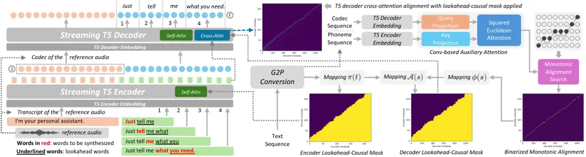

Du Roche Lai NVIDIAChina NVIDIAUSA

# Streaming T5-based Text-to-Speech Synthesis with Limited Lookahead

Muyang    Jason    Junjie Affiliation:  Affiliation: 

###### Abstract

Streaming text-to-speech synthesis in cascaded LLM-TTS systems still
faces latency challenges as most TTS models require full context before
initiating generation. We present S5-TTS, a Streaming variant of T5-TTS
that enables low-latency, word-by-word incremental speech synthesis
through encoder-decoder language modeling and monotonic alignment
learning. S5-TTS begins generating speech immediately after receiving
the first few words, substantially reducing end-to-end response latency.
To maintain quality under limited lookahead, we introduce a
lookahead-causal masking mechanism with Conv-based auxiliary attention
that preserves intelligibility and speaker similarity, and employ
interleaved multi-source distillation to further restore naturalness.
Experiments show that S5-TTS achieves comparable quality to full-context
T5-TTS, supports zero-shot synthesis with high speaker similarity, and
significantly reduces end-to-end latency for practical conversational AI
systems.  ¹¹ 1 Audio samples:
[https://s5-tts.github.io/](https://s5-tts.github.io/)

###### keywords

speech synthesis, streaming tts, incremental tts, low-latency tts,
zero-shot tts

^(†)^(†)email: {myrond,jroche,julienl}@nvidia.com^(†)^(†)footnotetext:
Accepted at Interspeech 2026.

## 1 Introduction

Large language models (LLMs) have become the cornerstone of generative
AI, with state-of-the-art models adopting either decoder-only \[1, 2,
3\] or encoder-decoder architectures \[4, 5, 6\]. Recent advances in
neural audio codecs \[7, 8\] have enabled speech to be represented as
discrete tokens, paving the way for LLM-based text-to-speech (TTS)
models in both decoder-only \[9, 10, 11\] and encoder-decoder forms
\[12, 13, 14\]. Compared to traditional TTS models \[15, 16\], LLM-based
TTS models benefit from large-scale training, resulting in significantly
improved naturalness and diversity of generated speech. Unlike
text-to-text modeling, where alignment is flexible, TTS typically
exhibits near-monotonic alignment between text and speech. This property
is difficult to capture with decoder-only models that rely solely on
self-attention but can be effectively modeled through cross-attention in
encoder-decoder architecture. For instance, T5-TTS \[13\] explicitly
encourages monotonic alignment in decoder cross-attention, thereby
effectively reducing hallucinations and enhancing robustness. Although
recent Omni-modal models have emerged \[17, 18, 19\], most interactive
AI systems are still predominantly built upon a cascaded pipeline of
text LLMs followed by TTS, due to its controllability and modularity.
However, because most TTS models require full context and take full
sentences as input before synthesis begins, these systems suffer from
high end-to-end speech response latency.

Streaming incremental text-to-speech (iTTS) has been actively studied to
reduce response latency before the full input sentence becomes
available. Neural iTTS \[20\] demonstrates the feasibility of neural
incremental synthesis by adapting Tacotron \[21\] with Griffin-Lim
\[22\] and shows that lookback acoustic context is crucial for natural
prosody. Inspired by the prefix-to-prefix framework for simultaneous
translation \[23\], subsequent work \[24\] introduces the lookahead
policy into Tacotron 2 \[25\] with Parallel WaveGAN \[26\], showing that
even a single future word substantially improves naturalness. Further
analyses \[27\] quantify this effect, reporting that one-word lookahead
already recovers 88% of the full-context representation, while two-word
lookahead increases this to 94%. Speech-T \[28\] extends the idea with a
transducer-based architecture for unified ASR and TTS, likewise
confirming that lookahead is sufficient to close the gap with
non-streaming quality. More recently, InstantSpeech \[29\] reduces iTTS
latency further with a fully parallel design inspired by FastPitch
\[15\] and Causal HiFi-GAN \[30\], while leveraging knowledge
distillation to mitigate degradation under limited lookahead.
Collectively, these studies establish a solid foundation for streaming
iTTS and highlight the critical role of lookahead. Nevertheless,
existing approaches remain restricted to single-speaker or few-speaker
setups and show limitations in naturalness and zero-shot synthesis.

In this paper, we propose S5-TTS, a streaming variant of T5-TTS that
enables low-latency, word-by-word incremental speech synthesis via
encoder-decoder language modeling and monotonic alignment learning. Our
key contributions are as follows: (1) S5-TTS can initiate speech
synthesis immediately after the first few words become available,
substantially reducing response latency in cascaded streaming LLM-TTS
systems; (2) we introduce a lookahead-causal masking mechanism enabled
by a Conv-based auxiliary attention, which allows the model to maintain
high intelligibility and speaker similarity under limited lookahead; (3)
we adopt an interleaved multi-source distillation strategy to
effectively restore speech naturalness under limited lookahead; and (4)
extensive experiments demonstrate that S5-TTS produces natural and
intelligible speech comparable to the full-context T5-TTS, supports
zero-shot synthesis for unseen speakers with high speaker similarity,
and significantly reduces end-to-end speech response latency.

## 2 Proposed Method

### 2.1 Model Overview



Figure 1: (Left) The overall architecture of S5-TTS. (Right)
Lookahead-Causal Masks and Conv-based Auxiliary Attention.

S5-TTS adopts a T5-based architecture, consisting of a parallel
Transformer encoder and an autoregressive Transformer decoder. The
encoder takes as input a phoneme sequence obtained via G2P conversion.
At each decoding step, the decoder consumes the sum of the embeddings of
the $`K`$ codec tokens predicted at the previous step and jointly
predicts $`K`$ new codec tokens, each corresponding to one codebook in a
Finite Scalar Quantization (FSQ) \[31\] audio codec. For each codebook,
an embedding table is used, and its codec token is predicted using a
dedicated linear projection head. As shown in Figure 1, S5-TTS is
conditioned on reference audio during synthesis. Specifically, the
transcript of the reference audio is concatenated with the target text
as the encoder input, while the corresponding codec frames serve as a
prompt to the decoder to guide generation.

Unlike T5-TTS, both the encoder and decoder in S5-TTS operate in a
word-level streaming manner. For each word to be synthesized, the
encoder processes the current word together with all preceding words and
$`k`$ lookahead words, while the decoder autoregressively generates the
codec chunk of the current word. During generation, the same lookahead
setting is applied to G2P conversion for consistency, and we monitor the
average cross-attention weights across all heads at each decoding step
to identify word boundaries. Specifically, at decoder step $`s`$ while
synthesizing word $`i`$, if the most attended encoder position shifts
into the lookahead region, we consider the generation of word $`i`$ to
be complete. The completion flag $`c_{s}^{i}`$ for word $`i`$ at
decoding step $`s`$ is defined as:

```math
c_{s}^{i}=\operatorname{argmax}(\alpha_{s})>\Biggl[\left(\sum_{j=1}^{i}W_{j}\right)-1\Biggr] \tag{1}
```

where $`\alpha_{s}`$ denotes the cross-attention weight vector over all
encoder steps at decoder step $`s`$, with the $`\operatorname{argmax}`$
index starting from 0, and $`W_{j}`$ representing the number of encoder
steps corresponding to word $`j`$. When the final word of the target
text enters the lookahead window, we stop monitoring the word completion
flags and continue decoding until the decoder generates the final stop
token. The codec chunk generated for word $`i`$ is converted into a
waveform chunk by the FSQ codec decoder. To ensure smooth transitions
between adjacent waveform chunks, we apply an overlap of two codec
frames and perform crossfading using coefficients defined by a Hanning
window.

To enable S5-TTS to operate under limited lookahead, we apply
lookahead-causal masks to both the encoder and decoder, denoted as
$`M^{\mathrm{enc}}`$ and $`M^{\mathrm{dec}}`$, respectively. The encoder
mask $`M^{\mathrm{enc}}`$ restricts each word’s encoder steps to attend
only to the current word, all preceding words, and $`k`$ lookahead
words. Likewise, the decoder mask $`M^{\mathrm{dec}}`$ constrains each
word’s decoder steps to cross-attend only to the corresponding encoder
steps of the current word, all preceding words, and $`k`$ lookahead
words. To ensure consistency between training and inference, both masks
are applied in both phases. The construction of $`M^{\mathrm{dec}}`$
relies on an auxiliary attention module that is jointly trained with the
encoder-decoder backbone using the auxiliary loss
$`\mathcal{L}_{\text{aux}}`$. Detailed definitions of
$`M^{\mathrm{enc}}`$, $`M^{\mathrm{dec}}`$, and
$`\mathcal{L}_{\text{aux}}`$ are provided in the following subsections.
Following T5-TTS, we additionally apply a Connectionist Temporal
Classification (CTC) \[32\] loss to the cross-attention weight matrix
$`\alpha`$, obtained by normalizing the cross-attention scores over
encoder steps, to encourage monotonic alignments during training.

Formally, let $`T`$ and $`S`$ denote the numbers of encoder and decoder
steps, respectively, and let each codebook have $`V`$ discrete codec
tokens. The overall loss is defined as:

```math
\displaystyle\mathcal{L} \displaystyle=\text{CE}\big(\text{softmax}(z),y\big)+\text{CTCLoss}(\alpha,\omega)+\mathcal{L}_{\text{aux}} \tag{2}
```

where $`z\in\mathbb{R}^{S\times Q\times V}`$ denotes the decoder output
logits, $`y`$ denotes the ground-truth codec frames, and
$`\omega=\{1,\dots,T\}`$ denotes the ideal monotonic alignment path over
encoder steps.

### 2.2 Lookahead-Causal Masks

Given a text with $`N`$ words, which may be either a full sequence
(during training) or a partial sequence with lookahead words (during
incremental inference), the encoder steps corresponding to the $`n`$-th
word are denoted by the set $`W_{n}`$, where $`n\in\{1,\dots,N\}`$.
Encoder steps are indexed by $`t,t^{\prime}\in\{1,\dots,T\}`$, and
decoder steps by $`s\in\{1,\dots,S\}`$.

#### 2.2.1 Encoder Mask Definition

In the encoder, the mask is applied to the self-attention heads in all
layers. Let $`\pi(t)`$ denote the mapping from encoder step $`t`$ to its
corresponding word index. The encoder mask
$`M^{\mathrm{enc}}\in\{0,1\}^{T\times T}`$ with $`k`$ lookahead words is
defined as:

```math
M^{\mathrm{enc}}_{t,t^{\prime}}=\begin{cases}1,&t^{\prime}\in\bigl(\bigcup_{q=1}^{\pi(t)}W_{q}\bigr)\cup\bigl(\bigcup_{q=\pi(t)+1}^{\min(\pi(t)+k,\,N)}W_{q}\bigr)\\
0,&\text{otherwise}\end{cases} \tag{3}
```

where $`\pi(t)`$ can be directly obtained from the G2P conversion.

#### 2.2.2 Decoder Mask Definition

In the decoder, the mask is applied to the cross-attention heads in all
layers. Let $`\mathcal{A}(s)`$ denote the mapping from decoder step
$`s`$ to its corresponding word index. The decoder mask
$`M^{\mathrm{dec}}\in\{0,1\}^{S\times T}`$ with $`k`$ lookahead words is
defined as:

```math
M^{\mathrm{dec}}_{s,t}=\begin{cases}1,&t\in\left(\bigcup_{q=1}^{\mathcal{A}(s)}W_{q}\right)\cup\left(\bigcup_{q=\mathcal{A}(s)+1}^{\min(\mathcal{A}(s)+k,N)}W_{q}\right)\\
0,&\text{otherwise}\end{cases} \tag{4}
```

where $`\mathcal{A}(s)`$ is obtained by first mapping decoder step $`s`$
to the corresponding encoder phoneme, and then to its word:

```math
\mathcal{A}(s)=\pi(\phi(s)) \tag{5}
```

where $`\phi(s)`$ maps decoder step $`s`$ to its corresponding encoder
step, representing the alignment between phonemes and codec frames.
Although this alignment can be inferred from decoder cross-attention, it
is required beforehand to construct the mask. We therefore predict
$`\phi(s)`$ using an auxiliary attention module.

#### 2.2.3 Conv-based Auxiliary Attention

Let $`Q`$ denote the decoder embedded codec frames and $`K`$ denote the
encoder embedded phonemes. We first project them into a common attention
space of dimension $`C`$ by $`f_{Q}`$ and $`f_{K}`$:

```math
Q^{\prime}=f_{Q}(Q),\quad K^{\prime}=f_{K}(K) \tag{6}
```

where both $`f_{Q}`$ and $`f_{K}`$ consist of a 3×3 convolution with
ReLU activation followed by a 1×1 convolution.

The attention weights $`e\in\mathbb{R}^{S\times T}`$ between the
$`s`$-th decoder step and the $`t`$-th encoder step are computed using
the scaled negative squared Euclidean distance between projected
$`Q^{\prime}`$ and $`K^{\prime}`$, and then normalized with a softmax
over the encoder steps:

```math
e_{s,t}=\operatorname{softmax}(-\delta\sum_{c=1}^{C}\left(Q^{\prime}_{c,s}-K^{\prime}_{c,t}\right)^{2}) \tag{7}
```

Then the binarized alignment $`\hat{A}\in\{0,1\}^{S\times T}`$ can be
obtained by taking the logarithm of the attention weights followed by
Monotonic Alignment Search (MAS) \[33\], defined as:

```math
\hat{A}_{s,t}=\operatorname{MAS}(\log(e_{s,t})) \tag{8}
```

Subsequently, the mapping $`\phi(s)`$ from decoder step $`s`$ to its
corresponding encoder step is given by:

```math
\phi(s)=\min\Big\{t\,\big|\,\left(\sum_{i=1}^{t}\sum_{s^{\prime}=1}^{S}\hat{A}_{s^{\prime},i}\right)\geq s\Big\} \tag{9}
```

During training, the auxiliary attention is jointly optimized with the
S5-TTS backbone using the CTC loss, defined as:

```math
\mathcal{L}_{\text{aux}}=\text{CTCLoss}(e,\omega) \tag{10}
```

During inference, auxiliary attention is used only once to obtain the
alignment of the reference audio, as $`\mathcal{A}(s)`$ for the
generation phase can be recorded during incremental decoding by tracking
the completion flags of each word.

### 2.3 Interleaved Multi-Source Distillation

Knowledge distillation has been shown to effectively improve the
naturalness of lookahead-constrained TTS models \[29\]. In this work, we
adopt a distillation strategy in which T5-TTS serves as the teacher and
S5-TTS as the student. The pretrained student is distilled with
supervision from both a paired text-audio dataset
$`\mathcal{D}_{\text{audio}}=\{(\textit{text}_{i},\textit{audio}_{i})\}`$
and a text-only dataset
$`\mathcal{D}_{\text{text}}=\{\textit{text}_{j}\}`$. For
$`\mathcal{D}_{\text{audio}}`$, the teacher generates soft labels under
decoder-side teacher forcing. For $`\mathcal{D}_{\text{text}}`$, soft
labels are obtained via autoregressive decoding with sampling. To
improve the reliability of supervision from text-only data, the decoded
utterances are passed through an ASR filter, and only samples with zero
WER are retained for distillation. During training, mini-batches from
$`\mathcal{D}_{\text{audio}}`$ and $`\mathcal{D}_{\text{text}}`$ are
interleaved within each gradient accumulation cycle, allowing their
gradients to be jointly aggregated before each parameter update. We
refer to this strategy as Interleaved Multi-Source Distillation (IMSD).

The distillation objective comprises three terms: an MSE loss on the
final decoder hidden states $`h`$, a KL divergence loss on the decoder
logits $`z`$, and a standard cross-entropy (CE) loss. The overall
distillation loss is defined as:

```math
\displaystyle\mathcal{L}_{\mathrm{distill}} \displaystyle=\lambda_{h}\,\text{MSE}(h^{\mathrm{stu}},h^{\mathrm{tea}})+\lambda_{z}\,\text{KL}(z^{\mathrm{stu}}\|z^{\mathrm{tea}}) \tag{11}
```

```math
\displaystyle+\text{CE}\big(\text{softmax}(z^{\mathrm{stu}}),y\big)
```

where $`y`$ is the ground-truth codec frames for
$`x\in\mathcal{D}_{\text{audio}}`$ and the teacher-decoded codec frames
for $`x\in\mathcal{D}_{\text{text}}`$ after ASR filtering.

## 3 Experiments

### 3.1 Experimental Setup

$`\blacksquare`$ Datasets. For initial training, both S5-TTS and T5-TTS
are trained on the full training splits of LibriTTS \[34\] and HiFiTTS
\[35\] speech datasets, comprising 845.04 hours of speech from 2,319
speakers. For distillation, we use the same speech datasets together
with additional conversational text sampled from UltraChat-200k \[36\].
These sentences are synthesized by the T5-TTS teacher using randomly
selected reference audio from the LibriTTS and HiFiTTS training sets,
and subsequently filtered by the Parakeet-TDT \[37\] 0.6B ASR model.
This process yields 1.3 million utterances, corresponding to 3,827.50
hours of synthetic speech with soft labels for distillation.

$`\blacksquare`$ Model Architectures. S5-TTS comprises 4 encoder layers
and 8 decoder layers, each with 8 attention heads. Both the encoder and
decoder use 768-dimensional embeddings, a feed-forward hidden size of
4096, and a dropout rate of 0.1, resulting in 160 million parameters.
For T5-TTS, we adopt the same architecture described in its original
paper. Both S5-TTS and T5-TTS employ the NeMo pretrained FSQ Mel codec
model \[38\] with 8 codebooks. This codec model encodes 22.05 kHz audio
at 86.1 tokens per second with 80 bits per token, corresponding to a
bitrate of 6.9 kbps. We use the phonemizer \[39\] for G2P conversion and
adopt IPA as the phoneme set. In the auxiliary attention module, scaling
factor $`\delta`$ is empirically set to $`5\times 10^{-5}`$.

$`\blacksquare`$ Training and Evaluation. All models are trained on 4
NVIDIA B200 GPUs with a mini-batch size of 32 and a gradient
accumulation factor of 4, resulting in an effective batch size of 128.
Training is conducted for 250,000 steps using the AdamW \[40\]
optimizer. The learning rate is linearly warmed up to
$`2\times 10^{-4}`$ over the first 10,000 steps, and then decayed to
$`1\times 10^{-4}`$ following a cosine schedule. For distillation, we
finetune the pretrained model using a fixed learning rate of
$`1\times 10^{-4}`$ for 100,000 steps with $`\lambda_{h}=10.0`$ and
$`\lambda_{z}=1.0`$. Training is performed in a purely language-modeling
manner without reference audio. During inference, multinomial top-$`k`$
sampling is applied with $`k=80`$ and temperature 0.85. For evaluation,
we primarily compare S5-TTS with T5-TTS, as both models adopt an
encoder-decoder architecture and support zero-shot synthesis, allowing a
more meaningful comparison than prior incremental TTS models that are
restricted to single or few-speaker training settings. For comparison
with other AR and NAR TTS models, we use their publicly released
checkpoints. Subjective Mean Opinion Score (MOS) evaluation and
preference tests are conducted on Prolific \[41\] with 20 native English
speakers.

### 3.2 Discussion

Analysis of Intelligibility and Speaker Similarity: We analyze the
effect of the lookahead parameter $`k`$ on S5-TTS by training three
model variants with $`k=1,2,`$ and $`3`$, and comparing them to T5-TTS
and ground-truth. Intelligibility is evaluated using WER and CER
computed by the Parakeet-TDT 0.6B ASR model, while speaker similarity is
measured as the cosine similarity between WavLM \[42\] embeddings of
synthesized and ground-truth utterances. For both LibriTTS (including
_test-clean_ and _test-other_) and VCTK \[43\], we randomly select 200
test utterances from unseen speakers for evaluation.

|                    |                |       |                    |                    |                   |                    |
| ------------------ | -------------- | ----- | ------------------ | ------------------ | ----------------- | ------------------ |
| Eval Set           | Model          | $`k`$ | CER $`\downarrow`$ | WER $`\downarrow`$ | SSIM $`\uparrow`$ | UTMOS $`\uparrow`$ |
| LibriTTS (Unseen)  | Ground Truth   | -     | 0.91%              | 2.02%              | 1.0000            | 3.79               |
|                    | T5-TTS         | -     | 2.05%              | 3.20%              | 0.9356            | 3.77               |
|                    | S5-TTS         | 1     | 1.68%              | 3.03%              | 0.9376            | 3.63               |
|                    |                | 2     | 2.12%              | 3.49%              | 0.9328            | 3.66               |
|                    |                | 3     | 4.90%              | 7.27%              | 0.9335            | 3.58               |
|                    | S5-TTS w/ IMSD | 2     | 1.47%              | 2.65%              | 0.9340            | 3.72               |
| VCTK (Unseen)      | Ground Truth   | -     | 0.56%              | 1.82%              | 1.0000            | 3.91               |
|                    | T5-TTS         | -     | 1.27%              | 1.63%              | 0.9379            | 3.99               |
|                    | S5-TTS         | 1     | 0.98%              | 1.51%              | 0.9350            | 3.88               |
|                    |                | 2     | 1.09%              | 1.80%              | 0.9378            | 3.91               |
|                    |                | 3     | 4.02%              | 5.70%              | 0.9291            | 3.86               |
|                    | S5-TTS w/ IMSD | 2     | 0.70%              | 1.11%              | 0.9362            | 3.93               |
| UltraChat (Unseen) | T5-TTS         | -     | 0.75%              | 1.06%              | 0.9776            | 4.28               |
|                    | S5-TTS         | 2     | 0.29%              | 0.97%              | 0.9798            | 4.13               |
|                    | S5-TTS w/ IMSD | 2     | 0.27%              | 0.83%              | 0.9791            | 4.17               |

Table 1: Intelligibility, speaker similarity, and naturalness.

As shown in Table 1, S5-TTS achieves intelligibility and speaker
similarity comparable to T5-TTS when using one or two lookahead words.
With $`k=1`$, S5-TTS even achieves lower WER than T5-TTS, which may be
attributed to the limited lookahead encouraging the model to focus more
on the current word during synthesis. In contrast, increasing $`k`$ to 3
leads to a degradation in intelligibility, suggesting that larger
lookahead is not always beneficial, as excessive future context may
instead distract the model and result in less precise alignment. In
addition, UTMOS \[44\] indicates that setting $`k=2`$ results in more
natural-sounding speech than $`k=1`$. To validate this observation, we
conduct a preference test on 50 paired LibriTTS samples with 20
evaluators comparing the $`k=1`$ and $`k=2`$ variants. The results
indicate that the $`k=2`$ variant is preferred in 65.9% of the
comparisons. Therefore, we adopt $`k=2`$ as the optimal trade-off for
distillation and subsequent evaluations.

| Model Variant | CER $`\downarrow`$ | WER $`\downarrow`$ | Ins. $`\downarrow`$ | Del. $`\downarrow`$ | Sub. $`\downarrow`$ | SSIM $`\uparrow`$ |
| ------------- | ------------------ | ------------------ | ------------------- | ------------------- | ------------------- | ----------------- |
| S5-TTS        | 2.12%              | 3.49%              | 0.66%               | 1.01%               | 0.46%               | 0.9328            |
| w/o both LCMs | 12.53%             | 14.20%             | 10.20%              | 1.00%               | 1.33%               | 0.9310            |
| w/o enc. LCM  | 33.04%             | 40.15%             | 26.54%              | 2.55%               | 3.96%               | 0.9281            |
| w/o dec. LCM  | 3.41%              | 4.92%              | 2.32%               | 0.36%               | 0.73%               | 0.9323            |

Table 2: Ablation study of lookahead-causal masks (LCMs).

Ablation Study of Lookahead-Causal Masks: We investigate the impact of
lookahead-causal masks (LCMs) on the same LibriTTS test utterances
described earlier. As shown in Table 2, removing both LCMs leads to a
substantial degradation in intelligibility. Notably, removing only the
encoder LCM leads to an even higher WER than removing both LCMs, as the
encoder is trained on full sequences, causing the decoder to depend on
complete contextual information. During inference, the lack of future
context disrupts this dependency, leading to increased errors. In
comparison, removing both LCMs ensures consistency between training and
inference, as the model treats each input with lookahead words as a
complete sequence during inference, though overall quality degrades.
Removing the decoder LCM has a smaller but also notable impact on WER.
Overall, the results confirm that both encoder and decoder LCMs are
essential for preserving S5-TTS performance under limited lookahead.

Ablation Study of Distillation: We conduct an ablation study on the
proposed distillation method IMSD by applying it to the $`k=2`$ variant
of S5-TTS. As shown in Table 1, incorporating IMSD substantially
improves intelligibility and naturalness over the naive S5-TTS, with WER
reduced from 3.49% to 2.65% and UTMOS increased from 3.66 to 3.72 on
LibriTTS. Since UltraChat is used for distillation, we further evaluate
200 unseen UltraChat test sentences using a high-quality proprietary
female voice as reference. The distilled S5-TTS achieves the best
intelligibility among the compared variants on this set as well. No
notable change in SSIM is observed after distillation.

| Model             | Params | Data (h) | WER $`\downarrow`$ | UTMOS $`\uparrow`$ | STOI $`\uparrow`$ | PESQ $`\uparrow`$ | SSIM $`\uparrow`$ |
| ----------------- | ------ | -------- | ------------------ | ------------------ | ----------------- | ----------------- | ----------------- |
| S5-TTS w/ IMSD    | 160M   | 4.67K    | 2.65%              | 3.72               | 0.179             | 1.075             | 0.9340            |
| E2-TTS \[45\]     | 335M   | 100K     | 2.82%              | 3.65               | 0.137             | 1.071             | 0.9487            |
| FireRedTTS \[46\] | 400M   | 248K     | 4.70%              | 3.82               | 0.157             | 1.074             | 0.9229            |
| MaskGCT \[47\]    | 315M   | 100K     | 2.31%              | 3.74               | 0.156             | 1.071             | 0.9495            |
| CosyVoice \[48\]  | 300M   | 170K     | 2.46%              | 3.95               | 0.152             | 1.060             | 0.9117            |

Table 3: Comparison with other AR and NAR TTS models.

Comparison with Other TTS Models: S5-TTS is primarily designed to
provide a practical incremental synthesis approach for T5-based TTS
models. For reference, we also compare the distilled S5-TTS with
representative AR and NAR TTS models, including E2-TTS, MaskGCT,
CosyVoice, and FireRedTTS, on the same LibriTTS test utterances
described earlier. Notably, all compared baseline models are trained on
more than 100K hours of speech, whereas the distilled S5-TTS is trained
using only 4.67K hours in total. As Table 3 shows, S5-TTS outperforms
all compared models in terms of STOI \[49\] and PESQ \[50\]. In
addition, S5-TTS achieves lower WER than E2-TTS and FireRedTTS, and
yields higher UTMOS than E2-TTS.

Subjective Evaluation of Speech Quality: We conduct MOS evaluations on
the LibriTTS and UltraChat testsets. For each model, 50 audio samples
are rated by evaluators using a 5-point scale. For UltraChat, the same
reference audio sample is used as described earlier. The MOS results
with 95% confidence intervals are reported in Table 4. Despite achieving
comparable WER and SSIM, the naive S5-TTS shows a noticeable degradation
in perceived quality compared to T5-TTS. In contrast, the distilled
S5-TTS achieves MOS scores close to those of T5-TTS on both datasets,
with gaps of only 0.04 on LibriTTS and 0.09 on UltraChat. This indicates
that the proposed distillation method IMSD effectively restores the
perceived speech quality and naturalness of S5-TTS under limited
lookahead, achieving performance comparable to full-context T5-TTS.

|                    |                |                    |                    |                    |                    |
| ------------------ | -------------- | ------------------ | ------------------ | ------------------ | ------------------ |
| Eval Set           | Model          | MOS $`\uparrow`$   | RTF $`\downarrow`$ | FCL $`\downarrow`$ | E2E $`\downarrow`$ |
| LibriTTS (Unseen)  | Ground Truth   | 3.81 $`\pm`$ 0.065 | –                  | –                  | –                  |
|                    | T5-TTS         | 3.75 $`\pm`$ 0.064 | 0.728              | 0.262              | 0.728              |
|                    | S5-TTS         | 3.64 $`\pm`$ 0.067 | 0.616              | 0.181              | 0.354              |
|                    | S5-TTS w/ IMSD | 3.71 $`\pm`$ 0.062 | 0.609              | 0.169              | 0.343              |
| UltraChat (Unseen) | T5-TTS         | 4.21 $`\pm`$ 0.051 | 0.722              | 0.263              | 0.868              |
|                    | S5-TTS         | 3.99 $`\pm`$ 0.058 | 0.615              | 0.186              | 0.365              |
|                    | S5-TTS w/ IMSD | 4.12 $`\pm`$ 0.054 | 0.618              | 0.176              | 0.356              |

Table 4: MOS and Efficiency Metrics (latency in seconds).

Analysis of Model Efficiency: We compare S5-TTS with T5-TTS using naive
PyTorch on the same B200 GPU used for training. For fairness, T5-TTS
decoding is performed in a streaming manner with a fixed chunk size of
30 steps, closely matching the average step count of S5-TTS (30.2)
measured on UltraChat. As shown in Table 4, we report the Real-Time
Factor (RTF) and First-Chunk Latency (FCL) of the standalone TTS models.
S5-TTS consistently achieves lower RTF and FCL than T5-TTS, and the
distilled S5-TTS further reduces FCL. We attribute this reduction to the
improved naturalness introduced by distillation, which leads to fewer
codec frames for the initial word. We further evaluate the end-to-end
speech response latency (E2E) by integrating the TTS models with a
Llama 3.3 70B \[51\] LLM deployed via Ollama \[52\] at INT4 precision.
In this setting, S5-TTS can begin synthesis after receiving the third
word from the LLM (with $`k=2`$), whereas T5-TTS must wait for the
complete sentence, resulting in substantially higher end-to-end latency.

## 4 Conclusion

We presented S5-TTS, a streaming text-to-speech model based on language
modeling that demonstrates low-latency, word-by-word speech synthesis
under limited lookahead. S5-TTS achieves speech quality comparable to
full-context T5-TTS, supports zero-shot synthesis, and significantly
reduces response latency in cascaded LLM-TTS systems. Experimental
results underscore the feasibility of natural, truly streaming neural
TTS and its potential for practical real-time conversational AI.

## 5 Use of Generative AI Disclosure

Generative AI tools were used solely for grammar checking and language
polishing to improve the clarity of the manuscript.

## References

- \[1\] H. Touvron, T. Lavril, G. Izacard, X. Martinet, M. Lachaux, T.
  Lacroix, B. Rozière, N. Goyal, E. Hambro, F. Azhar, et al. (2023)
  Llama: open and efficient foundation language models. ArXiv preprint
  abs/2302.13971. Cited by: §1.
- \[2\] G. Team, T. Mesnard, C. Hardin, R. Dadashi, S. Bhupatiraju, S.
  Pathak, L. Sifre, M. Rivière, M. S. Kale, J. Love, et al. (2024)
  Gemma: open models based on gemini research and technology. ArXiv
  preprint abs/2403.08295. Cited by: §1.
- \[3\] A. Yang, A. Li, B. Yang, B. Zhang, B. Hui, B. Zheng, B. Yu, C.
  Gao, C. Huang, C. Lv, et al. (2025) Qwen3 technical report. ArXiv
  preprint abs/2505.09388. Cited by: §1.
- \[4\] H. W. Chung, L. Hou, S. Longpre, B. Zoph, Y. Tay, W. Fedus, Y.
  Li, X. Wang, M. Dehghani, S. Brahma, et al. (2024) Scaling
  instruction-finetuned language models. Journal of Machine Learning
  Research 25 (70), pp. 1–53. Cited by: §1.
- \[5\] B. Zhang, F. Moiseev, J. Ainslie, P. Suganthan, M. Ma, S.
  Bhupatiraju, F. Lebron, O. Firat, A. Joulin, and Z. Dong (2025)
  Encoder-decoder gemma: improving the quality-efficiency trade-off via
  adaptation. ArXiv preprint abs/2504.06225. Cited by: §1.
- \[6\] B. Zhang, P. Suganthan, G. Liu, I. Philippov, S. Dua, B.
  Hora, K. Black, G. Martins, O. Sanseviero, S. Pathak, et al. (2025)
  T5Gemma 2: seeing, reading, and understanding longer. ArXiv preprint
  abs/2512.14856. Cited by: §1.
- \[7\] N. Zeghidour, A. Luebs, A. Omran, J. Skoglund, and M.
  Tagliasacchi (2021) Soundstream: an end-to-end neural audio codec.
  IEEE/ACM Transactions on Audio, Speech, and Language Processing 30,
  pp. 495–507. Cited by: §1.
- \[8\] R. Kumar, P. Seetharaman, A. Luebs, I. Kumar, and K.
  Kumar (2023) High-fidelity audio compression with improved RVQGAN. In
  Advances in Neural Information Processing Systems 36: Annual
  Conference on Neural Information Processing Systems 2023, NeurIPS
  2023, New Orleans, LA, USA, December 10 - 16, 2023, A. Oh, T.
  Naumann, A. Globerson, K. Saenko, M. Hardt, and S. Levine (Eds.),
  Cited by: §1.
- \[9\] E. Kharitonov, D. Vincent, Z. Borsos, R. Marinier, S. Girgin, O.
  Pietquin, M. Sharifi, M. Tagliasacchi, and N. Zeghidour (2023) Speak,
  read and prompt: high-fidelity text-to-speech with minimal
  supervision. Transactions of the Association for Computational
  Linguistics 11, pp. 1703–1718. External Links:
  [Document](https://dx.doi.org/10.1162/tacl%5Fa%5F00618) Cited by: §1.
- \[10\] S. Chen, C. Wang, Y. Wu, Z. Zhang, L. Zhou, S. Liu, Z. Chen, Y.
  Liu, H. Wang, J. Li, et al. (2025) Neural codec language models are
  zero-shot text to speech synthesizers. IEEE Transactions on Audio,
  Speech and Language Processing. Cited by: §1.
- \[11\] X. Wang, M. Jiang, Z. Ma, Z. Zhang, S. Liu, L. Li, Z. Liang, Q.
  Zheng, R. Wang, X. Feng, et al. (2025) Spark-tts: an efficient
  llm-based text-to-speech model with single-stream decoupled speech
  tokens. arXiv preprint arXiv:2503.01710. Cited by: §1.
- \[12\] J. Ao, R. Wang, L. Zhou, C. Wang, S. Ren, Y. Wu, S. Liu, T.
  Ko, Q. Li, Y. Zhang, Z. Wei, Y. Qian, J. Li, and F. Wei (2022)
  SpeechT5: unified-modal encoder-decoder pre-training for spoken
  language processing. In Proceedings of the 60th Annual Meeting of the
  Association for Computational Linguistics (Volume 1: Long Papers), S.
  Muresan, P. Nakov, and A. Villavicencio (Eds.), Dublin, Ireland,
  pp. 5723–5738. External Links:
  [Document](https://dx.doi.org/10.18653/v1/2022.acl-long.393) Cited by:
  §1.
- \[13\] P. Neekhara, S. Hussain, S. Ghosh, J. Li, and B.
  Ginsburg (2024) Improving robustness of llm-based speech synthesis by
  learning monotonic alignment. In Proc. Interspeech 2024,
  pp. 3425–3429. Cited by: §1.
- \[14\] E. Battenberg, R. Skerry-Ryan, D. Stanton, S. Mariooryad, M.
  Shannon, J. Salazar, and D. T. Kao (2025) Robust and unbounded length
  generalization in autoregressive transformer-based text-to-speech. In
  Proceedings of the 2025 Conference of the Nations of the Americas
  Chapter of the Association for Computational Linguistics: Human
  Language Technologies (Volume 1: Long Papers), L. Chiruzzo, A. Ritter,
  and L. Wang (Eds.), Albuquerque, New Mexico, pp. 11789–11806. External
  Links: [Document](https://dx.doi.org/10.18653/v1/2025.naacl-long.591),
  ISBN 979-8-89176-189-6 Cited by: §1.
- \[15\] A. Lancucki (2021) Fastpitch: parallel text-to-speech with
  pitch prediction. In IEEE International Conference on Acoustics,
  Speech and Signal Processing, ICASSP 2021, Toronto, ON, Canada, June
  6-11, 2021, pp. 6588–6592. External Links:
  [Document](https://dx.doi.org/10.1109/ICASSP39728.2021.9413889) Cited
  by: §1, §1.
- \[16\] J. Kim, J. Kong, and J. Son (2021) Conditional variational
  autoencoder with adversarial learning for end-to-end text-to-speech.
  In Proceedings of the 38th International Conference on Machine
  Learning, ICML 2021, 18-24 July 2021, Virtual Event, M. Meila and T.
  Zhang (Eds.), Proceedings of Machine Learning Research, Vol. 139,
  pp. 5530–5540. Cited by: §1.
- \[17\] Z. Xie and C. Wu (2024) Mini-omni: language models can hear,
  talk while thinking in streaming. ArXiv preprint abs/2408.16725. Cited
  by: §1.
- \[18\] Q. Fang, S. Guo, Y. Zhou, Z. Ma, S. Zhang, and Y. Feng (2024)
  LLaMA-omni: seamless speech interaction with large language models.
  ArXiv preprint abs/2409.06666. Cited by: §1.
- \[19\] J. Xu, Z. Guo, J. He, H. Hu, T. He, S. Bai, K. Chen, J.
  Wang, Y. Fan, K. Dang, et al. (2025) Qwen2. 5-omni technical report.
  ArXiv preprint abs/2503.20215. Cited by: §1.
- \[20\] T. Yanagita, S. Sakti, and S. Nakamura (2019) Neural itts:
  toward synthesizing speech in real-time with end-to-end neural
  text-to-speech framework. In Proceedings of the 10th ISCA speech
  synthesis workshop, pp. 183–188. Cited by: §1.
- \[21\] Y. Wang, R. J. Skerry-Ryan, D. Stanton, Y. Wu, R. J. Weiss, N.
  Jaitly, Z. Yang, Y. Xiao, Z. Chen, S. Bengio, Q. V. Le, Y.
  Agiomyrgiannakis, R. Clark, and R. A. Saurous (2017) Tacotron: towards
  end-to-end speech synthesis. In Interspeech 2017, 18th Annual
  Conference of the International Speech Communication Association,
  Stockholm, Sweden, August 20-24, 2017, F. Lacerda (Ed.),
  pp. 4006–4010. Cited by: §1.
- \[22\] D. Griffin and J. Lim (1984) Signal estimation from modified
  short-time fourier transform. IEEE Transactions on acoustics, speech,
  and signal processing 32 (2), pp. 236–243. Cited by: §1.
- \[23\] M. Ma, L. Huang, H. Xiong, R. Zheng, K. Liu, B. Zheng, C.
  Zhang, Z. He, H. Liu, X. Li, H. Wu, and H. Wang (2019) STACL:
  simultaneous translation with implicit anticipation and controllable
  latency using prefix-to-prefix framework. In Proceedings of the 57th
  Annual Meeting of the Association for Computational Linguistics, A.
  Korhonen, D. Traum, and L. Màrquez (Eds.), Florence, Italy,
  pp. 3025–3036. External Links:
  [Document](https://dx.doi.org/10.18653/v1/P19-1289) Cited by: §1.
- \[24\] M. Ma, B. Zheng, K. Liu, R. Zheng, H. Liu, K. Peng, K. Church,
  and L. Huang (2020) Incremental text-to-speech synthesis with
  prefix-to-prefix framework. In Findings of the Association for
  Computational Linguistics: EMNLP 2020, T. Cohn, Y. He, and Y. Liu
  (Eds.), Online, pp. 3886–3896. External Links:
  [Document](https://dx.doi.org/10.18653/v1/2020.findings-emnlp.346)
  Cited by: §1.
- \[25\] J. Shen, R. Pang, R. J. Weiss, M. Schuster, N. Jaitly, Z.
  Yang, Z. Chen, Y. Zhang, Y. Wang, R. Ryan, R. A. Saurous, Y.
  Agiomyrgiannakis, and Y. Wu (2018) Natural TTS synthesis by
  conditioning wavenet on MEL spectrogram predictions. In 2018 IEEE
  International Conference on Acoustics, Speech and Signal Processing,
  ICASSP 2018, Calgary, AB, Canada, April 15-20, 2018, pp. 4779–4783.
  External Links:
  [Document](https://dx.doi.org/10.1109/ICASSP.2018.8461368) Cited by:
  §1.
- \[26\] R. Yamamoto, E. Song, and J. Kim (2020) Parallel wavegan: A
  fast waveform generation model based on generative adversarial
  networks with multi-resolution spectrogram. In 2020 IEEE International
  Conference on Acoustics, Speech and Signal Processing, ICASSP 2020,
  Barcelona, Spain, May 4-8, 2020, pp. 6199–6203. External Links:
  [Document](https://dx.doi.org/10.1109/ICASSP40776.2020.9053795) Cited
  by: §1.
- \[27\] B. Stephenson, L. Besacier, L. Girin, and T. Hueber (2020) What
  the future brings: investigating the impact of lookahead for
  incremental neural TTS. In Interspeech 2020, 21st Annual Conference of
  the International Speech Communication Association, Virtual Event,
  Shanghai, China, 25-29 October 2020, H. Meng, B. Xu, and T. F. Zheng
  (Eds.), pp. 215–219. External Links:
  [Document](https://dx.doi.org/10.21437/Interspeech.2020-2103) Cited
  by: §1.
- \[28\] J. Chen, X. Tan, Y. Leng, J. Xu, G. Wen, T. Qin, and T.
  Liu (2021) Speech-t: transducer for text to speech and beyond. In
  Advances in Neural Information Processing Systems 34: Annual
  Conference on Neural Information Processing Systems 2021, NeurIPS
  2021, December 6-14, 2021, virtual, M. Ranzato, A. Beygelzimer, Y. N.
  Dauphin, P. Liang, and J. W. Vaughan (Eds.), pp. 6621–6633. Cited by:
  §1.
- \[29\] M. Du, C. Liu, and J. Lai (2025) InstantSpeech: instant
  synchronous text-to-speech synthesis for llm-driven voice chatbots. In
  ICASSP 2025-2025 IEEE International Conference on Acoustics, Speech
  and Signal Processing (ICASSP), pp. 1–5. Cited by: §1, §2.3.
- \[30\] J. Kong, J. Kim, and J. Bae (2020) HiFi-gan: generative
  adversarial networks for efficient and high fidelity speech synthesis.
  In Advances in Neural Information Processing Systems 33: Annual
  Conference on Neural Information Processing Systems 2020, NeurIPS
  2020, December 6-12, 2020, virtual, H. Larochelle, M. Ranzato, R.
  Hadsell, M. Balcan, and H. Lin (Eds.), Cited by: §1.
- \[31\] F. Mentzer, D. Minnen, E. Agustsson, and M. Tschannen (2024)
  Finite scalar quantization: VQ-VAE made simple. In The Twelfth
  International Conference on Learning Representations, ICLR 2024,
  Vienna, Austria, May 7-11, 2024, Cited by: §2.1.
- \[32\] A. Graves, S. Fernández, F. J. Gomez, and J. Schmidhuber (2006)
  Connectionist temporal classification: labelling unsegmented sequence
  data with recurrent neural networks. In Machine Learning, Proceedings
  of the Twenty-Third International Conference (ICML 2006), Pittsburgh,
  Pennsylvania, USA, June 25-29, 2006, W. W. Cohen and A. W. Moore
  (Eds.), ACM International Conference Proceeding Series, Vol. 148,
  pp. 369–376. External Links:
  [Document](https://dx.doi.org/10.1145/1143844.1143891) Cited by: §2.1.
- \[33\] J. Kim, S. Kim, J. Kong, and S. Yoon (2020) Glow-tts: A
  generative flow for text-to-speech via monotonic alignment search. In
  Advances in Neural Information Processing Systems 33: Annual
  Conference on Neural Information Processing Systems 2020, NeurIPS
  2020, December 6-12, 2020, virtual, H. Larochelle, M. Ranzato, R.
  Hadsell, M. Balcan, and H. Lin (Eds.), Cited by: §2.2.3.
- \[34\] H. Zen, V. Dang, R. Clark, Y. Zhang, R. J. Weiss, Y. Jia, Z.
  Chen, and Y. Wu (2019) LibriTTS: A corpus derived from librispeech for
  text-to-speech. In Interspeech 2019, 20th Annual Conference of the
  International Speech Communication Association, Graz, Austria, 15-19
  September 2019, G. Kubin and Z. Kacic (Eds.), pp. 1526–1530. External
  Links: [Document](https://dx.doi.org/10.21437/Interspeech.2019-2441)
  Cited by: §3.1.
- \[35\] E. Bakhturina, V. Lavrukhin, B. Ginsburg, and Y. Zhang (2021)
  Hi-fi multi-speaker english TTS dataset. In Interspeech 2021, 22nd
  Annual Conference of the International Speech Communication
  Association, Brno, Czechia, 30 August - 3 September 2021, H.
  Hermansky, H. Cernocký, L. Burget, L. Lamel, O. Scharenborg, and P.
  Motlícek (Eds.), pp. 2776–2780. External Links:
  [Document](https://dx.doi.org/10.21437/Interspeech.2021-1599) Cited
  by: §3.1.
- \[36\] N. Ding, Y. Chen, B. Xu, Y. Qin, S. Hu, Z. Liu, M. Sun, and B.
  Zhou (2023) Enhancing chat language models by scaling high-quality
  instructional conversations. In Proceedings of the 2023 Conference on
  Empirical Methods in Natural Language Processing, H. Bouamor, J. Pino,
  and K. Bali (Eds.), Singapore, pp. 3029–3051. External Links:
  [Document](https://dx.doi.org/10.18653/v1/2023.emnlp-main.183) Cited
  by: §3.1.
- \[37\] H. Xu, F. Jia, S. Majumdar, H. Huang, S. Watanabe, and B.
  Ginsburg (2023) Efficient sequence transduction by jointly predicting
  tokens and durations. In International Conference on Machine Learning,
  ICML 2023, 23-29 July 2023, Honolulu, Hawaii, USA, A. Krause, E.
  Brunskill, K. Cho, B. Engelhardt, S. Sabato, and J. Scarlett (Eds.),
  Proceedings of Machine Learning Research, Vol. 202, pp. 38462–38484.
  Cited by: §3.1.
- \[38\] NVIDIA (2024) Mel codec 22khz medium. Note:
  [https://catalog.ngc.nvidia.com/orgs/nvidia/teams/nemo/models/mel_codec_22khz_medium](https://catalog.ngc.nvidia.com/orgs/nvidia/teams/nemo/models/mel_codec_22khz_medium)Accessed:
  2026-02-17 Cited by: §3.1.
- \[39\] M. Bernard and H. Titeux (2021) Phonemizer: text to phones
  transcription for multiple languages in python. Journal of Open Source
  Software 6 (68), pp. 3958. External Links:
  [Document](https://dx.doi.org/10.21105/joss.03958),
  [Link](https://doi.org/10.21105/joss.03958) Cited by: §3.1.
- \[40\] I. Loshchilov and F. Hutter (2019) Decoupled weight decay
  regularization. In 7th International Conference on Learning
  Representations, ICLR 2019, New Orleans, LA, USA, May 6-9, 2019, Cited
  by: §3.1.
- \[41\] S. Palan and C. Schitter (2018) Prolific. ac—a subject pool for
  online experiments. Journal of behavioral and experimental finance 17,
  pp. 22–27. Cited by: §3.1.
- \[42\] S. Chen, C. Wang, Z. Chen, Y. Wu, S. Liu, Z. Chen, J. Li, N.
  Kanda, T. Yoshioka, X. Xiao, et al. (2022) Wavlm: large-scale
  self-supervised pre-training for full stack speech processing. IEEE
  Journal of Selected Topics in Signal Processing 16 (6), pp. 1505–1518.
  Cited by: §3.2.
- \[43\] J. Yamagishi, C. Veaux, and K. MacDonald (2019) CSTR VCTK
  Corpus: English Multi-speaker Corpus for CSTR Voice Cloning Toolkit
  (version 0.92). University of Edinburgh, The Centre for Speech
  Technology Research (CSTR). Note: Sound dataset External Links:
  [Document](https://dx.doi.org/10.7488/ds/2645),
  [Link](https://doi.org/10.7488/ds/2645) Cited by: §3.2.
- \[44\] T. Saeki, D. Xin, W. Nakata, T. Koriyama, S. Takamichi, and H.
  Saruwatari (2022) UTMOS: utokyo-sarulab system for voicemos challenge 2022. In 23rd Annual Conference of the International Speech
  Communication Association, Interspeech 2022, Incheon, Korea, September
  18-22, 2022, H. Ko and J. H. L. Hansen (Eds.), pp. 4521–4525. External
  Links: [Document](https://dx.doi.org/10.21437/INTERSPEECH.2022-439)
  Cited by: §3.2.
- \[45\] S. E. Eskimez, X. Wang, M. Thakker, C. Li, C. Tsai, Z. Xiao, H.
  Yang, Z. Zhu, M. Tang, X. Tan, et al. (2024) E2 tts: embarrassingly
  easy fully non-autoregressive zero-shot tts. In 2024 IEEE Spoken
  Language Technology Workshop (SLT), pp. 682–689. Cited by: Table 3.
- \[46\] H. Guo, Y. Hu, K. Liu, F. Shen, X. Tang, Y. Wu, F. Xie, K. Xie,
  and K. Xu (2024) Fireredtts: a foundation text-to-speech framework for
  industry-level generative speech applications. ArXiv preprint
  abs/2409.03283. Cited by: Table 3.
- \[47\] Y. Wang, H. Zhan, L. Liu, R. Zeng, H. Guo, J. Zheng, Q.
  Zhang, X. Zhang, S. Zhang, and Z. Wu (2025) MaskGCT: zero-shot
  text-to-speech with masked generative codec transformer. In ICLR,
  Cited by: Table 3.
- \[48\] Z. Du, Q. Chen, S. Zhang, K. Hu, H. Lu, Y. Yang, H. Hu, S.
  Zheng, Y. Gu, Z. Ma, et al. (2024) Cosyvoice: a scalable multilingual
  zero-shot text-to-speech synthesizer based on supervised semantic
  tokens. ArXiv preprint abs/2407.05407. Cited by: Table 3.
- \[49\] C. H. Taal, R. C. Hendriks, R. Heusdens, and J. Jensen (2010) A
  short-time objective intelligibility measure for time-frequency
  weighted noisy speech. In 2010 IEEE International Conference on
  Acoustics, Speech and Signal Processing, Vol. , pp. 4214–4217.
  External Links:
  [Document](https://dx.doi.org/10.1109/ICASSP.2010.5495701) Cited by:
  §3.2.
- \[50\] A.W. Rix, J.G. Beerends, M.P. Hollier, and A.P. Hekstra (2001)
  Perceptual evaluation of speech quality (pesq)-a new method for speech
  quality assessment of telephone networks and codecs. In 2001 IEEE
  International Conference on Acoustics, Speech, and Signal Processing.
  Proceedings (Cat. No.01CH37221), Vol. 2, pp. 749–752 vol.2. External
  Links: [Document](https://dx.doi.org/10.1109/ICASSP.2001.941023) Cited
  by: §3.2.
- \[51\] A. Grattafiori, A. Dubey, A. Jauhri, A. Pandey, A. Kadian, A.
  Al-Dahle, A. Letman, A. Mathur, A. Schelten, A. Vaughan, et al. (2024)
  The llama 3 herd of models. ArXiv preprint abs/2407.21783. Cited by:
  §3.2.
- \[52\] Ollama Note: Accessed: 2026-02-17 External Links:
  [Link](https://ollama.com) Cited by: §3.2.
