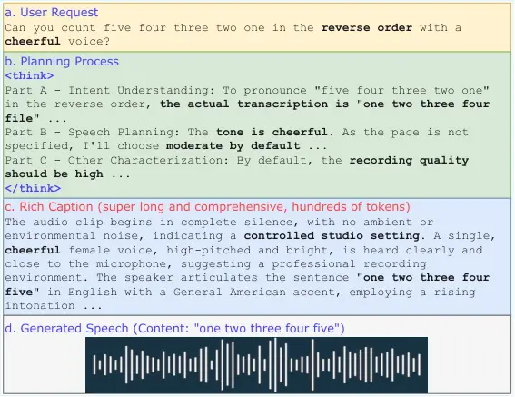
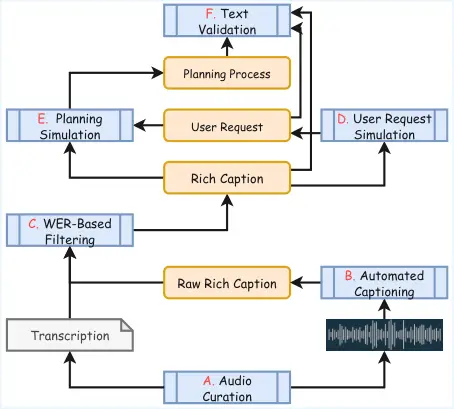

Tian Wang Arora Maekaku Goto Sakuma Shinohara Yang Watanabe

# Bagpiper-TTS: Natural Language Guided Universal Speech Synthesis

Jinchuan    Haoran    Siddhant    Takashi    Keita    Jin    Yusuke   
Chao-Han Huck    Shinji

###### Abstract

Classical TTS systems typically rely on rigid input formats and
predefined metadata slots, limiting their ability to fulfill flexible
user requirements. This paper introduces Bagpiper-TTS, a universal
speech synthesis system that deals with diverse natural language user
requests. Given a natural language prompt, Bagpiper-TTS first reasons
over the user’s intent to derive a rich caption, i.e., a comprehensive
textual blueprint encompassing both transcription and nuanced metadata.
Subsequently, this caption guides the synthesis of the target speech.
Our model inherently supports a broad spectrum of tasks besides
classical TTS applications, including multi-talker, intent-to-speech,
role-play synthesis, singing voice synthesis, and more. Experimental
results demonstrate that Bagpiper-TTS achieves an $`1.7\%`$ Word Error
Rate (WER) on the Seed-TTS-Eval benchmark and match the performance of
dedicated models in both LLM-as-a-judge and human subjective evaluations
across multiple applications.¹¹ 1 Demo, code, data, and checkpoints are
available at our [\textcolorblue
HomePage](https://bagpipertts.github.io/bagpiper_tts_demo/).

###### keywords

Speech Language Model, Text-to-Speech, Rich Caption

^(†)^(†)address: ¹ Language Technologies Institute, Carnegie Mellon
University  
² LY Corporation  ³ NVIDIA Research ^(†)^(†)email:
jinchuat@andrew.cmu.edu

## 1 Introduction

Traditional text-to-speech (TTS) systems are primarily engineered to
synthesize speech from text transcriptions, often augmented by specific
metadata such as speaker identity, language, emotion, and stress \[1,
2\]. To incorporate these attributes, early designs rely on specialized,
disjointed modules (e.g., dedicated speaker encoders) to capture
paralinguistic information \[3, 4\]. While recent advancements in large
language models (LLMs) \[5, 6, 7, 8, 9, 10\], diffusion-based \[11, 12,
13, 14\] models, and their hybrid \[15, 16\] have significantly enhanced
fidelity and naturalness, they largely inherit this rigid input
paradigm. These models typically require structured, predefined metadata
slot filling, which creates a fundamental mismatch with real-world
applications where user requests are inherently fluid, unpredictable,
and highly varied.

Furthermore, as the scope of TTS expands to include complex tasks such
as multi-talker dialogue \[17, 6\] and immersive role-play \[18\], the
demand for intricate control over speech attributes has grown
considerably. Current architectures struggle to integrate these diverse
functionalities into a single, cohesive framework without sacrificing
flexibility or increasing pipeline complexity. To bridge this gap, we
argue for a shift toward a natural language interface capable of
interpreting free-form user requests through a human-centric approach.
Such an interface allows TTS systems to move beyond the constraints of
fixed metadata slots, instead adapting dynamically to the nuanced
requirements of any user-defined scenarios.

Figure 1: The Planning-Caption-Generation Workflow of Bagpiper-TTS to
address general-purpose text-to-speech request. Content is abbreviated.

This paper presents Bagpiper-TTS, a framework designed to resolve the
limitations of traditional, rigid TTS systems by mediating free-form
user requests through rich captions \[19, 20, 21, 22\]. As shown in
Fig.1.c, these captions serve as a comprehensive textual blueprint,
meticulously encoding both the transcription and a wide spectrum of
paralinguistic metadata. Given the user request, the model first
interprets the user’s intent through a planning process within the text
domain, subsequently synthesizing a highly detailed rich caption that
acts as a generation blueprint. By leveraging captions that can scale up
to hundreds of tokens for a 30-second speech clip, the pipeline
theoretically accommodates any arbitrary user inputs, translating
diverse natural language instructions into high-fidelity speech.

Bagpiper-TTS is built upon existing Bagpiper-Base \[23\], an audio
foundational model pre-trained extensively on large-scale
rich-caption-to-speech tasks with strong text planning capability
preserved. As rich captions contain comprehensive metadata for speech,
such pre-training strongly aligns the natural language and speech
attributes and facilitate downstream fine-tuning. To unlock the model’s
capacity for free-form instruction following, we curated a specialized
fine-tuning corpus using a sophisticated simulation pipeline. Starting
with high-quality caption-speech pairs (Fig.1.c, d), we utilized large
language models (LLMs) to reverse-engineer potential user requests
(Fig.1.a). We then constructed a text-based planning process to bridge
the gap between initial requests and final rich captions (Fig.1.b). To
ensure the highest data integrity, the resulting triplets (i.e., user
requests, planning process, and rich captions) were rigorously audited
by an LLM for logical coherence, while Gemini-3-Flash is optionally
employed as a multimodal validator to verify the consistency between the
synthesized captions and the ground-truth speech. Through this paradigm,
Bagpiper-TTS achieves robust capabilities across classical,
multi-talker, intent-to-speech, role-play synthesis, and singing voice
synthesis, all using natural language as the universal portal. We
further augmented the training set with ”general-purpose” data to
simulate the highly diverse and non-standard requests encountered in
real-world scenarios. For the classical TTS application, we validated
our approach on the Seed-TTS-Eval (En) benchmark, where Bagpiper-TTS
achieved a Word Error Rate (WER) of $`1.7\%`$ on the classical TTS task.
Extensive comparative studies on other advanced TTS applications
demonstrate that our model successfully fulfills the free-form user
requests, as confirmed by both LLM-as-a-judge metrics and human
subjective evaluations.

## 2 Bagpiper-TTS

### 2.1 Bagpiper-Base

Bagpiper-TTS is built upon existing Bagpiper-Base \[23\], an
audio-centric foundational model designed for cross-modal understanding
and synthesis. Its architecture utilizes the Qwen3-8B-Base \[24\]
decoder-only LLM as its computational backbone, which provides strong
text-only capability. To support audio generation, it tokenizes the
audio with the multi-stream X-Codec \[25\] operating at 50Hz, producing
8 discrete codes per frame as the audio predicting targets.

Bagpiper-Base was pre-trained on 600 billion tokens, including
caption-to-audio synthesis, audio-to-caption understanding, and pure
text modeling. Its pre-training spans speech, music, and environmental
sounds, so it can support universal audio generation in the downstream.
This large-scale pre-training ensures a robust alignment between
detailed textual descriptions and their corresponding acoustic
realizations while preserving the backbone’s native text-based reasoning
capabilities. We refer readers to \[23\] for extensive architectural and
pre-training details.

### 2.2 Natural Language as a Universal Interface

In contrast to traditional systems that rely on rigid, slot-based input
formats, Bagpiper-TTS adopts natural language as a universal interface.
This approach dynamically encodes transcriptions and standard metadata,
e.g., speaker identity and prosody, alongside complex contextual
nuances, including role-play character traits and atmospheric background
elements. By providing a human-centric interface, Bagpiper-TTS empowers
users to combine instructions using arbitrary linguistic styles and
structures, effectively bridging the gap between user intent and
acoustic execution. Consequently, the system democratizes sophisticated
speech synthesis, shifting the requirement away from technical expertise
toward basic natural language proficiency, making high-quality TTS
accessible to non-expert users.

Planning-Caption-Generation Workflow: To process flexible natural
language requests, Bagpiper-TTS follows a three-stage hierarchical
workflow (see Fig. 1) that is executed entirely in an end-to-end manner
within a single unified model. Textual Planning: The model performs an
initial reasoning step to comprehend user intent, outlining a conceptual
summary that includes transcription layouts, speech events, and
stylistic constraints. Rich Caption Synthesis: Based on the planning
output, the model generates a comprehensive rich caption, a dense
textual blueprint that formalizes the paralinguistic and acoustic
requirements. Speech Generation: The rich caption serves as the direct
guidance for speech synthesis. This stage leverages the strong
caption-to-speech alignment established during the Bagpiper-Base
pre-training phase, ensuring high-fidelity adherence to the user’s
original request.

### 2.3 Fine-Tuning Data Simulation

#### 2.3.1 Data Simulation Pipeline

Figure 2: Flowchart of fine-tuning data simulation pipeline

Our data simulation pipeline is illustrated in Fig. 2²² 2 Unless
otherwise specified, we consistently adopt Qwen3-235B-A22B-Instruct-FP8
as the primary text LLM for all data processing tasks.. The pipeline
follows a six-step procedure designed to generate free-form user
requests with corresponding model responses:

Step A: Speech Curation. For each speech synthesis application described
in §2.3.2, we first curate a set of proper speech clips, typically
accompanied by ground-truth transcriptions to serve as an anchor for
subsequent stages.³³ 3 We obtain pseudo-transcriptions with Qwen3-ASR
\[26\] if no transcription provided. Step B: Automated Captioning. We
process the speech clips through an automatic captioning model,
Qwen-30B-A3B-Captioner \[27\], to generate comprehensive rich captions.
We acknowledge that captions may contain hallucinations regarding
various acoustic or linguistic attributes. Step C: WER-Based Filtering.
To ensure the correctness of transcription in rich caption, we extract
the transcription from the rich caption using the text LLM and calculate
the Word Error Rate (WER) against the ground-truth. Examples exceeding a
specific WER threshold are discarded (e.g., 0% to enforce exact match
for most applications). Optionally, the LLM is prompted to refine the
rich caption to align with the ground-truth transcription, thereby
maximizing data retention while ensuring accuracy.

Step D: User Request Simulation. We reverse-engineer diverse user
requests by prompting the text LLM with the rich captions. To maximize
variance, we instruct the LLM to vary the request length, linguistic
style, and the ordering of metadata components (e.g., speaker identity
vs. transcription), tailored to each specific TTS application. Step E:
Planning Process Simulation. We utilize the text LLM to construct a
textual planning process that bridges the logical gap between raw user
requests and structured rich captions. This planning step systematically
addresses three parts, as in Fig.1.b: (1) interpreting user intent and
provided metadata; (2) organizing speech-specific attributes such as
speaker identity and pacing; and (3) incorporating non-speech elements
like ambient sounds and recording conditions.

Step F: Textual Consistency Validation. We validate the logical
coherence among the generated triplets, i.e., user requests, planning
processes, and rich captions. Using an LLM-as-a-judge approach, each
sample is evaluated on a scale of 1–5 across multiple task-specific
metrics (e.g., does the audio described in rich caption fulfill the user
request?). The LLM is instructed to be very picky and selective, but be
tolerant of the overly comprehensive rich captions. We retain only those
samples with an average score above 3.5 and no individual metric score
below 3.

#### 2.3.2 Target Applications

Figure 3: Example user requests for each TTS application.

Leveraging the simulation framework described in §2.2, we curate
fine-tuning datasets for a diverse suite of applications, which mimics
the free-form and flexible user requests. We further incorporate a
”general-purpose” subset to address the out-of-definition user requests.
Due to space constraints, we outline the high-level design
considerations for each application below; comprehensive implementation
details are available in our open-source codebase. Fig.3 presents
examples for each of these applications.

Classical TTS: This task represents the standard scenario where users
provide explicit transcriptions alongside direct stylistic metadata
(e.g., specific emotional labels) \[28\]. We utilize LibriTTS-R \[29\]
for neutral, prosodically consistent speech and the Genshin \[30\] and
Starrail \[31\] datasets for expressive, spontaneous speech. During user
request simulation, metadata is selectively extracted from rich captions
to mimic varied levels of user specification.

Multi-talker TTS: This application generates multi-speaker speech,
primarily in the form of spoken dialogues \[6, 17\]. To curate suitable
training speech, we merge segments from long-form recordings in
Gigaspeech \[32\] and SSSD \[33\], and utilize VibeVoice-ASR \[34\] to
capture multi-speaker intersections. In the subsequent simulation
stages, we prioritize the distinct acoustic characterization of each
speaker and the accuracy of their temporal interleaving within each
simulated textual component.

Intent-to-speech: In this novel setup, the exact transcription is absent
from the user request and must be inferred from the context (e.g., user
prompts ”Wish Bob a happy new year in a cheerful female voice” and the
system produces ”Hi, Bob, Happy New Year!”). We prompt the text LLM to
curate speech segments in Bagpiper-Base pre-training that express clear
intentions and are of high communication value. During the planning
phase, we ensure the transcription is intentionally excluded from the
user request but correctly inferred within the planning process to
maintain alignment with the synthesized speech.

Role-play TTS: Role-play TTS requires the model to infer acoustic
features indirectly from character descriptions \[18, 10\].⁴⁴ 4 This is
similar to the voice design feature in concurrent work \[10\]. For
instance, a character described as a ”senior mathematics professor” may
imply a deep, authoritative tone. We curate the expressive examples in
Bagpiper-Base pre-training and reverse-engineer the character
descriptions by text LLM based on rich captions. Validation focuses on
the logical consistency between the character description and the
inferred acoustic realized in the rich caption.

Singing Voice Synthesis (SVS): Unlike speech synthesis, SVS requires the
model to generate melodic content, often accompanied by background
music. Utilizing the singing samples in Bagpiper-Base pre-training, we
obtain the pseudo transcription via Qwen3-ASR \[26\] and relax the WER
constraints to 10% during step C to account for melodic variance. We
further enforce the inclusion of descriptive cues for background
accompaniment across all triplet components to ensure harmonic
consistency.

General-purpose TTS: To accommodate requests that fall outside the task
definition above, we randomly select 2M speech samples from the
Bagpiper-Base pre-training data to create the general-purpose subset, We
utilize Claude 4.6 Opus to produce 40 distinctive application scenarios
and ask the text LLM to pick applicable ones based on the rich captions
during step D, and simulate and validate based on that scenario in steps
E and F.

Our data does not include any system prompt, so the exact pre-defined
application is agnostic to the model. The model comprehends and reacts
to natural language user requests based on the requests only. Overall,
we curate 738k examples in total. The distribution is demonstrated in
Fig.4.

Figure 4: Fine-tuning data distribution for all applications

### 2.4 Evaluation Protocols

We evaluate the performance of Bagpiper-TTS across three distinct tiers:
classical benchmarks, specialized applications, and general-purpose
flexibility. For Classical TTS, we utilize the Seed-TTS-Eval (En)
benchmark \[16\], prompting the system to generate speech in a plain
voice.⁵⁵ 5 We do not test the speaker similarity as our system does not
accept audio prompts (e.g., reference speaker clip), as discussed in §4.

Evaluating Multi-talker, Intent-to-speech, Role-play, and Singing Voice
Synthesis presents unique challenges due to a lack of standardized
benchmarks. To address this, we simulate 300 unique user requests for
each application using GPT-OSS-120B \[35\]. To ensure the validity of
our results, the test request simulation is strictly isolated from the
fine-tuning data generation pipeline. Performance is quantified using
the Word Error Rate (WER) alongside an LLM-as-a-judge framework, where
Gemini-3-Flash scores task fulfillment on a scale of 1–5. Complementing
these metrics, we conduct a subjective evaluation via Amazon Mechanical
Turk (MTurk). 10 examples per application (derived from the full
pipeline including Gemini-based filtering) are rated by at least three
human annotators on a scale of 1–5, with 3 being acceptable. The sample
selection for subjective evaluation is totally random with no
cherry-pick.

Finally, for the General-purpose TTS tier, we forgo quantitative metrics
in favor of qualitative analysis. Researchers manually prompt the system
with hand-written, ”out-of-definition” requests to test the model’s
reasoning capabilities, with detailed observations provided in §3.3.

## 3 Experiments

### 3.1 Experimental Setup

Building upon the Bagpiper-Base foundational model, we perform
supervised fine-tuning on all our curated simulation datasets for 2
epochs to build this universal speech generation model. We utilize a
global batch size of 160k tokens and maintain a constant learning rate
of $`1\times 10^{-5}`$. During inference, we employ a decoupled
Top-$`k`$ sampling strategy for both text and speech modalities, with
specific configurations detailed in \[23\]. Notably, we apply
Classifier-Free Guidance (CFG) \[36\] with a guidance scale of
$`\lambda=3`$ during speech generation to enhance stylistic fidelity.
The fine-tuning process was completed in 16 hours using 8 NVIDIA H100
GPUs.

### 3.2 Results

We first evaluate classical TTS performance, as summarized in Table 1.
The results indicate that, despite the added complexity of natural
language prompts (where metadata and transcriptions are dynamically
interleaved), our Bagpiper-TTS generates highly intelligible speech that
is competitive with current state-of-the-art frontier models.

|                    |     |     |
| ------------------ | --- | --- |
|                    | WER |     |
| CosyVoice 2 \[37\] | 2.6 |     |
| VibeVoice \[6\]    | 3.0 |     |
| Qwen3-TTS \[10\]   | 1.5 |     |
| Ours               | 1.7 |     |

Table 1: Classic TTS evaluation results on Seed-TTS-Eval (En).
Bagpiper-TTS (ours) accepts natural language prompts.

Evaluation results for advanced applications (§2.3.2), including
multi-talker dialogue, intent-to-speech, role-play, and SVS, are
presented in Table 2. These findings confirm that Bagpiper-TTS
successfully fulfills a wide range of sophisticated synthesis tasks
through the universal natural language portal, effectively addressing
scenarios that remained underexplored in prior modular research. Across
all categories, the model maintains a consistently lower Word Error Rate
(WER) than baselines, establishing a robust performance baseline for
speech intelligibility.

In our LLM-as-a-judge evaluation, Bagpiper-TTS achieved a mean
fulfillment score of 4.09 across the four advanced applications, which
suggests the model fulfills all four applications effectively in
generally good level. The task fulfillment is additionally confirmed by
the human-as-a-judge subjective evaluation, where our Bagpipier-TTS
achieves an average score of 3.69, also proving that the proposed tasks
are effectively addressed in this early exploration. Although there is a
slight performance gap between our model and baselines (VibeVoice \[6\]
and YuE \[38\]), we note our model is a generalist model while others
are more specialized.

|                  |                      |           |      |            |
| ---------------- | -------------------- | --------- | ---- | ---------- |
|                  |                      | Objective |      | Subjective |
| Application      | Model                | WER       | TF   | MOS        |
| Multi-Talker     | VibeVoice-1.5B \[6\] | 4.6       | 3.32 | 3.77       |
|                  | Ours                 | 4.2       | 4.23 | 3.60       |
| Intent-to-Speech | Ours                 | \-        | 3.80 | 3.57       |
| Role-Play TTS    | Ours                 | 2.0       | 3.72 | 3.93       |
| SVS              | YuE \[38\]           | 11.0      | 3.75 | 3.73       |
|                  | Ours                 | 7.2       | 4.60 | 3.67       |

Table 2: Evaluation results on advanced TTS applications (§2.3.2).
Bagpiper-TTS is a single universal model that addresses all these
applications in an application-agnostic style. TF: Task Fulfillment
score judged by Gemini-3-Flash.

### 3.3 Qualitative Study

To demonstrate its versatility, we evaluate Bagpiper-TTS against
complex, free-form requests that exceed the capabilities of existing
modular systems. We observe that the model effectively interprets
non-straightforward logic; for instance, when prompted to ”count from
one to five” or ”read five four three two one in reverse order,” it
correctly reasons through the instruction to synthesize the sequence
”one two three four five”. Furthermore, the model demonstrates
sophisticated multimodal alignment by adapting both its acoustic
delivery (e.g., a soft, restrained tone) and its linguistic wording to
match nuanced requests like ”gentle criticism”, where the criticism is
expressed, but the tone and wording are both polite and decent. Beyond
the final speech, the model’s internal planning—producing autonomous
justifications such as ”the content is for children, so the delivery
should be warm”—marks a clear departure from static slot-filling. This
ability to resolve ambiguous metadata through latent judgment makes the
system significantly more robust to unpredictable human instructions. We
strongly encourage readers to listen to our demo examples on our
[\textcolorblueBagpiper-TTS
HomePage](https://bagpipertts.github.io/bagpiper_tts_demo/).

## 4 Limitations

Although we implement rigorous filtering, hallucinations persist across
various stages of data simulation and model inference, particularly
within the rich captions produced by the automated captioner.
Furthermore, while this work focuses on textual natural language as a
universal interface, we acknowledge that certain metadata are more
effectively represented through acoustic grounding (e.g., using a
reference audio prompt to define a speaker’s voice characteristics).

## 5 Conclusion

This paper introduces Bagpiper-TTS, a framework that replaces rigid
metadata inputs with a natural language interface for flexible,
free-form speech synthesis. By employing an end-to-end reasoning
workflow with rich captions, Bagpiper-TTS successfully interprets
complex user intent across diverse tasks. Our results demonstrate that
this human-centric approach achieves competitive performance on standard
benchmarks while providing unprecedented versatility, marking a
significant step toward intuitive, universal speech foundational models.

## 6 Use of Generative AI Disclosure

Generative AI tools were utilized in the preparation of this manuscript
primarily for stylistic polishing and grammatical refinement; they were
not used to author significant original technical content. Additionally,
as detailed in §2.2 and §2.3.1, Large Language Models (LLMs) and
multimodal foundational models were systematically employed within our
data simulation pipeline to generate synthetic fine-tuning datasets.

## 7 Acknowledgment

Parts of this work used the PSC Bridges2 system and Delta/DeltaAI system
at NCSA through allocations CIS210014 and IRI120008P from the ACCESS
program, supported by NSF grants \#2138259,#2138286, \#2138307,
\#2137603, and \#2138296.

## References

- \[1\] X. Tan, T. Qin, F. Soong, and T. Liu (2021) A survey on neural
  speech synthesis. arXiv preprint arXiv:2106.15561. Cited by: §1.
- \[2\] T. Xie, Y. Rong, P. Zhang, W. Wang, and L. Liu (2025) Towards
  controllable speech synthesis in the era of large language models: a
  systematic survey. In Proceedings of the 2025 Conference on Empirical
  Methods in Natural Language Processing, pp. 764–791. Cited by: §1.
- \[3\] Y. Ren, Y. Ruan, X. Tan, T. Qin, S. Zhao, Z. Zhao, and T.
  Liu (2019) FastSpeech: fast, robust and controllable text to speech.
  In Advances in Neural Information Processing Systems, H. Wallach, H.
  Larochelle, A. Beygelzimer, F. d'Alché-Buc, E. Fox, and R. Garnett
  (Eds.), Vol. 32, pp. . External Links:
  [Link](https://proceedings.neurips.cc/paper_files/paper/2019/file/f63f65b503e22cb970527f23c9ad7db1-Paper.pdf)
  Cited by: §1.
- \[4\] Y. Wang, R.J. Skerry-Ryan, D. Stanton, Y. Wu, R. J. Weiss, N.
  Jaitly, Z. Yang, Y. Xiao, Z. Chen, S. Bengio, Q. Le, Y.
  Agiomyrgiannakis, R. Clark, and R. A. Saurous (2017) Tacotron: Towards
  End-to-End Speech Synthesis. In Interspeech 2017, pp. 4006–4010.
  External Links:
  [Document](https://dx.doi.org/10.21437/Interspeech.2017-1452), ISSN
  2958-1796 Cited by: §1.
- \[5\] C. Wang, S. Chen, Y. Wu, Z. Zhang, L. Zhou, S. Liu, Z. Chen, Y.
  Liu, H. Wang, J. Li, et al. (2023) Neural codec language models are
  zero-shot text to speech synthesizers. arXiv preprint
  arXiv:2301.02111. Cited by: §1.
- \[6\] Z. Peng, J. Yu, W. Wang, Y. Chang, Y. Sun, L. Dong, Y. Zhu, W.
  Xu, H. Bao, Z. Wang, S. Huang, Y. Xia, and F. Wei (2026) VibeVoice:
  expressive podcast generation with next-token diffusion. In The
  Fourteenth International Conference on Learning Representations,
  External Links: [Link](https://openreview.net/forum?id=FihSkzyxdv)
  Cited by: §1, §1, §2.3.2, §3.2, Table 1, Table 2.
- \[7\] J. Tian, W. Chen, Y. Peng, J. Shi, S. Arora, S. Bharadwaj, T.
  Maekaku, Y. Shinohara, K. Goto, X. Yue, et al. (2025) OpusLM: a family
  of open unified speech language models. arXiv preprint
  arXiv:2506.17611. Cited by: §1.
- \[8\] S. Maiti, Y. Peng, S. Choi, J. Jung, X. Chang, and S.
  Watanabe (2024) Voxtlm: unified decoder-only models for consolidating
  speech recognition, synthesis and speech, text continuation tasks. In
  ICASSP 2024-2024 IEEE International Conference on Acoustics, Speech
  and Signal Processing (ICASSP), pp. 13326–13330. Cited by: §1.
- \[9\] D. Yang, R. Huang, Y. Wang, H. Guo, D. Chong, S. Liu, X. Wu,
  and H. Meng (2025) Simplespeech 2: towards simple and efficient
  text-to-speech with flow-based scalar latent transformer diffusion
  models. IEEE Transactions on Audio, Speech and Language Processing.
  Cited by: §1.
- \[10\] H. Hu, X. Zhu, T. He, D. Guo, B. Zhang, X. Wang, Z. Guo, Z.
  Jiang, H. Hao, Z. Guo, et al. (2026) Qwen3-tts technical report. arXiv
  preprint arXiv:2601.15621. Cited by: §1, §2.3.2, Table 1, footnote 4.
- \[11\] M. Le, A. Vyas, B. Shi, B. Karrer, L. Sari, R. Moritz, M.
  Williamson, V. Manohar, Y. Adi, J. Mahadeokar, et al. (2023) Voicebox:
  text-guided multilingual universal speech generation at scale.
  Advances in neural information processing systems 36, pp. 14005–14034.
  Cited by: §1.
- \[12\] Z. Ju, Y. Wang, K. Shen, X. Tan, D. Xin, D. Yang, Y. Liu, Y.
  Leng, K. Song, S. Tang, et al. (2024) Naturalspeech 3: zero-shot
  speech synthesis with factorized codec and diffusion models. arXiv
  preprint arXiv:2403.03100. Cited by: §1.
- \[13\] Y. Chen, Z. Niu, Z. Ma, K. Deng, C. Wang, J. JianZhao, K. Yu,
  and X. Chen (2025) F5-tts: a fairytaler that fakes fluent and faithful
  speech with flow matching. In Proceedings of the 63rd Annual Meeting
  of the Association for Computational Linguistics (Volume 1: Long
  Papers), pp. 6255–6271. Cited by: §1.
- \[14\] Y. Gao, N. Morioka, Y. Zhang, and N. Chen (2023) E3 tts: easy
  end-to-end diffusion-based text to speech. In 2023 IEEE Automatic
  Speech Recognition and Understanding Workshop (ASRU), pp. 1–8. Cited
  by: §1.
- \[15\] Z. Du, C. Gao, Y. Wang, F. Yu, T. Zhao, H. Wang, X. Lv, H.
  Wang, C. Ni, X. Shi, et al. (2025) Cosyvoice 3: towards in-the-wild
  speech generation via scaling-up and post-training. arXiv preprint
  arXiv:2505.17589. Cited by: §1.
- \[16\] P. Anastassiou, J. Chen, J. Chen, Y. Chen, Z. Chen, Z. Chen, J.
  Cong, L. Deng, C. Ding, L. Gao, et al. (2024) Seed-tts: a family of
  high-quality versatile speech generation models. arXiv preprint
  arXiv:2406.02430. Cited by: §1, §2.4.
- \[17\] Z. Ju, D. Yang, K. Shen, Y. Leng, Z. Wang, S. Liu, X. Zhou, T.
  Qin, X. Li, J. Yu, and X. Tan (2025) MoonCast: high-quality zero-shot
  podcast generation. In The Thirty-ninth Annual Conference on Neural
  Information Processing Systems, External Links:
  [Link](https://openreview.net/forum?id=MVlKSYR7HX) Cited by: §1,
  §2.3.2.
- \[18\] H. Zhang, R. Luo, X. Liu, Y. Wu, T. Lin, P. Zeng, Q. Qu, F.
  Fang, M. Yang, L. Gao, et al. (2025) Omnicharacter: towards immersive
  role-playing agents with seamless speech-language personality
  interaction. In Proceedings of the 63rd Annual Meeting of the
  Association for Computational Linguistics (Volume 1: Long Papers),
  pp. 26318–26331. Cited by: §1, §2.3.2.
- \[19\] Z. Ma, R. Xu, Z. Xing, Y. Chu, Y. Wang, J. He, J. Xu, P.
  Heng, K. Yu, J. Lin, et al. (2025) Omni-captioner: data pipeline,
  models, and benchmark for omni detailed perception. arXiv preprint
  arXiv:2510.12720. Cited by: §1.
- \[20\] C. Tang, Y. Li, Y. Yang, J. Zhuang, G. Sun, W. Li, Z. Ma,
  and C. Zhang (2025) Video-salmonn 2: captioning-enhanced audio-visual
  large language models. arXiv preprint arXiv:2506.15220. Cited by: §1.
- \[21\] J. Fiscus, J. Ajot, M. Michel, and J. Garofolo (2006) The rich
  transcription 2006 spring meeting recognition evaluation. In
  Proceedings of the Rich Transcription Spring Meeting Recognition
  Evaluation (RT-06S), Cited by: §1.
- \[22\] W. Chen, P. Seetharaman, R. Kumar, O. Nieto, S. Watanabe, J.
  Salamon, and Z. Jin (2026) AudioChat: unified audio storytelling,
  editing, and understanding with transfusion forcing. arXiv preprint
  arXiv:2602.17097. Cited by: §1.
- \[23\] J. Tian, H. Wang, B. Su, C. Huang, Q. Wang, J. Shi, W. Chen, X.
  Gong, S. Arora, C. Li, et al. (2026) Bagpiper: solving open-ended
  audio tasks via rich captions. arXiv preprint arXiv:2602.05220. Cited
  by: §1, §2.1, §2.1, §3.1.
- \[24\] A. Yang, A. Li, B. Yang, B. Zhang, B. Hui, B. Zheng, B. Yu, C.
  Gao, C. Huang, C. Lv, et al. (2025) Qwen3 technical report. arXiv
  preprint arXiv:2505.09388. Cited by: §2.1.
- \[25\] Z. Ye, P. Sun, J. Lei, H. Lin, X. Tan, Z. Dai, Q. Kong, J.
  Chen, J. Pan, Q. Liu, et al. (2025) Codec does matter: exploring the
  semantic shortcoming of codec for audio language model. In Proceedings
  of the AAAI Conference on Artificial Intelligence, Vol. 39,
  pp. 25697–25705. Cited by: §2.1.
- \[26\] X. Shi, X. Wang, Z. Guo, Y. Wang, P. Zhang, X. Zhang, Z.
  Guo, H. Hao, Y. Xi, B. Yang, et al. (2026) Qwen3-asr technical report.
  arXiv preprint arXiv:2601.21337. Cited by: §2.3.2, footnote 3.
- \[27\] Q. Team (2025) Qwen3-omni technical report. arXiv preprint
  arXiv:2509.17765. Cited by: §2.3.1.
- \[28\] D. Yang, S. Liu, R. Huang, C. Weng, and H. Meng (2024)
  Instructtts: modelling expressive tts in discrete latent space with
  natural language style prompt. IEEE/ACM Transactions on Audio, Speech,
  and Language Processing 32, pp. 2913–2925. Cited by: §2.3.2.
- \[29\] Y. Koizumi, H. Zen, S. Karita, Y. Ding, K. Yatabe, N.
  Morioka, M. Bacchiani, Y. Zhang, W. Han, and A. Bapna (2023)
  Libritts-r: a restored multi-speaker text-to-speech corpus. arXiv
  preprint arXiv:2305.18802. Cited by: §2.3.2.
- \[30\] Simon (2024) Genshin-Voice Dataset. Hugging Face. Note:
  [https://huggingface.co/datasets/simon3000/genshin-voice](https://huggingface.co/datasets/simon3000/genshin-voice)Accessed:
  2026-02-24 Cited by: §2.3.2.
- \[31\] Simon (2024) Starrail-Voice Dataset. Hugging Face. Note:
  [https://huggingface.co/datasets/simon3000/starrail-voice](https://huggingface.co/datasets/simon3000/starrail-voice)Accessed:
  2026-02-24 Cited by: §2.3.2.
- \[32\] G. Chen, S. Chai, G. Wang, J. Du, W. Zhang, C. Weng, D. Su, D.
  Povey, J. Trmal, J. Zhang, M. Jin, S. Khudanpur, S. Watanabe, S.
  Zhao, W. Zou, X. Li, X. Yao, Y. Wang, Z. You, and Z. Yan (2021)
  GigaSpeech: An Evolving, Multi-Domain ASR Corpus with 10,000 Hours of
  Transcribed Audio. In Interspeech 2021, pp. 3670–3674. External Links:
  [Document](https://dx.doi.org/10.21437/Interspeech.2021-1965), ISSN
  2958-1796 Cited by: §2.3.2.
- \[33\] Z. Sheikh, S. Shimizu, S. Arora, J. Shi, S. Cornell, X. Li,
  and S. Watanabe (2025) Scalable Spontaneous Speech Dataset (SSSD):
  Crowdsourcing Data Collection to Promote Dialogue Research. In
  Interspeech 2025, pp. 3963–3967. External Links:
  [Document](https://dx.doi.org/10.21437/Interspeech.2025-2362), ISSN
  2958-1796 Cited by: §2.3.2.
- \[34\] Z. Peng, J. Yu, Y. Chang, Z. Wang, L. Dong, Y. Hao, Y. Tu, C.
  Yang, W. Wang, S. Xu, et al. (2026) VIBEVOICE-ASR technical report.
  arXiv preprint arXiv:2601.18184. Cited by: §2.3.2.
- \[35\] S. Agarwal, L. Ahmad, J. Ai, S. Altman, A. Applebaum, E.
  Arbus, R. K. Arora, Y. Bai, B. Baker, H. Bao, et al. (2025)
  Gpt-oss-120b & gpt-oss-20b model card. arXiv preprint
  arXiv:2508.10925. Cited by: §2.4.
- \[36\] J. Ho and T. Salimans (2022) Classifier-free diffusion
  guidance. arXiv preprint arXiv:2207.12598. Cited by: §3.1.
- \[37\] Z. Du, Y. Wang, Q. Chen, X. Shi, X. Lv, T. Zhao, Z. Gao, Y.
  Yang, C. Gao, H. Wang, et al. (2024) Cosyvoice 2: scalable streaming
  speech synthesis with large language models. arXiv preprint
  arXiv:2412.10117. Cited by: Table 1.
- \[38\] R. Yuan, H. Lin, S. Guo, G. Zhang, J. Pan, Y. Zang, H. Liu, Y.
  Liang, W. Ma, X. Du, X. Du, Z. Ye, T. Zheng, Z. Jiang, Y. Ma, M.
  Liu, Z. Tian, Z. Zhou, L. Xue, X. Qu, Y. Li, S. Wu, T. Shen, Z. Ma, J.
  Zhan, C. Wang, Y. Wang, X. Chi, X. Zhang, Z. Yang, X. Wang, S. Liu, L.
  Mei, P. Li, J. Wang, J. Yu, G. Pang, X. Li, Z. Wang, X. Zhou, L.
  Yu, E. Benetos, Y. Chen, C. Lin, X. Chen, G. Xia, Z. Zhang, C.
  Zhang, W. Chen, X. Zhou, X. Qiu, R. Dannenberg, J. Liu, J. Yang, W.
  Huang, W. Xue, X. Tan, and Y. Guo (2025) YuE: scaling open foundation
  models for long-form music generation. External Links: 2503.08638,
  [Link](https://arxiv.org/abs/2503.08638) Cited by: §3.2, Table 2.
