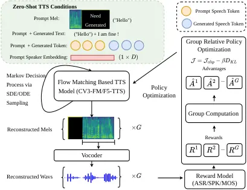

Wang Tian Li Lv Zhao Li

# FlowTTS-GRPO: Online Reinforcement Learning with Multi-Objective Reward Optimization for Flow-Matching Based Text-to-Speech

Haoxu    Biao    Weiqin    Xiang    Han    Xiangang

###### Abstract

Existing Reinforcement Learning (RL) research for Text-to-Speech (TTS)
focuses on large language models (LLMs), leaving Flow-Matching (FM)
under-explored. We present FlowTTS-GRPO, an online RL framework for
FM-based TTS. By converting ordinary differential equation (ODE)
trajectories into stochastic differential equation (SDE) paths, our
method enables direct fine-tuning of open-source FM models without
auxiliary models. We show that a weighted reward combination converges
faster than a probabilistic scheme, and identify three practical
optimizations: omitting classifier-free guidance (CFG) during training
accelerates convergence; synthesizing hard cases improves robustness;
and applying RL to the FM component enhances audio-detail metrics.
Experiments on CosyVoice 3.0 and F5-TTS demonstrate objective and
subjective preference gains in speaker similarity and perceptual
quality, with F5-TTS also improving intelligibility.

###### keywords

text-to-speech, reinforcement learning, flow-matching, group relative
policy optimization, speaker similarity, zero-shot voice cloning

^(†)^(†)address: Tongyi Lab, Alibaba Group, China ^(†)^(†)email:
{wanghaoxu.whx, tianbiao.tb, liweiqin.lwq, lyuxiang.lx, quantu.zh,
lixiangang.lxg}@alibaba-inc.com

## 1 Introduction

Text-to-speech (TTS) converts input text into audible speech and plays a
key role in human–computer interaction. Recently, researchers have
incorporated large language models (LLMs)\[1\] into TTS\[2, 3, 4, 5, 6,
7, 8, 9\]. One line of work uses LLMs’ ability to model discrete speech
tokens with in-context learning (ICL)\[2, 7, 8\]: a speech codec\[10,
11\] produces discrete tokens, an LLM autoregressively (AR) predicts
these tokens, and a decoder reconstructs the waveform. This pipeline is
constrained by the codec’s capacity and requires a trade-off between
semantic tokens and acoustic tokens\[12\]. Another approach\[13\] relies
solely on non‑autoregressive (NAR) Flow Matching (FM)\[14\]: compared
with token-decode pipelines it produces finer acoustic details and
offers faster inference than AR models, but struggles to incorporate
semantic information, predict speech duration accurately, and support
streaming. A hybrid paradigm has emerged\[4, 5, 6\], where LLMs model
semantic tokens and FM recovers acoustic detail. This scheme captures
text–token semantics while enhancing acoustic fidelity and naturalness,
outperforming earlier paradigms with higher synthesis success rates\[6,
15\].

Although LLM–FM hybrid TTS models can generate diverse speech, some
outputs remain difficult to align with human perceptual preferences.
Meanwhile, post‑training aligns models to human perception or downstream
task objectives and is applied across many generative tasks (language
understanding\[16\], image generation\[17\]), further fine‑tuning a
pretrained generative model using reinforcement learning (RL) to improve
human‑perception metrics.



Figure 1: The pipeline of our FlowTTS-GRPO post-training for CosyVoice
3.0 and F5-TTS. Prompt speech tokens, generated speech tokens, and
prompt speaker embedding are only used for CosyVoice 3.0.

In the TTS domain, RL work has largely focused on LLM‑based models.
Seed‑TTS\[9\] applies proximal policy optimization (PPO)\[18\] to
optimize Word Error Rate (WER) and speaker similarity (SS), but PPO
requires training multiple auxiliary models, is complex and unstable,
and yields noticeable improvement mainly in WER. Other works\[19, 20,
21\] use Direct Preference Optimization (DPO)\[22\] and its variants to
strengthen LLMs; although they avoid maintaining extra models during
training, they demand large numbers of human‑preference pairs, incurring
heavy inference costs and expensive annotations. DiffRO\[23\] directly
applies differentiable reward optimization on speech tokens to improve
intelligibility and expressiveness, using Gumbel‑Softmax to optimize an
Automatic Speech Recognition (ASR) loss; however, it still requires a
separately trained token‑to‑reward model and is sensitive to
reward‑model bias, which RRPO\[24\] addresses by training a more robust
reward model. \[25\] fine‑tunes LLM‑based TTS with Group Relative Policy
Optimization (GRPO) and a compound CER+NLL reward. Crucially, these
studies concentrate on LLMs and there is little RL research for FM–based
TTS. F5R‑TTS\[26\] is the first work to apply RL on FM–based TTS. It
makes preliminary RL gains in WER and SS but needs an independently
trained Gaussian FM generator to produce randomness and cannot leverage
widely used open-source models; moreover, it uses a single rollout per
prompt (rollout=1), failing to exploit multiple similar syntheses per
prompt, group-wise advantage gaps, and multi‑objective optimization.

Flow‑GRPO\[27\] is the first method to introduce online reinforcement
learning into flow‑matching models. It transforms the Ordinary
Differential Equation (ODE) trajectory into a Stochastic Differential
Equation (SDE), supplying the stochasticity required by RL and thereby
improving human‑perception metrics in image synthesis. FlowSE‑GRPO\[28\]
adapts this technique to speech enhancement. Unlike image synthesis or
speech enhancement, zero-shot TTS must jointly preserve speaker
identity, linguistic content, and perceptual quality under text and
prompt-speech conditioning. This creates reward conflicts and
architecture-specific behavior that have not been studied in prior
Flow-GRPO applications.

In this paper, we propose FlowTTS-GRPO, an online RL framework for
FM-based TTS. Our contributions are: (1) We present the first successful
introduction of Flow-GRPO to TTS by converting ODE trajectories to SDE
paths, enabling direct fine-tuning of open-source FM models without
retraining a separate stochastic generator. (2) FlowTTS-GRPO simplifies
prior RL approaches by eliminating auxiliary models (value networks,
preference pairs, token-to-reward models) and leveraging off-the-shelf
reward signals. (3) We analyze multi-objective reward conflicts in TTS
and find that weighted combination with standard deviation normalization
yields faster and more stable convergence than probabilistic
combination. (4) We identify three practical optimizations and
observations: omitting classifier-free guidance (CFG) during training
accelerates convergence, hard case synthesis enhances robustness and
accelerates RL training, and RL on FM primarily improves audio-detail
metrics while RL on LM targets intelligibility for LLM-FM hybrid models.
Experiments on CosyVoice 3.0\[6\] (LLM-FM hybrid, where intelligibility
is governed by the LM and FM controls acoustic details) and F5‑TTS\[13\]
(FM-only, where FM can improve both intelligibility and audio details)
demonstrate significant improvements in speaker similarity and
perceptual quality, with F5‑TTS also achieving reduced WER, and robust
generalization across speaker verification models, languages, and LLM
front-ends.

## 2 Methods

### 2.1 The TTS model used for RL finetuning

We select CosyVoice 3.0\[6\] (CV3) and F5‑TTS\[13\] as pretrained TTS
models for RL finetuning. Zero-shot voice-cloning refers to generating
speech in a target speaker’s voice using only a short prompt audio
without requiring explicit speaker adaptation or fine-tuning. To refine
zero-shot voice-cloning behavior, we optimize the model with respect to
its actual inference procedure. We treat a training utterance as the
prompt waveform and the prompt text, randomly sample a new target text,
run the model’s inference to synthesize a generated waveform, and use
the resulting (prompt, generated) pair as the RL training sample.

#### 2.1.1 CosyVoice 3.0

CosyVoice 3.0 is a widely used TTS system that bridges an LLM with FM;
its pipeline includes a speech tokenizer, an LM, an FM acoustic model,
and a vocoder. At inference, the speech tokenizer extracts prompt tokens
from the prompt wav. The LM autoregressively generates speech tokens
conditioned on the prompt text and the target text. The FM model,
conditioned on the concatenation of prompt and generated tokens plus the
prompt mel and prompt speaker embedding, produces the generated mel.
Finally, the vocoder\[29\] converts the generated mel into the generated
wav, yielding the cloned voice. In this paper, we optimize only the FM
component and do not fine-tune the speech tokenizer, LM, or vocoder.

#### 2.1.2 F5-TTS

F5-TTS is an FM-only TTS system consisting of an FM acoustic model and a
vocoder. At inference, the FM model conditions on the concatenation of
prompt text and generated text together with the prompt mel to produce
the generated mel. The vocoder\[30\] then converts the generated mel to
the generated wav to produce the cloned audio. In this paper, we
fine-tune only the FM component and keep the vocoder fixed.

### 2.2 FlowTTS-GRPO

#### 2.2.1 Markov Decision Process

The FM-based TTS model $`\phi_{\theta}`$ predicts velocity
$`v=x_{1}-x_{0}`$ from $`x_{t}=(1-t)x_{0}+tx_{1}`$, where
$`x_{1}\sim X_{1}`$ is real speech and
$`x_{0}\sim X_{0}=\mathcal{N}(0,\mathbf{I})`$.

Following FlowSE-GRPO\[28\], the FM decoding process is formulated as a
Markov decision process $`(S,A,\rho_{0},P,R)`$ where time $`t`$ evolves
from $`0`$ to $`1`$ over $`T`$ discrete steps (e.g. step size
$`\Delta t=1/T`$). The components are defined as follows:

- •
  State $`s_{t}\in S`$: $`s_{t}\triangleq(c,t,x_{t})`$ with conditionals
  $`c`$ (e.g., text phonemes, speaker embeddings) and latent $`x_{t}`$.
- •
  Action $`a_{t}\in A`$: Predicted velocity
  $`a_{t}\triangleq v_{t}=\phi_{\theta}(x_{t},c)`$ with policy
  $`\pi(a_{t}\mid s_{t})=p_{\theta}(v_{t}\mid x_{t},c)`$.
- •
  Initial State Distribution $`\rho_{0}`$:
  $`\rho_{0}(s_{0})\triangleq(p_{c},\delta_{0},\mathcal{N}(0,\mathbf{I}))`$,
  starting from Gaussian noise at $`t=0`$.
- •
  Transition Dynamics $`P`$: Deterministic Euler update. Given $`s_{t}`$
  and $`a_{t}`$, the next state is:

  ```math
  p(s_{t+\Delta t}\mid s_{t},a_{t})\triangleq(\delta_{c},\delta_{t+\Delta t},\delta_{x_{t}+v_{t}\Delta t}) \tag{1}
  ```

  with recursive update $`x_{t+\Delta t}=x_{t}+v_{t}\Delta t`$, where
  $`\delta_{y}`$ denotes a Dirac delta distribution centered at $`y`$.

- •
  Reward $`R`$: Terminal reward at $`t=1`$:

  ```math
  R(s_{t},a_{t})\triangleq\begin{cases}r(x_{1},c)&\text{if }t=1\\
  0&\text{otherwise}\end{cases} \tag{2}
  ```

  where $`r(x_{1},c)`$ is the reward score evaluated on the final sample
  $`x_{1}`$.

Formulating FM as an MDP enables RL-based velocity field refinement.
However, deterministic inference ($`\pi(a_{t}\mid s_{t})`$ as Dirac
delta) limits exploration. We address this by converting ODE to SDE
(Section 3.2), introducing stochasticity for effective RL training.

#### 2.2.2 ODE to SDE

Flow‑GRPO\[27\] converts the deterministic ODE sampler into an
equivalent SDE that preserves marginal distributions while introducing
GRPO’s required stochasticity. The standard FM model uses the
deterministic ODE:

```math
\begin{array}[]{ccc}dx_{t}=v_{t}dt\end{array} \tag{3}
```

which is converted to the reverse‑time SDE:

```math
\begin{array}[]{ccc}dx_{t}=(v_{t}(x_{t})-\frac{\sigma_{t}^{2}}{2}\nabla\log p_{t}(x_{t}))dt+\sigma_{t}dw\end{array} \tag{4}
```

According to \[27\], the above expression can be transformed into:

```math
\begin{array}[]{ccc}dx_{t}=[v_{t}(x_{t})+\frac{\sigma_{t}^{2}}{2(1-t)}(x_{t}+tv_{t}(x_{t}))dt]+\sigma_{t}dw\end{array} \tag{5}
```

The final update rule in \[27\] is:

```math
\begin{array}[]{ccc}x_{t+\Delta t}=x_{t,\mathrm{mean}}+\sigma_{t}\sqrt{\Delta t}\epsilon\\
x_{t,\mathrm{mean}}=x_{t}+[v_{\theta}(x_{t},t)+\frac{\sigma_{t}^{2}}{2t}(x_{t}+(1-t)v_{\theta}(x_{t},t))]\Delta t\end{array} \tag{6}
```

Because our FM uses the opposite time ordering to the original Flow-GRPO
and is the same as FlowSE-GRPO, we change Equation 6 to:

```math
\displaystyle x_{t,\mathrm{mean}}=x_{t}+\big[ \displaystyle v_{\theta}(x_{t},t) \tag{7}
```

```math
\displaystyle+\frac{\sigma_{t}^{2}}{2(1-t)}(-x_{t}+tv_{\theta}(x_{t},t))\big]\Delta t.
```

where $`\epsilon\sim\mathcal{N}(0,\mathbf{I})`$ and
$`\sigma_{t}=a\sqrt{\frac{1-t}{t}}`$. The noise level $`a`$ is a
hyperparameter that controls stochasticity in the reverse‑time denoising
process.

Inspired by FlowSE-GRPO\[28\], MixGRPO\[31\] and Flow-GRPO-Fast\[27\],
we also use window training. We apply SDE sampling only to a subset of
early steps $`t\in S=[S_{min},S_{min}+ws]`$, where $`S_{min}`$ denotes
the SDE window start and $`ws`$ denotes the window size. The remaining
steps use deterministic ODE updates. Optimization is performed only on
these stochastic steps to reduce training burden and accelerate
convergence.

#### 2.2.3 GRPO Loss

RL learns a policy that maximizes the expected cumulative reward. The
policy optimization objective is defined as:

```math
\begin{array}[]{ccc}\mathrm{max}_{\theta}E_{(s_{0},a_{0},...)\sim\pi_{\theta}}\big[\sum_{t\in S}(R(s_{t},a_{t})\\
-\beta D_{KL}(\pi_{\theta}(\cdot|s_{t})||\pi_{ref}(\cdot|s_{t})))\big]\end{array} \tag{8}
```

GRPO estimates the advantage $`A`$ using an intra-group relative
formulation, which computes advantages by comparing each sample’s reward
to the group mean. As shown in Fig 1, given all zero-shot TTS conditions
$`c`$, the FM TTS model $`p_{\theta}`$ samples a group of $`G`$
candidate outputs $`\{\hat{x}_{T=1}^{i}\}_{i=1}^{G}`$ with the mixed
ODE–SDE sampler, together with their trajectories
$`\{(x_{0}^{i},\ldots,x_{T-1}^{i},x_{T=1}^{i})\}_{i=1}^{G}`$. The
advantage for the $`i`$‑th estimated audio is then computed from the
group‑wise policy rewards.

```math
\begin{array}[]{ccc}\hat{A}_{t}^{i}=\frac{R(\hat{x}_{1}^{i},c)-\mathrm{mean}(\{R(\hat{x}_{1}^{i},c)\}_{i=1}^{G})}{\mathrm{std}(\{R(\hat{x}_{1}^{i},c)\}_{i=1}^{G})}\end{array} \tag{9}
```

GRPO updates the policy model by maximizing the following objective:

```math
\begin{array}[]{ccc}\mathcal{J}_{\mathrm{flow\text{-}grpo}}(\theta)=E_{c\sim C,\{x_{i}\}_{i=1}^{G}\sim\pi_{\theta_{\mathrm{old}}(\cdot|c)}}f(r,\hat{A},\theta,\epsilon,\beta),\\
f(r,\hat{A},\theta,\epsilon,\beta)=\frac{1}{G}\sum_{i=1}^{G}\frac{1}{S}\sum_{t\in S}\big(\\
\mathrm{min}(r_{t}^{i}(\theta)\hat{A}_{t}^{i},\mathrm{clip}(r_{t}^{i}(\theta),1-\epsilon,1+\epsilon)\hat{A}_{t}^{i})\big)\\
-\beta D_{\mathrm{KL}}(\pi_{\theta}||\pi_{\theta_{\mathrm{ref}}}))\par\end{array} \tag{10}
```

where
$`r_{t}^{i}(\theta)=\frac{p_{\theta}(x_{t+1}^{i}\mid x_{t}^{i},c)}{p_{\theta_{\mathrm{old}}}(x_{t+1}^{i}\mid x_{t}^{i},c)}.`$
The likelihood
$`p_{\theta}(x_{t+1}^{i}\mid x_{t}^{i},c)=p_{\theta}(x_{t+\Delta t}^{i}\mid x_{t}^{i},c)=\exp(\log p_{\theta}(x_{t+\Delta t}^{i}\mid x_{t}^{i},c))`$
is the Gaussian density, which is defined as:

```math
\begin{array}[]{ccc}\log p_{\theta}(x_{t+\Delta t}^{i}\mid x_{t}^{i},c)=\left(-\frac{\lVert x_{t+\Delta t}^{i}-x_{t,\mathrm{mean}}^{i}\rVert^{2}}{2\sigma_{t}^{2}\Delta t}\right)\\
-\log(\sigma_{t}\sqrt{\Delta t})-\log(\sqrt{2\pi})\end{array} \tag{11}
```

where the mean is defined by the drift term $`x_{t,\mathrm{mean}}^{i}`$,
and $`\sigma_{t}\sqrt{\Delta t}`$ represents the standard deviation of
the added Gaussian noise at each step.

In this framework, the FlowTTS-GRPO maximizes the objective
$`\mathcal{J}_{\mathrm{flow\text{-}grpo}}(\theta)`$ and updates its
parameters $`\theta`$ by adjusting
$`p_{\theta}(x_{t+\Delta t}^{i}\mid x_{t}^{i},c)`$ such that
trajectories resulting in higher rewards $`r(x_{1},c)`$ are assigned
higher probabilities, effectively refining the velocity field
$`\phi_{\theta}`$ toward perceptually superior speech synthesis.

### 2.3 Reward Function for TTS

To optimize the FM-based TTS model using GRPO, we design several reward
functions that account for speaker identity, linguistic accuracy, and
perceptual quality. The components are defined as follows:

- •
  Speaker Similarity Reward ($`R_{\text{SS}}`$): This metric evaluates
  the timbre consistency between the synthesized speech and the original
  reference audio. Following CV3\[6\], we use ERes2Net\[32\] to extract
  speaker embeddings from both the generated and reference waveforms.
  The reward is defined as the cosine similarity between these two
  embeddings, mapping to the range $`[0,1]`$.
- •
  ASR-based Reward ($`R_{\text{asr}}`$): To ensure semantic consistency
  and intelligibility, we utilize an ASR reward. We use off-the-shelf
  ASR models—Paraformer \[33\] for Chinese and Whisper-v3 \[34\] for
  English—to transcribe the generated audio. The reward is formulated as
  $`1-\text{CER}`$ for Chinese and $`1-\text{WER}`$ for English. CER
  represents character error rate.
- •
  Perceptual Quality Reward ($`R_{\text{mos}}`$): Following \[6\], we
  incorporate the P.835 DNSMOS \[35\] to estimate the perceived quality
  of the audio signal. The DNSMOS model predicts three scores based on
  the P.835 standard: speech quality (SIG), background noise quality
  (BAK), and overall quality (OVRL). We adopt the P.835 DNSMOS OVRL
  score as the training reward to jointly optimize for speech
  naturalness and noise suppression. All generated waveforms are
  resampled to $`16`$ kHz before being processed by the DNSMOS model.

### 2.4 Multi-Objective Reward Optimization

During the training phase, we observe that optimizing for a single
reward often leads to reward hacking, where the model aggressively
maximizes the specific proxy reward at the expense of other essential
metrics. To mitigate this and balance multiple quality constraints, we
investigate two strategies for reward fusion: probabilistic combination
and weighted combination.

#### 2.4.1 Probabilistic combination

Inspired by PromptRL\[36\], when optimizing multiple objectives, we
probabilistically assign each prompt to one reward function. For a
prompt that produces a set of G samples, only that reward is used to
compute the rewards while all other rewards are set to zero. This
ensures the within-group advantage is governed by a single reward,
removing the need to account for scale differences between rewards and
avoiding reward interference. Furthermore, we propose using weighted
probabilities for prompt-to-reward assignment so that prompts are
assigned according to different weights; this enables more targeted
optimization of particular downstream metrics and allows different
emphasis across objectives.

Figure 2: The standard deviation of three rewards in batch during
training.

#### 2.4.2 Weighted combination

As shown in Fig.2, the standard deviations (std) of different rewards
are not equal. If multiple rewards are combined directly by a weighted
sum, their contributions to the resulting within-group advantage will
not follow the intended weights. Therefore, following FlowSE-GRPO\[28\],
we normalize each reward by the standard deviation computed over all
samples in the current batch, scaling each reward’s std to 1. This
allows meaningful design of reward weights, and we use the weighted sum
of the normalized rewards as the multi-objective reward:

```math
\begin{array}[]{rcl}R=\lambda_{1}\frac{R_{\text{SS}}}{\mathrm{std}(R_{\text{SS}})}+\lambda_{2}\frac{R_{\text{ASR}}}{\mathrm{std}(R_{\text{ASR}})}+\lambda_{3}\frac{R_{\text{MOS}}}{\mathrm{std}(R_{\text{MOS}})}\end{array} \tag{12}
```

### 2.5 Robust Training via Hard Case Synthesis

To enhance the performance of RL on edge cases and improve the model’s
robustness against complex linguistic patterns, we incorporate a
difficulty-aware training strategy. Following the observations in
Seed-TTS-Eval \[9\], particularly the HardZh subset which contains
challenging patterns such as word repetitions and tongue twisters, we
observe that models often struggle with stability and prosodic
consistency in these scenarios. To bridge this gap during the RL
fine-tuning stage, we curate a specialized ”Hard Case” training set by
applying heuristic-based text augmentation to the WenetSpeech4TTS
dataset.

For each text sentence, we randomly apply one of the following
augmentation strategies to simulate common failure modes:

- •
  Local Word Repetition (LWR): A single non-punctuation word is randomly
  selected and repeated $`3`$ to $`5`$ times.
- •
  Sparse Multi-word Repetition (SMR): Two or three non-punctuation words
  are selected, each being repeated $`2`$ to $`3`$ times.
- •
  Global Sentence Repetition (GSR): The entire sentence is repeated
  multiple times to test the model’s long-form generation stability.

Table 1 shows examples of these augmentation strategies. These augmented
texts are then randomly paired with original Chinese prompt waveforms
and their corresponding prompt transcriptions. By exposing the agent to
these synthesized difficult samples during the FlowTTS-GRPO process, the
model learns to maintain high synthesis quality and alignment accuracy
even under extreme textual conditions.

|               |                                |
| ------------- | ------------------------------ |
| Strategy      | Example                        |
| Original Text | 克隆音色与风格                 |
| LWR           | 克隆音色与与与与风格           |
| SMR           | 克隆克隆音色音色音色与风格     |
| GSR           | 克隆音色与风格，克隆音色与风格 |

Table 1: Examples of hard case text augmentation strategies.

|                                       |           |      |                    |                  |                  |                   |                   |                    |                  |                  |                   |                   |                    |                  |                  |                   |                   |
| ------------------------------------- | --------- | ---- | ------------------ | ---------------- | ---------------- | ----------------- | ----------------- | ------------------ | ---------------- | ---------------- | ----------------- | ----------------- | ------------------ | ---------------- | ---------------- | ----------------- | ----------------- |
| Model                                 | RL        | Step | _test-zh_          |                  |                  |                   |                   | _test-en_          |                  |                  |                   |                   | _test-hard_        |                  |                  |                   |                   |
|                                       |           |      | CER $`\downarrow`$ | SS1 $`\uparrow`$ | SS2 $`\uparrow`$ | P808 $`\uparrow`$ | P835 $`\uparrow`$ | WER $`\downarrow`$ | SS1 $`\uparrow`$ | SS2 $`\uparrow`$ | P808 $`\uparrow`$ | P835 $`\uparrow`$ | CER $`\downarrow`$ | SS1 $`\uparrow`$ | SS2 $`\uparrow`$ | P808 $`\uparrow`$ | P835 $`\uparrow`$ |
| Human                                 |           |      | 1.26               | 0.755            | 0.775            | \-                | \-                | 2.14               | 0.734            | 0.742            | \-                | \-                | \-                 | \-               | \-               | \-                |                   |
| TTS Models w/o. RL                    |           |      |                    |                  |                  |                   |                   |                    |                  |                  |                   |                   |                    |                  |                  |                   |                   |
| F5-TTS \[13\]                         |           |      | 1.56               | 0.741            | 0.794            | \-                | \-                | 1.83               | 0.647            | 0.742            | \-                | \-                | 8.67               | 0.713            | 0.762            | \-                | \-                |
| MaskGCT \[37\]                        |           |      | 2.27               | 0.774            | 0.752            | \-                | \-                | 2.62               | 0.714            | 0.730            | \-                | \-                | 10.27              | 0.748            | 0.720            | \-                | \-                |
| Seed-TTS \[9\]                        |           |      | 1.12               | 0.796            | \-               | \-                | \-                | 2.25               | 0.762            | \-               | \-                | \-                | 7.59               | 0.776            | \-               | \-                | \-                |
| CosyVoice \[4\]                       |           |      | 3.63               | 0.723            | 0.775            | \-                | \-                | 4.29               | 0.609            | 0.699            | \-                | \-                | 11.75              | 0.709            | 0.755            | \-                | \-                |
| CosyVoice 2.0 \[5\]                   |           |      | 1.45               | 0.748            | 0.806            | \-                | \-                | 2.57               | 0.652            | 0.736            | \-                | \-                | 6.83               | 0.724            | 0.776            | \-                | \-                |
| TTS Models w. RL on LLM               |           |      |                    |                  |                  |                   |                   |                    |                  |                  |                   |                   |                    |                  |                  |                   |                   |
| Llasa-1B \[7\]                        | ✗         |      | 7.73               | 0.636            | \-               | \-                | \-                | 4.95               | 0.578            | \-               | \-                | \-                | \-                 | \-               | \-               | \-                | \-                |
|                                       | LM-GRPO   |      | 1.30               | 0.669            | \-               | \-                | \-                | 2.17               | 0.580            | \-               | \-                | \-                | \-                 | \-               | \-               | \-                | \-                |
| CosyVoice 2.0 \[5\]                   | ✗         |      | 1.41               | 0.753            | \-               | \-                | \-                | 2.46               | 0.655            | \-               | \-                | \-                | \-                 | \-               | \-               | \-                | \-                |
|                                       | LM-GRPO   |      | 1.07               | 0.753            | \-               | \-                | \-                | 2.30               | 0.659            | \-               | \-                | \-                | \-                 | \-               | \-               | \-                | \-                |
| CosyVoice 3.0-0.5B \[6\]              | ✗         |      | 1.16               | 0.780            | 0.840            | \-                | \-                | 2.02               | 0.718            | 0.790            | \-                | \-                | 6.08               | 0.758            | 0.815            | \-                | \-                |
|                                       | LM-DiffRO |      | 0.75               | 0.774            | 0.836            | \-                | \-                | 1.76               | 0.695            | 0.783            | \-                | \-                | 5.09               | 0.750            | 0.809            | \-                | \-                |
| CosyVoice 3.0-1.5B \[6\]              | ✗         |      | 1.12               | 0.781            | 0.837            | \-                | \-                | 2.21               | 0.720            | 0.789            | \-                | \-                | 5.83               | 0.758            | 0.816            | \-                | \-                |
|                                       | LM-DiffRO |      | 0.71               | 0.775            | 0.836            | \-                | \-                | 1.45               | 0.695            | 0.784            | \-                | \-                | 5.66               | 0.750            | 0.810            | \-                | \-                |
| TTS Models w. RL on FM                |           |      |                    |                  |                  |                   |                   |                    |                  |                  |                   |                   |                    |                  |                  |                   |                   |
| F5R-TTS \[26\]                        | ✗         |      | 1.65               | 0.726            | \-               | \-                | \-                | \-                 | \-               | \-               | \-                | \-                | 9.87               | 0.702            | \-               | \-                | \-                |
|                                       | FM-GRPO   |      | 1.37               | 0.754            | \-               | \-                | \-                | \-                 | \-               | \-               | \-                | \-                | 8.79               | 0.718            | \-               | \-                | \-                |
| Ours FlowTTS-GRPO Models              |           |      |                    |                  |                  |                   |                   |                    |                  |                  |                   |                   |                    |                  |                  |                   |                   |
| F5-TTS                                | ✗         | 0    | 1.81               | 0.760            | 0.796            | 3.762             | 3.313             | 1.88               | 0.677            | 0.753            | 3.794             | 3.154             | 9.00               | 0.730            | 0.759            | 3.765             | 3.304             |
|                                       | FM-GRPO   | 1289 | 1.55               | 0.777            | 0.827            | 3.948             | 3.514             | 1.73               | 0.705            | 0.790            | 3.915             | 3.408             | 7.86               | 0.741            | 0.791            | 3.973             | 3.562             |
| CosyVoice 3.0-0.5B-2512               | ✗         | 0    | 1.20               | 0.777            | 0.830            | 3.889             | 3.353             | 2.42               | 0.701            | 0.770            | 3.910             | 3.226             | 7.32               | 0.757            | 0.808            | 3.875             | 3.393             |
|                                       | FM-GRPO   | 9545 | 1.26               | 0.804            | 0.859            | 3.987             | 3.536             | 2.49               | 0.743            | 0.818            | 3.956             | 3.460             | 7.08               | 0.792            | 0.844            | 3.976             | 3.559             |
| CosyVoice 3.0-0.5B-2512    + LM w. RL | ✗         | 0    | 0.87               | 0.776            | 0.831            | 3.878             | 3.347             | 1.70               | 0.693            | 0.770            | 3.903             | 3.231             | 6.01               | 0.756            | 0.803            | 3.871             | 3.390             |
|                                       | FM-GRPO   | 9545 | 0.85               | 0.803            | 0.858            | 3.979             | 3.528             | 1.83               | 0.737            | 0.817            | 3.954             | 3.457             | 5.89               | 0.790            | 0.841            | 3.971             | 3.544             |

Table 2: Zero-shot TTS performance comparison on Seed-TTS-Eval. SS1:
WavLM-based speaker similarity; SS2: ERes2Net-based speaker similarity;
P808: P.808 DNSMOS; P835: P.835 DNSMOS (proxy reward); w/o: without; w.:
with; Step: RL training steps.

Figure 3: Proxy reward curves for CV3 on the dev-easy set during RL
training with different numbers of GPUs.

## 3 Experimental Setup

### 3.1 Training Dataset

We use WenetSpeech4TTS\[38\] Premium (Chinese) and LibriTTS-960\[39\]
(English) as training sets. Audio files serve as prompt waveforms with
transcripts as prompt text. We randomly shuffle the original text corpus
to produce target texts for voice cloning. We construct 20k samples each
for Chinese and English (40k total, named train-easy-40k). Additionally,
following Section 2.5, we generate 20k extra challenging Chinese
training samples (train-hard-20k).

### 3.2 Validation Sets

We construct two validation sets: dev-easy (200 utterances, randomly
selected from Seed-TTS-Eval\[9\] Chinese and English test sets) and
dev-hard (200 samples from Seed-TTS-Eval hard-zh test set with
repeated-text cases). dev-easy monitors metric trends, while dev-hard
specifically tracks CER changes on challenging examples.

### 3.3 Training and Model Configuration

We fine-tune CosyVoice 3.0\[6\] (CV3-2512 version) and F5-TTS\[13\]
(Base_v1) with 8 GPUs. For CV3, we pre-decode the training set with the
0.5B LM front-end (not RL-trained) to extract prompt and generated
tokens for FM training. F5-TTS is fine-tuned directly.

For CV3, we use Low-Rank Adaptation (LoRA) \[40\] with rank 32 and
lora_alpha 64 (10.09M trainable parameters, 2.78% of FM model). Learning
rate is 1e-4 with linear decay to 0 at 10k steps. Each iteration samples
16 prompt waveforms (repeated 4 times), generates 8 samples per prompt
(512 total). We discard groups with std=0, reassemble into batch size
16, and perform 8 parameter updates per iteration. Training uses 2-step
window (denoising step in \[5, 8\], Smin in \[1, 3\]) without CFG;
inference uses 10 denoising steps. Unless otherwise noted, main training
uses train-easy-40k and dev-easy.

For F5-TTS, we use LoRA with rank 32 and lora_alpha 64 (10.09M trainable
parameters, 2.80% of FM model). Learning rate is 5e-5 with linear decay
to 0 at 10k steps. Each iteration samples 6 prompt waveforms (repeated 4
times), generates 10 samples per prompt (240 total). We discard groups
with std=0, reassemble into batch size 6, and perform 8 parameter
updates per iteration. Training uses 2-step window (denoising step in
\[8, 16\], Smin in \[1, 3\]) without CFG; inference uses 16 denoising
steps. Unless otherwise noted, main training uses train-easy-40k +
train-hard-20k and dev-hard.

### 3.4 Evaluation Sets

We evaluate on Seed‑TTS‑Eval\[9\] (Chinese test-zh: 2,020 samples;
English test-en: 1,088 samples; challenging test-hard: 400 samples) and
CV3‑Eval\[6\]. CV3‑Eval uses the Multilingual Voice Cloning subset,
which contains nine languages with 500 samples each: Chinese (zh),
English (en), Japanese (ja), Korean (ko), German (de), French (fr),
Russian (ru), Italian (it), and Spanish (es). We also include two
additional hard‑case test sets from CV3‑Eval for Chinese and English.

|        |           |      |       |       |         |         |       |       |       |       |       |       |       |
| ------ | --------- | ---- | ----- | ----- | ------- | ------- | ----- | ----- | ----- | ----- | ----- | ----- | ----- |
| Metric | Models    | Step | zh    | en    | hard-zh | hard-en | ja    | ko    | de    | es    | fr    | it    | ru    |
| CER    | F5-TTS    | 0    | 7.66  | 11.10 | 22.11   | 36.23   | -     | -     | -     | -     | -     | -     | -     |
|        |           | 1289 | 5.44  | 7.07  | 17.46   | 25.63   | -     | -     | -     | -     | -     | -     | -     |
|        | CV3       | 0    | 3.72  | 5.09  | 9.04    | 8.11    | 6.54  | 5.92  | 6.48  | 3.58  | 10.66 | 5.43  | 7.84  |
|        |           | 9545 | 3.83  | 5.09  | 9.38    | 7.93    | 6.72  | 5.85  | 6.79  | 3.64  | 11.69 | 5.74  | 8.29  |
|        | CV3-LM-RL | 0    | 3.26  | 4.10  | 8.39    | 7.30    | 5.77  | 6.28  | 4.72  | 3.15  | 8.63  | 3.36  | 4.39  |
|        |           | 9545 | 3.28  | 4.31  | 8.26    | 7.29    | 5.91  | 6.10  | 4.69  | 3.40  | 8.52  | 3.75  | 4.67  |
| SS1    | F5-TTS    | 0    | 0.729 | 0.605 | 0.688   | 0.559   | -     | -     | -     | -     | -     | -     | -     |
|        |           | 1289 | 0.760 | 0.665 | 0.718   | 0.627   | -     | -     | -     | -     | -     | -     | -     |
|        | CV3       | 0    | 0.777 | 0.681 | 0.765   | 0.687   | 0.748 | 0.761 | 0.735 | 0.752 | 0.718 | 0.732 | 0.745 |
|        |           | 9545 | 0.803 | 0.725 | 0.794   | 0.736   | 0.783 | 0.791 | 0.776 | 0.787 | 0.764 | 0.773 | 0.784 |
|        | CV3-LM-RL | 0    | 0.773 | 0.658 | 0.761   | 0.666   | 0.740 | 0.738 | 0.726 | 0.741 | 0.707 | 0.725 | 0.743 |
|        |           | 9545 | 0.800 | 0.708 | 0.787   | 0.719   | 0.774 | 0.774 | 0.770 | 0.781 | 0.756 | 0.769 | 0.783 |
| SS2    | F5-TTS    | 0    | 0.729 | 0.655 | 0.688   | 0.618   | -     | -     | -     | -     | -     | -     | -     |
|        |           | 1289 | 0.799 | 0.755 | 0.761   | 0.727   | -     | -     | -     | -     | -     | -     | -     |
|        | CV3       | 0    | 0.804 | 0.745 | 0.780   | 0.747   | 0.777 | 0.800 | 0.785 | 0.796 | 0.772 | 0.772 | 0.775 |
|        |           | 9545 | 0.836 | 0.798 | 0.817   | 0.804   | 0.816 | 0.834 | 0.827 | 0.838 | 0.816 | 0.820 | 0.820 |
|        | CV3-LM-RL | 0    | 0.798 | 0.737 | 0.776   | 0.737   | 0.773 | 0.777 | 0.780 | 0.787 | 0.765 | 0.768 | 0.773 |
|        |           | 9545 | 0.832 | 0.791 | 0.814   | 0.797   | 0.813 | 0.818 | 0.823 | 0.830 | 0.813 | 0.819 | 0.819 |
| P808   | F5-TTS    | 0    | 3.358 | 3.300 | 3.224   | 3.220   | -     | -     | -     | -     | -     | -     | -     |
|        |           | 1289 | 3.758 | 3.716 | 3.662   | 3.726   | -     | -     | -     | -     | -     | -     | -     |
|        | CV3       | 0    | 3.855 | 3.839 | 3.793   | 3.958   | 3.825 | 3.854 | 3.821 | 3.830 | 3.802 | 3.779 | 3.829 |
|        |           | 9545 | 3.923 | 3.897 | 3.881   | 4.007   | 3.870 | 3.908 | 3.884 | 3.882 | 3.849 | 3.829 | 3.885 |
|        | CV3-LM-RL | 0    | 3.864 | 3.835 | 3.826   | 3.966   | 3.799 | 3.790 | 3.806 | 3.827 | 3.786 | 3.758 | 3.831 |
|        |           | 9545 | 3.931 | 3.889 | 3.900   | 3.997   | 3.856 | 3.846 | 3.880 | 3.875 | 3.844 | 3.812 | 3.890 |

Table 3: Zero-shot TTS performance comparison between F5-TTS, CosyVoice
3.0 with FlowTTS-GRPO RL on the CV3-Eval Multilingual Voice Cloning
subset. Step represents RL training steps.

## 4 Results and Discussion

### 4.1 Evaluation Metrics

Following CV3\[6\], we evaluate the effect of FlowTTS-GRPO fine-tuning
using three objective metrics:

- •
  Content consistency (CER/WER): measures the intelligibility of
  synthesized speech. We report Character Error Rate (CER) for Chinese
  and other non-English languages, and Word Error Rate (WER) for
  English. For Chinese we use Paraformer\[33\] and for other languages
  we use Whisper-large-v3\[34\].
- •
  Speaker similarity (SS): measures how well the synthesized audio
  matches the reference by computing the cosine similarity between their
  speaker embeddings. We report two speaker similarity metrics: SS1
  (WavLM-based)\[41\] and SS2 (ERes2Net-based)\[32\].
- •
  Audio quality: following \[6\], we score generated speech using P.808
  DNSMOS (P808)\[42\] and P.835 DNSMOS (P835)\[35\]. The DNSMOS scores
  correlate highly with human auditory perception; we use P835 as a
  proxy reward during training.

Beyond these objective metrics, we also conduct subjective A/B
preference tests in Sec. 4.5 to assess whether reward improvements
translate to human-perceived naturalness and timbre similarity.

### 4.2 Main Results

#### 4.2.1 Main Results of CV3 on Seed-TTS-Eval

The blue curve in Fig. 3 shows validation trends for CV3-FM across
speaker similarity (ERes2Net-based, SS2), perceptual quality (P835), and
intelligibility (ASR reward) under weighted combination multi-objective
RL. Both SS2 and P835 improve steadily, demonstrating the effectiveness
of GRPO fine-tuning for FM-based TTS. However, the ASR reward plateaus
near 0.99, likely because (1) the system already achieves high
intelligibility, and (2) in the LLM+FM pipeline, intelligibility is
primarily constrained by LLM-generated tokens. This aligns with findings
that RL on the LLM component is the main driver for WER gains. Based on
the validation $`R_{\text{ASR}}`$, we select the 9545-step checkpoint
for final evaluation. As shown in Tab. 2, FM-RL (FM-GRPO) improves SS2
from 0.830 to 0.859 and SS1 from 0.777 to 0.804 on Seed-TTS-Eval-zh
compared to the baseline CosyVoice 3.0-0.5B-2512 (CV3), with similar
gains in English and hard-zh. Notably, our model’s SS1 on
Seed-TTS-Eval-zh surpasses the closed-source Seed-TTS for the first
time, achieving state-of-the-art (SOTA) performance.

While improvement in SS2 is expected because it serves as a proxy reward
model, SS1, which is not used for optimization, also improves. This
indicates that RL fine-tuning does not overfit or ”hack” to the reward
model and that the speaker similarity gains are robust.

CV3 also provides an LM-with-RL variant (CV3-0.5B-2512 + LM w.RL,
CV3-LM-RL). Although FM fine-tuning uses tokens from the LM without RL,
the RL-tuned FM generalizes well to CV3-LM-RL, improving both speaker
similarity and P.835 DNSMOS. This suggests a functional decoupling in
LLM+FM systems: RL for intelligibility is most effective on the LM,
while RL for audio details (e.g., timbre similarity and perceptual
quality) is better suited for the FM.

As shown in Fig. 3, increasing the GPU count increases the number of
samples seen per update and accelerates reward growth. This suggests
that scaling the data throughput per update enhances RL training
effectiveness.

#### 4.2.2 Main Results of F5-TTS

Fig. 4 (blue curve) shows validation improvements for F5-TTS in SS2,
P.835, and ASR reward. During training, SS2 and P.835 rise
significantly, while the ASR metric improves more gradually. We evaluate
the 1289-step checkpoint of F5-TTS (F5-TTS required substantially more
training time than CV3-FM, and resource limits constrained our runs). As
shown in Tab. 2, FM-RL enhances both in-domain and out-of-domain speaker
similarity (SS2, SS1) and perceptual quality (P835, P808). Since F5-TTS
synthesizes directly from text, unlike the LLM constrained CV3-FM, it
shows clear gains in intelligibility, further validating our RL
approach.

### 4.3 The Results on CV3-Eval

Tab. 3 shows that FM-RL (applied to CV3-LM and CV3-LM-RL) improves
speaker similarity and audio quality in languages beyond Chinese and
English. Despite training only on Chinese and English, these gains
demonstrate strong cross-lingual generalization, which we plan to extend
with multilingual data in future work. Furthermore, F5-TTS after
FlowTTS-GRPO training shows reduced CER and improved intelligibility and
similarity, further validating the broad effectiveness of our method.

### 4.4 Ablation Study

All ablation study results on CV3 use 2 GPUs for training.

Figure 4: Proxy reward curves for CV3 and F5-TTS on the dev-hard set
during RL training with Robust Training via Hard Cases. train-hard-20k
represents the hard case training set.

Figure 5: Proxy reward curves for CV3 on the dev-easy set during RL
training with different multi-objective reward combination strategies.

Figure 6: Proxy reward curves for CV3 on the dev-easy set during RL
training with different DNSMOS weights.

Figure 7: Effect of omitting CFG during RL training on the dev-easy set.

Figure 8: Effect of different noise levels during RL training on the
dev-easy set.

#### 4.4.1 Robust Training via Hard Case

Fig. 4 shows proxy-reward trajectories on the dev-hard set for CV3 and
F5-TTS variants. For CV3, even adding the train-hard-20k set yields
minimal intelligibility gains, suggesting that semantic information is
primarily LM-driven. In contrast, F5-TTS synthesizes directly from text
as an FM-only architecture and achieves ASR improvements with the
train-easy-40k set. This indicates that the FM can independently adapt
distribution modeling to enhance intelligibility. Additionally, using
train-hard-20k samples accelerates ASR reward growth, supporting the
observation that optimization on hard cases is more efficient. We
therefore select both train-easy-40k and train-hard-20k for F5-TTS
training.

#### 4.4.2 Different Multi-Objective Reward Combination Strategies

Fig. 5 compares the proxy reward trajectories of the probabilistic
(orange) and weighted (blue) schemes. The orange curve, which uses
per-prompt probabilistic assignment, shows early oscillations because
reward preferences vary across groups. While the eventual reward
increase validates the probabilistic approach, the weighted combination
method yields faster and more stable growth. We therefore adopt the
weighted combination method as our final multi-objective strategy.

We also conduct an ablation study on standard deviation (std)
normalization during weighted combination. As shown by the green curve
in Fig. 5, the DNSMOS improvement rate is significantly higher than the
orange curve, while the SS growth rate is lower. This result aligns with
the fact that $`R_{\text{SS}}`$ has a lower std than $`R_{\text{MOS}}`$,
which indicates that rewards with higher variance naturally exert more
influence on advantage calculation. Therefore, std normalization allows
for more precise control over reward contributions, which confirms the
effectiveness of this method.

#### 4.4.3 Different Weights of DNSMOS

Fig. 6 shows that adjusting weights in multi-reward combinations
regulates the contribution and improvement rate of each metric.
Increasing $`\lambda_{3}`$ from 0.2 to 1.0 accelerates DNSMOS gains but
slows speaker similarity growth, which indicates a conflict between
their contributions to the advantage. At $`\lambda_{3}=0.2`$, DNSMOS
oscillates near the baseline as its influence is insufficient to drive
updates. Given that speaker similarity is critical for zero-shot TTS, we
set $`\lambda_{3}=0.4`$. The configuration
$`\lambda_{1}=\lambda_{2}=1.0,\lambda_{3}=0.4`$ improves similarity
while maintaining DNSMOS quality and stable ASR performance.

#### 4.4.4 Effect of Omitting CFG During Training

We conduct an ablation study on classifier-free guidance (CFG). Fig. 7
compares proxy reward growth when CFG is applied during training
sampling versus when it is omitted. This experiment uses SS as the sole
reward and applies CFG during evaluation. Training without CFG produces
faster proxy reward growth, which indicates that omitting CFG during
sampling increases exploration and accelerates RL convergence. This also
indicates that optimizing only the conditional velocity still
effectively improves performance under CFG-based inference.

#### 4.4.5 Effect of Noise Levels

Fig. 8 shows how different noise*level values influence the proxy reward
growth rate. This experiment uses $`R*{SS}`$ as the sole reward. A
higher noise_level expands the FM’s exploration range under GRPO, which
accelerates reward improvement. At noise_level=0.1, the reward
oscillates without sustained gain, whereas increasing the value to 0.5
reaches the training saturation point. We therefore select
noise_level=0.5 because it balances exploration with growth speed.

Figure 9: Subjective A/B preference test between the baseline and our
FlowTTS-GRPO model on the English subjective evaluation set.

Figure 10: Subjective A/B preference test between the baseline and our
FlowTTS-GRPO model on the Chinese subjective evaluation set.

### 4.5 Subjective Evaluation

To evaluate whether the objective reward gains translate to human
perception, we conduct subjective A/B preference tests comparing F5-TTS,
CV3, and their RL-finetuned counterparts (F5-TTS-RL and CV3-FM-RL). For
each language, 30 samples are randomly selected from the evaluation sets
for zero-shot synthesis, and 10 native speakers are recruited to perform
paired comparisons. As illustrated in Fig. 9 and 10, the models
optimized via FlowTTS-GRPO are consistently preferred over their
respective baselines across both English and Chinese datasets. The clear
margins in Overall MOS and Timbre Similarity preferences confirm that
our method bridges the gap between objective proxy rewards and human
auditory preferences. These results demonstrate that FlowTTS-GRPO
achieves better perceptual alignment, leading to superior naturalness
and more accurate voice cloning.

## 5 Conclusion

We introduce FlowTTS-GRPO, the first application of Flow-GRPO to
text-to-speech models. Our method enables direct fine-tuning of
open-source FM-only and LLM-FM hybrid models by converting ODE
trajectories to SDE paths. Our framework simplifies prior RL approaches
by eliminating value networks, preference pairs, and token-to-reward
models, and we demonstrate that weighted reward combination with
standard deviation normalization yields faster and more stable
convergence than probabilistic schemes. We identify three practical
optimizations: omitting classifier-free guidance during training
accelerates convergence, hard case synthesis enhances robustness, and
applying RL to the FM component primarily improves audio-detail metrics
whereas RL on LLM targets intelligibility. Experiments on CosyVoice 3.0
and F5-TTS demonstrate significant improvements in speaker similarity
and perceptual quality, with F5-TTS also achieving better
intelligibility. Notably, FlowTTS-GRPO achieves state-of-the-art speaker
similarity on Seed-TTS-Eval-zh, surpassing the closed-source Seed-TTS
for the first time, and demonstrates robust generalization across
speaker verification models, languages, and LLM front-ends.

## 6 Generative AI Use Disclosure

We use ChatGPT (OpenAI) and Qwen3-Max (Alibaba) for English grammar
checking, sentence polishing in the manuscript. The AI tools are used
only for grammar checking and did not generate any significant part of
the scientific content, technical contributions, or experimental
results. All authors are fully responsible for the content of this
paper.

## References

- \[1\] J. Kaplan, S. McCandlish, T. Henighan, T. B. Brown, B. Chess, R.
  Child, S. Gray, A. Radford, J. Wu, and D. Amodei (2020) Scaling laws
  for neural language models. arXiv preprint arXiv:2001.08361. Cited by:
  §1.
- \[2\] C. Wang, S. Chen, Y. Wu, Z. Zhang, L. Zhou, S. Liu, Z. Chen, Y.
  Liu, H. Wang, J. Li, et al. (2023) Neural codec language models are
  zero-shot text to speech synthesizers. arXiv preprint
  arXiv:2301.02111. Cited by: §1.
- \[3\] Z. Du, J. Wang, Q. Chen, Y. Chu, Z. Gao, Z. Li, K. Hu, X.
  Zhou, J. Xu, Z. Ma, et al. (2023) Lauragpt: listen, attend,
  understand, and regenerate audio with gpt. arXiv preprint
  arXiv:2310.04673. Cited by: §1.
- \[4\] Z. Du, Q. Chen, S. Zhang, K. Hu, H. Lu, Y. Yang, H. Hu, S.
  Zheng, Y. Gu, Z. Ma, et al. (2024) Cosyvoice: a scalable multilingual
  zero-shot text-to-speech synthesizer based on supervised semantic
  tokens. arXiv preprint arXiv:2407.05407. Cited by: §1, Table 2.
- \[5\] Z. Du, Y. Wang, Q. Chen, X. Shi, X. Lv, T. Zhao, Z. Gao, Y.
  Yang, C. Gao, H. Wang, et al. (2024) Cosyvoice 2: scalable streaming
  speech synthesis with large language models. arXiv preprint
  arXiv:2412.10117. Cited by: §1, Table 2, Table 2.
- \[6\] Z. Du, C. Gao, Y. Wang, F. Yu, T. Zhao, H. Wang, X. Lv, H.
  Wang, C. Ni, X. Shi, et al. (2025) Cosyvoice 3: towards in-the-wild
  speech generation via scaling-up and post-training. arXiv preprint
  arXiv:2505.17589. Cited by: §1, §1, 1st item, 3rd item, §2.1, Table 2,
  Table 2, §3.3, §3.4, 3rd item, §4.1.
- \[7\] Z. Ye, X. Zhu, C. Chan, X. Wang, X. Tan, J. Lei, Y. Peng, H.
  Liu, Y. Jin, Z. Dai, et al. (2025) Llasa: scaling train-time and
  inference-time compute for llama-based speech synthesis. arXiv
  preprint arXiv:2502.04128. Cited by: §1, Table 2.
- \[8\] X. Wang, M. Jiang, Z. Ma, Z. Zhang, S. Liu, L. Li, Z. Liang, Q.
  Zheng, R. Wang, X. Feng, et al. (2025) Spark-tts: an efficient
  llm-based text-to-speech model with single-stream decoupled speech
  tokens. arXiv preprint arXiv:2503.01710. Cited by: §1.
- \[9\] P. Anastassiou, J. Chen, J. Chen, Y. Chen, Z. Chen, Z. Chen, J.
  Cong, L. Deng, C. Ding, L. Gao, et al. (2024) Seed-tts: a family of
  high-quality versatile speech generation models. arXiv preprint
  arXiv:2406.02430. Cited by: §1, §1, §2.5, Table 2, §3.2, §3.4.
- \[10\] N. Zeghidour, A. Luebs, A. Omran, J. Skoglund, and M.
  Tagliasacchi (2021) Soundstream: an end-to-end neural audio codec.
  IEEE/ACM Transactions on Audio, Speech, and Language Processing 30,
  pp. 495–507. Cited by: §1.
- \[11\] A. Défossez, J. Copet, G. Synnaeve, and Y. Adi (2022) High
  fidelity neural audio compression. arXiv preprint arXiv:2210.13438.
  Cited by: §1.
- \[12\] Y. Guo, Z. Li, H. Wang, B. Li, C. Shao, H. Zhang, C. Du, X.
  Chen, S. Liu, and K. Yu (2025) Recent advances in discrete speech
  tokens: a review. IEEE Transactions on Pattern Analysis and Machine
  Intelligence. Cited by: §1.
- \[13\] Y. Chen, Z. Niu, Z. Ma, K. Deng, C. Wang, J. JianZhao, K. Yu,
  and X. Chen (2025) F5-tts: a fairytaler that fakes fluent and faithful
  speech with flow matching. In Proceedings of the 63rd Annual Meeting
  of the Association for Computational Linguistics (Volume 1: Long
  Papers), pp. 6255–6271. Cited by: §1, §1, §2.1, Table 2, §3.3.
- \[14\] X. Liu, C. Gong, and Q. Liu (2023) Flow straight and fast:
  learning to generate and transfer data with rectified flow. In Proc.
  ICLR, External Links:
  [Link](https://openreview.net/forum?id=XVjTT1nw5z) Cited by: §1.
- \[15\] S. Zhou, Y. Zhou, Y. He, X. Zhou, J. Wang, W. Deng, and J.
  Shu (2025) Indextts2: a breakthrough in emotionally expressive and
  duration-controlled auto-regressive zero-shot text-to-speech. arXiv
  preprint arXiv:2506.21619. Cited by: §1.
- \[16\] L. Ouyang, J. Wu, X. Jiang, D. Almeida, C. Wainwright, P.
  Mishkin, C. Zhang, S. Agarwal, K. Slama, A. Ray, et al. (2022)
  Training language models to follow instructions with human feedback.
  Proc. NeurIPS 35, pp. 27730–27744. Cited by: §1.
- \[17\] J. Xu, X. Liu, Y. Wu, Y. Tong, Q. Li, M. Ding, J. Tang, and Y.
  Dong (2023) Imagereward: learning and evaluating human preferences for
  text-to-image generation. Proc. NeurIPS 36, pp. 15903–15935. Cited by:
  §1.
- \[18\] J. Schulman, F. Wolski, P. Dhariwal, A. Radford, and O.
  Klimov (2017) Proximal policy optimization algorithms. arXiv preprint
  arXiv:1707.06347. Cited by: §1.
- \[19\] J. Tian, C. Zhang, J. Shi, H. Zhang, J. Yu, S. Watanabe, and D.
  Yu (2025) Preference alignment improves language model-based tts. In
  Proc. ICASSP, pp. 1–5. Cited by: §1.
- \[20\] X. Gao, C. Zhang, Y. Chen, H. Zhang, and N. F. Chen (2025)
  Emo-dpo: controllable emotional speech synthesis through direct
  preference optimization. In Proc. ICASSP, pp. 1–5. Cited by: §1.
- \[21\] S. S. Hussain, P. Neekhara, X. Yang, E. Casanova, S. Ghosh, R.
  Fejgin, M. T. Desta, R. Valle, and J. Li (2025) Koel-tts: enhancing
  llm based speech generation with preference alignment and classifier
  free guidance. In Proceedings of the 2025 Conference on Empirical
  Methods in Natural Language Processing, pp. 21230–21245. Cited by: §1.
- \[22\] R. Rafailov, A. Sharma, E. Mitchell, C. D. Manning, S. Ermon,
  and C. Finn (2023) Direct preference optimization: your language model
  is secretly a reward model. Proc. NeurIPS 36, pp. 53728–53741. Cited
  by: §1.
- \[23\] C. Gao, Z. Du, and S. Zhang (2025) Differentiable Reward
  Optimization for LLM based TTS system. In Proc. Interspeech,
  pp. 2450–2454. External Links:
  [Document](https://dx.doi.org/10.21437/Interspeech.2025-704), ISSN
  2958-1796 Cited by: §1.
- \[24\] C. Wang, C. Gao, Y. Xiang, Z. Du, K. An, H. Zhao, Q. Chen, X.
  Li, Y. Gao, and Y. Li (2025) RRPO: robust reward policy optimization
  for llm-based emotional tts. arXiv preprint arXiv:2512.04552. Cited
  by: §1.
- \[25\] C. Liu, Y. Hu, Y. Gao, S. Zhang, and Z. Ling (2025) Group
  relative policy optimization for text-to-speech with large language
  models. arXiv preprint arXiv:2509.18798. Cited by: §1.
- \[26\] X. Sun, R. Xiao, J. Mo, B. Wu, Q. Yu, and B. Wang (2025)
  F5R-tts: improving flow-matching based text-to-speech with group
  relative policy optimization. arXiv preprint arXiv:2504.02407. Cited
  by: §1, Table 2.
- \[27\] J. Liu, G. Liu, J. Liang, Y. Li, J. Liu, X. Wang, P. Wan, D.
  Zhang, and W. Ouyang (2025) Flow-grpo: training flow matching models
  via online rl. arXiv preprint arXiv:2505.05470. Cited by: §1, §2.2.2,
  §2.2.2, §2.2.2, §2.2.2.
- \[28\] H. Wang, B. Tian, Y. Jiang, Z. Pan, S. Zhao, B. Ma, D. Chen,
  and X. Li (2026) FlowSE-GRPO: Training Flow Matching Speech
  Enhancement via Online Reinforcement Learning. In Proc. ICASSP, Vol. ,
  pp. 16182–16186. External Links:
  [Document](https://dx.doi.org/10.1109/ICASSP55912.2026.11461623) Cited
  by: §1, §2.2.1, §2.2.2, §2.4.2.
- \[29\] J. Kong, J. Kim, and J. Bae (2020) HiFi-GAN: Generative
  Adversarial Networks for Efficient and High Fidelity Speech Synthesis.
  In Proc. NeurIPS, External Links:
  [Link](https://proceedings.neurips.cc/paper/2020/hash/c5d736809766d46260d816d8dbc9eb44-Abstract.html)
  Cited by: §2.1.1.
- \[30\] H. Siuzdak (2023) Vocos: closing the gap between time-domain
  and fourier-based neural vocoders for high-quality audio synthesis.
  arXiv preprint arXiv:2306.00814. Cited by: §2.1.2.
- \[31\] J. Li, Y. Cui, T. Huang, Y. Ma, C. Fan, M. Yang, and Z.
  Zhong (2025) Mixgrpo: unlocking flow-based grpo efficiency with mixed
  ode-sde. arXiv preprint arXiv:2507.21802. Cited by: §2.2.2.
- \[32\] Y. Chen, S. Zheng, H. Wang, L. Cheng, Q. Chen, and J. Qi (2023)
  An Enhanced Res2Net with Local and Global Feature Fusion for Speaker
  Verification. In Proc. Interspeech, pp. 2228–2232. External Links:
  [Document](https://dx.doi.org/10.21437/Interspeech.2023-1294), ISSN
  2958-1796 Cited by: 1st item, 2nd item.
- \[33\] Z. Gao, S. Zhang, I. McLoughlin, and Z. Yan (2022) Paraformer:
  fast and accurate parallel transformer for non-autoregressive
  end-to-end speech recognition. In Interspeech, pp. 2063–2067. Cited
  by: 2nd item, 1st item.
- \[34\] Systran (2023) Faster whisper large v3. Hugging Face. External
  Links: [Link](https://huggingface.co/Systran/faster-whisper-large-v3)
  Cited by: 2nd item, 1st item.
- \[35\] C. K. Reddy, V. Gopal, and R. Cutler (2022) DNSMOS p. 835: a
  non-intrusive perceptual objective speech quality metric to evaluate
  noise suppressors. In Proc. ICASSP, pp. 886–890. Cited by: 3rd item,
  3rd item.
- \[36\] F. Wang, H. Zhang, M. Gharbi, H. Li, and T. Park (2026)
  PromptRL: prompt matters in rl for flow-based image generation. arXiv
  preprint arXiv:2602.01382. Cited by: §2.4.1.
- \[37\] Y. Wang, H. Zhan, L. Liu, R. Zeng, H. Guo, J. Zheng, Q.
  Zhang, X. Zhang, S. Zhang, and Z. Wu (2024) Maskgct: zero-shot
  text-to-speech with masked generative codec transformer. arXiv
  preprint arXiv:2409.00750. Cited by: Table 2.
- \[38\] L. Ma, D. Guo, K. Song, Y. Jiang, S. Wang, L. Xue, W. Xu, H.
  Zhao, B. Zhang, and L. Xie (2024) Wenetspeech4tts: a 12,800-hour
  mandarin tts corpus for large speech generation model benchmark. arXiv
  preprint arXiv:2406.05763. Cited by: §3.1.
- \[39\] H. Zen, V. Dang, R. Clark, Y. Zhang, R. J. Weiss, Y. Jia, Z.
  Chen, and Y. Wu (2019) LibriTTS: a corpus derived from librispeech for
  text-to-speech. In Proc. Interspeech, pp. 1526–1530. External Links:
  [Document](https://dx.doi.org/10.21437/Interspeech.2019-2441), ISSN
  2958-1796 Cited by: §3.1.
- \[40\] E. J. Hu, Y. Shen, P. Wallis, Z. Allen-Zhu, Y. Li, S. Wang, L.
  Wang, W. Chen, et al. (2022) Lora: low-rank adaptation of large
  language models.. Iclr 1 (2), pp. 3. Cited by: §3.3.
- \[41\] Z. Chen, S. Chen, Y. Wu, Y. Qian, C. Wang, S. Liu, Y. Qian,
  and M. Zeng (2022) Large-scale self-supervised speech representation
  learning for automatic speaker verification. In ICASSP 2022-2022 IEEE
  International Conference on Acoustics, Speech and Signal Processing
  (ICASSP), pp. 6147–6151. Cited by: 2nd item.
- \[42\] C. K. Reddy, V. Gopal, and R. Cutler (2021) DNSMOS: a
  non-intrusive perceptual objective speech quality metric to evaluate
  noise suppressors. In Proc. ICASSP, pp. 6493–6497. Cited by: 3rd item.
