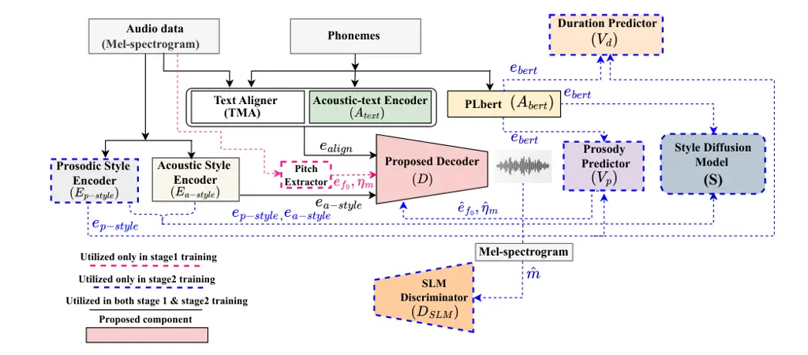
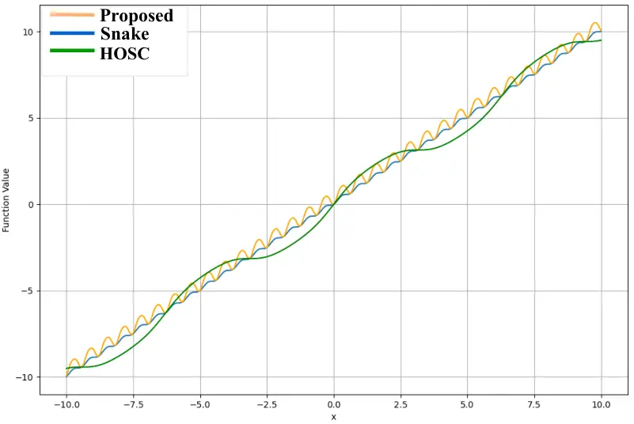
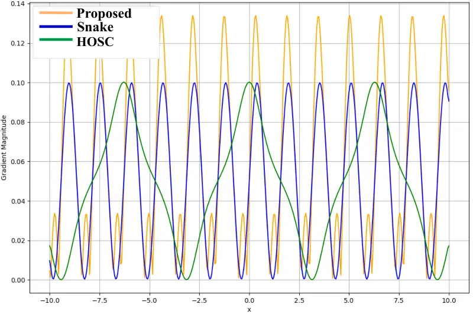
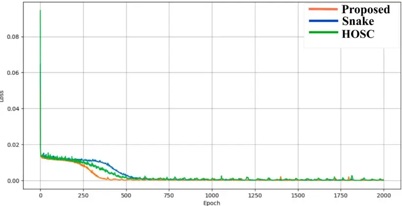
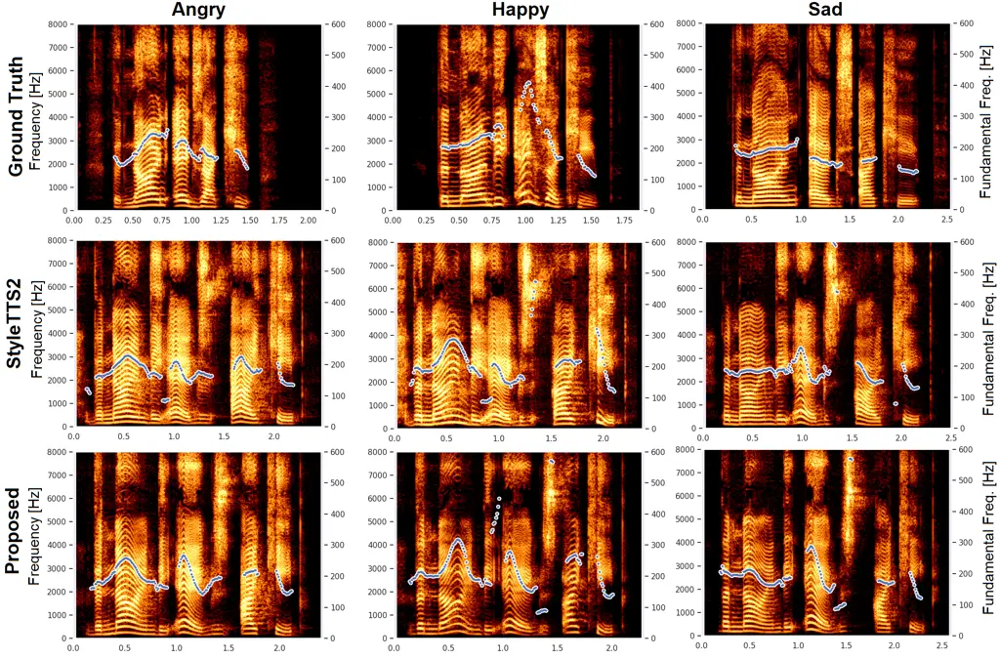

Dhar Shah Gudmalwar Wasnik

# Adaptive Oscillatory Inductive Bias for Modeling Sharp Prosodic Dynamics in Diffusion-Based TTS

Sandipan    Nirmesh J    Ashishkumar P    Pankaj

###### Abstract

Diffusion-based text-to-speech (TTS) models have achieved significant
improvements in speech quality. However, modeling sharp prosodic
transitions and rapid pitch variations in expressive speech remains
challenging. Existing diffusion-based TTS decoders commonly utilize
periodic nonlinearities such as Snake activation function to capture
harmonic structures, but this activation funcation provides limited
adaptability when modeling abrupt amplitude and frequency variations. In
this paper, we investigate the role of oscillatory inductive bias in
diffusion-based TTS decoders and introduce an adaptive oscillatory
nonlinearity that enables controllable periodic modulation while
maintaining signal stability through a linear bypass component. We refer
the resulting TTS system as OscillaTTS. Experiments on the LJSpeech and
Emotional Speech Dataset show consistent improvements across objective
and subjective evaluations, indicating improved modeling of expressive
prosodic dynamics.

###### keywords

Text-to-Speech (TTS) Synthesis, Diffusion Model, Oscilla Activation
Function.

^(†)^(†)address: Media Analysis, Sony Research India ^(†)^(†)email:
{sandipan.dhar,nirmesh.shah,ashishkumar.gudmalwar1,pankaj.wasnik}@sony.com

## 1 Introduction

Recent advances in deep learning have significantly improved the quality
of text-to-speech (TTS) synthesis systems, enabling highly natural and
intelligible synthetic speech \[1, 2\]. In particular, diffusion-based
TTS models have demonstrated strong performance in generating
high-fidelity speech by progressively refining acoustic representations
\[2, 3, 4, 5, 6\]. Despite these advances, accurately modeling sharp
prosodic transitions and rapid pitch variations remains challenging,
especially in expressive speech scenarios such as emotional narration or
conversational dialogue. These transitions often involve abrupt changes
in pitch, energy, and harmonic structure, which remain challenging for
current TTS systems to model reliably.

A typical TTS system consists of three stages: extraction of linguistic
characteristics, acoustic modeling, and waveform reconstruction using
neural vocoders \[7, 8\]. One of the prominent diffusion-based TTS
architectures, StyleTTS2 \[9\], integrates phoneme-level encoders such
as PLBert \[10\] to capture linguistic context while neural decoders
generate the final speech waveform from acoustic representations. While
these architectures have improved speech naturalness, the nonlinear
transformations inside decoder and vocoder components play an important
role in determining how effectively temporal speech dynamics are
modeled. In particular, activation functions influence how neural
networks represent periodic and aperiodic structures in speech signals.

Speech signals exhibit strong quasi-periodic structures due to vocal
fold vibration during voiced speech, resulting in harmonic patterns that
evolve over time \[11\]. To better model such oscillatory structures,
periodic activation functions have recently been adopted in neural audio
models. In particular, the Snake activation function \[12\] employs a
periodic inductive bias that enables neural networks to capture harmonic
patterns such as pitch and rhythm more effectively for modeling smooth
periodic patterns \[9, 13, 14\]. However, these activations may struggle
to represent rapid prosodic variations that occur in expressive speech,
such as abrupt pitch transitions and/or at voiced–unvoiced boundary
points. Moreover, many periodic activations rely on fixed-frequency
parameters, which can limit their flexibility when modeling diverse
speech dynamics across speakers and emotional conditions.

In this work, we investigate the role of oscillatory inductive bias in
diffusion-based TTS decoders and introduce an adaptive oscillatory
nonlinearity that enables controllable periodic modulation while
preserving signal stability. The proposed activation combines periodic
structure with a learnable parameter, allowing the network to
dynamically adapt its oscillatory response to rapid changes in speech
dynamics. We incorporate this mechanism into the decoder of the
StyleTTS2 model and refer to the resulting system as OscillaTTS¹¹ 1 Demo
[https://research.sri-media-analysis.com/interspeech26-oscilla-tts/](https://research.sri-media-analysis.com/interspeech26-oscilla-tts/).
The proposed activation function is defined as
$`x+\tanh(\alpha\sin^{2}(x))`$, where the periodic component models
oscillatory speech patterns and the learnable parameter $`\alpha`$
enables adaptive modulation of the activation response, inspired by the
HOSC activation \[15\]. The additional linear component preserves signal
stability and helps to maintain the underlying structure of the speech
signal during abrupt transitions. This design enables the model to
capture both smooth harmonic variations and sharp prosodic changes more
effectively than fixed periodic activations.

The main contributions are summarized as follows:

- •
  We investigate the role of oscillatory inductive bias in
  diffusion-based TTS decoders for modeling expressive speech dynamics.
- •
  We propose an adaptive oscillatory activation function that enables
  controllable periodic modulation while preserving signal stability.
- •
  We integrate the proposed activation into the StyleTTS2 architecture
  and demonstrate improved modeling of sharp prosodic transitions.
- •
  Extensive experiments on the LJSpeech \[16\] and Emotional Speech
  Dataset (ESD) \[17\] show consistent improvements in objective and
  subjective evaluation metrics compared to the considered baselines.



Figure 1: Schematic overview of the proposed OscillaTTS architecture
based on StyleTTS2.

## 2 Adaptive Oscillatory Inductive Bias for Diffusion-Based TTS

In this section, We first present the overall architecture and training
pipeline, and the integration of the proposed Oscilla activation within
the decoder. As illustrated in Fig. 1, the architectural framework and
training mechanism follow the StyleTTS2 architecture \[9\]. Similar to
\[9\], the training procedure consists of two stages: a pre-training
stage ($`stage1`$) and a joint training stage ($`stage2`$). Given
phoneme-level inputs $`\bm{p}\in\bm{P}`$ corresponding to textual
content and their associated speech features $`\bm{m}\in\bm{M}`$
(mel-spectrograms), we employ a pre-trained acoustic text encoder
$`A_{\text{text}}`$ (a bidirectional LSTM \[18\]) and a pre-trained
prosodic text encoder $`A_{\text{bert}}`$ (PLBert \[10\]) to extract
feature embeddings $`\bm{e_{\text{text}}}`$ and
$`\bm{e_{\text{bert}}}`$, respectively.

The Transferable Monotonic Aligner (TMA) \[18\] is then used to align
phoneme-level information with the corresponding acoustic features,
producing the speech–phoneme alignment $`\bm{s}_{\text{align}}`$. The
aligned phoneme representation $`\bm{e}_{\text{align}}`$ is obtained
through the dot product between $`\bm{e}_{\text{text}}`$ and
$`\bm{s}_{\text{align}}`$. To capture prosodic characteristics, a
pre-trained JDC network \[18\] extracts pitch information from
$`\bm{m}`$, denoted as $`\bm{e}_{f_{0}}`$ where
$`\bm{e}_{f_{0}}=JDC(\bm{m})`$. Additionally, the energy representation
$`\bm{\eta}_{m}`$ is obtained as the logarithmic norm corresponding to
the frame-level energy of $`\bm{m}`$. Furthermore, the acoustic style
encoder $`E_{\text{a-style}}`$ and the prosodic style encoder
$`E_{\text{p-style}}`$ extract acoustic and prosodic style embeddings
$`\bm{e}_{\text{a-style}}`$ and $`\bm{e}_{\text{p-style}}`$ from the
mel-spectrogram. The prosody predictor $`V_{p}`$ estimates pitch and
energy features (i.e., $`\bm{\hat{e}}_{f_{0}}`$ and
$`\bm{\hat{\eta}}_{m}`$), while the duration predictor $`V_{d}`$
predicts phoneme durations conditioned on phoneme embeddings and
prosodic style representations (i.e., $`\bm{e}_{\text{bert}}`$ and
$`\bm{e}_{\text{p-style}}`$) \[18\].

### 2.1 Decoder Architecture with Oscilla Activation

Stage 1 training: In the proposed model, the decoder $`D`$ is
implemented using the iSTFT-Net vocoder architecture \[19\]. To
introduce an adaptive oscillatory inductive bias for modeling speech
dynamics, we integrate the proposed Oscilla activation function within
the decoder layers. The Oscilla activation is defined as

```math
x+\tanh(\alpha\sin^{2}(x)),
```

where the periodic component $`\sin^{2}(x)`$ captures oscillatory
structures in speech signals, while the learnable parameter $`\alpha`$
enables adaptive modulation of the activation response.

The decoder reconstructs the mel-spectrogram $`\bm{\hat{m}}`$ as

```math
\bm{\hat{m}}=D(\bm{e}_{\text{align}},\bm{e}_{\text{a-style}},\bm{e}_{f_{0}},\bm{\eta}_{m}).
```

Let the decoder parameters be represented by $`\bm{\theta}`$. The
objective of the stage 1 training is to estimate parameters
$`\bm{\theta}^{*}`$ that maximize the likelihood of the target
mel-spectrogram $`\bm{m}`$:

```math
\bm{\theta}^{*}=\underset{\bm{\theta}}{\arg\max}\;p\left(\bm{m}\mid D_{\bm{\theta}}(\bm{e}_{\text{align}},\bm{e}_{\text{a-style}},\bm{e}_{f_{0}},\bm{\eta}_{m})\right). \tag{1}
```

In practice, the optimal parameters are obtained by minimizing the
reconstruction loss

```math
\mathcal{L}_{rec}=\mathbb{E}_{m,p}\left[\lVert\mathbf{m}-D_{\bm{\theta}}(\mathbf{e}_{\mathrm{align}},\mathbf{e}_{\mathrm{a\text{-}style}},\mathbf{e}_{f_{0}},\bm{\eta}_{m})\rVert_{1}\right]. \tag{2}
```

During stage 1 training, all components associated with the decoder are
jointly optimized. The remaining loss terms follow the same formulation
as in StyleTTS \[18\].



(a) Comparison of Oscilla, Snake, and HOSC activation functions for
$`a,\alpha`$, $`\beta`$\[15\] $`\in\{5\}`$



(b) Gradient magnitude comparison of Oscilla, Snake, and HOSC activation
functions



(c) Loss convergence analysis of a neural network using different
activation functions

Figure 2: Comparative analysis of the proposed Oscilla activation with
Snake and HOSC. (a) Activation function shapes, (b) gradient magnitude
comparison, and (c) loss convergence behavior during neural network
training.

### 2.2 Analysis of Oscilla Activation for Modeling Sharp Prosodic Transitions

Speech signals exhibit strong quasi-periodic structures due to vocal
fold vibrations during voiced speech \[11\]. Periodic activation
functions therefore help neural networks model such oscillatory
nonlinearities more effectively. Compared to purely periodic activations
such as Snake, incorporating additional nonlinear transformations allows
the network to capture richer variations in speech dynamics.

As illustrated in Fig. 2(a), 2(b), Snake \[12\] exhibits a gradient term
of the form $`\sin(2ax)`$, whose amplitude is fixed and whose frequency
is controlled by $`a`$. In contrast, Oscilla produces an oscillatory
gradient of the form $`\alpha\sin(2x)`$ that is modulated by the
input-dependent factor $`\mathrm{sech}^{2}(\alpha\sin^{2}(x))`$. This
modulation introduces an implicit gating mechanism: when
$`\alpha\sin^{2}(x)`$ is large, saturation of the $`\tanh(\cdot)`$
nonlinearity suppresses gradient contributions, whereas smaller values
permit stronger oscillatory gradients. Consequently, Oscilla enables
adaptive control over oscillatory responses, unlike the fixed-amplitude
behavior of Snake. A similar behavior is evident from the Taylor series
expansions. In Snake, the parameter $`a`$ strongly dominates
higher-order terms through cubic scaling ($`a^{3}`$), resulting in
fixed-amplitude oscillations that can be difficult to stabilize. In
contrast, the parameter $`\alpha`$ in Oscilla scales higher-order terms
linearly and introduces early damping via the $`\tanh(\cdot)`$
expansion, enabling an adaptive oscillatory response that remains
structurally controlled.

To further illustrate the impact of different activations, Fig. 2(c)
shows the convergence behavior of a neural network (four-layer
regression model) trained with Snake, HOSC, and Oscilla activations. The
training data contains both periodic and aperiodic patterns. The results
indicate that Oscilla facilitates stable convergence while maintaining
comparable computational complexity to Snake1D. Both activations have
$`O(n)`$ computational complexity, where $`n`$ denotes the
dimensionality of the input feature vector.

Stage 2 training:

During $`stage2`$ training, all components shown in Fig. 1 are trained
jointly except for the pitch extractor. The style diffusion model $`S`$
is conditioned on both phoneme embeddings and speaker style embeddings.
During inference, the model predicts style embeddings
$`\bm{\hat{e}}_{\text{p-style}}`$ and $`\bm{\hat{e}}_{\text{a-style}}`$
from the $`\bm{e}_{\text{bert}}`$ representation instead of using the
style encoders $`E_{\text{p-style}}`$ and $`E_{\text{a-style}}`$,
thereby reducing inference time \[9\]. In addition, a Speech Language
Model (SLM) discriminator $`D_{SLM}`$ \[20\] acts as a critic to
evaluate how well the generated mel-spectrogram $`\bm{\hat{m}}`$
preserves acoustic semantic information compared to the original
$`\bm{m}`$. The remaining loss functions used during $`stage2`$ training
follow the formulation described in \[18\].

## 3 Experimental Setup

We evaluate the proposed approach on two publicly available datasets to
assess both standard TTS quality and expressive speech synthesis
performance. LJSpeech \[16\] is used for single-speaker English TTS
evaluation. The dataset contains approximately 24 hours of high-quality
speech recordings from a single female speaker and is widely used for
benchmarking neural TTS systems. To further evaluate expressive speech
synthesis and rapid prosodic variations, we conduct experiments on the
Emotional Speech Dataset (ESD) \[17\]. The ESD dataset contains
recordings from multiple speakers under different emotional conditions.
In this work, we focus on the English subset and consider three
representative emotions: Happy, Angry, and Sad.

Both datasets were divided into training (80%), validation (10%), and
testing (10%) sets. The model is trained using the two-stage training
strategy of StyleTTS2 \[9\]. The pre-training stage ($`stage1`$) is
trained for 200 epochs, while the joint training stage ($`stage2`$) is
trained for 120 epochs. All audio samples are resampled to 24 kHz. We
use the AdamW optimizer \[21\] with $`\beta_{1}=0`$, $`\beta_{2}=0.99`$,
weight decay $`\lambda=10^{-4}`$, learning rate $`\gamma=10^{-4}`$, and
a batch size of 8. All experiments are conducted on a single NVIDIA A100
GPU. The remaining pre-trained components are identical to those used in
the baseline StyleTTS2 architecture \[9\].

| Models              | Subjective                  | Objective          |                               |
| ------------------- | --------------------------- | ------------------ | ----------------------------- |
|                     | Speech Quality $`\uparrow`$ | MCD $`\downarrow`$ | $`F_{0}`$-RMSE $`\downarrow`$ |
| StyleTTS2 \[9\]     | 81.48 $`\pm`$ 2.53          | 6.64 $`\pm`$ 0.01  | 0.41 $`\pm`$ 0.003            |
| Proposed OscillaTTS | 86.67 $`\pm`$ 1.49          | 6.59 $`\pm`$ 0.01  | 0.35 $`\pm`$ 0.003            |
| GlowTTS \[22\]      | 75.79 $`\pm`$ 2.27          | 6.85 $`\pm`$ 0.02  | 0.4 $`\pm`$ 0.003             |
| GRADTTS \[4\]       | 83.78 $`\pm`$ 1.99          | 6.9 $`\pm`$ 0.02   | 0.35 $`\pm`$ 0.003            |
| FASTSPEECH2 \[23\]  | 76 $`\pm`$ 2.77             | 6.62$`\pm`$ 0.01   | 0.35 $`\pm`$ 0.003            |

Table 1: Subjective and objective evaluations along with margin of error
corresponding to the 95% Confidence Interval (CI).

| Models              | Angry                |                     |                              | Happy                |                     |                              | Sad                  |                     |                              |
| ------------------- | -------------------- | ------------------- | ---------------------------- | -------------------- | ------------------- | ---------------------------- | -------------------- | ------------------- | ---------------------------- |
|                     | ES MOS  $`\uparrow`$ | MCD  $`\downarrow`$ | $`F_{0}`$-RMSE$`\downarrow`$ | ES MOS  $`\uparrow`$ | MCD  $`\downarrow`$ | $`F_{0}`$-RMSE$`\downarrow`$ | ES MOS  $`\uparrow`$ | MCD  $`\downarrow`$ | $`F_{0}`$-RMSE$`\downarrow`$ |
| StyleTTS2           | 68.8 $`\pm`$ 2.43    | 4.68 $`\pm`$ 0.03   | 0.67$`\pm`$ 0.003            | 65.8 $`\pm`$ 2.52    | 6.45 $`\pm`$ 0.03   | 0.76$`\pm`$ 0.003            | 67.34 $`\pm`$ 2.22   | 5.4 $`\pm`$ 0.03    | 0.5 $`\pm`$ 0.003            |
| Proposed-OscillaTTS | 70.71 $`\pm`$ 1.73   | 4.42$`\pm`$ 0.03    | 0.67 $`\pm`$ 0.003           | 68.3 $`\pm`$ 1.93    | 6.29$`\pm`$ 0.03    | 0.77 $`\pm`$ 0.003           | 68.32 $`\pm`$ 1.56   | 5.27$`\pm`$ 0.03    | 0.49 $`\pm`$ 0.004           |

Table 2: Subjective and objective evaluation analysis along with margin
of error corresponding to the 95% CI for expressive speech synthesis
task

## 4 Results and Discussion

This section evaluates the effectiveness of the proposed adaptive
oscillatory inductive bias in diffusion-based TTS.

### 4.1 Subjective Evaluation

To evaluate perceptual speech quality, MUSHRA-style human listening
tests were conducted. A total of 25 human subjects (aged between 22 and
36 years old with no reported hearing impairments) participated in the
listening tests. Each subject rated synthesized speech samples on a
scale of $`0-100`$, where 100 represents the highest speech quality and
0 represents the lowest. A total of 150 samples were evaluated for each
system. Table 1 compares the proposed method with representative neural
TTS baselines. The results show that incorporating the proposed
oscillatory inductive bias into the decoder improves perceptual speech
quality.

### 4.2 Objective Evaluation

For objective evaluations, we consider Mel Cepstral Distortion (MCD) to
measure spectral similarity and $`F_{0}`$-RMSE to evaluate pitch
modeling accuracy \[24\]. Dynamic Time Warping (DTW) is used to
temporally align synthesized and reference speech signals before
computing evaluation metrics. We additionally evaluate prosody
similarity and intelligibility using AutoPCP and Word Error Rate (WER),
respectively. AutoPCP measures utterance-level prosody similarity
between synthesized and reference speech, while WER is computed using a
Whisper-based speech recognition model \[25\].

[TABLE]

Table 3: AutoPCP and WER scores for LJ Speech Dataset

In addition to representative TTS models, we compare the proposed
approach with a neural vocoder system such as BigVGAN \[13\], which also
uses periodic activation functions (Snake). The results are shown in
Table 4. Overall, the results indicate that incorporating the proposed
oscillatory inductive bias improves speech feature reconstruction and
prosodic modeling compared to baseline systems.

| Models              | AUTOPCP $`\uparrow`$ | MCD $`\downarrow`$ | $`F_{0}`$-RMSE $`\downarrow`$ | WER $`\downarrow`$ |
| ------------------- | -------------------- | ------------------ | ----------------------------- | ------------------ |
| BigVGAN             | 3.87                 | 7.56               | 0.35                          | 7.1                |
| Proposed OscillaTTS | 4.05                 | 6.59               | 0.35                          | 1.85               |

Table 4: Objective Evaluations with BigVGAN Vocoder



Figure 3: Visualization of Mel-spectrogram along with pitch variation
for Angry, Happy and Sad Emotional synthesis.

### 4.3 Expressive Speech Synthesis Evaluation

To assess the effectiveness of the proposed oscillatory inductive bias
for modeling sharp prosodic transitions in expressive speech, we
conducted experiments under three emotional speech conditions from the
ESD dataset: Angry, Happy, and Sad (Table 2). In addition to speech
quality, we conduct subjective emotion similarity (ES) tests where
participants rate similarity to the reference emotion on a scale of
$`0-100`$. Objective results on the ESD dataset are further analyzed
using AutoPCP and WER (Table 5). The improvements indicate that the
proposed inductive bias better captures expressive prosodic dynamics
while improving intelligibility.

| Metrics             | Methods             | Angry | Happy | Sad  |
| ------------------- | ------------------- | ----- | ----- | ---- |
| AutoPCP$`\uparrow`$ | Baseline StyleTTS2  | 3.03  | 3.17  | 2.97 |
|                     | Proposed OscillaTTS | 3.23  | 3.21  | 3    |
| WER$`\downarrow`$   | Baseline StyleTTS2  | 9.21  | 13.3  | 9.72 |
|                     | Proposed OscillaTTS | 4.05  | 7.93  | 7.89 |

Table 5: AutoPCP and WER scores for Emotional ESD Dataset

Figure 3 presents a comparative spectrogram analysis for Angry, Happy,
and Sad emotional synthesis. Compared to the baseline, the proposed
model produces more accurate harmonic structures and more stable pitch
trajectories, particularly in regions with rapid prosodic transitions.
These observations support that incorporating oscillatory inductive bias
improves the modeling of expressive prosodic dynamics.

### 4.4 Ablation Study

To further analyze the contribution of the proposed oscillatory
inductive bias, we conduct an ablation study by replacing the Oscilla
activation with several alternative activation functions within the same
architecture. This experiment helps isolate the impact of the proposed
activation on prosodic modeling and speech synthesis quality. In
particular, we evaluate variants including Snake1D, ReLU, $`\tanh`$,
$`x+\sin(x)`$, and $`\tanh(\sin(x))`$. In addition, we include a variant
of Oscilla with a fixed parameter $`\alpha`$ to examine the importance
of adaptive periodic modulation. All experiments are conducted using the
LJSpeech dataset while keeping the remaining configuration identical.
The results are summarized in Table 6. The proposed Oscilla activation
consistently achieves the best performance in terms of both MCD and
$`F_{0}`$-RMSE. These results indicate that the adaptive oscillatory
inductive bias enables the model to better capture harmonic structures
and rapid prosodic transitions.

| Activation Function                     | MCD $`\downarrow`$ | $`F_{0}`$-RMSE $`\downarrow`$ |
| --------------------------------------- | ------------------ | ----------------------------- |
| Proposed Oscilla (learnable $`\alpha`$) | 6.59 $`\pm`$ 0.01  | 0.35 $`\pm`$ 0.003            |
| Oscilla (fixed $`\alpha=1`$)            | 6.63 $`\pm`$ 0.01  | 0.39 $`\pm`$ 0.003            |
| Snake1D                                 | 6.64 $`\pm`$ 0.01  | 0.41 $`\pm`$ 0.003            |
| ReLU                                    | 8.14 $`\pm`$ 0.02  | 0.44 $`\pm`$ 0.003            |
| $`\tanh`$                               | 7.87 $`\pm`$ 0.02  | 0.68 $`\pm`$ 0.003            |
| $`x+\sin(x)`$                           | 12.63 $`\pm`$ 0.03 | 0.8 $`\pm`$ 0.003             |
| $`\tanh(\sin(x))`$                      | 8.14 $`\pm`$ 0.02  | 2.56 $`\pm`$ 0.004            |

Table 6: Ablation study w.r.t. different activation functions in the
proposed OscillaTTS

## 5 Conclusion

This work investigated the role of oscillatory inductive bias in
diffusion-based TTS systems for modeling expressive speech dynamics. We
proposed an adaptive oscillatory activation mechanism that enables
controllable periodic modulation while maintaining signal stability. The
activation was incorporated into the decoder of the StyleTTS2
architecture, resulting in the OscillaTTS system. Experimental
evaluations on the LJSpeech and Emotional Speech Dataset demonstrated
consistent improvements across both subjective and objective metrics.
These results indicate that incorporating oscillatory inductive bias can
improve the modeling of rapid prosodic variations in expressive speech.
Future work will explore extending this approach to multi-speaker
expressive TTS and singing voice synthesis.

## 6 Generative AI Use Disclosure

Generative AI tools were used solely for language refinement, grammar
correction, and improving the overall clarity and readability of the
manuscript. These tools assisted in polishing and structuring the text
but were not used to generate or design the core research ideas,
methodology, experimental setup, analysis, or conclusions presented in
this work. All scientific contributions, technical implementations, and
interpretations were developed and validated by the authors. In
accordance with policy guidelines, no generative AI system is listed as
a co-author, and all authors take full responsibility and accountability
for the content and integrity of this paper.

## References

- \[1\] T. Xie, Y. Rong, P. Zhang, W. Wang, and L. Liu (2025) Towards
  controllable speech synthesis in the era of large language models: a
  systematic survey. In Proceedings of the 2025 Conference on Empirical
  Methods in Natural Language Processing, pp. 764–791. Cited by: §1.
- \[2\] C. Zhang, C. Zhang, S. Zheng, M. Zhang, M. Qamar, S. Bae, and I.
  Kweon (2023) A survey on audio diffusion models: text to speech
  synthesis and enhancement in generative ai. ArXiv abs/2303.13336.
  External Links:
  [Link](https://api.semanticscholar.org/CorpusID:257913174) Cited by:
  §1.
- \[3\] L. Yang, Z. Zhang, Y. Song, S. Hong, R. Xu, Y. Zhao, W.
  Zhang, B. Cui, and M. Yang (2023) Diffusion models: a comprehensive
  survey of methods and applications. ACM Comput. Surv. 56 (4). External
  Links: ISSN 0360-0300, [Document](https://dx.doi.org/10.1145/3626235)
  Cited by: §1.
- \[4\] V. Popov, I. Vovk, V. Gogoryan, T. Sadekova, and M. A.
  Kudinov (2021) Grad-tts: a diffusion probabilistic model for
  text-to-speech. In Proceedings of the 38 th International Conference
  on Machine Learning (ICML), Cited by: §1, Table 1.
- \[5\] M. Jeong, H. Kim, S. J. Cheon, B. J. Choi, and N. S. Kim (2021)
  Diff-tts: a denoising diffusion model for text-to-speech. In
  Interspeech, Brno, Czechia, pp. 3605–3609. Cited by: §1.
- \[6\] H. Kim, S. Kim, and S. Yoon (2022) Guided-tts: a diffusion model
  for text-to-speech via classifier guidance. In International
  Conference on Machine Learning, Baltimore, Maryland, USA. Cited by:
  §1.
- \[7\] T. Dutoit (1997) An introduction to text-to-speech synthesis. 1
  edition, Text, Speech and Language Technology, Vol. 3, Springer,
  Dordrecht, The Netherlands. External Links:
  [Document](https://dx.doi.org/10.1007/978-94-011-5730-8), ISBN
  978-0-7923-4498-8 Cited by: §1.
- \[8\] A. Gudmalwar, N. Shah, S. Akarsh, P. Wasnik, and R. R.
  Shah (2024) VECL-TTS: Voice identity and Emotional style controllable
  Cross-Lingual Text-to-Speech. In Interspeech 2024, pp. 3000–3004.
  External Links:
  [Document](https://dx.doi.org/10.21437/Interspeech.2024-1672), ISSN
  2958-1796 Cited by: §1.
- \[9\] Y. A. Li, C. Han, V. S. Raghavan, G. Mischler, and N.
  Mesgarani (2023) StyleTTS 2: towards human-level text-to-speech
  through style diffusion and adversarial training with large speech
  language models. Advances in neural information processing systems 36,
  pp. 19594–19621. Cited by: §1, §1, §2.2, §2, Table 1, §3.
- \[10\] Y. A. Li, C. Han, X. Jiang, and N. Mesgarani (2023)
  Phoneme-level bert for enhanced prosody of text-to-speech with
  grapheme predictions. IEEE international conference on acoustics,
  speech and signal processing (ICASSP), pp. 1–5. Cited by: §1, §2.
- \[11\] T. F. Quatieri (2002) Discrete-time speech signal processing:
  principles and practice. Pearson Education India. Cited by: §1, §2.2.
- \[12\] L. Ziyin, T. Hartwig, and M. Ueda (2020) Neural networks fail
  to learn periodic functions and how to fix it. Advances in Neural
  Information Processing Systems 33, pp. 1583–1594. Cited by: §1, §2.2.
- \[13\] S. Lee, W. Ping, B. Ginsburg, B. Catanzaro, and S. Yoon (2023)
  BigVGAN: a universal neural vocoder with large-scale training. In The
  Eleventh International Conference on Learning Representations (ICLR),
  Cited by: §1, §4.2.
- \[14\] J. Hai, Y. Xu, H. Zhang, C. Li, H. Wang, M. Elhilali, and D.
  Yu (2025) EzAudio: enhancing text-to-audio generation with efficient
  diffusion transformer. In Proc. INTERSPEECH, Rotterdam, The
  Netherlands, pp. 4233–4237. Cited by: §1.
- \[15\] D. Serrano, J. Szymkowiak, and P. Musialski (2024) HOSC: a
  periodic activation function for preserving sharp features in implicit
  neural representations. ArXiv abs/2401.10967. Cited by: §1, 2(a),
  2(a).
- \[16\] K. Ito and L. Johnson (2017) The LJ Speech Dataset. Note:
  [https://keithito.com/LJ-Speech-Dataset/](https://keithito.com/LJ-Speech-Dataset/),
  {Last Accessed: March 1, 2026} Cited by: 4th item, §3.
- \[17\] K. Zhou, B. Sisman, R. Liu, and H. Li (2021) Emotional voice
  conversion: theory, databases and esd. Speech Communication 137,
  pp. 1–18. Cited by: 4th item, §3.
- \[18\] Y. A. Li, C. Han, and N. Mesgarani (2025) StyleTTS: a
  style-based generative model for natural and diverse text-to-speech
  synthesis. IEEE Journal of Selected Topics in Signal Processing 19
  (1), pp. 283–296. Cited by: §2.1, §2.2, §2, §2.
- \[19\] T. Kaneko, K. Tanaka, H. Kameoka, and S. Seki (2022) ISTFTNET:
  fast and lightweight mel-spectrogram vocoder incorporating inverse
  short-time fourier transform. IEEE international conference on
  acoustics, speech and signal processing (ICASSP), pp. 6207–6211. Cited
  by: §2.1.
- \[20\] A. Pasad, J. Chou, and K. Livescu (2021) Layer-wise analysis of
  a self-supervised speech representation model. IEEE Automatic Speech
  Recognition and Understanding Workshop (ASRU), pp. 914–921. Cited by:
  §2.2.
- \[21\] I. Loshchilov and F. Hutter (2019) Decoupled weight decay
  regularization. In 7th International Conference on Learning
  Representations, ICLR, New Orleans, LA, USA. External Links:
  [Link](https://openreview.net/forum?id=Bkg6RiCqY7) Cited by: §3.
- \[22\] J. Kim, S. Kim, J. Kong, and S. Yoon (2020) Glow-tts: a
  generative flow for text-to-speech via monotonic alignment search.
  Advances in Neural Information Processing Systems 33, pp. 8067–8077.
  Cited by: Table 1.
- \[23\] Y. Ren, C. Hu, X. Tan, T. Qin, S. Zhao, Z. Zhao, and T.
  Liu (2021) FastSpeech 2: fast and high-quality end-to-end text to
  speech. In 9th International Conference on Learning Representations,
  ICLR, Virtual Event, Austria. Cited by: Table 1.
- \[24\] B. Sisman, J. Yamagishi, S. King, and H. Li (2020) An overview
  of voice conversion and its challenges: from statistical modeling to
  deep learning. IEEE/ACM Transactions on Audio, Speech, and Language
  Processing 29, pp. 132–157. Cited by: §4.2.
- \[25\] L. Barrault, Y. Chung, M. C. Meglioli, D. Dale, N. Dong, M.
  Duppenthaler, P. Duquenne, B. Ellis, H. Elsahar, J. Haaheim, et
  al. (2023) Seamless: multilingual expressive and streaming speech
  translation. arXiv preprint arXiv:2312.05187. Cited by: §4.2.
