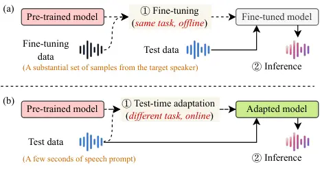
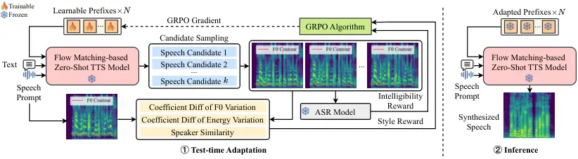
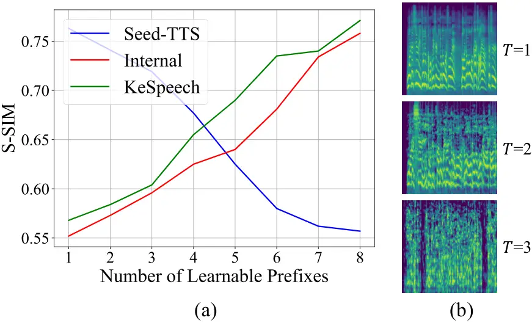

Xie Li Yu Liu

# VoiceTTA: Enhancing Zero-Shot Text-to-Speech via Reinforcement Learning-Based Test-Time Adaptation

Tianxin    Chenxing    Dong    Li

###### Abstract

Recently, zero-shot text-to-speech (TTS) has enabled high-fidelity and
expressive speech synthesis, but it often fails to imitate unseen
speaking styles from uncommon scenarios (e.g., crosstalk, dialects).
Moreover, fine-tuning pretrained models requires large, high-quality
datasets, limiting rapid personalization. We propose VoiceTTA, a
reinforcement learning-based test-time adaptation (TTA) method that
improves voice imitation of pretrained zero-shot TTS models. VoiceTTA
introduces two style rewards based on coefficient-of-variation
differences of F0 and energy, combined with speaker similarity and
intelligibility (WER from a pretrained Whisper model), and optimizes
learnable prefixes via group relative preference optimization (GRPO) in
a flow matching-based model at inference time. Extensive experiments
demonstrate substantial improvements on uncommon speech prompts,
outperforming state-of-the-art baselines. Audio samples are available at
[https://voicetta.pages.dev/](https://voicetta.pages.dev/).

###### keywords

Text-to-speech, test-time adaptation, reinforcement learning, zero-shot
TTS

^(†)^(†)address: ¹ The Hong Kong University of Science and Technology
(Guangzhou)  
² Tencent ^(†)^(†)email: ^(∗)avrillliu@hkust-gz.edu.cn

## 1 Introduction

Zero-shot text-to-speech (TTS) \[1, 2, 3\] has advanced considerably in
recent years, enabling users to generate authentic, natural-sounding
personalized speech from a reference prompt. However, existing zero-shot
TTS models are primarily trained on large-scale datasets from common
scenarios (e.g., podcasts, TV shows, and audiobooks) \[4, 5, 6\], which
limits their effectiveness in less common settings, such as crosstalk,
game commentary, and regional dialects. This highlights the need for a
lightweight and efficient adaptation method for such scenarios.

Existing zero-shot TTS methods encounter two key challenges when
processing uncommon speech prompts. First, such prompts (e.g., slurred,
dialects) often feature accents, speaking styles, and linguistic content
that differ substantially from the datasets on which these models are
trained. This mismatch introduces a domain shift between training and
test data, causing generated speech to retain characteristics of the
training domain while failing to capture the unique style of unseen
prompts. For example, VALL-E \[2\] and its successors \[7, 8\] can
produce intelligible speech that matches the timbre of speech prompts,
but often fail to imitate exaggerated prosody or regional accents.
Second, collecting and annotating speech datasets with dramatic vocal
variations for uncommon scenarios is laborious, which compounds the
difficulty of training high-quality TTS models for such cases. Moreover,
deployed TTS systems inevitably encounter corner cases that are not
covered in training datasets. Thus, these two issues impede the broader
application of zero-shot TTS technologies.



Figure 1: (a) The fine-tuning paradigm repeats the pre-training task on
target-speaker data. (b) The TTA paradigm learns additional knowledge
from the test data via a different task.

Adapting pre-trained zero-shot TTS models to unseen speakers can help
alleviate domain shift. Existing speaker adaptation methods mainly
include: (1) speaker embedding-based adaptation, which learns
speaker-specific representations (e.g., x-vectors \[9\]) to enable
synthesis for new speakers with little data, but relies on high-quality
embedding models \[10, 11\]; and (2) fine-tuning-based adaptation, which
updates model parameters using more target-speaker data to better
capture voice traits such as accent and style, though it is more
time-consuming and data-intensive \[12, 13\]. However, both approaches
may struggle to generalize to diverse speaking styles in unseen prompts
and lack efficient adaptability to new users.

To address these challenges, we propose a reinforcement learning-based
test-time adaptation (TTA \[14\]) framework to improve voice imitation
in pre-trained zero-shot TTS models. As shown in Fig. 1, TTA performs
lightweight parameter adaptation during inference using only a few
speech samples from the target speaker, enabling efficient online
adaptation to unseen prompts. Compared with traditional fine-tuning that
requires large-scale data, TTA can quickly align synthesized speech with
the prosodic and stylistic characteristics of reference audio using only
seconds of speech.



Figure 2: The overview of the proposed VoiceTTA method. We first apply
the GRPO algorithm to optimize learnable prefixes in a flow
matching-based TTS model, guided by intelligibility and style rewards.
Then, we use the adapted prefixes to guide new speech synthesis.

A key challenge in TTA is the design of effective auxiliary tasks, since
directly transferring tasks from other domains often leads to suboptimal
performance \[15, 16\]. Our experiments show that modeling F0 variation,
energy variation, and speaker similarity as auxiliary tasks improves
voice imitation, while incorporating an ASR-related objective helps
maintain speech intelligibility. During inference, multiple candidate
utterances are generated, and auxiliary-task-based rewards are computed
to train the group relative preference optimization (GRPO)
algorithm \[17\], which optimizes lightweight learnable prefixes before
final synthesis. To our knowledge, this is the first work to enhance the
voice imitation capability of pre-trained zero-shot TTS models on unseen
prompts via TTA. In summary, our contributions are as follows:

- •
  We propose VoiceTTA, a reinforcement learning-based test-time
  adaptation framework that improves zero-shot TTS models by optimizing
  lightweight learnable prefixes with minimal parameter overhead.
- •
  The proposed F0- and energy-variation rewards, together with the
  speaker similarity reward, guide the TTS model to capture acoustic
  details from the reference speech and enhance its imitation ability,
  while the WER-based reward improves voice intelligibility.
- •
  Extensive objective and subjective evaluations on several SOTA
  zero-shot TTS models demonstrate the effectiveness of our method,
  particularly on uncommon prompts.

## 2 Method

### 2.1 Overview

Given an unseen speech prompt $`x`$ and text $`p`$, our goal is to
maximize the probability that the speech $`y=F_{\theta}(x,p)`$ generated
by a TTS model $`F_{\theta}`$ closely matches the speaking style of
$`x`$ at inference time:

```math
\underset{\theta}{\textnormal{minimize:}}~~D(x,F_{\theta}(x,p)), \tag{1}
```

where $`D`$ is a distance function that measures the similarity in
speech characteristics between two audio samples. However, $`D`$ cannot
be explicitly defined and must be estimated in practice. As shown in
Fig. 2, to minimize $`D`$ in the TTA setting, we employ GRPO with
intelligibility and style rewards to optimize the parameters of the
learnable prefixes, sampling $`k`$ candidate speeches for reward
computation. For each candidate, the intelligibility reward is measured
by the Word Error Rate (WER), while the style reward is derived from the
coefficient of variation of F0 (F0-CV), the coefficient of variation of
energy (Energy-CV), and speaker similarity (S-SIM) between the speech
prompt and the synthesized output. After $`G`$ GRPO steps, the adapted
model is used to synthesize new speech. It is worth noting that the
additional model parameters are minimal and cheap to store. Adaptation
requires only a few seconds of user audio, after which the personalized
model supports fast, repeated inference, making it well-suited for
online deployment.

### 2.2 Speech Candidate Sampling

In this paper, we use a flow matching–based TTS model to sample speech
candidates. The flow matching process transforms a latent variable into
a mel-spectrogram conditioned on the encoded text and speech prompts,
progressively transporting a prior distribution toward the learned data
manifold in the acoustic feature space \[18\]. The latent variable is
initially sampled from an isotropic Gaussian prior
$`\mathcal{N}(0,T^{2}I)`$, where the temperature $`T`$ controls the
stochasticity of generation: higher $`T`$ increases prosodic and
stylistic variation, while lower $`T`$ produces more stable but less
diverse outputs. The latent is then converted to a mel-spectrogram via
the flow model and finally to a waveform using a vocoder \[19\]. To
generate $`k`$ diverse candidates for reward computation, $`T`$ is
sampled from a uniform distribution, while all candidates share the same
text content.

### 2.3 Rewards Computation

We use $`k`$ candidates and a speech prompt to compute the style reward
(F0-CV, Energy-CV, S-SIM) and the intelligibility reward (WER). To
measure the similarity in pitch dynamics between a candidate and the
reference speech, we compute the F0-CV difference between them. Let
$`F0_{\text{gen}}=[f_{1}^{\text{gen}},\dots,f_{LG}^{\text{gen}}]`$ and
$`F0_{\text{ref}}=[f_{1}^{\text{ref}},\dots,f_{LR}^{\text{ref}}]`$
denote the voiced frame-level F0 contours of the candidate and the
reference speech, respectively. We first compute their F0-CV as:

```math
\text{F0-CV}_{\text{gen}}=\frac{\sigma_{F0_{\text{gen}}}}{\mu_{F0_{\text{gen}}}},\text{F0-CV}_{\text{ref}}=\frac{\sigma_{F0_{\text{ref}}}}{\mu_{F0_{\text{ref}}}}, \tag{2}
```

where $`\mu`$, $`\sigma`$ are the mean and standard deviation of the F0
contours, respectively. The F0-CV reward is then defined as:

```math
r_{\text{F0-CV}}=-|\text{F0-CV}_{\text{gen}}-\text{F0-CV}_{\text{ref}}|. \tag{3}
```

A higher $`r_{\text{F0-CV}}`$ indicates closer alignment with the
reference pitch dynamics, positively contributing to the style reward.

To quantify the similarity in energy dynamics between a candidate and
the reference speech, we extract voiced frame-level energy sequences
$`E_{\text{gen}}=[e_{1}^{\text{gen}},\dots,e_{LG}^{\text{gen}}]`$ and
$`E_{\text{ref}}=[e_{1}^{\text{ref}},\dots,e_{LR}^{\text{ref}}]`$, where
the energy of each voiced frame is the sum of its mel frequencies:

```math
e_{j}=\sum_{m}M(j,m), \tag{4}
```

where $`M`$ is the mel-spectrogram, $`j`$ denotes the frame index, $`m`$
denotes the Mel filter bank channel index. The Energy-CV of the
candidate and the reference speech are:

```math
\text{Energy-CV}_{\text{gen}}=\frac{\sigma_{E_{\text{gen}}}}{\mu_{E_{\text{gen}}}},\text{Energy-CV}_{\text{ref}}=\frac{\sigma_{E_{\text{ref}}}}{\mu_{E_{\text{ref}}}}, \tag{5}
```

where $`\mu`$ and $`\sigma`$ denote the mean and standard deviation of
the frame-level energy, respectively. Then, the Energy-CV reward for a
candidate is defined as:

```math
r_{\text{Energy-CV}}=-|\text{Energy-CV}_{\text{gen}}-\text{Energy-CV}_{\text{ref}}|. \tag{6}
```

A larger Energy-CV indicates that the generated speech better captures
the energy dynamics of the reference speech.

The S-SIM reward between a candidate and the reference speech is
computed as the cosine similarity between their embeddings extracted
from a speaker embedding model $`SE`$:

```math
r_{\text{S-SIM}}=\cos(SE(A_{\text{gen}}),SE(A_{\text{ref}})), \tag{7}
```

where $`A_{\text{gen}}`$ and $`A_{\text{ref}}`$ are the waveforms of the
candidate and the reference speech. The intelligibility reward
$`r_{\text{Intel}}`$ for each candidate is computed as its WER.

### 2.4 GRPO-Based Test-Time Adaptation

To adapt the TTS model to unseen speech prompts, we treat the learnable
prefixes as a stochastic policy $`\pi_{\theta}`$ within a reinforcement
learning framework and employ GRPO, which needs no value model and
computes rewards using rule-based or model-based methods, as implemented
in our approach. Assuming we have $`k`$ candidates and their rewards
($`r^{i}_{\text{F0-CV}},r^{i}_{\text{Energy-CV}},r^{i}_{\text{S-SIM}},r^{i}_{\text{Intel}},i\in[1,k]`$),
we first normalize each type of reward into the range \[0,1\] for $`k`$
candidates. The normalized rewards for each candidate are denoted as
$`s^{i}_{\text{F0-CV}},s^{i}_{\text{Energy-CV}},s^{i}_{\text{S-SIM}},s^{i}_{\text{Intel}}`$.
Then the total reward $`r^{i}`$ for candidate $`i`$ is the sum of the
normalized rewards:

```math
r^{i}=\lambda_{1}s^{i}_{\text{F0-CV}}+\lambda_{2}s^{i}_{\text{Energy-CV}}+\lambda_{3}s^{i}_{\text{S-SIM}}+\lambda_{4}s^{i}_{\text{Intel}}. \tag{8}
```

Then, the GRPO loss for our method is defined as:

```math
\displaystyle J_{GRPO} \displaystyle=\mathbb{E}\left[\sum_{i=1}^{k}\left(\min\left(\frac{\pi_{\theta}(o_{i})}{\pi_{\theta_{\text{old}}}(o_{i})}A_{i},\right.\right.\right.
```

```math
\displaystyle\quad\left.\left.\left.\text{Clip}\left(\frac{\pi_{\theta}(o_{i})}{\pi_{\theta_{\text{old}}}(o_{i})},1-\epsilon,1+\epsilon\right)A_{i}\right)\right)\right], \tag{9}
```

where

```math
A_{i}=\frac{r^{i}-\text{mean}(\{r^{1},r^{2},...,r^{k}\})}{\text{std}(\{r^{1},r^{2},...,r^{k}\})}. \tag{10}
```

Note that there is no KL term in $`J_{GRPO}`$ because we are optimizing
the lightweight learnable prefixes instead of the whole model, which is
different from the original GRPO loss \[17\]. In our work, we prepend
multiple learnable prefixes to the input of the first layer of a
pre-trained TTS model. Unlike LLMs, which predict token probabilities,
flow-matching-based models directly regress mel-spectrograms. Therefore,
we adopt the flow matching loss as a probability proxy to compute
$`\pi_{\theta}(o_{i})`$ and $`\pi_{\theta_{\text{old}}}(o_{i})`$, which
measure the tendency to generate output $`o_{i}`$. Following \[18\], the
flow matching loss is defined as:

```math
\mathcal{L}_{FM,\theta}(o)=\mathbb{E}_{t,p(x_{t}|o)}[\left|v_{\theta}(x_{t},t)-u_{t}(x_{t}|o)\right|^{2}], \tag{11}
```

which measures the discrepancy between the model-predicted velocity
field $`v_{\theta}(x_{t},t)`$ and the ideal target velocity field
$`u_{t}(x_{t}|o)`$. The lower the flow-matching loss for a sample $`o`$,
the more accurately the model’s learned dynamics can transform noise
into $`o`$. Therefore, we can reasonably assume:

```math
\pi_{\theta}(o)=\log p_{\theta}(o)\propto-L_{\mathrm{FM},\theta}(o). \tag{12}
```

Thus, we define the probability ratio term in GRPO as:

```math
\displaystyle\frac{\pi_{\theta}(o_{i})}{\pi_{\theta_{\text{old}}}(o_{i})} \displaystyle=\log p_{\theta}(o_{i})-\log p_{\theta_{\text{old}}}(o_{i})
```

```math
\displaystyle\approx(-\mathcal{L}_{FM,\theta}(o_{i}))-(-\mathcal{L}_{FM,\theta_{\text{old}}}(o_{i}))
```

```math
\displaystyle=\mathcal{L}_{FM,\theta_{\text{old}}}(o_{i})-\mathcal{L}_{FM,\theta}(o_{i}). \tag{13}
```

After $`G`$ GRPO adaptation steps on the unseen speech prompt, we use
the model to synthesize new speech samples. After adaptation and
prediction for a given sample, the prefixes are randomly reinitialized
before processing the next one, preventing updates from accumulating
across the test set.

## 3 Experiment

### 3.1 Experimental Settings

Datasets. We collected an internal dataset of 200 speech samples with
uncommon speaking styles (90 accented, 40 children’s, 30 slurred, and 40
from Chinese sketches), which are underrepresented in existing corpora
and serve as realistic test-time scenarios. To further assess dialectal
adaptation, we sampled 160 utterances (20 per dialect) from
KeSpeech \[20\], covering eight Chinese dialects.

Models. We use F5-TTS \[21\] as our backbone and the baseline. We also
compare with three SOTA zero-shot TTS models, i.e., CosyVoice \[22\],
MaskGCT \[23\], and Vevo \[24\].

Implementation. For each test sample, we generate four candidates to
compute the GRPO reward. For the final reward in Eq. 8, we set
$`\lambda_{1}`$=$`\lambda_{2}`$=0.2, $`\lambda_{3}`$=1, and
$`\lambda_{4}`$=1.5, as $`r_{\text{S-SIM}}`$ and $`r_{\text{Intel}}`$
primarily drive speaker similarity and WER reduction, as demonstrated in
the ablation study. We prepend 4 learnable prefixes to the input of the
first DiT layer of F5-TTS. The learning rate is set to
$`5\times 10^{-4}`$ with a 5% warmup ratio, and we run $`G`$=50 GRPO
adaptation steps. For candidate sampling, we draw a new $`T`$ from the
uniform distribution $`U(0.5,1.5)`$ to synthesize a new speech sample,
and we sample 4 candidates for each GRPO optimization step. All the
evaluations are conducted on an NVIDIA RTX 6000 Ada GPU.

Evaluation Metrics. For objective evaluation, we report WER and Speaker
Similarity (S-SIM). WER is derived from Whisper-Large V3 \[25\]
transcriptions, while S-SIM is computed as the cosine similarity between
embeddings of the synthesized speech and a neutral reference using a
speaker embedding model \[26\]. For subjective evaluation, we report
Naturalness MOS (N-MOS) and Similarity MOS (S-MOS), both rated on a 1–5
scale. N-MOS measures perceived naturalness (1 = very unnatural, 5 =
completely natural), while S-MOS evaluates perceived style similarity (1
= very dissimilar, 5 = highly similar).

|                  |                  |                     |                     |                     |                     |
| ---------------- | ---------------- | ------------------- | ------------------- | ------------------- | ------------------- |
|                  | Method           | WER($`\downarrow`$) | S-SIM($`\uparrow`$) | S-MOS($`\uparrow`$) | N-MOS($`\uparrow`$) |
| Accented         | CosyVoice \[22\] | 3.18                | 0.58                | 3.26                | 3.94                |
|                  | MaskGCT \[23\]   | 3.09                | 0.69                | 3.18                | 3.52                |
|                  | Vevo \[24\]      | 5.72                | 0.44                | 3.01                | 2.37                |
|                  | F5-TTS \[21\]    | 2.81                | 0.67                | 3.22                | 3.62                |
|                  | VoiceTTA (Ours)  | 2.82                | 0.69                | 3.46                | 3.51                |
| Children         | CosyVoice \[22\] | 3.26                | 0.53                | 3.34                | 3.85                |
|                  | MaskGCT \[23\]   | 3.11                | 0.61                | 3.26                | 3.41                |
|                  | Vevo \[24\]      | 9.54                | 0.45                | 3.05                | 2.11                |
|                  | F5-TTS \[21\]    | 3.03                | 0.60                | 3.19                | 3.51                |
|                  | VoiceTTA (Ours)  | 3.01                | 0.63                | 3.37                | 3.50                |
| Slurred          | CosyVoice \[22\] | 5.18                | 0.51                | 3.05                | 3.25                |
|                  | MaskGCT \[23\]   | 4.82                | 0.57                | 3.09                | 2.98                |
|                  | Vevo \[24\]      | 16.73               | 0.29                | 1.54                | 1.34                |
|                  | F5-TTS \[21\]    | 4.57                | 0.55                | 2.83                | 3.05                |
|                  | VoiceTTA (Ours)  | 4.49                | 0.58                | 3.44                | 3.07                |
| Chinese Sketches | CosyVoice \[22\] | 5.02                | 0.55                | 3.16                | 3.55                |
|                  | MaskGCT \[23\]   | 4.73                | 0.49                | 3.08                | 3.17                |
|                  | Vevo \[24\]      | 13.65               | 0.35                | 2.16                | 1.83                |
|                  | F5-TTS \[21\]    | 3.11                | 0.58                | 3.11                | 3.45                |
|                  | VoiceTTA (Ours)  | 3.26                | 0.60                | 3.25                | 3.44                |
| Chinese Dialects | CosyVoice \[22\] | 4.92                | 0.51                | 3.14                | 3.26                |
|                  | MaskGCT \[23\]   | 4.16                | 0.56                | 3.10                | 3.01                |
|                  | Vevo \[24\]      | 15.69               | 0.28                | 1.82                | 1.57                |
|                  | F5-TTS \[21\]    | 3.38                | 0.59                | 2.93                | 3.16                |
|                  | VoiceTTA (Ours)  | 3.13                | 0.62                | 3.18                | 3.20                |
| Averaged         | CosyVoice \[22\] | 4.57                | 0.54                | 3.25$`\pm`$0.92     | 3.58$`\pm`$0.73     |
|                  | MaskGCT \[23\]   | 3.26                | 0.62                | 3.14$`\pm`$0.93     | 3.14$`\pm`$1.07     |
|                  | Vevo \[24\]      | 12.41               | 0.34                | 2.05$`\pm`$1.03     | 1.91$`\pm`$1.01     |
|                  | F5-TTS \[21\]    | 3.19                | 0.57                | 3.07$`\pm`$1.07     | 3.36$`\pm`$1.04     |
|                  | Ours             | 3.12                | 0.64                | 3.27$`\pm`$0.62     | 3.35$`\pm`$0.77     |

Table 1: Performance comparison on five test-time scenarios.

### 3.2 Objective Evaluation

As shown in Table 1, our method achieves a WER of 3.12, outperforming
F5-TTS (3.19), MaskGCT (3.26), and substantially surpassing CosyVoice
(4.57) and Vevo (12.41). These results demonstrate that VoiceTTA
enhances stylistic attributes without sacrificing clarity, confirming
that improvements in voice imitation do not come at the cost of
intelligibility. For S-SIM, our method attains the highest score (0.64),
exceeding F5-TTS (0.57), MaskGCT (0.62), CosyVoice (0.54), and Vevo
(0.34). This improvement highlights the effectiveness of our
reinforcement learning–based TTA framework in capturing target speaker
characteristics, even under challenging prompts.

### 3.3 Subjective Evaluation

We evaluate perceptual style similarity using S-MOS. 24 participants are
asked to rate S-MOS between 20 pairs of reference and generated samples.
Table 1 shows that our method achieves the highest score (3.27),
slightly surpassing CosyVoice (3.25) and clearly outperforming F5-TTS
(3.07), MaskGCT (3.14), and Vevo (2.05). This aligns with the S-SIM
results, where our method also ranks highest (0.64), confirming that
style-based rewards effectively guide adaptation toward target
characteristics. For naturalness, our method attains an N-MOS of 3.35,
comparable to F5-TTS (3.36) and slightly below CosyVoice (3.58), which
is pretrained on over 130,000 hours and post-trained on 500 hours of
high-quality speech. While not the top score, this demonstrates that the
improvements in style similarity do not compromise fluency or
intelligibility. Overall, VoiceTTA achieves superior stylistic fidelity
while maintaining competitive naturalness, underscoring its balanced
design.

### 3.4 Ablation Study

Reward Types. We conduct an ablation study on the four reward types,
evaluating S-SIM and WER using the same dataset and hyperparameters in
the main experiment. As shown in Table 2, using only the intelligibility
reward ($`r_{\text{Intel}}`$) achieves the lowest WER (3.10) but the
weakest S-SIM (0.43), while combining the three style rewards
($`r_{\text{F0-CV}}`$ + $`r_{\text{Energy-CV}}`$ + $`r_{\text{S-SIM}}`$)
yields the highest S-SIM (0.67) but severely degrades intelligibility
(WER = 7.04). The full model, integrating all four rewards, balances
both objectives, reaching a WER of 3.12 and an S-SIM of 0.64. These
results highlight the complementary roles of these rewards and the
necessity of a composite reward for effective style imitation without
sacrificing intelligibility.

Number of Learnable Prefixes. We analyze the effect of the number of
learnable prefixes by reporting average S-SIM on the Seed-TTS \[27\]
test-en set using models adapted on KeSpeech and our internal dataset.
As shown in Fig. 3-a, S-SIM on Seed-TTS peaks with a single prefix and
declines as more are added, suggesting that excessive adaptation may
harm synthesis. In contrast, on KeSpeech and our internal dataset, S-SIM
improves with more prefixes, indicating enhanced adaptability to novel
characteristics. We therefore use four prefixes in the main experiments
to balance adaptation and in-domain performance.

Temperature $`T`$. As shown in Fig. 3-b, large $`T`$ values yield
unintelligible speech. Therefore, we sample $`T`$ from a uniform
distribution with a small range as in the experimental setting.



Figure 3: (a) The effect of the number of learnable prefixes. (b) High
temperature $`T`$ reduces intelligibility.

|                                                                                               |                     |                     |
| --------------------------------------------------------------------------------------------- | ------------------- | ------------------- |
| Reward                                                                                        | WER($`\downarrow`$) | S-SIM($`\uparrow`$) |
| $`r_{\text{F0-CV}}`$                                                                          | 7.62                | 0.53                |
| $`r_{\text{Energy-CV}}`$                                                                      | 7.76                | 0.51                |
| $`r_{\text{S-SIM}}`$                                                                          | 6.58                | 0.62                |
| $`r_{\text{Intel}}`$                                                                          | 3.10                | 0.43                |
| $`r_{\text{F0-CV}}`$ + $`r_{\text{Energy-CV}}`$                                               | 7.69                | 0.55                |
| $`r_{\text{F0-CV}}`$ + $`r_{\text{Energy-CV}}`$ + $`r_{\text{S-SIM}}`$                        | 7.04                | 0.67                |
| $`r_{\text{F0-CV}}`$ + $`r_{\text{Energy-CV}}`$ + $`r_{\text{S-SIM}}`$ + $`r_{\text{Intel}}`$ | 3.12                | 0.64                |

Table 2: Ablation study on the four reward types.

### 3.5 Model Parameters

For each unseen speaker, only a lightweight 16 KB prompt needs to be
stored, enabling efficient personalization. This design makes VoiceTTA
more practical and scalable than existing methods for real-world
deployment, where rapid adaptation to new speakers is essential.

## 4 Conclusion

We present VoiceTTA, a reinforcement learning–based TTA method for flow
matching–based TTS models that optimizes lightweight prefixes with
multiple rewards to balance style similarity and intelligibility.
VoiceTTA surpasses SOTA zero-shot TTS models in style similarity on five
uncommon test-time scenarios while preserving naturalness, requires only
a one-time adaptation, and introduces negligible parameters, making it
practical for online, real-world personalized speech synthesis.

## 5 Acknowledgement

This work was supported by the National Natural Science Foundation of
China (No. 62471420), GuangDong Basic and Applied Basic Research
Foundation (2025A1515012296), and 2025 Tencent AI Lab Rhino-Bird
Program.

## 6 Generative AI Use Disclosure

We used ChatGPT only for language editing and stylistic refinement; no
technical content was generated by the tool.

## References

- \[1\] J. Kim, J. Kong, and J. Son (2021) Conditional variational
  autoencoder with adversarial learning for end-to-end text-to-speech.
  In International conference on machine learning, pp. 5530–5540. Cited
  by: §1.
- \[2\] S. Chen, C. Wang, Y. Wu, Z. Zhang, L. Zhou, S. Liu, Z. Chen, Y.
  Liu, H. Wang, J. Li, L. He, S. Zhao, and F. Wei (2025) Neural codec
  language models are zero-shot text to speech synthesizers. IEEE
  Transactions on Audio, Speech and Language Processing 33 (),
  pp. 705–718. Cited by: §1, §1.
- \[3\] T. Xie, Y. Rong, P. Zhang, W. Wang, and L. Liu (2025) Towards
  controllable speech synthesis in the era of large language models: a
  systematic survey. In Proceedings of the 2025 Conference on Empirical
  Methods in Natural Language Processing, pp. 764–791. Cited by: §1.
- \[4\] H. He, Z. Shang, C. Wang, X. Li, Y. Gu, H. Hua, L. Liu, C.
  Yang, J. Li, P. Shi, et al. (2024) Emilia: an extensive, multilingual,
  and diverse speech dataset for large-scale speech generation. In 2024
  IEEE Spoken Language Technology Workshop (SLT), pp. 885–890. Cited by:
  §1.
- \[5\] H. Zen, V. Dang, R. Clark, Y. Zhang, R. J. Weiss, Y. Jia, Z.
  Chen, and Y. Wu (2019) LibriTTS: A corpus derived from librispeech for
  text-to-speech. In Interspeech, pp. 1526–1530. Cited by: §1.
- \[6\] Y. Rong, J. Wang, G. Lei, S. Yang, and L. Liu (2025) Audiogenie:
  a training-free multi-agent framework for diverse
  multimodality-to-multiaudio generation. In Proceedings of the 33rd ACM
  International Conference on Multimedia, pp. 8872–8881. Cited by: §1.
- \[7\] Z. Zhang, L. Zhou, C. Wang, S. Chen, Y. Wu, S. Liu, Z. Chen, Y.
  Liu, H. Wang, J. Li, et al. (2023) Speak foreign languages with your
  own voice: cross-lingual neural codec language modeling. arXiv
  preprint arXiv:2303.03926. Cited by: §1.
- \[8\] L. Meng, L. Zhou, S. Liu, S. Chen, B. Han, S. Hu, Y. Liu, J.
  Li, S. Zhao, X. Wu, et al. (2025) Autoregressive speech synthesis
  without vector quantization. In Proceedings of the 63rd Annual Meeting
  of the Association for Computational Linguistics (Volume 1: Long
  Papers), pp. 1287–1300. Cited by: §1.
- \[9\] D. Snyder, D. Garcia-Romero, G. Sell, D. Povey, and S.
  Khudanpur (2018) X-vectors: robust dnn embeddings for speaker
  recognition. In ICASSP, Vol. , pp. 5329–5333. Cited by: §1.
- \[10\] E. Casanova, J. Weber, C. D. Shulby, A. C. Junior, E. Gölge,
  and M. A. Ponti (2022) Yourtts: towards zero-shot multi-speaker tts
  and zero-shot voice conversion for everyone. In International
  conference on machine learning, pp. 2709–2720. Cited by: §1.
- \[11\] H. Lu, Z. Wu, D. Dai, R. Li, S. Kang, J. Jia, and H.
  Meng (2019) One-shot voice conversion with global speaker embeddings.
  In Interspeech, pp. 669–673. Cited by: §1.
- \[12\] R. Huang, Y. Wang, R. Hu, X. Xu, Z. Hong, D. Yang, X. Cheng, Z.
  Wang, Z. Jiang, Z. Ye, et al. (2024) VoiceTuner: self-supervised
  pre-training and efficient fine-tuning for voice generation. In
  Proceedings of the 32nd ACM International Conference on Multimedia,
  pp. 10630–10639. Cited by: §1.
- \[13\] P. Neekhara, J. Li, and B. Ginsburg (2021) Adapting TTS models
  for new speakers using transfer learning. arXiv preprint
  arXiv:2110.05798. Cited by: §1.
- \[14\] J. Liang, R. He, and T. Tan (2025) A comprehensive survey on
  test-time adaptation under distribution shifts. International Journal
  of Computer Vision 133 (1), pp. 31–64. Cited by: §1.
- \[15\] D. Wang, E. Shelhamer, S. Liu, B. Olshausen, and T.
  Darrell (2021) Tent: fully test-time adaptation by entropy
  minimization. In International Conference on Learning Representations,
  pp. 1–15. Cited by: §1.
- \[16\] Y. Sun, X. Wang, Z. Liu, J. Miller, A. Efros, and M.
  Hardt (2020) Test-time training with self-supervision for
  generalization under distribution shifts. In International conference
  on machine learning, pp. 9229–9248. Cited by: §1.
- \[17\] Z. Shao, P. Wang, Q. Zhu, R. Xu, J. Song, X. Bi, H. Zhang, M.
  Zhang, Y. Li, Y. Wu, et al. (2024) Deepseekmath: pushing the limits of
  mathematical reasoning in open language models. arXiv preprint
  arXiv:2402.03300. Cited by: §1, §2.4.
- \[18\] Y. Lipman, R. T. Q. Chen, H. Ben-Hamu, M. Nickel, and M.
  Le (2023) Flow matching for generative modeling. In The Eleventh
  International Conference on Learning Representations, pp. 1–28. Cited
  by: §2.2, §2.4.
- \[19\] H. Siuzdak (2024) Vocos: closing the gap between time-domain
  and fourier-based neural vocoders for high-quality audio synthesis. In
  The Twelfth International Conference on Learning Representations,
  pp. 1–15. Cited by: §2.2.
- \[20\] Z. Tang, D. Wang, Y. Xu, J. Sun, X. Lei, S. Zhao, C. Wen, X.
  Tan, C. Xie, S. Zhou, et al. (2021) Kespeech: an open source speech
  dataset of mandarin and its eight subdialects. In Thirty-fifth
  conference on neural information processing systems datasets and
  benchmarks track (Round 2), Cited by: §3.1.
- \[21\] Y. Chen, Z. Niu, Z. Ma, K. Deng, C. Wang, J. JianZhao, K. Yu,
  and X. Chen (2025) F5-TTS: a fairytaler that fakes fluent and faithful
  speech with flow matching. In Proceedings of the 63rd Annual Meeting
  of the Association for Computational Linguistics (Volume 1: Long
  Papers), pp. 6255–6271. Cited by: §3.1, Table 1, Table 1, Table 1,
  Table 1, Table 1, Table 1.
- \[22\] Z. Du, Q. Chen, S. Zhang, K. Hu, H. Lu, Y. Yang, H. Hu, S.
  Zheng, Y. Gu, Z. Ma, et al. (2024) Cosyvoice: a scalable multilingual
  zero-shot text-to-speech synthesizer based on supervised semantic
  tokens. arXiv preprint arXiv:2407.05407. Cited by: §3.1, Table 1,
  Table 1, Table 1, Table 1, Table 1, Table 1.
- \[23\] Y. Wang, H. Zhan, L. Liu, R. Zeng, H. Guo, J. Zheng, Q.
  Zhang, X. Zhang, S. Zhang, and Z. Wu (2025) MaskGCT: zero-shot
  text-to-speech with masked generative codec transformer. In The
  Thirteenth International Conference on Learning Representations,
  pp. 1–24. Cited by: §3.1, Table 1, Table 1, Table 1, Table 1, Table 1,
  Table 1.
- \[24\] X. Zhang, X. Zhang, K. Peng, Z. Tang, V. Manohar, Y. Liu, J.
  Hwang, D. Li, Y. Wang, J. Chan, Y. Huang, Z. Wu, and M. Ma (2025)
  Vevo: controllable zero-shot voice imitation with self-supervised
  disentanglement. In The Thirteenth International Conference on
  Learning Representations, pp. 1–24. Cited by: §3.1, Table 1, Table 1,
  Table 1, Table 1, Table 1, Table 1.
- \[25\] A. Radford, J. W. Kim, T. Xu, G. Brockman, C. McLeavey, and I.
  Sutskever (2023) Robust speech recognition via large-scale weak
  supervision. In International conference on machine learning,
  pp. 28492–28518. Cited by: §3.1.
- \[26\] H. Bredin, R. Yin, J. M. Coria, G. Gelly, P. Korshunov, M.
  Lavechin, D. Fustes, H. Titeux, W. Bouaziz, and M. Gill (2020)
  Pyannote. audio: neural building blocks for speaker diarization. In
  ICASSP 2020-2020 IEEE International conference on acoustics, speech
  and signal processing (ICASSP), pp. 7124–7128. Cited by: §3.1.
- \[27\] P. Anastassiou, J. Chen, J. Chen, Y. Chen, Z. Chen, Z. Chen, J.
  Cong, L. Deng, C. Ding, L. Gao, et al. (2024) Seed-tts: a family of
  high-quality versatile speech generation models. arXiv preprint
  arXiv:2406.02430. Cited by: §3.4.
