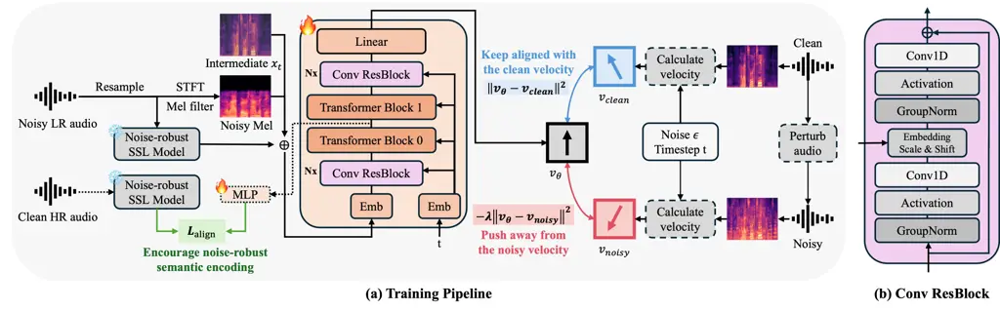

Koo Kim Um Kim

# VeRe-Flow: Guiding Flow Matching toward Clean Speech via Velocity Contrastive Regularization and Representation Alignment for Noise-Robust Bandwidth Expansion

Sujin    Sangyoon    Ji Sub    Hoirin

###### Abstract

Noise-robust bandwidth expansion aims to reconstruct high-fidelity
wideband speech from noisy low-resolution inputs. While flow matching
has shown strong performance in speech generation, accurately recovering
clean speech from noisy inputs remains challenging due to the ambiguity
of velocity estimation under noise. In this work, we propose VeRe-Flow,
a clean-guided flow matching framework that introduces multi-level clean
supervision to guide the generative process toward clean speech. At the
velocity level, we introduce velocity contrastive regularization, which
attracts the predicted velocity toward the clean trajectory while
repelling it from noisy trajectories. At the representation level, we
incorporate representation alignment that aligns intermediate features
with clean self-supervised learning representations. The results
demonstrate that the proposed method achieves the lowest LSD and highest
DNSMOS OVRL among all baselines, and the highest MOS among generative
baselines.

###### keywords

noise-robust bandwidth expansion, flow matching, velocity contrastive
regularization, representation alignment

^(†)^(†)address: ¹ MAGO, South Korea  
² KAIST, South Korea ^(†)^(†)email: sujin.koo@holamago.com,
ndkim11@kaist.ac.kr, twiz0311@kaist.ac.kr, hoirkim@kaist.ac.kr

## 1 Introduction

Noise-robust bandwidth expansion (NR-BWE) seeks to restore wideband
speech from low-resolution inputs while suppressing environmental
noise \[1, 2, 3, 4, 5, 6\]. Low-resolution signals lack high-frequency
components essential for naturalness and intelligibility, while
background noise further degrades audio quality. Therefore, NR-BWE must
simultaneously reconstruct missing spectral information and remain
robust to noise.

Conventional BWE methods focus on recovering missing high-frequency
bands \[7, 8, 9, 10, 11, 12\]. However, they typically assume clean
inputs and therefore degrade on noisy speech. Conversely, speech
enhancement methods \[13, 14\] are effective at noise suppression but
cannot reconstruct the missing spectral components. This highlights the
need for models that can handle both bandwidth expansion and noise
robustness.

Several studies have attempted to address this challenge \[1, 2, 3, 4,
5, 6\]. For example, a recent codec-based model \[6\] leverages
quantized latent spaces for strong noise suppression. Despite these
advances, existing approaches still struggle with the trade-off between
accurate high-frequency reconstruction and effective noise suppression,
leaving robust NR-BWE an open challenge.

Recently, flow matching-based generative models such as FLowHigh \[7\]
have shown strong performance for clean BWE, successfully achieving both
high-frequency detail reconstruction and high perceptual audio quality.
These properties make flow matching a promising framework for NR-BWE.
However, the standard flow matching objective provides only one-sided
supervision, encouraging the predicted velocity to follow the target
direction. Under noisy conditions, this can lead to ambiguous velocity
estimation and cause the generative trajectory to drift away from the
clean speech manifold.

To address this, we propose VeRe-Flow, a clean-guided flow matching
framework for NR-BWE that explicitly guides the generative process
toward clean speech via multi-level clean supervision at both the
velocity and representation levels. First, we introduce velocity
contrastive regularization (VeCoR) \[15\] to provide bidirectional
supervision in the velocity space. VeCoR attracts the predicted velocity
toward the clean trajectory while repelling it from noisy trajectories,
keeping the trajectory closer to the clean speech manifold. Second, a
representation alignment objective \[16\] aligns intermediate features
with clean self-supervised learning (SSL) representations to promote
noise-invariant semantic features. Finally, we enhance the backbone with
convolutional residual modules and noise-robust SSL conditioning for
additional semantic guidance. Audio samples are available¹¹ 1
[https://vere-flow.github.io/VeRe-Flow-Demo/](https://vere-flow.github.io/VeRe-Flow-Demo/).

Our main contributions are summarized as follows:

- •
  We introduce velocity contrastive regularization for NR-BWE, providing
  two-sided supervision that guides the predicted velocity toward the
  clean trajectory and away from noisy trajectories.
- •
  We integrate a representation alignment objective that encourages
  intermediate features to capture clean semantic information via SSL
  representations.
- •
  We integrate convolutional modules and noise-robust SSL conditioning
  into a unified flow-based NR-BWE framework.
- •
  Experimental results show that the proposed method achieves the lowest
  LSD and highest DNSMOS OVRL among both generative and non-generative
  NR-BWE methods, and the best performance across LSD, all DNSMOS
  metrics, and MOS among generative models.

## 2 Method



Figure 1: (a) Training process of the VeRe-Flow. The model predicts the
velocity $`v_{\theta}(x_{t},t)`$ conditioned on a noisy low-resolution
mel-spectrogram and noise-robust self-supervised learning (SSL)
features. Velocity Contrastive Regularization aligns $`v_{\theta}`$ with
the clean trajectory and repels it from the noisy trajectories, guiding
the predicted trajectory toward the clean speech manifold. Meanwhile,
Representation Alignment aligns intermediate representations with clean
SSL embeddings. (b) Architecture of the Conv ResBlock.

### 2.1 Preliminary: Conditional Flow Matching

Flow matching \[17, 18, 19\] is a generative modeling framework that
learns a continuous velocity field transforming samples from a simple
source distribution to a target distribution. Unlike diffusion
models \[20, 21, 22\], which generate samples through an iterative
stochastic denoising process, flow matching directly parameterizes the
velocity field of a deterministic probability flow.

Let $`x\in\mathbb{R}^{d}`$ denote a data point sampled from an unknown
distribution $`q(x)`$. Flow matching defines a time-dependent
probability density path $`p_{t}(x)`$ over $`t\in[0,1]`$, with $`p_{0}`$
being a known prior and $`p_{1}`$ approximating $`q(x)`$. The
transformation is governed by the ODE:

```math
\frac{d}{dt}\phi_{t}(x)=v_{t}(\phi_{t}(x)),\quad\phi_{0}(x)=x, \tag{1}
```

where $`v_{t}:\mathbb{R}^{d}\times[0,1]\rightarrow\mathbb{R}^{d}`$ is
the target velocity field and $`\phi_{t}(x)`$ denotes the trajectory of
sample $`x`$ over time $`t`$.

Directly optimizing this formulation is typically intractable, as it
requires access to marginal densities and their corresponding velocity
fields. Conditional Flow Matching(CFM) addresses this by conditioning on
a target sample $`x_{1}\sim q(x)`$, defining intermediate samples
$`x_{t}=\phi_{t}(x_{0},x_{1})`$ along a path between source sample
$`x_{0}\sim p_{0}`$ and $`x_{1}`$, and introducing a conditional
velocity field $`u_{t}(x_{t}\mid x_{1})`$ that admits a closed-form
solution under a linear interpolation path. The CFM objective is then:

```math
\mathcal{L}_{\text{CFM}}(\theta)=\mathbb{E}_{t,q(x_{1}),p_{t}(x_{t}\mid x_{1})}\left\|v_{\theta}(x_{t},t)-u_{t}(x_{t}\mid x_{1})\right\|^{2}, \tag{2}
```

where $`v_{\theta}`$ is a neural network parameterized by $`\theta`$ and
$`t\sim\mathcal{U}[0,1]`$.

FLowHigh \[7\] analyzed several conditional probability paths for clean
bandwidth expansion. For the BWE task, they employed a data-dependent
prior path using the LR mel-spectrogram as the source distribution,
where $`x_{0}\sim\mathcal{N}(x_{LR},I)`$. In our NR-BWE task, we set
$`x_{0}\sim\mathcal{N}(0,I)`$ as the Gaussian prior and
$`x_{1}=x_{HR}^{\mathrm{clean}}`$ as the target high-resolution
mel-spectrogram. In our work, we provide the noisy LR mel-spectrogram
and SSL features as external conditions to the velocity network.

The interpolation path is given by:

```math
x_{t}=(1-(1-\sigma_{\min})t)\,x_{0}+t\,x_{1}, \tag{3}
```

where $`\sigma_{\min}`$ controls the minimum noise level. The optimal
conditional velocity field is obtained by differentiating Eq. (3) with
respect to $`t`$:

```math
u_{t}^{*}(x_{t}\mid x_{1})=x_{1}-(1-\sigma_{\min})\,x_{0}, \tag{4}
```

which is constant with respect to $`t`$. Our model learns a conditioned
velocity field
$`v_{\theta}(x_{t},t\mid x_{LR},f_{\text{SSL}}^{\text{noisy}})`$ to
approximate this optimal flow, where $`f_{\text{SSL}}^{\text{noisy}}`$
denotes SSL features extracted from the noisy low-resolution input.

### 2.2 Model Architecture

We incorporate DiC \[23\]-style convolutional blocks adapted to 1D
speech representations. As illustrated in Figure 1(b), each block
follows a GroupNorm–Activation–Conv1D(kernel size 3) structure with
mid-block scale-and-shift conditioning projected from the time
embedding, followed by a residual connection.

As shown in Figure 1(a), we arrange these Conv ResBlocks and Transformer
Blocks in a sandwich structure: a convolutional pre-stage, a central
transformer stage, and a convolutional post-stage, where each
convolutional stage consists of 4 stacked Conv ResBlocks. To provide
noise-robust guidance, we incorporate frame-wise SSL features from
frozen XEUS \[24\], which is pretrained with dereverberation and
denoising objectives. The extracted representations
$`f_{\text{SSL}}^{\text{noisy}}\in\mathbb{R}^{T\times D}`$ are obtained
by encoding the noisy low-resolution input through XEUS after adjusting
the temporal resolution, where $`T`$ and $`D`$ denote the number of
frames and the feature dimension, respectively. These features are
concatenated with $`x_{LR}`$ along the feature dimension and projected
into the model input space. Except for these modifications, the overall
architecture follows FLowHigh \[7\].

### 2.3 Training Objectives

#### 2.3.1 Representation Alignment Loss

Since the model is conditioned on noisy input, its intermediate hidden
states may deviate from the clean speech manifold. Inspired by
REPA \[16\], we introduce a representation alignment objective that
encourages the model’s intermediate hidden states to align with clean
SSL representations during training.

Specifically, we extract the intermediate hidden state
$`h\in\mathbb{R}^{T\times d}`$ from the output of the first transformer
layer, where $`d`$ is the hidden dimension of the model, and project it
into the SSL feature space via a 3-layer MLP projection head
$`\phi(\cdot)`$ with SiLU activations:

```math
\mathcal{L}_{\text{align}}=\mathbb{E}\left[-\sum_{t=1}^{T}\text{sim}\left(f_{\text{SSL,t}}^{\text{clean}},\,\phi(h_{t})\right)\right], \tag{5}
```

where $`f_{\text{SSL,t}}^{\text{clean}}`$ denotes the frame-level XEUS
SSL representation extracted from the clean high-resolution audio, and
$`\text{sim}(\cdot,\cdot)`$ denotes cosine similarity. By minimizing
this objective, the model is guided to produce internal representations
consistent with clean speech characteristics, even when conditioned on
degraded input.

#### 2.3.2 Velocity Contrastive Regularization Loss

To explicitly guide the flow toward clean speech, we introduce velocity
contrastive regularization (VeCoR), inspired by \[15\].

Given $`x_{0}\sim\mathcal{N}(0,I)`$, we define the clean and noisy
target velocities as:

```math
\displaystyle u_{t}^{\mathrm{clean}} \displaystyle=x_{HR}^{\mathrm{clean}}-(1-\sigma_{\min})\,x_{0}, \tag{6}
```

```math
\displaystyle u_{t}^{\mathrm{noisy}} \displaystyle=x_{HR}^{\mathrm{noisy}}-(1-\sigma_{\min})\,x_{0},
```

where $`x_{HR}^{\mathrm{noisy}}`$ is the mel-spectrogram of the
semantically consistent noise-perturbed high-resolution audio paired
with $`x_{HR}^{\mathrm{clean}}`$. The VeCoR objective attracts the
predicted velocity toward the clean direction while repelling it from
the noisy direction:

```math
\mathcal{L}_{\mathrm{VeCoR}}=\mathbb{E}\left[\lVert v_{\theta}-u_{t}^{\mathrm{clean}}\rVert^{2}-\lambda_{\mathrm{VeCoR}}\lVert v_{\theta}-u_{t}^{\mathrm{noisy}}\rVert^{2}\right] \tag{7}
```

where $`\lambda_{\mathrm{VeCoR}}>0`$ controls the strength of the
repulsion. Note that the first term coincides with the CFM objective in
Eq. (2) evaluated at $`x_{1}=x_{HR}^{\mathrm{clean}}`$.

#### 2.3.3 Overall Objective

The final training objective combines $`\mathcal{L}_{\mathrm{VeCoR}}`$,
which subsumes clean flow-matching supervision and contrastive repulsion
from noisy velocities, with the representation alignment loss:

```math
\mathcal{L}_{\mathrm{total}}=\mathcal{L}_{\mathrm{VeCoR}}+\lambda_{\mathrm{align}}\mathcal{L}_{\mathrm{align}}, \tag{8}
```

where $`\lambda_{\mathrm{align}}`$ controls the strength of the
representation alignment term.

|                       |     |                   |                 |                 |                  |                 |
| --------------------- | --- | ----------------- | --------------- | --------------- | ---------------- | --------------- |
| Method                | NFE | LSD$`\downarrow`$ | SIG$`\uparrow`$ | BAK$`\uparrow`$ | OVRL$`\uparrow`$ | MOS$`\uparrow`$ |
| GT                    | –   | 0.00              | 3.51            | 4.04            | 3.22             | 4.30$`\pm`$0.46 |
| GT recon              | –   | 0.78              | 3.42            | 3.93            | 3.09             | –               |
| Non-generative models |     |                   |                 |                 |                  |                 |
| UEE \[1\]             | 1   | 2.72              | 2.27            | 2.39            | 2.17             | –               |
| MTL_MBE \[2\]         | 1   | 2.29              | 2.64            | 3.21            | 2.46             | –               |
| EP-WUN \[3\]          | 1   | 1.23              | 3.50            | 2.94            | 2.86             | –               |
| I-DTLN+ \[4\]         | 1   | 1.54              | 2.63            | 2.87            | 2.18             | –               |
| SDNet \[5\]           | 1   | 1.16              | 3.29            | 3.32            | 2.92             | –               |
| Liu et al. \[6\]      | 1   | 1.54              | 3.28            | 4.08            | 3.04             | –               |
| Generative models     |     |                   |                 |                 |                  |                 |
| NU-Wave2^(†) \[9\]    | 48  | 1.35              | 3.29            | 3.93            | 2.98             | 3.76$`\pm`$0.72 |
| FLowHigh^(†) \[7\]    | 2   | 1.12              | 3.40            | 3.91            | 3.07             | 4.03$`\pm`$0.75 |
| Proposed              | 2   | 1.10              | 3.43            | 3.97            | 3.12             | 4.14$`\pm`$0.65 |

Table 1: LSD, DNSMOS, and MOS results on the Valentini-Botinhao noisy
test set downsampled to 8 kHz. Generative baselines marked with
$`\dagger`$ are retrained as described in Section 3.3.

## 3 Experiments

### 3.1 Dataset

We conduct experiments on the Valentini-Botinhao dataset \[25\], a
widely used benchmark for NR-BWE. It is a parallel clean–noisy corpus
sampled at 48 kHz, released in two subsets: a 28-speaker set and a
56-speaker set. To enhance speaker and data diversity, we merged both
subsets, yielding a total of 84 speakers for training. For evaluation,
we use the official test set, which contains two unseen speakers and 20
different noise conditions. To simulate bandwidth-limited inputs, we
apply a Chebyshev Type-I low-pass filter followed by downsampling:
during training, the filter order, ripple, and target sampling rate
(1–15 kHz) are randomly sampled, whereas evaluation signals are fixed at
an order-8 filter with 0.05 dB ripple and downsampled to 8 kHz,
following the NR-BWE task setting. The reconstructed 16 kHz outputs are
compared against the corresponding 16 kHz ground-truth references.

### 3.2 Implementation Details

All speech signals are converted into 80-dimensional mel-spectrograms
with a 20 ms hop size and a 1280-point window. Noise-robust SSL features
are extracted using XEUS²² 2
[https://huggingface.co/espnet/xeus](https://huggingface.co/espnet/xeus) \[24\]
every 20 ms, aligned with the mel frame rate. The model is trained for
400k iterations with a batch size of 16 using the Adam optimizer \[26\]
and a cosine annealing learning rate scheduler with a learning rate of
$`3\times 10^{-4}`$. During training, additive noise with a random SNR
uniformly sampled from \[5 dB, 20 dB\] is applied with a probability of
0.5. The loss weights are set to $`\lambda_{\text{align}}=0.25`$ and
$`\lambda_{\text{VeCoR}}=0.05`$. For waveform reconstruction, we employ
the BigVGAN vocoder \[27\].

### 3.3 Baselines

We compare the proposed model with both generative and non-generative
noise-robust bandwidth expansion methods. As generative baselines, we
consider FLowHigh \[7\] and NU-Wave2 \[9\] marked with $`\dagger`$ in
the tables. Since these models were originally designed for clean
bandwidth expansion, we retrain them under the same NR-BWE setting. Both
FLowHigh and the proposed model generate mel-spectrograms with the same
configuration and share a common vocoder, BigVGAN \[27\], a publicly
available pre-trained model³³ 3
[https://github.com/hayeong0/Diff-HierVC](https://github.com/hayeong0/Diff-HierVC)
operating at 16 kHz with 80 mel bins. In contrast, NU-Wave2 directly
generates waveform signals and does not require a vocoder. For
non-generative baselines, we report the results from the original
papers, as in prior work, since their implementations are not publicly
available.

### 3.4 Evaluation Metrics

For objective evaluation, we use Log-Spectral Distance (LSD) and Deep
Noise Suppression Mean Opinion Score (DNSMOS⁴⁴ 4
[https://github.com/microsoft/DNS-Challenge](https://github.com/microsoft/DNS-Challenge)) \[28\].
LSD measures the spectral distance between reconstructed and reference
signals, with lower values reflecting better performance. Meanwhile,
DNSMOS is a neural non-intrusive speech quality estimator that
objectively predicts the quality of speech (SIG), background noise
(BAK), and overall quality (OVRL), where higher scores indicate better
perceptual quality. While LSD is a standard metric for bandwidth
expansion, DNSMOS is widely adopted to evaluate speech enhancement
systems; both are reported as averages over the test set. For subjective
evaluation, we conduct 5-point mean opinion score (MOS) tests on Amazon
Mechanical Turk. We randomly select 40 test utterances and generate
outputs from all compared generative models. Each sample is rated by 11
raters. The remaining evaluation protocol follows \[29\].

| Model              | p₀  | Solver | NFE | LSD$`\downarrow`$ | SIG$`\uparrow`$ | BAK$`\uparrow`$ | OVRL$`\uparrow`$ |
| ------------------ | --- | ------ | --- | ----------------- | --------------- | --------------- | ---------------- |
| NU-Wave2^(†) \[9\] | \-  | \-     | 2   | 5.64              | 2.04            | 1.31            | 1.31             |
|                    | \-  | \-     | 8   | 1.55              | 3.17            | 3.78            | 2.81             |
|                    | \-  | \-     | 16  | 1.66              | 3.28            | 3.94            | 2.98             |
|                    | \-  | \-     | 32  | 1.41              | 3.29            | 3.93            | 2.98             |
|                    | \-  | \-     | 48  | 1.35              | 3.29            | 3.93            | 2.98             |
|                    | \-  | \-     | 100 | 1.31              | 3.29            | 3.92            | 2.98             |
| FLowHigh^(†) \[7\] | D   | Mid    | 2   | 1.13              | 3.38            | 3.85            | 3.02             |
|                    | D   | Euler  | 2   | 1.11              | 3.41            | 3.89            | 3.06             |
|                    | D   | Euler  | 6   | 1.11              | 3.42            | 3.87            | 3.06             |
|                    | G   | Mid    | 2   | 1.13              | 3.34            | 3.86            | 2.99             |
|                    | G   | Euler  | 2   | 1.12              | 3.40            | 3.91            | 3.07             |
|                    | G   | Euler  | 6   | 1.13              | 3.40            | 3.89            | 3.05             |
| Proposed           | D   | Mid    | 2   | 1.18              | 3.41            | 3.94            | 3.09             |
|                    | D   | Euler  | 2   | 1.11              | 3.43            | 3.96            | 3.11             |
|                    | D   | Euler  | 6   | 1.16              | 3.44            | 3.96            | 3.12             |
|                    | G   | Mid    | 2   | 1.17              | 3.38            | 3.93            | 3.06             |
|                    | G   | Euler  | 2   | 1.10              | 3.43            | 3.97            | 3.12             |
|                    | G   | Euler  | 6   | 1.17              | 3.41            | 3.96            | 3.10             |

Table 2: Effect of training strategy, ODE solver, and NFE on generative
NR-BWE models. G and D denote Gaussian prior and Data-dependent prior,
respectively, and Mid denotes the Midpoint ODE solver.

| SSL                    | LSD ↓ | SIG ↑ | BAK ↑ | OVRL ↑ |
| ---------------------- | ----- | ----- | ----- | ------ |
| XEUS \[24\] (Proposed) | 1.10  | 3.43  | 3.97  | 3.12   |
| WavLM \[30\]           | 1.15  | 3.42  | 3.94  | 3.10   |
| Wav2Vec 2.0 \[31\]     | 1.47  | 3.41  | 3.28  | 2.77   |

Table 3: Ablation studies on different SSL features at NFE=2.

## 4 Results

### 4.1 Baseline Comparisons

As shown in Table 2, we analyze the effect of the prior distribution,
ODE solver, and number of function evaluations (NFE) on generative
NR-BWE performance. Among the tested settings, the Gaussian prior with
the Euler solver at NFE=2 achieves the best objective performance; we
therefore adopt this configuration for all main comparisons in Table 1.
Although the original FLowHigh paper reports results for clean BWE using
a data-dependent prior with the midpoint solver at NFE=2, we re-evaluate
FLowHigh under the same configuration to ensure a fair comparison with
the proposed model. Since NU-Wave2 \[9\] is a diffusion-based model that
typically requires more function evaluations than flow matching models,
we evaluate it at NFE=48, while its original paper reports results at
NFE=8.

Table 1 reports the objective and subjective results on the
Valentini-Botinhao noisy test set downsampled to 8 kHz. The proposed
model achieves the best LSD and DNSMOS OVRL scores among all compared
methods, indicating that it effectively improves both bandwidth
expansion and noise suppression. In particular, among generative
approaches, it outperforms the baselines across all objective metrics.
The proposed model also obtains the highest MOS among the generative
baselines, further demonstrating its perceptual advantage. Compared to
FLowHigh, the proposed model consistently yields higher DNSMOS scores
across all tested configurations in Table 2, indicating that the
improvement is consistent across different training strategies and
solver settings.

| Setting |                               | LSD$`\downarrow`$ | SIG$`\uparrow`$ | BAK$`\uparrow`$ | OVRL$`\uparrow`$ |
| ------- | ----------------------------- | ----------------- | --------------- | --------------- | ---------------- |
| (A):    | FLowHigh^(†) \[7\] (Baseline) | 1.12              | 3.40            | 3.91            | 3.07             |
| (B):    | (A) + Conv ResBlock           | 1.11              | 3.42            | 3.91            | 3.08             |
| (C):    | (B) + XEUS                    | 1.08              | 3.41            | 3.94            | 3.09             |
| (D):    | (C) + REPA                    | 1.09              | 3.43            | 3.94            | 3.11             |
| (E):    | (D) + VeCoR (Proposed)        | 1.10              | 3.43            | 3.97            | 3.12             |
| (F):    | (E) - Conv ResBlock           | 1.09              | 3.41            | 3.96            | 3.10             |

Table 4: Ablation studies of the proposed model at NFE=2.

### 4.2 Ablation on Choice of SSL Features

Table 3 shows the effect of replacing XEUS \[24\] with alternative
self-supervised features. XEUS \[24\] performs best in terms of both LSD
and DNSMOS, outperforming WavLM \[30\] and Wav2Vec 2.0 \[31\] in
reducing spectral distortion and improving perceptual audio quality.
This indicates that XEUS is the most suitable choice for NR-BWE.

### 4.3 Ablation on Model Components

Table 4 shows the contribution of each component by progressively adding
modules to the base model. Conv ResBlock improves SIG and OVRL,
indicating enhanced overall audio quality. XEUS yields the largest
reduction in LSD with improved BAK and OVRL, suggesting that its
noise-robust SSL representation improves spectral reconstruction for
bandwidth expansion. REPA improves SIG and OVRL by aligning intermediate
representations with clean speech features, while VeCoR contributes to
improved BAK and OVRL, indicating better robustness to background noise.
Overall, XEUS primarily improves LSD for bandwidth expansion, while REPA
and VeCoR improve DNSMOS scores for speech enhancement. Together, these
components enable effective NR-BWE. Additionally, removing the Conv
ResBlock from the full model still outperforms the baseline across all
metrics, confirming that the remaining components are effective for
noise-robust bandwidth expansion even without the modified backbone,
relative to the original FLowHigh \[7\] architecture.

## 5 Conclusion

We propose VeRe-Flow, a flow matching framework for NR-BWE. It
introduces a clean-targeted supervision strategy that regularizes the
generative process at both the velocity and representation levels.
Velocity contrastive regularization encourages the predicted velocity
field to follow the clean speech manifold while repelling noisy
directions, whereas representation alignment guides intermediate
representations to better capture clean speech characteristics. To the
best of our knowledge, this work is the first to apply velocity
contrastive regularization to speech generation. Experiments on the
Valentini-Botinhao noisy benchmark demonstrate that the proposed model
outperforms existing generative baselines across all metrics, achieving
lower LSD and higher DNSMOS and MOS scores.

## 6 Generative AI Use Disclosure

Generative AI tools were used to assist in editing and improving the
clarity of the manuscript. The technical content, experimental design,
analysis, and conclusions are entirely the work of the authors.

## References

- \[1\] B. Liu, J. Tao, and Y. Zheng (2018) A novel unified framework
  for speech enhancement and bandwidth extension based on jointly
  trained neural networks. In International Symposium on Chinese Spoken
  Language Processing, Cited by: §1, §1, Table 1.
- \[2\] N. Hou, C. Xu, J. Zhou, E. Chng, and H. Li (2020) Multi-task
  learning for end-to-end noise-robust bandwidth extension. In
  Interspeech, Cited by: §1, §1, Table 1.
- \[3\] Y. Lin, B. Su, C. Lin, S. Kuo, J. Jang, and C. Lee (2023)
  Noise-robust bandwidth expansion for 8k speech recordings. In
  Interspeech, Cited by: §1, §1, Table 1.
- \[4\] C. Chen, W. Wang, Y. Ou, and J. Wang (2022) Deep learning audio
  super resolution and noise cancellation system for low sampling rate
  noise environment. In International Conference on Orange Technology,
  Cited by: §1, §1, Table 1.
- \[5\] J. Yang, H. Liu, L. Gan, Y. Zhou, X. Li, J. Jia, and J.
  Yao (2024) SDNet: noise-robust bandwidth extension under flexible
  sampling rates. In Asia Pacific Signal and Information Processing
  Association Annual Summit and Conference, Cited by: §1, §1, Table 1.
- \[6\] X. Liu, M. Yang, S. Chen, and J. H. Hansen (2025) A neural codec
  approach for noise-robust bandwidth expansion. In Interspeech, Cited
  by: §1, §1, Table 1.
- \[7\] J. Yun, S. Kim, and S. Lee (2025) FLowHigh: towards efficient
  and high-quality audio super-resolution with single-step flow
  matching. In International Conference on Acoustics, Speech, and Signal
  Processing, Cited by: §1, §1, §2.1, §2.2, Table 1, §3.3, Table 2,
  §4.3, Table 4.
- \[8\] J. Lee and S. Han (2021) NU-wave: a diffusion probabilistic
  model for neural audio upsampling. In Interspeech, Cited by: §1.
- \[9\] S. Han and J. Lee (2022) NU-wave 2: a general neural audio
  upsampling model for various sampling rates. In Interspeech, Cited by:
  §1, Table 1, §3.3, Table 2, §4.1.
- \[10\] H. Liu, W. Choi, X. Liu, Q. Kong, Q. Tian, and D. Wang (2022)
  Neural vocoder is all you need for speech super-resolution. In
  Interspeech, Cited by: §1.
- \[11\] H. Liu, K. Chen, Q. Tian, W. Wang, and M. D. Plumbley (2024)
  AudioSR: versatile audio super-resolution at scale. In International
  Conference on Acoustics, Speech, and Signal Processing, Cited by: §1.
- \[12\] J. Im and J. Nam (2025) FlashSR: one-step versatile audio
  super-resolution via diffusion distillation. In Interspeech, Cited by:
  §1.
- \[13\] S. Lee, S. Cheong, S. Han, and J. W. Shin (2025) Flowse: flow
  matching-based speech enhancement. In International Conference on
  Acoustics, Speech, and Signal Processing, Cited by: §1.
- \[14\] J. Richter, S. Welker, J. Lemercier, B. Lay, and T.
  Gerkmann (2023) Speech enhancement and dereverberation with
  diffusion-based generative models. IEEE/ACM Transactions on Audio,
  Speech, and Language Processing. Cited by: §1.
- \[15\] Z. Hong, J. Li, L. Li, S. Zhang, and Y. Tang (2026)
  VeCoR-velocity contrastive regularization for flow matching. In
  Proceedings of the IEEE/CVF Conference on Computer Vision and Pattern
  Recognition (CVPR) Findings, Cited by: §1, §2.3.2.
- \[16\] S. Yu, S. Kwak, H. Jang, J. Jeong, J. Huang, J. Shin, and S.
  Xie (2025) Representation alignment for generation: training diffusion
  transformers is easier than you think. In International Conference on
  Learning Representations, Cited by: §1, §2.3.1.
- \[17\] Y. Lipman, R. T. Chen, H. Ben-Hamu, M. Nickel, and M. Le (2023)
  Flow matching for generative modeling. In International Conference on
  Learning Representations, Cited by: §2.1.
- \[18\] A. Tong, K. FATRAS, N. Malkin, G. Huguet, Y. Zhang, J.
  Rector-Brooks, G. Wolf, and Y. Bengio (2024) Improving and
  generalizing flow-based generative models with minibatch optimal
  transport. Transactions on Machine Learning Research. Cited by: §2.1.
- \[19\] A. Pooladian, H. Ben-Hamu, C. Domingo-Enrich, B. Amos, Y.
  Lipman, and R. T. Chen (2023) Multisample flow matching: straightening
  flows with minibatch couplings. In International Conference on Machine
  Learning, Cited by: §2.1.
- \[20\] J. Ho, A. Jain, and P. Abbeel (2020) Denoising diffusion
  probabilistic models. Advances in Neural Information Processing
  Systems. Cited by: §2.1.
- \[21\] J. Song, C. Meng, and S. Ermon (2021) Denoising diffusion
  implicit models. In International Conference on Learning
  Representations, Cited by: §2.1.
- \[22\] Y. Song, J. Sohl-Dickstein, D. P. Kingma, A. Kumar, S. Ermon,
  and B. Poole (2021) Score-based generative modeling through stochastic
  differential equations. In International Conference on Learning
  Representations, Cited by: §2.1.
- \[23\] Y. Tian, J. Han, C. Wang, Y. Liang, C. Xu, and H. Chen (2025)
  Dic: rethinking conv3x3 designs in diffusion models. In Proceedings of
  the Computer Vision and Pattern Recognition Conference, Cited by:
  §2.2.
- \[24\] W. Chen, W. Zhang, Y. Peng, X. Li, J. Tian, J. Shi, X.
  Chang, S. Maiti, K. Livescu, and S. Watanabe (2024) Towards robust
  speech representation learning for thousands of languages. In
  Empirical Methods in Natural Language Processing, Cited by: §2.2,
  §3.2, Table 3, §4.2.
- \[25\] C. Valentini-Botinhao (2017) Noisy reverberant speech database
  for training speech enhancement algorithms and tts models. University
  of Edinburgh, School of Informatics, Centre for Speech Technology
  Research (CSTR). Cited by: §3.1.
- \[26\] D. P. Kingma and J. Ba (2014) Adam: a method for stochastic
  optimization. arXiv preprint arXiv:1412.6980. Cited by: §3.2.
- \[27\] S. Lee, W. Ping, B. Ginsburg, B. Catanzaro, and S. Yoon (2023)
  BigVGAN: a universal neural vocoder with large-scale training. In
  International Conference on Learning Representations, Cited by: §3.2,
  §3.3.
- \[28\] C. K. Reddy, V. Gopal, and R. Cutler (2022) DNSMOS p. 835: a
  non-intrusive perceptual objective speech quality metric to evaluate
  noise suppressors. In International Conference on Acoustics, Speech,
  and Signal Processing, Cited by: §3.4.
- \[29\] N. Babaev, K. Tamogashev, A. Saginbaev, I. Shchekotov, H.
  Bae, H. Sung, W. Lee, H. Cho, and P. Andreev (2024) FINALLY: fast and
  universal speech enhancement with studio-like quality. Advances in
  Neural Information Processing Systems. Cited by: §3.4.
- \[30\] S. Chen, C. Wang, Z. Chen, Y. Wu, S. Liu, Z. Chen, J. Li, N.
  Kanda, T. Yoshioka, X. Xiao, et al. (2022) Wavlm: large-scale
  self-supervised pre-training for full stack speech processing. IEEE
  Journal of Selected Topics in Signal Processing. Cited by: Table 3,
  §4.2.
- \[31\] A. Baevski, Y. Zhou, A. Mohamed, and M. Auli (2020) Wav2vec
  2.0: a framework for self-supervised learning of speech
  representations. Advances in Neural Information Processing Systems.
  Cited by: Table 3, §4.2.
