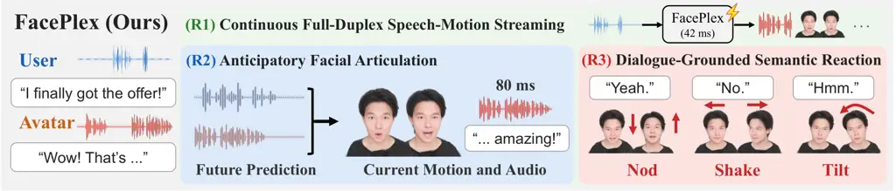
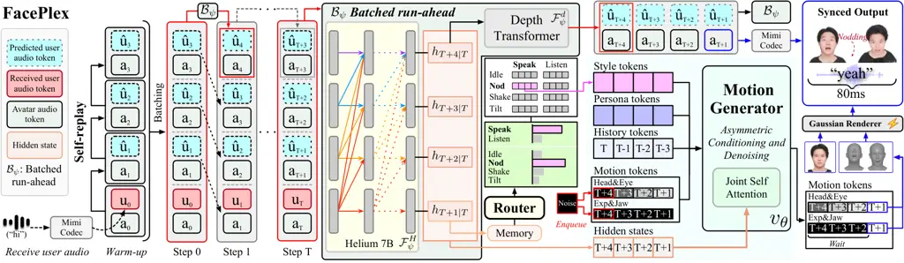
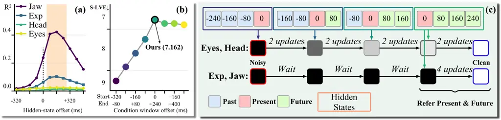
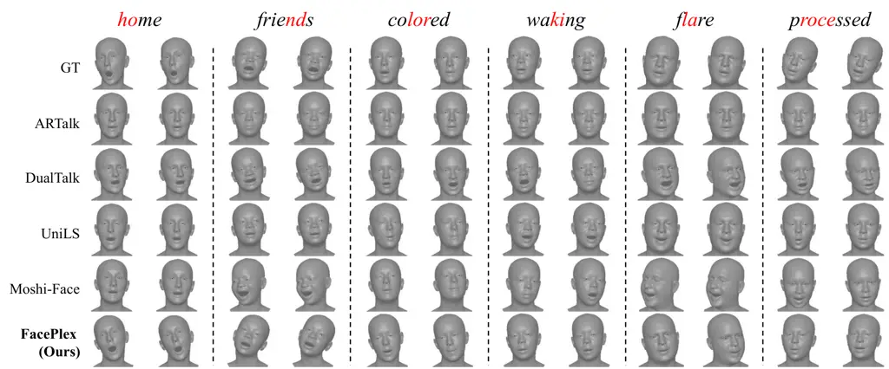
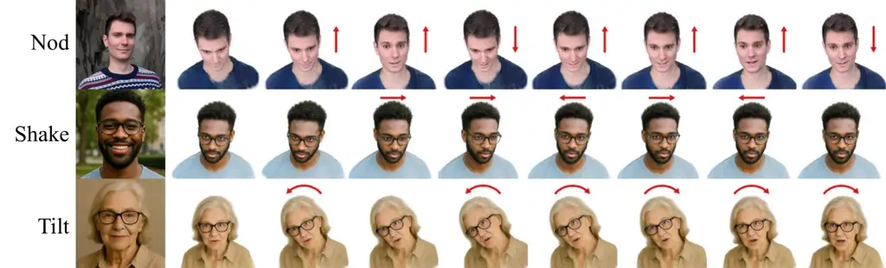
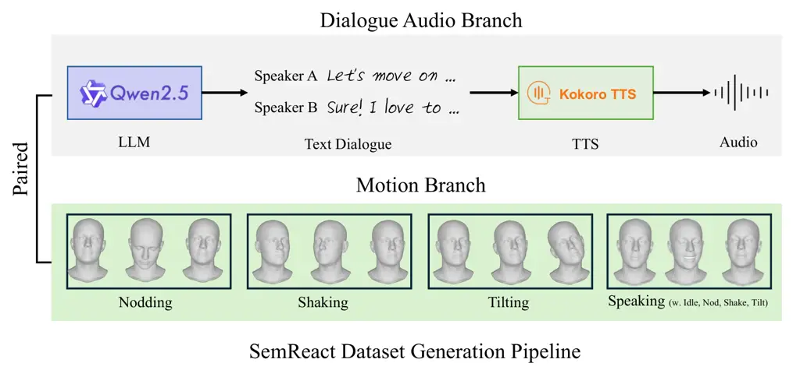
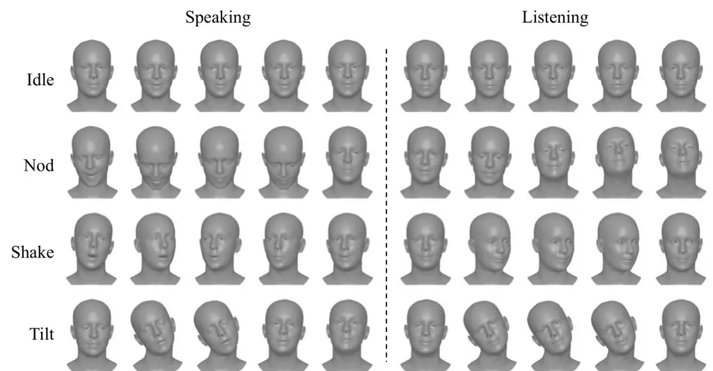
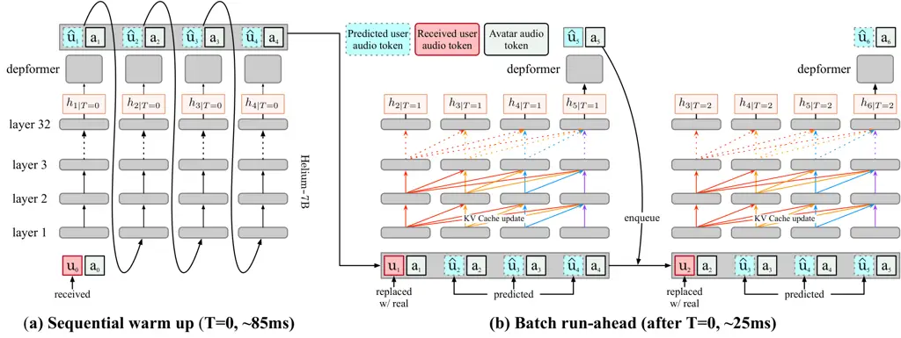
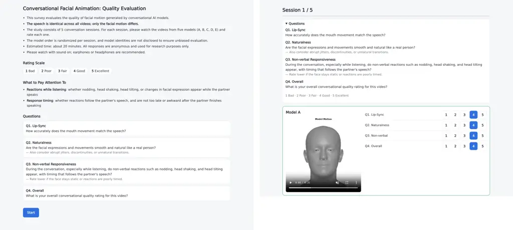

# FacePlex: Toward Natural Full-Duplex Conversational Avatars

Habin Lim¹¹footnotemark: 1 Affiliation: Korea University    Hah Min
Lew¹¹footnotemark: 1 Affiliation: Korea University    Jae-Ho
Lee¹¹footnotemark: 1 Affiliation: Korea University    Min-Jae Kim
Affiliation: Korea University    Seungeun Lee Affiliation: Klleon   
Ji-Su Kang Affiliation: Klleon    Gyeong-Moon Park²²footnotemark: 2
Affiliation: Korea University

###### Abstract

Natural human conversation is inherently a real-time interaction in
which speech and facial behavior continuously evolve. Enabling such
interaction requires a conversational avatar to jointly generate speech
and facial motion in real time, prepare facial motion for upcoming
speech before the corresponding audio is emitted, and produce non-verbal
reactions that reflect the ongoing dialogue. However, existing
conversational avatar systems cannot address such requirements:
audio-driven methods rely on pre-given speech, while joint streaming
generation alone does not ensure anticipatory articulation or
semantically appropriate reactions. We propose FacePlex, a unified
framework for full-duplex speech–facial motion generation and real-time
avatar rendering. FacePlex jointly coordinates speech, facial motion,
and Gaussian splatting rendering on a shared streaming timeline. To
prepare facial motion for upcoming speech, FacePlex predicts a short
speech continuation and uses its future hidden states through asymmetric
conditioning and denoising, while continuously updating them as new user
audio arrives without observing future user input. For dialogue-grounded
non-verbal behavior, we construct SemReact, a dataset aligning dialogue
context, reaction semantics, and facial motion, and introduce a semantic
behavior router that guides continuous motion during both speaking and
listening. Extensive experiments show improved audio-visual
synchronization and facial articulation, natural dialogue-grounded
non-verbal responses, and low-latency of 122 ms end-to-end avatar
interaction.

|     |
| --- |
|     |

^(†)^(†)footnotetext: ^($`\ast`$)Equal contribution
 ^($`\dagger`$)Corresponding author   Project page:
[https://hahminlew.github.io/faceplex](https://hahminlew.github.io/faceplex/)

## 1 Introduction

Conventional conversational AI systems typically follow a turn-based
interaction pattern: the model waits until the user provides a full
utterance, and then responds, and the cycle repeats. Natural human
conversation, however, extends beyond discrete turn-taking: speech and
facial behavior occur throughout the exchange rather than only at turn
boundaries (Levinson, 2016; Agrawal et al., 2025). For example,
listeners provide verbal backchannels, nods, and facial expressions
while another person is speaking (Knudsen et al., 2020; Ng et al.,
2022), and speakers prepare facial articulation for upcoming sounds and
use non-verbal behavior to convey their stance. A conversational avatar
must therefore do more than animate emitted speech: it must continuously
generate speech and facial motion, anticipate upcoming articulation, and
produce non-verbal behavior grounded in the dialogue. We formulate these
capabilities as three requirements for natural conversational avatars.

(R1) Continuous Full-Duplex Speech–Motion Streaming. The system must
continue receiving user input while concurrently generating avatar
speech and facial motion, without waiting for complete utterances. Here,
_full-duplex_ denotes concurrent processing of incoming signals and
generation of outgoing responses at each timestep (Défossez et al.,
2024; Roy et al., 2026). Because human conversation combines rapid
responses (Stivers et al., 2009) with tightly synchronized vocal and
visual signals (Holler & Levinson, 2019), speech generation, motion
synthesis, and avatar rendering must remain temporally aligned within a
shared end-to-end latency budget.

(R2) Anticipatory Facial Articulation. Facial motion must reflect speech
that is being prepared before acoustic emission. Classical articulatory
studies show that facial articulation begins before the corresponding
acoustic event (Benguerel et al., 1974; Abry et al., 1995). Visible
mouth movements can precede voice onset by approximately
100–300 ms (Chandrasekaran et al., 2009), while anticipatory labial
coarticulation may emerge more than 200 ms before the acoustic emission
of a target rounded vowel (Lo et al., 2023). Natural articulation
therefore requires access to upcoming speech information early enough to
guide facial motion while preserving causal streaming, without buffering
complete utterances or accessing future user observations.

(R3) Dialogue-Grounded Non-Verbal Behavior. Non-verbal facial behavior
must reflect the semantic context of the ongoing dialogue. Listeners’
nods can express affiliation with a speaker’s stance (Stivers, 2008),
while head shakes can convey negation independently or together with
speech (Kendon, 2002). This requires supervision that connects dialogue
context to both an appropriate reaction and its continuous facial-motion
realization, beyond speaking/listening labels alone.



Figure 1: FacePlex targets three requirements for natural conversational
avatars: (R1) continuous full-duplex speech–motion streaming, (R2)
anticipatory facial articulation using predicted future context, and
(R3) dialogue-grounded semantic reactions such as nodding, head shaking,
and head tilting. Speech and facial motion are coordinated in 80 ms
streaming steps.

However, existing speech-driven facial-generation paradigms address only
subsets of these requirements (Figure 1). Conventional
utterance-conditioned methods assume that the full utterance speech is
already available (Fan et al., 2022; Xing et al., 2023; Sun et al.,
2024), generating only facial motion rather than jointly producing
speech and motion online. Methods that model both speaking and
listening, such as UniLS (Chu et al., 2026) and DualTalk (Peng et al.,
2025), similarly animate conversations from complete utterance audio.
More recently, Moshi-Face (Jiang et al., 2026) supports full-duplex
speech and face generation at the token level, but its non-causal face
codec leaves fully causal visual streaming unresolved. Existing
paradigms therefore address only subsets of (R1)–(R3), leaving their
joint realization within a single causal streaming avatar unresolved.

To address these requirements, we propose FacePlex, a unified framework
for full-duplex joint speech–facial motion generation and real-time
avatar rendering. For (R1), FacePlex jointly generates speech and facial
motion on a shared full-duplex streaming timeline while continuously
processing user input. Gaussian splatting (GS) rendering (Kerbl et al., 2023) is integrated into this pipeline for real-time visual output. For
(R2), we first analyze the temporal dependence between conversational
hidden states and facial motion and find that nearby future hidden
states provide stronger cues for current articulation than past or
temporally aligned states alone. Motivated by this observation, we
generate a short speech continuation, keep its avatar tokens fixed, and
recompute its hidden states as new user audio arrives. To meet the 80 ms
causal streaming budget, we perform this recomputation with batched
run-ahead prediction for motion conditioning. We couple these updated
hidden states with asymmetric conditioning and denoising: expression and
jaw use the latest current and future hidden states just before output,
while head and eye motion are progressively denoised across successive
windows. For (R3), we construct SemReact, a conversational reaction
dataset that combines augmented real motion from CCDb-HG (Vuillecard
et al., 2024) with synthetic semantic control to align dialogue context,
reaction semantics, and facial motion. Using this supervision, a
_semantic behavior router_ selects reactions from past conversational
hidden states and conditions the motion generator through _style token
routing_, enabling dialogue-grounded non-verbal behavior during both
speaking and listening while retaining the avatar’s motion
characteristics.

To evaluate whether these designs satisfy the three requirements, we
conduct comprehensive experiments, demonstrating improved audio-visual
synchronization and facial articulation in offline evaluation,
naturalistic non-verbal responses grounded in dialogue context, and
low-latency end-to-end operation. Together, these results demonstrate
the continuous full-duplex speech–motion streaming, anticipatory facial
articulation, and dialogue-grounded non-verbal behavior within a unified
conversational avatar. Our contributions are summarized as follows:

- •
  We introduce FacePlex, a unified conversational avatar framework that
  enables continuous full-duplex speech–motion streaming, anticipatory
  facial articulation, and dialogue-grounded non-verbal behavior.
- •
  Based on our temporal analysis, we combine batched run-ahead
  prediction with asymmetric conditioning and denoising to enable
  anticipatory facial articulation within a causal streaming budget.
- •
  We construct SemReact, a dataset aligning dialogue context, reaction
  semantics, and facial motion, enabling our semantic behavior router
  with style token routing to generate dialogue-grounded non-verbal
  behavior during both speaking and listening.
- •
  Extensive experiments demonstrate state-of-the-art facial-motion
  performance across speaking and listening in offline evaluation, while
  achieving the highest user-study ratings, with 122 ms, end-to-end
  latency.

## 2 Related Work

Full-Duplex Speech and Audio-Visual Conversation.  Full-duplex speech
models process incoming speech while generating responses, enabling
overlap and interruptions (Défossez et al., 2024; Wang et al., 2025;
Zhang et al., 2025; Roy et al., 2026). Moshi-Face (Jiang et al., 2026)
jointly generates speech and face tokens with a temporally causal
dialogue model. Its Face Transformer’s non-causal attention operates
across tokens within each timestep and does not itself violate temporal
causality. The limitation lies in its non-causal face codec: the authors
explicitly identify a causal codec as future work needed for fully
streaming visual input and output. This distinguishes token-level
generation from a causal visual pipeline, without implying that the
codec necessarily buffers entire utterances. FacePlex integrates speech,
continuous facial motion, and rendering while predicting upcoming
content solely from available observations.

Audio-Driven Facial Motion Generation.  Prior works animate speech using
learned styles (Cudeiro et al., 2019), transformers (Fan et al., 2022),
discrete motion priors (Xing et al., 2023), autoregression (Chu et al.,
2025), and diffusion (Sun et al., 2024), or directly synthesize
talking-head video (Prajwal et al., 2020; Zhang et al., 2023). These
methods assume that the speech to be animated is available, whereas
joint online generation must obtain articulatory cues before emitting
its own speech. Articulatory studies motivate this distinction by
showing that lip movements can precede the corresponding
sounds (Benguerel et al., 1974; Chandrasekaran et al., 2009; Lo et al.,
2023). FacePlex supports anticipatory facial articulation by combining
run-ahead prediction with asymmetric conditioning and denoising, using
upcoming hidden states without access to future observations.

Conversational Reactions and Semantic Behavior Control. 
Listener-behavior generation methods model responses to a conversational
partner (Ng et al., 2022; Ng et al., 2023; Zhou et al., 2022; Luo
et al., 2024), while DualTalk (Peng et al., 2025) and UniLS (Chu et al., 2026) model both speaking and listening. However, conversational roles
alone do not capture how non-verbal responses vary with dialogue
context. STEER (Teotia et al., 2026) supports explicit behavior control
and causal motion generation with Gaussian avatar rendering, but
requires externally supplied controls and leaves their selection from
dialogue content to future work. FacePlex uses SemReact’s
dialogue–reaction–motion supervision to train a semantic behavior
router, selecting reactions from conversational context and realizing
them as continuous non-verbal motion through style token routing.

## 3 FacePlex



Figure 2: Overview of FacePlex. Sequential self-replay generates future
speech; batched run-ahead $`\mathcal{B}_{\psi}`$ then recomputes the
hidden states as new user audio arrives. A semantic behavior router with
style token routing selects context-dependent non-verbal behavior. At
step $`T`$, FacePlex prepares speech and facial motion for step $`T+1`$,
with facial motion rendered using Gaussian splatting.

FacePlex generates speech and facial motion while continuously listening
to the user (Figure 2). It combines anticipatory facial articulation
from future hidden states with dialogue-grounded non-verbal behavior,
while maintaining synchronized speech and motion on a shared streaming
timeline. We use PersonaPlex-7B (Roy et al., 2026) as the speech
backbone $`F_{\psi}`$, with frozen parameters $`\psi`$. It consists of a
temporal transformer $`F_{\psi}^{H}`$ and a depth transformer
$`F_{\psi}^{d}`$. At each 80 ms processing step $`T`$, $`F_{\psi}^{H}`$
computes $`h_{T+1}\in\mathbb{R}^{d_{h}}`$ from token inputs through
position $`T`$, with $`d_{h}=4096`$. The hidden-state index refers to
the next output position, so $`h_{T+1}`$ is available at step $`T`$.
$`F_{\psi}^{d}`$ uses a hidden state to generate predicted user audio
tokens and avatar audio tokens.

Our motion generator produces a pair of FLAME (Li et al., 2017) frames
per step, giving 25 Hz animation. At step $`T`$, it prepares the motion
pair for output at $`T+1`$, synchronized with the corresponding avatar
audio. The motion generator uses asymmetric conditioning and denoising
with hidden states from run-ahead prediction. It also uses history,
persona, and style tokens. History tokens represent previously completed
motion frames. Persona tokens encode a fixed reference for the avatar’s
motion characteristics. Style tokens encode a reaction reference
selected by the semantic behavior router at each step. The following
subsections focus on our temporal analysis, batched run-ahead
prediction, asymmetric conditioning and denoising, semantic behavior
routing, and streaming-optimized avatar rendering.

### 3.1 When does Audio Affect Motion?

Facial articulation often begins before the acoustic emission of the
corresponding speech sound (Benguerel et al., 1974; Abry et al., 1995;
Lo et al., 2023). Studies comparing the timing of mouth movements and
speech acoustics report that mouth movements can begin about 100–300 ms
before voice emission (Chandrasekaran et al., 2009). These findings
raise a practical question for streaming motion generation: _Is past and
current speech information sufficient to generate accurate facial
motion, or is information about future speech also needed?_

To investigate this question, we extract hidden states from Seamless
Interaction conversations (Agrawal et al., 2025) and probe how well a
single state at each time offset predicts the target motion by measuring
the coefficient of determination ($`R^{2}`$). For jaw and expression,
$`R^{2}`$ peaks for hidden states 160 ms ahead of the target motion and
decreases farther into the future. Head and eye motion show low
$`R^{2}`$ across offsets (Figure 3(a)). Appendix D.8 describes the
probing setup in detail.

We set a window of four hidden states and evaluate its temporal
placement by training motion generators with windows of the same length
at different offsets. Shifting the window into the near future reduces
Speaking Lip Vertex Error (S-LVE), but shifting it further into the
future provides no further benefit (Figure 3(b)). For the motion pair to
be output at $`T+1`$, we therefore use the state at that target position
and the next $`k=3`$ states:
$`\mathcal{W}_{T}=[h_{T+1},\ldots,h_{T+k+1}]`$. Guided by this analysis,
we adopt asymmetric conditioning and denoising schedules tailored to the
distinct temporal dependencies of different motion components
(Figure 3(c)). Section 3.3 describes these in detail.

### 3.2 Batched Run-Ahead Prediction for Motion Conditioning

As shown by our analysis in Section 3.1, motion generation benefits from
future hidden states. Computing these states requires user audio that
has not yet arrived. Therefore, we predict the future user audio using
PersonaPlex, which is trained to predict both user audio tokens
($`\hat{u}_{T}`$) and avatar audio tokens ($`a_{T}`$) (Défossez et al.,
2024; Roy et al., 2026). We feed the predicted user audio tokens and
avatar audio tokens back into the model to generate tokens for the next
step, a process called _self-replay_:
$`(a_{T+1},\hat{u}_{T+1})=F_{\psi}^{d}(F_{\psi}^{H}(a_{T},\hat{u}_{T}))`$.
Repeating this process produces future avatar audio and the hidden
states needed for motion generation without waiting for future user
audio.



Figure 3: (a) Coefficient of determination ($`R^{2}`$) for motion
predictions from a single hidden state at various time offsets. (b)
Speaking Lip Vertex Error (S-LVE) across four-state conditioning
windows. (c) Asymmetric conditioning and denoising schedules for each
motion component.

However, repeating this sequential process whenever new user audio
arrives would require multiple sequential backbone forward passes per
streaming step, making it difficult to meet the 80 ms computation budget
for each step. We therefore use batched run-ahead to recompute the
hidden-state window while keeping the buffered avatar audio tokens
fixed. New predicted user audio tokens and avatar audio tokens are
generated only at the end of the buffer. We initialize the token buffer
$`\mathbf{T}`$ once at the start of each conversation using sequential
self-replay. Starting with the initial avatar audio tokens $`a_{0}`$ and
received user audio tokens $`u_{0}`$, this warm-up fills four buffer
positions:
$`\mathbf{T}_{0}=[(a_{0},u_{0}),(a_{1},\hat{u}_{1}),(a_{2},\hat{u}_{2}),(a_{3},\hat{u}_{3})]`$
(Figure 2). The buffered avatar audio tokens determine the speech that
the user will hear. Appendix D.3 evaluates the consistency between
committed audio and recomputed hidden states, along with their effects
on speech predictions.

At subsequent streaming steps $`T\geq 1`$, the buffer is
$`\mathbf{T}_{T}=[(a_{T},\hat{u}_{T}),\ldots,(a_{T+k},\hat{u}_{T+k})]`$.
When user audio for step $`T`$ arrives, we replace the predicted user
audio tokens $`\hat{u}_{T}`$ with the received user audio tokens
$`u_{T}`$, resulting in
$`\mathbf{T}^{\prime}_{T}=[(a_{T},u_{T}),\ldots,(a_{T+k},\hat{u}_{T+k})]`$.
Since $`\mathbf{T}^{\prime}_{T}`$ already contains all input tokens,
batched run-ahead can recompute all hidden states in the window in a
single causal forward pass through $`F_{\psi}^{H}`$. Through causal
attention, the received user audio also changes the hidden states at
later positions, even though their input tokens remain fixed. We denote
this batched run-ahead function by $`\mathcal{B}_{\psi}`$, which uses
the frozen speech backbone $`F_{\psi}`$. $`\mathcal{B}_{\psi}`$ outputs
the hidden state window, predicted user audio tokens, and avatar audio
tokens:

```math
(\widehat{\mathcal{W}}_{T},\hat{u}_{T+k+1},a_{T+k+1})=\mathcal{B}_{\psi}(\mathbf{T}^{\prime}_{T}). \tag{1}
```

Here, $`\widehat{\mathcal{W}}_{T}`$ approximates $`\mathcal{W}_{T}`$,
with $`\widehat{h}`$ denoting hidden states computed using predicted
user audio tokens at future positions. For $`T\geq 1`$, batched
run-ahead shifts and recomputes $`\widehat{\mathcal{W}}_{T-1}`$ as
$`\widehat{\mathcal{W}}_{T}`$ using the received user audio tokens
$`u_{T}`$.

```math
\widehat{\mathcal{W}}_{T-1}=[h_{T},\widehat{h}_{T+1\mid T-1},\ldots,\widehat{h}_{T+k\mid T-1}]\xrightarrow{u_{T}}\widehat{\mathcal{W}}_{T}=[h_{T+1},\widehat{h}_{T+2\mid T},\ldots,\widehat{h}_{T+k+1\mid T}]. \tag{2}
```

Only the last hidden state $`\widehat{h}_{T+k+1\mid T}`$ is passed to
the depth transformer $`F_{\psi}^{d}`$ to generate new predicted user
audio tokens and avatar audio tokens. We append the new tokens and
remove the oldest token pair to form $`\mathbf{T}_{T+1}`$. At $`T=0`$,
we use $`\mathbf{T}^{\prime}_{0}=\mathbf{T}_{0}`$ for the first batched
run-ahead step, which generates $`\hat{u}_{4}`$ and $`a_{4}`$ and forms
$`\mathbf{T}_{1}`$ in the same way. The avatar audio tokens $`a_{T+1}`$
for the next output remain fixed in the buffer while their corresponding
motion pair is prepared. (See Appendix D.2.)

### 3.3 Asymmetric Conditioning and Denoising

FacePlex controls the temporal context of each FLAME component through
asymmetric denoising schedules. Each component is denoised at selected
streaming steps, using the hidden state window
$`\widehat{\mathcal{W}}_{T}`$ recomputed by $`\mathcal{B}_{\psi}`$ at
step $`T`$. These schedules build on rolling flow matching (Ergasti
et al., 2025), which combines the sliding-window denoising of rolling
diffusion (Ruhe et al., 2024) with flow matching (Lipman et al., 2022)
to gradually transform noise into motion.

At step $`T`$, the motion buffer $`\mathbf{z}`$ holds $`Q=k+1=4`$ motion
pairs for output positions $`T+1,\ldots,T+k+1`$, matching those covered
by $`\widehat{\mathcal{W}}_{T}`$ (Section 3.2). Each pair contains two
motion tokens, corresponding to 80 ms. For denoising, we divide each
motion token into two component groups, head–eye and expression–jaw, and
apply a different schedule to each group. A new pair is enqueued at the
end of the buffer as Gaussian noise and moves one position forward per
streaming step. For the motion pair to be output at $`T+1`$, the
head–eye group of each motion token receive two denoising updates at
each step from $`T-3`$ to $`T`$, using the corresponding windows
$`\widehat{\mathcal{W}}_{T-3},\ldots,\widehat{\mathcal{W}}_{T}`$. The
expression–jaw group are updated only at the final step $`T`$, using
$`\widehat{\mathcal{W}}_{T}`$ (Figure 3(c)). This final window starts at
$`h_{T+1}`$ and covers the current and future positions relative to the
target motion pair (Section 3.1). Expression and jaw use this window as
their direct speech conditioning.

At each denoising update, the motion generator with trainable parameters
$`\theta`$ predicts velocities
$`\widehat{\mathbf{v}}=v_{\theta}(\mathbf{z};\mathbf{u},\widehat{\mathcal{W}}_{T},\mathcal{C})`$.
Here $`\mathbf{z}`$ contains the normalized FLAME parameters of the
noisy motion buffer. $`\mathbf{u}`$ records the denoising progress of
the head–eye and expression–jaw groups in each motion pair, from zero
(noise) to one (completed motion). $`\mathcal{C}`$ includes the history,
persona, and style tokens. The predicted velocities
$`\widehat{\mathbf{v}}`$ are used to denoise the motion tokens according
to the schedules above. See Appendix D.4 for the update budgets and
numerical rules, and Appendix D.5 for training details.

### 3.4 Dialogue-grounded Non-Verbal Behavior

SemReact.  Grounding non-verbal motion in dialogue semantics requires
supervision for both selecting an appropriate reaction and generating it
as continuous motion. We construct SemReact, a conversational reaction
dataset combining augmented real motion from the CCDb-HG training
partition (Vuillecard et al., 2024) with synthetic semantic control. Its
_dialogue–reaction–motion alignment_ provides this supervision, enabling
the higher-level behavior planning identified as future work by the
externally controlled STEER (Teotia et al., 2026).

For the synthetic component, a language model generates dialogues with
sentence-level reactions from
$`\mathcal{Y}=\{\text{idle},\text{nod},\text{shake},\text{tilt}\}`$. A
separate verification pass checks each proposed reaction against its
conversational context without seeing the original label; disagreements
are demoted to idle. We synthesize both speakers’ audio and blend
sentence-aligned gesture primitives into continuous motion generated by
UniLS (Chu et al., 2026). Together with augmented real gestures, these
examples link conversational context to reaction labels and motion
during speaking and listening. The synthetic corpus contains 18,075
dialogues; CCDb-HG participants are separated before constructing the
real-motion bank. Further details are provided in Appendix A.

Semantic Behavior Router.  A _semantic behavior router_ determines the
avatar’s speaking/listening state and reaction from recent
conversational hidden states (Figure 2, center). These decisions select
the corresponding style tokens, and _style token routing_ conditions
continuous motion while retaining the avatar’s motion characteristics.
This connects the semantic supervision in SemReact to the rolling
generator without extending its short articulation window.

At processing step $`T`$, the speaking/listening state denotes as
$`s_{T}=\arg\max_{s\in\{0,1\}}[\mathbf{p}^{\mathrm{state}}_{T}]_{s}`$.
To predict both the reaction and the speaking/listening state, we
aggregate the latest $`L=25`$ available hidden states, ending at
$`h_{T+1}`$ and covering approximately 2 s of dialogue. Using the
generator’s speech projection $`W_{h}\in\mathbb{R}^{d\times d_{h}}`$, we
form a semantic context vector
$`\mathbf{c}^{\mathrm{sem}}_{T}\in\mathbb{R}^{d}`$. The router predicts
reaction probabilities $`\mathbf{p}^{\mathrm{beh}}_{T}`$ over
$`\mathcal{Y}`$ and speaking/listening state probabilities
$`\mathbf{p}^{\mathrm{state}}_{T}`$ over $`\{0,1\}`$:

```math
\mathbf{c}^{\mathrm{sem}}_{T}=\frac{1}{L}\sum_{i=0}^{L-1}W_{h}h_{T+1-i},\qquad\bigl(\mathbf{p}^{\mathrm{beh}}_{T},\mathbf{p}^{\mathrm{state}}_{T}\bigr)=g_{\phi}\!\left(\operatorname{LN}(\mathbf{c}^{\mathrm{sem}}_{T})\right). \tag{3}
```

Here, $`d=512`$, $`i`$ is the lag in streaming steps, and
$`\operatorname{LN}`$ is layer normalization. The router $`g_{\phi}`$ is
an MLP with parameters $`\phi`$ and two output heads, each applying a
separate softmax over the four reaction classes or the two
speaking/listening states. Each hidden state encodes prior dialogue
context, and pooling summarizes this context for both predictions. We
obtain the accepted reaction $`b_{T}\in\mathcal{Y}`$ by stabilizing the
highest-probability reaction class across streaming steps.

Style Token Routing and Reaction Motion Generation.  The accepted
reaction $`b_{T}`$ and the router’s speaking/listening state $`s_{T}`$
index short reference motion clips drawn from the training bank, with
idle, nod, shake, and tilt available for both speaking and listening.
These controls and the style tokens are indexed by their processing step
$`T`$ and condition the motion buffer whose first pair will be output at
$`T+1`$. The generator’s shared motion projection maps the selected clip
to style tokens:

```math
\displaystyle\mathbf{P}^{\mathrm{style}}_{T} \displaystyle=\Pi_{\mathrm{motion}}\!\left(\mathcal{R}(b_{T},s_{T})\right), \tag{4}
```

where $`\mathcal{R}`$ indexes the clip bank and
$`\Pi_{\mathrm{motion}}`$ projects 108-D motion to 512-D tokens for
history and noisy motion frames. The selected style tokens guide the
current reaction, while the fixed persona tokens retain the avatar’s
motion characteristics. Both form part of the motion conditioning
$`\mathcal{C}`$ in Section 3.3. The generator tracks reaction
progression across streaming steps, supporting coherent onset,
development, and return rather than repeatedly initiating the selected
gesture.

We jointly optimize
$`\mathcal{L}=\mathcal{L}_{\mathrm{FM}}+\lambda_{\mathrm{route}}\mathcal{L}_{\mathrm{route}}`$,
where $`\mathcal{L}_{\mathrm{FM}}`$ is the flow-matching loss,
$`\mathcal{L}_{\mathrm{route}}`$ provides cross-entropy supervision for
both reaction and speaking/listening state predictions on labeled
samples, and $`\lambda_{\mathrm{route}}=0.5`$. Appendix B details state
determination, transition handling, framewise conditioning, reaction
progression, and training.

### 3.5 Streaming-Optimized Avatar Rendering

To realize FacePlex as an interactive visual avatar, generated motion
must be rendered within the streaming budget. We use
FlexAvatar (Kirschstein et al., 2026), a generalizable avatar renderer
that relies on learned neural decoding for high-fidelity synthesis. With
the original FlexAvatar renderer, naive serial rendering of the two
frames produced per FacePlex step consumes about 17% of the 80 ms
budget. Profiling shows that much of this cost comes from fragmented
execution around transformer attention and repeated computation that
remains unchanged across frames.

We therefore reorganize renderer execution while preserving the original
computation. We introduce _QKPack_, a fused operator that preserves
stream-specific Query/Key normalization while directly forming the
packed inputs required by joint attention (Esser et al., 2024) in a
single GPU kernel. We further move frame-invariant operations outside
the per-frame path by pre-casting frozen linear weights from FP32 to
FP16 and incorporating fixed upsampling modulation (Karras et al., 2020)
into the convolution weights. The two motion frames of each FacePlex
step are rendered jointly, and the resulting fixed-shape pipeline is
captured with CUDA Graphs to reduce launch overhead. Detailed
formulations and equivalence analyses are provided in Appendix H.
Together, these optimizations accelerate rendering by $`3.27\times`$
(Table 5), with negligible perceptual deviation from the original
FlexAvatar renderer (LPIPS $`1.04\times 10^{-5}`$, PSNR 68.16 dB).

## 4 Experiments

### 4.1 Experimental Setup

Baselines. We compare FacePlex with ARTalk (Chu et al., 2025),
DualTalk (Peng et al., 2025), UniLS (Chu et al., 2026), and
Moshi-Face (Jiang et al., 2026). Since no public implementation of
Moshi-Face was available, we adapt its method to 108-dimensional FLAME
motion; implementation details and deviations from the original setting
are provided in Appendix E. For avatar rendering, we use
FlexAvatar (Kirschstein et al., 2026) as the rendering backbone.

Evaluation Protocol.  We evaluate on the Seamless Interaction test
split (Agrawal et al., 2025), following the conversational-avatar
evaluation protocol of UniLS (Chu et al., 2026). For speaking motion, we
report Lip Vertex Error (LVE) (Richard et al., 2021), Mean Head Distance
(MHD), and Upper-Face Dynamics Deviation (FDD) (Xing et al., 2023); for
listening motion, we report FDD and Fréchet distance (L-FID). S-/L-
denote speaking/listening intervals.

For the main motion-quality comparison, we evaluate the baselines
following their default offline setting. We referred to their original
papers. We evaluate FacePlex in streaming condition. We separately
report run-ahead computation time and system latency in Section 5. We
measure latency from the onset of user speech to the first audible
avatar response.

### 4.2 Experimental Results

Main Comparison. Table 2 compares FacePlex in streaming setting and the
baselines in their default offline evaluation on Seamless Interaction,
alongside the user-study results in Table 2. FacePlex achieves the
lowest errors across all five reported motion-quality metrics. FacePlex
also achieves a lowest latency of 122.16 ms.

Qualitative Results. Figure 4 compares generated motions across
different speech segments. Compared with prior facial motion models,
FacePlex produces more speech-consistent motion in these examples.
ARTalk tends to produce conservative head movements, DualTalk often
shows unstable or exaggerated expressions, and UniLS is smooth but less
phonetically aligned. In contrast, FacePlex captures clearer lip motion
and more natural head movements, especially for words with distinctive
mouth shapes such as “home”, “colored”, and “flare”. Figure 5
illustrates non-verbal behaviors rendered with Gaussian splatting,
including nodding, shaking, and tilting.

Table 1: Quantitative comparison on Seamless Interaction.

Table 2: User study (1–5, $`\uparrow`$).

| Method          | Latency (s) $`\downarrow`$ | S-LVE $`\downarrow`$ |              | S-MHD $`\downarrow`$ |              | S-FDD $`\downarrow`$ |               | L-FDD $`\downarrow`$ |               | L-FID $`\downarrow`$ |
| --------------- | -------------------------- | -------------------- | ------------ | -------------------- | ------------ | -------------------- | ------------- | -------------------- | ------------- | -------------------- |
| ARTalk          | 4.043                      | 8.385                | $`\pm`$2.958 | 1.906                | $`\pm`$0.607 | 46.878               | $`\pm`$19.869 | 45.006               | $`\pm`$20.567 | 8.811                |
| DualTalk        | 11.174                     | 11.785               | $`\pm`$2.171 | 2.389                | $`\pm`$0.382 | 35.836               | $`\pm`$16.725 | 33.276               | $`\pm`$17.438 | 56.376               |
| UniLS           | 4.093                      | 7.691                | $`\pm`$2.326 | 1.819                | $`\pm`$0.497 | 23.451               | $`\pm`$12.917 | 30.215               | $`\pm`$16.808 | 3.454                |
| Moshi-Face      | 4.188                      | 10.605               | $`\pm`$2.697 | 2.457                | $`\pm`$0.586 | 39.307               | $`\pm`$21.268 | 35.595               | $`\pm`$20.718 | 1.924                |
| FacePlex (Ours) | 0.122                      | 7.162                | $`\pm`$1.857 | 1.674                | $`\pm`$0.418 | 22.839               | $`\pm`$13.109 | 26.623               | $`\pm`$15.431 | 1.407                |

| Method          | Sync  | Nat.  | NVR   | MOS   |
| --------------- | ----- | ----- | ----- | ----- |
| ARTalk          | 2.445 | 2.161 | 1.729 | 2.148 |
| DualTalk        | 3.161 | 2.665 | 2.748 | 2.948 |
| UniLS           | 2.594 | 2.510 | 2.600 | 2.626 |
| Moshi-Face      | 1.561 | 1.781 | 2.052 | 1.774 |
| FacePlex (Ours) | 3.368 | 3.006 | 3.303 | 3.303 |



Figure 4: Qualitative comparisons. FacePlex produces more expressive and
speech-consistent motions, with clearer mouth articulation and more
natural head movements than prior methods.

| Reaction | Rule-based | Ours  |
| -------- | ---------- | ----- |
| Nod      | 35.87      | 75.33 |
| Shake    | 76.54      | 82.97 |
| Tilt     | 50.44      | 82.47 |
| Mean     | 54.28      | 80.26 |

Table 3: Router accuracy (%, $`\uparrow`$).  
Rule-based selects reactions from dialogue text using manual rules
(Appendix D.6).



Figure 5: GS-rendered nodding, shaking, and tilting (top to bottom);
arrows show head motion.

User Study.  We conducted a user study with 31 participants comparing
FacePlex against ARTalk, DualTalk, UniLS, and Moshi-Face. Each
participant evaluated 5 conversation sessions. Participants rated each
video on a 1–5 scale (higher is better) for Lip-Sync (Sync), Naturalness
(Nat.), Non-verbal Responsiveness (NVR), and Overall (MOS). The
interface is provided in the Appendix F. Table 2 summarizes the
perceptual comparison. FacePlex achieves the highest mean ratings across
all four criteria, with an overall score of 3.303 compared with 2.948
for the strongest baseline, DualTalk. Its largest margin over the best
baseline is in non-verbal responsiveness (3.303 vs. 2.748), indicating
better perceived conversational semantic reactions.

Video Results.  Our supplementary webpage provides qualitative video
comparisons and live interactive demonstrations of FacePlex. We strongly
encourage readers to view them.

## 5 Ablation Studies and Further Analysis

Semantic Routing.  With ground-truth reaction intervals given, our
router improves mean reaction-type accuracy over manual rules from
54.28% to 80.26%, particularly for nod and tilt (Table 5). This result
shows that semantic behavior router provides more reliable semantic
reaction selection.

Component Ablations.  Table 5 compares variants without hidden-state
updates, asymmetric denoising, or SemReact, plus cross-attention
conditioning. Ours has the lowest S-LVE, S-MHD, and S-FDD, while
listening results are mixed. Lower L-FID without SemReact (0.759 vs.
1.407) may reflect differences between SemReact’s augmented
listening-motion distribution and Seamless Interaction; L-FID does not
directly assess whether reactions are appropriate for the current
dialogue.

| Configuration           | S-LVE | S-MHD | S-FDD  | L-FDD  | L-FID |
| ----------------------- | ----- | ----- | ------ | ------ | ----- |
| w/o hidden state update | 7.425 | 1.716 | 23.893 | 25.999 | 1.378 |
| w/o Asym.               | 7.466 | 1.714 | 23.633 | 24.642 | 1.731 |
| w/ Cross-attn           | 7.418 | 1.721 | 24.027 | 28.728 | 1.733 |
| w/o SemReact            | 7.570 | 1.730 | 24.300 | 25.100 | 0.759 |
| Ours                    | 7.162 | 1.674 | 22.839 | 26.623 | 1.407 |

Table 4: Component ablations ($`\downarrow`$).

|                   |                     |                         |                   |
| ----------------- | ------------------- | ----------------------- | ----------------- |
| Config.           | Latency             | Speedup                 | PSNR              |
|                   | (ms) $`\downarrow`$ |                         | (dB) $`\uparrow`$ |
| Original          | 6.615               | $`1.00\times`$          | —                 |
| + CUDA Graph      | 4.102               | $`1.61\times`$          | 68.63             |
| + Frame Pair      | 3.123               | $`2.12\times`$          | 68.49             |
| + QKPack          | 2.566               | $`2.58\times`$          | 68.16             |
| + Folded Upsample | 2.329               | $`2.84\times`$          | 68.16             |
| + Pre-casting     | 2.026               | $`\mathbf{3.27\times}`$ | 68.16             |
|                   |                     |                         |                   |

Table 5: Renderer ablation.

| Method         | Wait | TF passes | LM    | Total  |
| -------------- | ---- | --------- | ----- | ------ |
| Full-wait      | 320  | 1         | 21.19 | 341.19 |
| Sequential     | 80   | 4         | 89.39 | 169.39 |
| Batched (Ours) | 80   | 1         | 25.27 | 105.27 |

Table 6: Forward time by schedule (ms).

| GPU      | Input | Enc. | Temp. | Depth | Route | Motion | Dec. | Rend. | Fwd.  | Total  |
| -------- | ----- | ---- | ----- | ----- | ----- | ------ | ---- | ----- | ----- | ------ |
| RTX 4090 | 80.00 | 3.71 | 21.71 | 9.91  | 0.37  | 6.10   | 2.31 | 4.53  | 55.13 | 135.13 |
| H200     | 80.00 | 3.20 | 11.90 | 11.86 | 0.23  | 7.43   | 2.32 | 2.03  | 42.16 | 122.16 |

Table 7: Forward time by component (ms).

Renderer Optimization.  Table 5 cumulatively adds CUDA Graphs, joint
frame-pair rendering, QKPack, folded upsampling, and weight pre-casting.
Latency decreases from 6.615 to 2.026 ms per rendered frame
($`3.27\times`$ speedup), with a PSNR of 68.16 dB relative to the
original renderer output.

Run-Ahead.  For $`k=3`$ (Table 7), full-wait incurs 320 ms of input
waiting, while sequential replay requires four transformer passes.
Batched run-ahead needs 80 ms and one pass, reducing the readiness
budget from 341.19 and 169.39 to 105.27 ms; codec and motion processing
are excluded.

Streaming Runtime.  Mean speaking forward times of 55.13 ms (RTX 4090)
and 42.16 ms (H200) are below the 80 ms input period (Table 7),
supporting streaming throughput. Total adds 80 ms of input acquisition
to Forward (Fwd.); rendering is reported per frame and excluded from
both.

Additional results and experimental protocols are provided in
Appendices D.6, D.7, G, and H.5–H.6.

## 6 Conclusion

We presented FacePlex, a unified framework for full-duplex joint
speech–facial motion generation and avatar rendering. Batched run-ahead
prediction makes upcoming hidden states available before the avatar’s
speech is emitted to the user, while asymmetric conditioning and
denoising use this anticipatory context to prepare expression and jaw
motion for upcoming sounds. We also constructed SemReact, a novel
dataset aligning dialogue context, reaction semantics, and facial
motion, which enables a semantic behavior router to generate
context-dependent reactions during both speaking and listening.
Extensive experiments and a user study demonstrate strong performance
for full-duplex streaming generation of synchronized speech and
expressive facial motion with only 122 ms latency. Together, these
contributions provide a foundation for conversational avatars that
coordinate what they say, how they articulate, and how they respond to
the meaning of an ongoing dialogue.

### AI use statement

Generative AI tools were not used to develop or refine the research
methodology, research ideas, experimental design, implementation, or
analysis and interpretation of results. As part of the SemReact data
construction pipeline, we used Qwen2.5-14B-Instruct to generate
synthetic reaction-conditioned dialogues and perform reaction
verification, as described in Appendix A.2. We also used LLMs for
grammar checking and readability improvement during paper preparation.
All AI-assisted content was reviewed by the authors.

### Ethics statement

This research adheres to the ICLR Code of Ethics. Appendix I discusses
the potential positive and negative societal impacts of FacePlex,
including applications in accessible conversational interfaces and risks
related to deceptive synthetic media, impersonation, privacy, consent,
and user overtrust, together with possible safeguards. Our experiments
use existing conversational datasets and synthetically generated data.
The user study did not require formal ethical review under our
institutional guidelines; informed consent was obtained from all
participants, and responses were collected anonymously. This work is
intended for research on streaming multimodal generation and not for
deceptive or unauthorized representations of real individuals.

### Reproducibility statement

We provide reproducibility details throughout the main paper and
appendix. Section 4.1 describes the experimental setup, evaluation data,
metrics, baselines, and evaluation protocol, while the appendix provides
details on SemReact construction and partitions, model architecture and
training, streaming generation, baseline adaptations, user-study
protocols, and rendering optimizations. Appendix A.6 specifies the fixed
data partitions and reproducibility settings for SemReact.

## References

- Abry et al. (1995) Abry, Christian, and TM Lallouache. Modeling lip
  constriction anticipatory behaviour for rounding in french with the
  mem. In _Proc. ICPhS_, volume 4, pp. 152–155, 1995.
- Agrawal et al. (2025) Vasu Agrawal, Akinniyi Akinyemi, Kathryn Alvero,
  Morteza Behrooz, Julia Buffalini, Fabio Maria Carlucci, Joy Chen,
  Junming Chen, Zhang Chen, Shiyang Cheng, et al. Seamless interaction:
  Dyadic audiovisual motion modeling and large-scale dataset. _arXiv
  preprint arXiv:2506.22554_, 2025.
- Benguerel et al. (1974) Benguerel, André-Pierre, and Helen A Cowan.
  Coarticulation of upper lip protrusion in french. _Phonetica_,
  30(1):41–55, 1974.
- Chandrasekaran et al. (2009) Chandrasekaran, Chandramouli, Andrea
  Trubanova, Sébastien Stillittano, Alice Caplier, and Asif A Ghazanfar.
  The natural statistics of audiovisual speech. _PLoS computational
  biology_, 5(7):e1000436, 2009.
- Chu et al. (2025) Xuangeng Chu, Nabarun Goswami, Ziteng Cui, Hanqin
  Wang, and Tatsuya Harada. Artalk: Speech-driven 3d head animation via
  autoregressive model. In _Proceedings of the SIGGRAPH Asia 2025
  Conference Papers_, pp. 1–9, 2025.
- Chu et al. (2026) Xuangeng Chu, Ruicong Liu, Yifei Huang, Yun Liu,
  Yichen Peng, and Bo Zheng. Unils: End-to-end audio-driven avatars for
  unified listening and speaking. In _Proceedings of the IEEE/CVF
  Conference on Computer Vision and Pattern Recognition_, pp.
  25142–25152, 2026.
- Cudeiro et al. (2019) Daniel Cudeiro, Timo Bolkart, Cassidy Laidlaw,
  Anurag Ranjan, and Michael J Black. Capture, learning, and synthesis
  of 3d speaking styles. In _Proceedings of the IEEE/CVF conference on
  computer vision and pattern recognition_, pp. 10101–10111, 2019.
- Défossez et al. (2024) Alexandre Défossez, Laurent Mazaré, Manu
  Orsini, Amélie Royer, Patrick Pérez, Hervé Jégou, Edouard Grave, and
  Neil Zeghidour. Moshi: a speech-text foundation model for real-time
  dialogue. _arXiv preprint arXiv:2410.00037_, 2024.
- Ergasti et al. (2025) Alex Ergasti, Giuseppe Gabriele Tarollo, Filippo
  Botti, Tomaso Fontanini, Claudio Ferrari, Massimo Bertozzi, and Andrea
  Prati. R-FLAV: Rolling flow matching for infinite audio video
  generation. _arXiv preprint arXiv:2503.08307_, 2025.
- Esser et al. (2024) Patrick Esser, Sumith Kulal, Andreas Blattmann,
  Rahim Entezari, Jonas Müller, Harry Saini, Yam Levi, Dominik Lorenz,
  Axel Sauer, Frederic Boesel, et al. Scaling rectified flow
  transformers for high-resolution image synthesis. In _Forty-first
  international conference on machine learning_, 2024.
- Fan et al. (2022) Yingruo Fan, Zhaojiang Lin, Jun Saito, Wenping Wang,
  and Taku Komura. Faceformer: Speech-driven 3d facial animation with
  transformers. In _Proceedings of the IEEE/CVF conference on computer
  vision and pattern recognition_, pp. 18770–18780, 2022.
- Holler & Levinson (2019) Judith Holler and Stephen C Levinson.
  Multimodal language processing in human communication. _Trends in
  cognitive sciences_, 23(8):639–652, 2019.
- Jiang et al. (2026) Jingjing Jiang, Atsumoto Ohashi, and Ryuichiro
  Higashinaka. Integrating facial generation into full-duplex spoken
  dialogue systems. _arXiv preprint arXiv:2606.21970_, 2026.
- Karras et al. (2020) Tero Karras, Samuli Laine, Miika Aittala, Janne
  Hellsten, Jaakko Lehtinen, and Timo Aila. Analyzing and improving the
  image quality of stylegan. In _2020 IEEE/CVF Conference on Computer
  Vision and Pattern Recognition (CVPR)_, pp. 8107–8116. IEEE, 2020.
- Kendon (2002) Adam Kendon. Some uses of the head shake. _Gesture_,
  2(2):147–182, 2002.
- Kerbl et al. (2023) Bernhard Kerbl, Georgios Kopanas, Thomas
  Leimkühler, George Drettakis, et al. 3d gaussian splatting for
  real-time radiance field rendering. _ACM Trans. Graph._,
  42(4):139–1, 2023.
- Kirschstein et al. (2026) Tobias Kirschstein, Simon Giebenhain, and
  Matthias Nießner. Flexavatar: Learning complete 3d head avatars with
  partial supervision. In _Proceedings of the IEEE/CVF Conference on
  Computer Vision and Pattern Recognition_, pp. 18193–18203, 2026.
- Knudsen et al. (2020) Birgit Knudsen, Ava Creemers, and Antje S Meyer.
  Forgotten little words: How backchannels and particles may facilitate
  speech planning in conversation? _Frontiers in Psychology_,
  11:593671, 2020.
- Levinson (2016) Stephen C Levinson. Turn-taking in human
  communication–origins and implications for language processing.
  _Trends in cognitive sciences_, 20(1):6–14, 2016.
- Li et al. (2017) Tianye Li, Timo Bolkart, Michael. J. Black, Hao Li,
  and Javier Romero. Learning a model of facial shape and expression
  from 4D scans. _ACM Transactions on Graphics, (Proc. SIGGRAPH Asia)_,
  36(6):194:1–194:17, 2017. URL
  [https://doi.org/10.1145/3130800.3130813](https://doi.org/10.1145/3130800.3130813).
- Lipman et al. (2022) Yaron Lipman, Ricky TQ Chen, Heli Ben-Hamu,
  Maximilian Nickel, and Matt Le. Flow matching for generative modeling.
  _arXiv preprint arXiv:2210.02747_, 2022.
- Lo et al. (2023) Justin JH Lo, Christopher Carignan, Marianne
  Pouplier, Roy Alderton, Francesco Rodriquez, Bronwen G Evans, and Eva
  Reinisch. Language specificity vs speaker variability of anticipatory
  labial coarticulation in german and english. In _Proceedings of the
  20th International Congress of Phonetic Sciences_, pp.
  2105–2109, 2023.
- Luo et al. (2024) Cheng Luo, Siyang Song, Weicheng Xie, Micol Spitale,
  Zongyuan Ge, Linlin Shen, and Hatice Gunes. Reactface: Online multiple
  appropriate facial reaction generation in dyadic interactions. _IEEE
  Transactions on Visualization and Computer Graphics_,
  31(9):6190–6207, 2024.
- Ng et al. (2022) Evonne Ng, Hanbyul Joo, Liwen Hu, Hao Li, Trevor
  Darrell, Angjoo Kanazawa, and Shiry Ginosar. Learning to listen:
  Modeling non-deterministic dyadic facial motion. In _Proceedings of
  the IEEE/CVF conference on computer vision and pattern recognition_,
  pp. 20395–20405, 2022.
- Ng et al. (2023) Evonne Ng, Sanjay Subramanian, Dan Klein, Angjoo
  Kanazawa, Trevor Darrell, and Shiry Ginosar. Can language models learn
  to listen? In _Proceedings of the IEEE/CVF International Conference on
  Computer Vision_, pp. 10083–10093, 2023.
- Peng et al. (2025) Ziqiao Peng, Yanbo Fan, Haoyu Wu, Xuan Wang,
  Hongyan Liu, Jun He, and Zhaoxin Fan. Dualtalk: Dual-speaker
  interaction for 3d talking head conversations. In _2025 IEEE/CVF
  Conference on Computer Vision and Pattern Recognition (CVPR)_, pp.
  21055–21064. IEEE, 2025.
- Prajwal et al. (2020) KR Prajwal, Rudrabha Mukhopadhyay, Vinay P
  Namboodiri, and CV Jawahar. A lip sync expert is all you need for
  speech to lip generation in the wild. In _Proceedings of the 28th ACM
  international conference on multimedia_, pp. 484–492, 2020.
- Retsinas et al. (2024) George Retsinas, Panagiotis P Filntisis, Radek
  Danecek, Victoria F Abrevaya, Anastasios Roussos, Timo Bolkart, and
  Petros Maragos. 3d facial expressions through
  analysis-by-neural-synthesis. In _Proceedings of the IEEE/CVF
  conference on computer vision and pattern recognition_, pp.
  2490–2501, 2024.
- Richard et al. (2021) Alexander Richard, Michael Zollhöfer, Yandong
  Wen, Fernando De la Torre, and Yaser Sheikh. Meshtalk: 3d face
  animation from speech using cross-modality disentanglement. In
  _Proceedings of the IEEE/CVF International Conference on Computer
  Vision_, pp. 1173–1182, 2021.
- Roy et al. (2026) Rajarshi Roy, Jonathan Raiman, Sang-gil Lee,
  Teodor-Dumitru Ene, Robert Kirby, Sungwon Kim, Jaehyeon Kim, and Bryan
  Catanzaro. Personaplex: Voice and role control for full duplex
  conversational speech models. _arXiv preprint arXiv:2602.06053_, 2026.
- Ruhe et al. (2024) David Ruhe, Jonathan Heek, Tim Salimans, and Emiel
  Hoogeboom. Rolling diffusion models. _arXiv preprint
  arXiv:2402.09470_, 2024.
- Stivers (2008) Tanya Stivers. Stance, alignment, and affiliation
  during storytelling: When nodding is a token of affiliation. _Research
  on language and social interaction_, 41(1):31–57, 2008.
- Stivers et al. (2009) Tanya Stivers, Nicholas J Enfield, Penelope
  Brown, Christina Englert, Makoto Hayashi, Trine Heinemann, Gertie
  Hoymann, Federico Rossano, Jan Peter De Ruiter, Kyung-Eun Yoon, et al.
  Universals and cultural variation in turn-taking in conversation.
  _Proceedings of the National Academy of Sciences_,
  106(26):10587–10592, 2009.
- Sun et al. (2024) Zhiyao Sun, Tian Lv, Sheng Ye, Matthieu Lin, Jenny
  Sheng, Yu-Hui Wen, Minjing Yu, and Yong-jin Liu. Diffposetalk:
  Speech-driven stylistic 3d facial animation and head pose generation
  via diffusion models. _ACM Transactions on Graphics (ToG)_,
  43(4):1–9, 2024.
- Teotia et al. (2026) Kartik Teotia, Helge Rhodin, Hyeongwoo Kim, Marc
  Habermann, and Christian Theobalt. Steer: Steerable dyadic head
  avatars. In _SIGGRAPH Asia 2026 Conference Papers_, 2026.
- Vuillecard et al. (2024) Pierre Vuillecard, Arya Farkhondeh, Michael
  Villamizar, and Jean-Marc Odobez. Ccdb-hg: Novel annotations and
  gaze-aware representations for head gesture recognition. In _2024 IEEE
  18th International Conference on Automatic Face and Gesture
  Recognition (FG)_, pp. 1–9. IEEE, 2024.
- Wang et al. (2025) Xiong Wang, Yangze Li, Chaoyou Fu, Yike Zhang,
  Yunhang Shen, Lei Xie, Ke Li, Xing Sun, and Long MA. Freeze-omni: A
  smart and low latency speech-to-speech dialogue model with frozen LLM.
  In _Forty-second International Conference on Machine Learning_, 2025.
  URL
  [https://openreview.net/forum?id=s1EImzs5Id](https://openreview.net/forum?id=s1EImzs5Id).
- Xing et al. (2023) Jinbo Xing, Menghan Xia, Yuechen Zhang, Xiaodong
  Cun, Jue Wang, and Tien-Tsin Wong. Codetalker: Speech-driven 3d facial
  animation with discrete motion prior. In _Proceedings of the IEEE/CVF
  Conference on Computer Vision and Pattern Recognition_, pp.
  12780–12790, 2023.
- Zhang et al. (2025) Qinglin Zhang, Luyao Cheng, Chong Deng, Qian Chen,
  Wen Wang, Siqi Zheng, Jiaqing Liu, Hai Yu, Chao-Hong Tan, Zhihao Du,
  et al. Omniflatten: An end-to-end gpt model for seamless voice
  conversation. In _Proceedings of the 63rd Annual Meeting of the
  Association for Computational Linguistics (Volume 1: Long Papers)_,
  pp. 14570–14580, 2025.
- Zhang et al. (2023) Wenxuan Zhang, Xiaodong Cun, Xuan Wang, Yong
  Zhang, Xi Shen, Yu Guo, Ying Shan, and Fei Wang. Sadtalker: Learning
  realistic 3d motion coefficients for stylized audio-driven single
  image talking face animation. In _Proceedings of the IEEE/CVF
  conference on computer vision and pattern recognition_, pp.
  8652–8661, 2023.
- Zhou et al. (2022) Mohan Zhou, Yalong Bai, Wei Zhang, Ting Yao, Tiejun
  Zhao, and Tao Mei. Responsive listening head generation: a benchmark
  dataset and baseline. In _European conference on computer vision_, pp.
  124–142. Springer, 2022.

## Appendix

This appendix provides data construction, implementation, training, and
evaluation details, together with additional analyses of FacePlex.

A. SemReact Data Construction .A  
  A.1 CCDb-HG Real-Motion Bank .A.1  
  A.2 Dialogue Generation and Reaction Verification .A.2  
  A.3 Speech Synthesis and Temporal Alignment .A.3  
  A.4 Continuous Motion and Gesture Composition .A.4  
  A.5 Conversational Features and Packed Representation .A.5  
  A.6 Data Partitions and Reproducibility .A.6  
  A.7 Style Reference Bank Construction .A.7

B. Semantic Context-Guided Non-Verbal Behavior: Implementation Details
.B  
  B.1 Semantic Behavior Router: State and Reaction Decisions .B.1  
  B.2 Style Token Routing and Framewise Controls .B.2  
  B.3 Reaction Progression and Temporal Continuity .B.3

C. SemReact Prompt Specifications .C  
  C.1 Dialogue Generation .C.1  
  C.2 Prompt Slots and Output Validation .C.2  
  C.3 Reaction Verification .C.3

D. Streaming Generation Details .D  
  D.1 Motion Generator .D.1  
  D.2 Run-Ahead Buffer and Cache .D.2  
  D.3 Consistency Between Committed Speech and Recomputed States .D.3  
  D.4 Numerical Motion Updates .D.4  
  D.5 Motion Training .D.5  
  D.6 Ablation Details .D.6  
  D.7 Hidden-State Horizon and Window Placement .D.7  
  D.8 Hidden-State Timing Probe .D.8

E. Moshi-Face Baseline Implementation .E

F. User Study Details .F  
  F.1 Protocol and Participants .F.1  
  F.2 Interface and Rating Criteria .F.2

G. End-to-End Processing Latency .G

H. Streaming-Optimized Avatar Rendering .H  
  H.1 Profiling Details .H.1  
  H.2 QKPack: Stream-Preserving Attention Preparation .H.2  
  H.3 Removing Frame-Invariant Computation .H.3  
  H.4 Fixed-Shape CUDA Graph Execution .H.4  
  H.5 Runtime Ablation .H.5  
  H.6 Numerical Equivalence and Rendering Quality .H.6

I. Limitations and Broader Impact .I  
  I.1 Limitations .I.1  
  I.2 Potential Positive Impact .I.2  
  I.3 Potential Negative Impact .I.3

 

## Appendix A SemReact Data Construction

SemReact combines augmented real motion with synthetic semantic control.
The resulting dialogue–reaction–motion alignment supervises behavior
selection and continuous motion realization. Figure 6 summarizes how
generated dialogue and synthesized speech are paired with semantically
appropriate reaction motion. We first describe the real-motion bank,
followed by dialogue generation, speech synthesis, motion composition,
feature extraction, and data packing for the synthetic component. The
synthetic corpus contains 18,075 accepted dialogue scripts; Table 9
summarizes its training, validation, and test partitions. Figure 7
presents SemReact motion examples together with the corresponding
dialogue excerpts for speaking and listening.



Figure 6: SemReact data generation pipeline. Qwen2.5 generates
reaction-conditioned dialogues, and Kokoro synthesizes the two speakers’
audio. The resulting dialogue and speech are aligned with nod, shake,
and tilt reactions during speaking and listening.



[TABLE]

Figure 7: SemReact dataset examples and their corresponding dialogue
excerpts. Top: agent facial-motion sequences for idle, nod, shake, and
tilt behaviors during speaking (left) and listening (right). Bottom:
dialogue excerpts for each behavior and conversational role. Bold
utterances highlight the agent’s speech accompanying a speaking gesture
or the user’s speech associated with a listening reaction.

### A.1 CCDb-HG Real-Motion Bank

Data Source.  Our CCDb-HG (Vuillecard et al., 2024) processing covers 55
dyadic conversations involving 22 participants, recorded with two
synchronized cameras. Training motion augmentation and CCDb-derived
reference motion clips draw only from the training bank.

Motion Extraction.  We fit SMIRK (Retsinas et al., 2024) to each full
video, express head pose relative to the session mean, apply a 6 Hz
low-pass filter, and resample the trajectories to 25 fps. The ELAN
head-nodding, head-shake, and head-tilt tiers provide gesture labels,
while utterance tiers provide the own-speech flag. These trajectories
supply observed gesture realizations for motion augmentation; the
synthetic dialogue procedure below supplies explicit context–reaction
associations.

### A.2 Dialogue Generation and Reaction Verification

Reaction-Conditioned Dialogue Generation.  We first sample a reaction
budget for each dialogue: two or three listening nods, one or two
listening shakes, one or two listening tilts, and one or two speaking
nods or shakes. A separate budget requests zero or one speaking tilt,
for utterances expressing uncertainty, hedging, or thinking aloud.
Qwen2.5-14B-Instruct then generates exchanges designed to motivate these
reactions, using a sampling temperature of 0.95, top-$`p`$ of 0.95, and
a maximum output length of 1,800 tokens. We vary the generation prompts
over 150 topics, 14 tones, 15 registers, 10 relationship types, and six
stances. The requested dialogue length is three, five, or seven turns,
sampled with probabilities 0.30, 0.45, and 0.25, respectively. Each
sentence carries its text, reaction class, and intensity. A reaction
attached to the user’s sentence specifies the avatar’s listener
response; one attached to the avatar’s sentence specifies a gesture
during its own speech. The reaction vocabulary is idle, nod, shake, and
tilt, with the internal none label mapped to idle. All four reaction
classes are available in both speaking and listening states.

Scripts must have a valid structured format, three to nine alternating
turns beginning with the user, one to six sentences per turn, and 3–400
characters per sentence. At least one user sentence must carry a
non-idle reaction.

Separate Reaction Verification.  The same language model performs a
separate verification pass at temperature zero, with a maximum output
length of four tokens. It predicts the reaction from the current
sentence and the immediately preceding sentence, without receiving the
proposed tag. When the two predictions disagree, we demote the tag to
idle rather than substitute a different gesture. Appendix C summarizes
the generation and role-specific verification tasks, prompt slots, and
output-validation rules.

### A.3 Speech Synthesis and Temporal Alignment

Kokoro-82M synthesizes the two speakers into separate 24 kHz mono tracks
on a shared timeline. The tracks alternate: while one speaker talks, the
other track contains silence. Thus, although the representation contains
both sides of the conversation, the synthesized corpus does not include
overlapping speech. We use 28 English voice packs. With probability 0.7,
a speaker’s voice is a blend of two or three packs with weights sampled
from a symmetric Dirichlet distribution with concentration 1.5. Speech
rate is sampled independently for each speaker from
$`\mathcal{U}(0.9,1.1)`$.

The initial silence is sampled from $`\mathcal{U}(0.2,0.5)`$ s.
Inter-sentence pauses are sampled from $`\mathcal{U}(0.45,0.9)`$ s after
questions and $`\mathcal{U}(0.2,0.6)`$ s otherwise; turn transitions use
$`\mathcal{U}(0.18,0.55)`$ s, followed by a final silence of
$`\mathcal{U}(0.4,0.9)`$ s. Clips shorter than 6 s are rejected, and
clips longer than 45 s are truncated at a turn boundary. Audio is
peak-normalized to 0.95. We generate one audio realization per dialogue,
yielding 36,150 waveform files, and apply signal augmentation during
data loading rather than baking it into the stored waveforms.

Sentence timestamps define reaction anchors and the avatar’s own-speech
flag at 25 fps. The speaking intervals are expanded by one frame before
onset and two frames after offset to accommodate transitions. Throughout
the pipeline, the avatar’s audio is the self stream and the user’s audio
is the partner stream.

### A.4 Continuous Motion and Gesture Composition

Audio-Driven Base Motion.  UniLS (Chu et al., 2026) processes both audio
tracks to generate a continuous base motion sequence for the entire
dialogue. Generating the session in one pass avoids splicing
independently generated turns. At 25 fps, each frame contains 108
parameters: 100 expression coefficients, three head-rotation parameters,
one jaw-opening parameter, and four eye-gaze parameters. The sequence
initially contains $`\lceil 25d\rceil`$ frames for dialogue duration
$`d`$ in seconds.

Reaction Primitives and Placement.  Table 8 summarizes the analytic
primitives added to the base sequence. The reaction layer adds labeled
phasic gestures; separate idle and gaze layers are disabled because the
base already supplies continuous background motion. Per-dialogue persona
parameters vary expressivity, tempo, blink rate, and reaction latency.
Listener reactions begin after the corresponding sentence ends, with
delay

```math
\delta=\max(0.06,\mu+0.1\epsilon)\ \mathrm{s},\qquad\mu\sim\mathcal{U}(0.18,0.38),\quad\epsilon\sim\mathcal{N}(0,1). \tag{5}
```

Reactions are spaced at least 1.2 s apart, and each verified trigger is
retained by the compositor. Speaking gestures use the same primitives,
with onset anchored at 25% of the avatar’s sentence duration. Head
rotations are clipped to $`[-0.35,0.50]`$ rad in pitch, $`\pm 0.60`$ rad
in yaw, and $`\pm 0.40`$ rad in roll; jaw opening is clipped to
$`[0,0.40]`$ rad.

| Reaction | Motion profile                      | Parameters                                                                                                                  |
| -------- | ----------------------------------- | --------------------------------------------------------------------------------------------------------------------------- |
| Nod      | Downward raised-cosine pitch cycles | 2–3 cycles; $`\mathcal{U}(1.7,2.5)`$ Hz; amplitude $`0.11+0.025a`$ rad; a long blink with probability 0.5.                  |
| Shake    | Damped yaw oscillation              | 2–4 cycles; $`\mathcal{U}(1.6,2.8)`$ Hz; amplitude $`0.13+0.05a`$ rad; decay parameter 0.4 with a log-declination envelope. |
| Tilt     | Roll movement, hold, and return     | Positive roll; amplitude $`0.08+0.05a`$ rad; rise $`\mathcal{U}(0.5,0.9)`$ s and return $`\mathcal{U}(0.6,1.0)`$ s.         |

Table 8: Synthetic reaction primitives. Here $`a`$ is the sentence-level
intensity parameter and $`\mathcal{U}`$ denotes uniform sampling.
Frequencies for nods are additionally modulated by the sampled persona
tempo.

Blending and Motion Variants.  To keep listener gestures distinct from
background head sway, we scale the base head motion to 60% during
listening, with a six-frame cosine transition between speaking and
listening states. Let $`\mathbf{r}^{\mathrm{base}}_{f}`$ be the base
head rotation, $`\Delta\mathbf{r}_{f}`$ the reaction offset, and
$`\tilde{s}_{f}\in[0,1]`$ the smoothed own-speech flag at frame $`f`$.
The composed head motion is

```math
\mathbf{r}_{f}=\left[1-0.4(1-\tilde{s}_{f})\right]\mathbf{r}^{\mathrm{base}}_{f}+\Delta\mathbf{r}_{f}. \tag{6}
```

The base head motion retains its full scale during speech. We sample two
gesture realizations for each dialogue while sharing the same audio and
conversational hidden states.

### A.5 Conversational Features and Packed Representation

We encode both audio tracks with Mimi and extract 4,096-dimensional
temporal hidden states from frozen PersonaPlex-7B at 12.5 Hz. The
avatar’s codes occupy the self stream and the user’s codes occupy the
partner stream. Feature extraction runs in evaluation mode without
gradients, and the resulting hidden states are stored in bfloat16. The
conversational model is not executed or fine-tuned during motion-model
training.

For a hidden-state sequence of length $`L_{\mathrm{seq}}`$, motion and
frame-level labels are truncated or padded by repeating the final frame
to obtain exactly $`2L_{\mathrm{seq}}`$ frames. Using zero-based target
positions, hidden state $`h_{p}`$ is aligned with motion frames $`2p`$
and $`2p+1`$, corresponding to 80 ms. This is an output-position index:
the first motion pair in the buffer at processing step $`T`$ has target
position $`p=T+1`$. Each packed session contains hidden states of shape
$`L_{\mathrm{seq}}\times 4096`$, motion of shape
$`2L_{\mathrm{seq}}\times 108`$, and vectors of reaction labels and
own-speech flags, each of length $`2L_{\mathrm{seq}}`$. Motion is packed
in float32 and both label vectors in unsigned 8-bit format. Sessions are
stored in shards of up to 128 items.

### A.6 Data Partitions and Reproducibility

We assign 17,388 dialogues to training, 299 to validation, and 388 to
testing, as summarized in Table 9. All motion realizations of a dialogue
remain in the same partition, preventing its dialogue content, audio,
and hidden states from crossing partitions. The validation set is used
for checkpoint selection. Evaluation uses one motion realization per
test dialogue, avoiding duplicate evaluation of the same audio and
dialogue with two gesture variants.

|            |           |
| ---------- | --------- |
| Split      | Dialogues |
| Training   | 17,388    |
| Validation | 299       |
| Test       | 388       |
| Total      | 18,075    |

Table 9: Synthetic corpus partitions. All motion realizations of a
dialogue share one partition.

The synthesis configuration uses one audio realization and two motion
realizations per dialogue, with signal augmentation disabled during
waveform creation. Motion random seeds are derived from a cyclic
redundancy check of the session identifier. Audio seeds use Python’s
hash function, so reproducing identical waveforms also requires fixing
PYTHONHASHSEED.

### A.7 Style Reference Bank Construction

The style reference bank is constructed from reference motion clips
drawn from the CCDb-HG training bank (Appendix A.1). It covers eight
state–reaction combinations: idle, nod, shake, and tilt for both
speaking and listening. Each reference clip comprises 100 frames (4 s)
of 108-dimensional motion and is indexed by its speaking/listening state
and reaction class. All references come from the training partition.

The generator applies its shared framewise linear motion projection
$`\Pi_{\mathrm{motion}}`$ to the selected clip, yielding 100 style
tokens of width 512. The same projection is used for persona, history,
and noisy motion frames; there is no separate style encoder. Separate
speaking and listening references allow the same reaction class to
condition motion appropriate to the avatar’s current interaction state.

## Appendix B Semantic Context-Guided Non-Verbal Behavior: Implementation Details

This section provides implementation details for Section 3.4; joint
training is described in Appendix D.5. The generator receives the
hidden-state window separately from $`\mathcal{C}`$, which comprises
history tokens, fixed persona tokens, routed style tokens, and framewise
behavior controls.

### B.1 Semantic Behavior Router: State and Reaction Decisions

The semantic behavior router determines the avatar’s speaking/listening
state $`s_{T}\in\{0,1\}`$ and reaction from recent conversational hidden
states. Its state decision and accepted reaction form the pair
$`(s_{T},b_{T})`$ used for state-specific style selection. The final
pair receives four expression–jaw updates in both speaking and listening
states (Appendix D.4). Equation 3 defines the two probability outputs.

At processing step $`T`$, the causal memory
$`\mathbf{H}_{T}=[h_{T-L+2},\ldots,h_{T+1}]`$ contains the latest
$`L=25`$ conversational states computed from received user audio tokens
at 80 ms intervals. Its newest state reads input row $`T`$ and does not
depend on predicted user audio tokens at future positions. Only the
router reads this longer history; the motion generator retains its short
run-ahead speech window. The router shares the generator’s speech
projection and applies layer normalization followed by an MLP with
separate reaction and speaking/listening output heads to the pooled
context (Eq. 3). At inference, a proposed class change must persist for
two consecutive streaming steps before it becomes the accepted reaction
$`b_{T}`$.

### B.2 Style Token Routing and Framewise Controls

The bank lookup $`\mathcal{R}`$ selects the reference motion clip
matching the accepted reaction and the router’s speaking/listening
decision (Appendix A.7). The shared linear projection
$`\Pi_{\mathrm{motion}}`$ maps its 100 frames to 100 style tokens, as
defined in Eq. 4. These tokens are concatenated with 100 session-fixed
persona tokens for motion conditioning. When the selected reference
changes, the previous style-token sequence is cached as
$`\mathbf{P}^{\mathrm{prev}}_{T}`$ and held as the source of the
transition. The weight $`\alpha_{T}\in[0,1]`$ starts at zero and
increases by $`1/4`$ per streaming step, capped at one, giving a
four-step linear crossfade:

```math
\widetilde{\mathbf{P}}^{\mathrm{style}}_{T}=\alpha_{T}\mathbf{P}^{\mathrm{style}}_{T}+(1-\alpha_{T})\mathbf{P}^{\mathrm{prev}}_{T}. \tag{7}
```

After the transition,
$`\widetilde{\mathbf{P}}^{\mathrm{style}}_{T}=\mathbf{P}^{\mathrm{style}}_{T}`$;
persona tokens remain fixed throughout. For example, speaking and
listening nods use distinct style references with the same persona
tokens.

### B.3 Reaction Progression and Temporal Continuity

To represent a reaction as an evolving movement, the generator receives
its class and elapsed phase at each motion frame. At motion-frame index
$`f`$, the token $`\mathbf{X}_{f}\in\mathbb{R}^{d}`$ combines projected
noisy motion with token-type and flow-time embeddings. It is distinct
from the raw flow-space motion $`\mathbf{z}_{f}\in\mathbb{R}^{d_{x}}`$.
Let $`b_{f}`$ and $`s_{f}`$ denote the behavior and speaking/listening
state aligned to that frame, and let $`\tau_{f}`$ count frames since
gesture onset, capped at 49. We add the corresponding learned
embeddings:

```math
\mathbf{X}_{f}\leftarrow\mathbf{X}_{f}+E_{\mathrm{beh}}(b_{f})+E_{\mathrm{state}}(s_{f})+E_{\mathrm{phase}}(\tau_{f}), \tag{8}
```

where $`E_{\mathrm{beh}}`$, $`E_{\mathrm{state}}`$, and
$`E_{\mathrm{phase}}`$ map behavior, the speaking/listening state, and
gesture phase to $`d`$-dimensional vectors, respectively. The phase
counter resets on an accepted behavior change, remains zero for idle,
and otherwise advances by two frames per streaming tick up to the cap.
Within each emitted pair, the second frame advances the phase by one,
also capped at 49. An unchanged non-idle prediction therefore continues
the existing reaction rather than resetting its onset at every tick.
These controls allow the generator to distinguish gesture onset,
progression, and return from the training trajectories. When completed
frames enter the motion history, their labels carry over to the history
tokens and remain part of the motion conditioning $`\mathcal{C}`$.
Consecutive-decision confirmation suppresses transient class changes,
phase conditioning preserves reaction progress, and the style-token
crossfade smooths accepted reference changes. Together, these mechanisms
support coherent reaction execution across rolling chunks. They do not
impose a fixed minimum gesture duration or block a sustained new
decision until the current gesture finishes: an accepted class change
resets the phase, and reaching the phase cap does not itself trigger a
return to idle.

## Appendix C SemReact Prompt Specifications

This section summarizes the generation and verification tasks, their
input fields, and output formats for the synthetic dialogue component
described in Appendix A.2. Both stages use Qwen2.5-14B-Instruct served
with vLLM. The reaction vocabulary is idle, nod, shake, and tilt: nod
expresses agreement or acknowledgement, shake expresses negation or
disagreement, and tilt expresses uncertainty or deliberation. The
internal none label represents idle.

### C.1 Dialogue Generation

Generation uses temperature 0.95, top-$`p`$ 0.95, and a maximum output
length of 1,800 tokens. The instructions request a natural
spoken-English exchange between USER and AGENT, with alternating turns
beginning with USER and a sampled conversational context. A reaction
budget specifies how many user sentences should motivate each listener
reaction and how many agent sentences should accompany speaking
gestures. User-sentence tags describe the agent’s listener reaction;
agent-sentence tags describe its own speaking gesture. Each sentence
contains text, tag, and intensity, organized within a JSON turns array.
The requested intensity range is one to three, with intensity three used
at most once. Prompt slots and structural acceptance criteria are
detailed below.

### C.2 Prompt Slots and Output Validation

Conversational Context.  Relationship, setting, topic, and user tone are
sampled independently and uniformly from their respective candidate
lists. The ten relationship values are a close friend, a coworker, a
sibling, a roommate, a neighbor, an old classmate, a partner, a cousin,
a gym buddy, and a fellow parent. The 14 tone values are excited,
worried, amused, frustrated, nostalgic, proud, embarrassed, sad,
relieved, angry, matter-of-fact, confused, hopeful, and sarcastic. The
15 settings include casual conversation, catching up, sharing news,
telling a story, asking for advice, and describing future plans. The 150
topics cover everyday experiences such as work stress, restaurants,
childhood memories, moving city, cooking failures, travel,
relationships, and pets. The setting and topic examples here illustrate
their coverage rather than enumerate the full candidate lists.

Avatar Stance.  Table 10 gives the six stance values, their
probabilities, and the associated instruction inserted into the
generation prompt. The stance-specific terms describe desired
conversational situations; the sentence-level output tags remain nod,
shake, tilt, and none.

| Stance                        | Prob. | Required conversational situation                                                                       |
| ----------------------------- | ----- | ------------------------------------------------------------------------------------------------------- |
| supportive and agreeing       | 0.24  | include at least one agree_strong moment                                                                |
| skeptical                     | 0.18  | include at least one disagree moment (the speaker says something the listener clearly would not accept) |
| astonished                    | 0.18  | include at least one disbelief moment (the speaker reveals something hard to believe)                   |
| empathetic                    | 0.16  | include at least one sympathy moment                                                                    |
| being asked for their opinion | 0.14  | include at least one think moment (the speaker asks the listener something rhetorical or direct)        |
| engaged but sometimes lost    | 0.10  | include at least one confusion moment                                                                   |

Table 10: Avatar stance slots for dialogue generation. Each row provides
the values of {stance} and {stance_req}, together with its sampling
probability.

Length and Reaction Budgets.  We sample three, five, or seven turns with
probabilities 0.30, 0.45, and 0.25. Their respective hint strings are
“short exchange”, “normal back-and-forth”, and “longer conversation”.
Each reaction-budget slot is sampled independently with equal
probability between its two values: listening nods in $`\{2,3\}`$,
listening shakes in $`\{1,2\}`$, listening tilts in $`\{1,2\}`$, and
speaking gestures in $`\{1,2\}`$. The additional speaking-tilt budget is
zero or one with probabilities 0.4 and 0.6, respectively. The prompt
requests intensity values from one to three, with at most one sentence
assigned intensity three.

Structured Output and Acceptance.  The model returns a JSON object
containing a turns array. Each turn has a speaker and a sentences array;
each sentence contains text, tag, and intensity. The parser accepts
three to nine alternating turns beginning with the user, one to six
sentences per turn, and text lengths of 3–400 characters. It
additionally requires at least two user sentences and at least one
non-idle user-sentence tag, and clips intensity to $`[1,3]`$. These
structural checks are followed by the semantic verification below.

### C.3 Reaction Verification

Verification uses temperature zero and a maximum output length of four
tokens. Each non-idle proposal is checked using the current sentence
and, when available, the immediately preceding sentence. The proposed
tag is withheld from the verifier. For user sentences, the task is to
infer the agent’s listener reaction; for agent sentences, it is to infer
the speaker’s accompanying gesture. The verifier returns one class from
nod, shake, tilt, or none. We parse the response using
`\b(nod|shake|tilt|none)\b`. A proposal is retained only when the parsed
class agrees with its generation tag; disagreement maps it to idle
rather than another non-idle gesture.

## Appendix D Streaming Generation Details

### D.1 Motion Generator

Figure 8 illustrates the motion generator and its conditioning inputs.
The shared motion generator $`v_{\theta}`$, parameterized by trainable
weights $`\theta`$, has eight transformer layers, width $`d=512`$, and
eight attention heads. The generator maintains $`N=8`$ noisy motion
frames, grouped into $`Q=4`$ pairs. Each pair contains two tokens and
corresponds to one 80 ms streaming step. Persona tokens
$`\mathbf{P}^{\mathrm{per}}`$ and style tokens
$`\mathbf{P}^{\mathrm{style}}_{T}`$ each represent a 100-frame reference
motion clip, one token per frame. The persona reference and its tokens
remain fixed throughout a session. The bank lookup $`\mathcal{R}`$
selects the style reference matching the reaction class and the router’s
speaking/listening decision. History tokens represent the eight previous
completed frames, while eight motion tokens represent the current noisy
frames. All four token types use the same framewise linear projection
$`\Pi_{\mathrm{motion}}`$ from $`d_{x}=108`$ coordinates to width
$`d=512`$, implemented by a single shared nn.Linear(108, 512) layer.
Token-type embeddings distinguish motion, history, and reference inputs;
additional reference-type embeddings distinguish persona tokens from
style tokens. These are continuous feature vectors, each representing
one 108-dimensional FLAME frame. Each motion token $`\mathbf{X}_{f}`$
combines projected noisy coordinates with token-type and group-specific
flow-time embeddings. Embeddings of behavior, the speaking/listening
state, and gesture phase provide the controls described in Section 3.4.

Figure 8: Motion generator architecture. Self-attention combines motion,
history, persona, and style tokens, while joint self-attention
incorporates hidden states into the motion tokens. The block is repeated
eight times. Symbols $`c`$ and $`s`$ denote concatenation and splitting;
token counts are schematic.

Within each layer, motion self-attention combines motion tokens with
history, persona, and style tokens. Joint self-attention operates on the
motion tokens and the four hidden states projected by
$`W_{h}\in\mathbb{R}^{d\times d_{h}}`$. We denote the history tokens,
persona tokens, style tokens, and framewise controls collectively by
$`\mathcal{C}`$, with the hidden-state window supplied separately. Only
the motion outputs are retained as residual updates, followed by a
feed-forward block. The longer conversational memory is used by the
router; its states are not added to this short speech window.

### D.2 Run-Ahead Buffer and Cache

Figure 9 illustrates how sequential warm-up prepares the token buffer
and how batched run-ahead $`\mathcal{B}_{\psi}`$ recomputes the hidden
states after receiving new user audio tokens. During warm-up, each
hidden state computed by the temporal transformer $`F_{\psi}^{H}`$ is
passed to the depth transformer $`F_{\psi}^{d}`$, and the resulting
predicted user audio tokens and avatar audio tokens become inputs for
the next step. This sequential rollout continues until the buffer
contains the required input window. The buffer stores avatar audio and
text tokens, predicted user audio tokens, and incomplete entries for
delayed codebooks. At each step, the predicted user audio tokens for the
current step are replaced by the received user audio tokens as described
in Section 3.2, while the avatar audio and text tokens remain fixed. If
codebook entries required for the next window are incomplete, they are
filled sequentially before batched evaluation.



Figure 9: Run-ahead prediction and hidden-state recomputation. (a)
Sequential self-replay prepares the token buffer during warm-up. (b)
Received user audio tokens replace their predictions while buffered
avatar tokens remain fixed. The temporal transformer $`F_{\psi}^{H}`$
recomputes the hidden-state window in one causal pass; only its last
state is passed to the depth transformer $`F_{\psi}^{d}`$ (depformer) to
extend the buffer. In $`h_{i\mid T}`$, $`i`$ denotes the output position
and $`T`$ the processing step at which the state is computed. Cyan
tokens denote predicted user audio, red-bordered tokens received user
audio, and black-bordered tokens avatar audio. Earlier history is reused
through the KV cache, while the window’s cache entries are recomputed.

Once the buffer is filled, the temporal transformer $`F_{\psi}^{H}`$ can
read all rows in the window together: their token values are already
known, and causal attention preserves their temporal order. At
processing step $`T`$, a single causal transformer pass reads input rows
$`T,\ldots,T+k`$ from $`\mathbf{T}^{\prime}_{T}`$ using $`\mathcal{KV}`$
and produces states at positions $`T+1,\ldots,T+k+1`$. Only the last
state $`\widehat{h}_{T+k+1\mid T}`$ is passed to the output heads and
depth transformer $`F_{\psi}^{d}`$ to generate $`\hat{u}_{T+k+1}`$ and
$`a_{T+k+1}`$, as returned by $`\mathcal{B}_{\psi}`$ in Section 3.2.
Here $`a_{T+k+1}`$ denotes avatar audio tokens; the accompanying text
tokens are also generated but omitted from the notation. Appending the
generated audio and text tokens extends the buffer to position
$`T+k+1`$. For the same tokens, cache, positions, and attention mask,
this computation matches sequential evaluation up to numerical
precision. This equivalence concerns evaluation of the same buffered
inputs; it does not imply equivalence to decoding after receiving future
user audio tokens. Appendix G reports timing measurements with explicit
processing boundaries.

The KV cache of $`F_{\psi}^{H}`$ stores each layer’s keys and values for
earlier input rows, allowing later rows to attend to that history
without recomputing it. Entries preceding $`T`$ depend on received user
audio tokens and committed avatar tokens, so they can be reused. After
replacing $`\hat{u}_{T}`$ with $`u_{T}`$, the transformer recomputes the
keys and values at input position $`T`$. Through causal attention, this
update can affect hidden states and keys and values at all later
positions in the window, so the window is recomputed while
$`\mathcal{KV}`$ is reused. Cache entries correspond to input positions,
whereas hidden-state indices denote next-token positions. After
extracting the hidden-state window, we retain the recomputed keys and
values for input position $`T`$ in $`\mathcal{KV}`$, extending the
history of received inputs for the next pass. At step $`T+1`$, we use
the received user audio tokens to recompute $`h_{T+2}`$ and the
overlapping future hidden states:

```math
\displaystyle\widehat{h}_{T+2\mid T} \displaystyle\rightarrow h_{T+2}, \tag{9}
```

```math
\displaystyle\widehat{h}_{T+j\mid T} \displaystyle\rightarrow\widehat{h}_{T+j\mid T+1},\quad j=3,\ldots,k+1.
```

The new window also adds $`\widehat{h}_{T+k+2\mid T+1}`$ at its far end.
Only the cache entry for the input row with newly received user audio
tokens is retained as completed history; future entries remain
provisional and are overwritten on the next pass. Because the cache is a
ring buffer, a future-position write can land on a slot that still holds
valid history. We snapshot such slots before the pass and restore them
afterwards. The token buffer and motion buffer persist across steps.

### D.3 Consistency Between Committed Speech and Recomputed States

As described in Section 3.2, the committed avatar tokens remain fixed
while received user audio changes the hidden-state window
$`\widehat{\mathcal{W}}_{T}`$. We first compare the distributions
underlying actually generated and committed audio before and after
hidden-state recomputation. We also report counterfactual speech
comparisons.

Distribution Consistency of Committed Audio.  We evaluate run-ahead
horizons $`k=0,\ldots,6`$ on 22 independent Seamless Interaction parent
sessions, after removing duplicate parents. For each horizon, we retain
the avatar audio tokens actually generated and committed by the model
and compare their conditional distributions at commitment and after
hidden-state recomputation using received user audio. The committed
tokens themselves remain unchanged throughout this comparison. Semantic
results use audio codebook 0, while acoustic results average codebooks
1–7.

For distributions $`p`$ before recomputation and $`q`$ after
recomputation, we report Jensen–Shannon (JS) divergence in bits, overlap
$`\sum_{v}\min\{p(v),q(v)\}=1-\operatorname{TV}(p,q)`$, and top-1
agreement between their most likely tokens. Here $`\operatorname{TV}`$
denotes total variation distance. For the same committed token $`a`$, we
define the change in negative log-likelihood as
$`\Delta\mathrm{NLL}=\mathrm{NLL}_{\mathrm{updated}}-\mathrm{NLL}_{\mathrm{commit}}=\log p(a)-\log q(a)`$,
using natural logarithms (nat/token). A positive value means that the
updated distribution assigns a lower probability to the committed token.
Top-1 agreement measures agreement between these distributions’
predictions, rather than changes to the committed audio.

Table 11 aggregates the full evaluated sequences, with 95% confidence
intervals obtained by bootstrapping sessions. At $`k=0`$, the comparison
contains 2,816 semantic and 19,712 acoustic token positions; each
nonzero horizon uses 2,794 and 19,558, respectively. The zero-horizon
self-comparison yields JS divergence at numerical precision. At the
default $`k=3`$, semantic and acoustic overlap are 0.9666 and 0.9353,
with JS divergences of 0.005987 and 0.017798 bits. These results support
approximate distributional consistency after recomputation, with larger
changes in acoustic than semantic distributions.

| $`k`$ | Codebook | JS (bits) $`\downarrow`$          | Overlap $`\uparrow`$ | Top-1 (%) $`\uparrow`$ | $`\Delta`$NLL (nat/token)         |
| ----- | -------- | --------------------------------- | -------------------- | ---------------------- | --------------------------------- |
| 0     | Semantic | $`0\,[0,0]`$                      | 1.000000             | 100.000                | $`0.000000\,[0,0]`$               |
|       | Acoustic | $`0\,[0,0]`$                      | 1.000000             | 100.000                | $`0.000000\,[0,0]`$               |
| 1     | Semantic | $`0\,[0,0]`$                      | 1.000000             | 100.000                | $`0.000000\,[0,0]`$               |
|       | Acoustic | $`0\,[0,0]`$                      | 1.000000             | 100.000                | $`0.000000\,[0,0]`$               |
| 2     | Semantic | $`0.004508\,[0.002887,0.006455]`$ | 0.972877             | 98.210                 | $`0.010077\,[0.001076,0.022214]`$ |
|       | Acoustic | $`0.014498\,[0.010642,0.018533]`$ | 0.947142             | 92.402                 | $`0.043631\,[0.032285,0.055479]`$ |
| 3     | Semantic | $`0.005987\,[0.004101,0.007986]`$ | 0.966600             | 96.886                 | $`0.014805\,[0.006888,0.023748]`$ |
|       | Acoustic | $`0.017798\,[0.013137,0.022747]`$ | 0.935278             | 90.526                 | $`0.058402\,[0.041641,0.076760]`$ |
| 4     | Semantic | $`0.004461\,[0.002933,0.006093]`$ | 0.973623             | 97.387                 | $`0.009967\,[0.006056,0.014252]`$ |
|       | Acoustic | $`0.012939\,[0.009751,0.016499]`$ | 0.951011             | 93.092                 | $`0.040853\,[0.029861,0.053107]`$ |
| 5     | Semantic | $`0.008316\,[0.005685,0.011200]`$ | 0.960032             | 96.349                 | $`0.025582\,[0.017008,0.036535]`$ |
|       | Acoustic | $`0.017673\,[0.013431,0.022039]`$ | 0.935669             | 90.464                 | $`0.056623\,[0.043009,0.070145]`$ |
| 6     | Semantic | $`0.006963\,[0.004897,0.009307]`$ | 0.963124             | 96.206                 | $`0.024076\,[0.014488,0.033951]`$ |
|       | Acoustic | $`0.017267\,[0.011827,0.023145]`$ | 0.933940             | 89.866                 | $`0.059146\,[0.038516,0.082458]`$ |

Values below $`10^{-16}`$ are shown as zero.

Table 11: Distribution consistency of committed avatar audio before and
after hidden-state recomputation. Brackets show 95% confidence intervals
from session-level bootstrap; gray marks the default horizon.

Greedy Speech Agreement.  We evaluate 50 Seamless Interaction validation
windows containing 7,550 frames. This separate counterfactual comparison
allows the avatar predictions to differ; its disagreement rates do not
measure audio–motion mismatches. From the same ground-truth history,
branch S uses predicted user audio tokens from the speech backbone,
while branch R uses received user audio tokens. Both branches generate
avatar tokens using greedy decoding. Branch R is a counterfactual used
for this evaluation; its avatar predictions do not replace committed
tokens in the run-ahead system. Table 12 reports agreement between these
branches at three future positions. At 240 ms, 4.3% of semantic tokens
differ, compared with 2.1% of text tokens and 21.0% of acoustic tokens.
Semantic-token agreement with the ground-truth conversation is nearly
unchanged: 0.436 for S and 0.435 for R. The perfect semantic agreement
at 80 ms follows from the decoder ordering, in which avatar codebooks
precede user codebooks in the depth transformer. These are greedy
prediction comparisons; we did not measure token-change rates under
sampling.

|            |               |          |          |                            |       |
| ---------- | ------------- | -------- | -------- | -------------------------- | ----- |
|            | S–R agreement |          |          | Semantic agreement with GT |       |
| Ahead (ms) | Text          | Semantic | Acoustic | R                          | S     |
| +80        | 1.000         | 1.000    | 0.920    | 0.573                      | 0.573 |
| +160       | 0.993         | 0.983    | 0.839    | 0.486                      | 0.487 |
| +240       | 0.979         | 0.957    | 0.790    | 0.435                      | 0.436 |

Table 12: Counterfactual comparison of greedy avatar predictions
conditioned on predicted user audio tokens (S) or received user audio
tokens (R). The first three agreement columns compare these speech
continuations; the last two compare semantic predictions with
ground-truth tokens.

Speech Distribution Overlap.  To compare the full next-token
distributions, we sample 2,080 probes from 80 clips at six-frame
intervals, again starting from the same ground-truth history for each
comparison. We compare three user-input conditions against received user
audio tokens (R): predicted user audio tokens (S), repetition of the
tokens from the last received user audio frame (H), and tokens from an
unrelated user audio frame (W). We use the same overlap and JS metrics
defined above. Table 13 also reports semantic top-1 agreement.

At 240 ms, S retains 0.979 text overlap and 0.970 semantic overlap, with
JS divergences of 0.0034 and 0.0058 bits, respectively. For speaking
frames alone, text and semantic overlap are 0.988 and 0.980 at 160 ms,
and 0.977 and 0.962 at 240 ms. Top-1 agreement here is measured on these
2,080 probes, separately from the greedy rollout evaluation above. Even
W retains more than 0.93 overlap at 240 ms, suggesting that the existing
dialogue history strongly constrains the immediate speech predictions.
Together, these results support short-term stability of text and
semantic predictions across these input conditions, while acoustic
tokens differ more between the counterfactual speech continuations.
Already committed avatar tokens cannot be revised in response to later
user input.

|                  |            | Text    |        | Semantic |        |       |
| ---------------- | ---------- | ------- | ------ | -------- | ------ | ----- |
| User input       | Ahead (ms) | Overlap | JS     | Overlap  | JS     | Top-1 |
| S: predicted     | +160       | 0.990   | 0.0013 | 0.983    | 0.0026 | 0.980 |
| S: predicted     | +240       | 0.979   | 0.0034 | 0.970    | 0.0058 | 0.964 |
| H: last received | +240       | 0.979   | 0.0032 | 0.970    | 0.0053 | 0.960 |
| W: unrelated     | +240       | 0.931   | 0.0210 | 0.934    | 0.0162 | 0.933 |

Table 13: Avatar next-token distributions relative to received user
audio tokens (R). S uses predicted user audio tokens, H repeats the
tokens from the last received user audio frame, and W uses tokens from
an unrelated user audio frame. Overlap and semantic top-1 agreement are
fractions; JS divergence is in bits.

### D.4 Numerical Motion Updates

We split each frame into expression–jaw ($`\mathrm{ej}`$, 101
coordinates) and head–eye ($`\mathrm{he}`$, seven coordinates). The
expression–jaw group includes all expression coefficients, including the
upper face. Each group has its own flow time, from noise at $`u=0`$ to
clean motion at $`u=1`$. At processing step $`T`$, we output the pair
for position $`T`$, completed at step $`T-1`$, and use its frames to
update the history tokens. We shift the motion pairs one position
forward in the buffer and add a new noise pair at the end, so the active
pairs target output positions $`T+1,\ldots,T+Q`$. Head–eye flow times
start at $`[3/4,1/2,1/4,0]`$ from the first to the last pair. The two
shared updates each advance these times by $`1/8`$. Expression–jaw
coordinates remain at the noise source in the last three pairs and
complete their denoising in the first pair.

The motion buffer contains $`Q=4`$ pairs, and each streaming step uses
$`K=2`$ shared generator evaluations. These evaluations update head–eye
coordinates in all pairs and expression–jaw coordinates in the first
pair. Another $`K_{\mathrm{add}}=2`$ evaluations update only the first
pair’s expression–jaw coordinates in both speaking and listening states.
The expression–jaw update count is therefore

```math
K_{\mathrm{ej}}=K+K_{\mathrm{add}}=2+2=4, \tag{10}
```

giving the same final-step schedule $`(0,0,0,4)`$ in both states.
Figure 3(c) illustrates this schedule. Head–eye coordinates and flow
times remain fixed during the extra evaluations.

Let $`\mathbf{z}`$ be the full noisy motion buffer, $`\mathbf{u}`$ its
group flow times, $`\mathcal{W}`$ the hidden-state window, and
$`\Delta_{g}`$ the step size for group $`g`$. During streaming,
$`\mathcal{W}=\widehat{\mathcal{W}}_{T}`$. We apply Euler updates to the
selected coordinates:

```math
\mathbf{z}_{f}^{g}\leftarrow\mathbf{z}_{f}^{g}+\Delta_{g}\left[v_{\theta,f}(\mathbf{z};\mathbf{u},\mathcal{W},\mathcal{C})\right]^{g}. \tag{11}
```

The head–eye step size is $`\Delta_{\mathrm{he}}=1/(QK)=1/8`$. For
expression–jaw motion, it is
$`\Delta_{\mathrm{ej}}=1/K_{\mathrm{ej}}=1/4`$ in both states. Both
component groups finish at flow time one in either state. All
evaluations call the full shared generator. Shared and extra evaluations
use the same history, persona, and style tokens, current state,
reaction, and phase labels, and labels carried by history tokens. They
also use the same hidden-state window. During the extra evaluations,
only the first pair’s expression–jaw coordinates and their flow time
advance; the head–eye coordinates and flow times remain fixed.

### D.5 Motion Training

For clean motion $`\mathbf{x}_{f}`$ and Gaussian noise
$`\bm{\epsilon}_{f}\sim\mathcal{N}(0,I_{d_{x}})`$, the training path is

```math
\mathbf{z}_{f}^{g}=(1-u_{f}^{g})\bm{\epsilon}_{f}^{g}+u_{f}^{g}\mathbf{x}_{f}^{g},\qquad g\in\{\mathrm{ej},\mathrm{he}\}. \tag{12}
```

The superscript $`g`$ selects a group’s coordinates. Together, the
groups form a noisy frame $`\mathbf{z}_{f}\in\mathbb{R}^{d_{x}}`$. We
train the generator to predict the displacement from noise to clean
motion:

```math
\mathcal{L}_{\mathrm{FM}}=\mathbb{E}\!\left[\frac{1}{Nd_{x}}\sum_{f=1}^{N}\left\|v_{\theta,f}(\mathbf{z};\mathbf{u},\mathcal{W},\mathcal{C})-(\mathbf{x}_{f}-\bm{\epsilon}_{f})\right\|_{2}^{2}\right]. \tag{13}
```

Here $`\mathbf{z}`$ is the noisy motion buffer and $`\mathbf{u}`$
collects its group flow times. The loss averages velocity errors over
all eight frames and 108 coordinates.

We sample noisy inputs directly from Eq. 12, without unrolling the
inference updates. For head–eye motion, the four pairs start at flow
times $`[3/4,1/2,1/4,0]`$. We add the same random offset, uniform over
$`[0,1/4]`$, to these times. For expression–jaw motion, we independently
sample the first pair’s time uniformly over $`[0,1]`$ and keep the last
three pairs at zero. Both frames in a pair share their group flow times.
All coordinates receive velocity supervision, including expression–jaw
coordinates at flow time zero in the last three pairs.

Each training crop contains eight history frames and two consecutive
eight-frame target chunks. We evaluate the chunks separately, using
their preceding ground-truth frames to form history tokens, and average
their losses. The second chunk does not use generated motion from the
first. The discrete update counts are used only during inference.

We train the motion generator and router from scratch, keeping the
speech backbone and codec frozen. Training combines synthetic speaking
motion, real conversations from Seamless Interaction, and labeled
synthetic reaction motion. Both router heads receive cross-entropy
supervision through $`\mathcal{L}_{\mathrm{route}}`$ in Section 3.4.

Optimization.  We randomly initialize the trainable parameters and
optimize them for 100,000 steps on one H200 with a batch size of 128
crops. We use AdamW with zero weight decay and a peak learning rate of
$`5\times 10^{-5}`$. The learning rate increases linearly over the first
500 steps and then follows cosine decay to $`5\times 10^{-6}`$. We clip
the global gradient norm to 1.0. The model and data random seeds are
both 1234. Evaluation uses the non-EMA model weights saved at step
100,000.

Training Data and Conditioning.  The three training sources are
synthetic speaking motion, Seamless Interaction conversations, and
labeled SemReact reaction motion. Data shards from these sources are
interleaved, with sample order shuffled within each shard. Each crop
supplies eight history frames and two eight-frame target chunks; persona
and style references each contain 100 frames. The router pools 25
conversational hidden states.

### D.6 Ablation Details

Component References.  The no-hidden-state-update row in Table 5 retains
a previously recorded run on samples from the Seamless Interaction test
split that keeps the first predicted hidden state for each absolute
target position. The w/o Asym. and Ours rows report the seed-s1 uniform
$`K=1`$ evaluation and the retained main-table reference, respectively.
The uniform generator applies one refinement call at each of the four
rolling positions to all coordinates, totaling four updates per pair.
This matches the expression–jaw update count of FacePlex; the head–eye
schedules and total generator computation remain different. L-FID is
recomputed from pooled raw FLAME listening frames in the evaluated
test-split samples. The w/ Cross-attn and w/o SemReact rows report the
corresponding conditioning and training variants; the full configuration
is represented once by Ours.

Rule-Based Reaction Selection.  Table 5 compares the final frozen router
with a handwritten phrase-count baseline on the same 38,375 annotated
reaction frames from 388 test dialogues. Both methods are given
ground-truth reaction presence and select only nod, shake, or tilt; idle
is excluded. The ground-truth intervals define the scored frames; they
do not shift either method’s predictions to reaction onset.

The baseline uses manually defined phrase dictionaries: agreement cues
such as “I agree” and “exactly” vote for nod; negation or disagreement
cues such as “no” and “wrong” vote for shake; and uncertainty or
question cues such as “not sure” and “what do you think” vote for tilt.
Each user sentence is lowercased, and each dictionary entry contributes
one vote if it appears with matching word boundaries; a question mark
adds one tilt vote. The class with the most votes is assigned throughout
the sentence interval. Ties follow nod, then shake, then tilt, with this
priority selected on 299 validation dialogues and fixed before testing.
Frames with no matched cue or no active user sentence use shake, the
most frequent reaction class in the training split. The rules follow
sentence intervals, so a reaction occurring after its triggering
sentence is scored using the next active user sentence’s decision or the
default shake, without extending the preceding decision. The baseline
receives complete ground-truth user sentences and their timestamps,
including words not yet spoken at a scored frame; gesture annotations
are not prediction inputs.

The router selects the largest of its three reaction logits without
decision confirmation. The Nod, Shake, and Tilt rows report the fraction
of correctly classified frames within each ground-truth class; Mean is
their unweighted average. These scores assess agreement with synthetic
intended reaction types, not reaction detection or human-rated
appropriateness.

Router-History Ablation.  Table 14 varies the number of
current-inclusive hidden states pooled by the behavior router: 6, 13,
25, or 50 states at 12.5 Hz, corresponding to 0.48, 1.04, 2.00, and
4.00 s (nominally labeled 0.5, 1, 2, and 4 s in the table). These
windows constrain the router’s pooling interval, not the conversation
context already encoded in each hidden state. For this diagnostic, we
freeze the final speech and motion models and shared speech projection,
and retrain the reaction head for each history window. Histories are
zero-padded in hidden-state space at dialogue start. Within each of
three seeds, all four history conditions start from identical fresh head
weights; the two-second head is retrained under the same protocol. Using
cached recorded-conversation hidden states and one motion variant per
dialogue, we train on listening frames of 10,134 training dialogues for
eight epochs with AdamW (learning rate $`10^{-3}`$, weight decay
$`10^{-4}`$, batch size 4,096), using four-class cross-entropy weighted
by inverse square-root training class frequencies. Each head’s
checkpoint is selected by conditional three-class balanced accuracy on
299 validation dialogues before evaluating the 388-dialogue test set.
The scored set contains 38,375 annotated nod, tilt, or shake frames
during listening; ground-truth reaction presence is supplied to every
condition. We exclude the idle logit and take the largest of the three
reaction logits without decision confirmation. Each class column reports
recall averaged over three seeds; Mean reports the unweighted average
over classes and its sample standard deviation across seeds. This
evaluates reaction-type agreement with synthetic intended labels, not
reaction detection, timing, or generated-motion appropriateness.

| History (s) | Nod   | Shake | Tilt  | Mean               |
| ----------- | ----- | ----- | ----- | ------------------ |
| 0.5         | 72.10 | 76.63 | 82.19 | 76.97 $`\pm`$ 0.41 |
| 1           | 74.04 | 78.03 | 84.43 | 78.83 $`\pm`$ 0.36 |
| 2           | 77.00 | 80.23 | 85.04 | 80.76 $`\pm`$ 0.17 |
| 4           | 77.46 | 78.32 | 84.10 | 79.96 $`\pm`$ 0.30 |

Table 14: Router history ablation (%, $`\uparrow`$) on ground-truth
reaction frames. Mean denotes balanced accuracy $`\pm`$ sample standard
deviation over three seeds. Actual history windows are 0.48, 1.04, 2,
and 4 s; gray marks the default.

### D.7 Hidden-State Horizon and Window Placement

Table 15 reports motion quality for horizons $`k=1,\ldots,6`$ with
windows of $`k+1`$ hidden states. Table 16 varies the placement of a
four-state window, with offsets $`[\ell-3,\ell]`$ relative to the target
motion and one step equal to 80 ms. The $`k=3`$ and $`\ell=3`$ rows
retain the FacePlex reference from Table 2.

| $`k`$ | S-LVE | S-MHD | S-FDD  | L-FDD  | L-FID |
| ----- | ----- | ----- | ------ | ------ | ----- |
| 1     | 8.036 | 1.871 | 25.163 | 28.265 | 1.849 |
| 2     | 7.736 | 1.831 | 24.639 | 28.765 | 2.082 |
| 3     | 7.162 | 1.674 | 22.839 | 26.623 | 1.407 |
| 4     | 7.625 | 1.803 | 24.124 | 26.998 | 2.045 |
| 5     | 7.732 | 1.831 | 24.311 | 27.757 | 2.642 |
| 6     | 7.803 | 1.825 | 24.139 | 27.754 | 2.302 |

Table 15: Motion quality for hidden-state horizons $`k=1,\ldots,6`$,
using windows of $`k+1`$ states. All metrics $`\downarrow`$; gray marks
the FacePlex reference.

| $`\ell`$ | Offsets     | S-LVE | S-MHD | S-FDD  | L-FDD  | L-FID |
| -------- | ----------- | ----- | ----- | ------ | ------ | ----- |
| 0        | $`[-3,0]`$  | 8.869 | 2.023 | 27.405 | 29.372 | 1.717 |
| 1        | $`[-2,+1]`$ | 8.377 | 1.955 | 25.023 | 28.500 | 2.036 |
| 2        | $`[-1,+2]`$ | 7.871 | 1.854 | 24.192 | 28.052 | 1.894 |
| 3 (Ours) | $`[0,+3]`$  | 7.162 | 1.674 | 22.839 | 26.623 | 1.407 |
| 4        | $`[+1,+4]`$ | 7.296 | 1.694 | 24.563 | 27.860 | 1.973 |
| 5        | $`[+2,+5]`$ | 7.297 | 1.683 | 25.403 | 27.318 | 2.292 |
| 6        | $`[+3,+6]`$ | 7.343 | 1.725 | 23.930 | 26.978 | 2.728 |

Table 16: Placement of a window of four hidden states. Offsets are in
80 ms steps relative to the target motion. All metrics $`\downarrow`$;
gray marks the FacePlex reference.

### D.8 Hidden-State Timing Probe

For the analysis in Figure 3(a), we extract hidden states from the
frozen speech backbone on Seamless Interaction (Agrawal et al., 2025)
conversations. We fit ridge regression models to predict motion at a
target pair’s position, each using a single hidden state at a specified
temporal offset. We compare past, current, and future positions relative
to the target, with one step corresponding to 80 ms. The regressions are
fitted on training data and evaluated on a separate test set. We report
the coefficient of determination $`R^{2}`$ for jaw, expression, head,
and eye motion; higher values indicate more accurate predictions from
the selected hidden state. These scores characterize the predictive
information available to a linear model at each offset.

## Appendix E Moshi-Face Baseline Implementation

No public implementation of Moshi-Face was available at the time of our
experiments, so we implement a baseline based on the method of Jiang
et al. (2026). The Moshi-Face entry in Table 2 refers to this
implementation, with the adaptations below.

Motion Representation and Codec.  We use 108-dimensional FLAME
parameters in place of the original vertex-based motion representation.
We retain the codec’s temporal downsampling factor $`r=2`$, $`N=8`$ face
tokens per downsampled timestep, codebook size $`K=256`$, and code
embedding dimension $`C=128`$. The codec uses a convolutional layer and
a transformer layer and retains non-causal temporal processing.

Face Transformer and Conditioning.  The Face Transformer receives the
conversational hidden state, learned positional embeddings, and previous
face tokens, with non-causal attention across the $`N`$ token positions
within a timestep. We use only the conversational hidden state $`h_{i}`$
as its dialogue-conditioning vector, omitting the explicit text- and
audio-token embedding sums used in the original method. The hidden
states retain contextual information from the speech model, but this
conditioning differs from the original model’s explicit token inputs.

Training and Inference.  We train on approximately 180 hours of real
Seamless Interaction conversations. For conversational-model adaptation,
we implement only the first training stage: PersonaPlex remains frozen
while the Face Transformer is trained using teacher forcing and
cross-entropy loss on face tokens. We train beyond the original 500-step
schedule and select the checkpoint with the lowest held-out
cross-entropy, rather than stopping at a fixed step count. At inference,
face tokens are sampled with temperature 0.8.

## Appendix F User Study Details

### F.1 Protocol and Participants

We conducted a perceptual user study to complement the automatic metrics
reported in the main paper. A total of 31 participants were recruited to
evaluate conversational speech-facial motion generation quality. The
study compared five methods: ARTalk, DualTalk, UniLS, Moshi-Face, and
FacePlex. Each participant evaluated 5 conversation sessions, and each
session contained 5 videos generated from the same input conversation by
the five methods. In total, the study collected 775 video-level
evaluations, corresponding to 155 ratings per method for each evaluation
criterion.

The video materials were presented within the study interface using
anonymized model labels, Model A–E. Participants rated each video
independently, and the model order was randomized for each session to
reduce position bias. Model identities were hidden from participants.

### F.2 Interface and Rating Criteria

The study used a web-based interface combining instructions, video
playback, and rating controls, as shown in Figure 10. The left panel
shows the instructions and evaluation criteria, and the right panel
shows an example session with an anonymized model video and its rating
controls. Within each session, the speech was identical across model
outputs, and only the facial motion differed.

Participants were instructed to watch each video with audio enabled;
earphones or headphones were recommended. The instructions described
anonymous response collection and the 1–5 rating scale, with particular
attention to reactions while listening and their timing relative to the
partner’s speech. These reactions included nodding, head shaking, head
tilting, and changes in facial expression.

Participants rated each video on a five-point scale: 1 (Bad), 2 (Poor),
3 (Fair), 4 (Good), and 5 (Excellent). We report the mean opinion score
for each criterion, abbreviated as Sync, Nat., NVR, and MOS in Table 2,
respectively. The questionnaire used the following four questions and
accompanying instructions:

1.  Q1.
    Lip-Sync. How accurately does the mouth movement match the speech?
2.  Q2.
    Naturalness. Are the facial expressions and movements smooth and
    natural like a real person? Also consider abrupt jitters,
    discontinuities, or unnatural transitions.
3.  Q3.
    Non-Verbal Responsiveness. During the conversation, especially while
    listening, do non-verbal reactions such as nodding, head shaking,
    and head tilting appear, with timing that follows the partner’s
    speech? Rate lower if the face stays static or reactions are poorly
    timed.
4.  Q4.
    Overall. What is your overall conversational quality rating for this
    video?



Figure 10: User study interface. Left: study instructions and the four
evaluation criteria, rated on a 1–5 scale. Right: an example session
with an anonymized model video and its rating controls. The four
criteria are Lip-Sync, Naturalness, Non-verbal Responsiveness, and
Overall conversational quality. Best viewed with zoom.

## Appendix G End-to-End Processing Latency

Processing Latency.  We define end-to-end latency as the time from the
onset of user speech to the first audible avatar response, consistent
with Section 4.1. Table 7 reports speaking-interval means with FM
compilation and CUDA Graphs enabled. The H200 evaluation uses 22
sessions and two seeds, yielding 1,380 speaking ticks after warm-up and
exclusion of the first 16 ticks per run; RTX 4090 results use a 120 s
live-server session. Forward covers audio encoding, speech and motion
generation, audio decoding, and streaming bookkeeping. On H200, the
reported latency to the first audible response is 122.16 ms, comprising
80.00 ms of input acquisition and 42.16 ms of forward processing.
Rendering is reported separately per frame; mesh construction and
rendering are excluded from Forward and Total.

Future Audio-Token Readiness.  Table 7 compares the three $`k=3`$
schedules on H200 using 22 sessions, two seeds, and 2,112 timed steps
per condition after warm-up. LM time measures synchronized computation
from input codes on the GPU to the farthest output audio codes on the
CPU, before Mimi decoding; codec and motion processing are excluded. The
total starts at the beginning of the current input interval and adds the
required input wait to LM time. For full-wait, earlier forward passes
overlap input acquisition, so only the final pass follows the wait.

## Appendix H Streaming-Optimized Avatar Rendering

### H.1 Profiling Details

We profile the renderer under the persistent low-batch streaming setting
used by FacePlex. A substantial fraction of the avoidable latency
originates not from the attention operator itself, but from fragmented
execution around the transformer decoder. In particular, the operations
between the Query/Key/Value projections and scaled dot-product attention
are decomposed into many short GPU kernels. For a batch of two frames,
Query/Key normalization and construction of the joint attention inputs
require 31 kernel launches and 0.360 ms, accounting for 33.5% of the
attention-module latency.

We therefore optimize the execution of the pretrained renderer without
modifying its learned function. The deployed pipeline combines QKPack,
joint frame-pair rendering, frame-invariant StyleGAN modulation, frozen
linear-weight pre-casting, and fixed-shape CUDA Graph execution.

### H.2 QKPack: Stream-Preserving Attention Preparation

The FlexAvatar transformer processes two feature streams: an avatar
representation and a motion-conditioning representation. Let

```math
Z_{a}\in\mathbb{R}^{B\times S_{a}\times D},\qquad Z_{m}\in\mathbb{R}^{B\times S_{m}\times D},
```

where $`S_{a}=1024`$ and $`S_{m}=5`$ in our deployment. Following the
MMDiT-style attention design (Esser et al., 2024), each stream is
independently projected into Query, Key, and Value features,

```math
(Q_{r},K_{r},V_{r})=\operatorname{Proj}_{r}(Z_{r}),\qquad r\in\{a,m\}.
```

Query and Key normalization is performed separately for the two streams.
Let $`\gamma_{r}^{Q}`$ and $`\gamma_{r}^{K}`$ denote the learned RMSNorm
scales for stream $`r`$. For a per-head vector
$`x\in\mathbb{R}^{D_{h}}`$, we define

```math
\mathcal{N}(x;\gamma)=\gamma\odot\frac{x}{\sqrt{\frac{1}{D_{h}}\sum_{j=1}^{D_{h}}x_{j}^{2}+\epsilon}}.
```

Before the final precision and layout conversion, the reference
attention inputs are

```math
\widetilde{Q}=\operatorname{Cat}\left[\mathcal{N}(Q_{a};\gamma_{a}^{Q}),\mathcal{N}(Q_{m};\gamma_{m}^{Q})\right],
```

```math
\widetilde{K}=\operatorname{Cat}\left[\mathcal{N}(K_{a};\gamma_{a}^{K}),\mathcal{N}(K_{m};\gamma_{m}^{K})\right],\qquad\widetilde{V}=\operatorname{Cat}[V_{a},V_{m}].
```

Let $`\mathcal{F}`$ denote the deterministic precision conversion and
layout transformation required by scaled dot-product attention. The
final reference inputs are

```math
(Q^{\star},K^{\star},V^{\star})=\mathcal{F}(\widetilde{Q},\widetilde{K},\widetilde{V}).
```

The reference implementation realizes stream-specific Query/Key
normalization, concatenation, precision conversion, and attention-input
formatting as separate operations. Although individually lightweight,
these operations introduce substantial launch overhead under low-batch
streaming inference. QKPack replaces this sequence with a single fused
Triton kernel that receives the same projected Query/Key/Value features
and directly writes the final attention inputs while preserving the
original stream-specific normalization parameters. Algorithms 1 and 2
compare the two execution paths.

1: Input:
$`Q_{a},K_{a},V_{a}\in\mathbb{R}^{B\times H\times S_{a}\times D_{h}}`$,
$`Q_{m},K_{m},V_{m}\in\mathbb{R}^{B\times H\times S_{m}\times D_{h}}`$,
and
$`\gamma_{a}^{Q},\gamma_{a}^{K},\gamma_{m}^{Q},\gamma_{m}^{K}\in\mathbb{R}^{D_{h}}`$

2: Output:
$`Q^{\star},K^{\star},V^{\star}\in\mathbb{R}^{B\times H\times(S_{a}+S_{m})\times D_{h}}`$

3:

4: $`\bar{Q}_{a}\leftarrow\mathcal{N}(Q_{a};\gamma_{a}^{Q})`$

5: $`\bar{K}_{a}\leftarrow\mathcal{N}(K_{a};\gamma_{a}^{K})`$

6: $`\bar{Q}_{m}\leftarrow\mathcal{N}(Q_{m};\gamma_{m}^{Q})`$

7: $`\bar{K}_{m}\leftarrow\mathcal{N}(K_{m};\gamma_{m}^{K})`$

8:
$`\widetilde{Q}\leftarrow\operatorname{Cat}(\bar{Q}_{a},\bar{Q}_{m})`$

9:
$`\widetilde{K}\leftarrow\operatorname{Cat}(\bar{K}_{a},\bar{K}_{m})`$

10: $`\widetilde{V}\leftarrow\operatorname{Cat}(V_{a},V_{m})`$

11:
$`(Q^{\star},K^{\star},V^{\star})\leftarrow\mathcal{F}(\widetilde{Q},\widetilde{K},\widetilde{V})`$

Algorithm 1 Reference attention preparation

1: Input: Same Query/Key/Value features and RMSNorm scales as Alg. 1;
$`B`$ batches, $`H`$ attention heads, $`S_{a}`$ avatar tokens, and
$`S_{m}`$ motion-conditioning tokens

2: Output:
$`Q^{\star},K^{\star},V^{\star}\in\mathbb{R}^{B\times H\times(S_{a}+S_{m})\times D_{h}}`$
directly in the attention layout

3:

4: $`S\leftarrow S_{a}+S_{m}`$

5: for each batch $`b`$, attention head $`h`$, and joint-sequence
position $`s\in\{0,\ldots,S-1\}`$ in parallel do

6:   if $`s<S_{a}`$ then $`\triangleright`$ avatar representation

7:    $`(q,k,v)\leftarrow(Q_{a},K_{a},V_{a})[b,h,s]`$

8:
   $`(\gamma^{Q},\gamma^{K})\leftarrow(\gamma_{a}^{Q},\gamma_{a}^{K})`$

9:   else$`\triangleright`$ motion condition

10:    $`s_{m}\leftarrow s-S_{a}`$

11:    $`(q,k,v)\leftarrow(Q_{m},K_{m},V_{m})[b,h,s_{m}]`$

12:
   $`(\gamma^{Q},\gamma^{K})\leftarrow(\gamma_{m}^{Q},\gamma_{m}^{K})`$

13:   end if

14:   $`\bar{q}\leftarrow\mathcal{N}_{\mathrm{FP32}}(q;\gamma^{Q})`$

15:   $`\bar{k}\leftarrow\mathcal{N}_{\mathrm{FP32}}(k;\gamma^{K})`$

16:   $`Q^{\star}[b,h,s]\leftarrow\operatorname{Cast}(\bar{q})`$

17:   $`K^{\star}[b,h,s]\leftarrow\operatorname{Cast}(\bar{k})`$

18:   $`V^{\star}[b,h,s]\leftarrow v`$

19: end for

Algorithm 2 QKPack

Here, $`b`$, $`h`$, and $`s`$ index the batch element, attention head,
and token position in the joint avatar–motion sequence, respectively.
Each $`(b,h,s)`$ tuple is mapped to an independent Triton program
instance and processed in parallel. The fixed boundary at $`S_{a}`$
determines whether the corresponding Query/Key/Value features and
RMSNorm parameters are read from the avatar or motion-conditioning
stream.

QKPack preserves the four independently learned normalization
parameters,

```math
\gamma_{a}^{Q},\qquad\gamma_{a}^{K},\qquad\gamma_{m}^{Q},\qquad\gamma_{m}^{K}.
```

To show equivalence to the reference execution, consider a
joint-sequence position $`s\in\{0,\ldots,S_{a}+S_{m}-1\}`$. Before the
final precision conversion,

```math
\widetilde{Q}_{\mathrm{QKPack}}[b,h,s]=\begin{cases}\mathcal{N}\!\left(Q_{a}[b,h,s];\gamma_{a}^{Q}\right),&s<S_{a},\\[5.69054pt]
\mathcal{N}\!\left(Q_{m}[b,h,s-S_{a}];\gamma_{m}^{Q}\right),&s\geq S_{a},\end{cases}
```

```math
\widetilde{K}_{\mathrm{QKPack}}[b,h,s]=\begin{cases}\mathcal{N}\!\left(K_{a}[b,h,s];\gamma_{a}^{K}\right),&s<S_{a},\\[5.69054pt]
\mathcal{N}\!\left(K_{m}[b,h,s-S_{a}];\gamma_{m}^{K}\right),&s\geq S_{a},\end{cases}
```

and

```math
\widetilde{V}_{\mathrm{QKPack}}[b,h,s]=\begin{cases}V_{a}[b,h,s],&s<S_{a},\\[2.84526pt]
V_{m}[b,h,s-S_{a}],&s\geq S_{a}.\end{cases}
```

These expressions are exactly the element-wise definitions of the
concatenated reference tensors $`\widetilde{Q}`$, $`\widetilde{K}`$, and
$`\widetilde{V}`$. Since QKPack writes the same values directly into the
positions defined by $`\mathcal{F}`$, in exact arithmetic,

```math
Q_{\mathrm{QKPack}}=Q^{\star},\qquad K_{\mathrm{QKPack}}=K^{\star},\qquad V_{\mathrm{QKPack}}=V^{\star}.
```

For numerical stability, the RMS statistics are accumulated in FP32,
consistent with the reference computation. QKPack then writes the
normalized Query and Key features directly in the precision and layout
consumed by the attention operator. Because the floating-point reduction
schedule differs from the original sequence of PyTorch operations,
QKPack is algorithmically equivalent but not bit-identical.

For a batch of two frames, the reference attention-preparation region
requires 31 GPU kernel launches and 0.360 ms. QKPack replaces this
region with a single Triton kernel. Compared with the same execution
path compiled using torch.compile(max-autotune), QKPack further
accelerates this region by $`1.25\times`$.

### H.3 Removing Frame-Invariant Computation

Persistent streaming repeatedly evaluates the same frozen renderer while
only the motion input changes. We therefore move computations that are
invariant across streaming steps outside the per-frame execution.

Frozen Linear-Weight Pre-Casting.  The transformer linear weights are
stored in FP32, while the relevant inference path is executed under FP16
autocast. Since the renderer is frozen during deployment, the
FP32$`\rightarrow`$FP16 representation of each linear weight is
identical across all streaming steps. Let $`C_{16}`$ denote the
deterministic conversion to FP16. The reference execution repeatedly
evaluates

```math
Y_{t}=X_{t}C_{16}(W)^{\top}.
```

Instead, we compute

```math
\widetilde{W}=C_{16}(W)
```

once during initialization and evaluate

```math
Y_{t}=X_{t}\widetilde{W}^{\top}
```

during streaming. Because $`W`$ remains fixed,

```math
X_{t}C_{16}(W)^{\top}=X_{t}\widetilde{W}^{\top},
```

so the repeated conversion can be removed from the streaming loop
without changing the resulting computation.

We apply this transformation only to the frozen linear layers inside the
transformer path. Normalization parameters remain in FP32, and modules
executed outside the autocast region are left unchanged. In our
implementation, 160 linear weights are pre-cast. Across 576 real motion
frames, frozen linear-weight pre-casting produces exactly the same five
predicted Gaussian attributes as runtime casting, with maximum absolute
difference equal to zero.

Frame-Invariant StyleGAN Modulation.  Style-modulated
convolutions (Karras et al., 2020) construct an effective convolution
weight from a style vector at each layer. For layer $`\ell`$, let

```math
W_{\ell}\in\mathbb{R}^{C_{\mathrm{out}}\times C_{\mathrm{in}}\times K_{h}\times K_{w}}
```

denote the convolution weight. We use $`o`$ and $`i`$ to index output
and input channels, respectively, and $`p`$ to index a spatial position
in the $`K_{h}\times K_{w}`$ convolution kernel. Let

```math
s_{\ell}=A_{\ell}(w)\in\mathbb{R}^{C_{\mathrm{in}}}
```

denote the channel-wise modulation coefficients produced from style
input $`w`$. The modulated convolution weight is

```math
W^{\prime}_{\ell,oip}=W_{\ell,oip}\,s_{\ell,i}.
```

StyleGAN demodulation rescales each output channel according to

```math
d_{\ell,o}=\left(\sum_{i,p}\left(W^{\prime}_{\ell,oip}\right)^{2}+\epsilon\right)^{-1/2},
```

yielding the effective convolution weight

```math
\widehat{W}_{\ell,oip}=d_{\ell,o}W^{\prime}_{\ell,oip}.
```

Whenever $`w`$ remains fixed during streaming, both $`s_{\ell}`$ and
$`\widehat{W}_{\ell}`$ are independent of the current frame. The
StyleGAN-based upsampling path used by FlexAvatar (Kirschstein et al., 2026) satisfies this condition in our inference configuration. We
therefore construct $`\widehat{W}_{\ell}`$ once before streaming and
subsequently execute an ordinary convolution with this fixed effective
weight.

This transformation changes only when the effective convolution weight
is constructed, not the convolution itself, and is theoretically
bit-identical to runtime modulation when precision, arithmetic order,
and kernel selection are held fixed. More generally, the same
transformation applies to style-modulated rendering blocks whenever
their style input remains fixed throughout streaming.

### H.4 Fixed-Shape CUDA Graph Execution

Under the fixed input shapes used for streaming deployment, the renderer
follows a repeatable GPU execution sequence across steps. We capture
this sequence with CUDA Graphs and replay it at subsequent steps. In the
final deployed configuration, QKPack and the frame-invariant
transformations further reduce the work contained in the captured path.

### H.5 Runtime Ablation

Table 5 reports cumulative deployment configurations rather than
isolated operator-level effects. For the two frames generated at each
80-ms FacePlex streaming step, the original and final configurations
require 13.230 and 4.052 ms, respectively, corresponding to 16.5% and
5.1% of the streaming interval. Kernel-level profiling further shows
that the number of CUDA kernels decreases from 51 to 12 in the profiled
attention path and from 83 to 36 in the complete transformer block.

### H.6 Numerical Equivalence and Rendering Quality

The deployed optimizations modify execution rather than the learned
rendering function. We call a transformation _theoretically
bit-identical_ when it preserves the numerical operations with
precision, arithmetic order, and kernel selection held fixed.
Algorithmically equivalent transformations preserve the mathematical
computation but can change floating-point rounding through a different
execution order. These properties describe individual transformations;
Table 5 measures rendered-image differences between complete deployment
configurations and the original renderer.

| Optimization                        | Numerical property                             |
| ----------------------------------- | ---------------------------------------------- |
| CUDA Graph                          | Theoretically bit-identical                    |
| Joint frame-pair rendering          | Algorithmically equivalent, non-bit-identical  |
| QKPack                              | Algorithmically equivalent, non-bit-identical  |
| Frame-invariant StyleGAN modulation | Theoretically bit-identical                    |
| Frozen linear-weight pre-casting    | Theoretically bit-identical to runtime casting |

Table 17: Theoretical numerical properties of individual renderer
optimizations under fixed precision and kernel selection.

CUDA Graph capture, frame-invariant StyleGAN modulation, and frozen
linear-weight pre-casting are theoretically bit-identical under the
conditions above. Joint frame-pair rendering and QKPack are
algorithmically equivalent to their reference executions but not
bit-identical: batching the two frames can alter the GPU kernel
execution path, while QKPack changes the floating-point execution order
through fused normalization and packing. Across the complete optimized
pipeline, the resulting numerical differences remain perceptually
negligible, with LPIPS $`1.04\times 10^{-5}`$ relative to the original
renderer.

We do not use quantization, pruning, low-rank approximation, temporal
frame reuse, or model fine-tuning. The reported acceleration therefore
results from reorganizing the execution of the pretrained renderer
rather than approximating or retraining its rendering function.

## Appendix I Limitations and Broader Impact

### I.1 Limitations

Although FacePlex takes a step toward full-duplex joint speech–facial
motion generation, several limitations remain.

First, our motion-quality benchmarks primarily evaluate FLAME-based
geometry and motion dynamics. Our renderer comparisons assess numerical
fidelity to the original renderer, but do not comprehensively evaluate
rendering artifacts, identity preservation, or robustness to changes in
lighting and appearance. In addition, conversational facial behavior,
especially listener motion, is inherently one-to-many: multiple
reactions may be plausible for the same dialogue context. Thus,
geometric and distributional metrics such as LVE, MHD, FDD, and L-FID
only partially capture conversational appropriateness, affective nuance,
and semantic grounding. We complement these metrics with a perceptual
user study, but broader evaluations across participants, languages,
identities, and conversational contexts remain necessary. Moreover, the
main motion-quality comparison uses recorded conversations with future
user audio available; these results do not directly establish motion
quality under causal run-ahead conditioning.

Second, part of our training data combines language-model-generated
dialogues, synthesized speech, and teacher-generated FLAME motion
augmented with gesture primitives. This provides scalable supervision,
but may inherit biases, failure modes, and limited motion diversity from
the language model, motion teacher, and composition rules. The synthetic
dialogues contain no overlapping speech, and the explicit reaction
vocabulary is limited to idle, nod, shake, and tilt. FacePlex models
facial and head motion during both speaking and listening, while body
gestures, hand motion, and visual scene context remain outside its
scope. Although fixed persona tokens condition the avatar’s motion
characteristics, consistency over prolonged interactions has not been
systematically evaluated. Improving data diversity, expanding the
reaction vocabulary, and evaluating longer and more varied interactions
are important directions for future work.

#### I.1.1 Failure Case Analysis

\(a\) Lip under-articulation (“popsicle”)


\(b\) Head over-rotation (listening)


\(c\) Excessive head turn and mouth opening (listening)


Figure 11: Failure cases. (a) On the stressed vowel of “popsicle”, Ours
under-opens the mouth (lip extent 36 mm vs. 56 mm in GT). (b) While
listening, Ours raises the head by up to $`56^{\circ}`$ although the GT
stays frontal. (c) While listening, Ours turns the head by up to
$`50^{\circ}`$ and opens the mouth, while the GT remains nearly still.
These cases come from the most severe deviations among the evaluated
clips from the Seamless Interaction test split.

Figure 11 illustrates three failure cases selected from the most severe
deviations among the evaluated clips from the Seamless Interaction test
split, with GT in the upper row and FacePlex (Ours) in the lower row of
each panel. The speaking example shows insufficient mouth opening on a
stressed vowel, while the two listening examples show excessive head
rotation and unintended mouth opening relative to GT. These examples
highlight remaining limitations in articulatory amplitude during speech
and in controlling head and mouth motion while listening.

### I.2 Potential Positive Impact

FacePlex may contribute to more natural and accessible real-time
conversational interfaces. By coordinating speech with facial
articulation and dialogue-grounded reactions during speaking and
listening, the framework could support applications in telepresence,
remote education, language learning, entertainment, and assistive
communication. Such interfaces may be particularly useful to users who
rely on visual speech cues, facial expressions, and response timing,
although these benefits require evaluation with the intended user
populations.

FacePlex also provides a framework for studying online multimodal
interaction. It coordinates speech generation, facial motion, and
rendering on a shared streaming timeline, using predicted upcoming
speech and updated conversational hidden states to condition motion.
This approach may support further research on anticipatory articulation
and context-dependent non-verbal behavior under streaming constraints.

### I.3 Potential Negative Impact

The same capabilities that make full-duplex conversational avatars more
natural also introduce potential risks. Speech-synchronized facial
motion and realistic avatar rendering could be misused to create
deceptive synthetic media, impersonate real individuals, or generate
avatars without proper consent. When combined with voice cloning or used
to reproduce an identifiable person’s appearance, such systems could
facilitate social engineering, misinformation, or unauthorized digital
replicas.

There are also privacy, consent, and overtrust concerns.
Conversational-avatar systems may use speech, motion, video, or
identity-related data for training or personalization. Inadequate
consent and data protection could expose sensitive information or enable
unauthorized reproduction of a person’s voice or appearance. Moreover,
responsive speech and facial behavior may lead users to attribute more
understanding, empathy, or reliability to the system than is warranted,
particularly in high-stakes settings such as healthcare, education,
hiring, counseling, or legal assistance.

To mitigate these risks, deployment should include clear disclosure that
the avatar is synthetic, appropriate consent and data protection
practices, usage restrictions, and safeguards against impersonation or
non-consensual identity use. Watermarking or provenance mechanisms may
provide additional support where applicable. Our work is intended for
research on streaming multimodal generation and should not be used to
create deceptive or unauthorized synthetic representations of real
people.
