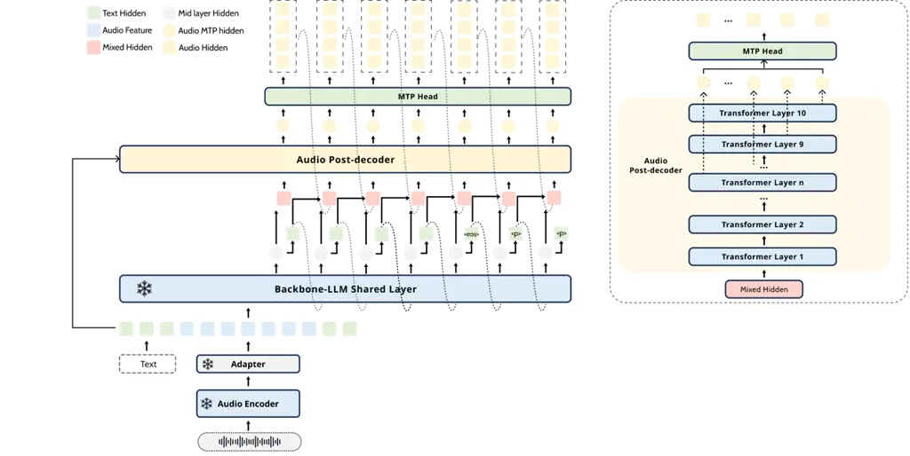

# Preserving Speech-to-Text LLM Capabilities in Speech-to-Speech Generation

Yuxuan Hu, Heng Lu, Ruchao Fan, Yao Qian, Xiaofei Wang, Jian Xue, Heming
Wang,  
Shuohang Wang, Young Jin Kim, Yelong Shen, Jinyu Li
Affiliation: Microsoft, USA

###### Abstract

Strong speech-to-text (S2T) LLMs already provide robust speech
perception and text reasoning, but adding speech-to-speech (S2S) output
is challenging: fine-tuning the backbone can degrade the original S2T
performance, while attaching a downstream talker reintroduces a
text-to-speech bottleneck. We present PRIME-Speech, a frozen-backbone
S2S conversion framework that trains only speech-generation modules.
PRIME-Speech synchronizes a causal audio post-decoder with intermediate
hidden states of the frozen backbone, so codec tokens are generated from
the model’s evolving reasoning trajectory rather than from completed
text chunks. The post-decoder uses mixed hidden-state, text, and
audio-history conditioning, and a training-time packing strategy with
turn-level audio KV-cache and position reset stabilizes multi-turn
spoken interaction without additional multi-turn S2S training data.
Multi-token prediction further reduces the effective codec prediction
rate and improves first-audio latency without modifying the reasoning
path. Across speech translation, spoken QA, speech understanding, and
multi-turn dialogue, PRIME-Speech preserves the S2T behavior of the
frozen backbone while producing accurate, low-WER spoken responses.

###### Index Terms: 

speech-to-speech generation, large language models, catastrophic
forgetting

## I Introduction

Speech-to-speech (S2S) interaction allows language assistants to
communicate with users naturally: a system listens to speech, reasons
about the user’s intent, and responds directly in speech. The dominant
approach remains a cascade, where automatic speech recognition (ASR)
converts speech into text, a text LLM generates a response, and a
text-to-speech (TTS) system converts it back into speech \[1, 2, 3, 4\].
Although modular and convenient, this pipeline passes recognition errors
to the LLM and cannot generate speech until enough text is available.
These limitations motivate S2S models that integrate speech generation
with LLM decoding rather than treating it as a separate post-processing
step.

This paper studies how to convert a strong speech-to-text (S2T) LLM into
an S2S model without losing the capabilities of the original backbone.
Modern S2T LLMs already support speech perception, text reasoning, and
instruction following \[5, 6, 7\]. While prior work has studied the gap
between S2T and text-based language modeling \[8, 9, 10, 11, 12\], the
challenges of extending S2T LLMs to generate speech remain less
understood. Adding text-to-speech synthesis may seem sufficient \[13,
14, 15, 16, 17, 18, 19, 20\], but end-to-end S2S requires more than
synthesizing a completed response. Generating speech tokens within the
same autoregressive process as text generation can disrupt the
backbone’s learned behavior and weaken its speech understanding,
reasoning, and instruction following. If speech output begins only after
the text response is complete, the system loses streaming and brings
back cascade latency. S2S adaptation must therefore preserve the
backbone’s capabilities and keep speech generation synchronized.

Existing S2S architectures reflect this trade-off \[21, 22, 23, 24, 25,
26, 27\]. Unified token-interleaving models generate text and audio in a
single autoregressive stream. This keeps the two outputs synchronized
but requires the main decoder to learn different text and audio
objectives \[28, 29, 30\]. Thinker–Talker systems separate reasoning
from speech generation \[31, 32, 33, 34\]. However, the talker usually
receives completed text, text chunks, or hand-off states from the text
branch, not the backbone’s evolving hidden states. Multi-token
prediction (MTP) has become an effective way to accelerate text
generation \[35, 36\]. Applying it to speech can also reduce
autoregressive codec decoding steps \[37, 38\], but predicting multiple
speech tokens at once often degrades generation quality.



Fig. 1: Overview model architecture of PRIME-Speech. The frozen S2T
backbone retains its original text reasoning path, while a parallel
audio post-decoder generates speech from intermediate hidden states.
Layer-wise MTP uses successive post-decoder states to predict multiple
codec tokens per update.

We propose PRIME-Speech, a framework for Preserving Reasoning and
Intelligence while enabling More Efficient Speech-to-Speech generation.
Its key idea is _hidden-state synchronization_, as shown in Fig. 1. At
each decoding step, PRIME-Speech takes the hidden state from an
intermediate layer of the frozen backbone. From this point, text and
audio follow separate paths in parallel. The text path continues through
the remaining backbone layers and the original text head, leaving the
S2T computation unchanged. The audio path feeds the same intermediate
state into a causal audio post-decoder whose depth matches the remaining
backbone layers. This gives the audio branch access to the backbone’s
current reasoning state before the text response is complete. The
intermediate state also provides a richer conditioning signal for speech
generation than a discrete text token.

The audio post-decoder further supports multi-token prediction through
layer-wise audio heads. For the $`k`$-th prediction, the corresponding
audio head takes the hidden state from the $`k`$-th layer counted
backward from the end of the post-decoder. The audio heads therefore
draw on hidden states from different post-decoder layers. This
layer-wise design propagates contextual information across the codec
tokens predicted within the same update. As a result, each synchronized
update produces multiple codec tokens while evaluating the shared
backbone only once. One backbone computation therefore covers more
speech output, reducing the number of decoding steps and the end-to-end
generation cost. All MTP operations remain on the audio path, so the
original text reasoning path is unchanged.

We evaluate PRIME-Speech from four aspects: (1) preservation of the
backbone’s S2T capabilities; (2) the accuracy of spoken responses and
their consistency with the corresponding text responses; (3) stability
in multi-turn dialogue; and (4) the effect of audio-side MTP on latency
and real-time factor. Experiments cover multilingual S2S translation,
spoken question answering, speech understanding, and multi-turn
dialogue. The results show that PRIME-Speech largely preserves the
original S2T performance while generating accurate spoken responses with
low rendering WER. Its hybrid cache policy supports stable multi-turn
interaction, and audio-side MTP substantially improves decoding
efficiency. Our main contributions are:

- •
  We introduce _hidden-state synchronization_ for converting a
  pretrained S2T LLM into an S2S model. A frozen text pathway preserves
  the original S2T computation, while a parallel speech branch follows
  the backbone’s intermediate reasoning states.
- •
  We develop a causal audio post-decoder that runs concurrently with the
  remaining text layers. It conditions on the backbone’s intermediate
  state, text embeddings, and recent audio history during speech
  generation.
- •
  We propose a hybrid cache policy for multi-turn dialogue. The text
  cache is retained across turns to preserve dialogue context, while the
  audio cache is reset at the start of each turn to limit acoustic
  drift.
- •
  We introduce a layer-wise audio MTP design that uses hidden states
  from successive post-decoder layers to maintain context across codec
  tokens predicted in the same update. It reduces the real-time factor
  by more than $`3\times`$ with stable task performance and no change to
  the text reasoning path.

## II Method

### II-A Overview

PRIME-Speech converts a frozen S2T LLM into an S2S model by adding a
trainable speech-generation branch around the original text pathway. Let
$`x=(x^{\tau},x^{a})`$ denote the input, where $`x^{\tau}`$ is an
optional text prompt and $`x^{a}`$ is the input speech waveform. The
frozen backbone produces a text response $`y^{\tau}`$, while the added
audio branch produces a codec-token response $`y^{a}`$. The conversion
is written as

```math
P(y^{\tau},y^{a}\mid x)=P_{\mathrm{bb}}(y^{\tau}\mid x)\,P_{\mathrm{aud}}(y^{a}\mid y^{\tau},H^{\mathrm{mid}};\theta_{a}), \tag{1}
```

where $`P_{\mathrm{bb}}`$ is the frozen backbone distribution,
$`P_{\mathrm{aud}}`$ is the trainable audio-branch distribution,
$`H^{\mathrm{mid}}`$ is a sequence of intermediate backbone states, and
$`\theta_{a}`$ denotes the audio-branch parameters. During streaming,
the dependence on $`y^{\tau}`$ is prefix-restricted. At decoding update
$`s`$, the frozen backbone exposes a hidden state
$`h^{\mathrm{mid}}_{s}`$; the text head and audio branch consume this
state in parallel. The audio branch uses only the text and audio history
committed before $`s`$, while the text token emitted at $`s`$ becomes
available to the audio branch at the next update. Thus the backbone
remains responsible for speech perception and reasoning, and the audio
branch acts as a synchronized speech readout of the preserved backbone
trajectory.

### II-B Frozen Backbone and Codec Targets

The backbone maps speech and text inputs into a shared autoregressive
context. For an input waveform $`x^{a}`$, the frozen speech encoder and
projection module produce acoustic embeddings $`e^{\mathrm{sp}}`$; text
tokens $`x^{\tau}`$ are mapped to embeddings $`e^{\tau}`$. The frozen
transformer stack processes the concatenated sequence,

```math
h^{(\ell)}=\mathrm{Backbone}^{(\ell)}([e^{\tau},e^{\mathrm{sp}}]),\quad\ell=1,\ldots,L. \tag{2}
```

We use a fixed middle-layer stream
$`H^{\mathrm{mid}}=h^{(\ell_{\mathrm{mid}})}`$ as the
speech-conditioning interface, with $`\ell_{\mathrm{mid}}`$ set to the
layer at approximately two-thirds depth of the backbone. This choice is
guided by a layer-wise centered kernel alignment (CKA) analysis \[39\],
which identifies this depth as carrying the richest paralinguistic
information while retaining semantic grounding. The final text logits,
text-token embeddings, and text KV cache remain those of the frozen
backbone, so the original S2T pathway is not updated by S2S training.

Target speech is represented by semantic codec tokens from the
CosyVoice2 \[15\] tokenizer at 25 Hz:

```math
y^{a}=\{y^{a}_{t}\}_{t=1}^{T_{a}},\quad y^{a}_{t}\in\{1,\ldots,V_{a}\}, \tag{3}
```

where $`T_{a}`$ is the number of codec frames and $`V_{a}`$ is the codec
vocabulary size. The audio post-decoder predicts these tokens, and the
paired codec decoder converts them back to waveform.

### II-C Hidden-State-Synchronized Audio Post-Decoder

The audio post-decoder is a causal transformer executed in the same
streaming update loop as the frozen text path. We index this loop by
$`s`$. At update $`s`$, the frozen backbone state
$`h^{\mathrm{mid}}_{s}`$ fans out to two branches: the text head
predicts one text token $`y^{\tau}_{s}`$, and the audio post-decoder
predicts an audio block
$`\mathbf{y}^{a}_{s}=(y^{a}_{s,1},\ldots,y^{a}_{s,B_{s}})`$. The flat
codec sequence in Eq. (3) is viewed as consecutive blocks in this loop;
$`B_{s}=1`$ before MTP and $`B_{s}\leq k`$ after MTP is enabled. The two
branches are concurrent, but the audio branch is causal: it conditions
on the current hidden state and the history committed before $`s`$, not
on the text token being predicted in the same update. The post-decoder
therefore models

```math
P(\mathbf{y}^{a}_{s}\mid\mathbf{y}^{a}_{<s},y^{\tau}_{<s},H^{\mathrm{mid}}_{\leq s};\theta_{a}). \tag{4}
```

After both branches emit their outputs, $`y^{\tau}_{s}`$ and
$`\mathbf{y}^{a}_{s}`$ are committed and become the text and audio
history for update $`s{+}1`$. Thus synchronization is timestamp-level
rather than chunk-level: PRIME-Speech does not wait for completed text,
fixed text chunks, or word-to-frame force alignment, and the audio
branch does not run on a free-standing clock detached from the backbone
trajectory.

The conditioning state combines three signals: the synchronized backbone
state, the previous text embedding, and recent audio history. Let
$`e^{\tau}_{s-1}`$ be the embedding of the previously committed text
token and

```math
r^{a}_{s-1}=\frac{1}{B_{s-1}}\sum_{j=1}^{B_{s-1}}e^{a}_{s-1,j} \tag{5}
```

be the mean embedding of the codec tokens committed by the previous
audio update; beginning-of-sequence embeddings are used for $`s=1`$. The
mixed conditioning vector is

```math
h^{\mathrm{mix}}_{s}=w_{h}h^{\mathrm{mid}}_{s}+w_{\tau}e^{\tau}_{s-1}+w_{a}r^{a}_{s-1}, \tag{6}
```

with $`w_{h}=w_{\tau}=w_{a}=1.0`$ in our experiments, selected as the
best simple fixed-weight setting in held-out ablations. The three terms
provide semantic state, lexical anchoring, and local acoustic
continuity, respectively. Text and audio are therefore generated by
parallel branches rather than by a single interleaved token stream: they
maintain separate caches, and hidden states serve as the synchronization
interface.

Training follows the same causal graph. With teacher forcing, the frozen
backbone is evaluated on the reference text prefix and the audio
post-decoder receives reference histories up to $`s{-}1`$; only the
current audio block contributes to the speech-generation loss. At
inference, generated text tokens and audio blocks replace the reference
histories. In both cases, the audio branch never conditions on future
text or on $`y^{\tau}_{s}`$, the text token generated concurrently at
update $`s`$.

### II-D Multi-Token Prediction for Codec Efficiency

Codec tokens are generated at 25 Hz, so autoregressive audio decoding
can dominate response latency. After the single-token audio branch has
learned stable hidden-state alignment, PRIME-Speech attaches MTP heads
to the audio post-decoder. In the timestamp formulation, MTP sets the
audio block size. At update $`s`$, one post-decoder state predicts $`k`$
future single-codebook codec-token distributions:

```math
p_{s,i}=P(y^{a}_{s,i}\mid\mathbf{y}^{a}_{<s},y^{\tau}_{<s},H^{\mathrm{mid}}_{\leq s};\theta_{a}),\quad i=1,\ldots,k. \tag{7}
```

The objective is a weighted sum of valid future-token losses,

```math
\mathcal{L}_{\mathrm{mtp}}=-\sum_{s}\sum_{i=1}^{k}\lambda_{i}\log p_{s,i}(y^{a}_{s,i}), \tag{8}
```

where positions beyond the utterance boundary are masked. At inference,
each synchronized audio update commits up to $`k`$ codec tokens,
reducing the effective codec prediction rate from 25 Hz to $`25/k`$ Hz.
MTP therefore accelerates the PRIME audio branch without modifying the
frozen reasoning pathway.

### II-E Training-Time Multi-Turn Packing and Cache Reset

Realistic multi-turn S2S data is costly to collect, and training with
long cross-turn audio histories is unstable. PRIME-Speech therefore does
not require additional multi-turn S2S supervision for this component.
Instead, it reuses the frozen S2T backbone’s existing ability to
maintain dialogue-level text context and trains the audio branch with a
turn-level cache policy. During training, we concatenate unrelated
single-turn examples into packed pseudo-dialogues. This exposes the
audio branch to long text-side context and explicit turn boundaries, but
it prevents the model from treating the previous turn’s acoustic
realization as useful context for the next turn.

The policy is applied consistently in training and inference. Text KV
states are accumulated across turns, while audio KV states are reset for
each assistant turn. Let $`n`$ index either a real dialogue turn at
inference time or a packed single-turn segment during training, and let
$`m\in\{\tau,a\}`$ denote text or audio modality. The cache update is

```math
\mathbf{C}^{(n)}_{m}=\begin{cases}\mathbf{C}^{(<n)}_{\tau}\oplus\{\mathbf{K}^{(n)}_{\tau},\mathbf{V}^{(n)}_{\tau}\},&m=\tau,\\
\{\mathbf{K}^{(n)}_{a},\mathbf{V}^{(n)}_{a}\},&m=a,\end{cases} \tag{9}
```

where $`\oplus`$ denotes concatenation and $`\mathbf{C}^{(<n)}_{\tau}`$
stores text states from preceding turns. Codec prediction in turn $`n`$
is therefore conditioned on accumulated text semantics and turn-local
audio history:

```math
P(y^{a}_{t}\mid\mathbf{C}^{(<n)}_{\tau},\mathbf{C}^{(n)}_{a},H^{\mathrm{mid}};\theta_{a}). \tag{10}
```

The same boundary is also applied to audio positions. When packed
single-turn examples are used for training, the text positions remain
global in the packed sequence, but the audio positional index is reset
at the beginning of every packed segment. At inference, the same reset
is applied at each new assistant response. If $`i`$ is a token index,
$`m_{i}`$ its modality tag, and $`s_{n}`$ the starting index of the
current audio segment, the position used by the audio branch is

```math
\mathcal{P}^{(n)}(i)=\begin{cases}i,&m_{i}\in\mathrm{Text},\\
i-s_{n},&m_{i}\in\mathrm{Audio}_{n}.\end{cases} \tag{11}
```

This training-time packing plus turn-local audio reset lets PRIME-Speech
exploit the backbone’s text-side multi-turn capability without
collecting new multi-turn S2S data, while preventing stale audio states
from causing repetition or drift.

## III Experimental Setup

### III-A Training Data

Our training mixture comprises speech transcription, multilingual speech
translation, spoken question answering, and assistant-style response
data. Each example contains paired text and speech targets without
token-level forced alignment. The two streams advance concurrently at a
$`1:k`$ ratio, where $`k`$ denotes the MTP rate: each step generates one
text token and $`k`$ audio codec tokens. Given the higher information
density and faster decoding rate of text, the text stream reaches its
end before the audio stream. Text-side padding then maintains
synchronized decoding until speech generation is complete, ensuring that
audio does not advance beyond the available text context. After task
balancing and resampling, the mixture contains about 100k weighted
hours, as summarized in Table I.

| Dataset               | Type | Lang. | Hrs | Stage  |
| --------------------- | ---- | ----- | --- | ------ |
| LibriHeavy \[40\]     | TTS  | EN    | 46k | S1     |
| In-house X2EN         | S2ST | EN    | 10k | S1, S2 |
| CoVoST-2 X2EN \[41\]  | S2ST | EN    | 1k  | S1, S2 |
| VoiceAssistant \[42\] | SQA  | EN    | 4k  | S1, S2 |
| TriviaQA \[43\]       | SQA  | EN    | 2k  | S1, S2 |

TABLE I: Statistics of datasets used for curriculum training.

We use transcribed English speech from LibriHeavy \[40\] as the primary
reconstruction data. These examples provide dense supervision for codec
prediction and help stabilize the randomly initialized audio
post-decoder during early training.

To train the audio branch beyond transcript reconstruction, we include
multilingual speech-to-English translation data. We use CVSS \[44\] with
a subset of CoVoST-2 X2EN \[41\] covering the seven source languages
used in \[45\]. Because public S2ST data are limited, we also synthesize
about 10k hours of X-to-English speech targets using the data generation
and filtering procedure described in \[45\].

We include VoiceAssistant-400K \[42\], TriviaQA \[46\], and Natural
Questions¹¹ 1
https://huggingface.co/datasets/sentence-transformers/natural-questions.
For TriviaQA and Natural Questions, we follow the synthesis and
processing procedure of \[43\]. This subset exposes the post-decoder to
answer-like outputs, including short factual answers and longer
explanatory responses.

For all components, target-side speech is synthesized from text using
Microsoft Azure TTS with speakers sampled from several hundred
identities, and the waveforms are encoded by the CosyVoice2 \[15\]
tokenizer at 25 Hz. This controlled target-speech construction gives
clean supervision for semantic alignment and intelligibility.
Accordingly, our evaluation focuses on transcript-level task
correctness, S2T–S2S consistency, WER, and decoding efficiency, and
reports the UTMOS-based fluency score from VocalBench as a
speech-naturalness indicator, rather than claiming improvements in
expressive prosody.

|                      |               |               |                     |               |               |                   |            |       |                   |                      |       |        |      |        |         |                |      |
| -------------------- | ------------- | ------------- | ------------------- | ------------- | ------------- | ----------------- | ---------- | ----- | ----------------- | -------------------- | ----- | ------ | ---- | ------ | ------- | -------------- | ---- |
|                      | S2ST          |               | Speech Conversation |               |               |                   |            |       |                   | Speech Understanding |       |        |      |        |         |                |      |
| Model                | X2EN          |               | UltraEval-Audio     |               |               |                   | Multi-turn |       |                   | VocalBench           |       |        |      |        |         | BigBench-Audio |      |
|                      | FLEURS        | CoVoST        | LLaMA-QA            | TriviaQA      | WebQ          | WER$`\downarrow`$ | S2T        | S2S   | WER$`\downarrow`$ | Know.                | Reas. | Creat. | Flu. | Single | Overall | S2T            | S2S  |
| Qwen3-Omni-30B       | 33.25 / 32.72 | 41.25 / 37.62 | 83.00 / 71.33       | 61.43 / 57.52 | 55.95 / 52.51 | 14.92             | 79.89      | 70.39 | 11.28             | 89.4                 | 4.43  | 4.77   | 4.38 | 4.96   | 91.99   | 83.7           | 72.0 |
| GPT-4o               | 33.86 / -     | 37.09 / -     | 83.00 / -           | 76.07 / -     | 50.98 / -     | –                 | –          | –     | –                 | 91.3                 | 4.69  | 3.93   | 4.16 | 4.67   | 88.06   | 70.2           | 67.2 |
| GLM-4-Voice-9B       | –             | –             | 64.70 / 50.70       | 39.10 / 26.50 | 32.20 / 15.90 | –                 | 74.86      | 70.95 | 7.83              | 56.4                 | 3.64  | 3.29   | 3.87 | 3.62   | 68.94   | 44.8           | 42.7 |
| Kimi-Audio-7B        | 7.68 / -      | 7.40 / -      | 76.67 / 62.33       | 46.78 / 37.99 | 41.98 / 35.37 | 14.85             | 73.18      | 65.36 | 10.9              | 62.2                 | 3.13  | 3.10   | 2.36 | 3.15   | 59.38   | 59.4           | 51.0 |
| Step-Audio-2-Mini-7B | 29.03 / 24.85 | 33.25 / 27.21 | 61.00 / 60.33       | 33.40 / 32.23 | 33.02 / 31.69 | 8.56              | 70.39      | 69.27 | 6.15              | 58.5                 | 3.67  | 3.12   | 4.52 | 3.44   | 70.71   | 50.9           | 47.5 |
| VocalNet-8B^(†)      | –             | –             | 76.33 / 69.00       | 44.63 / 38.38 | 44.05 / 39.27 | 7.68              | 74.86      | 68.72 | 8.52              | 68.0                 | 3.75  | 3.51   | 4.45 | 3.53   | 74.54   | 45.9           | 44.9 |
| Qwen2.5-Omni-7B      | 34.59 / 5.94  | 39.72 / 10.52 | 76.33 / 71.00       | 47.66 / 45.60 | 42.18 / 39.42 | 21.5              | 69.83      | 67.04 | 4.23              | 69.5                 | 4.36  | 3.18   | 4.17 | 3.54   | 74.92   | 54.2           | 53.6 |
| Backbone-LLM-7B      | 31.41 / –     | 40.65 / –     | 78.67 / –           | 47.07 / –     | 42.18 / –     | –                 | 79.33      | –     | –                 | –                    | –     | –      | –    | –      | –       | 66.5           | –    |
| PRIME-Speech-9B      | 31.40 / 33.24 | 41.29 / 40.98 | 79.00 / 74.42       | 46.98 / 44.54 | 42.04 / 40.18 | 3.33              | 80.45      | 79.33 | 3.34              | 68.9                 | 4.23  | 3.37   | 4.36 | 4.29   | 78.76   | 66.2           | 63.4 |

^(†)VocalNet is evaluated with the streaming mode from the official
repository, not by first generating the complete text response and then
synthesizing audio.

TABLE II: Performance comparison across speech tasks. For entries
reported as “S2T / S2S”, the left number is the S2T score and the right
number is the S2S score. “Flu.” denotes the UTMOS score in VocalBench.
“–” indicates unavailable results.

### III-B Model Configuration

PRIME-Speech uses Phi-4-MM-7B as its backbone, a 7B-parameter S2T LLM
pre-trained on 2M hours of speech and 5T text tokens. Starting from this
backbone allows us to study whether speech generation can be added
without degrading its existing speech understanding and text reasoning
capabilities. This effect is difficult to isolate in released S2S
models \[31, 24, 30\], where the model architecture, training data, and
speech-generation fine-tuning are already coupled.

#### III-B1 Trainable modules

The audio post-decoder consists of 10 causal Transformer layers with
approximately 2B parameters. Its hidden size and attention configuration
match those of the backbone, making the intermediate representation
compatible with the speech branch. The layer-wise MTP component contains
multiple MLP prediction heads with a hidden dimension of 2048 and
approximately 100M parameters.

#### III-B2 Frozen modules

The speech encoder, projection module, and text LLM backbone retain
their pre-trained parameters. This confines adaptation to the
speech-generation components and leaves the original S2T computation
unchanged.

### III-C Training Curriculum

Training proceeds in two stages. The first stage trains the audio
post-decoder with standard next-token codec prediction, jointly covering
hidden-state-to-codec alignment and semantic rendering. The second stage
enables multi-token codec prediction. This ordering avoids asking a
randomly initialized speech branch to solve long-horizon codec
prediction before it can reliably follow the frozen backbone states.

#### III-C1 Audio-branch training

Stage 1 trains the audio post-decoder at the native 25 Hz codec rate
with standard next-token prediction. We train on the full task-balanced
mixture for one epoch using AdamW, a learning rate of
$`1\times 10^{-4}`$, and linear decay. LibriHeavy provides dense
audio-text correspondence for stable acoustic-token modeling, while
translation, spoken QA, and assistant-style examples teach the
post-decoder to render content inferred or generated by the frozen
backbone rather than only verbatim transcripts. Because the backbone is
frozen, this stage improves speech realization rather than changing the
model’s reasoning ability.

#### III-C2 MTP training

Stage 2 enables MTP and continues training for 20k steps with the same
learning rate schedule. ASR data are down-weighted, while translation
and spoken QA data remain active. At this point the post-decoder has
already learned stable hidden-state conditioning, so MTP is trained as
an efficiency component that compresses codec-token prediction without
modifying the frozen reasoning path.

## IV Results

### IV-A Baselines and Metrics

We compare PRIME-Speech with GLM-4-Voice \[28\], Kimi-Audio \[24\],
Step-Audio-2-Mini \[30\], VocalNet \[38\], Qwen2.5-Omni \[31\],
Qwen3-Omni \[32\], GPT-4o \[47\], and Phi-4-MM-7B text backbone. Public
systems use their recommended inference settings. Backbone-LLM is
evaluated only in S2T mode because it has no speech-generation branch.

The evaluation covers speech translation on FLEURS \[48\] and CoVoST-2
X2EN \[41\], spoken QA on UltraEval-Audio \[49\], speech understanding
on BigBench-Audio \[50\], and conversational quality on
VocalBench \[51\]. Since these benchmarks are mainly single-turn, we
also construct a human-validated set of 28 conversations and 179 turns
containing anaphora, ellipsis, and references to earlier responses.

We report S2T and S2S results separately. For S2S, Whisper
Large-V3 \[52\] transcribes the generated speech before task scoring.
Translation uses BLEU for S2T and ASR-BLEU for S2S; spoken QA, dialogue,
and speech understanding use task accuracy. WER between the S2S
transcript and the corresponding text response measures rendering
consistency. VocalBench additionally reports UTMOS-based fluency as an
automatic speech-naturalness metric. Unless otherwise stated,
PRIME-Speech uses MTP horizon $`k{=}4`$.

|                       |            |               |      |                 |               |               |      |            |       |      |                |       |
| --------------------- | ---------- | ------------- | ---- | --------------- | ------------- | ------------- | ---- | ---------- | ----- | ---- | -------------- | ----- |
|                       |            | FLEURS        |      | UltraEval-Audio |               |               |      | Multi-turn |       |      | BigBench-Audio |       |
| Variant               | Frame rate | S2T / S2S     | WER  | LLaMA-QA        | TriviaQA      | WebQ          | WER  | S2T        | S2S   | WER  | S2T            | S2S   |
| LoRA + ESI \[43\]     | 37.5Hz     | 29.37 / 31.11 | 2.07 | 70.00 / 66.33   | 45.81 / 43.76 | 40.51 / 39.18 | 3.25 | \-         | \-    | \-   | 53.75          | 53.25 |
| LoRA + Post LM \[45\] | 25Hz       | 29.59 / 30.96 | 2.62 | 70.33 / 67.00   | 45.32 / 42.79 | 40.41 / 38.25 | 5.13 | \-         | \-    | \-   | 52.96          | 52.36 |
| PRIME-Speech S1 Model | 25Hz       | 31.39 / 33.57 | 1.51 | 79.00 / 73.33   | 46.98 / 45.71 | 42.04 / 39.43 | 6.12 | 80.45      | 79.21 | 3.67 | 66.30          | 59.10 |
| \+ MTP=1              | 25Hz       | 31.39 / 33.58 | 1.45 | 79.00 / 72.33   | 46.98 / 45.03 | 42.04 / 40.07 | 5.66 | 80.45      | 79.33 | 3.61 | 66.30          | 63.86 |
| \+ MTP=2              | 12.5Hz     | 31.39 / 33.56 | 1.52 | 79.00 / 74.67   | 46.98 / 44.93 | 42.04 / 40.27 | 3.01 | 80.45      | 79.33 | 2.07 | 66.40          | 64.16 |
| \+ MTP=4              | 6.25Hz     | 31.40 / 33.24 | 2.19 | 79.00 / 74.42   | 46.98 / 44.54 | 42.04 / 40.18 | 3.33 | 80.45      | 79.33 | 3.34 | 66.20          | 63.38 |

TABLE III: Ablation on variants decoding pattern and multi-token
prediction (MTP). “Frame rate” denotes the effective autoregressive
decoding rate for codec-token generation (25 Hz$`/k`$ for MTP=$`k`$).
For UltraEval-Audio, values are reported as S2T / S2S.

### IV-B Main Results

Table II summarizes both S2T capability preservation and S2S
performance. Across translation, spoken QA, multi-turn dialogue, and
speech understanding, PRIME-Speech remains close to Backbone-LLM in S2T
mode. Its S2S outputs retain strong task performance and show
consistently low WER.

#### IV-B1 Preserving the reasoning path

The comparison with Backbone-LLM directly measures capability
preservation. PRIME-Speech achieves nearly identical S2T scores on
translation, spoken QA, and BigBench-Audio, showing that the added
speech branch does not degrade the backbone’s speech understanding or
reasoning performance. PRIME-Speech also remains competitive with, and
often outperforms, larger systems trained with substantially more data
and computational resources. In particular, PRIME-Speech-9B surpasses
Qwen3-Omni-30B on both S2S translation benchmarks and achieves much
lower WER on spoken QA and multi-turn dialogue. It also obtains the best
S2S scores on two of the three UltraEval-Audio tasks and on the
multi-turn evaluation. These results show that strong speech-generation
performance does not require sacrificing the capabilities of the
original S2T model.

#### IV-B2 From text correctness to spoken correctness

The S2S results measure whether the spoken response preserves the
content generated by the backbone. On translation and spoken QA,
PRIME-Speech retains most of its S2T task performance after converting
the response to speech. The multi-turn and BigBench-Audio results
provide a stronger test because their responses depend on contextual
understanding beyond transcript reconstruction. PRIME-Speech maintains
small S2T–S2S gaps on both tasks, indicating that the audio branch
preserves the backbone’s decisions during speech generation. Task scores
measure response correctness after transcription, while WER measures
consistency between the spoken and text responses. Overall, PRIME-Speech
combines competitive task performance with the lowest or among the
lowest WER across all reported S2S tasks.

### IV-C Ablation Study

Table III provides the controlled evidence behind the main results. It
separates three effects that are often mixed in S2S systems: changing
the reasoning backbone, improving the audio branch, and compressing
codec-token generation.

#### IV-C1 Why freeze the backbone

The LoRA + Post LM and LoRA + ESI variants use the same data but update
the backbone \[45, 43\]. They remain viable on in-domain S2S metrics,
but their lower BigBench-Audio S2T scores show the cost of adapting the
reasoning model. This supports PRIME-Speech’s decomposition: reasoning
stays in the frozen backbone, while speech realization is learned in the
post-decoder.

#### IV-C2 What does MTP contribute

MTP should be interpreted as an efficiency adapter, not as the source of
semantic alignment. The comparison from the stage-1 model to the
$`k{=}1`$ model shows that the final audio curriculum already improves
rendering quality even before reducing the codec rate. Increasing the
horizon from $`k{=}1`$ to $`k{=}4`$ reduces the effective codec
prediction rate from 25 Hz to 6.25 Hz while keeping S2S task scores
broadly stable. The $`k{=}4`$ setting preserves the main S2S behavior
observed at smaller horizons, including strong UltraEval-Audio,
multi-turn, and BigBench-Audio S2S performance. Thus MTP serves its
intended role: compressing the codec-generation loop without changing
the frozen reasoning path or causing significant task-quality loss.

#### IV-C3 Multi-turn cache policy

| Cache policy              | Multi-turn S2S Acc.$`\uparrow`$ / WER$`\downarrow`$ (%) |              |               |                |               |
| ------------------------- | ------------------------------------------------------- | ------------ | ------------- | -------------- | ------------- |
|                           | 1                                                       | 2            | 3             | 4              | $`\geq`$5     |
| Text accum. + audio reset | 92.86 / 2.44                                            | 82.14 / 1.94 | 71.43 / 1.97  | 85.71 / 3.65   | 73.13 / 1.48  |
| w/o audio reset           | 92.86 / 2.77                                            | 78.57 / 5.62 | 39.29 / 65.57 | 10.71 / 129.63 | 0.00 / 143.27 |

TABLE IV: Multi-turn audio-cache ablation on the in-house set; each cell
reports S2S accuracy / WER (%) by turn-position bucket.

Table IV tests whether audio history should persist across assistant
turns, with the key signal being the turn-wise trajectory rather than
average WER. With text accumulation and turn-local audio reset, WER
stays below 4% in every turn-position bucket and S2S accuracy remains
stable as dialogue length grows, indicating that the text-side cache
preserves dialogue semantics while acoustic generation stays local to
the current response.

Without audio reset, the first two turns appear acceptable, but stale
audio states soon accumulate. From the third turn onward, WER jumps
sharply and later exceeds 100%, while S2S accuracy falls to zero in the
$`\geq 5`$-turn bucket. Because the text cache is accumulated in both
rows, the degradation is isolated to reused audio-side state rather than
lost dialogue memory. The ablation is therefore a causal diagnostic:
audio KV and audio positions should reset at turn boundaries.

### IV-D Efficiency Analysis

| System                    | Frame rate | TTFT$`\downarrow`$ | TTFA$`\downarrow`$ | Throughput$`\uparrow`$ | RTF$`\downarrow`$ |
| ------------------------- | ---------- | ------------------ | ------------------ | ---------------------- | ----------------- |
|                           | (Hz)       | (ms)               | \(s\)              | (tok/s)                |                   |
| Qwen2.5-Omni-7B           | 50.0       | 58                 | 1.01               | 45.75                  | 1.093             |
| VocalNet-8B ($`k{=}1`$)   | 12.5       | 38                 | 0.51               | 216.89                 | 0.250             |
|  VocalNet-8B ($`k{=}3`$)  | 6.25       | 38                 | 0.40               | 220.16                 | 0.243             |
|  VocalNet-8B ($`k{=}5`$)  | 4.17       | 38                 | 0.40               | 225.93                 | 0.243             |
| PRIME-Speech ($`k{=}1`$)  | 25.0       | 61                 | 1.07               | 30.62                  | 1.088             |
|  PRIME-Speech ($`k{=}2`$) | 12.5       | 60                 | 0.63               | 62.17                  | 0.548             |
|  PRIME-Speech ($`k{=}4`$) | 6.25       | 58                 | 0.39               | 123.76                 | 0.296             |

TABLE V: Inference efficiency under different MTP horizons. Experiments
are conducted on 1 NVIDIA H100 GPU.

Table V compares inference efficiency under the same hardware.
VocalNet’s shadow and dense talker gives high codec-generation
throughput and low RTF, so it represents an efficiency-oriented point on
the S2S design trade-off. However, Table II shows that it also has a
larger S2T–S2S modality gap than PRIME-Speech. PRIME-Speech operates in
a different regime: a 2B post-decoder is synchronized with hidden states
from a frozen reasoning backbone, which costs more computation than a
shallow talker at $`k{=}1`$, but preserves the S2T pathway and yields
stronger text–speech consistency.

Within this frozen-backbone regime, MTP provides a controllable
efficiency knob. Increasing $`k`$ from 1 to 4 lowers the effective codec
rate from 25 Hz to 6.25 Hz, reduces TTFA from 1.07 s to 0.39 s, and
reduces RTF from 1.088 to 0.296, while Table III shows broadly stable
S2S task quality. Thus our efficiency claim is not that PRIME-Speech
dominates every lightweight talker in raw codec throughput, but that
audio-side MTP substantially improves latency and RTF under the stronger
constraint of preserving the frozen S2T backbone and reducing the
S2T–S2S modality gap.

## V Conclusion

We presented PRIME-Speech, a framework for adding speech-to-speech
capability to a strong S2T LLM without altering its reasoning backbone.
PRIME-Speech achieves strong results across speech-to-speech
translation, spoken conversation, and speech understanding while
maintaining a small S2T–S2S modality gap. Multi-token prediction further
improves latency and real-time factor for high-rate codec tokens while
preserving the overall S2S behavior of the frozen-backbone system.

## References

- \[1\] W. Cui, D. Yu, X. Jiao, Z. Meng, G. Zhang, Q. Wang, S. Y. Guo,
  and I. King (2025) Recent advances in speech language models: a
  survey. In Proceedings of the 63rd Annual Meeting of the Association
  for Computational Linguistics (Volume 1: Long Papers),
  pp. 13943–13970. Cited by: §I.
- \[2\] S. Arora, K. Chang, C. Chien, Y. Peng, H. Wu, Y. Adi, E.
  Dupoux, H. Lee, K. Livescu, and S. Watanabe (2025) On the landscape of
  spoken language models: a comprehensive survey. arXiv preprint
  arXiv:2504.08528. Cited by: §I.
- \[3\] M. Wang, Y. Li, J. Guo, X. Qiao, Z. Li, H. Shang, D. Wei, S.
  Tao, M. Zhang, and H. Yang (2023) Whislu: end-to-end spoken language
  understanding with whisper. In Proc. Interspeech, Vol. 2023,
  pp. 770–774. Cited by: §I.
- \[4\] S. Ling, Y. Hu, S. Qian, G. Ye, Y. Qian, Y. Gong, E. Lin, and M.
  Zeng (2024) Adapting large language model with speech for fully
  formatted end-to-end speech recognition. In ICASSP 2024-2024 IEEE
  International Conference on Acoustics, Speech and Signal Processing
  (ICASSP), pp. 11046–11050. Cited by: §I.
- \[5\] D. Zhang, S. Li, X. Zhang, J. Zhan, P. Wang, Y. Zhou, and X.
  Qiu (2023) Speechgpt: empowering large language models with intrinsic
  cross-modal conversational abilities. In Findings of the Association
  for Computational Linguistics: EMNLP 2023, pp. 15757–15773. Cited by:
  §I.
- \[6\] Y. Chu, J. Xu, Q. Yang, H. Wei, X. Wei, Z. Guo, Y. Leng, Y.
  Lv, J. He, J. Lin, et al. (2024) Qwen2-audio technical report. arXiv
  preprint arXiv:2407.10759. Cited by: §I.
- \[7\] Microsoft, A. Abouelenin, A. Ashfaq, A. Atkinson, H.
  Awadalla, N. Bach, J. Bao, A. Benhaim, M. Cai, V. Chaudhary, C. Chen,
  et al. (2025) Phi-4-mini technical report: compact yet powerful
  multimodal language models via mixture-of-loras. arXiv preprint
  arXiv:2503.01743. Cited by: §I.
- \[8\] B. Xiang, S. Zhao, T. Guo, and W. Zou (2025) Understanding the
  modality gap: an empirical study on the speech-text alignment
  mechanism of large speech language models. In Proceedings of the 2025
  Conference on Empirical Methods in Natural Language Processing,
  pp. 5187–5202. Cited by: §I.
- \[9\] R. Fan, B. Ren, Y. Hu, R. Zhao, S. Liu, and J. Li (2025)
  Alignformer: modality matching can achieve better zero-shot
  instruction-following speech-llm. IEEE Journal of Selected Topics in
  Signal Processing. Cited by: §I.
- \[10\] S. Cuervo, S. Seto, M. de Seyssel, R. H. Bai, Z. Gu, T.
  Likhomanenko, N. Jaitly, and Z. Aldeneh (2025) Closing the gap between
  text and speech understanding in llms. arXiv preprint
  arXiv:2510.13632. Cited by: §I.
- \[11\] D. Wang, J. Li, M. Cui, D. Yang, X. Chen, and H. Meng (2025)
  Speech discrete tokens or continuous features? a comparative analysis
  for spoken language understanding in speechllms. In Proceedings of the
  2025 Conference on Empirical Methods in Natural Language Processing,
  pp. 24924–24935. Cited by: §I.
- \[12\] C. Wang, H. Lu, X. Zhang, S. Liu, Y. Lu, J. Li, and Z.
  Wu (2026) Closing the modality reasoning gap for speech large language
  models. arXiv preprint arXiv:2601.05543. Cited by: §I.
- \[13\] S. E. Eskimez, X. Wang, M. Thakker, C. Li, C. Tsai, Z. Xiao, H.
  Yang, Z. Zhu, M. Tang, X. Tan, et al. (2024) E2 tts: embarrassingly
  easy fully non-autoregressive zero-shot tts. In 2024 IEEE Spoken
  Language Technology Workshop (SLT), pp. 682–689. Cited by: §I.
- \[14\] S. Chen, C. Wang, Y. Wu, Z. Zhang, L. Zhou, S. Liu, Z. Chen, Y.
  Liu, H. Wang, J. Li, et al. (2025) Neural codec language models are
  zero-shot text to speech synthesizers. IEEE Transactions on Audio,
  Speech and Language Processing 33, pp. 705–718. Cited by: §I.
- \[15\] Z. Du, Y. Wang, Q. Chen, X. Shi, X. Lv, T. Zhao, Z. Gao, Y.
  Yang, C. Gao, H. Wang, et al. (2024) Cosyvoice 2: scalable streaming
  speech synthesis with large language models. arXiv preprint
  arXiv:2412.10117. Cited by: §I, §II-B, §III-A.
- \[16\] Z. Du, C. Gao, Y. Wang, F. Yu, T. Zhao, H. Wang, X. Lv, H.
  Wang, C. Ni, X. Shi, et al. (2025) Cosyvoice 3: towards in-the-wild
  speech generation via scaling-up and post-training. arXiv preprint
  arXiv:2505.17589. Cited by: §I.
- \[17\] Y. Yang, S. Liu, J. Li, Y. Hu, H. Wu, H. Wang, J. Yu, L.
  Meng, H. Sun, Y. Liu, et al. (2025) Pseudo-autoregressive neural codec
  language models for efficient zero-shot text-to-speech synthesis. In
  Proceedings of the 33rd ACM International Conference on Multimedia,
  pp. 9316–9325. Cited by: §I.
- \[18\] S. Zhou, Y. Zhou, Y. He, X. Zhou, J. Wang, W. Deng, and J.
  Shu (2026) Indextts2: a breakthrough in emotionally expressive and
  duration-controlled auto-regressive zero-shot text-to-speech. In
  Proceedings of the AAAI Conference on Artificial Intelligence, Vol.
  40, pp. 35139–35148. Cited by: §I.
- \[19\] S. Liao, Y. Wang, S. Liu, Y. Cheng, R. Zhang, T. Li, S. Li, Y.
  Zheng, X. Liu, Q. Wang, et al. (2026) Fish audio s2 technical report.
  arXiv preprint arXiv:2603.08823. Cited by: §I.
- \[20\] H. Zhu, W. Kang, L. Guo, Z. Yao, F. Kuang, W. Zhuang, Z. Li, Z.
  Han, D. Zhang, X. Zhang, et al. (2026) Zipvoice-dialog:
  non-autoregressive spoken dialogue generation with flow matching. In
  Findings of the Association for Computational Linguistics: ACL 2026,
  pp. 38717–38729. Cited by: §I.
- \[21\] A. Défossez, L. Mazaré, M. Orsini, A. Royer, P. Pérez, H.
  Jégou, E. Grave, and N. Zeghidour (2024) Moshi: a speech-text
  foundation model for real-time dialogue. arXiv preprint
  arXiv:2410.00037. Cited by: §I.
- \[22\] X. Wang, Y. Li, C. Fu, Y. Shen, L. Xie, K. Li, X. Sun, and L.
  Ma (2024) Freeze-omni: a smart and low latency speech-to-speech
  dialogue model with frozen llm. arXiv preprint arXiv:2411.00774. Cited
  by: §I.
- \[23\] D. Zhang, G. Wang, J. Xue, K. Fang, L. Zhao, R. Ma, S. Ren, S.
  Liu, T. Guo, W. Zhuang, et al. (2025) MiMo-audio: audio language
  models are few-shot learners. arXiv preprint arXiv:2512.23808. Cited
  by: §I.
- \[24\] D. Ding, Z. Ju, Y. Leng, S. Liu, T. Liu, Z. Shang, K. Shen, W.
  Song, X. Tan, H. Tang, et al. (2025) Kimi-audio technical report.
  arXiv preprint arXiv:2504.18425. Cited by: §I, §III-B, §IV-A.
- \[25\] W. Chen, Z. Ma, R. Yan, Y. Liang, X. Li, R. Xu, Z. Niu, Y.
  Zhu, Y. Yang, Z. Liu, et al. (2025) Slam-omni: timbre-controllable
  voice interaction system with single-stage training. In Findings of
  the Association for Computational Linguistics: ACL 2025,
  pp. 2262–2282. Cited by: §I.
- \[26\] Q. Chen, L. Cheng, C. Deng, X. Li, J. Liu, C. Tan, W. Wang, J.
  Xu, J. Ye, Q. Zhang, et al. (2025) Fun-audio-chat technical report.
  arXiv preprint arXiv:2512.20156. Cited by: §I.
- \[27\] C. Yang, C. Yu, H. Chen, J. Zhu, J. Chen, K. Chen, W. Wang, Y.
  Wang, Y. Jiang, Y. Jiang, et al. (2026) MOSS-audio technical report.
  arXiv preprint arXiv:2606.01802. Cited by: §I.
- \[28\] A. Zeng, Z. Du, M. Liu, K. Wang, S. Jiang, L. Zhao, Y. Dong,
  and J. Tang (2024) GLM-4-Voice: towards intelligent and human-like
  end-to-end spoken chatbot. arXiv preprint arXiv:2412.02612. Cited by:
  §I, §IV-A.
- \[29\] Q. Fang, Y. Zhou, S. Guo, S. Zhang, and Y. Feng (2025)
  LLaMA-omni2: llm-based real-time spoken chatbot with autoregressive
  streaming speech synthesis. arXiv preprint arXiv:2505.02625. Cited by:
  §I.
- \[30\] B. Wu, C. Yan, C. Hu, C. Yi, C. Feng, F. Tian, F. Shen, G.
  Yu, H. Zhang, J. Li, et al. (2025) Step-audio 2 technical report.
  arXiv preprint arXiv:2507.16632. Cited by: §I, §III-B, §IV-A.
- \[31\] J. Xu, Z. Guo, J. He, H. Hu, T. He, S. Bai, K. Chen, J.
  Wang, Y. Fan, K. Dang, et al. (2025) Qwen2. 5-omni technical report.
  arXiv preprint arXiv:2503.20215. Cited by: §I, §III-B, §IV-A.
- \[32\] J. Xu, Z. Guo, H. Hu, Y. Chu, X. Wang, J. He, Y. Wang, X.
  Shi, T. He, X. Zhu, et al. (2025) Qwen3-omni technical report. arXiv
  preprint arXiv:2509.17765. Cited by: §I, §IV-A.
- \[33\] Q. Chen, Y. Chen, Y. Chen, M. Chen, Y. Chen, C. Deng, Z. Du, R.
  Gao, C. Gao, Z. Gao, et al. (2025) Minmo: a multimodal large language
  model for seamless voice interaction. arXiv preprint arXiv:2501.06282.
  Cited by: §I.
- \[34\] Q. Team (2026) Qwen3. 5-omni technical report. arXiv preprint
  arXiv:2604.15804. Cited by: §I.
- \[35\] A. Liu, B. Feng, B. Xue, B. Wang, B. Wu, C. Lu, C. Zhao, C.
  Deng, C. Zhang, C. Ruan, et al. (2024) Deepseek-v3 technical report.
  arXiv preprint arXiv:2412.19437. Cited by: §I.
- \[36\] F. Gloeckle, B. Y. Idrissi, B. Rozière, D. Lopez-Paz, and G.
  Synnaeve (2024) Better & faster large language models via multi-token
  prediction. In Proceedings of the 41st International Conference on
  Machine Learning, pp. 15706–15734. Cited by: §I.
- \[37\] Z. Long, Y. Shen, C. Fu, H. Gao, L. Li, P. Chen, M. Zhang, H.
  Shao, J. Li, J. Peng, et al. (2025) VITA-audio: fast interleaved
  cross-modal token generation for efficient large speech-language
  model. arXiv preprint arXiv:2505.03739. Cited by: §I.
- \[38\] Y. Wang, H. Liu, Z. Cheng, R. Wu, Q. Gu, Y. Wang, and Y.
  Wang (2025) VocalNet: speech llm with multi-token prediction for
  faster and high-quality generation. CoRR. Cited by: §I, §IV-A.
- \[39\] S. Kornblith, M. Norouzi, H. Lee, and G. Hinton (2019)
  Similarity of neural network representations revisited. In
  International conference on machine learning, pp. 3519–3529. Cited by:
  §II-B.
- \[40\] W. Kang, X. Yang, Z. Yao, F. Kuang, Y. Yang, L. Guo, L. Lin,
  and D. Povey (2023) Libriheavy: a 50,000 hours asr corpus with
  punctuation casing and context. External Links: 2309.08105 Cited by:
  §III-A, TABLE I.
- \[41\] C. Wang, A. Wu, J. Gu, and J. Pino (2021) CoVoST 2 and
  massively multilingual speech translation. In Proceedings of
  Interspeech 2021, pp. 2247–2251. External Links:
  [Document](https://dx.doi.org/10.21437/Interspeech.2021-2027) Cited
  by: §III-A, TABLE I, §IV-A.
- \[42\] Z. Xie and C. Wu (2024) Mini-omni: language models can hear,
  talk while thinking in streaming. arXiv preprint arXiv:2408.16725.
  Cited by: §III-A, TABLE I.
- \[43\] H. Wu, Y. Hu, R. Fan, X. Wang, K. Kumatani, B. Ren, J. Yu, H.
  Lu, L. Wang, Y. Qian, et al. (2025) Towards efficient speech-text
  jointly decoding within one speech language model. arXiv preprint
  arXiv:2506.04518. Cited by: §III-A, TABLE I, §IV-C1, TABLE III.
- \[44\] Y. Jia, M. T. Ramanovich, Q. Wang, and H. Zen (2022) CVSS
  corpus and massively multilingual speech-to-speech translation. In
  Proceedings of the Thirteenth Language Resources and Evaluation
  Conference, pp. 6691–6703. Cited by: §III-A.
- \[45\] Y. Hu, H. Wu, R. Fan, X. Wang, H. Lu, Y. Qian, and J. Li (2025)
  SLM-s2st: a multimodal language model for direct speech-to-speech
  translation. arXiv preprint arXiv:2506.04392. Cited by: §III-A,
  §IV-C1, TABLE III.
- \[46\] M. Joshi, E. Choi, D. Weld, and L. Zettlemoyer (2017) triviaqa:
  A Large Scale Distantly Supervised Challenge Dataset for Reading
  Comprehension. arXiv e-prints, pp. arXiv:1705.03551. External Links:
  1705.03551 Cited by: §III-A.
- \[47\] OpenAI (2024) Hello gpt-4o. External Links:
  [Link](https://openai.com/index/hello-gpt-4o/) Cited by: §IV-A.
- \[48\] A. Conneau, M. Ma, S. Khanuja, Y. Zhang, V. Axelrod, S.
  Dalmia, J. Riesa, C. Rivera, and A. Bapna (2023) Fleurs: few-shot
  learning evaluation of universal representations of speech. In 2022
  IEEE Spoken Language Technology Workshop (SLT), pp. 798–805. Cited by:
  §IV-A.
- \[49\] Q. Shi, J. Zhou, B. Lin, J. Cui, G. Zeng, Y. Zhou, Z. Wang, X.
  Liu, Z. Luo, Y. Wang, et al. (2026) UltraEval-audio: a unified
  framework for comprehensive evaluation of audio foundation models.
  arXiv preprint arXiv:2601.01373. Cited by: §IV-A.
- \[50\] A. Srivastava, A. Rastogi, A. Rao, A. A. M. Shoeb, A. Abid, A.
  Fisch, A. R. Brown, A. Santoro, A. Gupta, A. Garriga-Alonso, et
  al. (2022) Beyond the imitation game: quantifying and extrapolating
  the capabilities of language models. arXiv preprint arXiv:2206.04615.
  Cited by: §IV-A.
- \[51\] H. Liu, Y. Wang, Z. Cheng, R. Wu, Q. Gu, Y. Wang, and Y.
  Wang (2025) VocalBench: benchmarking the vocal conversational
  abilities for speech interaction models. arXiv preprint
  arXiv:2505.15727. Cited by: §IV-A.
- \[52\] A. Radford, J. W. Kim, T. Xu, G. Brockman, C. McLeavey, and I.
  Sutskever (2023) Robust speech recognition via large-scale weak
  supervision. In International conference on machine learning,
  pp. 28492–28518. Cited by: §IV-A.

## VI Generative AI Use Disclosure

We used generative AI tools only for language polishing, including
grammar correction and spelling checks, and for assisting in formatting
and drawing LaTeX tables. All technical content, experiments, and
conclusions were produced and verified by the authors.
