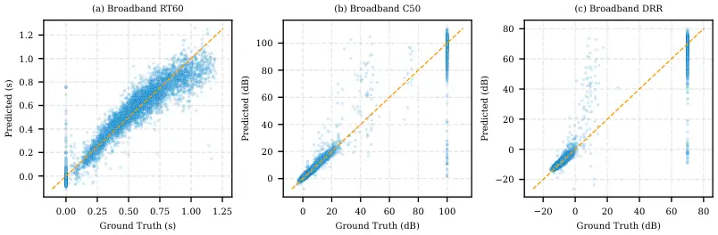

Grundhuber Habets

# Beyond Cross-Reconstruction: Probing-Based Disentanglement Evaluation for Acoustic Teleportation CodecsThanks: ^($`\ast`$)A joint institution of Fraunhofer IIS and Friedrich-Alexander-Universität Erlangen-Nürnberg (FAU), Germany.

Philipp    Emanuël A. P

###### Abstract

Some neural audio codecs disentangle speech into latent subspaces
encoding content, speaker identity, and acoustics, enabling acoustic
teleportation and voice conversion. Existing evaluations rely on
cross-reconstruction quality, which cannot reliably detect leakage
across partitions. We extend a probing-based framework to assess
disentanglement by regressing room-acoustic parameters (reverberation
time, clarity, and direct-to-reverberant ratio) and classifying speaker
identity, using the gap between intended and unintended partitions as
the disentanglement measure. Applied to an acoustic teleportation codec,
we find speaker identity is largely confined to its partition, while
acoustics leak into the speech embeddings due to the training objective.
Acoustic embeddings blindly estimate room parameters within 0.02 s of
supervised baselines, indicating physically meaningful structure emerges
without explicit supervision.

###### keywords

room-acoustics, neural audio codecs, disentanglement

^(†)^(†)address: ¹ Fraunhofer Institute for Integrated Circuits (IIS),
Erlangen, Germany  
² International Audio Laboratories Erlangen^($`\ast`$), Erlangen,
Germany ^(†)^(†)email: philipp.grundhuber@iis.fraunhofer.de,
emanuel.habets@audiolabs-erlangen.de

## 1 Introduction

Certain NAC partition the latent space in order to disentangle distinct
speech attributes, including linguistic content, speaker identity,
prosody, and acoustic environment. This enables applications like AT
(AT), dereverberation, and voice conversion \[1\]. Recent codecs realize
this idea through diverse architectural choices: FreeCodec \[2\]
decomposes speech into global timbre, prosody, and content through
separate encoders; NaturalSpeech 3 \[3\] factors speech into five
subspaces via vector quantization; SpeechTokenizer \[4\] achieves
hierarchical disentanglement across RVQ (RVQ) layers; SD-Codec \[5\]
separates audio sources through parallel RVQ branches; and Omran et al.
\[6\] and Grundhuber et al. \[7\] separate speech from acoustic
characteristics in partitioned embeddings.

Existing approaches evaluate disentanglement through downstream task
performance, such as voice conversion quality \[2\], TTS metrics \[3\],
source separation metrics \[5\], or cross-reconstruction after embedding
swaps \[6, 7\]. Qualitative methods (t-SNE, PCA (PCA), listening tests)
provide intuitive evidence but are difficult to compare systematically.
Crucially, none can reveal whether information leaks across partitions,
as a decoder may learn to ignore redundant information in the wrong
partition. Classical disentanglement metrics such as DCI
(disentanglement, completeness, informativeness) \[8\], MIG (mutual
information gap) \[9\], and the $`\beta`$-VAE metric \[10\] assume
dimension-wise independence over discrete factors and are therefore
inapplicable to the partition-level structure found in NAC. Training
lightweight classifiers on representations to evaluate disentanglement
via the accuracy gap between content and speaker embeddings is an
established method \[11, 12, 13\]. Prior probing work in speech has
targeted attributes such as speaker identity \[11, 14\], but the blind
estimation of continuous, physically grounded parameters based on codec
representations remains unexplored.

In this work, we treat the pre-trained encoder of an AT codec \[7\],
spanning different training task sets, quantization levels, and temporal
downsampling factors, as a fixed feature extractor and train identical
lightweight MLP (MLP) probes on each embedding partition independently.
For regression, we target the blind estimation of three room-acoustic
parameters from reverberant speech (viz., reverberation time
($`T_{60}`$), clarity ($`C_{50}`$), and DRR (DRR)), which is a
well-studied task \[15, 16\]. For classification, we target speaker
identity on a fixed set of known speakers. These factors serve as
diagnostic probes for representation quality rather than as end goals.

Our contributions are: 1) We introduce regression-based probing for
quantifying disentanglement in NAC, adapting the informativeness
principle of the DCI framework \[8\] from individual dimensions to
embedding partitions (Sec. 2). 2) We reveal an asymmetric
disentanglement structure: speaker identity is effectively confined to
the speech partition, while acoustic information partially leaks into
speech partition embeddings, and trace this asymmetry to the gradient
structure of the AT training objective. 3) We show that acoustic
embeddings yield blind $`T_{60}`$ estimates competitive with supervised
baselines, and informative $`C_{50}`$ and DRR estimates, despite
receiving no room parameter labels during codec training. 4) We conduct
a systematic study of the effects of training tasks, quantization
levels, and temporal downsampling on disentanglement quality,
demonstrating that output-quality metrics such as ScoreQ \[17\] do not
predict disentanglement and that probing is necessary to expose leakage
missed by cross-reconstruction evaluation.

Figure 1: Probing framework for disentanglement quantification. Left:
The pre-trained AT encoder splits reverberant speech into speech
($`\mathtt{s}_{c,r}`$) and acoustic ($`\mathtt{h}_{c,r}`$) partitions.
Right: Identical lightweight MLP probes trained on each partition
independently predict room-acoustic parameters (regression) and speaker
identity (classification). The gap $`\Delta_{k}`$ (Eq. 5) between
intended and unintended partition accuracy serves as a direct
disentanglement measure.

## 2 Problem Formulation

In acoustic teleportation, a reverberant speech signal is modeled as
$`x_{c,r}=s_{c}*h_{r}`$, where $`s_{c}`$ is anechoic speech with
content $`c`$, $`h_{r}`$ is the RIR (RIR) of room $`r`$, and $`*`$
denotes convolution. The encoder splits the input into two partitions
(Fig. 1):

```math
\{\mathtt{s}_{c,r},\ \mathtt{h}_{c,r}\}=\text{Enc}(x_{c,r}), \tag{1}
```

where $`\mathtt{s}_{c,r}\in\mathbb{R}^{T_{s}\times 64}`$ captures speech
content and $`\mathtt{h}_{c,r}\in\mathbb{R}^{T_{h}\times 64}`$ captures
acoustic characteristics. Acoustic teleportation swaps acoustic
embeddings at decode time,
$`\hat{x}_{c_{1},r_{2}}=\text{Dec}(\mathtt{s}_{c_{1},r_{1}},\mathtt{h}_{c_{2},r_{2}})`$;
dereverberation is the special case $`\mathtt{h}=\mathbf{0}`$.

Ideally, $`\mathtt{h}_{c,r}`$ encodes room-acoustics irrespective of
speaker identity, and $`\mathtt{s}_{c,r}`$ encodes content and speaker
characteristics irrespective of the room. In practice, information may
leak across partitions, and such leakage is invisible to output-quality
metrics like ScoreQ. We therefore seek a metric that directly measures
information content per partition.

We probe each partition with three RIR parameters defined in \[18, 19\]:

```math
\displaystyle T_{60} \displaystyle:\text{time for energy decay of 60 dB}, \tag{2}
```

```math
\displaystyle C_{50} \displaystyle=10\log_{10}\frac{\int_{0}^{50\text{ms}}h_{r}^{2}(t)dt}{\int_{50\text{ms}}^{\infty}h_{r}^{2}(t)dt}, \tag{3}
```

```math
\displaystyle=10\log_{10}\frac{\int_{0}^{t_{d}}h_{r}^{2}(t)dt}{\int_{t_{d}}^{\infty}h_{r}^{2}(t)dt}, \tag{4}
```

where the direct-path window is set to $`t_{d}=\SI{2.5}{ms}`$ following
\[19\]. These parameters are computed per octave band (\SI125Hz to
\SI8kHz) and as broadband averages, and probed alongside speaker
identity as a complementary categorical factor.

Classical disentanglement metrics such as DCI \[8\] operate at the
dimension level, scoring how individual latent dimensions map to
individual generative factors; in partition-level architectures, this
mapping does not apply. Instead, we train a lightweight probe
$`f_{a,p}`$ on each (attribute, partition) pair and measure performance
$`\mathcal{M}(a,p)`$ with a task-appropriate metric (Pearson $`\rho`$
for room parameters, top-1 accuracy for speaker identity). For
factor $`k`$ with intended partition $`p^{\textrm{in}}`$ and unintended
partition $`p^{\textrm{un}}`$, the disentanglement gap

```math
\Delta_{k}=\mathcal{M}(k,p^{\textrm{in}})-\mathcal{M}(k,p^{\textrm{un}}) \tag{5}
```

quantifies how well factor $`k`$ is confined to its intended partition.
We write $`\Delta_{\text{acc}}`$ and $`\Delta_{\rho}`$ for the gap
evaluated with top-1 accuracy and Pearson $`\rho`$, respectively. Gaps
are not comparable across factors, but each independently measures the
degree of separation. This adapts DCI’s informativeness score from
dimensions to partitions, following established practice in speech \[11,
12\] and recently formalized as a general probe-based evaluation
framework by Plachouras et al. \[13\]. Because our probes are
deliberately simple (see Sec. 3), the measured leakage constitutes a
lower bound on actual information content.

## 3 Proposed Probing Method

### 3.1 Probing Framework

We estimate $`\Delta_{\text{acc}}`$ and $`\Delta_{\rho}`$ by treating
the pre-trained encoder of the AT models from \[7\] as a fixed feature
extractor and training lightweight probes on each embedding partition
independently. The encoder is an EnCodec-based \[20\] NAC operating at
\SI16kHz with a hop length of 320 samples. It produces 128-dimensional
outputs split equally into a 64-dimensional speech partition
$`\mathtt{s}_{c,r}`$ and a 64-dimensional acoustic partition
$`\mathtt{h}_{c,r}`$, each quantized by an independent RVQ. We evaluated
all model configurations from \[7\], spanning different training task
sets, quantization levels ($`N\in\{4,8,16\}`$ and unquantized), and
temporal downsampling factors (1 to 120) for the acoustic partition. The
downsampling is applied to $`\mathtt{h}_{c,r}`$ after the encoder by an
integer factor, reducing its temporal resolution while the speech
partition remains at full resolution, which lowers the effective bitrate
of the acoustic stream.

### 3.2 Architecture

We deliberately use a simple MLP so that probe accuracy reflects the
information content of the embeddings rather than estimator capacity.
For both probes, the partition embedding is mean-pooled over the
temporal dimension to a fixed 64-dimensional vector, followed by three
fully connected layers (one for the speaker identification probe) with
128 hidden units, ReLU activations, and 10% dropout. Mean pooling
handles variable temporal lengths arising from different downsampling
factors and compresses non-stationary temporal variability in speech
content, since room-acoustics and speaker identity are stationary per
utterance. Both room-acoustic parameters and speaker identity are
therefore predicted at the utterance level.

The regression probe predicts
$`\hat{\boldsymbol{\theta}}=[\widehat{T}_{60},\widehat{C}_{50},\widehat{\text{DRR}}]^{\top}`$
via eight linear heads per acoustic parameter (i.e., seven
per-octave-band (\SI125Hz to \SI8kHz) and one broadband) trained with a
mean-squared-error loss. The classification probe predicts speaker
identity via a $`K`$-way softmax head trained with cross-entropy loss.
The total architecture has \SI44440 parameters for room parameter
estimation and \SI21220 parameters for speaker identification.

### 3.3 Dataset and Training

Speech data was drawn from DNS5 read*speech \[21\], assumed to be
anechoic. RIR were sourced from GWAsmall \[22\], preprocessed by
truncating samples before the first absolute peak, normalized by maximum
absolute value, and scaled by 0.25 to prevent clipping. $`T*{60}`$
values were taken from GWAsmall metadata; $`C*{50}`$ and DRR were
computed from the normalized RIR via (3) and (4). Anechoic samples (10%
of the dataset) were assigned $`T*{60}=`$ \SI0s, $`C*{50}=`$ \SI100dB,
$`\text{DRR}=`$ \SI70dB. These maxima serve as upper bounds on the
values computed in the dataset and enable regression. Reverberant speech
was generated by convolving \SI3s excerpts with one short ($`T*{60}<`$
\SI0.25s), and one long (\SI0.4s $`<T\_{60}<`$ \SI1.2s) RIR drawn
uniformly from the split’s room pool and normalizing to the value range
of $`\pm 1`$.

The full dataset comprised \num60000 training samples (\SI50h), and
\num6000 samples each for validation and test. For room parameter
estimation, speakers and rooms are mutually exclusive across splits. For
the speaker identity probe, the top $`K=100`$ speakers by utterance
count are retained, split 80/10/10% per speaker. Here, the dataset
consists of \num7806 training, 983 validation, and 983 test samples.

Both probes were trained up to 100 epochs using the AdamW optimizer with
a learning rate of $`10^{-3}`$ and a weight decay of $`10^{-4}`$; the
learning rate was reduced by a factor of \num2 after \num7 epochs
without validation-loss improvement, and early stopping was used with a
patience of 15. Weighted random sampling (inverse class frequency)
mitigates speaker imbalance in the classification probe.

## 4 Evaluation

Figure 2: Overview of probe performance across four tasks: $`T_{60}`$,
$`C_{50}`$, DRR (Pearson $`\rho`$ averaged over all bands and
broadband), and speaker classification top-1 accuracy. Each row
corresponds to one model; each panel shows paired bars for the speech
(blue) and acoustic (orange) partitions. The rightmost table reports the
per-model gap $`\Delta`$ with statistical significance annotations.
Dashed separators indicate model family boundaries.



Figure 3: Predicted versus ground-truth broadband room-acoustic
parameters from the acoustic embedding of model DS Ablation Factor 4:
(a) $`T_{60}`$, (b) $`C_{50}`$, and (c) DRR. The dashed diagonal
indicates the ideal prediction.

### 4.1 Disentanglement

Disentanglement was evaluated by comparing the gaps
$`\Delta_{\text{acc}}`$ and $`\Delta_{\rho}`$. Significance of
$`\Delta_{\rho}`$ was assessed via the Steiger test \[23\] for dependent
correlations, which accounts for the shared test set and ground-truth
labels; $`\Delta_{\text{acc}}`$ was tested with a two-proportion
$`z`$-test. Significance thresholds follow $`p\leq 0.05`$ (\*),
$`p\leq 0.01`$ (\*\*), $`p\leq 0.001`$ (\*\*\*), and $`p>0.05`$ (ns). In
Fig. 2, we show the probe performance across four tasks: $`T_{60}`$,
$`C_{50}`$, DRR (Pearson $`\rho`$ averaged over all bands and
broadband), and speaker classification top-1 accuracy. Non-AT baselines
(Clean Recon, +Reverb Recon, +Dereverberation) show very small
speaker-identity gaps, none are statistically significant. All
AT-trained models, by contrast, yield statistically significant
separation on every probed factor. Speaker identity is effectively
confined to the speech partition, with $`\Delta_{\text{acc}}`$ reaching
56.8 pp for the quantized $`N\!=\!8`$ model (83.1% vs. 26.3%), and the
AT Omran Taskset reaches 86.5% vs. 45.7% speaker accuracy from the
speech and acoustic partitions, respectively. AT training appears
required for the observed speaker separation.

Acoustic information, however, separated only partially: although the
acoustic partition consistently yields higher room-parameter
correlations, the speech partition retains acoustic information across
all configurations. While quantization amplifies speaker separation
($`\Delta_{\text{acc}}=56.8`$ pp at $`N=8`$ vs. 40.8 pp unquantized) by
discarding entangled speaker residuals from the acoustic partition,
speech-partition $`T_{60}`$ leakage remains above $`\rho=0.75`$.
Temporal downsampling of the acoustic partition left room parameter
estimation performance largely unchanged ($`T_{60}`$
$`\rho\in[0.895,0.915]`$). This confirms the temporal compressibility of
room-acoustic properties. For the downsampled acoustic embeddings,
speech-partition leakage varies between $`\rho=0.752`$ and $`0.870`$
without a systematic trend.

### 4.2 Physically Meaningful Acoustic Embeddings

Despite receiving no room-parameter labels during codec training, the
acoustic embeddings support competitive blind estimation, which
underlines that the embedding carries physically meaningful room
structure, complementing the disentanglement gaps of Sec. 4. The
obtained room-parameter estimates emerge as a by-product of a
general-purpose codec embedding, without any task-specific feature
engineering or room-parameter supervision. The best configuration
(DS Ablation Factor 4) achieves broadband $`T_{60}`$ RMSE (RMSE) =
\SI0.094s ($`\rho=0.947`$), $`C_{50}`$ $`\rho=0.964`$, and DRR
$`\rho=0.954`$ from its acoustic partition alone (Fig. 3). Figure 3
shows the predicted versus ground-truth broadband values for all three
parameters, where predictions closely follow the ideal diagonal across
the full range of $`T_{60}`$, $`C_{50}`$, and DRR. Predictions for
anechoic signals show large outliers where estimation errors for high
$`C_{50}>`$ \SI30dB or high DRR $`>`$ \SI30dB are very large. Per-band
performance follows the expected frequency dependence, weakest at
\SI125Hz ($`T_{60}`$ $`\rho=0.800`$) and strongest at \SI8kHz
($`\rho=0.940`$).

| Method                   | RMSE \[s\] | MAE \[s\] | $`\rho`$ |
| ------------------------ | ---------- | --------- | -------- |
| Löllmann ML \[15\]       | 0.404      | 0.308     | 0.446    |
| Spectrogram CNN \[16\]   | 0.087      | 0.064     | 0.955    |
| CRNN-MB \[24\]           | 0.082      | 0.056     | 0.959    |
| Log-mel MLP (ours)       | 0.204      | 0.163     | 0.564    |
| Acoustic Emb. MLP (ours) | 0.094      | 0.064     | 0.947    |

Table 1: Broadband $`T_{60}`$ estimation comparison to baselines.

Table 1 contextualizes these results against supervised baselines
retrained on the same data. The acoustic-embedding MLP falls within
\SI0.02s RMSE of the fully supervised CRNN-MB (\SI0.082s,
$`\rho=0.959`$) and spectrogram CNN (\SI0.087s, $`\rho=0.955`$), using
only a 64-dimensional embedding generated using a pre-trained encoder. A
controlled ablation using the same MLP architecture on 64-dimensional
log-mel features yields substantially worse performance (RMSE =
\SI0.204s, $`\rho=0.564`$), confirming that the codec embedding
contributes to estimation quality.

## 5 Discussion

The asymmetry between speech and acoustic embedding leakage can be
attributed back to the AT training objective: Embedding swaps across
speakers force the decoder to recover speaker identity exclusively from
the speech partition. This directly penalizes speaker leakage into the
acoustic embedding. No analogous task minimizes room-acoustic
information in the speech partition. If the speech embedding redundantly
encodes room characteristics, the decoder ignores them when a different
acoustic embedding is supplied.

Importantly, output-quality metrics are blind to these distinctions.
Comparing the disentanglement analysis to quality estimates in \[7\] the
+Dereverberation baseline achieves competitive ScoreQ without any
detectable disentanglement, while the lower-quality AT-only model
(ScoreQ NR 2.95) yields higher probe informativeness ($`\rho=0.89`$).
The cross-reconstruction metric used in prior work conflates the two
disentanglement axes. Probing is required to expose leakage that output
metrics cannot detect.

This work extended the probing framework for disentanglement evaluation
in NAC by incorporating a regression task. This shows that, within the
AT training framework, speaker identity is effectively separated,
whereas acoustic information continues to leak into the speech
partition.

No existing task penalizes room-acoustic information in the speech
embedding. Future work could extend the training task to explicitly push
acoustic information out of the speech embedding, e.g., by adversarial
decorrelation via a gradient-reversal branch that predicts room
parameters from $`\mathtt{s}`$. This would explicitly penalize the
acoustic information that the speech encoder currently retains without
cost.

The present study probes only time-invariant factors (room-acoustics,
speaker identity). Extending the framework to linguistic content, e.g.,
with phoneme or ASR-based probes on both partitions, would establish a
third disentanglement and could verify whether the non-downsampled
acoustic partition is truly speech-free. Evaluating the framework on
codec architectures beyond EnCodec would further test the generality of
the observed asymmetry. The MLP probes are deliberately simple.
Therefore, the reported leakage levels constitute a lower bound, and
actual information leakage may exceed what is measured. Additionally,
exploring asymmetric partition dimensionalities may offer a mechanism to
shift the leakage balance.

## 6 Conclusion

We introduced a probing-based framework that quantifies disentanglement
in NAC by training lightweight regressors and classifiers on fixed
embedding partitions, thereby directly measuring the information content
per partition and per factor. Applying this framework to an AT codec
reveals an asymmetric disentanglement structure: speaker identity is
effectively confined to the speech partition, while acoustic information
leaks into speech partition embeddings. We trace this asymmetry to the
AT objective, which induces a direct optimization signal to remove
speaker information from the acoustic partition but provides no
analogous signal to push room information out of the speech partition.
Quantization amplifies speaker separation but leaves acoustic leakage
unchanged. The acoustic embeddings nevertheless encode physically
meaningful room structure, achieving $`T_{60}`$ estimation with an RMSE
of \SI0.094s within \SI0.02s of supervised baselines. We showed that
cross-reconstruction evaluation fails to expose leakage, making probing
necessary, and explicit decorrelation losses are needed for complete
separation along both axes.

## 7 Acknowledgements

The authors gratefully acknowledge the scientific support and HPC
resources provided by the Erlangen National High Performance Computing
Center (NHR@FAU) of the Friedrich-Alexander-Universität
Erlangen-Nürnberg (FAU). The hardware is funded by the German Research
Foundation (DFG).

## 8 Generative AI Use Disclosure

Generative AI in the form of LLMs was used for LaTEX formatting,
plotting, and minor script corrections.

## References

- \[1\] X. Wang, H. Chen, S. Tang, Z. Wu, and W. Zhu (2024) Disentangled
  representation learning. IEEE Transactions on Pattern Analysis and
  Machine Intelligence 46 (12), pp. 9677–9696. Cited by: §1.
- \[2\] Y. Zheng, W. Tu, Y. Kang, J. Chen, Y. Zhang, L. Xiao, Y. Yang,
  and L. Ma (2025) FreeCodec: A disentangled neural speech codec with
  fewer tokens. In Interspeech, pp. 4878–4882. External Links:
  [Document](https://dx.doi.org/10.21437/Interspeech.2025-1440), ISSN
  2958-1796 Cited by: §1, §1.
- \[3\] Z. Ju, Y. Wang, K. Shen, X. Tan, D. Xin, D. Yang, Y. Liu, Y.
  Leng, K. Song, S. Tang, Z. Wu, T. Qin, X. Li, W. Ye, S. Zhang, J.
  Bian, L. He, J. Li, and S. Zhao (2024) NaturalSpeech 3: zero-shot
  speech synthesis with factorized codec and diffusion models. In Proc.
  of the 41st International Conference on Machine Learning, Cited by:
  §1, §1.
- \[4\] X. Zhang, D. Zhang, S. Li, Y. Zhou, and X. Qiu (2024)
  SpeechTokenizer: unified speech tokenizer for speech language models.
  In Proc. of the 12th International Conference on Learning
  Representations, Cited by: §1.
- \[5\] X. Bie, X. Liu, and G. Richard (2025) Learning source
  disentanglement in neural audio codec. In Proc. of the International
  Conference on Acoustics, Speech, and Signal Processing (ICASSP),
  pp. 1–5. Cited by: §1, §1.
- \[6\] A. Omran, N. Zeghidour, Z. Borsos, F. de Chaumont Quitry, M.
  Slaney, and M. Tagliasacchi (2023) Disentangling speech from
  surroundings with neural embeddings. In Proc. of the International
  Conference on Acoustics, Speech, and Signal Processing (ICASSP),
  pp. 1–5. Cited by: §1, §1.
- \[7\] P. Grundhuber, M. M. Halimeh, and E. A. P. Habets (2026)
  Acoustic teleportation via disentangled neural audio codec
  representations. In Proc. of the International Conference on
  Acoustics, Speech, and Signal Processing (ICASSP), pp. 1–5. Cited by:
  §1, §1, §1, §3.1, §5.
- \[8\] C. Eastwood and C. K. Williams (2018) A framework for the
  quantitative evaluation of disentangled representations. In Proc. of
  the International Conference on Learning Representations, Cited by:
  §1, §1, §2.
- \[9\] R. T. Chen, X. Li, R. B. Grosse, and D. K. Duvenaud (2018)
  Isolating sources of disentanglement in variational autoencoders.
  Advances in Neural Information Processing Systems 31. Cited by: §1.
- \[10\] C. P. Burgess, I. Higgins, A. Pal, L. Matthey, N. Watters, G.
  Desjardins, and A. Lerchner (2017) Understanding disentangling in
  $`\beta`$-vae. In Proc. of the 31st Conference on Neural Information
  Processing Systems, Cited by: §1.
- \[11\] W. Hsu, Y. Zhang, R. J. Weiss, Y. Chung, Y. Wang, Y. Wu, and J.
  Glass (2019) Disentangling correlated speaker and noise for speech
  synthesis via data augmentation and adversarial factorization. In
  Proc. of the International Conference on Acoustics, Speech, and Signal
  Processing (ICASSP), pp. 5901–5905. Cited by: §1, §2.
- \[12\] K. Qian, Y. Zhang, H. Gao, J. Ni, C. Lai, D. Cox, M.
  Hasegawa-Johnson, and S. Chang (2022) Contentvec: an improved
  self-supervised speech representation by disentangling speakers. In
  Proc. of the International Conference on Machine Learning,
  pp. 18003–18017. Cited by: §1, §2.
- \[13\] C. Plachouras, J. Guinot, G. Fazekas, E. Quinton, E. Benetos,
  and J. Pauwels (2025) Towards a unified representation evaluation
  framework beyond downstream tasks. In Proc. of the International Joint
  Conference on Neural Networks, Cited by: §1, §2.
- \[14\] J. Chou, C. Yeh, and H. Lee (2019) One-shot voice conversion by
  separating speaker and content representations with instance
  normalization. In Interspeech, Cited by: §1.
- \[15\] H. W. Löllmann, E. Yilmaz, M. Jeub, and P. Vary (2010) An
  improved algorithm for blind reverberation time estimation. In Proc.
  of the International Workshop on Acoustic Echo and Noise Control
  (IWAENC), pp. 1–4. Cited by: §1, Table 1.
- \[16\] H. Gamper and I. J. Tashev (2018) Blind reverberation time
  estimation using a convolutional neural network. In Proc. of the
  International Workshop on Acoustic Signal Enhancement (IWAENC),
  pp. 136–140. Cited by: §1, Table 1.
- \[17\] A. Ragano, J. Skoglund, and A. Hines (2025) SCOREQ: speech
  quality assessment with contrastive regression. In Proc. of the 38th
  International Conference on Neural Information Processing Systems, Red
  Hook, NY, USA. External Links: ISBN 9798331314385 Cited by: §1.
- \[18\] J. Eaton, N. D. Gaubitch, A. H. Moore, and P. A. Naylor (2015)
  The ACE challenge — Corpus description and performance evaluation. In
  Proc. of the Workshop on Applications of Signal Processing to Audio
  and Acoustics (WASSPA), Vol. , pp. 1–5. External Links:
  [Document](https://dx.doi.org/10.1109/WASPAA.2015.7336912) Cited by:
  §2.
- \[19\] H. Kuttruff (2016) Room acoustics. Crc Press. Cited by: §2, §2.
- \[20\] A. Défossez, J. Copet, G. Synnaeve, and Y. Adi (2023) High
  fidelity neural audio compression. Transactions on Machine Learning
  Research. External Links: ISSN 2835-8856 Cited by: §3.1.
- \[21\] H. Dubey, A. Aazami, V. Gopal, B. Naderi, S. Braun, R.
  Cutler, H. Gamper, M. Golestaneh, and R. Aichner (2023) ICASSP 2023
  Deep Noise Suppression Challenge. In Proc. of the International
  Conference on Acoustics, Speech, and Signal Processing (ICASSP), Cited
  by: §3.3.
- \[22\] Z. Tang, R. Aralikatti, A. Ratnarajah, and D. Manocha (2022)
  GWA: a large geometric-wave acoustic dataset for audio processing. In
  Proc. of the Special Interest Group on Computer Graphics and
  Interactive Techniques (SIGGRAPH), Cited by: §3.3.
- \[23\] J. H. Steiger (1980) Tests for comparing elements of a
  correlation matrix. Psychological Bulletin 87 (2), pp. 245–251. Cited
  by: §4.1.
- \[24\] P. Götz, C. Tuna, A. Walther, and E. A. P. Habets (2023) Online
  reverberation time and clarity estimation in dynamic acoustic
  conditions. The Journal of the Acoustical Society of America 153 (6),
  pp. 3532–3542. Cited by: Table 1.
